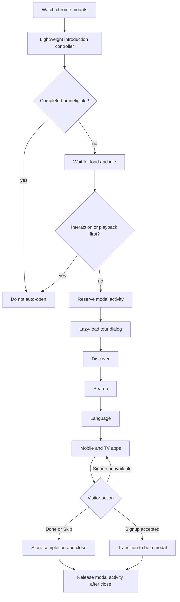
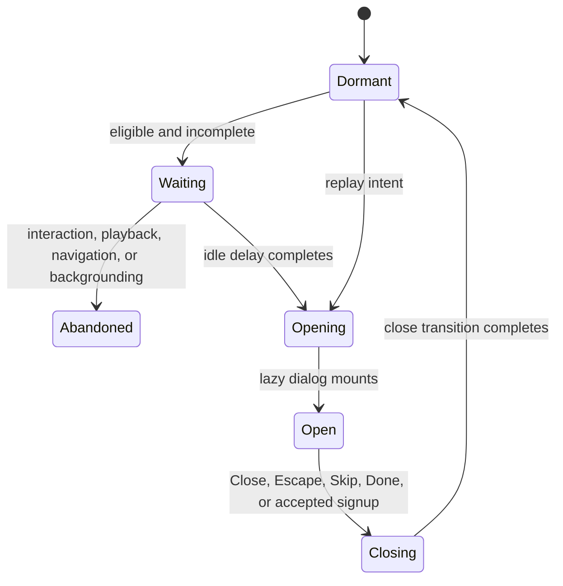

# feat: Add a first-visit Watch introduction tour

## Goal Capsule

- **Objective:** New Watch visitors can quickly understand how to discover films, search, change language, and hear when mobile and TV apps are released.
- **Means:** Add a lightweight first-visit coachmark tour that reuses Watch dialog, playback, localization, and beta-signup infrastructure. (KTD1-KTD6)
- **Authority:** The user's requested popup-guide experience and app-release signup are authoritative. Existing Watch accessibility, playback, localization, and performance contracts govern implementation details.
- **Execution profile:** Code change across the Watch shell, shared dialog coordination, beta signup handoff, footer replay, message catalogs, and focused tests.
- **Stop conditions:** Stop if the tour requires a new signup backend, weakens static Watch delivery, creates overlapping focus traps, or resumes media while another overlay remains active.
- **Tail ownership:** The implementation owner carries review, browser verification, performance evidence, pull-request creation, and CI to completion.

---

## Product Contract

### Summary

Add an optional Netflix-style introduction guide to the Watch website. The tour opens on an eligible visitor's first shallow Watch visit, explains the site's most useful discovery controls, and ends with a mobile and TV app announcement plus an optional beta-group signup for early access and availability news. Visitors can skip or finish the guide without signing up and can replay it later from stable Watch chrome.

### Problem Frame

Watch exposes discovery, search, language, and playback features across several surfaces, but a new visitor receives no concise orientation. The future mobile and TV apps also need a visible, low-friction path into the existing beta notification flow without turning the first visit into a forced conversion funnel.

### Key Decisions

- **Use a popup introduction guide.** (session-settled: user-directed — chosen over leaving discovery entirely self-guided: the user supplied popup references and asked for this interaction.) Governs R1-R6.
- **End with mobile and TV release signup.** (session-settled: user-directed — chosen over a discovery-only tour: the user wants visitors notified when those apps launch.) Governs R5-R6.
- **Choose steps from the actual Watch experience.** (session-settled: user-directed — chosen over copying the reference site's steps verbatim: the user asked for the guide to reflect this website.) Governs R2-R5.

### Requirements

#### Eligibility and control

- R1. The tour opens automatically only for an eligible first visit to the language home or experience surface in a translation-ready locale, after the initial page has settled and before the visitor has meaningfully interacted.
- R2. Visitors can close or skip the tour, move backward and forward, finish without signing up, and replay the tour later; Close and Escape are Skip equivalents.
- R3. Completion is stored as a versioned device-local preference and is written only after Close, Escape, Skip, Done, or an accepted signup handoff.

#### Tour content

- R4. The guide introduces Watch discovery, search, and viewing-language controls with concise contextual copy and a visible target treatment where a relevant control exists.
- R5. The final step announces forthcoming mobile and TV apps and offers signup to the existing beta testing group so visitors can be among the first to try them and hear when access is ready.
- R6. Signup reuses the existing beta tester modal; the tour does not embed a second form or create a new notification backend.

#### Quality and integration

- R7. The tour and its loading or error shell are keyboard-operable, labelled dialogs with trapped focus, Escape and close behavior, focus restoration, screen-reader status, reduced-motion support, forced-color support, responsive layout, and RTL-aware presentation.
- R8. Opening and closing the tour participates in the shared Watch modal-activity contract so playback stays paused until every overlapping overlay is closed.
- R9. The eligibility gate remains lightweight, while the tour UI and external signup resources stay outside the initial Watch load and load only after eligibility or user intent.
- R10. All tour strings participate in the Watch UI catalog workflow, render through the normal client-message bundles, and remain safe for wrapping on narrow and translated layouts.

### Key Flows

- **F1. First eligible visit**
  - **Trigger:** A visitor opens the language home or experience surface without a completed tour preference.
  - **Steps:** The page settles; the visitor remains idle; the tour reserves the shared overlay owner; the introduction dialog opens at the first step.
  - **Outcome:** The visitor can learn the site without media playing behind the guide.
- **F2. Tour navigation**
  - **Trigger:** The visitor uses Next, Back, close, Skip, Escape, or Done.
  - **Steps:** The active step and target treatment update deterministically; Close and Escape follow Skip semantics; every terminal action writes completion; focus returns to the correct control for the entry path.
  - **Outcome:** The flow is optional, reversible before completion, and keyboard accessible.
- **F3. Signup handoff**
  - **Trigger:** The visitor selects Join the beta group on the final step.
  - **Steps:** The existing beta provider accepts the open request; tour ownership transitions without stacked focus traps; the beta modal opens; signup resources load on intent.
  - **Outcome:** The visitor reaches the existing signup experience and Watch media remains paused throughout the overlay handoff.
- **F4. Replay**
  - **Trigger:** A visitor selects the stable Take the Watch tour control after completion.
  - **Steps:** The tour reopens at the first step without clearing the completion marker.
  - **Outcome:** The guide remains discoverable without reappearing automatically.

### Acceptance Examples

- **AE1. Eligible idle visitor**
  - **Given:** No completion marker exists and the visitor opens an eligible Watch surface.
  - **When:** The page settles and no interaction or playback begins before the delay expires.
  - **Then:** The first tour step opens and background media is paused.
- **AE2. Meaningful interaction wins**
  - **Given:** The visitor is eligible for the automatic tour.
  - **When:** They point, type, scroll, navigate, begin playback, or background the document before opening.
  - **Then:** The automatic tour is abandoned for that page visit.
- **AE3. Optional completion**
  - **Given:** The tour is open.
  - **When:** The visitor selects Close, presses Escape, selects Skip, or selects Done.
  - **Then:** The dialog closes, completion is stored, and no signup is required.
- **AE4. Accepted signup**
  - **Given:** The final app-announcement step is open and the beta provider is available.
  - **When:** The visitor selects Join the beta group.
  - **Then:** The beta modal opens, completion is stored, only one effective focus trap remains, and playback stays paused.
- **AE5. Unavailable signup owner**
  - **Given:** The final step is open but the beta provider cannot accept the handoff.
  - **When:** The visitor selects Join the beta group.
  - **Then:** The tour remains open and announces that signup is unavailable rather than falsely completing.
- **AE6. Return visit and replay**
  - **Given:** A completion marker exists.
  - **When:** The visitor returns to Watch and later selects Take the Watch tour.
  - **Then:** No automatic tour appears, but replay opens the guide at its first step.

### Success Criteria

- A cold eligible visit gives the first visible dialog owner keyboard focus. A replay exit returns to its trigger, while an automatic-tour exit preserves the pre-open focus or uses stable fixed Watch chrome without scrolling the document.
- The tour and beta iframe resources are absent from the initial route request set and are loaded only when the corresponding UI is needed.
- The complete flow works at narrow mobile width and in representative Latin, RTL, Cyrillic, and CJK catalogs without clipped copy or unreachable actions.
- Focused unit and integration tests cover eligibility, persistence, dialog navigation, modal overlap, signup handoff, replay, localization parity, and message loading.
- A task-based product check confirms that a first-time reviewer can locate Search, identify the language control, and accurately describe what the mobile and TV signup does after the tour.

### Scope Boundaries

- No new email collection endpoint, account preference, push-notification system, mobile app, or TV app is built in this change.
- Deep content routes do not interrupt visitors with an automatic tour.
- Completion is device-local and is not mixed with account-scoped playback history or progress storage.

### Deferred to Follow-Up Work

- Native review and authored translation of the newly introduced strings for catalogs that remain under the repository's pending-translation policy.
- Expansion of automatic eligibility beyond the initial English, Arabic, German, Russian, and Simplified Chinese allowlist as additional tour catalogs are approved.
- Product analytics for tour completion and signup conversion if Watch later establishes a consent-aware event contract for onboarding metrics.

---

## Planning Contract

### Key Technical Decisions

- KTD1. **Keep eligibility separate from the lazy tour UI.** A small client controller owns persisted state, route eligibility, idle timing, interaction cancellation, replay, and dynamic loading. This satisfies R1-R3 and R9.
- KTD2. **Use one durable Watch overlay owner.** The controller reserves shared modal activity synchronously and keeps ownership through the close transition. This prevents early playback resume and satisfies R8.
- KTD3. **Reuse the shared accessible dialog geometry.** The tour uses the established Watch dialog content and a non-portaled viewport close control inside the untransformed popup, rather than positioning the control outside the accessible popup tree. This satisfies R7.
- KTD4. **Use contextual highlighting without coupling eligibility to target presence.** Steps may point to search or language controls when rendered, while the centred dialog remains usable at every responsive breakpoint. This satisfies R4 and R7.
- KTD5. **Hand signup to the existing beta provider.** The provider reports whether it accepted the open request so the tour only completes on a real handoff. This satisfies R5-R6 and AE4-AE5.
- KTD6. **Follow the Watch catalog and staged-client-loading contracts.** The namespace is included only in the client bundles that render the tour, and provisional catalogs remain valid while translations are completed. This satisfies R9-R10.

### High-Level Technical Design

### Assumptions

- The existing beta tester form remains the authoritative destination. Its verified current consent says members will be among the first to try new tools and products, so the tour uses matching early-access and availability wording rather than promising a separate release campaign.
- Pending translation paths are acceptable for initial integration when catalog parity, ICU formatting, provenance, and generated-manifest checks remain green.
- The feature does not require an account and should not infer identity from device-local completion state.

### System-Wide Impact

- **Playback:** Shared modal activity must pause autoplay and preserve a pre-paused state across tour and beta overlap.
- **Accessibility:** Dialog ownership, focus trapping, focus return, Escape, target highlighting, safe areas, and animation preferences affect every responsive surface.
- **Performance:** Static Watch server output stays unchanged; only a small eligibility controller joins the client shell, and tour/signup resources remain lazy.
- **Localization:** A new client namespace is distributed through the global, home, and content bundle sets and must match every supported catalog.

### Risks & Dependencies

- A lazy fallback can strand focus on cold first open. Both the fallback and full dialog must share a bounded, cancellable focus contract, or the fallback must remain non-visible.
- A lazy import can fail after modal activity is reserved. A labelled loading and error shell must offer retry and close, and closing a failed load must release ownership without storing completion.
- A signup handoff can briefly stack dialogs. The tour must close or relinquish focus ownership before the beta dialog becomes the active trap while retaining shared playback ownership.
- Very long translations can overflow Netflix-like fixed layouts. Actions must shrink and wrap, and the mobile surface must use available viewport width.
- Runtime feature flags can accidentally hide provider-owned entry points. The global beta CTA may stay flagged, but the existing provider and authored tour handoff remain mounted.
- Signup copy can over-promise an external campaign. The tour and CTA must stay aligned with the beta form's verified early-access consent and must not claim a distinct release-notification campaign without an owned Mailchimp contract.

### Sources & Research

- `docs/solutions/ui-bugs/watch-modal-playback-coordination.md` establishes shared overlay ownership and close-transition playback rules.
- `docs/solutions/performance-issues/watch-staged-client-loading-20260611.md` and `docs/solutions/ui-bugs/watch-search-first-open-lazy-shell-autofocus.md` establish staged loading and cold-first-open focus requirements.
- `docs/solutions/ui-bugs/watch-modal-close-button-viewport-accessibility.md` establishes the accessible viewport-close pattern.
- `docs/solutions/ui-bugs/watch-mobile-language-modal-overflow-20260619.md` establishes narrow-screen translation layout constraints.
- `docs/solutions/ui-bugs/machine-translated-ui-catalog-wrong-language-validation-gap.md` establishes catalog validation limits and native-review needs.
- `docs/solutions/integration-issues/watch-runtime-feature-flag-static-route-cache.md` establishes the provider-owned beta modal and runtime flag boundary.
- The supplied Netflix reference images establish the desired dark, contextual, step-based popup interaction, not the product copy or site taxonomy.

---

## Implementation Units

### U1. First-visit lifecycle and modal coordination

- **Goal:** Add deterministic eligibility, completion persistence, replay intent, lazy loading, and shared overlay ownership.
- **Requirements:** R1-R3, R8-R9; F1-F2; AE1-AE3.
- **Dependencies:** None.
- **Files:** `apps/web/src/components/WatchChromeShell.tsx`, `apps/web/src/components/watch/WatchIntroductionProvider.tsx`, `apps/web/src/components/watch/WatchIntroductionProvider.test.tsx`, `apps/web/src/components/watch/WatchModalActivityProvider.tsx`, `apps/web/src/components/watch/WatchModalActivityProvider.test.tsx`, `apps/web/src/lib/watch-introduction-preference.ts`, `apps/web/src/lib/watch-introduction-preference.test.ts`.
- **Approach:** Mount one controller under the existing Watch providers. Keep the storage and locale-readiness gates synchronous and small. Verify both read and write capability before declaring completion storage available. Delay automatic opening until load and idle. Cancel it on meaningful activity. Reserve modal ownership before dynamic import and release it only after the close lifecycle ends. Preserve the active element for automatic entry, fall back to fixed Watch chrome without scrolling, and use the replay trigger only for replay entry. Render a recoverable accessible shell while the tour chunk loads or fails.
- **Patterns to follow:** Existing Watch modal activity tokens, staged search/language controllers, and versioned browser-local preference helpers.
- **Test scenarios:**
  - Covers AE1. An eligible incomplete idle visit opens after the settled-page delay and pauses media before the lazy dialog mounts.
  - Covers AE2. Pointer, keyboard, scroll, playback, route, and visibility activity each prevent the pending automatic open.
  - Covers AE3. Close, Escape, Skip, and Done persist completion, while mere open and intermediate navigation do not.
  - Unavailable storage and asymmetric read-success/write-failure storage both fail closed without breaking Watch.
  - A pending import shows a labelled, focus-owned loading shell; an import or render failure shows Retry and Close; Close releases modal ownership without marking completion.
  - Tour and another modal overlap without resuming playback until the final owner closes.
  - Replay opens immediately after completion and returns focus to its trigger, while automatic entry never redirects focus to the footer replay action.
- **Verification:** Focused lifecycle and modal-activity tests pass; type checking confirms the controller and shared provider contracts.

### U2. Responsive accessible coachmark dialog

- **Goal:** Build the four-step Watch introduction UI and contextual target treatment.
- **Requirements:** R2, R4-R5, R7, R9-R10; F2; AE3.
- **Dependencies:** U1.
- **Files:** `apps/web/src/components/watch/WatchIntroductionTour.tsx`, `apps/web/src/components/watch/WatchIntroductionTour.test.tsx`, `apps/web/src/components/watch/WatchModalViewportCloseButton.tsx`, `apps/web/src/components/watch/WatchModalViewportCloseButton.test.tsx`, `apps/web/messages/en.json`, `apps/web/src/i18n/client-messages.ts`.
- **Approach:** Use the shared Base UI dialog content and viewport close control. Keep one centred responsive card across all steps. Resolve optional search and language targets from stable data attributes. Provide Skip, Back, Next, Done, progress announcement, and close semantics with RTL-aware positioning.
- **Patterns to follow:** Existing Watch modal shell, button styles, message namespaces, and responsive language/search dialogs.
- **Test scenarios:**
  - The first step labels the dialog and exposes step progress to assistive technology.
  - Next and Back visit the four steps in order; Back is unavailable on the first step; Done appears on the last step.
  - Close remains a descendant of the active dialog, is not aria-hidden, receives initial focus, and retains safe-area-aware viewport geometry.
  - Close, Escape, Skip, and Done invoke the intended terminal callback once.
  - Search and language steps highlight available controls without making missing targets block navigation.
  - Narrow, RTL, reduced-motion, and forced-color modes retain readable copy and reachable actions.
  - Cold first open focuses the visible dialog owner and final exit restores focus.
- **Verification:** Dialog tests, accessibility assertions, lint, type checking, and browser checks at desktop and narrow widths pass.

### U3. Beta signup handoff and replay entry point

- **Goal:** Connect the final step to the existing beta modal and add a durable way to replay the tour.
- **Requirements:** R2, R5-R6, R8-R9; F3-F4; AE4-AE6.
- **Dependencies:** U1, U2.
- **Files:** `apps/web/src/components/watch/BetaTesterModalProvider.tsx`, `apps/web/src/components/watch/BetaTesterModalProvider.test.tsx`, `apps/web/src/components/watch/WatchIntroductionProvider.tsx`, `apps/web/src/components/watch/WatchIntroductionProvider.test.tsx`, `apps/web/src/components/watch/WatchIntroductionReplayButton.tsx`, `apps/web/src/components/watch/WatchIntroductionReplayButton.test.tsx`, `apps/web/src/components/home/WatchHomeFooter.tsx`, `apps/web/src/components/home/__tests__/WatchHomeFooter.test.tsx`, `apps/web/src/components/home/WatchHomePage.tsx`, `apps/web/src/components/home/__tests__/WatchHomePage.test.tsx`, `apps/web/src/components/home/WatchHomeExperiencePage.tsx`, `apps/web/src/components/home/WatchHomeExperiencePage.test.tsx`.
- **Approach:** Let the beta provider return synchronous acceptance for an open request. Persist tour completion only after acceptance. Keep shared playback ownership across the handoff. Add an opt-in footer replay action on eligible home and experience surfaces without changing unrelated footer callers.
- **Patterns to follow:** Existing provider-owned beta modal, feature-flagged global beta CTA, and Watch footer composition.
- **Test scenarios:**
  - Covers AE4. An accepted signup request closes the tour, opens the beta modal, stores completion, and preserves paused media.
  - Covers AE5. A rejected or unavailable request leaves the final step open and announces an actionable status.
  - Repeated same-tick signup requests create one beta dialog.
  - Feature-flag-disabled global CTA does not disable the authored tour handoff.
  - Covers AE6. Eligible footers render replay and unrelated footer surfaces do not.
  - Closing and reopening the beta modal resets its iframe lifecycle and focus correctly.
- **Verification:** Provider, tour, lifecycle, footer, and home-page integration tests pass; browser QA proves there is no persistent focus-trap stack.

### U4. Catalog integration and release verification

- **Goal:** Make the tour safe across supported Watch locales and prove it does not regress startup behavior.
- **Requirements:** R9-R10; all acceptance examples.
- **Dependencies:** U2, U3.
- **Files:** `apps/web/messages/*.json`, `apps/web/scripts/ui-translation-policy.json`, `apps/web/src/i18n/client-messages.test.ts`, `docs/i18n/watch-ui-provisional-catalogs.json`.
- **Approach:** Add exact key parity for the new namespace. Author representative Arabic, German, Russian, and Simplified Chinese catalogs for layout and formatting QA. Gate automatic tour and replay availability to English and those four authored catalogs. Track the remaining source-identical strings through the established pending-translation policy and refresh provisional provenance. Verify the initial route excludes the tour dialog and beta iframe resources, and compare cold-load performance against the target branch.
- **Patterns to follow:** Watch UI message parity, ICU formatting tests, pending-translation policy, and provisional catalog generator.
- **Test scenarios:**
  - Every supported catalog has the exact English key set and formats progress ICU parameters through `next-intl`.
  - Global, home, and content client bundles contain the tour namespace while unrelated bundles do not gain it accidentally.
  - A pending locale does not auto-open the tour or show a source-English replay control; an authored locale remains eligible.
  - Provisional catalog inventory, source digest, and generated-manifest checks stay current.
  - Representative Latin, RTL, Cyrillic, and CJK content wraps without horizontal overflow at 390 CSS pixels.
  - A cold initial Watch load does not request the tour dialog chunk or beta iframe; first eligible open loads only the tour chunk; signup intent then loads beta resources.
  - Same-route, same-viewport before-and-after cold traces report transferred JavaScript, request count, long tasks, LCP or load timing, and numeric CLS through the first-open mount window.
- **Verification:** Catalog parity, client-message, provisional-manifest, formatting, focused UI, lint, type-check, build, resource-timing, and browser accessibility checks pass, with any environment-only exception documented in the PR.

---

## Verification Contract

| Gate                                                                                                                                                        | Applies to | Done signal                                                                                                                                                                                                           |
| ----------------------------------------------------------------------------------------------------------------------------------------------------------- | ---------- | --------------------------------------------------------------------------------------------------------------------------------------------------------------------------------------------------------------------- |
| Focused Vitest suites for preference, modal activity, introduction provider, dialog, beta provider, footer, home pages, client messages, and catalog policy | U1-U4      | All feature-owned assertions pass with no unexpected warnings.                                                                                                                                                        |
| `apps/web` TypeScript no-emit check                                                                                                                         | U1-U4      | No type errors.                                                                                                                                                                                                       |
| ESLint on changed TypeScript and TSX files                                                                                                                  | U1-U4      | No lint errors or warnings introduced by the feature.                                                                                                                                                                 |
| Prettier check on changed catalogs, policy, manifest, and message tests                                                                                     | U4         | All files match repository formatting.                                                                                                                                                                                |
| UI locale generator and provisional catalog checks                                                                                                          | U4         | Generated artifacts and provenance are current.                                                                                                                                                                       |
| Next production build                                                                                                                                       | U1-U4      | Build completes in a normal dependency layout; an isolated-worktree symlink limitation is not accepted as product proof.                                                                                              |
| Browser flow at desktop and 390-pixel mobile widths                                                                                                         | U1-U4      | First-open, navigation, skip, done, signup, replay, Escape, focus restoration, RTL, and overlapping-modal scenarios behave as specified.                                                                              |
| Initial-load and first-open performance comparison                                                                                                          | U1-U4      | Same-route cold traces record before-and-after JavaScript bytes, request count, long tasks, LCP or load timing, and a numeric `PerformanceObserver` CLS value; tour and beta resources remain absent at initial load. |
| Signup destination contract check                                                                                                                           | U3-U4      | The final-step promise matches the authoritative beta form's consent and does not claim a distinct notification campaign.                                                                                             |

---

## Definition of Done

- R1-R10 and AE1-AE6 are implemented with no launch-blocking open question.
- U1-U4 verification outcomes are satisfied and focused automated coverage is green.
- The tour is optional, replayable, localized through repository policy, and does not add a new signup backend.
- Playback, focus, responsive layout, reduced motion, forced colors, and RTL behavior are verified in a real browser.
- Initial-load performance evidence shows the tour and signup surfaces remain lazy.
- Dead-end implementations, debug instrumentation, temporary dependency links, and unrelated generated changes are absent from the final diff.
- The branch is rebased on the current target branch, reviewed, pushed, and represented by a merge-ready pull request with passing required checks or documented infrastructure exceptions.
