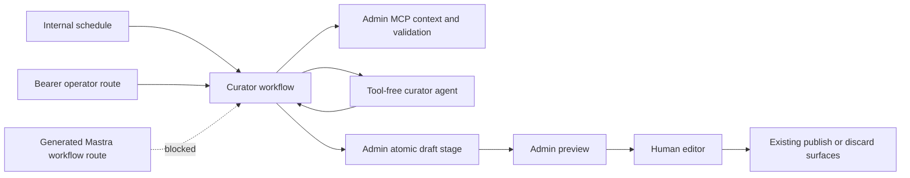
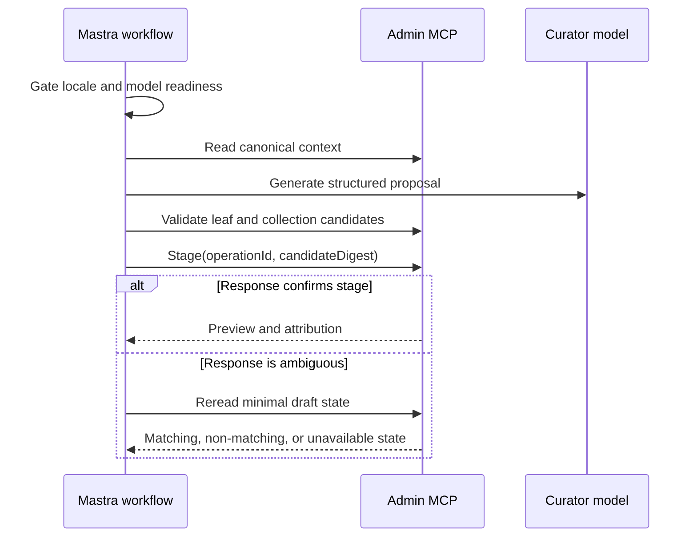
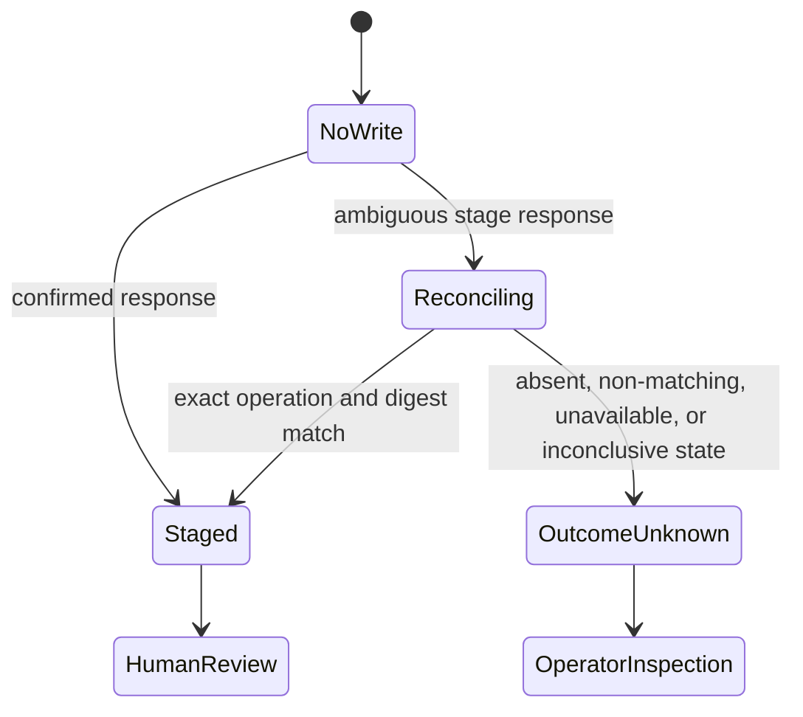

# Storefront Curator Hardening - Plan

## Goal Capsule

**Objective:** Storefront editors can receive a useful, evidence-backed English homepage draft each week without exposing Admin credentials, overwriting human work, or publishing automatically.

**Means:** Harden the existing Mastra curator and Admin MCP boundary, then expose one protected operator path while keeping scheduled staging default-off. (KTD1-KTD11)

**Authority hierarchy:** This plan governs the current PR. The feature ticket and repository guides govern broader product and repository behavior. Existing Admin Experience authorization and publication rules remain authoritative.

**Stop conditions:** Stop before activation if the OAuth client can publish, native Mastra routes can stage a curator draft, a context read can mutate draft state, or a lost stage response cannot be classified safely.

**Execution profile:** Code changes across Admin, Mastra, tests, and operator documentation. No production deployment is part of this plan.

**Tail owner:** The LFG pipeline owns implementation, review, documentation, PR creation, and merge-readiness monitoring.

## Product Contract

### Summary

The Storefront Curator reviews the current homepage, the exact playable catalog for a target language, recent releases and translations, and nearby Christian calendar moments. It proposes a small set of curator-owned homepage sections. The workflow validates the proposal and may create an Admin preview draft for a human editor. It never publishes.

### Problem Frame

The current implementation proves the curation flow but leaves unsafe edges at the Admin and Mastra boundaries. A read can mint preview access, a registered tool can expose the Admin bearer, and a lost response can hide a committed draft. Collection evidence also cannot pass the current item-level media validator reliably.

### Key Decisions

- **Start with a weekly English workflow.** This limits editorial and operational risk before multilingual rollout. Governs R1, R2, R14, R20, R21. (session-settled: user-approved — chosen over daily multilingual activation: a deliberate first locale is easier to review and tune.)
- **Stage for human review and never publish.** This protects the live homepage and preserves editorial authority. Governs R9, R10, R15. (session-settled: user-approved — chosen over automatic publication: homepage changes need a human preview gate.)
- **Preserve human-authored sections.** The curator owns only prefixed sections and must not rewrite the full homepage. Governs R7, R8. (session-settled: user-approved — chosen over whole-homepage replacement: human editorial work must survive each run.)
- **Let the model propose and deterministic code decide whether to write.** This keeps mutation rules outside model control. Governs R5, R6, R9. (session-settled: user-approved — chosen over model-controlled mutation: deterministic validation provides an auditable safety boundary.)

### Actors

- A1. The Storefront Curator agent proposes localized editorial sections from bounded evidence.
- A2. The Mastra workflow validates inputs, evidence, model output, and stage outcomes.
- A3. Admin MCP authorizes reads and owns the atomic draft write.
- A4. A human editor reviews the preview and alone decides whether to publish or discard it.

### Requirements

#### Evidence and proposal

- R1. A run accepts only an explicitly enabled locale, with `en` as the default enabled set, before it calls Admin or a model.
- R2. English curation considers the current date, recent catalog additions, translations, exact target-language playability, and nearby Christian calendar moments.
- R3. Context reads return bounded canonical homepage evidence and minimal draft-existence metadata without creating a preview token or returning a preview capability.
- R4. Playable collections are valid candidates when their children satisfy the target-language inventory contract, even if the collection parent has no direct dub.
- R5. The model receives untrusted bounded evidence and returns only the structured curation decision schema.
- R6. Every proposed item is checked against authoritative Admin evidence before any stage attempt.

#### Homepage ownership and draft lifecycle

- R7. A run replaces only sections whose `sectionKey` starts with `storefront-curator-`.
- R8. Replacement retains the position of the first existing curator section; the first curator insertion appends after human sections.
- R9. Stage mode creates at most one AI-attributed shared draft when the canonical digest still matches and no active draft exists.
- R10. Publication, discard, overwrite of an active draft, and deployment remain unavailable to the agent and workflow.
- R11. A stage attempt carries an operation identifier and candidate digest that Admin records in draft attribution.
- R12. After an ambiguous stage failure, the workflow rereads minimal draft state and reports `staged` only for an exact operation and digest match; every absent, non-matching, unavailable, or inconclusive reread reports `stage_outcome_unknown`.

#### Runtime and operations

- R13. The curator agent is absent from Mastra's generated agent and tool registries, and native storefront workflow routes cannot expose runs or start mutations.
- R14. Manual curator execution uses a service-bearer route; an independent schedule-enable flag remains default-off until credentials, model readiness, and review ownership are verified.
- R15. The Admin OAuth token uses only the curator's required read, validate, and draft-stage scopes; activation records the actual issued scope set and stops if it includes `experience:publish`.
- R16. OAuth and MCP response-body timeouts remain typed as retryable timeouts, including aborts during streaming reads, and follow KTD7's operation-specific retry policy; OAuth refresh itself is a single-attempt credential mutation.
- R17. Runs fail readiness before Admin reads when the configured model provider lacks required credentials.
- R18. Each terminal result separates candidate difference from confirmed draft staging and distinguishes `no_change`, `no_write`, `staged`, and `stage_outcome_unknown` for operator action.
- R19. The operator route uses a dedicated curator bearer allowlist that cannot overlap the shared Mastra service-key pool.
- R20. Scheduled staging requires three consecutive English dry-run proposals approved by a named editor for relevance, freshness, evidence fidelity, and copy quality.
- R21. Schedule activation names the responsible editor and review channel; every terminal result is reviewed there, and any active draft is resolved or explicitly escalated before the next weekly run.

### Key Flows

- F1. **No-write curation:** validate locale and readiness -> read context -> refuse an active draft -> ask the model -> validate proposal -> return dry-run or no-change. Covers R1-R6, R10, R17.
- F2. **Confirmed stage:** perform F1 through validated proposal generation without its terminal return -> compute candidate and attribution digests -> stage atomically -> receive the draft attribution and preview in the stage response -> report staged. Covers R7-R12.
- F3. **Ambiguous stage:** stage request loses its response -> reread minimal draft state -> report staged on an exact operation and digest match, otherwise report `stage_outcome_unknown`. Covers R11, R12, R18.
- F4. **Human publication:** operator opens the preview -> human reviews -> human publishes or discards through existing Admin surfaces. Covers R10, R15.

### Acceptance Examples

- AE1. Given locale `fr` while only `en` is enabled, the run returns `locale_disabled` without an Admin or model call. Covers R1.
- AE2. Given a collection parent without direct media whose child is playable in English, the proposal validator accepts the collection. Covers R4, R6.
- AE3. Given human blocks around two curator blocks, the replacement preserves all human blocks and inserts the new curator set at the first old curator position. Covers R7, R8.
- AE4. Given Admin commits a draft and the stage response is lost, reconciliation finds the matching attribution, reports staged, and obtains the preview only through the authenticated review path. Covers R11, R12.
- AE5. Given a lost response followed by an absent, non-matching, or unavailable draft read, the run reports `stage_outcome_unknown` with the operation identifier and never claims no write occurred. Covers R12, R18.
- AE6. Given a streamed response aborts after headers, the client returns typed `timeout`; safe reads retry once, while OAuth refresh and other mutations remain single-attempt. Covers R16.
- AE7. Given a direct call to Mastra's generated agent, tool, or workflow APIs, no curator agent, run output, Admin bearer, or storefront mutation is available. Covers R13.
- AE8. Given three consecutive representative English dry runs, the named editor records a pass on every quality criterion before the schedule can be enabled. Covers R20.
- AE9. Given an active draft or unknown stage outcome, the named owner receives the result and resolves or escalates it before the next scheduled run; automation never discards it. Covers R10, R21.

### Success Criteria

- Focused tests prove all acceptance examples and the existing active-draft, canonical-race, no-change, preview-failure, and output-schema paths.
- Admin and Mastra typecheck, lint, and focused tests pass.
- The runbook lets an operator provision least-privilege access, perform a dry run, stage, reconcile an unknown outcome, review, and roll back without source-code knowledge.
- Three consecutive English proposals pass the documented editorial rubric before scheduled staging is enabled.
- A named editor and existing review channel own every weekly result and draft disposition.

### Scope Boundaries

#### In scope

- English manual and default-off weekly curation.
- Locale-generic contracts that are gated by an explicit allowlist.
- New videos, translations, playable collections, language features, and seasonal Christian moments.
- Draft staging and preview for human review.

#### Deferred to Follow-Up Work

- Russian, Spanish, French, and other locale schedules after native-language editorial quality gates exist.
- Locale-specific calendars such as Orthodox Easter and regional observances.
- Adaptive or daily cadence and durable run analytics.
- Durable OAuth refresh-token coordination beyond the current single-runtime model.

#### Outside this product's identity

- Automatic publication or discard.
- Replacement of human-owned homepage sections.
- Credential approval or production deployment by the curator.

## Planning Contract

### Key Technical Decisions

- KTD1. Keep Admin as the persistence and authorization owner; Mastra owns model orchestration and uses local validated HTTP contracts instead of cross-app imports.
- KTD2. Replace the context call's draft-state helper with a purpose-built read-only query that selects canonical content and minimal draft attribution without preview fields.
- KTD3. Keep the curator as a private Mastra `Agent` used by the workflow, with no tools and no generated-agent registration; the workflow supplies evidence and forces no tool calls during structured generation. This implements R13. (session-settled: user-approved — chosen over a credentialed registered agent: generated Mastra agent and tool routes are not code-authenticated.)
- KTD4. Generalize the native route guard to deny every generated storefront workflow route and add a manual operator route protected by a dedicated, non-overlapping curator bearer pool. This implements R13-R14 and R19.
- KTD5. Attribute staging with a random operation ID and an Admin-recomputed SHA-256 candidate digest, and return draft attribution plus preview in the atomic stage response. Reconcile ambiguous transport and server failures through read-only context without treating a non-match as proof of no write. This implements R11-R12.
- KTD6. Treat a collection as playable through the Admin Watch Language Inventory's collection bucket, while leaf videos continue through direct media checks. This implements R4-R6.
- KTD7. Reuse the repository's capped-reader result-union convention and rethrow abort-like body-read errors for classification at both OAuth and MCP call sites. Read-only Admin calls allow two total attempts with bounded backoff. OAuth refresh is a single-attempt credential mutation because a lost successful response may have rotated the token; a dispatched stage write is likewise never retried automatically and enters KTD5 reconciliation. This implements R16.
- KTD8. Enforce the locale allowlist and known OpenAI, OpenRouter, and Google credential readiness before the first Admin read. Unknown custom provider formats may defer to their runtime adapter, but every repository-supported provider must fail closed when its credential is absent.
- KTD9. Preserve the first prior curator slot when replacing curator blocks; append on first insertion. This implements R7-R8.
- KTD10. Separate `STOREFRONT_CURATOR_SCHEDULE_ENABLED` from the workflow's off/dry-run/stage mode so manual staging cannot arm the weekly schedule. This implements R14.
- KTD11. Keep editorial acceptance and weekly disposition as explicit activation gates in the runbook, backed by stored workflow results and the team's existing review channel; do not add an automatic discard or a new notification platform in this PR. This implements R20-R21.

### High-Level Technical Design

The diagrams show constraints and state transitions. They do not prescribe exact function signatures.







### System-Wide Impact

- Admin MCP metadata, dispatch, service authorization, and tests must remain in parity.
- Mastra's generated API exposure is a security boundary even when Railway and Cloudflare also restrict network reachability.
- The shared Experience draft lifecycle remains unchanged for human editors and other automation.
- Run result enums and runbook instructions must change together so monitoring does not misclassify an ambiguous commit.

### Retry and Outcome Policy

| Operation                                  | Maximum attempts | Terminal handling                                                                                 |
| ------------------------------------------ | ---------------: | ------------------------------------------------------------------------------------------------- |
| OAuth token refresh                        |                1 | Return the typed failure; a lost response makes credential state operationally unknown.           |
| Context, validation, media, reconciliation |                2 | Retry only typed retryable failures with bounded backoff.                                         |
| Model generation                           |                1 | Return `agent_unavailable` or `invalid_decision`; never mutate.                                   |
| Stage write                                |                1 | On an ambiguous response, reconcile with the same operation ID and digest; never resend blindly.  |
| Preview in a confirmed stage response      |                1 | The draft remains `staged`; a missing preview URL directs the operator to the active Admin draft. |

### Assumptions

- The first rollout enables only the `en` language slug. This is an implementation assumption, not a guarantee that BCP-47 tags uniquely identify future languages.
- The protected operator route can reuse the existing Mastra service-key pattern.
- Protected, bounded workflow-run inspection plus existing runtime logs are sufficient for the first weekly rollout; a new durable audit table is deferred.
- The default model remains an OpenAI model for this PR, so `OPENAI_API_KEY` is the required preflight credential.
- The unrelated modified draft-gateway solution document remains outside this PR; a dedicated storefront solution document captures this work.

### Risks and Dependencies

- The production OAuth application's default scopes include publication. Provisioning must request the exact narrow set and verify the issued token claims.
- Language BCP-47 values are not unique identity keys. Future locale enablement needs an explicit language mapping or ambiguity refusal.
- A draft may be committed immediately before a network failure. The outcome must stay unknown until exact attribution is observed.
- The model provider and Admin MCP are external runtime dependencies. Readiness and typed failures must prevent misleading results.

## Implementation Units

### U1. Make Admin context truly read-only and minimal

**Goal:** Provide canonical storefront evidence and safe reconciliation metadata without mutating a revision or exposing preview access.

**Requirements:** R2-R3, R11-R12.

**Dependencies:** None.

**Files:** `apps/admin/src/services/experience-locale-mcp.service.ts`, `apps/admin/src/services/experience-locale-mcp.service.test.ts`, `apps/admin/src/services/experience.service.ts` if a shared read primitive is justified.

**Approach:** Replace the `getLocaleDraftState` use in storefront context with a narrow Prisma read under the existing authorization boundary. Return canonical blocks, digest, `hasDraft`, and only the draft attribution needed by KTD5.

**Test scenarios:**

- A context read with a draft whose preview token is null performs no update and returns no preview URL, token, or effective draft body.
- A context read without a draft returns the canonical digest and `hasDraft: false`.
- An unauthorized locale read remains forbidden through the service layer.

**Verification:** Run the focused Admin experience-locale MCP service tests.

### U2. Make stage attribution and outcome reconciliation exact

**Goal:** Distinguish confirmed stage, definite no-write, and unknown stage outcomes after transport failures.

**Requirements:** R9-R12, R18.

**Dependencies:** U1.

**Files:** `apps/admin/src/services/experience-locale-mcp.service.ts`, `apps/admin/src/services/experience-locale-mcp.service.test.ts`, `apps/admin/src/mcp/admin-mcp-tools.ts`, `apps/admin/src/app/mcp/route.test.ts`, `apps/mastra/src/mastra/workflows/storefront-homepage-curation.ts`, `apps/mastra/src/mastra/workflows/storefront-homepage-curation.test.ts`.

**Approach:** Extend the stage schema and attribution under KTD5. Reconcile only failures where a server commit is possible. Return an operation ID for operator inspection when state remains unknown.

**Test scenarios:**

- A normal stage records the operation and digest and returns a preview.
- A committed stage with a lost response reconciles to staged.
- A failed stage followed by an absent or non-matching read reports `stage_outcome_unknown`.
- A failed stage followed by an unavailable context reports `stage_outcome_unknown` and never reports `changed: true`.
- Active drafts and canonical digest races remain refused atomically.

**Verification:** Run focused Admin service/route tests and Mastra workflow tests.

### U3. Validate playable collections and preserve section placement

**Goal:** Let valid collection candidates survive deterministic validation while preserving human section order.

**Requirements:** R4, R6-R8.

**Dependencies:** U1.

**Files:** `apps/admin/src/services/experience-locale-mcp.service.ts`, `apps/admin/src/services/experience-locale-mcp.service.test.ts`, `apps/mastra/src/mastra/agents/storefront-curator-agent.ts`, `apps/mastra/src/mastra/workflows/storefront-homepage-curation.ts`, `apps/mastra/src/mastra/workflows/storefront-homepage-curation.test.ts`.

**Approach:** Apply KTD6 to distinguish collection inventory from leaf media validation. Apply KTD9 when composing the candidate block list.

**Test scenarios:**

- A collection with playable target-language children and no direct parent dub is accepted.
- A collection absent from the target-language inventory is rejected.
- Leaf video language checks retain their current exact-edition behavior.
- Replacement keeps all human blocks byte-for-byte and uses the first old curator position.
- First insertion appends curator blocks after human blocks.

**Verification:** Run focused Admin media tests and Mastra workflow tests.

### U4. Harden the Mastra client, readiness, and locale gate

**Goal:** Fail safely before privileged reads and preserve retryable timeout semantics.

**Requirements:** R1, R14-R17.

**Dependencies:** None.

**Files:** `apps/mastra/src/config/env.ts`, `apps/mastra/.env.example`, `apps/mastra/src/services/storefront-admin-mcp-client.ts`, `apps/mastra/src/services/storefront-admin-mcp-client.test.ts`, `apps/mastra/src/mastra/workflows/storefront-homepage-curation.ts`, `apps/mastra/src/mastra/workflows/storefront-homepage-curation.test.ts`.

**Approach:** Add the locale allowlist and readiness preflight under KTD8, and the independent schedule gate under KTD10. Apply KTD7 at both response-body call sites without weakening byte caps, no-throw result unions, or secret redaction.

**Test scenarios:**

- Disabled locales return before Admin and model dependencies are invoked.
- A missing default OpenAI key returns a readiness reason before Admin is read.
- An OAuth body abort and an MCP body abort each return typed timeout; OAuth remains single-attempt while the safe MCP read retries once.
- A manual stage mode does not enable the weekly schedule while the schedule flag is false.
- Oversized and malformed bodies retain their existing typed failures without leaking content.

**Verification:** Run the focused Mastra client and workflow tests.

### U5. Contain Mastra native exposure and add the operator route

**Goal:** Ensure only internal schedules and authenticated operators can start credentialed curation.

**Requirements:** R5, R10, R13-R15, R19.

**Dependencies:** U2, U4.

**Files:** `apps/mastra/src/mastra/agents/storefront-curator-agent.ts`, `apps/mastra/src/mastra/agents/storefront-curator-agent.test.ts`, `apps/mastra/src/mastra/workflows/storefront-homepage-curation.ts`, `apps/mastra/src/mastra/index.ts`, `apps/mastra/src/mastra/devotional-native-route-guard.ts`, `apps/mastra/src/mastra/devotional-native-route-guard.test.ts`, adjacent Mastra API-route tests, `apps/mastra/src/config/env.ts`, `apps/mastra/CLAUDE.md`.

**Approach:** Remove the registered agent and tool under KTD3, then invoke the private agent directly from the workflow while retaining dependency injection for tests. Extend the native route guard and register the dedicated-bearer route under KTD4. Keep gateway and Railway containment documented as defense in depth.

**Test scenarios:**

- The curator agent and its Admin tool are absent from Mastra's generated registries.
- A positive control proves the registry test can observe a deliberately registered safe tool.
- Native storefront workflow read, start, and resume routes are blocked.
- The operator route rejects missing, invalid, and shared-pool bearers and starts a valid English run only with the curator bearer.
- The agent's structured generation path receives workflow evidence with tool choice disabled.

**Verification:** Run focused Mastra agent, API, and workflow tests.

### U6. Align operations, roadmap, and durable learnings

**Goal:** Give operators an accurate activation and recovery procedure and preserve the reusable engineering lessons.

**Requirements:** R14-R15, R18, R20-R21.

**Dependencies:** U1-U5.

**Files:** `docs/runbooks/storefront-curator-agent.md`, `docs/roadmap/topic-experiences/feat-406-storefront-curator-agent.md`, `docs/solutions/` in the appropriate category, `apps/admin/CLAUDE.md`, `apps/mastra/CLAUDE.md`.

**Approach:** Update the runbook for the protected route, exact narrow scopes, actual issued-scope verification, model readiness, locale allowlist, unknown-outcome inspection, the English quality pilot, and the named weekly disposition loop under KTD11. Add a dedicated solution document for the generalizable safety pattern. Do not absorb unrelated dirty documentation.

**Test scenarios:**

- The documented OAuth scope list excludes publish and includes every advertised tool requirement.
- The activation record captures the token's actual issued scopes and refuses activation when publish is present.
- The activation checklist keeps stage mode and schedule disabled until dry-run evidence and human ownership are confirmed.
- Failure guidance does not claim no write after an ambiguous response.
- Three consecutive English dry runs have recorded rubric results, and a named owner/channel handles every later terminal result before the next run.

**Verification:** Check documentation links, frontmatter conventions, and diff whitespace.

## Verification Contract

Run the narrowest focused gates first, then the package gates for the touched scope:

```bash
pnpm --filter @forge/admin exec vitest run src/services/experience-locale-mcp.service.test.ts src/app/mcp/route.test.ts
pnpm --filter @forge/mastra exec vitest run src/services/storefront-admin-mcp-client.test.ts src/mastra/agents/storefront-curator-agent.test.ts src/mastra/workflows/storefront-homepage-curation.test.ts src/mastra/devotional-native-route-guard.test.ts
pnpm --filter @forge/admin typecheck
pnpm --filter @forge/mastra typecheck
pnpm --filter @forge/admin lint
pnpm --filter @forge/mastra lint
git diff --check
```

If package scripts require a different repository-supported invocation, use that invocation and record the exact successful command in the PR. Run any adjacent Mastra index tests that cover native route guards and registered API routes.

Browser testing is not applicable because this PR changes no user-facing page. The Admin preview URL remains the existing human review surface; do not create or publish a production draft for QA.

## Definition of Done

- U1-U6 satisfy their stated requirements and test scenarios.
- The Admin context path is read-only and contains no preview capability.
- Collection candidates use exact playable-language evidence.
- Ambiguous stage commits reconcile or remain explicitly unknown.
- The curator agent is private and tool-free, and all native storefront workflow routes are blocked.
- Manual execution is bearer-protected and the scheduled workflow remains default-off with English as the only default-enabled locale.
- The OAuth provisioning guide excludes publication scope.
- The English pilot and weekly disposition gates are documented with recorded evidence, an owner, and a review channel.
- Focused tests, typechecks, lints, and whitespace checks pass, or any unrelated environment-only failure is isolated and documented.
- The roadmap ticket, runbook, package guides, and a dedicated compound solution are accurate.
- No abandoned experiment, generated artifact, secret, unrelated dirty file, or production deployment is included.
- The work is committed on a `codex/` branch, pushed, opened as a PR, and monitored until CI and review are merge-ready.
