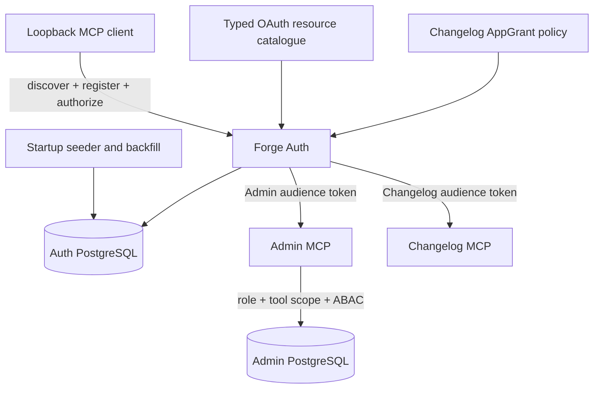
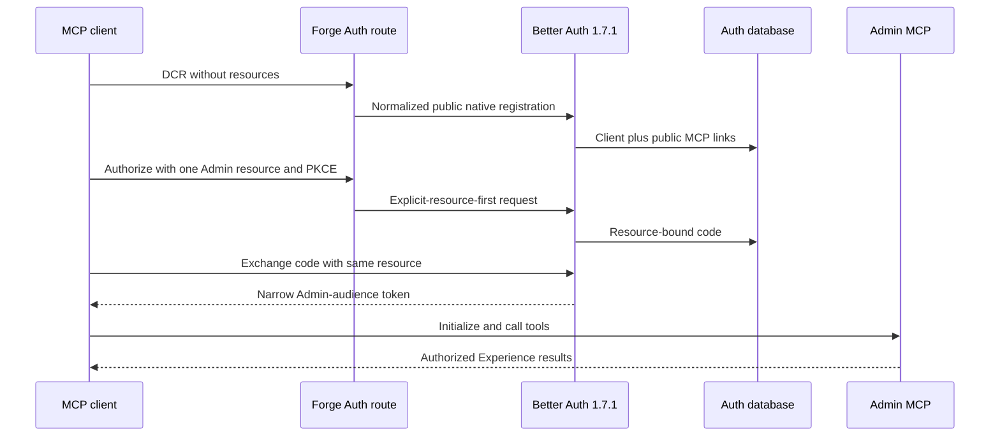
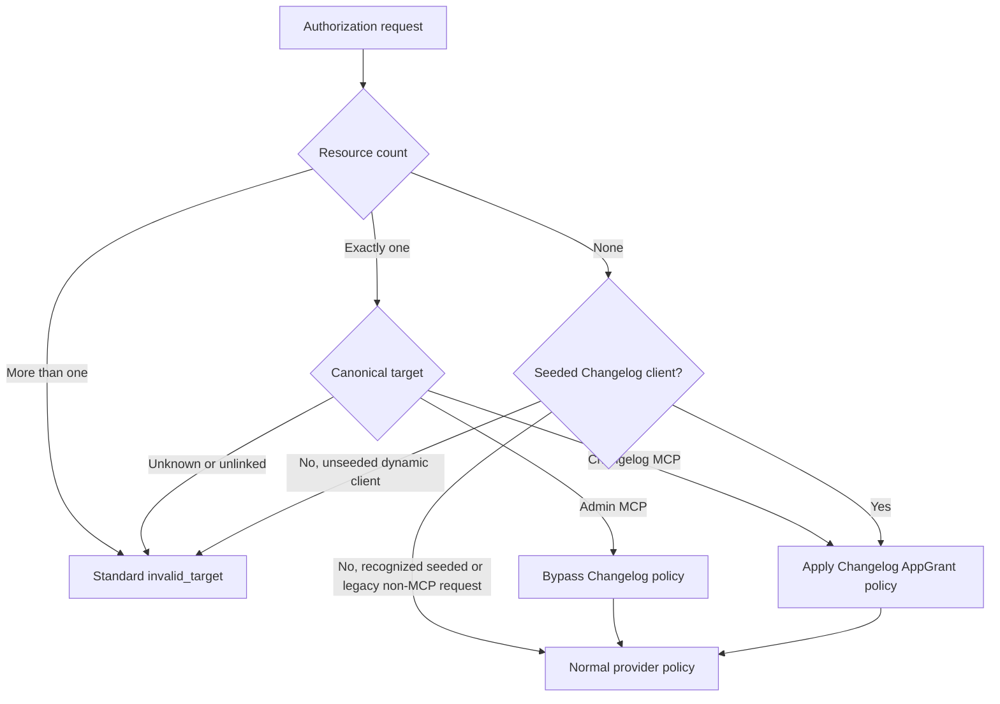

# Admin MCP OAuth Resource Binding - Plan

## Goal Capsule

- **Objective:** An authorized Forge editor can connect a standards-based loopback OAuth client to Forge Admin MCP and create or update an unpublished Experience draft without being diverted into Changelog authorization.
- **Means:** Define resource-specific OAuth policy, make public MCP resources the server-owned dynamic-registration defaults, classify authorization and signed app claims by explicit resource, backfill eligible loopback clients, and prove the real provider flow. (KTD1-KTD12)
- **Authority:** Forge Auth owns client registration, grant, resource, scope, and token issuance. Admin MCP owns token consumption, Admin role checks, tool scopes, and Experience authorization. Changelog keeps its existing AppGrant policy.
- **Stop conditions:** Stop if the implementation branch does not contain merged commits `6aa88d09b`, `74fce10a4`, and `6add1aeac`; if Better Auth 1.7.1 cannot prove resource binding through a real database; or if the fix requires a second token issuer or a WordPress change.
- **Execution profile:** Implement and verify on a branch based on current `main`. Deployment follows the normal PR-to-main path. Never invoke `experience.locale.publish` for the requested carousel.
- **Tail ownership:** After Auth and Admin deploy from the same merged revision, a production operator verifies a clean MCP registration, creates the homepage carousel as an active Forge Experience draft, validates it, and returns its secret-bearing preview URL only through the approved private review channel.

---

## Product Contract

### Summary

Forge will restore dynamic OAuth access to Admin MCP for Codex and compatible public loopback clients. The fix will bind each client to the public MCP resource set, restrict each known resource to its own scopes, preserve Changelog grants, repair eligible registrations, and finish with an unpublished homepage carousel draft in Forge Admin.

### Problem Frame

The Better Auth 1.7.1 resource upgrade introduced native client-resource links. The later Changelog change made the two Changelog resources the only dynamic-registration defaults. Codex registers a public loopback client without a `resources` field, so the provider creates Changelog links but no Admin MCP link. Authorization against `https://admin.jesusfilm.org/mcp` then fails with `invalid_target`.

The same configuration gives every protected resource the global Auth scope catalogue. A broad scope request can therefore contain Changelog scopes while targeting Admin MCP, and the route-level classifier can divert that request into Changelog policy before Better Auth evaluates the explicit resource. The failure is in Forge Auth. No WordPress or JesusFilm.org content change has occurred.

### Key Decisions

- **Forge Admin is the only content system in scope.** (session-settled: user-directed — chosen over WordPress because the requested homepage is managed as a Forge Experience.) Governs R1, R12-R14.
- **The carousel remains a draft.** (session-settled: user-directed — chosen over publishing because the user requested a reviewable draft.) Governs R13-R14.
- **Compatible existing loopback clients are repaired automatically.** (session-settled: user-approved — chosen over asking every engineer to delete and re-register because the affected rows can be identified and updated additively.) Governs R9-R11.
- **The fix follows OAuth resource semantics, not Codex identity.** (session-settled: user-approved — chosen over user-agent or client-name matching so other standards-compliant public PKCE clients receive the same behavior.) Governs R1-R4, R9.
- **Changelog remains isolated.** (session-settled: user-approved — chosen over weakening or removing Changelog grant enforcement because the regression is resource selection, not grant policy.) Governs R5-R8.

### Actors

- A1. **Engineer:** Connects a local MCP client, completes browser authorization, and reviews the resulting Experience preview.
- A2. **Loopback MCP client:** Uses dynamic client registration, Authorization Code with PKCE, an HTTP loopback redirect, and the canonical Admin MCP resource.
- A3. **Forge Auth:** Registers and links the client, evaluates resource and scope policy, and issues resource-bound tokens.
- A4. **Admin MCP:** Validates the token and Admin principal before dispatching Experience tools.
- A5. **Changelog client:** Continues to use its canonical resource and grant-aware authorization path.

### Requirements

**Dynamic registration and authorization**

- R1. A public native loopback client that omits `resources` during dynamic registration receives links to the complete public MCP resource set, including `https://admin.jesusfilm.org/mcp`.
- R2. An authorization request with exactly one canonical Admin MCP resource is evaluated as Admin MCP even when the client capability set or request contains Changelog scopes.
- R3. The Admin authorization grant and resulting access token use the exact requested Admin MCP audience and contain only scopes allowed for that resource.
- R4. Code exchange and refresh preserve the original Admin resource and scope ceiling, and reject resource substitution or widening without creating a token.

**Resource and authorization boundaries**

- R5. Each known Admin MCP resource allows only `ADMIN_MCP_DEFAULT_SCOPES`, and each known Changelog resource allows only `CHANGELOG_DEFAULT_SCOPES`.
- R6. Manager session resources retain only `admin:manager-session:validate`; the Auth issuer and custom protected audiences retain their existing compatibility policy but are never dynamic-registration defaults.
- R7. Unauthenticated dynamic registration is accepted only when every redirect URI is an exact HTTP loopback callback and the effective client is native, public (`token_endpoint_auth_method=none`), uses Authorization Code, and does not disable PKCE. It may request only the public MCP resource set and may persist only scopes in the union of those resources' allowed scopes; remote, private-use, confidential, mixed-redirect, internal-service, unknown-resource, and non-public-scope registrations fail without enumerating protected audiences.
- R8. Dynamically registered Changelog clients require one exact canonical Changelog resource. Seeded Changelog clients retain their registered-client fallback. Both paths keep AppGrant downscoping, environment matching, consent behavior, refresh ceiling, and the production activation gate.
- R15. A dynamic Admin MCP token derives its signed `app=admin-mcp` and environment claim from the exact canonical Admin resource, never from client-supplied registration metadata.
- R16. Production Admin MCP permits dynamically registered client IDs while retaining exact issuer, audience, production environment, membership, role, scope, and service-level authorization checks.
- R17. Human consent for Admin and Changelog identifies the exact product, environment, and canonical resource, and labels every unseeded dynamic client name as unverified even when it copies a first-party display name.

**Existing client repair**

- R9. Startup seeding adds missing public MCP resource links to unseeded public loopback clients that use Authorization Code plus Refresh Token, token authentication `none`, and PKCE that is not disabled.
- R10. The repair remains idempotent and does not modify seeded, confidential, non-loopback, disabled, or incompatible clients.
- R11. The existing `offline_access` append remains limited to the established legacy Admin MCP candidate shape; the repair does not rewrite issued authorization codes, access tokens, refresh tokens, or consents.

**Admin MCP and draft acceptance**

- R12. A connected user with Admin `EDITOR` or `ADMIN` access can initialize Admin MCP, list tools, list Experiences, read the homepage locale, validate a draft, and request its preview URL. Homepage mutation requires `ADMIN` unless the live Experience has an owner matching the editor under the existing Admin ABAC policy.
- R13. The homepage draft adds a `navigationCarousel` block immediately below the requested heading at the nearest schema-valid ancestor. Each item `contentId` matches an existing homepage section key and click or keyboard activation scrolls to that same-page collection. Use the existing carousel visual treatment and include only resolvable categories, ordered Animated, Classic, Bible Stories, Parables, Study, Family, and Christmas when available.
- R14. The carousel is stored only in the active shared Forge Experience draft, the canonical public homepage remains unchanged, and no WordPress or publish operation is performed.
- R18. The MCP `experience.locale.update` contract requires a nullable expected draft revision: a revision string asserts and must match the active draft, while `null` asserts that no active draft exists. The shared service checks either precondition atomically while holding the locale lock before creating or replacing draft content; the Admin UI retains its existing no-precondition path.
- R19. MCP rollback after a failed first-draft acceptance discards only the draft revision produced by the carousel update. Rollback after updating an existing draft restores the private pre-write payload only when that same produced revision is still active; either path stops for manual resolution when another editor has changed the shared draft.

### Key Flows

- F1. **Clean Admin MCP connection**
  - **Trigger:** A2 discovers production Admin MCP and registers without a `resources` field.
  - **Steps:** A3 attaches the public MCP defaults. A2 authorizes one Admin resource through PKCE. A3 narrows scopes and issues an Admin-audience token. A4 validates the token and opens the MCP session.
  - **Outcome:** A1 can call authorized Admin MCP tools without Changelog denial or `invalid_target`.
  - **Covered by:** R1-R4, R7, R12, R15-R17.
- F2. **Existing client reconnect**
  - **Trigger:** Startup encounters a previously registered compatible loopback client that lacks the Admin resource link.
  - **Steps:** A3 classifies the row, adds missing public MCP links, preserves existing state, and repeats safely on later starts.
  - **Outcome:** A1 can reauthorize without manually deleting the client.
  - **Covered by:** R9-R11.
- F3. **Changelog authorization**
  - **Trigger:** A5 requests one canonical Changelog resource.
  - **Steps:** A3 classifies the explicit resource as Changelog, evaluates the matching AppGrant, downscopes the request, and preserves the resource through exchange and refresh.
  - **Outcome:** The Admin fix does not grant or widen Changelog access.
  - **Covered by:** R5, R7-R8.
- F4. **Homepage draft creation**
  - **Trigger:** F1 succeeds against the deployed production endpoints.
  - **Steps:** A1 reads the current homepage locale through A4, resolves collection destinations, inserts and validates the carousel, updates the shared draft, and obtains a preview.
  - **Outcome:** A1 receives a reviewable unpublished preview while the live homepage remains unchanged.
  - **Covered by:** R12-R14, R18-R19.

### Acceptance Examples

- AE1. **Codex-shaped DCR:** Given a registration with loopback redirects and no application type, token auth method, scope, or resources, registration succeeds as a public native client and persists every public MCP resource link.
- AE2. **Broad client capability:** Given an eligible client whose persisted capability set includes global Auth scopes, authorizing `https://admin.jesusfilm.org/mcp` does not execute Changelog grant policy and the issued token has no `changelog:*` scope.
- AE3. **Resource substitution:** Given an Admin-bound authorization code or refresh token, exchanging or refreshing it for a Changelog, Manager, unknown, or second resource fails and creates no widened token row.
- AE4. **Changelog preservation:** Given a dynamic client linked to public MCP defaults and a user with a reader Changelog grant, authorizing the local Changelog resource issues only the permitted Changelog scope and keeps the existing consent target.
- AE5. **Safe backfill:** Given one eligible unseeded loopback client and seeded, confidential, non-loopback, and PKCE-disabled controls, repeated seeding adds links only to the eligible client and appends `offline_access` only when the legacy Admin marker rule applies.
- AE6. **Admin role boundary:** Given a valid Admin-audience token, an `EDITOR` or `ADMIN` can list Experiences, but updating an unowned homepage requires `ADMIN`; an owner-matching editor remains governed by the existing ABAC rule.
- AE7. **Draft-only carousel:** Given the current homepage locale, its nullable active draft revision, and same-page collection section keys, the update atomically rejects a competing first-draft creator or later revision change, or produces a preview with a schema-valid carousel whose items scroll to those sections while the published locale revision and WordPress remain unchanged.
- AE8. **Trusted Admin environment:** Given a dynamic client that supplies no environment metadata or claims a conflicting environment, a production Admin resource produces the signed production environment and `admin-mcp` app claims; a staging resource cannot be used at production Admin MCP.
- AE9. **Truthful consent:** Given an unseeded dynamic client named like a first-party app, consent still marks the name unverified and displays the exact Admin product, environment, and canonical resource before a human approves it.
- AE10. **Conditional rollback:** Given a carousel update whose post-write acceptance fails, rollback discards a newly created draft or restores the prior draft only when the carousel update's returned revision remains active; a later editor change prevents rollback.

### Scope Boundaries

**In scope**

- Forge Auth configuration, request routing, client-resource backfill, tests, and deployment notes.
- Existing Admin MCP token consumption, consent UI, and Experience tools as acceptance surfaces, including an atomic expected-revision precondition for shared-draft updates.
- One active homepage Experience draft and its preview URL after production verification.

### Deferred to Follow-Up Work

- Adopt Better Auth's separate `@better-auth/mcp` helper or Client ID Metadata Documents after the multi-resource Forge Auth model has an explicit migration design.
- Add operator UI for inspecting or revoking dynamic OAuth clients and their resource links.
- Revisit the global authorization-server `scopes_supported` advertisement if client interoperability proves that protected-resource metadata alone is sufficient.
- Upgrade the existing Navigation Carousel from button-like cards to native same-page link semantics with destination focus, target labeling, and reduced-motion behavior; the OAuth repair and draft composition reuse the current component without expanding this PR into a Web accessibility redesign.

**Outside this product's identity**

- WordPress changes, JesusFilm.org WordPress drafts, and direct homepage hardcoding.
- Publishing the Forge draft or changing unrelated Experience content.
- Replacing Better Auth, adding a token-translation endpoint, or changing Admin role and service-level authorization.

### Dependencies and Assumptions

- Implementation starts from `main` after PRs #1978, #1973, and #2021. The current planning worktree is older and must not be used as the implementation baseline.
- Better Auth remains pinned to 1.7.1 for this fix. Dependency upgrades require a separate compatibility decision.
- Better Auth adds default and requested resources transactionally at registration and validates client-resource links at authorization.
- Admin MCP protected-resource metadata remains authoritative for the scope set clients should request.
- The exact homepage Experience ID, locale ID, nullable active draft revision, nesting shape, and available same-page collection section keys are runtime data. PA1 requires an operator-confirmed locale code, resolves exactly one Admin-owned `isHomepage=true` locale through read-only MCP calls, and stops on an absent or ambiguous mapping before any draft update.

---

## Planning Contract

**Product Contract preservation:** changed R7, R12-R13, and added R17-R18 to close the interrupted security, authorization, navigation, and shared-draft race findings without broadening the Forge-only, draft-only outcome.

### Key Technical Decisions

- KTD1. **Use one typed OAuth resource catalogue.** Define known resources once with identifier, class, environment, app identity, allowed scopes, and DCR exposure. Derive provider resources, public registration defaults, registration allowlists, and trusted MCP claims from that catalogue. Preserve a compatibility fallback for the Auth issuer and configured custom audiences, but exclude those entries from unauthenticated DCR. Governs R1, R5-R7, R15.
- KTD2. **Default DCR to all public MCP resources.** (session-settled: user-approved — chosen over inferring Admin from a Codex name or user agent because RFC 7591 permits server defaults and a registration without `resources` contains no target signal.) Better Auth links defaults without granting user authority; authorization still selects exactly one resource. Governs R1, R7-R8.
- KTD3. **Make explicit resource authoritative for route classification.** When authorization carries one resource, classify from that resource before inspecting scopes or seeded client identity. Keep the seeded Changelog no-resource fallback, and require exactly one canonical public MCP resource for every unseeded dynamic client authorization. Governs R2, R7-R8.
- KTD4. **Enforce one target resource per human MCP grant.** MCP authorization, exchange, and refresh use the byte-for-byte canonical resource from the protected-resource metadata. Multiple, unknown, unlinked, or substituted targets fail through provider-standard OAuth errors. Governs R3-R4, R7-R8.
- KTD5. **Backfill additively in the startup seeder.** Reuse the existing exact loopback callback predicate and identify unseeded public clients by registration posture rather than product name. Upsert each client's public MCP link set in one transaction after resource rows exist. Keep the narrower legacy scope append as a separate predicate. Governs R9-R11.
- KTD6. **Prove the provider contract against PostgreSQL.** Extend the opt-in Better Auth integration suites with the exact route-level DCR body, persisted links, authorization redirect, consent, code exchange, JWT claims, token rows, refresh, and negative resource substitutions. Unit mocks alone cannot prove transaction or provider narrowing behavior. Governs R1-R11.
- KTD7. **Use a clean production client as the rollout gate.** Verify discovery and registration without cached client metadata, then verify an existing repaired client. Only after both succeed may the executor mutate the Forge Experience draft. Governs R12-R14.
- KTD8. **Derive dynamic Admin claims from the resource.** Resolve `environment` and `app` from the single canonical Admin target inside token issuance. Ignore untrusted DCR metadata for these claims. Keep the optional Admin client-ID allowlist disabled when runtime DCR is supported, while retaining the production environment check. Governs R12, R15-R16.
- KTD9. **Use existing primitive tools and the shared draft.** (session-settled: user-directed — chosen over direct database, WordPress, or publish operations because the user requested a Forge Admin MCP draft.) Keep browser login and OAuth consent human-only. Compose read, validate, re-read, update, and preview tools against the same active draft. Governs R12-R14.
- KTD10. **Restrict unauthenticated DCR to the supported loopback posture.** Treat the route's exact loopback normalization predicate as an allow boundary, not merely a defaulting convenience. Reject every unauthenticated registration that cannot be normalized to the public native PKCE contract. Governs R7.
- KTD11. **Make consent target-aware and distrust dynamic names.** Resolve typed Admin and Changelog targets from the resource catalogue, identify first-party status from the seeded client registry, and disclose product, environment, canonical resource, and unverified dynamic metadata. Governs R17.
- KTD12. **Protect shared-draft writes with compare-and-set semantics.** Thread the observed draft revision through the MCP update tool and compare it inside `stageLocaleDraft` after the locale lock is acquired. Preserve the Admin UI's existing last-save-wins path when no precondition is supplied. Governs R18.

### High-Level Technical Design

#### Component boundaries

#### Clean-client OAuth sequence

#### Authorization classification

### Resource Policy Matrix

| Resource class             | Provider allowed scopes             | Unauthenticated DCR   | Human authorization behavior                                                                          |
| -------------------------- | ----------------------------------- | --------------------- | ----------------------------------------------------------------------------------------------------- |
| Admin MCP                  | `ADMIN_MCP_DEFAULT_SCOPES`          | Allowed and defaulted | Exact single resource; resource-derived Admin app/environment claims and downstream role checks apply |
| Changelog MCP              | `CHANGELOG_DEFAULT_SCOPES`          | Allowed and defaulted | Exact single resource; AppGrant and activation policy apply                                           |
| Manager session service    | `admin:manager-session:validate`    | Not allowed           | Existing confidential client-credentials path only                                                    |
| Auth issuer                | Existing compatibility scope policy | Not allowed           | Existing non-MCP behavior remains unchanged                                                           |
| Configured custom audience | Existing compatibility scope policy | Not allowed           | Must use a separately approved client path                                                            |

### System-Wide Impact

- **OAuth clients:** New public loopback registrations gain links to public MCP resources. Links are capability ceilings, not user grants.
- **OAuth resources:** Known MCP resources stop sharing the global scope catalogue. This prevents cross-product scopes from influencing route policy or token claims.
- **Token claims:** Dynamic Admin app and environment claims become resource-derived. Client registration metadata cannot select a trusted deployment environment.
- **Changelog:** Dynamic clients may be linked to Admin and Changelog, but Changelog scopes still require its exact target and AppGrant decision.
- **Admin:** The MCP update contract gains an expected-draft-revision precondition while the UI retains its existing save behavior. Existing issuer, audience, environment, membership, role, scope, and service ABAC checks remain the consumer boundary.
- **Operations:** The normal Auth startup seed performs the additive repair before the server starts. Production verification must distinguish a clean registration from a repaired registration.
- **Sensitive data:** Repair logs contain counts and client classifications only. They do not contain redirect URIs, authorization codes, tokens, secrets, user IDs, or email addresses.
- **Content:** The only content mutation is an unpublished Forge Experience draft after OAuth verification.
- **Agent parity:** Admin MCP uses the same Experience service and active draft as the Admin UI. The agent receives current blocks and validation results through primitive tools, while human login, consent, and final publish remain separate control points.

### Risks and Mitigations

| Risk                                                                  | Impact                                                                         | Mitigation                                                                                                                                                                                                               |
| --------------------------------------------------------------------- | ------------------------------------------------------------------------------ | ------------------------------------------------------------------------------------------------------------------------------------------------------------------------------------------------------------------------ |
| Public defaults link each dynamic client to more than one MCP product | A client has a broader capability ceiling than its immediate target            | Require one explicit authorization resource, use resource-specific scopes, retain consent and downstream authorization, and test cross-resource substitution                                                             |
| Unauthenticated DCR admits remote or spoofed clients                  | An attacker can persist clients and present a misleading Admin consent request | Reject every registration outside R7's exact loopback public-PKCE posture and mark all unseeded client names unverified at consent                                                                                       |
| Backfill selects an unrelated loopback OAuth client                   | An unintended client receives public MCP links                                 | Exclude every seeded client, require the exact public native/PKCE/grant/redirect posture, keep the update additive, and test negative controls                                                                           |
| Resource-specific scope mapping breaks a legacy audience              | Existing Auth consumers cannot obtain expected scopes                          | Preserve compatibility policy for the Auth issuer and configured custom audiences, and run the full Auth compatibility suite                                                                                             |
| Changelog classification changes too broadly                          | Changelog grants could be bypassed or Admin could still be denied              | Make the explicit target authoritative, retain seeded fallback, and run both Admin and Changelog real-database flows                                                                                                     |
| Dynamic client metadata controls environment claims                   | A client could be rejected incorrectly or could claim a different deployment   | Derive trusted Admin claims from the canonical resource and test conflicting or absent metadata                                                                                                                          |
| Production uses a fixed Admin client-ID allowlist                     | Correct dynamic tokens are rejected at Admin MCP                               | Audit deployment configuration before rollout and keep the allowlist unset for the supported DCR path                                                                                                                    |
| Cached client metadata hides the production result                    | A repaired local client passes while new registrations remain broken           | Use a clean temporary Codex configuration first, then test one existing client separately                                                                                                                                |
| Seeder failure interrupts a client's link set                         | A client could be only partly repaired when startup aborts                     | Write one client's links transactionally, abort startup on failure, and rely on idempotent replay after correction                                                                                                       |
| Draft update races with another editor                                | The update could overwrite newer homepage work                                 | Compare the caller's observed revision inside the locked shared-draft transaction and reject a mismatch before mutation                                                                                                  |
| Rolling deploy or rollback serves old policy against repaired links   | Old Auth instances encounter link state written by the new seeder              | Prove the pre-fix policy tolerates additive links without authority widening before retaining the single-release rollout and non-destructive rollback                                                                    |
| Production smoke leaves reusable credentials                          | A later local process can reuse Admin access                                   | Isolate the client profile, log it out, remove its credential directory, and retain only non-secret identifiers                                                                                                          |
| A preview URL leaks from operational evidence                         | Anyone holding its embedded bearer token can read unpublished homepage content | Treat the complete URL as a secret, exclude it from repository, CI, logs, and retained audit evidence, transmit it only through the approved private task response, and discard or regenerate the draft token if exposed |

### Operational and Rollout Notes

- **Pre-deploy baseline:** Record redacted counts for public MCP resource rows, client-resource links by public resource, eligible loopback clients, and eligible clients missing any public link. Confirm production Admin requires the production environment claim and does not use a fixed client-ID allowlist. Stop if duplicate identifiers, unexpected seeded-client gaps, or conflicting Admin configuration appears.
- **Deploy sequence:** After merge, use the normal PR-to-main deployments for Auth and Admin from the same merged revision after the old-code/new-data compatibility gate passes. Auth resource seeding runs before the repair, and Auth starts only after both complete.
- **Immediate go/no-go:** Require Auth and Admin health/version convergence, successful seed completion, no duplicate client-resource pairs, zero eligible clients missing a public link, and successful clean-client OAuth before proceeding.
- **Observation:** Review `invalid_target`, Changelog grant-denial, DCR, authorize, and token error signals after deploy. Investigate any increase before creating the Experience draft.
- **Rollback:** Revert the application through the normal deployment path only after the compatibility test proves old code tolerates repaired links. Do not delete additive links as part of rollback because links alone grant no user authority and removal could break repaired clients. Do not create or retain a draft from a failed rollout.

### Alternative Approaches Considered

- **Use only the seeded `jfp_admin_mcp_codex` client:** Rejected because loopback ports are ephemeral and the supported Codex MCP connection uses runtime registration.
- **Detect Codex by client name, user agent, or callback port:** Rejected because those values are unstable and would exclude compatible MCP clients.
- **Default every protected audience:** Rejected because the list includes the Auth issuer, Manager services, and configured custom audiences that are not public MCP registration targets.
- **Remove Changelog defaults:** Rejected because it would restore Admin only by regressing the already-merged Changelog dynamic-client contract.
- **Delete affected clients and force re-registration:** Rejected because it abandons existing client state and does not repair the server policy that creates broken registrations.
- **Patch Better Auth or translate tokens in Forge:** Rejected because Better Auth 1.7.1 already owns transactional resource links, code binding, and refresh ceilings.

### Sources and Research

- `apps/auth/src/auth/config.ts` and `apps/auth/src/auth/config.test.ts` show the current global scope mapping and Changelog-only DCR defaults.
- `apps/auth/src/app/api/auth/[...all]/route.ts` and its tests show loopback normalization and scope-first Changelog classification.
- `apps/auth/src/scripts/seed-first-party-apps.ts` and its tests show native resource seeding and the existing legacy loopback scope migration.
- `apps/auth/src/services/better-auth-upgrade.integration.test.ts` is the native resource and token-lifecycle compatibility contract.
- `apps/auth/src/services/changelog-oauth-grant.integration.test.ts` proves the current Changelog DCR default and grant path.
- `apps/admin/src/mcp/admin-mcp-metadata.ts`, `apps/admin/src/auth/admin-mcp-oauth.ts`, and `apps/admin/src/app/mcp/route.ts` define the Admin resource, token checks, and tool boundary.
- `docs/solutions/architecture-patterns/oauth-protected-mcp-tool-parity-pattern-20260721.md` records the repository's OAuth-protected MCP parity pattern.
- `docs/solutions/architecture-patterns/oauth-grant-via-authorization-code-delivery-not-token-translation.md` records the provider-owned token issuance pattern.
- Merged PRs #1978 (`6aa88d09b`), #1973 (`74fce10a4`), and #2021 (`6add1aeac`) identify the regression sequence on `main`.
- [Better Auth OAuth Provider documentation](https://better-auth.com/docs/plugins/oauth-provider) defines DCR resource defaults, allowed resources, and provider-owned resource links.
- [Better Auth 1.7.1 registration source](https://github.com/better-auth/better-auth/blob/v1.7.1/packages/oauth-provider/src/register.ts) shows that default and requested resources are combined and linked transactionally.
- [Better Auth 1.7.1 authorization source](https://github.com/better-auth/better-auth/blob/v1.7.1/packages/oauth-provider/src/authorize.ts) is the version-pinned authority for client-resource and scope validation.
- [MCP Authorization specification 2025-11-25](https://modelcontextprotocol.io/specification/2025-11-25/basic/authorization) requires the client to send the canonical protected resource during authorization and token requests.
- [RFC 8707](https://www.rfc-editor.org/info/rfc8707/) defines the OAuth resource indicator used to bind the grant to its target.
- [RFC 7591](https://www.rfc-editor.org/info/rfc7591/) permits an authorization server to provision defaults for omitted dynamic-client metadata.

---

## Implementation Units

### U1. Define resource-specific OAuth policy

- **Goal:** Replace the global protected-resource mapping with one catalogue that distinguishes resource scopes and DCR exposure.
- **Requirements:** R1, R5-R7, R15, R17; KTD1-KTD2, KTD8, KTD11.
- **Dependencies:** None.
- **Files:** `apps/auth/src/domain/oauth-resources.ts` (new), `apps/auth/src/domain/oauth-resources.test.ts` (new), `apps/auth/src/domain/apps.ts`, `apps/auth/src/config/env.ts`, `apps/auth/src/config/env.test.ts`, `apps/auth/src/auth/config.ts`, `apps/auth/src/auth/config.test.ts`.
- **Approach:**
  1. Build the known Admin, Changelog, and Manager resource entries from existing constants and first-party environment data, including trusted product, app, environment, allowed scopes, and DCR exposure. Keep first-party client identity in the existing seeded client registry rather than duplicating it in the resource catalogue.
  2. Keep custom audiences in the protected-resource output with the compatibility policy from KTD1.
  3. Derive provider `resources`, public DCR defaults, and public DCR allowed resources from the same catalogue.
- **Execution note:** Add characterization assertions for the current audience list before replacing its shape.
- **Patterns to follow:** `apps/auth/src/domain/changelog-oauth-resources.ts`, `apps/auth/src/domain/apps.ts`, and `apps/auth/src/scripts/seed-first-party-apps.ts` keep canonical identifiers and scope lists in domain-owned constants.
- **Test scenarios:**
  - The catalogue returns all four Admin MCP environments, both Changelog environments, and every Manager session resource without duplicate identifiers.
  - Admin and Changelog entries expose only their product scope lists.
  - Each Admin entry maps to its trusted deployment environment and `admin-mcp` app identity.
  - Auth issuer and a configured custom audience remain protected but do not appear in public DCR defaults or allowed resources.
  - Production build mode still avoids database-dependent resource initialization.
  - Provider configuration advertises public MCP defaults and no internal service default.
- **Verification:** Config and catalogue tests prove one source of truth for identifiers, scopes, and DCR exposure while current non-MCP audiences remain present.

### U2. Make DCR and authorization resource-first

- **Goal:** Accept Codex-shaped registration and route Admin authorization by its explicit resource before Changelog scope inspection.
- **Requirements:** R1-R4, R7-R8, R15, R17; KTD2-KTD4, KTD8, KTD10-KTD11.
- **Dependencies:** U1.
- **Files:** `apps/auth/src/app/api/auth/[...all]/route.ts`, `apps/auth/src/app/api/auth/[...all]/route.test.ts`, `apps/auth/src/app/oauth/consent/page.tsx`, `apps/auth/src/app/oauth/consent/page.test.tsx`, `apps/auth/src/app/oauth/consent/consent-page-client.tsx`, `apps/auth/src/app/oauth/consent/consent-page-client.test.tsx`, `apps/auth/src/auth/config.ts`, `apps/auth/src/auth/config.test.ts`.
- **Approach:**
  1. Preserve the bounded-body validation and reject unauthenticated registrations unless every redirect and effective client field satisfies R7 before applying public native defaults.
  2. Leave an explicit valid registration resource intact while the provider adds the public default set.
  3. Restrict persisted registration scopes to the union of the public MCP resources, then classify authorization from the explicit canonical resource before client and scope fallbacks.
  4. Reject multiple MCP targets and every missing-resource unseeded dynamic request through the existing OAuth denial path; retain the seeded Changelog fallback and recognized seeded or legacy non-MCP provider path.
  5. Derive signed Admin app and environment claims from the selected resource after provider scope narrowing.
  6. Resolve consent targets from the typed catalogue and mark every unseeded dynamic client name unverified.
  7. Let Better Auth perform link, allowed-scope, code, exchange, and refresh enforcement.
- **Execution note:** Start with failing route tests that reproduce the observed `invalid_target` and “Changelog access is not available” paths.
- **Patterns to follow:** Existing `normalizeLoopbackDcrRequest`, `applyChangelogAuthorizePolicy`, `changelogOAuthDenial`, and provider handler delegation.
- **Test scenarios:**
  - Covers AE1. A minimal all-loopback DCR body is normalized to a native public client and reaches the provider unchanged apart from missing metadata defaults.
  - A non-JSON, oversized, malformed, HTTPS web/native, private-use, mixed-loopback, confidential, PKCE-disabled, or non-loopback unauthenticated registration is rejected before provider persistence.
  - Covers AE2. An explicit Admin resource plus Changelog scopes bypasses Changelog policy and reaches provider resource narrowing.
  - Covers AE8. Missing or conflicting dynamic-client metadata cannot change the app or environment claims selected by an Admin resource.
  - A canonical Changelog resource still invokes AppGrant policy.
  - A dynamic Changelog scope request without a resource fails closed.
  - A no-resource unseeded dynamic request carrying `admin:access`, `manager:access`, `tokens:manage`, or mixed MCP scopes fails without an authorization-code or token row.
  - More than one resource, an unknown resource, or an internal resource produces the standard error, reveals no protected-resource list, and creates no authorization continuation.
  - Covers AE9. A dynamic client with a spoofed first-party name targeting production Admin is marked unverified and the consent page displays the production Admin product and canonical resource.
- **Verification:** Route tests reproduce both live failures before the fix and prove that only the Admin target reaches the normal provider path afterward.

### U3. Repair eligible existing loopback clients

- **Goal:** Add missing public MCP resource links to compatible dynamic clients during the existing idempotent startup seed.
- **Requirements:** R9-R11; KTD5.
- **Dependencies:** U1.
- **Files:** `apps/auth/src/scripts/seed-first-party-apps.ts`, `apps/auth/src/scripts/seed-first-party-apps.test.ts`, `apps/auth/docs/railway-deployment.md`.
- **Approach:**
  1. Run the repair after resource rows and seeded client links exist.
  2. Assert that every public DCR default has a seeded `OauthResource` row with the same allowed scopes.
  3. Exclude all first-party seeded client IDs before evaluating public loopback posture.
  4. Upsert each missing public MCP link for eligible clients without deleting existing links.
  5. Group one client's link upserts in a transaction so startup exposes either its complete link set or its prior state.
  6. Keep the legacy `offline_access` update under its current Admin marker predicate.
  7. Report redacted repair counts in seed output or deployment logs without exposing redirect URIs or tokens.
- **Execution note:** Keep the repair additive so application rollback does not require a destructive data rollback.
- **Patterns to follow:** Existing resource-link upserts and `isCodexLoopbackMcpCallback` exact path validation.
- **Test scenarios:**
  - Every public DCR default has one seeded resource row with scope parity before client repair runs.
  - Covers AE5. An unseeded public client with `/auth/callback` or `/callback`, an ephemeral loopback port, Authorization Code plus Refresh Token, and PKCE not disabled receives every public MCP link.
  - Repeated seeding creates no duplicate `(client_id, resource_id)` rows.
  - A simulated failure during one client's link writes rolls back that client's complete link set and causes startup seeding to fail.
  - Seeded first-party, confidential, non-loopback, disabled, PKCE-disabled, and incomplete-grant clients receive no backfill.
  - A Changelog-only eligible loopback client gains capability links but no AppGrant, consent, token, or user authority.
  - Only a legacy Admin marker client missing `offline_access` receives that scope append.
- **Verification:** Seed tests prove exact candidate partitions, idempotence, additive links, and unchanged token-family tables.

### U4. Prove the native provider and Admin consumer contracts

- **Goal:** Establish a real-database regression gate from DCR through Admin token issuance while retaining Changelog behavior.
- **Requirements:** R1-R12, R15-R19; KTD3-KTD6, KTD8, KTD10-KTD12.
- **Dependencies:** U2, U3.
- **Files:** `apps/auth/src/services/better-auth-upgrade.integration.test.ts`, `apps/auth/src/services/changelog-oauth-grant.integration.test.ts`, `apps/admin/src/app/mcp/route.test.ts`, `apps/admin/src/mcp/admin-mcp-tools.ts`, `apps/admin/src/services/experience-locale-mcp.service.ts`, `apps/admin/src/services/experience-locale-mcp.service.test.ts`, `apps/admin/src/services/experience.service.ts`, `apps/admin/src/services/experience.service.test.ts`.
- **Approach:**
  1. Register through the catch-all route with the exact Codex-shaped body instead of calling the provider API directly.
  2. Assert persisted client metadata and public MCP resource links.
  3. Complete Admin authorization, consent when required, code exchange, JWT inspection, refresh, and cross-resource negative cases, including resource-derived app and environment claims.
  4. Replay Changelog dynamic registration and grant downscoping with the expanded public default set.
  5. Retain Admin route coverage for issuer, audience, environment, membership, role, tool scope, and service ABAC.
  6. Add an optional expected-revision argument to the shared-draft service boundary for Admin UI compatibility, require the MCP tool to provide either a revision string or an explicit `null`, and compare the existing-draft or no-draft assertion inside the locked transaction before mutation.
  7. Add a conditional MCP rollback boundary that discards or restores only when the carousel update's returned revision is still active, while leaving existing Admin UI discard behavior unchanged.
  8. Characterize pre-fix authorization behavior against a database containing the additive public-resource links so rolling deploy and rollback compatibility are explicit.
- **Execution note:** Treat the PostgreSQL integration result as a merge stop gate because provider internals own the behavior under repair.
- **Patterns to follow:** The existing scratch-PostgreSQL setup, real handler calls, token row assertions, and cleanup in both Auth integration suites.
- **Test scenarios:**
  - Covers AE1. Route-level DCR persists the public resource links in the same transaction as the client.
  - Covers AE2. Admin authorization narrows a broad client capability set to Admin scopes and emits the exact Admin audience.
  - Covers AE3. Resource substitution at code exchange and refresh fails without new access or refresh rows.
  - Covers AE4. Changelog registration still receives its links, and AppGrant downscoping remains unchanged.
  - Covers AE6. Admin MCP accepts read tools for an editor, requires Admin or matching ownership for homepage mutation, and denies invalid audience, missing scope, inactive membership, and insufficient role controls.
  - Covers AE8. Admin MCP accepts a dynamic production token with resource-derived claims and rejects the staging-resource control at the production endpoint.
  - Refresh retains `offline_access` behavior and never adds a scope absent from the original grant.
  - Covers AE7. A second writer that changes the active draft after the MCP read causes the expected-revision update to fail inside the locale lock without replacing the newer draft.
  - Covers AE7. Two callers that both assert no active draft cannot both create the first draft; the loser fails inside the locale lock without replacing the winner.
  - The Admin UI update path without an expected revision retains its existing last-save-wins behavior.
  - Covers AE10. Conditional discard/restore succeeds only for the carousel revision and refuses to overwrite a later editor's draft.
  - Pre-fix Auth policy reads repaired link rows without authority widening or startup failure, preserving rolling deploy and non-destructive rollback safety.
- **Verification:** Both Auth integration suites pass against fresh migrated PostgreSQL, and Admin MCP route tests prove the consumer boundary without loosening authorization.

## Post-Merge Acceptance

The implementation PR is complete after U1-U4 and the rollout runbook pass their verification gates. A production operator owns PA1 after the PR merges and the normal Auth and Admin deployments converge on that merged revision. PA1 completes the overall user outcome; it is not a branch-executor prerequisite for opening or handing off the implementation PR.

### PA1. Roll out, verify clean and repaired clients, then create the draft

- **Goal:** Confirm the production repair and produce the requested unpublished homepage carousel through Forge Admin MCP.
- **Requirements:** R12-R19; KTD7-KTD12.
- **Dependencies:** U4, merge to `main`, and the normal Auth and Admin deployments from the same merged revision.
- **Files:** `apps/auth/docs/railway-deployment.md`.
- **Approach:**
  1. Confirm Auth and Admin health/version convergence, authorization-server metadata, Admin protected-resource metadata, startup repair counts, production environment enforcement, and dynamic-client allowlist posture after deploy.
  2. Register Admin MCP from a clean temporary Codex configuration so no cached client ID can mask DCR behavior.
  3. Complete browser authorization and verify `initialize`, `tools/list`, and `experience.list`.
  4. Use the pre-deploy audit to determine whether an accessible eligible pre-fix client exists. When one exists, reconnect it and confirm the additive backfill path; otherwise record the smoke as not applicable and rely on the production repair invariants plus U3's real-database backfill evidence.
  5. Require an operator-confirmed locale code, resolve exactly one Admin-owned Experience locale with `isHomepage=true`, and stop without mutation when the mapping is absent or ambiguous. Read that locale and its active draft, verify the caller's role or ownership boundary, and resolve carousel items only to `contentId` values matching section keys in the effective homepage draft.
  6. Locate the requested heading recursively and choose the nearest ancestor whose schema permits `navigationCarousel`, preserving visual adjacency without placing the block inside a Container that rejects it.
  7. Re-read the active draft immediately before the write and pass its revision, or explicit `null` when absent, as the MCP update precondition.
  8. Insert the carousel with the existing visual treatment and the ordered subset of resolvable categories from R13, validate the full draft, update it once, and request the preview URL.
  9. Retain the pre-write draft payload privately until acceptance completes. If post-write acceptance fails, conditionally discard a newly created draft or restore the prior payload only when the carousel update's returned revision remains active; stop for manual conflict resolution if the shared draft changed again.
  10. Record the Experience ID, locale ID, draft revision, client classification, and redacted OAuth evidence. Treat the complete preview URL and its embedded token as a secret bearer credential: exclude it from repository files, CI output, logs, and retained audit evidence, and send it only through the approved private task response to the intended reviewer. Publishing or discarding invalidates it; exposure requires draft discard or token regeneration. Do not publish.
  11. Log out the temporary MCP profile, remove its isolated credential directory, verify no token or credential entered repository files or logs, and retain only non-secret identifiers.
- **Execution note:** Stop before content mutation if clean DCR, authorization, token claims, consent disclosure, read-only Experience tools, caller authority, same-page targets, or schema-valid placement fail. Let the atomic revision precondition arbitrate any race after the final read.
- **Patterns to follow:** `experience.locale.read`, `experience.locale.validate`, `experience.locale.update`, and `experience.locale.preview` form the existing shared-draft workflow. `NavigationCarouselBlock` is the existing cross-block navigation model.
- **Test scenarios:**
  - A clean official Codex registration reaches Admin MCP without either previously observed OAuth error.
  - When an accessible eligible pre-fix loopback client exists, it reauthorizes without deleting its registration; otherwise the audit records this smoke as not applicable and cites the production invariants plus U3 backfill evidence.
  - Covers AE7. The preview places the carousel below the requested heading at a schema-valid ancestor, and click plus keyboard activation of every tile scrolls to its existing same-page collection section on desktop and mobile.
  - The final preview reflects the same shared draft returned by the read and update tools, not an agent-only copy or detached artifact.
  - No resolvable destination, an included item whose destination is missing, a validation error, a stale draft revision, or insufficient role stops the update and leaves the existing draft unchanged. Unavailable named categories are omitted while the ordered resolvable subset proceeds.
  - The published homepage and WordPress state remain unchanged after preview creation.
  - The temporary production smoke profile is logged out and deleted, and retained evidence contains no access token, refresh token, authorization code, client secret, complete preview URL, preview token, or user PII.
  - A post-write preview failure restores the prior draft only when the carousel revision still matches; a later editor change stops rollback for manual resolution.
- **Verification:** The operator can open the returned preview, inspect the carousel, and confirm that no publish call or WordPress mutation appears in the audit trail.

---

## Verification Contract

| Gate                            | Applies to | Evidence required                                                                                                                                                                                              |
| ------------------------------- | ---------- | -------------------------------------------------------------------------------------------------------------------------------------------------------------------------------------------------------------- |
| Focused Auth unit tests         | U1-U3      | `pnpm --filter @forge/auth test -- src/domain/oauth-resources.test.ts src/auth/config.test.ts 'src/app/api/auth/[...all]/route.test.ts' src/scripts/seed-first-party-apps.test.ts` passes                      |
| Native Auth integration         | U4         | With `AUTH_TEST_DATABASE_URL` set to disposable migrated PostgreSQL, `better-auth-upgrade.integration` and `changelog-oauth-grant.integration` pass with real client-resource and token rows                   |
| Full Auth quality gates         | U1-U4      | `pnpm --filter @forge/auth test`, `typecheck`, `lint`, and `build` pass                                                                                                                                        |
| Admin consumer regression       | U4         | `pnpm --filter @forge/admin test -- src/app/mcp/route.test.ts` and Admin typecheck pass                                                                                                                        |
| Shared-draft concurrency        | U4         | MCP/service tests prove an expected-revision mismatch fails inside the locale lock while the UI's no-precondition path retains its current behavior                                                            |
| Fresh-database seed             | U1, U3     | Migrations plus `seed:first-party-apps` produce unique resources and links, then a second seed is a no-op apart from normal upserts                                                                            |
| Production data invariant audit | U3, PA1    | Read-only pre/post counts show one row per public resource identifier, no duplicate client-resource pair, and zero eligible clients missing a public link after seed                                           |
| Production clean-client smoke   | PA1        | New DCR, authorize, exchange, signed production Admin claims, MCP initialize, tool listing, and Experience listing succeed against canonical production URLs                                                   |
| Existing-client smoke           | PA1        | An accessible pre-fix eligible client succeeds after startup repair without manual deletion, or the audit records not-applicable status and cites production invariants plus the real-database backfill result |
| Draft acceptance                | PA1        | Validation succeeds, preview matches R13, canonical content remains unchanged, and audit evidence shows no publish or WordPress operation                                                                      |
| Smoke credential teardown       | PA1        | The isolated profile is logged out and removed, with only non-secret client and audit identifiers retained; the complete preview URL is transmitted privately and excluded from durable evidence               |

The regression is not verified by discovery metadata alone. Implementation completion requires provider-owned test database state, token claims, and Admin MCP consumer coverage. Overall outcome completion additionally requires PA1's production acceptance and reviewable draft preview.

---

## Definition of Done

### Implementation and PR completion

- Every implementation requirement is satisfied and every acceptance example has automated evidence or a clearly assigned PA1 operational check.
- U1-U4 pass focused, integration, full Auth, and Admin consumer gates on a branch based on current `main`.
- New DCR rows receive public MCP links, and eligible existing rows are repaired idempotently without token-family rewrites.
- Admin resource authorization produces an Admin-audience token with no Changelog scopes, while Changelog grant tests remain green.
- Dynamic Admin tokens carry resource-derived production environment and `admin-mcp` app claims, and production Admin accepts their unlisted dynamic client IDs.
- Unknown, internal, multiple, and substituted resource requests fail without token persistence.
- Deployment notes describe the additive repair, redacted counts, clean-client verification, rollback posture, and no-destructive-rollback rule.
- Per-client repair is transactional, and a repair failure prevents Auth startup rather than serving a partial policy update.
- Unauthenticated DCR rejects registrations outside the exact loopback public-PKCE posture, and consent truthfully identifies dynamic clients and target resources.
- Shared-draft MCP updates reject stale expected revisions atomically without changing the Admin UI's existing save behavior.
- No WordPress files, data, or endpoints are changed.
- No abandoned experiments, unused helpers, duplicate resource constants, or temporary debug output remain in the implementation diff.

### Overall outcome completion after merge

- Auth and Admin reach healthy production deployments from the same merged revision.
- The production clean-client smoke passes before any Experience write. An accessible repaired client also passes, or the operator records that smoke as not applicable with the required invariant and integration evidence.
- The homepage carousel exists as a validated active Forge Experience draft with a preview URL delivered only through the approved private review channel, and it remains unpublished.
- The production smoke credential store is logged out and removed after acceptance.
