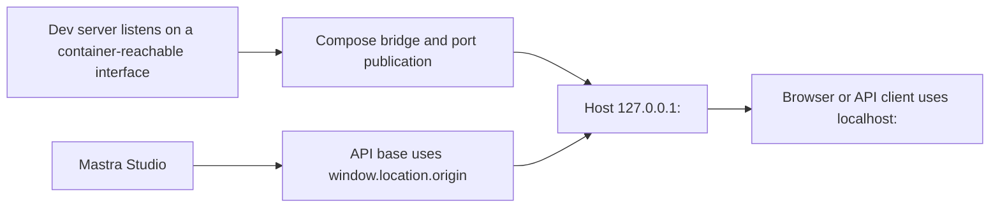

# Devcontainer Host-Accessible Development Ports - Plan

## Goal Capsule

**Objective:** A developer who runs Forge development servers inside the supported Docker Compose devcontainer on Docker Engine 28 or newer can use those servers from browsers and API clients on the host without exposing the selected application ports to the local network.

**Means:** Publish the stable application-port contract from the Compose `app` service on IPv4 loopback and configure container-scoped server binding separately from browser-facing origins. (KTD1, KTD2)

**Authority:** The user-confirmed port and exposure decisions take precedence. This Product Contract constrains the Planning Contract. The Planning Contract constrains the implementation units.

**Stop conditions:** Stop for a port not in the confirmed inventory, a required production-runtime change, or evidence that a selected service cannot work through a same-number loopback publication. Do not guess across those boundaries.

**Execution profile:** Implement test-first for the dependency-free contract guard, then change Compose, CI, and documentation. Run Compose resolution and disposable host-access smoke checks on the available Docker Engine 28+ daemon. CI must also run Compose resolution so the infrastructure contract remains unconditional. Full application/browser checks may be recorded separately when they would require replacing an active developer container.

**Tail ownership:** Complete the roadmap item, capture the durable devcontainer boundary, and open a ready-for-review PR. Do not deploy or merge.

---

## Product Contract

### Summary

The Compose-backed devcontainer will publish every confirmed stable Forge application port to the same port on host IPv4 loopback. Development servers will listen on a container-reachable interface, while developers will continue to use `localhost` browser URLs. A repository guard and an unconditional CI job will detect drift between the stable port inventory, Compose, and development entrypoints.

### Problem Frame

The devcontainer currently publishes SSH but not application servers. A process can therefore be healthy inside the container and still be unreachable from the host. Mastra also defaults its development server to container-local `localhost`, and using its internal bind address as the Studio API origin would create a different browser-origin failure.

### Key Decisions

- **Publish every stable application development port.** This was chosen over publishing browser UIs only because host tools must reach APIs and workers too. Governs R1, R5. (session-settled: user-directed — chosen over UI-only publication: every stable development service in the confirmed inventory must be reachable from host tooling)
- **Restrict the new publications to host loopback.** This was chosen over LAN-wide publication to keep development services private to the machine. Governs R1, R4. (session-settled: user-approved — chosen over LAN-wide publication: host access must not make the selected services reachable from the local network)

### Requirements

#### Host access

- R1. The Compose `app` service must publish `3000`, `3002`, `3003`, `3004`, `3005`, `3010`, `3011`, `3012`, `3100`, `3200`, and `4111` as same-number mappings on `127.0.0.1`.
- R2. The supported development entrypoints must listen on a container-reachable interface when they run inside the devcontainer.
- R3. Mastra Studio must use `http://localhost:4111` consistently for its page and API origin; other applications must preserve their documented `localhost` or `127.0.0.1` development-origin behavior.
- R4. The implementation must preserve Docker bridge isolation and must not use host networking or editor-specific port forwarding as a second publication mechanism.

#### Contract integrity

- R5. One dependency-free repository contract must own the stable service inventory and must detect missing, wildcard, translated, or stale Compose publications and development-port drift.
- R6. CI must run the contract guard for every PR even when Turbo reports no affected package.

#### Contributor workflow

- R7. Documentation must explain the listen, publication, and browser-origin boundaries, the Docker Engine 28 minimum for loopback isolation, fixed-port conflicts, and the explicit `docker run -p` requirement for callers that bypass Compose.
- R8. The change must not alter production commands, deployment configuration, authentication policy, generated GraphQL artifacts, or the existing PostgreSQL and Redis publication contract.

### Acceptance Examples

- AE1. A developer starts Web inside the devcontainer and opens `http://localhost:3000` on the host; the page and HMR connect through the `127.0.0.1:3000:3000` publication. Covers R1, R2, R3.
- AE2. A developer starts either repository Mastra development entrypoint inside the devcontainer and opens `http://localhost:4111/studio`; Studio calls its API through the page origin, not `0.0.0.0`. Covers R1, R2, R3.
- AE3. A contributor removes `127.0.0.1:3011:3011`, changes it to `3011:3011`, or changes the crop-worker default; the unconditional contract job fails with a service-specific message. Covers R5, R6.
- AE4. A developer already uses one selected host port when creating the devcontainer; Compose reports a port-allocation conflict instead of silently selecting a different origin. Covers R1, R7.

### Scope Boundaries

- Only the user-confirmed application ports are added. Optional debugger, database-tool, and ephemeral framework ports remain outside the contract.
- Existing PostgreSQL `5432` and Redis `6379` publications are not changed in this PR. Their exposure policy is separate from the confirmed application-port inventory.
- Compose publishes ports but does not start application servers. Developers continue to choose which repository development commands to run.
- Direct `docker run` use is documented, not automated. An image cannot force the host to publish its ports.
- Host access means access from the machine running the Docker daemon. Remote Docker contexts require their own forwarding path.

### Sources

- `.devcontainer/docker-compose.yml` establishes Compose as the existing publication boundary and uses `127.0.0.1:2222:22` for local-only SSH.
- `docs/solutions/integration-issues/mastra-eval-workflow-local-dev-contracts.md` records the existing Mastra listen, publication, and browser-origin contract.
- `docs/solutions/platform/devcontainer-setup.md` records the supported devcontainer workflow.
- [Docker Compose ports](https://docs.docker.com/reference/compose-file/services/#ports) defines explicit host-IP publication and warns that an omitted host IP binds all interfaces.
- [Docker port publishing](https://docs.docker.com/engine/network/port-publishing/) documents the security boundary and the Docker Engine version caveat for localhost publication.
- [Docker Compose config](https://docs.docker.com/reference/cli/docker/compose/config/) provides the resolved-model validation command.
- [Next.js CLI](https://nextjs.org/docs/app/api-reference/cli/next) documents the `next dev` port and its `0.0.0.0` default hostname.

---

## Planning Contract

### Key Technical Decisions

- KTD1. Use quoted short-form `127.0.0.1:<port>:<same-port>` entries under `services.app.ports`; keep the default bridge network and omit `forwardPorts`. This implements R1 and R4 without tying host access to one editor. (session-settled: user-approved — chosen over LAN-wide publication: host access must not expose the selected services to the local network)
- KTD2. Set `HOST=0.0.0.0` and `MASTRA_AUTO_DETECT_URL=true` on the Compose `app` service. The first value makes Mastra reachable through the container network, and the second makes Studio use `window.location.origin`. Compose scope avoids widening native-host Mastra development to LAN interfaces. Repository code does not otherwise consume generic `HOST`; representative Next.js, Node, and Mastra processes still require validation. This implements R2 and R3.
- KTD3. Implement the stable inventory and pure validators in `scripts/check-dev-port-contract.mjs`, with fixtures in a sibling test. Pin every Next.js listener to `0.0.0.0` and its stable port, preserve and validate each worker's Node omitted-host all-interface listener, and pin both Mastra `4111` development ports so every stable port has a repository source. The real check reads Compose, devcontainer configuration, package scripts, Mastra configuration sources, worker defaults, and worker listeners without a YAML dependency. It fails closed for every unapproved `app` publication form and for Compose indirection that could hide the effective model. This implements R2, R4, and R5.
- KTD4. Add a standalone, always-reporting CI job and include it in `ci-gate.needs`. `.devcontainer` is outside the Turbo package graph, so affected-package jobs cannot own R6. Pipe `docker compose config --format json` into the checker so CI validates the normalized effective model as well as the repository's raw source contract.
- KTD5. Treat Docker Engine 28 or newer as a support prerequisite for R1. Do not add a host-startup hook because host shells and remote Docker contexts are not portable enough for a reliable fail-closed check; documentation and live verification must refuse to claim LAN isolation when the daemon is older.

### High-Level Technical Design

This diagram shows the required boundaries. It is directional, not a prescription for implementation syntax.

### Implementation Constraints

- Preserve the current development commands and stable same-number URLs.
- Keep the guard dependency-free; do not rely on the transitively installed `yaml` package.
- Validate only the `app` service's selected publications so sidecar ports cannot accidentally satisfy the contract.
- Keep `localhost` and `127.0.0.1` roles distinct. `127.0.0.1` is the Docker publication address; `localhost` is the browser origin.
- Do not pipe long-running smoke servers through early-exiting consumers such as `head` or `grep -m`.
- Treat the IPv4 loopback mapping as the supported contract. Do not add `::1` mappings without cross-platform Docker validation.

### Risks & Dependencies

- Fixed publications prevent two Forge devcontainers from reserving the same ports and fail when a host process already owns a selected port. Documentation must make this deterministic trade-off explicit.
- Docker Engine releases older than 28.0.0 have a documented same-L2 localhost-publication caveat and are unsupported for the R1 isolation claim. A live result counts only when the Docker daemon reports Engine 28 or newer. (KTD5)
- A dependency-free raw-source parser is intentionally narrow. It rejects Compose merge, `extends`, and `include` indirection, while CI pipes `docker compose config --format json` into the same checker to validate the normalized effective service model and YAML syntax.
- Full HMR and Studio-origin checks require recreating the active developer container; use a disposable container for publication smoke checks without disrupting that environment.
- New Compose publications require devcontainer recreation. Restarting an application process inside the existing container does not add host mappings.

### Sequencing

Implement U1 before configuration so the guard's negative fixtures establish the failure modes. Apply U2 next and make the real check pass. Wire the proven check into CI in U3. Finish the durable documentation and roadmap state in U4.

---

## Implementation Units

### U1. Establish the stable development-port contract

**Goal:** Create a dependency-free contract guard with meaningful failure messages.

**Requirements:** R5.

**Files:** `scripts/check-dev-port-contract.mjs`, `scripts/check-dev-port-contract.test.mjs`.

**Approach:** Export one inventory that names each service, stable port, and repository source. Keep parsing and validation pure so fixtures can exercise Compose and source drift. The executable path reads the real repository files and reports all violations together. (KTD3)

**Execution note:** Write failing fixtures first, then implement the minimum parser and validators that satisfy them.

**Test scenarios:**

- A complete fixture with all 11 same-number loopback mappings, the Compose bind/origin environment, no editor forwarding, matching Next scripts, matching worker defaults/listeners, and both Mastra entrypoints passes.
- Removing one mapping reports that service and port as missing.
- Replacing a mapping with a wildcard-host or translated-host form reports the exact boundary violation.
- Duplicating a mapping, commenting it out, or placing it under a different service does not satisfy the contract.
- Changing a package-script port or worker default reports source drift against the exported inventory.
- Removing `HOST=0.0.0.0` or `MASTRA_AUTO_DETECT_URL=true` reports the missing Mastra container or browser-origin contract.
- A matching mapping outside `services.app.ports` does not satisfy the check.
- Long-form, IPv6 wildcard, extra, or editor-managed publications fail even when the approved mapping is also present.
- Host networking, a loopback-only Next/worker listener, or inline Mastra bind/origin override fails.
- Compose merge/extends/include indirection, a resolved wildcard mapping, a different devcontainer Compose file/service, or source-level Mastra `server.host` override fails.
- Missing source files, malformed package JSON, and missing required scripts report actionable errors instead of throwing.

**Verification:** `node scripts/check-dev-port-contract.test.mjs`.

### U2. Publish and bind the devcontainer services

**Goal:** Make the real Compose and runtime configuration satisfy the host-access contract.

**Requirements:** R1, R2, R3, R4, R8.

**Files:** `.devcontainer/docker-compose.yml`, `.devcontainer/devcontainer.json`, `apps/web/package.json`, `apps/manager/package.json`, `apps/admin/package.json`, `apps/auth/package.json`, `apps/mastra-gateway/package.json`, `apps/roadmap/package.json`, `apps/chat/package.json`, `apps/mastra/package.json`.

**Approach:** Add the 11 application mappings beside the existing SSH mapping. Add the two container-scoped environment values from KTD2. Remove the legacy editor forwarding for Web. Pin every Next.js development listener to `0.0.0.0`, retain each worker's omitted-host all-interface Node default, and pin both Mastra development ports per KTD3. Do not add host networking or a second publication mechanism. Leave sidecar publications and production commands unchanged. (KTD1, KTD2, KTD3)

**Test scenarios:**

- The real contract guard finds each selected app mapping exactly once under `services.app.ports`.
- Mastra receives a container-external bind address and Studio auto-detects the host page origin.
- Every Next.js command exposes an explicit stable port and container-reachable listener, each worker retains its guarded all-interface default, and both Mastra development commands expose their stable port while native-host Mastra remains loopback-bound.
- Representative Next.js, plain Node, and Mastra processes still start correctly with the Compose-scoped generic `HOST` value.
- SSH remains published on `127.0.0.1:2222`; PostgreSQL and Redis retain their existing configuration.
- `docker compose config` resolves the modified file without warnings or host-IP loss.

**Verification:** `node scripts/check-dev-port-contract.mjs`; `docker compose -f .devcontainer/docker-compose.yml config --format json | node scripts/check-dev-port-contract.mjs --resolved-compose-stdin`; on a Docker-capable host, `docker compose -f .devcontainer/docker-compose.yml port app 4111` reports `127.0.0.1:4111`.

### U3. Make drift protection unconditional in CI

**Goal:** Ensure infrastructure-only changes cannot bypass the port contract.

**Requirements:** R6.

**Files:** `.github/workflows/ci.yml`.

**Approach:** Add a no-install Node job that runs the fixture suite and real checker, then pipe Compose's normalized JSON model into the checker on the GitHub runner. Add the job to `ci-gate.needs`. (KTD4)

**Test scenarios:**

- A PR that touches only `.devcontainer/docker-compose.yml` still runs the guard.
- A failing fixture, real-file violation, or invalid Compose model fails the job and therefore fails `ci-gate`.
- Unrelated PRs still receive the same stable CI check name.

**Verification:** Inspect the workflow dependency graph; run `node scripts/check-dev-port-contract.test.mjs`; run formatting on `.github/workflows/ci.yml`.

### U4. Document the supported workflow and close the roadmap item

**Goal:** Make the host-access boundary and its operational trade-offs discoverable.

**Requirements:** R7, R8.

**Files:** `docs/solutions/platform/devcontainer-setup.md`, `docs/roadmap/platform/feat-423-devcontainer-host-accessible-dev-ports.md`, `docs/roadmap/README.md`.

**Approach:** Add the stable port table, the three-boundary explanation, canonical `localhost` URLs, fixed-port conflict guidance, Docker validation commands, and direct `docker run` limitation. Mark `feat-423` complete only after implementation validation, then regenerate the roadmap README.

**Test scenarios:**

- A Compose/devcontainer user can identify the host URL for every selected service and understands that the server must also be running.
- A user understands that the devcontainer must be recreated after the Compose publication changes.
- A user can identify the Docker Engine 28 minimum and does not treat an older daemon as loopback-isolated.
- A raw-image user sees that explicit `-p 127.0.0.1:<port>:<port>` flags and a container-reachable server bind are required.
- A remote-Docker user understands that the browser host is not automatically the Docker-daemon host.
- A port-conflict diagnostic does not recommend dynamic ports that would break the stable-origin contract.

**Verification:** regenerate the roadmap README; run Prettier in check mode over every changed file.

---

## Verification Contract

Run these gates in order:

1. `node scripts/check-dev-port-contract.test.mjs`
2. `node scripts/check-dev-port-contract.mjs`
3. `docker compose -f .devcontainer/docker-compose.yml config --format json | node scripts/check-dev-port-contract.mjs --resolved-compose-stdin`
4. `pnpm --filter roadmap generate:readme`
5. Run Prettier in check mode over every changed file.
6. `git diff --check`

On a Docker-capable host, first confirm `docker version --format '{{.Server.Version}}'` reports Engine 28 or newer. An older daemon is unsupported and cannot produce a passing LAN-isolation result. Recreate the devcontainer after the static gates. Start representative Next.js, plain Node worker, and Mastra processes without truncating their stdout. Confirm listening sockets inside the container, then verify `http://localhost:3000`, a worker health endpoint, and `http://localhost:4111/studio` from the host. Confirm Next.js HMR, Studio credentialed API calls to the page origin, and failed connection attempts to the newly published application ports through the host LAN address.

The PR description must distinguish static Compose validation, disposable publication smoke coverage, and any full application/browser checks that remain unavailable without replacing the active developer container.

---

## Definition of Done

- R1-R8 are implemented without broadening the application-port inventory.
- U1 is done when all positive and negative fixtures pass and the real checker reports a clean contract.
- U2 is done when the resolved Compose model retains every exact loopback mapping and the Mastra bind/origin environment.
- U3 is done when the unconditional job gates `ci-gate`.
- U4 is done when the durable setup guide and generated roadmap index reflect the completed ticket.
- All locally available Verification Contract gates pass. Docker-only gaps are named accurately in the PR.
- The branch receives a formal code review with no unresolved P0 or P1 finding.
- The change is committed, pushed, and opened as a ready-for-review PR; it is not merged or deployed.
- Experimental or abandoned implementation code is absent from the final diff.
