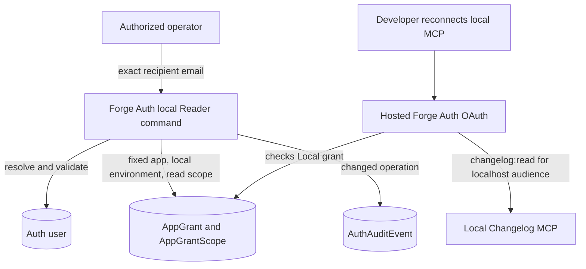

# Changelog Local Reader Grant Command - Plan

## Goal Capsule

- **Objective:** A developer whose local Changelog MCP is denied can receive Reader access through a supported Forge command and reconnect successfully.
- **Means:** Add one Forge Auth command that finds an eligible user by verified email and creates an explicit Reader grant for the existing Changelog Local environment. (KTD11-KTD13)
- **Product authority:** `docs/plans/2026-08-19-1635-feat-changelog-forge-auth-plan.md` remains authoritative for Changelog registration, OAuth enforcement, resource binding, role hierarchy, and the production gate.
- **Stop conditions:** Stop if the command cannot prove that it is targeting the registered Changelog Local environment, if the target account is not uniquely identifiable and eligible, or if the work requires a general access-management API or dashboard.
- **Execution profile:** Forge Auth only. The command may operate against local Auth or hosted Auth according to its configured database, but it can create only a Local Reader grant.
- **Tail ownership:** The executor updates the Forge roadmap and operator documentation. JesusFilm/jfp-changelog issue #81 separately owns Changelog documentation wording.

---

## Product Contract

### Summary

Forge Auth will provide a small operator command for granting `changelog:read` to one verified, ACTIVE Auth user for `http://localhost:3000/mcp`. This gives developers access to the local Changelog MCP without depending on the unfinished Forge Admin dashboard or adding a new HTTP API.

### Problem Frame

The local Changelog MCP uses the hosted Jesus Film Auth service by default. Auth correctly denies `changelog:read` when the user has no explicit Local grant, but Forge has no supported provisioning command for creating that grant.

Direct ad hoc SQL would duplicate application, environment, eligibility, scope, and audit rules outside version-controlled code. Forge already has a comparable email-driven operator command at `apps/admin/src/scripts/grant-manager-operator.ts`.

### Key Decisions

- **Use a Forge Auth command for local Reader provisioning.** (session-settled: user-approved — chosen over an Auth API and Forge Admin UI: the immediate need is enabling developers to use the local Changelog MCP.) Governs R19-R25.
- **Continue requiring an explicit Reader grant.** ACTIVE membership establishes eligibility but does not automatically grant Changelog access. (session-settled: user-directed — chosen over an automatic Reader baseline: explicit environment-specific access remains the agreed policy.) Governs R1-R2 and R19.
- **Use hosted Auth for ordinary local Changelog development.** (session-settled: user-approved — chosen over requiring every developer to run Auth locally: Changelog can use the shared login service while its grant remains limited to the localhost resource.) Governs R19, R24-R25.

### Actors

- A1. **Developer:** A human Jesus Film Auth member who needs to use the local Changelog MCP.
- A2. **Authorized operator:** A developer with approved access to run the command in the intended Auth environment.
- A3. **Forge Auth:** The source of truth for the user, Changelog application environment, grant, scope, and audit record.
- A4. **Local Changelog MCP:** The resource at `http://localhost:3000/mcp` that requires `changelog:read`.

### Requirements

**Existing authorization policy**

- R1. An ACTIVE Auth member receives `changelog:read` only from an approved, non-revoked Reader, Contributor, or Admin grant for the exact Changelog application and environment.
- R2. A user with no applicable grant, or with INVITED, SUSPENDED, or DISABLED membership, receives no Changelog scope.
- R6. A grant can never cross from Local to Production or from Production to Local.
- R7. `AUTH_CHANGELOG_PRODUCTION_ENABLED=false` continues to suppress every production `changelog:*` scope.

**Local Reader command**

- R19. Forge Auth exposes one command that prompts for an exact email address and grants Reader access only for the registered Changelog Local environment.
- R20. The command normalizes the email, requires exactly one existing HUMAN user with `emailVerified=true` and `membershipStatus=ACTIVE`, and never creates or changes a user.
- R21. Email is only the lookup input. The grant and audit event use the resolved stable Auth user ID, so Google and other login methods work the same way.
- R22. The operation is idempotent. An existing Local Reader-or-higher grant produces a clear no-change result, and the command never downgrades Contributor or Admin access.
- R23. A changed operation serializes against concurrent grants, then creates one approved Local Reader grant and an Auth audit event atomically. It leaves historical revoked or rejected grants intact.
- R24. The command has no environment or role argument that could select Production, Contributor, or Admin.
- R25. Operator documentation uses a read-only target preflight followed by `railway run` for hosted Auth, prohibits copying or printing `DATABASE_URL`, and explains that the recipient must sign in again after the grant to receive a new token.

### Key Flow

- F1. **Enable local MCP Reader access**
  - **Trigger:** A1 receives an insufficient-scope denial from A4.
  - **Actors:** A1-A4.
  - **Steps:** A1 signs into Jesus Film Auth at least once. A2 runs the command with A1's exact email in the intended Auth environment. A3 verifies eligibility and records the Local Reader grant. A1 reconnects the MCP so Auth can issue a new token.
  - **Outcome:** A1 can use the local Changelog MCP with `changelog:read`, while Production and write scopes remain unavailable. Covers R1-R2, R6-R7, R19-R25.

### Acceptance Examples

- AE1. **Google user:** A verified ACTIVE user who originally signed in with Google is found by email, and the grant is stored against their Auth user ID.
- AE2. **First grant:** An eligible user with no Local Changelog grant receives one approved Reader grant and one audit event.
- AE3. **Repeat:** Running the command again for the same Reader returns a no-change result and creates no duplicate grant.
- AE4. **Higher role:** A user with an existing Local Contributor or Admin grant keeps that role and receives a no-change result.
- AE5. **Ineligible identity:** A missing, unverified, non-human, INVITED, SUSPENDED, or DISABLED user causes a clear error and no writes.
- AE6. **Environment isolation:** The command cannot accept Production as input and does not create or change any Production grant.
- AE7. **Hosted Auth:** After the command runs against hosted Auth and the user reconnects, a token for `http://localhost:3000/mcp` contains `changelog:read` while a production Changelog token remains unaffected.

### Scope Boundaries

**In scope**

- One email-driven Forge Auth command for granting Local Reader access.
- Eligibility, idempotency, environment-isolation, persistence, and audit tests.
- Operator documentation for local and hosted Auth execution contexts.

#### Deferred to Follow-Up Work

- A revoke command, Contributor/Admin commands, bulk provisioning, or a general grant-management interface should be planned only when there is a demonstrated operator need.
- JesusFilm/jfp-changelog ADR 0010 and issue #74 wording remain tracked by [JesusFilm/jfp-changelog#81](https://github.com/JesusFilm/jfp-changelog/issues/81).

**Outside this plan**

- Forge Admin dashboard or Product Access changes.
- A new Auth HTTP API, service bearer, or cross-service identity lookup.
- Automatic Reader access derived from membership.
- Production Changelog grants or enabling production Changelog issuance.
- Changelog application or MCP implementation changes.
- Requiring developers to run local Auth for ordinary local Changelog testing.

### Sources

- `apps/admin/src/scripts/grant-manager-operator.ts` — existing exact-email operator-command precedent.
- `apps/auth/src/services/changelog-oauth-grant.service.ts` — existing Changelog grant enforcement.
- `apps/auth/src/domain/apps.ts` — canonical Changelog Local registration and client.
- `apps/auth/prisma/schema.prisma` — existing user, grant, scope, and audit models.
- `apps/auth/docs/railway-deployment.md` — supported local Changelog resource and production gate.
- `docs/plans/2026-08-19-1635-feat-changelog-forge-auth-plan.md` — merged OAuth and grant-policy authority.

---

## Planning Contract

### Product Contract Preservation

This revision narrows the prior unimplemented plan from an Admin UI and Auth API to the command selected in this session. It preserves R1, R2, R6, and R7. It removes the unimplemented API/UI requirements R8-R18 and adds R19-R25 for the local Reader command.

### Key Technical Decisions

- KTD1. **Preserve explicit Reader grants.** ACTIVE membership is necessary but insufficient, and the existing OAuth decision remains unchanged. Governs R1-R2, R6-R7.
- KTD4. **Use the existing Auth schema.** `User`, `RegisteredApp`, `AppEnvironment`, `Scope`, `AppGrant`, `AppGrantScope`, and `AuthAuditEvent` already hold the needed state. No migration is required. Governs R19-R23.
- KTD11. **Use an Auth package script that writes through Prisma.** (session-settled: user-approved — chosen over an authenticated API and Admin dashboard: this matches Forge's existing low-volume operator-command pattern and the requested local-development scope.) The script runs with the `DATABASE_URL` supplied by its execution environment. Governs R19, R23-R25.
- KTD12. **Make the command structurally Local Reader-only.** The command resolves the `changelog` application, its `local` environment, and `changelog:read` internally. It exposes no role or environment selector. Governs R6-R7, R19, R22-R24.
- KTD13. **Resolve by email and persist by user ID.** Normalize the input for the unique user lookup, validate `emailVerified`, `actorType`, and membership, then use the resolved ID for all grant and audit relations. This supports Google sign-in without treating email as the durable authorization key. Governs R20-R21.

### High-Level Technical Design

### Risks and Mitigations

- **Wrong database:** The command uses whichever database `DATABASE_URL` selects. Hosted execution must start from a clean deployed-main revision, verify the non-secret Railway project, `@forge/auth` service, and production environment, then use `railway run` without printing or copying variables. A normal local database does not affect hosted Auth.
- **Accidental privilege expansion:** Hard-code the Local environment and Reader scope. Do not accept a role or environment argument.
- **Existing higher access:** Treat active Contributor or Admin as satisfying Reader and return no change rather than replacing it.
- **Incomplete human attribution:** The Auth audit event records the target, application, environment, and command source. Access to the command's execution environment remains the control that identifies the operator; do not claim the target user performed the command.
- **Stale MCP token:** Document reconnecting after a successful grant because an already-issued token cannot gain a new scope.
- **Recipient email exposure:** Prompt through standard input and redact command output. Do not place the email in argv, shell history, process listings, or recorded verification evidence.

### Sequencing

1. Add and test the Auth-owned grant operation.
2. Add the package command as a thin argument and output wrapper.
3. Document safe execution against local or hosted Auth and verify the real local MCP flow.

---

## Implementation Units

### U1. Preserve the existing OAuth boundary

- **Goal:** Confirm that the new command supplies existing policy rather than changing token behavior.
- **Requirements:** R1-R2, R6-R7; AE6-AE7.
- **Dependencies:** None.
- **Files:** Modify only if coverage is missing: `apps/auth/src/services/changelog-oauth-grant.service.test.ts` and `apps/auth/src/services/oauth-policy.service.test.ts`.
- **Approach:** Keep production OAuth code unchanged. Add characterization coverage only when the current tests do not already prove Local-versus-Production isolation and no-grant denial.
- **Test scenarios:**
  1. A Local Reader grant permits `changelog:read` only for the Local client and resource.
  2. The same user receives no Production Changelog scope while production issuance is disabled.
  3. A user without a Local grant remains denied.
- **Verification:** Existing or focused tests prove the policy without production-code changes.

### U2. Add the Local Reader grant operation

- **Goal:** Create an idempotent, audited Auth operation for one eligible user and the fixed Local Reader grant.
- **Requirements:** R19-R24; AE1-AE6.
- **Dependencies:** U1 policy contract.
- **Files:** Create `apps/auth/src/services/changelog-local-reader-grant.service.ts`, `apps/auth/src/services/changelog-local-reader-grant.service.test.ts`, and `apps/auth/src/services/changelog-local-reader-grant.integration.test.ts`.
- **Approach:** Resolve the normalized unique email and validate the existing human user. Require the ACTIVE `changelog` application, its APPROVED `local` environment with LOCAL kind and canonical client identity, and the canonical read scope. Lock the Local `AppEnvironment` row inside the transaction, re-read effective grants, and return no change for Reader-or-higher access. Otherwise create the approved Reader grant and audit event atomically while preserving historical rows.
- **Execution note:** Start with failing service tests for eligibility, idempotency, and environment isolation. Use the native PostgreSQL harness for the changed grant-plus-audit transaction.
- **Patterns to follow:** `apps/auth/src/services/changelog-oauth-grant.service.ts`, `apps/auth/src/services/audit.service.ts`, and the existing Auth integration-test database harness.
- **Test scenarios:**
  1. Covers AE1-AE2. A normalized Google-account email resolves one verified ACTIVE HUMAN user and atomically creates one approved Local Reader grant plus its scope and audit event.
  2. Covers AE3. Repeated execution returns no change and creates no duplicate active grant or success audit.
  3. Covers AE4. Existing Local Contributor or Admin access remains unchanged.
  4. Covers AE5. Missing, unverified, non-human, or inactive users cause no grant or audit write.
  5. Missing Changelog application, Local environment, or read scope fails closed with no partial write.
  6. Covers AE6. Production grants remain byte-for-byte unchanged across success, no-change, and failure paths.
  7. An inactive application, non-approved or non-LOCAL environment, or mismatched Local client identity fails closed.
  8. Two concurrent grants for the same user serialize and leave one active Reader grant and one changed audit event.
- **Verification:** Focused unit and integration tests prove exact identity, scope, environment, idempotency, history, and transaction behavior.

### U3. Add the operator command

- **Goal:** Expose the operation through a command consistent with Forge's existing Manager operator grant script.
- **Requirements:** R19-R25; F1; AE1-AE6.
- **Dependencies:** U2.
- **Files:** Create `apps/auth/src/scripts/grant-changelog-local-reader.ts` and `apps/auth/src/scripts/grant-changelog-local-reader.test.ts`. Modify `apps/auth/package.json`.
- **Approach:** Prompt for one email through standard input, normalize it through the service, print a redacted changed or no-change result, and return a non-zero exit for validation or persistence errors. Do not accept email, environment, role, user ID, or raw scope arguments through argv.
- **Patterns to follow:** `apps/admin/src/scripts/grant-manager-operator.ts` for command shape and `apps/auth/src/scripts/seed-first-party-apps.ts` for Prisma lifecycle handling.
- **Test scenarios:**
  1. Any positional argument prints safe usage guidance and performs no database call.
  2. Empty or malformed prompted input fails before a database call.
  3. A successful grant reports a redacted recipient and Local Reader outcome without printing the complete email, internal IDs, or credentials.
  4. Existing Reader-or-higher access reports no change and exits successfully.
  5. Eligibility, registry, and database failures return a non-zero exit and a safe error without leaking the complete email or connection details.
- **Verification:** The package script invokes the tested service and has no path for selecting Production or a higher role.

### U5. Document and verify the local developer flow

- **Goal:** Make it clear where to run the command and how a developer obtains a fresh MCP token.
- **Requirements:** R25; F1; AE7.
- **Dependencies:** U3.
- **Files:** Modify `apps/auth/CLAUDE.md`, `apps/auth/docs/railway-deployment.md`, and `docs/roadmap/platform/feat-423-changelog-admin-access-grants.md`. Reference [JesusFilm/jfp-changelog#81](https://github.com/JesusFilm/jfp-changelog/issues/81) without editing Changelog files.
- **Approach:** Document that local Changelog defaults to hosted Auth and that recipients must have signed in once. For hosted execution, require a clean deployed-main checkout, a read-only Railway target preflight, explicit Forge project/production/`@forge/auth` selection, and `railway run` without commands that display variables. Require confirmation after the preflight and reconnecting after the grant. Include a Local-only safety check and leave production issuance disabled.
- **Execution note:** Verify with a dedicated test account. Never record an email, authorization code, access token, refresh token, database URL, or provider credential in committed evidence.
- **Test scenarios:**
  1. A dedicated hosted-Auth user receives Local Reader, reconnects, and can call the local MCP.
  2. The same flow does not grant a Production Changelog scope or any submit/admin scope.
  3. Running against a local Auth database affects only local Auth, which the documentation distinguishes from hosted Auth.
- **Verification:** The documented flow is reproducible, the Local MCP succeeds after reconnect, and production issuance remains disabled.

---

## Verification Contract

| Scope            | Required verification                                                            | Done signal                                                                                                                                                          |
| ---------------- | -------------------------------------------------------------------------------- | -------------------------------------------------------------------------------------------------------------------------------------------------------------------- |
| Grant service    | Focused service unit tests and PostgreSQL integration test                       | Eligibility, exact Local Reader persistence, audit atomicity, idempotency, higher-role preservation, and Production isolation pass.                                  |
| Command          | Focused argument/output tests or equivalent service-wrapper proof                | One exact email is accepted; unsupported role/environment inputs have no execution path; failures are non-zero and safe.                                             |
| Auth regression  | `pnpm --filter @forge/auth test`, `typecheck`, and `lint`                        | Existing OAuth, provider, and non-Changelog behavior remains unchanged.                                                                                              |
| Local MCP smoke  | Hosted Auth grant followed by a fresh local Changelog MCP authorization          | `changelog:read` is present for `http://localhost:3000/mcp`; write/admin and Production scopes are absent.                                                           |
| Hosted execution | Read-only Railway target preflight followed by the documented `railway run` path | The selected Forge project, production environment, and `@forge/auth` service are visible before confirmation; no database URL or recipient email appears in output. |
| Repository       | Touched-scope formatting plus `git diff --check`                                 | CI-sensitive formatting and whitespace checks pass.                                                                                                                  |

Live verification must use a dedicated test user and must not record raw credentials, tokens, authorization codes, database URLs, or email addresses.

---

## Definition of Done

- An authorized operator can run one Forge Auth command with an exact email to grant Local Reader access.
- The command accepts no environment or role selector and cannot create a Production, Contributor, or Admin grant.
- Only an existing verified ACTIVE HUMAN Auth user can receive the grant; Google and other login methods work through the same user lookup.
- Repeated execution and existing higher access are safe no-change outcomes.
- A changed grant and its Auth audit event are atomic, and historical grant rows remain intact.
- After reconnecting, the recipient can use the local Changelog MCP with `changelog:read` and no broader scope.
- Forge Admin, a new Auth API, automatic Reader access, production grant management, and Changelog code remain outside the implementation.
- `AUTH_CHANGELOG_PRODUCTION_ENABLED` remains false.
- Roadmap ticket feat-423 reflects the narrowed command scope, and Changelog issue #81 remains the separate documentation follow-up.
- Abandoned experiments, temporary logs, and test credentials are absent from the final diff.

### Rollback

- Remove the package command to stop new provisioning.
- Revoke any command-created Local Reader grant through an approved operator procedure if access must be removed; do not delete historical audit records.
- Keep production issuance disabled throughout rollback.
