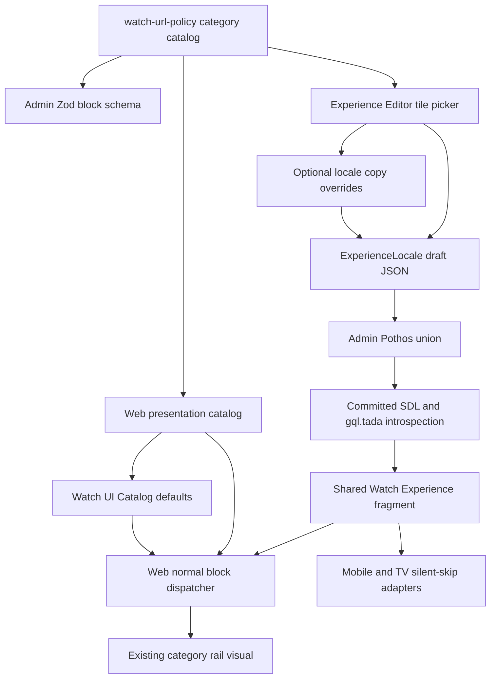
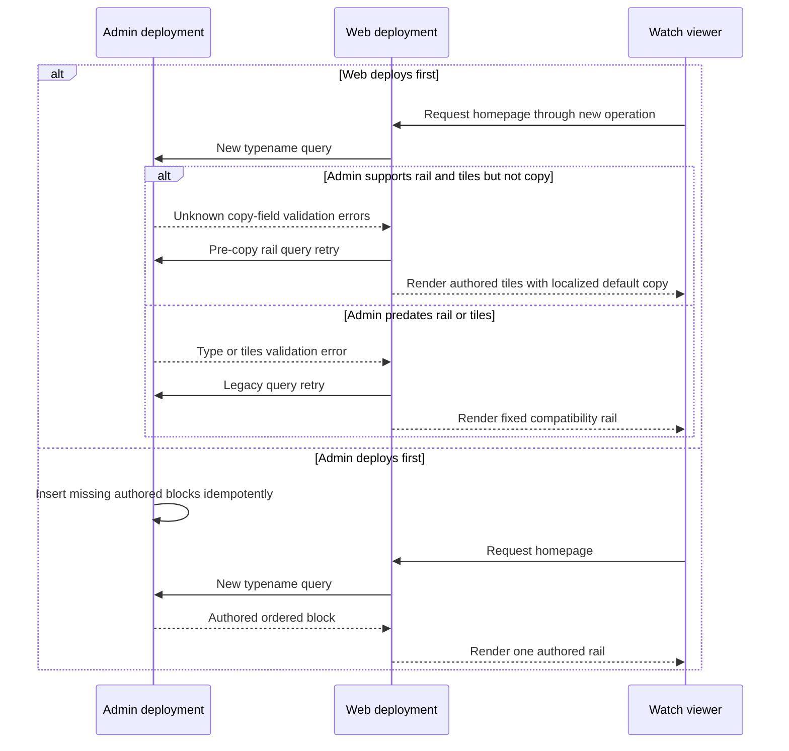

# Watch Category Rail Editable Copy - Plan

## Goal Capsule

- **Objective:** Admins can edit the four visible Watch category-rail header strings inside the existing block editor without changing code.
- **Means:** Use the top-level `watchHomeCategoryRail` block for ordered tiles and optional locale-owned copy overrides while Web retains localized defaults and presentation (KTD2, KTD4, KTD10).
- **Authority:** The user request owns product behavior. `AGENTS.md`, package-local guides, and generated-contract rules own repository constraints. Requirements in this plan own product behavior; Key Technical Decisions own implementation mechanisms.
- **Execution profile:** Incremental cross-cutting change across Admin, generated GraphQL contracts, and Web. The existing category-rail block, tile authoring, native-client handling, seed, and rollout are established baseline, not implementation work in this plan.
- **Stop conditions:** Stop if the copy-field compatibility query cannot preserve authored tiles against a pre-copy Admin schema, if exact locale-default behavior cannot be retained, or if the change requires editing the CTA destination.
- **Tail ownership:** The implementation owner carries the change through roadmap completion, generated artifacts, browser QA, performance evidence, commit, PR, and merge-readiness.

---

## Product Contract

### Summary

The Watch homepage category rail is an existing standalone, rearrangeable Experience block. This increment lets admins override its eyebrow, heading, description, and CTA label. Existing blocks keep the current localized copy when those overrides are absent.

**Product Contract preservation:** changed R7 and R12, then added R17-R20 and AE9-AE12 because the user expanded the authored block to include its visible header copy.

### Problem Frame

The block editor now controls the rail and its tiles, but the four header strings shown to viewers are still hardcoded through Web's Watch UI Catalog. Admins cannot change that copy in the same editing experience, so a visually authored block still requires a code and translation-catalog change for its heading area.

### Requirements

R1-R16 describe the shipped category-rail baseline and remain regression constraints. R17-R20 are the executable requirements for this increment.

**Authoring and persistence**

- R1. The Experience Editor offers one homepage-only, top-level category rail block that participates in the existing block reorder interaction, and every write path rejects non-homepage or duplicate placement.
- R2. The block stores an ordered, non-empty, duplicate-free subset of the 13 supported category IDs.
- R3. A newly inserted block starts with all supported categories in the current `WATCH_HOME_CATEGORIES` order.
- R4. Admins can add, remove, and reorder selected tiles, and save, discard, and reopen the draft without losing the selection or its order.
- R5. The category catalog is a closed shared contract for legal IDs, destinations, and stable staff-facing labels so Admin authoring and Web rendering cannot silently drift.

**Rendering and compatibility**

- R6. Web renders only the selected categories, in authored order, at the block's position in the Experience block array.
- R7. Web retains the existing localized eyebrow, heading, description, and CTA label as independent defaults while preserving tile labels, icons, gradients, routes, grain, carousel behavior, and layout.
- R8. Once Admin supports the block typename, removing the block from an Experience removes the section and Web does not synthesize an absent-block fallback.
- R9. Malformed consumer data cannot produce duplicate or broken tiles, and a selection with no valid IDs renders no section.
- R10. Mobile and TV recognize this Web-only typename and silently omit it from their homepage models.

**Contracts, agents, and rollout**

- R11. The block is available through Admin's validated JSON contract, Pothos union, committed SDL, generated gql.tada introspection, shared Watch Experience fragment, and draft preview query.
- R12. Live Admin AI chat and existing MCP create/update paths can preserve and edit the block's tiles and header copy under the same validation rules as manual editing.
- R13. Autonomous Experience generation does not invent this homepage-only block in this change.
- R14. The local seed and an idempotent reviewed post-deploy backfill insert the all-category block immediately after the first `watchHomeHero` when present, or first when no hero exists, for every homepage locale and active draft that lacks it; temporary Admin read synthesis preserves the rail until activation completes.
- R15. New Web falls back to the fixed rail only when the old Admin schema rejects the new block typename; once the schema supports the block, stored Experience content is authoritative and an absent block renders no rail.
- R16. Steady-state authored rendering adds no homepage fetch, increases initial transferred JavaScript by no more than 5 KiB gzip, keeps five-run median LCP within the larger of 100 ms or 5%, and keeps initial-window long-task time within the larger of 50 ms or 10%.
- R17. The Experience Editor exposes the visible eyebrow, heading, description, and CTA label inside the category-rail block, and the existing draft save, reload, preview, publish, and discard lifecycle preserves them.
- R18. Each nonblank authored header value is a literal override for that Experience locale; an absent, empty, or whitespace-only value independently restores the existing translated Watch UI Catalog default.
- R19. Header copy authoring does not expose or change the CTA destination, which remains the locale-aware Watch language inventory route.
- R20. A newer Web deployment that reaches an Admin schema without the copy fields retries a pre-copy rail projection that preserves authored tiles and order, while unrelated GraphQL failures remain errors.

### Actors

- A1. **Experience admin:** Adds, removes, reorders, and edits the category rail.
- A2. **AI-assisted admin:** Uses live Experience chat or MCP create/update operations against the same block contract.
- A3. **Watch viewer:** Sees the selected category links in the authored section position.
- A4. **Release operator:** Verifies new Admin health/drain, explicit backfill activation, compatibility mode, and rollback sequence during rollout.

### Key Flows

- F1. **Manual authoring**
  - **Trigger:** A1 adds the category rail from the homepage block library.
  - **Steps:** The editor creates the all-category starter, A1 changes membership and tile order, then the existing draft lifecycle saves and publishes the block.
  - **Outcome:** The homepage renders the selected tiles at the authored block position.
  - **Covered by:** R1-R8, R11
- F2. **AI-assisted editing**
  - **Trigger:** A2 asks chat or an MCP client to edit category tiles or header copy.
  - **Steps:** The editing path uses the documented block shape, validates the full block array, and preserves unmentioned rail fields during unrelated edits.
  - **Outcome:** AI and manual authoring produce the same persisted contract.
  - **Covered by:** R2, R4, R5, R12, R13
- F3. **Race-safe production cutover**
  - **Trigger:** The merged change is prepared for deployment.
  - **Steps:** Admin expands its read contract without an automatic data write, temporary read synthesis preserves missing legacy rows, the reviewed backfill runs after new Admin health/drain, and new Web retries the legacy query plus fixed rail only while the old Admin schema rejects the typename.
  - **Outcome:** Either Railway deployment order preserves exactly one rail, and the fixed compatibility path stops automatically when Admin supports authored control.
  - **Covered by:** R8, R11, R14-R16

### Acceptance Examples

- AE1. **Covers R1, R3, R4, R6.** Given a homepage Experience, when an admin adds the block, removes `sports`, moves `family` before `gospels`, and saves, then reopening the draft and previewing the page shows the remaining tiles in that exact order and the block at its authored section position.
- AE2. **Covers R2, R5, R11.** Given duplicate or unknown category IDs from an editor, AI, or MCP mutation, when Admin validates the block array, then validation rejects the payload with no partial persistence.
- AE3. **Covers R1.** Given a non-homepage Experience or a homepage that already contains the block, when manual, AI, or MCP authoring attempts to add it, then the shared write boundary rejects the mutation.
- AE4. **Covers R8, R15.** Given Admin supports the new typename and a homepage Experience has no category block, when Web renders it, then no category rail appears.
- AE5. **Covers R9.** Given malformed legacy consumer data with duplicate and unknown IDs, when the Web adapter resolves the selection, then it renders each known ID at most once and renders nothing when none are valid.
- AE6. **Covers R10.** Given the shared fragment returns this typename to Mobile or TV, when either adapter builds its homepage model, then it emits no rail and no unknown-block warning.
- AE7. **Covers R14, R15.** Given a homepage locale or active draft without the block, new Admin reads synthesize the equivalent block before activation; when the reviewed post-deploy backfill runs after health/drain, it inserts exactly one all-category block after the first hero when present or first when absent, records completion atomically, and a second run makes no content change.
- AE8. **Covers R15.** Given new Web reaches old Admin, when the new typename is rejected during GraphQL validation, then Web retries the legacy operation and renders the fixed rail; unrelated GraphQL failures do not trigger compatibility mode.
- AE9. **Covers R17-R19.** Given a homepage rail with no copy overrides, when an admin edits all four visible strings and previews the draft, then the preview shows those exact values while the CTA keeps its locale-aware destination.
- AE10. **Covers R17, R18.** Given saved copy overrides, when an admin clears one field to whitespace and saves, then reopening the draft and viewing Web restores only that field's translated default and keeps the other overrides.
- AE11. **Covers R12, R18.** Given an existing rail with custom tiles and copy overrides, when AI chat or MCP updates an unrelated block, then the full rail shape and order remain unchanged.
- AE12. **Covers R20.** Given new Web reaches an Admin schema that supports `tiles` but not the four copy fields, when the homepage or draft preview query runs, then Web retries without the copy fields, preserves the authored rail, and renders translated header defaults.

### Success Criteria

- An admin can complete AE1 and AE9-AE10 in the real editor and draft preview without editing JSON directly.
- Desktop and mobile Web screenshots match the existing section design except for the intentionally authored tile subset and section position.
- The post-change homepage uses one successful Experience request, and only the bounded old-schema compatibility case performs one failed validation attempt plus one legacy retry.

### Scope Boundaries

**In scope**

- Optional locale-owned header-copy fields, block-editor controls, GraphQL propagation, Web rendering and draft preview, capability-preserving copy-field schema fallback, explicit AI/MCP editing parity, focused regressions for the established tile contract, and roadmap evidence.

**Outside this change**

- Rebuilding the existing rail block, tile picker, shared catalog, native-client handling, seed/backfill, or original typename rollout; editing the header CTA destination; adding translation keys; changing the browse-modal taxonomy; cross-locale propagation tooling; or adding Mobile/TV rendering parity.

### Deferred to Follow-Up Work

- Teach autonomous `experience.generate` workflows to propose this homepage-only block only if the product later defines when generation should include or omit it.
- Add format categories after label-filtered browse destinations exist, as already tracked by `feat-426`.
- Remove the legacy-schema query and fixed-rail compatibility path after old Admin versions can no longer serve Web traffic.

---

## Planning Contract

### Key Technical Decisions

- KTD1. **Share the closed category catalog from `@forge/watch-url-policy`.** Admin and Web already depend on this neutral package. It owns IDs, destinations, and stable staff labels; Web layers viewer-localized keys, gradients, and icons onto the shared entries.
- KTD2. **Keep `categoryIds` as the compatibility mirror and `tiles` as the authoritative authored list when present.** Optional copy fields carry content semantics, while Web owns layout, styling, default translations, and the fixed CTA route per `docs/solutions/architecture-patterns/admin-authored-web-owned-experience-block-contract-20260826.md`.
- KTD3. **Validate the authoring boundary strictly and defend the renderer leniently.** Admin rejects empty, duplicate, or unknown IDs. Web de-duplicates and filters malformed payloads so historical JSON cannot render broken cards.
- KTD4. **Use normal top-level block dispatch.** Add the block only to `BlockSchema`, not nested unions, and let the existing block map preserve editor order instead of handling it as another homepage special case.
- KTD5. **Make one-PR rollout order-independent.** Admin first expands the read contract and synthesizes missing legacy homepage rails without storage mutation. After new Admin health and old-instance drain, an idempotent reviewed backfill inserts the block into every homepage locale and active draft and atomically records activation. Web retries a legacy query and renders the fixed rail only when GraphQL reports that the old Admin schema does not know the new typename; it never uses compatibility mode for an activated supported-schema absent block or an unrelated failure.
- KTD6. **Support explicit AI editing but defer autonomous generation.** Update the live chat contract and existing MCP tool descriptions/tests. Do not add the block to the duplicated Mastra draft-generation schemas and prompts in this change.
- KTD7. **Treat Mobile and TV as known non-rendering consumers.** Extend their silent-skip sets because the shared fragment union reaches both clients, without expanding the request into native UI work.
- KTD8. **Make rollback reverse the data dependency.** Roll Web back first so the fixed rail is restored. While new Admin is still live, remove the authored block from every canonical homepage locale and active draft, verify old Web and the homepage query, and only then roll Admin back.
- KTD9. **Enforce homepage singleton placement at the shared service boundary.** The block-array schema rejects duplicates, while Experience create, draft-save, and publish paths compare the effective `isHomepage` state so manual, chat, and MCP writes share one invariant.
- KTD10. **Store header copy as optional locale-owned overrides.** Add `eyebrow`, `title`, `description`, and `ctaLabel` as optional sibling fields, leave them absent in starters and existing rows, preserve raw controlled-input text while typing, and trim at serialization and render fallback. This keeps translated Web copy authoritative until a locale explicitly overrides one field and requires no migration or backfill.
- KTD11. **Preserve the richest supported rail during copy-field schema lag.** Add a pre-copy query tier that keeps `categoryIds` and `tiles` but omits the four new fields. Homepage and preview readers use that tier only when every relevant validation error exactly names an unknown copy field on `WatchHomeCategoryRailBlock`; type or `tiles` lag still uses the existing legacy path, and mixed unrelated errors fail normally.
- KTD12. **Keep agent editing on the shared draft contract.** Update Admin AI and MCP guidance to describe the same optional copy fields and preservation rules enforced by `BlocksSchema`; do not add a dedicated tool or widen autonomous full-draft generation.

### Assumptions

- The requested section is the existing Watch homepage `WatchHomeCategoryRail` shown in the supplied screenshot.
- “Standalone” means a top-level Experience block, and the block library should expose it only for homepage Experiences because its content and CTA are Watch-home-specific.
- At least one tile must be selected. Admins hide the entire section by removing its block.
- The current 13 tile IDs and their existing order are the initial supported catalog and default selection.
- The authorized change includes code, a committed idempotent post-deploy backfill artifact and command, local seed data, and rollout documentation, but not pasted production SQL or a direct deployment.
- “This text” means the four visible strings in the supplied rail header: eyebrow, heading, description, and CTA label. The CTA destination is not part of the request.
- Recommended copy limits are 80 characters for eyebrow and CTA label, 160 for title, and 500 for description unless an existing shared constant owns a stricter compatible limit.

### High-Level Technical Design

The following sketches define direction and ownership; implementation details remain with each unit.

### System-Wide Impact

- **Data lifecycle:** A new JSON discriminator flows through canonical Experience locales and active drafts. Temporary read synthesis preserves legacy behavior until a one-time idempotent post-deploy backfill establishes the equivalent stored state and atomically records activation; later save, discard, publish, and revision behavior remains authoritative.
- **API contract:** The `ExperienceBlock` GraphQL union gains one member and the shared Watch fragment selects it, requiring regenerated SDL and gql.tada introspection.
- **API contract:** The existing `WatchHomeCategoryRailBlock` GraphQL object gains four nullable fields, requiring regenerated SDL and gql.tada introspection plus a pre-copy compatibility projection.
- **Consumer behavior:** Web renders the block. Mobile and TV receive the typename through the shared fragment but intentionally omit it.
- **Agent/tool parity:** Live AI chat and MCP create/update flows must understand the legal tile set, copy overrides, fallback semantics, and whole-block preservation. Autonomous draft generation remains intentionally unchanged.
- **Performance:** The selected IDs arrive inside the existing homepage Experience response. Dynamic dispatch must not inflate unrelated routes or introduce another request.
- **Operations:** Either forward deployment order is safe. Admin rollback remains gated on removing the new discriminator while the new Admin can still read it.

### Risks and Mitigations

- **Missing rail during cutover:** New Web may reach old Admin, or new Admin may serve pre-backfill content. Limit Web compatibility fallback to the specific unknown-typename validation error, synthesize the equivalent rail on new Admin reads until activation, and make the post-deploy backfill plus completion marker atomic and idempotent across canonical rows and active drafts.
- **Duplicate rail during cutover:** Old Web continues its fixed insertion while ignoring the new union member. New Web disables fixed insertion whenever the new schema answers successfully, so it renders only stored content.
- **Catalog drift:** Parallel hard-coded ID lists could make Admin accept tiles Web cannot render. Put IDs and destinations in one shared module and test Web presentation coverage in both directions.
- **Generated contract drift:** Hand edits to SDL or gql.tada output can mask missing schema wiring. Generate both artifacts and rerun generation until the diff is clean.
- **Editor complexity:** Tile ordering can interfere with page-level block drag and keyboard focus. Isolate button-based tile controls in a block-specific component and test tile order separately from block order.
- **Bundle regression:** Moving the rail behind section dispatch changes its import boundary. Compare before/after route assets and verify non-home routes do not eagerly load the rail chunk.
- **Admin redeploy drift:** A shared-catalog-only change must redeploy Admin as well as Web. Add the shared package to Admin's Railway watch patterns.
- **Rollback query failure:** Old Admin cannot resolve stored instances of the new discriminator. Roll back Web, remove the discriminator from canonical homepage rows and active drafts, verify, then roll back Admin per KTD8.
- **Copy-field rollout regression:** Falling directly from unknown copy fields to the no-rail legacy projection loses authored tile content during mixed-version deploys. Use KTD11's pre-copy tier in both homepage and preview readers and pin mixed-error negative cases.
- **Localization freeze:** Seeding English header strings into every block would suppress translated defaults. Keep starter and historical fields absent, and show defaults as placeholders or helper copy in Admin.

### Research Sources

- `docs/roadmap/content-discovery/feat-426-watch-home-category-rail.md` defines the existing rail's visual, route, localization, and performance contract.
- `docs/roadmap/topic-experiences/feat-423-watch-language-globe-experience-block.md` is the direct fixed-section-to-authored-block precedent.
- `docs/solutions/architecture-patterns/admin-authored-web-owned-experience-block-contract-20260826.md` defines the cross-layer block pipeline and ownership boundary.
- `docs/solutions/architecture-patterns/widening-a-closed-selection-block-into-an-authored-list-20260827.md` defines additive field compatibility and controlled-input serialization for this exact block.
- `docs/solutions/ui-bugs/watch-media-collection-authored-copy-order.md` requires independent authored copy fields to retain their semantic DOM order and CTA alignment.
- `docs/solutions/cms/experience-locale-content-revision-draft-gateway.md` defines canonical, draft, save, discard, and publish behavior.
- `docs/solutions/conventions/frontend-change-page-load-performance-verification.md` defines the required loading-performance evidence.
- `apps/web/src/lib/watch-home-categories.ts` and `apps/web/src/components/home/WatchHomeCategoryRail.tsx` define the existing tile catalog and renderer.
- `apps/admin/src/domain/blocks.ts`, `apps/admin/src/graphql/types/blocks.ts`, and `packages/admin-graphql/src/fragments/watch-experience.ts` define the persistence-to-consumer contract seams.

---

## Implementation Units

### Established baseline (U1-U7; regression context only)

U1-U7 record the already-shipped category-rail foundation. Do not reimplement them. Consult their file maps and test scenarios only where U8-U10 touch the same paths or require a focused regression proving that copy authoring preserves tile behavior, placement, compatibility, and native omission.

### U1. Establish the shared category contract and roadmap trace

- **Goal:** Create one stable catalog for legal IDs and destinations, and connect the work to its roadmap predecessor.
- **Requirements:** R2, R3, R5
- **Dependencies:** None
- **Files:**
  - `packages/watch-url-policy/package.json`
  - `packages/watch-url-policy/src/watch-home-categories.ts`
  - `packages/watch-url-policy/src/watch-home-categories.test.ts`
  - `apps/web/src/lib/watch-home-categories.ts`
  - `apps/admin/railway.toml`
  - `docs/roadmap/content-discovery/feat-426-watch-home-category-rail.md`
  - `docs/roadmap/topic-experiences/feat-436-watch-home-category-rail-experience-block.md`
- **Approach:**
  1. Export the ordered 13-entry ID, slug, and staff-label catalog through a dedicated package subpath per KTD1.
  2. Derive the Web presentation catalog from the shared entries and keep its exact icon coverage checks.
  3. Add the package to Admin's Railway watch patterns so catalog-only changes redeploy both consumers.
  4. Keep the roadmap dependency bidirectional and leave `feat-436` in progress until implementation verification completes.
- **Patterns to follow:** `packages/watch-url-policy/src/routes.ts`; `apps/web/src/lib/watch-home-categories.ts`; roadmap frontmatter conventions.
- **Test scenarios:**
  - The catalog exposes all 13 IDs in the existing order with unique IDs, destinations, and non-empty staff labels.
  - Web presentation entries cover every shared ID exactly once and introduce no presentation-only ID.
  - A shared-catalog-only diff matches both Admin and Web Railway watch patterns.
- **Verification:** Package tests and typecheck pass, and the Web category contract still resolves every existing destination.

### U2. Add the validated Admin and GraphQL block contract

- **Goal:** Carry the top-level block from persisted JSON through the public GraphQL union and generated client types.
- **Requirements:** R1-R3, R5, R11
- **Dependencies:** U1
- **Files:**
  - `apps/admin/src/domain/blocks.ts`
  - `apps/admin/src/domain/blocks.test.ts`
  - `apps/admin/src/graphql/types/blocks.ts`
  - `apps/admin/src/graphql/types/blocks.test.ts`
  - `apps/admin/src/graphql/types/blocks.drift.test.ts`
  - `apps/admin/prisma/backfills/watch-home-category-rail-block.sql`
  - `apps/admin/src/services/watch-home-category-rail-rollout.ts`
  - `apps/admin/schema.graphql`
  - `packages/admin-graphql/src/fragments/blocks/watch-home-category-rail.ts`
  - `packages/admin-graphql/src/fragments/index.ts`
  - `packages/admin-graphql/src/fragments/watch-experience.ts`
  - `packages/admin-graphql/src/admin-graphql-env.d.ts`
- **Approach:**
  1. Add the strict ordered-ID schema only to the top-level block union per KTD2-KTD4.
  2. Make the full block-array schema reject more than one category rail.
  3. Add the Pothos object, discriminator mapping, union member, and shared fragment dependency.
  4. Add an idempotent reviewed post-deploy backfill that inserts the default block after the first hero, or first when no hero exists, in every homepage locale and active draft that lacks it, then atomically records the completion marker.
  5. Until that marker exists, synthesize the same block at Admin's canonical, effective-draft, and preview GraphQL read boundaries without mutating storage.
  6. Generate the committed SDL and gql.tada introspection from their owning schemas.
- **Execution note:** Start with failing domain and GraphQL mapping tests, then regenerate artifacts only after the schema is complete.
- **Patterns to follow:** `WatchHomeHeroBlockSchema`; `LanguageGlobeBlockRef`; `packages/admin-graphql/src/fragments/blocks/language-globe.ts`.
- **Test scenarios:**
  - A valid ordered subset parses and GraphQL returns the same order and `WatchHomeCategoryRailBlock` typename.
  - Empty, duplicate, or unknown IDs fail Admin validation.
  - The block parses at the top level and fails inside section and container content unions.
  - A block array with two category rails fails validation.
  - Canonical homepage JSON and active draft envelopes gain one correctly placed block; non-homepage, already-migrated, malformed non-array, historical, and discarded data remain unchanged.
  - Running the backfill transformation twice produces the same JSON as running it once.
  - The Zod discriminator set, Pothos mapping, object fixture set, SDL, and generated introspection remain in sync.
- **Verification:** Focused Admin domain/GraphQL tests pass, schema generation succeeds, gql.tada generation succeeds, and a second generation run produces no diff.

### U3. Build the category selection editor

- **Goal:** Let admins add the block, curate tile membership and order, and move the block through the existing Experience canvas.
- **Requirements:** R1-R4
- **Dependencies:** U1, U2
- **Files:**
  - `apps/admin/src/app/dashboard/experiences/experience-editor/block-helpers.ts`
  - `apps/admin/src/app/dashboard/experiences/experience-editor/block-helpers.test.ts`
  - `apps/admin/src/app/dashboard/experiences/experience-editor/watch-home-category-rail-editor.tsx`
  - `apps/admin/src/app/dashboard/experiences/experience-editor/watch-home-category-rail-editor.test.tsx`
  - `apps/admin/src/app/dashboard/experiences/experience-editor.tsx`
  - `apps/admin/src/app/dashboard/experiences/experience-editor.test.tsx`
  - `apps/admin/src/services/experience.service.ts`
  - `apps/admin/src/services/experience.service.test.ts`
- **Approach:**
  1. Add the homepage-only singleton library definition, valid all-category starter, and selected-count summary.
  2. Isolate the tile picker in a block-specific component as required by the editor's local README.
  3. Show every row's staff label and destination. Use keyboard-operable Move up and Move down controls with disabled boundary states, retained focus, and position announcements instead of a nested drag context.
  4. Disable final-tile removal with accessible guidance to remove the whole block when the admin wants to hide the section.
  5. Enforce KTD9 in Experience create, draft-save, and publish flows using effective draft state.
  6. Route every change through the editor's normal hidden JSON, validation, dirty-state, draft save, discard, and preview flow.
- **Patterns to follow:** `experience-editor/README.md`; existing video and navigation carousel item controls; `CanvasBlockList`.
- **Test scenarios:**
  - The library entry appears only for a homepage Experience without the block and inserts all 13 IDs in catalog order.
  - Non-homepage and duplicate singleton writes fail through create, draft-save, and publish service paths.
  - Removing an item updates the hidden block JSON; adding it again appends it once.
  - Move controls persist the exact new order, disable at list boundaries, retain focus, announce position, and do not move the containing block.
  - Moving the containing block persists its new top-level position without changing selected tile order.
  - Save and reopen restores the selection; discard restores the last persisted selection.
  - The final remove control is disabled and explains that removing the block hides the section.
- **Verification:** Helper, component, and editor integration tests pass, and the inserted starter validates with `BlocksSchema`.

### U4. Extend explicit AI and MCP editing parity

- **Goal:** Make agent-assisted editing preserve and intentionally modify the new block without widening autonomous generation.
- **Requirements:** R2, R4, R5, R12, R13
- **Dependencies:** U1, U2
- **Files:**
  - `apps/admin/src/services/experience-ai/experience-ai-chat-prompts.ts`
  - `apps/admin/src/services/experience-ai/experience-ai-chat-prompts.test.ts`
  - `apps/admin/src/mcp/admin-mcp-tools.ts`
  - `apps/admin/src/app/mcp/route.test.ts`
  - `apps/admin/src/services/experience-mcp.service.test.ts`
- **Approach:**
  1. Add the block shape, top-level restriction, legal IDs, and ordered-selection semantics to the live Admin-built chat prompt per KTD6.
  2. Include the effective homepage state in prompt guidance so chat never proposes the block for a non-homepage Experience.
  3. Update existing create/update tool descriptions rather than adding a new tool.
  4. Prove MCP requests round-trip the ordered selection through `BlocksSchema` and the shared placement invariant, rejecting invalid input atomically.
  5. Leave autonomous generation schemas and duplicated Mastra generation prompts untouched.
- **Patterns to follow:** Existing block instructions in `experience-ai-chat-prompts.ts`; existing MCP experience create/update route and service tests.
- **Test scenarios:**
  - The live chat prompt names the block shape, all legal IDs, ordering behavior, and top-level-only rule.
  - An unrelated AI edit preserves an existing category rail and its category order.
  - MCP create/update accepts a valid subset and persists its order.
  - MCP create/update rejects duplicate or unknown IDs without partial mutation.
  - Chat and MCP reject the block for a non-homepage Experience and reject a second instance on a homepage.
- **Verification:** Focused chat prompt, MCP route, and MCP service tests pass, and no autonomous draft schema includes the new discriminator.

### U5. Propagate the shared fragment to preview and native consumers

- **Goal:** Make every current consumer handle the new GraphQL union member intentionally.
- **Requirements:** R10, R11
- **Dependencies:** U2
- **Files:**
  - `apps/web/src/lib/experience-preview.ts`
  - `apps/web/src/lib/experience-preview.test.ts`
  - `apps/web/src/lib/fragments/__tests__/watch-experience.test.ts`
  - `apps/mobile/src/lib/watchHome/experienceAdapter.ts`
  - `apps/mobile/src/lib/watchHome/__tests__/experienceAdapter.test.ts`
  - `apps/tv/src/lib/watchHome/experienceAdapter.ts`
  - `apps/tv/src/lib/watchHome/experienceAdapter.test.ts`
- **Approach:**
  1. Compose the new fragment into the draft preview operation and its dependency list.
  2. Export a temporary legacy Watch Experience fragment that omits the new inline fragment for old-schema compatibility.
  3. Assert both shared fragments print the expected selection surface.
  4. Add the typename to Mobile and TV known-silent-skip paths per KTD7.
- **Patterns to follow:** Language globe draft-preview fragment composition; Watch hero silent-skip handling in native adapters.
- **Test scenarios:**
  - Draft preview returns the selected IDs in authored order.
  - The shared fragment includes `categoryIds` and the correct inline-fragment typename.
  - The compatibility fragment omits the new typename while retaining every previously supported block selection.
  - Mobile and TV omit the block without warning while preserving surrounding media block order.
- **Verification:** Focused Web fragment/preview tests and both native adapter suites pass.

### U6. Render the authored selection and remove fixed placement

- **Goal:** Render the current category rail through normal Experience dispatch with authored membership and placement.
- **Requirements:** R6-R9, R11, R15-R16
- **Dependencies:** U1, U2, U5
- **Files:**
  - `apps/web/src/components/home/WatchHomeCategoryRail.tsx`
  - `apps/web/src/components/home/__tests__/WatchHomeCategoryRail.test.tsx`
  - `apps/web/src/components/sections/index.tsx`
  - `apps/web/src/components/sections/WatchHomeCategoryRailExperience.test.tsx`
  - `apps/web/src/components/home/WatchHomeExperiencePage.tsx`
  - `apps/web/src/components/home/WatchHomeExperiencePage.test.tsx`
  - `apps/web/src/lib/watch-home.ts`
  - `apps/web/src/lib/__tests__/watch-home.test.ts`
- **Approach:**
  1. Resolve authored IDs against the presentation catalog in one pass and apply the defensive boundary in KTD3.
  2. Register a dynamically imported section renderer in the ordinary dispatcher and pass the Experience language slug.
  3. Try the new homepage operation first. Retry the legacy operation only for the specific unknown-typename GraphQL validation failure and return an explicit compatibility-mode flag.
  4. Remove the unconditional fixed insertions. Render the fixed rail after the hero only when the compatibility flag proves Web is talking to old Admin.
  5. Preserve existing component markup and styling except for sourcing the ordered selection.
- **Execution note:** Characterize current links, copy, geometry markers, and accessibility before changing placement.
- **Patterns to follow:** Existing category rail tests; Language Globe dispatcher registration; `WatchHomeExperiencePage` authored-order tests.
- **Test scenarios:**
  - A selected subset renders once in exact authored order with existing localized links and CTA.
  - Duplicate and unknown consumer IDs are filtered, and no valid IDs produce no section.
  - The block renders before, between, or after other authored blocks according to the Experience array.
  - A supported-schema homepage without the block renders no category rail on both authored-hero and fallback-hero paths.
  - An old-schema unknown-typename validation response performs one legacy retry and renders one fixed rail after either hero path.
  - Network, authorization, timeout, resolver, and unrelated GraphQL validation failures do not retry or enable the fixed rail.
  - Every selected known ID still receives its icon, gradient, grain layer, keyboard focus target, and localized label.
- **Verification:** Focused component, dispatcher, and homepage regressions prove supported-schema rendering has no unconditional static rail import or insertion; the bounded old-schema compatibility rail remains intact.

### U7. Preserve seeded content and prove rollout, UX, and performance

- **Goal:** Preserve the intended homepage composition in seeded environments and collect release-grade evidence for the cross-app cutover.
- **Requirements:** R4, R6-R8, R14-R16
- **Dependencies:** U3-U6
- **Files:**
  - `apps/admin/src/scripts/seed-watch-homepage-experience.ts`
  - `apps/admin/src/scripts/seed-watch-homepage-experience.test.ts`
  - `docs/runbooks/watch-home-category-rail-rollout.md`
  - `docs/roadmap/topic-experiences/feat-436-watch-home-category-rail-experience-block.md`
- **Approach:**
  1. Insert the all-category block immediately after `watchHomeHero` in the local homepage seed.
  2. Record browser, performance, backfill, compatibility, and rollback evidence in the roadmap completion notes.
  3. Mark `feat-436` complete after implementation verification and PR readiness; live deployment remains governed by the rollout gate rather than blocking code completion.
- **Patterns to follow:** The seeded `languageGlobe` block; `docs/solutions/conventions/frontend-change-page-load-performance-verification.md`; prior roadmap completion notes.
- **Test scenarios:**
  - The seed block array validates and places exactly one category rail immediately after the hero.
  - Desktop and mobile Admin flows add, select, keyboard-reorder, save, discard, and preview the block without console errors.
  - Desktop and mobile Web renders show the authored order, usable carousel controls, no horizontal page overflow, and no duplicate rail.
  - Before/after loading evidence meets R16's exact JavaScript, LCP, and long-task budgets.
  - Web-first and Admin-first staging drills each preserve one rail, and compatibility mode ends after the Admin schema becomes available.
  - A rollback drill restores old Web first, removes the authored discriminator from canonical homepage rows and active drafts while new Admin remains live, verifies the homepage, and only then permits Admin rollback.
- **Verification:** Seed tests, complete touched-package quality gates, browser evidence, performance comparison, clean generated-artifact rerun, and rollout gate are recorded before roadmap completion.

### U8. Add locale-owned category-rail copy authoring

- **Goal:** Let admins edit all four visible header strings inside the existing category-rail block without freezing translated defaults.
- **Requirements:** R7, R17-R19, AE9-AE10
- **Dependencies:** Established category-rail editor baseline (U3)
- **Files:**
  - `apps/admin/src/domain/blocks.ts`
  - `apps/admin/src/domain/blocks.test.ts`
  - `apps/admin/src/app/dashboard/experiences/experience-editor/watch-home-category-rail-editor.tsx`
  - `apps/admin/src/app/dashboard/experiences/experience-editor/watch-home-category-rail-editor.test.tsx`
  - `apps/admin/src/app/dashboard/experiences/experience-editor.tsx`
  - `apps/admin/src/app/dashboard/experiences/experience-editor.test.tsx`
  - `apps/admin/src/app/dashboard/experiences/experience-editor/block-helpers.ts`
  - `apps/admin/src/app/dashboard/experiences/experience-editor/block-helpers.test.ts`
  - `docs/roadmap/topic-experiences/feat-501-watch-category-rail-editable-copy.md`
- **Approach:**
  1. Add the four optional bounded fields per KTD10 without populating them in new-block starters or seed data.
  2. Broaden the block-specific editor contract so its rendered header contains the four controls, while tile instructions remain separate helper copy.
  3. Route field changes through the existing block update and draft lifecycle without letting tile patches replace copy fields.
  4. Make the collapsed block summary prefer a trimmed authored title and otherwise use the current staff-facing default.
  5. Give Eyebrow, Heading, Description, and CTA label persistent visible labels or stable accessible names, native keyboard editing that does not trigger block reordering, and input limits matching the domain schema. If Admin cannot resolve the active locale's exact viewer default, use non-literal helper text such as “Uses the viewer's translated default” and point to draft preview rather than displaying English as a locale-agnostic placeholder.
- **Execution note:** Start with editor and persistence-boundary tests for spaces, clearing, and preservation before replacing the hardcoded preview text.
- **Patterns to follow:** The adjacent `languageGlobe` copy controls in `experience-editor.tsx`; `watch-home-category-rail-tiles.ts` serialization; `docs/solutions/cms/experience-locale-content-revision-draft-gateway.md`.
- **Test scenarios:**
  - Covers AE9. Typing multiword values into all four controls updates the block and persists the exact nonblank copy through save and reopen.
  - Covers AE10. Clearing one control to empty or whitespace removes that override while retaining the other three fields and every tile.
  - Opening an old block with no copy fields shows default-aware placeholders without mutating the hidden JSON or dirty state.
  - In a non-English Experience, blank controls never present English copy as the active locale's exact fallback; draft preview shows the viewer-resolved default.
  - Tile add, edit, remove, and reorder operations preserve existing copy fields byte-for-byte until normal save canonicalization.
  - Save, discard, and draft reload use the effective locale revision and do not leak overrides between locales.
  - At 390px, every field remains usable without horizontal overflow; accessible names, focus retention, blank-to-default guidance, and length boundaries are covered. Invalid pre-existing or externally authored values receive accessible feedback.
- **Verification:** Focused domain, helper, block-editor component, and Experience Editor integration tests pass with a valid strict block payload; the Admin browser check covers the non-English default state and 390px layout.

### U9. Propagate copy fields to Web with capability-preserving fallback

- **Goal:** Render authored copy from the normal Experience response while preserving localized defaults and the richest rail supported by mixed Admin/Web versions.
- **Requirements:** R7, R11, R18-R20, AE9-AE10, AE12
- **Dependencies:** Established GraphQL/Web rail baseline (U5-U6), U8
- **Files:**
  - `apps/admin/src/graphql/types/blocks.ts`
  - `apps/admin/src/graphql/types/blocks.test.ts`
  - `apps/admin/schema.graphql`
  - `packages/admin-graphql/src/fragments/blocks/watch-home-category-rail.ts`
  - `packages/admin-graphql/src/admin-graphql-env.d.ts`
  - `apps/web/src/components/sections/WatchHomeCategoryRailExperience.tsx`
  - `apps/web/src/components/sections/WatchHomeCategoryRailExperience.test.tsx`
  - `apps/web/src/components/home/WatchHomeCategoryRail.tsx`
  - `apps/web/src/components/home/__tests__/WatchHomeCategoryRail.test.tsx`
  - `apps/web/src/lib/content.ts`
  - `apps/web/src/lib/content.test.ts`
  - `apps/web/src/lib/experience-preview.ts`
  - `apps/web/src/lib/experience-preview.test.ts`
  - `apps/web/src/lib/fragments/__tests__/watch-experience.test.ts`
- **Approach:**
  1. Expose nullable copy fields through Pothos and the shared current fragment, then regenerate both committed GraphQL artifacts.
  2. Add pre-copy homepage and preview projections and route exact unknown-copy-field validation sets through KTD11 without weakening unrelated error handling.
  3. Thread the fields through normal section dispatch and resolve each value independently as a trimmed authored value or its existing translation key.
  4. Reuse the resolved title for the visible heading and carousel accessible name while leaving the CTA destination and layout unchanged.
- **Execution note:** Characterize the existing translation defaults and schema-lag tiers before changing the operations.
- **Patterns to follow:** `LanguageGlobeExperience`; the existing current/titleless/legacy preview tiers; `BLOCK_SCHEMA_LAG_MESSAGES` validation-shape checks.
- **Test scenarios:**
  - Covers AE9. All four overrides render in semantic order and the CTA href remains the locale-aware inventory path.
  - Covers AE10. Null, empty, and whitespace-only values fall back independently to the current locale catalog without suppressing nonblank siblings.
  - Covers AE12. A copy-only old-schema response retries once with the pre-copy projection and preserves authored tiles and their order.
  - Preview handles copy-only lag, preview-title-only lag, both lag axes together, and current-schema success without unnecessary retries.
  - Type or `tiles` lag still reaches the existing legacy compatibility rail, while mixed or unrelated GraphQL errors remain fatal.
  - Fragment tests prove the current operation selects all four fields, the pre-copy operation keeps the rail without them, and the legacy projection omits the rail.
- **Verification:** Focused Admin GraphQL, fragment, homepage resolver, preview, dispatch, and rail renderer tests pass; schema/codegen reruns are clean; the Web build covers typed routes.

### U10. Keep AI and MCP editing in contract

- **Goal:** Make the new copy fields discoverable and preservation-safe for the existing agent editing surfaces.
- **Requirements:** R12, R17-R19, AE11
- **Dependencies:** U8
- **Files:**
  - `apps/admin/src/services/experience-ai/experience-ai-chat-prompts.ts`
  - `apps/admin/src/services/experience-ai/experience-ai-chat-prompts.test.ts`
  - `apps/admin/src/mcp/admin-mcp-tools.ts`
  - `apps/admin/src/app/mcp/route.test.ts`
  - `apps/admin/src/services/experience-mcp.service.test.ts`
- **Approach:**
  1. Describe the same strict optional fields, fallback behavior, fixed CTA destination, and full-block preservation rule in AI and MCP guidance per KTD12.
  2. Keep validation and persistence on existing Experience locale operations instead of adding a dedicated tool or generation path.
- **Patterns to follow:** Existing category-rail prompt and `WATCH_HOME_CATEGORY_RAIL_MCP_GUIDANCE` tests.
- **Test scenarios:**
  - AI and MCP guidance names every optional copy field and explains that blank restores translated defaults without authoring the CTA destination.
  - Covers AE11. An unrelated AI or MCP edit preserves copy overrides, tile fields, tile order, and surrounding block order.
  - MCP validate/update accepts bounded copy values and rejects over-limit values atomically through `BlocksSchema`.
- **Verification:** Focused prompt, MCP route, and MCP service tests pass without changes to autonomous Experience generation.

---

## Verification Contract

| Gate                        | Scope                                                                                                         | Done signal                                                                                                                                                                             |
| --------------------------- | ------------------------------------------------------------------------------------------------------------- | --------------------------------------------------------------------------------------------------------------------------------------------------------------------------------------- |
| Focused Admin contract      | Admin domain, Pothos, helpers, editor, chat, MCP                                                              | Targeted suites prove optional copy validation, blank-to-default normalization, accessible editing, whole-block preservation, and atomic rejection of over-limit values.              |
| Generated GraphQL           | Admin SDL and Admin GraphQL introspection                                                                     | `pnpm --filter @forge/admin schema:print` and `pnpm --filter @forge/admin-graphql generate` succeed; rerunning both leaves no diff.                                                     |
| Focused consumer behavior   | Web rail, dispatcher, homepage fragment, resolver, and preview                                                | Targeted suites prove the Web portions of AE9-AE10 and AE12 while retaining focused placement, tile-order, and old-schema fallback regressions.                                       |
| Package quality             | `@forge/admin`, `@forge/admin-graphql`, and `@forge/web`                                                       | Tests, lint, and typecheck pass for every touched package.                                                                                                                              |
| Web locale policy           | Existing category copy                                                                                        | `check:ui-locales` and `check:provisional-ui-catalogs` pass with no catalog changes required.                                                                                           |
| Formatting and diff hygiene | Entire touched scope                                                                                          | Prettier check and `git diff --check` pass; no unrelated or abandoned-attempt code remains.                                                                                             |
| Browser authoring           | Admin at 1440px and 390px                                                                                     | Edit all four fields, clear one to its default, save, discard, and draft preview in English and one non-English locale with no console error, accidental block drag, or overflow.       |
| Browser presentation        | Web at 1440px and 390px                                                                                       | Authored and default copy, CTA destination, focus, controls, tile order, and routes are correct with no duplicate rail or horizontal overflow.                                         |
| Loading performance         | Affected Watch homepage route                                                                                 | No new request or client initialization path is introduced; existing page-loading checks remain green.                                                                                |
| Final behavioral evaluation | LFG browser-test stage                                                                                        | `compound-engineering:ce-test-browser` passes against affected Admin and Web flows before commit and PR.                                                                                |
| Editable copy contract      | Admin schema, editor, summary, draft lifecycle, AI, and MCP                                                   | AE9-AE11 pass with blank-to-default normalization, whole-block preservation, and no CTA-destination authoring.                                                                          |
| Copy propagation and rollout | Pothos, generated fragments, homepage resolver, preview tiers, dispatcher, and renderer                      | AE12 passes; authored and default copy render independently; pre-copy fallback preserves authored tiles; unrelated errors remain fatal.                                                 |

---

## Definition of Done

- U8-U10 are implemented and R17-R20 are satisfied; focused regressions confirm the established U1-U7 rail behavior remains intact.
- AE9-AE12 have automated or recorded proof at the appropriate Admin, GraphQL, Web, preview, AI, or MCP boundary.
- Admin can edit the four visible rail-header strings, clear any one back to its translated default, and preview the locale-owned draft without changing the CTA destination.
- Admin SDL and gql.tada outputs are generated, committed, and stable on rerun.
- Copy-field schema lag preserves authored tiles through the pre-copy query tier; it never widens the existing no-rail compatibility matcher to unrelated GraphQL failures.
- Focused and full touched-package checks, browser QA, and page-loading verification pass.
- The incremental roadmap ticket is complete with implementation evidence; no dead-end, experimental, generated-by-hand, or unrelated code remains in the diff.
- The change is committed, pushed, opened as a PR, reviewed, and merge-ready with required CI green.
