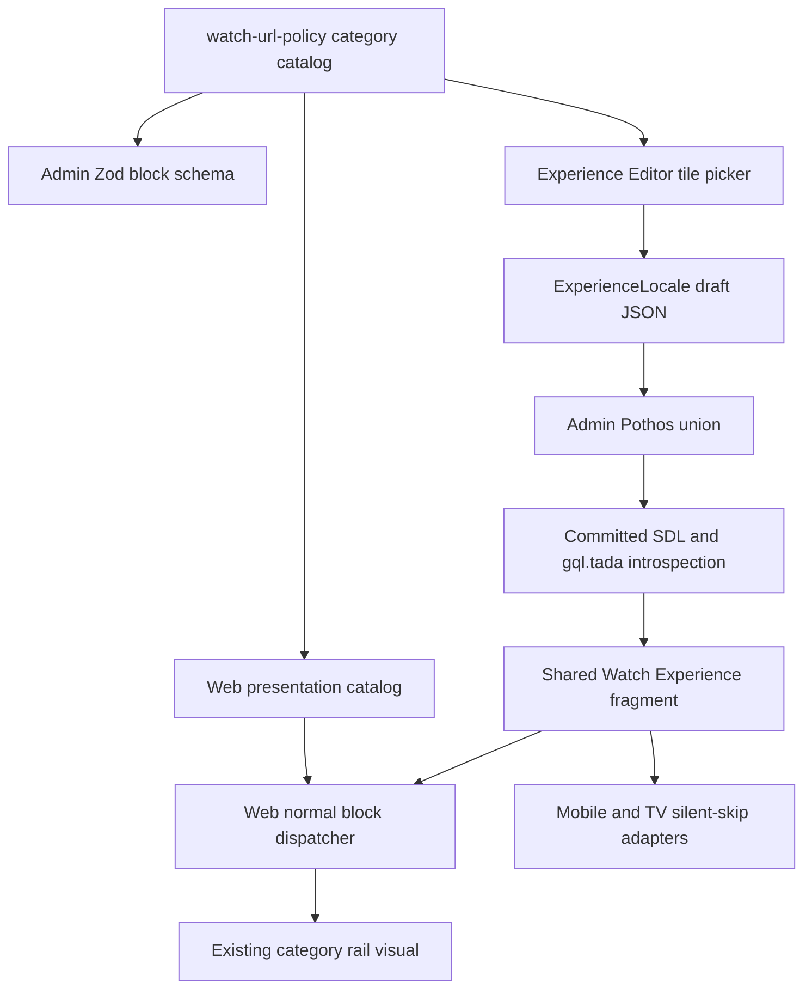
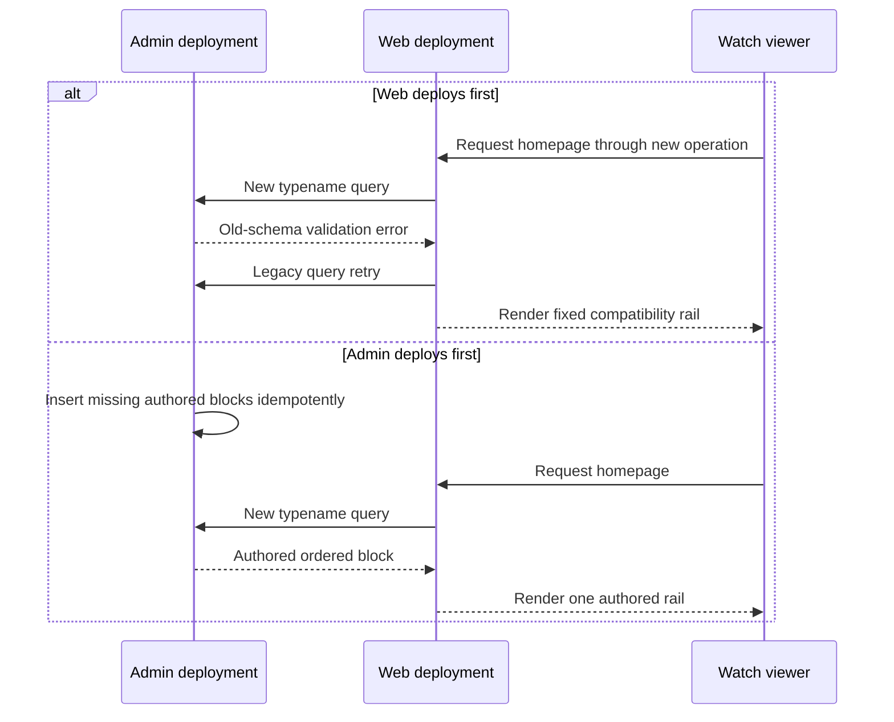

# Watch Category Rail Experience Block - Plan

## Goal Capsule

- **Objective:** Admins can place the Watch browse-by-category carousel anywhere in the homepage Experience and control the exact tile subset and order without changing code.
- **Means:** Replace the fixed homepage insertion with a top-level `watchHomeCategoryRail` block that stores ordered stable category IDs and renders through the normal Experience dispatcher (KTD2, KTD4).
- **Authority:** The user request owns product behavior. `AGENTS.md`, package-local guides, and generated-contract rules own repository constraints. Requirements in this plan own product behavior; Key Technical Decisions own implementation mechanisms.
- **Execution profile:** Cross-cutting code change across shared policy, Admin, GraphQL, Web, Mobile, and TV. Use focused tests before full touched-package checks, then browser and performance evidence.
- **Stop conditions:** Stop if the compatibility query cannot preserve the old rail against the old Admin schema, if the post-deploy backfill cannot update every homepage locale and active draft safely, or if selected IDs require a new homepage request.
- **Tail ownership:** The implementation owner carries the change through roadmap completion, generated artifacts, browser QA, performance evidence, commit, PR, and merge-readiness.

---

## Product Contract

### Summary

Turn the existing Watch homepage category rail into a standalone, rearrangeable Experience block. Admins select and order tiles from the existing closed category catalog. The rendered section keeps its current copy, localization, tile art, links, carousel geometry, accessibility, and responsive behavior.

### Problem Frame

Web currently inserts the category rail directly after the homepage hero. That placement bypasses the Experience block order, and the rail always renders all configured categories. Admins therefore cannot compose the section with the rest of the homepage or curate its contents.

### Requirements

**Authoring and persistence**

- R1. The Experience Editor offers one homepage-only, top-level category rail block that participates in the existing block reorder interaction, and every write path rejects non-homepage or duplicate placement.
- R2. The block stores an ordered, non-empty, duplicate-free subset of the 13 supported category IDs.
- R3. A newly inserted block starts with all supported categories in the current `WATCH_HOME_CATEGORIES` order.
- R4. Admins can add, remove, and reorder selected tiles, and save, discard, and reopen the draft without losing the selection or its order.
- R5. The category catalog is a closed shared contract for legal IDs, destinations, and stable staff-facing labels so Admin authoring and Web rendering cannot silently drift.

**Rendering and compatibility**

- R6. Web renders only the selected categories, in authored order, at the block's position in the Experience block array.
- R7. Web retains the existing localized heading, description, CTA, tile labels, icons, gradients, routes, grain, and carousel behavior.
- R8. Once Admin supports the block typename, removing the block from an Experience removes the section and Web does not synthesize an absent-block fallback.
- R9. Malformed consumer data cannot produce duplicate or broken tiles, and a selection with no valid IDs renders no section.
- R10. Mobile and TV recognize this Web-only typename and silently omit it from their homepage models.

**Contracts, agents, and rollout**

- R11. The block is available through Admin's validated JSON contract, Pothos union, committed SDL, generated gql.tada introspection, shared Watch Experience fragment, and draft preview query.
- R12. Live Admin AI chat and existing MCP create/update paths can preserve, select, and reorder this block under the same validation rules as manual editing.
- R13. Autonomous Experience generation does not invent this homepage-only block in this change.
- R14. The local seed and an idempotent reviewed post-deploy backfill insert the all-category block immediately after `watchHomeHero` for every homepage locale and active draft that lacks it; temporary Admin read synthesis preserves the rail until activation completes.
- R15. New Web falls back to the fixed rail only when the old Admin schema rejects the new block typename; once the schema supports the block, stored Experience content is authoritative and an absent block renders no rail.
- R16. Steady-state authored rendering adds no homepage fetch, increases initial transferred JavaScript by no more than 5 KiB gzip, keeps five-run median LCP within the larger of 100 ms or 5%, and keeps initial-window long-task time within the larger of 50 ms or 10%.

### Actors

- A1. **Experience admin:** Adds, removes, reorders, and edits the category rail.
- A2. **AI-assisted admin:** Uses live Experience chat or MCP create/update operations against the same block contract.
- A3. **Watch viewer:** Sees the selected category links in the authored section position.
- A4. **Release operator:** Verifies new Admin health/drain, explicit backfill activation, compatibility mode, and rollback sequence during rollout.

### Key Flows

- F1. **Manual authoring**
  - **Trigger:** A1 adds the category rail from the homepage block library.
  - **Steps:** The editor creates the all-category starter, A1 changes membership and tile order, then the existing draft lifecycle saves and publishes the block.
  - **Outcome:** The homepage renders the selected tiles at the authored block position.
  - **Covered by:** R1-R8, R11
- F2. **AI-assisted editing**
  - **Trigger:** A2 asks chat or an MCP client to select or reorder category tiles.
  - **Steps:** The editing path uses documented legal IDs, validates the full block array, and preserves the new block during unrelated edits.
  - **Outcome:** AI and manual authoring produce the same persisted contract.
  - **Covered by:** R2, R4, R5, R12, R13
- F3. **Race-safe production cutover**
  - **Trigger:** The merged change is prepared for deployment.
  - **Steps:** Admin expands its read contract without an automatic data write, temporary read synthesis preserves missing legacy rows, the reviewed backfill runs after new Admin health/drain, and new Web retries the legacy query plus fixed rail only while the old Admin schema rejects the typename.
  - **Outcome:** Either Railway deployment order preserves exactly one rail, and the fixed compatibility path stops automatically when Admin supports authored control.
  - **Covered by:** R8, R11, R14-R16

### Acceptance Examples

- AE1. **Covers R1, R3, R4, R6.** Given a homepage Experience, when an admin adds the block, removes `sports`, moves `family` before `gospels`, and saves, then reopening the draft and previewing the page shows the remaining tiles in that exact order and the block at its authored section position.
- AE2. **Covers R2, R5, R11.** Given duplicate or unknown category IDs from an editor, AI, or MCP mutation, when Admin validates the block array, then validation rejects the payload with no partial persistence.
- AE3. **Covers R1.** Given a non-homepage Experience or a homepage that already contains the block, when manual, AI, or MCP authoring attempts to add it, then the shared write boundary rejects the mutation.
- AE4. **Covers R8, R15.** Given Admin supports the new typename and a homepage Experience has no category block, when Web renders it, then no category rail appears.
- AE5. **Covers R9.** Given malformed legacy consumer data with duplicate and unknown IDs, when the Web adapter resolves the selection, then it renders each known ID at most once and renders nothing when none are valid.
- AE6. **Covers R10.** Given the shared fragment returns this typename to Mobile or TV, when either adapter builds its homepage model, then it emits no rail and no unknown-block warning.
- AE7. **Covers R14, R15.** Given a homepage locale or active draft without the block, new Admin reads synthesize the equivalent block before activation; when the reviewed post-deploy backfill runs after health/drain, it inserts exactly one all-category block after the hero, records completion atomically, and a second run makes no content change.
- AE8. **Covers R15.** Given new Web reaches old Admin, when the new typename is rejected during GraphQL validation, then Web retries the legacy operation and renders the fixed rail; unrelated GraphQL failures do not trigger compatibility mode.

### Success Criteria

- An admin can complete AE1 in the real editor and draft preview without editing JSON directly.
- Desktop and mobile Web screenshots match the existing section design except for the intentionally authored tile subset and section position.
- The post-change homepage uses one successful Experience request, and only the bounded old-schema compatibility case performs one failed validation attempt plus one legacy retry.

### Scope Boundaries

**In scope**

- Homepage-only singleton authoring, ordered tile selection, shared catalog, GraphQL propagation, Web rendering, draft preview, explicit AI/MCP editing parity, native-client silent compatibility, seed update, idempotent post-deploy backfill, schema compatibility, and rollback documentation.

**Outside this change**

- New category destinations, arbitrary admin-created tiles, editable tile presentation, new translations, changes to the browse-modal taxonomy, or Mobile/TV rendering parity.

### Deferred to Follow-Up Work

- Teach autonomous `experience.generate` workflows to propose this homepage-only block only if the product later defines when generation should include or omit it.
- Add format categories after label-filtered browse destinations exist, as already tracked by `feat-426`.
- Remove the legacy-schema query and fixed-rail compatibility path after old Admin versions can no longer serve Web traffic.

---

## Planning Contract

### Key Technical Decisions

- KTD1. **Share the closed category catalog from `@forge/watch-url-policy`.** Admin and Web already depend on this neutral package. It owns IDs, destinations, and stable staff labels; Web layers viewer-localized keys, gradients, and icons onto the shared entries.
- KTD2. **Persist only `categoryIds` plus an optional section key.** The ordered array is the authored contract; Web owns all presentation and localized content per `docs/solutions/architecture-patterns/admin-authored-web-owned-experience-block-contract-20260826.md`.
- KTD3. **Validate the authoring boundary strictly and defend the renderer leniently.** Admin rejects empty, duplicate, or unknown IDs. Web de-duplicates and filters malformed payloads so historical JSON cannot render broken cards.
- KTD4. **Use normal top-level block dispatch.** Add the block only to `BlockSchema`, not nested unions, and let the existing block map preserve editor order instead of handling it as another homepage special case.
- KTD5. **Make one-PR rollout order-independent.** Admin first expands the read contract and synthesizes missing legacy homepage rails without storage mutation. After new Admin health and old-instance drain, an idempotent reviewed backfill inserts the block into every homepage locale and active draft and atomically records activation. Web retries a legacy query and renders the fixed rail only when GraphQL reports that the old Admin schema does not know the new typename; it never uses compatibility mode for an activated supported-schema absent block or an unrelated failure.
- KTD6. **Support explicit AI editing but defer autonomous generation.** Update the live chat contract and existing MCP tool descriptions/tests. Do not add the block to the duplicated Mastra draft-generation schemas and prompts in this change.
- KTD7. **Treat Mobile and TV as known non-rendering consumers.** Extend their silent-skip sets because the shared fragment union reaches both clients, without expanding the request into native UI work.
- KTD8. **Make rollback reverse the data dependency.** Roll Web back first so the fixed rail is restored. While new Admin is still live, remove the authored block from every canonical homepage locale and active draft, verify old Web and the homepage query, and only then roll Admin back.
- KTD9. **Enforce homepage singleton placement at the shared service boundary.** The block-array schema rejects duplicates, while Experience create, draft-save, and publish paths compare the effective `isHomepage` state so manual, chat, and MCP writes share one invariant.

### Assumptions

- The requested section is the existing Watch homepage `WatchHomeCategoryRail` shown in the supplied screenshot.
- “Standalone” means a top-level Experience block, and the block library should expose it only for homepage Experiences because its content and CTA are Watch-home-specific.
- At least one tile must be selected. Admins hide the entire section by removing its block.
- The current 13 tile IDs and their existing order are the initial supported catalog and default selection.
- The authorized change includes code, a committed idempotent post-deploy backfill artifact and command, local seed data, and rollout documentation, but not pasted production SQL or a direct deployment.

### High-Level Technical Design

The following sketches define direction and ownership; implementation details remain with each unit.

### System-Wide Impact

- **Data lifecycle:** A new JSON discriminator flows through canonical Experience locales and active drafts. Temporary read synthesis preserves legacy behavior until a one-time idempotent post-deploy backfill establishes the equivalent stored state and atomically records activation; later save, discard, publish, and revision behavior remains authoritative.
- **API contract:** The `ExperienceBlock` GraphQL union gains one member and the shared Watch fragment selects it, requiring regenerated SDL and gql.tada introspection.
- **Consumer behavior:** Web renders the block. Mobile and TV receive the typename through the shared fragment but intentionally omit it.
- **Agent/tool parity:** Live AI chat and MCP create/update flows must understand the legal ID set. Autonomous draft generation remains intentionally unchanged.
- **Performance:** The selected IDs arrive inside the existing homepage Experience response. Dynamic dispatch must not inflate unrelated routes or introduce another request.
- **Operations:** Either forward deployment order is safe. Admin rollback remains gated on removing the new discriminator while the new Admin can still read it.

### Risks and Mitigations

- **Missing rail during cutover:** New Web may reach old Admin, or new Admin may serve pre-backfill content. Limit Web compatibility fallback to the specific unknown-typename validation error, synthesize the equivalent rail on new Admin reads until activation, and make the post-deploy backfill plus completion marker atomic and idempotent across canonical rows and active drafts.
- **Duplicate rail during cutover:** Old Web continues its fixed insertion while ignoring the new union member. New Web disables fixed insertion whenever the new schema answers successfully, so it renders only stored content.
- **Catalog drift:** Parallel hard-coded ID lists could make Admin accept tiles Web cannot render. Put IDs and destinations in one shared module and test Web presentation coverage in both directions.
- **Generated contract drift:** Hand edits to SDL or gql.tada output can mask missing schema wiring. Generate both artifacts and rerun generation until the diff is clean.
- **Editor complexity:** Tile ordering can interfere with page-level block drag and keyboard focus. Isolate button-based tile controls in a block-specific component and test tile order separately from block order.
- **Bundle regression:** Moving the rail behind section dispatch changes its import boundary. Compare before/after route assets and verify non-home routes do not eagerly load the rail chunk.
- **Admin redeploy drift:** A shared-catalog-only change must redeploy Admin as well as Web. Add the shared package to Admin's Railway watch patterns.
- **Rollback query failure:** Old Admin cannot resolve stored instances of the new discriminator. Roll back Web, remove the discriminator from canonical homepage rows and active drafts, verify, then roll back Admin per KTD8.

### Research Sources

- `docs/roadmap/content-discovery/feat-426-watch-home-category-rail.md` defines the existing rail's visual, route, localization, and performance contract.
- `docs/roadmap/topic-experiences/feat-423-watch-language-globe-experience-block.md` is the direct fixed-section-to-authored-block precedent.
- `docs/solutions/architecture-patterns/admin-authored-web-owned-experience-block-contract-20260826.md` defines the cross-layer block pipeline and ownership boundary.
- `docs/solutions/cms/experience-locale-content-revision-draft-gateway.md` defines canonical, draft, save, discard, and publish behavior.
- `docs/solutions/conventions/frontend-change-page-load-performance-verification.md` defines the required loading-performance evidence.
- `apps/web/src/lib/watch-home-categories.ts` and `apps/web/src/components/home/WatchHomeCategoryRail.tsx` define the existing tile catalog and renderer.
- `apps/admin/src/domain/blocks.ts`, `apps/admin/src/graphql/types/blocks.ts`, and `packages/admin-graphql/src/fragments/watch-experience.ts` define the persistence-to-consumer contract seams.

---

## Implementation Units

### U1. Establish the shared category contract and roadmap trace

- **Goal:** Create one stable catalog for legal IDs and destinations, and connect the work to its roadmap predecessor.
- **Requirements:** R2, R3, R5
- **Dependencies:** None
- **Files:**
  - `packages/watch-url-policy/package.json`
  - `packages/watch-url-policy/src/watch-home-categories.ts`
  - `packages/watch-url-policy/src/watch-home-categories.test.ts`
  - `apps/web/src/lib/watch-home-categories.ts`
  - `apps/admin/railway.toml`
  - `docs/roadmap/content-discovery/feat-426-watch-home-category-rail.md`
  - `docs/roadmap/topic-experiences/feat-436-watch-home-category-rail-experience-block.md`
- **Approach:**
  1. Export the ordered 13-entry ID, slug, and staff-label catalog through a dedicated package subpath per KTD1.
  2. Derive the Web presentation catalog from the shared entries and keep its exact icon coverage checks.
  3. Add the package to Admin's Railway watch patterns so catalog-only changes redeploy both consumers.
  4. Keep the roadmap dependency bidirectional and leave `feat-436` in progress until implementation verification completes.
- **Patterns to follow:** `packages/watch-url-policy/src/routes.ts`; `apps/web/src/lib/watch-home-categories.ts`; roadmap frontmatter conventions.
- **Test scenarios:**
  - The catalog exposes all 13 IDs in the existing order with unique IDs, destinations, and non-empty staff labels.
  - Web presentation entries cover every shared ID exactly once and introduce no presentation-only ID.
  - A shared-catalog-only diff matches both Admin and Web Railway watch patterns.
- **Verification:** Package tests and typecheck pass, and the Web category contract still resolves every existing destination.

### U2. Add the validated Admin and GraphQL block contract

- **Goal:** Carry the top-level block from persisted JSON through the public GraphQL union and generated client types.
- **Requirements:** R1-R3, R5, R11
- **Dependencies:** U1
- **Files:**
  - `apps/admin/src/domain/blocks.ts`
  - `apps/admin/src/domain/blocks.test.ts`
  - `apps/admin/src/graphql/types/blocks.ts`
  - `apps/admin/src/graphql/types/blocks.test.ts`
  - `apps/admin/src/graphql/types/blocks.drift.test.ts`
  - `apps/admin/prisma/backfills/watch-home-category-rail-block.sql`
  - `apps/admin/src/services/watch-home-category-rail-rollout.ts`
  - `apps/admin/schema.graphql`
  - `packages/admin-graphql/src/fragments/blocks/watch-home-category-rail.ts`
  - `packages/admin-graphql/src/fragments/index.ts`
  - `packages/admin-graphql/src/fragments/watch-experience.ts`
  - `packages/admin-graphql/src/admin-graphql-env.d.ts`
- **Approach:**
  1. Add the strict ordered-ID schema only to the top-level block union per KTD2-KTD4.
  2. Make the full block-array schema reject more than one category rail.
  3. Add the Pothos object, discriminator mapping, union member, and shared fragment dependency.
  4. Add an idempotent reviewed post-deploy backfill that inserts the default block after the first hero, or first when no hero exists, in every homepage locale and active draft that lacks it, then atomically records the completion marker.
  5. Until that marker exists, synthesize the same block at Admin's canonical, effective-draft, and preview GraphQL read boundaries without mutating storage.
  6. Generate the committed SDL and gql.tada introspection from their owning schemas.
- **Execution note:** Start with failing domain and GraphQL mapping tests, then regenerate artifacts only after the schema is complete.
- **Patterns to follow:** `WatchHomeHeroBlockSchema`; `LanguageGlobeBlockRef`; `packages/admin-graphql/src/fragments/blocks/language-globe.ts`.
- **Test scenarios:**
  - A valid ordered subset parses and GraphQL returns the same order and `WatchHomeCategoryRailBlock` typename.
  - Empty, duplicate, or unknown IDs fail Admin validation.
  - The block parses at the top level and fails inside section and container content unions.
  - A block array with two category rails fails validation.
  - Canonical homepage JSON and active draft envelopes gain one correctly placed block; non-homepage, already-migrated, malformed non-array, historical, and discarded data remain unchanged.
  - Running the backfill transformation twice produces the same JSON as running it once.
  - The Zod discriminator set, Pothos mapping, object fixture set, SDL, and generated introspection remain in sync.
- **Verification:** Focused Admin domain/GraphQL tests pass, schema generation succeeds, gql.tada generation succeeds, and a second generation run produces no diff.

### U3. Build the category selection editor

- **Goal:** Let admins add the block, curate tile membership and order, and move the block through the existing Experience canvas.
- **Requirements:** R1-R4
- **Dependencies:** U1, U2
- **Files:**
  - `apps/admin/src/app/dashboard/experiences/experience-editor/block-helpers.ts`
  - `apps/admin/src/app/dashboard/experiences/experience-editor/block-helpers.test.ts`
  - `apps/admin/src/app/dashboard/experiences/experience-editor/watch-home-category-rail-editor.tsx`
  - `apps/admin/src/app/dashboard/experiences/experience-editor/watch-home-category-rail-editor.test.tsx`
  - `apps/admin/src/app/dashboard/experiences/experience-editor.tsx`
  - `apps/admin/src/app/dashboard/experiences/experience-editor.test.tsx`
  - `apps/admin/src/services/experience.service.ts`
  - `apps/admin/src/services/experience.service.test.ts`
- **Approach:**
  1. Add the homepage-only singleton library definition, valid all-category starter, and selected-count summary.
  2. Isolate the tile picker in a block-specific component as required by the editor's local README.
  3. Show every row's staff label and destination. Use keyboard-operable Move up and Move down controls with disabled boundary states, retained focus, and position announcements instead of a nested drag context.
  4. Disable final-tile removal with accessible guidance to remove the whole block when the admin wants to hide the section.
  5. Enforce KTD9 in Experience create, draft-save, and publish flows using effective draft state.
  6. Route every change through the editor's normal hidden JSON, validation, dirty-state, draft save, discard, and preview flow.
- **Patterns to follow:** `experience-editor/README.md`; existing video and navigation carousel item controls; `CanvasBlockList`.
- **Test scenarios:**
  - The library entry appears only for a homepage Experience without the block and inserts all 13 IDs in catalog order.
  - Non-homepage and duplicate singleton writes fail through create, draft-save, and publish service paths.
  - Removing an item updates the hidden block JSON; adding it again appends it once.
  - Move controls persist the exact new order, disable at list boundaries, retain focus, announce position, and do not move the containing block.
  - Moving the containing block persists its new top-level position without changing selected tile order.
  - Save and reopen restores the selection; discard restores the last persisted selection.
  - The final remove control is disabled and explains that removing the block hides the section.
- **Verification:** Helper, component, and editor integration tests pass, and the inserted starter validates with `BlocksSchema`.

### U4. Extend explicit AI and MCP editing parity

- **Goal:** Make agent-assisted editing preserve and intentionally modify the new block without widening autonomous generation.
- **Requirements:** R2, R4, R5, R12, R13
- **Dependencies:** U1, U2
- **Files:**
  - `apps/admin/src/services/experience-ai/experience-ai-chat-prompts.ts`
  - `apps/admin/src/services/experience-ai/experience-ai-chat-prompts.test.ts`
  - `apps/admin/src/mcp/admin-mcp-tools.ts`
  - `apps/admin/src/app/mcp/route.test.ts`
  - `apps/admin/src/services/experience-mcp.service.test.ts`
- **Approach:**
  1. Add the block shape, top-level restriction, legal IDs, and ordered-selection semantics to the live Admin-built chat prompt per KTD6.
  2. Include the effective homepage state in prompt guidance so chat never proposes the block for a non-homepage Experience.
  3. Update existing create/update tool descriptions rather than adding a new tool.
  4. Prove MCP requests round-trip the ordered selection through `BlocksSchema` and the shared placement invariant, rejecting invalid input atomically.
  5. Leave autonomous generation schemas and duplicated Mastra generation prompts untouched.
- **Patterns to follow:** Existing block instructions in `experience-ai-chat-prompts.ts`; existing MCP experience create/update route and service tests.
- **Test scenarios:**
  - The live chat prompt names the block shape, all legal IDs, ordering behavior, and top-level-only rule.
  - An unrelated AI edit preserves an existing category rail and its category order.
  - MCP create/update accepts a valid subset and persists its order.
  - MCP create/update rejects duplicate or unknown IDs without partial mutation.
  - Chat and MCP reject the block for a non-homepage Experience and reject a second instance on a homepage.
- **Verification:** Focused chat prompt, MCP route, and MCP service tests pass, and no autonomous draft schema includes the new discriminator.

### U5. Propagate the shared fragment to preview and native consumers

- **Goal:** Make every current consumer handle the new GraphQL union member intentionally.
- **Requirements:** R10, R11
- **Dependencies:** U2
- **Files:**
  - `apps/web/src/lib/experience-preview.ts`
  - `apps/web/src/lib/experience-preview.test.ts`
  - `apps/web/src/lib/fragments/__tests__/watch-experience.test.ts`
  - `apps/mobile/src/lib/watchHome/experienceAdapter.ts`
  - `apps/mobile/src/lib/watchHome/__tests__/experienceAdapter.test.ts`
  - `apps/tv/src/lib/watchHome/experienceAdapter.ts`
  - `apps/tv/src/lib/watchHome/experienceAdapter.test.ts`
- **Approach:**
  1. Compose the new fragment into the draft preview operation and its dependency list.
  2. Export a temporary legacy Watch Experience fragment that omits the new inline fragment for old-schema compatibility.
  3. Assert both shared fragments print the expected selection surface.
  4. Add the typename to Mobile and TV known-silent-skip paths per KTD7.
- **Patterns to follow:** Language globe draft-preview fragment composition; Watch hero silent-skip handling in native adapters.
- **Test scenarios:**
  - Draft preview returns the selected IDs in authored order.
  - The shared fragment includes `categoryIds` and the correct inline-fragment typename.
  - The compatibility fragment omits the new typename while retaining every previously supported block selection.
  - Mobile and TV omit the block without warning while preserving surrounding media block order.
- **Verification:** Focused Web fragment/preview tests and both native adapter suites pass.

### U6. Render the authored selection and remove fixed placement

- **Goal:** Render the current category rail through normal Experience dispatch with authored membership and placement.
- **Requirements:** R6-R9, R11, R15-R16
- **Dependencies:** U1, U2, U5
- **Files:**
  - `apps/web/src/components/home/WatchHomeCategoryRail.tsx`
  - `apps/web/src/components/home/__tests__/WatchHomeCategoryRail.test.tsx`
  - `apps/web/src/components/sections/index.tsx`
  - `apps/web/src/components/sections/WatchHomeCategoryRailExperience.test.tsx`
  - `apps/web/src/components/home/WatchHomeExperiencePage.tsx`
  - `apps/web/src/components/home/WatchHomeExperiencePage.test.tsx`
  - `apps/web/src/lib/watch-home.ts`
  - `apps/web/src/lib/__tests__/watch-home.test.ts`
- **Approach:**
  1. Resolve authored IDs against the presentation catalog in one pass and apply the defensive boundary in KTD3.
  2. Register a dynamically imported section renderer in the ordinary dispatcher and pass the Experience language slug.
  3. Try the new homepage operation first. Retry the legacy operation only for the specific unknown-typename GraphQL validation failure and return an explicit compatibility-mode flag.
  4. Remove the unconditional fixed insertions. Render the fixed rail after the hero only when the compatibility flag proves Web is talking to old Admin.
  5. Preserve existing component markup and styling except for sourcing the ordered selection.
- **Execution note:** Characterize current links, copy, geometry markers, and accessibility before changing placement.
- **Patterns to follow:** Existing category rail tests; Language Globe dispatcher registration; `WatchHomeExperiencePage` authored-order tests.
- **Test scenarios:**
  - A selected subset renders once in exact authored order with existing localized links and CTA.
  - Duplicate and unknown consumer IDs are filtered, and no valid IDs produce no section.
  - The block renders before, between, or after other authored blocks according to the Experience array.
  - A supported-schema homepage without the block renders no category rail on both authored-hero and fallback-hero paths.
  - An old-schema unknown-typename validation response performs one legacy retry and renders one fixed rail after either hero path.
  - Network, authorization, timeout, resolver, and unrelated GraphQL validation failures do not retry or enable the fixed rail.
  - Every selected known ID still receives its icon, gradient, grain layer, keyboard focus target, and localized label.
- **Verification:** Focused component, dispatcher, and homepage tests pass with no static rail import or post-hero insertion remaining.

### U7. Preserve seeded content and prove rollout, UX, and performance

- **Goal:** Preserve the intended homepage composition in seeded environments and collect release-grade evidence for the cross-app cutover.
- **Requirements:** R4, R6-R8, R14-R16
- **Dependencies:** U3-U6
- **Files:**
  - `apps/admin/src/scripts/seed-watch-homepage-experience.ts`
  - `apps/admin/src/scripts/seed-watch-homepage-experience.test.ts`
  - `docs/runbooks/watch-home-category-rail-rollout.md`
  - `docs/roadmap/topic-experiences/feat-436-watch-home-category-rail-experience-block.md`
- **Approach:**
  1. Insert the all-category block immediately after `watchHomeHero` in the local homepage seed.
  2. Record browser, performance, backfill, compatibility, and rollback evidence in the roadmap completion notes.
  3. Mark `feat-436` complete after implementation verification and PR readiness; live deployment remains governed by the rollout gate rather than blocking code completion.
- **Patterns to follow:** The seeded `languageGlobe` block; `docs/solutions/conventions/frontend-change-page-load-performance-verification.md`; prior roadmap completion notes.
- **Test scenarios:**
  - The seed block array validates and places exactly one category rail immediately after the hero.
  - Desktop and mobile Admin flows add, select, keyboard-reorder, save, discard, and preview the block without console errors.
  - Desktop and mobile Web renders show the authored order, usable carousel controls, no horizontal page overflow, and no duplicate rail.
  - Before/after loading evidence meets R16's exact JavaScript, LCP, and long-task budgets.
  - Web-first and Admin-first staging drills each preserve one rail, and compatibility mode ends after the Admin schema becomes available.
  - A rollback drill restores old Web first, removes the authored discriminator from canonical homepage rows and active drafts while new Admin remains live, verifies the homepage, and only then permits Admin rollback.
- **Verification:** Seed tests, complete touched-package quality gates, browser evidence, performance comparison, clean generated-artifact rerun, and rollout gate are recorded before roadmap completion.

---

## Verification Contract

| Gate                        | Scope                                                                                                         | Done signal                                                                                                                                                                             |
| --------------------------- | ------------------------------------------------------------------------------------------------------------- | --------------------------------------------------------------------------------------------------------------------------------------------------------------------------------------- |
| Focused Admin contract      | Admin domain, Pothos, drift, helpers, editor, chat, MCP                                                       | All targeted Vitest suites pass and invalid selections fail atomically.                                                                                                                 |
| Generated GraphQL           | Admin SDL and Admin GraphQL introspection                                                                     | `pnpm --filter @forge/admin schema:print` and `pnpm --filter @forge/admin-graphql generate` succeed; rerunning both leaves no diff.                                                     |
| Focused consumer behavior   | Web rail, dispatcher, homepage, fragment, preview; Mobile/TV adapters                                         | Targeted Vitest/Jest suites prove AE1-AE6 and AE8.                                                                                                                                      |
| Package quality             | `@forge/watch-url-policy`, `@forge/admin`, `@forge/admin-graphql`, `@forge/web`, `@forge/mobile`, `@forge/tv` | Tests, lint, and typecheck pass for every touched package.                                                                                                                              |
| Web locale policy           | Existing category copy                                                                                        | `check:ui-locales` and `check:provisional-ui-catalogs` pass with no catalog changes required.                                                                                           |
| Formatting and diff hygiene | Entire touched scope                                                                                          | Prettier check and `git diff --check` pass; no unrelated or abandoned-attempt code remains.                                                                                             |
| Browser authoring           | Admin at 1440px and 390px                                                                                     | Add, select, keyboard-reorder tiles, reorder the block, save, discard, and draft preview work with no console error or overflow.                                                        |
| Browser presentation        | Web at 1440px and 390px                                                                                       | Authored order and subset are exact; CTA, focus, controls, and routes work; no duplicate rail or horizontal page overflow appears.                                                      |
| Loading performance         | Watch homepage before and after production build/start                                                        | No steady-state request increase; initial JavaScript is within +5 KiB gzip, five-run median LCP is within max(100 ms, 5%), and initial-window long-task time is within max(50 ms, 10%). |
| Forward rollout             | Old/new Admin crossed with old/new Web in staging                                                             | Web-first uses one legacy retry and fixed rail; Admin-first exposes one migrated authored rail; both converge on authored mode with no duplicate or missing section.                    |
| Rollback readiness          | New Admin with stored block, then old Web and old Admin                                                       | Web reverts first, stored discriminators are removed while new Admin is live, old Web and the query are verified, then Admin rollback is permitted (KTD8).                              |
| Final behavioral evaluation | LFG browser-test stage                                                                                        | `compound-engineering:ce-test-browser` passes against affected Admin and Web flows before commit and PR.                                                                                |

---

## Definition of Done

- U1-U7 are implemented and their requirement links are satisfied.
- AE1-AE8 have automated or recorded operational proof at the appropriate boundary.
- The category rail is no longer hard-coded into `WatchHomeExperiencePage` and renders only from stored Experience order.
- Admin can author a valid ordered subset without direct JSON editing, and both manual and explicit AI/MCP paths obey the same contract.
- Admin SDL and gql.tada outputs are generated, committed, and stable on rerun.
- Mobile and TV treat the typename as an intentional silent skip.
- The seed, temporary read synthesis, and idempotent post-deploy backfill preserve the existing all-category section across every homepage locale and active draft.
- Focused and full touched-package checks, browser QA, and loading-performance verification pass.
- The roadmap ticket is complete with implementation evidence and the release notes carry the forward and rollback gates; no dead-end, experimental, generated-by-hand, or unrelated code remains in the diff.
- The change is committed, pushed, opened as a PR, reviewed, and merge-ready with required CI green.
