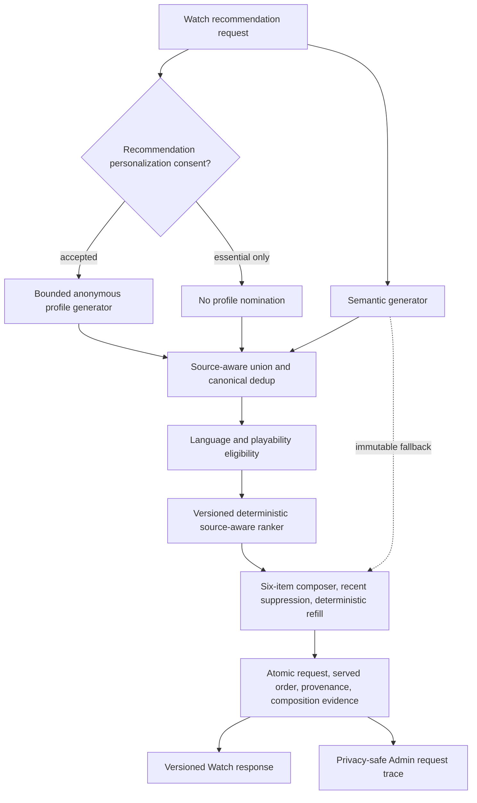
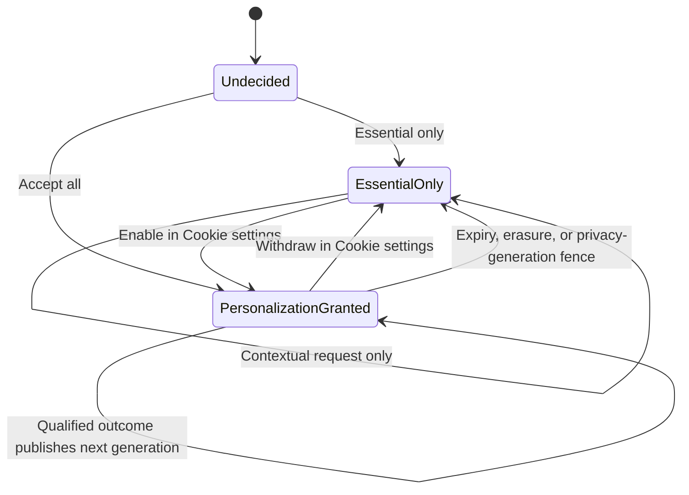
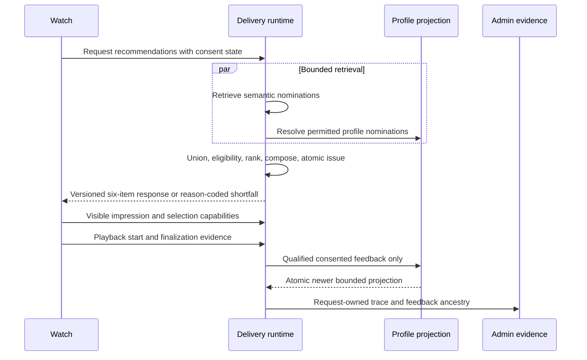

# Consent-Aware Hybrid Watch Recommendations - Plan

> **Superseded operating model (post-#2137):** This implementation-era plan preserves historical rationale, but its cookie-banner, bounded-assignment, shadow-authorization, and promotion-gate instructions no longer describe ordinary production delivery. Current `main` establishes personalization automatically, provides persistent reset/withdraw/delete controls, authorizes published profiles directly without requiring an experiment assignment, and records actual execution mode plus optional historical assignment evidence. The canonical plan's amended U30 contract is authoritative.

## Goal Capsule

- **Objective:** Every eligible Watch page shows a useful six-item contextual slate when catalogue capacity permits, and viewers who accept recommendation personalization receive a profile-informed cross-visit slate whose incremental relevance can be evaluated against the semantic control and whose influence and outcomes are reconcilable in Admin.
- **Means:** Execute semantic and consent-permitted profile nominations through the canonical shared union, eligibility, deterministic ranker, and composer while retaining semantic-only as the immutable control and rollback strategy (KTD1, KTD2).
- **Authority:** The canonical recommendation plan and its U1 contract remain the source of truth. The session-settled Product Contract amendments in this plan govern the consent default, mature hybrid serving shape, exact-six target, and repetition behavior for this branch.
- **Execution profile:** Deep, privacy-sensitive, cross-surface code work in the existing isolated feat-368 worktree.
- **Stop conditions:** Stop rather than weaken the 1,500 ms complete-service contract, expose raw profile material, reinterpret an immutable manifest, bypass promotion or rollback authority, delay playback, break the versioned semantic response, or change the compatibility query.
- **Tail ownership:** Complete implementation, migrations, generated artifacts, restored vector-snapshot proof, formal review, browser reconciliation, PR update without merge, and a running local Watch/Admin preview.

---

## Product Contract

### Preservation Statement

The canonical plan at `docs/plans/2026-08-18-2219-feat-watch-recommendation-learning-system-plan.md` remains authoritative for the recommendation system. The focused U1 plan at `docs/plans/2026-08-19-0251-feat-production-semantic-recommendation-tracer-plan.md` remains authoritative for the versioned semantic response, recommendation-owned evidence, lifecycle telemetry, Admin request trace, retention, fallback, and compatibility behavior.

This plan carries four explicit user-directed amendments. It replaces profile-only slate substitution with the canonical mature hybrid candidate path. It supersedes only the canonical plan's immediate session personalization: the existing 24-hour recommendation session remains a purpose-limited operational nonce for admission, capability fencing, replay protection, and request-owned lifecycle evidence, but Essential-only mode cannot use it for profile resolution, rank features, experiment assignment, cross-visit interests, or profile learning. Reusable recommendation profile state begins only after a fresh versioned grant. It strengthens “at most six” to “six unique playable items whenever six eligible candidates exist.” It pulls the repetition-control subset of the slate-composer work into this branch without claiming the full editorial composer ticket complete.

### Summary

Watch always keeps contextual semantic recommendations available. When the viewer accepts recommendation personalization, bounded anonymous interests add candidates to the same request rather than replacing semantic coverage. One transparent deterministic pipeline canonicalizes, filters, ranks, and composes the combined pool. Sparse or failed profile input becomes absence of signal, so it cannot reduce the semantic slate.

A first-visit cookie banner explains essential storage and optional recommendation personalization through `Accept all`, `Essential only`, and `Manage choices`. The choice dismisses the banner and remains available through `Cookie settings`. Essential-only mode creates no durable recommendation profile and does not use prior-viewer interests. Accept-all mode enables the existing protected anonymous profile, qualified feedback, cross-visit influence, and repetition suppression.

### Key Decisions

- **Mature hybrid serving path** (session-settled: user-directed — chosen over a profile-only challenger slate: semantic and profile are candidate generators for one production architecture). Governs R47-R52.
- **Contextual recommendations without personalization consent** (session-settled: user-directed — chosen over hiding recommendations or treating profile learning as essential: viewers still receive semantic value). Governs R53-R56.
- **Three-action cookie banner** (session-settled: user-directed — chosen over an inline recommendation control: the first-visit banner is the primary consent surface and disappears after a final choice). Governs R53-R58.
- **Six useful recommendations when capacity permits** (session-settled: user-directed — chosen over accepting sparse non-empty slates: the profile source must never collapse coverage). Governs R49-R52, R59-R61.
- **PR held for human verification** (session-settled: user-directed — chosen over merging after automated proof: the branch may be pushed but must not merge into main). Governs R69.

### Actors

- A1. **Essential-only viewer:** Receives contextual semantic recommendations without a durable recommendation profile.
- A2. **Personalization viewer:** Has accepted optional recommendation personalization and may receive profile-informed candidates across visits.
- A3. **Admin operator:** Reconciles delivery, source contribution, composition, consent-safe profile influence, and lifecycle outcomes without seeing viewer secrets or raw history.
- A4. **Recommendation runtime:** Retrieves candidate sources, enforces consent and eligibility, composes a slate, commits evidence, and serves within the fixed deadline.
- A5. **Profile projection runtime:** Publishes bounded anonymous interests only from permitted and qualified feedback.

### Requirements

**Candidate retrieval and composition**

- R47. Every personalized request must nominate semantic and consent-permitted profile candidates into one source-aware union before eligibility, deterministic ranking, and composition.
- R48. Semantic-only must remain a separately versioned live control, last-known-good fallback, kill-switch target, and experiment comparator.
- R49. Sparse, empty, stale, withdrawn, timed-out, or failed profile input must remove only profile influence and must not reduce an otherwise available semantic slate.
- R50. The response must contain six unique playable Videos when at least six candidates satisfy the request Language and eligibility policy before the deadline.
- R51. The composer must suppress the current Video and, in personalized mode, bounded recently watched, selected, or repeatedly served Videos before deterministic refill.
- R52. A response with fewer than six items must persist a bounded shortfall reason that distinguishes insufficient candidates, unavailable seed material, eligibility exhaustion, and deadline exhaustion.

**Consent and profile lifecycle**

- R53. A first-visit Watch page must show an accessible three-action cookie banner with `Accept all`, `Essential only`, and `Manage choices`, while essential storage remains always active.
- R54. A final banner choice must dismiss the banner, persist the choice, and remain changeable through a durable `Cookie settings` entry point.
- R55. Essential-only mode must keep contextual semantic recommendations available without reading or updating the anonymous recommendation profile.
- R56. Accept-all mode must grant recommendation personalization, enable the protected anonymous profile, and permit qualified recommendation outcomes to influence later requests.
- R57. Withdrawal, reset, expiry, erasure, or privacy-generation change must remove future profile influence, fence stale profile publication and capabilities, notify open tabs, and refresh any visible personalized slate.
- R58. The banner and settings UI must state only behavior the implementation can enforce; Watch analytics that lack a separately valid consent signal must remain inactive, and production release still requires jurisdiction-specific wording review.

**Learning, evidence, and Admin proof**

- R59. Eligible impression, recommendation selection, successful playback start, finalization, classifier outcome, and accepted profile feedback must remain separate recommendation-owned facts.
- R60. Selection may update only bounded short-lived intent; durable interests require a consented qualified finalized outcome.
- R61. The next eligible personalized request must be able to consume a newer atomic profile projection while preserving feedback ancestry and preventing one-item or same-title loops.
- R62. Admin request detail must explain contextual versus hybrid mode, all contributing candidate sources, pre/post composition order, suppressions, refill, requested/composed count, shortfall reason, effective manifest, fallback, profile generation, and feedback ancestry.
- R63. Raw cookies, session/profile identifiers, histories, cohort membership, vectors, and unbounded interest material must not enter the Watch response, recommendation serving record, or Admin response.

**Compatibility, performance, and operations**

- R64. The public `semantic-recommendation-v1` response and `sceneRecommendations` compatibility behavior must remain backward compatible through additive fields only.
- R65. Delivery, complete durable issuance, and response serialization must stay within one absolute 1,500 ms deadline on the restored vector-bearing production snapshot; the timeout must not be increased.
- R66. Recommendation, profile, telemetry, or Admin failures must never block the current Video from loading or playing.
- R67. A new immutable hybrid manifest must pin every generator, union, eligibility, ranker, composer, fallback, and deadline version without reinterpreting prior profile-challenger evidence.
- R68. No non-zero production exposure may bypass the existing shadow decision, experiment assignment, promotion, kill switch, rollback, or evidence-eligibility gates.
- R69. The completed branch may be committed and pushed to the existing PR, but the PR must remain unmerged for local human verification.

### Key Flows

- F1. **Essential-only contextual delivery**
  - **Trigger:** A1 chooses `Essential only` or returns with that saved choice.
  - **Actors:** A1, A4.
  - **Steps:** Watch requests contextual recommendations, the runtime executes the semantic control strategy, the composer returns six when capacity permits, and purpose-limited operational-session capabilities attribute lifecycle evidence without creating or consulting a recommendation profile.
  - **Outcome:** The viewer receives useful recommendations and no prior-viewer interests influence the slate.
  - **Covered by:** R48-R55, R59, R63-R66.

- F2. **Consent to qualified profile influence**
  - **Trigger:** A2 selects `Accept all`, selects a recommendation, and produces a qualified finalized playback outcome.
  - **Actors:** A2, A4, A5.
  - **Steps:** The profile grant enables protected anonymous state, lifecycle facts are committed, qualified feedback publishes a newer bounded projection, and a later request combines semantic and profile nominations through one pipeline.
  - **Outcome:** The later slate can reflect learned interests without losing semantic coverage.
  - **Covered by:** R47-R51, R54-R57, R59-R61, R63.

- F3. **Sparse profile and repetition recovery**
  - **Trigger:** A personalized request yields one profile candidate, repeated candidates, or a profile failure.
  - **Actors:** A2, A4.
  - **Steps:** The runtime treats missing profile signal as source-local, suppresses current/recent duplicates, refills from eligible semantic candidates, and records composition evidence.
  - **Outcome:** The viewer receives six varied Videos when six eligible candidates exist; otherwise the trace shows one bounded shortfall reason.
  - **Covered by:** R47-R52, R61-R62, R65-R66.

- F4. **Watch-to-Admin reconciliation**
  - **Trigger:** A3 opens the request created by F1 or F2.
  - **Actors:** A3, A4, A5.
  - **Steps:** Admin loads request-owned source, rank, composition, consent-safe profile, lifecycle, classifier, and retention evidence.
  - **Outcome:** The operator can explain every served position and later profile influence without recovering viewer identity or raw history.
  - **Covered by:** R59-R63, R67-R68.

### Acceptance Examples

- AE1. **Covers R47-R50, R62.** Given semantic retrieval yields eighteen eligible candidates and the active profile yields one candidate, when the hybrid request is composed, then the response contains six unique playable Videos and Admin shows the profile contribution plus semantic refill.
- AE2. **Covers R48-R50, R66.** Given profile resolution times out or returns stale state, when semantic retrieval succeeds, then Watch receives the semantic slate and the trace records a source-local fallback without delaying playback.
- AE3. **Covers R51-R52, R61-R62.** Given the viewer has recently watched or repeatedly received several top candidates, when enough other eligible candidates exist, then those repeats are suppressed, six replacements are composed deterministically, and Admin explains each removal and refill.
- AE4. **Covers R52.** Given fewer than six candidates survive source retrieval and eligibility, when composition finishes, then the response contains the available unique candidates and one truthful bounded shortfall reason rather than synthetic or duplicate items.
- AE5. **Covers R53-R56.** Given a first-time viewer sees the banner, when they choose `Essential only`, then the banner disappears, contextual recommendations remain, and no recommendation profile is created or read.
- AE6. **Covers R53-R57.** Given a viewer chooses `Accept all` and later opens `Cookie settings`, when they disable personalization, then future requests use the semantic control path and stale profile generations cannot publish or influence delivery.
- AE7. **Covers R59-R63.** Given a consented viewer selects a card, starts playback, and produces a qualified finalized outcome, when a later hybrid request is inspected, then Admin links the accepted feedback to the newer projection and shows the resulting bounded source contribution without exposing raw identity, history, or vectors.
- AE8. **Covers R64-R66.** Given the recommendation service or evidence endpoint fails, when Watch loads the current Video, then playback remains usable and legacy consumers still parse the additive response contract.
- AE9. **Covers R65.** Given cold and warm requests against the restored vector-bearing snapshot, when semantic and profile retrieval are measured together, then complete issuance stays inside the unchanged 1,500 ms deadline or falls back before it without partial committed delivery.

### Success Criteria

- Eligible contextual and personalized requests return six unique playable Videos whenever the request has six eligible candidates before the deadline.
- No reproduced journey collapses to a one-item profile slate or loops on the same title while refill candidates are available.
- Essential-only and accepted-personalization browser journeys both complete without affecting player startup.
- One accepted-personalization journey reconciles request, eligible impression, selection, playback start, finalized qualified outcome, profile generation, later hybrid request, and Admin detail.
- Cold-path and warm-path complete-service evidence meet the unchanged 1,500 ms contract on the restored vector snapshot.

### Scope Boundaries

**In scope**

- Semantic and multi-interest anonymous-profile generators only.
- The transparent deterministic hybrid ranker and the refill/repetition subset of slate composition.
- Recommendation personalization consent, profile lifecycle, Watch cards and telemetry, and Admin request proof.
- Additive schema, contract, manifest, telemetry, and trace changes required by those behaviors.

**Deferred to Follow-Up Work**

- Full feat-393 editorial fixed order, pins, approved-pool semantics, and terminal composer shadow decision remain dependent on feat-388 and its prerequisites.
- Learned multi-outcome ranking remains feat-395.
- Co-watch, editorial, session-intent, continuation, trending, cohort, and other candidate generators remain on their canonical shadow-first tickets.
- A site-wide tracker inventory, jurisdiction-specific legal copy, and granular analytics/marketing controls are a production-release prerequisite owned outside this focused recommendation slice. Until that work lands, Watch analytics without a separate valid consent signal remain inactive.

**Outside this plan**

- Raw watch-history access from the online ranker.
- New unversioned responses, direct Admin serving, random local seed data, relaxed latency budgets, and merging the PR.

### Assumptions

- Before recommendation personalization consent, the runtime retains the existing 24-hour recommendation session solely as a purpose-limited operational nonce for admission, capabilities, replay protection, and request-owned U1 lifecycle evidence. Cross-request interest learning and history-based repetition suppression begin only after consent, and the operational nonce cannot become a profile or ranking feature.
- Essential-only mode suppresses the current Video and within-slate duplicates. Cross-request repetition suppression is available only when the consented protected profile/session can supply bounded recent context.
- The banner is implemented as the recommendation personalization consent surface. Unrelated analytics without a separate valid consent signal remain inactive, and the banner must not claim to manage them.
- Existing profile grants remain dormant until the viewer records a fresh choice under this consent-contract version.
- “Six when capacity permits” means six eligible candidates exist after Language/playability policy and before deadline exhaustion; it does not authorize duplicate or synthetic filler.

### Sources

- `docs/plans/2026-08-18-2219-feat-watch-recommendation-learning-system-plan.md`
- `docs/plans/2026-08-19-0251-feat-production-semantic-recommendation-tracer-plan.md`
- `docs/roadmap/content-discovery/feat-378-consent-aware-recommendation-profile.md`
- `docs/roadmap/content-discovery/feat-382-recommendation-candidate-ranking-platform.md`
- `docs/roadmap/content-discovery/feat-383-shadow-candidate-evaluation.md`
- `docs/roadmap/content-discovery/feat-384-recommendation-experiment-spine.md`
- `docs/roadmap/content-discovery/feat-385-hybrid-recommendation-promotion-rollback.md`
- `docs/roadmap/content-discovery/feat-386-multi-interest-profile-candidates.md`
- `docs/roadmap/content-discovery/feat-393-recommendation-slate-composer.md`
- `docs/roadmap/content-discovery/feat-447-live-anonymous-profile-personalization-pilot.md`
- `docs/research/recommendation-candidate-generation-and-reranking.md`
- `docs/research/video-platform-recommendations-cookie-consent.md`
- `docs/solutions/architecture-patterns/production-recommendation-boundary-hardening-pattern.md`
- `docs/solutions/performance-issues/semantic-recommendation-retrieval-bounded-pgvector-fanout.md`
- `docs/solutions/performance-issues/admin-search-pool-and-keyword-first-fanout.md`
- `docs/solutions/best-practices/rrf-fusion-heterogeneous-content-types-20260415.md`
- `docs/solutions/database-issues/set-local-requires-transaction-for-pgvector-search.md`

---

## Planning Contract

### Key Technical Decisions

- KTD1. **One hybrid candidate pipeline** (session-settled: user-directed — chosen over mutually exclusive semantic/profile slates: both sources are generators in the canonical architecture). Adapt semantic and consent-permitted profile results to `CandidateNomination`, preserve source contributions through canonical union, and invoke eligibility, ranking, and composition once. Covers R47, R49-R52.
- KTD2. **Strategy manifests remain the rollout unit.** Add a new immutable hybrid manifest and retain the semantic-only manifest as control, fallback, kill-switch target, and comparator. Do not reinterpret evidence produced under `profile_challenger`. The exact hybrid generator, union, ranker, composer, and deadline manifest must receive its own counterfactual shadow decision before any non-zero production experiment exposure. Covers R48, R67-R68.
- KTD3. **Per-source ranks feed a transparent deterministic ranker.** For each canonical Video, convert the best accepted rank from each source to `61 / (60 + rank)`, where source rank starts at one. The hybrid score is the larger source feature plus five percent of the smaller source feature; a dual nomination helps but does not automatically win. Break equal hybrid scores by canonical Video ID and then scene index. Never combine raw semantic/profile similarity values. Preserve the existing semantic ranking policy unchanged for control and fallback. Covers R47-R49, R62, R67.
- KTD4. **Composition owns exact fill and bounded recent suppression.** From the ordered eligible union, suppress the current Video, canonical duplicates, and consent-permitted recent repeats, then deterministically refill to six. If the first bounded retrieval window is consumed by suppressions, allow one bounded continuation retrieval pass from the same sources using the remaining absolute deadline and issuance reserve. A failed optional source is absence of signal. Source quotas, interest coverage, MMR-style diversity, editorial pins, and fixed order remain deferred with the rest of feat-393. Covers R49-R52, R61-R62.
- KTD5. **One absolute deadline covers the complete service.** Retrieval, eligibility, ranking, composition, signing, atomic issuance, and response serialization share the existing 1,500 ms deadline. Preserve issuance and response reserves. Covers R65-R66.
- KTD6. **Request-owned evidence is committed before issuance.** Persist the request root, complete served order, bounded source provenance, mode, composition facts, profile decision, and count truth atomically before minting item capabilities or returning `issued`. Covers R59, R62-R63, R65.
- KTD7. **Consent choice and protected profile state are one versioned transition but separate storage.** The server issues a versioned host-only, Secure, HttpOnly, SameSite opaque receipt only after the consent transition commits. The receipt expires after 180 days or on contract-version change and never authorizes profile access without matching server truth. The protected profile token and bounded profile/session state exist only after a fresh versioned grant; withdrawal fails closed for serving, then uses erasure, privacy-generation and capability fencing, and cross-tab invalidation. Covers R53-R57, R63.
- KTD8. **Operational attribution remains purpose-limited.** Preserve the existing 24-hour host-only, Secure, HttpOnly, SameSite recommendation-session nonce because it supplies one-way TTL-backed admission/abuse buckets, request/item capabilities, replay protection, and U1 lifecycle evidence. In Essential-only mode it is categorically prohibited from profile resolution, ranking, experiment assignment, cross-visit interests, or profile learning. Personalized capabilities additionally bind the committed consent generation. Covers R55, R59-R61, R63.
- KTD9. **Public compatibility is additive and separates assignment from execution.** Keep `semantic-recommendation-v1` and the legacy lane field parseable. Preserve `semantic_control` for control assignment, preserve `profile_challenger` only as the legacy assignment label for a consented experiment cohort, and preserve `semantic_fallback` when that assigned cohort actually falls back. Add execution mode `semantic_contextual`, `hybrid_personalized`, or `semantic_fallback`, plus contributors, counts, and shortfall fields. Lane remains assignment truth; mode reports the actual serving shape. Covers R62, R64.
- KTD10. **Recent context is bounded and recommendation-owned.** Resolve a tight count/time window of served, selected, or qualified Video IDs before ranking. Never scan raw Watch ledgers or an unbounded 29-day evidence range on the delivery path. Covers R51, R59-R63, R65.
- KTD11. **Database search remains set-based and transaction-scoped.** Preserve bounded semantic seed fanout, DB-side exclusions, best-chunk-per-Video collapse, and local pgvector settings inside one Prisma transaction. Covers R50-R52, R65.
- KTD12. **Browser verification uses restored production-shaped data.** Cold and warm proof must run against the latest vector-bearing snapshot and cannot substitute random semantic/profile seeds. Covers R65, R69.

### High-Level Technical Design

#### Serving topology

#### Consent and learning lifecycle

#### Request and feedback sequence

### Sequencing

1. Preserve compatibility and introduce the new immutable strategy/evidence shape before changing live orchestration.
2. Make the hybrid union/ranker/composer behavior correct under unit and database tests.
3. Integrate consent and profile lifecycle at the global Watch boundary.
4. Extend Admin proof after the serving evidence shape is stable.
5. Prove the complete flow on the restored vector snapshot, then update the unmerged PR and restore local preview services.

### System-Wide Impact

- **Privacy:** Consent state changes whether a protected profile identifier exists and whether lifecycle outcomes can update cross-visit interests.
- **Data:** Append-only schema and manifest changes add request-owned source, count, composition, and consent-safe profile evidence while retaining existing 29-day request retention.
- **Capabilities and tabs:** Personalized capabilities bind the consent generation that authorized issuance. Withdrawal invalidates stale capabilities, broadcasts to open tabs, and forces a contextual refresh without preventing ordinary token-free navigation.
- **Performance:** Two generators may run concurrently, but shared Postgres capacity and pool contention can make naive parallelism slower. Stage-level queue, retrieval, composition, persistence, and serialization timings must remain visible.
- **Contracts:** GraphQL, Web parsing, Watch rendering, telemetry, and Admin types must evolve together through additive fields.
- **Operations:** Shadow evidence, experiment assignment, exposure, promotion, rollback, and the Admin trace remain independent sources of truth.

### Risks and Mitigations

| Risk                                                  | Consequence                                                             | Mitigation                                                                                                                                          |
| ----------------------------------------------------- | ----------------------------------------------------------------------- | --------------------------------------------------------------------------------------------------------------------------------------------------- |
| Semantic/profile score scales differ                  | One source dominates for numerical rather than relevance reasons        | Use source-relative deterministic features and preserve per-source evidence per KTD3                                                                |
| Sparse profile source replaces semantic coverage      | One-card or repeated-title slate                                        | One shared union plus deterministic semantic refill per KTD1 and KTD4                                                                               |
| Concurrent generators contend for the DB pool         | Cold requests exceed 1,500 ms                                           | Measure acquisition and stage latency, preserve bounded fanout, and tune concurrency without raising the deadline                                   |
| Consent removal breaks attribution                    | Essential-only telemetry or player flow fails                           | Preserve purpose-limited operational-session capabilities per KTD8 while categorically excluding profile, rank, experiment, and learning use        |
| Withdrawal races an already-issued slate              | A stale personalized card or event influences the profile after opt-out | Bind consent generation to capabilities, fail closed, broadcast the change, and refetch contextual delivery                                         |
| Banner overstates site-wide compliance                | Viewers receive inaccurate privacy claims                               | Limit v1 claims to recommendation personalization, keep analytics inactive without separate valid consent, and retain the legal release gate in R58 |
| Existing immutable evidence is reinterpreted          | Experiment and rollback analysis becomes invalid                        | Add a new exact hybrid manifest per KTD2                                                                                                            |
| Composer scope expands into unfinished editorial work | Branch falsely claims feat-393 complete                                 | Implement only refill/repetition behavior and defer pins/editorial policy                                                                           |

---

## Implementation Units

### U1. Add the immutable hybrid contract and request evidence

- **Goal:** Define the additive strategy, response, and persistence contract that the hybrid runtime and Admin trace share.
- **Requirements:** R48, R52, R62-R64, R67-R68.
- **Dependencies:** None.
- **Files:**
  - `apps/admin/prisma/schema.prisma`
  - `apps/admin/prisma/migrations/<timestamp>_recommendation_hybrid_composition/migration.sql`
  - `apps/admin/src/services/recommendations/contracts.ts`
  - `apps/admin/src/services/recommendations/manifest.service.ts`
  - `apps/admin/src/services/recommendations/promotion/manifest.ts`
  - `apps/admin/src/services/recommendations/candidate.ts`
  - `apps/admin/src/services/recommendations/candidate-evidence.ts`
  - `apps/admin/src/graphql/queries/recommendation-delivery.ts`
  - `packages/admin-graphql/src/operations/recommendations.ts`
  - `packages/admin-graphql/src/admin-graphql-env.d.ts`
  - `apps/admin/src/services/recommendations/contracts.test.ts`
  - `apps/admin/src/services/recommendations/manifest.service.test.ts`
- **Approach:**
  1. Add one append-only hybrid manifest identity that pins both generators and every shared policy version per KTD2.
  2. Add requested count, composed count, bounded shortfall reason, delivery mode, contributing sources, and composition evidence without changing legacy field meaning per KTD6 and KTD9.
  3. Preserve all source contributions after canonical deduplication and cap every trace collection per R63.
  4. Authorize zero production exposure in migration data; local preview authority remains separate from production promotion.
- **Patterns to follow:** Existing candidate-stage evidence and immutable manifest records; `docs/solutions/architecture-patterns/production-recommendation-boundary-hardening-pattern.md`.
- **Test scenarios:**
  - A legacy semantic response without additive fields still parses and retains its lane meaning.
  - Legacy lane remains assignment truth while execution mode distinguishes contextual semantic, personalized hybrid, and semantic fallback responses.
  - A hybrid response records semantic and profile contributors for one canonical Video without duplicating the item.
  - An unsupported or partially pinned hybrid manifest cannot issue a response.
  - Existing profile-challenger evidence remains immutable and is not reported as hybrid.
  - Oversized source/composition evidence is bounded before persistence and response serialization.
- **Verification:** Schema, generated artifacts, contract parsers, and manifest gates agree on one new identity while all existing compatibility tests remain green.

### U2. Execute semantic and profile nominations through one deterministic pipeline

- **Goal:** Remove whole-lane profile replacement and produce a source-aware hybrid slate with semantic fallback under the fixed deadline.
- **Requirements:** R47-R52, R61, R65-R68; AE1-AE4, AE9.
- **Dependencies:** U1.
- **Files:**
  - `apps/admin/src/services/recommendations/candidate.ts`
  - `apps/admin/src/services/recommendations/union.ts`
  - `apps/admin/src/services/recommendations/eligibility.ts`
  - `apps/admin/src/services/recommendations/ranker.ts`
  - `apps/admin/src/services/recommendations/slate.ts`
  - `apps/admin/src/services/recommendations/orchestration.ts`
  - `apps/admin/src/services/recommendations/delivery-retriever.ts`
  - `apps/admin/src/services/recommendations/delivery.service.ts`
  - `apps/admin/src/services/recommendations/candidates/profile-candidate.service.ts`
  - `apps/admin/src/services/recommendations/candidate-platform.test.ts`
  - `apps/admin/src/services/recommendations/delivery.service.test.ts`
  - `apps/admin/src/services/recommendations/delivery-retriever.db.test.ts`
  - `apps/admin/src/services/recommendations/candidates/profile-candidate.db.test.ts`
- **Approach:**
  1. Preserve overlapped bounded retrieval, then adapt every settled source result into the common nomination model.
  2. Invoke source-aware union, eligibility, deterministic ranking, and composition once per KTD1 and KTD3.
  3. Treat profile failure or sparsity as source-local absence and retain the immutable semantic control/fallback path.
  4. Preserve one set-based semantic query, bounded profile fanout, transaction-local pgvector settings, issuance reserves, and the absolute deadline per KTD5 and KTD11.
- **Execution note:** Start by replacing the existing one-item profile-only expectation with a failing semantic-refill integration test.
- **Patterns to follow:** `runCandidatePlatform`, `runSemanticCandidatePlatform`, and the bounded pgvector fanout learning in the Sources section.
- **Test scenarios:**
  - Covers AE1. Eighteen semantic nominations plus one profile nomination produce six unique items and retain both source contributions.
  - A Video nominated by both sources appears once and records both nominations.
  - Covers AE2. Profile timeout, empty output, stale generation, withdrawal, or exception returns the semantic slate.
  - Equal source-relative features resolve in a documented deterministic order.
  - A semantic-only assignment executes the unchanged control manifest and never reads profile state.
  - A failed hybrid policy uses the semantic last-known-good path and records the fallback reason.
  - Covers AE9. Cold and warm database retrieval plus complete issuance fit within the unchanged deadline on the restored snapshot.
- **Verification:** The runtime no longer contains a successful profile branch that overwrites `selected`; mixed candidates pass one pipeline and source-local failure cannot reduce semantic availability.

### U3. Compose six varied items with bounded repetition suppression

- **Goal:** Return six useful Videos when capacity permits and make every shortfall or suppression explainable.
- **Requirements:** R49-R52, R61-R62, R65; AE1, AE3-AE4.
- **Dependencies:** U1, U2.
- **Files:**
  - `apps/admin/src/services/recommendations/slate.ts`
  - `apps/admin/src/services/recommendations/ranker.ts`
  - `apps/admin/src/services/recommendations/delivery.service.ts`
  - `apps/admin/src/services/recommendations/recent-context.service.ts`
  - `apps/admin/src/services/recommendations/candidate-platform.test.ts`
  - `apps/admin/src/services/recommendations/delivery.service.test.ts`
  - `apps/admin/src/services/recommendations/recent-context.db.test.ts`
- **Approach:**
  1. Resolve bounded recommendation-owned recent context before the rank/compose deadline per KTD10.
  2. Suppress the current Video, canonical duplicates, and consent-permitted recent repeats before composition.
  3. Refill from the ordered eligible union and, when the first bounded window is suppression-heavy, make at most one continuation retrieval pass within the same absolute deadline per KTD4.
  4. Persist pre/post order, removals, movements, refill, and one bounded shortfall reason.
- **Execution note:** Implement the composer behavior test-first with deterministic fixtures and property coverage for uniqueness and output stability.
- **Patterns to follow:** Existing minimal composer, union provenance, and feat-393 policy boundaries; do not implement editorial pins or fixed order in this unit.
- **Test scenarios:**
  - Covers AE3. Recently watched, selected, and repeatedly served Videos are excluded when six alternatives exist.
  - The current Video and duplicate canonical Video IDs never appear in the slate.
  - One profile candidate is retained when useful and five positions refill from semantic candidates.
  - When the first retrieval window contains only the current Video, canonical duplicates, or recent repeats but six eligible items exist deeper in the source result, the bounded continuation pass returns six before the deadline.
  - Covers AE4. A catalogue with four eligible candidates returns four plus `catalog_insufficient` rather than duplicates.
  - Missing semantic seed, all-filtered eligibility, and deadline exhaustion produce distinct bounded reasons.
  - Repeated runs with identical inputs, manifest, and recent context produce identical order and evidence.
- **Verification:** Composer tests prove uniqueness, exact-six fill, deterministic output, recent suppression, bounded continuation refill, and truthful shortfall behavior.

### U4. Replace inline personalization opt-in with the global consent lifecycle

- **Goal:** Make the three-action cookie banner and Cookie settings the primary, accessible control for recommendation personalization.
- **Requirements:** R53-R58, R63-R64, R66; AE5-AE6, AE8.
- **Dependencies:** U1.
- **Files:**
  - `apps/web/src/lib/recommendation-consent.ts`
  - `apps/web/src/lib/recommendation-session.ts`
  - `apps/web/src/lib/recommendation-mutation-admission.ts`
  - `apps/web/src/app/api/recommendations/profile/route.ts`
  - `apps/web/src/app/api/recommendations/route.ts`
  - `apps/web/src/components/recommendations/RecommendationCookieBanner.tsx`
  - `apps/web/src/components/recommendations/RecommendationCookieSettings.tsx`
  - `apps/web/src/components/recommendations/RecommendationPersonalizationControl.tsx`
  - `apps/web/src/components/DatadogRum.tsx`
  - `apps/web/src/components/GoogleAnalytics.tsx`
  - `apps/web/src/app/[locale]/[htmlLang]/layout.tsx`
  - `apps/web/messages/en.json`
  - `apps/web/src/lib/recommendation-consent.test.ts`
  - `apps/web/src/app/api/recommendations/profile/route.test.ts`
  - `apps/web/src/app/api/recommendations/route.test.ts`
  - `apps/web/src/components/recommendations/RecommendationCookieBanner.test.tsx`
- **Approach:**
  1. Store the consent choice separately from the protected profile token per KTD7.
  2. Commit the choice and profile grant/withdrawal as one versioned transition before dismissing the banner; serving fails closed to contextual mode if durable erasure must retry.
  3. Map `Accept all` to the existing grant lifecycle, `Essential only` to contextual delivery plus withdrawal/erasure, and `Manage choices` to a focused settings dialog.
  4. Keep the existing recommendation session for purpose-limited operational attribution while preventing Essential-only routes from resolving profile state or using the nonce as profile, rank, experiment, or learning input per KTD8.
  5. Bind consent generation to personalized delivery capabilities, broadcast changes across tabs, refetch visible slates, and reject stale personalized evidence after withdrawal.
  6. Keep a persistent `Cookie settings` entry in the global Watch shell so recommendation failure cannot hide it; the below-slate status is only a secondary shortcut.
  7. Keep Google Analytics and Datadog RUM inactive on Watch unless they receive a separately valid consent signal; do not fold them into the recommendation-personalization category.
  8. Use wording limited to recommendation personalization and surface the external tracker/legal release gate from R58 in documentation.
- **Execution note:** Add route and component characterization tests before changing cookie creation semantics.
- **Patterns to follow:** Existing profile grant, reset, withdrawal, erasure, privacy-generation, and accessible dialog primitives.
- **Test scenarios:**
  - Covers AE5. A first visit shows all three actions; `Essential only` dismisses the banner and creates no protected profile token.
  - Covers AE6. `Accept all` grants personalization, dismisses the banner, and settings can later withdraw it.
  - While `Accept all` or `Essential only` is committing, the action shows a non-blocking pending state and cannot be submitted twice.
  - A failed `Accept all` keeps the choice surface open, shows an inline error, and leaves `Essential only` available.
  - A failed withdrawal switches the visible slate to contextual immediately, persists Essential-only, dismisses the first-visit banner, and exposes an erasure-pending retry in settings.
  - `Manage choices` exposes essential storage as always active, one optional Personalization control, and an explicit `Save choices` action that commits and dismisses.
  - Closing or cancelling `Manage choices` persists nothing, does not dismiss the banner, and returns focus to the `Manage choices` trigger.
  - A saved final choice prevents the banner from reappearing while `Cookie settings` remains reachable.
  - Invalid, expired, or stale choice/profile cookies fail closed to contextual semantic delivery.
  - Duplicate, malformed, expired, unrecognized, or server-ledger-mismatched consent receipts fail closed and trigger a fresh choice.
  - A legacy profile grant remains dormant until a fresh versioned acceptance is recorded.
  - Withdrawal in one tab invalidates or refreshes a personalized slate in another tab and rejects stale personalized capabilities.
  - Google Analytics and Datadog RUM do not initialize without their own valid consent signal.
  - Keyboard navigation, focus return, screen-reader labels, constrained viewport, and reduced-motion behavior remain usable.
  - Delivery and profile API failure do not block the current Video or trap the banner.
  - Grant, withdrawal, reset, and erasure reject cross-origin, invalid Fetch Metadata, unsupported content type/encoding, oversized bodies, and replayed or stale mutations before side effects.
- **Verification:** Watch component and route tests prove consent truth, dismissal, reopen, grant, withdrawal, no pre-consent profile access, and player independence.

### U5. Extend Watch delivery and Admin trace for hybrid proof

- **Goal:** Render and reconcile the six-item contextual or personalized journey without exposing raw profile material.
- **Requirements:** R50-R52, R59-R64, R66-R68; AE1-AE8.
- **Dependencies:** U1-U4.
- **Files:**
  - `apps/web/src/components/recommendations/WatchSemanticRecommendations.tsx`
  - `apps/web/src/components/recommendations/WatchSemanticRecommendations.test.tsx`
  - `apps/web/src/lib/recommendation-contracts.ts`
  - `apps/web/src/lib/recommendation-browser.ts`
  - `apps/admin/src/services/recommendations/admin-ops/detail.service.ts`
  - `apps/admin/src/app/dashboard/recommendations/request-detail-panel.tsx`
  - `apps/admin/src/services/recommendations/admin-ops/detail.db.test.ts`
  - `apps/admin/src/services/recommendations/admin-ops/index.test.ts`
- **Approach:**
  1. Preserve the existing card, thumbnail, navigation, visibility, selection, playback, and failure-isolation behavior while parsing additive mode/count fields per KTD9.
  2. Keep the viewer explanation limited to contextual versus consented personalization; do not expose strategy internals or raw interests.
  3. Present Admin in a fixed hierarchy: a plain-language delivery summary; the final six positions with contributor, movement, suppression, and refill facts; expandable per-item nomination/scoring detail; lifecycle and feedback ancestry; then retention, fallback, and instrumentation health. Include requested/composed count, shortfall, effective manifest, and consent-safe profile generation per KTD6.
  4. Keep Admin read-only and outside serving; continue to distinguish zero activity from evidence failure, lag, or retention problems.
- **Test scenarios:**
  - Six returned items render as six unique playable cards with valid thumbnails and destinations.
  - Essential-only copy does not claim profile influence; accepted mode explains that remembered interests contributed.
  - Visibility, selection, playback start, and finalization remain independent events with idempotent retry behavior.
  - Admin explains a hybrid item nominated by both sources and a semantic refill after sparse profile input.
  - Admin explains each recent suppression and a reason-coded shortfall without exposing profile/session IDs or vectors.
  - Covers AE8. Delivery, telemetry, or Admin failure leaves the current Video playable and legacy query behavior unchanged.
- **Verification:** Focused Web and Admin tests reconcile the additive response and request trace, and privacy assertions reject raw identity/history/vector fields.

### U6. Prove the production-shaped flow and update the unmerged PR

- **Goal:** Demonstrate the complete consent, hybrid delivery, learning, repetition, and Admin journey in the real browser and leave it running for human review.
- **Requirements:** R47-R69; AE1-AE9.
- **Dependencies:** U1-U5.
- **Files:**
  - `docs/roadmap/content-discovery/feat-368-production-semantic-recommendation-tracer.md`
  - `docs/roadmap/content-discovery/feat-447-live-anonymous-profile-personalization-pilot.md`
  - `docs/roadmap/content-discovery/feat-393-recommendation-slate-composer.md`
  - `docs/research/video-platform-recommendations-cookie-consent.md`
  - `docs/solutions/<category>/<learning>.md`
- **Approach:**
  1. Restore or verify the latest production-shaped database snapshot and its vectors before performance or browser proof per KTD12.
  2. Run the exact immutable hybrid manifest through the existing counterfactual shadow evaluator and persist its own promote-to-experiment, revise, retire, or inconclusive decision. Keep production exposure at zero unless that exact manifest has a qualifying decision.
  3. Replay a bounded, stratified set of restored-snapshot seed Videos by Language and record retrieved, eligible, suppressed, continued, composed, and shortfall counts. Fail verification whenever catalogue capacity is at least six but the pipeline composes fewer than six before deadline exhaustion.
  4. Exercise essential-only, accept-all, withdrawal, sparse-profile, recent-repeat, fallback, and unavailable-service flows in the embedded browser.
  5. Reconcile exact request IDs from Watch through Admin and capture cold/warm stage timings under the absolute deadline.
  6. Update only the roadmap claims actually completed; do not mark the full composer ticket complete if editorial prerequisites remain deferred.
  7. Run formal review, resolve findings, commit, push the existing PR, confirm it remains unmerged, and restore stable local Watch/Admin endpoints.
- **Patterns to follow:** Existing feat-368 browser reconciliation and restored-snapshot verification notes; no random seed substitute.
- **Test scenarios:**
  - Essential-only first visit dismisses the banner and shows six contextual cards when capacity exists.
  - Accept-all journey selects a recommendation, starts/finalizes playback, publishes a qualified profile generation, and influences a later six-item hybrid request.
  - Clicking through multiple recommendations does not collapse to one item or loop on one title while alternatives exist.
  - With profile failure or kill switch active, the same page returns semantic fallback within the deadline.
  - Withdrawal removes future profile influence and stale generation publication.
  - The matching Admin trace explains source union, ranking, refill, repetition, lifecycle evidence, outcome, and later profile influence.
- **Verification:** Browser artifacts, database assertions, and exact Admin request URLs prove every scenario. Watch and Admin remain reachable locally after the PR is pushed and the PR is not merged.

---

## Verification Contract

| Gate                               | Applies to | Required evidence                                                                                                                   |
| ---------------------------------- | ---------- | ----------------------------------------------------------------------------------------------------------------------------------- |
| Focused Admin tests                | U1-U3, U5  | Candidate union, source-aware ranking, exact-six composition, fallback, manifest, and Admin trace scenarios pass                    |
| Real-Postgres recommendation tests | U2-U3      | Restored vector snapshot proves semantic/profile retrieval, playability eligibility, bounded recent context, and complete issuance  |
| Focused Web tests                  | U4-U5      | Banner/settings lifecycle, API consent gating, six-card rendering, telemetry, and player independence pass                          |
| Admin quality gates                | U1-U3, U5  | `pnpm --filter @forge/admin test`, lint, and typecheck pass                                                                         |
| Web quality gates                  | U4-U5      | `pnpm --filter @forge/web test`, lint, and typecheck pass                                                                           |
| Roadmap gates                      | U6         | `pnpm --filter roadmap generate:readme` and `pnpm --filter roadmap lint` pass after truthful status edits                           |
| Fixed deadline proof               | U2-U3, U6  | Cold and warm complete-service requests on the vector snapshot stay within 1,500 ms or reason-code fallback before partial issuance |
| Restored-corpus fill replay        | U3, U6     | Stratified seeds and Languages never shortfall below six when at least six eligible candidates are recoverable before the deadline  |
| Exact-manifest rollout gate        | U1-U2, U6  | The new hybrid manifest has its own shadow evidence and terminal decision before any non-zero production experiment exposure        |
| Browser proof                      | U6         | Embedded-browser essential-only and accept-all journeys reconcile to exact Admin traces and keep playback independent               |
| PR safety                          | U6         | Existing PR contains the reviewed commits and remains open/unmerged                                                                 |

Formal `ce-code-review` must assess the complete branch against this plan, the canonical plan, the focused U1 contract, and repository standards. Findings must be fixed and reverified before browser handoff.

---

## Definition of Done

- U1 is done when the new immutable hybrid manifest and additive evidence/response schema are generated, migration-tested, and compatibility-safe.
- U2 is done when semantic and profile candidates pass one source-aware pipeline and every profile failure preserves semantic availability inside the fixed deadline.
- U3 is done when six unique playable items are returned whenever capacity permits and every suppression, refill, or shortfall is deterministic and explained.
- U4 is done when the three-action banner, settings entry, grant, essential-only choice, withdrawal, and no-pre-consent-profile behavior are accessible and tested.
- U5 is done when Watch renders and measures the new slate and Admin reconciles source, composition, lifecycle, and profile influence without sensitive data.
- U6 is done when the restored snapshot and embedded browser prove both consent modes, the qualified feedback loop, repetition control, fallback, exact Admin trace, and the unchanged 1,500 ms contract.
- The branch proves production-shaped mechanics, privacy boundaries, observability, and evidence readiness; it does not claim relevance uplift until the governed terminal multi-outcome experiment decision compares the exact hybrid manifest with semantic control.
- All affected tests, lint, typechecks, migrations, generated artifacts, and roadmap gates pass.
- Formal code review has no unresolved correctness, privacy, compatibility, performance, or scope findings.
- Abandoned profile-only replacement logic, dead experimental branches, temporary fixtures, and random-seed artifacts are removed from the diff.
- The existing PR is pushed and remains unmerged.
- Stable local Watch and Admin environments are running with a concise verification guide for the user.
