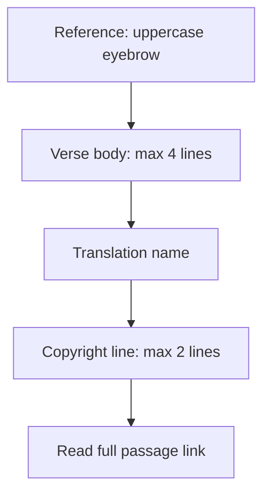
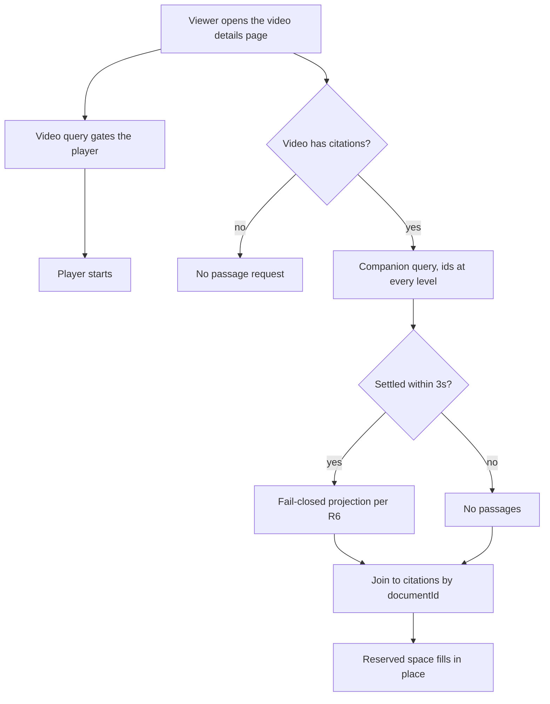

# Mobile Bible Quotes Passages - Plan

## Goal Capsule

- **Objective:** A viewer on the mobile video details page reads complete, credited scripture, and a scripture failure never costs them the video on the client. The server path shares an origin with playback; see Risks for what this plan bounds and what it does not.
- **Means:** Read admin's server-resolved passage through a companion query, never through the query that gates playback (KTD1).
- **Product authority:** Owner of `apps/mobile`. The watch-page carousel is the only active surface; no other app changes.
- **Stop conditions:** Stop and ask if the work requires a change in `apps/admin`, `apps/web`, or `packages/admin-graphql`. Stop if `passage` must be added to `watchVideoFragment` or `seriesWatchVideoFragment` to make a unit work.
- **Open blockers:** None.

---

## Product Contract

**Product Contract preservation:** changed: R8, R10, AE3 — the passage link is derived from passage fields, so a citation with no passage has no link to offer. Changed: R6 now requires `versionAbbreviation` specifically, and R12 now distinguishes a video with citations from one without. Added then waived: R15, a screen-reader requirement introduced during planning and waived before implementation once three reviewers established it was not deliverable inside this plan's boundary. AE9 was removed with it and AE8 repointed to R10. Added: R16, a reserved-loading-state requirement introduced during planning, with AE10 and the loading-state work in U4 and U5. Added: R17, requiring a rendered verse to carry its complete text — the single-verse counterpart to R2, covering the poetic-line truncation the Problem Frame names but no requirement previously bound. Clarified without scope change: R5, R6 and R8 apply to the passage-fed card only, which keeps the Experience and SDUI cards on today's behavior per R14.

### Summary

The Bible Quotes carousel on the mobile video details page reads scripture from admin's resolved passages instead of fetching each verse from a public mirror. Each card shows a complete, credited verse clamped to four lines, with a link that opens the full passage without leaving the app.

### Problem Frame

The carousel renders scripture that is wrong, and the errors are systematic rather than occasional.

`apps/mobile/src/hooks/useBibleVerses.ts` requests a single verse per citation and never reads `verseEnd` or `chapterEnd`. A citation recorded as a range therefore shows only its first verse. On the production video `the-beginning`, Genesis 1:26-27 drops verse 27 — the half of the citation that carries its meaning. Genesis 3:22-24 ends mid-sentence on a dangling em-dash.

The source itself is lossy in two further ways. Footnote text is inlined into the verse body with no delimiter, so John 3:16 renders as "his only born3:16 The phrase..." — three of eight sampled common verses carry this. The dataset also stores only the first poetic line under a verse number, so Matthew 5:9 renders as "Blessed are the peacemakers," and Psalm 23:1 as "The LORD is my shepherd;". Nothing on the card names a translation or a copyright holder, and the mirror is a community GitHub repository that no one has licence-reviewed.

The cost shape is also wrong. The hook issues one request per citation, so a five-citation video makes five parallel calls to a third-party CDN before any verse appears. The card always paints empty and fills in later. The `cache: "force-cache"` option is inert, so nothing at the JavaScript layer holds the result between mounts.

This is a copy of an approach the project already abandoned. `apps/web` used the same mirror, mobile copied it on 2026-05-27, and web replaced it the following day. Web's copy was deleted outright on 2026-07-03 when passage resolution moved into admin. Mobile was never revisited.

### Key Decisions

- **Migrate to admin's resolved passage rather than repair the existing fetch.** The mirror returns no copyright or version metadata in any response, so it structurally cannot satisfy attribution. (session-settled: user-directed — chosen over repairing the jsDelivr fetch in place: the smaller fix cannot deliver attribution and does not reduce request count.) Governs R1, R3, R5, R17.
- **Correctness and request cost are both primary.** Neither goal alone justifies the change; the plan is judged against both. Governs R1, R12.
- **Clamp the verse and carry the remainder with a link.** A square card cannot hold a long passage, so truncation is made honest rather than hidden. (session-settled: user-directed — chosen over strict web parity, a reference-forward card, and a card that grows to fit: parity truncates with no way onward, and a growing card breaks the carousel.) Governs R7, R8.
- **The link opens inside the app.** `bible.com` claims every path as a universal link for the YouVersion app, so an external open would hand the viewer to another app mid-video. (session-settled: user-approved — chosen over leaving the app: keeps the watch screen a doorway rather than an exit.) Governs R9.
- **Scripture is English for this release.** The app carries no localization library and requests English content everywhere, so English scripture is consistent with the rest of the screen. (session-settled: user-directed — chosen over following the dub language: keeps every card on the already-warm cache.) Governs R4.
- **The watch page is the only surface.** (session-settled: user-directed — chosen over fixing the Experience carousel in the same change: keeps this a mobile-only change with no shared-package edits.) Governs R14.
- **A citation with no passage shows its reference alone.** The link is built from passage fields, so no link exists to offer. (session-settled: user-directed — chosen over a best-effort link built from the English fallback version, and over dropping the card: a fabricated link asserts a translation nobody resolved, and dropping the card hides that the video cited the passage at all.) Governs R8, R10.
- **The carousel reserves its space and shows a loading state, rather than being absent.** A withheld section on a slow network disappears for a viewer who scrolls to it, and inserts under a moving thumb when it lands. Governs R13, R16.
- **A passage failure degrades the carousel, never the video.** The upstream provider call carries no timeout, so the read must not sit on the path that gates playback. Governs R11.

### Requirements

**Scripture content**

- R1. Verse text comes from admin's resolved passage for that citation. Admin returns plain text from an approved provider, which is what satisfies R3 and R17.
- R2. A citation that names a range renders every verse in the range.
- R3. Rendered verse text contains no footnote or apparatus text.
- R17. A rendered verse carries the passage's complete text, including every line of a poetic verse. This is the single-verse counterpart to R2, and it is the defect that makes a psalm render as one clause today.
- R4. Scripture renders in English for this release.

**Attribution**

- R5. A rendered verse displays its translation name and its copyright line.
- R6. A card renders verse text only when the passage carries `content`, `copyright`, `humanReference`, `provider`, `reference`, `versionId`, `versionAbbreviation`, and `versionTitle`. Requiring the abbreviation specifically keeps verse eligibility and link eligibility identical, so a rendered verse always has a link.

**Card presentation**

- R7. The verse body is limited to four lines, and the copyright line to two.
- R8. A card whose passage yields a link offers it.
- R9. The link opens within the app and returns the viewer to the video.
- R10. A citation with no renderable verse text renders its reference alone, never an empty verse body. This covers an unavailable passage and one suppressed by R6.
- R15. **Waived for this release.** The intent was that a screen reader reach the card's parts separately and activate the link. It is not deliverable inside this plan's boundary: the carousel list, not the card, is what collapses the subtree into one element on iOS, and changing that means replacing the list's next and previous actions — a redesign of the carousel's accessibility model rather than a card change. The ID is retained so it is not reused. See Deferred to Follow-Up Work for what carries it.
- R16. When the passage read has not settled, the carousel renders one card per citation at final height, each showing its real reference with the verse area in a loading state. Citation count and references are already known from the query that gates the player, so nothing about the section's size or card count changes when passages arrive.

**Cost and failure isolation**

- R11. A slow or failed passage read never delays or blocks video playback.
- R12. A video with citations makes exactly one passage request. A video with no citations makes none.
- R13. A card never renders an empty verse body that later fills with text.

**Boundary**

- R14. The change affects the video details page only; no other screen alters its data requirements, and a card with no passage data renders exactly as it does today.

The card composes five stacked regions above its existing artwork, in this order:

Content is bottom-aligned inside a fixed square, so passive overflow clips the TOP — the reference goes first. That is the opposite of what the card needs, so the drop order cannot be left to overflow. Measure the rendered stack and omit trailing regions before paint: link first, then copyright, then translation, so the reference and the verse survive. Naming the measurement is U5's job; leaving it to CSS ships the inverted order.

Each card state renders a defined subset of those regions. The card stays one grouped accessibility element on every surface, so the last column is what that single element announces, not a set of separate stops — R15 is waived.

| State                    | Reference           | Verse         | Credit | Link | Announces                                 |
| ------------------------ | ------------------- | ------------- | ------ | ---- | ----------------------------------------- |
| Read unsettled           | yes, real reference | loading state | —      | —    | the reference, then loading               |
| Resolved                 | yes                 | yes, clamped  | yes    | yes  | the reference, then the verse             |
| Suppressed by the gate   | yes                 | no            | no     | no   | the reference, with no trailing separator |
| Passage unavailable      | yes                 | no            | no     | no   | the reference, with no trailing separator |
| Read failed or timed out | yes                 | no            | no     | no   | the reference, with no trailing separator |

### Key Flows

- F1. Viewer opens a video that carries citations.
  - **Trigger:** The viewer opens the video details page.
  - **Steps:** The page requests the video. The player starts. The carousel reserves its space and shows a loading state. Passages resolve in one companion read. Each card fills in with its reference, verse, attribution and link.
  - **Outcome:** The viewer reads complete, credited scripture.
  - **Covers R1, R2, R5, R11, R12, R13, R16.**
- F2. Viewer opens the full passage.
  - **Trigger:** The viewer taps the link on a card.
  - **Steps:** Playback pauses if it was running. The full passage opens in a sheet over the app. The viewer dismisses the sheet, and playback resumes only if it was running before.
  - **Outcome:** The viewer returns to the video without leaving the app.
  - **Covers R8, R9.**

### Acceptance Examples

- AE1. **Covers R2.** Given a citation recorded as Genesis 1:26-27, when the card renders, then both verse 26 and verse 27 appear.
- AE2. **Covers R7, R8.** Given Genesis 22:1-18, a passage of about 2,400 characters, when the card renders, then the verse occupies no more than four lines, the reference and attribution stay visible, and the link is present.
- AE3. **Covers R10.** Given a citation whose passage is unavailable, when the card renders, then it shows the reference alone, with no verse body and no link.
- AE4. **Covers R11, R13.** Given a passage read that is slow or fails, when the page loads, then the video plays normally and no card shows an empty verse body that later fills.
- AE5. **Covers R9.** Given an iOS device with the YouVersion Bible app installed, when the viewer taps the link, then the passage opens inside this app and the Bible app does not take over.
- AE6. **Covers R3.** Given John 3:16, when the card renders, then the verse contains no footnote text.
- AE7. **Covers R14.** Given an Experience block whose quote carries authored text and no passage fields, when the card renders, then it looks exactly as it does today and keeps its current grouped screen-reader announcement.
- AE8. **Covers R10.** Given a card whose passage is unavailable, when the card's announcement is composed, then it names the reference and emits no dangling separator for the missing verse.
- AE10. **Covers R16.** Given a viewer who scrolls to the carousel before the passage read settles, when they arrive, then the section is already at its final height showing a loading state, and filling it shifts nothing.
- AE11. **Covers R12.** Given a video with no citations, when the page loads, then no passage request is made.
- AE12. **Covers R9.** Given an Android device with the YouVersion Bible app installed and its `bible.com` app links verified, when the viewer taps the link, then the passage opens in the in-app sheet and the Bible app does not take over.
- AE13. **Covers R9.** Given a viewer who paused the video before tapping the link, when they dismiss the sheet, then the video is still paused.

### Success Criteria

- On `the-beginning`, all five citations render a verse, and Genesis 1:26-27 renders both verses. A carousel of reference-only cards fails this.
- A single poetic verse renders every line, and a footnoted verse renders none of the footnote.
- After release, the share of citations rendering a verse holds near the 98% baseline. A sustained drop is the provider-key and cache-health signal, and the gate-rejection log distinguishes it from a designed no-passage outcome.
- Opening a video with N citations makes exactly one passage request, against one per citation today; a video with no citations makes none.
- Every rendered verse carries a translation name and a copyright line.
- No card displays an empty verse body that later fills with text, and the carousel never shifts content when it fills.
- Time to first video frame is unchanged from before the change.

### Scope Boundaries

- The Experience carousel that shares this renderer keeps its current behavior, including its screen-reader grouping. Newly generated Experiences carry no authored verse text by design, so that surface has its own defect; it gets its own plan.
- `apps/tv` keeps its copy of the mirror-fetching code, and with it the unreviewed-licence exposure this plan removes from mobile. This plan does not file that ticket; the TV track owns its own framing and timing.
- Non-English scripture is deferred. Admin maps 38 language slugs and falls back to English, so this is a later scope increase rather than a redesign.
- Admin's missing outbound timeout and its per-citation query pattern are handed to admin's owner and are not fixed here. See Risks for what this plan can and cannot bound.
- Card artwork and the trailing promotional card are unchanged.

#### Deferred to Follow-Up Work

- Screen-reader access to the Bible Quotes carousel (the waived R15). The carousel is one accessibility element, so no card region or control inside it is individually reachable — including the promotional CTA today and the passage link this plan adds. Fixing it means replacing the list's next and previous actions, which is a carousel redesign rather than a card change.

- Mobile drops the whole carousel when a video has no citations, which makes the always-on promotional card unreachable on those videos. Web always renders it.
- The seven hardcoded stock card images could become the deterministic hashed gradient web uses; `apps/mobile/src/components/search/experienceGradient.ts` is the ported precedent.

<!-- ce-section: work-relationships -->

### How This Work Fits Together

This plan owns one area: the Bible Quotes carousel on the mobile video details page. The breakdown below is how the surrounding work is currently understood, not a committed roadmap; a later plan may revise, split, merge, or discard any of it.

- The Experience carousel in `apps/mobile`
  - Shares the same card renderer as this plan, so the presentation work lands once.
  - Can proceed independently of this plan; it has its own cause, because generated Experiences carry no authored verse text.
  - Still to decide: when generated Experiences reach mobile, which sets that plan's urgency.
- The same carousel in `apps/tv`
  - Shares the retired mirror-fetching approach this plan removes, and the licence exposure with it.
  - Can proceed independently of this plan; the two apps hold separate copies, and TV owns when it acts.
- Admin's outbound timeout and per-citation query batching
  - Enables a simpler wiring here, because R11 exists to isolate against their absence.
  - Can proceed independently of this plan; this plan does not wait on it.
- Non-English scripture on this carousel
  - Depends on this plan, which establishes the resolved-passage read.

---

## Planning Contract

### Key Technical Decisions

- KTD1. **Read passages through a companion `videoBySlug` operation, never through `watchVideoFragment`.** That fragment is executed by five call sites and only one renders a Bible card, so a selection there taxes the home hero, its prefetch, the search-result prefetch, and the per-episode subtitle fan-out. `docs/solutions/design-patterns/lean-bulk-lazy-per-item-graphql-fetch-20260604.md` is the repo's pattern for this and states the rule directly: do not keep the heavy fields in the bulk consumer's selection. This plan applies the pattern to an added field rather than a trimmed one; the mechanism transfers, the motivating shape does not. Governs R11, R12.
- KTD2. **Every object the companion write touches must carry its id, at every level the player-gating query also holds.** That means `documentId: id` on `videoBySlug` itself as well as on `bibleCitations`. Without the outer id the cache cannot normalize the video, so the companion write replaces the shared reference with a plain object and the watch page's own read collapses — losing the slug, the label and the player. Nothing is logged, and `returnPartialData: true` turns it into a silent degrade. A successful passage read is what causes it. Governs R1, R2, R11.
- KTD3. **Bound the companion read on the client at `PASSAGE_FETCH_DEADLINE_MS = 8000`, using `withTimeout` inside `Promise.allSettled`.** Admin's provider call carries no timeout, so isolation alone bounds blast radius but not duration. The budget must stay strictly below `apolloClient.ts`'s `REQUEST_TIMEOUT_MS` of 15000 or it is inert. 8000 matches `EXPERIENCE_FETCH_DEADLINE_MS`, whose stated rationale is an additive read that must not hold a required load hostage — the posture here. It deliberately does not match `TOPUP_FETCH_DEADLINE_MS`, which is tight because a first paint waits on it; nothing waits on this. Since R16 reserves the height, a late arrival fills a loading state rather than shifting layout, so the deadline now bounds how long the shimmer runs, not whether content jumps. Governs R11, R16.
- KTD4. **Reserve the carousel's space and show a loading state until the read settles.** A companion read resolves after the video query by construction. Rendering empty cards first would produce the fill-in R13 forbids; rendering nothing at all makes the section vanish for a viewer who scrolls to it inside the deadline window, then insert under their thumb. Reserving the height satisfies both. `useShimmerOpacity` is the repo's loading primitive and its own comment says it signals loading rather than emptiness. Governs R13, R16.
- KTD5. **Project the passage through one fail-closed gate before it reaches the card.** The gate is defensive against a future admin change, not a filter with observable effect today: admin already returns nothing when copyright is absent, coalesces the human reference, hardcodes the provider, always derives a version id, and requires non-empty content, and the cache columns forbid null. Of the eight required values only the two version-name fields are nullable end to end, and all 94 resolved production passages carry both. Governs R5, R6.
- KTD6. **Pass passage-derived values to the shared renderer as optional props.** The renderer also serves the Experience path and the SDUI content path, and admin's Experience quote type has no copyright, version or passage field, so rendering each new region only when its value is present is what keeps those two surfaces byte-identical. The card's accessibility tree is unchanged on every surface: it stays one grouped element, as today. Governs R14.
- KTD7. **Pause on both platforms before presenting, and resume on dismissal only when playback was running.** iOS reports `inactive` for the sheet, which the lifecycle deliberately treats as no action, so audio would keep playing behind an opaque reading sheet. Android cannot be treated as a no-op either: the player sets auto-enter picture-in-picture whenever playback is running, and the custom tab launches without the flag that suppresses the user-leave which arms it, so tapping the link while playing can drop the video into an OS window over the sheet — after which the lifecycle pauses nothing and records nothing, because it sees picture-in-picture as active. One explicit pause on both platforms is also what keeps this from forking per platform. (session-settled: user-approved — chosen over leaving the app: keeps the watch screen a doorway rather than an exit.) Governs R9.
- KTD8. **Port web's citation formatter for the fallback label, and prefer `humanReference` when the passage resolves.** Mobile composes labels as `book chapter:verse`, which cannot express a range and emits artifacts such as `Genesis 3:` when a verse is absent. The fallback label is all the viewer gets on an R10 card. Governs R2, R10.
- KTD9. **Do not register a non-route sheet id for the passage sheet.** `miniPlayerPresentation` returns the full-player presentation for the watch route before it consults sheet suppression, so the floating window cannot be present on the only surface this plan touches. Registering an id there would be dead code and its device check would pass vacuously. The exemption holds because the in-app opener is reachable only from a passage-fed card, and passage-fed cards exist only on the watch route. If the shared renderer ever opens a sheet from a path an SDUI route can reach, the id becomes live. The existing promotional CTA keeps its external open and is not routed through the new opener. Governs R14.

### High-Level Technical Design

The video query and the passage query are independent. Only the first gates the player.

The player never waits on the companion read. That independence is the whole of R11.

### Assumptions

- Production admin serves a resolved passage for about 98% of citations. Measured 94 of 96 across 120 videos, and 1,137 of 1,155 across 973 videos. All 94 resolved passages carry both version-name fields.
- `BibleCitation.passage` and all nine of its subfields are already in the committed introspection, so no code generation step and no backend change is required. This is the one way this work is lighter than the pattern it follows, which needed two stacked pull requests.
- Admin's provider key stays configured in production. A local admin without it returns no passage for every citation.
- The `cache: "force-cache"` option is inert because React Native's fetch is the `whatwg-fetch` polyfill, which reads that option only for `no-store` and `no-cache`. Verified by inspection against `react-native@0.86.3` and `whatwg-fetch@3.6.20`; a dependency upgrade could change it.
- Admin requests plain-text passage content, so the card renders the string directly. An admin-side format change would surface markup on the card, and no mobile test would see it.

### Sequencing

U1 and U3 are independent and may land in either order. U2 depends on U1. U4 depends on U1 and U3. U5 depends on U4. U6 depends on U5. U7 depends on U4.

U5 renders the link disabled until U6 lands. The two may ship separately, but a link with no handler must never reach a viewer, so U5 owns that state rather than leaving it to landing order.

---

## Implementation Units

### U1. Passage companion query and fail-closed projection

- **Goal:** Fetch resolved passages for a video's citations in one request, and expose only passages that satisfy R6.
- **Requirements:** R1, R5, R6, R12. Implements KTD2, KTD5.
- **Dependencies:** none.
- **Files:** `apps/mobile/src/lib/queries.ts`, `apps/mobile/src/lib/biblePassages.ts` (new), `apps/mobile/src/lib/__tests__/biblePassages.test.ts` (new).
- **Approach:**
  1. Add a `GetVideoBiblePassages($slug: String!)` operation selecting `videoBySlug { documentId: id bibleCitations { documentId: id passage { content copyright humanReference provider reference versionAbbreviation versionId versionTitle } } }`. The outer `documentId` is load-bearing per KTD2, not decoration. Carry an inline comment naming both the payload it avoids and why the outer id must stay.
  2. Add a pure projection mapping one raw passage to a renderable passage or to `null`, applying the R6 gate.
  3. Derive the link inside the projection, so an unrenderable passage cannot produce one.
- **Patterns to follow:** `GET_VIDEO_DUB` and `GET_VIDEO_DUB_INDEX` in `apps/mobile/src/lib/queries.ts`; web's link derivation in `apps/web/src/components/watch/BibleQuotesSection.tsx`.
- **Test scenarios:**
  - A passage carrying all eight required values projects to a renderable passage with a link.
  - Covers R6. Eight cases, each nulling exactly one required value and leaving the other seven populated, project to `null`. Build each fixture from explicit literals; never derive one field from another.
  - Label the six non-version fixtures in place as synthetic, naming `scripture-passage.service.ts` as the producer that cannot currently return null for them. The two version-name fixtures are the production-reachable pair.
  - A rejected passage yields no link.
  - The link is byte-identical to web's derivation for a known citation.
  - Covers KTD2. Write the PRODUCTION `GET_VIDEO_BY_SLUG` document imported from `queries.ts` into a real `InMemoryCache`, then the production companion document from the same module, pinning the identical slug argument and variables in both halves. Assert the player-gating read is still complete and still carries the slug. Add a sibling case proving a companion document with the outer alias removed DOES collapse the read, so the test pins the mechanism and not only the outcome.
- **Verification:** The projection rejects every incomplete passage, and a companion write leaves the player-gating read intact.

### U2. Guard the isolation decision

- **Goal:** Make re-inlining `passage` into a player-gating fragment, or dropping either id, fail the suite.
- **Requirements:** R11, R12. Implements KTD1, KTD2.
- **Dependencies:** U1.
- **Files:** `apps/mobile/src/lib/__tests__/queries.test.ts`.
- **Approach:** Assert with word-boundary matching over the FULL printed SDL — `asSdl(...)`, never `operationOnly(...)`. That helper slices the document at the first fragment definition, and `passage` would be added inside a fragment, so an assertion built on it sits in the discarded region and passes whether or not the field is there. Assert that neither `GET_VIDEO_BY_SLUG` nor `GET_SERIES_BY_SLUG` contains `passage`, and that the companion operation selects `passage` and selects `documentId` at both the video and the citation level. The positive control is load-bearing: without it the negative assertions pass vacuously the day the field is renamed.
- **Patterns to follow:** the `dubs` exclusion assertions in `apps/mobile/src/lib/__tests__/watchHomeQueries.test.ts`, which match the whole printed document and are the correct substrate. Use `operationOnly` only for assertions about an operation's own selections.
- **Test scenarios:**
  - The player-gating operation does not select `passage`.
  - The series operation does not select `passage`.
  - The companion operation selects `passage`, and selects `documentId` on `videoBySlug` and on `bibleCitations`.
- **Verification:** Adding `passage` to `watchVideoFragment` turns the suite red, and so does deleting either `documentId` alias. Falsify both by hand before finishing the unit.

### U3. Citation label formatter

- **Goal:** Render a correct reference label for a citation with no resolved passage.
- **Requirements:** R2, R10. Implements KTD8.
- **Dependencies:** none.
- **Files:** `apps/mobile/src/lib/citationFormat.ts` (new), `apps/mobile/src/lib/__tests__/citationFormat.test.ts` (new).
- **Approach:** The formatter takes `WatchBibleCitation` from `apps/mobile/src/lib/normalizeVideo.ts`, whose `bookName` is already resolved through `pickLocalizedName`. Port web's branch matrix onto `bookName`, `chapterStart`, `chapterEnd`, `verseStart`, `verseEnd`, keeping web's unknown-book fallback for a null name. Carry a `SYNC with apps/web/src/lib/citation-format.ts` comment at the top, matching the convention `pickCardImage` uses.
- **Patterns to follow:** `apps/web/src/lib/citation-format.ts`; the sync-comment convention in `apps/mobile/src/lib/cardImage.ts`.
- **Test scenarios:**
  - A single verse renders as book, chapter and verse.
  - A same-chapter range renders one chapter and both verses.
  - A cross-chapter range renders both chapters.
  - A whole-chapter citation renders no verse number and no trailing separator.
  - A citation missing a verse renders no dangling separator, which the current composition emits.
  - A citation with no book name renders the fallback rather than an empty string.
- **Verification:** No output contains a trailing or empty separator for any nullable-field combination.

### U4. Passage-backed carousel hook

- **Goal:** Replace the per-citation mirror fetch with the companion read, and hold the carousel's space while it resolves.
- **Requirements:** R1, R2, R3, R4, R10, R11, R12, R13, R16, R17. Implements KTD1, KTD3, KTD4.
- **Dependencies:** U1, U3.
- **Files:** `apps/mobile/src/hooks/useBibleVerses.ts`, `apps/mobile/src/hooks/__tests__/useBibleVerses.test.ts` (new), `apps/mobile/app/watch/[slug].tsx`, `apps/mobile/src/lib/apolloClient.ts` (export only).
- **Approach:**
  1. Delete the mirror fetch, `formatScripture`, and `bookSlugForApi`. Keep the stock card images and the trailing promotional card unchanged.
  2. Return early with no request when the citation list is empty, matching the behavior of the code being replaced.
  3. Widen the hook's signature: it needs the route slug (the companion operation's variable and the effect key) and returns a state alongside the cards, not a bare array. Key the effect and the query on the SAME value — the route slug, which never lags — because the session's citations array republishes at least twice per open and the session video id trails navigation by a commit.
  4. Run the companion query through `getApolloClient().query` with `fetchPolicy: "cache-first"`, wrapped in `withTimeout` at the KTD3 budget and settled with `Promise.allSettled` so a rejection degrades. Export `REQUEST_TIMEOUT_MS` from `apps/mobile/src/lib/apolloClient.ts` — an export-only change — so the budget invariant can read it rather than restate it.
  5. Track four states — unsettled, settled with passages, settled with none, and failed — and expose the unsettled state to the renderer rather than hiding the section.
  6. Guard a superseded response with a monotonic request id, and reset all passage state when the video id changes.
  7. Join passages to citations strictly by `documentId`. Never join by index or by reference.
  8. Emit one namespaced Datadog log per degraded path, and keep the three distinguishable. Informational when admin returned no passage, because that is a designed outcome. Warning when the read failed or timed out. Warning with its own reason value, naming the missing field, when a passage arrived but the R6 gate rejected it — that is the signal that an upstream change started suppressing verses, and it must not look like the designed case.
- **Execution note:** Write the state-machine tests before removing the fetch; the code being deleted has no tests, so nothing else goes red if the replacement is wrong.
- **Patterns to follow:** the additive-branch posture in `apps/mobile/src/hooks/useWatchHome.ts`; the request-id staleness guard in `apps/mobile/src/hooks/useHeroStream.ts`; the reset-on-id-change discipline in `apps/mobile/src/contexts/WatchSessionProvider.tsx`; the degraded-path log shape in `apps/mobile/src/lib/watchHome/logWatchHomeFallback.ts`.
- **Test scenarios:**
  - Covers R12. A video with five citations issues exactly one passage request.
  - Covers AE11. A video with no citations issues no passage request.
  - The effect does not re-fire when the citations array identity changes but the video id does not.
  - Covers R16. While the read is unsettled the hook reports the loading state rather than an empty card list.
  - Covers R11, R13. A read that rejects settles into reference-only cards, and never stays unsettled.
  - A read that exceeds the deadline settles the same way as a rejection.
  - The deadline constant is strictly less than the client request ceiling. Read both values; do not restate them.
  - Covers R10. A citation whose passage is absent yields a card with a reference and no verse.
  - Passages join to citations by `documentId` when the response order differs from the citation order.
  - A response for a superseded video id is discarded and does not populate cards.
  - Changing the video id clears prior passage state before the next read.
- **Verification:** The hook never exposes a card whose verse body is empty and later populated, on any path.

### U5. Card presentation

- **Goal:** Render the verse, the attribution and the link, without changing cards that carry no passage.
- **Requirements:** R5, R7, R8, R10, R14, R16. Implements KTD6.
- **Dependencies:** U4.
- **Files:** `apps/mobile/src/components/sections/BibleQuotesCarouselRenderer.tsx`, `apps/mobile/src/components/sections/__tests__/BibleQuotesCarouselRenderer.test.tsx` (new).
- **Approach:**
  1. Add optional translation, copyright and link values to the card's item shape. Render each region only when its value is present, which is what keeps the Experience and SDUI cards unchanged.
  2. Cap the verse at four lines and the copyright at two. Drop regions from the bottom up when the stack cannot fit, so the reference and verse survive; content is bottom-aligned inside a fixed square, so the top clips first.
  3. Do not route the copyright through the existing attribution field; that field renders as an uppercase heavy eyebrow above the reference.
  4. Render the reserved-height loading state for the unsettled case, using the repo's shimmer primitive.
  5. Leave the card's and the list's accessibility grouping exactly as they are. R15 is waived, so this unit changes no accessibility behavior. Keep the composed card label free of a dangling separator when there is no verse, which is the only announcement change in scope.
  6. Keep the untyped hop from the watch page in step with the renderer; a widened item shape on one side only drops the new values silently.
- **Patterns to follow:** web's region order and clamp values in `apps/web/src/components/watch/BibleQuotesSection.tsx`; `apps/mobile/src/hooks/useShimmerOpacity.ts` and `apps/mobile/src/components/watch/SheetLoading.tsx` for the loading state; the render-suite scaffolding in `apps/mobile/src/test-utils/rnTestRenderer.ts`.
- **Test scenarios:**
  - Covers AE2. A 2,400-character verse renders with the reference, the attribution and the link still present.
  - Covers R7. The verse is capped at four lines and the copyright at two.
  - Covers AE3. A card with no passage renders a reference and no verse, no attribution and no link.
  - Covers AE7. An item carrying authored text and no passage values renders today's regions and keeps its grouped announcement.
  - Covers AE8. A card with no passage composes an announcement naming the reference with no dangling separator.
  - Covers AE10. The unsettled state renders at the same height as a populated card.
- **Verification:** An Experience-shaped item and a passage-shaped item both render correctly through the same component, and the Experience one is unchanged from today.

### U6. In-app passage sheet

- **Goal:** Open the full passage without leaving the app, and without forking behavior per platform.
- **Requirements:** R9. Implements KTD7, KTD9.
- **Dependencies:** U5.
- **Files:** `apps/mobile/src/components/sections/BibleQuotesCarouselRenderer.tsx`, and the module that owns the iOS pause seam once chosen.
- **Approach:**
  1. Open the link with `expo-web-browser`. Its native module already ships in the binary — it is a direct dependency and is listed in `app.json` plugins — so this change reaches testers over an update rather than a build.
  2. Validate the URL before opening it, using the existing action-URL validator.
  3. On iOS only, pause before presenting and resume on dismissal, and only when playback was running. Android backgrounds the app, so the existing lifecycle already pauses and records that state; adding a second pause there would give Android two owners for one decision.
  4. Do not register a non-route sheet id — see KTD9.
- **Patterns to follow:** `apps/mobile/src/lib/openExternalUrl.ts` for the validate-then-open shape; the was-playing gate in `apps/mobile/src/hooks/useManagedVideoPlayer.ts`.
- **Test scenarios:**
  - Covers AE13. A video paused before the sheet opens is still paused after dismissal.
  - A video playing before the sheet opens resumes after dismissal.
  - A card with no link renders no affordance and cannot open a sheet.
  - A non-https URL is rejected and opens nothing.
- **Verification:** On both platforms, no audio plays behind the sheet and a paused video stays paused. Covers AE5 and AE12 on device, with the Bible app installed.

### U7. Retire the mirror

- **Goal:** Leave no code or prose that points a future reader at the retired source.
- **Requirements:** none directly. This unit removes the retired path's remaining footprint after U4 replaces it.
- **Dependencies:** U4.
- **Files:** `apps/mobile/CLAUDE.md`, and any tracked markdown naming the mirror.
- **Approach:**
  1. Confirm no reference to the mirror host remains anywhere under `apps/mobile`.
  2. Sweep tracked markdown for the mirror's names, and correct any forward-looking instruction that still presents it as the mobile source. Leave historical records alone.
  3. Record the licence exposure in one durable tracked artifact outside this plan — a `todos/` entry naming the exposure and an owner, not a fix. The plan is archived on merge, so without this the last pointer to a shipping app rendering unreviewed-licence scripture disappears with it. This states the exposure only; TV still owns its own remedy and timing.
  4. Run the repo-root formatter over every markdown file touched.
- **Patterns to follow:** `docs/solutions/workflow-issues/mechanism-retirement-docs-prose-sweep.md`.
- **Test scenarios:** Test expectation: none — documentation work with no behavioral change.
- **Verification:** A repository-wide search for the mirror host returns hits only in `apps/tv` and in historical records, and the format gate passes.

---

## Verification Contract

| Gate                  | Command                                 | Applies to              |
| --------------------- | --------------------------------------- | ----------------------- |
| Unit and render tests | `pnpm --filter @forge/mobile test`      | U1-U6                   |
| Focused iteration     | `npx jest <path>` from `apps/mobile`    | U1-U6                   |
| Types                 | `pnpm --filter @forge/mobile typecheck` | all units               |
| Lint                  | `pnpm --filter @forge/mobile lint`      | all units               |
| Format                | `pnpm run format:check` (repo root)     | U7, any markdown change |

Behavioral verification, none of which the suite can supply. Two prerequisites gate the rest:

- **Endpoint.** A development bundle refuses to start against production admin unless `EXPO_PUBLIC_ALLOW_PRODUCTION_ADMIN=1` is set in `apps/mobile/.env.development.local`, followed by a Metro restart — the value is inlined at bundler start. The deployed-admin timing run and any production-content smoke need it.
- **Content.** Local admin carries no production-shaped content, so seeding only the provider key does not make the fixture video resolvable locally. Either seed its citation rows or run the content checks against deployed admin behind the override above, and record which was done.

- Smoke `the-beginning`. All five of its citations resolve in production today (verified), and they exercise a short range, a mid-length range, the clamp, and one poetic range in Psalm 19:1-2.
- Smoke a second citation set covering the two defects `the-beginning` cannot surface: a single poetic verse such as Psalm 23:1 for R17, and John 3:16 for R3. AE6 has no unit test behind it, so this is where it is proven.
- Measure whether an Android custom tab launched while playback is running triggers auto-enter picture-in-picture. This decides whether KTD7's Android pause is load-bearing or redundant, and it is measurable in minutes on a device. Do it before U6 is written, not during its device pass.
- Measure admin's passage-resolution latency for a cold-cache five-citation video against deployed admin, and confirm the KTD3 budget sits above it with margin.
- Prove R11 by observation, not by structure. A green suite shows the field is absent from the fragment; it does not show that playback starts while passages are still resolving. Record the launch and confirm the first video frame lands before the carousel fills.
- Time the player-gating query against deployed admin before and after. Local timing runs 10 to 25 times faster than production and will hide a regression.
- Falsify the U2 guard three ways: add `passage` to `watchVideoFragment`, then delete each `documentId` alias in turn. Confirm the suite turns red each time, then revert.
- Check the Datadog facet after release. A reserved attribute name is dropped silently and the log still looks healthy.

---

## Definition of Done

Global:

- Every requirement R1 through R17 is satisfied, except R15, which this plan explicitly waives.
- No reference to the retired mirror host remains under `apps/mobile`.
- The player-gating and series operations do not select `passage`, both `documentId` aliases are present, and a guard test enforces all three.
- Every gate in the Verification Contract passes.
- The behavioral checks above are performed and their results recorded, including the two that need the endpoint override.
- Abandoned or experimental code from approaches that did not work is removed rather than left in the diff.

Per unit: the unit's own Verification line holds, and its test scenarios exist as tests rather than as prose.

---

## Risks & Dependencies

- **A failed read is not cached, so it re-issues.** Every re-entry and every next video repeats the request under the same stall that caused the failure. `apps/mobile/src/lib/heroStreamCooldown.ts` is the in-repo precedent for suppressing that per subject; U4 should adopt it rather than leave the amplification unbounded on the side this plan owns.
- **The client deadline bounds the client, not the server.** Racing a promise does not cancel the request, and admin's provider call has no timeout and no batching. Under a provider stall each video open leaves an un-cancellable request holding an admin worker, on the same origin the player depends on. The carousel degrades gracefully; admin's capacity is what absorbs the cost. Fixing that is admin's, and this plan does not wait on it.
- **Font scaling can still overflow the square.** The drop-from-the-bottom order protects the reference and verse, but it is a mitigation, not a guarantee. Check at the largest supported text size.
- **The renderer serves three surfaces.** A change that assumes passage data silently alters the Experience and SDUI cards, in rendering and in announcement. AE7 covers both.
- **Session state lags navigation by one commit**, so a card can briefly pair one video's citations with another's passages. The join by `documentId` in KTD2 prevents wrong scripture under a wrong label. A citation with a missing id coerces to an empty key; reachability is low, but two such citations on one video would share a passage.
- **`apps/tv` holds an independent copy** of the retired approach and does not inherit this fix, licence exposure included.

---

## Sources / Research

- `docs/solutions/design-patterns/lean-bulk-lazy-per-item-graphql-fetch-20260604.md` — the companion-query pattern this plan applies, including why the bulk consumer must not select the enriched field.
- `docs/solutions/best-practices/outbound-timeout-shorter-than-caller-budget-20260506.md` — the law KTD3 satisfies on the client because the server does not.
- `docs/solutions/best-practices/mocked-shape-vs-real-contract-discipline-20260506.md` — why the U1 fixtures are labelled synthetic where production cannot reach them.
- `docs/solutions/conventions/datadog-reserved-log-attribute-name-shadowing.md` — the attribute names U4 must avoid; a repo-wide guard already enforces this.
- `docs/solutions/workflow-issues/mechanism-retirement-docs-prose-sweep.md` — the second sweep U7 runs.
- `apps/web/src/components/watch/BibleQuotesSection.tsx` and `apps/web/src/lib/content.ts` — the shipped equivalent surface, its region order and its fail-closed gate.
- `apps/admin/src/services/scripture-passage.service.ts` — server-side resolution, its cache, and the missing timeout.
- `apps/mobile/src/hooks/useWatchHome.ts` — the degrade-never-throw posture and the deadline-constant precedent KTD3 mirrors.
- `apps/mobile/src/lib/pipPolicy.ts` — the lifecycle branch KTD7 defers to.
- `apps/mobile/src/lib/miniPlayer/presentation.ts` — the ordering that makes KTD9 true.
