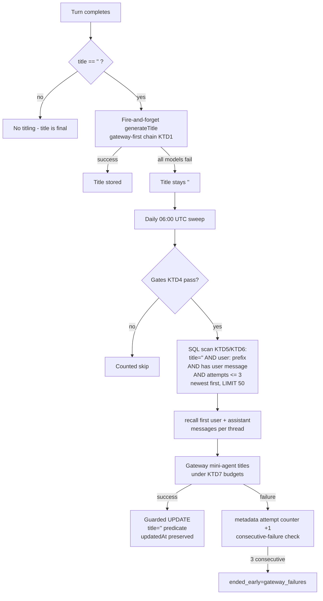

# AI Chat Title Reliability - Plan

## Goal Capsule

- **Objective:** A signed-in chat user's sidebar shows a real title for every conversation that has a user message. The `Conversation — <date>` label stops appearing for threads the system could have titled, and threads stranded untitled by past model failures heal without user action.
- **Means:** Gateway-first model fallback chain for per-turn titling (KTD1), plus a daily scheduled title-repair workflow (KTD3). See `docs/roadmap/ai-chat/feat-405-sidebar-untitled-thread-shows-date-label.md`.
- **Authority hierarchy:** This plan > the feat-405 ticket (the ticket's option B is superseded by KD1) > module docstrings. Repo laws in root `CLAUDE.md` and `apps/mastra/CLAUDE.md` bind throughout.
- **Stop conditions:** Stop and report if the Mastra runtime stops accepting a function-valued `generateTitle.model` (KTD1's pinned dist fact), or if the sweep design would require a schema change to `ai_chat` tables (none is planned; `metadata` JSONB is the only mutable field used).
- **Tail ownership:** The caller session owns commit/push/PR. Ticket amendment and lane README ride the code PR (U5).

---

## Product Contract

### Summary

Make ai-chat thread titles reliable in `apps/mastra`, two parts: (1) per-turn title generation moves from the failing free OpenRouter model to the seeker's gateway-first fallback chain; (2) a new daily-scheduled Mastra workflow finds signed-in threads stored with empty titles and generates titles for them via the gateway model. The chat app is untouched.

### Problem Frame

Threads with a stored title of `""` render as `Conversation — 21 Aug` in the chat sidebar. Titles come from Mastra's fire-and-forget `generateTitle`, pinned to `openrouter/google/gemma-4-26b-a4b-it:free`, which is rate-limited upstream (429, captured live 2026-08-21). Titling retries only on the thread's next turn, so a single-turn thread whose title call failed is untitled forever. The client repairs the label in memory on replay but never writes it back, which makes rows appear to swap states on refresh. Full analysis: the feat-405 ticket.

### Key Decisions

- KD1. **Fix generation reliability and add a repair sweep; do not build the ticket's option B** (server-derived fallback labels at list time). (session-settled: user-directed — chosen over option B: dogfood audience; old untitled threads may keep the date label until healed or purged by retention.) Governs R10.
- KD2. **The repair sweep is a standing daily safety net.** (session-settled: user-directed — chosen over a one-off backfill script, lazy replay-time backfill, or waiting out the 25-day retention window: it also heals threads stranded by any future titling outage within 24 hours.) Governs R4, R8.
- KD3. **The sweep uses the first-party gateway model only and ends its run early on gateway failure.** (session-settled: user-directed — chosen over reusing the full fallback chain: the sweep has no urgency, and conversation content should not go to the free pool when the paid first-party route is down.) Governs R6, R8.

### Requirements

**Per-turn titling**

- R1. After the first completed turn of a signed-in conversation, the stored thread title is a real LLM title, even when the OpenRouter free pool is rate-limited, whenever the gateway is enabled and reachable.
- R2. Title generation stays fire-and-forget. It never delays or fails the turn it rides on.
- R3. Non-`user:` resources (anonymous, dogfood) are never titled. The existing `generateTitle: false` per-call override is preserved.

**Repair sweep**

- R4. A `user:` thread stored with `title = ''` that has at least one user message is retitled by the daily sweep, subject to the per-run caps in R8, when the sweep is enabled and the gateway is available.
- R5. The sweep reads and writes only threads whose `resourceId` starts with the `user:` prefix, enforced in the SQL predicates and re-checked per row.
- R6. Sweep conversation content goes only to the first-party gateway model, never to an OpenRouter free-pool model.
- R7. A sweep repair changes neither the thread's sidebar position nor its retention timing: `updatedAt` is not modified.
- R8. The sweep is bounded per run: a candidate cap, a per-title time budget, a whole-run time budget, and an early stop after consecutive gateway failures. Unrepaired threads wait for the next run.
- R9. A thread that cannot be titled (no user message, or repeated generation failures) leaves the candidate set instead of starving future runs.

**Wire contract and observability**

- R10. `""` remains the wire sentinel for an untitled thread. `apps/chat` is not modified. The history route's wire-contract prose gains one line stating the sentinel is now repairable, not permanent.
- R11. Titles on the list wire are bounded in length and shape, covering both writers (per-turn titling and the sweep).
- R12. Log lines from titling and the sweep carry enums and counts only — never a title, thread id, resource id, or conversation text.

### Success Criteria

- The ticket's masking check passes: open conversation A, refresh, and read conversation B's rail label without clicking it — B shows a real title (requires gateway enabled; run as a local browser smoke).
- One sweep run against a store seeded with stranded threads reports `titled=N remaining=0` and a second run reports `scanned=0` (idempotence).

### Scope Boundaries

- `apps/chat` is untouched: `fallbackTitle`, `titleFromFirstUser`, and `mergeServerThreads` keep their current behavior.
- No schema changes to `ai_chat` tables. The attempt counter (KTD6) lives in the existing `metadata` JSONB column.
- Option A — the feat-405 ticket's name for re-pointing per-turn title generation at a reliable model route, realized here as U2 — deliberately keeps the free Gemma chain as titling failover when the gateway entry errors (it is the chain's tail), per the confirmed scope; only the sweep is gateway-only.

#### Deferred to Follow-Up Work

- Option B (server-derived list-time fallback labels, retiring the `""` sentinel) — revisit on audience widening.
- Manual thread rename (product feature, not a fix).
- A leader lease for the sweep — only if Mastra ever scales past one replica (the single-replica assumption is already load-bearing repo-wide).

### Outstanding Questions

- Q1 (ANSWERED affirmative — owner, 2026-08-27): `AI_GATEWAY_SEEKER_ENABLED=true` is set in production Railway. Original question: confirm `AI_GATEWAY_SEEKER_ENABLED=true` and `AI_GATEWAY_CHAT_API_KEY` are set in production Railway before merge. If not: U2 still improves per-turn titling (the two-entry retrying Gemma chain replaces today's single un-retried free model — see the gate-matrix note), but the gateway tier is inert and U4 skips every run until the key is provisioned. Q1 therefore gates the gateway tier and the sweep, not U2's whole benefit. This is a Railway-dashboard fact the implementing agent cannot read (the Railway CLI boundary forbids `railway variables`); the owner confirms it.
- Q2 (deferred, operator): After deploy, set `AI_CHAT_TITLE_REPAIR_ENABLED=true` in Railway to arm the sweep (default-off per KTD4).

---

## Planning Contract

### Key Technical Decisions

- KTD1. **Per-turn titling uses a function-valued title model: `titleModel` defaults to a function returning `buildSeekerModelList()`.** (session-settled: user-approved — chain reuse chosen over a gateway-only swap or staying on free Gemma: any gateway error falls back to today's behavior, and unsetting the seeker flag restores the current chain with no code change.) The function form is required, not cosmetic: it defers gateway-client construction out of module load, reads `AI_GATEWAY_SEEKER_ENABLED` per turn instead of freezing it at first `buildAiChatMemory()` call, and removes the module-load half of the KTD2 import cycle. **Pinned dist fact** (verified 2026-08-27 against the installed `@mastra/core`): `resolveTitleGenerationConfig` passes `generateTitle.model` to `getLLM`, whose `resolveModelSelection` accepts a function returning a model array and normalizes it via `normalizeModelFallbacks` — but the declared type is singular `DynamicArgument<MastraModelConfig>`, so the assignment needs a justified cast. Re-verify on `@mastra/*` bumps. Known cosmetic effect: `MastraMemory.getConfig()` drops a function-valued title model from its serialized config, so Studio's memory config reads as if titling were absent — note this beside the cast and in the docstring. `AI_CHAT_TITLE_MODEL` becomes dead and is deleted with its test references.
- KTD2. **Extract the seeker model list into a leaf module** (`src/mastra/seeker-model-list.ts`) before either behavior change. `seeker-agent.ts` already imports `ai-chat-memory.ts`; importing the reverse direction creates an ESM cycle exercised at module evaluation (`seeker-agent.ts` builds the agent at module scope). No lint rule catches cycles here. The leaf module owns `buildSeekerModelList()` and the new `buildSeekerGatewayModelEntry()`; `seeker-agent.ts` re-exports both so existing importers (`seeker-follow-ups-generate.ts`, tests, evals) are untouched. All gateway construction keeps the `createRequire` shim and `gateway-constants` imports — a static `@ai-sdk/*` import anywhere in the bundle graph breaks `mastra build` only, not dev (see `docs/solutions/conventions/mastra-inline-gateway-construction-createrequire.md`).
- KTD3. **The sweep is a Mastra workflow with a declarative schedule** `{ cron: "0 6 * * *", timezone: "UTC" }`, registered in `src/mastra/index.ts`, no `/forge-*` route. (session-settled: user-directed — chosen over a retention-style plain timer module: Studio visibility, manual runs, pause/resume, and the owner's stated goal of learning workflows.) Conflict note, resolved: `docs/solutions/best-practices/per-run-caps-vs-per-day-quota-claims-restart-refreshed-jobs.md` rejected the workflow scheduler for the Langfuse retention job because Studio's manual Run is a second spend path against a hard per-day external quota and missed fires do not backfill. Neither ground applies here: the sweep protects no external per-day quota, a manual run is idempotent (the `title = ''` predicate empties), and a missed fire is absorbed by the next day's run. 06:00 UTC is free of every existing job slot (00:00 Instagram, 01:00 YouTube, 02:00/02:30 SEO, 05:00 support research, 08:00 Langfuse sweep, hourly Datadog). Like every registered workflow, `title-repair` is startable on Mastra's code-unauthenticated native `/api/workflows/*` surface inside the network boundary — the same accepted posture as `/api/agents/*` and the memory routes, and a strictly smaller exposure than the already-reachable memory read (the run returns counts only); the binding containment remains the gateway/network boundary.
- KTD4. **Sweep gating is independent of the seeker flag.** The run proceeds only when ALL hold: `AI_CHAT_TITLE_REPAIR_ENABLED === "true"` (new default-off flag, `z.string().optional()` + accessor, copying `SEEKER_FOLLOWUPS_ENABLED`), `AI_GATEWAY_CHAT_API_KEY` present (via `buildSeekerGatewayModelEntry()` returning non-null), `resolveAiChatMemoryBackend() === "postgres"` AND `canAiChatDataPersist()` (the memory kill-switch stops the sweep's content egress, not just writes — kill-switch completeness follows data lifetime), `env.DATABASE_URL` set explicitly (no `getMastraDatabaseUrl()` localhost fallback — the erasure CLI's wrong-database rationale), and `SEEKER_ROUTE_ENABLED === "true"` (the lane-wide kill switch: darkening the ai-chat lane must also stop the sweep's scheduled content egress, with its own skip enum; `AI_CHAT_TITLE_REPAIR_ENABLED` stays the fine-grained lever). There is deliberately NO `NODE_ENV` rung: the default-off flag plus the explicit `DATABASE_URL` requirement already keep a local `mastra dev` run a clean counted skip, and a production-only gate would make the plan's own local Studio smoke unrunnable (production env parsing hard-requires seven unrelated vars). Rationale for not gating on `isAiGatewaySeekerEnabled()`: that flag is feat-237's documented seeker incident-rollback lever; coupling it in would silently disable title repair during exactly the outage that strands threads. `buildSeekerGatewayModelEntry()` therefore keys on the key's presence alone, while `buildSeekerModelList()` keeps its existing flag-gated prepend unchanged.
- KTD5. **Sweep data access is split by fitness.** Candidate scan and title write are direct SQL over a small dedicated `pg` Pool (`max: 2`, connect/statement timeouts — copy the pool shape in `workflows/datadog-mobile-triage.ts`), because `listThreads` cannot filter on `title` at all and every Memory-API title write bumps `updatedAt` (verified in the installed `@mastra/pg`: `saveThread`'s upsert overwrites both timestamps), which would reset the 25-day retention clock and jump repaired threads to the top of the rail overnight — violating R7. Message reads go through `Memory.recall({ threadId, resourceId, orderBy: { field: "createdAt", direction: "ASC" }, perPage: <small N> })` over the shared ai-chat store, not raw SQL — the repo already has two careful `content`/`parts` readers and does not need a third. The explicit ascending `orderBy` is load-bearing, not stylistic: omitting it makes the installed `@mastra/memory` return the NEWEST page reversed, never the thread's head (pinned dist fact, verified 2026-08-27 — `shouldGetNewestAndReverse` fires when `orderBy` is absent; re-verify on `@mastra/*` bumps), which would title stranded multi-turn threads from the wrong exchange. The `user:` prefix is parameterized from `USER_RESOURCE_PREFIX` (single home, `ai-chat-thread-ownership.ts`), never a SQL literal. The write is guarded: `UPDATE ai_chat.mastra_threads SET title = $1 WHERE id = $2 AND title = '' AND "resourceId" LIKE $3` — losing the race to live titling is a 0-row no-op, and the compound predicate satisfies the single-predicate blast-radius law by construction. Update the pool-arithmetic comment in `ai-chat-memory.ts`'s header (+2).
- KTD6. **Poison-pill handling, three parts.** (a) The candidate SELECT excludes threads with no user message (`EXISTS` subquery against `ai_chat.mastra_messages` on `thread_id` + role) — the store creates the thread row before generation, so zero-message threads are production-real. (b) `ORDER BY "updatedAt" DESC` with `LIMIT 50`, so the newest threads win the bounded budget, plus a belt `AND "updatedAt" > now() - interval` reusing `AI_CHAT_RETENTION_DAYS` so the sweep never pays to title a thread retention is about to delete. (c) A per-thread attempt counter in the existing `metadata` JSONB (e.g. `titleRepairAttempts`), incremented ONLY on thread-attributable failures (no usable message pair, empty-after-clamp, model refusal) and excluded above 3 — without it, any persistent per-thread failure eventually fills the LIMIT and the job dies silently. Failures that count toward KTD7's consecutive-gateway-failure tally never increment the counter: a multi-day gateway outage retries the same newest-first candidates each run, and charging those threads for the outage would permanently poison exactly the threads the sweep exists to heal.
- KTD7. **Budgets sized for a title, not a seeker answer.** Per-title: ~10s via `settleWithinBudget` + a small `maxOutputTokens`, strictly below the gateway entry's inherited 55s fetch timeout (which was sized for streamed answers; three consecutive 55s hangs would burn 165s before any failure counter trips). Whole run: ~5 minutes wall clock, ending cleanly with `ended_early=run_budget`. Early stop after 3 consecutive generation failures (`ended_early=gateway_failures`); the failure classifier treats EVERY non-success outcome as a generation failure rather than matching error names — the two real shapes are `settleWithinBudget`'s plain `Error("budget_aborted")` rejection and the gateway fetch guard's `TimeoutError`, and neither is an `APICallError`.
- KTD8. **Title derivation matches the live path.** Input is the thread's first user message plus its first assistant reply, formatted as `User:` / `Assistant:` lines — the same shape Mastra's own titler feeds its model — so repaired titles read like live ones in the same rail. A candidate with a user message but no assistant reply (a turn that failed before any reply persisted — reachable by KTD6(a)'s own argument) titles from the `User:` line alone and counts as normal generation, never a failure; the framework's own default title instructions already cover a one-sided transcript. The title prompt is code-owned (Mastra's default instructions are not exported); PR review is the control, mirroring `SEEKER_FOLLOW_UPS_INSTRUCTIONS`. Generation runs through a module-cached, zero-tool, zero-processor, memory-less Agent on the gateway entry only, registered with the runtime via the `__registerMastra` hook — copy the `seeker-follow-ups-generate.ts` shape, EXCEPT its tracing wiring: the sweep's generate call passes NO tracing request context and no tracing options, so its spans stay on the redacted default observability config and never reach the raw `langfuse-seeker` route (the follow-ups caller's tracing options stamp the raw-export marker; copying them would export conversation text to Langfuse nightly).
- KTD9. **Title clamping lands at both choke points.** The sweep clamps before writing (collapse whitespace, strip control characters, cap at 120 UTF-16 units, refuse empty-after-clamp as a generation failure). The list projection in `ai-chat-history-route.ts` (`projectThreadRow`) applies the same cap — this bounds BOTH writers, including the framework's own unclamped `createThread` path, and closes a pre-existing exposure: the list proxy's 2 MiB response cap has no derived budget, and 50 unbounded titles is the one term that can breach it, failing the whole sidebar with a 502 rather than one row.
- KTD10. **Observability answers "is the backlog draining", not just "what did this run do".** Each run logs `[title-repair] event=run_complete scanned= titled= failed= skipped= remaining= gave_up= oldest_untitled_age_days= ended_early=` — `remaining` and `oldest_untitled_age_days` come from one `COUNT(*)`/`MIN("updatedAt")` on the same guarded predicate (the restart-proof outcome metric, mirroring the Langfuse sweep's `oldest_age_days`), and `remaining` counts only threads still eligible for a future run. `gave_up` counts threads the KTD6 attempt cap has excluded (the untitled `user:` predicate WITHOUT the attempt-cap exclusion, minus `remaining`) — without it, `remaining=0` reads as a drained backlog precisely when threads have become permanently unrepairable. Gate-off skips log their own reason enum, distinct from `scanned=0`.
- KTD11. **Erasure residual accepted and recorded.** A thread read by the sweep seconds before a feat-337 erasure has already sent one message pair to the gateway; the guarded UPDATE makes the write a no-op. Blast radius is one message pair per thread per day. Mitigate the cheap half (re-check thread existence immediately before generating); record the residual in the module docstring, as feat-337 did for its own concurrent-write residue.

### High-Level Technical Design

Title lifecycle after this plan:

Gate matrix for the two units (flag states × outcome):

| `AI_GATEWAY_SEEKER_ENABLED` | `AI_GATEWAY_CHAT_API_KEY` | `AI_CHAT_TITLE_REPAIR_ENABLED` | Per-turn titling (U2)                      | Sweep (U4)         |
| --------------------------- | ------------------------- | ------------------------------ | ------------------------------------------ | ------------------ |
| true                        | set                       | true                           | Gateway-first chain                        | Runs on gateway    |
| true                        | set                       | false/unset                    | Gateway-first chain                        | Skips (flag)       |
| false                       | set                       | true                           | Two-entry Gemma chain (changed from today) | Runs on gateway    |
| false                       | set                       | false/unset                    | Two-entry Gemma chain (changed from today) | Skips (flag)       |
| any                         | unset                     | any                            | Two-entry Gemma chain (changed from today) | Skips (no gateway) |

The third row is KTD4's payoff: a seeker incident rollback does not disable title repair. The gateway-off cells are NOT today's behavior: today's title model is the single un-retried `gemma-4-26b-a4b-it:free` string, while `buildSeekerModelList()`'s disabled branch is a two-entry chain (`31b` primary with 1 retry, then `26b` with 1 retry) — so U2 improves the 429 exposure even with the gateway absent. The `SEEKER_ROUTE_ENABLED` lane kill switch (KTD4) is an additional AND-gate on every sweep row.

---

## Implementation Units

### U1. Extract the seeker model-list leaf module

- **Goal:** `buildSeekerModelList()` and a new `buildSeekerGatewayModelEntry()` live in a leaf module both `ai-chat-memory.ts` and the sweep can import without an ESM cycle.
- **Requirements:** Enables R1, R6. Implements KTD2; the gateway-entry gating implements KTD4's key-presence rule.
- **Dependencies:** none.
- **Files:** `apps/mastra/src/mastra/seeker-model-list.ts` (new), `apps/mastra/src/mastra/seeker-model-list.test.ts` (new), `apps/mastra/src/mastra/agents/seeker-agent.ts`, `apps/mastra/src/mastra/agents/seeker-agent.test.ts`.
- **Approach:**
  1. Move `buildSeekerModelList`, `createGatewayFetchWithTimeout`, and their gateway-construction block into the new module, preserving the `createRequire` shim and `gateway-constants` imports exactly (KTD2).
  2. Add `buildSeekerGatewayModelEntry(): ModelWithRetries | null` — returns the gateway entry (`.chat()`, `maxRetries: 0`, 55s fetch timeout) when `AI_GATEWAY_CHAT_API_KEY` is set, else null. It does not read the seeker flag (KTD4 rationale), and its model id resolves from `AI_GATEWAY_CHAT_MODEL ?? "coding"` — never from the flag-shaped `identity.models.routes[0]`, which holds a free-Gemma id when the seeker flag is off and would silently point the sweep's gateway calls at a model the gateway does not serve.
  3. `buildSeekerModelList()` keeps byte-identical behavior: flag-gated prepend of the gateway entry over the Gemma chain, now composing the shared entry builder.
  4. Re-export both from `seeker-agent.ts` so `seeker-follow-ups-generate.ts`, evals, and tests need no import changes.
- **Patterns to follow:** `docs/solutions/conventions/mastra-inline-gateway-construction-createrequire.md`; the existing `buildSeekerModelList` docstring moves with the code.
- **Test scenarios:**
  - Flag on + key set: list is gateway entry first, then the two Gemma entries; gateway entry has `maxRetries: 0`.
  - Flag off or key unset: list is exactly today's two-entry Gemma chain (behavior pin across the move).
  - `buildSeekerGatewayModelEntry()`: non-null when the key is set regardless of the seeker flag; null when the key is unset.
  - With the key set and `AI_GATEWAY_SEEKER_ENABLED` unset: the entry's model id is the gateway model (`AI_GATEWAY_CHAT_MODEL ?? "coding"`), never a Gemma id.
  - Existing `seeker-agent.test.ts` and `seeker-follow-ups-generate` suites pass unchanged (re-export compatibility).
- **Verification:** `pnpm --filter @forge/mastra test`, `typecheck`, and `build` all green — `build` is the only gate that catches a bundler-visible static `@ai-sdk/*` import.

### U2. Gateway-first per-turn titling

- **Goal:** `buildAiChatMemory`'s title model defaults to a function returning the seeker chain, so a healthy gateway titles every signed-in first turn.
- **Requirements:** R1, R2, R3. Implements KTD1 (session-settled — cited).
- **Dependencies:** U1.
- **Files:** `apps/mastra/src/mastra/ai-chat-memory.ts`, `apps/mastra/src/mastra/ai-chat-memory.test.ts`.
- **Approach:**
  1. Replace the `titleModel` default `AI_CHAT_TITLE_MODEL` with a function returning `buildSeekerModelList()` (import from the U1 leaf), cast per KTD1's pinned dist fact, with the dated verification note and the `getConfig()` serialization caveat beside the cast.
  2. Delete `AI_CHAT_TITLE_MODEL` and its test references.
  3. Rewrite the trust-posture paragraph and the titling docstring (the paragraph labelled "KTD12" in feat-241's numbering — not a KTD of this plan): gateway-first resolves the standing "revisit first-party gateway titling" note; free Gemma remains the failover tail; note the `AI_GATEWAY_SEEKER_ENABLED` coupling.
  4. `aiChatMemoryConfigFor` is untouched.
- **Patterns to follow:** the existing injectable `titleModel` seam; the existing both-backend-branch test loop.
- **Test scenarios:**
  - Both backend branches: the constructed Memory's `generateTitle.model` is a function, and invoking it returns the seeker chain (flag on: gateway-first; flag off: Gemma-only) — exercised against the real env seam, not a literal.
  - `threads` remains `undefined` in the options (the deprecated-nesting guard stays).
  - `aiChatMemoryConfigFor` still returns `generateTitle: false` for non-`user:` resources (R3 pin, existing test).
  - Pinned-dist-fact test: `resolveModelSelection`-compatible shape — a function returning an array is accepted by the installed `@mastra/core` `Agent.getLLM` path (guards the KTD1 cast across bumps).
- **Verification:** suites + `build` green; the docstring no longer names the free tier as the chosen posture.

### U3. Title clamp at the list projection

- **Goal:** No title on the list wire exceeds the display bound, whichever writer produced it.
- **Requirements:** R10, R11. Implements KTD9's projection half.
- **Dependencies:** none.
- **Files:** `apps/mastra/src/mastra/ai-chat-history-route.ts`, `apps/mastra/src/mastra/ai-chat-history-route.test.ts`.
- **Approach:**
  1. In `projectThreadRow`, clamp the projected title: strip control characters, collapse whitespace, truncate to 120 UTF-16 units. `""` passes through unchanged (sentinel preserved).
  2. Add one line to the wire-contract prose: `""` is still the untitled sentinel, now repairable by the daily sweep rather than permanent.
- **Patterns to follow:** the replay path's deterministic truncation of display strings (feat-329 bounds in the same file).
- **Test scenarios:**
  - A 10,000-character stored title projects at exactly 120 units.
  - A title with control characters and repeated whitespace projects cleaned.
  - `""` projects as `""` (sentinel untouched).
  - A normal short title projects byte-identical.
- **Verification:** suite green; the list projection is the only place both writers' titles cross the wire bounded.

### U4. Title-repair sweep workflow

- **Goal:** A daily 06:00 UTC workflow retitles stranded `user:` threads via the gateway, bounded, observable, and inert unless armed.
- **Requirements:** R4–R9, R12. Implements KTD3–KTD8, KTD10, KTD11 (KTD3 session-settled — cited).
- **Dependencies:** U1.
- **Files:** `apps/mastra/src/mastra/workflows/title-repair.ts` (new), `apps/mastra/src/mastra/workflows/title-repair.test.ts` (new), `apps/mastra/src/config/env.ts`, `apps/mastra/src/mastra/index.ts`, `apps/mastra/src/mastra/ai-chat-memory.ts` (pool-arithmetic comment only), `apps/mastra/src/mastra/title-repair-registration.test.ts` (new).
- **Approach:**
  1. Env: add `AI_CHAT_TITLE_REPAIR_ENABLED` (`z.string().optional()`, raw-read entry, `isTitleRepairEnabled()` accessor) — copy `SEEKER_FOLLOWUPS_ENABLED` verbatim.
  2. Workflow shell: one `createStep` whose `execute` checks the KTD4 gates (each miss is its own counted skip enum), opens the pool, delegates to a pure `executeTitleRepair(deps)` with injected `config`, `pool`, `recall`, `generate`, `now`, and closes the pool in `finally`. `createWorkflow({ id: "title-repair", schedule: { cron: "0 6 * * *", timezone: "UTC" } }).then(step).commit()` — copy the `datadog-mobile-triage.ts` shape.
  3. Candidate SELECT per KTD5/KTD6: `title = ''`, parameterized `user:` prefix, `EXISTS` user message, retention-window belt, attempt-counter exclusion, `ORDER BY "updatedAt" DESC LIMIT 50`.
  4. Per thread: re-check existence (KTD11), `recall` the first user + assistant messages over the shared store, generate via the module-cached gateway mini-agent under the KTD7 budgets, clamp per KTD9, guarded UPDATE per KTD5. On failure: increment the metadata attempt counter (its own guarded UPDATE merging JSONB), track consecutive failures.
  5. Run accounting per KTD7/KTD10: run ceiling, `ended_early` enums, final `COUNT(*)`/`MIN` for `remaining`/`oldest_untitled_age_days`, one `console.info` line, counts only.
  6. Register in `index.ts`; module docstring in the house style records the gate rationale (KTD4), the updatedAt decision (KTD5), the erasure residual (KTD11), and the single-replica assumption.
- **Execution note:** Write the module docstring before the code — the sibling modules each carry their decisions in the header, and three findings here are decisions-to-record.
- **Patterns to follow:** `workflows/datadog-mobile-triage.ts` (pool + thin-step shape, schedule test), `seeker-follow-ups-generate.ts` (mini-agent + `__registerMastra` + `settleWithinBudget`), `ai-chat-retention.ts` (bounded-sweep discipline, counts-only logging), `ai-chat-erasure.ts` (client-side re-check, DATABASE_URL refusal rationale), `support-research-registration.test.ts` (source-text registration pin).
- **Test scenarios:**
  - Happy path: seeded fake deps with three candidates → three guarded UPDATEs, `titled=3`, no `updatedAt` in the UPDATE's SET clause (assert on captured SQL).
  - Gate misses: each KTD4 gate false → counted skip with its own enum, zero pool activity.
  - Race: UPDATE affecting 0 rows (title no longer `''`) counts as `skipped`, not `failed`.
  - Poison pills: a zero-user-message thread never appears (SELECT shape pin); a thread at 3 attempts is excluded; a thread-attributable failure increments the counter; a run ending `ended_early=gateway_failures` leaves its candidates' attempt counters UNCHANGED (KTD6's outage/poison split).
  - One-sided thread: a candidate with a user message but no assistant reply produces a stored title from the `User:` line alone — not a counted failure.
  - Message read: the captured `recall` args carry the ascending `createdAt` orderBy; a multi-turn stranded thread titles from its FIRST exchange, not its newest (KTD5's pinned dist fact).
  - Tracing posture: the module's source imports none of the raw-tracing helpers (`newSeekerTracingRequestContext` / `buildFollowUpsTracingCallOptions` / the tracing-config context key) — spans stay on the redacted default config (KTD8).
  - Budgets: a generate stub that never resolves is abandoned at the per-title budget and counts as a failure (the `budget_aborted` rejection shape); 3 consecutive failures end the run with `ended_early=gateway_failures`; run-ceiling exit sets `ended_early=run_budget`.
  - Clamp: an over-long generated title is stored at 120 units; an empty-after-clamp result counts as a failure, no write.
  - SQL hygiene: the module source contains no literal `user:` (prefix is parameterized from `USER_RESOURCE_PREFIX`).
  - Schedule + registration: `getScheduleConfigs()` pins `{ cron: "0 6 * * *", timezone: "UTC" }`, no `id`, no `inputData`; input schema accepts `{}`; the registration test pins the `index.ts` import + `workflows:` entry as source text.
  - Logging: the run-complete line matches the KTD10 shape; no argument to any log call contains a title or id (assert on captured calls).
- **Verification:** suites, `typecheck`, `lint`, `build` green. Optional local smoke: arm `AI_CHAT_TITLE_REPAIR_ENABLED=true` and `SEEKER_ROUTE_ENABLED=true` with a throwaway `DATABASE_URL` seeded with `''`-titled threads, run the workflow from Studio; verify counts and that a second run reports `scanned=0`. The gateway key comes from the existing `apps/mastra/.env` — never a launch-line value (a real secret would land in shell history, and `mastra dev` force-writes `.env` entries over inherited process env anyway, so a prefix override of any var present in that file is silently discarded; per-run values work only for vars absent from the file, or under `MASTRA_SKIP_DOTENV=true` for a fully-minted run).

### U5. Documentation and ticket

- **Goal:** The docs a future agent reads describe the shipped shape, not the superseded one.
- **Requirements:** R10's prose line lands in U3; this unit owns the rest.
- **Dependencies:** U1–U4.
- **Files:** `apps/mastra/CLAUDE.md`, `docs/roadmap/ai-chat/feat-405-sidebar-untitled-thread-shows-date-label.md`, `docs/roadmap/ai-chat/README.md`.
- **Approach:**
  1. `apps/mastra/CLAUDE.md`: add the `AI_CHAT_TITLE_REPAIR_ENABLED` env-table row; extend the `AI_GATEWAY_SEEKER_ENABLED` row's coupling note (it now also selects the titling chain); update the "Titles (KTD12)" bullet in the history-read section; add a short sweep subsection (schedule, gates including the two-lever retraction order — `SEEKER_ROUTE_ENABLED=false` darkens the whole lane including the sweep, `AI_CHAT_TITLE_REPAIR_ENABLED=false` is the fine-grained lever — and pause/resume inheriting the Instagram affordance).
  2. Rewrite the feat-405 ticket body: record option B as considered-and-rejected (KD1) with the sweep as the shipped complement; carry the KTD4 gate matrix; per lane rules, flip status + prepend `## Resolution` in the code PR's final commit, and fill the README row + status counts in the same change.
- **Test scenarios:** Test expectation: none — docs-only unit; the lane's README counts are hand-verified against ticket frontmatter.
- **Verification:** lane README counts agree with ticket frontmatter; no doc still names the free tier as titling's chosen posture (retired-mechanism prose sweep over `AI_CHAT_TITLE_MODEL` and `gemma-4-26b` in tracked markdown).

---

## Verification Contract

| Check                           | Command                                                              | Applies to                                                                  |
| ------------------------------- | -------------------------------------------------------------------- | --------------------------------------------------------------------------- | -------------------------------------------------------------------- |
| Unit suites                     | `pnpm --filter @forge/mastra test`                                   | U1–U4                                                                       |
| Types                           | `pnpm --filter @forge/mastra typecheck`                              | U1–U4                                                                       |
| Lint                            | `pnpm --filter @forge/mastra lint`                                   | U1–U4                                                                       |
| Bundler gate                    | `pnpm --filter @forge/mastra build`                                  | U1, U2, U4 — the only check that catches the static `@ai-sdk/*` Rollup trap |
| Docs prose sweep                | `git grep -niE 'AI_CHAT_TITLE_MODEL                                  | gemma-4-26b' -- '\*.md'`                                                    | U5 — classify hits: historical record vs forward-looking instruction |
| Browser smoke (optional, local) | signed-in masking check per Success Criteria, gateway creds required | U2                                                                          |
| Sweep smoke (optional, local)   | Studio manual run against throwaway Postgres                         | U4                                                                          |

The two mocked-shape suites (U2's chain pin, U4's SQL/log captures) prove branch shape; the pinned-dist-fact test in U2 and the optional smokes carry the real-contract half, per the repo's mocked-vs-real discipline.

---

## Definition of Done

- All five units landed; suites, typecheck, lint, and `build` green.
- U2's docstring rewrite complete — no doc names the free tier as the chosen titling posture.
- The sweep ships default-off; arming it (Q2) is a recorded operator step, not a merge condition.
- Q1 confirmed AFFIRMATIVE by the owner before merge. If the gateway key is absent in production, the ticket is NOT flipped to complete — it stays in-progress with gateway provisioning recorded as the open blocker, because both halves of the headline fix would ship inert.
- Ticket flipped to complete with `## Resolution`, README row and counts updated, in the code PR per lane rules (subject to the Q1 condition above).
- No abandoned experimental code in the diff; the pool-arithmetic comment in `ai-chat-memory.ts` reflects the final pool count.
