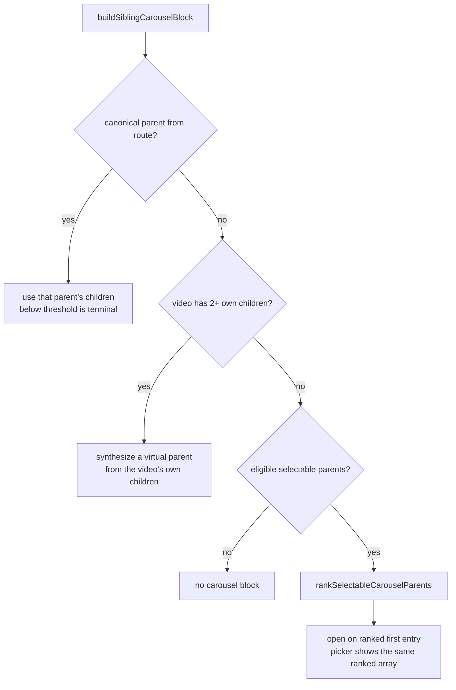

# Standalone Carousel Parent Ranking - Plan

## Goal Capsule

- **Objective:** A viewer who opens a clip's standalone Watch page sees the film or series that clip belongs to as the carousel's opening context, so they can keep watching the work they are actually in.
- **Means:** Rank a standalone page's selectable carousel parents by the parent's own container label (KTD1).
- **Authority hierarchy:** An R wins on product behavior. A KTD wins on implementation mechanism inside its cited R constraints. A unit overrides neither.
- **Execution profile:** The code change is already written and verified in the working tree. Re-verify against the Verification Contract, then ship.
- **Stop conditions:** Stop when a PR against `main` is open and CI has decided. Do not merge the PR. Do not deploy.
- **Tail ownership:** The shipping tail (commits, push, PR) belongs to this run. Merge and deploy belong to a human.

---

## Product Contract

### Summary

Rank the candidate parents of a standalone Watch page by each parent's own `label`, promoting a containing work (`FEATURE_FILM`, `SERIES`) ahead of a curated `COLLECTION`. The carousel then opens on the film or series the clip is a chapter of. Every eligible parent stays in the carousel's parent picker; only the default changes.

### Problem Frame

A Video can sit under more than one parent. `CONCEPTS.md` states the distinction directly: a parent/child link alone does not say whether the parent is a container. Admin returns `Video.parents` sorted by `videoRelationOrderBy` — `order asc nulls last, createdAt, id`. That `order` column is the child's index _inside_ each parent. It was introduced for chapter sequencing (see `docs/plans/2026-06-14-001-fix-watch-video-relation-order-plan.md`) and applied to `parents` for query determinism.

Sorting parents by that column ranks containers by "which one lists this clip earliest". That is coincidence, not intent. On `/watch/the-arrest-of-jesus-and-peter-denial.html` the clip is order 5 in the "Anticipate the Resurrection" collection (29 children) and order 41 in the "Life of Jesus (Gospel of John)" film (49 children). The playlist wins the default slot over the film. The result is stable across deploys, so it reads to an editor as an authoring decision rather than a defect.

### Key Decisions

- **Every eligible parent stays selectable.** The collection is a legitimate destination, just not the default. (session-settled: user-approved — chosen over filtering collections out of the picker: removing a real destination is a larger behavior change than reordering one.) Governs R3, R4.

### Requirements

**Ranking behavior**

- R1. On a standalone watch route with two or more eligible parents, the sibling carousel opens on a parent whose label marks it a containing work when one exists.
- R2. When no eligible parent carries a containing-work label, parent order stays exactly as Admin supplied it.
- R3. Every eligible parent remains present in the carousel's parent picker.
- R4. The picker's first entry is the parent the carousel opened on.
- R5. Label matching ignores case and surrounding whitespace.

**Preserved behavior**

- R6. Contextual watch routes, which take their canonical parent from the URL, are unchanged.
- R7. The hero's next-watch item is unchanged on standalone routes.
- R8. A standalone Video whose own children form a qualifying rail keeps that intrinsic rail; external parents remain a fallback only.

### Success Criteria

- Loading `/watch/the-arrest-of-jesus-and-peter-denial.html` opens the carousel on "Life of Jesus (Gospel of John)" with "Anticipate the Resurrection" still reachable from the picker.
- No standalone page that lacks a `FEATURE_FILM` or `SERIES` parent changes its rendered carousel.

### Scope Boundaries

- Admin's `videoRelationOrderBy` is unchanged. It is correct for `Video.children`, which is what it was built for.
- No GraphQL schema change, no codegen, no data migration. `parent.label` is already selected by both watch operations in `apps/web/src/lib/fragments/watch-video.ts` and already mapped by `normalizeParent`.
- The carousel's duplicate-tile question is not in scope. An earlier report of duplicate children in the resurrection collection was a parsing artifact; parsing the payload as JSON shows 29 and 49 children with no duplicates in either parent.

#### Deferred to Follow-Up Work

- Forward-looking `ce:`-style skill references remain in five files this run does not touch: `.github/PULL_REQUEST_TEMPLATE.md` (lines 7-10, the checklist every PR author fills in), `AGENTS.md` (line 27), `CLAUDE.md` (lines 203, 204, 210, 219), `apps/admin/AGENTS.md` (line 90), and `compound-engineering.local.md` (line 77). The user scoped this run's tooling fix to the two `.claude/commands` files. Hits under `docs/brainstorms/`, `docs/plans/`, and `docs/roadmap/` are historical records of past runs and stay verbatim per the retirement prose-sweep rule in `CLAUDE.md`.

### Open Questions

All deferred, none launch-blocking — the ranking is implementable without them.

- How many standalone pages does this actually reorder? The change touches every clip with a containing-work parent sitting behind another eligible parent, and only one such page was inspected. The count is answerable from Admin with a query over `VideoRelation` joined to parent labels; it is not answerable from this worktree, which has no Admin credentials. Until measured, the blast radius is unknown and Success Criterion 2 covers only the population the change provably cannot affect.
- Should `SHORT_FILM` and `EPISODE` parents join the promoted tier? Admin's `VideoLabel` carries both, and `apps/admin/src/app/dashboard/video-library-utils.ts` treats them as first-class library categories beside features and series. A clip whose only containing work carries one of those labels keeps the defect this plan fixes.
- Is `SERIES` correctly grouped with `FEATURE_FILM`? The Assumptions entry justifies it as "a clip is a chapter of" both, but `CONCEPTS.md` reserves Chapter for a film's children and defines a series' children as Episodes that are works in their own right. No production page with a `SERIES` parent alongside another eligible parent was located, so the pairing ships unverified.
- When a clip sits under two containing works, the default still falls back to Admin's `VideoRelation.order` — the same key this plan calls coincidence. U1 pins the behavior; no requirement states whether it is an accepted limit.

### Sources

- `apps/admin/src/graphql/loaders.ts` — `videoRelationOrderBy` and `loadVideoRelationsByVideoId`, the production DataLoader behind `Video.parents`.
- `apps/admin/src/graphql/types/video.ts` — the same comparator on `videoParentsFilter` / `videoChildrenFilter`.
- `docs/plans/2026-06-14-001-fix-watch-video-relation-order-plan.md` — where `VideoRelation.order` and the shared comparator were introduced, for chapter sequencing.
- `docs/solutions/logic-errors/canonical-video-relation-order-download-prefixes.md` — the sibling trap on the same column, in the correct direction.
- `CONCEPTS.md` — "Video" (a parent/child link alone does not say whether the parent is a container) and "Standalone Watch Route" (external collections are a fallback and do not become the standalone Video's canonical or next-item identity).
- Live RSC flight payload of `https://www.jesusfilm.org/watch/the-arrest-of-jesus-and-peter-denial.html`, captured 2026-08-28 with `curl -sS -L --compressed` and parsed as JSON by bracket-matching each parent's `children` array — the source of the two parents' labels, child counts (29 and 49), and per-parent `order` values (5 and 41). Re-run that capture before trusting those numbers; they are a point-in-time read of production, not a repeatable gate.

---

## Planning Contract

### Key Technical Decisions

- KTD1. **Rank on the parent's own label, not on the relation edge.** The edge carries one `order` column that answers a question about the child. (session-settled: user-directed — chosen over a per-collection data cleanup in Admin: the ranking key is wrong for every multi-parent clip, so a data edit fixes one page and leaves the class open.) Governs R1.
- KTD2. **Two tiers, not a full label ranking.** Promote `FEATURE_FILM` and `SERIES`; leave everything else, including a null or unrecognized label, in Admin's order. (session-settled: user-approved — chosen over a full per-label priority ranking: an unknown label then degrades to today's behavior instead of reshuffling pages this bug never touched.) Governs R1, R2.
- KTD3. **Rank once and share the ranked array.** `SiblingCarousel` derives its default from `selectableParents[0]`, so the block's `canonicalParent` and its `selectableParents` must come from the same sorted array or the picker's first entry stops matching the open rail. Governs R4.
- KTD4. **Canonicalize the label through the repo's existing `normalizeLabel`, not a hand-rolled compare.** `apps/web/src/lib/video-labels.ts` already exports the canonicalizer that `videoLabelMessageKey` — imported by `SiblingCarousel` itself — uses to render these labels: it trims, converts camelCase and space/hyphen separators to SNAKE_CASE, and uppercases. A bare `toUpperCase()` maps the camelCase spelling `featureFilm`, which appears in web's own route fixtures, to `FEATUREFILM` and matches nothing. Every mismatch fails in the silent direction, straight back to the old default. Governs R5.
- KTD5. **Carry `label` as an optional field on `CarouselParent`.** The synthesized parents — the virtual parent built from the current video's own children, and the one in `withCompatibilityAdmittedVideoChildren` — describe the video being watched, not a container, and nothing ranks them. Making the field required would force a meaningless value at both sites.
- KTD6. **Ship as three commits on one PR.** (session-settled: user-directed — chosen over one squashed commit: keeps a tooling-config change out of the product fix's history entry.)

### High-Level Technical Design

`buildSiblingCarouselBlock` already has three sources for the rail. Only the third changes: its input list is ranked before the first entry is taken.



### Assumptions

- Admin populates `label` on parent Videos in production. Grounded, not assumed blind: the two production parents render `COLLECTION` and `FEATURE_FILM` on their own pages, and both watch operations select `label` inside `parents { parent { … } }`.
- A parent labelled `SERIES` should rank with `FEATURE_FILM`. Both are containing works a clip is a chapter of; no production page was checked for this pairing.

---

## Implementation Units

### U1. Rank standalone carousel parents by container label

- **Goal:** The standalone carousel opens on the containing work, with the picker's first entry matching it.
- **Requirements:** R1, R2, R3, R4, R5, R6, R7, R8. Implements KTD1, KTD2, KTD3, KTD4, KTD5.
- **Dependencies:** none.
- **Files:**
  - Modify: `apps/web/src/lib/content.ts`
  - Modify: `apps/web/src/app/[locale]/[htmlLang]/[...rest]/page.tsx`
  - Test: `apps/web/src/lib/__tests__/content-watch-merge.test.ts`
  - Test: `apps/web/src/app/[locale]/[htmlLang]/[...rest]/__tests__/page-routing.test.tsx`
  - Test: `apps/web/src/lib/content.test.ts`
- **Approach:**
  1. Add an optional `label` to `CarouselParent` per KTD5.
  2. Add an exported ranking helper beside `buildSiblingCarouselBlock` that promotes the containing-work labels per KTD2 and matches per KTD4. Sort a copy; the caller's array belongs to the resolver.
  3. Wire it into `buildSiblingCarouselBlock`'s selectable-parents branch only, feeding both the block's parent and its picker list from one ranked array per KTD3.
  4. Thread the parent's `label` through `selectableParentsForStandaloneVideo` in the route. This is the seam that silently reverts the whole fix, so comment it as load-bearing.
- **Patterns to follow:** `normalizeLabel` in `apps/web/src/lib/video-labels.ts` — the canonicalizer `videoLabelMessageKey` already applies to these same labels. Export it rather than adding a second, weaker comparison beside it.
- **Test scenarios:**
  - Two parents supplied collection-first, film-second: the ranked output puts the film first. Supplying them in the already-correct order proves nothing.
  - A `SERIES` parent is promoted the same way a `FEATURE_FILM` parent is.
  - A film parent is promoted for each spelling of its label — SNAKE_CASE `FEATURE_FILM` (admin's wire enum, the production-reachable one), lowercase, camelCase `featureFilm`, space-separated, and with surrounding whitespace. Drive these from one table so a weaker comparison cannot pass part of the set.
  - All parents are collections, one with a null label: the output order is byte-identical to the input order.
  - Several containing works and one collection: the containing works keep their supplied relative order ahead of the collection.
  - The helper does not mutate the array it was handed.
  - Through `buildSiblingCarouselBlock`: the block's parent, and the first entry of its picker list, are the same film.
  - End-to-end through the route, with the production shape — a `COLLECTION` parent listed first and a `FEATURE_FILM` parent second: the rendered carousel block opens on the film and its picker lists film-then-collection.
  - Through the resolver normalizer: a raw Admin parent carrying `label: "SERIES"` still carries that label after `normalizeAdminVideo`.
- **Execution note:** Falsify both guards before trusting them. Neuter the sort and confirm the unit tests go red; delete the single `label:` line in the route and confirm the route test goes red. A hand-built fixture in the expected order passes whether or not the ranking runs.
- **Verification:** `apps/web` unit, typecheck, and lint gates pass, and the two falsification checks each produce a red test.

### U2. Capture the join-order learning

- **Goal:** The general rule — an edge's ordering column ranks one traversal direction only — is durable for the next person who reads a relation list from the far side.
- **Requirements:** none directly; it serves the Definition of Done's learning criterion.
- **Dependencies:** U1.
- **Files:**
  - Create: `docs/solutions/logic-errors/join-order-column-is-not-a-ranking-in-the-reverse-direction.md`
- **Approach:** Follow the frontmatter and section shape of the sibling entry `docs/solutions/logic-errors/canonical-video-relation-order-download-prefixes.md`, and cross-link it. Record why hand-built fixtures cannot catch this class, and name the silent-revert seam.
- **Test expectation:** none -- documentation only.
- **Verification:** The file exists with valid frontmatter and cross-links the sibling entry and the originating plan.

### U3. Correct the ce skill names in the repo slash commands

- **Goal:** The repo's own workflow commands name skills that actually resolve.
- **Requirements:** none; delivery-scoped per KTD6.
- **Dependencies:** none.
- **Files:**
  - Modify: `.claude/commands/work.md`
  - Modify: `.claude/commands/review-fix-loop.md`
- **Approach:** Replace the `ce:`-colon spellings with the hyphenated skill names, noting that the review skill is `ce-code-review` and that no `ce-review` exists. Add the Claude Code install path and the per-config-directory troubleshooting note, since plugin registries are per `CLAUDE_CONFIG_DIR`.
- **Test expectation:** none -- repo tooling configuration, no runtime behavior.
- **Verification:** Both files pass `prettier --check`, and no `ce:`-style invocation remains in either file except where it is named as a spelling that does not resolve.

---

## Verification Contract

| Gate                       | Command                                        | Applies to |
| -------------------------- | ---------------------------------------------- | ---------- |
| Unit and integration tests | `pnpm --filter @forge/web test`                | U1         |
| Types                      | `pnpm --filter @forge/web typecheck`           | U1         |
| Lint and formatting        | `pnpm --filter @forge/web lint`                | U1         |
| Markdown formatting        | `npx prettier --check` on the changed markdown | U2, U3     |

The worktree needs its toolchain on `PATH` before any of these — mise's shims do not resolve in a fresh worktree:

```bash
export PATH="$HOME/.local/share/mise/installs/node/24.19.0/bin:$HOME/.local/share/mise/installs/pnpm/9.12.3/bin:$PATH"
```

### Measured render cost (U1)

A jsdom render of the real `SiblingCarousel` subtree at the two child counts the reference page moves between, with the active index placed as production places it:

| Rail                         | Children | Active index | DOM nodes | Serialized HTML |
| ---------------------------- | -------- | ------------ | --------- | --------------- |
| Collection (today's default) | 29       | 5            | 427       | 103,807 B       |
| Film (ranked default)        | 49       | 41           | 707       | 172,250 B       |

Delta on an affected page: +280 DOM nodes and +68 KB of markup for this one component, scaling linearly with child count (+66%).

Judged acceptable, with the reasoning stated rather than assumed:

- Child thumbnails render `loading="lazy"`, so the number of images the browser actually fetches on load is bounded by the viewport, not by array length. Moving the active index from 5 to 41 changes which cards sit near the scrolled position, not how many are fetched.
- 49 children is inside already-shipped scale for this component: the JESUS rail renders 61, and `buildSiblingCarouselBlock` has always rendered whichever parent landed first with no cap. This change moves a page between two supported sizes rather than opening a new capacity regime.

Stated limit on this evidence: it measures DOM cost, not LCP or Web Vitals. A worktree has no reachable Admin GraphQL endpoint, so a real-backend render was unavailable here. LCP evidence, if wanted before merge, has to come from a deployed preview.

Falsification checks, both required for U1:

- Make the ranking helper return its input unchanged. The ranking unit tests must go red.
- Delete `label: filteredParent.label` from `selectableParentsForStandaloneVideo`. The route test must go red.

Page-load evidence is required for U1, and is recorded below. The ranked default carries MORE tiles, not fewer: on the reference page the carousel goes from the collection's 29 children to the film's 49, `SiblingCarousel` maps every child to a lazy `next/image` card with no slice, and the auto-scroll target moves from index 5 to index 41. That is a rendering and media-volume change, which `docs/solutions/conventions/frontend-change-page-load-performance-verification.md` says needs timing, resource-timing, or Web Vitals evidence rather than a visual smoke.

---

## Definition of Done

**Global**

- All four Verification Contract gates pass.
- Both falsification checks produce a red test before being reverted.
- Three conventional commits exist on `t3code/fix-episode-carousel-collection`, split per KTD6, each ending with the repo's required co-author trailer.
- A PR against `main` is open, its body ends with the repo's required generation trailer, and CI has decided.
- No experimental or dead-end code remains in the diff.
- The PR is not merged and nothing is deployed.
- Success Criterion 1 is a live production check and therefore outside this run's stop conditions. Whoever merges owns confirming `/watch/the-arrest-of-jesus-and-peter-denial.html` opens on the film after deploy; no gate in this run observes it.

**Per unit**

| Unit | Done signal                                                                                                                                                                                                                                                                      |
| ---- | -------------------------------------------------------------------------------------------------------------------------------------------------------------------------------------------------------------------------------------------------------------------------------- |
| U1   | The route test asserts the carousel opens on the film for the production two-parent shape, that the picker's first entry matches it, and that the download-filename sequence is numbered inside that same parent. Measured render cost is recorded in the Verification Contract. |
| U2   | The learning file exists, cross-links its sibling entry, and names the silent-revert seam.                                                                                                                                                                                       |
| U3   | Neither command file instructs a reader to invoke a skill name that does not resolve.                                                                                                                                                                                            |
