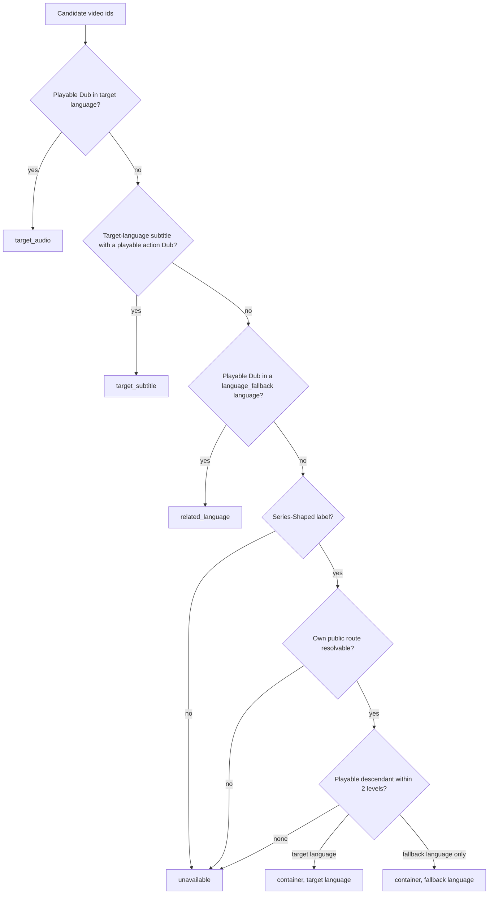

# Watch Search Container Availability - Plan

## Goal Capsule

- **Objective:** A viewer searching Watch never sees a series or collection labelled "Not available" when they can open it and play something inside it.
- **Means:** Resolve Search Watchability for a Series-Shaped Video from its playable descendants instead of its own Dubs, and give that state its own availability kind (KTD1, KTD2).
- **Authority:** The Requirements below own product behavior. `CONCEPTS.md` owns the Series-Shaped test and the Search Watchability state set. Linear FGE-27 owns the collection-availability criterion this closes; FGE-108 is the user report.
- **Execution profile:** One new resolution tier in Admin's watchability service, its kind threaded through the Watch search GraphQL surface, and a small Web mapping change — with real-database coverage as the discriminating proof.
- **Stop conditions:** Stop if production `watchSearch` no longer returns `UNAVAILABLE` for `easter`, `nua-easter`, `anticipate-the-resurrection`, or `guide-episode-6`; if the `video_relation` parent/child direction does not match `videoChildrenByParentId`; or if a Series-Shaped label gate would exclude a record the evidence shows is affected.
- **Tail ownership:** The LFG run owns review, CI, PR, and the Linear and follow-up-ticket updates. It does not deploy production.

---

## Product Contract

### Summary

Watch search classifies a Series-Shaped Video by the Dubs attached to that Video alone. Containers carry no Dub of their own, so all of them resolve to the no-option state and render as unavailable cards. This plan adds a fourth resolution tier that reads playable descendants to a depth of two, emits a distinct `container` Search Watchability state, and lets Web render those results as ordinary available cards.

### Problem Frame

`SearchWatchabilityService.hydrate` resolves playback from rows scoped to the candidate's own `videoId` across three tiers — target audio, target subtitle, related language. A COLLECTION or SERIES owns no `video_dub`; its playability lives in its children. Every container therefore falls through all three tiers to the empty watchability record and is returned as `UNAVAILABLE`.

Web then renders the "Not available · English" badge, greys the artwork, drops the Mux hover preview, suppresses the episode-count pill and type badge, sets `prefetch={false}`, and Admin's ranking demotes the row. The link still works: for an unavailable result `defaultHrefBuilder` emits `watchUnavailableLanguagePath(slug, english)`, whose wire shape is identical to the canonical route these containers legitimately have. The viewer opens a working series page from under a badge that says it is unavailable — which is the report in FGE-108: *"I searched for Easter and it pulls up things that say Not available in English, but when I click on them, they are available."*

Production evidence on 2026-08-28 confirms the class and its bounds. A `watchSearch` for `Easter` returned 11 results, of which 4 were `UNAVAILABLE`, and all 4 were containers whose public routes return HTTP 200. Across `Jesus`, `LUMO - The Gospel of John`, `Christmas`, and `Easter`, every `UNAVAILABLE` result was a container and no leaf video was affected. A sweep of all 986 catalog videos found 101 containers, 98 with playable direct children. The 3 with no playable direct child — `the-bibleproject-collection`, `life-of-jesus-series`, `days-with-jesus` — are two-level nests whose children are themselves SERIES with playable grandchildren, so no production container is genuinely without playable content. `Nua_Know_God` is the one record that is correctly `UNAVAILABLE`: it has no working public route at all, tracked separately in FGE-97, FGE-98, and FGE-2.

### Key Decisions

- Availability for a Series-Shaped Video derives from its playable descendants, and Web renders such a result as an ordinary available card. (session-settled: user-approved — chosen over a Web-only mitigation that suppresses the badge when `label` is SERIES/COLLECTION and `childCount > 0`: that mitigation lies for `Nua_Know_God` and fixes neither the ranking demotion nor the suppressed artwork.) Governs R1, R6.
- A container with a published route but no playable descendant in any language gets no bespoke presentation. (session-settled: user-approved — chosen over designing and testing an intentional presentation for that state: a full 986-video catalog sweep found zero such containers, and R4 already covers the route-unresolvable case.) Governs R4.

### Requirements

**Availability classification**

- R1. A Series-Shaped Video that resolves in no earlier tier, and has at least one playable descendant in the target language, resolves to the `container` Search Watchability state rather than the no-option state. A Series-Shaped Video carrying its own playable Dub keeps the state that Dub earns it — descendants never override a direct playback option.
- R2. Descendant search reaches two relation levels: direct children and their children. It never recurses further.
- R3. When a Series-Shaped Video has no playable descendant in the target language but has one in a related fallback language, it resolves to `container` and carries that fallback language as its availability language and href language.
- R4. A Series-Shaped Video whose own public route cannot resolve — unpublished, `noIndex`, a non-public slug, or restricted from the `watch` platform — stays in the no-option state regardless of descendant playability.
- R5. Descendant playability applies the same visibility rules as every other public Watch surface: a published locale, no soft-delete, no `watch` platform restriction, and a published Dub with non-empty `hls`.
- R8. A Video that is not Series-Shaped is unaffected, including a FEATURE_FILM that carries Chapters as children.

**Result presentation and ranking**

- R6. A `container` result renders as an ordinary available card: no unavailable badge, artwork shown at full contrast with no scrim, episode-count pill and type badge shown, and a canonical watch route as its destination. The animated hover preview stays absent, because a container carries no `playbackId` to source one from; that is the correct outcome, not a gap.
- R7. A `container` result ranks above a related-language result and below a target-subtitle result. The relative order of the pre-existing states does not change.

**Compatibility**

- R9. A Web client that predates this change and receives the new kind renders the result as an available card with a canonical destination, never as a broken or unavailable one.
- R10. A `container` result writes no unavailable-language recovery context when clicked.

### Acceptance Examples

- AE1. **Container playable at depth 1**
  - **Covers:** R1, R6, R7
  - **Given:** A search for `Easter` with target language `english`, where `easter` is a COLLECTION with 29 children and `easter-explained` among them is playable in English.
  - **When:** Watch search resolves availability.
  - **Then:** `easter` carries `availability.kind = CONTAINER`, an href language of `english`, and renders with its artwork, a `29 episodes` pill, and no unavailable badge.

- AE2. **Container playable only at depth 2**
  - **Covers:** R1, R2
  - **Given:** `the-bibleproject-collection`, whose 5 children are all SERIES and whose playable Dubs sit on the grandchildren.
  - **When:** Watch search resolves availability.
  - **Then:** it resolves to `container`, not the no-option state.

- AE3. **Container with no resolvable route**
  - **Covers:** R4
  - **Given:** A collection whose slug is `Nua_Know_God` — underscored and capitalised, so no public route exists — with playable children.
  - **When:** Watch search resolves availability.
  - **Then:** it stays in the no-option state and keeps the unavailable card presentation.

- AE5. **Container hidden from Watch**
  - **Covers:** R4
  - **Given:** A published container that carries `restrictViewPlatforms` including `watch`, whose child is fully visible and playable in the target language.
  - **When:** Watch search resolves availability.
  - **Then:** it stays in the no-option state. Descendant visibility never overrides the root's own restriction.

- AE4. **Descendants hidden from Watch**
  - **Covers:** R5
  - **Given:** A published container whose only playable child carries `restrictViewPlatforms` including `watch`.
  - **When:** Watch search resolves availability. `hydrate` takes no principal, so this holds for every caller, exactly as the three existing tiers already behave.
  - **Then:** the child does not count and the container stays in the no-option state.

### Scope Boundaries

- Presentation of genuinely unavailable results is unchanged. The dimmed-card contract from `docs/plans/2026-08-22-0533-fix-unavailable-watch-cards-plan.md` continues to govern the no-option state.
- Ranking weights other than the availability tier position are unchanged.
- The `Nua_Know_God` slug defect is not fixed here. It is Core-side work in FGE-97, FGE-98, and FGE-2.

#### Deferred to Follow-Up Work

- The Typesense availability projection (`buildAvailabilityDocuments` and `watchabilityRank` in `apps/admin/src/services/typesense-watch-search-indexer.ts` and `apps/admin/src/services/typesense-watch-search.service.ts`) carries the same self-scoped assumption and will reintroduce this defect when it starts serving results. It needs its own ticket before that cutover. Production currently reports `searchMode: "watch-search"`, so it serves nothing today.
- `SeriesHero` poster artwork for containers without an authored image is tracked in `todos/023` and is untouched here.

---

## Planning Contract

### Key Technical Decisions

- KTD1. **Emit a distinct `container` watchability kind.** (session-settled: user-approved — chosen over reusing `target_audio` for containers: a container carries no `playbackId` and no play action, so the play kind would push a null-playback row through the play path and Web could not distinguish browsing a series from playing a video.) The kind is added to `SearchWatchabilityKind`, `WatchSearchAvailabilityKind`, and the `WatchSearchAvailabilityKindEnum` Pothos enum as `CONTAINER`. Governs R1, R6.
- KTD2. **Walk descendants with an explicit depth cap of two.** (session-settled: user-approved — chosen over a direct-children-only aggregation or reuse of the existing `childDubLanguages` helper: three production collections are two-level nests, and `childDubLanguages` aggregates direct children only by its own documented contract.) The cap is stated in the query, not left to a termination condition — `video_relation` has no cycle constraint, and an uncapped walk on a cyclic row does not terminate. Governs R2.
- KTD3. **Gate the tier on the container's own route resolvability and its own Watch visibility.** (session-settled: user-approved — chosen over treating any container with playable children as available: `Nua_Know_God` has no working public route, so a blanket rule converts an honest badge into a suppressed badge over a link that bounces to `/watch`.) The gate is the same shape the existing tiers already apply to the candidate Video — non-deleted, `no_index = FALSE`, a published `video_locale`, and **not restricted from the `watch` platform** — plus a public slug pattern. The Watch-restriction condition is load-bearing and easy to lose: the other three tiers inherit it from `playableDubWhere()`, whose nested `video` clause carries `notRestrictedFromWatchWhere()` for the candidate itself. This tier does not join through a candidate-owned Dub, so it must state that condition for the root rather than inherit it, or a Watch-restricted collection with one visible playable child becomes an available card — the exact exposure PR #1830 closed. Governs R4.
- KTD4. **Admit candidates to the tier by the Series-Shaped label test, not by having children.** `CONCEPTS.md` defines Series-Shaped as label SERIES or COLLECTION and states that children are deliberately not part of the test, because a feature film may carry Chapters while remaining one playable item. The DB stores these as lowercase `series` and `collection` per the `VideoLabel` enum's `@map` values. Governs R8.
- KTD5. **Reuse `playableDubWhere()` and `notRestrictedFromWatchWhere()` for descendant playability rather than restating their conditions.** `docs/solutions/best-practices/shared-predicate-partial-rollout-gap-20260810.md` records the failure this avoids: a hand-rolled duplicate of a visibility block drifts from the shared predicate and silently exposes restricted rows. A raw-SQL tier cannot embed a Prisma where-object, so parity is not free here and needs an enforcement point: the AE4 real-database case in U4 is that point, and it must fail if the SQL drops the `watch` restriction condition. Reuse the helper directly wherever the tier can be expressed through Prisma. Governs R5.
- KTD6. **Renumber the availability ranks so the existing states keep their relative order.** `watchabilityRank` becomes target audio 0, target subtitle 1, container 2, related language 3, no-option 4. Renumbering rather than inserting a fractional rank keeps the comparator integer-valued and leaves every pre-existing pair ordered as before. Governs R7.
- KTD7. **Fix the Postgres serving path only.** (session-settled: user-directed — chosen over mirroring the container tier into the Typesense availability projection in the same PR: that projection's shape is still moving, and mirroring couples this fix to the Typesense migration's schedule.) The follow-up is recorded under Deferred to Follow-Up Work.
- KTD8. **Give `container` a positive availability score.** `availabilityScore` feeds `scoreBreakdown.total`, which `passesMinimumConfidence` uses as the recall floor for metadata and semantic candidates. A zero score would leave containers filtered out of those lanes even after the ranking fix. The value sits with target subtitle rather than above it, because a container offers no direct playback. See Assumptions for the specific value.

### High-Level Technical Design

The tier cascade, with the new tier and its gate:



Directional shape of the descendant walk. This communicates the bound and the join surface; it is not the query to paste.

```text
WITH RECURSIVE descendant(root_id, video_id, depth) AS (
    -- seed: the admitted container candidates themselves, depth 0
  UNION ALL
    -- step: video_relation rows where parent_id = the previous level's video_id,
    --       emitting child_id at depth + 1, WHERE depth < 2
)
SELECT DISTINCT ON (root_id) ...
FROM descendant
JOIN <playable dub conditions, derived from playableDubWhere()>
JOIN <child visibility, derived from notRestrictedFromWatchWhere()>
ORDER BY root_id, <target language before fallback priority>, ...
```

Direction is confirmed against the production DataLoader: `videoChildrenByParentId` in `apps/admin/src/graphql/loaders.ts` passes `idField: "parentId"` with `visibleRelationField: "child"`, so a Video's children are the `video_relation` rows whose `parent_id` is that Video.

### Assumptions

- `availabilityScore` for `container` is 0.18, matching target subtitle. This raises metadata and semantic recall for containers that previously scored 0 and were filtered by `passesMinimumConfidence`. That recall increase is the intended correction, not a side effect.
- A container's `hrefLanguageSlug` is the target language slug when a descendant is playable in the target language, and the fallback descendant's language slug otherwise. Web builds the canonical route from that value.
- `playbackId` and `durationSeconds` stay null for a container. The card falls back to `result.imageUrl`, which production containers carry.
- The container tier runs last in the cascade, over candidates still unresolved after the related-language tier, so leaf-video searches issue no additional query.
- Standing up a local Postgres with pgvector may not be possible in the execution environment: Docker's socket is permission-denied for this user, there is no passwordless sudo, `forge-admin/dev` in Doppler points at the compose-internal host `db`, and a mise-built Postgres carries no pgvector. U4 treats an unrunnable suite as a blocker to surface, not an accepted state.

### Risks

- **The depth cap re-creates the same defect one level deeper.** A container nested three levels — a collection of collections of series — resolves to the no-option state and gets the same wrong badge this plan is fixing. No production record has that shape today, which is why KTD2 caps at two, but nothing detects it if an editor authors one. The catalog query that found the class is cheap to re-run: page `videos`, keep SERIES and COLLECTION, and check `childDubLanguages` against actual descendant playability. Re-run it if this report recurs rather than assuming the tier is broken.
- **Raw SQL cannot import the shared visibility predicate.** KTD5 names the enforcement point rather than leaving parity to review attention.
- **The availability-score change moves recall, not just order.** KTD8 raises `scoreBreakdown.total` for containers in the metadata and semantic lanes, so containers that `passesMinimumConfidence` previously filtered will now appear. That is intended, and it means result counts for container-heavy queries will change.

---

## Implementation Units

### U1. Container watchability tier in SearchWatchabilityService

- **Goal:** `hydrate` resolves a Series-Shaped candidate from its playable descendants and returns the new `container` kind.
- **Requirements:** R1, R2, R3, R4, R5, R8. Implements KTD1 (kind), KTD2 (depth cap), KTD3 (route gate), KTD4 (label admission), KTD5 (predicate reuse).
- **Dependencies:** none.
- **Files:**
  - `apps/admin/src/services/search-watchability.ts`
  - `apps/admin/src/services/search-watchability.test.ts`
- **Approach:**
  1. Add `"container"` to `SearchWatchabilityKind` and a `watchabilityFromDescendant` builder that sets `kind: "container"`, `audio: false`, `subtitles: false`, null `playbackId`/`videoDubId`/`videoSubtitleId`/`durationSeconds`, and the resolved language on `languageSlug`, `languageEnglishName`, and `hrefLanguageSlug`.
  2. Pass the still-unresolved candidate ids to one query. The Series-Shaped admission from KTD4 is a predicate inside that query, not a preceding label lookup — `hydrate` receives only ids and editions, so a separate lookup would add a round trip the tier does not need.
  3. Issue that one depth-capped recursive query, preferring a target-language descendant over a `language_fallback` one, with the same fallback priority ordering the related-language tier already uses. Reuse the fallback-language list the related-language tier already fetched rather than re-querying `language_fallback`.
  4. Apply the KTD3 gate to the container itself — publication, `no_index`, public slug, **and the `watch` platform restriction** — and the descendant visibility conditions from KTD5 to every descendant level.
  5. Leave the three existing tiers and `EMPTY_WATCHABILITY` untouched, so a candidate that resolves earlier never reaches this tier.
- **Patterns to follow:** `targetSubtitlesForCandidates` for raw-SQL shape, `DISTINCT ON` selection, and `Prisma.sql` composition; `relatedFallbackLanguages` for fallback priority; `publicLanguageSlug` for the slug pattern gate.
- **Test scenarios:**
  - A Series-Shaped candidate with no own Dub and one playable target-language child resolves to `container` with the target language on `languageSlug` and `hrefLanguageSlug`.
  - A candidate that already resolved to `target_audio` is not overwritten by the container tier.
  - A non-Series-Shaped candidate with children is never admitted to the tier and stays in the no-option state.
  - The tier issues no query when every candidate resolved in an earlier tier.
  - A candidate whose slug fails `PUBLIC_LANGUAGE_SLUG_PATTERN`-equivalent validation stays in the no-option state even with a playable descendant.
  - The emitted record carries null `playbackId` and null `durationSeconds`, so no caller can mistake it for a playable Dub.
- **Verification:** `pnpm --filter @forge/admin test search-watchability` passes, and the new branch cases fail when the tier is removed.

### U2. Surface CONTAINER through Watch search results and the GraphQL schema

- **Goal:** The new kind reaches consumers with correct ranking, scoring, fallback wording, and regenerated schema artifacts.
- **Requirements:** R1, R6, R7, R9. Implements KTD1, KTD6, KTD8.
- **Dependencies:** U1.
- **Files:**
  - `apps/admin/src/services/watch-search.service.ts`
  - `apps/admin/src/graphql/queries/watch-search.ts`
  - `apps/admin/schema.graphql`
  - `packages/admin-graphql/src/admin-graphql-env.d.ts`
  - `apps/admin/src/services/watch-search.service.test.ts`
  - `CONCEPTS.md`
- **Approach:**
  1. Add `"container"` to the `WatchSearchAvailabilityKind` union and `CONTAINER` to `WatchSearchAvailabilityKindEnum`.
  2. Renumber `watchabilityRank` per KTD6 and give `availabilityScore` the container value per KTD8.
  3. Decide `fallbackKindForWatchability` and `fallbackMessageForWatchability` for the new kind: it is not a playback fallback, so it takes `none` with a null message rather than a new fallback enum member. Leave `WatchSearchFallbackKind` unchanged.
  4. Confirm the three `map*Candidate` functions need no branch — they already read `watchability?.kind` and `hrefLanguageSlug` generically — and that `action.kind` stays `watch` with the container's href language.
  5. Regenerate `apps/admin/schema.graphql` and the admin-graphql introspection artifact, and commit them with the source change.
  6. Extend the `Search Watchability` entry in `CONCEPTS.md` to name the container state alongside the four it already enumerates. That entry currently defines the state set as exhaustive, so leaving it would make the glossary wrong.
- **Patterns to follow:** the existing enum members in `watch-search.ts`; the GraphQL change flow in `CLAUDE.md` — Pothos source, `schema:print`, then `admin-graphql generate`, all committed together.
- **Test scenarios:**
  - A container watchability record maps to a result whose `availability.kind` is `CONTAINER` and whose `action.hrefLanguageSlug` is the container's href language.
  - `watchabilityRank` orders target audio, target subtitle, container, related language, and the no-option state in that sequence, and every pre-existing pair keeps its previous relative order.
  - A container candidate arriving through the metadata lane passes `passesMinimumConfidence` at a score that a zero availability score would have failed.
  - `fallback.kind` for a container is `none` and `fallback.message` is null.
- **Verification:** `pnpm --filter @forge/admin schema:print` and `pnpm --filter @forge/admin-graphql generate` leave no working-tree drift, and the CI drift jobs would pass.

### U3. Render containers as available Watch search cards

- **Goal:** Web maps the new kind and shows a container as an ordinary available card with a canonical destination.
- **Requirements:** R6, R9, R10.
- **Dependencies:** U2.
- **Files:**
  - `apps/web/src/lib/search.ts`
  - `apps/web/src/lib/watch-search-client.ts`
  - `apps/web/src/components/search/VideoCard.tsx`
  - `apps/web/src/components/search/VideoCard.test.tsx`
  - `apps/web/src/lib/watch-search-client.test.ts`
- **Approach:**
  1. Add `"container"` to `SearchAvailabilityKind` and a `CONTAINER` case to both `mapWatchSearchAvailabilityKind` implementations — the server mapper in `search.ts` and the browser mapper in `watch-search-client.ts`. Both must change; they are independent copies on independent request paths.
  1b. Confirm the card's media path degrades as R6 states: with a null `playbackId`, `muxSearchThumbnail` is skipped and `thumbnailSrc` falls to `result.imageUrl`, while `resolveMuxAnimatedPreviewUrl(null)` leaves `MuxHoverPreview` with nothing to play. A container with no authored image falls to the generic play-icon placeholder, which is the existing behavior for any image-less video result.
  2. Confirm `defaultHrefBuilder` needs no container branch: with the kind no longer `unavailable`, it falls through to `watchVideoPath(slug, resultLanguage ?? ENGLISH_LOCALE)`, and `resolveSearchResultLanguages` puts the action href language on `languageSlug`.
  3. Confirm the `isUnavailable` gates in `VideoCard` — greyscale, scrim, badge, pill, type badge, hover preview, `prefetch`, and the recovery-context write — all fall the correct way once the kind is not `unavailable`, and add a branch only where one is actually required.
  4. Verify `writeWatchUnavailableRecoveryContext` stays inert for a container: its own guard already tests `availabilityKind !== "unavailable"`.
- **Patterns to follow:** the existing `target_subtitle` handling in both mappers and in `resolveSearchResultLanguages`.
- **Test scenarios:**
  - A `CONTAINER` GraphQL result maps to `availabilityKind: "container"` through both the server and the browser mapper, with a fixture that fails if only one is updated.
  - A container card renders no `search-card-availability-badge`, keeps its thumbnail, and shows the episode-count pill for `childCount` 29.
  - A container card's href is the canonical `watchVideoPath` form, not the unavailable-language path.
  - Clicking a container card writes no unavailable recovery context.
  - An unknown future kind still maps to null and renders as an available card with a canonical href, proving R9's forward-compatibility path.
  - A genuinely unavailable result still renders the badge, the greyed artwork, and the recovery destination — the presentation contract from the 2026-08-22 plan is unregressed.
- **Verification:** `pnpm --filter @forge/web test` passes, including the pre-existing unavailable-card suite.

### U4. Real-database coverage for the container tier

- **Goal:** The container tier is proven against real PostgreSQL, where the join, the depth cap, and the visibility predicates can actually fail.
- **Requirements:** R1, R2, R3, R4, R5.
- **Dependencies:** U1.
- **Files:**
  - `apps/admin/src/services/search-watchability.db.test.ts`
- **Execution note:** Mocked tests here prove branch shape only — a Prisma double implements the recursive join by construction. These cases are the discriminating proof and must be written even if the environment cannot execute them; see `docs/solutions/best-practices/mocked-shape-vs-real-contract-discipline-20260506.md`.
- **Approach:**
  1. Follow the file's existing `RollbackFixture` pattern: build the fixture inside `prisma.$transaction`, assert, then throw to roll back.
  2. Attempt a local Postgres with pgvector so the suite can actually run. If the Assumptions blocker holds, record the cases as written-but-unrun and state the exact command a maintainer runs.
- **Test scenarios:**
  - Covers AE1. A container with one playable target-language child resolves to `container` with the target language.
  - Covers AE2. A container whose children are containers and whose playable Dub sits on a grandchild resolves to `container`.
  - A container whose playable descendant sits three levels down stays in the no-option state, proving the depth cap is enforced rather than incidental.
  - A cyclic `video_relation` pair terminates and returns a result rather than hanging.
  - A container with descendants playable only in a `language_fallback` language resolves to `container` carrying that fallback language.
  - Covers AE3. A container with playable children but an unpublished locale stays in the no-option state; the same for `no_index = TRUE` and for an internal-style slug.
  - Covers AE4. A container whose only playable child carries `restrictViewPlatforms` including `watch` stays in the no-option state.
  - A container that itself carries `restrictViewPlatforms` including `watch`, with a fully visible playable child, stays in the no-option state. This is the case the root gate owns and the descendant conditions cannot catch.
  - A container whose only child Dub has empty `hls` stays in the no-option state.
  - A container whose only playable child is soft-deleted stays in the no-option state.
  - A container whose only playable child has no PUBLISHED locale stays in the no-option state.
  - A container whose only child Dub has `published = FALSE` stays in the no-option state. These three plus the `watch`-restriction and empty-`hls` cases are the executable form of KTD5's parity claim: together they cover every condition `playableDubWhere()` carries, so a hand-copied SQL clause that drops one goes red.
  - A Series-Shaped container that carries its own playable target-language Dub resolves to `target_audio`, not `container`, proving R1's earlier-tier precedence.
- **Verification:** `WATCH_SEARCH_DB_TEST=1 DATABASE_URL=<db> pnpm --filter @forge/admin test search-watchability.db` passes against a real PostgreSQL instance. An unrun suite is not a done signal: the recursive SQL's syntax, join, depth cap, cycle behavior, and visibility conditions are all first proven here, so if the environment cannot run it, that is a blocker to surface on the PR, not a state to accept.

---

## Verification Contract

| Gate | Command | Applies to |
|---|---|---|
| Admin unit tests | `pnpm --filter @forge/admin test search-watchability watch-search` | U1, U2 |
| Admin real-DB tier tests | `WATCH_SEARCH_DB_TEST=1 DATABASE_URL=<db> pnpm --filter @forge/admin test search-watchability.db` | U4 |
| Web unit tests | `pnpm --filter @forge/web test` | U3 |
| Schema artifact drift | `pnpm --filter @forge/admin schema:print` then `pnpm --filter @forge/admin-graphql generate`, with a clean `git status` after | U2 |
| Typecheck | `pnpm --filter @forge/admin typecheck` and `pnpm --filter @forge/web typecheck` | all |
| Lint | `pnpm --filter @forge/admin lint` and `pnpm --filter @forge/web lint` | all |

Production reproduction, re-run after deploy rather than as a merge gate: a `watchSearch` for `Easter` at `displayLanguageSlug: english` returns `CONTAINER` for `easter`, `nua-easter`, `anticipate-the-resurrection`, and `guide-episode-6`, and continues to return the no-option state for `Nua_Know_God`.

Page-load evidence is not required. The Web change alters no rendering, hydration, media, routing, or client initialization path — it removes suppression from an existing code path and adds one enum case to two pure mappers. Container cards gain a thumbnail request they previously suppressed, which is the same request every available card already makes.

---

## Definition of Done

**Global**

- Every R above holds, or is explicitly deferred with a reason.
- `apps/admin/schema.graphql` and `packages/admin-graphql/src/admin-graphql-env.d.ts` are regenerated and committed with their source change.
- The `Search Watchability` entry in `CONCEPTS.md` names the container state.
- No abandoned exploratory code remains in the diff, including any local database-harness scaffolding.
- The Typesense follow-up from Deferred to Follow-Up Work is filed.

**Per unit**

| Unit | Done signal |
|---|---|
| U1 | The container tier returns `container` for admitted candidates and leaves every earlier-resolved candidate untouched; mocked branch cases pass. |
| U2 | `CONTAINER` reaches the GraphQL surface with the ranking, scoring, and fallback treatment KTD6 and KTD8 specify; generated artifacts show no drift. |
| U3 | A container result renders as an available card with a canonical href on both the server and browser search paths; the unavailable-card contract is unregressed. |
| U4 | The discriminating real-DB cases exist and pass against a real PostgreSQL instance. If the environment cannot run them, the run stops and reports that as a blocker rather than declaring the unit done. |
