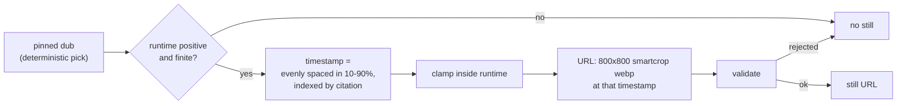
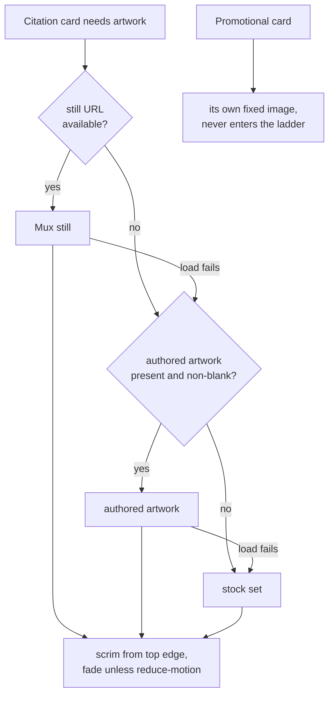

# Bible Quote Card Frames - Plan

## Goal Capsule

**Objective.** A viewer reading a Bible quote on the watch screen sees artwork from the film they just watched, and never meets the same picture twice inside one carousel.

**Means.** Draw each citation card's background from the video's own Mux asset at a fixed timestamp (KTD1), behind a scrim heavy enough to carry the verse (KD4).

**Product authority.** `apps/mobile` only. Admin-side frame pre-generation stays a handoff. `apps/tv` takes a comment correction and no behaviour change.

**Stop conditions.** Stop and ask before editing anything under `apps/admin`, before changing which citations appear or their order, and before widening the change to the shimmer placeholder named in Deferred to Follow-Up Work.

**Execution profile.** Pure derivation modules first (U1, U2), then the surfaces that consume them. Every unit is independently landable.

**Tail ownership.** The implementer owns the on-device verification named in the Verification Contract, including the Android pass — the platform PRODUCT.md names as the design centre.

---

## Product Contract

**Product Contract preservation:** restructured, no scope change, plus three additions and one deletion agreed in planning. R1, R2 scoped to citation cards (the promo card is a member of the same array and was never in scope). R5 gained the runtime precondition and clamp. R9 restated to constrain scrim opacity rather than gradient origin — same intent, the original wording was not satisfiable by the edit it implied. R12 gained a reduce-motion clause. R16 narrowed to the stale clause only. Added R17 (load-failure rung), R18 (decorative artwork), R19 (artwork stability within a view, across both inputs that churn on this route). **R14 deleted** — eleven pagination dots occupy under half the carousel width, so the requirement could not fail; the ID is retired, not reused. Document review then widened AE13 to cover all four text regions R10 already named, and split AE10 across the settled and unsettled payload states so it agrees with the hold rule. Both are completeness corrections to the examples rather than changes to R5, R6, or R10.

### Summary

Bible Quote citation cards take their background from the video being watched — one fixed still per card, drawn from the middle of the film — replacing seven stock photographs shared by every video in the catalogue. A heavier scrim carries legibility when a still's tone works against the verse.

### Problem Frame

Every Bible Quote card in the app draws from one array of seven hotlinked stock photographs in `apps/mobile/src/hooks/useBibleVerses.ts`, assigned by index modulo seven. Three costs follow, in the order they matter.

The artwork has no relationship to the video. A viewer finishing Pilgrim's Progress reads a Hebrews citation over a candle-lit Bible that would sit equally well on any other video.

The set repeats. It is identical on every video in the catalogue, and a carousel with eight or more citations shows its first photograph a second time. `pilgrims-progress` carries ten citations in production today, so that repetition already ships.

The photographs are hotlinked to a third-party host the project has no contract with, and their generic quality reads as filler beneath scripture.

Web has already left this behind — its citation cards render a derived gradient and no photograph at all. Mobile and `apps/tv` are the two remaining surfaces cycling the array, from byte-identical copies.

### Key Decisions

KD1. **Stills are fixed per video, never sampled at random.** (session-settled: user-directed — chosen over a random timestamp per view: Mux caches per exact URL, so a random timestamp renders cold on every view.) Governs R2, R3.

KD2. **Stills come from one pinned dub, not the dub the viewer is listening to.** (session-settled: user-directed — chosen over following the active dub: per-dub artwork multiplies the URL set by the dub count and shifts the picture on a language switch.) Governs R3, R4.

KD3. **No per-still quality screen ships.** (session-settled: user-directed — chosen over a brightness or variance check: the failures are tonal, and a brightness screen passes the frames that fail.) Governs R5.
> **Conflict call-out.** Research found a second class of blank card the decision did not weigh: a still can be fully black. Two causes, one now removed. An out-of-range or zero timestamp returns HTTP 200 carrying an all-black image, which R5's runtime precondition and clamp eliminate. An in-film black frame remains reachable — one of fifteen stills sampled on `pilgrims-progress` measured mean luma 0.00 at every pixel. The decision stands and is workable; the residual is recorded in Risks & Dependencies.

KD4. **A heavier scrim carries legibility instead of a screen.** (session-settled: user-approved — chosen over a desaturation treatment: `mixBlendMode` is inert below Android API 29, and the two treatments stack rather than fork.) Governs R9, R10.

KD5. **The fallback ladder ends at the existing stock set rather than a bare card.** (session-settled: user-directed — chosen over deleting the array: a video with neither a still nor authored artwork would otherwise render with no artwork.) Governs R6, R7, R8.

KD6. **The change is mobile-only.** (session-settled: user-directed — chosen over a cross-app plan: admin-side pre-generation would supply per-still quality data, but editing `apps/admin` is a handoff.) Governs the Scope Boundaries.

KD7. **A load-failure rung is added to the ladder.** (session-settled: user-approved — chosen over the build-time-only tiering the contract first carried: a still that fails to load otherwise leaves the card at its background colour permanently, making the lower tiers unreachable for the likeliest failure.) Governs R17.

KD8. **The fade honours the OS reduce-motion setting.** (session-settled: user-approved — chosen over an unconditional fade: PRODUCT.md's accessibility floor requires fades to snap, and the image library carries no such awareness.) Governs R12.

KD9. **The pagination-dot requirement is dropped.** (session-settled: user-approved — chosen over keeping it: eleven dots occupy under half the carousel width, so no test could fail and the requirement proved nothing about this change.)

### Requirements

**Still selection**

R1. Every Bible Quote citation card on a video's watch screen shows a still taken from that video.

R2. Each citation card in one carousel shows a different still from every other citation card, whenever the stills come from the video.

R3. A card's still is identical on every view of that video, on every device, and across app launches.

R4. A card's still does not change when the viewer switches audio language. The playback id and the runtime that produce it come from the same pinned dub.

R5. A card's still is drawn from between 10% and 90% of the pinned dub's runtime. The app uses this tier only when that runtime is a positive, finite number, and clamps the computed timestamp inside it.

**Fallback**

R6. When the video yields no usable still, the card shows the video's authored artwork instead.

R7. When the video yields neither a still nor authored artwork, the card shows an image from the existing stock set.

R8. Every tier is selected on a present, non-empty, validated value; a blank or invalid value falls through to the next tier.

R17. A still that fails to load falls through to the next tier rather than leaving the card at its background colour.

**Legibility**

R9. The card's scrim covers the still from the card's top edge at a non-zero opacity, so no still renders at full strength anywhere on the card.

R10. The verse, reference, translation, and copyright meet the project's 4.5:1 contrast floor over every still the ladder can produce.

R18. The still is decorative to assistive technology and carries no label of its own.

**Loading**

R11. A card whose still has not arrived shows the card's own background colour, never an empty frame or a broken-image state.

R12. A still fades in over an explicit duration on both platforms, and snaps when the OS reduce-motion setting is on.

R13. The app requests a bounded number of upcoming cards' stills ahead of the viewer, and never issues an empty request.

R19. A card's artwork is byte-stable from mount to unmount, across both inputs that churn on this route: the passage read settling, and the video record filling in from partial cached data.

**Carousel correctness**

R15. Two citations that resolve to the same reference label render their own distinct stills.

**Cross-app documentation**

R16. TV's copy of the stock image set no longer claims mobile mirrors the cycled photographs. The rest of its cross-app sync instruction stays, because the promotional image and the call-to-action URLs beside it are still genuinely shared.

### Key Flows

F1. Viewer opens a video that carries Bible citations.
- **Trigger:** the watch screen mounts for a video with at least one citation.
- **Steps:** the carousel renders its first cards against the card background colour; each card resolves its still through the ladder; stills fade in as they arrive; the app requests a bounded set of upcoming stills ahead of the viewer.
- **Outcome:** each citation card carries a distinct still from this film. **Covers R1, R2, R11, R12, R13.**

F2. Viewer switches audio language while the carousel is on screen.
- **Trigger:** the viewer selects a different dub.
- **Steps:** the active dub changes; the pinned dub does not; the card artwork does not.
- **Outcome:** the same stills stay in place. **Covers R4.**

F3. Viewer opens a video the ladder cannot serve a still for.
- **Trigger:** the watch screen mounts for a video whose pinned dub yields no usable still.
- **Steps:** each card falls to the authored artwork, then to the stock set.
- **Outcome:** every card carries artwork; none is blank. **Covers R6, R7, R8.**

F4. A still fails to load after the card has already chosen it.
- **Trigger:** the still request 404s, times out, or the device is offline.
- **Steps:** the card reports the failure; the ladder advances that card one tier and re-renders.
- **Outcome:** the card lands on artwork rather than staying at its background colour. **Covers R17.**

### Acceptance Examples

AE1. **Covers R2, R5.** Given a video of 6794 seconds carrying ten citations, when the carousel renders, then the ten citation cards show ten different stills, none drawn from before 679 seconds or after 6115 seconds, and the trailing promotional card keeps its own fixed image.

AE2. **Covers R3.** Given the same video opened twice on two devices of different screen widths, when both carousels render, then card three requests a byte-identical URL on both.

AE3. **Covers R4.** Given a viewer watching in English who switches to German, when the carousel re-renders, then every card shows the still it showed before the switch.

AE4. **Covers R6.** Given a video whose pinned dub yields no usable still but which has authored artwork, when the carousel renders, then every citation card shows that authored artwork — deliberately the same image on each, because a video carries one resolved authored image.

AE5. **Covers R7.** Given a video with neither a usable still nor authored artwork, when the carousel renders, then the cards show images from the stock set.

AE6. **Covers R8.** Given a video whose authored artwork field is present but an empty string, when the carousel renders, then the card shows a stock image rather than a blank frame.

AE7. **Covers R11, R12.** Given a card whose still has never been fetched on this device, when the card first appears, then it shows the card background colour and the still fades in over the configured duration when it arrives.

AE8. **Covers R12, KD8.** Given the OS reduce-motion setting is on, when a still arrives, then it appears without a fade.

AE9. **Covers R15.** Given a video carrying two citations that resolve to the same reference label, when the carousel renders, then the two cards resolve different still URLs.

AE10. **Covers R5, R6.** Given a video whose pinned dub reports a null or zero runtime and whose payload has settled, when the carousel renders, then no still is requested and the cards fall to the next tier. While the payload is still unsettled the cards hold at their background colour instead.

AE11. **Covers R17.** Given a card that has chosen a still and the request fails, when the failure is reported, then the card shows the next tier's artwork rather than its background colour.

AE12. **Covers R19.** Given a carousel that has rendered before the passage read settles, when the read settles and the reference labels change, then every card's still URL is unchanged.

AE13. **Covers R9, R10.** Given the brightest still the ladder can produce, when the card renders, then all four text regions R10 names — verse, reference, translation, and copyright — measure at least 4.5:1 against the pixels behind them. The verse and reference sit highest in the stack, where the scrim is thinnest, so they are the binding case.

AE14. **Covers R1, R18.** Given a screen reader is active, when it reaches a citation card, then it announces the card's composed label once and does not announce the still.

### Success Criteria

- A reviewer opening `pilgrims-progress` and `life-of-jesus-gospel-of-john` can tell which film each carousel belongs to without reading the verse.
- No stock photograph appears on any video that can serve a still.
- Request count and transferred bytes for the watch screen, measured across the window in which the carousel scrolls into view, are reported before and after. The added bytes are attributable to the stills and no other request class appears.
- Scroll of the carousel on a low-end Android device shows no new dropped frames against the same measurement taken before the change.
- No unit in this plan requires a native build. Whether testers actually receive it over the air depends on the installed build's runtime version, which Operational Notes gates separately.
- Time to first video frame on the low-end Android device does not regress against the same measurement taken before the change.

### Scope Boundaries

- **No work in `apps/admin`.** Pre-generated stills and per-still quality data would remove the first-viewer render cost and make a tonal screen possible. Both stay a handoff.
- **No behaviour change in `apps/tv`.** It keeps its stock photographs; only the stale clause of its sync comment is corrected (R16).
- **No tonal or editorial screening of stills.** Accepted per KD3.
- **No change to the Experience or SDUI quote surfaces, and no closing of the parity gap they expose.** Admin's quote item defines `imageAsset` and `backgroundImageAsset`, never `imageUrl` — the field this renderer reads — so authored per-quote artwork is fetched over the wire and discarded on both paths today. That gap is why those cards render no image, and it is not this change's to close: the scrim here is tuned for arbitrary film stills, not for artwork an editor chose for one card.
- **No correlation between a citation and the moment it appears in the film.** Admin carries timed Bible references on a separate, unjoined type.
- **No change to which citations appear, their order, or their passage text.**

#### Deferred to Follow-Up Work

- The desaturation treatment (KD4's rejected arm). It stacks on the scrim and can follow once real stills have been seen on a device.
- The shimmer placeholder on this same card runs an unconditional animation and ignores reduce-motion today. It is a pre-existing violation of the same accessibility floor R12 now honours, and is not widened into this change.
- Admin-side pre-generation of a fixed still set per video, which would remove the cold-render cost entirely.
- Migrating the four inline reduce-motion subscriptions onto the shared hook this plan introduces. Until that happens the app carries five implementations, and the new hook serves one card.

### Dependencies and Assumptions

- Mux serves a still at an arbitrary timestamp through a `time` parameter. Measured on `pilgrims-progress`: cold responses 0.87–2.25 seconds at 800x800 smartcrop; warm responses served from cache in about 0.05 seconds.
- Assumed and unverified: Mux does not bill for image generation or delivery. Its pricing document lists no image line item and scopes rate limits to the API host, not the image host — absence of evidence, not a vendor confirmation. Operational Notes gates the first invoice check.
- Mux caches per exact URL at a regional POP for seven days with no revalidation path. A still is warm only at the POP that rendered it, so a viewer in another region or after a quiet week pays the cold render again. With roughly 1.15 citations across 973 videos, most of these URLs will be cold on most first views.
- Mux documents a per-asset thumbnail budget of one per ten seconds of duration, with a floor of ten for assets under 100 seconds. For a 6794-second film the budget is 679 and ten citations spend 1.5% of it. A short clip carrying several citations is the only shape that could collide.
- A video's Mux playback id and runtime are already on the watch screen. No new query or schema change is required.
- `pickCardImage` resolves a video's image set to a single URL, so the authored tier yields one image for every card on that video.
- Assumed and unverified: that no video stores letterbox bars inside the frame at the timestamps this change selects. Twelve stills across two dubs of `pilgrims-progress` showed none, but the catalogue was not swept.

### Outstanding Questions

**Resolve before planning**

- None.

**Deferred to implementation**

- The exact scrim opacity at the top edge that satisfies R9 and R10 without dulling a good still. Derive the minimum from a pure-white backdrop — the worst case any still can present — so R10 holds for every still by construction rather than resting on one sampled frame, then confirm it against a real bright still. The catalogue was never swept, so "the brightest still the ladder can produce" is not identifiable and a sample alone cannot satisfy a universal claim.
- Whether the bounded prefetch reads one or two cards ahead. Start at one — the carousel already mounts its immediate neighbours — and raise it only if measurement shows a visible gap.
- The fade duration. No app-wide convention exists; the nearest siblings use 200ms for a poster and 400ms for a search thumbnail. Pick one against the card on a device and pin it as a named constant.

### Sources and Research

- `apps/mobile/src/hooks/useBibleVerses.ts` — the stock image array, its index-modulo assignment, and the trailing promotional card pushed onto the same array.
- `apps/mobile/src/components/sections/BibleQuotesCarouselRenderer.tsx` — the card, its scrim, its recycling key, and the carousel's windowing.
- `apps/mobile/src/lib/muxThumbnail.ts` — the existing Mux still URL builder, its playback-id injection guard, and the measured reason it emits webp with both dimensions.
- `apps/mobile/src/lib/normalizeVideo.ts` — where the playback id and runtime are resolved from a dub.
- `apps/mobile/src/lib/cardImage.ts` — the shared helper for choosing artwork from a record's images; its header records that it replaced three divergent copies.
- `apps/mobile/src/lib/resolveThumbnailUrl.ts` — the closest existing precedent for a compose-then-validate ladder.
- `apps/web/src/components/watch/BibleQuotesSection.tsx` — web's photograph-free citation card and its derived gradient.
- `apps/tv/src/lib/bibleContent.ts` — TV's identical array and the sync instruction R16 narrows.
- `apps/tv/src/hooks/useReduceMotion.ts` — the shared hook mobile lacks and KTD7 mirrors.
- `apps/admin/src/services/mux-image-derivative.service.ts` — the pre-generation service, whose recipes pin the timestamp on the recipe type rather than per call. The reason a per-still timestamp is a mobile-side change.
- `PRODUCT.md` — design principle 3 (low-end Android and low-bandwidth cellular are the design centre) and principle 4 (WCAG 2.1 AA, 4.5:1 text contrast, reduced motion honoured everywhere).
- `docs/solutions/best-practices/missing-artwork-frame-fallback-derivative-recipe-and-authored-first-20260826.md` — Mux per-URL caching, cold-render cost, and the authored-first law this plan deliberately inverts (see KTD2).
- `docs/solutions/conventions/frontend-change-page-load-performance-verification.md` — the convention the Success Criteria instrument.
- `apps/mobile/CLAUDE.md` — the rejected on-device frame analysis, the Android group-opacity compositing law, and the expo-image conventions.

---

## Planning Contract

### Key Technical Decisions

KTD1. **Timestamps are evenly spaced across the 10–90% window, indexed by citation position, and emitted to two decimal places.** Deterministic from `(runtime, index, count)` alone, so it is a pure function and satisfies R2, R3 and R5 without any per-video data. Fractional seconds are load-bearing: on a short runtime the window collapses and integer rounding would merge several citations onto one URL. Rejected arm: deriving each timestamp from the citation's own stable identifier would survive a citation being added or removed, but it clusters, needs collision handling for R2, and loses even coverage of the film. Governed by R2, R3, R5.

KTD2. **The still is requested at one fixed 800x800 smartcrop, never a size derived from the device.** Mux caches per exact URL, so a layout-derived width gives every screen geometry its own cold render and breaks the cross-device identity R3 asserts. Measured at three widths on one asset: 640 = 33.9 KB, 800 = 41.4 KB, 1080 = 57.5 KB mean. 800 is a deliberate 1.3-1.4x upscale on a 3x screen: the still sits behind a heavy scrim as texture, not as subject, so the softening is not perceptible, and 1080 costs 39% more bytes on the platform PRODUCT.md names as the design centre. This is a one-way door — Mux caches per exact URL, so changing the size later cold-renders the whole catalogue again and discards every warmed entry — so confirm it on a 3x device before merge rather than after. This inverts the authored-first law cited in Sources — deliberately, because the still is the point of the change, not a fallback for missing artwork. Governed by R3.

KTD3. **The timestamped builder lives beside the existing Mux still builder and reuses its playback-id guard.** That file states it is the single owner of the URL shape; a second copy would let the two drift. It returns `null` on a rejected id so the ladder advances. Governed by R8.

KTD4. **Both the dub and the citation order are pinned by explicit deterministic rules, not by array order.** Admin's dub relation has no `ORDER BY`, and citations sort on `order` with nulls collapsing to zero, so either axis can reorder between requests and change every still under R3 without a test failing. Sort each by a stable identifier before use. The dub rule also carries the still tier's own preconditions: take the first dub that is published AND resolves a playback id AND reports a positive finite runtime, falling back to the first playable dub only when none qualifies — otherwise an unlucky pick demotes a whole video that a sibling dub could serve, and the monitoring signal reads that as a defect. Governed by R3, R4.

KTD5. **The prefetch is bounded by how many URLs are issued, because it cannot be cancelled.** `Image.prefetch` is a module static with no cancel token and no view association, so leaving the screen does not stop in-flight work. It also never settles when handed an empty array — both native implementations resolve only from inside a per-URL callback — so the call site returns early on an empty list. Governed by R13.

KTD6. **Both the prefetch and the card image pin `cachePolicy` to memory-disk.** The prefetch defaults to memory-disk while the render prop defaults to disk, and the card currently sets neither. R3 needs the disk tier across launches; the carousel's unmount-and-remount windowing needs the memory tier or every scroll back re-decodes. Governed by R3, R13.

KTD7. **Reduce-motion is read through a new shared hook rather than a fifth inline copy.** `apps/mobile` has four inline copies of the subscription pattern and no shared hook; `apps/tv` already factored one out. One of the four sits in the watch route itself, so that file will carry both an inline subscription and, through the carousel, the new hook. Governed by R12.

KTD8. **The derivation returns an ordered candidate list per citation, not one resolved URL.** A single resolved value leaves the card nothing to advance to, which makes R17 unimplementable and pushes the implementer to re-derive the ladder inside the component. The list carries every tier that validated, in order. Governed by R6, R7, R8, R17.

KTD12. **The derivation is the sole validator for the candidates it produces.** The render site keeps its existing resolve-and-validate call for values that did not come from the derivation — the Experience and SDUI paths reach the same component with no derivation in between, and that helper also performs relative-path resolution. It is idempotent on an already-resolved absolute URL, so it cannot reject a candidate the derivation produced, which is why keeping it costs nothing and deleting it would strip the only URL check from two surfaces. Governed by R8.

KTD13. **The failure index lives outside the card.** A plain list unmounts off-window cells, so a tier index held in card state resets on scroll-back and re-requests the URL that just failed, every time. Keep it keyed by video and citation position in the same layer that owns the candidate lists. Governed by R17.

KTD14. **The card image carries an explicit low priority and the prefetch is sequenced behind it.** The carousel mounts its first cells at watch-screen mount rather than when scrolled into view, so an unranked still competes with player startup on the design-centre device. The prefetch API accepts no priority at all, so ordering is the only lever: issue it after the visible card settles. Settled means the image loaded, OR the image errored, OR the card has no candidate to load — plus a bounded timeout as a final release. A load-only definition would suppress the prefetch for the rest of the session on three ordinary states, and its test would pass vacuously in exactly those states. Governed by R13.

KTD15. **A card holds at its background colour only while the payload is known to be incomplete.** The watch query returns partial cached data and the lean series fragment carries no runtime or playback id, so the series-to-episode path would otherwise paint a lower tier and flip when the full payload lands. But an incomplete payload and a genuinely still-less video arrive as the same shape — a dub with null runtime and null playback id — so the derivation cannot tell them apart on its own. It takes an explicit settled-payload input: absent fields plus an unsettled payload holds; absent fields plus a settled payload falls through to authored and stock. A bounded time-based release is the second belt, so a payload that never settles cannot strand every card at its background colour for the session. Governed by R6, R7, R11, R19.

KTD9. **`recyclingKey` derives from the resolved still URL, and the same-reference test asserts on resolved sources.** The key is inert in this component today — a plain FlatList mounts and unmounts cells rather than recycling them, so a test pinning key uniqueness would pass while the real defect ships. Governed by R15.

KTD10. **Storyboards are rejected.** One URL yielding 50–100 evenly spaced frames is superficially ideal and would settle the spacing question for free, but the tiles are 256x160 and would upscale roughly four times into the card. Recorded so a reviewer does not re-propose it.

KTD11. **The fade duration is an explicit number, not an object without one.** The transition record defaults to 100ms on iOS and 0 on Android, so an object-form transition carrying no duration fades on iOS and does not fade at all on Android — and an iOS-only device check would pass. Governed by R12.

### High-Level Technical Design

The still for one card is a pure derivation from three inputs, then a ladder with a runtime rung.

The ladder consumes that result and adds the load-failure rung KD7 introduced.

### Assumptions

- The promotional card is excluded from the ladder by construction — built after the citation map, never inside it — rather than by an index check that a later edit could break.
- The Experience and SDUI quote surfaces carry no image field the ladder can reach, so they keep today's rendering. This is a conclusion from their fragment shape, not an assumption; U5 verifies it.

### Sequencing

Pure derivation modules land first (U1, U2), so the surfaces that consume them can be built against tested behaviour. The shared hook (U3) is independent and can land in parallel. The hook wiring (U4) depends on U1 and U2; the rendering changes (U5) depend on U3 and U4; the prefetch (U6) depends on U5. The TV comment (U7) is independent of all of them.

### System-Wide Impact

**One renderer serves three surfaces.** `BibleQuotesCarouselRenderer` is reached from the watch route, the Experience path, and the SDUI path. Every rendering change in U5 and U6 lands on all three. On the two non-watch paths the change is inert: those quote items never populate the field the card reads, so no image element renders and the scrim resolves to the card colour over the card colour.

**That inertness is a parity gap, not an absence.** Admin's quote item defines `imageAsset` and `backgroundImageAsset`; the renderer reads `imageUrl`, which the type does not define. Authored per-quote artwork is fetched and discarded on both non-watch paths. Web maps it; mobile does not. U5 pins the current behaviour with a labelled test so the gap is visible rather than silently inherited. Closing it is out of scope per the Scope Boundaries.

**The watch route paints from partial cached data.** The watch query sets `returnPartialData: true` on a cache-first policy, and the lean series fragment omits per-dub runtime and playback id. On the series-to-episode path the pinned dub's fields are therefore absent on the first commits. KTD15 decides what that paints.

**No existing suite mounts this carousel.** Seven suites stub the image library as a bare component with no statics, but none of them renders the Bible carousel — the one SDUI suite that could mocks the dispatcher out entirely. A missing prefetch static therefore cannot throw in any of them, so they need no update. The carousel's own suite has no image-library mock at all and has never rendered the image branch; U5 adds a local one, and every prop and prefetch assertion pins against it rather than a defensive optional call that would pass vacuously.

### Risks & Dependencies

| Risk | Mitigation |
|---|---|
| Stills are requested at watch-screen mount, not when the carousel is reached, so they contend with player startup on the design-centre device. The nested horizontal list virtualises on its own offset, so its first cells mount regardless of parent scroll. | KTD14 pins an explicit low priority on the card image, matching this app's convention for non-hero card art. The Verification Contract measures the mount window directly rather than assuming it is clear. |
| The prefetch cannot be de-prioritised — the API accepts no priority — so an off-screen prefetch can outrank the still the viewer is looking at. | KTD14 sequences it behind the visible card's own load. U6 tests that ordering. |
| Cold render is POP-local and expires after seven days with no revalidation, so warmth is neither global nor permanent. Most of these URLs will be cold on most first views. | Accepted. The loading state is sized for a recurring one-to-three-second wait, not a one-time warm-up. |
| Adding or removing one citation in admin moves every timestamp for that video, cold-rendering every card again and minting fresh derivatives against the per-asset budget. | Accepted and recorded. Citation lists are near-static and the budget is roughly 679 for a feature-length film against ten citations. |
| An in-film black frame renders as a card with no visible artwork. This is KD3's residual after the clamp removes the out-of-range class. | Accepted per KD3. Under the heavier scrim the result reads as a dark card rather than a broken one, which is close to what web ships deliberately. |
| The ladder's outcome is invisible in production. A mass fall-through to stock, a wrong pinned dub, or an all-black video would look identical to success. | U4's hook emits one structured log per video per screen open, behind a per-slug ref, carrying the resolved top tier, slug, and citation count. The derivation returns the tier but stays pure and does not emit — it re-runs several times per open, so emitting there would weight the signal by render count and bias it toward false stock outcomes. Field naming follows this app's reserved-attribute rule. |
| Every tier's load can fail. The stock tier is the same uncontracted third-party host the Problem Frame names as unreliable, so a card can exhaust the ladder and land on its background colour — visually identical to still loading, with no recovery and no signal. | Accepted as a terminal state rather than adding a retry. The card emits a distinct runtime signal on ladder exhaustion, separate from the derivation-time tier log, so the case is countable even though it looks like loading. |
| There is no runtime kill switch. A bad still rule cannot be turned off without a republish. | Operational Notes names the rollback lever and requires it to be rehearsed on preview before the first production publish. |

### Operational Notes

**Over-the-air precondition.** No unit here requires a native build — every change is JavaScript against dependencies already installed. But this app pins its runtime version to the fingerprint policy, so an update reaches an installed build only when the fingerprints match. Confirm the runtime version of the newest build on the target channel before publishing. Treat it as a gate, not an assumption.

**Deploy sequence.** Merge, publish to the preview channel, soak while watching the ladder-outcome log and completing the device checks in the Verification Contract, then publish to production. Halt the production publish on any of: a card showing a stock photograph on a video that carries a playback id; a card stuck at its background colour; an all-black still on a reference video.

**Rollback.** The only lever is a channel rollback. It takes effect on a tester's next launch, so exposure continues for at least one more session per device. Rehearse it once on preview before the first production publish and record the result.

**Monitoring.** Alert on the share of videos that carry a playback id yet resolve to the stock tier, over a stated window. The denominator is one event per video per screen open, not per derivation. That single signal catches a wrong pinned dub, a broken URL builder, and a mass validation failure. Watch the ladder-exhaustion signal separately — it counts the terminal all-tiers-failed state that otherwise reads as loading.

**First invoice.** Check the first Mux invoice after the production publish for an image or delivery line before widening exposure. The no-billing conclusion rests on a line item's absence from a pricing document, not on an invoice.

---

## Implementation Units

### U1. Timestamped Mux still builder

**Goal.** Add a builder that returns a still URL for a playback id at a given second, or `null`.

**Requirements.** R3, R5, R8. Implements KTD2, KTD3.

**Dependencies.** None.

**Files.**
- `apps/mobile/src/lib/muxThumbnail.ts`
- `apps/mobile/src/lib/__tests__/muxThumbnail.test.ts`

**Approach.**
1. Add the builder beside `muxThumbnailFromPlaybackId`, reusing that file's playback-id regex and its `null`-on-reject contract.
2. Emit webp with both `width` and `height` at the fixed size KTD2 names, plus smartcrop and the timestamp. A bare `width` makes smartcrop keep the source height, which the file's own header records.
3. Take the timestamp as a caller-supplied number and emit it to two decimal places (KTD1). The builder does no clamping and no spacing — that is U2's job.

**Patterns to follow.** The existing builder in the same file, including its comment style for measured constants.

**Test scenarios.**
1. A valid playback id and a timestamp produce a URL carrying both dimensions, smartcrop, and that timestamp.
2. A playback id containing a character outside the allowed set returns `null`.
3. An empty or null playback id returns `null`.
4. Two calls with the same inputs return byte-identical strings.
5. The emitted size matches KTD2's fixed value and is not derived from any argument.
6. A fractional timestamp survives into the URL rather than being rounded to a whole second.

**Verification.** The builder's output is stable across calls and the size is a constant in the file, not a parameter.

---

### U2. Still-set derivation for a video's citations

**Goal.** Derive, for each citation, the ordered list of validated artwork candidates — still, authored, stock — as a pure function.

**Requirements.** R2, R3, R4, R5, R6, R7, R8, R19. Implements KTD1, KTD4, KTD8, KTD12, KTD15.

**Dependencies.** U1.

**Files.**
- `apps/mobile/src/lib/bibleCardArt.ts` (new)
- `apps/mobile/src/lib/__tests__/bibleCardArt.test.ts` (new)

**Approach.**
1. Accept the video's variants, its authored images, the citation records, and a flag saying whether the payload has settled. Return one ordered candidate list per citation — every tier that validated, best first — never a single value (KTD8) — plus the resolved top tier per video for the caller to log.
2. Pick the pinned dub deterministically per KTD4 — sort by a stable identifier, then take the first dub that is published AND resolves a playback id AND reports a positive finite runtime, falling back to the first playable dub only when none qualifies. Read the playback id and the runtime from that same dub. A playback id can be recovered from the dub's stream URL when the mux record is absent; the app already has a helper for that.
3. Order the citations by their `order` field with a stable identifier as the tie-break before assigning positions (KTD4). Nulls collapse to zero, so without the tie-break two citations can swap positions between requests and every still changes.
4. Gate the still tier on a positive, finite runtime (R5). Compute each timestamp by even spacing across the 10–90% window indexed by citation position, then clamp inside the runtime.
5. Validate every candidate here and nowhere else (KTD12), using the same URL validator the render site currently calls. A blank or rejected value is omitted from the list rather than occupying a slot.
6. Return empty lists only when the fields are absent AND the payload has not settled (KTD15). Absent fields with a settled payload fall through to authored and stock, so a genuinely still-less video is never stranded.
7. Stay pure. Return the resolved tier; do not log. The hook owns the emit (KTD-governed in Risks and Operational Notes), because this module re-runs several times per screen open.
8. Key each list on the citation's ordered position, not its reference label, so the result is stable when labels change (R19).

**Test scenarios.**
1. Ten citations on a 6794-second runtime produce ten distinct URLs, all inside 679–6115 seconds. *Covers AE1.*
2. The same inputs called twice produce byte-identical output. *Covers AE2, AE3.*
3. Shuffling the variants array produces the same pinned dub and the same URLs.
4. A null runtime with a settled payload yields no still tier; every entry falls to the next tier. *Covers AE10.*
5. A zero runtime behaves the same as null.
6. A runtime so short the window collapses still produces in-range timestamps, never a negative or zero one, and never two identical ones.
7. No playback id yields authored artwork for every entry, the same image on each. *Covers AE4.*
8. Neither a playback id nor authored artwork yields stock images. *Covers AE5.*
9. An authored image field that is an empty string falls through to stock rather than being selected. *Covers AE6.*
10. An authored image whose value fails URL validation falls through rather than being selected.
11. Two citations sharing a reference label produce different URLs. *Covers AE9.*
12. One citation produces one list; zero citations produce an empty array.
13. Each returned list is ordered still, authored, stock, with rejected tiers omitted rather than left as holes.
14. Absent dub fields with an unsettled payload return empty lists; the same variant shape with a settled payload returns a stock-only list. *Covers AE12 in part.*
15. Every returned URL is already validated: a candidate the validator rejects never appears in a list.
16. A sorted-first dub carrying no playback id is passed over for a later dub that carries one.
17. Shuffling citations that share an `order` value produces the same position-to-URL map.
18. Ten citations on a twenty-second runtime produce ten pairwise-distinct URLs, not a collapsed set.
19. The module returns the resolved top tier and performs no logging.

**Verification.** The module is pure — no imports of React, the Apollo client, or the image library — and every scenario above is exercised without mocking a network. Each ladder tier and the runtime gate have a test that only that branch can satisfy.

---

### U3. Shared reduce-motion hook

**Goal.** Give `apps/mobile` one hook reporting the OS reduce-motion setting, beside the four places that inline the pattern today.

**Requirements.** R12. Implements KTD7.

**Dependencies.** None.

**Files.**
- `apps/mobile/src/hooks/useReduceMotion.ts` (new)
- `apps/mobile/src/hooks/__tests__/useReduceMotion.test.tsx` (new)

**Approach.**
1. Mirror `apps/tv/src/hooks/useReduceMotion.ts` in shape, adapted to this app's conventions.
2. Read the initial value asynchronously and subscribe to the change event; unsubscribe on unmount.
3. Do not migrate the four existing inline copies in this unit — that is unrelated churn. Leave them, including the one in the watch route that will coexist with the new hook on the same screen.

**Execution note.** Render this suite under StrictMode: the hook holds a subscription whose cleanup mutates hook-lifetime state, which is the repo's recorded trigger for a remount-safety defect.

**Test scenarios.**
1. Reports false before the initial read resolves.
2. Reports the initial value once the read resolves.
3. Re-renders when the change event fires with a new value.
4. Unsubscribes on unmount.
5. A setup-cleanup-setup cycle re-arms the subscription rather than leaving it torn down.

**Verification.** The hook reports both states and leaves no listener behind after unmount.

---

### U4. Wire the derivation into the quotes hook

**Goal.** Replace the index-modulo stock assignment with U2's derivation, leaving the promotional card untouched.

**Requirements.** R1, R2, R6, R7, R8, R19. Implements KTD13, KTD15.

**Dependencies.** U1, U2.

**Files.**
- `apps/mobile/src/hooks/useBibleVerses.ts`
- `apps/mobile/app/watch/[slug].tsx`
- `apps/mobile/src/hooks/__tests__/useBibleVerses.test.tsx`

**Approach.**
1. Call U2's derivation once per video and hand each citation card its whole candidate list by position. Add the list as a named field on the card type rather than relying on the untyped block bag — the hook's card type and the renderer's item type meet through an index signature, so a field added on one side typechecks clean and silently renders nothing.
2. Own the per-card failure index here, keyed by video and citation position, so it survives a card unmounting and remounting (KTD13). This layer owns it; the card only reports upward.
3. Thread the derivation's inputs from the watch route, which is the hook's only call site and the only place the variants and authored images are in scope. The route file is in this unit's Files for that reason.
4. Emit the ladder-outcome log here, behind a fired-once-per-slug ref, mirroring the shape the hook already uses for its passage read. Suppress it while the payload is unsettled.
2. Build the promotional card after the citation map, keeping its existing fixed image. It must not be reachable from the ladder.
5. Keep the stock array in the module as the ladder's last tier (KD5); do not delete it.

**Patterns to follow.** The existing suite's helper that separates citation cards from the promotional card.

**Test scenarios.**
1. A video with citations yields one artwork entry per citation, plus an unchanged promotional card. *Covers AE1.*
2. The promotional card's image is byte-identical to today's value.
3. Cards keep their artwork when the passage read settles and reference labels change. *Covers AE12.*
4. A video with no citations yields only the promotional card and requests no still.
5. Switching the active dub does not change any card's artwork. *Covers AE3.*
6. The stock array is still reachable as the final tier.
7. A first render with partial variants paints no artwork, and the republished full payload fills it in without a second request for a discarded tier. *Covers AE12.*
8. A card whose top candidate failed stays advanced after unmounting and remounting — the index lives here, so this is the unit that proves it.
9. Three re-derivations for one slug emit exactly one ladder-outcome log.
10. No ladder-outcome log is emitted while the payload is unsettled.

**Verification.** The promotional card's image never comes from the ladder, and no card's artwork changes after the passage read settles.

---

### U5. Card rendering: scrim, fade, cache policy, recycling key, load failure

**Goal.** Make the card carry an arbitrary still legibly, and add the load-failure rung.

**Requirements.** R9, R10, R11, R12, R15, R17, R18. Implements KTD6, KTD9, KTD11, KTD12, KTD14.

**Dependencies.** U3, U4.

**Files.**
- `apps/mobile/src/components/sections/BibleQuotesCarouselRenderer.tsx`
- `apps/mobile/src/components/sections/__tests__/BibleQuotesCarouselRenderer.test.tsx`

**Approach.**
1. Move the scrim to the card's top edge and give its first stop a non-zero opacity (R9). Moving the gradient's origin alone leaves the top stop fully transparent and changes nothing. Derive that opacity from a pure-white backdrop so every text region clears 4.5:1 for any still, and pin the arithmetic in a unit test over the chosen colour values.
2. Correct the text-shadow comment above the card, which currently justifies itself with the scrim covering only the lower part.
3. Set `cachePolicy` to memory-disk and `transition` to an explicit numeric duration, gated to zero by U3's hook (KTD6, KTD11).
4. Derive `recyclingKey` from the resolved still URL rather than the reference label (KTD9).
5. Mark the still decorative to assistive technology; the parent already carries the composed label (R18).
6. Render the first candidate in the card's list and wire the image's error callback to report the failure upward through an explicit callback prop on the renderer — not through the untyped block bag. The owning layer advances the index (KTD13); the card holds no tier state of its own. On exhaustion, emit the distinct runtime signal named in Risks.
7. Keep the render-time resolve-and-validate call. It is idempotent on a URL the derivation already produced, and it is the only check the Experience and SDUI paths get (KTD12).
8. Set an explicit low priority on the card image, matching this app's convention for non-hero card art (KTD14).
9. Animate only the image node, never a wrapper holding both the image and the scrim — Android applies a group's opacity to each child.
10. Add a local mock of the image library to this suite exposing both the component and the prefetch static; the suite has none today and has never rendered the image branch.

**Execution note.** Verify on Android as well as iOS. Both the group-opacity hazard and the transition-duration default differ by platform, and an iOS-only check passes while Android fails.

**Test scenarios.**
1. The scrim's top stop clears 4.5:1 for all four of R10's text regions against a pure-white backdrop, asserted arithmetically over the chosen colour values. *Covers AE13.*
2. The image receives `cachePolicy` memory-disk.
3. The transition duration is the configured number when reduce-motion is off.
4. The transition duration is zero when reduce-motion is on. *Covers AE8.*
5. Two cards whose citations share a reference label receive different image sources. *Covers AE9.*
6. An image error advances that card to the next tier's source. *Covers AE11.*
7. An image error on the last candidate leaves the card at its background colour and does not loop.
11. A card renders an image element at all when handed a non-null candidate, so the prop assertions cannot pass against an absent node.
12. A card handed a ladder-resolved URL renders it without re-validating.
13. The card image carries the low priority KTD14 names.
14. A quote item carrying authored artwork under admin's own field name still renders no image — pinning today's parity gap, not endorsing it.
15. A card whose candidates are exhausted emits the ladder-exhaustion signal once and settles at the background colour without looping.
16. A quote item arriving with a non-null image field from the Experience path is still resolved and validated at render.
8. The still is hidden from assistive technology and the card announces one composed label. *Covers AE14.*
9. A card with no artwork renders the background colour and no image element. *Covers AE7 in part.*
10. Rendered at a narrow width and a large font scale, the card's text regions still fit and the reference is not clipped.

**Verification.** On a device, a card carrying a bright still shows all four of R10's text regions readable — verse and reference included — and Android shows the scrim covering the still rather than blending with it.

---

### U6. Bounded prefetch

**Goal.** Request the next card's still before the viewer reaches it, without issuing unbounded or empty work.

**Requirements.** R13. Implements KTD5, KTD6.

**Dependencies.** U5.

**Files.**
- `apps/mobile/src/components/sections/BibleQuotesCarouselRenderer.tsx`
- `apps/mobile/src/components/sections/__tests__/BibleQuotesCarouselRenderer.test.tsx`

**Approach.**
1. On the settled card index, prefetch the next card's top candidate at the depth the Outstanding Question names, pinning the same cache policy as the render (KTD6). Issue it only after the visible card's own image has settled — the API accepts no priority, so ordering is the only lever (KTD14).
2. Return early when the URL list is empty — the prefetch promise never settles on an empty array, and a card at either end of the carousel produces one on the ordinary path (KTD5).
3. Do not attempt cancellation on unmount; it is not offered. Bound the work by issuing fewer requests instead.
4. No other suite needs a mock update. None of the app's existing image-library stubs mounts this carousel — the one SDUI suite that could mocks the dispatcher out entirely — so a missing prefetch static cannot throw there. The local mock U5 adds to the carousel's own suite is the only one this change needs.

**Test scenarios.**
1. Settling on a card prefetches the next card's still exactly once.
2. Settling on the last card issues no prefetch call rather than calling with an empty list.
3. A video whose ladder yields no still URLs issues no prefetch call.
4. The prefetch passes the same cache policy the render uses.
5. Re-settling on an already-prefetched card does not re-issue the request.
7. No prefetch is issued before the visible card settles.
8. A visible card holding at its background colour still prefetches once the release fires.
9. A visible card whose image errors still prefetches.
10. A visible card with no candidate to load still prefetches.
11. The prefetch fires after the release, not merely absent before it.
6. Every previously green suite still passes.

**Verification.** With the network throttled, moving to the next card shows its still already present. No suite throws on a missing static.

---

### U7. Narrow the TV sync comment

**Goal.** Stop TV's comment from instructing a reader to keep mobile's stock array in step with it.

**Requirements.** R16.

**Dependencies.** None.

**Files.**
- `apps/tv/src/lib/bibleContent.ts`

**Approach.**
1. Move the cycled-photographs claim onto the stock array's own doc comment and record there that mobile no longer mirrors it.
2. Leave the file header's rotation instruction intact for the promotional image and the call-to-action URLs, which remain genuinely shared.
3. Correct the header's claim that web uses the same photographs, which was already false.

**Test expectation: none — comment-only change with no behavioural surface.**

**Verification.** TV's rendering is unchanged, and the file no longer names mobile as a mirror of the photograph array.

---

## Verification Contract

**Commands.**
- `pnpm --filter @forge/mobile test` — the full jest suite. Every unit above adds to it.
- `pnpm --filter @forge/mobile typecheck` — `tsc --noEmit`.
- `pnpm --filter @forge/mobile lint`.

**Device verification.** Required, not optional — three of this plan's decisions have platform-divergent behaviour that jest cannot see.
- iOS simulator and an Android device or emulator, on a video with several citations. `pilgrims-progress` carries ten in production and is the reference case.
- Android specifically: confirm the scrim covers the still rather than blending with it, and that the fade actually runs.
- Reduce-motion on: confirm stills appear without a fade on both platforms.

**Performance evidence.** Per `docs/solutions/conventions/frontend-change-page-load-performance-verification.md`, name the instrument and the window. One window cannot see this change: the first stills are issued at screen mount and the rest arrive as the viewer swipes. Report request count and transferred bytes, before and after, across three windows:

1. Watch-screen mount to first video frame — the contended window, and where a regression would actually hurt.
2. The carousel entering the viewport.
3. A full traversal of a ten-card carousel.

Report each for two videos: one carrying a single citation, the production median, and `pilgrims-progress` at ten, the observed maximum. A single averaged figure describes neither. Add a scroll-frame measurement and a time-to-first-frame measurement on a low-end Android device across window 1. A screenshot is not evidence for this change; it added a request class.

**Contrast evidence.** Sample pixels behind all four text regions R10 names — verse, reference, translation, and copyright — over the brightest still the ladder produces, and report each measured ratio against the 4.5:1 floor. The verse and reference are the binding case: they sit highest in the stack, where the scrim is thinnest. Judging by eye does not satisfy R10.

---

## Definition of Done

**Global.**
- Every requirement R1–R13 and R15–R19 is implemented or explicitly traced to a unit that implements it. R14 is retired and must not reappear.
- The three commands above pass.
- Device verification is done on both platforms, including the Android scrim and fade checks.
- Performance and contrast evidence is recorded for all three named windows and both citation counts.
- The runtime-version gate in Operational Notes was checked before publishing, and the rollback was rehearsed once on preview.
- The preview soak completed with none of its stop conditions observed.
- No stock photograph renders on a video that can serve a still.
- Abandoned experiments are removed. Any timestamp-selection or prefetch variant tried and discarded leaves no dead code, no unused export, and no commented-out block.

**Per unit.**
- U1: the builder is the only place the timestamped URL shape exists, and its size is a constant.
- U2: the module is pure, returns ordered candidate lists, and every ladder tier plus the runtime gate has a test that only that branch satisfies.
- U3: the hook reports both states and leaves no listener after unmount.
- U4: the promotional card is unreachable from the ladder, its image is unchanged, a failed tier stays advanced across a remount, and one ladder-outcome log is emitted per video per screen open.
- U5: the scrim's top stop is derived from the pure-white worst case, the fade is explicit and reduce-motion-gated, the render-time validation is retained for non-derivation values, and an image error advances to the next candidate.
- U6: no prefetch is issued for an empty list or before the visible card settles, and the prefetch fires after every release path rather than only being absent before it.
- U7: TV renders identically and its comment no longer names mobile as a mirror.
