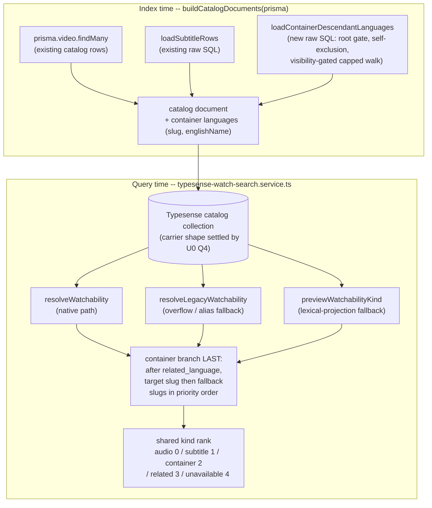

# Typesense Container Availability - Plan

## Goal Capsule

- **Objective:** A viewer searching Watch in a real browser never sees a series or collection labelled "Not available" when they can open it and play something inside it in their target or fallback languages.
- **Means:** Project descendant-derived container availability onto the Typesense catalog document at index time, and teach every Typesense watchability resolver the `container` kind (KTD1, KTD2).
- **Authority:** The Requirements below own product behavior. `CONCEPTS.md` owns the Series-Shaped test and the Search Watchability state set. `apps/admin/src/services/search-watchability.ts` owns the container tier's semantics; this plan mirrors them and must not re-derive them. Linear FGE-109 is the ticket; FGE-108 is the user report this actually closes.
- **Execution profile:** One new index-time descendant projection in Admin's Typesense indexer, its `container` kind threaded through every watchability resolver and rank/score site in the Typesense serving path, with real-database parity coverage as the discriminating proof.
- **Stop conditions:** Stop if, before implementation begins, a production `watchSearch` sent with `Origin: https://www.jesusfilm.org` no longer returns `UNAVAILABLE` for `easter`, `nua-easter`, `guide-episode-6`, `worth-episode-2`, and `anticipate-the-resurrection`; if `Nua_Know_God` stops being `UNAVAILABLE` on the Postgres path; or if the Series-Shaped label gate would admit a record the evidence shows must stay unavailable.
- **Tail ownership:** The LFG run owns implementation, review, CI, PR, and the Linear update through **merge-ready**. It does not deploy production and does not run the production index rebuild. **Release-complete** is a separate state owned by a named operator (U9).

---

## Product Contract

### Summary

Watch search served by Typesense classifies every video by the Dubs attached to that video alone. A COLLECTION or SERIES owns no Dub, so it projects as unavailable and renders a "Not available · English" badge over a page the viewer can actually open. This plan computes, at index time, the languages in which a Series-Shaped video has a visible playable descendant, projects them onto the catalog document, and teaches the Typesense serving path to emit the existing `container` availability kind from them.

### Problem Frame

PR #2098 added a fourth watchability tier that derives a container's availability from its playable descendants and emits a `container` kind. That fix reached only `SearchWatchabilityService` — the Postgres serving path. Admin routes an anonymous request from the canonical Web origin to the Typesense path instead, so real browsers never see it.

The FGE-108 plan deferred the Typesense mirror on an explicit premise: _"Production currently reports `searchMode: "watch-search"`, so it serves nothing today."_ That premise is a measurement artifact. `resolveWatchSearchInputForRequest` applies `WATCH_SEARCH_PRIMARY_MODE` only when the request `Origin` equals `WEB_CANONICAL_ORIGIN`, and that variable defaults to `MODERN`. A probe sent without an `Origin` header is therefore routed to Postgres and reports the Postgres mode, while the browser it was meant to model is routed to Typesense.

Both halves were reproduced on production on 2026-08-28 against `https://admin.jesusfilm.org/api/graphql` with the same query body:

| Request                             | `searchMode`             | `easter`      | `nua-easter`  | `guide-episode-6` | `worth-episode-2` | `anticipate-the-resurrection` |
| ----------------------------------- | ------------------------ | ------------- | ------------- | ----------------- | ----------------- | ----------------------------- |
| no `Origin` header                  | `watch-search`           | `CONTAINER`   | `CONTAINER`   | `CONTAINER`       | `CONTAINER`       | `CONTAINER`                   |
| `Origin: https://www.jesusfilm.org` | `watch-search-typesense` | `UNAVAILABLE` | `UNAVAILABLE` | `UNAVAILABLE`     | `UNAVAILABLE`     | `UNAVAILABLE`                 |

A real browser session on `https://www.jesusfilm.org/watch` searching "Easter" on the same day rendered "Not available · English" on all four of the first four, each linking to `/watch/<slug>.html/english.html` rather than the canonical `/watch/<slug>.html`. `Nua_Know_God` returned `UNAVAILABLE` on both paths and must keep doing so — it has no working public route, and the **uppercase letters** in its slug are what exclude it from the root gate. Underscores alone do not: the shared pattern is `^[a-z0-9_-]+$`, which admits them.

### Key Decisions

- Container availability on the Typesense path is derived from the same descendant evidence and the same gates as the Postgres tier, and is emitted as the same `container` kind. (session-settled: user-directed — chosen over leaving Typesense unchanged and relying on the merged Postgres tier: real browser traffic is served by Typesense, so the user-visible bug is still live.) Governs R1, R2, R3, R8.
- A container that must stay unavailable stays unavailable. Admission copies the Postgres root gate verbatim, including its public slug pattern — lowercase letters, digits, hyphens, and underscores, rejecting uppercase. (session-settled: user-directed — chosen over marking every COLLECTION/SERIES available: `Nua_Know_God` has no working public route, and the slug rule is what excludes it.) Governs R4, R5.
- Production verification is performed on the canonical surface only. (session-settled: user-directed — chosen over verifying with a curl that omits the `Origin` header: the seam serves a different `searchMode` without it, and that exact false premise caused this work to be deferred once.) Governs R11, R12.

### Requirements

**Availability derivation**

- R1. A Series-Shaped video that passes the root gate and has a visible playable descendant within two levels resolves to the `container` availability kind on the Typesense serving path.
- R2. A container resolves in its target language when a descendant is playable in that language, and otherwise in the highest-priority fallback language that has one.
- R3. Direct playback always beats descendant playback. A container that resolves to any self-scoped kind — including `related_language` — keeps that kind, exactly as the Postgres tier does.
- R8. A container's availability carries a language slug, an href language slug, and the language's English name. `playbackId`, `durationSeconds`, and any dub identifier stay null.
- R14. The set of languages projected for a container is complete. No cap may discard a language, because index time does not know the viewer's target language and a discarded language becomes a false `unavailable` under R2.

**Gating**

- R4. Admission requires a Series-Shaped label, a published locale, `no_index = FALSE`, a slug matching `^[a-z0-9_-]+$`, and no `watch` platform restriction — all evaluated on the container itself.
- R5. Descendant traversal is gated by the same visibility predicate at every hop, so a hidden intermediate cannot carry a visible grandchild through; the walk is capped at two levels; and a container is never its own descendant.
- R10. Only a language whose slug is publicly routable contributes to a container's admitted languages.

**Serving-path consistency**

- R6. Every watchability resolver on the Typesense path agrees on the container kind: the availability-document path, the legacy catalog-JSON path, and the preview path.
- R7. `container` ranks between `target_subtitle` and `related_language` wherever the Typesense path ranks watchability, preserving the existing kinds' relative order.
- R9. The Typesense path reads the shared availability score rather than a private copy, so a stored trace's availability component and its stored total are computed from one mapping.
- R13. A catalog document written before this change, which carries no container field at all, resolves as unavailable rather than throwing.

**Verification and release**

- R11. The user-facing outcome is confirmed in a real browser on `https://www.jesusfilm.org/watch`.
- R12. Every production API probe carries `Origin: https://www.jesusfilm.org` and its response is confirmed to report `searchMode: "watch-search-typesense"`.
- R15. The production index rebuild that makes the fix visible has a named owner and a trigger, and FGE-109 stays open until it has run and R11 and R12 have passed.

### Acceptance Examples

- AE1. **Given** production has been reindexed after this change, **when** a viewer searches "Easter" on `https://www.jesusfilm.org/watch`, **then** `easter`, `nua-easter`, `guide-episode-6`, `worth-episode-2`, and `anticipate-the-resurrection` render as ordinary available cards with no "Not available · English" badge, and each links to `/watch/<slug>.html`. Covers R1, R11.
- AE2. **Given** the same reindexed production, **when** a viewer searches "Know God", **then** `Nua_Know_God` still renders as unavailable. Covers R4.
- AE3. **Given** a container whose only playable descendant is a grandchild reached through a `watch`-restricted intermediate, **when** availability is projected, **then** the container is not admitted. Covers R5.
- AE4. **Given** a container with its own playable Dub in a fallback language and a descendant playable in the target language, **when** availability is resolved, **then** the kind is `related_language`, not `container`. Covers R3.
- AE5. **Given** a `COLLECTION` that is its own child through a `video_relation` self-loop and has its own playable Dub, **when** availability is projected, **then** it is not admitted as a container from itself. Covers R5.
- AE6. **Given** a Series-Shaped container whose slug is lowercase with underscores and which has a visible playable descendant, **when** availability is projected, **then** it **is** admitted — underscores do not exclude. Covers R4.

### Scope Boundaries

- `apps/web` is unchanged. It already maps `CONTAINER` to `container` and renders every non-`unavailable` kind as an ordinary card.
- No GraphQL SDL or codegen work. `CONTAINER` is already in the schema, the generated introspection, and both web mappers.
- The Postgres container tier's **behavior** in `search-watchability.ts` is unchanged. That file gains only the `export` keyword on four gate constants U1 imports (an export-only widening, no behavior change).
- `watch-search.service.ts` **is** modified: U4 reroutes its `watchabilityRank` through the shared kind-keyed helper (KTD8). The order it emits is unchanged.

#### Deferred to Follow-Up Work

- Ancestor invalidation for incremental sync. The documented sync design is an outbox keyed by the affected `videoId`; a Dub change on a grandchild must invalidate its ancestor containers' catalog documents, and that design cannot express it. No outbox or worker exists yet — refresh is an operator-run full rebuild — so today this is a staleness window, not drift. U7 records the obligation so the sync implementer inherits it as a named blocker rather than shipping a field their worker cannot maintain.
- Three-level nests. The depth-2 cap is inherited from the Postgres tier and reproduces its known limit. No production record has that shape and nothing detects one if an editor authors it.
- Containers whose only playable descendants are dubbed outside the viewer's target-plus-fallback language set still render unavailable. Inherited from the Postgres tier's accepted-language scope; not introduced here.
- The Postgres tier's own `languageEnglishName` behavior and its rank **ordering** are unchanged. This plan mirrors them; it does not revisit them.

### Sources

- `apps/admin/src/services/search-watchability.ts` — `containersForCandidates`, `VISIBLE_DESCENDANT_SQL`, `SERIES_SHAPED_LABELS`, `CONTAINER_DESCENDANT_MAX_DEPTH`, `PUBLIC_CONTENT_SLUG_SQL_PATTERN`, `watchabilityFromDescendant`, and the `hydrate` cascade whose ordering KTD9 mirrors.
- `apps/admin/src/services/search-watchability.db.test.ts` — 18 container cases, each isolating one condition, plus an existing DEFAULT/MODERN parity assertion that already imports the Typesense indexer.
- `docs/operations/typesense-watch-search-local.md` — the local Typesense harness and production-like catalog restore that U0 runs on.
- `docs/plans/2026-08-28-1431-fix-watch-search-container-availability-plan.md` — the FGE-108 plan, including the deferral prose U8 corrects.
- `docs/solutions/integration-issues/watch-search-candidate-generation-stable-application-revision.md` — the two-revision rule KTD6 applies.
- `docs/solutions/best-practices/shared-predicate-partial-rollout-gap-20260810.md` — why U3 enumerates resolvers by shape rather than by the two the ticket named.
- `docs/operations/typesense-watch-search-production-readiness.md` — the sync event contract U7 amends.

---

## Planning Contract

### Key Technical Decisions

- KTD1. **Compute the container tier at index time, not query time.** A third raw-SQL loader joins the existing `Promise.all` in `buildCatalogDocuments`, walking `video_relation` once for the whole catalog. Query time stays a membership test over a projected array. Rationale: the Typesense path exists to remove per-request relational hydration, and the candidate qualification benchmark fails closed on added round-trips and on any latency-percentile regression. Governs R1, R2.
- KTD2. **Carry the signal on the catalog document as a per-language `{slug, englishName}` list, not as synthetic availability documents.** The catalog document is the only input all three resolvers can see, and one list per container is far cheaper than one availability row per container-language pair. Carrying the English name alongside the slug preserves `languageEnglishName`, which the Postgres tier emits from the descendant's language and which a slug-only projection would drop to null on every fallback-language container. The rejected alternative is a bare-slug projection plus a query-time name lookup — the fallback language rows are already joined when the target context is built, so the name could be sourced there; the index-time pair is preferred because it keeps one producer for the whole watchability record and avoids a second place that must agree about language identity. **The carrier shape — object array versus JSON string — is settled by U0 question 4, not here** (see KTD6). Governs R6, R8.
- KTD3. **Apply the whole root gate in SQL at index time, so the projection is empty for any container that must stay unavailable.** Rationale: it keeps one gate in one place and makes the query-time branch unable to admit a record the gate rejected. Governs R4.
- KTD4. **The Series-Shaped label test lives in SQL against the stored column, never in TypeScript against the projected document.** `SERIES_SHAPED_LABELS` holds the DB `@map` values (`collection`, `series`), while `buildCatalogDocuments` reads `label` through Prisma, which yields the enum identifiers (`COLLECTION`, `SERIES`). A TypeScript comparison against those constants matches nothing and admits zero containers in production, and the indexer's existing mocked fixtures use lowercase labels, so no mocked test would catch it. Governs R4.
- KTD5. **A stored language set plus target-first-then-fallback-priority selection is output-equivalent to the Postgres `DISTINCT ON` row pick.** The Postgres tier sorts by `array_position(acceptedLanguageIds, language_id)` first and emits only that row's language; every lower sort key breaks ties within one language, and every row in one language partition joins the same language row, so those keys cannot change the emitted value. Two of the three preconditions are already structural: language slug carries a `@unique` constraint, so switching the comparison key from id to slug is lossless; and both paths build the fallback list from `language_fallback` ordered by priority then id with the same cap of twelve. The third — that the index-time predicate equals the query-time SQL minus its accepted-language filter and nothing else — is what U5 proves. Governs R2.
- KTD6. **Ship the container field undeclared in the collection schema if U0 proves the carrier round-trips, and bump only the ranking revision.** `watchCatalogCollectionSchema` declares 7 fields while `TypesenseWatchCatalogDocument` has 15 — `coreId`, `label`, `imageUrl`, `imageBlurDataUrl`, `localesJson`, the two options blobs, and `id` are stored and returned undeclared. That precedent covers **scalars and JSON strings only**; no schema in the repo declares an object type and no collection sets `enable_nested_fields`, so an undeclared array of objects is unproven and U0 question 4 must settle it before U1 fixes the carrier. Leaving the field undeclared keeps the field manifest unchanged, so candidate generations are not invalidated and no application-revision bump is required. If U0 forces the field into the collection schema, the application revision is bumped to `watch-search-candidate/v3` in the same change and a fresh generation is built. The rank ladder changes either way, so the ranking revision is bumped and qualification is rerun. Governs R7.
- KTD7. **Replace the inlined availability-score ternary with the shared `availabilityScoreForKind`.** (session-settled: user-directed — chosen over adding a `container` case to the private copy: three surfaces already drifted on this mapping once, and the trace path already reads the shared helper, so an unshared copy makes stored score components stop summing to the stored total.) Governs R9.
- KTD8. **Extract one kind-keyed rank helper and have both serving paths call it, rather than adding a `container` case to the Typesense copy.** The Postgres `watchabilityRank` takes a `SearchWatchability` while the Typesense one takes a bare kind, so neither can import the other as-is; the shared owner is a kind-keyed function each path adapts to. Governs R7.
- KTD9. **The container branch runs last in each resolver's cascade — after the related-language branch, not before it.** This mirrors the shipped Postgres tier, which runs the container tier only over candidates still unavailable after the fallback tier so that a container carrying its own playable Dub keeps the state that Dub earned it. Resolution order and rank order are deliberately different and must not be "reconciled": rank places `container` above `related_language` because a browsable target-language container is a better representative than a fallback-language playable, while resolution places it below because a video's own playback always beats its descendants'. Governs R3, R7.
- KTD10. **An over-budget language set stops and re-plans the carrier; it is never capped.** Index time does not know the viewer's target language, so any lossy cap turns a playable container into a false `unavailable` for whoever wanted a discarded language. If U0's measurement exceeds the budget, KTD2's carrier shape is re-opened for a more compact lossless encoding rather than truncated. Governs R14.

### High-Level Technical Design

Index time computes the gate and the language set once; query time only reads it.

The cascade order within each resolver is target audio, target subtitle, related language, then container (KTD9).

### Serving-path reachability

Three resolvers derive a watchability kind. All three are live; they differ in when, and in what the rank change does there.

| Resolver                    | Reached when                                                                      | Consequence of missing the container branch                                                                                                                                                   |
| --------------------------- | --------------------------------------------------------------------------------- | --------------------------------------------------------------------------------------------------------------------------------------------------------------------------------------------- |
| `resolveWatchability`       | Normal production path (`native` retrieval)                                       | Containers render unavailable. The rank is used only to pick the representative _within_ a canonical group, so the renumber cannot reorder or drop results here.                              |
| `resolveLegacyWatchability` | `AvailabilityOverflowError` or availability-alias fallback                        | Containers render unavailable on a degraded but reachable path.                                                                                                                               |
| `previewWatchabilityKind`   | `compatibility` retrieval, entered only from the lexical-projection-failure catch | Ranks before paging, but watchability is the third sort key behind whole-title match and a float relevance score, so displacement needs an exact relevance tie on that already-degraded path. |

A canonical group is the set of aspect-ratio and audio-description variants of one Core asset, not a container and its children. A container and a leaf share a group only when their Core ids match modulo case and a trailing aspect-ratio suffix. U0 question 3 measures whether any such group exists; its answer decides only whether U3 carries the representative-selection scenario, and it does not block U1.

### Rollout

The reader and the writer ship in one deploy, but the field only exists after the operator rebuild. That window is what the sequence below bounds. U0 question 2 selects the branch.

| U0 question 2 result                                   | Deploy sequence                                                                                                                        | Error-classifier action                                                                                                                                                          |
| ------------------------------------------------------ | -------------------------------------------------------------------------------------------------------------------------------------- | -------------------------------------------------------------------------------------------------------------------------------------------------------------------------------- |
| `include_fields` ignores a field no document carries   | Single deploy, then operator rebuild. Field-less documents resolve `unavailable` per R13 — today's behavior — until the rebuild lands. | None needed.                                                                                                                                                                     |
| `include_fields` errors on a field no document carries | Deploy U3 **without** the include-list additions, run the operator rebuild, then a second deploy adds the include-list entries.        | Widen the hydration error classifier to treat a catalog-side field-projection failure as a recoverable fallback rather than a rethrow, so the window cannot 500 the search path. |

The application revision stays unchanged (KTD6), so existing candidate generations remain valid and production serves field-less documents for an operator-controlled window either way.

### Assumptions

- Production's `WATCH_SEARCH_PRIMARY_MODE` is at its `MODERN` default. The 2026-08-28 probe pair is consistent with this and no Railway override is visible from the repo.
- The production index rebuild is operator-run. This plan does not schedule or perform it; U9 assigns it.

Both of the following were assumptions in an earlier draft and are now U0 measurements rather than beliefs: the per-document cost of the container list, and the new loader's wall-clock cost inside `buildTypesenseWatchCandidateProjectionSnapshot`'s 60-second `RepeatableRead` transaction ceiling, which it shares with the existing whole-table read and the subtitle loader.

### Sequencing

U0 answers the four empirical questions that change later units' shape and must run first. U1 and U3 build the projection and thread the kind through the serving path. U2 pins the field contract across surfaces. U4 consolidates the rank and score copies. U5 adds the real-database parity coverage. U6 handles revision identity and qualification. U7, U8, and U9 handle documentation and release ownership.

Dependency edges, complete: U1 depends on U0; U2 on U1 and U3; U3 on U1; U4 on U3; U5 on U1 and U3; U6 on U1 and U4; U7 on U1; U8 on nothing; U9 on U6.

---

## Implementation Units

### U0. Resolve the four empirical unknowns

- **Goal:** Four measurements that change the shape of later units are taken before those units are written, not after.
- **Requirements:** informs R7, R12, R14; KTD2, KTD6, KTD10.
- **Dependencies:** none.
- **Files:** none — answers are recorded in the PR description and fold into U1, U3, and U6.
- **Approach:**
  1. **Carrier round-trip.** Build a real catalog collection from the existing catalog schema, import a document carrying the container list, and confirm the field is both stored and returned through an include list. Test the object-array shape first; if it is rejected, adopt the repo-proven JSON-string projection that the existing options blobs use, read back through the existing JSON-array parse helper. This answer fixes KTD2's carrier and feeds KTD6's schema-or-undeclared branch.
  2. **Missing-field include behavior.** Determine whether an include list naming a field that no document carries returns an error or is ignored. This selects the Rollout table's branch.
  3. **Size and time.** Measure the worst-case container language count and the resulting catalog-document size delta, and time the candidate projection snapshot end-to-end with the new loader joined in, against the 60-second transaction ceiling. Exceeding either budget re-opens KTD2's carrier under KTD10 — it never caps the language set.
  4. **Canonical groups.** Determine whether any canonical group contains both a Series-Shaped and a non-Series-Shaped video. This decides only whether U3 carries the representative-selection scenario.
- **Patterns to follow:** the local Typesense harness and production-like catalog restore documented in `docs/operations/typesense-watch-search-local.md` — it provides the substrate for all four questions without production access.
- **Execution note:** Questions 1 and 2 are mechanism claims about an external service. Assert them against a real Typesense instance, not by reasoning about the client. The existing legacy-availability-projection classifier is evidence this team has already been bitten by a field-projection failure on this stack. Record answers as aggregates only — counts, sizes, and yes/no — with no core ids, slugs, or titles, since this repository is public; any row-level example must name only a record already published on the public Watch site.
- **Test expectation:** none — measurement.
- **Verification:** Each of the four has a recorded answer in the PR description before U1 begins, and every unit whose approach depended on an answer names it.

### U1. Index-time container descendant projection

- **Goal:** `buildCatalogDocuments` emits, per video, the languages in which an admitted container has a visible playable descendant within two levels.
- **Requirements:** R1, R2, R4, R5, R10, R14; KTD1, KTD2, KTD3, KTD4, KTD5, KTD10.
- **Dependencies:** U0.
- **Files:**
  - `apps/admin/src/services/typesense-watch-search-indexer.ts`
  - `apps/admin/src/services/typesense-watch-search-schema.ts`
  - `apps/admin/src/services/search-watchability.ts`
  - `apps/admin/src/services/typesense-watch-search-indexer.test.ts`
  - `apps/admin/src/services/search-watchability.db.test.ts`
- **Approach:**
  1. Add `loadContainerDescendantLanguages(prisma)` beside `loadSubtitleRows`, following its raw-SQL shape, and join it into the existing `Promise.all` in `buildCatalogDocuments`. It must accept the same client the caller passes, so the candidate snapshot's transaction reads one consistent snapshot.
  2. Add the `export` keyword to the four container-gate constants in `search-watchability.ts` — the Series-Shaped label list, the depth cap, the visibility predicate, and the public content slug pattern — and import them. They are module-private today, and restating their literals is the drift KTD3 and KTD4 exist to prevent. This is an export-only widening with no behavior change.
  3. Mirror `containersForCandidates`: the same root gate, the same visibility predicate interpolated into both CTE terms, the same depth cap, the same playable-dub conditions, and the same public-language-slug pattern.
  4. Exclude the root from its own descendant set. `video_relation` has no cycle or self-reference constraint, and unlike the per-request tier this loader is not gated to already-unresolved ids, so a self-loop would let a container admit itself from its own Dub.
  5. Drop the accepted-language filter — index time has no target language — and return every qualifying language per container, in the carrier shape U0 question 1 settled.
  6. Emit the key on every catalog document, containers and leaves alike, as an empty value when nothing qualifies, so absent and empty never become distinguishable states in the projection.
  7. Add the field to the catalog document type. Add it to the collection schema only if U0 question 1 requires it (KTD6).
- **Patterns to follow:** `loadSubtitleRows` for the loader shape; `containersForCandidates` for the SQL; the existing options blobs for a JSON-string carrier if U0 selects that shape.
- **Execution note:** The SQL gate scenarios below and their falsification run in `search-watchability.db.test.ts` under `WATCH_SEARCH_DB_TEST=1`, not in the indexer's mocked suite — the mocked suite cannot discriminate the label gate at all (KTD4). Use the indexer's mocked suite only for projection-shape scenarios.
- **Test scenarios:**
  - A Series-Shaped container with a playable target-language child projects that language.
  - A container whose only playable descendant is a grandchild projects the grandchild's language.
  - A container whose only playable descendant is three levels down projects empty.
  - A container reachable only through a `watch`-restricted intermediate projects empty. Covers AE3.
  - A container reachable through a visible intermediate projects the grandchild's language — the anti-vacuous companion to the previous case.
  - A self-loop container that owns a playable Dub projects empty. Covers AE5.
  - A two-cycle terminates and does not admit either video from itself.
  - A container with descendants in three languages projects all three.
  - Two containers sharing one descendant are each admitted independently.
  - A non-Series-Shaped parent with playable children projects empty, using a fixture created through Prisma so the stored label value is what the SQL sees.
  - Root gate, one case each: unpublished, `no_index`, **uppercase** slug, `watch`-restricted.
  - A lowercase slug containing underscores **is admitted** — the anti-vacuous companion that keeps the uppercase case from passing for the wrong reason. Covers AE6.
  - Traversal gate, one case each: child soft-deleted, child `no_index`, child `watch`-restricted, child with no published locale.
  - Dub gate, one case each: dub unpublished, dub with empty `hls`, dub whose edition is soft-deleted, dub whose language is soft-deleted, dub whose language slug is not publicly routable.
  - A run over a fixture containing one qualifying and one disqualified container returns an entry for both, so an accidental inner join that drops empty containers is caught.
- **Verification:** Run against a real database; each gate has been individually removed and the matching case observed red.

### U2. Pin the projection's field contract

- **Goal:** A field present in the document type but missing from a query-time include list, or the reverse, fails a test rather than going silently unqueryable at runtime.
- **Requirements:** R6.
- **Dependencies:** U1, U3.
- **Files:**
  - `apps/admin/src/services/typesense-watch-search-schema.test.ts`
  - `apps/admin/src/services/typesense-watch-search-indexer.test.ts`
- **Approach:** Assert the field's presence across the surfaces that must agree: the catalog document type, the catalog result include list, and the watchability preview include list. Note the preview-exclusion constant is an exclude list, so the field reaches the lexical lane automatically and needs no edit there — assert that asymmetry rather than assuming it.
- **Execution note:** Write these so they fail first with the field added to only one surface. A three-way check written after everything already agrees proves nothing.
- **Test scenarios:**
  - The catalog result include list requests the container field.
  - The watchability preview include list requests it.
  - The preview exclusion list does not suppress it.
  - Every document emitted by the indexer carries the key, including leaves.
- **Verification:** Removing the field from any one surface turns this suite red.

### U3. Container kind in every Typesense watchability resolver

- **Goal:** All three resolvers emit `container` from the projected languages, positioned last in each cascade.
- **Requirements:** R1, R2, R3, R6, R8, R13; KTD9.
- **Dependencies:** U1.
- **Files:**
  - `apps/admin/src/services/typesense-watch-search.service.ts`
  - `apps/admin/src/services/typesense-watch-search.service.test.ts`
- **Approach:**
  1. Widen the indexed watchability kind union to include `container`. This is the type gate that surfaces the remaining sites.
  2. Add the container branch to `resolveWatchability`, `resolveLegacyWatchability`, and `previewWatchabilityKind`, each **after** its related-language branch (KTD9).
  3. `resolveWatchability` takes only availability documents today. Pass it the container languages from the catalog document already in scope at its call site — the list, not the whole document, so the resolver's input surface stays honest.
  4. Select the language by checking the target slug first, then each fallback slug in priority order. Note this container branch compares slugs while the related-language branch immediately above compares language ids; comment the asymmetry so it is not "corrected" later. The fallback slug list is filtered of null-slug entries and so is not index-aligned with the id list; never pair them by index.
  5. Emit null `playbackId` and null `durationSeconds` per R8, and set `languageSlug`, `hrefLanguageSlug`, and `languageEnglishName` from the selected entry — not from the target language unconditionally.
  6. Default the projected value to empty at all three read sites, so a document written by an earlier index generation resolves as unavailable rather than throwing. An unguarded read here throws inside the hydration try block and is misclassified by the error classifier into a rethrow, which fails the whole search.
  7. Add the field to the catalog result and watchability preview include lists, following the Rollout table's branch for the deploy sequence.
- **Patterns to follow:** `watchabilityFromDescendant` for the emitted shape; the existing related-language branches for cascade position.
- **Test scenarios:**
  - Each resolver emits `container` when the target language is among the projected languages; and `unavailable` for the same document with it absent.
  - Each resolver emits `container` with the highest-priority fallback language when the target is absent and two fallbacks are present — falsified by reversing the loop.
  - Each resolver prefers `target_audio` over `container` when both apply.
  - Each resolver prefers `target_subtitle` over `container` when both apply.
  - Each resolver prefers `related_language` over `container` when both apply. Covers AE4. Run as one table-driven fixture through all three resolvers — this is the single place their independently written branch orders can silently disagree.
  - A container result carries null `playbackId` and null `durationSeconds`.
  - A container result carries the descendant language's English name, not the target's, when they differ.
  - A document with the container key entirely absent resolves as unavailable and does not throw, at all three resolvers.
  - The fallback-message helper returns the no-fallback shape for `container`, matching the Postgres path.
  - Conditional on U0 question 4 finding a mixed canonical group: a group containing one Series-Shaped and one non-Series-Shaped video asserts which becomes the representative under the new rank ladder. Drop this scenario and record the measurement if no such group exists.
- **Verification:** All three resolvers agree on the same table-driven fixture; removing the branch from any one turns a test red.

### U4. Collapse the duplicated rank and score maps

- **Goal:** The Typesense path reads one rank ladder and one score mapping, shared with the Postgres path, and a future private copy cannot reappear silently.
- **Requirements:** R7, R9; KTD7, KTD8.
- **Dependencies:** U3.
- **Files:**
  - `apps/admin/src/services/typesense-watch-search.service.ts`
  - `apps/admin/src/services/watch-search.service.ts`
  - `apps/admin/src/services/watch-search-availability-score.ts`
  - `apps/admin/src/services/watch-search-availability-score.test.ts`
  - `apps/admin/src/services/typesense-watch-search.service.test.ts`
- **Approach:**
  1. Extract a kind-keyed rank helper into the module that already owns the shared availability score, and route both paths' rank functions through it. Each path keeps a thin adapter for its own watchability shape; only the ladder is shared.
  2. Replace the inlined score ternary in the Typesense candidate score with `availabilityScoreForKind`.
  3. Update the shared score module's doc comment, which names three reader surfaces and omits the Typesense one — that omission is why this copy went unnoticed.
  4. Extend the shared score module's existing source-text pin to cover the Typesense service as a fourth consumer. Note its current negative patterns match an `if`-chain; the Typesense copy is a nested ternary, so it needs its own pattern.
- **Approach note:** The replaced rank function is an `if`-chain and the replaced score is a nested ternary; both have catch-all fallthroughs, so neither fails to compile when a kind is missing — they silently mis-rank and mis-score. That is why this unit replaces them rather than extending them. The Typesense score is display and trace only; there is no minimum-confidence gate on this path, so this is not a ranking change in itself.
- **Test scenarios:**
  - The rank order is `target_audio`, `target_subtitle`, `container`, `related_language`, `unavailable`, asserted as absolute positions.
  - `container` sorts ahead of `related_language` in a direct comparator assertion.
  - The source-text pin lists the Typesense service and asserts it references the shared module and matches neither the private rank ladder nor the inlined score ternary. This, not a cross-path equality assertion, is what can go red — once both paths call one helper, comparing their outputs compares the helper to itself.
  - A container result's stored availability component and stored total are computed from the same mapping.
- **Verification:** No private rank ladder and no inline score literal remain in the Typesense service, and the source-text pin fails if one is reintroduced.

### U5. Real-database parity between the two serving paths

- **Goal:** The indexer's container projection and the Postgres container tier agree, condition by condition, on the same real fixtures.
- **Requirements:** R1, R2, R3, R4, R5, R10.
- **Dependencies:** U1, U3.
- **Files:**
  - `apps/admin/src/services/search-watchability.db.test.ts`
  - `apps/admin/src/services/typesense-watch-search-indexer.test.ts`
- **Approach:**
  1. Reuse the existing container fixture type and its resolver helper. Add a sibling that builds catalog documents from the same transaction and resolves the container kind through the indexer projection.
  2. Assert both resolutions agree for every fixture variant the container suite already exercises, as a table-driven comparison rather than per-case duplication.
  3. Add the cross-path equivalence assertion KTD5's proof implies: for target-only, fallback-only, target-plus-fallback, and multi-fallback-priority containers, the language selected from the projected set equals the language the Postgres tier emits.
  4. Extend the existing DEFAULT/MODERN parity assertion to cover the container kind.
  5. Correct the indexer's mocked label fixtures, which use lowercase where Prisma emits uppercase identifiers. They are a standing trap for any future label-reading code in that file.
- **Execution note:** This is the enforcement point. Falsify each gate individually: remove one condition from the new SQL, confirm exactly the matching case goes red, restore it. A gate whose removal turns nothing red is not covered. Note the existing suite's single slug fixture confounds uppercase with underscore, so the uppercase case needs the lowercase-underscore companion to discriminate.
- **Test scenarios:**
  - A table-driven parity assertion over every existing container fixture variant: both paths return the same kind and the same language.
  - The cross-path language-selection equivalence across the four fallback shapes named above.
  - The label gate specifically: a fixture created through Prisma is admitted by the indexer SQL, proving the stored-value comparison rather than the enum-identifier one.
  - The slug gate as a discriminating pair: an uppercase slug is rejected on both paths, a lowercase-underscore slug is admitted on both. Covers AE6.
  - A container with its own fallback-language Dub and a target-language descendant resolves to `related_language` on both paths. Covers AE4.
  - The self-loop case resolves identically on both paths. Covers AE5.
- **Verification:** The suite passes against a real database with `WATCH_SEARCH_DB_TEST=1`, and each gate has been individually falsified.

### U6. Revision identity and candidate qualification

- **Goal:** The ranking change is reflected in the qualification identity, the application revision's state is deliberate, and the qualification the revision rules depend on is actually run.
- **Requirements:** R7; KTD6.
- **Dependencies:** U1, U4.
- **Files:**
  - `apps/admin/src/services/typesense-watch-search-ranking.ts`
  - `apps/admin/src/services/typesense-watch-search-candidate-identity.ts`
  - `apps/admin/src/services/typesense-watch-search-candidate-identity.test.ts`
- **Approach:** Bump the ranking revision because the rank ladder changed. Leave the application revision unchanged if U0 question 1 allowed the undeclared carrier, and record why in a comment at the constant so a future reader finds the reasoning; bump it to `watch-search-candidate/v3` and build a fresh generation if U0 forced the field into the collection schema (KTD6). Then run the candidate qualification and confirm it reports no added Typesense round-trips and no latency-percentile regression — the benchmark fails closed on both, and the revision rules are only meaningful if it has actually run.
- **Test scenarios:**
  - The ranking revision differs from its previous value.
  - The application revision's value matches the branch U0 question 1 selected.
  - The existing stability assertions — that the revision does not vary with the deploy SHA, and that every boundary reads the shared helper — still hold.
- **Verification:** The candidate identity suite passes, the qualification run is recorded with its round-trip and latency results, and the reason for the application revision's state is written where a future reader will find it.

### U7. Record the ancestor-invalidation obligation

- **Goal:** Whoever implements incremental sync inherits the requirement that a descendant change invalidates its ancestor containers, and whoever handles an urgent visibility change knows the lever.
- **Requirements:** none directly; closes a Deferred to Follow-Up Work item.
- **Dependencies:** U1.
- **Files:**
  - `docs/operations/typesense-watch-search-production-readiness.md`
- **Approach:** Amend the required-event-behavior table. The documented outbox is keyed by the affected `videoId` and rebuilds that video's documents; a Dub, relation, or visibility change now also changes the catalog documents of that video's ancestor containers up to two levels. State that today's refresh is a full operator-run rebuild, so this is a staleness window rather than a live defect, and that shipping the field without this fan-out would turn that window into permanent drift. Name the operator-run full rebuild as the only lever for an urgent descendant visibility change until ancestor fan-out ships, and record the current rebuild cadence as the window's bound.
- **Test expectation:** none — documentation.
- **Verification:** The event table names the ancestor fan-out, its depth, the operator lever, and the current bound.

### U8. Correct the deferral prose that caused this

- **Goal:** The FGE-108 plan no longer asserts that the Typesense path serves nothing.
- **Requirements:** R12.
- **Dependencies:** none.
- **Files:**
  - `docs/plans/2026-08-28-1431-fix-watch-search-container-availability-plan.md`
- **Approach:** Add a dated correction adjacent to the Deferred to Follow-Up Work entry, naming the `Origin`-header seam as the reason the measurement read false and pointing at this plan. Keep it additive — the original text is the historical record of why the deferral was made.
- **Test expectation:** none — documentation.
- **Verification:** A reader arriving at the deferral entry cannot act on the false premise.

### U9. Assign the release handoff

- **Goal:** The production rebuild that makes the fix visible has an owner and a trigger, and the ticket cannot close before the user-facing outcome is confirmed.
- **Requirements:** R11, R12, R15.
- **Dependencies:** U6.
- **Files:** none in the repository — this unit produces the Linear handoff on FGE-109.
- **Approach:** Record on the ticket the two distinct states this work has. **Merge-ready** is what the LFG run delivers: units complete, gates green, PR merged. **Release-complete** requires a named operator to deploy, run the full index rebuild, then confirm the canonical-origin API probe and the real-browser check. Name the operator and the trigger, and state that FGE-109 stays open until release-complete.
- **Test expectation:** none — process handoff.
- **Verification:** FGE-109 carries a named rebuild owner and remains open until R11 and R12 have been confirmed.

---

## Verification Contract

| Gate                       | Command                                                                                              | Applies to |
| -------------------------- | ---------------------------------------------------------------------------------------------------- | ---------- |
| Empirical answers recorded | four answers in the PR description before U1 begins                                                  | U0         |
| Admin unit suite           | `pnpm --filter @forge/admin test`                                                                    | U1-U6      |
| Targeted indexer suite     | `pnpm --filter @forge/admin test typesense-watch-search-indexer`                                     | U1, U2     |
| Targeted service suite     | `pnpm --filter @forge/admin test typesense-watch-search.service`                                     | U3, U4     |
| Real-database parity       | `WATCH_SEARCH_DB_TEST=1 DATABASE_URL=<local> pnpm --filter @forge/admin test search-watchability.db` | U1, U5     |
| Candidate qualification    | `pnpm --filter @forge/admin qualify:typesense-watch-search-candidate`                                | U6         |
| Typecheck                  | `pnpm --filter @forge/admin typecheck`                                                               | all        |

The admin unit suite does not run the real-database cases; they are gated behind `WATCH_SEARCH_DB_TEST=1` and skip silently without it. The real-database row is the only gate that proves U1's SQL.

Release verification, owned by U9's named operator after merge, deploy, and the full index rebuild — not a merge gate:

- Probe `https://admin.jesusfilm.org/api/graphql` with `Origin: https://www.jesusfilm.org`, confirm the response reports `searchMode: "watch-search-typesense"`, and confirm `easter`, `nua-easter`, `guide-episode-6`, `worth-episode-2`, and `anticipate-the-resurrection` return `CONTAINER`. Confirm `Nua_Know_God` still returns `UNAVAILABLE`.
- In a real browser on `https://www.jesusfilm.org/watch`, search "Easter" and confirm no "Not available · English" badge on those five and that each links to `/watch/<slug>.html`. The search overlay opens by clicking the "Search videos" control; the query must be entered as real keystrokes, because a synthetic input event does not drive the submit.

No page-load performance evidence is required. The change is server-side projection and ranking; it adds no client rendering, media, routing, or hydration work.

---

## Definition of Done

**Merge-ready**

- Every R above holds, or is explicitly deferred with a reason.
- U0's four answers are recorded, and every decision that depended on one names it.
- Each gate in R4, R5, and R10 has been individually falsified against a real database — removed, observed red, restored — including the slug gate as an uppercase-rejected / lowercase-underscore-admitted pair.
- The container branch runs last in all three resolvers, and a test pins `related_language` beating `container`.
- No private rank ladder and no inline availability-score literal remain in the Typesense serving path, and the source-text pin would fail if one returned.
- All three resolvers emit `container`, and a test would fail if any one of them stopped.
- A catalog document missing the container field resolves as unavailable at all three resolvers without throwing.
- The ranking revision is bumped, the application revision's state matches U0's branch and is justified in place, and the candidate qualification has run with no added round-trips and no latency regression.
- The indexer's mocked label fixtures use the casing Prisma actually emits.
- The operations event contract records the ancestor-invalidation obligation and the operator lever.
- The FGE-108 plan's deferral prose carries its dated correction.
- No abandoned or experimental code from approaches that did not pan out remains in the diff.

**Release-complete** (U9's named operator, after merge)

- Production is deployed and the full index rebuild has run.
- The canonical-origin API probe returns `CONTAINER` for the five slugs and `UNAVAILABLE` for `Nua_Know_God`.
- The real-browser check on `https://www.jesusfilm.org/watch` passes, or its failure is reported plainly.
- FGE-109 records that result and only then closes.
