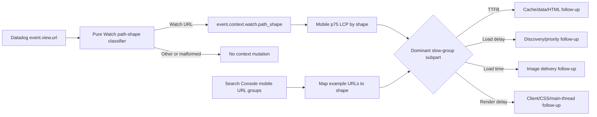

# Fix Watch Mobile LCP Attribution and Competing Image Preload

## Goal Capsule

- **Objective:** Improve current mobile LCP on Watch pages without attributing a property-wide Search Console signal to Watch or undoing the performance work already shipped.
- **Means:** Remove a confirmed below-the-fold image preload, add stable Watch path-shape context to the existing Datadog RUM events, and use Search Console URL groups plus field LCP subparts to select any broader follow-up.
- **Product authority:** The Product Contract defines the observable outcome; implementation choices are subordinate to it.
- **Open blockers:** Search Console example URL groups and current production Datadog RUM distributions were not available to this planning agent. They block a claim that Watch owns the 10,222 poor URLs, but they do not block the bounded preload and attribution PR.

---

## Product Contract

### Summary

Canonical Watch pages will reserve high-priority image loading for the actual above-the-fold LCP candidate. Performance operators will be able to segment current Datadog LCP telemetry by stable Watch path shape and compare it with Search Console's mobile URL groups before authorizing another hero, data-fetch, or cache rewrite.

### Problem Frame

Search Console reports 10,222 poor mobile URLs, 532 URLs needing improvement, 385 good URLs, and a recommendation that 92% of property pages are slow for LCP. Those are property-level and URL-grouped figures, not proof that the Watch application contributes the same share. Google documents that Core Web Vitals groups similar URLs and can fall back to an origin-level group when a page group lacks enough data; the displayed status is the group's 75th percentile over the latest field window.

The current repository already contains the major Watch LCP campaign:

- the hero poster is server-rendered, preloaded, eager, and high priority;
- Mux video activation waits until window load plus an idle window;
- the hero uses the thinner MuxVideo backend with bounded HLS buffering;
- sibling thumbnails are lazy;
- Montserrat ships as one WOFF2 variable face;
- conditional Watch sections and interaction modules are split from the initial route.

The live production source does expose one current regression. On 2026-08-28, three of four sampled playable routes emitted two image preloads: the Mux hero poster and an Unsplash Bible promo image. The latter comes from `BibleQuotesSection` setting `priority={bibleCitations.length === 0}` even though that section sits below a sticky `100svh` hero. This contradicts the repository's established one-LCP-image-preload rule and can spend bandwidth, origin image-optimizer work, and priority budget before the true hero LCP completes.

The live samples were:

| Public route                               | HTML bytes | Image preloads | One observed warm TTFB |
| ------------------------------------------ | ---------: | -------------: | ---------------------: |
| `/watch/jesus.html`                        |    904,820 |              2 |                 0.21 s |
| `/watch/jesus.html/urdu.html`              |  1,014,874 |              2 |                 0.87 s |
| `/watch/life-of-jesus-gospel-of-john.html` |    630,143 |              1 |                 1.03 s |
| `/watch/lumo-john-1-1-34.html`             |    347,253 |              2 |                 0.38 s |

These point samples prove source and resource-hint behavior, not field percentiles or the dominant LCP subpart. HTML size and TTFB therefore remain diagnostic dimensions rather than presumed root causes.

### Key Decisions

- **Keep the shipped Watch hero performance architecture.** Current code already implements the previously measured wins, so this PR does not rewrite the player, poster, font, or HLS path without field evidence. Governs R1-R4.
- **Remove priority from the Bible promo in every content state.** An image below a full-viewport hero is not the initial LCP candidate merely because editorial citations are empty. Native lazy loading is the correct contract. Governs R5-R7.
- **Enrich existing Datadog events by URL-derived path shape without renaming views.** Adding context preserves current dashboards and makes long-tail Watch URLs aggregatable. The derivation uses each event's own view URL so late updates for an earlier view cannot inherit the active route. Governs R8-R11.
- **Treat Search Console and Datadog as complementary field sources.** Search Console decides Google URL-group status; Datadog identifies current Watch LCP target elements and TTFB/load-delay/load-time/render-delay contributors. Lab traces explain a field finding but cannot replace it. Governs R12-R16.

### Actors

- **Mobile viewer:** sees the hero poster and can start playback without below-the-fold media competing during initial load.
- **Performance operator:** can compare Watch path shapes, device/browser/region cohorts, LCP elements, resources, and subparts in Datadog.
- **SEO operator:** maps Search Console mobile LCP example groups to Watch path shapes and validates only affected groups after release.
- **Web implementer:** gets a bounded first PR plus an evidence-based decision gate for any larger follow-up.

### Requirements

**Preserve the current critical path**

- R1. A playable Watch page server-renders its hero poster and exactly one high-priority image candidate for the hero.
- R2. The hero poster remains discoverable in initial HTML, uses a matching `srcset`/preload contract, and retains `fetchpriority="high"`.
- R3. The Mux video element remains absent at document load on normal navigation and activates only after the established load-plus-idle gate or explicit user intent.
- R4. The HLS buffer caps, Mux Data attribution, poster transition, playback readiness, CLS reservation, and autoplay-recovery behavior remain unchanged.

**Remove the confirmed contention**

- R5. The Bible promo image never emits a preload or high fetch-priority hint, including when `bibleCitations` is empty.
- R6. The promo remains rendered, responsive, accessible, and visible when the viewer scrolls to it; removing priority must not remove the card or cause layout shift.
- R7. Representative playable pages with the Bible promo publish one image preload in complete production HTML: the hero poster only.

**Make Watch field LCP diagnosable**

- R8. Every Datadog Browser RUM event whose own `view.url` belongs to `/watch` receives a low-cardinality `watch.path_shape` context value derived only from that URL.
- R9. Path-shape values distinguish at least root, one-segment, explicit-language video, implicit-English episode, explicit-language episode, languages, localized languages, history, localized history, language videos, search, reserved, and unknown forms without retaining content or language slugs.
- R10. Non-Watch events remain unchanged, existing Datadog view names remain unchanged, malformed URLs fail closed, and query strings/fragments cannot create new shape values.
- R11. The context derivation remains pure and unit-tested; the RUM callback never throws or blocks event delivery.

**Select broader fixes from evidence**

- R12. The baseline records Search Console's mobile LCP issue rows, group p75, example URLs, affected count, and date. Property totals alone cannot satisfy this requirement.
- R13. For the pre-release 28-day window, the baseline maps existing `view.url_path` pattern queries into the U1 path-shape taxonomy and records Datadog mobile p75 LCP, target selector/resource URL, `view.first_byte`, and available LCP subparts. Post-release events use the indexed `watch.path_shape` facet; the new facet is not treated as historical backfill.
- R14. The operator splits evidence by app version, browser, device, and country only when sample size remains sufficient; small cohorts are not presented as representative.
- R15. Any subsequent code path is chosen by the dominant slow-template subpart: cache/data/HTML for TTFB, discoverability/priority for load delay, image delivery for load time, or client/CSS/main-thread work for render delay. If subpart coverage is insufficient, the result is recorded as a telemetry blocker rather than forced into one of those paths.
- R16. Search Console validation is requested after deploy only for an affected Watch group, and success is assessed after the rolling field window has enough post-deploy observations.

### Acceptance Examples

- **AE1 — Empty citations:** `/watch/jesus.html` still renders the Bible promo card, but complete source contains one image preload and no preload for `photo-1650658720644-e1588bd66de3`.
- **AE2 — Citation content:** a Watch page with editorial Bible citations also publishes only the hero image preload; citation and promo images stay lazy until near the viewport.
- **AE3 — Stable field bucket:** events for `/watch/jesus.html`, `/watch/magdalena-2.html`, and their query-string variants share the same `one-segment` path shape and do not expose either slug.
- **AE4 — Explicit audio language:** `/watch/jesus.html/urdu.html` maps to `video-language`, while `/watch/lumo-the-gospel-of-john.html/lumo-john-1-1-34.html` maps to `episode-implicit-english`.
- **AE5 — Previous-view update:** a delayed Datadog update whose `event.view.url` is the prior Watch URL keeps that URL's path shape even after the browser navigates elsewhere.
- **AE6 — Field gate:** if Search Console's affected group examples contain no `/watch/` URLs, FGE-117 records that result and does not authorize a Watch hero rewrite from the property total.

### Success Criteria

- Representative hero-bearing production HTML contains exactly one image preload, and it targets the Mux hero poster.
- Five-run mobile lab medians show no material LCP, CLS, TBT, first-load JS, or player-readiness regression against the same main-branch build and cache conditions, using U4's explicit 5% run-variance tolerance.
- Datadog can report mobile p75 LCP and LCP subparts by stable Watch path shape without a high-cardinality content slug facet.
- For every affected Watch shape with enough field data, mobile p75 LCP is below 2.5 seconds or improves by at least 20% over its pre-release baseline without worsening CLS above 0.1 or INP above 200 ms.
- When Search Console has an affected Watch URL group, it moves to validation passed after its post-release rolling window. If the example groups contain no Watch URLs, the mapped evidence closes the Watch attribution question instead. A delayed recrawl/window is reported as pending, not treated as a code failure.

### Scope Boundaries

- No MuxPlayer/MuxVideo swap, HLS retuning, autoplay timing change, font change, or broad image-loader migration.
- No Cloudflare or Railway production configuration change and no direct production deploy.
- No manual Datadog view tracking or view-name replacement.
- No claim that 10,222 poor mobile URLs belong to Watch until example URL groups establish that mapping.
- No broad HTML-payload or cache refactor in the first PR; those require R12-R15 evidence.

#### Deferred to Follow-Up Work

- If TTFB dominates a Watch shape, plan a separate cache/data-payload PR around `page.tsx`, `content.ts`, and the route's serialized client props.
- If image load time dominates, evaluate the selected Mux poster width/quality and cross-origin timing data in a separate provider-delivery slice.
- If render delay dominates, inventory the initial Watch chunk graph, long tasks, and hydration boundaries before changing the player activation window.
- A durable Datadog dashboard or monitor can follow after the new facet proves stable and useful; dashboard administration is not part of this code PR.

### Assumptions

- Production is serving the current `@datadog/browser-rum` major version from `apps/web/package.json` (`^7.2.0`), which includes LCP target and subpart telemetry.
- Datadog credentials are configured in the production Watch service; the component intentionally does nothing when they are absent.
- A Datadog operator can create the low-cardinality `watch.path_shape` facet after the first production events arrive. Historical comparison remains possible through existing `view.url_path` pattern queries and does not depend on backfilling the new facet.
- Search Console access can export the affected mobile LCP example URLs even though this planning run received only property totals.
- The Bible promo remains below the initial viewport because the hero retains the full-viewport/sticky layout established by current Watch design.

### Sources

- `docs/roadmap/topic-experiences/feat-443-watch-mobile-lcp.md`
- Linear FGE-117, `[P1] Improve Watch mobile LCP across poor URL groups`
- `docs/solutions/performance-issues/web-watch-route-lighthouse-perf-campaign-lcp-bundle-fonts-20260527.md`
- `docs/solutions/performance-issues/watch-hero-poster-idle-autoplay-20260610.md`
- `docs/solutions/performance-issues/watch-cold-path-performance-follow-up-20260610.md`
- `docs/solutions/performance-issues/watch-non-cloudflare-performance-hardening-20260611.md`
- `docs/solutions/conventions/frontend-change-page-load-performance-verification.md`
- `apps/web/src/components/watch/HeroPlayer.tsx`
- `apps/web/src/components/watch/BibleQuotesSection.tsx`
- `apps/web/src/components/DatadogRum.tsx`
- Google Search Console Help, Core Web Vitals report: `https://support.google.com/webmasters/answer/9205520`
- Chrome/web.dev, Optimize Largest Contentful Paint: `https://web.dev/articles/optimize-lcp`
- Datadog, Monitoring Page Performance: `https://docs.datadoghq.com/real_user_monitoring/application_monitoring/browser/monitoring_page_performance/`
- Datadog, Browser RUM Advanced Configuration: `https://docs.datadoghq.com/real_user_monitoring/application_monitoring/browser/advanced_configuration/`
- Next.js, Image component: `https://nextjs.org/docs/app/api-reference/components/image`

---

## Planning Contract

The Product Contract is preserved. This plan scopes one normal Web PR to a confirmed resource-hint fix and the minimum field attribution needed to choose the next LCP change responsibly.

### Approach

Ship two independent behaviors in one FGE-117 PR:

1. Add a pure URL-to-Watch-path-shape classifier and call it from Datadog's existing `beforeSend` hook. Enrich `event.context` only; do not rename views or derive from `window.location`.
2. Make the Bible promo image unconditionally lazy and protect the one-hero-preload invariant in component tests and the existing complete-HTML Watch probe.

Before deployment, establish the baseline with existing `view.url_path` pattern queries mapped to the same taxonomy. After deployment, index and use the new facet for current-version events. Join that result to Search Console's affected example URLs. The first broader optimization is a follow-up selected from the dominant LCP subpart, not bundled speculatively into this PR.

### High-Level Technical Design

### Key Technical Decisions

- **KTD1 — Context, not view renaming:** Add `watch.path_shape` under event context. Existing view names and dashboards keep their current contract.
- **KTD2 — Event URL, not active location:** Derive from `event.view.url`. Datadog can send updates for an older view after navigation, so `window.location` can misattribute them.
- **KTD3 — Low-cardinality shapes:** Map URL structure only. Do not send content slug, language slug, query string, or media identity into the facet.
- **KTD4 — Reuse route grammar:** Reuse `WATCH_BASE_PATH` and `parseWatchPath` where their semantics fit, then normalize `localized-home` to the truthful `one-segment` observability label because a canonical English video and a language home can share that syntactic form.
- **KTD5 — Native lazy promo:** Remove the conditional `priority` branch and use lazy loading. Do not replace it with `loading="eager"`, `fetchPriority`, a manual preload, or a timer.
- **KTD6 — Complete-HTML contract:** Component props prove intent; the URL probe proves what Next/React actually emitted after server rendering. Both are required because head-preload emission is framework behavior.

### U1. Add stable Watch path-shape context to Datadog RUM

**Goal:** Make existing field LCP data aggregatable across long-tail Watch URLs without changing Datadog view identity.

**Requirements:** R8-R11, R13-R15; AE3-AE5

**Dependencies:** None

**Files:**

- Create: `apps/web/src/lib/watch-rum-path-shape.ts`
- Create: `apps/web/src/lib/watch-rum-path-shape.test.ts`
- Modify: `apps/web/src/components/DatadogRum.tsx`
- Modify: `apps/web/src/components/__tests__/DatadogRum.test.tsx`

**Approach:**

1. Add a pure helper that accepts an absolute view URL, parses it defensively, requires the `/watch` base path, strips that prefix, and maps the basePath-relative path to a closed union of low-cardinality shapes.
2. Preserve route syntax rather than guessing resolved content identity. In particular, expose one-segment paths as `one-segment`; use explicit `video-language`, `episode-implicit-english`, and `episode-language` labels where segment grammar is definitive.
3. Add `beforeSend` to the existing RUM configuration. When the helper returns a shape, merge `{ watch: { path_shape: shape } }` into `event.context` and return `true`. When it returns null, return `true` without mutation.
4. Keep initialization sampling, privacy, tracing, plugin, service, environment, and version settings unchanged.

**Patterns to follow:**

- `apps/web/src/lib/routes.ts` for `parseWatchPath` and basePath-relative Watch URL grammar.
- `apps/web/src/components/DatadogRum.tsx` for defensive no-throw reporting.
- Datadog's documented `beforeSend` rule that enrichment belongs under `event.context` and must use the event's URL for prior-view updates.

**Test scenarios:**

- Covers AE3. Different one-segment content slugs and query/fragment variants return `one-segment` and never include the slug.
- Covers AE4. Explicit language videos and implicit/explicit episodes return distinct stable shapes.
- Root, languages, localized languages, history, localized history, language videos, search, reserved, and unknown paths map to their expected closed values.
- A non-Watch URL, a deceptive prefix such as `/watching`, and an invalid absolute URL return null.
- The configured `beforeSend` merges Watch context without dropping pre-existing context and returns true.
- Covers AE5. A callback event carrying an old Watch `view.url` gets the old URL's shape regardless of the current browser location.
- Non-Watch events are byte-for-byte unchanged apart from the callback return value.
- A helper failure is contained and does not stop Datadog initialization or event delivery.

**Verification:**

- Unit coverage proves every public Watch path grammar has one bounded value and no content/language/query cardinality leaks.
- The initialized RUM config retains all current settings and includes one non-throwing enrichment callback.

### U2. Remove the below-the-fold Bible promo preload

**Goal:** Reserve initial image priority for the hero poster while preserving the promo card.

**Requirements:** R1-R7; AE1-AE2

**Dependencies:** None

**Files:**

- Modify: `apps/web/src/components/watch/BibleQuotesSection.tsx`
- Modify: `apps/web/src/components/watch/__tests__/BibleQuotesSection.test.tsx`

**Approach:**

1. Remove the `bibleCitations.length === 0` priority condition from the promo `Image` and make its lazy-loading contract explicit.
2. Keep `fill`, source, sizes, crop, alt/accessibility treatment, CTA, aspect-ratio/min-height reservation, and carousel behavior unchanged.
3. Update the explanatory comment to state that an empty citation collection does not move the section above the full-viewport hero and therefore cannot promote its image into the initial critical path.

**Patterns to follow:**

- `apps/web/src/components/watch/SiblingCarousel.tsx` for the established rule that non-LCP images stay native-lazy and emit no head preload.
- `docs/solutions/performance-issues/web-watch-route-lighthouse-perf-campaign-lcp-bundle-fonts-20260527.md` for the exact-one-image-preload constraint.

**Test scenarios:**

- Covers AE1. Empty citations still render the promo image and CTA, with `loading="lazy"`, no high fetch priority, and no priority/preload prop.
- Covers AE2. Citation-bearing content keeps citation and promo images lazy.
- Promo image source, responsive sizes, fill layout, CSS crop, CTA link, accessible hiding, and reserved card dimensions remain unchanged.

**Verification:**

- Focused component tests prove presentation parity and loading-intent change.
- Browser Network inspection shows no promo preload or high-priority promo request competing through LCP. Native lazy loading may fetch within the browser's calculated near-viewport distance before the user scrolls; that is acceptable. Scrolling to the section renders the card without unexpected layout shift.

### U3. Enforce the hero-only image-preload contract in the Watch URL probe

**Goal:** Catch framework-level head regressions that component tests cannot observe.

**Requirements:** R1-R2, R5, R7; AE1-AE2

**Dependencies:** U2

**Files:**

- Modify: `apps/web/src/lib/watch-url-probe.ts`
- Modify: `apps/web/src/lib/watch-url-probe.test.ts`
- Modify: `apps/web/scripts/probe-watch-urls.ts`

**Approach:**

1. Add a pure parser for complete HTML image preload tags. Record href/srcset hosts, fetch priority, and total count without downloading the images.
2. Add an opt-in performance-hint contract to representative hero-bearing fixtures rather than applying a one-preload rule to Watch home, non-video, or unavailable routes with different visual structures.
3. Mark the representative canonical JESUS, explicit-language JESUS, and standalone Lumo video fixtures as requiring exactly one image preload whose candidates point to the resolved hero poster provider and whose priority is high.
4. Make a missing hero preload, more than one image preload, or a non-hero high-priority image a hard preview regression with a layer-specific message.

**Patterns to follow:**

- Existing `parseDocumentIdentity`, `parseJsonLdScripts`, fixture-level opt-in contracts, and `classifyProbe` diagnostics in `apps/web/src/lib/watch-url-probe.ts`.

**Test scenarios:**

- One Mux hero `imagesrcset` preload with high priority passes.
- A hero plus Unsplash/Next-optimizer preload fails and names the unexpected candidate.
- Missing image preload, duplicate hero preloads, malformed tags, and a non-high-priority hero each produce the expected violation.
- Attribute order, single/double quotes, HTML entities, and `imageSrcSet` casing are parsed without false negatives.
- Non-opted-in fixtures retain their existing classification behavior.

**Verification:**

- Probe unit coverage validates the parser and classifier.
- A production-build probe against the three representative routes reports one hero preload each.

### U4. Capture baseline, compare builds, and operate the rollout

**Goal:** Prove the bounded fix, establish Watch's actual field contribution, and route the next change correctly.

**Requirements:** R12-R16 and all Success Criteria; AE6

**Dependencies:** U1-U3

**Files:**

- Create: `docs/qa/watch-mobile-lcp-2026-08.md`

**Approach:**

1. Record Search Console's mobile LCP issue rows and example URL groups, marking each example as Watch or non-Watch and assigning Watch URLs the same path-shape taxonomy as U1.
2. Record the pre-release 28-day Datadog p75 LCP using one documented `view.url_path` query per Watch path shape, including target selector, resource URL, first byte, load delay, load time, and render delay. Retain app version in the query so pre/post releases can be separated. Record the share of eligible LCP views that carry target/resource and subpart fields; distinguish a valid resource-less LCP with zero load delay/time from a missing field.
3. Compare `main` and the PR build using five cold mobile-sim runs per representative route: canonical JESUS, explicit non-English JESUS, a series landing, and a standalone Lumo episode. Keep browser version, CPU/network profile, cache state, and test location fixed.
4. Record source/head hints, request count/bytes through LCP, LCP element and four-part breakdown, CLS across player activation, TBT/long tasks, first-load JS, and time from load to player readiness.
5. After normal PR-to-main deployment and the first new-shape events, have the named Datadog operator create the `watch.path_shape` facet, record its query link and permissions owner, watch 24 hours for regression guardrails, then compare app versions. Revisit Search Console only after enough post-release field data exists. If facet creation is unavailable, keep using the equivalent URL-pattern queries and record the operational blocker; do not claim the facet Success Criterion is met.

**Performance budgets and rollout gates:**

- Complete video-page source has exactly one image preload and no Bible promo preload.
- Hero discovery audit reports discoverable, eager, and high priority.
- Five-run median lab LCP does not regress by more than 5%; expected improvement is recorded even if below run variance.
- CLS remains at or below 0.1 and does not increase across the delayed player-mount window.
- Field mobile p75 INP remains at or below 200 ms for sufficiently sampled Watch shapes and does not materially worsen between app versions.
- TBT, initial JS transferred, and request bytes through LCP do not increase by more than 5%; no new initial long task over 50 ms is attributable to this PR.
- The RUM enrichment adds no high-cardinality facet and does not change view names or materially increase event payload size.
- The normal-load player remains absent at `load`; its first mount and readiness remain within the current tested idle-activation envelope.

**Test scenarios:**

- Cold mobile navigation with empty citations downloads the hero through LCP with no promo preload or high-priority promo request; a browser-initiated low-priority near-viewport fetch is acceptable.
- Cold mobile navigation with citations retains the same single-preload behavior.
- `?autoplay=1` and explicit Play with Sound still activate the player immediately without poster/CLS regressions.
- Datadog Explorer can facet current-version Watch views by every emitted path shape and show LCP target/subpart distributions.
- Covers AE6. A Search Console group with no Watch examples is recorded as non-Watch and does not trigger Watch implementation work.

**Verification:**

- The QA document contains reproducible environment details, before/after medians, raw-run links or artifact paths, Search Console group evidence, and Datadog query links/screenshots.
- Source, production-build, probe, focused-test, lab-performance, and player-readiness gates pass before merge. Post-deploy Datadog and Search Console checks gate rollout/ticket completion and can trigger the pause or rollback conditions below; they are not pre-merge requirements.

### Dependency Order

1. U1 and U2 can be implemented independently.
2. U3 follows U2 because it asserts the corrected complete-HTML behavior.
3. U4 consumes all code units and is the merge/release evidence gate.

No GraphQL schema, generated type, database migration, environment variable, feature flag, or application-infrastructure change is required. U4 does require a named Datadog operator to create one low-cardinality facet after deploy; that account-side observability step is recorded in the QA artifact.

### Verification Contract

**Focused automated checks**

- Run the tests for `watch-rum-path-shape`, `DatadogRum`, `BibleQuotesSection`, and `watch-url-probe`.
- Run the `apps/web` typecheck and lint checks.
- Run formatting and diff-integrity checks for the touched files.

**Production-equivalent build and browser evidence**

- Build `apps/web` with the same public base path and production environment shape used by the Watch service.
- Serve the build and run the representative URL probe against it.
- Run five controlled mobile traces per route for `main` and the PR build, preserving the environment settings listed in U4.
- Inspect source and Network rather than relying only on a screenshot: one hero preload, no promo preload or high-priority promo request competing through LCP, one hero image request, and no video element at load.
- Observe CLS across the post-load MuxVideo mount, not only during the initial poster paint.

**Field verification after deploy**

- Datadog: compare pre/post app version over a 24-hour safety window, then a representative traffic window. Use mobile p75 for LCP, CLS, and sufficiently sampled INP; retain sample counts and LCP-subpart field coverage.
- Search Console: record the affected Watch URL group before deploy, start validation after deploy, and reassess after the rolling field window. Do not claim success from lab data or a same-day recrawl.

### Rollout and Rollback

- Deploy only through the normal PR-to-main flow.
- No runtime flag is needed: the promo loading change is a one-line, presentation-preserving correction, and RUM enrichment does not change user behavior or view names.
- Pause or revert if mobile p75 LCP worsens by more than 10% for a sufficiently sampled Watch shape, CLS crosses 0.1, sufficiently sampled INP crosses 200 ms or materially worsens, player readiness regresses, Datadog event delivery drops, or the promo fails to load near the viewport.
- Roll back U1 independently by removing the `beforeSend` enrichment; roll back U2/U3 together if the visual/resource contract regresses. Do not roll back solely because Search Console is still inside its rolling measurement window.

### Risk Analysis and Mitigation

- **Search Console aggregation misattribution:** Require example URLs and group p75; never use the property count alone.
- **Datadog cardinality growth:** Emit a closed path-shape union only; explicitly test that slugs and queries are absent.
- **Prior-view race:** Derive from each event's `view.url`, not active location.
- **Promo pop-in:** Keep aspect-ratio/min-height reservation and verify near-viewport loading on phone and desktop.
- **Framework head behavior drift:** Assert complete production HTML with the existing URL probe.
- **Incomplete LCP subparts:** Record field coverage, distinguish valid zero-valued resource-less LCP from missing telemetry, and create a telemetry-coverage follow-up instead of forcing a root-cause conclusion.
- **Lab noise:** Use five-run medians and treat a small delta as inconclusive while still enforcing resource-hint correctness.
- **Overcorrecting the hero:** Make any broader fix a separate evidence-selected follow-up.

### Definition of Done

**PR ready and mergeable**

- U1-U3 and U4's pre-merge evidence are complete; all deterministic merge gates pass.
- The production-build representative video routes emit one hero image preload.
- Existing 28-day Datadog URL-pattern queries establish the pre-release Watch-shape baseline, and a named operator owns post-deploy facet creation.

**FGE-117 and roadmap completion after deploy**

- Live representative video routes emit one hero image preload and the 24-hour Datadog safety window shows no rollout regression.
- Datadog production events expose the stable `watch.path_shape` facet with no view-name or delivery regression; if account access blocks facet creation, FGE-117 stays in progress with the named blocker.
- Search Console's affected mobile LCP groups are mapped to Watch or explicitly ruled out. When a Watch group is affected, FGE-117 stays in progress until its validation passes after the rolling window.
- Any remaining poor Watch shape has a separately scoped follow-up tied to its measured dominant LCP subpart. If subpart coverage is insufficient, the follow-up is a telemetry-coverage ticket instead; no speculative hero rewrite remains inside FGE-117.
