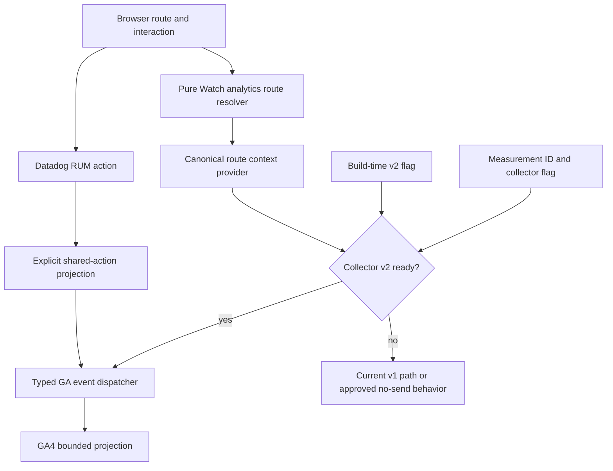
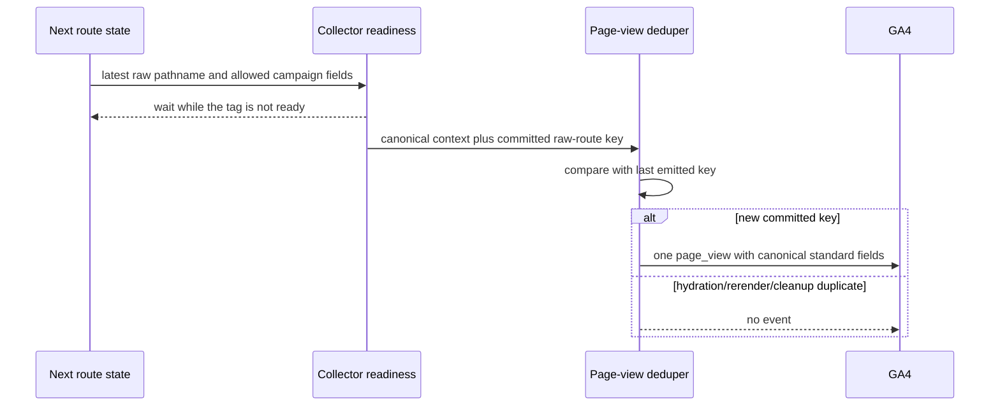

# Watch GA4 Route Attribution and Event Contract - Plan

## Goal Capsule

- **Objective:** Make Watch page and mission-event reporting reliable enough to distinguish an instrumentation defect from a real engagement problem.
- **Means:** Introduce one canonical route-identity resolver, one explicit and deduplicated SPA page-view path, and one typed/versioned Watch event contract while preserving the existing GA4 event names during migration.
- **Product authority:** Linear FGE-115 and `docs/roadmap/topic-experiences/feat-444-watch-ga4-measurement.md` own this scope.
- **Execution profile:** One Web instrumentation PR, including a bounded extension to the existing read-only Mastra GA4 client for reconciliation, plus a documented GA4-property configuration and validation gate; no Watch route, canonical, playback, search-ranking, or UX behavior changes.
- **Enablement:** Follow `docs/analytics-and-recommendation-policy.md`. Consent is not a prerequisite. Preserve the configured GA page views, navigation and Watch events, and Datadog RUM restored by PR #2229 throughout v2 rollout and rollback.

---

## Product Contract

### Summary

Measure each Watch navigation under one canonical content identity while retaining the browser route form for diagnosis. Give play, progress, search, language, download, share, and mission CTA interactions explicit firing rules so analysts can compare canonical and compatibility traffic without confusing missing or duplicated telemetry with weak product behavior.

### Problem Frame

The GA4 snapshot collected on 2026-08-28 covers the last 28 days and shows 151,955 `/watch/` views from 112,844 active users, 1.35 views per user, 17 seconds of average engagement, 462,278 events, and 2,803 key events. Views per user are 37.5% below the property average and engagement is 54.71% below it, but the event and route contracts are not reliable enough to attribute those gaps to UX.

The main JESUS experience is split between `/watch/jesus.html` (3,011 views and 19 key events) and `/watch/jesus.html/english.html` (2,038 views and 87 key events). That is a 0.63% versus 4.27% raw key-event-to-view ratio, a roughly 6.8x difference. The paths render the same English content under the documented canonical/compatibility contract, so acquisition mix, route attribution, duplicate or missing events, and GA4 key-event configuration must be ruled out before treating the ratio as behavioral evidence.

The code explains the split. `apps/web/src/proxy.ts` serves explicit English as a direct compatibility rewrite rather than redirecting it, while `apps/web/src/components/GoogleAnalytics.tsx` lets the initial Google tag send the browser URL and sends later App Router changes through `gtag("config", ...)`. Custom event names and parameter names are rewritten implicitly: app-local `watch_` and `search_` prefixes disappear, and the event definitions are spread across the generic GA helper, Datadog RUM, the Watch page, and the player recorder.

### Key Decisions

- **Canonical identity is an analytics projection, not a route change.** Explicit-English compatibility and contextual URLs keep their current public behavior; analytics groups them using the same route policy already used by Watch canonical metadata and links. Governs R1-R5 and R17.
- **Normalize page reporting while retaining bounded diagnostics.** The GA4 standard `page_path` receives the canonical Watch path; the raw pathname is retained only as an unregistered event parameter and never includes a query string. Governs R2-R8 and R20-R22.
- **Preserve existing event names through the baseline window.** The first release centralizes and versions current names instead of renaming or dual-emitting them, because key-event settings and historical reports are external contracts not represented in the repository. Governs R9-R16 and R23-R25.
- **Outcomes, not opens, define mission evidence.** Modal opens and intents remain diagnostic events; successful playback, meaningful progress, download initiation, language application, share completion, search result selection, and named mission CTA clicks are the candidate key-event layer. Governs R11-R16 and R25-R27.

### Requirements

**Page and route identity**

- R1. One pure, client-safe resolver must accept a browser pathname and known query parameters and return a canonical Watch page path, a bounded raw pathname, route type, route variant, language classification, and entry-intent classification.
- R2. Eligible English standalone video forms such as `/watch/jesus.html` and `/watch/jesus.html/english.html` must resolve to canonical `page_path=/watch/jesus.html`; the raw path must distinguish `canonical` from `explicit_language_compatibility`.
- R3. Non-English standalone URLs must remain explicit and canonical, for example `/watch/jesus.html/urdu.html`; language-slug aliases must resolve through the existing URL policy rather than an analytics-only list.
- R4. Eligible English contextual episode URLs must resolve to the standalone canonical video identity for event attribution while retaining `contextual` as the route variant and the parent/episode path as bounded raw diagnostics.
- R5. Utility, language home, inventory, history, unavailable, preview, reserved, and unknown paths must receive finite route types; unknown or invalid paths must not be guessed into a content family.
- R6. Initial load and App Router navigation must emit exactly one `page_view` per committed browser-route key, including under React Strict Mode, hydration, same-path rerenders, query cleanup with `history.replaceState`, and delayed Google tag readiness.
- R7. The standard `page_path` must be canonical and query-free. `page_location` may retain only the canonical origin, canonical path, and an explicitly allowlisted, length-bounded, PII-rejected set of campaign parameters needed for attribution; Watch one-shot parameters and arbitrary query values must not create page identities. `page_referrer` must be supplied explicitly rather than left to the browser default, bounded to origin plus canonical query-free path, and suppressed when it fails validation. R19's full-referrer ban is otherwise unenforceable, because gtag sends `document.referrer` verbatim on every page view and the enablement sweep in the Verification Contract would block on it every run.
- R8. The page-view implementation must disable automatic `send_page_view` for its own Google tag and document the GA4 Enhanced Measurement browser-history setting required to prevent a second collector from emitting duplicate SPA page views.

**Typed event contract**

- R9. All Watch GA events must be declared in a typed contract with an explicit wire name, contract version, required/optional parameters, firing rule, deduplication scope, and key-event eligibility; call sites must not pass arbitrary names through an implicit normalizer.
- R10. Every Watch event must receive the current canonical route context at emission time without requiring each feature component to rebuild path logic.
- R11. Player events must preserve the current wire names during migration: `videostarts`, `videoplay`, `video_pause`, `video_progress`, `videocomplete`, and `a_media_progress10/25/50/75/90`.
- R12. `videostarts` and `videocomplete` must fire once per video/dub playback identity; `videoplay` and `video_pause` may fire on each real transition; milestones must fire once per identity even after seek, replay, remount, or repeated `timeupdate` events; meaningful `video_progress` remains once at 30 seconds or 25%, whichever is reached first.
- R13. Search measurement must record `search_completed` with `outcome=results|no_results|failed`, a bounded result-count bucket, and request type, plus the existing `search_result_clicked`; it must not send query text, titles, result IDs, request IDs, or typed language names to GA4.
- R14. Language measurement must retain `language_picker_opened` and add `language_applied` plus `subtitle_applied`; changed state and language class may be sent, but free-form labels and UI text may not.
- R15. Download measurement must retain `download_intent` and add `download_started` only after the same-origin download handoff is accepted; the event may include a finite quality tier and gate outcome but not filename, media URL, or session identity.
- R16. Share measurement must retain `share_opened` and add `share_completed` with the finite method `copy_link|copy_embed|facebook|x`; high-value external Watch CTAs must use one `watch_cta_clicked` event with an allowlisted CTA identifier and destination class.

**Compatibility, privacy, and operations**

- R17. The work must not change proxy redirects/rewrites, canonical metadata, sitemap ownership, route builders, or viewer-visible URLs.
- R18. Datadog RUM event names and rich diagnostic context must remain unchanged; the GA projection must use its own allowlist so `reportDatadogRumAction` cannot forward arbitrary RUM fields to Google.
- R19. No GA payload may contain viewer/session IDs, auth state identifiers, email, user-entered search text, page titles derived from input, filenames, raw media URLs, full referrers, GraphQL data, or secrets. It may not contain a recommendation delivery capability, an episode capability, or the tab correlation/claim nonce either: `apps/web/CLAUDE.md` forbids any capability from entering an analytics event or retained browser artifact.
- R20. Low-cardinality reporting dimensions are limited to contract version, route type, route variant, language class, entry intent, event outcome, progress percent, quality tier, share method, CTA identifier, and destination class.
- R21. Canonical path, raw path, content slug/ID, dub ID, and exact language slug may be emitted only where operationally necessary, must be bounded and validated, and must not be registered as custom dimensions without a measured cardinality review; high-cardinality detail belongs in DebugView or BigQuery export rather than standard reports.
- R22. Configured analytics must initialize and emit without a consent state, prompt, receipt, or approval. Preserve the working GA and Datadog baseline restored by PR #2229; recommendation personalization settings cannot disable it.
- R23. Before rollout, the analytics owner must export the current event list, key-event markings, custom definitions, Enhanced Measurement page-view configuration, and any downstream dashboards that depend on legacy names.
- R24. The v2 collector must ship behind a Web build-time flag that leaves the current collector intact when disabled and can be rolled back without changing routes or removing the GA measurement ID.
- R25. Existing events continue to emit only under their legacy wire names for at least one complete 28-day comparison window; the additive outcome events declared by this contract may emit during that window. Any later rename is a separately reviewed migration; dual-writing old and renamed forms of the same event is prohibited because it inflates event counts.
- R26. The validation readout must reconcile page views and funnel events across canonical and compatibility route variants and explicitly report thresholding/cardinality caveats.
- R27. GA4 key-event candidates and denominators must be documented: `video_progress`, `videocomplete`, `download_started`, `share_completed`, `language_applied`, and allowlisted mission CTA clicks are reviewed; open/intention events are not promoted by default.

**Interaction cost and page-load impact**

- R28. Event dispatch must not add measurable input-latency cost to the interaction that triggers it. An interaction-triggered event defers to a paint yield by default. A dispatch whose document may be replaced, or whose tab may be backgrounded, before that yield runs is issued immediately: outbound CTA activation, the download handoff, and social-share target activation. The immediate/deferred choice is made per dispatch rather than per event name, because `watch_cta_clicked` is immediate only when its resolved destination class is outbound. Page views are outside this requirement.
- R29. The contract must add no render-blocking request and no initial-chunk growth attributable to lazily mounted surfaces. Verification follows `docs/solutions/conventions/frontend-change-page-load-performance-verification.md` and names the layout-shift observation window it covers.

### Event Contract

All events carry `event_contract_version=2`, `watch_route_type`, `watch_route_variant`, and canonical page context. High-cardinality identifiers are payload-only and are not registered as GA custom dimensions by default.

| Wire event                       | Firing rule                                                        | Deduplication                                     | Event-specific parameters                                                                         | Key-event posture                        |
| -------------------------------- | ------------------------------------------------------------------ | ------------------------------------------------- | ------------------------------------------------------------------------------------------------- | ---------------------------------------- |
| `page_view`                      | Initial committed route and each committed App Router route change | Once per raw pathname plus sanitized campaign key | standard canonical `page_path`; sanitized `page_location`; bounded `watch_raw_path`; entry intent | Denominator only                         |
| `videostarts`                    | First transition into playing for one video/dub identity           | Once per identity                                 | duration, position `0`, content/dub IDs                                                           | Candidate only after baseline inventory  |
| `videoplay`                      | Every actual transition into playing                               | Browser media transition                          | duration and position                                                                             | Diagnostic                               |
| `video_pause`                    | Every actual pause excluding terminal `ended` duplication          | Browser media transition                          | duration, position, progress percent                                                              | Diagnostic                               |
| `a_media_progress10/25/50/75/90` | First crossing of each fixed milestone                             | Once per milestone and identity                   | fixed progress percent, duration, position                                                        | Diagnostic                               |
| `video_progress`                 | First crossing of 30 seconds or 25%                                | Once per identity                                 | duration, position, progress percent                                                              | Primary meaningful-play candidate        |
| `videocomplete`                  | Terminal ended state                                               | Once per identity                                 | progress percent `100`, duration                                                                  | Primary completion candidate             |
| `search_completed`               | A submitted search settles                                         | Once per search attempt                           | outcome, result-count bucket, request type; no query                                              | Diagnostic                               |
| `search_result_clicked`          | First click of a rendered result in one result window              | Existing click dedupe                             | result type, 1-based position bucket, result source; no title/ID/request ID                       | Journey candidate, not default key event |
| `language_picker_opened`         | Language modal opens                                               | UI transition                                     | language class                                                                                    | Diagnostic                               |
| `language_applied`               | A different audio language is applied and navigation is committed  | Once per apply intent                             | from/to language class, route destination variant                                                 | Candidate                                |
| `subtitle_applied`               | Subtitle state or subtitle language is committed                   | Once per apply intent                             | enabled state, language class                                                                     | Diagnostic                               |
| `download_intent`                | Download entry control is activated                                | Re-entry guard                                    | language class, content ID if retained                                                            | Diagnostic                               |
| `download_started`               | Same-origin handoff is accepted and browser download is invoked    | Existing in-flight guard                          | quality tier, access outcome                                                                      | Primary download candidate               |
| `share_opened`                   | Share modal opens                                                  | UI transition                                     | none beyond common context                                                                        | Diagnostic                               |
| `share_completed`                | Copy succeeds or a social-share target is activated                | User action                                       | method                                                                                            | Candidate                                |
| `watch_cta_clicked`              | Allowlisted mission CTA activates                                  | User action                                       | CTA identifier, destination class                                                                 | Candidate per CTA                        |

### Key Flows

- F1. Canonical page measurement
  - **Trigger:** A user loads or navigates to a Watch route.
  - **Steps:** Resolve the browser route, compute canonical identity, wait for the collector to be ready, suppress duplicates, and emit one explicit `page_view`.
  - **Outcome:** Canonical and compatibility visits share the standard page path while raw route form remains diagnosable.
  - **Covered by:** R1-R8, R17, R22, R24.
- F2. Mission event measurement
  - **Trigger:** A user plays, searches, changes language/subtitles, downloads, shares, or selects a mission CTA.
  - **Steps:** The typed call site chooses a declared event, the dispatcher adds route context and validates the allowlisted payload, then GA and Datadog receive only their intended projections.
  - **Outcome:** Each funnel action has stable semantics without cross-provider context leakage.
  - **Covered by:** R9-R21, R25, R27.
- F3. Validate behavior versus telemetry
  - **Trigger:** The flagged v2 collector is enabled for a bounded production cohort/build.
  - **Steps:** Verify baseline delivery and one-hit page views, reconcile raw/canonical route variants, compare funnel rates and lost-event diagnostics, and review GA data-quality indicators.
  - **Outcome:** Analysts can label the JESUS ratio as instrumentation, acquisition mix, behavioral, or still inconclusive.
  - **Covered by:** R23-R27.

### Acceptance Examples

- AE1. **Covers R2, R6-R8.** Given a direct load of `/watch/jesus.html/english.html`, when GA initializes after hydration, then exactly one page view is emitted with canonical `page_path=/watch/jesus.html`, raw path `/watch/jesus.html/english.html`, and route variant `explicit_language_compatibility`.
- AE2. **Covers R3, R6.** Given a client navigation from English JESUS to `/watch/jesus.html/urdu.html`, when the route commits, then one new page view is emitted with the Urdu path as both canonical and raw identity; a rerender emits none.
- AE3. **Covers R4, R10-R12.** Given a contextual episode path, when playback reaches 25% after a seek, then the page and player events carry the standalone canonical identity plus contextual route variant, and each crossed milestone fires at most once.
- AE4. **Covers R13, R18-R21.** Given a search query containing an email-like value and a result with a unique title and ID, when search settles and the result is clicked, then Datadog keeps its approved diagnostic context while GA receives outcome, result bucket/type/source, and position bucket only.
- AE5. **Covers R14-R16.** Given a user opens but closes a language, download, or share modal, when no application/handoff/share action completes, then only the existing opened/intent event fires and no outcome candidate is emitted.
- AE6. **Covers R22-R24.** Given configured analytics and no consent signal or interaction, when a Watch page loads and navigates, then the active collector emits page views and existing Watch events. Disabling the v2 flag restores the working v1 collector without a route or GA-ID change; Datadog RUM remains active.
- AE7. **Covers R23, R25-R27.** Given the first full 28-day v2 window completes, when analysts compare JESUS route variants, then canonical page totals reconcile to bounded raw-route totals, duplicate-page-view rate stays below 1%, and key-event decisions use outcomes rather than modal opens.

### Success Criteria

- Canonical Watch page views reconcile to the sum of their bounded raw route variants within 1% after excluding thresholded, filtered, and known bot/internal traffic.
- Automated and browser validation observes exactly one `page_view` in 100% of deterministic initial-load and SPA-navigation cases; no known hydration, readiness, or history-cleanup path double-counts. The separate production duplicate-page-view tolerance remains below 1% because filtering, network behavior, and property configuration are not deterministic test inputs.
- At least 95% of `videostarts` in the validated sample carry a non-unknown canonical route type and route variant.
- The player funnel is internally monotonic by identity and date: `videocomplete <= video_progress <= videostarts`, with documented exceptions for network loss and the migration boundary.
- The 28-day comparison can state whether the raw JESUS key-event-rate difference persists after canonical grouping, event-by-event denominators, channel/device segmentation, and data-quality caveats.
- No raw search term, viewer/session ID, email sentinel, filename, unbounded query string, or unallowlisted RUM parameter appears in GA DebugView, Realtime, or the validation export.

### Scope Boundaries

- Do not redirect or remove `/watch/jesus.html/english.html` or any other compatibility route.
- Do not change canonical metadata, sitemap URLs, hreflang, Search Console configuration, search ranking, media behavior, or UX based on the current 17-second engagement observation.
- Do not rename or dual-write existing GA events in this PR.
- Do not add server-side Measurement Protocol emission, user IDs, cross-device stitching, raw query collection, or a general-purpose analytics SDK.
- Do not mark key events in GA4 until the current property configuration is exported and v2 outcomes are verified.

### Deferred to Follow-Up Work

- Retirement or GA-recommended renaming of legacy player event names after one complete 28-day compatibility window.
- A durable Manager dashboard if the existing GA4 Explore/Data API reporting cannot express the approved route and funnel readout without another product surface.
- UX experiments for the low views-per-user or engagement metrics; those start only after this contract establishes trustworthy denominators.

### Assumptions

- The existing explicit-English direct-200 compatibility behavior is intentional and remains owned by the Watch URL contract.
- A build-time flag is acceptable because the current GA integration is already build-configured through a public measurement ID; runtime audience experimentation is not needed for a correctness rollout.
- GA4 property administration is an operator step outside the repository, so exported before/after configuration evidence is required in the ticket rather than simulated in tests.
- Exact language and content values remain useful for DebugView/BigQuery diagnosis but are too high-cardinality to register broadly in standard GA reports without evidence.

### Sources and Research

- `docs/roadmap/topic-experiences/feat-444-watch-ga4-measurement.md`
- `docs/roadmap/platform/feat-274-web-google-analytics-integration.md`
- `apps/web/src/components/GoogleAnalytics.tsx`
- `apps/web/src/components/__tests__/GoogleAnalytics.test.tsx`
- `apps/web/src/components/DatadogRum.tsx`
- `apps/web/src/components/__tests__/DatadogRum.test.tsx`
- `apps/web/src/components/watch/WatchEventRecorder.tsx`
- `apps/web/src/components/watch/__tests__/WatchEventRecorder.test.tsx`
- `apps/web/src/components/watch/WatchPageClient.tsx`
- `apps/web/src/components/watch/__tests__/WatchPageClient.download.test.tsx`
- `apps/web/src/components/SearchOverlay.tsx`
- `apps/web/src/lib/watch-search-rum.ts`
- `apps/web/src/lib/watch-search-analytics-contract.ts`
- `apps/web/src/lib/routes.ts`
- `packages/watch-url-policy/src/routes.ts`
- `apps/web/src/proxy.ts`
- `apps/mastra/src/services/google-analytics-client.ts`
- Google Analytics: [Measure single-page applications](https://developers.google.com/analytics/devguides/collection/ga4/single-page-applications)
- Google Analytics: [Set up events](https://developers.google.com/analytics/devguides/collection/ga4/events)
- Google Analytics Help: [Cardinality](https://support.google.com/analytics/answer/12226705)
- Google Analytics Help: [About the `(other)` row](https://support.google.com/analytics/answer/13331684)
- Google Analytics Help: [Avoid sending PII](https://support.google.com/analytics/answer/6366371)
- Google Analytics Help: [About key events](https://support.google.com/analytics/answer/9267568)
- Google Analytics Help: [Event naming rules and reserved names](https://support.google.com/analytics/answer/13316687)
- Google Analytics Help: [Data collection and configuration limits](https://support.google.com/analytics/answer/9267744)
- Google Analytics Help: [Custom dimensions and metrics](https://support.google.com/analytics/answer/10075209)
- Google Analytics Help: [Enhanced measurement events](https://support.google.com/analytics/answer/9216061)
- `docs/solutions/conventions/frontend-change-page-load-performance-verification.md`
- `docs/solutions/best-practices/mocked-shape-vs-real-contract-discipline-20260506.md`
- `docs/solutions/best-practices/base-ui-dialog-state-attribute-detection-20260520.md`
- `docs/solutions/architecture-patterns/canonical-server-search-analytics-supplemental-rum-pattern.md`

---

## Planning Contract

### Product Contract Preservation

The Product Contract is unchanged. Planning narrows the implementation to the existing Web Google tag and Watch call sites plus the bounded read-only Mastra GA4 client extension in U6, keeps legacy wire names, and treats GA4-property configuration as a rollout gate rather than inventing a second analytics store.

### Key Technical Decisions

- KTD1. **Share Watch URL policy, not analytics copies.** Create a pure analytics projection that consumes `parseWatchPath`, `WATCH_BASE_PATH`, language aliases, and canonical route builders. It may add analytics classifications but may not redefine route eligibility.
- KTD2. **Own page views explicitly.** Configure the repository-owned Google tag with automatic page views disabled and emit `page_view` from one readiness-aware route observer. This is preferable to continuing the mixed initial-auto/later-config path because the latter cannot apply one canonical identity contract consistently.
- KTD3. **Use canonical standard fields plus bounded raw diagnostics.** Set standard `page_path` to the canonical route so Pages and Screens aggregates correctly. Preserve raw pathname and variant as event parameters, but do not include raw query strings or register raw path as a custom dimension by default.
- KTD4. **Separate GA and RUM projections.** Replace `reportDatadogRumAction`'s generic pass-through to GA with an explicit mapping for each shared action. Datadog retains its approved rich context; GA accepts only its typed allowlist.
- KTD5. **Centralize current wire names before adding outcomes.** A `watch-analytics-contract` module owns discriminated event inputs and wire mappings. Existing names and semantics are characterized first; outcome events are additive. The generic normalizer stops being the source of event meaning.
- KTD6. **Feature-flag the collector boundary, not individual events.** `NEXT_PUBLIC_FORGE_WATCH_GA4_CONTRACT_V2=false` keeps the current v1 initialization and emission path. `true` selects the explicit page-view and typed dispatcher together so hybrid v1/v2 behavior cannot create duplicate or contextless events.
- KTD7. **Preserve analytics throughout migration.** The v2 collector has no consent gate. Tests cover configured and unconfigured providers, missing consent state, initial page views, navigation, and Watch events. Production enablement verifies equivalent delivery; rollback restores the working collector and preserves Datadog RUM.
- KTD8. **Validate with two independent views.** Browser/DebugView proves firing rules and payload safety; a GA4 Realtime/Data API comparison proves aggregate reconciliation and reports thresholding, other-row, and filtering caveats.
- KTD9. **One injectable scheduling seam owns dispatch timing.** Every custom event reaches `gtag` through a single seam whose per-dispatch mode is supplied by the caller under the classification R28 owns. The seam flushes pending deferred dispatches on `visibilitychange` to hidden and on `pagehide`, because `requestAnimationFrame` is suspended in a backgrounded tab and a queued player milestone would otherwise be lost silently. Its lifetime is module-scoped, not component-scoped, so unmounting a modal cannot cancel a dispatch it already queued. `page_view` bypasses the seam entirely: R6 requires the deduper and the emit in one turn. This serves the "bounded work on the JS thread, no jank during interaction" principle in `PRODUCT.md`, which states the constraint qualitatively and sets no numeric budget. Governs R28.

### High-Level Technical Design

### Sequencing and Stop Conditions

1. Characterize v1 and export the GA4 property configuration before changing emission.
2. Land the pure route resolver and typed contract before moving any call site.
3. Land the v2 dispatcher and page-view owner behind a default-off flag before adding outcome call sites.
4. Enable after baseline analytics delivery and GA Enhanced Measurement settings are verified in production-like conditions, the registered-dimension budget is recorded, and every parameter this contract needs in standard reports is registered. Registration is not retroactive, so enabling first permanently loses those dimensions for the comparison window the conclusion depends on.
5. Stop rollout if page views duplicate by more than 1%, canonical totals do not reconcile with raw variants, unknown route context exceeds 5%, or a privacy sentinel reaches GA.

Disabling the v2 flag is the immediate rollback. If the flag cannot isolate both page and custom event paths in the built bundle, do not ship a partial migration; keep v1 until the boundary is made atomic.

---

## Implementation Units

### U1. Characterize the v1 collector and property dependencies

- **Goal:** Freeze current behavior and external GA4 dependencies before changing the collector.
- **Requirements:** R23-R25.
- **Dependencies:** None.
- **Files:**
  - Modify `apps/web/src/components/__tests__/GoogleAnalytics.test.tsx`
  - Modify `apps/web/src/components/watch/__tests__/WatchEventRecorder.test.tsx`
  - Modify `apps/web/src/components/watch/__tests__/WatchPageClient.download.test.tsx`
  - Create `docs/operations/watch-ga4-measurement.md`
- **Approach:**
  1. Add characterization coverage for initial automatic page view, client-route config calls, prefix stripping, primitive filtering, player deduplication, and existing modal/search wire names.
  2. Record an operator checklist for exporting GA4 key events, custom definitions, enhanced page-view settings, and dependent reports before v2 enablement.
  3. Record the configured production GA and Datadog baseline and provider receipt evidence before changing the collector.
  4. Land the `reportDatadogRumAction` GA allowlist flag-independently, in both the v1 and v2 paths, ahead of the rest of the migration. This is a live defect, not future work: `SearchOverlay.tsx` passes the full search-click RUM context to `DatadogRum.tsx`, which forwards the whole object into `reportGoogleAnalyticsEvent`, so `result_title`, `result_id`, `result_slug`, and `search_request_id` reach GA in production today against R13 and R18. Keep the `search_result_clicked` wire name and event count unchanged; drop only the forbidden parameters, leaving position bucket, result source, and result type. Record the forwarded parameters as a defect being removed, not as v1 behavior to preserve.
  5. Have the analytics owner query the existing GA4 property, and the BigQuery export if linked, for already-collected `result_title`, `result_id`, `result_slug`, and `search_request_id` values; record the observed date range and volume in `docs/operations/watch-ga4-measurement.md` and record a decision on whether to file a GA4 data-deletion request while the retention window still permits one.
- **Execution note:** Add characterization coverage before modifying the legacy collector.
- **Patterns to follow:** Completion contract and focused tests in `docs/roadmap/platform/feat-274-web-google-analytics-integration.md`.
- **Test scenarios:**
  - An initial configured render preserves the current bootstrap call and emits no manual page event under v1.
  - A client route change emits the current `config` call exactly once under v1.
  - `watch_download_intent` still reaches the wire as `download_intent`, and `watch_search.result_clicked` still reaches it as `search_result_clicked`.
  - Repeated play/timeupdate/ended events retain the existing v1 start, progress, milestone, and completion counts.
  - A search-click RUM action carrying a result title, result ID, result slug, and search request ID reaches Datadog unchanged while `window.gtag` receives only position bucket, result source, and result type. The fixture defines `window.gtag` and leaves every other gate permissive so the absence assertion cannot pass vacuously.
- **Verification:** The fixtures document every event name or page-view behavior that v2 must preserve or intentionally supersede.

### U2. Resolve canonical Watch analytics context

- **Goal:** Provide one pure route projection for page views and all custom events.
- **Requirements:** R1-R5, R7, R17, R20-R21; covers F1.
- **Dependencies:** U1.
- **Files:**
  - Create `apps/web/src/lib/watch-analytics-route.ts`
  - Create `apps/web/src/lib/watch-analytics-route.test.ts`
  - Read without changing route behavior: `apps/web/src/lib/routes.ts`
  - Read without changing route behavior: `packages/watch-url-policy/src/routes.ts`
- **Approach:**
  1. Strip and restore `WATCH_BASE_PATH` exactly once, classify with `parseWatchPath`, resolve known language aliases, and build canonical standalone paths through existing route builders.
  2. Return finite route type/variant/language-class/entry-intent values plus canonical and bounded raw path; do not fetch manifests or introduce request-time I/O.
  3. Sanitize campaign attribution through a small explicit key/value allowlist and reject values that fail length, character, credential, or email-like checks. All Watch one-shot and unknown query parameters remain outside page identity.
  4. Apply that same rejection policy to the retained raw pathname before it becomes `watch_raw_path`. A pathname is attacker- and user-influenceable, so length-bounding alone does not satisfy R19; omit the field when a segment fails the check rather than truncating it. An unknown or invalid path emits one page view under the fixed analytics-only canonical path `/watch/_unknown` with route type `unknown` and no raw path, so R5's no-guessing rule and R6's one-view-per-commit rule can both hold.
- **Patterns to follow:** Pure route helpers and exhaustive syntax tests in `apps/web/src/lib/routes.ts` and `apps/web/src/lib/routes.test.ts`.
- **Test scenarios:**
  - Covers AE1. Language-less and explicit-English JESUS produce the same canonical path and different route variants.
  - Covers AE2. Urdu JESUS remains explicit and canonical.
  - Covers AE3. Eligible English contextual episode paths project to standalone identity while retaining contextual raw diagnostics.
  - Language home, localized inventory, history, whats-new, unavailable/reserved, and malformed paths produce the expected finite classification without content guessing.
  - `/watch` is stripped once and restored once; basePath-free test inputs behave identically.
  - Timestamp, autoplay, subtitles, `_lr`, repeated, and arbitrary query parameters do not alter page identity.
  - Allowed campaign parameters survive only when bounded and safe; email-like, credential-shaped, overlong, encoded-control, and unknown values are dropped.
  - The same sentinels placed in a path segment, in both recognized-looking and unknown routes, omit `watch_raw_path` instead of forwarding it; a malformed path resolves to `/watch/_unknown` with no raw path.
- **Verification:** Route fixtures cover every `ParsedWatchPath` kind and the canonical/compatibility cases in FGE-115 without changing route-builder or proxy tests.

### U3. Add the typed v2 dispatcher and explicit SPA page views

- **Goal:** Emit one canonical, context-rich page view and reject undeclared custom-event payloads behind an atomic rollback flag.
- **Requirements:** R6-R10, R19-R25; covers F1 and F2.
- **Dependencies:** U1, U2.
- **Files:**
  - Create `apps/web/src/lib/watch-analytics-contract.ts`
  - Create `apps/web/src/lib/watch-analytics-contract.test.ts`
  - Modify `apps/web/src/components/GoogleAnalytics.tsx`
  - Modify `apps/web/src/components/__tests__/GoogleAnalytics.test.tsx`
  - Modify `apps/web/src/components/DatadogRum.tsx`
  - Modify `apps/web/src/components/__tests__/DatadogRum.test.tsx`
  - Modify `apps/web/src/env.ts`
  - Modify `apps/web/src/env.test.ts`
  - Modify `apps/web/.env.example`
- **Approach:**
  1. Define discriminated event inputs and explicit wire mappings. Validate common/context fields centrally and drop only documented optional fields; an undeclared event or parameter is a type/test failure rather than a runtime rename.
  2. Add the default-off v2 env flag. Under v2, initialize the Google tag with automatic page views disabled, retain the latest route until the tag is ready, and emit explicit `page_view` events through a raw-route-key deduper.
  3. Keep v1 untouched when the flag is false. Do not let v1 and v2 dispatchers both run.
  4. Give shared RUM actions explicit GA projectors; Datadog continues receiving its original name/context even when no GA projection exists.
  5. Route every custom-event dispatch through the one scheduling seam per R28/KTD9. The mode is a per-dispatch input, not an event-level flag. Emit `page_view` outside the seam. Register the seam's `visibilitychange`/`pagehide` flush once at module scope.
  6. Record in the contract module that GA4 reserves `click`, `file_download`, `video_start`, `video_progress`, `view_search_results`, `page_view`, `scroll`, and `form_*` on web data streams, and that params may not begin with `_`, `ga_`, `google_`, `gtag.`, or `firebase_`. `page_view` and `video_progress` are used deliberately and are confirmed in DebugView by U6; do not adopt another reserved name without that evidence.
- **Patterns to follow:** Optional env parsing in `apps/web/src/env.ts`, error-isolated RUM behavior in `apps/web/src/components/DatadogRum.tsx`, and route-effect tests in `apps/web/src/components/__tests__/GoogleAnalytics.test.tsx`.
- **Test scenarios:**
  - Disabled/unconfigured GA renders no scripts and no event path.
  - Flag false preserves all U1 v1 characterization fixtures.
  - Covers AE1 and AE2. Flag true emits one initial and one real client-navigation page view with canonical standard fields.
  - Strict Mode effect replay, rerender, delayed script readiness, query cleanup, and repeated identical navigation emit no duplicate.
  - A route changes twice before collector readiness and emits only the latest committed state once ready.
  - Missing consent state and explicit recommendation personalization changes do not stop configured GA or Datadog collection.
  - Unknown events, objects, arrays, nulls, unallowlisted parameters, and privacy sentinels cannot reach the GA wire.
  - Covers AE4. A rich Datadog search-click action remains unchanged in RUM while GA receives only the explicit bounded projection.
  - With the real seam in the path, an immediate-mode dispatch calls the `window.gtag` spy before the test yields, and a deferred-mode dispatch leaves it uncalled until the test advances the frame. The share copy path asserts after the clipboard promise resolves, since `onShareAction` fires in an async continuation. The file carries the jsdom environment pragma. Falsify once by flipping a call site's mode and confirming the matching assertion fails.
  - A deferred dispatch queued before the tab is hidden still reaches `window.gtag` when `visibilitychange` and `pagehide` fire, and is not emitted twice if both fire.
  - Two route commits inside one frame after collector readiness emit one `page_view` for the latest key, proving the page-view path does not inherit the seam's deferral.
  - Every assertion about what GA4 receives is captured at the `window.gtag` spy with the real contract and normalizer in the path, never on the contract module's return value.
- **Verification:** The v2 test suite observes one page view per route key and proves that flag-off rollback preserves v1 behavior.

### U4. Migrate player events to the contract

- **Goal:** Preserve the current player funnel while adding route context and explicit transition/dedupe semantics.
- **Requirements:** R10-R12, R19-R21, R25, R27; covers F2.
- **Dependencies:** U3.
- **Files:**
  - Modify `apps/web/src/components/watch/WatchEventRecorder.tsx`
  - Modify `apps/web/src/components/watch/__tests__/WatchEventRecorder.test.tsx`
- **Approach:**
  1. Replace generic name calls with typed player events and attach route context at dispatch.
  2. Preserve wire names and the 30-second-or-25% meaningful threshold.
  3. Scope start, completion, meaningful progress, and milestone refs to the video/dub identity; define pause-versus-ended behavior so completion cannot create a false pause.
  4. Keep the `timeupdate` handler allocation-free on the non-firing path per R28: compare one integer against the already-fired milestone set and return early. Do not build context objects, format strings, or resolve route context until a milestone actually crosses.
- **Patterns to follow:** Current ref-based milestone and meaningful-event guards in `WatchEventRecorder.tsx`; keep Admin's signed-in meaningful-playback action separate from GA.
- **Test scenarios:**
  - Covers AE3. Start, meaningful progress, each crossed milestone, and completion fire once per video/dub identity with canonical context.
  - Play-pause-play records two real plays and one real pause while start stays once.
  - Seeking from below 10% to above 90% emits each crossed milestone once; seeking backward and replay do not duplicate them.
  - Ended after the browser's terminal pause emits completion without an extra analytical pause.
  - Swapping video or dub resets identity-scoped guards; a rerender with the same identity does not.
  - Missing/invalid duration or current time omits unsafe numeric fields without suppressing a valid event.
  - With the v2 flag false, the migrated recorder still emits the U1 v1 wire names and counts.
- **Verification:** Wire-name snapshots match v1, route context is present, and the funnel counts remain monotonic in deterministic fixtures.

### U5. Add search, language, download, share, and CTA outcomes

- **Goal:** Measure completed Watch actions without leaking rich UI or RUM data.
- **Requirements:** R13-R21, R25, R27; covers F2.
- **Dependencies:** U3.
- **Files:**
  - Modify `apps/web/src/components/SearchOverlay.tsx`
  - Modify `apps/web/src/components/__tests__/FloatingSearchProvider.test.tsx`
  - Modify `apps/web/src/lib/watch-search-rum.ts`
  - Create `apps/web/src/lib/watch-search-rum.test.ts`
  - Modify `apps/web/src/components/watch/WatchPageClient.tsx`
  - Modify `apps/web/src/components/watch/__tests__/WatchPageClient.download.test.tsx`
  - Modify `apps/web/src/components/watch/LanguagePickerModal.tsx`
  - Modify `apps/web/src/components/watch/__tests__/LanguagePickerModal.test.tsx`
  - Modify `apps/web/src/components/watch/DownloadModal.tsx`
  - Modify `apps/web/src/components/watch/__tests__/DownloadModal.test.tsx`
  - Modify `apps/web/src/components/watch/ShareModal.tsx`
  - Modify `apps/web/src/components/watch/__tests__/ShareModal.test.tsx`
  - Modify `apps/web/src/components/watch/WatchStudyQuestions.tsx`
  - Add focused tests adjacent to `apps/web/src/components/watch/WatchStudyQuestions.tsx`
- **Approach:**
  1. Keep existing open/intent wire events and add outcome events only at the committed state or handoff boundary described in the Event Contract.
  2. Reuse UI in-flight/click dedupers where they already define the actual action boundary; do not infer completion from modal close.
  3. Map search and CTA values into finite enums/buckets. Do not reuse Datadog's title, result ID, search request ID, or exact typed context in GA.
  4. Reuse the callback seams that already mark the committed boundary: `onShareAction` in `ShareModal.tsx` (already wired to `recordWatchShareAction` at `WatchPageClient.tsx`, carrying exactly the four finite share methods), the in-flight guard and synthesized-anchor handoff in `DownloadModal.tsx`, and `handleApply` in `LanguagePickerModal.tsx`. Prefer these over new props.
  5. Dispatch new events through the U3 typed dispatcher, never the generic `reportGoogleAnalyticsEvent` helper: that helper is the v1 path, applies the implicit prefix-stripping normalizer, has no flag gate, and bypasses the KTD9 seam, so a call site using it would land `watch_cta_clicked` as `cta_clicked` and would keep firing with the v2 flag off. Do not add `reportDatadogRumAction` call sites either; RUM runs at `sessionSampleRate: 50` and `trackUserInteractions: true` already emits an automatic click action for the same click, so mirroring would both duplicate RUM actions and couple GA volume to RUM sampling.
  6. `apps/web` has no `SearchOverlay.test.tsx` and no `WatchQuestionPanel` test. Create the suites needed for the call sites this unit touches instead of assuming an existing file. `WatchHomeFooter.tsx` and `SeriesEpisodesGrid.tsx` are server components; instrumenting them converts them to client components, so prefer a client child or leave them out of this unit.
  7. CI runs `lint --max-warnings=0` and `apps/web` sets `react-hooks/exhaustive-deps` to `warn`, so adding a dispatch inside an existing `useCallback` without updating its dependency array is a hard CI failure.
- **Patterns to follow:** Existing download in-flight guard, search click-key guard, and share copy success state.
- **Test scenarios:**
  - Covers AE4. Search result/no-result/failure and click events contain no query, title, result ID, or request ID, including email and credential sentinels.
  - Covers AE5. Opening then closing each modal emits only its existing intent/open event. Read `data-open` / `data-closed` on the base-ui popup for closed state; the popup stays mounted through its close animation, so an element-presence check reports a false failure.
  - With the v2 flag false, no new outcome event reaches `window.gtag`, and the U1 v1 wire-name fixtures still pass after migration.
  - Each new outcome event dispatches in its declared mode; `watch_cta_clicked` is immediate only when its resolved destination class is outbound.
  - Applying the current language or unchanged subtitle state emits no outcome; applying a change emits one typed outcome before navigation.
  - Session denial/error emits no `download_started`; accepted handoff emits one event even on double click.
  - Failed clipboard copy emits no `share_completed`; successful copy and each outbound social method emit one finite method.
  - Only allowlisted study/question CTAs emit `watch_cta_clicked`; arbitrary href or label text is rejected.
  - Each safety assertion runs in a fixture where the forbidden value could actually have reached GA: `window.gtag` is defined, the flag is on, and every other gate is permissive. A `not.toHaveBeenCalled()` assertion under an undefined `gtag` proves nothing.
- **Verification:** Each outcome is tied to observable user success, legacy opens remain comparable, and privacy sentinels are absent from every GA call assertion.

### U6. Rollout, reconcile, and decide what the metrics mean

- **Goal:** Enable v2 safely and determine whether the observed Watch/JESUS gaps are measurement, acquisition, or behavior.
- **Requirements:** R22-R27; covers F3.
- **Dependencies:** U1-U5.
- **Files:**
  - Modify `docs/operations/watch-ga4-measurement.md`
  - Modify `apps/mastra/src/services/google-analytics-client.ts`
  - Modify `apps/mastra/src/services/google-analytics-client.test.ts`
  - Update `docs/roadmap/topic-experiences/feat-444-watch-ga4-measurement.md` during execution closeout
- **Approach:**
  1. Verify and record existing analytics receipt, Enhanced Measurement history behavior, current key-event configuration, custom definitions, data retention, internal-traffic filter, and property timezone before enablement.
  2. Count registered event-scoped custom dimensions against the standard-property ceiling of 50 (25 user-scoped, 30 key events) and record the remaining budget. Registration is not retroactive, so any parameter this contract needs in standard reports must be registered before enablement or its earlier rows stay `(not set)` permanently. Limit pre-enablement registration to the low-cardinality dimensions R20 enumerates; the R21 fields (canonical path, raw path, content slug/ID, dub ID, exact language slug) are excluded and are read from the BigQuery export instead, because registering one converts a payload-only value into a retained queryable dimension. Confirm the BigQuery export is linked as the unregistered-parameter escape hatch.
  3. Disable only Enhanced Measurement's browser-history page-change option. Leave outbound-click and file-download measurement on: the download handoff is a programmatic click on a synthesized anchor pointing at an extensionless same-origin route, so Enhanced Measurement cannot match it and `download_started` cannot double-count.
  4. Extend the existing read-only, allowlisted GA4 client only as needed for date/event/page-path/route-variant reconciliation. Preserve quota, thresholding, other-row, pagination, timezone, and URL-minimization metadata.
  5. Run browser and DebugView journeys for canonical English, compatibility English, non-English, contextual episode, search, language, download, share, and CTA paths. Confirm one network/DebugView event per expected action.
  6. Enable v2, annotate the release, and compare a seven-day data-quality checkpoint plus a complete 28-day window. Segment canonical JESUS by raw route variant, acquisition channel, device, and event name before drawing UX conclusions.
- **Patterns to follow:** Failure-visible GA4 evidence handling in `apps/mastra/src/services/google-analytics-client.ts` and experiment caveats in `docs/plans/2026-08-01-001-feat-mastra-seo-marketing-agent-plan.md`.
- **Test scenarios:**
  - The GA4 client accepts only the new bounded dimensions/metrics required by this readout and rejects arbitrary property fields.
  - Pagination, quota, thresholding, other-row data loss, timezone, zero rows, and capped rows remain explicit in the result.
  - Covers AE7. Synthetic canonical plus compatibility rows reconcile to one canonical total while retaining variant totals.
  - A thresholded or other-row result is labeled partial and cannot support a definitive behavioral conclusion.
- **Verification:** The ticket contains the configuration export, baseline-delivery proof, DebugView evidence, seven-day quality readout, 28-day reconciliation, and a conclusion classified as instrumentation, acquisition mix, behavior, or inconclusive.

---

## Verification Contract

### Automated Validation

| Scope                  | Coverage                                                                                                                                                             | Done signal                                                                                                                                                                                                                                                                                                                                                                                                                    |
| ---------------------- | -------------------------------------------------------------------------------------------------------------------------------------------------------------------- | ------------------------------------------------------------------------------------------------------------------------------------------------------------------------------------------------------------------------------------------------------------------------------------------------------------------------------------------------------------------------------------------------------------------------------ |
| Route projection       | `apps/web/src/lib/watch-analytics-route.test.ts` plus existing `routes`/proxy suites                                                                                 | Every route family, basePath, alias, compatibility, contextual, query, and unsafe-input fixture passes without route-code behavior changes.                                                                                                                                                                                                                                                                                    |
| Collector and contract | `apps/web/src/lib/watch-analytics-contract.test.ts` and `apps/web/src/components/__tests__/GoogleAnalytics.test.tsx`                                                 | Flag-off v1 compatibility and flag-on explicit page views, baseline preservation, dedupe, validation, and privacy rejection pass.                                                                                                                                                                                                                                                                                              |
| Player                 | `apps/web/src/components/watch/__tests__/WatchEventRecorder.test.tsx`                                                                                                | Existing wire names and meaningful thresholds remain; transition, seek, replay, identity swap, and terminal pause cases pass.                                                                                                                                                                                                                                                                                                  |
| Outcomes               | Focused search, Watch page, language, download, share, and CTA suites named in U5                                                                                    | Opens and outcomes are distinguished, action dedupe holds, and forbidden values never reach GA assertions.                                                                                                                                                                                                                                                                                                                     |
| Readout                | `apps/mastra/src/services/google-analytics-client.test.ts`                                                                                                           | Bounded route/event queries reconcile synthetic variants and preserve every data-quality caveat.                                                                                                                                                                                                                                                                                                                               |
| Package gates          | Web and Mastra focused tests, typecheck, lint/format, and `git diff --check` using scripts present at implementation time                                            | CI-sensitive checks pass and generated UI locale files do not drift.                                                                                                                                                                                                                                                                                                                                                           |
| Interaction and load   | Chrome trace on a throttled low-end profile plus a build-manifest chunk diff, per `docs/solutions/conventions/frontend-change-page-load-performance-verification.md` | Bundle-byte delta recorded; no added render-blocking request; deferred modal chunks absent from the initial request set; the layout-shift reading names the observation window it covers; and, from the same trace, event-handler task duration for one immediate-mode and one deferred-mode dispatch shows no new long task attributable to dispatch against the pre-change baseline. Manual PR-time evidence, not a CI gate. |

### Browser and GA4 Validation

1. With v2 off, capture the current network and DebugView baseline for direct `/watch/jesus.html` and `/watch/jesus.html/english.html` loads plus one client navigation.
2. Confirm configured GA and Datadog initialize without a consent interaction, including after recommendation personalization is disabled. Verify provider receipt before and after the collector switch.
3. Disable GA4 Enhanced Measurement browser-history page changes when the manual v2 collector owns SPA page views; leave unrelated enhanced measurements unchanged. That setting is property-wide, not Watch-scoped, so first prove the v2 observer emits one initial and one SPA page view for representative non-Watch routes on this property with their current page-path semantics intact. Without that evidence, disabling the setting silently stops SPA page views everywhere outside Watch while every Watch journey in this list still passes.
4. With v2 on, exercise canonical English, explicit-English compatibility, Urdu, and contextual episode routes. Each committed route emits one `page_view`; canonical page path groups the first two while `watch_raw_path`/variant distinguishes them.
5. Exercise play, pause, seek across milestones, complete, search outcomes/click, language/subtitle apply, download denied/success, share failure/success, and named CTAs. Match each network request and DebugView row to the Event Contract.
6. Search all captured payloads for an email sentinel, credential sentinel, query text, result title/ID, search request ID, result-window correlation ID, viewer/session ID, auth-state identifier, GraphQL response data, recommendation delivery or episode capability, tab correlation/claim nonce, filename, raw media URL, arbitrary query value, and full referrer. Any match blocks enablement.
7. Reconcile Realtime after propagation, then the Data API after normal processing. Record thresholding, other-row, filters, and timezone before interpreting differences.
8. Confirm in DebugView that each reserved-list name this contract emits (`page_view`, `video_progress`) is collected rather than rejected. Google documents reserved-name enforcement only for the Admin UI, not for collection, so treat this as measured evidence rather than an assumption.
9. Probe modal open/close state by reading `data-open` / `data-closed` on the base-ui popup, not element presence: the popup stays mounted through its close animation, so a presence check reports a closed modal as open and makes the open-then-close case in AE5 look like a failure.

### Measurement Decision Matrix

| Evidence after 28 days                                                                | Conclusion                                  | Action                                                                        |
| ------------------------------------------------------------------------------------- | ------------------------------------------- | ----------------------------------------------------------------------------- |
| Raw variants reconcile, event funnel rates converge after channel/device segmentation | Attribution/instrumentation defect resolved | Keep v2; do not file a UX regression from the old ratio.                      |
| Raw variants reconcile, but comparable cohorts retain a material funnel gap           | Likely behavioral or route-context effect   | File a narrow UX investigation with the affected event transition and cohort. |
| Page views duplicate, funnel is non-monotonic, or context is often unknown            | Instrumentation still defective             | Disable v2 and fix the failing contract before UX work.                       |
| Thresholding, filter changes, or insufficient volume prevent comparison               | Inconclusive                                | Extend the window or use bounded aggregate evidence; do not infer causality.  |

---

## Definition of Done

- U1-U6 automated tests and package gates pass, with v1 compatibility and v2 behavior proven separately.
- Canonical and compatibility Watch routes remain byte-for-byte equivalent in their route/canonical behavior outside analytics.
- The GA4 property export and evidence that the existing analytics baseline remains active are attached to FGE-115 before v2 enablement.
- Browser and DebugView evidence proves one page view per committed route, declared event names/parameters, action-level dedupe, and absence of forbidden payloads.
- A seven-day quality checkpoint meets the duplicate, unknown-context, privacy, and reconciliation stop conditions.
- A complete 28-day readout reconciles canonical totals to raw route variants and evaluates JESUS event funnels by event name, channel, and device rather than aggregate key events alone.
- The analytics owner records which outcome events, if any, are key events and why; modal opens/intents are not promoted by default.
- The operations runbook contains flag enable/disable, Enhanced Measurement, baseline preservation, DebugView, Data API, alert/checkpoint, rollback, and owner instructions.
- Interaction-cost and page-load evidence for R28/R29 is attached: bundle-byte delta, no added render-blocking request, a named observation window for the layout-shift reading, and the before/after event-handler duration for one immediate-mode and one deferred-mode dispatch.
- Merge gate versus post-enablement gate: every criterion above except the seven-day checkpoint, the 28-day readout, the key-event decision, and the roadmap closeout is a merge-time condition. Those four land after enablement under the analytics owner and are tracked on FGE-115; they do not block the instrumentation PR.
- FGE-115 and `feat-444` carry the PR, release annotation, evidence links, result classification, and any narrower follow-up ticket; the roadmap is complete only after the 28-day classification is recorded.

## Risks and Rollback

- **Double page views from mixed ownership:** automatic tag or Enhanced Measurement history events can coexist with manual emission. Mitigate with one v2 owner, a property preflight, network-level counting, and the 1% stop threshold.
- **Campaign attribution loss from sanitized URLs:** overly aggressive query removal can drop legitimate acquisition parameters. Mitigate with a documented allowlist, safe bounded values, controlled campaign fixtures, and acquisition-report comparison before/after enablement.
- **Privacy leakage through generic RUM forwarding:** rich Datadog context currently reaches the generic GA helper. Mitigate with explicit per-event projection and sentinel tests; rollback v2 on any forbidden parameter.
- **Historical discontinuity:** canonical `page_path` changes the reporting grain. Mitigate with a release annotation, retained raw route diagnostics, v1 property export, and one 28-day compatibility window; do not backfill or pretend history was canonicalized.
- **High-cardinality `(other)` aggregation:** paths and IDs can degrade standard reports. Keep high-cardinality values unregistered, use low-cardinality classifications for reports, and surface GA's data-loss indicator in every readout.
- **Existing analytics delivery regresses:** keep or restore the working v1 collector and investigate the failed provider receipt. A missing consent signal is not a reason to disable either collector or Datadog RUM.
- **Instrumentation cost on low-end devices:** dispatch runs inside click handlers and the `timeupdate` path, which is where input latency is measured. Mitigate with the KTD9 scheduling seam, an allocation-free non-firing path in the player recorder, and the throttled-profile trace in the Verification Contract.
- **Outcome events fire too early:** modal closes and anchor clicks can masquerade as success. Attach events to committed apply/copy/handoff boundaries and reuse re-entry guards.
- **Rollback latency:** `NEXT_PUBLIC_*` values are inlined by `next build`, so flipping the v2 flag and clearing the measurement ID both cost a full rebuild and redeploy rather than a restart. Neither is an instant stop. The operator-side instant stop for a privacy sentinel is pausing or unlinking the GA4 web data stream in the property admin. Browser validation steps 1-2 and steps 4-9 therefore require two distinct builds.
- **Rollback:** set `NEXT_PUBLIC_FORGE_WATCH_GA4_CONTRACT_V2=false` through the normal deploy path. This restores v1 collection without touching the measurement ID, URL behavior, or GA property history; if privacy is implicated, disable the GA measurement ID as the emergency collection stop through the authorized deployment configuration.
