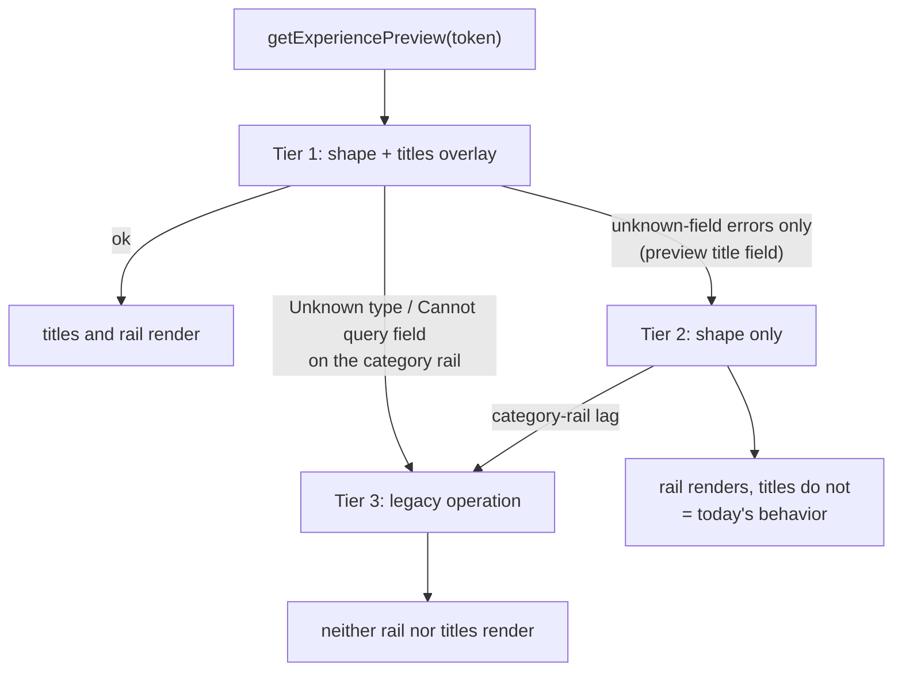
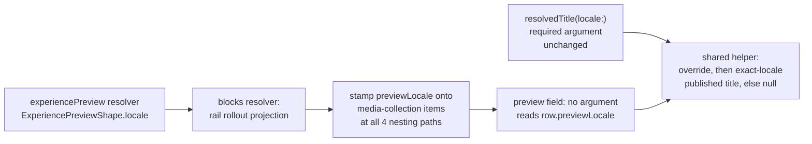

# Experience Draft Preview Card Titles - Plan

## Goal Capsule

**Objective:** A content editor opening a draft-preview link sees the same media-collection card titles a visitor would see on the published page, so the preview can be trusted to represent the live result.

**Means:** Resolve the title inside Admin through a preview-scoped field bound to the preview's own locale, and select it from Web's preview operation (KTD1, KTD2).

**Authority hierarchy:** Product behavior follows the R-IDs. Implementation mechanism follows the KTDs within those R constraints. Units override neither.

**Stop conditions:**

- Stop and report if the deploy-window degrade in R7 cannot be made to work — shipping a preview operation that hard-fails against the current production Admin is worse than the bug being fixed.
- Stop and report if the preview-scoped field cannot be added without changing the canonical shared fragments in `packages/admin-graphql`, which would put a title resolver on Mobile and TV operations.

**Execution profile:** One PR. Admin schema change plus Web operation change, shipped together with regenerated GraphQL artifacts.

**Tail ownership:** LFG owns commit, PR, and CI.

---

## Product Contract

### Summary

Add a preview-scoped, no-argument title field on `MediaCollectionItem` that shares one resolution helper with `resolvedTitle`, stamp the preview's locale onto media-collection items when Admin resolves `ExperiencePreview.blocks`, and select the new field from Web's preview operation under a `resolvedTitle` alias behind a schema-lag fallback. Draft preview then renders card titles identically to the published Watch pages.

### Problem Frame

Media-collection cards on `/watch/preview/experience/<token>` render with an image and a label but no title. The published Watch pages render the same blocks with titles.

The divergence dates to PR #1664 (commit `d9aedd1f5`, feat-280). Before it, `apps/web/src/lib/enrichment.ts` derived a card title from `item.titleOverride`, a field the canonical shared fragment selects. That PR moved the title source to `item.resolvedTitle`, a computed Admin field resolved against a requested locale. `resolvedTitle` was deliberately kept out of the canonical shared fragment in `packages/admin-graphql/src/fragments/blocks/media-collection.ts` so Mobile and TV operations do not execute the resolver. Web re-adds it through a Web-local overlay fragment, `apps/web/src/lib/fragments/watch-media-collection-titles.ts`, which `apps/web/src/lib/fragments/watch-experience.ts` composes into the published operations in `apps/web/src/lib/content.ts`.

`apps/web/src/lib/experience-preview.ts` was never composed with that overlay. Its operations select the canonical fragments only. Preview items therefore arrive with `resolvedTitle` absent, `enrichMediaItem` resolves the title to the empty string, and the card renders with no heading. The `COLLECTION` label still renders because `labelOverride` is in the canonical fragment — the exact split visible in the reported screenshot.

The feat-280 requirement set names its Web surfaces explicitly: "Web homepage, top-level Experience, nested Section, and nested Container media collections". Draft preview was not in that list and no test covered it, so the gap shipped silently and survived every subsequent change.

The blocker to a one-line fix is that `resolvedTitle` takes a required `locale` argument, and Web's preview page does not know the locale until the response arrives. `experiencePreview(token:)` returns the locale as a field of its own result, and GraphQL has no way to bind one field's value into a sibling field's argument.

### Requirements

- R1. Draft preview renders a media-collection card title whenever the published page would render one for the same Experience locale.
- R2. Title resolution for preview uses the same code path as published resolution, so the two cannot diverge in behavior.
- R3. A nonblank authored `titleOverride` wins over linked-Video copy on the preview path, matching published behavior.
- R4. With no usable title, preview omits the card heading rather than rendering a placeholder, preserving feat-280 R9.
- R5. Preview resolves titles against the locale of the previewed `ExperienceLocale`. No caller-supplied argument can select a different locale for a preview title.
- R6. Preview covers all four media-collection nesting paths: top level, inside `ContainerBlock.content`, inside `SectionBlock.content`, and inside `SectionBlock.content` then `ContainerBlock.content`.
- R7. During a deploy window where Web runs the new operation against an Admin that predates this change, preview degrades to today's behavior — cards without titles — and never fails the page.
- R8. Mobile and TV operations gain no title field and execute no title resolver.
- R9. The published path's behavior and wire text are unchanged.

### Key Decisions

- **Resolve the preview title inside Admin against the preview's own locale.** (session-settled: user-approved — chosen over a two-step Web fetch that first reads `experiencePreview(token){ locale }` and then re-queries with `$locale` bound: a second round trip on every preview render, and two places that can disagree about which locale the titles were resolved in.) Governs R2, R5.
- **Preview restores both the authored override and the linked-Video fallback title.** (session-settled: user-approved — chosen over restoring only the override by reading `titleOverride` client-side in `enrichment.ts`: that reverts feat-280 for preview only, so preview would then disagree with published for every item with no authored override.) Governs R2, R3.
- **Preview gets its own selection-parity guard.** (session-settled: user-approved — chosen over relying on the existing published-path guard in `apps/web/src/lib/fragments/__tests__/watch-experience.test.ts`: that guard's blindness to the preview operation is why published never regressed and preview silently did.) Governs R6.

### Success Criteria

- Opening a draft preview of an Experience whose published twin shows card titles shows the same titles, in the same order, with the same authored-override precedence.
- Deleting the titles-overlay spread from the tier-1 operation, or deleting any one of its four nesting-path selections, turns a test red. The shape-only and legacy operations stay pinned to select no title field.

### Scope Boundaries

In scope: the new preview-scoped title field on `MediaCollectionItem`, Admin's `ExperiencePreview.blocks` projection, Web's preview operations and their fallback ladder, and the tests for all three.

Out of scope:

- The published operations in `apps/web/src/lib/content.ts` and the overlay in `apps/web/src/lib/fragments/watch-media-collection-titles.ts`. They work; touching them widens the blast radius for no gain.
- The canonical shared fragments in `packages/admin-graphql`. Widening them is what R8 forbids. `resolvedTitle`'s own signature is also out of scope — KTD1 leaves its required argument intact.
- `VideoCarouselBlock` items, which carry `titleOverride` and no `resolvedTitle` on any path. Preview and published agree there, so there is no regression to fix.
- `DynamicMediaCollection`, which synthesizes `resolvedTitle` from the feed API response and is unaffected.
- Preview token issuance, expiry, and auth.

#### Deferred to Follow-Up Work

- Extracting a shared block-selection fragment for the legacy preview operation so the two full selections in `apps/web/src/lib/experience-preview.ts` stop being maintained by hand. U2 extracts one for the current-schema pair only; the legacy operation keeps its own copy. Its existing "keep this selection identical to EXPERIENCE_PREVIEW" comment does need rewording in U2, because that operation becomes a fragment spread and the comment would otherwise point at a selection that is no longer written there.
- An Admin-side guard that a new computed field on a block type reachable from `ExperiencePreview` is selected by the preview operation too. This class of bug is the second instance (feat-280, then this); a structural guard would retire it. Out of scope here because it needs a design pass of its own.

### Acceptance Examples

- AE1. An Experience locale `en` has a media collection whose item links a Video with a published `en` title "Jesus Calms the Storm" and no `titleOverride`. Its draft preview renders "Jesus Calms the Storm" on the card.
- AE2. The same item carries `titleOverride: "Day One"`. Preview renders "Day One".
- AE3. The same item carries `titleOverride: "   "` and the linked Video has a published `en` title. Preview renders the Video title, not the whitespace.
- AE4. The linked Video has no published title in the preview's locale. Preview renders the card with no heading and an intact image and link.
- AE5. Web runs the new operation against an Admin that lacks the preview field. The Admin returns `Cannot query field "<preview-field>" on type "MediaCollectionItem".` once per nesting path. Preview renders the page with cards and no titles.
- AE6. An Admin returns an unknown-field error for some other field on `MediaCollectionItem`, or returns a preview-field error alongside an unrelated error. Neither case silently degrades to the titleless render.

### Sources

- `d9aedd1f5` (PR #1664) — the commit that moved the title source and did not touch `apps/web/src/lib/experience-preview.ts`.
- `docs/plans/2026-07-21-003-fix-watch-media-collection-linked-titles-plan.md` — feat-280's plan; its R7 enumerates the four Web surfaces and omits preview.
- `docs/solutions/architecture-patterns/widening-a-closed-selection-block-into-an-authored-list-20260827.md` §2 — the binding precedent for extending a schema-lag matcher and pinning its negative case.
- `apps/admin/src/graphql/types/blocks.ts` — `MediaCollectionItemRef` and the `resolvedTitle` resolver.
- `apps/admin/src/graphql/types/experience.ts` — `ExperiencePreviewRef` and its `blocks` resolver.
- `apps/admin/src/services/watch-home-category-rail-rollout.ts` — the existing pure block-projection helper this plan mirrors.

---

## Planning Contract

### Key Technical Decisions

- KTD1. **Add a preview-scoped no-argument title field beside `resolvedTitle`, both delegating to one shared resolution helper.** `resolvedTitle(locale: String!)` keeps its required argument. The new field takes no argument and reads the preview-stamped locale off the item row, so R5 holds by construction — there is no argument through which a caller could select a different locale. Rejected: widening `locale` to optional on the existing field. That reads as the smaller diff but trades a permanent, global compile-time guarantee — every consumer of `resolvedTitle`, forever — for one caller's transport convenience, and its failure mode is a silent null rather than a validation error. The shared helper is what keeps R2 (preview and published cannot diverge); one field versus two was never what bought it. Governs R2, R5, R8.
- KTD2. **Stamp the preview locale onto media-collection items in a pure projection over the blocks array, not on the GraphQL context.** A context-mutating alternative (`ctx.previewLocale` set by the parent resolver) relies on parent-before-child resolution order and breaks when a document aliases two `experiencePreview` calls, where last-write-wins silently mixes locales. A pure projection is order-independent, aliasing-safe, and unit-testable without a GraphQL execution harness. Governs R5, R6.
- KTD3. **Add a third fallback tier to Web's preview ladder rather than a deploy-ordering note.** `apps/web/src/lib/experience-preview.ts` already runs a two-tier ladder for category-rail schema lag. The new title field introduces a second, independent lag axis. Admin and Web are separate Railway services autodeploying from the same merge; nothing in the repo orders them, and Admin carries Prisma migrations that typically make it the slower of the two. Rejected: splitting delivery into an Admin-first PR and a Web PR merged after Admin is live, which would need no third tier. It trades a permanent ~40-line compatibility surface for a two-merge coordination ritual that a future contributor cannot see and will not repeat, and the repo's own feat-439 learning already binds this case to the matcher-extension answer. Governs R7.
- KTD4. **The title-lag fallback retries the current-schema operation without the overlay, not the legacy operation.** The legacy operation also drops `WatchHomeCategoryRailBlock`. Falling back to it for a title-only lag would remove a rendering block that the lagging Admin can still serve. Governs R7.
- KTD5. **The titles overlay goes on the current-schema preview operation only; the legacy operation stays title-free.** The legacy tier fires only for an Admin that predates `WatchHomeCategoryRailBlock` (shipped 2026-08-26, PR #1994). Any such Admin necessarily also predates this change, so a title selection there could never validate — composing the overlay onto it would make the fallback itself throw. Governs R7.
- KTD6. **Classify schema lag over the complete GraphQL error array, not the first matching entry.** The tier-1 operation selects the title field at four nesting paths, so a lagging Admin returns four unknown-field errors, and an Admin lagging on both axes returns title and category-rail errors together. A `some()` matcher would route a mixed set on whichever pattern it happened to hit and would silently swallow an unrelated error riding along with a title error. Route on the whole set: title-lag errors only go to tier 2; any category-rail error present goes to the legacy tier; any error matching neither pattern stays fatal. Governs R7.

Note on KTD5: the invoking brief proposed keeping both preview operations in lockstep. That entry was an agent inference, not a user-examined decision, so it carries no settled label. Research inverted it: lockstep is not neutral here, it is actively harmful, because the two lag axes are ordered in time.

### Assumptions

These are un-validated bets made without confirmation.

- The reported screenshot is a homepage-shaped preview (`isHomepage: true`), which composes through `WatchHomeExperiencePage`. Media-collection items reach `enrichMediaItem` on both the homepage and ordinary preview paths, via `apps/web/src/lib/watch-home-visible-content.ts` and `apps/web/src/components/sections/MediaCollection.tsx` respectively, so one selection fix covers both. The units do not branch on `isHomepage`.
- Published-only title resolution (`visibleOnly: true` in the existing resolver) is correct for draft preview. The draft axis belongs to the Experience, not to the linked Video's locale rows, and R2 requires preview to match published.
- Browser verification is not reachable from a worktree: there is no Admin GraphQL endpoint and preview needs a live signed token. The Verification Contract relies on unit and integration coverage plus the reviewer's own preview link.

### High-Level Technical Design

Web's fallback ladder — which operation runs, and what each degrade costs:

Admin's resolution path — two title fields, one shared helper, and where the preview locale enters:

### System-Wide Impact

The change touches the shared Admin GraphQL schema, so the repo's GraphQL change flow applies: `pnpm --filter @forge/admin schema:print` regenerates `apps/admin/schema.graphql`, then `pnpm --filter @forge/admin-graphql generate` regenerates `packages/admin-graphql/src/admin-graphql-env.d.ts`. Both artifacts commit with the source. CI's `admin-schema-drift` and `admin-graphql-generate` jobs fail if either is stale.

A new field is visible in the SDL diff, so drift CI sees this change. That is different from the `authScopes` case in `docs/solutions/graphql/pothos-public-widening-multi-layer-coordination-20260511.md`, where the SDL printer strips the signal.

Mobile and TV are unaffected: neither selects `resolvedTitle`, `resolvedTitle`'s signature does not move, and an added field changes no operation that does not select it.

### Risks & Dependencies

- The `MediaCollectionItemSchema` Zod object is `.strict()`, so a stamped extra property would be rejected if the item were re-parsed. Stamping happens in the GraphQL `blocks` resolver, after `ExperienceLocaleDraftSnapshotSchema.safeParse` has already run in `apps/admin/src/services/experience-preview.service.ts`. U1 must not move stamping upstream of that parse, and must not add `previewLocale` to the persisted schema.
- Making the unknown-field pattern too loose turns the classifier into a catch-all that hides unrelated Admin errors behind a silent title drop. The pattern is anchored to the exact field and parent type, KTD6 routes on the whole error set rather than the first match, and AE6 pins both negative cases.
- The exact validation message is a graphql-js contract. It was verified against the repo's own `graphql` package on 2026-08-29 by validating a selection of a field absent from the schema, which produced `Cannot query field "<name>" on type "MediaCollectionItem". Did you mean "resolvedTitle"?` with no `path`. Match on the `Cannot query field "<name>" on type "MediaCollectionItem"` prefix only — the `Did you mean` tail is a suggestion heuristic that varies with the schema's other field names and must not be part of the pattern. This is the same error shape the existing category-rail matcher already handles, which is why KTD1's field-shaped change is cheaper to detect than an argument-shaped one. A graphql-js major bump could reword it; the fallback then stops firing and preview returns to a hard failure in the deploy window only.

---

## Implementation Units

### U1. Admin resolves a preview-scoped title

**Goal:** A media-collection item reached through `ExperiencePreview` resolves the same title the published path would resolve for that Experience locale, with no argument supplied by the caller.

**Requirements:** R2, R3, R5, R8, R9

**Dependencies:** none

**Files:**

- `apps/admin/src/graphql/types/blocks.ts` — extract the shared resolution helper, add the preview-scoped field, widen the ref's backing type.
- `apps/admin/src/graphql/types/experience.ts` — apply the stamping projection in the `ExperiencePreview.blocks` resolver, after the existing rail-rollout projection.
- `apps/admin/src/services/experience-preview-blocks.ts` — new pure stamping helper.
- `apps/admin/src/services/experience-preview-blocks.test.ts` — new.
- `apps/admin/src/graphql/types/blocks.test.ts` — extend the existing `MediaCollectionItem resolvedTitle resolver` describe block.
- `apps/admin/schema.graphql` — regenerated.

**Approach:**

1. Extract today's `resolvedTitle` resolver body — override-wins, then exact-locale published title, else null — into one helper taking `(row, locale, ctx)`. Change no behavior. This helper is what makes R2 structural: both fields call it, so neither can drift.
2. Leave `resolvedTitle(locale: String!)` exactly as it is apart from delegating to the helper. Its signature is unchanged, so no existing consumer or generated type moves (KTD1).
3. Add the preview-scoped field with no arguments. It reads a non-persisted `previewLocale` off the row and returns null when absent, before any loader call. Give it a description saying it resolves against the previewed Experience locale and is null outside a preview.
4. Widen the ref's backing type to the authored item plus an optional `previewLocale`. Keep `MediaCollectionItemSchema` in `apps/admin/src/domain/blocks.ts` untouched — the stamp is a read-time projection, not stored state, and that schema is `.strict()`.
5. Write the stamping helper as a pure function over the blocks array that recurses into `container.content` and `section.content`, and into `container.content` nested inside `section.content`. Return a new array, copying only the blocks it touches, and pass any non-array or unrecognized entry through untouched.
6. Call the helper in the `ExperiencePreview.blocks` resolver with `row.locale`, after `resolveWatchHomeCategoryRailReadBlocks`.

**Patterns to follow:** `resolveWatchHomeCategoryRailReadBlocks` in `apps/admin/src/services/watch-home-category-rail-rollout.ts` — a pure block projection returning `unknown`, cast at the resolver boundary, guarding `Array.isArray` before it touches anything.

**Test scenarios:**

- Covers AE1. A stamped item with no override whose linked Video has a published title in the stamped locale resolves to that title from the preview field.
- Covers AE2. A nonblank `titleOverride` wins over linked-Video copy on the preview field.
- Covers AE3. A whitespace-only `titleOverride` falls through to the linked-Video title on the preview field.
- Covers AE4. A linked Video with no published title in the stamped locale resolves to null.
- The preview field and `resolvedTitle` called with that same locale return identical results across one shared table of fixtures — the anti-divergence pin for R2. Include the override, whitespace-override, fallback, and null cases in that table.
- An unstamped row resolves the preview field to null without calling the Video or locale loaders.
- Covers AE4. An item with no `videoId` resolves to null on both fields.
- An item whose linked Video is soft-deleted resolves to null on both fields.
- `resolvedTitle`'s own behavior is unchanged, asserted by the existing suite continuing to pass untouched.
- Stamping reaches a media-collection item at the top level.
- Stamping reaches one inside `container.content`.
- Stamping reaches one inside `section.content`.
- Stamping reaches one inside `section.content` then `container.content`.
- Stamping leaves non-media-collection sibling blocks byte-identical, asserted on a fixture holding a text block, a promo banner, and a video hero.
- Stamping returns without throwing for an empty array, an array with no media collection, a non-array input, and an array containing `null` and a block with no recognized `t`.
- **Wiring:** executing the `ExperiencePreview.blocks` resolver against a preview row carrying a media-collection item yields an item whose preview field resolves through the row's locale. This is the only test that fails when the stamping call is dropped from the resolver — the four nesting-path tests above call the helper directly and would all stay green.
- The published `ExperienceLocale.blocks` path stamps nothing, so an item reached that way resolves the preview field to null rather than borrowing a locale.

**Verification:** The extended `blocks.test.ts` and the new helper suite pass. `pnpm --filter @forge/admin schema:print` produces a diff that adds one field and changes no existing signature.

---

### U2. Web selects the preview title behind a schema-lag fallback

**Goal:** Web's preview operation requests the preview title, and an Admin that cannot serve it degrades to today's titleless render instead of failing the page.

**Requirements:** R1, R4, R6, R7

**Dependencies:** U1

**Files:**

- `apps/web/src/lib/fragments/preview-media-collection-titles.ts` — new overlay fragment on `ExperiencePreview`.
- `apps/web/src/lib/experience-preview.ts` — extract the current-schema shape fragment, add the with-titles operation, extend the fallback ladder and its classifier.
- `apps/web/src/lib/experience-preview.test.ts` — extend.
- `apps/web/src/lib/fragments/__tests__/preview-experience.test.ts` — new selection-parity guard.
- `packages/admin-graphql/src/admin-graphql-env.d.ts` — regenerated.

**Approach:**

1. Write the overlay fragment on `ExperiencePreview`, selecting the preview field under the response alias `resolvedTitle` through all four nesting paths. The alias is load-bearing: it keeps `enrichMediaItem` and every downstream consumer unchanged. Mirror the shape of `watchMediaCollectionTitlesFragment`, including its `sectionContent` alias, so the two read the same.
2. Extract today's `EXPERIENCE_PREVIEW` selection into one local fragment on `ExperiencePreview`. Both current-schema operations spread it, so the field list is maintained once. Leave `LEGACY_EXPERIENCE_PREVIEW`'s selection alone per KTD5, but reword its "keep this selection identical to EXPERIENCE_PREVIEW" comment to name the extracted fragment instead.
3. Add the with-titles operation as tier 1. Tier 2 is the existing shape-only operation. Tier 3 is the existing legacy operation.
4. Replace the ladder's first-match classification with whole-error-set routing per KTD6, keeping the existing `path == null` and validation-code discipline. The title pattern matches `Cannot query field "<preview-field>" on type "MediaCollectionItem"` as a prefix — never the `Did you mean` tail.
5. Preserve the existing capability-redacting error behavior. No tier may put the token in an error, and no tier may retry more than once.

**Execution note:** Write the deploy-window tests first. That behavior cannot be observed locally after the fact, and it is the entire reason the tier exists.

**Test scenarios:**

- The with-titles operation selects the preview field at exactly the four nesting paths, asserted as an ordered path list in the style of `collectResolvedTitlePaths`.
- Every one of those selections uses the `resolvedTitle` response alias, so the enriched item shape is unchanged.
- The with-titles operation passes no arguments to the preview field.
- The legacy operation and the shape-only operation select no title field at all, pinning KTD5.
- Both current-schema operations spread the same shape fragment.
- The extracted shape fragment's selection is unchanged from the pre-refactor operation, asserted against the printed selection set. Tier 2 is the fallback, so an extraction error would break the primary and its fallback together.
- Covers AE5. Four unknown-field errors for the preview field — one per nesting path — retry the shape-only operation once and return its data.
- Covers AE6. An unknown-field error naming a different field on `MediaCollectionItem` does not trigger the title fallback.
- Covers AE6. A set mixing preview-field errors with one unrelated error stays fatal rather than degrading, so an unrelated Admin failure is never swallowed by the title path.
- A set mixing preview-field errors with a category-rail error routes to the legacy tier, not to tier 2.
- An unknown-field error for the preview field carrying a non-null `path` is treated as a runtime error, not schema lag.
- A category-rail `Unknown type` error from tier 1 goes to the legacy operation, not to tier 2.
- A category-rail `Cannot query field "tiles"` error from tier 1 goes to the legacy operation.
- A tier-2 response that then hits category-rail lag falls through to the legacy operation.
- No tier retries more than once for the same error, extending the existing never-retries-twice test.
- An unrelated network failure still throws the redacted error and does not walk the ladder.
- The token appears in no thrown error from any tier.
- Covers AE5. When every tier that can serve titles is unavailable, the returned shape is the same one today's code returns, so the page renders.

**Verification:** The extended preview suite and the new parity suite pass. `pnpm --filter @forge/admin-graphql generate` leaves no diff after being run.

---

### U3. Pin that both preview paths forward the title to their renderer

**Goal:** A test fails if the preview page drops or reshapes `resolvedTitle` before the renderer sees it, on either the ordinary or the homepage path.

**Requirements:** R1, R4

**Dependencies:** U1, U2

**Files:**

- `apps/web/src/app/(preview)/preview/experience/[token]/page.test.tsx` — extend.

**Approach:**

1. Give the shared `draft` fixture a media-collection block whose items carry `resolvedTitle`, alongside the existing text block.
2. Assert the ordinary path forwards that item shape to `ExperienceSectionRenderer` unchanged.
3. Assert the homepage path forwards the same shape to both `resolveWatchHomePreview` and `WatchHomeExperiencePage`, since the homepage composition reads items through `apps/web/src/lib/watch-home-visible-content.ts` rather than `MediaCollection` directly.

This unit asserts at the props boundary, not the DOM. That is a deliberate scope limit, not an omission: the suite mocks `ExperienceSectionRenderer` and `WatchHomeExperiencePage` at module level, and DOM-level title rendering for the enriched shape — present, null, and whitespace-only `resolvedTitle` — is already covered against real DOM in `apps/web/src/components/sections/MediaCollection.test.tsx`. Duplicating that here would add a second copy of a guard that already exists, and unmocking the renderers would rewrite a suite this change has no other reason to touch. The chain is: U2 proves the field is requested, U1 proves it resolves, U3 proves the page forwards it, and the existing MediaCollection suite proves it renders.

**Test scenarios:**

- Covers AE1. The ordinary preview path forwards a media-collection block whose item carries `resolvedTitle` to the section renderer, with the item shape unchanged.
- Covers AE1. The homepage preview path forwards the same block to `WatchHomeExperiencePage` and passes it to `resolveWatchHomePreview` as staged blocks.
- Covers AE4. An item with `resolvedTitle: null` is forwarded as null rather than being dropped from the items array or coerced to a string.
- The block list reaching each renderer preserves item order.

**Verification:** The preview page suite passes, and the forwarding assertions fail if the fixture's `resolvedTitle` is stripped between the page and the renderer.

---

## Verification Contract

Run from the repo root, with the toolchain on PATH:

- `pnpm --filter @forge/admin test` — U1's resolver and stamping coverage.
- `pnpm --filter @forge/web test` — U2's ladder and parity coverage, U3's forwarding coverage, and the existing `MediaCollection.test.tsx` render coverage the chain depends on.
- `pnpm --filter @forge/admin schema:print` then `git diff --exit-code apps/admin/schema.graphql` — must be clean after the generated file is committed.
- `pnpm --filter @forge/admin-graphql generate` then `git diff --exit-code packages/admin-graphql/src/admin-graphql-env.d.ts` — must be clean after the generated file is committed.
- `pnpm --filter @forge/admin typecheck` and `pnpm --filter @forge/web typecheck`.

Falsification gate, run once by hand and not left in the suite. Each guard is falsified where it actually binds, because U3 runs on fixtures and cannot see a change to the operation text:

- Delete the overlay spread from the tier-1 operation. U2's parity test must go red. A parity test that stays green against a stripped operation is guarding nothing.
- Drop one nesting path from the overlay fragment. U2's ordered-path assertion must go red, not just a count.
- Drop the `resolvedTitle` response alias from one selection. U2's alias test must go red — without it the field arrives under a name nothing reads.
- Remove the stamping call from the `ExperiencePreview.blocks` resolver. U1's wiring test must go red. Confirm the four nesting-path helper tests stay green here: that asymmetry is the whole reason the wiring test exists, and if they go red too, they are not testing what they claim.
- Point the preview field's resolver at a hardcoded locale instead of the row's. U1's shared-fixture equivalence table must go red.

No page-load performance evidence is required. The change adds one already-batched resolver field to a `force-dynamic`, `revalidate: 0` route that no visitor reaches, and adds no client-side code.

## Definition of Done

Global:

- R1 through R9 hold.
- Both regenerated GraphQL artifacts are committed in the same change as their source.
- The falsification gate above was run and observed red.
- No abandoned approach is left in the diff — in particular, no `ctx`-based locale threading from KTD2's rejected alternative, no optional-argument variant of `resolvedTitle` from KTD1's rejected alternative, and no fourth preview operation beyond the tier introduced by KTD3.
- `docs/plans/2026-07-21-003-fix-watch-media-collection-linked-titles-plan.md` is left untouched. It is a completed record, not a live instruction.

Per unit:

- U1: the preview field and `resolvedTitle` return identical results across the shared fixture table, `resolvedTitle`'s signature is unchanged, stamping reaches all four nesting paths, and the wiring test pins the resolver's stamping call.
- U2: the tier-1 operation selects the preview field at four paths under the `resolvedTitle` alias, a pure preview-field error set degrades rather than throws, and a set carrying an unrelated error stays fatal.
- U3: Both preview paths forward a `resolvedTitle`-bearing item to their renderer unchanged, and a null title survives as null.
