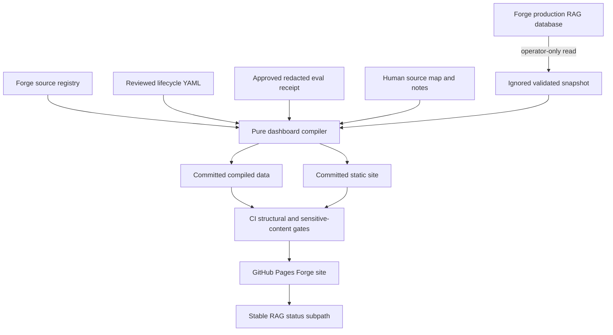
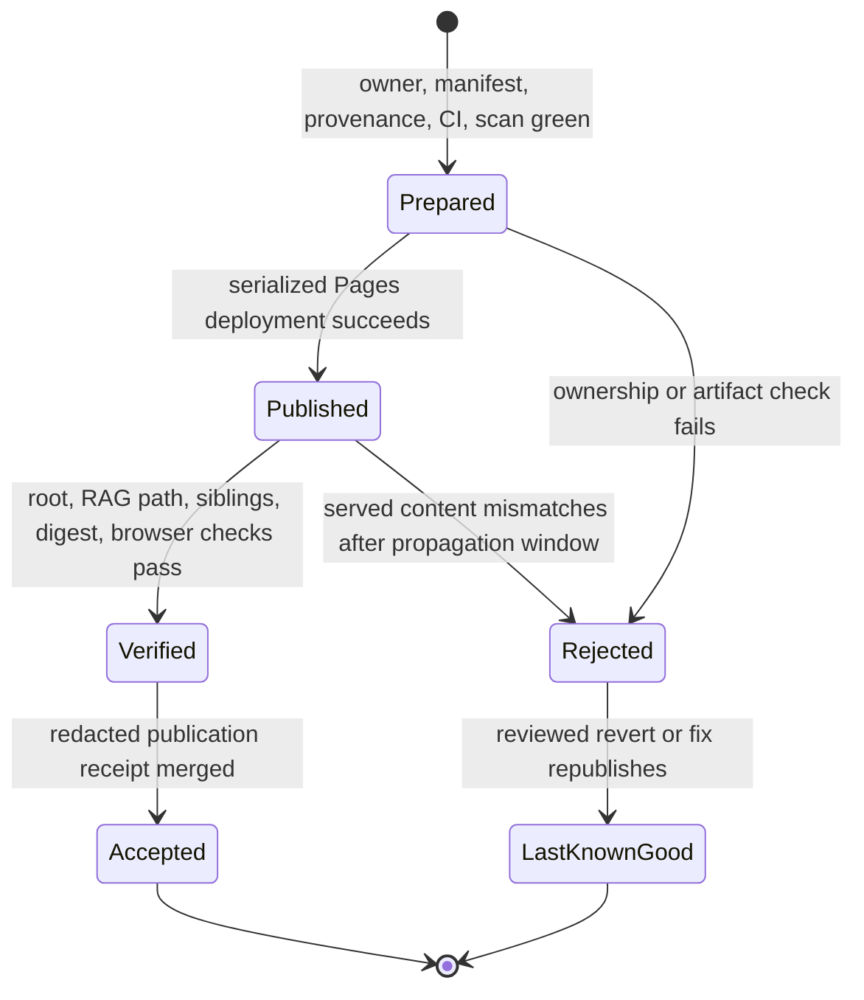
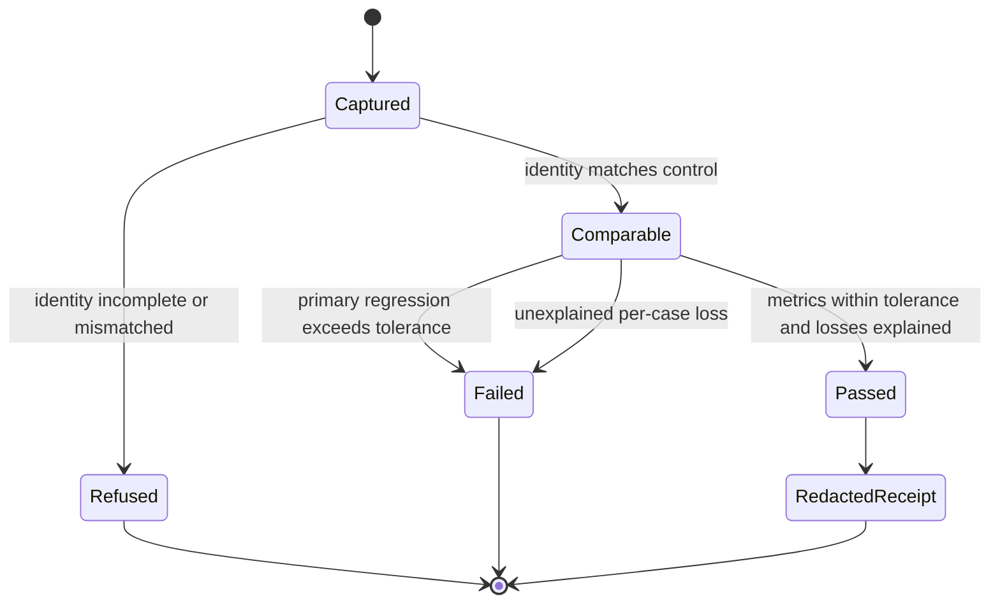
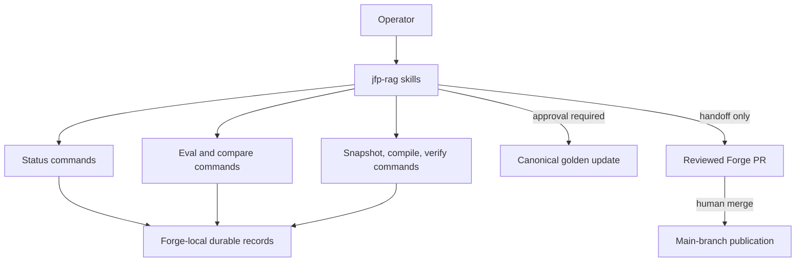

# RAG Operations, Dashboard, and Evaluation - Plan

## Goal Capsule

- **Objective:** Forge owns the durable source-status, operator-skill, public-dashboard, and retrieval-quality surfaces needed to operate and verify the migrated RAG corpus.
- **Means:** Adapt the standalone repository's deterministic status, evaluation, and static-dashboard pipeline to `apps/rag`; package the operator workflows as a Forge plugin; publish committed static artifacts through a monorepo-aware GitHub Pages workflow (KTD1-KTD9).
- **Authority:** The migration rulings in `JesusFilm/jesusfilm-rag#130` and the outcome in `JesusFilm/jesusfilm-rag#165` govern scope; Forge RAG boundaries and production-safety instructions govern implementation; this plan resolves the remaining technical shape.
- **Execution profile:** Deep, migration-sensitive code and operational work spanning deterministic data artifacts, agent skills, CI, public hosting, and production-read verification.
- **Stop conditions:** Stop rather than publish when the production snapshot is unvalidated, the eval identity differs from the control, primary metrics exceed tolerance, a generated artifact contains sensitive content, or the Pages site ownership/environment cannot be approved.
- **Tail ownership:** The implementation owns a reviewed PR, browser and performance evidence for the public page, redacted local/production eval receipts, and completion updates to the existing RAG roadmap ticket. It does not directly merge or deploy production code.

---

## Product Contract

### Summary

Forge will own the source lifecycle ledger, deterministic status writers, golden retrieval evaluation, public corpus-status dashboard, and the `/slice`, `/golden`, and `/status-dashboard` operator workflows. The dashboard will remain a reviewed static snapshot rather than a live database application, and migration acceptance will compare like-for-like local and Forge-production eval runs with the retained pre-copy control.

### Problem Frame

The corpus and its maintenance code have moved into Forge, but the human-facing source record, operator workflows, public status surface, and golden retrieval instrumentation still live in the standalone repository. Without these surfaces, Forge cannot honestly show what is acquired, indexed, and evaluated, agents cannot operate the workflow from durable Forge-local state, and later cutover work lacks a migration-quality gate.

### Requirements

#### Source status and shared workspace

- R1. Forge must hold a machine-validated source-and-language lifecycle record covering acquire, ingest, retrieve, and evaluate, while production inventory remains database-derived rather than asserted by that record.
- R2. Only deterministic commands may mutate the lifecycle record; they must validate stage order and blocked-state invariants, derive rollups, preserve human notes, and update the record atomically.
- R3. Existing Forge registry adaptations are authoritative. Implementation must inventory and reconcile the standalone status/source documentation against `apps/rag/src/registry/` rather than recopying the registry.

#### Retrieval evaluation

- R4. Forge must own the golden cases and retrieval-only metric implementation for whole-corpus top-10 evaluation, including recall@10 and coverage as primary metrics and recall@3, MRR, precision@1, per-source, per-language, and evidence-tier breakdowns as diagnostics.
- R5. Local and Forge-production comparison runs must bind the same golden revision, registry/corpus identity, embedding model, query instruction, top-k, minimum score, and metric implementation before a comparison is valid.
- R6. Migration passes only when recall@10 and coverage do not regress by more than 2% relative to the retained pre-copy control and no per-case loss remains unexplained. The retained control is 416 cases at recall@10 `1.000` and coverage `0.887`, implying provisional floors of `0.980` and `0.86926` for an identity-matched run.
- R7. Committed eval evidence must contain aggregate identity and metrics only; questions, retrieved text, top-hit content, embeddings, credentials, connection strings, and bearer values must remain outside git and agent transcripts.
- R16. Eval reports must identify environment and run uniquely, write atomically only after every case completes, and never overwrite another local, control, or production attempt.

#### Dashboard and public status

- R8. The public dashboard must merge a validated production-read snapshot with the reviewed lifecycle record and canonical registry into deterministic committed JSON and HTML artifacts.
- R9. The dashboard must report every canonical source, declared languages, acquired/ingested/evaluated state, embedded-document counts, and unclassified-language counts without treating an assertion as a verified database fact.
- R10. Production snapshot generation must accept the namespaced `JFRAG_POSTGRESQL_DB_URL` through the existing `forge-rag/prd` Doppler contract, run read-only, fail closed when the target is absent or wrong, and write nothing on validation failure.
- R11. CI and public deployment must consume only committed, already-redacted static artifacts. They must never receive a production database credential or query production.
- R12. The public page must be available at a stable Forge-owned URL, match its compiled data in both structural and real-browser checks, remain usable without client-side network requests, and avoid a meaningful page-load regression.
- R17. Published artifacts must carry non-secret target, fetch-time, schema-version, and source-commit provenance; a malformed or missing production snapshot must abort refresh rather than reuse stale or development data silently.
- R18. Public compilation must use a versioned allowlist schema and contextual encoding so unexpected fields, internal notes, credentials, corpus content, unsafe URLs, and executable markup cannot enter the Pages artifact.
- R19. Production eval/dashboard access must use a dedicated least-privilege database principal and a read-only session or transaction, with parameterized, bounded queries and closed identifier choices.
- R20. The repository must have one Pages publisher and one deterministic site assembler that maps declared producers to unique subpaths, rejects collisions and unsafe entries, and reproduces the complete site from the checked-out commit.

#### Agent workflows and governance

- R13. Forge must provide provider-neutral `/slice`, `/golden`, and `/status-dashboard` workflows through a repository-owned plugin, with monorepo-safe commands and Forge-local durable state.
- R14. Skills may orchestrate deterministic commands and reviewed artifact changes, but must not reveal secrets, hand-edit the lifecycle YAML, merge their own PRs, publish local worktree code, or bypass the explicit approval gate before canonical golden-case writes.
- R15. Implementation must update the existing `feat-432` roadmap record and its hand-maintained lane index; it must not register the RAG lane in the public roadmap viewer or create new standalone-repository tracking issues.
- R21. Each skill must enforce a capability and approval matrix: local read-only checks may run autonomously; vault-backed production access, canonical golden writes, public-schema changes, PR merge, and Pages deployment require fresh authority scoped to the exact target and operation.
- R22. Pages publication must progress through prepared, published, verified, and accepted states; only an accepted, redacted receipt tied to a commit and artifact digest may satisfy later migration tickets.
- R23. A failed public release must preserve or restore the last-known-good site through the normal reviewed main-branch workflow, with platform-level unpublish reserved for sensitive-content containment by the repository owner.

### Actors

- A1. **RAG operator** refreshes status/eval data, reviews evidence, and approves golden changes and PR merges.
- A2. **Agent workflow** resumes from Forge-local artifacts and orchestrates bounded deterministic commands under the operator's approvals.
- A3. **Stakeholder reader** uses the public dashboard to understand corpus coverage without needing repository or production access.
- A4. **CI/Pages publisher** verifies committed artifacts and publishes them without production credentials.

### Key Flows

- F1. **Lifecycle update:** A2 reads the active source/slice state, invokes a deterministic status command, the command validates and atomically updates the lifecycle record, and CI revalidates the full record. Covers R1-R3, R13-R14.
- F2. **Golden evaluation:** A1 or A2 runs an identity-bound retrieval eval, reviews detailed output locally, and commits only a redacted aggregate receipt after the comparison gate passes. Canonical golden writes require A1 approval. Covers R4-R7, R13-R14.
- F3. **Dashboard refresh:** A2 injects the production-read credential directly into the snapshot command, validates the ignored snapshot, compiles deterministic artifacts, verifies them structurally and in a browser, and opens a reviewed Forge PR. Covers R8-R12, R14-R15.
- F4. **Public publish:** A4 receives a main-branch change limited to the Pages site/workflow, uploads the committed static site, and exposes the RAG page at its stable subpath without a database or application runtime. Covers R11-R12.

### Acceptance Examples

- AE1. Given no `JFRAG_POSTGRESQL_DB_URL` is injected, when the production dashboard snapshot command runs, then it refuses the operation and leaves no new snapshot or public artifact.
- AE2. Given a source/language whose ingest stage is still pending, when a caller tries to mark retrieve green, then the status command rejects the transition and preserves the existing YAML.
- AE3. Given the same validated snapshot and reviewed status inputs, when the dashboard compiler runs twice, then the committed JSON and HTML outputs are byte-identical and use the snapshot timestamp rather than the build clock.
- AE4. Given an eval run with a different golden revision, model, query instruction, top-k, or minimum score from the control, when comparison is requested, then the result is refused rather than classified as pass or regression.
- AE5. Given an identity-matched Forge-production eval below either primary-metric floor or with an unexplained lost case, when migration evidence is produced, then the receipt records failure and `feat-432` remains incomplete.
- AE6. Given a merged dashboard refresh, when a stakeholder opens the stable Pages URL, then visible source, language, document, and unclassified counts agree with the committed compiled data and the page loads without runtime API calls.

### Success Criteria

- Forge-local skills call Forge-local commands and can resume from durable files without standalone-repository paths or chat history.
- The local copied corpus and Forge production corpus pass an identity-bound comparison against the pre-copy control within the recorded tolerance.
- The public dashboard accurately represents the migrated corpus, passes structural and browser checks, and is published from `main` without production secrets or a new Railway runtime.
- Later dual-operation and Seeker-cutover tickets can cite a redacted feat-432 eval receipt and stable public dashboard URL as completed prerequisites.

### Scope Boundaries

#### In scope

- Lifecycle schema/data/writers, source map and supporting source/slice/eval documentation needed by the three skills.
- Golden cases, pure metrics, local and production-read runners, identity comparison, and redacted evidence.
- Static dashboard snapshot, compilation, verification, public GitHub Pages hosting, and browser/load verification.
- A Forge-owned RAG plugin containing `/slice`, `/golden`, and `/status-dashboard`.

#### Deferred to Follow-Up Work

- Dual jfrag/Forge VM and NanoClaw task variants remain `feat-433` / issue #166.
- Seeker cutover and rollback remain `feat-434` / issue #167.
- The small-source end-to-end proof, soak, credential retirement, and standalone-repository archive remain `feat-435` / issue #168.
- KTD7/U4 establish only the baseline governance needed for one repository publisher, a shared root, and the RAG subpath. Additional multi-producer policy or tooling should become a follow-up when a second static surface is proposed.

#### Outside this product's identity

- Generation quality, intent classification, tone, or consumer ranking policy; RAG evaluation remains retrieval-only.
- A live dashboard that reads production at request time.
- Direct production deployment from a local checkout or autonomous PR merge.

### Sources

- `docs/roadmap/rag/feat-432-rag-ops-eval-dashboard.md` and migration issues `JesusFilm/jesusfilm-rag#130` / `#165`.
- `apps/rag/AGENTS.md`, `apps/rag/docs/ops/environment-and-secrets.md`, and `apps/rag/docs/ops/corpus-maintenance.md`.
- `docs/roadmap/rag/evidence/feat-429/local-copy-reconciliation.json` and `docs/roadmap/rag/evidence/feat-430/production-copy-reconciliation.json`.
- Standalone source patterns at `JesusFilm/jesusfilm-rag/docs/source-status.yaml`, `JesusFilm/jesusfilm-rag/eval/qa-golden.yaml`, `JesusFilm/jesusfilm-rag/dashboard/`, and its status/dashboard/eval scripts and tests.

---

## Planning Contract

### Key Technical Decisions

- KTD1. **Use GitHub Pages as shared Forge static-site infrastructure.** Publish an RAG page beneath a stable Forge project-site subpath and make the site root capable of future sibling static surfaces. GitHub Pages matches the committed static artifact and avoids a second Railway service, healthcheck, runtime, and cost surface. The trade-off is explicit repository-wide ownership of Forge's single Pages site; the plan stops if that environment cannot be approved. Governs R11-R12.
- KTD7. **Use one reproducible Pages assembler and publisher.** A repository-owned manifest maps producer roots to unique subpaths; RAG owns `/rag-status/`, not `/`. The assembler rejects collisions, undeclared files, symlinks/path traversal, and missing siblings before the sole repository-wide workflow uploads the complete tree. It never reconstructs a site by downloading a prior deployment. Governs R20.
- KTD2. **Compile before publication; never query production in CI or deploy.** The credentialed step stays on an operator machine through Doppler, while CI verifies and Pages uploads committed redacted artifacts only. Governs R8, R10-R12, R17.
- KTD3. **Keep asserted lifecycle state separate from observed inventory.** A validated YAML ledger owns reviewed workflow decisions such as `evaluate: green`; database aggregation owns acquired, ingested, document, and unclassified facts. The compiler combines them without promoting either into a duplicate source of truth. Governs R1-R3, R8-R9.
- KTD8. **Expose only typed public projections.** The dashboard consumes a canonical redacted evaluation receipt plus inventory and lifecycle inputs, but exports only an allowlisted schema with contextual HTML encoding. Raw eval attempts, human blocker text, internal paths/hosts, and arbitrary source-map fields never reach the compiler output. Governs R7, R8-R9, R17-R18.
- KTD4. **Bind evaluation identity before metric tolerance.** Comparison produces `pass`, `fail`, or `refused`; it checks full input/runtime identity before applying the documented 2% relative gate to primary metrics, and it retains per-case reconciliation as an explanation requirement. Governs R4-R7, R16.
- KTD5. **Adapt skills into a dedicated `jfp-rag` plugin.** Keep app-specific workflows out of the bundled `.agents/skills/ce-*` tree, follow the dual Codex/Claude manifest precedent in `plugins/jfp-admin`, and make one provider-neutral skill source per workflow. Governs R13-R14.
- KTD6. **Preserve Forge governance rather than legacy branch automation.** Skills operate on the caller's active Forge feature branch and roadmap ticket, do not create standalone issues, do not autonomously switch branches or make checkpoint commits, and leave merge/deploy authority with the operator. Governs R13-R15.
- KTD9. **Enforce production-read boundaries below orchestration.** A least-privilege database role, read-only transaction/session, parameterized value predicates, closed identifier choices, query bounds, and timeouts make read-only behavior structural rather than dependent on skill prose. Governs R10, R19.

### High-Level Technical Design

#### Status, dashboard, and publication data flow



#### Pages release lifecycle



#### Evaluation comparison state machine



#### Agent-to-primitive boundary



### Output Structure

```text
apps/rag/
├── dashboard/
│   ├── site/
│   ├── compiled-data.json
│   └── template.html
├── docs/
│   ├── source-status.yaml
│   ├── source-map.yaml
│   ├── slices/
│   └── ops/
├── eval/
│   └── qa-golden.yaml
├── scripts/
│   └── lib/
│       ├── dashboard/
│       └── evaluation/
└── tests/
plugins/jfp-rag/
├── .codex-plugin/plugin.json
├── .claude-plugin/plugin.json
└── skills/
    ├── slice/
    ├── golden/
    └── status-dashboard/
.github/workflows/rag-pages.yml
docs/pages/manifest.yaml
docs/pages/site/
docs/roadmap/rag/evidence/feat-432/
```

The exact split of helper modules may change during implementation, but status, evaluation, dashboard, plugin, workflow, and redacted-evidence ownership must remain distinct.

### Sequencing

1. Establish roadmap state and the deterministic lifecycle/eval contracts before exposing them to skills.
2. Build and verify the static dashboard before selecting it as a skill output or public artifact.
3. Add the Pages publication workflow only after the site tree and secret-free verification contract are stable.
4. Adapt skills last so their referenced commands, paths, approvals, and resume artifacts cannot drift during the port.
5. Run local and production-read migration proof after all comparison and redaction gates exist; only then complete the roadmap ticket.

### Risks and Mitigations

- **Registry overwrite:** A mechanical recopy could erase adaptations from feats 426-431. Inventory/diff the standalone registry and port only missing operational artifacts.
- **Pages namespace collision:** GitHub Pages is one site per repository. Use a shared site root and stable RAG subpath, document ownership, and stop if the repository environment cannot be approved.
- **Pages authority or fallback unavailable:** Verify the `github-pages` environment, owner, project URL/base path, and approval policy before publication work. If Pages is rejected, amend this plan/ADR to choose a dedicated Railway static service with KTD2's committed-artifact boundary; never build both or select at runtime.
- **Stale or dev data published as production:** Require the namespaced production credential, validate the ignored snapshot before compile, bind the public timestamp to `fetched_at`, and publish committed outputs only.
- **False eval equivalence:** Refuse identity mismatches before comparing metrics; reconcile the observed 416-versus-425 case-count discrepancy before accepting evidence.
- **Attempt overwrite or partial certification:** Give each environment run a collision-safe attempt ID, write reports atomically after full completion, and require comparison to consume explicitly named attempts.
- **Boundary jitter mistaken for regression:** Make primary metrics and per-case relevance outcomes authoritative; record rank-only movement as diagnostic when relevant results remain within top-10.
- **Sensitive output:** Keep detailed local reports untracked and scan committed snapshot, dashboard, and receipts for credential and content-shaped fields before write/commit.
- **XSS/public overexposure:** Compile from an allowlist projection, contextually encode all text, allow only approved `https:` links, avoid raw script-context JSON, and scan the exact assembled Pages artifact.
- **Publisher compromise/race:** Keep elevated permissions in the deploy job only, bind it to protected `main` and `github-pages`, pin Actions by full commit SHA, serialize all repository Pages releases in one concurrency group, and attest the final commit/artifact digest.
- **Skill side effects:** Remove standalone branch, issue, commit, and merge assumptions; validate every referenced Forge path and command in plugin-layout tests.

### External Research Applied

- GitHub Pages supports custom GitHub Actions publication and fits the existing standalone upload-artifact/deploy-pages pattern: `https://docs.github.com/en/pages/getting-started-with-github-pages/configuring-a-publishing-source-for-your-github-pages-site`.
- GitHub Pages project sites are repository-scoped, which makes the Forge site a monorepo-wide namespace decision: `https://docs.github.com/en/pages/getting-started-with-github-pages/what-is-github-pages`.
- Railway supports separate monorepo services and scoped build/start configuration, but that machinery is unnecessary for a committed static page unless an independent runtime/hostname is required: `https://docs.railway.com/guides/monorepo`.

---

## Implementation Units

### U1. Establish roadmap state and lifecycle records

- **Goal:** Make Forge's reviewed source lifecycle data safe, deterministic, and usable by later units.
- **Requirements:** R1-R3, R15; F1; AE2.
- **Dependencies:** None.
- **Files:** `docs/roadmap/rag/feat-432-rag-ops-eval-dashboard.md`, `docs/roadmap/rag/README.md`, `apps/rag/docs/source-status.yaml`, `apps/rag/docs/source-map.yaml`, `apps/rag/src/contracts/source-status.ts`, `apps/rag/scripts/source-status.ts`, `apps/rag/tests/source-status.test.ts`, `apps/rag/tests/source-status-cli.test.ts`, `apps/rag/package.json`.
- **Approach:**
  1. Mark `feat-432` and its lane index in progress, then inventory standalone status/source documents against the already-ported Forge registry.
  2. Adapt the schema-owned lifecycle vocabulary and invariants to Forge paths and Zod conventions.
  3. Add comment-preserving, atomic status commands and a full-record check; keep direct YAML editing unsupported.
  4. Port only source-map/status/slice metadata still needed for operations, preserving current Forge registry code.
- **Execution note:** Start with characterization coverage for the standalone schema and CLI invariants, then adapt paths and package wiring.
- **Patterns to follow:** `apps/rag/src/contracts/operational-error.ts`, `apps/rag/scripts/lib/maintenance-args.ts`, and the standalone source-status schema/CLI tests.
- **Test scenarios:**
  - Covers AE2. Reject a later stage changing from pending before its predecessor is green, with no file mutation.
  - Accept a valid stage transition, derive the source rollup, preserve unrelated comments/notes, and update `last_updated` in one atomic write.
  - Reject blocked status without both a non-empty blocker and a red stage.
  - Detect stored rollups, registry keys, or declared languages that disagree with the canonical Forge registry.
  - Simulate a write failure and prove the prior YAML remains intact with no partial file.
- **Verification:** All migrated rows validate against the current Forge registry; every supported CLI mutation is deterministic and the roadmap reflects active implementation without registering the RAG lane.

### U2. Port identity-bound golden retrieval evaluation

- **Goal:** Give Forge a testable local/production retrieval-evaluation and comparison contract.
- **Requirements:** R4-R7, R16, R19; F2; AE4-AE5.
- **Dependencies:** None; consume the existing canonical Forge registry directly. U1 and U2 may proceed independently, while U6 retains both as closure prerequisites.
- **Files:** `apps/rag/eval/qa-golden.yaml`, `apps/rag/docs/eval-approach.md`, `apps/rag/scripts/eval.ts`, `apps/rag/scripts/eval-production.ts`, `apps/rag/scripts/eval-compare.ts`, `apps/rag/scripts/lib/evaluation/metrics.ts`, `apps/rag/scripts/lib/evaluation/identity.ts`, `apps/rag/tests/eval-metrics.test.ts`, `apps/rag/tests/eval-identity.test.ts`, `apps/rag/tests/eval-production.test.ts`, `apps/rag/package.json`.
- **Approach:**
  1. Port the golden corpus and pure metric logic while adapting retrieval and database wiring to Forge ports and Prisma-backed adapters.
  2. Make local and production-read runners emit the same redacted, machine-readable identity/metric envelope while detailed questions and hits remain local-only; include environment plus a collision-safe run ID and write only after full completion.
  3. Implement comparison as KTD4's state machine, including explicit refusal and the 2% relative primary-metric gate.
  4. Reconcile why the source file contains 425 entries while the retained control ran 416 before naming the migrated control canonical.
- **Execution note:** Keep scoring and identity tests network/database-free; prove adapter and target behavior separately before running paid embedding work.
- **Patterns to follow:** `apps/rag/src/retrieval/retrieve.ts`, `apps/rag/scripts/query.ts`, `apps/rag/scripts/lib/production-target.ts`, and `docs/solutions/architecture-patterns/bind-eval-manifest-identity-to-execution-and-evidence.md`.
- **Test scenarios:**
  - Compute recall@3, recall@10, coverage, MRR, precision@1, and source/language/tier groupings from deterministic fixtures, including empty and deduplicated relevant sets.
  - Scope a case to its explicit or uniquely derived language and refuse ambiguous/unknown source-language identity rather than silently hiding legitimate documents.
  - Covers AE4. Refuse comparison for each mismatched identity axis and for incomplete/corrupt reports.
  - Covers AE5. Pass at the exact 2% relative tolerance boundary, fail immediately beyond it, distinguish rank-only jitter from a lost relevant result, and require an explanation for lost cases.
  - Abort atomically on embedding/database failure, cancellation, zero applicable cases, or incomplete execution; a rerun creates a distinct attempt without replacing prior evidence.
  - Reject a credited `(source, path)` that resolves to zero or multiple documents and reject null-language documents from canonical relevance sets.
  - Prove production mode accepts only the namespaced read target, redacts errors, and cannot write corpus rows.
  - With the production-read role, allow required aggregates but reject representative DML/DDL; inject quote/comment/Unicode selector payloads without changing query structure or widening results.
  - Enforce query bounds/timeouts so a large or stalled read leaves no certifying artifact.
- **Verification:** The same golden set produces reproducible reports through both runners, comparison cannot run across unlike identities, and no committed output contains query or result content.

### U3. Build the deterministic status dashboard

- **Goal:** Produce a secret-free, deterministic public snapshot from production facts and reviewed Forge records.
- **Requirements:** R8-R12, R17-R19; F3; AE1, AE3, AE6.
- **Dependencies:** U1.
- **Files:** `apps/rag/dashboard/template.html`, `apps/rag/dashboard/compiled-data.json`, `apps/rag/dashboard/site/index.html`, `apps/rag/dashboard/site/rag-status/index.html`, `apps/rag/scripts/dashboard-data.ts`, `apps/rag/scripts/dashboard-validate-snapshot.ts`, `apps/rag/scripts/dashboard-compile.ts`, `apps/rag/scripts/dashboard-verify.ts`, `apps/rag/scripts/lib/dashboard/types.ts`, `apps/rag/scripts/lib/dashboard/query.ts`, `apps/rag/scripts/lib/dashboard/compile.ts`, `apps/rag/tests/dashboard-query.test.ts`, `apps/rag/tests/dashboard-query.integration.test.ts`, `apps/rag/tests/dashboard-compile.test.ts`, `apps/rag/tests/dashboard-hardening.test.ts`, `apps/rag/tests/dashboard-source-map.test.ts`, `apps/rag/tests/dashboard-validate-snapshot.test.ts`, `apps/rag/package.json`, `apps/rag/.gitignore`.
- **Approach:**
  1. Reuse Forge's production-read environment/target seams and Prisma table mapping; do not port the standalone credential prompt or database driver architecture.
  2. Validate and sensitive-content-scan the ignored production snapshot before compilation, including non-secret target/fetch/schema/source-commit provenance.
  3. Purely merge observed counts, reviewed evaluation state, canonical registry data, and human source-map notes into committed JSON and static HTML.
  4. Preserve unclassified-document visibility and totals, row-local identifiers, deterministic timestamps, and a site tree that can coexist with future Forge Pages content.
- **Execution note:** Characterize the standalone compile/query behavior before replacing its driver and paths; browser proof supplements rather than replaces deterministic unit tests.
- **Patterns to follow:** Standalone dashboard compiler/verifier tests, `apps/rag/prisma/schema.prisma`, and `apps/rag/docs/ops/environment-and-secrets.md`.
- **Test scenarios:**
  - Covers AE1. Missing, generic, or malformed production credentials produce no snapshot and no overwrite of a valid prior file.
  - Aggregate shared source keys per language, keep null-language documents in source/headline totals, and render a separate unclassified table only when needed.
  - Covers AE3. Compile identical inputs twice and compare outputs byte-for-byte, including the source snapshot timestamp.
  - Reject a missing or malformed production snapshot rather than silently retaining a prior artifact or substituting development data.
  - Reject unknown/missing registry or source-map relationships and unsafe strings that could break or inject the generated HTML.
  - Compile adversarial markup, script terminators, bidi separators, quotes, ampersands, and unsafe URL schemes as inert text with no dialog, script, or unexpected network request.
  - Seed unexpected nested fields, internal hostnames/paths, DSNs, tokens, error stacks, and corpus-like text; fail the public allowlist projection and exact-artifact scan.
  - Make the verifier fail when a source, language, documented, or unclassified row is removed or moved outside its keyed row.
  - Run the query integration against the Forge schema and prove it executes read-only aggregation without embedding/provider dependencies.
- **Verification:** Fixture-driven compile and verify are deterministic, production snapshot validation is fail-closed and non-printing, and generated outputs contain no secret or corpus-text fields.

### U4. Publish the shared Forge Pages site

- **Goal:** Expose the committed RAG dashboard at a stable public URL without adding a runtime service.
- **Requirements:** R11-R12, R20, R22-R23; F4; AE6.
- **Dependencies:** U3.
- **Files:** `.github/workflows/rag-pages.yml`, `docs/pages/manifest.yaml`, `docs/pages/site/index.html`, `apps/rag/dashboard/site/rag-status/index.html`, `apps/rag/scripts/assemble-pages.ts`, `apps/rag/tests/pages-assembly.test.ts`, `apps/rag/docs/ops/dashboard.md`, `docs/roadmap/rag/feat-432-rag-ops-eval-dashboard.md`.
- **Approach:**
  1. Confirm the repository/platform owner, `github-pages` environment, project URL/base path, existing public tree, and first-enablement approval before shaping publication.
  2. Assemble one complete repo-owned site from a declared producer manifest; give the root landing page shared-infrastructure ownership and RAG only the `/rag-status/` subtree.
  3. Add a protected-main, path-scoped workflow with read-only verification separated from the minimally privileged deploy job, one repository-wide concurrency group, pinned Actions, and committed-site upload only.
  4. Advance KTD7's release lifecycle using commit/digest evidence, then document reviewed revert/republication and owner-only unpublish containment without coupling availability to `forge-rag` Railway health.
- **Execution note:** This is deployment configuration; prove it with workflow inspection, merge-path CI, and post-publish HTTP/browser smoke rather than unit tests alone.
- **Patterns to follow:** The standalone `pages.yml`, current action version conventions in `.github/workflows/ci.yml`, and GitHub's official Pages Actions documentation.
- **Test scenarios:**
  - A change outside the site/workflow paths does not trigger publication; a committed RAG site change on `main` does, and staging preserves every declared sibling path in the complete site artifact.
  - The upload artifact contains the shared site root and stable RAG subpath, not ignored snapshots, source YAML, eval details, or repository files.
  - Workflow permissions are limited to contents read, Pages write, and OIDC token write; no production secrets are referenced.
  - Workflow policy rejects fork-controlled privileged triggers, unpinned Actions, executable dependency installation in the deploy job, per-RAG concurrency, or a deployed digest/commit that differs from verified provenance.
  - Covers AE6. The deployed URL returns the expected HTML and data, has no client-side API requests, and its visible counts match compiled JSON.
  - Compare page weight, request count, and load timing with the standalone static page; fail on unexplained regression beyond an agreed small static-asset budget.
  - After a failed or mismatched publish, a reviewed last-known-good republication restores root, RAG, and declared sibling paths; owner-only unpublish is documented for sensitive-content containment.
- **Verification:** GitHub reports the Pages deployment environment healthy, the public RAG subpath survives direct navigation and refresh, and only the intended static artifact is public.

### U5. Adapt operator workflows as the `jfp-rag` plugin

- **Goal:** Make source slicing, golden curation, and dashboard refresh agent-native within Forge governance.
- **Requirements:** R13-R15, R21; F1-F3.
- **Dependencies:** U1-U4.
- **Files:** `plugins/jfp-rag/.codex-plugin/plugin.json`, `plugins/jfp-rag/.claude-plugin/plugin.json`, `plugins/jfp-rag/skills/slice/SKILL.md`, `plugins/jfp-rag/skills/slice/agents/openai.yaml`, `plugins/jfp-rag/skills/golden/SKILL.md`, `plugins/jfp-rag/skills/golden/agents/openai.yaml`, `plugins/jfp-rag/skills/status-dashboard/SKILL.md`, `plugins/jfp-rag/skills/status-dashboard/agents/openai.yaml`, `apps/rag/tests/skills-layout.test.ts`.
- **Approach:**
  1. Create dual provider manifests following `plugins/jfp-admin`, with a single provider-neutral instruction source for each skill.
  2. Replace standalone root paths and bare commands with Forge-local paths and `pnpm --filter @forge/rag` commands.
  3. Retain durable resume records, stage-boundary approvals, golden-write approval, runaway-eval backstop, secret injection rules, browser proof, and PR handoff.
  4. Define per-skill command allowlists and fresh, target-bound approval gates; remove automatic standalone issue creation, branch switching, checkpoint commits, merging, and direct deployment.
- **Execution note:** Treat this as an interface migration: first pin referenced paths, commands, permissions, and terminal states in layout/behavior tests, then rewrite prose.
- **Patterns to follow:** `plugins/jfp-admin/`, the three standalone skills, and `apps/rag/AGENTS.md`.
- **Test scenarios:**
  - Both plugin manifests validate, all three skills are discoverable, and every referenced Forge file/command exists.
  - No skill contains legacy working-directory assumptions, standalone issue/branch automation, direct YAML writes, direct production deploys, or autonomous merge instructions.
  - `/slice` resumes an in-progress or blocked Forge-local slice and records a valid stage transition without relying on chat history.
  - `/golden` handles bootstrap and re-review modes, reports judge fan-out, stops above the runaway ceiling, and refuses a canonical write without operator approval.
  - `/status-dashboard` stops when Doppler scope or snapshot validation fails, then follows snapshot -> compile -> structural verify -> browser verify -> PR handoff when safe.
  - Each gated skill step rejects absent, stale, or mismatched approval without changing canonical/public artifacts, while safe completed work remains resumable.
- **Verification:** A cold agent can invoke each installed workflow from the monorepo, operate only on declared RAG artifacts, and reach a safe terminal state with explicit operator authority preserved.

### U6. Prove migration parity and close feat-432

- **Goal:** Produce the redacted evidence required for later cutover work and complete the existing roadmap ticket.
- **Requirements:** R5-R7, R10-R12, R15-R23; F2-F4; AE4-AE6.
- **Dependencies:** U2-U5.
- **Files:** `apps/rag/docs/ops/dashboard.md`, `apps/rag/docs/ops/evaluation.md`, `apps/rag/README.md`, `docs/roadmap/rag/evidence/feat-432/eval-comparison.json`, `docs/roadmap/rag/evidence/feat-432/dashboard-publication.md`, `docs/roadmap/rag/feat-432-rag-ops-eval-dashboard.md`, `docs/roadmap/rag/README.md`.
- **Approach:**
  1. Validate the retained control identity, then run the same canonical cases against the copied local corpus and Forge production through their approved target paths.
  2. Compare primary metrics and per-case outcomes, investigate any refusal/failure without weakening identity or tolerance, and commit redacted receipts only after scans pass.
  3. Refresh and browser-verify the public dashboard, record URL/deployment and load evidence, and keep detailed operator-local output untracked.
  4. Record the snapshot -> compiled artifact -> site artifact -> deployed commit chain, including digests, run/deployment IDs, public URL, and checked-at time.
  5. Mark `feat-432` complete only after an accepted publication receipt is merged and the live URL serves the certified commit; avoid circular evidence by certifying a release commit rather than requiring the evidence file to certify itself.
- **Execution note:** Treat runtime proof as an evidence-producing migration gate, not a reason to change code or golden expectations until a mismatch is understood.
- **Patterns to follow:** `apps/rag/docs/ops/corpus-copy.md`, feat-429/430 redacted receipts, and the supplied feat-432 manual-operations verification contract.
- **Test scenarios:**
  - The copied local corpus and Forge production runs both match the control identity and remain within primary-metric tolerance.
  - A refused or failed comparison cannot produce a passing receipt or advance roadmap status.
  - Receipt scans reject questions, top hits, corpus text, URLs with credentials, tokens, embeddings, or raw exception payloads.
  - The public dashboard's visible aggregate counts reconcile with the production snapshot used for the same release evidence.
  - The roadmap completion update preserves bidirectional dependencies and leaves the RAG lane unregistered.
  - Later tickets accept only immutable receipt path + commit/digest evidence with pass disposition and served provenance; a mutable URL alone cannot satisfy the gate.
- **Verification:** Redacted eval and publication evidence are committed, the live page passes browser/load smoke, the full PR validation set is green, and later tickets can consume the artifacts without consulting the standalone repository.

---

## Verification Contract

| Gate                                                               | Scope     | Done signal                                                                                                                                            |
| ------------------------------------------------------------------ | --------- | ------------------------------------------------------------------------------------------------------------------------------------------------------ |
| `pnpm --filter @forge/rag lint`                                    | U1-U3, U6 | RAG source, scripts, tests, and generated-code boundaries lint cleanly.                                                                                |
| `pnpm --filter @forge/rag typecheck`                               | U1-U3, U6 | Status, eval, dashboard, and adapter types compile against Forge's current TypeScript/Prisma contracts.                                                |
| `pnpm --filter @forge/rag depcruise`                               | U1-U3     | New operational helpers do not violate acquisition/indexing/retrieval/serving/adapter import laws.                                                     |
| `pnpm --filter @forge/rag test`                                    | U1-U3, U5 | Unit, layout, status, identity, dashboard, and existing regression suites pass without network or production access.                                   |
| `pnpm --filter @forge/rag status:check`                            | U1, U5    | The full lifecycle file agrees with schema and canonical registry.                                                                                     |
| `pnpm --filter @forge/rag dashboard:build` then `dashboard:verify` | U3-U4     | Static artifacts reproduce deterministically and every data row is represented in the HTML.                                                            |
| Production snapshot validation through `forge-rag/prd`             | U3, U6    | Namespaced read target passes, ignored snapshot is schema/sensitive-content clean, and no secret value is printed.                                     |
| Identity-bound local and production eval comparison                | U2, U6    | Both comparisons are valid; recall@10 and coverage stay within 2% relative of control; no per-case loss is unexplained.                                |
| Local browser and page-load check                                  | U3-U4     | Source/language/unclassified counts match compiled JSON, no runtime API requests occur, and static-page weight/timing remain within the agreed budget. |
| GitHub Pages post-publish smoke                                    | U4, U6    | The stable public subpath serves the intended commit and remains independent from Railway service health.                                              |
| Root format and affected-scope CI                                  | All       | Formatting, CodeQL/CI-sensitive checks, hidden-roadmap-lane checks, and the aggregate PR gate pass.                                                    |

Production-read commands must use the approved Doppler/Railway target procedures from `apps/rag/docs/ops/environment-and-secrets.md`. Verification records target names, commit/deployment identity, case/config identity, metrics, and pass/fail only.

---

## Definition of Done

- U1-U6 satisfy their requirement and test mappings with no launch-blocking question left.
- Forge owns validated lifecycle data, golden cases, evaluation runners/comparator, deterministic dashboard artifacts, public Pages publication, and the three operator skills.
- The canonical Forge registry remains intact; migrated operational records reconcile to it.
- Local and Forge-production eval receipts are identity-matched, within tolerance, redacted, and usable as cutover prerequisites.
- The public dashboard URL is browser-verified, structurally reconciled to committed data, and shows no meaningful load regression or runtime dependency.
- `feat-432` and its lane index are complete with Resolution/PR/evidence links; downstream dependency metadata remains bidirectional and the RAG lane remains hidden.
- Production deployment followed the normal PR-to-main path; no local `railway up`, direct redeploy, secret disclosure, autonomous merge, or standalone issue creation occurred.
- Abandoned porting experiments, obsolete standalone path assumptions, duplicate dependencies, temporary snapshots, detailed eval outputs, and other dead-end artifacts are absent from the final diff.
