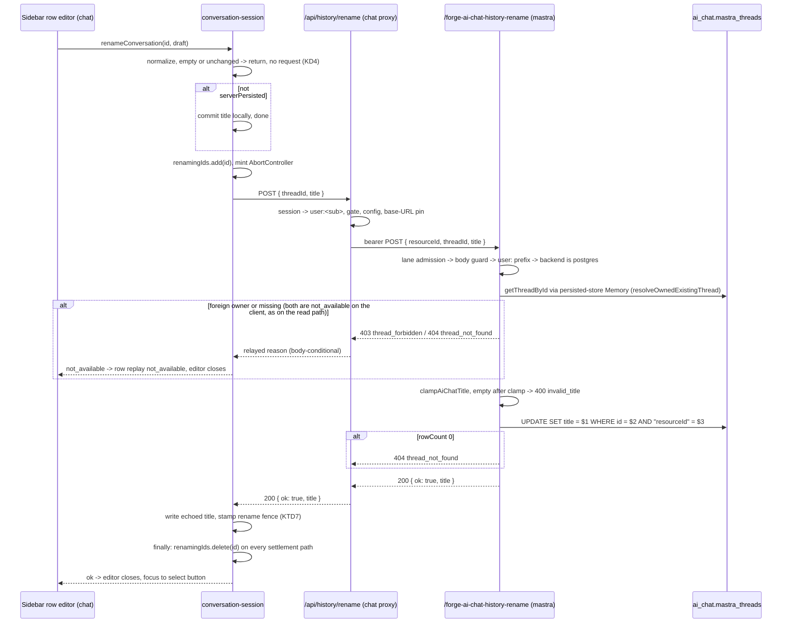
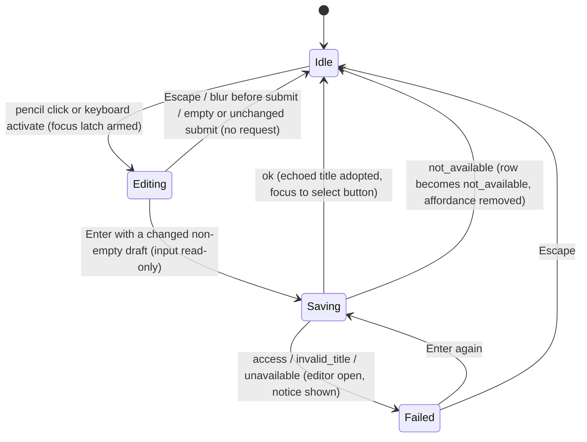

# Chat Conversation Rename - Plan

## Goal Capsule

- **Objective:** A signed-in, gate-granted Seeker user can give a conversation their own name from the sidebar, and that name is what they see on every later visit, without the conversation moving in the rail or living longer because of it.
- **Means:** One ownership-gated Mastra write route on the ai-chat lane, one chat-side proxy, a pessimistic session-store action, and an inline editor on the sidebar row (KTD1, KTD2, KTD5, KTD6, KTD9).
- **Authority:** This plan > `docs/roadmap/ai-chat/feat-450-chat-conversation-rename.md` (a new ticket this plan creates; `feat-247` stays the delete ticket). `docs/handoffs/2026-07-21-mastra-seeker-architecture-review-rulings.md` binds route construction (lane admission, ownership resolver, no admission seams in registrations). Delete stays on `feat-247`, is being planned separately, and is not planned here.
- **Stop conditions:** Stop and surface to the user if (a) the `@mastra/pg` thread-table shape or its timestamp-trigger scope differs from the pinned facts in KTD3 after any `@mastra/*` bump, (b) the sidebar restructure cannot preserve an existing accessibility contract named in U5, or (c) the drawer Escape handling in KTD10 cannot be made to work in a real browser.
- **Execution profile:** Two PRs, Mastra first (KTD1). PR 1 = U1, U2. PR 2 = U3, U4, U5, U6. The chat proxy answers `unavailable` until the Mastra route is deployed. No new env vars. No migration.
- **Tail ownership:** PR 1 carries this plan file, the new `feat-450` rename ticket set to `in-progress`, the minimal delete-only narrowing of `feat-247`, and the lane README rows. PR 2 flips `feat-450` to `complete` with its Resolution section and the README code-PR links.

---

## Product Contract

### Summary

Add a rename action to the chat sidebar for persisted Seeker conversations. A pencil control on the row opens an inline editor. The new title is written to the thread row in the `ai_chat` Postgres schema through a new bearer-gated Mastra route and a chat proxy. The write preserves sidebar order and the retention clock. Delete is out of scope and gets its own stub ticket.

### Problem Frame

feat-241 shipped view-and-resume server history. Titles are LLM-generated (feat-405) and sometimes wrong or awkward, and a person has no way to fix them. The original feat-247 stub bundled rename with delete. Delete carries open questions about resurrection windows that rename does not share, so this plan takes rename alone under a new ticket, feat-450, and feat-247 keeps delete.

### Key Decisions

- KD1. **Rename only, on its own ticket; delete stays on feat-247.** (session-settled: user-directed — chosen over shipping delete and rename together: delete's resurrection-window questions are unsettled and would hold rename hostage.) Governs R1, R13.
- KD2. **Controls render only on gate-granted shells.** (session-settled: user-approved — chosen over a rename affordance for every visitor: non-granted conversations are client-only and ephemeral, so a rename there is lost on refresh and the gesture would mean two different things.) Governs R2, R3.
- KD3. **Inline editor on the row, opened by a per-row pencil control.** (session-settled: user-approved — chosen over a modal dialog or double-click: the app has no dialog primitive, and double-click is undiscoverable and unreachable on touch.) Governs R4, R5.
- KD4. **An empty or unchanged submit cancels quietly and sends nothing.** (session-settled: user-directed — chosen over a visible "title can't be empty" error: the server refusal is the guard that matters, and a cleared field almost always means "never mind".) Governs R6, R7.
- KD5. **The write is pessimistic.** The title changes only after the server confirms, and a failure keeps the editor open with an inline notice. (session-settled: user-approved — chosen over optimistic apply-then-revert: the open editor lets the person retry without retyping, and a refused write is never presented as success.) Governs R9, R10.
- KD6. **A rename never changes the thread's `updatedAt`.** (session-settled: user-approved — chosen over bumping it: renaming is not conversation activity, so it must not move the row to the top of the rail or extend the 25-day retention window.) Governs R12.
- KD7. **The titling race is an accepted residual.** A rename that lands inside a title-generation window can be overwritten once by the generated title. (session-settled: user-approved — chosen over a client re-check or a second write path: the window is seconds per occurrence and the sidebar deliberately does not poll.) Governs the accepted residual in Scope Boundaries.

### Requirements

**Affordance and gating**

- R1. Each persisted conversation row in the sidebar offers a rename action (per KD1).
- R2. Rename controls render only on gate-granted shells, keyed on the existing `grantedShell` derivation and never on raw `seekerEnabled` (per KD2).
- R3. Within a granted shell, a row whose replay state is `not_available` shows no rename control, and a row with a send in flight has its rename control disabled.
- R4. The rename control is revealed on hover and focus-within where a hover-capable pointer exists, and is always visible on coarse-pointer devices and in the mobile drawer (per KD3).

**Editor**

- R5. Rename edits the title inline in the row: Enter commits, Escape cancels, and blur before submit cancels (per KD3).
- R6. An empty or whitespace-only submit cancels and keeps the previous title; no request is sent (per KD4).
- R7. A submit whose normalized title equals the current title closes the editor and sends no request (per KD4).
- R8. An untitled row opens the editor empty with its date-fallback label as placeholder, so an accidental Enter cannot persist the fallback text (an empty title keeps the thread in the titling and repair path: Mastra titles only while the stored title is empty, and the title-repair sweep selects on `title = ''`).

**Write**

- R9. A row not marked server-persisted renames in session state only; a server-persisted row renames through the server and the title changes only after the server confirms (per KD5).
- R10. A failed rename is visible on the row and leaves the previous title in place; sign-in and access failures are named as such rather than as a generic outage (per KD5).
- R11. The stored title is clamped server-side by the shared clamp (120 UTF-16 units, control and invisible-format characters stripped, whitespace collapsed); the response echoes the stored title and the client adopts it.
- R12. The server write sets `title` only; `updatedAt` is byte-identical before and after (per KD6).

**Access**

- R13. The rename route is ownership-gated: only the thread's owner (`user:` from the chat session) may rename it; a foreign owner gets `thread_forbidden`, a missing thread gets `thread_not_found`, and non-`user:` resources are refused (per KD1's carry-over of feat-241's access model).
- R14. The route sits behind the existing ai-chat lane gates, `SEEKER_ROUTE_ENABLED` and the dedicated `AI_CHAT_SERVICE_API_KEYS` bearer, with no new env flag.
- R15. No log line on any hop carries a title, a thread id, or a resource id.

**Consistency**

- R16. A committed rename survives a history page fetch that was already in flight when the rename committed; the stale page's title never replaces it.
- R17. A title update arriving from the server while the editor is open does not change the editor's draft.

### Acceptance Examples

- AE1. **Covers R12.** Given a renamed conversation that is not the most recent, when the sidebar next hydrates from the server, then the row keeps its position and its `updatedAt` is byte-identical to before the rename.
- AE2. **Covers R6, R8.** Given an untitled row whose editor opened empty, when the user presses Enter without typing, then the editor closes, the row still shows its date label, and no request is sent.
- AE3. **Covers R11.** Given a submitted title of 130 characters from a 3-byte script, when the server responds, then the row shows the 120-unit clamped title the server stored.
- AE4. **Covers R13.** Given a second identity holding a thread id it does not own, when it posts a rename for that id, then the route answers `thread_forbidden` and no SQL executes.
- AE5. **Covers R16.** Given a Load-more page fetch in flight, when a rename commits and the page then lands carrying the old title for that row, then the row shows the renamed title.
- AE6. **Covers R10.** Given a rename that fails with `unavailable`, when the failure lands, then the editor is still open with the typed text, the row title is unchanged, and an inline notice is shown.
- AE7. **Covers R3, R13.** Given a rename that answers `thread_not_found` on a live row, when the failure lands, then the editor closes, the row moves to the "no longer available" presentation, and the rename control disappears.
- AE8. **Covers R5.** Given the mobile drawer is open with a rename editor active, when the user presses Escape, then the editor cancels and the drawer stays open.

### Scope Boundaries

- No delete, no bulk actions. Delete stays on its own ticket (`feat-247`).
- No rename for `anon:*` resources or the `seeker-dogfood` fallback; the history proxies never mint an anonymous resource.
- No agent-facing rename tool. The Seeker agent never gains a thread-title tool; rename is a UI-only capability.
- No cross-tab synchronization and no concurrency control on the title. Last write wins; a second tab learns the new title on its next hydration.
- No per-user rate limit on the rename route. The 8 s route budget, the pool cap, and the statement timeout bound the blast radius.
- No document-title or browser-history change. The tab title stays fixed per the feat-209 no-titles-in-head rule.
- No "reset to the generated title" action.
- A client-only rename on a granted shell (a row never marked server-persisted) looks identical to a persisted rename and is lost on reload. Accepted residual, recorded with KD7's.
- No changes to the read routes, the send route, retention, erasure, or title-repair beyond the docstring cross-reference U1 adds to the clamp module.

#### Deferred to Follow-Up Work

- Delete, with its resurrection-window questions, in `feat-247` (planned separately).
- Cross-tab propagation of renames (BroadcastChannel), if history ever gains live updates.
- A `CONCEPTS.md` entry for a conversation title, proposed at compound time rather than added silently.

### Sources

- Rulings: `docs/handoffs/2026-07-21-mastra-seeker-architecture-review-rulings.md` (lane admission, ownership resolver, no admission seams in `index.ts`).
- Proxy contract: `docs/solutions/architecture-patterns/browser-sse-proxy-to-bearer-gated-internal-sse-20260626.md` (a status is never a semantic discriminator without a body reason; every hop needs reasonless and non-JSON fixtures).
- Blast-radius law: `docs/solutions/best-practices/single-upstream-predicate-bounding-irreversible-blast-radius-20260812.md` (direct SQL with `"resourceId" = $n` is the named exemption from a client-side re-check).
- SQL invariant tests: `docs/solutions/best-practices/prisma-raw-sql-invariant-assertions-20260423.md` (assert the SET clause's omission by scraping the query text).
- Atomic check-and-claim: `docs/solutions/database-issues/db-lock-must-be-atomic-update-not-select-for-update.md` (ownership predicate in the UPDATE's WHERE).
- Budget helper obligation: `docs/solutions/best-practices/settle-caller-promise-on-every-budget-race-helper-exit-path.md` (a new `settleWithinBudget` caller re-audits the helper's early exits against its signal lifetime).
- Timeout ordering: `docs/solutions/best-practices/outbound-timeout-shorter-than-caller-budget-20260506.md`.
- Focus and hidden subtrees: `docs/solutions/logic-errors/hidden-subtree-breaks-measuring-effects-and-focus.md` (focus hand-off armed inside the handler, never a bare effect; jsdom cannot prove either).
- StrictMode: `docs/solutions/logic-errors/react-strictmode-remount-safety-hook-lifetime-refs.md` (`deactivate()` rolls back every state an aborted fetch could complete; hook suites need RTL `reactStrictMode: true`).
- Local smoke: `docs/solutions/developer-experience/chat-mastra-gated-stack-local-smoke-recipes.md` (version-pinned to older `@mastra/*`; re-verify wire shapes before relying on its payloads).
- Title clamp and repair: `apps/mastra/src/mastra/ai-chat-title-clamp.ts`, `apps/mastra/src/mastra/workflows/title-repair.ts` (SQL shape, pool discipline, the `updatedAt` omission and its pinned trigger fact).

---

## Planning Contract

### Key Technical Decisions

- KTD1. **Two PRs: Mastra route first, chat second.** (session-settled: user-directed — chosen over one combined PR: the receiver deploys before the caller per the repo's cross-app ordering law, and pessimistic writes would show real errors to real people during a combined deploy window.) PR 1 = U1, U2. PR 2 = U3 to U6. The chat proxy must treat a reasonless 404 from a not-yet-deployed route as `unavailable` (KTD5), so the deploy window is a retryable outage, never a data claim. Cites R14.
- KTD2. **The rename route is a new module, `apps/mastra/src/mastra/ai-chat-history-write-route.ts`, registered as `POST /forge-ai-chat-history-rename`.** (session-settled: user-approved — chosen over adding the handler to the 824-line read-only history route module: the write path stays reviewable on its own and its only shared imports are the lane's admission and ownership modules.) It reuses the feat-241 handler anatomy unchanged: `refuseUnlessLaneAdmitted` first, body guard, `user:`-prefix refusal, every store await inside `settleWithinBudget` against `TIME_BUDGET_MS.historyRead` (8 s, already strictly below the chat proxy's [9 s, 10 s] window), the closed `{ status, body }` outcome, and enum-only `[ai-chat-history] event=… reason=…` logging. The registration in `index.ts` passes no admission seams; the new path joins `laneRoutes` in `seeker-route-isolation.test.ts`. Body: `{ resourceId, threadId, title }` with the read routes' `threadId` bound (non-empty, at most 200 chars) and a raw `title` bound of 1,024 UTF-16 units before clamping; anything else is 400 `invalid_body`. Cites R13, R14, R15.
- KTD3. **The title write is a guarded direct-SQL UPDATE that omits `updatedAt` from the SET clause.** (session-settled: user-approved — chosen over Mastra's `updateThread` and `saveThread`: both unconditionally SET `updatedAt` (verified in the installed `@mastra/pg` 1.18.1), which reorders the rail and resets the retention clock, and `updateThread` carries no resource predicate.) Shape follows `workflows/title-repair.ts`: table name composed from `AI_CHAT_SCHEMA_NAME`, parameterized values, and `WHERE id = $2 AND "resourceId" = $3` with exact equality on the caller's resolved resource. The WHERE is the blast-radius bound by construction; SQL `=` is the named exemption from a client-side re-check. `rowCount === 0` after the ownership resolver passed means the thread vanished in the race and maps to `thread_not_found`. The omission holds only because `@mastra/pg` installs its `trigger_set_timestamps` BEFORE UPDATE trigger for `TABLE_SPANS` only, never `mastra_threads` (verified 2026-08-28; restate the pin in the module docstring). U1 pins that fact against the installed dist as a required test, listed as its own Verification Contract row, so a `@mastra/*` bump that widens the trigger fails the suite instead of silently resetting retention clocks and reordering the rail. Cites R12.
- KTD4. **The ownership read and the SQL write target the same Postgres by construction; the route refuses when the ai-chat backend is not Postgres.** Ownership resolves through `resolveOwnedExistingThread` over a module-cached Memory built directly over `getAiChatStorage()` (the retention and erasure construction), never `getAiChatMemory()`, whose backend the `AI_CHAT_MEMORY_BACKEND=memory` kill-switch swaps for an `InMemoryStore`. The pool's connection string comes from `getMastraDatabaseUrl()`, the same resolver `buildAiChatStorage` uses, so read and write cannot diverge. Before any store construction the route checks `resolveAiChatMemoryBackend() === "postgres"` and otherwise answers 503 `writes_disabled`: the kill-switch reverts writes, a title is user-authored content landing in Postgres, and refusing with a distinct reason is honest where a lookup over the wrong store would produce a false `thread_not_found`. Chosen over title-repair's explicit `env.DATABASE_URL` refusal: that rationale protects a scheduled bulk job from a wrong-database target, while this route's target is by definition the store the listing just served from. Cites R13.
- KTD5. **The chat proxy `POST /api/history/rename` shares the read proxies' core and deny ladder, extended for one write.** New files `apps/chat/src/app/api/history/write-proxy.ts` and `rename/route.ts` copy `history-proxy.ts` anatomy: session cookie to `user:` resource via `resolveHistoryResource` (401 `invalid_session` when null), `resolveSeekerGate` with surface `"history"` (403 `gate_denied`), config and `validateBaseUrl` with `requireAllowlist` threaded from `requireSeekerEgressAllowlist()` and pinned at the call site with an anti-vacuous companion, the shared transport from `lib/server/mastra-upstream.ts`, status classified before any body parse, and a small dedicated response byte cap (4 KiB) because the echoed title is tiny. The body guard accepts `{ threadId, title }` only, bounds `threadId` with the shared `MAX_CONVERSATION_ID_CHARS` (200) exactly as the read proxy's thread-body guard does, bounds the raw `title` at 1,024 units, projects field-by-field, and ignores any client-supplied resource field; the upstream `resourceId` comes from the session alone. The failure vocabulary reuses the read spellings verbatim and adds `invalid_title`: `invalid_body | invalid_session | gate_denied | thread_forbidden | thread_not_found | invalid_title | timeout | unavailable`. 403 and 404 relay their reason only when the upstream body carries it; upstream 400 relays `invalid_title` only when the body carries it; every other non-200, including 503 `writes_disabled` and a reasonless 404, is 502 `unavailable`. Success relays `{ ok: true, title }`. Cites R10, R11, R13, R15.
- KTD6. **The session owns the rename: a `renameConversation(id, title)` action with its own in-flight slot, pessimistic commit, and `deactivate()` rollback.** The client fetcher `renameHistoryThread` in `lib/history-client.ts` returns `{ ok: true, title } | { ok: false, reason: "access" | "not_available" | "invalid_title" | "unavailable" }` through the existing `postJson` and `failureReasonFor` helpers, extended for the 400 body, with the read path's mapping kept: 401 and 403 `gate_denied` become `access`; 403 `thread_forbidden` and 404 `thread_not_found` both become `not_available`; 400 `invalid_title` becomes `invalid_title`; everything else is `unavailable`. The fetcher projects the 200 body field-by-field: `{ ok: true, title }` only when `body.title` is a string, otherwise `{ ok: false, reason: "unavailable" }`, mirroring `fetchHistoryPage`'s array guard, so a title-less 200 can never write `undefined` into a row. Its timeout is the read fetchers' `HISTORY_FETCH_TIMEOUT_MS` (15 s). The action normalizes the draft (trim, collapse whitespace, strip the clamp's control and invisible-format character class, mirrored in chat with a comment naming the Mastra source since chat cannot import it); empty or unchanged returns without a request (KD4). A row without `serverPersisted` commits locally and returns. Otherwise the id enters `renamingIds` (a new snapshot field), a second call for the same id is a no-op, the fetch runs under an AbortController the session tracks, and on `ok` the session writes the echoed title and stamps the fence (KTD7). The slot is released in a `finally` around the whole fetch callback, so every settlement path (`ok`, `not_available`, `access`, `invalid_title`, `unavailable`, an abort, and a synchronous throw before the await) removes the id; a per-outcome release would leave a failed row stuck with its pencil disabled and its retry dead, the repo's slot-leak law. `deactivate()` aborts in-flight renames and clears `renamingIds`, mirroring its existing `history.phase` and `replay` rollbacks, so the same instance re-arms under StrictMode. Editor view state (which row is editing, its draft, its failure) is component-local in the sidebar list. Failure routing: `access` and `invalid_title` and `unavailable` return to the caller for the inline notice (KD5) and never invoke `revertToClientOnly()`, the read contract's silent degrade; `not_available` additionally sets the row's replay state to `not_available` (the existing R18 shape), which removes the affordance. Cites R6, R7, R9, R10.
- KTD7. **A per-id rename fence protects committed titles from stale page merges.** The session keeps a monotonic rename counter and a map from conversation id to the counter value at its last committed rename. Every history page fetch captures the counter at start and passes it to `mergeServerThreads`, which skips the server title for any id whose fence is newer than the fetch's start value. Without the fence, `mergeServerThreads`'s "non-empty server title wins" rule reverts a rename silently whenever page-0 hydration, a Load-more page, or `retryHistory()` was in flight. Cites R16.
- KTD8. **Sidebar rows are restructured from a single `<button>` to a row container with sibling controls.** An input and a second control cannot legally nest inside the row's select `<button>`. The `<li>` becomes a flex container holding the select button and the pencil button; the pencil's accessible name is `Rename <title>`; the select button keeps `aria-current` and its title-based accessible name; `data-replying` and the sr-only "Replying" and "(unavailable)" spans stay inside the row. Reveal keys on pointer capability, not viewport: hover/focus-within under `(hover: hover)`, always visible under `(pointer: coarse)` and in the drawer. The pencil's click must not fire `onCloseMobile`. A new `PencilIcon` joins `icons.tsx` under its inline-SVG, `currentColor`, no-dependency convention. The existing test helper that resolves a row by `getByRole("button", { name: /title/ })` must be scoped to the select button so the pencil's name never collides. Cites R1, R3, R4.
- KTD9. **Inline editor semantics.** Entering edit prefills the current title once (empty with the date fallback as placeholder for untitled rows, R8), moves focus into the input via a latch armed inside the click handler (never a bare effect on the editing flag), and sets `maxLength` 120 as a client bound. Enter submits; Escape cancels; blur before submit cancels. After submit the input is read-only with a pending affordance until the request settles, a second Enter is a no-op, and blur is ignored. On failure the editor stays open with the inline notice and focus stays where the user left it. The saving affordance is the row's existing pulsing dot with an sr-only "Saving". The notice renders below the input with `role="alert"` through an exhaustive per-reason switch (the message list's `failureNotice` pattern, never a raw reason token): `access` reads "Your access has changed. Sign in again to check." (one notice for both an expired session and a denied gate, which the client cannot tell apart); `invalid_title` reads "That name can't be used. Try different text."; `unavailable` reads "Couldn't rename. Try again." Focus returns to the row's select button only on Enter-commit and Escape-cancel, and only when that control is still connected and visible (the `useSidebarChrome` restore guard). The draft is component state initialized on entry, so a server title update mid-edit cannot touch it (R17). Commit or cancel never closes the drawer. Cites R5, R6, R7, R8, R10, R17.
- KTD10. **The drawer's Escape listener ignores events the editor owns, by target, not by propagation.** `useSidebarChrome` registers a native `keydown` listener on `document`; Next's App Router hydrates the React root on `document` too, so React's delegated handler and the drawer's listener sit on the same node and `stopPropagation()` cannot separate them. The editor marks its input with a `data-escape-owner` attribute and the drawer listener returns early when `event.target` is inside such an element. This is order-independent. The jsdom suite must dispatch the key event on the input with bubbling, not on `document` as the existing drawer test does, or it cannot fail; the behavior is also proven in the real browser under `next build` + `next start`. Cites R5 (AE8).

### Assumptions

- The raw `title` body field is bounded at 1,024 UTF-16 units before clamping; over-bound is 400 `invalid_body` at the proxy and the route.
- No per-user rate limit on the rename route; the budget, pool cap, and statement timeout bound it.
- No live-region announcement on rename. Focus returns to the select button whose accessible name is the new title, and that is what a screen reader hears.
- A rename in the mobile drawer leaves the drawer open; rename never selects the row.
- Single Mastra replica; thread ownership is immutable (nothing rewrites `mastra_threads.resourceId`), so the microseconds between the ownership read and the UPDATE need no second read.
- The chat session cookie to `user:` resolution is reused as-is; no auth changes.
- The rename pool is module-scoped and lazy, `max: 2`, `allowExitOnIdle: true`, `connectionTimeoutMillis: 2_000`, `query_timeout: 5_000`, `statement_timeout: 5_000`, all strictly below the 8 s route budget because `settleWithinBudget` races without aborting the inner query; the pool census comment in `ai-chat-memory.ts` gains this pool as a new module-scoped category.

### High-Level Technical Design

Write path across the four layers:

Editor state machine (component-local view state, one row at a time):

---

## Implementation Units

### U1. Mastra rename route

- **Goal:** `POST /forge-ai-chat-history-rename` sets an owned thread's title without touching `updatedAt`.
- **Requirements:** R11, R12, R13, R14, R15. Implements KTD2, KTD3, KTD4; enforces KD6.
- **Dependencies:** none.
- **Files:** `apps/mastra/src/mastra/ai-chat-history-write-route.ts` (new), `apps/mastra/src/mastra/ai-chat-history-write-route.test.ts` (new), `apps/mastra/src/mastra/index.ts` (registration and import), `apps/mastra/src/mastra/seeker-route-isolation.test.ts` (add the path to `laneRoutes`), `apps/mastra/src/mastra/ai-chat-title-clamp.ts` (docstring names the third caller), `apps/mastra/src/mastra/ai-chat-memory.ts` (pool census comment).
- **Approach:**
  1. Copy the feat-241 handler anatomy from `ai-chat-history-route.ts` (KTD2): exported handler taking `{ authHeader, readJson }` plus optional test seams (`getEnabled`, `getServiceKeys`, `getMemory`, `getPool`, `budgetMs`), returning `{ status, body }`; the `index.ts` registration passes no seams and mirrors the list route's block byte-for-byte apart from the path and handler name.
  2. Ladder: admission, body guard (KTD2 bounds), `user:` prefix 403 `resource_forbidden`, backend check 503 `writes_disabled` before any store or pool construction (KTD4).
  3. Inside the budget: ownership via `resolveOwnedExistingThread` over the persisted-store Memory (KTD4); clamp; when `clampAiChatTitle(title)` returns an empty string, whatever the raw input was, 400 `invalid_title` and no SQL (the raw-versus-clamped comparison in title-repair exists to tell a generation failure from an untitled thread and has no meaning on a write route); the KTD3 UPDATE over the lazy pool; `rowCount === 0` maps to 404 `thread_not_found`; success returns `{ ok: true, title }` with the clamped value.
  4. Failure catch mirrors the read routes: `timeout` (504) when the budget signal aborted, else `store_failed` (500).
  5. Module docstring records why `updateThread` and `saveThread` were rejected, the `TABLE_SPANS`-only trigger pin with its verification date, and the same-store-by-construction argument, so a reviewer does not re-derive them.
  6. Do not mention `seekerAgent` in any new comment in `index.ts`; the isolation suite pins that token's exact count.
- **Patterns to follow:** `ai-chat-history-route.ts` (ladder, budget, logging), `ai-chat-retention.ts` (persisted-store Memory construction and its reset-for-testing export), `workflows/title-repair.ts` (SQL shape, `AI_CHAT_SCHEMA_NAME` composition, pool options), `ai-chat-title-clamp.ts`.
- **Test scenarios:**
  - Happy path: owner renames own thread; 200 with the clamped title; the pool spy received one UPDATE whose bound values are the clamped title, the thread id, and the caller's resource.
  - Covers AE4: a request carrying another subject's `resourceId` for a thread it does not own answers 403 `thread_forbidden` and the pool query is never called; a positive companion proves the spy is live on the happy path.
  - Missing thread answers 404 `thread_not_found` with no SQL; a post-resolver race (`rowCount` 0) answers 404 `thread_not_found`.
  - Non-`user:` resources (`anon:*`, `seeker-dogfood`) answer 403 with no store I/O.
  - Pool-valid bearer absent from the lane CSV answers 401; lane CSV unset with no seam answers 401 (the discriminating default-source pair from the read suite).
  - `SEEKER_ROUTE_ENABLED` not `"true"` answers 404 before anything else.
  - Backend resolved to `memory` answers 503 `writes_disabled` with no Memory and no pool constructed; backend `postgres` proceeds (discriminating pair).
  - Kill-switch seam: with the backend `postgres`, ownership resolves through the `getAiChatStorage` seam and `getAiChatMemory` is never called.
  - A raw empty title, a whitespace-only title, and an invisible-format-only title each answer 400 `invalid_title` with no SQL (AE2's server half).
  - Covers AE3: a 130-unit title from a 3-byte script is stored and echoed as the 120-unit clamp.
  - Over-bound raw title (1,025 units) and non-string fields answer 400 `invalid_body`.
  - SQL-shape invariant, one test, both assertions: the query text's SET clause matches `title = $1` and matches neither `"updatedAt"` nor `"updatedAtZ"`; the WHERE contains both `id = $2` and `"resourceId" = $3`; comment names the list route's `orderBy: updatedAt DESC` dependency so the test is not deleted as noise.
  - Store read rejects: 500 `store_failed`, never `thread_not_found`; budget exceeded: 504 `timeout`.
  - Unhandled-rejection pin: a rename whose inner promise rejects after the budget aborted produces no `unhandledRejection` (process listener assertion), per the `settleWithinBudget` new-caller obligation.
  - Logging: no branch logs a title, thread id, or resource id; a captured-console assertion over every failure branch.
  - Pool options asserted once (max 2, the three timeouts) through the `getPool` seam.
  - Timestamp-trigger dist pin (AE1): a test reads the installed `@mastra/pg` dist and asserts the timestamp-trigger installer is gated on the spans table name only, with the verification date in its comment; it fails on any bump that widens the gate.
- **Verification:** `pnpm --filter @forge/mastra test`, `typecheck`, and `lint` green, including the isolation suite with the new `laneRoutes` entry.

### U2. Mastra docs and roadmap re-scope

- **Goal:** Operators can find the write route next to the read surface; the lane's tickets reflect the narrowed scope.
- **Requirements:** R14 (operator understanding of gates and levers); KD1 (ticket split).
- **Dependencies:** U1.
- **Files:** `apps/mastra/CLAUDE.md`, `docs/roadmap/ai-chat/feat-450-chat-conversation-rename.md` (new), `docs/roadmap/ai-chat/feat-247-chat-history-management.md` (minimal narrowing), `docs/roadmap/ai-chat/README.md`, this plan file.
- **Approach:**
  1. `apps/mastra/CLAUDE.md`: add the route to the ai-chat history section (rename its heading from read surface to read and write surface, or add a sibling write bullet), widen the `AI_CHAT_SERVICE_API_KEYS` route-list and env-table wording from "history read routes" to include the write route, and note in the retraction ladder that `SEEKER_ROUTE_ENABLED=false` darkens rename with the lane (no new lever).
  2. `feat-450` (new): title "Chat conversation rename", status `in-progress`, the agent-optimized body shape (Problem, Entry Points, Grep These, What To Build pointing at this plan, Constraints, Verification), `depends_on` = `feat-241`, `feat-283`, `feat-284`, `blocks` = `feat-247` (a delete route would join the write-route module and proxy anatomy this work creates); owner, priority, and dates copied from `feat-247`.
  3. `feat-247`: the minimal delete-only narrowing, nothing more, because delete is being planned in a separate session that owns that ticket's body: title becomes "Chat conversation delete", the rename wording leaves the stub, a one-line pointer names `feat-450` for rename, and `depends_on` gains `feat-450`. No ledger or backstop material is added.
  4. README: update the `feat-247` row, add the `feat-450` row, recompute the Status counts by hand, bump the Status date. Re-run the lane's ID grep before allocating in case `feat-450` was taken in the meantime.
  5. Run `npx prettier --check` on every edited markdown file before pushing.
- **Test scenarios:** Test expectation: none -- documentation-only unit.
- **Verification:** README counts agree with ticket frontmatter; `depends_on`/`blocks` are bidirectional between `feat-247` and `feat-450`; prettier passes.

### U3. Chat rename proxy

- **Goal:** `/api/history/rename` forwards an authenticated rename to the Mastra route with the write failure vocabulary.
- **Requirements:** R10, R11, R13 (session to resource), R14, R15. Implements KTD5.
- **Dependencies:** U1 (upstream contract).
- **Files:** `apps/chat/src/app/api/history/write-proxy.ts` (new), `apps/chat/src/app/api/history/rename/route.ts` (new), `apps/chat/src/app/api/history/write-proxy.test.ts` (new), `apps/chat/src/app/api/history/history-proxy.gate-wiring.test.ts` (extend its route list and body helper to the third route).
- **Approach:**
  1. Copy the `history-proxy.ts` deny ladder and forwarder into the write core per KTD5, with `parseRenameBody` mirroring `parseListBody`'s style and the 4 KiB response cap as a named constant; the capped success read stays paired with the `undefinedOnAbort` race exactly as the read forwarder does, so an abort mid-body maps to `timeout` or `unavailable`, never a hang.
  2. Route wrapper copies `list/route.ts` verbatim apart from the core import.
  3. Status ladder: classify before body parse; 403/404/400 relay their reason body-conditionally; 504 is `timeout`; everything else is 502 `unavailable`.
- **Patterns to follow:** `history-proxy.ts`, `list/route.ts`, `lib/server/mastra-upstream.ts`.
- **Test scenarios:**
  - Happy path: 200 relays `{ ok, title }` from the upstream body.
  - Session absent or anonymous: 401 `invalid_session`, no upstream call; gate denied: 403 `gate_denied`, discriminated body-conditionally from `thread_forbidden` (both ride 403).
  - Resource-forgery pin: a body carrying another subject's `resourceId` still forwards the session-derived resource; anti-vacuous companion proves the assertion can fail.
  - Invalid bodies (non-object, missing or non-string `threadId`, over-bound `threadId` at 201 chars, over-bound raw `title`): 400 `invalid_body` with no upstream call.
  - Per semantically-mapped status (400, 403, 404): a reason-carrying fixture, a reasonless fixture, and a non-JSON fixture; the reasonless and non-JSON pairs map to `unavailable`.
  - Upstream 503 `writes_disabled` maps to 502 `unavailable`; upstream timeout maps to `timeout`; unreachable maps to `unavailable`.
  - `requireAllowlist` source pin: the call site threads the production env source, with the positive companion proving the pin can fail.
  - Gate-wiring: with a real signed cookie the route calls `resolveSeekerGate` with surface `"history"`, and the deny matrix runs for the rename route as it does for list and thread.
  - No thread id or title in any log line fixture.
- **Verification:** `pnpm --filter @forge/chat test`, `typecheck`, `lint` green.

### U4. Session rename action, fence, and client fetcher

- **Goal:** `conversation-session.ts` gains `renameConversation` with pessimistic commit, the in-flight slot, the stale-page fence, and lifecycle rollback.
- **Requirements:** R6, R7, R9, R10, R16, R17 (the session half). Implements KTD6, KTD7.
- **Dependencies:** U3.
- **Files:** `apps/chat/src/lib/conversation-session.ts`, `apps/chat/src/lib/conversation-session.test.ts`, `apps/chat/src/lib/history-client.ts`, `apps/chat/src/lib/history-client.test.ts`, `apps/chat/src/lib/conversations.ts` (title normalization helper with the mirrored character class), `apps/chat/src/lib/use-conversations.ts` (surface the action and `renamingIds`), `apps/chat/src/lib/use-conversations.strictmode.test.tsx`, `apps/chat/src/components/shell/sidebar-projection.ts` if `HistoryListUi` grows.
- **Approach:**
  1. Fetcher per KTD6 through `postJson` and an extended `failureReasonFor` (400 with body `invalid_title` maps to `invalid_title`; the closed union gains that member).
  2. Action per KTD6; declare each new state axis at its declaration site: who sets it, who clears it, whether it survives `deactivate()`, what bounds it. The rename fence (KTD7) survives `deactivate()`: a committed rename is settled state, not an in-flight fetch's product. A one-line comment states why a rename `access` failure does not invoke `revertToClientOnly()`: that path is the read contract's silent degrade, and reusing it would remove the row the person is looking at with no notice.
  3. Fence per KTD7: the counter, the per-id map, capture at fetch start in `runHistoryPageFetch`, and the skip in `mergeServerThreads`.
  4. `deactivate()` aborts in-flight renames and clears `renamingIds`; `activate()` needs no rename re-arm.
  5. `use-conversations.ts` returns the action and `renamingIds`; update the field count in `apps/chat/CLAUDE.md` in U6 (it currently says 16 and is already 17).
- **Patterns to follow:** existing action shapes (`send`'s per-conversation controller slot and double-send guard, `retryReplay`), `mergeServerThreads`, the lifecycle rollback block in `deactivate()`.
- **Test scenarios (write A-then-B and B-then-A pairs where ordering matters):**
  - Happy path: rename a persisted background row; the fetcher is called once with the normalized title; the title updates only after the result resolves; position unchanged; `renamingIds` empty afterwards.
  - Pessimistic ordering: before the fetch resolves the snapshot still carries the old title; a rejected fetch leaves it unchanged.
  - Client-only path: a row without `serverPersisted` commits locally with zero fetch calls.
  - Covers AE2 and R7: empty, whitespace-only, and invisible-format-only drafts return without a fetch; an unchanged normalized draft returns without a fetch.
  - Double submit: a second call for an id in `renamingIds` is a no-op (one fetch).
  - Slot release on failure: after each of `access`, `invalid_title`, `unavailable`, an abort, and a synchronous throw before the await, `renamingIds` is empty and a second `renameConversation` call issues a new fetch (the Failed to Saving retry).
  - Title-less 200: a 200 body with a missing or non-string `title` resolves to `unavailable` and the row is unchanged.
  - Covers AE5: a page fetch started before the rename committed, resolving afterwards with the old title, does not replace the renamed title; a page fetch started after the rename applies the server title normally (discriminating pair).
  - `retryHistory()` and page-0 hydration in flight across a rename behave like the Load-more case.
  - Covers AE7: `not_available` sets the row's replay state to `not_available` and clears `renamingIds`; `access`, `invalid_title`, and `unavailable` return their reason with the row unchanged and `revertToClientOnly` never invoked (with the positive companion proving the spy is live on the read path).
  - Echo adoption: the session writes the server's echoed title, not the submitted draft, when they differ.
  - StrictMode suite (RTL `reactStrictMode: true`, not the `wrapper` option): activate, deactivate, activate on the same instance leaves no id stuck in `renamingIds` and an aborted in-flight rename produces no title change and no unhandled rejection.
  - Covers R17 at the session boundary: a server title arriving for a row does not affect a pending rename's submitted value.
  - Mirror pin: a test asserts the chat-side normalizer's character-class regex literal byte-for-byte against the Mastra clamp's, so drift between the two homes is visible (the precedent is the byte-cap mirror pin in `history-proxy.ts`).
- **Verification:** chat unit suites green including the StrictMode suite; no regression in the adopt and lifecycle suites.

### U5. Sidebar row restructure, pencil control, inline editor, drawer Escape

- **Goal:** Per-row rename control and inline editor, accessible on desktop and in the mobile drawer.
- **Requirements:** R1, R2, R3, R4, R5, R6, R7, R8, R10, R17 (the UI half). Implements KTD8, KTD9, KTD10.
- **Dependencies:** U4.
- **Files:** `apps/chat/src/components/shell/sidebar-conversation-list.tsx`, `apps/chat/src/components/shell/sidebar-conversation-list.test.tsx`, `apps/chat/src/components/shell/sidebar.tsx`, `apps/chat/src/components/shell/app-shell.tsx` (thread `renameConversation`, `renamingIds`, and `grantedShell` down to the list), `apps/chat/src/components/shell/icons.tsx` (`PencilIcon`), `apps/chat/src/components/shell/use-sidebar-chrome.ts` and its test (KTD10 target check), `apps/chat/src/components/shell/sidebar-collapsed-styles.ts` if the pencil needs a collapsed slot.
- **Approach:**
  1. Row restructure per KTD8; keep the `aria-current`, `nav` label, one `<li>` per row, and in-row status span contracts.
  2. Editor per KTD9 with component-local `{ id, draft, phase, failure }` state; the failure notice renders in the row with `role="alert"` using KTD9's copy table.
  3. Controls gate on `grantedShell` (R2), hide on `not_available` rows, disable while the row's id is in `pendingIds` or `renamingIds` (R3).
  4. Drawer Escape per KTD10.
  5. Vigil Tailwind tokens; callbacks threaded AppShell to Sidebar to ConversationList.
- **Execution note:** jsdom cannot prove focus movement, hover reveal, or the drawer Escape mechanism; assert the state machine and ARIA wiring in RTL, dispatch Escape on the input with bubbling for the KTD10 test, and prove focus, Escape layering, and the drawer path in the real browser under `next build` + `next start`.
- **Patterns to follow:** existing sub-component composition in `sidebar-*.tsx`, the `useSidebarChrome` focus-restore guard, the `MarkdownRenderBoundary` file's comment style for empirical claims (date and version on anything verified by hand).
- **Test scenarios:**
  - Row renders a select button and a pencil button on a granted shell; a non-granted shell renders no pencil. The discriminating axis-pair fixture (denial shell with raw `seekerEnabled` true) is producer-unreachable via `deepLinkShell`; label it synthetic in place, naming that producer expression.
  - Pencil hidden on a `not_available` row; disabled while the row's id is in `pendingIds`; disabled while in `renamingIds`.
  - Pencil click does not call `onSelect` or `onCloseMobile`.
  - Entering edit prefills the title; an untitled row opens empty with the date label as placeholder (AE2's UI half).
  - Enter calls `renameConversation` once with the draft; Escape and blur-before-submit call nothing and restore the title; Enter on an unchanged draft closes without a call.
  - While saving, the input is read-only and a second Enter does not call again; blur while saving does not cancel.
  - Covers AE6: a resolved failure keeps the editor open with the draft and shows the notice; each of `access`, `invalid_title`, and `unavailable` renders its KTD9 copy string, pinned by test.
  - Covers AE7: `not_available` closes the editor and the row gains the muted presentation with no pencil.
  - Covers R17: a title prop change while editing does not change the input value.
  - Focus: after Enter-commit and after Escape, `document.activeElement` is the row's select button; after a blur-cancel it is not moved.
  - Covers AE8 (jsdom half): an Escape keydown dispatched on the input with bubbling reaches the drawer listener and the drawer stays open; the same event dispatched on an unmarked element closes it (discriminating pair).
  - Pointer-capability wiring: assert the class and media wiring for `(hover: hover)` reveal and `(pointer: coarse)` always-visible; keyboard path reachable via focus-within regardless.
  - Existing assertions (`aria-current` on the select button only, one `<li>` per row, `data-replying`, fallback labels, Retry and Load-more controls) re-pointed to the new structure, not loosened; the row helper is scoped to the select button.
- **Verification:** RTL suites green; browser smoke via the minted-cookie recipe on desktop and in the drawer: hover reveal, keyboard-only rename, rename of the active and a background row, Escape in the drawer, focus return; page-load evidence per `docs/solutions/conventions/frontend-change-page-load-performance-verification.md` because client-side rendering of the rail changed.

### U6. Chat docs, roadmap Resolution, README

- **Goal:** Documentation obligations of the arc's final PR.
- **Requirements:** KD1 (ticket completion); lane README contract.
- **Dependencies:** U3, U4, U5.
- **Files:** `apps/chat/CLAUDE.md` (architecture tree entries for the new proxy files, `history-client.ts`, `conversation-session.ts`, `sidebar-conversation-list.tsx`; the "Server-side conversation history" section gains a rename bullet and its deny-wire list gains `invalid_title`; the `UseConversations` field-count line; the "Still absent: thread delete/rename (feat-247)" line becomes "thread delete (feat-247)"), `docs/roadmap/ai-chat/feat-450-chat-conversation-rename.md` (status `complete` plus a prepended `## Resolution` naming both PRs), `docs/roadmap/ai-chat/README.md` (row, PR links, recomputed counts, dated Status header).
- **Approach:** Follow the lane CLAUDE.md's Resolution and README conventions; run `npx prettier --check` on every edited markdown file before pushing.
- **Test scenarios:** Test expectation: none -- documentation-only unit.
- **Verification:** README counts agree with ticket frontmatter; a grep over tracked markdown for "delete/rename (feat-247)" finds only historical text.

---

## Verification Contract

| Check                                   | Command / method                                                                                                                                                     | Applies to |
| --------------------------------------- | -------------------------------------------------------------------------------------------------------------------------------------------------------------------- | ---------- |
| Mastra unit and contract suites         | `pnpm --filter @forge/mastra test`                                                                                                                                   | U1         |
| Mastra typecheck and lint               | `pnpm --filter @forge/mastra typecheck` and `pnpm --filter @forge/mastra lint`                                                                                       | U1         |
| Isolation pins                          | `seeker-route-isolation.test.ts` green with the new `laneRoutes` entry and unchanged token counts                                                                    | U1         |
| Chat unit, StrictMode, and proxy suites | `pnpm --filter @forge/chat test`                                                                                                                                     | U3, U4, U5 |
| Chat typecheck and lint                 | `pnpm --filter @forge/chat typecheck` and `pnpm --filter @forge/chat lint`                                                                                           | U3, U4, U5 |
| Browser smoke                           | Minted-cookie recipe against a local Mastra with seeded history; `next build` + `next start` with `SEEKER_MASTRA_ALLOWED_HOSTS` set; desktop and drawer              | U5         |
| Page-load impact                        | Timing or Web Vitals evidence per the frontend performance convention                                                                                                | U5         |
| Markdown formatting                     | `npx prettier --check` on every edited `.md`                                                                                                                         | U2, U6     |
| Timestamp-trigger dist pin (AE1)        | The U1 dist-pin test plus the SQL-shape invariant, both required in `pnpm --filter @forge/mastra test`                                                               | U1         |
| Real-database round trip (AE1, AE3)     | Against a throwaway Postgres: rename a seeded thread, assert `updatedAt` byte-identical and the stored title equals the clamp; opt-in smoke or documented manual run | U1         |

## Definition of Done

- R1 to R17 hold with the suites above green; AE1 to AE8 each covered by a named test or the browser smoke.
- PR 1 (U1, U2) merged and deployed before PR 2 (U3 to U6) merges.
- No new env vars; no admission seams in `index.ts`; no title, thread id, or resource id in any log line.
- `feat-450` complete with its Resolution; `feat-247` narrowed to a delete-only stub; lane README consistent with both.
- No dead-end or experimental code from abandoned approaches remains in either diff.
