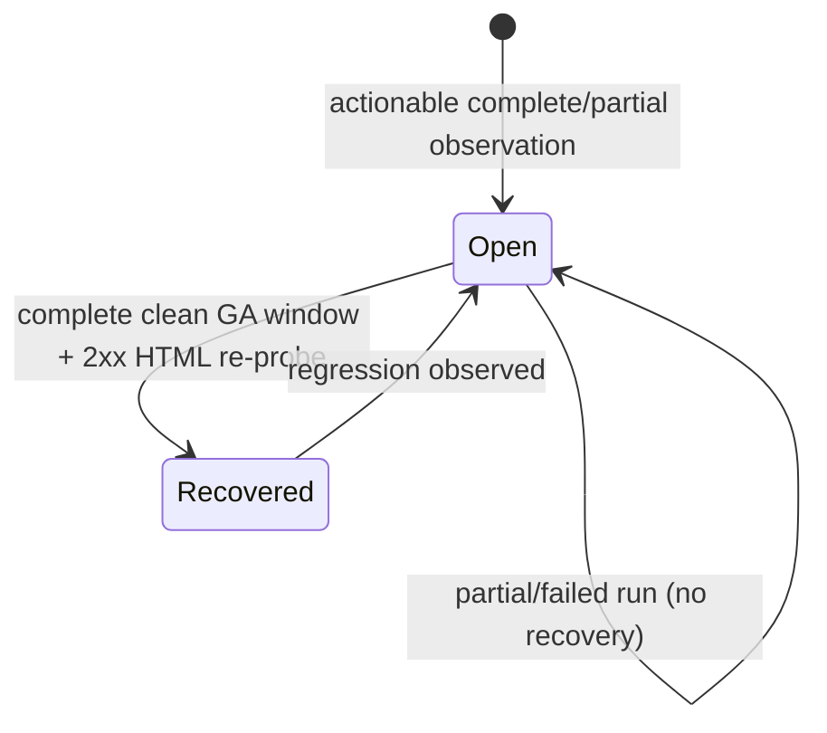

# Watch Route 404 Alerts - Plan

## Goal Capsule

- **Objective:** Detect new, real `/watch/*` page-not-found failures from GA4 before they are reported by viewers, distinguish broken supported routes from typo/noise traffic, and expose the actionable findings in Manager.
- **Means:** Add a scheduled Mastra workflow that reads GA4, validates candidate paths against the Admin-owned Watch route manifest and the live website, re-probes open alerts, then writes a durable, bounded alert projection to Admin for an authenticated Manager report.
- **Product authority:** Linear FGE-81 and `docs/roadmap/platform/feat-455-watch-route-alerts.md`.
- **Execution profile:** Mastra owns collection and orchestration; Admin owns canonical alert/run state and Manager GraphQL contracts; Manager owns the operator report. No production deployment is part of this change.

---

## Product Contract

### Summary

Every scheduled run reads recent GA4 evidence for `/watch/*` not-found traffic, checks each candidate against the exact Watch route admission contract and a bounded live HTTP request, and records only actionable or inconclusive issues. Manager users get an Alerts report that shows what broke, how many viewers saw it, why it was classified, and whether the source data is complete.

### Problem Frame

GA4 currently contains thousands of page views whose title is `Page not found` under `/watch/*`, including high-volume paths assembled from otherwise valid content and language slugs. The exact custom `page_not_found` event currently has no rows, and the repository-owned Web GA collector remains disabled pending the consent decision in `feat-444`. Search Console alone is too delayed and cannot distinguish a route admission defect from a malformed external URL. The system needs a deterministic daily control loop that can consume the explicit event when available and use a locale-independent all-Watch-path heuristic, with page title excluded as a discriminator, until it is available.

### Key Decisions

- **Master workflow, not master agent.** Scheduling, leases, retries, source completeness, and alert transitions are deterministic workflow concerns. Watch route judgment is a pure classifier driven by the exact manifest and HTTP evidence; no model agent is registered or called.
- **Admin owns durable truth.** Mastra never shares its database with Manager. Admin owns run claims, deduplication, alert lifecycle, and the Manager read model; Mastra communicates over a narrow authenticated HTTP contract.
- **Use two GA4 signals together.** The workflow queries both `eventName=page_not_found` and a heuristic lane matching the complete shared catalog of localized Watch not-found titles under `/watch/*`, then deduplicates only after classification. This prevents partial explicit-event rollout from hiding broader failures and detects the site's current soft-404 responses. Event-only cutover is outside v1 and requires separate measured approval. Missing, thresholded, capped, or failed data never resolves existing alerts.
- **The route manifest is the admission authority.** A syntactically plausible URL is not considered supported unless its exact content/language or parent/episode tuple exists in the current compact manifest.
- **Live validation is bounded and fail-closed.** Use GET, explicit timeouts/concurrency, manual redirect handling, and an allowlisted Jesus Film HTTPS host at every hop. Timeouts, rate limits, WAF responses, and 5xx results are inconclusive rather than healthy.
- **V1 is read-only for operators.** Manager exposes evidence and lifecycle state but no acknowledge/snooze/ignore controls; attributable mutations can follow once the report proves useful.

### Requirements

**Collection and classification**

- R1. The workflow must run on a daily cron and be runnable manually with the same structured input contract.
- R2. It must query the configured GA4 property for recent `page_not_found` events restricted to normalized `/watch/*` paths, paginating within explicit row and request budgets.
- R3. The workflow must query both the preferred explicit event and a separate heuristic lane matching `/watch/*` plus the full shared localized `WatchNotFound.metadataTitle` catalog, preserve each lane's quality, and deduplicate only after classification. A Web parity test prevents catalog drift; v1 has no event-only mode.
- R4. Queries must retain GA4 quality metadata including thresholding, sampling/other-row indicators where available, pagination caps, and reporting window.
- R5. Candidate URLs must discard fragments and queries for identity, reject non-Watch or off-origin values, normalize bounded path text, and deduplicate by GA property plus normalized path.
- R5a. Every GA4 property must have one explicit HTTPS production origin. Missing, ambiguous, port-bearing, or non-allowlisted property mappings make that property lane partial; the workflow must never select an arbitrary allowed host.
- R6. The classifier must compare paths to a versioned Admin-owned Watch route manifest and return finite verdicts: `supported_route_failure`, `plausible_missing_route`, `invalid_route_noise`, or `inconclusive`.
- R7. A supported manifest route that returns 404/410 is actionable. A valid-looking combination of route-safe, known content/language components that is not an admitted pair and returns 404/410 is suspected/actionable. Unknown, malformed, reserved, API, asset, preview, or internal paths are always aggregate-only noise: they are never fetched, persisted verbatim, linked, or rendered.
- R8. HTTP checks must use GET with bounded timeout and concurrency, manual redirects, HTTPS and allowlisted hosts on every hop, no response-body persistence, and finite result categories.
- R8a. 404/410 is missing. Because production Watch currently emits soft 404s with HTTP 200, a same-origin 2xx HTML response is healthy only when the latest complete GA window has no explicit-event or localized-title not-found observation for the path; one 2xx probe alone cannot recover an alert. Redirects, non-HTML 2xx, 401/403/408/429, 5xx, DNS/network/WAF failures, and unsafe redirects are inconclusive.

**Runs and alert lifecycle**

- R9. Admin must claim a run before provider calls using an idempotency key derived from property, reporting window, and workflow contract version; leases must prevent overlapping duplicate work.
- R10. A completed run persists its source quality, bounded summary, sanitized evidence, manifest version, and success/partial/failure status.
- R11. Alerts are upserted on property plus normalized route-safe path, preserving first-seen and last-seen dates, latest count/count kind, active users, status/verdict, derived severity, occurrence count, and evidence. Severity is `critical` for supported-route failures with at least 50 events/views, `high` for other supported-route failures, and `medium` for plausible missing routes. Invalid/noise paths are retained only as bounded run counts by reason.
- R12. A previously recovered alert reopens when a later complete run confirms it again. An open alert recovers only after a complete, non-degraded latest GA window contains no not-found observation for the path and an explicit re-probe receives a same-origin 2xx HTML response; neither GA4 absence nor HTTP 2xx alone closes an episode.
- R12a. Every run must include a bounded re-probe lane for currently open alerts. GA4 omission alone never recovers an alert; only an explicit healthy re-probe closes the current episode, and recurrence opens a new episode.
- R12b. Re-probes are selected by oldest `lastProbedAt` first with a stable ID tie-breaker, and every open alert must be re-probed within seven days at the configured daily cap.
- R13. Partial or failed runs must never advance recovery state or replace better evidence with absence.
- R14. Admin ingest must reject oversized batches, unknown enum values, off-origin URLs, unsafe evidence, stale/invalid leases, and unbounded JSON.
- R14a. Store per-property progress independently. The first run covers a visible seven-day bootstrap window; later runs reconcile a three-day overlap. A zero-row complete run advances progress, while capped, thresholded, or failed lanes do not.
- R14b. Purge detailed run evidence and daily observations after 90 days and recovered episode detail after 365 days while retaining bounded stable alert identity and aggregate lifecycle timestamps. The Manager list must not expose expired detail.

**Manager report**

- R15. Admin GraphQL must expose an authenticated Manager alerts summary and a cursor-paginated alert list (default 25, maximum 100) ordered by open lifecycle first, then derived severity, views, last-seen time, and ID. It must return full-matching-set totals plus `showing`, `hasNextPage`, and `nextCursor`; no vector, credential, raw request, or unbounded provider payload may enter GraphQL.
- R16. `/dashboard/alerts` must show open confirmed and suspected counts, source health/quality, last completed run, views and active users, first/last seen, HTTP result, manifest verdict/version, and concise evidence.
- R17. Alert path links must be constructed only against the fixed `https://www.jesusfilm.org` origin. All rendered provider/path values must be treated as untrusted text.
- R18. The page must have useful loading, empty, partial-data, unavailable, and populated states and must reuse Manager's existing palette and authenticated shell.
- R18a. State semantics are explicit: never-run says monitoring has not run; healthy-empty says the last complete run found no actionable routes; populated keeps alerts visible; partial keeps prior alerts visible, names affected source lanes, and says recovery was suppressed; unavailable keeps no stale success claim and shows the last successful timestamp when available. Dual mode shows each lane's window, count meaning, and completeness separately.
- R19. The Manager dashboard navigation must include Alerts without changing `/dashboard`'s existing default redirect.

**Operations and compatibility**

- R20. The workflow is default-off unless all required GA4 and Admin workload credentials are valid; configuration failure must not prevent Mastra startup.
- R21. Existing signed SEO workload identity may be reused only through a new narrow Watch-alert capability; no broad Web/Admin consumer bearer may be added to Mastra or Manager.
- R22. The implementation must not enable GA collection, change consent behavior, mutate Watch routes, or change sitemap/canonical behavior.
- R23. Receiver migrations and Admin APIs must deploy before Mastra is enabled; disabling the workflow must stop new runs without hiding existing Manager alerts.

### Actors

- **Viewer:** produces anonymous GA4 not-found evidence by encountering a Watch URL.
- **Mastra scheduler/operator:** starts a bounded collection and validation run.
- **Admin service:** owns route truth, idempotency, alert state, and authorized read models.
- **Manager operator:** inspects and prioritizes surfaced route failures.

### Key Flows

- F1. **Daily detection:** Mastra claims a window, queries the preferred GA4 event or locale-independent all-Watch-path heuristic, normalizes candidates, compares the manifest, checks live URLs, and completes the run through Admin. Page title is not a fallback discriminator. Covers R1-R14 and R20-R23.
- F2. **Alert transition:** Admin validates the lease and bounded result, upserts current issues, reopens regressions, and recovers absent alerts only when the source run is complete. Covers R9-R14.
- F3. **Operator report:** Manager requests the Admin GraphQL projection and renders status, traffic impact, evidence, and source caveats with safe links. Covers R15-R19.

### Acceptance Examples

- AE1. Given `/watch/jesus.html/english.html` is admitted by the manifest and the live GET returns 404, completion creates or updates one open `supported_route_failure` alert with GA views/users and exact manifest evidence.
- AE2. Given `/watch/jesus.html/chinese-teochew.html` contains known content and language components but the exact pair is not admitted and GET returns 404, it appears as an open suspected `plausible_missing_route` alert rather than being silently dismissed as a typo.
- AE3. Given `/watch/not-a-real-film/garbage` is malformed at any volume, the run counts it as noise but does not fetch, persist verbatim, link, or create an operator alert for it.
- AE4. Given `page_not_found` has only partial rollout traffic, the heuristic lane still matches all localized Watch not-found titles; Manager shows explicit and heuristic lane health separately.
- AE5. Given GA4 returns thresholded/capped data or an HTTP validator times out, the run is partial and no existing alert is recovered from missing evidence.
- AE6. Given the same schedule fires twice for one window, only one run claim performs provider work and alert occurrence counts are not double-incremented.
- AE7. Given an open alert is absent from a later complete covered window and a live request is healthy, Admin marks it recovered; if it returns later, the same alert reopens and preserves its original first-seen timestamp.
- AE8. Given Admin is unavailable, `/dashboard/alerts` renders an unavailable state inside the Manager shell and does not expose a Mastra endpoint or credential to the browser.
- AE9. Given a property has no explicit production-origin mapping, its lane is partial, no URL is probed, and another configured host is never substituted.
- AE10. Given any localized `WatchNotFound.metadataTitle`, the shared catalog and chunked GA filters include its `/watch/*` path; a normal page title is rejected.

### Success Criteria

- Every admitted `/watch/*` route observed with a 404/410 and at least one GA view is present in Manager after the next successful daily run.
- Duplicate scheduled/manual starts for the same window create one logical run and do not duplicate alert occurrences.
- Complete runs classify 100% of accepted candidates into one finite verdict and record source-quality evidence; partial runs never auto-resolve alerts.
- Manager's totals reconcile with the returned bounded alert rows and clearly distinguish confirmed, suspected, recovered, heuristic, partial, and unavailable states.
- Tests prove off-host redirects, malformed paths, provider caps, stale leases, unsafe payloads, and missing configuration fail closed.

### Scope Boundaries

- Do not enable or redesign Web analytics consent; that remains in `feat-444`.
- Do not change Watch route admission, redirects, canonical URLs, sitemap output, or content availability.
- Do not create Linear issues, send Slack/email notifications, or auto-remediate routes in v1.
- Do not add an LLM/model agent to a closed deterministic classification problem.
- Do not expose alert acknowledgement, snoozing, dismissal, or arbitrary URL probing in Manager.
- Do not claim this GA-derived monitor can find a failure before the first measured request. A deploy-time synthetic route gate is separate follow-up work for a literal zero-viewer guarantee.

### Assumptions

- The Admin route manifest remains the canonical exact admission contract for Watch.
- GA4 Data API service-account credentials and the existing signed Mastra-to-Admin workload identity are the intended provider/auth mechanisms.
- The explicit `page_not_found` event will become the preferred source when the consent-approved follow-up `feat-456` ships and its coverage is verified; until then, `dual` mode keeps the locale-independent all-Watch-path heuristic active with a visible quality caveat.

### Sources

- `docs/roadmap/topic-experiences/feat-444-watch-ga4-measurement.md`
- `docs/solutions/architecture-patterns/mastra-seo-experiment-ledger-boundary.md`
- `docs/solutions/architecture-patterns/admin-owned-watch-route-manifest-20260530.md`
- `apps/admin/src/services/watch-route-manifest.service.ts`
- `apps/admin/src/app/api/watch-route-manifest/route.ts`
- `apps/admin/src/app/api/seo/ingest/route.ts`
- `apps/mastra/src/services/google-analytics-client.ts`
- `apps/mastra/src/services/support-research/watch-validator.ts`
- `apps/manager/src/backend/admin-client.ts`
- [GA4 Data API dimensions and metrics](https://developers.google.com/analytics/devguides/reporting/data/v1/api-schema)
- [GA4 Data API `runReport`](https://developers.google.com/analytics/devguides/reporting/data/v1/rest/v1beta/properties/runReport)
- [GA4 Data API reporting guide](https://developers.google.com/analytics/devguides/reporting/data/v1)

---

## Planning Contract

### Key Technical Decisions

- KTD1. **Master workflow owns orchestration; deterministic Watch classifier owns evidence judgment.** Session-settled, user-directed. This is chosen over a master agent scheduler because scheduling, retries, state, and alert creation must be deterministic and auditable.
- KTD2. **Admin is the durable data boundary.** Add specific run and alert Prisma models, a transactional service, a narrow signed ingest API, and an authenticated Manager GraphQL read model. Manager never reads Mastra storage.
- KTD3. **Claim before external reads.** Admin returns a lease and compact manifest snapshot/version. Mastra completes with that lease; duplicate/stale completions fail without side effects.
- KTD4. **Read the explicit event without an unsafe automatic cutover.** Session-settled: user-directed; rejected alternative is a heuristic-only workflow that would not read the requested `page_not_found` event. A dedicated GA4 client queries `eventName`, `pagePathPlusQueryString`, `eventCount`, and `activeUsers`; the heuristic lane queries localized title chunks with `pageTitle`, `pagePathPlusQueryString`, `screenPageViews`, and `activeUsers`. Both run separately in v1. Each query uses query-free pathname identity without summing active users across overlapping rows. All report-quality flags and source-specific count meanings flow into completion and Manager labels.
- KTD5. **Use tri-state health.** Complete evidence may open/recover alerts; partial evidence may open/update but never recover; failed evidence changes only run health.
- KTD6. **Keep the contract bounded and versioned.** Zod schemas cap path length, rows, evidence, redirects, and strings. Persist only sanitized structured evidence, never bodies, headers, IPs, cookies, or provider responses.
- KTD7. **Reuse Manager's Admin GraphQL boundary and visual language.** The new server-rendered page uses the existing session-bound client, shell, components, and colors.
- KTD8. **Roll out receiver-first and default-off.** Admin migration/API, then Manager read path, then Mastra deployment; only then enable the daily schedule after a dry run.
- KTD9. **Share route syntax outside app contexts.** Move the base-path-aware, pure Watch pathname classification needed by Web and Mastra into `@forge/watch-url-policy`; neither app copies the other's parser. Missing legacy exact-index manifest fields or stale manifests are inconclusive, never negative proof.
- KTD10. **Track per-property progress and explicit episodes.** Each property has a configured origin and independent seven-day bootstrap/three-day reconciliation cursor. Stable alerts retain multiple open/recovered episodes; only a bounded explicit 2xx HTML re-probe closes one.
- KTD10a. **Prove soft-404 recovery with analytics plus HTTP.** A 2xx response is not sufficient because Watch serves not-found HTML with status 200. Recovery requires a complete latest GA window with no not-found observation plus a same-origin 2xx HTML re-probe; the dry run characterizes known valid, missing, and soft-404 pages before live mode.
- KTD11. **Make execution mode explicit.** `off` performs no claim or provider call. `dry_run` uses a separate idempotency namespace and records only bounded diagnostic run data without advancing progress or mutating alerts/episodes. `live` performs the complete lifecycle.

### High-Level Technical Design

```mermaid
flowchart LR
  Cron[Mastra daily workflow] --> Claim[Admin run claim]
  Claim --> Manifest[Versioned Watch manifest]
  Cron --> GA[GA4 Data API]
  GA --> Normalize[Bounded path normalization]
  Manifest --> Classify[Deterministic classifier]
  Normalize --> Classify
  Classify --> HTTP[Allowlisted live GET validator]
  HTTP --> Complete[Signed Admin completion]
  Complete --> Ledger[(Admin run + alert ledger)]
  Ledger --> GQL[Manager GraphQL projection]
  GQL --> UI[/dashboard/alerts]
```



### Impact and Risk

- Prisma schema/migration and Admin GraphQL schema are additive, but deployment order matters. The ledger separates run, property progress, stable alert, episode, and idempotent daily observation records.
- GA4 reporting limits and delayed/thresholded data can cause false absence; quality gating prevents recovery in that condition.
- Live GET validation can amplify load or be blocked by edge controls; concurrency, candidate limits, timeouts, and a fixed host cap exposure.
- The current signal is heuristic until the consent-approved explicit Web event ships. The UI must make that visible rather than overstating certainty.
- Manifest/classifier drift could misclassify exact pairs; a version/hash and fixture parity tests make drift observable.

### Rollout and Rollback

1. Apply the additive Admin migration and deploy the signed claim/completion plus GraphQL read path.
2. Deploy Manager and verify empty/unavailable states.
3. Deploy Mastra with the workflow disabled; execute one `dry_run` that records diagnostic run evidence but does not advance progress or mutate alerts/episodes, then inspect the bounded classifications.
4. Enable the daily schedule after credentials, host allowlist, and data-quality evidence pass.
5. Roll back collection by disabling the workflow. Existing alerts remain readable. The additive tables/API can remain until a later reviewed cleanup.

---

## Implementation Units

### U1. Add the roadmap contract and Admin alert ledger

- **Goal:** Create durable, idempotent run and alert state.
- **Requirements:** R9-R14, R20-R23.
- **Dependencies:** None.
- **Files:** `docs/roadmap/platform/feat-455-watch-route-alerts.md`; `apps/admin/prisma/schema.prisma`; `apps/admin/prisma/migrations/*_watch_route_alerts/migration.sql`; `apps/admin/src/services/watch-route-alert.service.ts`; `apps/admin/src/services/__tests__/watch-route-alert.service.test.ts`.
- **Approach:** Add finite Prisma enums/models for run status, source quality, property progress, stable alerts, alert episodes, and daily observations. Implement claim/complete transactions, lease expiry, semantic uniqueness, reopen/recover rules, seven-day bootstrap/three-day overlap progress, and bounded DTO mapping in a dedicated service. On claim, run oldest-first capped retention batches for 90-day observations/run evidence and 365-day recovered episode detail; every read excludes expired detail independently of cleanup timing.
- **Tests:** Duplicate claims; stale lease; reopen; complete recovery; partial no-recovery; sanitized bounded evidence; concurrent completion; retention cutoff boundaries, bounded batches, idempotency, and expired-detail read exclusion.

### U2. Add the narrow Admin workload and Manager GraphQL contracts

- **Goal:** Give Mastra a least-privilege write boundary and Manager an authenticated read model.
- **Requirements:** R9-R18, R21.
- **Dependencies:** U1.
- **Files:** `apps/admin/src/app/api/seo/watch-route-alerts/route.ts`; `apps/admin/src/app/api/seo/watch-route-alerts/route.test.ts`; `apps/admin/src/app/api/seo/route-utils.ts`; `apps/admin/src/services/watch-route-manifest.service.ts`; `apps/admin/src/graphql/types/managerWatchRouteAlerts.ts`; `apps/admin/src/graphql/types/index.ts`; `apps/admin/schema.graphql`; `packages/admin-graphql/src/admin-graphql-env.d.ts`.
- **Approach:** Extend the existing signed workload verification with a dedicated capability/action schema. Claim returns a lease plus compact manifest/version. Complete accepts capped sanitized classifications. Add one Manager query returning summary, latest run health, and bounded alerts through the service.
- **Tests:** Signature/capability/auth failures; schema bounds; manifest response; successful completion; GraphQL permission and DTO shape.

### U3. Implement the Mastra collector, classifier, and scheduled workflow

- **Goal:** Turn GA4 observations into validated Admin completions without model judgment.
- **Requirements:** R1-R8, R20-R23.
- **Dependencies:** U2 contract shape.
- **Files:** `packages/watch-url-policy/src/routes.ts`; `packages/watch-url-policy/src/routes.test.ts`; `packages/watch-url-policy/src/not-found-titles.ts`; `apps/web/src/lib/routes.ts`; `apps/web/src/lib/routes.test.ts`; `apps/web/src/lib/watch-not-found-titles.test.ts`; `apps/mastra/src/config/seo.ts`; `apps/mastra/src/services/watch-route-alert-admin-client.ts`; `apps/mastra/src/services/watch-route-ga4-client.ts`; `apps/mastra/src/services/watch-route-classifier.ts`; `apps/mastra/src/services/watch-route-validator.ts`; `apps/mastra/src/mastra/workflows/watch-route-alerts.ts`; `apps/mastra/src/mastra/index.ts`; corresponding `*.test.ts` files beside each service/workflow.
- **Approach:** Extract shared pure Watch syntax classification and a generated unique localized not-found-title catalog with Web catalog parity coverage; add optional `off|dry_run|live` config with exact property-to-origin mapping; strict Zod contracts; separate event-count and chunked localized-title page-view reports with paging/quality metadata; query-free normalization; exact fresh-manifest admission; known-component plausibility; pre-fetch rejection of every non-page/reserved path; bounded allowlisted GETs including oldest-last-probed-first open-alert re-probes with a seven-day maximum age; claim/complete orchestration; and a daily cron after the SEO audit window.
- **Tests:** Preferred and heuristic lane metric/filter bodies; multilingual titles, normal titles, `(not set)`, and suffix handling; Web catalog parity; dual-lane dedup; pagination/caps; path normalization; classifier truth table; reserved-path no-fetch; soft-404/redirect/hostile-host/timeouts/5xx/429 behavior; workflow off, dry-run, duplicate, success, partial, and failure paths.

### U4. Expose the Manager Alerts report

- **Goal:** Render surfaced 404 issues as an operator-ready report.
- **Requirements:** R15-R19, R23.
- **Dependencies:** U2.
- **Files:** `apps/manager/src/backend/admin-client.ts`; `apps/manager/src/features/alerts/watch-route-alerts-admin-client.ts`; `apps/manager/src/features/alerts/watch-route-alerts-types.ts`; `apps/manager/src/app/dashboard/alerts/page.tsx`; `apps/manager/src/app/dashboard/alerts/loading.tsx`; `apps/manager/src/features/shell/manager-shell.tsx`; focused `*.test.tsx`/`*.test.ts` files for data mapping, states, safe links, and navigation.
- **Approach:** Add a typed Admin query adapter and server-rendered cursor-paginated report. Show full-set summary cards, “showing N of total,” previous/next navigation, each source lane's window/count meaning/completeness, last-run health, and a traffic/severity-sorted responsive list using existing Manager styles. Preserve pagination query parameters and construct links only from the fixed production origin plus validated normalized path.
- **Tests:** Never-run, healthy-empty, populated, partial with prior alerts and recovery suppressed, unavailable with last-success context, recovered, pagination, dual-lane health/count labels, and unsafe-string cases; navigation/breadcrumb presence; GraphQL mapping.

### U5. Regenerate contracts, document operations, and verify end to end

- **Goal:** Produce deployable artifacts and an auditable runbook.
- **Requirements:** R1-R23.
- **Dependencies:** U1-U4.
- **Files:** `apps/admin/schema.graphql`; `packages/admin-graphql/src/admin-graphql-env.d.ts`; relevant app `CLAUDE.md` env/operations sections; `docs/roadmap/platform/feat-455-watch-route-alerts.md`.
- **Approach:** Regenerate Prisma and GraphQL outputs, document new config and receiver-first enablement, run focused/full validation, browser-test all report states, and record evidence before marking the roadmap complete.
- **Tests:** Schema drift/codegen, app typechecks/lints/tests, build where required, and browser smoke at `/dashboard/alerts`.

---

## Verification Contract

- `pnpm --filter @forge/admin db:generate`
- `pnpm --filter @forge/admin schema:print`
- `pnpm --filter @forge/admin-graphql generate`
- `pnpm --filter @forge/admin test -- --runInBand` or the package-supported focused equivalent
- `pnpm --filter @forge/admin typecheck`
- `pnpm --filter @forge/admin lint`
- `pnpm --filter @forge/mastra test`
- `pnpm --filter @forge/mastra typecheck`
- `pnpm --filter @forge/mastra lint`
- `pnpm --filter @forge/manager test`
- `pnpm --filter @forge/manager typecheck`
- `pnpm --filter @forge/manager lint`
- `pnpm --filter @forge/manager build`
- `pnpm format:check` for touched files or the repository-supported equivalent
- `git diff --check`
- Browser verification at `/dashboard/alerts` for populated, empty/heuristic, and unavailable states with console/network checks.

## Definition of Done

- A default-off daily Mastra workflow can read the explicit GA4 signal or locale-independent all-Watch-path heuristic, validate Watch paths, and complete an idempotent Admin run without a model agent.
- Admin persists bounded run and alert lifecycle state and exposes the authenticated Manager projection.
- Manager `/dashboard/alerts` renders actionable 404 issues and honest source-health states using safe links and existing styles.
- Additive Prisma and generated GraphQL artifacts are committed together; focused and package validation pass.
- The roadmap ticket is complete with verification evidence; the branch is reviewed, simplified, pushed, opened as a PR, and CI is green or an external gate is clearly recorded.
