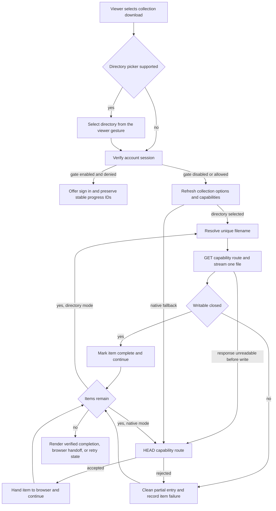
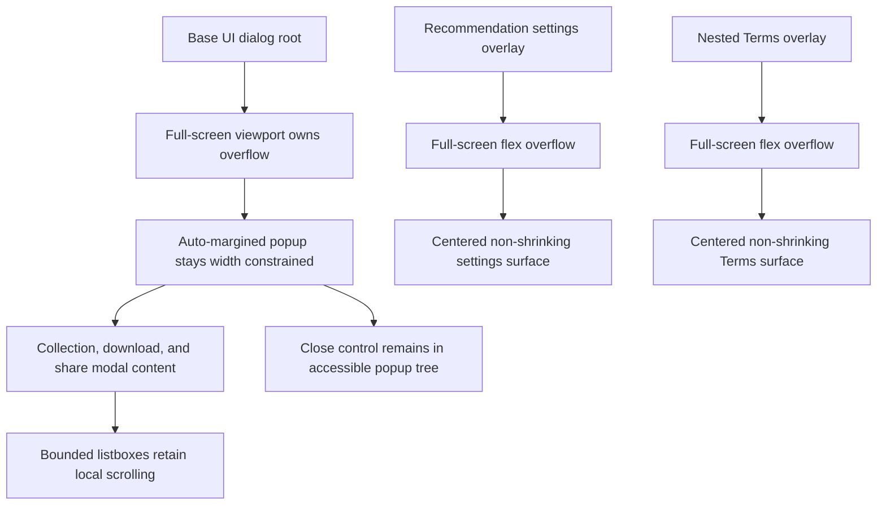

# Watch Collection Download Reliability and Modal Polish - Plan

## Goal Capsule

- **Objective:** Viewers can download every available episode in a collection with honest progress and recovery behavior, while Watch dialogs remain fully reachable on short and narrow screens.
- **Means:** Use a refreshed opaque download-capability batch, sequential stream-to-directory transfers where the browser supports them, acknowledged native-download handoff elsewhere, and viewport-owned modal scrolling. (KTD1, KTD2, KTD5)
- **Authority:** This plan and the user-settled product decisions govern the change. Repository security, accessibility, localization, and generated-contract rules remain mandatory.
- **Execution profile:** Code changes in `apps/web` plus roadmap and solution documentation.
- **Stop conditions:** Stop before shipping if raw media URLs reach client output, application logs, or analytics; a supported transfer path can report clean completion for an incomplete batch; or a modal becomes unreachable by viewport scrolling.
- **Tail ownership:** Prepare one PR, babysit its checks and review state, then squash-merge it when merge-ready as requested.

---

## Product Contract

### Summary

Harden collection downloads so supported Chromium browsers write one episode at a time to a selected folder and other browsers validate each download route before handing it to the native download manager. Rebuild retry work from fresh collection metadata, distinguish verified completion from browser handoff, and preserve pending work after cancellation or authentication expiry. Finish the collection modal polish and move scrolling for the affected Watch dialogs to the viewport edge.

### Problem Frame

The existing anchor queue marks an episode complete as soon as it clicks a link, so a collection can claim success while the browser saves only a subset. The replacement adds a verifiable directory path, but the current draft still expires all capabilities after 15 minutes, replays stale retry URLs, overwrites same-named files, and can classify cancellation as clean completion. The affected dialogs also need one consistent page-level scroll model and the collection summary needs the user-directed visual hierarchy.

### Key Decisions

- **Viewport scrolling owns modal overflow** (session-settled: user-directed — chosen over inner modal scrolling: the scrollbar must appear at the page edge and all content must remain reachable). Governs R8 and R9.
- **Successful completion makes Close primary and Download again secondary** (session-settled: user-directed — chosen over a primary repeat action: closing is the expected next step after a clean batch). Governs R7.
- **Folder guidance appears only when it is useful** (session-settled: user-directed — chosen over an always-visible “Choose download folder” hint and separator: the folder picker already explains the action when it opens). Governs R7.
- **The collection summary uses a natural perspective stack** (session-settled: user-directed — chosen over equal-size upright cards and a tall decorative heap: nearer cards should dominate while muted, smaller layers stay close behind). Governs R6.
- **Known total size is a third centered line** (session-settled: user-directed — chosen over inline size text: count, unit, and size need a compact scan order). Governs R6.

### Requirements

**Download integrity and recovery**

- R1. The directory-capable path downloads one episode at a time and counts it complete only after its file write closes.
- R2. The native-download path performs a route acknowledgement under the configured account-access policy before each browser handoff and never describes that acknowledgement as verified disk completion.
- R3. A collection start or retry uses fresh capabilities that remain valid for the expected lifetime of a large browser session.
- R4. Authentication expiry, cancellation, and item failures preserve stable remaining-item identity so retry does not repeat completed episodes.
- R5. Directory writes use a compatible sanitized non-conflicting filename, never silently overwrite an existing file, and remove a partial entry after cancellation or transfer failure.

**Collection modal presentation**

- R6. The summary shows a close, progressively smaller and more muted file stack beside a centered bordered count, with total size shown only when every selected rendition supplies size metadata.
- R7. The modal omits the pre-action folder hint and action separator, matches language and quality field surfaces, and uses the settled clean-completion action hierarchy.

**Modal behavior and safeguards**

- R8. Collection download, single-video download, share, recommendation settings, and nested Terms dialogs put general vertical overflow on the full-screen viewport rather than an inner modal body.
- R9. Page-level scrolling preserves horizontal centering, fixed accessible close controls, background scroll locking, and intentional bounded scrolling inside listboxes and other option surfaces.
- R10. Raw media targets remain server-only and every capability request still enforces the configured account-access policy, media identifier binding, authenticated-account binding when the gate is active, origin allowlisting, DNS validation, and filename sanitation; only GET consumption records a download event.
- R11. Collection metadata and capability generation remain lazy and begin only after download intent, preserving the existing client-loading boundary.
- R12. If a directory transfer fails before file creation because the redirected response cannot be fetched or read, the current and remaining items demote to native browser handoff while earlier verified files stay complete.

### Key Flows

- F1. Directory-backed collection download
  - **Trigger:** A viewer selects Download all in a browser with File System Access support.
  - **Steps:** Open the directory picker directly from the viewer gesture, apply the configured session gate, refresh collection capabilities, choose a unique filename, stream one response, close its writable, then advance to the next item.
  - **Outcome:** The modal can report verified completion for every successfully closed file.
  - **Covered by:** R1, R3, R5, R10, R11.
- F2. Native browser handoff
  - **Trigger:** A viewer selects Download all where directory selection is unavailable, or a directory response has a transport-level failure before its file is created.
  - **Steps:** Apply the configured session gate, refresh capabilities, acknowledge each route with HEAD, trigger its anchor, and pace the next handoff.
  - **Outcome:** The modal reports browser handoff and warns that browser download settings or multi-download permission govern the final saves.
  - **Covered by:** R2, R3, R10, R12.
- F3. Interrupted batch recovery
  - **Trigger:** A batch is canceled, partially fails, or loses authentication.
  - **Steps:** Restore the selected language and tier, keep completed stable IDs, derive runnable and unavailable pending IDs against refreshed options, and retry only the runnable set while unavailable IDs remain failed.
  - **Outcome:** Completed episodes are not duplicated, stale capabilities are not replayed, and unavailable pending IDs prevent a false clean-completion state.
  - **Covered by:** R3, R4, R5.

### Acceptance Examples

- AE1. **Covers R1 and R5.** Given a selected directory already contains `01_Opening-Invitation_English_en_1080p.mp4`, when the first episode downloads, then the new file uses a non-conflicting compatible name and progress advances only after the writable closes.
- AE2. **Covers R2.** Given a browser without `showDirectoryPicker`, when all route acknowledgements succeed, then every anchor is triggered in order and the terminal label describes browser handoff rather than finished files.
- AE3. **Covers R3 and R4.** Given a capability batch was loaded more than 15 minutes ago or restored after sign-in, when retry begins, then the queue is rebuilt with fresh capabilities and excludes already completed episode IDs.
- AE4. **Covers R4 and R7.** Given a viewer cancels after five of thirty-three files, when the queue stops, then the modal does not show the clean-completion actions and its retry action targets the remaining twenty-eight.
- AE5. **Covers R8 and R9.** Given a short landscape viewport and a tall dialog, when the viewer scrolls, then the scrollbar is at the viewport edge, the full popup is reachable, and the close control stays fixed inside the accessible dialog tree.
- AE6. **Covers R12.** Given a selected directory and some earlier files may already be verified, when a redirected response is blocked by CORS or has no readable body before file creation, then the queue keeps prior completions and switches the current and remaining items to acknowledged native handoff with the browser-handoff terminal message.
- AE7. **Covers R6.** Given a collection where every selected rendition reports valid size, when the modal opens, then progressively smaller and more muted layers sit close behind the dominant front card and count, `videos`, and total size render as three centered lines inside the bordered block; when any selected rendition lacks valid size, the size line is absent.

### Scope Boundaries

**In scope**

- Collection download capability, queue, retry, cancellation, directory naming, status semantics, and modal presentation.
- Shared page-level scroll presentation for the reported Watch dialogs and recommendation settings dialog.
- Focused regression tests, browser verification, roadmap state, and a durable solution note.

**Outside scope**

- Guaranteed browser-manager or disk completion on browsers that expose only anchor downloads.
- Server-side ZIP creation, media proxying through Web, resumable cross-session byte ranges, or a native app download manager.
- Unrelated framed dialogs such as the beta-tester iframe and changes to single-video download rules beyond shared modal presentation.

### Assumptions

- A freshly minted capability lifetime of one day is a bounded security window that covers a realistic long-running browser batch; authenticated-account binding and retry refresh prevent the longer lifetime from becoming the only control. A suspended tab that crosses the boundary fails honestly and retry remints the remaining work.
- Cancellation uses the existing retry action copy where possible so the change does not require translating a new catalog key across every locale.
- The existing rendition `size` field is authoritative enough for an estimate; missing or invalid size data hides the total rather than triggering a discovery request.

### Sources

- `docs/roadmap/topic-experiences/feat-251-watch-collection-sequential-downloads.md`
- `docs/roadmap/platform/feat-457-watch-modal-page-scroll.md`
- `docs/solutions/ui-bugs/watch-collection-anchor-queue-false-completion.md`
- `docs/solutions/ui-bugs/watch-download-modal-safeguards-can-regress-independently.md`
- `docs/solutions/ui-bugs/watch-modal-close-button-viewport-accessibility.md`
- `docs/solutions/ui-bugs/watch-mobile-language-modal-overflow-20260619.md`
- `docs/solutions/design-patterns/button-render-prop-over-raw-buttonvariants-20260511.md`

---

## Planning Contract

### Key Technical Decisions

- KTD1. **Mint encrypted, identifier-bound download capabilities at collection lookup and refresh them at each batch start.** Preserve anonymous capability use when the runtime account gate is disabled; when it is active, bind the capability to the authenticated session subject and reject a previously subjectless capability. Use a one-day expiry so a multi-gigabyte sequential session does not deterministically expire mid-batch, while the route remains the consumption-time security boundary for R3 and R10. Derive the encryption key from the required root secret with the existing versioned capability-specific context; rotating the root secret intentionally invalidates outstanding capabilities.
- KTD2. **Progressively enhance transfer execution.** Use response streaming into a selected `FileSystemDirectoryHandle` when supported and HEAD-before-anchor browser handoff elsewhere; the first pre-write transport failure at any queue position demotes the current and remaining directory items to native handoff as required by R12.
- KTD3. **Persist stable progress, not executable URLs.** Store the selected language, quality tier, completed episode IDs, pending episode IDs, and minimal display metadata in per-tab session storage keyed by collection and language. Clear it after verified completion, reconcile unavailable pending IDs as failures, and rebuild runnable items from fresh options for R3 and R4.
- KTD4. **Resolve directory filename collisions before opening a writable and clean up failed writes.** Probe the selected directory, append a compatible numeric suffix instead of truncating an existing file, abort the active writable on failure, and remove the newly created partial entry for R5.
- KTD5. **Use an untransformed flex viewport with auto-margined, non-shrinking popup content.** Share the Watch presentation classes and mirror them for the recommendation and nested Terms overlays so R8 and R9 keep the close control viewport-fixed.
- KTD6. **Derive presentation from existing metadata and merge style overrides.** Sum selected rendition sizes without extra requests and use `cn()` for conflicting utility classes so R6, R7, and R11 remain stable.

### High-Level Technical Design

The following diagrams are directional and make the protocol and component relationships explicit; the requirements and KTDs remain authoritative.

### Sequencing

1. Stabilize capability duration, refresh, persisted retry identity, terminal-state classification, and collision-safe directory writes.
2. Reconcile modal behavior and truthful status presentation with the hardened queue.
3. Finish the shared page-level scroll and visual hierarchy work without weakening existing safeguards.
4. Run focused and full validation, browser smoke, roadmap regeneration, and documentation reconciliation before shipping.

### Risks and Mitigations

- **Capability replay window:** A one-day expiry is longer than the current draft. Bind gated capabilities to the authenticated subject and keep them encrypted, media-identifier-bound, account-gated, allowlisted, DNS-validated, and refreshed per batch. The same-origin capability remains a query parameter, so application code must not log or emit it; platform access-log policy is unchanged by this application-scoped PR.
- **Browser API variance:** File System Access is not portable across browsers or mobile operating systems. Keep a tested native-download fallback and describe its weaker completion guarantee.
- **Existing-file damage:** `createWritable()` truncates an existing file. Resolve a unique name before creating the writable and test repeated downloads.
- **Cross-origin streaming:** Directory mode depends on the validated redirect target exposing CORS. Demote any pre-write transport failure to native handoff, treat failures after file creation as retryable item failures, and preserve earlier verified progress.
- **Accessibility regression:** A transformed ancestor can change the containing block for the fixed close control. Keep the viewport untransformed and verify focus/scroll behavior in a real browser.

---

## Implementation Units

### U1. Harden capability lifecycle and route consumption

- **Goal:** Produce fresh, usable capabilities for long collection sessions without weakening the download route security boundary.
- **Requirements:** R3, R10, R11; AE3; KTD1.
- **Dependencies:** None.
- **Files:** `apps/web/src/lib/watch-download-capability.ts`, `apps/web/src/lib/watch-download-capability.test.ts`, `apps/web/src/lib/watch-collection-download-actions.ts`, `apps/web/src/lib/watch-collection-download-actions.test.ts`, `apps/web/src/lib/fragments/watch-video.ts`, `apps/web/src/app/api/download/route.ts`, `apps/web/src/app/api/download/route.auth.test.ts`, `apps/web/src/components/watch/download-link.ts`, `apps/web/src/components/watch/download-options.ts`.
- **Approach:** Keep raw targets in the server action, mint a refreshed capability batch at download start, bind gated tokens to the current authenticated subject, use a bounded one-day expiry, and validate every decrypted target through the existing route gates. Preserve anonymous capability downloads when the runtime gate is disabled, but reject a subjectless capability if the gate becomes active before consumption. Derive the key with the existing capability-specific version context so root-secret rotation invalidates old tokens without sharing raw key material across purposes. Reject missing, modified, expired, oversized, subject-mismatched, identifier-mismatched, disallowed-origin, and unsafe-DNS capabilities without falling back to a different target source. Record the download event on GET only and keep decrypted targets and ciphertext out of application logs and analytics.
- **Patterns to follow:** Existing opaque identifier resolution and `validateTarget` flow in the download route; existing lazy collection action boundary in `SeriesPageClient`.
- **Test scenarios:**
  - A valid matching capability redirects, records the event, and performs no repeated Admin lookup.
  - A token round-trips without exposing the target and remains valid beyond the former 15-minute boundary.
  - Rotating the root secret invalidates a capability minted with the prior derived key.
  - Modified, expired, oversized, identifier-mismatched, disallowed-origin, and private-DNS targets are rejected.
  - A capability minted for one authenticated account is rejected for another account on both GET and HEAD when the account gate is active.
  - A capability minted without a subject while the gate is disabled is rejected if the gate becomes active before consumption.
  - Account gating runs before capability or opaque-ID resolution for GET and HEAD.
  - HEAD acknowledgement records no download event; GET records one opaque-identifier event without the target URL or capability ciphertext.
  - Collection action output includes capabilities but never raw media URLs.
- **Verification:** Capability and route suites prove both the optimized path and every retained security check; no generated GraphQL output changes are needed because the fragment uses existing schema fields.

### U2. Make queue completion, retry, and directory writes lossless

- **Goal:** Keep transfers sequential and make every terminal state recoverable without duplicate or overwritten files.
- **Requirements:** R1, R2, R3, R4, R5, R12; AE1, AE2, AE3, AE4, AE6; KTD2, KTD3, KTD4.
- **Dependencies:** U1.
- **Files:** `apps/web/src/components/watch/collection-download-queue.ts`, `apps/web/src/components/watch/collection-download-queue.test.ts`, `apps/web/src/components/watch/collection-download-options.ts`, `apps/web/src/components/watch/collection-download-options.test.ts`, `apps/web/src/components/watch/CollectionDownloadModal.tsx`, `apps/web/src/components/watch/__tests__/CollectionDownloadModal.test.tsx`.
- **Approach:** Advance directory progress only after `pipeTo()` resolves and closes its destination without a separate close call, resolve sanitized collision-safe filenames, remove partial entries after aborted or failed writes, HEAD-acknowledge fallback anchors, and represent cancel/auth/failure state with stable completed and pending IDs. Demote any pre-write transport failure to native handoff while preserving prior directory completions. Restore language and tier, reconcile unavailable pending IDs as failures, rebuild runnable items from fresh options, and require an exact successful terminal state before showing the settled primary Close action.
- **Execution note:** Start with regression cases for long-lived capability refresh, cancellation after partial completion, and an existing destination filename.
- **Patterns to follow:** `resolveDownloadSequence` for canonical item identity and the existing failed-only result merge for partial recovery.
- **Test scenarios:**
  - Covers AE1. An existing filename gains a numeric suffix and the original handle is never opened for writing.
  - A title with path separators or reserved characters produces a compatible sanitized filename before collision resolution.
  - Cancellation during an active write aborts the writable and leaves no partial directory entry.
  - Directory responses have maximum concurrency one and each completion follows writable close.
  - Covers AE2. Fallback calls HEAD before each anchor and records route rejection without claiming transfer completion.
  - Covers AE3. Restored or retried work intersects stable pending IDs with fresh current candidates and capabilities.
  - Sign-in recovery restores a non-route language and non-default tier before rebuilding the pending queue.
  - Pending IDs missing from refreshed candidates remain visible failures and prevent clean completion.
  - Covers AE4. Cancellation preserves completed items, makes current and unstarted items retryable, and does not show clean completion.
  - Authentication expiry stops the queue and preserves the current plus all unstarted items for sign-in recovery.
  - Covers AE6. A CORS rejection or unreadable body before file creation preserves prior directory completions and switches the current and remaining items to native handoff.
- **Verification:** Queue and modal tests prove ordered execution, honest terminal states, pending-only retry, and collision safety under cancellation and failure.

### U3. Finish the collection modal hierarchy and truthful status presentation

- **Goal:** Present collection scope, choices, progress, and terminal actions with the settled visual hierarchy across responsive sizes.
- **Requirements:** R2, R6, R7, R11; AE2, AE4, AE7; KTD2, KTD6.
- **Dependencies:** U2.
- **Files:** `apps/web/src/components/watch/CollectionDownloadModal.tsx`, `apps/web/src/components/watch/LanguageCombobox.tsx`, `apps/web/src/components/watch/__tests__/CollectionDownloadModal.test.tsx`, `apps/web/src/components/watch/__tests__/LanguageCombobox.test.tsx`, `apps/web/src/components/whats-new/__tests__/WhatsNewLanguageSwitcher.test.tsx`.
- **Approach:** Keep the compact perspective stack and bordered three-line metadata block, hide total size if any selected rendition lacks valid size, remove the pre-action folder hint and separator, and show folder identity only after selection. Use the existing fallback guidance as the non-verifying terminal message, merge field utility overrides with `cn()`, and reserve the primary Close action for exact successful terminal states.
- **Patterns to follow:** Home-page `FREE VIDEO BIBLE LIBRARY` eyebrow styling and shared `Button` variants.
- **Test scenarios:**
  - Covers AE7. Three thumbnail layers shrink and mute with depth, decorative layers remain close, and the front card stays dominant.
  - Count, `videos`, and known size render as centered separate lines inside a 2px rounded border.
  - Missing or invalid rendition size hides the aggregate without a network request.
  - Language and quality triggers resolve to the same opaque surface color after utility merging.
  - Verified directory success and successful native handoff render secondary Download again and primary Close, with distinct status semantics.
  - Cancellation renders secondary Close and primary Retry failed for the remaining IDs.
  - Partial failure renders secondary Close and primary Retry failed; authentication expiry renders secondary Close and primary Sign in.
- **Verification:** Component tests and computed browser styles match the settled hierarchy at narrow portrait and desktop breakpoints without adding eager collection work.

### U4. Standardize page-level scrolling for affected dialogs

- **Goal:** Make tall modal content scroll at the viewport edge while preserving centering, accessibility, and bounded option scrolling.
- **Requirements:** R8, R9; AE5; KTD5.
- **Dependencies:** U3.
- **Files:** `apps/web/src/components/watch/watch-modal-presentation.ts`, `apps/web/src/components/watch/CollectionDownloadModal.tsx`, `apps/web/src/components/watch/DownloadModal.tsx`, `apps/web/src/components/watch/ShareModal.tsx`, `apps/web/src/components/recommendations/RecommendationCookieSettings.tsx`, `apps/web/src/components/watch/__tests__/CollectionDownloadModal.test.tsx`, `apps/web/src/components/watch/__tests__/DownloadModal.test.tsx`, `apps/web/src/components/watch/__tests__/ShareModal.test.tsx`, `apps/web/src/components/recommendations/RecommendationCookieBanner.test.tsx`.
- **Approach:** Put `overflow-y-auto` on full-screen flex viewports and use centered, non-shrinking popup surfaces without inner height caps. Use full auto margins for nested Terms so horizontal centering remains intact, and leave listbox overflow rules untouched.
- **Patterns to follow:** `LanguagePickerPresentation` and `docs/solutions/ui-bugs/watch-modal-close-button-viewport-accessibility.md`.
- **Test scenarios:**
  - Covers AE5. Each affected dialog has viewport overflow, no general inner modal overflow, and reachable content on a short viewport.
  - Nested Terms remains centered on both axes and its body does not own the page scrollbar.
  - The fixed close button stays within the Base UI popup accessibility tree and remains operable after viewport scroll.
  - Language and quality listboxes retain their intentional bounded scrolling.
- **Verification:** Focused component assertions and browser smoke show one page-edge scrollbar, no horizontal overflow at 390px, and no centering regression.

### U5. Close documentation and release gates

- **Goal:** Leave the roadmap and institutional record aligned with the verified implementation.
- **Requirements:** R1 through R12.
- **Dependencies:** U1, U2, U3, U4.
- **Files:** `docs/roadmap/topic-experiences/feat-251-watch-collection-sequential-downloads.md`, `docs/roadmap/platform/feat-457-watch-modal-page-scroll.md`, `docs/roadmap/README.md`, `docs/solutions/ui-bugs/watch-collection-anchor-queue-false-completion.md`.
- **Approach:** Reopen both roadmap tickets as the first execution step and keep them in progress until code and browser gates pass, then mark them complete and regenerate the root index. Reconcile the solution note so it distinguishes verified directory completion from native browser handoff and records retry/collision prevention.
- **Test scenarios:** Test expectation: none -- this unit updates derived planning and solution documentation after behavioral verification.
- **Verification:** Roadmap lint and generated-index checks pass, ticket states match the shipped outcome, and the solution note does not overstate fallback guarantees.

---

## Verification Contract

| Gate                      | Applies to | Required proof                                                                                                                                                                                                                                                                                                                                                                                                                                                                                                                                                                                                                                                                          |
| ------------------------- | ---------- | --------------------------------------------------------------------------------------------------------------------------------------------------------------------------------------------------------------------------------------------------------------------------------------------------------------------------------------------------------------------------------------------------------------------------------------------------------------------------------------------------------------------------------------------------------------------------------------------------------------------------------------------------------------------------------------- |
| Focused behavior tests    | U1-U4      | `pnpm --filter @forge/web test -- --reporter=dot src/lib/watch-download-capability.test.ts src/lib/watch-collection-download-actions.test.ts src/components/watch/collection-download-options.test.ts src/components/watch/collection-download-queue.test.ts src/app/api/download/route.auth.test.ts src/components/watch/__tests__/CollectionDownloadModal.test.tsx src/components/watch/__tests__/DownloadModal.test.tsx src/components/watch/__tests__/ShareModal.test.tsx src/components/watch/__tests__/LanguageCombobox.test.tsx src/components/recommendations/RecommendationCookieBanner.test.tsx src/components/whats-new/__tests__/WhatsNewLanguageSwitcher.test.tsx` passes. |
| Full Web test suite       | U1-U4      | `pnpm --filter @forge/web test` passes without unrelated regression.                                                                                                                                                                                                                                                                                                                                                                                                                                                                                                                                                                                                                    |
| Type and locale contracts | U1-U4      | `pnpm --filter @forge/web typecheck` and `pnpm --filter @forge/web check:provisional-ui-catalogs` pass.                                                                                                                                                                                                                                                                                                                                                                                                                                                                                                                                                                                 |
| Static quality            | U1-U5      | `pnpm --filter @forge/web lint`, `pnpm run format:check`, and `git diff --check` pass.                                                                                                                                                                                                                                                                                                                                                                                                                                                                                                                                                                                                  |
| Roadmap derivation        | U5         | `pnpm --filter roadmap generate:readme` followed by `pnpm --filter roadmap lint` passes with no unreviewed derived changes.                                                                                                                                                                                                                                                                                                                                                                                                                                                                                                                                                             |
| Browser behavior          | U2-U4      | Chromium directory flow, pre-write CORS/body failure demotion after zero or more completed files, a forced unsupported-browser fallback, cancellation/retry, summary hierarchy, and short landscape plus 390px portrait modal flows match AE1-AE7.                                                                                                                                                                                                                                                                                                                                                                                                                                      |
| Loading performance       | U1, U3     | Collection capabilities and media requests remain absent before download intent, and the existing dynamically imported modal boundary remains intact.                                                                                                                                                                                                                                                                                                                                                                                                                                                                                                                                   |
| PR review                 | All        | Compound Engineering code review has no unresolved P0/P1 findings and GitHub checks are green before squash merge.                                                                                                                                                                                                                                                                                                                                                                                                                                                                                                                                                                      |

---

## Definition of Done

- U1 is done when fresh capabilities survive the former expiry boundary, route tests cover the capability security matrix, and raw targets remain server-only.
- U2 is done when sequential completion, pending-only recovery, authentication expiry, cancellation, and collision-safe directory writes pass regression tests.
- U3 is done when the collection modal matches the settled responsive hierarchy and uses truthful terminal wording and action priority.
- U4 is done when all affected dialogs use viewport-owned scrolling without horizontal-centering, close-control, or listbox regressions.
- U5 is done when roadmap status and the solution note describe the verified behavior accurately.
- The complete change passes every applicable Verification Contract gate, includes browser and loading evidence, and has no abandoned experimental code or unrelated cleanup in the diff.
- The PR is squash-merged only after required checks and review findings are resolved.
