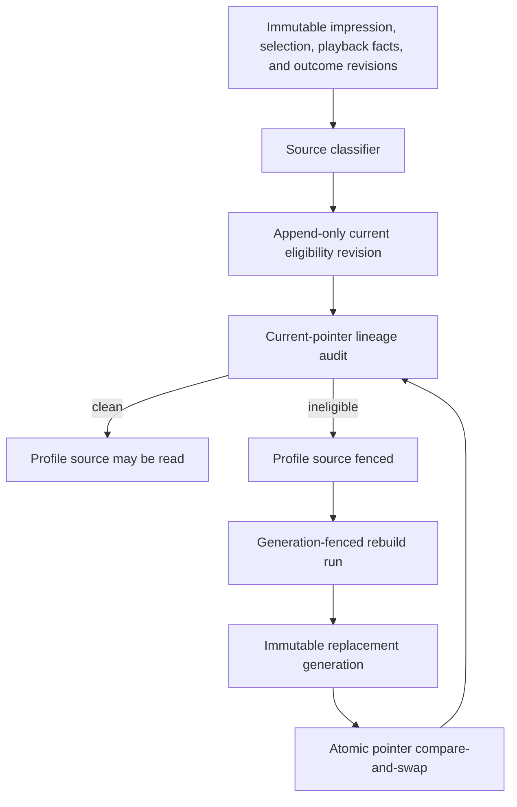
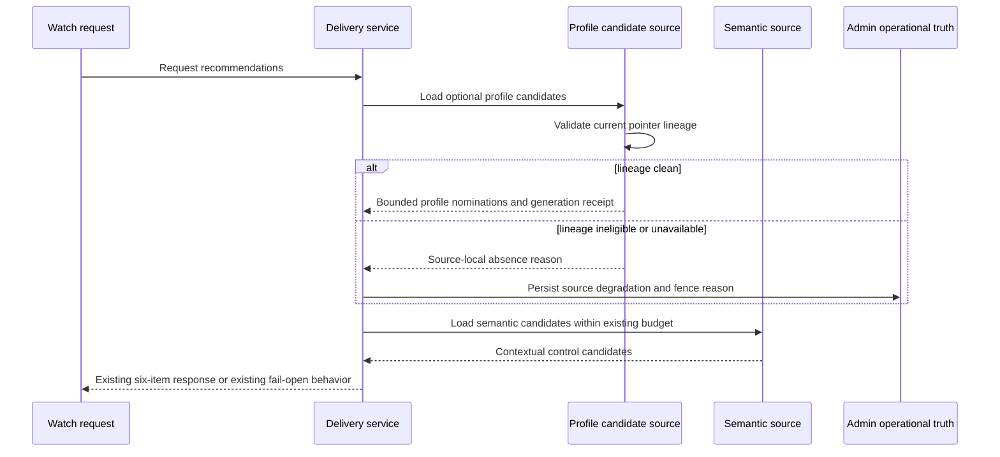
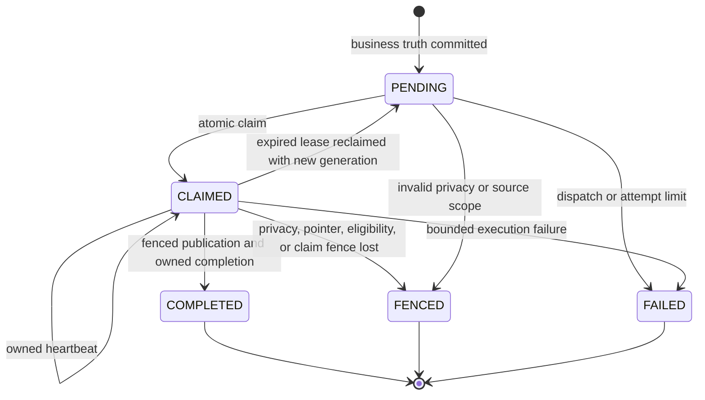

# Recommendation Profile Eligibility Reconciliation - Plan

## Goal Capsule

- **Objective:** Recommendation profile influence stays aligned with current immutable evidence, and operators can prove contaminated live lineage is fenced and repaired without exposing viewer data.
- **Means:** Add source-level eligibility revisions, read-time lineage validation, deterministic replacement publication, reclaimable projection work, a bounded repair scheduler, and privacy-safe reconciliation evidence. (KTD1-KTD9)
- **Authority:** The feat-459 roadmap ticket and the canonical recommendation learning plan govern product behavior. Current code and migrations govern implementation compatibility. This plan resolves only implementation details that those sources leave open.
- **Execution profile:** Deep, cross-surface, privacy-sensitive code change with an additive PostgreSQL migration, Admin services and UI, Web lifecycle verification, real-database concurrency proof, and local browser proof.
- **Stop conditions:** Stop if repair would require rewriting immutable evidence, fabricating an impression or outcome, weakening the 1.5-second service deadline, or enabling profile ranking, learning, experiments, or promotion beyond current authority.
- **Tail ownership:** LFG owns implementation, review, browser verification, commit, push, PR creation, and CI babysitting. The PR must remain unmerged and feat-459 must remain `in-progress` until post-deploy production reconciliation proves the zero-contamination invariant.

---

## Product Contract

### Summary

Forge will make profile contribution eligibility revisable from immutable evidence, fence any published generation whose current lineage is ineligible, rebuild affected scopes into immutable replacement generations, recover abandoned projection work, and expose aggregate reconciliation evidence in Admin. Semantic contextual recommendations remain the live control and fallback throughout repair.

### Problem Frame

Published profile generations preserve exact contribution lineage, but live candidate reads validate only generation, profile, consent, and expiry state. A later eligibility revision or finalized outcome can therefore invalidate a contribution without invalidating the pointer that still serves it. Projection work also has claim timestamps without a bounded reclaim protocol, leaving abandoned work durably pending.

The original 2026-09-06 audit recorded 45 ineligible contributions, 23 affected current generations, 78 later hybrid requests, and 73 stale runs. A read-only production refresh at 2026-09-06 23:17 UTC found 25 ineligible contributions across 24 current pointer generations, 82 hybrid requests referencing affected generations, and 73 pending runs older than 15 minutes. Of the affected outcome sources, 20 have a current `replay_velocity_exceeded` decision and zero committed `playback_transport_replay` receipts; those rows cannot be promoted by policy reinterpretation alone.

### Requirements

**Eligibility truth and immutable evidence**

- R1. Every outcome or selection that contributes to a profile generation has one explicit current eligibility revision derived only from committed immutable source evidence.
- R2. Reclassification appends a revision and atomically replaces current derived eligibility without changing the source impression, selection, episode, fact, outcome, or prior decision.
- R3. A selection is profile-eligible only when the matching committed visibility-qualified impression exists; navigation-only selections remain ineligible.
- R4. Outcome eligibility uses the current finalized `active-watch-proxy-v1` revision and excludes superseded, late, conflicting, unqualified, promotion-fenced, expired, or otherwise policy-ineligible evidence.
- R5. Legacy `replay_velocity_exceeded` outcomes become eligible only when committed receipt evidence proves the counted events were exact-payload transport replays and no integrity conflict exists.
- R6. Identical classification input replays the existing eligibility revision, while a changed immutable evidence digest appends one deterministic superseding revision.

**Serving and repair**

- R7. Live candidate reads reject the optional profile source before retrieval when any current published contribution is no longer profile-eligible.
- R8. A rejected profile source degrades to contextual semantic delivery inside the unchanged 1.5-second complete-service deadline and never blocks navigation or playback.
- R9. Reconciliation rebuilds each affected scope from current eligible evidence into a new deterministic immutable generation, including an empty replacement when no contributors remain.
- R10. Publication swaps the pointer only when privacy generation, source eligibility revisions, input watermark, projection versions, expected pointer generation, run generation, claim, and lease are still current.
- R11. Concurrent reclassification, withdrawal, deletion, and publishers cannot publish stale evidence or replace a newer valid pointer.

**Workflow recovery and operations**

- R12. Pending work that never recorded a runtime start and claimed work whose heartbeat lease expired can be reclaimed with bounded attempts and a new generation-fenced claim.
- R13. Active leases cannot be stolen, and work that loses its claim terminates with a durable bounded reason code without publishing.
- R14. Repeatedly failed or unrecoverable runs reach a durable terminal state and remain visible as aggregate backlog evidence.
- R15. Authorized Admin Recommendations views expose aggregate ineligible lineage, affected pointers, rebuild backlog, replacement publications, stale claims, reclaimed and terminal runs, profile-source serving fences, affected requests, and the post-repair invariant.
- R16. Admin evidence and logs omit profile identifiers, session digests, source identifiers, histories, vectors, and unsuppressed small-cohort detail.

**Compatibility and rollout authority**

- R17. Evidence submission keeps exact-event idempotency, exact-payload conflict detection, partial receipts, late-fact handling, page-exit delivery, and existing attempt and cardinality budgets.
- R18. `active-watch-proxy-v1` remains fail-closed, and this change does not activate or widen profile-derived ranking, learning, experiments, promotion, or serving authority.
- R19. feat-369 and feat-447 remain `in-progress`; feat-459 moves to `in-progress` before implementation and stays there until a post-deploy production audit proves no affected current pointer remains.

### Success Criteria

- A contaminated pointer is rejected on the next profile candidate read before its rebuild finishes, while the request still returns the semantic control slate within 1.5 seconds.
- A complete reconciliation rebuild produces the same input digest and projection as a clean full rebuild from the same current immutable evidence.
- The post-repair audit reports zero current pointers with ineligible lineage before any later profile-learning or rollout ticket can advance.
- Admin can reconcile aggregate source decisions, rebuilds, serving fences, and later clean requests without revealing a viewer or profile history.

### Acceptance Examples

- AE1. **Covers R2, R6:** Given an outcome whose immutable eligibility input has not changed, reclassification returns its current revision; when a finalized outcome supersedes it, reclassification appends one excluded revision with a stable reason.
- AE2. **Covers R3, R7, R8:** Given a current generation containing a selection without a committed eligible impression, live delivery omits the profile source and returns semantic recommendations without waiting for repair.
- AE3. **Covers R5:** Given a legacy `replay_velocity_exceeded` outcome with transport counts but no committed replay receipts, reconciliation keeps it ineligible and records `legacy_transport_receipt_evidence_missing`.
- AE4. **Covers R9-R11:** Given mixed eligible and ineligible contributors, reconciliation publishes a replacement built only from eligible evidence if every expected fence still matches; a concurrent decision or privacy change fences the run and leaves the old pointer unchanged.
- AE5. **Covers R12-R14:** Given an expired claim below the attempt cap, one worker reclaims it and all racing workers lose; at the cap, the run becomes terminal with an operator-visible reason.
- AE6. **Covers R15, R16:** Given one fenced request and one successful replacement, Admin shows suppressed-safe counts and reason codes plus a request trace that names generation metadata but no profile identity, source history, or vector.

### Scope Boundaries

**In scope**

- Additive eligibility, projection-generation, projection-run, and aggregate operational evidence required by R1-R16.
- A bounded reconciliation scan and rebuild path for existing current pointers and abandoned projection work.
- Serving-source degradation and persisted privacy-safe reason codes through the existing semantic fallback path.
- Admin overview, detail, tests, roadmap metadata, and Watch lifecycle regression proof.

**Outside this product's identity**

- New ranking formulas, expanded candidate sources, longer deadlines, changed impression thresholds, or broader personalization authority.
- Production mutation before reviewed code deploys through the normal merge path.
- Raw profile/source inspection in Admin or logs.

### Assumptions

- Reconciliation is an Admin-owned bounded workflow because eligibility, projection, serving audit, and repair truth already live in Admin.
- The first shipment exposes and exercises repair through service/workflow entry points and normal operational scheduling; it does not add a human mutation control that can bypass the bounded worker contract.
- A durable rebuild may choose the newest active linked session deterministically for short-lived session intent. If no active link exists, it publishes from durable evidence only or terminates with a specific source-unavailable reason when privacy state no longer permits publication.
- The fresh production snapshot is evidence for design and PR closeout, not authorization to mutate production from this branch.

---

## Planning Contract

### Key Technical Decisions

- KTD1. **Extend the eligibility ledger to selection sources.** Add selection lineage to the existing append-only eligibility decision model instead of creating a second current-truth table. Outcome and selection contributors then share one revision, replay, digest, and read-time fence protocol. Governs R1-R6.
- KTD2. **Hash the complete immutable classification input.** Persist a bounded input digest and evidence watermark on each eligibility decision. Exact digest replay returns the current revision; changed evidence appends the next revision under the existing serializable source lock. Governs R2, R4-R6.
- KTD3. **Require positive exact-source replay receipts for legacy relief.** Persist a private bounded receipt only after the playback service matches episode, event, and accepted payload digest for an exact replay. Legacy transport counts become exculpatory only when attributable receipts cover them and no conflict exists; request-level audit counts or migrated counters alone are insufficient. Governs R5, R17.
- KTD4. **Fence profile reads with one bounded lineage predicate.** Candidate loading checks every current generation contribution against the current eligible revision and finalized source constraints before loading vectors. It returns a source-local `profile_lineage_ineligible` absence reason that the existing hybrid path persists and degrades through semantic control. Governs R7, R8, R16.
- KTD5. **Make eligibility revision identity part of projection input.** Rebuild evidence carries the selected eligibility decision ID, revision, decision timestamp, and source expiry into deterministic digesting. Publication revalidates those exact current decisions inside its serializable pointer transaction. Governs R9-R11.
- KTD6. **Use compare-and-swap pointer publication for repair.** A repair run captures the expected pointer generation and generation ID. Publication may create and validate a new immutable generation, but pointer replacement occurs only when the expected pointer, claim, run generation, projection versions, input watermark, and privacy generation still match. An empty eligible input is a valid replacement, not a replay of the contaminated generation. Governs R9-R11.
- KTD7. **Reclaim by atomic lease-generation transition.** Add bounded attempt count, lease expiry, last transition reason, and reconciliation cause to projection runs. One conditional update claims pending or expired work, increments generation and attempts on reclaim, and uses claim plus generation on every heartbeat, publish, completion, and failure transition. Governs R12-R14.
- KTD8. **Derive Admin evidence from private truth and return aggregates.** Add aggregate reconciliation queries and safe reason-code breakdowns to the existing authorized overview. Request detail receives only the persisted serving-fence reason and projection metadata already safe for request-scoped audit. Governs R15, R16.
- KTD9. **Run repair as a bounded idempotent scheduler.** A registered Admin workflow scans at most 100 affected pointers and stale runs per five-minute tick, uses five-minute claim leases, and terminates a run after three failed or expired attempts. These bounds cover the refreshed backlog in one page, align with the existing five-minute projection coalescing window, and keep scheduler identity separate from each worker heartbeat. Governs R9, R12-R14.

### High-Level Technical Design

The diagrams are implementation guidance. The requirements and KTDs remain authoritative.

**Eligibility-to-repair data flow**

**Serving sequence**

**Projection-run lifecycle**

### System-Wide Impact

- **Data lifecycle:** Eligibility remains append-only and source expiry bounds each revision. New projection-run fields follow the run's existing 24-hour deletion behavior. Aggregate Admin evidence is computed from existing private rows and does not create a durable identity projection.
- **Serving:** Profile lineage validation adds one indexed bounded existence query before private vector retrieval. Semantic retrieval and the existing deadline remain authoritative if that query rejects or fails.
- **Concurrency:** Eligibility classification, rebuild publication, withdrawal, and pointer replacement meet in serializable transactions with deterministic retry. Queue claims use atomic conditional updates because row reads alone do not prove exclusive ownership.
- **Evidence ingestion:** Browser queues and retry budgets are unchanged. Tests must prove late impressions can reconcile selection eligibility without conflating bounded transport replay with integrity replay.
- **Operations:** The production repair cannot complete in this unmerged PR. Admin must expose the pre-repair baseline, repair backlog, and zero-contamination query so the post-deploy operator can close feat-459 with evidence.

### Risks and Dependencies

- **Serving-query cost:** A contribution anti-join on every profile read could consume the deadline. Mitigate with source/current-decision indexes, at most 64 contributions per generation, query-plan assertions, and real-PostgreSQL latency coverage.
- **False eligibility from legacy counters:** Migration 0075 moved replay counts without receipt lineage. Mitigate with KTD3; the current production sample has no qualifying receipts and must remain fail-closed.
- **Lost updates during repair:** A newer decision or publisher can race a rebuild. Mitigate with KTD5-KTD7 and real concurrent-client tests that assert exactly one pointer wins.
- **Privacy leakage in observability:** Counts can become identifying in small cohorts. Reuse existing suppression and authorization helpers, expose bounded reason enums, and keep source/profile keys out of returned types and logs.
- **Workflow runtime divergence:** Direct job-body tests can miss `start()` and runtime-ID behavior. Preserve truth-before-dispatch tests and add workflow-path coverage following the repository's workflow dispatch pattern.
- **Post-deploy dependency:** Final zero-contamination evidence requires merge, deployment, bounded repair execution, and a new read-only snapshot. Keep the roadmap ticket in progress and make the audit an explicit PR follow-up gate.

### Operational Rollout Notes

1. Before deploy, save the aggregate current-pointer, reason-code, affected-request, and stale-run counts with the query timestamp. Stop if the audit shape or policy version differs from the one covered by tests.
2. Deploy the additive migration and application through the normal PR-to-main path. Keep all existing serving, experiment, promotion, learning, and ranking authority unchanged.
3. Confirm the reconciliation scheduler heartbeat, then watch bounded backlog, reclaim, terminal-reason, serving-fence, semantic-fallback, and replacement-publication counts in Admin.
4. Require the current-pointer invariant to reach zero and remain zero across a later scheduler tick. Confirm a later semantic or clean hybrid request in the authorized trace before closing feat-459.
5. If migration or worker behavior fails, stop the new scheduler and roll application code forward to a corrected revision; leave additive columns and append-only decisions intact. If serving validation fails, retain or restore semantic-only control instead of rolling back to contaminated profile reads.

### Sources and Research

- `docs/roadmap/content-discovery/feat-459-recommendation-profile-eligibility-reconciliation.md` defines scope and verification.
- `docs/plans/2026-08-18-2219-feat-watch-recommendation-learning-system-plan.md` owns the U12, U19, and U30 contracts.
- `docs/roadmap/content-discovery/feat-369-recommendation-playback-episodes-active-playback.md` owns source-neutral playback closeout and remains open.
- `docs/solutions/architecture-patterns/production-recommendation-boundary-hardening-pattern.md` governs deadline, immutable evidence, replay, page-exit, and semantic fallback behavior.
- `docs/solutions/best-practices/admin-postgres-workflow-operations-pattern-20260501.md` and `docs/solutions/best-practices/workflow-dispatch-test-mode-divergence-20260421.md` govern durable work visibility and runtime-path testing.
- `docs/solutions/database-issues/db-lock-must-be-atomic-update-not-select-for-update.md` governs atomic claim ownership.
- PostgreSQL documents serializable retry requirements in [Transaction Isolation](https://www.postgresql.org/docs/current/transaction-iso.html) and identifies `SKIP LOCKED` as suitable for queue-like consumers in [SELECT](https://www.postgresql.org/docs/current/sql-select.html).

---

## Implementation Units

### U1. Add eligibility and projection reconciliation schema

- **Goal:** Add the append-only selection eligibility and bounded projection repair fields required by the reconciliation protocol.
- **Requirements:** R1-R6, R10, R12-R16.
- **Dependencies:** None.
- **Files:** `apps/admin/prisma/schema.prisma`; a new migration under `apps/admin/prisma/migrations/`; `apps/admin/src/services/recommendations/migration.operations.db.test.ts`; relevant migration lifecycle suites.
- **Approach:**
  1. Extend eligibility source type and source-integrity constraints for selection lineage.
  2. Add decision input digest and evidence watermark with backfill-safe defaults or nullable expand-phase handling.
  3. Add a private append-only exact replay receipt bounded by the existing episode capability budget and cascaded with episode retention.
  4. Add run attempt, lease, transition-reason, reconciliation-cause, and expected-pointer fields with strict bounds and state checks.
  5. Add the smallest indexes that support current source lookup, pointer-lineage anti-join, stale-run scan, and aggregate reason counts.
  6. Declare purpose, identity class, access, retention, deletion, ingestion health, and fallback semantics in model comments and defaults.
- **Execution note:** Start with migration tests against real PostgreSQL before changing service code.
- **Patterns to follow:** Migrations 0055, 0062, and 0075; existing partial current-decision index; projection child and pointer guards.
- **Test scenarios:**
  - A selection eligibility revision can reference exactly one selection and rejects missing or mixed source lineage.
  - A decision digest replays under its source-policy revision uniqueness and a changed digest permits the next revision.
  - Attempt, lease, reason, pointer, and state constraints reject invalid or unbounded run transitions.
  - Exact replay receipts reject mismatched episode, event, payload, retention, or unbounded attempt lineage.
  - Existing rows migrate without inventing eligibility or marking a legacy replay as transport-proven.
- **Verification:** Fresh and upgrade migration paths pass against real PostgreSQL, all new constraints and indexes exist, and the migration performs no production data repair.

### U2. Make contributor classification evidence-complete and replay-safe

- **Goal:** Produce explicit current outcome and selection eligibility from immutable evidence, including fail-closed legacy replay adjudication.
- **Requirements:** R1-R6, R17, R18; AE1, AE3.
- **Dependencies:** U1.
- **Files:** `apps/admin/src/services/recommendations/integrity-policy.ts`; `apps/admin/src/services/recommendations/integrity.service.ts`; `apps/admin/src/services/recommendations/playback.service.ts`; `apps/admin/src/services/recommendations/integrity-policy.test.ts`; `apps/admin/src/services/recommendations/integrity.service.test.ts`; `apps/admin/src/services/recommendations/playback.service.test.ts`; new real-database integrity concurrency coverage if needed.
- **Approach:**
  1. Build source-specific immutable classification envelopes for selections and current finalized outcomes.
  2. Include committed impression, outcome supersession, late/conflict state, promotion fence, expiry, exact replay receipts, and policy inputs in KTD2's digest.
  3. Under the source advisory lock, return the current row for an identical digest or atomically demote it and append the next revision for changed evidence.
  4. Apply KTD3 to legacy replay decisions and use bounded stable reason codes for insufficient receipt evidence.
- **Execution note:** Characterize current exact replay and conflict behavior before replacing the unconditional playback replay input.
- **Patterns to follow:** `RecommendationIntegrityService.writeDecision`; recommendation evidence digest helpers; serializable transaction retry; playback replay/conflict receipts.
- **Test scenarios:**
  - Covers AE1. Identical selection and outcome classification returns one revision; a changed finalized outcome appends exactly one superseding decision.
  - A selection without an impression is excluded, then a late committed eligible impression appends an eligible revision without changing the selection.
  - Covers AE3. Legacy transport counts without matching committed receipts stay ineligible; sufficient exact replay receipts with no conflict permit ordinary policy evaluation.
  - Same event and payload remains a replay, different payload remains a conflict, and lost acknowledgement followed by retry does not append duplicate eligibility.
  - Partial receipt batches and exceeded submission budgets do not fabricate eligibility.
  - Two concurrent classifiers produce one current revision and a monotonic revision sequence.
- **Verification:** Unit and real-database tests prove one current source decision, exact digest replay, fail-closed legacy handling, and unchanged ingestion budgets.

### U3. Fence live profile sources on current lineage

- **Goal:** Prevent a contaminated current generation from reaching private profile retrieval and preserve semantic service behavior.
- **Requirements:** R7, R8, R15-R18; AE2.
- **Dependencies:** U1, U2.
- **Files:** `apps/admin/src/services/recommendations/candidates/profile-candidate.service.ts`; `apps/admin/src/services/recommendations/candidates/profile-candidate.service.test.ts`; `apps/admin/src/services/recommendations/candidates/profile-candidate.db.test.ts`; `apps/admin/src/services/recommendations/delivery.service.ts`; `apps/admin/src/services/recommendations/delivery.service.test.ts`; `apps/admin/src/services/recommendations/delivery-retriever.db.test.ts`.
- **Approach:**
  1. Evaluate KTD4's bounded current-lineage predicate in the same candidate read snapshot used to select the pointer.
  2. Return a safe source-local absence reason before loading interest vectors when any contributor fails current eligibility or finalized-source checks.
  3. Preserve the absence reason through candidate evidence and personalization decision persistence.
  4. Use the existing hybrid failure path to refill from semantic control without adding a new wait or deadline.
- **Execution note:** Add a failing real-database serving test before modifying the pointer query.
- **Patterns to follow:** Existing profile lifecycle fences, hybrid source-failure evidence, semantic fallback reason mapping, complete-service benchmark fixture.
- **Test scenarios:**
  - Covers AE2. A published generation becomes ineligible after a decision revision and the next candidate read returns no profile candidates.
  - Mixed clean and invalid contributors fence the whole optional source; a clean replacement restores profile nomination.
  - Selection without an eligible impression fences lineage even if its navigation selection committed successfully.
  - Lineage validation query failure is source-local degradation and semantic delivery still returns inside 1.5 seconds.
  - Admin-persisted request evidence names only the safe fence reason and generation metadata.
- **Verification:** Real-PostgreSQL retrieval and complete-service tests prove pre-vector fencing, semantic fallback, six-item behavior, and unchanged deadline.

### U4. Publish deterministic replacement generations behind all fences

- **Goal:** Rebuild contaminated scopes from current eligible evidence and atomically replace only the expected pointer.
- **Requirements:** R4, R6, R9-R11, R18; AE4.
- **Dependencies:** U1, U2.
- **Files:** `apps/admin/src/services/recommendations/profiles/profile-projection.service.ts`; `apps/admin/src/services/recommendations/profiles/projection.ts`; `apps/admin/src/services/recommendations/profiles/profile-projection.service.test.ts`; `apps/admin/src/services/recommendations/profiles/profile-projection.service.db.test.ts`.
- **Approach:**
  1. Load only current eligible source revisions and carry KTD5 metadata into deterministic ordering and digesting.
  2. Add a repair publication context with expected pointer, run generation, claim, lease, privacy, version, and eligibility revision fences.
  3. Revalidate every selected source and the expected pointer inside the serializable publication transaction after interests are built and before state publication.
  4. Publish a new immutable empty generation when repair removes every contribution, then atomically point to it so contaminated lineage is no longer current.
  5. Fence or fail the building generation with a bounded reason when any expectation changes; never update published children.
- **Patterns to follow:** Existing immutable generation transaction, privacy-generation lock, pointer guard trigger, deterministic medoid projection, serializable retry wrapper.
- **Test scenarios:**
  - Covers AE4. Mixed eligible and ineligible evidence produces a deterministic clean replacement and swaps the expected pointer once.
  - Full rebuild and incremental reconciliation from the same evidence yield identical digests, interests, and contribution lineage.
  - Removing every contributor publishes an empty replacement instead of replaying the contaminated pointer.
  - Concurrent eligibility revision, withdrawal, deletion, stale privacy generation, newer pointer, and lost claim each fence publication.
  - Racing publishers cannot regress the pointer, and failure before swap leaves the previous pointer intact.
- **Verification:** Determinism tests and real concurrent PostgreSQL clients prove source revalidation, atomic pointer replacement, and no published mutation.

### U5. Reconcile affected pointers and recover abandoned projection runs

- **Goal:** Audit current pointers, queue bounded repairs, and reclaim abandoned projection work with durable outcomes.
- **Requirements:** R9-R14, R18; AE4, AE5.
- **Dependencies:** U1, U2, U4.
- **Files:** a focused reconciliation service and tests under `apps/admin/src/services/recommendations/profiles/`; `apps/admin/src/services/recommendations/profiles/job.ts`; `apps/admin/src/services/recommendations/profiles/job.test.ts`; a reconciliation scheduler job and tests; `apps/admin/src/workflows/recommendationProfileProjection.ts`; a reconciliation scheduler workflow and tests; `apps/admin/src/workflows/registry.ts`; `apps/admin/src/instrumentation.ts`; related registry and instrumentation tests.
- **Approach:**
  1. Scan current pointers and stale runs in bounded deterministic pages without returning identity fields to callers.
  2. Append missing contributor eligibility revisions before deciding whether a pointer is affected.
  3. Commit or reclaim run truth before dispatch, capture the expected pointer, and select any linked session deterministically.
  4. Claim and heartbeat through KTD7; check ownership before expensive phases and pass the claim fence into U4 publication.
  5. Persist completed, fenced, failed, and attempt-exhausted reason codes with compare-and-swap transitions.
  6. Register and attach KTD9's scheduler idempotently without coupling its heartbeat to a projection worker heartbeat.
- **Execution note:** Exercise both the actual workflow wrapper and the job body because runtime ID attachment is part of recovery correctness.
- **Patterns to follow:** Existing truth-before-dispatch profile job; experiment heartbeat; promotion claim fencing; Admin PostgreSQL workflow operations pattern.
- **Test scenarios:**
  - A fresh pending run claims once, an active heartbeat cannot be reclaimed, and an expired claim is reclaimed by one worker with a new generation.
  - Covers AE5. Competing reclaimers yield one owner; repeated expiry reaches the bounded terminal reason at the attempt cap.
  - A pending run with no runtime ID is redispatched without creating duplicate business truth.
  - A stale worker cannot heartbeat, publish, complete, or overwrite the new owner's terminal result.
  - An affected pointer queues one coalesced repair; an unavailable or revoked durable scope terminates safely.
  - A bounded full scan and an incremental source-triggered repair reach the same clean-pointer set.
- **Verification:** Unit, workflow-path, and real-database race tests prove bounded reclaim, generation fencing, coalescing, and durable terminal visibility.

### U6. Expose privacy-safe reconciliation and serving evidence in Admin

- **Goal:** Give authorized operators enough aggregate and request-scoped evidence to verify repair and the zero-contamination invariant.
- **Requirements:** R15, R16, R19; AE6.
- **Dependencies:** U1, U3, U5.
- **Files:** `apps/admin/src/services/recommendations/admin-ops/overview-profile-promotion.ts`; `apps/admin/src/services/recommendations/admin-ops/overview.service.ts`; `apps/admin/src/services/recommendations/admin-ops/detail.service.ts`; Admin ops types and tests; `apps/admin/src/app/dashboard/recommendations/recommendation-evaluation-sections.tsx`; `apps/admin/src/app/dashboard/recommendations/request-detail-panel.tsx`; related page and component tests.
- **Approach:**
  1. Add aggregate reconciliation counts, reason breakdowns, stale/reclaimed/terminal run state, serving-fence impact, replacement publication counts, and a computed zero-contamination invariant.
  2. Apply existing authorization, count suppression, bounded reason lists, and unavailable-state behavior.
  3. Extend request detail with the safe persisted profile-source fence and matching generation metadata only.
  4. Put the current invariant and serving impact first, active backlog and recovery second, and bounded historical reasons last.
  5. Render explicit healthy, repairing, degraded, suppressed, and unavailable states in an observational Admin section with no repair mutation or raw identity drill-down.
- **Patterns to follow:** Existing profile/promotion overview, suppression helpers, trace access audit, request detail panels, aggregate-read failure behavior.
- **Test scenarios:**
  - Covers AE6. Authorized overview renders affected pointers, backlog, recovered runs, replacements, fences, request impact, and invariant status.
  - Small counts are suppressed and response objects contain no profile ID, session digest, source ID, vector, or history.
  - Healthy, repairing, degraded, suppressed, and aggregate-read-unavailable states remain distinguishable without relying on color alone.
  - Request detail reconciles a fenced request and a later clean hybrid or semantic request to safe generation metadata.
  - Aggregate read failure returns the established unavailable state without weakening authorization.
- **Verification:** Admin service and page tests snapshot the safe shape, privacy assertions pass, and browser proof can reconcile the lifecycle without database inspection.

### U7. Preserve browser evidence lifecycle and fail-open behavior

- **Goal:** Prove Watch evidence delivery continues to preserve late truth, exact retries, queue bounds, page-exit delivery, navigation, and playback.
- **Requirements:** R3, R8, R17, R18.
- **Dependencies:** U2, U3.
- **Files:** `apps/web/src/components/recommendations/WatchSemanticRecommendations.lifecycle.test.tsx`; `apps/web/src/components/recommendations/RecommendationPlaybackRecorder.test.tsx`; `apps/web/src/app/api/recommendations/evidence/route.test.ts`; `apps/web/src/app/api/recommendations/playback/route.test.ts`; Web source only if a regression test exposes a defect.
- **Approach:** Add integration-level regression cases around existing stable event IDs, receipt completeness, keepalive sends, pending queues, retry limits, and fail-open navigation/player behavior. Do not change the visibility threshold, service deadline, or browser budgets unless a test proves the current implementation violates R17.
- **Patterns to follow:** Existing pagehide/BFCache cases, lost-acknowledgement claim tests, evidence degradation events, mutation admission tests.
- **Test scenarios:**
  - A late impression with a stable event ID commits or replays and can trigger selection eligibility reconciliation.
  - Pagehide starts a keepalive terminal send while an earlier batch is stalled and retains the ordered queue for retry.
  - Partial or invalid receipts retry only within the existing attempt cap and report bounded degradation.
  - Queue and server submission budgets reject overflow without blocking navigation or playback.
  - A fenced profile source does not change click handoff, playback claim, or player startup behavior.
- **Verification:** Full Web tests pass and the browser lifecycle demonstrates no new blocking path or budget expansion.

### U8. Update roadmap state and complete the verification evidence

- **Goal:** Keep roadmap authority accurate and produce the reproducible evidence needed for review and post-deploy closure.
- **Requirements:** R18, R19.
- **Dependencies:** U1-U7.
- **Files:** `docs/roadmap/content-discovery/feat-459-recommendation-profile-eligibility-reconciliation.md`; generated `docs/roadmap/README.md`; test artifacts only where repository conventions retain them.
- **Approach:**
  1. Set feat-459 to `in-progress` before implementation and retain that state in the PR.
  2. Do not change feat-369 or feat-447 status.
  3. Record implemented behavior and local evidence without claiming the post-deploy zero-contamination gate passed.
  4. Make the fresh production audit query and post-deploy repair verification explicit in the PR follow-up section.
- **Patterns to follow:** Roadmap metadata and generated README conventions; ticket completion evidence style.
- **Test scenarios:**
  - Roadmap generation retains feat-369 and feat-447 as in progress and shows feat-459 in progress.
  - Re-running roadmap generation after formatting produces no diff.
  - The ticket text distinguishes local completion from the required post-deploy production invariant.
- **Verification:** Roadmap generation and lint pass, and PR closeout names the baseline, local proof, remaining production gate, and no-merge constraint.

---

## Verification Contract

| Gate                                      | Applicability                | Done signal                                                                                                                                                                                                 |
| ----------------------------------------- | ---------------------------- | ----------------------------------------------------------------------------------------------------------------------------------------------------------------------------------------------------------- |
| Admin unit and integration suite          | U1-U6                        | `pnpm --filter @forge/admin test` passes with new eligibility, serving, workflow, Admin, and migration cases.                                                                                               |
| Web lifecycle suite                       | U7                           | `pnpm --filter @forge/web test` passes with pagehide, late evidence, retry, budget, and fail-open cases.                                                                                                    |
| Admin static checks                       | U1-U6                        | `pnpm --filter @forge/admin lint` and the Admin typecheck pass.                                                                                                                                             |
| Web static checks                         | U7                           | `pnpm --filter @forge/web lint` and the Web typecheck pass.                                                                                                                                                 |
| Real PostgreSQL migration and concurrency | U1-U5                        | Fresh/upgrade migrations, concurrent classification, claim reclaim, withdrawal, racing publisher, and atomic pointer tests pass against PostgreSQL.                                                         |
| Complete-service deadline                 | U3                           | The real-database hybrid retrieval benchmark remains below 1.5 seconds and semantic fallback still returns the established response shape.                                                                  |
| Privacy-safe Admin                        | U6                           | Aggregate and request-detail tests prove authorization, suppression, bounded reasons, and absence of profile/source identity and vectors.                                                                   |
| Browser Watch-to-Admin lifecycle          | U3, U6, U7                   | A real browser demonstrates contaminated profile fencing, semantic or clean hybrid delivery, fail-open navigation/playback, and the matching authorized Admin evidence with no attributable console errors. |
| Roadmap                                   | U8                           | `pnpm --filter roadmap generate:readme` is repeatable and `pnpm --filter roadmap lint` passes.                                                                                                              |
| Production baseline                       | Planning and PR closeout     | Read-only counts are reported with audit time and query semantics; no production mutation occurs from the feature branch.                                                                                   |
| Post-deploy closure                       | After merge, outside this PR | Bounded repair completes and a fresh read-only current-pointer audit reports zero ineligible lineage before feat-459 can be marked complete.                                                                |

---

## Definition of Done

- Every R1-R19 behavior is implemented or explicitly held by the post-deploy gate identified in R19.
- Every feature-bearing unit's named tests pass, including real PostgreSQL concurrency and publication-fence coverage.
- Live profile reads fence contaminated lineage before vector retrieval and preserve semantic fallback inside the unchanged deadline.
- Reconciliation appends eligibility revisions, publishes deterministic immutable replacements, and never rewrites evidence or a published generation.
- Projection recovery has bounded attempts, lease heartbeats, atomic reclaim, claim-generation fences, and durable terminal reasons.
- Admin exposes privacy-safe aggregate and request-scoped evidence without identifiers, histories, or vectors.
- feat-459 is `in-progress`; feat-369 and feat-447 remain `in-progress`; roadmap generation and lint pass.
- The Watch-to-Admin browser lifecycle passes without attributable console errors.
- The branch is reviewed against latest `origin/main`, all eligible findings are resolved, CI is green, and a merge-ready PR is open but not merged.
- The PR records the 2026-09-06 23:17 UTC production baseline of 25 ineligible contributions, 24 affected pointer generations, 82 affected hybrid requests, and 73 abandoned pending runs, plus the zero-of-20 committed-receipt result for legacy replay-velocity outcomes.
- Dead-end experiments, debug output, temporary audit files, and sensitive values are absent from the final diff.
- Post-deploy repair and zero-contamination production verification remain an explicit blocking follow-up before roadmap completion.
