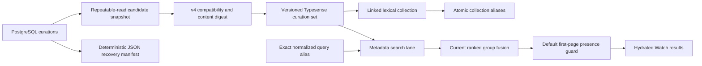
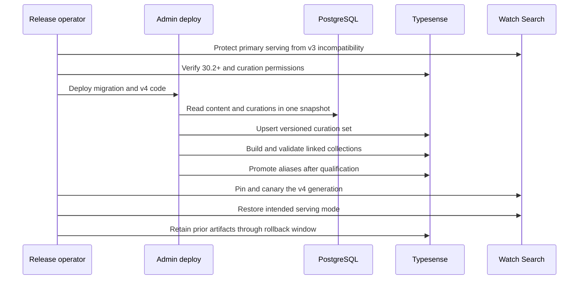

# Watch Search Curation Integration - Plan

## Goal Capsule

**Objective:** A viewer who searches for “Rescue Project” can find the Visual Vernacular intro on the first default results page in every published localization where that video can be played, while JESUS and unrelated searches retain their existing behavior.

**Means:** Store editorial search curations in PostgreSQL, compile them into versioned Typesense curation sets during candidate-index publication, and retain a deterministic JSON recovery manifest (KTD1, KTD2, KTD3).

**Authority hierarchy:** The Product Contract owns user-visible behavior. The Planning Contract owns implementation and rollout mechanics. The current `origin/main` search architecture and repository conventions outrank the older source patch when they conflict.

**Stop conditions:** Do not merge into an auto-deploying production branch until the live Typesense cluster is confirmed compatible with curation sets and the active Watch Search serving mode is safe for the candidate contract revision change. Stop if the Rescue video has no published searchable localization, the required Typesense key lacks curation-set permissions, or the live cluster is older than Typesense 30.2.

**Execution profile:** Deep, because the change includes a database migration, an external search service, a serving-index contract change, and a production cutover.

**Tail ownership:** The shipping workflow owns the PR, CI, rollout evidence, and authorized merge. Keep the previous candidate collection and curation set available through the rollback window.

### Production-path scope correction (2026-09-07)

Production verification after PR #2184 showed that the active PostgreSQL Watch
Search path still omitted the intro. The user clarified that FGE-125 is a bug
fix and must not depend on activating the experimental Typesense search. The
existing exact-title PostgreSQL retrieval now consumes the same exact curation
aliases, preserves organic ranking when the target is already present, and
guarantees a playable curated target on the default first page. Typesense
candidate promotion remains outside the completion path for this ticket.

---

## Product Contract

### Summary

Restore the Rescue Project Visual Vernacular intro through a narrowly scoped editorial curation. The curation applies to the normalized exact query and its reviewed localized aliases. It targets only published, playable localizations of Core video `13_0-RPGospelIntro`. PostgreSQL is authoritative, and a committed JSON export provides a reviewable disaster-recovery copy.

### Problem Frame

The Rescue Project intro disappeared from Watch Search because its relevant Core keywords are not represented in the current search documents. Broad keyword inheritance would affect many clips and could alter JESUS results. A Typesense-only pinned hit would isolate the query, but a reindex can orphan or erase unmanaged curation state and it offers no durable path to an editorial interface.

### Key Decisions

- **Use PostgreSQL as the authority and a generated JSON file as recovery evidence.** (session-settled: user-directed — chosen over Typesense-only persistence: the database supports a future editorial interface and the manifest remains human-reviewable if database data is lost.) Governs R6, R7, R8.
- **Match only the normalized exact Rescue Project query and localized aliases.** (session-settled: user-directed — chosen over broad Core keyword inheritance: the behavior must not leak into JESUS or unrelated searches.) Governs R1, R4, R5.
- **Guarantee first-page presence without forcing a fixed final rank.** (session-settled: user-directed — chosen over pinning the result to rank one: existing fusion should retain control whenever the curated result already appears on the first page.) Governs R2, R3.
- **Target published video localizations rather than materializing all database locales.** (session-settled: user-directed — chosen over creating rules for more than 2,000 locale records: the curation should follow playable content coverage and the English alias can serve all published target localizations.) Governs R1, R5, R9.

### Requirements

#### Search behavior

- R1. The normalized exact query `rescue project` and its stored localized aliases include published Watch Search documents for Core video `13_0-RPGospelIntro` as curated candidates.
- R2. A default first-page request keeps the curated video at its natural fused position when that position is within the first 20 groups.
- R3. A default first-page request moves the curated video to slot 20 when fusion would otherwise place it later, without duplicating it or changing the order of other groups.
- R4. JESUS, partial Rescue queries, and unrelated queries do not activate this curation.
- R5. Search only returns localizations that satisfy the existing public visibility and playback rules; it never synthesizes a fallback localization.

#### Editorial durability

- R6. PostgreSQL stores curation identity, aliases, targets, provenance, enablement, audit fields, and stable ordering.
- R7. Candidate-index publication compiles enabled database curations into a versioned Typesense curation set and links the lexical collection to that exact set.
- R8. A deterministic export and check command keeps the committed JSON recovery manifest byte-stable and detects drift from PostgreSQL.
- R9. The seed contains the English alias plus the currently approved localized aliases with machine-translation provenance; newly published locales require an editorial or import update for new localized query aliases.

#### Operations and compatibility

- R10. Candidate generations built under the pre-curation search contract cannot qualify or serve after this change.
- R11. Publication fails before alias promotion when an enabled curation resolves to zero published searchable target documents.
- R12. Publication cleans up a newly created curation set after a pre-promotion failure, but retains it when lexical alias rollback fails or after successful publication until the rollback window closes.
- R13. The existing server-side publication key adds only `curation_sets:upsert` and `curation_sets:delete` to its required collection, document, and alias actions; search-only clients never receive curation write access.
- R14. Production rollout preserves the current primary serving path while a compatible candidate generation is built, qualified, pinned, and canaried.

### Actors

- A1. A viewer searches Watch and expects a playable, relevant result in a language they can use.
- A2. An editor or operator owns durable curation data and reviews translated aliases.
- A3. The candidate indexer compiles PostgreSQL state into an atomic serving generation.
- A4. The release operator controls serving mode, qualification, pinning, canaries, and rollback.

### Key Flows

- F1. **Default search:** A viewer submits a normalized exact alias; only the metadata lane enables the matching curation set; fusion ranks all groups; the pagination guard enforces R2 and R3 before hydration.
- F2. **Candidate publication:** The indexer snapshots searchable content and curations in one repeatable-read transaction; it creates the versioned set; it creates the linked lexical collection; it validates both artifacts; it promotes aliases only after qualification.
- F3. **Recovery:** An operator exports PostgreSQL curations to the manifest; a human or AI reviews the diff; the normal code-review and deployment path merges the update. The application does not import the manifest at runtime.
- F4. **Production cutover:** The operator verifies live prerequisites, protects serving from R10, deploys the migration and code, builds a compatible generation, runs canaries, restores the intended serving mode, and observes the rollback window.

### Acceptance Examples

- AE1. **English exact query:** Given published Rescue intro localizations, searching `Rescue Project` returns the video once within the first 20 groups. Covers R1, R2, R3, R5.
- AE2. **Localized exact alias:** Given a stored localized alias and a published target localization, the normalized alias activates the same curation and returns only eligible playable documents. Covers R1, R5, R9.
- AE3. **JESUS isolation:** Searching `JESUS` produces the same group ordering and evidence as the uncurated path. Covers R4.
- AE4. **Near miss:** Searching `rescue`, `the rescue project`, or an unregistered translation does not activate the exact-match curation. Covers R4.
- AE5. **Already visible:** If fusion ranks the video in slot 7, the result stays in slot 7. Covers R2.
- AE6. **Below the fold:** If fusion ranks the video in slot 35 for a default request, it moves to slot 20 and the former slots 1–19 keep their order. Covers R3.
- AE7. **Non-default pagination:** Custom limit and offset requests do not duplicate or reorder the curated group across pages. Covers R2, R3.
- AE8. **Invalid publication:** An enabled curation with no published searchable target aborts candidate publication before alias promotion and reports the curation identity. Covers R11, R12.
- AE9. **Recovery drift:** The manifest check exits unsuccessfully when PostgreSQL differs from the committed canonical JSON and succeeds after a deterministic export. Covers R8.

### Success Criteria

- All seeded aliases resolve without skips in the production candidate build, unless an explicit release decision accepts a documented missing translation.
- Rescue Project canaries pass for every stored alias, and negative JESUS and near-match canaries show no curation activation.
- A compatible candidate generation qualifies and serves without increasing Watch Search fallback or error rates during the observation window.

### Scope Boundaries

#### In scope

- One Rescue Project curation and its current alias set.
- PostgreSQL persistence, deterministic recovery export, Typesense compilation, ranking behavior, migration, tests, and rollout documentation.
- Semantic adaptation to the current four-lane search and candidate-generation architecture.

#### Deferred to Follow-Up Work

- A general editorial interface for creating and reviewing curations.
- Native-speaker review and ongoing maintenance of machine-localized aliases.
- Automatic alias creation when a new target localization is published.

#### Outside this product's identity

- Broadly copying Core keywords into all search clips.
- Creating rules for every locale record when no target video localization or approved query alias exists.
- Runtime restoration from the JSON recovery manifest.

### Dependencies

- Typesense 30.2 or newer with native curation-set support.
- The existing server-side publication key with `curation_sets:upsert` and `curation_sets:delete` added to its current index-publication permissions.
- PostgreSQL migration access and current published Watch Search data.
- Release access to inspect and change the Watch Search serving mode and candidate pin.

### Sources

- Linear issue FGE-125: `https://linear.app/jesus-film-project/issue/FGE-125/restore-visual-vernacular-intro-in-rescue-project-search-results`
- Source implementation commit: `9519bfd78`.
- `docs/solutions/best-practices/precomputed-hybrid-search-serving-index-20260803.md`
- `docs/solutions/integration-issues/typesense-application-revision-invalidates-serving-pin.md`
- `docs/solutions/integration-issues/watch-search-candidate-generation-stable-application-revision.md`
- `docs/solutions/best-practices/admin-watch-search-production-rollout-20260720.md`
- Typesense 30.2 curation-set and API-key documentation: `https://typesense.org/docs/30.2/api/curation-sets.html` and `https://typesense.org/docs/30.2/api/api-keys.html`.

---

## Planning Contract

### Key Technical Decisions

- KTD1. Add normalized PostgreSQL curation, alias, and target tables with deterministic ordering and audit fields. Keep the seed idempotent and preserve all newer `origin/main` Prisma models. (session-settled: user-directed — chosen over Typesense as the source of truth: PostgreSQL supports the future editorial workflow and transactional candidate snapshots.) Implements R6, R9.
- KTD2. Generate a versioned global Typesense curation set before creating its linked lexical collection. Disable curations on exact-title and title lanes, and enable the set only on the metadata lane using `curation_tags`, `filter_curated_hits`, and `remove_matched_tokens: false`. (session-settled: user-approved — chosen over application-side candidate injection: native curation keeps the editorial match in Typesense while isolating it from high-precision lanes.) Implements R1, R4, R7.
- KTD3. Export PostgreSQL state to committed canonical JSON and expose separate export and drift-check commands. Treat the file as recovery evidence, not a runtime mirror. (session-settled: user-directed — chosen over an automatic runtime fallback: reviewed code history is safer than silent recovery from stale data.) Implements R8.
- KTD4. Bump the centralized candidate application contract from `watch-search-candidate/v3` to `watch-search-candidate/v4`. Include canonical curations in the snapshot digest and qualification schema so v3 generations cannot serve. Implements R7, R10.
- KTD5. Carry Typesense's `curated` marker through the current generic `GroupState` fusion model. Apply the first-page guarantee after `rankWatchSearchGroups` and before hydration and page slicing. Implements R2, R3.
- KTD6. Abort publication when any enabled curation produces no searchable documents. Allow individual aliases with no locale-specific document to be skipped only with explicit counters and logs, and require the seeded production canary to report zero skipped aliases. Implements R11, R12.
- KTD7. Port the source patch semantically onto current `origin/main`. Use migration `0079_watch_search_curations` and roadmap identifier `feat-461`; preserve the existing `feat-337` blocker on `feat-334`. Implements all requirements without reverting newer search behavior.

### High-Level Technical Design

The diagrams define relationships and sequencing, not exact function boundaries.

### Assumptions

- The English null-locale alias is intentionally eligible across all published target localizations because the video is Visual Vernacular content for Deaf audiences.
- The 21 localized aliases plus English are the initial editorial snapshot; provenance makes native review possible without blocking this restoration.
- The default first page remains offset `0` with limit `20`.
- Production may auto-deploy after merge. Therefore live version, credential, and serving-mode checks are merge gates rather than post-merge reminders.
- If production access is unavailable from the execution environment, the PR can be made merge-ready but must not be merged until an authorized operator supplies the required evidence.

### System-Wide Impact

- **Data lifecycle:** Curation rows join each candidate snapshot and recovery exports become reviewable repository artifacts.
- **Serving compatibility:** The v4 contract intentionally invalidates older candidate generations.
- **Security:** Global Typesense curation sets extend the publication key's trust boundary; search-only clients retain no curation write access.
- **Search behavior:** Only the metadata lane can introduce curated hits; exact-title, title, semantic, and JESUS behavior remain unchanged.
- **Rollback:** Database rows are additive, while previous Typesense collections and sets remain available until the release is stable.

### Risks and Mitigations

- **Undocumented marker behavior:** Typesense server docs do not specify `hit.curated`, though the official JavaScript client types do. Prove grouped and ungrouped marker propagation against a real 30.2 instance.
- **Candidate outage:** A contract bump can invalidate the active candidate pin. Inspect live serving state first and use F4.
- **Migration collision:** The source patch used migration `0050` and roadmap `feat-378`, both now occupied. Rename per KTD7 and replay migrations from clean and recent schemas.
- **Silent no-op:** A curation that compiles to zero documents would satisfy infrastructure checks but fail the user goal. Enforce KTD6.
- **Translation quality:** Machine aliases can be inaccurate. Keep provenance visible, isolate them to exact normalized matches, and schedule native review.
- **Global curation namespace:** Collection scoping does not bind curation sets. Derive set names from generation identity, add only the two required curation actions to the publication key, and never log or expose that key.

### Sequencing

1. Port persistence and the recovery manifest first.
2. Add the curation compiler and Typesense client boundary.
3. Integrate curation state into v4 candidate publication.
4. Integrate metadata-lane activation and fusion-safe first-page behavior.
5. Complete migration, real-service, regression, and rollout verification.
6. Update operational and roadmap documentation from the final implementation.

---

## Implementation Units

### U1. Persist and export editorial curations

**Goal:** Establish PostgreSQL authority and a deterministic recovery artifact.

**Requirements:** R6, R8, R9; KTD1, KTD3, KTD7.

**Files:** `apps/admin/prisma/schema.prisma`, `apps/admin/prisma/migrations/0079_watch_search_curations/migration.sql`, `apps/admin/src/data/watch-search-curations.json`, `apps/admin/src/services/watch-search-curation-manifest.ts`, `apps/admin/src/scripts/export-watch-search-curations.ts`, `apps/admin/package.json`, and adjacent tests.

**Approach:** Semantically port the schema and seed from `9519bfd78`, preserve current-main models, make all ordering explicit, and expose export and check commands. Seed the Rescue target, English alias, and localized aliases with provenance.

**Test scenarios:**

- A clean migration creates the tables, constraints, indexes, and seed once.
- Reapplying the seed does not duplicate or reorder records.
- Export emits identical bytes for identical database state.
- Check succeeds for matching state and fails with a useful diff when an alias, target, or provenance field changes.

**Verification:** Run focused manifest and script tests, Prisma validation, and migration replay against empty and recent production-like PostgreSQL schemas.

### U2. Compile native Typesense curation sets

**Goal:** Convert durable curation state into a safe versioned Typesense artifact.

**Requirements:** R1, R5, R7, R11, R12, R13; KTD2, KTD6.

**Files:** `apps/admin/src/services/typesense-client.ts`, `apps/admin/src/services/typesense-watch-search-curation.ts`, and adjacent tests.

**Approach:** Add only the curation-set client operations the indexer uses. Compile aliases and published target documents into stable tagged items. Return validation statistics and artifact names for publication and cleanup.

**Test scenarios:**

- The English alias targets every eligible published localization of the Rescue video.
- Locale-specific aliases target eligible localized documents and record skips when none exist.
- Disabled curations do not compile.
- An enabled curation with zero total documents fails compilation.
- Upsert and delete use the correct Typesense 30.2 endpoints and do not require GET permission.

**Verification:** Run focused unit tests and a real Typesense 30.2 integration test for set upsert, linking, filtering, deletion, and grouped `curated` markers.

### U3. Publish curation-aware candidate generations

**Goal:** Make curation state part of atomic candidate generation compatibility.

**Requirements:** R7, R10, R11, R12, R14; KTD4, KTD6, KTD7.

**Files:** `apps/admin/src/scripts/index-typesense-watch-search-candidate.ts`, `apps/admin/src/services/typesense-watch-search-indexer.ts`, `apps/admin/src/services/typesense-watch-search-schema.ts`, the centralized candidate contract revision owner, and adjacent tests.

**Approach:** Load curations inside the existing repeatable-read snapshot, add their canonical digest, bump the shared contract to v4, publish the set before the lexical collection, validate schema linkage and content, and preserve current rollback ordering.

**Test scenarios:**

- Two equivalent snapshots produce the same compatibility digest.
- A curation change changes the digest and generation identity.
- A v3 generation fails v4 qualification.
- Failure before alias promotion deletes new safe-to-delete artifacts.
- Alias rollback failure retains the curation set and reports manual cleanup.
- Successful publication links only the intended lexical collection to its versioned set.

**Verification:** Run candidate, indexer, schema, and compatibility suites; inspect failure-injection coverage for each publication boundary.

### U4. Activate curations without disturbing fusion

**Goal:** Restore the video on the default first page while isolating all other searches.

**Requirements:** R1, R2, R3, R4, R5; KTD2, KTD5.

**Files:** `apps/admin/src/services/typesense-watch-search.service.ts` and adjacent service, ranking, and schema tests.

**Approach:** Disable curations on exact-title and title lanes. Apply tags and curated-hit filtering only to the metadata lane. Propagate the marker through current ranked group state, then enforce the default-page rule before hydration and slicing.

**Test scenarios:**

- Exact English and localized aliases expose the curated group once.
- JESUS, near matches, and unrelated searches send no curation tag and keep existing ranking evidence.
- A curated group already within the first 20 retains its position.
- A curated group below position 20 moves to position 20 without changing earlier relative order.
- Custom offset and limit requests remain stable and duplicate-free.
- Unpublished or unplayable target documents never reach hydration.

**Verification:** Run focused service and ranking tests plus the complete admin test, lint, and typecheck suites.

### U5. Prove deployment and rollback behavior

**Goal:** Produce enough release evidence to merge and operate the change safely.

**Requirements:** R10, R11, R12, R13, R14; F4.

**Files:** `docs/operations/typesense-watch-search-local.md`, the existing Watch Search rollout documentation, and test or script fixtures needed for real-service verification.

**Approach:** Verify live prerequisites without exposing credentials. Protect production from the v3-to-v4 transition. Exercise PostgreSQL migration and Typesense 30.2 publication in disposable environments. Record exact production canaries and rollback order.

**Test scenarios:**

- The real Typesense integration confirms grouped `curated` markers.
- All seeded aliases return the Rescue target in a production candidate canary with zero unexplained skips.
- JESUS and near-match canaries do not activate the curation.
- A forced pre-promotion failure leaves the active aliases untouched.
- A rollback can restore the previous generation while retaining required sets and collections.

**Verification:** Capture cluster version, key capability, active serving mode, compatible candidate qualification, pin, canary, and observation evidence before authorized merge or production cutover.

### U6. Align roadmap and operator documentation

**Goal:** Leave the repository with accurate ownership, recovery, and follow-up guidance.

**Requirements:** R8, R9, R14; KTD7.

**Files:** `docs/roadmap/README.md`, `docs/roadmap/content-discovery/feat-334-watch-search-typesense-parallel-backend.md`, `docs/roadmap/content-discovery/feat-461-watch-search-editorial-curations.md`, and Watch Search operational documentation.

**Approach:** Add the next collision-free roadmap ticket, append its blocker without removing `feat-337`, and document manifest recovery, alias provenance, native-review follow-up, curation permissions, build order, canaries, and rollback.

**Test scenarios:**

- Roadmap validation sees a unique ticket identifier and preserves existing dependency links.
- Documentation distinguishes the PostgreSQL authority from the non-runtime recovery manifest.
- The runbook names the v4 serving transition and does not imply that merge alone completes rollout.

**Verification:** Run repository documentation and roadmap validation commands when present, then review links and commands against the final code.

---

## Verification Contract

### Focused gates

- Run the focused Vitest suites for the manifest, export script, curation compiler, Typesense client, candidate publisher, indexer, schema, search service, and ranking behavior from `apps/admin`.
- Run `pnpm prisma validate` in `apps/admin` with a valid disposable PostgreSQL URL.
- Run `pnpm watch-search-curations:check` against the seeded database after export.

### Full repository gates

- Run `pnpm test`, `pnpm lint`, and `pnpm typecheck` in `apps/admin`.
- Run the repository diff or pre-PR checks required by current `origin/main` and distinguish unrelated baseline failures from regressions with captured evidence.
- Run roadmap and documentation validators that apply to changed files.

### Real-service gates

- Replay all Prisma migrations on an empty PostgreSQL database and apply the new migration to a recent production-like schema.
- Run Typesense 30.2 integration coverage for curation-set lifecycle, collection linkage, metadata-lane filtering, grouped markers, publication cleanup, and rollback retention.
- Before merge into an auto-deploying branch, verify the live Typesense version, dedicated-key actions, active primary serving mode, and current candidate pin.
- Build and qualify a v4 candidate generation; run all stored alias canaries plus JESUS and near-match negatives; pin and observe it under the documented rollout.

### Review gates

- Simplify the final diff without changing behavior.
- Review the diff against repository standards and this Product Contract.
- Run browser testing only if the branch changes a browser-visible route beyond existing GraphQL Watch Search results; otherwise record it as not applicable and use API canaries.

---

## Definition of Done

- R1 through R14 and AE1 through AE9 are implemented and verified.
- U1 through U6 satisfy their test scenarios and verification clauses.
- The migration and roadmap identifiers are collision-free on the final merge base.
- The committed recovery manifest matches the seeded PostgreSQL state.
- A real Typesense 30.2 test proves the native curation marker and lifecycle assumptions.
- Current-main exact-title, title, metadata, semantic, snapshot, digest, and ranking behaviors remain covered.
- Admin tests, lint, typecheck, Prisma validation, documentation checks, and applicable repository checks pass or have documented unrelated baseline evidence.
- Production prerequisites and the v3-to-v4 serving transition are verified before merge when merge auto-deploys.
- The PR explains the PostgreSQL authority, recovery manifest, scoped search behavior, candidate compatibility bump, operational permissions, and rollback.
- Prior candidate artifacts remain recoverable through the observation window.
- Dead-end, duplicated, and obsolete conflict-resolution code is removed from the final diff.
