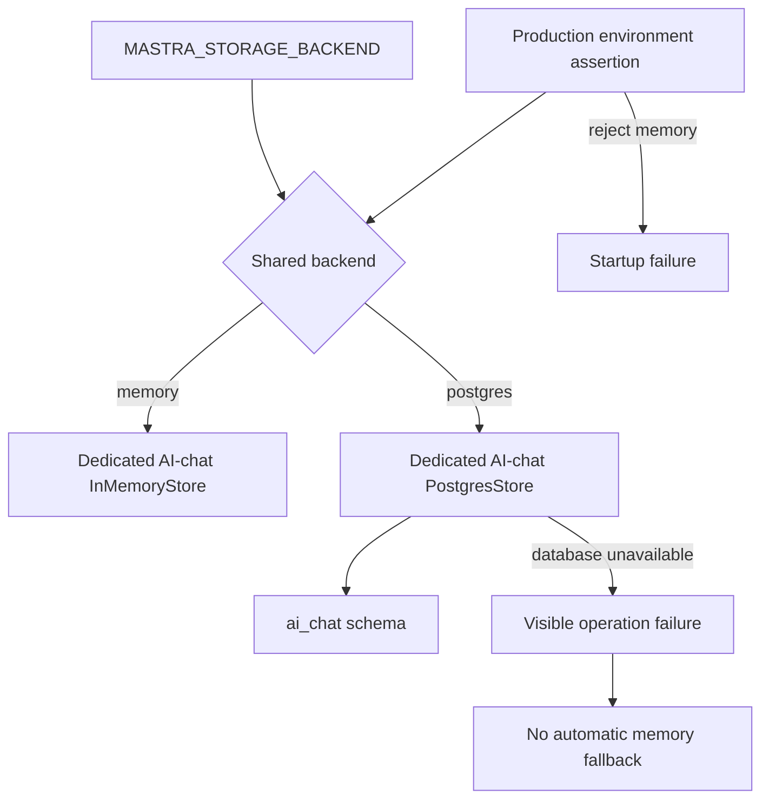

# Retire AI Chat Memory Override - Plan

## Goal Capsule

- **Objective:** Operators have one truthful storage policy for AI chat, and production conversations remain durable in the existing isolated Postgres schema.
- **Means:** Retire `AI_CHAT_MEMORY_BACKEND` and derive AI-chat behavior from `MASTRA_STORAGE_BACKEND` while preserving the dedicated AI-chat store boundary (KTD1, KTD2).
- **Authority:** The Product Contract owns observable behavior. The Planning Contract owns implementation choices. Existing security, ownership, retention, and erasure contracts remain authoritative where this plan does not change them.
- **Execution profile:** Standard, privacy-sensitive refactor across configuration, memory construction, lifecycle jobs, tests, and operator documentation.
- **Stop conditions:** Stop if production is configured with `MASTRA_STORAGE_BACKEND=memory`, if removing the override would require moving or rewriting stored rows, or if any path introduces automatic fallback from Postgres failure to process memory.
- **Tail ownership:** The implementation includes the AI-chat roadmap ticket, living documentation, historical supersession notes, and stale production-variable cleanup guidance.

---

## Product Contract

### Summary

Remove the AI-chat-specific memory backend variable and make the shared Mastra storage backend the only backend selector. AI chat keeps its dedicated `ai_chat` Postgres schema in production and its process-local in-memory store for local and CI runs that set the shared backend to `memory`.

### Problem Frame

`AI_CHAT_MEMORY_BACKEND` was introduced as a production write kill switch. It can make the UI promise durable history while new messages live only in one process, hide existing Postgres history, disable rename, and restore the heap-growth risk that the Postgres migration removed. Production does not set the override, so keeping it adds operational ambiguity without supporting the deployed configuration.

### Key Decisions

- **Retire the AI-chat-only production memory mode.** (session-settled: user-approved — chosen over retaining a production persistence kill switch: the deployed variable is unset and the mode contradicts the product's durability contract.) Governs R1, R3, R7.
- **Preserve in-memory AI chat as a capability, not as unchanged override coverage.** (session-settled: user-approved — chosen over preserving override-specific tests: local and CI behavior remains useful while precedence tests describe a mechanism that will no longer exist.) Governs R4, R8.

### Requirements

**Storage policy and durability**

- R1. `MASTRA_STORAGE_BACKEND` is the only configuration value that selects the AI-chat conversation-memory backend; `AI_CHAT_MEMORY_BACKEND` is no longer parsed, exposed, or consulted.
- R2. Selecting Postgres keeps AI-chat data in the existing dedicated `ai_chat` schema with the current store identity, pool cap, lazy singleton behavior, thread keys, and cross-agent sharing contract.
- R3. Production rejects the shared memory backend at startup, and a Postgres outage remains a visible failure with no automatic in-memory fallback.

**Local, CI, and lifecycle behavior**

- R4. `MASTRA_STORAGE_BACKEND=memory` keeps send, list, and replay available within one process through the dedicated AI-chat `InMemoryStore`; restart or reload still discards that local history.
- R5. Under the shared memory backend, rename refuses before Postgres construction, retention and title repair skip before durable-store or model construction, and erasure remains an explicit Postgres-only operator operation.
- R6. Existing Postgres conversations, retention rules, user erasure guarantees, ownership enforcement, and the 25-day storage disclosure do not change.

**Operations and compatibility**

- R7. Active configuration and operator guidance describe `MASTRA_STORAGE_BACKEND` as the sole selector and `SEEKER_ROUTE_ENABLED=false` as the incident stop for the custom Forge AI-chat routes; the native Mastra agent surface remains contained by the existing network and gateway boundary, and historical records retain their original account with dated supersession notes where needed.
- R8. The Mastra rename response `503 writes_disabled` and the chat proxy mapping to `502 unavailable` remain stable for shared-memory local runs, while tests stop asserting retired override precedence.
- R9. Deployment needs no schema change, data copy, or row migration; a stale deployed `AI_CHAT_MEMORY_BACKEND` becomes inert and should be removed from environment configuration to prevent false operator confidence.

### Acceptance Examples

- AE1. **Covers R1, R2, R3.** Given a production process with the default shared Postgres backend, when AI-chat memory initializes, then it uses a `PostgresStore` in schema `ai_chat`; an unreachable database fails the operation and does not create process-memory history.
- AE2. **Covers R3.** Given `NODE_ENV=production` and `MASTRA_STORAGE_BACKEND=memory`, when runtime environment validation runs, then startup is rejected before the service can serve requests.
- AE3. **Covers R4, R5, R8.** Given a local process with `MASTRA_STORAGE_BACKEND=memory`, when a user sends and recalls a thread, then that process sees the conversation; rename returns `writes_disabled`, retention and title repair skip, and no Postgres store or pool is constructed by those paths.
- AE4. **Covers R5, R6.** Given an authorized erasure invocation with an explicit `DATABASE_URL`, when the shared runtime backend is `memory`, then erasure still targets the durable `ai_chat` Postgres store rather than the conversation-memory singleton.
- AE5. **Covers R1, R9.** Given a stale `AI_CHAT_MEMORY_BACKEND=memory` value beside `MASTRA_STORAGE_BACKEND=postgres`, when configuration is parsed after the change, then AI chat still selects Postgres and the retired variable has no application-level effect.

### Scope Boundaries

**In scope**

- Retire the dedicated environment variable, resolver, comments, and override-only tests.
- Rewire current consumers to the shared backend while preserving their existing local-memory and durable-maintenance contracts.
- Update living guidance and annotate stale historical guidance without rewriting the historical rationale.

**Outside this change**

- No schema rename, table migration, retention-policy change, history API redesign, UI disclosure change, or new emergency storage mode.
- No change to thread ownership, resource identifiers, model selection, title generation content, or the separation between AI-chat and experience-chat data.

### Sources

- `apps/mastra/src/config/env.ts` — current override precedence, persistence predicate, and production shared-memory assertion.
- `apps/mastra/src/mastra/ai-chat-memory.ts` — dedicated store, schema, singleton, and backend-aware memory construction.
- `apps/mastra/src/mastra/ai-chat-history-write-route.ts` — direct-Postgres rename gate and stable `writes_disabled` response.
- `apps/mastra/src/mastra/ai-chat-retention.ts`, `apps/mastra/src/mastra/workflows/title-repair.ts`, and `apps/mastra/src/mastra/ai-chat-erasure.ts` — lifecycle consumers with different durable-store obligations.
- `docs/solutions/workflow-issues/mechanism-retirement-docs-prose-sweep.md` — active-versus-historical documentation classification for retired mechanisms.
- `docs/solutions/best-practices/single-upstream-predicate-bounding-irreversible-blast-radius-20260812.md` — explicit database targeting and non-vacuous construction checks for destructive operations.

---

## Planning Contract

### Key Technical Decisions

- KTD1. **Use the shared backend as the sole runtime selector.** Default AI-chat memory construction reads `MASTRA_STORAGE_BACKEND`, and `canAiChatDataPersist()` remains as the named predicate simplified to that shared backend's Postgres state. (session-settled: user-approved — chosen over retaining a separate AI-chat selector: production already runs with the override unset and one policy is easier to reason about.) Cites R1, R3, R4.
- KTD2. **Share the selector, not the store instance.** Postgres AI chat continues to use `getAiChatStorage()` with schema `ai_chat`, while local memory continues to use its dedicated `InMemoryStore`. Reusing the general Mastra runtime store would violate R2 and R6.
- KTD3. **Keep Postgres failures fail-closed.** The backend branch is configuration selection, not a runtime fallback mechanism. `ai-chat-pg-failmode-contract.test.ts` remains the regression boundary for R3.
- KTD4. **Preserve direct durable-store maintenance seams.** Retention and erasure continue to build over `getAiChatStorage()` because they operate on durable rows; erasure keeps its explicit `DATABASE_URL` requirement. Backend gates only prevent inappropriate Postgres construction in ordinary local-memory paths. Cites R5, R6.
- KTD5. **Keep the local-memory rename refusal contract.** Rename continues to check the shared backend before creating its persisted Memory or SQL pool and returns `503 writes_disabled`; the chat proxy continues to normalize that response to retryable `502 unavailable`. Cites R5, R8.
- KTD6. **Collapse title repair to one backend fact.** The shared Postgres predicate owns the backend rung; remove the unreachable `persistence_unavailable` skip reason after verifying no live telemetry consumer depends on it. Cites R5.
- KTD7. **Classify documentation by present authority.** Rewrite source comments, app guides, and current solution guidance in place. Preserve completed tickets and plans as historical records, adding a dated supersession note where their old operational advice could be mistaken for current behavior. Cites R7, R9.

### High-Level Technical Design

The shared setting chooses the AI-chat memory implementation but does not erase the AI-chat storage boundary.

The mode matrix is the authoritative disposition for consumers that do more than ordinary conversation reads and writes.

| Consumer           | Shared `memory` mode                                     | Shared `postgres` mode                                                            |
| ------------------ | -------------------------------------------------------- | --------------------------------------------------------------------------------- |
| Send, list, replay | Use one process-local AI-chat store                      | Use the dedicated `ai_chat` store                                                 |
| Rename             | Return `503 writes_disabled` before durable construction | Read ownership from the persisted Memory and update through the matching SQL pool |
| Retention          | Skip without constructing Postgres                       | Purge expired durable rows independently of the lane flag                         |
| Title repair       | Skip before provider or pool construction                | Proceed only when its remaining lane, gateway, and database gates pass            |
| Erasure CLI        | Require explicit `DATABASE_URL` and target Postgres      | Require explicit `DATABASE_URL` and target Postgres                               |

### Assumptions

- Production has `AI_CHAT_MEMORY_BACKEND` unset, as confirmed by the operator in this session.
- No external research is load-bearing because the change uses existing repository storage, environment, and lifecycle patterns without adding or upgrading a dependency.
- `SEEKER_ROUTE_ENABLED=false` remains the supported incident action for the custom Forge AI-chat routes. It does not gate Mastra's native `/api/agents/seekerAgent` surface, whose binding containment remains the existing `apps/mastra-gateway` and Railway network boundary. It is intentionally not an ephemeral-storage substitute.

### System-Wide Impact

- **End users:** Production history remains durable and existing conversation identifiers and responses remain unchanged.
- **Developers and CI:** Local zero-dependency AI-chat tests continue to use process memory through the shared setting; override-specific fixtures and precedence assertions are updated or removed.
- **Operations:** One variable determines storage. The route flag stops custom Forge AI-chat traffic during an incident, while the existing network and gateway boundary contains the native Mastra agent surface and retention and erasure continue to satisfy data-lifecycle obligations.
- **Data lifecycle:** No stored rows move. The dedicated schema, 25-day retention boundary, per-user erasure target, and ownership checks stay intact.
- **Agent parity:** Every AI-chat agent using the same thread and resource keys continues to share one lane Memory instance in either configured mode.

### Risks and Mitigations

- **Accidental store unification:** Reading “follow the shared backend” as “reuse the runtime store” would mix schemas. KTD2 and schema-construction tests pin selector-only sharing.
- **Hidden ephemeral fallback:** Catching Postgres failures and constructing memory would silently lose history. KTD3 and the unreachable-Postgres contract prohibit it.
- **Local Postgres side effects:** Removing all backend gates would make rename or jobs open pools during memory-mode tests. The mode matrix and construction-free assertions preserve the boundary.
- **Dead operational advice:** Historical documents can look current after code removal. KTD7 requires explicit classification and supersession notes while preserving the record.
- **False confidence from stale deployment configuration:** The removed variable will be ignored rather than rejected by process environments. Verify that it remains absent in production and remove it from any other deployment configuration where it is present.

### Sequencing

Execute U5 before production-code edits. Then execute U1 through U3 in dependency order. Complete U4's retirement sweeps and documentation classification after the executable shape settles. Mark the roadmap ticket complete with a Resolution only after the Verification Contract passes.

---

## Implementation Units

### U5. Open the roadmap work record

- **Goal:** Establish the required in-progress roadmap record before implementation changes begin.
- **Requirements:** R7, R9; KTD7.
- **Dependencies:** None.
- **Files:**
  - `docs/roadmap/ai-chat/feat-464-retire-ai-chat-memory-override.md`
  - `docs/roadmap/ai-chat/README.md`
- **Approach:**
  1. Create the next global AI-chat roadmap ticket with `status: in-progress` and empty dependency arrays.
  2. Add the ticket row and update the hand-maintained counts and updated date without marking the work complete.
- **Patterns to follow:** `docs/roadmap/ai-chat/CLAUDE.md` for global feature IDs and hand-maintained indexes.
- **Test scenarios:** Test expectation: none — this unit creates tracking metadata only; frontmatter and index consistency provide its proof.
- **Verification:** The ticket exists in progress before source edits, and the lane index agrees with its metadata.

### U1. Retire the override and preserve backend-specific memory construction

- **Goal:** Establish `MASTRA_STORAGE_BACKEND` as the single selector without changing either AI-chat storage implementation.
- **Requirements:** R1, R2, R3, R4, R9; KTD1, KTD2, KTD3.
- **Dependencies:** U5.
- **Files:**
  - `apps/mastra/src/config/env.ts`
  - `apps/mastra/src/config/env.test.ts`
  - `apps/mastra/src/mastra/ai-chat-memory.ts`
  - `apps/mastra/src/mastra/ai-chat-memory.test.ts`
  - `apps/mastra/src/mastra/ai-chat-pg-failmode-contract.test.ts`
  - `apps/mastra/src/mastra/agents/seeker-agent.test.ts`
- **Approach:**
  1. Remove the retired schema field, process-environment projection, resolver, and override-precedence comments.
  2. Point the default AI-chat backend seam at the shared backend while retaining the injectable per-test seam.
  3. Retain `canAiChatDataPersist()` as the named downstream predicate and simplify it to the shared Postgres state.
  4. Preserve the dedicated Postgres factory, `ai_chat` schema, pool cap, lazy singleton, and dedicated `InMemoryStore` branch per KTD2.
  5. Remove or rewrite partial env mocks that name the retired resolver.
- **Patterns to follow:** `assertMastraRuntimeEnv()` for the production fail-fast boundary; the existing `buildAiChatMemory({ getBackend })` seam for discriminating unit tests; `ai-chat-pg-failmode-contract.test.ts` for failure without fallback.
- **Test scenarios:**
  - Covers AE1. With the shared backend set to Postgres, constructing AI-chat memory uses `PostgresStore` with schema `ai_chat` and the existing store identity and pool cap.
  - Covers AE2. With production plus the shared memory backend, environment validation rejects startup before the service can serve requests.
  - Covers AE3. With the shared backend set to memory, two accesses through the same AI-chat singleton can save and recall a prepared thread without constructing Postgres.
  - Covers AE5. With a stale `AI_CHAT_MEMORY_BACKEND=memory` process variable and a shared Postgres backend, parsed application configuration has no retired field and AI chat selects Postgres.
  - With an unreachable Postgres endpoint, AI-chat access rejects and no `InMemoryStore` is created.
- **Verification:** Focused configuration and memory tests prove both shared modes, production rejection, schema isolation, singleton behavior, and fail-closed database failure.

### U2. Rewire rename while retaining its local-memory refusal

- **Goal:** Make rename consult the shared backend without changing its public failure vocabulary or durable write path.
- **Requirements:** R5, R8; KTD5.
- **Dependencies:** U1.
- **Files:**
  - `apps/mastra/src/mastra/ai-chat-history-write-route.ts`
  - `apps/mastra/src/mastra/ai-chat-history-write-route.test.ts`
  - `apps/mastra/src/mastra/ai-chat-history-write-route.defaults.test.ts`
  - `apps/mastra/src/mastra/ai-chat-history-write-route.smoke.test.ts`
  - `apps/chat/src/app/api/history/write-proxy.ts`
  - `apps/chat/src/app/api/history/write-proxy.test.ts`
- **Approach:**
  1. Change the handler's default backend source to the shared setting while keeping the injectable test seam.
  2. Reword kill-switch rationale as a durable-path guard for shared local-memory mode.
  3. Keep ownership resolution on a Memory constructed directly over `getAiChatStorage()` and keep the SQL pool on the same database.
  4. Retain the current Mastra and chat response mappings per KTD5; edit chat files only where comments or assertions incorrectly describe a production kill switch.
- **Patterns to follow:** The current pre-construction backend check, direct persisted Memory, and status-before-body proxy mapping.
- **Test scenarios:**
  - Covers AE3. With the shared memory backend, rename returns `503 writes_disabled` before the persisted Memory or SQL pool is constructed.
  - With the shared Postgres backend and an owned thread, rename updates the title without changing `updatedAt` and returns the clamped title.
  - With a non-owner resource under Postgres, rename preserves the existing `thread_forbidden` or `thread_not_found` behavior and performs no update.
  - When Mastra returns `503 writes_disabled`, the chat proxy still returns retryable `502 unavailable`.
- **Verification:** Mastra rename tests distinguish both shared modes, default-source tests no longer mock the retired resolver, and the chat proxy contract stays unchanged.

### U3. Simplify lifecycle gates without weakening durable-data operations

- **Goal:** Align retention and title repair with the single selector while keeping erasure explicitly bound to durable Postgres.
- **Requirements:** R3, R5, R6; KTD4, KTD6.
- **Dependencies:** U1.
- **Files:**
  - `apps/mastra/src/mastra/ai-chat-retention.ts`
  - `apps/mastra/src/mastra/ai-chat-retention.test.ts`
  - `apps/mastra/src/mastra/workflows/title-repair.ts`
  - `apps/mastra/src/mastra/workflows/title-repair.test.ts`
  - `apps/mastra/src/mastra/ai-chat-erasure.ts`
  - `apps/mastra/src/mastra/ai-chat-erasure.test.ts`
  - `apps/mastra/src/mastra/index.ts`
- **Approach:**
  1. Keep retention's direct persisted-store factory and make its enable predicate mean only “the shared backend is Postgres.”
  2. Collapse title repair's backend and persistence rungs to one shared-Postgres check, then remove the unreachable internal skip reason after a consumer search.
  3. Preserve erasure's explicit `DATABASE_URL` assertion and direct `getAiChatStorage()` construction; remove only obsolete kill-switch commentary and fixtures.
  4. Rewrite startup comments so they describe shared local-memory avoidance and durable-data obligations rather than override behavior.
- **Patterns to follow:** Retention's existing injected `isEnabled` seam, title repair's construction-free skip ladder, and erasure's anti-vacuous “store not constructed” assertions.
- **Test scenarios:**
  - Covers AE3. With the shared memory backend, retention returns its existing no-Postgres result without constructing the durable Memory.
  - Covers AE3. With the shared memory backend, title repair returns `backend_not_postgres` before constructing a model, pool, or Memory.
  - With the shared Postgres backend, retention remains independent of `SEEKER_ROUTE_ENABLED` and evaluates expired rows in the `ai_chat` store.
  - With the shared Postgres backend and all other title-repair gates satisfied, title repair proceeds without the removed `persistence_unavailable` branch.
  - Covers AE4. Erasure targets `getAiChatStorage()` even when the runtime is configured for memory and still refuses a missing explicit `DATABASE_URL`.
- **Verification:** Lifecycle unit tests prove discriminating construction behavior for both modes, and erasure tests retain their explicit durable-store safety assertions.

### U4. Retire operational guidance and close the roadmap record

- **Goal:** Make every current instruction truthful while preserving historical evidence of why the override existed.
- **Requirements:** R7, R9; KTD7.
- **Dependencies:** U1, U2, U3.
- **Files:**
  - `apps/mastra/CLAUDE.md`
  - `docs/solutions/developer-experience/mastra-dev-storage-wipe-on-restart.md`
  - `docs/solutions/developer-experience/chat-mastra-gated-stack-local-smoke-recipes.md`
  - `docs/roadmap/ai-chat/feat-208-seeker-postgres-memory.md`
  - `docs/roadmap/ai-chat/feat-450-chat-conversation-rename.md`
  - `docs/roadmap/ai-chat/feat-464-retire-ai-chat-memory-override.md`
  - `docs/roadmap/ai-chat/README.md`
  - `apps/mastra/src/mastra/ai-chat-thread-ownership.ts`
  - `apps/mastra/src/mastra/agents/seeker-route.ts`
  - `docs/handoffs/2026-07-21-mastra-seeker-architecture-review-rulings.md`
  - `docs/plans/2026-07-05-001-feat-seeker-postgres-memory-plan.md`
  - `docs/plans/2026-07-07-004-feat-seeker-gateway-model-plan.md`
  - `docs/plans/2026-08-11-003-feat-per-user-erasure-capability-plan.md`
  - `docs/plans/2026-08-27-2221-feat-ai-chat-title-reliability-plan.md`
  - `docs/plans/2026-09-02-0245-feat-chat-conversation-rename-plan.md`
- **Approach:**
  1. Remove the variable row and rewrite current memory, retention, rename, title-repair, and incident-control guidance in the Mastra app guide.
  2. Rewrite current solution guidance to use the shared selector and explain process-lifetime local history.
  3. Update behavior-only source comments and supersede the standing handoff instruction that still describes kill-switch-resolved Memory.
  4. Add concise dated supersession notes to completed plans and tickets whose historical mechanisms could be read as current instructions; do not rewrite their original rationale.
  5. Classify every source and prose search hit as UPDATE, SUPERSEDE, or KEEP, then have a fresh reviewer validate the classification.
  6. After all verification passes, add the ticket Resolution, mark it complete, and update the lane README.
- **Patterns to follow:** `docs/roadmap/ai-chat/CLAUDE.md` for global feature IDs and hand-maintained indexes; `mechanism-retirement-docs-prose-sweep.md` for historical preservation.
- **Test scenarios:** Test expectation: none — this unit updates documentation and tracking only; formatting and exhaustive search provide its proof.
- **Verification:** Living documentation has no retired-selector advice, each intentional historical reference is adjacent to a supersession note, the roadmap ticket is complete with a Resolution, and the lane index agrees with ticket metadata.

---

## Verification Contract

| Gate                        | Scope                                                                                                                                  | Done signal                                                                                        |
| --------------------------- | -------------------------------------------------------------------------------------------------------------------------------------- | -------------------------------------------------------------------------------------------------- |
| Focused Mastra tests        | Configuration, AI-chat memory, Postgres fail mode, rename, retention, title repair, and erasure test files named in U1-U3              | Both shared modes and all construction boundaries pass without override-specific fixtures          |
| Full Mastra test suite      | `pnpm --filter @forge/mastra test`                                                                                                     | No regression across agent turns, history, ownership, lifecycle jobs, or unrelated Mastra behavior |
| Mastra typecheck            | `pnpm --filter @forge/mastra typecheck`                                                                                                | No stale imports, mocks, union members, or environment types remain                                |
| Mastra lint                 | `pnpm --filter @forge/mastra lint`                                                                                                     | Source and tests satisfy package lint rules                                                        |
| Chat proxy tests            | `pnpm --filter @forge/chat test -- apps/chat/src/app/api/history/write-proxy.test.ts` or the repository's supported focused equivalent | The stable `writes_disabled` normalization remains green                                           |
| Markdown formatting         | Repository Prettier check over changed Markdown files                                                                                  | Living rewrites and historical notices are formatted                                               |
| Executable retirement sweep | Source and current tests for `AI_CHAT_MEMORY_BACKEND` and `resolveAiChatMemoryBackend`                                                 | Zero executable references remain                                                                  |
| Prose classification sweep  | Tracked references to retired names and kill-switch wording                                                                            | Every hit is current and rewritten, historical and superseded, or explicitly on the KEEP list      |
| Roadmap integrity           | AI-chat ticket metadata and hand-maintained README                                                                                     | Ticket status, counts, row, date, and Resolution agree                                             |

The focused test pass should run before the full package gates. Live Postgres smoke tests remain opt-in because this refactor does not change their external database contract; retain them as available deployment evidence rather than making them ordinary CI requirements.

### KEEP List for Retirement Sweeps

- `InMemoryStore` construction in `ai-chat-memory.ts` and tests that prove process-local send, list, and replay behavior.
- `AI_CHAT_SCHEMA_NAME`, `buildAiChatStorage()`, `getAiChatStorage()`, the dedicated pool cap, and direct durable-store consumers.
- `writes_disabled` in the Mastra rename route, chat proxy, and their tests.
- Historical mentions of `AI_CHAT_MEMORY_BACKEND` that have an adjacent dated supersession note.
- References in this active retirement plan, which must name the retired mechanism to define and verify its removal.
- `SEEKER_ROUTE_ENABLED` as the custom Forge route incident control, with the native Mastra surface described separately.
- The Postgres failure contract that proves no automatic memory fallback.

---

## Definition of Done

- U5 is complete when the in-progress roadmap ticket and lane index exist before source edits.
- U1 is complete when the retired variable and resolver are absent from executable configuration, both shared backend branches are proven, production memory is rejected, and Postgres failure remains fail-closed.
- U2 is complete when rename reads the shared selector and its local-memory refusal and chat-proxy mapping remain unchanged.
- U3 is complete when retention and title repair use one shared-Postgres fact, dead title-repair state is removed, and erasure retains its explicit durable target.
- U4 is complete when living documentation is current, historical references are classified, and `feat-464` is complete with an accurate lane index.
- All Verification Contract gates pass or an opt-in live smoke is documented as intentionally not run.
- No database migration, schema DDL, row copy, new storage mode, or UI/API expansion appears in the diff.
- No abandoned helper, compatibility alias, override-only fixture, or experimental fallback remains in the final change.
