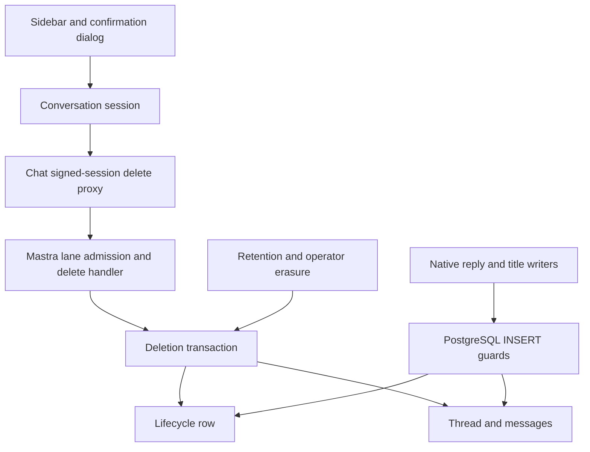
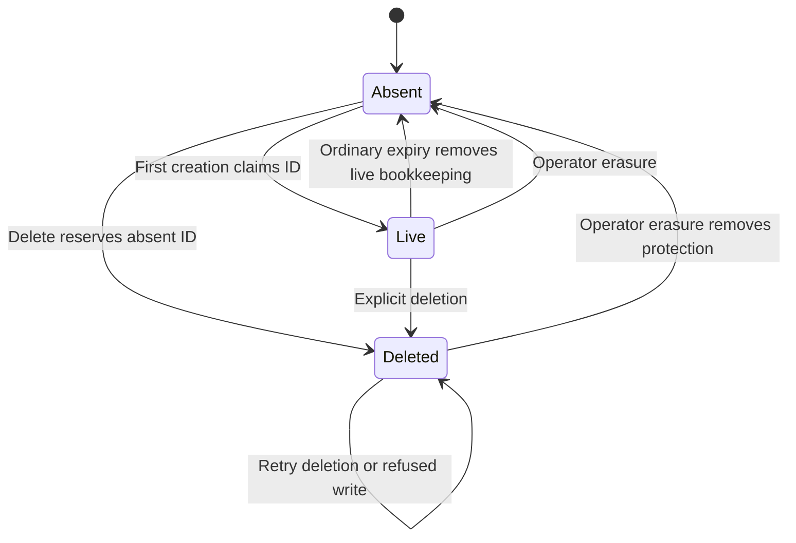

# Chat conversation deletion - Plan

## Goal Capsule

- **Objective:** A signed-in Seeker user can permanently remove one conversation from chat history. Unfinished replies and stale clients cannot recreate it while its deletion record exists; operator erasure removes that protection under R13.
- **Means:** Option B, durable deletion records with atomic PostgreSQL enforcement (KTD1–KTD3).
- **Authority:** The Product Contract carries the agreed behavior. The Planning Contract selects its implementation. Prototype reports supply evidence, not additional product approval.
- **Execution profile:** Prove persistence races against disposable PostgreSQL before connecting the UI. Preserve the existing prototype work unchanged.
- **Stop conditions:** Reconsider with the owner if the implementation would weaken R9–R13, retain additional conversation content, or require changing creation to option C.
- **Tail ownership:** This document authorizes no implementation or release by itself. Delivery uses three implementation PRs; feature completion belongs to PR3 after final integration passes. Public-release review belongs to feat-339.

---

## Product Contract

### Summary

Add per-conversation deletion to the signed-in sidebar, with confirmation and removal after server acknowledgement, except for R4's proven never-attempted local-only case. Keep a content-free deletion record to reject later recreation. Extend operator erasure to remove those records, with the accepted limitation in R13.

### Problem Frame

History supports viewing, resuming, and renaming conversations, but a user cannot remove a sensitive conversation. Deleting the current rows alone is unreliable: native reply persistence and automatic titles can recreate them. The investigation also reproduced an orphan message and a single-tab Stop/reload resurrection.

### Key Decisions

- **Permanent single-conversation deletion.** Governs R1–R8. (session-settled: user-directed — chosen over soft deletion and bulk clearing: remove one selected conversation permanently.)
- **Proceed despite unfinished backend work.** Governs R9–R11. (session-settled: user-directed — chosen over refusing deletion while backend work is busy: deletion should not wait for generation or background titles.)
- **Retain protection until operator erasure.** Governs R12–R14. (session-settled: user-directed — chosen over retention-based expiry and keeping records after erasure: keep ordinary deletion reliable while allowing an operator to erase the user's chat data.)
- **Deletion after an uncertain first send must work.** Governs R4, R10. (session-settled: user-approved — chosen over treating a missing thread as either permanent failure or unprotected success: confirm absence and prevent delayed creation.)

### Requirements

**Access and confirmation**

- R1. Offer deletion of exactly one conversation to signed-in, Seeker-enabled users on the same access boundary as rename. No bulk clear, undo, recovery bin, or anonymous/stub deletion surface.
- R2. Place an accessible trash action beside rename; show it on desktop hover/focus and keep it visible on mobile. Activating it must not select the row.
- R3. Open a dialog naming the conversation and explaining permanent removal from chat history, with “Yes, delete” and “Cancel”. Do not claim immediate erasure from every system; R15 retains the trace boundary. Disable the row's delete action during a visible reply or pending rename in that tab.
- R4. Remove a truly never-attempted local conversation locally after confirmation. Once a Seeker send has been attempted, require server confirmation even if it produced no tokens or failed.

**Client result and navigation**

- R5. For deletion requiring server confirmation under R4, keep the row and dialog while showing “Deleting…”, and prevent duplicate submission. Remove the row only after a validated server success.
- R6. On failure or an indeterminate response, keep the row and offer Retry/Cancel with “We couldn’t confirm deletion. Please try again.” A lost response is not proof that deletion failed.
- R7. Deleting the active conversation returns to `/` with a fresh conversation, reusing a suitable empty one. Deleting an inactive conversation preserves the current conversation and its draft.
- R8. Deleted links use the existing generic unavailable experience, indistinguishable in copy from expired, nonexistent, and foreign conversations. Delayed history/replay responses must not restore locally removed rows.

**Persistence and concurrency**

- R9. A successful server deletion removes the conversation and its messages atomically and leaves protection against subsequent writes under that ID. No orphan message or ownership leakage is acceptable.
- R10. Deletion succeeds for an owned conversation even when its first creation is pending or uncertain, once absence and protection are established. Repeating deletion is idempotent while its deletion record exists.
- R11. The backend proceeds without waiting for generation, titles, or follow-up work to finish. Short database-lock waits are allowed; stale tabs/devices and unfinished work cannot recreate the ID while its record exists.

**Data lifecycle and boundaries**

- R12. A deletion record contains the conversation ID and owning user/resource ID, with no title or messages. It survives ordinary conversation retention.
- R13. Operator erasure removes matching deletion records even if no live conversations remain. Removing them also removes protection: outstanding requests or still-valid sessions may subsequently persist under previously deleted IDs.
- R14. Automatic account-deletion integration remains feat-356. Feat-339 must separately decide whether R13's limitation is acceptable for public release or requires safeguards.
- R15. Single-conversation deletion leaves Langfuse unchanged under its existing 25-day retention: observability traces may retain conversation content until that sweep removes them. This is the owner's settled boundary, not immediate erasure from every system. The existing operator erasure's independent Langfuse operation remains intact.
- R16. Immediate synchronization of other tabs' displays is unnecessary. General simultaneous-send and competing-rename coordination is outside this feature.
- R17. Preserve keyboard/dialog accessibility, predictable focus after removal, and existing page-loading performance.

### Acceptance Examples

- AE1. Covers R3, R5, R7: delete an inactive conversation while a draft exists in the active one. Cancel changes nothing; confirmed success removes only the target and preserves the draft.
- AE2. Covers R4, R9–R11: Stop a first send before its initial persistence completes, then delete. After success, release the delayed write and reload; the old ID and its messages remain absent.
- AE3. Covers R6, R10: let deletion commit but drop its response. Retry returns the same success, removes the row, and leaves the record protecting that ID.
- AE4. Covers R8, R11, R16: a stale second tab still displays the conversation and sends into it. The write is refused; opening the old link shows the generic unavailable view.
- AE5. Covers R12–R14: ordinary retention leaves a deletion record intact. Operator erasure for that exact resource removes it despite zero live threads; a later write may recreate the ID under the accepted erasure exception.
- AE6. Covers R9, R13: scheduled repair remains bound to the exact captured owner throughout candidate recheck, attempt tracking, and title publication. Owner changes or ID reuse between recall and write must leave unrelated content untouched.

### Scope Boundaries

Include database guards, their isolated migration stream, API/client/UI integration, retention and operator-erasure compatibility, and the ownership correction required by AE6. Production chat uses the dedicated `ai_chat` PostgreSQL store.

#### Deferred to Follow-Up Work

- Feat-356: automatic account-deletion cascade and its failure policy.
- Feat-339: public-release disposition of R13, plus the existing broader erasure, privacy, and abuse reviews.
- General synchronization across tabs/devices and conflict handling for sends/renames remain outside this feature; R11's deletion guarantee still applies.
- Option C can be reconsidered if changing conversation creation becomes worthwhile. No implementation of A, C, or D is included here.

---

## Planning Contract

### Key Technical Decisions

- KTD1. **Use B's shared lifecycle-row protocol.** (session-settled: user-directed — chosen over A, C, and D: retain client-generated IDs and reject late persistence without model-lifetime busy tracking.) Governs R9–R12. Preserve the experimentally validated shared/exclusive row-lock design. A planning-selected table name is `ai_chat.forge_conversation_lifecycle`: conversation ID primary key, exact resource ID, and a boolean distinguishing live coordination rows from deletion records. The boolean is coordination state; it adds no content or deletion timestamp. Index the resource ID for erasure. Live coordination rows are not permanent deletion records and must be cleaned with their expired content (KTD6).
- KTD2. **Enforce at the actual PostgreSQL write boundary.** Route prechecks improve errors but do not enforce R9/R11. Thread/message INSERT guards, including the INSERT arm of native upserts, acquire the lifecycle row `FOR SHARE` and reject deleted, absent, or foreign ownership as appropriate. Thread creation may atomically establish a live row for an unknown ID. Message insertion may not establish one. Identity-update guards forbid changing a thread/message ID, resource, or a message's parent. Do not add lifecycle locks inside row UPDATE triggers: those run after tuple locking and can invert deletion's lock order. Native automatic titles can remain native; a Memory-only wrapper is insufficient.
- KTD3. **Deletion owns one bounded transaction.** Acquire/create the ID's lifecycle row, lock it `FOR UPDATE`, check exact ownership, mark it deleted, and remove messages plus thread before commit. Use `INSERT ... ON CONFLICT (id) DO NOTHING` to reserve an absent ID as deleted without aborting on concurrent first creation, then `SELECT ... FOR UPDATE` the resulting row and validate ownership/state. Never overwrite a conflicting owner's row. If maintenance removes the row between statements or an obsolete snapshot cannot see it, a missing locked read is not success: roll back and retry the whole transaction within the request budget. An already-deleted owned row returns success after checking the protected state; a foreign row returns generic unavailability without mutation. Database errors and exhausted retries/timeouts never become success. This extends the prototype's missing-row behavior and requires new proof in U2.
- KTD4. **Reuse the history-write transport and admission boundary.** Add `POST /api/history/delete` accepting only `threadId`, with a Mastra counterpart at `POST /forge-ai-chat-history-delete`. Chat derives the resource from the signed session; Mastra consumes lane admission and validates the `user:` resource. Reuse the existing owned-thread resolver for live-thread admission, but allow its genuine missing result to reach KTD3. A live-thread-only resolver cannot establish absent-ID ownership or retry success; the locked lifecycle record is authoritative. Check the same database throughout.
- KTD5. **Isolate chat's migration stream, reuse safe plumbing.** Put chat SQL in `apps/mastra/chat-migrations/`, history in `ai_chat.forge_schema_migrations`, and use a chat-specific migration advisory lock. Introduce `migrate:ai-chat-database`; factor checksum/order/transaction mechanics out of `migrate-mastra-database.ts` while preserving the existing runner's directory, history, lock, and exported contract. Changing only `migrationsDirectory` would still use devotional history and locking. No chat migration goes into the unrelated three-migration stream or Prisma.
- KTD6. **Separate explicit deletion from expiry and operator erasure.** Use a shared transaction helper with named internal operations, not a client-selectable mode. Explicit deletion retains the deleted lifecycle row. Retention locks the lifecycle row, then message rows, then the thread row, and only then rechecks the cutoff from current locked content before removing expired content and live coordination rows. Hold those locks through cleanup. A lifecycle lock alone does not exclude native UPDATE-only timestamp refreshes. Retention never removes deleted records. Operator erasure matches the full resource key independently across content and lifecycle rows, removes the matching records per R13, and reports each outcome accurately. No permanent live-row residue may silently extend ordinary retention.
- KTD7. **Bind every scheduled repair operation to the captured owner.** Per-candidate recheck, attempt-metadata write, and final title UPDATE must bind exact captured `resourceId`. Keep the empty-title predicate and preserve manual titles/activity timestamps. Regression-test ownership changes and ID reuse between recall and write; the post-erasure recreation exception never relaxes owner isolation.
- KTD8. **Keep deletion state in the conversation session.** Extend `conversation-session.ts` and its React adapter, following rename's request lifecycle. Track attempted Seeker sends before dispatch separately from proof of persistence. On confirmed removal, fence the ID against outstanding history/replay/send callbacks and abort local work as cleanup. The database remains authoritative if abort fails. All sends/renames on the target are blocked while its deletion request is unresolved in that tab.
- KTD9. **Sanitize diagnostics before native SDK catches log them.** The installed SDK catches and logs automatic-title persistence failures before exposing the caught promise through `serverless.waitUntil`; a route or detached-promise rejection handler cannot sanitize that earlier log. Add an ai-chat-only `IMastraLogger` boundary whose methods, `trackException`, and `child()` emit only fixed enum/count signals and never forward arbitrary SDK messages, errors, metadata, or bindings. Install it at construction on the Seeker agent, ai-chat Memory, PostgresStore, and its independently logged memory domain. Mastra registration and later logger replacement must preserve it, including the logger cached through agent primitive registration. A small per-instance adapter around the installed SDK's `__setLogger` and agent `__registerPrimitives` seams is a viable pinned integration; do not rely on a Pino subclass whose `child()` returns an unsanitized base logger. Keep the global application logger and Langfuse/observability configuration unchanged. Require real native-failure and registration compatibility tests, including on SDK upgrades; hook-based rejection cleanup remains separate from logging protection.

The PostgreSQL locking choice uses transaction-scoped shared/exclusive conflicts. Stronger-isolation transactions with obsolete snapshots must fail rather than bypass protection; inspect SQLSTATE rather than retrying an individual statement inside a failed transaction. These properties are documented in [PostgreSQL row locking](https://www.postgresql.org/docs/current/explicit-locking.html#LOCKING-ROWS) and [transaction isolation](https://www.postgresql.org/docs/current/transaction-iso.html), and existing prototype race tests cover relevant orderings. The final production SQL still requires real-database verification.

For KTD8, local-only eligibility requires proof that this session created the ID during its current lifetime and never dispatched a Seeker send for it. Mark attempts synchronously before dispatch; abort, zero tokens, failure, and timeout never restore that eligibility. Server-origin, hydrated, deep-linked, recovered, and otherwise unknown-provenance IDs always require server confirmation. Current session state is memory-only: do not add browser persistence just for this flag. Reload may forget an unpersisted local ID, but any later recovery through history or a link requires server-confirmed deletion.

### Storage invariants and writer coverage

The lifecycle key is globally unique because native thread IDs are global. A foreign caller must not delete or reassign an existing live/deleted owner. The unknown-ID branch reserves an absent ID for the authenticated requester; it does not prove historical ownership. This is the same first-claim boundary inherent in client-generated creation. Validate the existing bounded ID shape, never reveal stored owner data, and test competing first claims. Each distinct absent-ID reservation also adds a record that does not expire through retention. Track its count/growth without identifiers; feat-339 explicitly owns admission/abuse bounds before public exposure. No new quota or record expiry is selected here, and this plan does not claim bounded permanent-row growth under an abusive authenticated caller.

Single-delete transactions lock in this order: lifecycle, message rows, thread row. Multi-ID maintenance uses stable ID ordering and bounded transactions. An INSERT either finishes under its shared lifecycle lock before deletion, or observes deleted state and fails. UPDATE-only work cannot recreate a removed tuple; retain exact-owner predicates for content derived outside its transaction.

Native thread deletion can leave a live coordination row without a parent. The bounded retention maintenance pass must also collect these rows, lock each lifecycle row, recheck that the parent is still absent, and remove only live bookkeeping. Never include deleted records in this cleanup. A concurrent first creation participates in the same lifecycle lock, so its newly committed parent prevents cleanup. Operator erasure collects matching live threads and lifecycle rows independently, then rechecks ownership under the same per-ID lock; it must not bulk-remove live coordination rows while leaving their content behind.

Add a database parent relationship from message `thread_id` to thread `id`, with cascading message deletion, to prevent orphan messages through native deletion paths that do not participate in the lifecycle helper. Existing INSERT ownership guards and immutable identity checks enforce the owner relationship. This is a production safeguard beyond the original B experiment; validate the pinned SDK's transaction order before shipping it. Existing orphan/mismatched rows must stop migration with count-only diagnostics, not be silently reassigned or discarded.

| Writer or remover                             | Required protection                              | Evidence / remaining obligation                                                                       |
| --------------------------------------------- | ------------------------------------------------ | ----------------------------------------------------------------------------------------------------- |
| Native initial thread creation and reply save | INSERT guards and parent integrity               | B guard race validated; pending-creation delete extension and parent constraint need production tests |
| Native automatic title upsert                 | Thread INSERT guard                              | B rejected real native late-title recreation; preserve SDK error handling                             |
| Manual rename                                 | Exact-owner UPDATE plus immutable identity       | Current SQL already update-only; regression-test deletion ordering                                    |
| Scheduled title repair                        | KTD7 exact-owner rechecks and writes             | Verify owner isolation across candidate recheck, attempt tracking, and title publication              |
| Follow-up carrier update                      | Existing-row update and immutable identity       | Missing carrier was a no-op in SDK investigation; test late completion                                |
| Retention and operator erasure                | KTD6, parent integrity, exact-resource filtering | Integration with the new lifecycle table is not prototype-complete                                    |
| Native SDK/API direct persistence             | Same guarded physical tables                     | Re-audit installed SDK; route-only checks cannot substitute                                           |

Current chat enables no semantic-recall vector store, working memory, or observational memory. Inventory the actual enabled stores before implementing cleanup. If that changes, extend the deletion transaction/coverage or refuse deletion as unavailable; do not acknowledge partial content removal. Raw database operator actions that disable guards are not application deletion paths.

### Request and client contracts

Mastra returns `200 { ok: true }` only after a committed delete/protection transaction, including an owned repeat or safely reserved absent ID. Use `400 invalid_body`, the existing lane/access refusals, a generic unavailable result for foreign ownership, `503` for missing guard readiness, `504 timeout`, and `500 store_failed` for failed storage operations. Reuse the write proxy's response classification before parsing and 4 KiB response cap. A reasonless upstream 404 or missing deployment must become retryable unavailability, never successful absence.

Use parameterized SQL for every ID/resource input, static schema identifiers, and the existing 200-character ID bound. Reuse the JSON-only same-origin write contract; do not introduce a form-compatible destructive GET. No model-facing deletion tool is added: the explicit human confirmation is the product entry point, and the authenticated application API is its automation seam.

Keep the existing approximately 8-second Mastra and 9–10-second proxy budgets. Set transaction-local lock/statement limits and connection acquisition limits within that envelope. A timeout after dispatch remains indeterminate even if the server later commits. Bound database work independently of the HTTP promise; do not reduce normal answer gateway timeouts. Retry whole transactions only within a bounded request budget for eligible serialization/deadlock errors or KTD3's missing locked-row race; expose Retry when that budget is exhausted.

Add a deleted-conversation outcome to send admission and client failure mapping so a stale send cannot silently downgrade to stub or auto-retry with the deleted ID. Use the generic unavailable conversation UI with a start-new action. Recheck on persistence rejection when the request passed admission before deletion. Detached title/follow-up failures must be handled without unhandled rejections or content-bearing logs.

Dialog state captures the selected target ID and its display label when opened, independently of whichever conversation is currently active. Preserve both if hydration retitles or omits that row while the result is unknown. Disable Cancel, Escape, and backdrop dismissal while showing “Deleting…” to preserve R5. Announce progress through a polite live status and failures through an alert; keep accessible button names and disabled state synchronized. After an indeterminate result, Cancel dismisses the dialog without claiming a rollback of the dispatched operation. A subsequent attempt remains server-confirmed. Session deactivation invalidates callbacks so a response from a previous account cannot change the new session.

Keep the existing sidebar eligibility: a server-origin conversation or a local conversation with messages is listed; typing into a fresh draft does not add a deletable row. R4's local-only rule is a session-level safeguard, not a requirement to add an affordance for hidden empty drafts or excluded anonymous/stub conversations. Confirmed removal discards the target's local transcript/replay state. Active deletion clears its composer draft through the existing new-conversation flow; inactive deletion preserves the current conversation and draft. This does not promise clearing another tab's memory or infrastructure copies.

### High-Level Technical Design



```mermaid
sequenceDiagram
  participant C as Client
  participant D as Delete transaction
  participant L as Lifecycle row
  participant W as Delayed SDK writer
  C->>D: Confirm deletion of ID
  D->>L: Insert deleted if absent; otherwise lock and check owner
  D->>L: Mark deleted under exclusive lock
  W->>L: Attempt shared lock for INSERT
  Note over W,L: Wait for the short transaction, not model completion
  D->>D: Remove messages and thread; commit
  D-->>C: Success
  L-->>W: Deleted state; reject persistence
```



```mermaid
stateDiagram-v2
  [*] --> Available
  Available --> Confirming: Trash
  Confirming --> Available: Cancel
  Confirming --> Deleting: Yes, delete; server confirmation required
  Confirming --> Removed: Yes, delete; proven never-attempted local conversation
  Deleting --> Unconfirmed: Failure or lost response
  Unconfirmed --> Deleting: Retry
  Unconfirmed --> Available: Cancel without rollback claim
  Deleting --> Removed: Server-confirmed success
```

### Initialization, rollout, and rollback

Bootstrap SDK-owned `ai_chat` tables through the pinned store's explicit initialization before installing application guards. The chat migrator must own a predictable initialization path; do not depend on the first user request to create tables. Application migrations own only their history, lifecycle table, constraints, and triggers. Assert supported native table/column shapes and schema qualification.

Install/backfill under a transaction that blocks conflicting writes to both native content tables. A migration advisory lock only coordinates migrators; it does not stop application writers. Backfill owners from existing threads, verify integrity, then install constraints/guards before releasing the table locks. Bound lock acquisition; abort cleanly and schedule a controlled migration window if the live workload prevents installation. Re-running an applied migration must skip by matching checksum, and a changed checksum must fail.

**Merge order is PR1 → PR2 → PR3. Migration execution is a separate, explicit operation after PR1 has deployed.** Merely merging a PR does not prove that every instance or operator tool is upgraded, and deploying the migration command does not execute it. Do not wire this migration into an automatic pre-deploy step that runs against old maintenance processes.

PR1 must support deployment before schema activation. Model readiness explicitly: a verified not-yet-applied chat migration, a fully applied and validated migration, or an error/incompatible state. Before activation, the application can boot; lifecycle-dependent cleanup must defer with an explicit not-ready outcome rather than crash, claim `no_data`/successful erasure, or issue SQL against missing tables. Preserve operator erasure's independent Langfuse outcome. An unavailable database, permission error, checksum mismatch, or partial/incompatible schema is not proof of the clean pre-migration state. Re-evaluate readiness after migration; a process must not cache its first not-ready result forever.

Use this production sequence, rehearsed by PR1 against disposable databases:

1. Deploy PR1 through the normal release pipeline, including compatible retention handlers, scheduled-worker code, and operator-erasure tooling. Verify all execution locations use that revision; prevent old binaries or cached operator commands from running during or after activation.
2. Pause affected cleanup launches and operator PostgreSQL erasure operations, and wait for already-running old cleanup to finish. Establish a bounded migration window for chat writes if needed; table locks remain the database backstop. An empty user roster does not prove that scheduled or detached work has stopped. If the required quiescence cannot be established, postpone migration.
3. Execute PR1's explicit `migrate:ai-chat-database` command from the verified release artifact. Initialize native tables, then apply the isolated migration/backfill and guards atomically under the described locks. PR1 must document the exact production command, execution location, and pause/resume procedure after checking build packaging; the general Mastra migration runner is not a substitute.
4. Check migration history/checksum, schema shape, enabled guards/constraints, and maintenance readiness from the deployed code. Verify ordinary creation produces live coordination records and compatible cleanup handles them even with no delete endpoint or button. Resume affected operations only when these checks pass. On failure, keep lifecycle-dependent operations deferred and repair/retry; never resume an unaware cleanup implementation.
5. Deploy PR2's Mastra endpoint, repair binding, and diagnostic sanitization against the validated PR1 foundation. Deploy PR3's chat proxy/session/UI only after that backend is ready and the final integration checks pass. These steps do not remove the existing audience gate or settle feat-339's public-release decisions.

**Agreed staging assumption:** there are currently no users and PR2 is intended to follow PR1 closely. SDK diagnostic sanitization remains in PR2; it is not a prerequisite for PR1's production migration. This accepts the short staging interval, not a change to KTD9's final requirements. Cleanup compatibility is mandatory in PR1 regardless of button visibility: the guards create live coordination rows during ordinary conversation creation.

Rolling old writers remain covered only if they hit the same guarded tables. Verify old native SDK writers with the installed guards and inspect whether store initialization preserves application triggers/constraints. Roll back the UI/handler if needed while preserving lifecycle records and guards. After any confirmed deletion, dropping those objects is not a safe rollback. Restoration from backups must preserve/reconcile deletion records before serving traffic; this feature does not promise per-conversation removal from infrastructure backups.

PR1 owns a concrete **planned-restore procedure** in its operational runbook. Quiesce all chat writes and maintenance, including detached SDK work and operator erasure; capture the complete current deletion-record set from the authoritative database into protected temporary recovery input. Keep operations paused while restoring and reconciling. Reconcile the restored deleted-record subset to that exact current set, not their union: backup markers absent from the current set may have been removed by operator erasure and must not be retained. A verified empty current set is valid; missing, incomplete, or unavailable recovery input is not. Reapply current markers and remove matching-owner restored content before validating guards and resuming traffic. A conflicting restored owner halts recovery for explicit resolution; never silently reassign ownership or erase foreign content through the normal helper.

Delete the temporary recovery input after successful reconciliation and before resuming operations; on failure, retain it securely while recovery remains paused. This is not a new permanent journal or a new record-retention policy. If the authoritative current state cannot be recovered, including after a disaster, an older backup alone cannot establish the deletion invariant: do not resume the affected chat store. The runbook must name the execution location and responsible operator and rehearse both success and refusal paths.

Before schema activation, a failed PR1 deployment can revert to the previous application only after verifying that no migration took effect. Once schema activation creates/backfills lifecycle rows, retain compatible retention and operator-erasure code even if no explicit deletion has occurred. Prefer a forward repair; do not roll back to unaware cleanup or drop lifecycle data as a routine rollback. A failed post-migration deployment keeps affected operations paused until a compatible revision is restored.

PR2/PR3 rollback may remove the exposed handler or chat UI, but must retain the PR1 storage/cleanup foundation. Preserve PR2's compatible owner-bound repair and diagnostic boundary where guarded writes continue; use a compatible rollback build rather than blindly reverting the whole application. Once the backend can confirm deletion, these obligations apply even before PR3 exposes the button, because authenticated API callers can reach PR2. After any confirmed deletion, preserve the record and guard invariant; operator erasure under R13 remains the explicit exception.

### Performance and operational impact

Costs are an indexed lifecycle lookup and transaction-duration row locks on persistence, plus a small content-free row per explicit deletion. B holds no extra connection throughout model generation. Resource indexing keeps operator cleanup independent of live-thread discovery. Measure actual index/storage growth, SQL round trips, lock waits, and pool occupancy; no production performance benchmark has been established.

Use enum/count-only failure signals for delete commits, refusals, guard failures, migration readiness, and erasure record counts. Do not log IDs, owners, titles, messages, or caught SQL text. Inspect latency for unaffected conversations under a blocked target and preserve the existing pool census; prefer sharing the bounded history-write pool over adding an undocumented pool.

### Alternatives and future evolution

- **A — refuse while busy:** viable with the SDK's `serverless.waitUntil` hook covering full native title persistence, but still needs durable protection against later stale-ID writes. Adds long-lived work tracking and lease/connection failure handling. Not selected.
- **C — server-issued live IDs:** avoids retained deletion records by refusing unknown continuations. Database tests passed, but creation API, client ID handling, issuance retries, and old-client rollout are broader work. A future migration must keep B records until all remaining recreation paths are closed; it cannot discard them merely because a new client uses C.
- **D — narrower title fix and accepted stale-client recreation:** update-only titles worked, but D0 failed ordinary same-tab Stop/pending-creation/reload. Full D also needs delayed-request admission, abort/lease handling, identity-reuse protection, and safe retries. Those obligations erased its apparent simplicity; the investigated D1 coordination was not a complete implementation.

### Evidence and implementation-time verification

This plan records the essential investigation results and the required verification cases. Implementation must establish its own reproducible evidence against the final code; access to separate prototype artifacts is not a prerequisite or a shipped dependency.

The pinned packages remain `@mastra/core` 1.64.0, `@mastra/memory` 1.28.2, `@mastra/pg` 1.22.3, and `ai` 6.0.182. The original B guards prevented real native title/reply resurrection, an observed message-save orphan race, crash/rollback corruption, and stale-snapshot bypass. They did not finish production migration, erasure, or absent-first-creation behavior.

D's completed browser investigation covered confirmation, draft preservation, update-only pending titles, lost-success handling, and Retry. It also reproduced same-tab resurrection and stale-tab recreation; it tested D0, not complete D1. Focus restoration remained defective. These findings include intentionally reproduced failures and are not an all-green deletion verdict.

Remaining implementation-time work is proof of the final SQL/SDK combination, migration packaging and startup order, transaction cancellation behavior, and integrated UI performance/accessibility. None changes the chosen product policy. If proof fails, correct the implementation or return with the concrete conflict rather than narrowing the guarantee.

---

## Implementation PR Sequence

These are three reviewable code PRs, not three replacements for U1–U7. Unit IDs remain stable; U3 and U5 span PR boundaries, and U7 supplies verification/documentation throughout. No application changes are authorized by this planning update.

| Unit | PR1 — PostgreSQL foundation and lifecycle compatibility                                     | PR2 — Mastra deletion behavior                                            | PR3 — Chat integration and user experience                                              |
| ---- | ------------------------------------------------------------------------------------------- | ------------------------------------------------------------------------- | --------------------------------------------------------------------------------------- |
| U1   | All migrations, initialization, readiness                                                   | Consume validated foundation                                              | Verify backend readiness through integration                                            |
| U2   | All lifecycle transactions, guards, parent integrity, real PostgreSQL tests                 | Exercise through real Mastra handlers                                     | Exercise through the full chat path                                                     |
| U3   | No HTTP deletion surface                                                                    | Mastra endpoint/admission, retries, stale-send rejection, SDK diagnostics | Chat proxy, client transport, failure mapping                                           |
| U4   | —                                                                                           | —                                                                         | All session/provenance/fencing/draft/navigation work                                    |
| U5   | Retention and operator-erasure storage cleanup                                              | Scheduled repair's captured-owner reads/writes                            | Verify both through final integration                                                   |
| U6   | —                                                                                           | —                                                                         | All trash/dialog/accessibility/focus work                                               |
| U7   | Database/cleanup tests, migration packaging, cutover/rollback runbook, storage measurements | Handler/repair/diagnostic tests, backend operational documentation        | Browser/full-stack tests, frontend performance, consolidated evidence and final handoff |

### PR1 — PostgreSQL foundation and lifecycle compatibility

**Scope:** U1 and U2 in full; U5's retention/operator-erasure storage cleanup; the corresponding U7 tests and operational documentation. This includes live-row cleanup, preservation of deletion records during ordinary retention, record-only operator erasure, exact-resource bounds, preview/outcome reporting, and the unchanged independent Langfuse erasure operation. Introduce no deletion endpoint or chat UI.

**Dependencies:** Existing completed feature dependencies in the roadmap; no dependency on PR2 or PR3 to merge or execute the production migration. U5 cleanup consumes U2 within this PR. SDK diagnostic sanitization remains PR2 under the agreed staging assumption.

**Verification:** Complete U1/U2's unit and real PostgreSQL cases; U5's expiry, recency-refresh, operator-erasure, record-only, orphan/live-bookkeeping, and accepted erasure-exception cases. Rehearse old schema → deployed PR1/not-ready → explicit migration → refreshed readiness → ordinary creation/cleanup, including failed migration and rollback refusal after activation. Rehearse planned restoration from an older snapshot: current markers still protect IDs, markers removed by operator erasure do not return, and unavailable recovery input or ownership conflicts prevent resumption. Check the existing migration stream remains unchanged, the new command/SQL are packaged, old native writers hit the guarded tables, and lock/pool costs stay bounded. Use disposable data and real SDK writes, not just mocked SQL shapes. Run Mastra tests and relevant type/lint/build checks in this PR.

**Operational documentation:** Update the Mastra runbook with the actual migration execution location/command, all worker/operator upgrade checks, pause/drain/resume steps, readiness states, count-only diagnostics, rollback floor, and the planned-restore reconciliation procedure and its execution owner. Supply these before production execution, not in PR3.

**Completion criteria:** Foundation and cleanup tests pass together; the deploy-before-migrate interval and post-migration cleanup are proven; the explicit production procedure is reviewable and packaged. PR1 is independently mergeable. Production activation is recorded separately after deployment and readiness verification. Feature 247 remains `in-progress`.

### PR2 — Mastra deletion behavior

**Scope:** U3's Mastra route/admission, exact ownership, absent-ID/repeat semantics, bounded failures/retries, stale-send rejection, and KTD9 SDK diagnostic sanitization; U5's scheduled-title-repair candidate reads, attempt tracking, and final publication bound to the captured owner. Include corresponding U7 backend verification and runbook updates. The chat-facing proxy and UI remain in PR3.

**Dependencies:** Merge after PR1. Production deletion requires PR1's applied/validated migration and compatible cleanup at every execution location. Share a concrete response/error contract for PR3; do not duplicate ownership policy in the client.

**Verification:** Run U3's backend admission/authorization, foreign/absent/repeated deletion, bounded failure, missing-guard, stale-send, and real SDK diagnostic tests through Mastra handlers. Cover commit with lost response and retry at this boundary before a browser exists. Complete U5's owner-change/ID-reuse, manual-title/activity preservation, and late follow-up cases. Exercise real PostgreSQL and installed SDK logging/registration; verify single deletion makes no Langfuse deletion call. Run Mastra tests and relevant type/lint/build checks here.

**Operational documentation:** Document endpoint readiness and error semantics, backend smoke commands, diagnostic signals, scheduled-repair verification, and rollback to a build that preserves compatible cleanup/repair/diagnostics. Include measured request/lock/pool behavior and the contract consumed by PR3.

**Completion criteria:** Backend and repair checks pass against PR1's schema; authenticated callers can perform owned, atomic, retryable deletion with the agreed backend behavior. Failed/missing readiness cannot acknowledge success. The backend is ready for chat integration, but U3's chat portion and U7's final integration remain incomplete. Feature 247 remains `in-progress`.

### PR3 — Chat integration and user experience

**Scope:** U3's chat proxy, transport and failure mapping; U4 in full; U6 in full; remaining U7 end-to-end verification, frontend performance, and feature handoff. Integrate the already-tested backend contract without changing settled product behavior.

**Dependencies:** Merge after PR2. Require verified PR1 schema/cleanup and PR2 backend readiness before enabling deletion. U4/U6 can be developed against the fixed contract earlier, but production exposure cannot precede those dependencies.

**Verification:** Run chat proxy/client, session/provenance, StrictMode, stale-response, dialog/focus, and navigation tests. Add the minimal browser harness and run AE1–AE6 through chat/Mastra/SDK/PostgreSQL, including Stop/pending first creation, stale tabs, old links, lost success/Retry, and inactive drafts. Re-run relevant earlier storage/backend integration checks against the cumulative implementation. Measure page-load/route-transition impact and final request/pool behavior. Run chat and affected Mastra tests, type/lint/build checks, and documentation checks. Testing begins in PR1; PR3 closes the integration proof.

**Operational documentation:** Consolidate the evidence from all three PRs, backend-first deployment and UI enablement checks, compatible rollback instructions, and unresolved public-release gates. Update chat guidance, the feature ticket, and lane index; change feat-339/feat-356 only if integration requires clarification of their existing obligations.

**Completion criteria:** All U1–U7 obligations and final acceptance checks pass, with the production-shaped migration/deployment path rehearsed and handoff evidence recorded. Only then may the implementation's PR3 record feature completion and a Resolution citing all three actual PRs. Do not invent PR numbers or mark the feature complete in PR1, PR2, or this planning change. Public release remains a separate decision.

### Sequence constraints and retained decisions

The split is workable. Its critical constraint is deployment compatibility, not moving storage cleanup to a later PR: hiding the button cannot prevent ordinary writes from creating live lifecycle rows. PR1 therefore owns that cleanup and the deploy-before-migrate transition. The short PR1-to-PR2 diagnostic interval is explicitly accepted for the current empty roster; it does not move KTD9 into PR1 or make PR2 a migration prerequisite.

No PR changes option B, backend proceed-with-deletion behavior, record contents/lifetime, R13's operator-erasure exception, Langfuse retention, or outstanding public-release decisions. Any implementation evidence requiring a change to those decisions must return to the owner rather than narrowing the guarantee.

---

## Implementation Units

### U1. Isolated chat migrations and guard readiness

**PR ownership:** PR1, including migration packaging, readiness-transition tests, and the initial operational runbook.

**Goal:** Give application-owned chat schema changes independent migration files, history, and locking.

**Requirements:** R9, R12; KTD5. **Dependencies:** none.

**Files:** `apps/mastra/src/scripts/migrate-mastra-database.ts`; new `apps/mastra/src/scripts/database-migrations.ts`, `apps/mastra/src/scripts/migrate-ai-chat-database.ts`, `apps/mastra/src/scripts/migrate-ai-chat-database.test.ts`; existing `apps/mastra/src/scripts/migrate-devotional-database.test.ts`; `apps/mastra/package.json`; `apps/mastra/src/mastra/ai-chat-memory.ts` and its tests; `apps/mastra/src/mastra/index.ts`.

**Approach:** Extract only shared migration mechanics. Keep fixed, trusted stream descriptors and preserve the legacy entry points. Add the explicit SDK initialization and guard-readiness seam described above. Package the new directory/command in the existing deployment artifact. Own PR1's migration/rollback/planned-restore runbook and its rehearsal with U2/U5's storage fixtures.

**Patterns:** Existing checksum runner, explicit persisted-store initialization, and lane admission defaults.

**Test scenarios:**

1. Empty disposable database initializes native tables before chat SQL; no devotional/support/Datadog migration history changes.
2. Two chat runners serialize; a chat runner does not use the unrelated stream's advisory key or history.
3. Rerun skips applied checksums; changed checksum or failed SQL rolls back without a falsely applied version.
4. Existing migration entry points retain their behavior and history against pre-existing migration metadata.
5. Missing/mismatched guards refuse deletion; failed initialization is observable and cannot acknowledge deletion.

**Verification:** Both migration streams remain independently runnable; fresh and existing databases have a deterministic readiness result.

### U2. Atomic deletion and guarded persistence

**PR ownership:** PR1, including the real PostgreSQL race suite and storage/cleanup compatibility proof.

**Goal:** Establish the server invariant before exposing it through HTTP.

**Requirements:** R9–R13; KTD1–KTD3, KTD6. **Dependencies:** U1.

**Files:** new `apps/mastra/chat-migrations/001-conversation-deletion.sql`; new `apps/mastra/src/mastra/ai-chat-conversation-lifecycle.ts`, `apps/mastra/src/mastra/ai-chat-conversation-lifecycle.test.ts`, and `apps/mastra/src/mastra/ai-chat-conversation-lifecycle.smoke.test.ts`; `apps/mastra/src/mastra/ai-chat-memory.ts`.

**Approach:** Implement lifecycle guards, parent integrity, and the transactional operations owned by KTD1–KTD3/KTD6. Use BEFORE INSERT guards so the lifecycle lock is acquired before the write and parent-constraint check. Use a distinct recognized storage refusal; PR2 owns the full SDK diagnostic boundary. Preserve existing SDK table ownership. Inventory actually enabled ai-chat memory stores before cleanup; an enabled, uncovered content store must make deletion unavailable rather than acknowledge partial removal. Pin coverage of real storage methods rather than mocking Memory wrappers.

**Execution note:** Reproduce the known races with deterministic barriers before implementing guards. Use disposable data and the pinned installed SDK.

**Test scenarios:**

1. Covers AE2: pause a real initial thread creation before its INSERT, delete the absent ID, resume; no content persists.
2. Reverse that ordering with an uncommitted creation; conflict-tolerant reservation waits, then deletion locks and removes its committed content. Also remove a conflicting live row through maintenance between reservation and the locked read: the missing row causes bounded whole-transaction retry, never unprotected success.
3. Pause real `saveMessages` after its existence read; deletion then resumed persistence produces neither a message nor an orphan.
4. Release a native automatic title and a reply save after deletion; both fail to recreate content.
5. Covers AE3: repeated deletion and concurrent retries retain one owned deleted record and report success.
6. Concurrent first claims by different owners never overwrite ownership; a foreign deletion changes no content or lifecycle data.
7. Roll back/crash between message and thread cleanup; content and lifecycle return to their prior consistent state.
8. Exercise READ COMMITTED and stale REPEATABLE READ snapshots, process restart, lock timeout, and connection loss; never report success without commit.
9. Identity-changing updates fail; native parent deletion leaves zero orphan messages; mixed/batch writes cannot leave partially accepted foreign content.
10. Pre-existing orphans or owner mismatches stop migration with counts only; no silent cleanup.
11. An enabled but uncovered memory store causes deletion readiness to refuse; it cannot acknowledge partial removal. Verify the actual production configuration remains covered.

**Verification:** Real SDK writes in both race orderings meet R9–R11, including absent first creation. Constraints and trigger behavior survive explicit store reinitialization.

### U3. Delete API and rejected-send integration

**PR ownership:** PR2 owns Mastra files, backend behavior, and SDK diagnostics; PR3 owns apps/chat proxy, transport, and client failure mapping. Each portion ships its own tests; U3 completes only after PR3.

**Goal:** Expose a bounded, owned, idempotent deletion operation and explain stale-send rejection.

**Requirements:** R1, R5, R6, R8–R11; KTD3, KTD4, KTD9. **Dependencies:** U2.

**Files (PR2 — Mastra):** `apps/mastra/src/mastra/ai-chat-history-write-route.ts`, its `.test.ts`, `.defaults.test.ts`, and `.smoke.test.ts`; `apps/mastra/src/mastra/ai-chat-thread-ownership.ts` and tests; `apps/mastra/src/mastra/agents/seeker-route.ts` and tests; `apps/mastra/src/mastra/index.ts`; new `apps/mastra/src/mastra/ai-chat-sdk-logger.ts` and `.test.ts`; `apps/mastra/src/mastra/agents/seeker-agent.ts` and tests; `apps/mastra/src/mastra/ai-chat-memory.ts` and tests.

**Files (PR3 — chat):** `apps/chat/src/app/api/history/write-proxy.ts` and `.test.ts`; new `apps/chat/src/app/api/history/delete/route.ts`; `apps/chat/src/lib/history-client.ts` and `.test.ts`; `apps/chat/src/app/api/seeker/route.ts` and `.test.ts`; `apps/chat/src/lib/conversations.ts` and `.test.ts` for the closed send-failure vocabulary.

**Approach:** Join rename's write-route/proxy anatomy without weakening its failure classification. Thread the new delete result into session-facing types. Keep admission-time and late-persistence rejection consistent. Attach bounded cleanup/error handling to detached SDK work using actual exposed lifecycle hooks where needed. Implement KTD9 in new `apps/mastra/src/mastra/ai-chat-sdk-logger.ts` and `.test.ts`; install it through `agents/seeker-agent.ts` and `ai-chat-memory.ts`, extending their existing tests. Pin compatibility with the installed SDK's registration paths before relying on this diagnostic boundary.

**Patterns:** Lane admission, owned-existing-thread resolver, history proxy egress pin and response cap, enum-only logs.

**Test scenarios:**

1. Invalid session, gate denial, missing bearer, non-user resource, malformed/oversized ID, and caller-supplied resource cannot reach destructive SQL.
2. Owned live, absent-first-send, and owned already-deleted requests return only the documented success shape after commit.
3. Foreign live/deleted IDs return generic unavailability without changing rows or exposing the owner.
4. Missing upstream route, missing guards, DB outage, oversized/malformed success body, and timeout remain failures, never absence proofs.
5. Covers AE4: stale send is refused before model invocation when possible; deletion after admission also prevents persistence and has no silent stub fallback.
6. Real detached native title and follow-up persistence refusal produces no unhandled rejection or content/identifier log. Capture diagnostics from agent, Memory, store, and memory domain, including already-stringified errors, child bindings, `trackException`, initial registration, and later logger replacement. Verify global logging and Langfuse configuration remain unchanged.
7. A single-conversation deletion performs no Langfuse deletion operation.

**Verification:** The real authenticated proxy-to-Mastra path establishes the same invariant as U2, with truthful failure/retry semantics.

### U4. Session deletion state and stale-response fencing

**PR ownership:** PR3, including session and React-lifecycle tests.

**Goal:** Keep local conversation state consistent with acknowledged deletion.

**Requirements:** R4–R8, R16; KTD8. **Dependencies:** U3.

**Files:** `apps/chat/src/lib/conversation-session.ts`, `apps/chat/src/lib/use-conversations.ts`, `apps/chat/src/lib/use-conversation-url.ts`; new `apps/chat/src/lib/conversation-session.delete.test.ts`; existing `apps/chat/src/lib/conversation-session-test-harness.ts`, `apps/chat/src/lib/use-conversations.strictmode.test.tsx`, `apps/chat/src/lib/use-conversation-url.test.tsx`, `apps/chat/src/lib/use-conversation-url.strictmode.test.tsx`.

**Approach:** Keep the state machine framework-free. Add attempted-send tracking before dispatch, per-ID deletion request state, and confirmed-removal fences. Reuse new-conversation selection and URL handling while preserving inactive drafts. Clear/ignore callbacks by session lifetime and account boundary.

**Test scenarios:**

1. Proven never-attempted local removal makes no server request; zero-token failed or stopped Seeker sends still require one. Reload after failed first creation, then recover the ID through history or a deep link: unknown/recovered provenance requires server confirmation without a new browser-persistence mechanism.
2. Covers AE1: inactive removal preserves selected ID/draft; active removal reuses an appropriate empty conversation at `/`.
3. Covers AE3: timeout leaves recoverable state; Retry succeeds after a server commit whose response was lost.
4. Delayed history page, replay, title hydration, send finalizer, and rename result cannot reinsert a confirmed-deleted ID.
5. Pending deletion blocks send/rename only on the target; another row remains usable.
6. StrictMode activation/deactivation, sign-out/account change, and navigation during deletion ignore stale callbacks.
7. Opening a deleted URL remains unavailable; starting new never reuses the deleted ID.

**Verification:** Session tests establish R4–R8 without a browser or component-specific state duplication.

### U5. Retention, operator erasure, and title-repair compatibility

**PR ownership:** PR1 owns retention/operator-erasure storage cleanup and its tests (scenarios 1–4 and 7). PR2 owns scheduled repair and late follow-up compatibility with its tests (scenarios 5–6). U5 completes after both portions pass.

**Goal:** Integrate the new records into existing data lifecycles and enforce exact-owner isolation throughout scheduled repair.

**Requirements:** R9, R12–R15; KTD6, KTD7. **Dependencies:** U2.

**Files:** `apps/mastra/src/mastra/ai-chat-retention.ts` and `.test.ts`; `apps/mastra/src/mastra/ai-chat-erasure.ts`, `.test.ts`, and `.smoke.test.ts`; `apps/mastra/src/scripts/erase-user.ts` and tests; `apps/mastra/src/mastra/workflows/title-repair.ts` and `.test.ts`; U2's new PostgreSQL smoke suite.

**Approach:** Route controlled cleanup through KTD6 without changing the existing erasure key, preview/confirm safeguards, or independent per-store reporting. Extend preview/execution counters to lifecycle records and remove the live-thread-only early return. Bind repair's candidate-specific operations to the captured owner under KTD7.

**Test scenarios:**

1. Covers AE5: retention deletes expired content/live bookkeeping while leaving deleted records. With deterministic barriers, let real SDK `updateMessages` and `updateThread` refresh activity after the preliminary expiry scan but before content locks; the final locked recency check must preserve the refreshed thread and messages. Exercise the reverse ordering too; never add lifecycle locks inside UPDATE triggers.
2. Exact-resource erasure removes deletion records with zero live threads; prefix-adjacent users and other schemas remain intact.
3. Preview counts records without mutations; partial SQL failure is not `no_data` or complete, and the independent Langfuse half still runs.
4. Covers AE5: remove a record through operator erasure, then demonstrate that a previously blocked ID can be created again. Report this as the accepted limitation, not a safety pass.
5. Covers AE6: vary ownership and ID lifetime between recall and repair publication; every candidate-specific recheck and write remains scoped to its captured owner, leaving unrelated titles/metadata untouched.
6. Manual rename racing repair preserves the manual title and activity timestamps; deletion racing a late follow-up leaves no content.
7. Native deletion/retention racing message insertion leaves no orphan; no stale live bookkeeping grows indefinitely after cleanup.

**Verification:** Exact-key cleanup covers both live and deletion-only data, preserves independent Langfuse behavior, and blocks cross-owner captured-content writes.

### U6. Sidebar confirmation and accessible navigation

**PR ownership:** PR3, including component tests, keyboard/mobile verification, and final browser coverage.

**Goal:** Deliver the agreed per-conversation deletion interaction.

**Requirements:** R1–R3, R5–R8, R17. **Dependencies:** U4. **Release gate:** U5 must be deployed before enabling deletion; the UI may be developed independently of maintenance integration.

**Files:** `apps/chat/src/components/shell/sidebar-conversation-list.tsx` and `.test.tsx`; `apps/chat/src/components/shell/app-shell.tsx`; new `apps/chat/src/components/shell/delete-conversation-dialog.tsx` and `.test.tsx`; new `apps/chat/src/components/shell/app-shell.delete.test.tsx`; `apps/chat/src/components/shell/use-sidebar-chrome.ts` and `.test.ts`; `apps/chat/src/app/globals.css` if needed.

**Approach:** Bind the dialog to session state, following existing shell styles and row actions. Keep initial server rendering free of new data awaits. Initially focus Cancel. After active removal, reuse AppShell's existing deferred composer-focus flow: arm pending focus, close the mobile drawer, and focus the fresh composer's input only after the drawer releases its focus trap and background inertness. After inactive removal, keep the drawer open and focus the next surviving row's conversation-select button, then the previous row's select button, then New conversation if the list is empty. Restore the trigger on Cancel/Escape when it remains mounted. If it unmounted, use its captured row position to focus the next surviving conversation-select button, then the previous one, then New conversation. Reuse the list's ref-and-latch focus handoff without selecting a conversation or changing drafts. Only the top dialog handles Escape/backdrop dismissal so one action does not dismiss multiple layers.

**Test scenarios:**

1. Trash appears only on eligible rows with desktop hover/focus and mobile visibility; clicking it does not select the row.
2. Dialog retains the captured target label through hydration/retitling, explains permanent removal from chat history, traps focus, and exposes the exact confirmation labels. Progress and failure announcements work without moving focus.
3. Visible reply/rename disables that row's trash; pending/error/Retry/Cancel states follow R3/R5/R6. Stop clears the local reply-busy condition so deletion is available when no rename/delete is pending, without waiting for uncertain first persistence or detached backend work, making AE2 reachable through the actual UI.
4. Covers AE1: inactive deletion preserves the draft and moves focus to the specified surviving select button; active deletion lands at `/` with composer focus after the mobile drawer has released background inertness.
5. Cancel/Escape after trigger unmount uses the specified next/previous/New focus fallback without changing selection or draft. Repeated confirm and narrow viewport retain predictable focus; never leave focus on `body` after successful removal.

**Verification:** Component tests and a manual real keyboard/mobile browser pass cover behavior and resolve the prototype's known focus defect. U7 adds automated Playwright coverage.

### U7. Integrated verification and operational handoff

**PR ownership:** Shared across PR1–PR3. PR1 delivers database/cleanup verification and the migration/rollback runbook; PR2 delivers backend/repair/diagnostic verification and operational updates; PR3 closes browser/full-stack integration, frontend performance, and consolidated handoff.

**Goal:** Establish that the production-shaped implementation meets the contract and can be rolled out safely.

**Requirements:** R1–R17. **Dependencies:** U1–U6 for final integration closure. Earlier verification/documentation follows the owning PR and its unit dependencies; it does not wait for U6.

**Files:** new `apps/chat/e2e/conversation-delete.spec.ts` and `apps/chat/playwright.config.ts`; `apps/chat/package.json` and `pnpm-lock.yaml` for the minimal Playwright test dependency/command (no chat Playwright harness exists in this checkout); U2/U3/U5 smoke suites; `apps/chat/CLAUDE.md`; `apps/mastra/CLAUDE.md`; `docs/roadmap/ai-chat/feat-247-chat-history-management.md`; `docs/roadmap/ai-chat/feat-339-seeker-public-release-register.md`; `docs/roadmap/ai-chat/feat-356-auth-account-deletion-seeker-cascade.md`; lane `README.md`.

**Approach:** Run the real chat/Mastra/SDK/PostgreSQL path with disposable data and deterministic persistence barriers. Document migration execution, readiness, pool cost, bounded failures, erasure outputs, and safe rollback. Remove temporary experiment hooks from production surfaces. Keep public-release decisions open unless separately resolved.

**Test scenarios:**

1. Run AE1–AE6 through real handlers, including both database race orderings and actual single-tab Stop/reload.
2. A stale tab retains old display until it acts, but cannot store old or new content under the deleted ID.
3. Drop a successful delete response, retry, reload, and inspect database state and record ownership.
4. Verify a fresh database, existing data migration, and old native writer with guards installed before UI enablement.
5. Capture before/after page-load and route-transition timings under matching local conditions; no new startup await or material regression.
6. Measure delete/normal-send lock waits and pool use while one target is blocked; unrelated conversations continue and all waits are bounded.

**Verification:** Retain a concise evidence report that distinguishes passing guarantees, intentionally reproduced erasure exceptions, and any unresolved issue. A failed required scenario blocks feature completion.

---

## Verification Contract

These are implementation checks, not results claimed by this planning document.

| Check                         | Command or method                                                                        | Completion evidence                                                                                      |
| ----------------------------- | ---------------------------------------------------------------------------------------- | -------------------------------------------------------------------------------------------------------- |
| Chat behavior                 | `pnpm --filter @forge/chat test`                                                         | Session, proxy, dialog, navigation, and StrictMode cases pass                                            |
| Mastra behavior               | `pnpm --filter @forge/mastra test`                                                       | Admission, migration, erasure, retention, and repair regressions pass                                    |
| Static contracts              | Package `typecheck` and `lint` scripts for chat and Mastra                               | No new type/lint errors                                                                                  |
| PostgreSQL races              | Explicitly opt-in disposable-DB suites from U2/U3/U5                                     | Actual SDK persistence and commit/rollback snapshots meet invariants; no production DB or real-user data |
| Rendered browser              | U7 Playwright spec against local chat/Mastra                                             | AE1–AE6, focus, mobile, lost response, Stop/reload, and stale-tab refusal                                |
| Load impact                   | Before/after browser timings plus DB/pool measurements                                   | No new startup awaits, unrelated requests stay available, no material unexplained regression             |
| Build and migration packaging | Package build scripts and new isolated migration CLI in a disposable deployment artifact | Commands/SQL are packaged; fresh and existing schema paths succeed                                       |
| Documentation                 | `pnpm exec prettier --check` on touched Markdown                                         | Plan, roadmap, runbook, and release register remain consistent                                           |

`release:validate` is not an existing script in these two packages; do not invent a gate by that name. Follow the repository's PR-focused CI requirements for the final changed scope. No model-quality eval change is required because prompts/answer behavior are unchanged; native title persistence coverage is still mandatory.

---

## Definition of Done

- U1: chat migration files/history/locking are independent, and initialization/readiness is deterministic.
- U2/U3: confirmed deletion is atomic, owned, retryable, and resistant to actual late SDK writes, including uncertain first creation.
- U3/PR2 (KTD9): the SDK diagnostic boundary emits only enum/count signals across the Seeker agent, Memory, PostgresStore, and its memory domain; real native-failure tests cover registration/replacement and remain required on SDK upgrades.
- U4/U6: confirmed removal, draft/navigation behavior, stale-response fences, and accessible focus satisfy the Product Contract.
- U5: retention preserves deletion records, operator erasure removes them without requiring live threads, and scheduled repair cannot disclose a previous owner's title.
- U7: required real-database/browser checks pass on the final implementation; performance and rollout evidence is recorded.
- No abandoned prototype mechanisms or experimental hooks remain in the implementation diff. Implementation uses the requirements and verification cases recorded here.
- Feat-247 remains incomplete through PR1 and PR2. PR3 may record completion only after cumulative U1–U7 verification passes, with a Resolution linking all three implementation PRs. Feat-339 retains an open, attributed public-release decision for R13; feat-356 remains separate.
