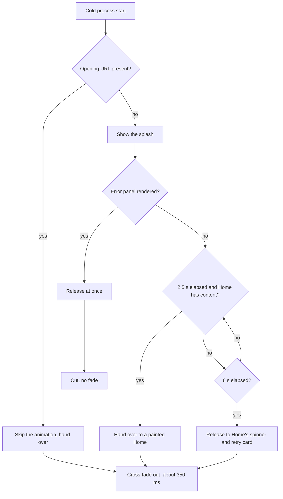
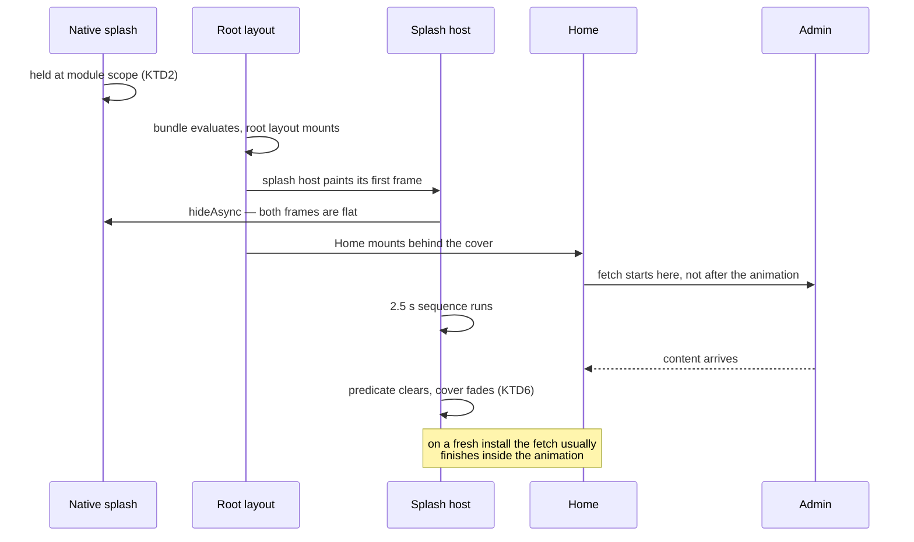

# Mobile Animated Splash - Plan

## Goal Capsule

- **Objective.** A person who opens the mobile app from cold meets a branded Jesus Film moment, and reaches a painted Home when it ends, instead of meeting a static app icon followed by a loading spinner on the first launch after install.
- **Means.** A full-screen layer drawn above the live app tree, held in place by the native splash until it paints (KTD1, KTD2).
- **Product authority.** This plan owns the mobile app's cold-start experience. Home's data layer, the Home spinner, and the Home retry card stay as they are; the splash hands over to them. `apps/tv` and `apps/web` are not in scope.
- **Stop conditions.** Stop and ask before changing any Product Contract requirement, before adding a runtime dependency beyond the font file, and before touching Home's data layer, its spinner, or its retry card. One Home-side change is in scope and is not such a change: an additive report from `HomeScreen` telling the splash session that a model has landed (U5).
- **Execution profile.** Unit tests carry the release logic. The native seam, the embedded font, and the animation itself have no test surface and are proven only by a recorded cold launch on a device or simulator.
- **Tail ownership.** This work cannot reach testers as an OTA update. Both `app.json` edits move the fingerprint runtime version, so a native build and a TestFlight round sit outside whatever the implementer produces.
- **Open blockers.** None. The two brand questions this work raised are both decided; see KD6 and KD8.

---

## Product Contract

### Summary

A branded cold-start splash for the mobile app. A full-screen layer draws over the live app tree while Home mounts and fetches behind it, runs a 2.5-second projector sequence, then hands over to Home. No path can hold it past 6 seconds, and every ordinary exit cross-fades.

### Problem Frame

The mobile app configures a static app-icon splash in `apps/mobile/app.json`, and no code calls `preventAutoHideAsync()` or `hideAsync()`. The native splash therefore disappears the moment the React Native root view mounts, before any data has arrived.

On a fresh install there is no stored Home snapshot and no Apollo cache, so `useWatchHome` must wait for a live admin round trip. The code puts that round trip at 2.5 to 6 seconds; the measured wait was 2 to 3 seconds. Through it, `HomeScreen` renders a spinner and the word `Loading...`.

Every later launch paints Home from a stored snapshot in about 50 milliseconds, so the spinner belongs to the first launch after install. That is the one launch that decides whether a new person stays.

### Key Decisions

- KD1. **The splash is an overlay above a live app tree, never a gate in front of it.** (session-settled: user-approved — chosen over a gate that replaces the tree: `useWatchHome` starts its fetch from a mount effect, so a gate would delay the fetch until the animation ended and turn a 2-3 second wait into about 5 seconds.) Governs R1, R3.
- KD2. **The splash holds for a fixed 2.5 seconds on every cold start.** (session-settled: user-directed — chosen over an adaptive short hold and over playing only when Home is not ready: a consistent brand moment is worth the added time on the launches that were already fast.) Governs R3.
- KD3. **A 6-second ceiling releases the splash unconditionally.** (session-settled: user-approved — chosen over a 3-second ceiling and over no ceiling: no path may leave a person with no way forward.) Governs R4.
- KD4. **A deep-link cold launch skips the animation.** (session-settled: user-approved — chosen over playing the full hold and over holding for the destination screen: never delay a request the person made directly.) Governs R6.
- KD5. **The sequence reads the mark as what it is, a projector screen.** (session-settled: user-directed — chosen over four single-gesture alternatives, a wipe reveal, a bloom settle, a sheen, and an aperture: those decorate the mark, while this one explains it.) Governs R8, R9, R10, R11.
- KD6. **The projected word is set in Noto Serif Semibold.** (session-settled: user-approved — chosen over Marcellus and over Aperçu Pro Bold: Noto Serif is the brand's own secondary face, it is a serif, and its licence permits embedding, so the typeface leaves the brand conversation entirely.) Governs R12. Marcellus was chosen first, from twelve candidates, before the brand page was read. Aperçu Pro Bold is the brand's primary face and sits closer to the real wordmark, but it is a licensed commercial face whose cover for embedding in a shipped app binary nobody has confirmed.
- KD7. **No Home content ships inside the bundle.** (session-settled: user-approved — chosen over a bundled first-launch seed and over tracking the seed as a follow-up: the fetch already completes inside the animation on the case that prompted this work, and a second frozen copy of Home would drift beside the one that already does.)
- KD8. **The splash keeps the app's near-black ground, outside the four permitted symbol-on-background combinations.** (session-settled: user-directed — chosen over moving the splash onto brand red with a warm white screen, and over holding for a waiver: the app icon and the tvOS tile already ship on that ground, so the splash inherits the existing item rather than opening a new one, and a compliant ground would destroy the white-to-crimson beat that carries the sequence.)
- KD9. **The splash cross-fades out after the hold, not during it.** (session-settled: user-approved — chosen over fading inside the 2.5 seconds and over a hard cut: the brand moment is never eaten into, at the cost of a total cold start of about 2.85 seconds.) Governs R14.

### Requirements

**Cover and handover**

- R1. The splash renders as a full-screen layer above the app tree, so Home mounts and begins its data fetch while the splash is on screen.
- R2. The native splash stays visible until the splash layer has painted its first frame, so the handover from native to React shows no gap and no flash of the app background.
- R3. On a cold start the splash holds for 2.5 seconds, then hands over as soon as Home has content to paint.
- R14. The splash cross-fades out over about 350 milliseconds on every release path except the error-panel release, which is an immediate cut. The fade runs after the release, so it extends the 2.5-second hold and the 6-second ceiling rather than sitting inside them.

**Release paths**

- R4. The splash releases 6 seconds after it appears, whatever state Home is in, and the person lands on Home's existing spinner and retry card.
- R5. The splash releases at once when the app renders its Startup Error panel or its App Error panel, so neither diagnostic surface can sit behind the cover.
- R6. A cold launch that carries an opening URL skips the animation and hands over as soon as the destination screen can mount.
- R7. A resume from the background shows no splash. Only a cold process start shows one.
- R15. A failed Home fetch releases the splash at once, rather than holding to the 6-second ceiling, so the retry card is reachable as soon as there is something to retry.

**The animation**

- R8. A white projector screen blooms in, overshoots its size, and settles back into place.
- R9. One ray of light grows out of the right edge of the frame, four fifths of the way down, and its two edges land on the projector screen's bottom-left and top-right corners, so the light reads as projected onto the screen. The composition is expressed in proportions of the frame, not fixed offsets, so it holds on a tablet's wider frame as well as a phone's.
- R10. The screen crossfades from white to the crimson brand gradient as the ray arrives, not after it.
- R11. After a pause on the settled crimson screen, the word `Jesus` crossfades on in white, with no movement and no scaling of its own, finishing with the word set over the settled mark, which together read as the Jesus Film Project logo. No separate logotype asset exists in this app, and the horizontal lockups in the sibling apps are not it.
- R12. The word is set in Noto Serif Semibold, embedded in the build, so it can never render in a fallback face and then swap.

**Accessibility**

- R13. A person who has Reduce Motion turned on sees the finished frame held still, under the same rules as R3 and R4, instead of the motion.
- R16. While the splash is visible, the app tree beneath it is removed from the accessibility tree, so a screen-reader user cannot reach content the cover hides. The isolation clears on the same predicate that clears the cover.

### Key Flows

- F1. Cold start, fetch finishes inside the animation
  - **Trigger:** A person opens the app from a dead process, with no opening URL.
  - **Steps:** The native splash holds; the splash layer paints and the native splash hides; Home mounts behind it and fetches; the sequence runs its 2.5 seconds; Home already has content, so the splash hands over.
  - **Outcome:** The person reaches a painted Home and never sees a spinner.
  - **Covered by:** R1, R2, R3, R8, R9, R10, R11

- F2. Cold start, fetch outlives the animation
  - **Trigger:** The same, on a fresh install with a slow or failing network.
  - **Steps:** The sequence runs and finishes; Home still has nothing to paint; the splash holds; at 6 seconds it releases anyway.
  - **Outcome:** The person lands on Home's existing spinner, and on its retry card if the fetch then fails. Nothing holds them under the cover.
  - **Covered by:** R3, R4

- F3. Cold start from a link
  - **Trigger:** A person taps a link to a video while the app process is dead.
  - **Steps:** The launch carries an opening URL; the splash skips its animation; the destination screen mounts and takes over.
  - **Outcome:** The video the person asked for is not delayed.
  - **Covered by:** R6

### Acceptance Examples

- AE1. **Covers R3.** Given a fresh install, when Home has content at 1.8 seconds, then the splash still holds until 2.5 seconds and hands over to a painted Home.
- AE2. **Covers R3.** Given a launch whose stored snapshot paints Home at 50 milliseconds, then the splash still holds until 2.5 seconds.
- AE3. **Covers R4.** Given a fresh install with no network, when 6 seconds have passed, then the splash releases and Home shows its spinner, followed by its retry card when the fetch fails.
- AE4. **Covers R5.** Given a module require that fails at startup, when the Startup Error panel renders, then the splash is already gone and the panel's text is readable and selectable.
- AE5. **Covers R6.** Given a dead process and a tapped video link, then no animation plays and the watch route mounts directly.
- AE6. **Covers R7.** Given the app resumed from the background, then no splash appears.
- AE7. **Covers R13.** Given Reduce Motion is on, then the finished crimson screen with the word is shown still for 2.5 seconds, and the 6-second ceiling still applies.
- AE8. **Covers R12.** Given a cold start, then the word never renders in a fallback face at any frame.
- AE9. **Covers R14.** Given the hold ends at 2.5 seconds, then the overlay fades to nothing over about 350 milliseconds and Home is already painted underneath it throughout.
- AE10. **Covers R15.** Given a fresh install whose Home fetch fails at 2 seconds, then the splash releases at once and the retry card is reachable, rather than the cover holding to 6 seconds.
- AE11. **Covers R16.** Given a screen reader is active while the splash is visible, then no element beneath the cover is reachable, and every element becomes reachable again when the cover clears.

### Scope Boundaries

- No sound. The splash is silent.
- A first launch that arrives from a shared link never sees the splash, so the branded moment reaches only installs whose first launch begins at the app icon.
- No Home content in the bundle. Deferred; see KD7.
- No change to Home's spinner or retry card. They stay as they are, and R4 hands over to them.
- Nothing that makes the fresh-install fetch itself faster. The splash covers that wait; it does not shorten it.
- `apps/tv` and `apps/web` are untouched.

### Dependencies / Assumptions

- **This cannot ship as an OTA update.** Two parts of it are native. The static splash asset in `apps/mobile/assets/` must be replaced so it matches the animation's first frame, or R2 fails and the handover shows a visible jump. Noto Serif must be embedded at build time, per R12. Both need a build, and both move the fingerprint runtime version.
- **"Home has content to paint"** means `useWatchHome` has produced a model — the same condition that removes today's spinner. This was stated in dialogue and not corrected.
- **The animation toolkit is narrow.** `apps/mobile/package.json` excludes `react-native-reanimated`, `react-native-worklets`, and `react-native-gesture-handler` from autolinking, and the app has no Lottie, no `react-native-svg`, and no Skia. Core `Animated`, `expo-linear-gradient`, and `expo-image` are what is available.
- **The 2.5 seconds on every cold start has no measured basis.** It is judged worth paying for a consistent brand moment. Record it as a judgement, not a finding, so a later maintainer weighing a "the app feels slow to open" complaint knows what was traded and why.
- **The splash's ground is not a permitted symbol background.** `brandpad.io/jfp` permits four symbol-on-background combinations: red on white, white or warm white on red, red on warm white, and white on grey. The splash ends on the crimson mark over the app's near-black `#1c1917`, which is none of them. `apps/mobile/CLAUDE.md` already records this pairing as pending a waiver for the app icon and the tvOS tile, so the splash inherits that item rather than opening a new one — but on a much larger surface. Whoever pursues the waiver should know the request now covers a full-screen moment every cold launch ends on, not only a 1024-pixel icon and a tvOS tile.
- **The duration is reversible without a store round.** The 2.5-second floor and the 6-second ceiling live in `apps/mobile/src/lib/splash/splashSession.ts`, and JS-only changes under `src/` and `app/` do not move the fingerprint runtime version. They can be shortened, or set to zero, by an over-the-air update on the existing runtime. Only the embedded font and the native splash asset are frozen until a build.
- **Revisit the hold once there is data.** After the first TestFlight round, read the existing `home_feed_ready` `feed_source` split to record what share of cold launches the splash actually covers a wait on, and revisit the 2.5-second floor if that share is small. No new instrumentation is needed; the app already emits it.
- **The brand facts here were not read by eye.** Every brand decision in this plan rests on a summarising model's reading of `brandpad.io/jfp`. Confirm the four permitted combinations, the palette values, and Noto Serif's status against the page before the font ships.
- **The typeface is on-brand and free to embed.** `brandpad.io/jfp` sanctions three faces: Aperçu Pro (Bold and Medium, for headlines and subheads), Noto Serif (Semibold, Medium and Regular, for headlines, subheads and body copy), and Apercu Custom Display (titling, by creative-director access only). The word on the screen is a title, so R12's Noto Serif Semibold is an approved use, and its licence permits embedding. The page states no fallback-font rule, no rule about typefaces used inside or alongside the logo, and no prohibitions.

### Outstanding Questions

**Deferred to Planning**

- OQ1. How R9's ray is drawn. Two options: rotated `expo-linear-gradient` views, which cannot taper, so the wedge is approximated by stacking a small number of rotated bands under a blur; or adding `react-native-svg` for one polygon. The deciding question is whether the approximation still reads as light striking the screen on a device, which planning cannot see. Default to no new dependency: this app deliberately keeps native packages out, excluding three from autolinking and borrowing `sharp` from another workspace rather than declaring it. Reach for `react-native-svg` only if the approximation fails on a device, and say so in the PR if it does.
- OQ2. How Reduce Motion is read, and how R13's still frame is produced.
- OQ3. The exact easing curves. The asset half of this question is resolved: U6 changes the generator, not the file.
- OQ4. Home's hero autoplays as soon as its stream resolves, so it will often be seconds into playback when the cover lifts, and the first frame seen is not its opening frame. Decide whether to defer the hero's autostart until the splash releases, or accept this in the same spirit as the fetch overlap KD1 already accepts.
- OQ5. A Reduce Motion viewer waits the full hold for a frame they read in under a second, because R13 inherits a duration chosen for motion they never see. Decide whether that population gets a shorter floor.

### Sources / Research

- `apps/mobile/app.json` — the `expo-splash-screen` plugin block; the static image, `contain` mode, and the `#1c1917` ground.
- `apps/mobile/app/_layout.tsx` — the root layout, the `hydrated` gate that renders a bare background view during Apollo cache restore, the Startup Error and App Error panels, and `PlaybackHost` as the precedent for a full-screen layer that sits beside the navigation stack rather than inside it.
- `apps/mobile/src/hooks/useWatchHome.ts` — the mount effect that starts the Home fetch, which is why KD1 holds; the stored-snapshot paint that makes every later launch fast.
- `apps/mobile/src/components/home/HomeScreen.tsx` — the spinner and `Loading...` text that R4 hands over to.
- `apps/mobile/src/lib/color.ts` — the palette tokens the sequence uses.
- `apps/mobile/scripts/generate-app-icon.mjs` — the Jesus Film mark path and the two brand gradient stops the crimson screen matches.
- `apps/mobile/CLAUDE.md` — the OTA runtime-version rule for native changes, and the open brand item.
- `brandpad.io/jfp` — the brand portal, read 2026-09-09. Four permitted symbol-on-background combinations (red on white, white or warm white on red, red on warm white, white on grey); primary red `#EF3340`; warm white `#F0EDE3`; secondary typeface Noto Serif. Read by a summarising model rather than by eye, so confirm against the page before acting on it.

---

## Planning Contract

**Product Contract preservation:** changed. Every original R, KD, F and AE is carried forward as written, and planning added two entries at the user's direction — R14 and KD9, covering the dismissal transition — and document review added two more: R15 (release on a failed Home fetch) and R16 (accessibility isolation of the covered tree), both gaps no existing requirement owned. Nothing was narrowed or renumbered.

### Key Technical Decisions

- KTD1. **The splash host mounts as a sibling of `ExperienceShell`, never inside it and never as an ancestor of the `<Stack>`.** `ExperienceShell` swaps its element type once per cold launch, when the slug resolves, and remounts its whole subtree — a host inside it would restart the animation mid-hold. `PlaybackHost` occupies exactly this position inside `DownloadsProvider`, and the comment at its call site records the same reason. Governs R1.
- KTD2. **`preventAutoHideAsync()` runs at module scope inside the existing guarded `require` block in `app/_layout.tsx`, and both error branches call `hideAsync()` before returning their panel.** Expo documents that the call must be in global scope or it fires after the splash has already auto-hidden. It belongs inside the guarded block because a throwing splash import must land on the Startup Error panel rather than crash the module graph. The error branches need the explicit hide because a held native splash would otherwise cover the only diagnostic surface the app has. The splash binding is typed optional and every call is `typeof`-guarded inside `try/catch`, mirroring `reportDatadogError` in the same file: if the splash `require` is the one that throws, an unguarded call would white-screen the panel it exists to show. Governs R2, R5.
- KTD3. **The native splash becomes a flat `#1c1917` field.** (session-settled: user-approved — chosen over keeping the icon and cross-fading out of it, and over showing the projector screen already settled: the animation opens on an empty field, so a flat ground makes the handover seamless with no extra beat and no colour flip.) The cost is a plain dark screen for the native startup window, where an icon shows today. Governs R2.
- KTD4. **The splash reads the launch's opening URL through a new non-consuming accessor and never calls `consumeDeepLinkEntry()`.** That function is slug-scoped and deletes the entry it returns, so calling it here would silently destroy the deep-link attribution `src/lib/deepLinkOrigin.ts` exists to provide. Governs R6.
- KTD5. **The skip decision runs under its own budget, shorter than the 2.5-second hold, and treats a timeout as "no opening URL".** `whenDeepLinkOriginsReady()` is bounded at 3 s, which outlasts the hold. The default is chosen for its failure direction: a wrong skip removes the animation from every ordinary launch, while a wrong play delays one deep link. Governs R6.
- KTD6. **One predicate governs the splash's visibility, and every release path clears that same predicate.** `docs/solutions/logic-errors/occluding-layers-must-share-one-gate-predicate.md` records this app shipping the opposite twice: two layers hiding one control, agreeing on the happy path and diverging on exactly the failure paths the backstop existed to cover. Governs R3, R4, R5.
- KTD7. **The Reduce Motion flag resolves before the first animated frame, under a short budget, and is treated as `false` if that budget expires.** `useReduceMotion` returns `false` until its async read lands, so starting on mount would show motion to a viewer who asked for none — which is why the session reads `AccessibilityInfo` itself rather than reusing that hook. Governs R13.
- KTD8. **Noto Serif is embedded through the object form of the `expo-font` config plugin, with an explicit Android `fontFamily`.** Under the array form Android derives the family name from the filename while iOS reads it from inside the file, so one `fontFamily` string can resolve on one platform and silently fall back on the other. Build-time embedding also removes the async load R12 forbids. Governs R12.
- KTD9. **The animation is built from core `Animated` values on the native driver, with `expo-linear-gradient` for the ray.** `apps/mobile/package.json` excludes `react-native-reanimated`, `react-native-worklets` and `react-native-gesture-handler` from autolinking, and the app carries no Lottie, `react-native-svg` or Skia. A looped `Animated.sequence` runs only once on Fabric, so any repeat must loop a single timing and interpolate from it. Governs R8, R9, R10, R11.
- KTD10. **The exit fade animates the overlay's own opacity, with `needsOffscreenAlphaCompositing` on the animated wrapper; Home is never re-mounted for it.** Because the splash draws above a live tree, Home is already painted underneath, so the cross-fade has nothing to reveal that is not already there. A gate would have had to mount Home first and would have shown a blank frame doing it. The compositing flag is load-bearing on Android, which applies a group's opacity to each child unless the subtree is composited offscreen first — without it Home bleeds through the fade and the projector layers blend against each other. `src/components/watch/WatchAmbient.tsx` carries the same fix with a guard test. Governs R14.
- KTD11. **The splash session lives in module scope and the host subscribes to it with `useSyncExternalStore`.** The host is a `<Stack>` sibling, so no React context reaches both the host and any route that might need to read the session. `src/lib/miniPlayer/store.ts` and `PlaybackHost` already solve exactly this shape, for exactly this reason. Governs R3, R4.

### High-Level Technical Design

The point of the overlay is that the network fetch and the animation overlap. A gate that replaced the tree would run them one after the other.

### Assumptions

- The native startup window on a release build is short enough that a flat ground reads as a deliberate opening rather than a hang. This is the accepted cost of KTD3 and is observable only on a device.
- The cache-persistence gate in `app/_layout.tsx` is opt-in (`EXPO_PUBLIC_FORGE_CACHE_PERSIST`) and bounded at 400 ms, so when enabled it delays the splash host's first paint by at most that, entirely underneath the held native splash.
- `expo-updates` runs with `checkAutomatically: "ON_LOAD"`. This plan does not change update checking and does not expect it to interact with the splash.

### System-Wide Impact

- **The splash covers the whole app, not Home.** It is mounted at the root, so it sits over every route a cold launch can reach. Home is simply what a cold launch lands on when no opening URL is present.
- **Layer order against the player.** `PlaybackHost` is already a sibling at this level, rendered after the navigation stack. The splash host must render after it so it paints above. On Android that ordering holds only because every video view in this app carries `surfaceType="textureView"`; a `SurfaceView` composites outside the React Native hierarchy and would punch through the cover. A cold launch has no playback, so the interaction is currently theoretical — but the ordering is cheap to get right and expensive to discover later.
- **The dev-only endpoint banner draws ABOVE the splash, not under it.** It is the last child of the root view, outside and after the error boundary, while the host sits inside that boundary — so the banner paints on top during the hold. This is accepted: the surface is development-only. Do not move the host outside the boundary to change it, which would break the automatic removal on the App Error path.
- **The module-scope hold is what covers the hydration window.** While the cache-persistence gate is restoring, the root layout returns a bare background view and the splash host does not mount at all. Only the module-scope `preventAutoHideAsync()` covers that window, so moving that call into a component would reopen a gap nothing else closes.
- **An over-the-air update reload replays the splash.** A background resume shows nothing for free, because the module-scope session is not re-evaluated. An `expo-updates` reload under `checkAutomatically: "ON_LOAD"` does re-evaluate it and will play the sequence again. This is accepted and untested.
- **`apps/tv` does not inherit this.** It has its own launch experience and its own tile, and this plan does not touch it. The two surfaces will differ until someone decides otherwise.

### Risks & Dependencies

- **A native splash regression is invisible to the entire test suite.** `docs/solutions/ui-bugs/expo-splash-screen-sdk57-full-bleed-default-change.md` records this plugin silently changing its rendering for unchanged config, with `expo-doctor`, CI, typecheck and unit tests all clean. U6 is provable only by watching a real cold launch.
- **`enableFullScreenImage_legacy: true` is load-bearing and must survive U6.** It is what holds the plugin off its SDK 57 centred-logo default.
- **Both `app.json` edits move the fingerprint runtime version.** After U3 and U6 land, the next `eas update` reaches no installed build until a native build ships. See `apps/mobile/CLAUDE.md`.
- **The existing launch metric will not move, so it cannot measure this.** `addDatadogTiming("js_tti")` fires on the first real-tree paint past the hydration gate. The splash does not delay that paint; it covers it. So this feature adds about 2.85 seconds to time-to-visible-content while leaving the one launch timing the app records completely flat. `home_feed_ready` is equally flat, because it fires at the model-set instant the splash's own release condition reads. Any before-and-after comparison using either will show no regression and will be wrong.
- **The hold and the ceiling are JavaScript timers on a busy cold-start thread.** They compete with Apollo client construction, Home's mount and the feed's first render. Unit tests with fake timers prove the ordering, never the wall-clock behaviour on a real device; the stranding sweep is the only gate that would surface a stretched ceiling.
- **The font file must be the SIL Open Font License release of Noto Serif.** That licence permits embedding; confirm the obtained file is that release.

### Sequencing

U1 then U2. U3 then U4. U5 wires both chains into the root layout and depends on U2 and U4. U6 is independent of all of them, but should land with U5 so one native build verifies both.

---

## Implementation Units

### U1. Read the launch's opening URL without consuming it

- **Goal:** Answer "did this launch start from an external URL?" once, at launch level, without disturbing per-slug deep-link attribution.
- **Requirements:** R6
- **Dependencies:** none
- **Files:** `apps/mobile/src/lib/deepLinkOrigin.ts`, `apps/mobile/src/lib/__tests__/deepLinkOrigin.test.ts`
- **Approach:**
  1. Record whether the cold registration carried a URL **that addresses an app route**, as launch-level state separate from the per-slug `externalArrivals` map. Reuse the module's existing parse rather than treating any non-null URL as external — a development-client launch always carries a wrapper URL, so the unnarrowed read would skip the animation on every launch an implementer can observe.
  2. Expose a read that reports that state and does not delete it, so repeated reads agree and `consumeDeepLinkEntry()` is untouched (KTD4).
  3. Extend `resetDeepLinkOrigins()` to clear the new state so tests stay isolated.
- **Patterns to follow:** the existing module's own shape — module-scope state, a bounded promise gate, and a test seam reset.
- **Test scenarios:**
  1. A cold launch with an opening URL reports an external launch.
  2. A cold launch with no opening URL reports a non-external launch.
  3. A warm `url` event after launch does not change the launch-level answer.
  4. A development-client wrapper URL reports a non-external launch.
  5. Reading twice returns the same answer both times.
  6. `consumeDeepLinkEntry()` still returns and then clears its per-slug entry after the new read has run.
  7. `resetDeepLinkOrigins()` clears the launch-level state.
- **Verification:** the deep-link attribution tests still pass unchanged, and the new read is provably non-destructive.

### U2. Decide, hold, and release the splash

- **Goal:** Own the whole visibility lifecycle in one pure, testable module: whether the splash plays, when it may hand over, and every path that ends it.
- **Requirements:** R3, R4, R5, R6, R7, R13, R15
- **Dependencies:** U1
- **Files:** `apps/mobile/src/lib/splash/splashSession.ts`, `apps/mobile/src/lib/splash/__tests__/splashSession.test.ts`
- **Approach:**
  1. Expose one visibility predicate and route every release through it (KTD6).
  2. Resolve the skip decision from U1's read under its own budget, defaulting to play on timeout (KTD5).
  3. Hold for the 2.5-second floor, then release once Home has content.
  4. Arm the 6-second ceiling unconditionally when the splash becomes visible, not when a load succeeds.
  5. Accept an immediate release for the error-panel path (R5) and for a failed Home fetch (R15).
  6. Treat a background resume as no session at all (R7).
  7. Read `AccessibilityInfo.isReduceMotionEnabled()` directly under a short budget, defaulting to `false` on timeout (KTD7), and pass the resolved value into the sequence. Do not use `src/hooks/useReduceMotion.ts` here: it returns `false` until its async read lands, which is the exact defect KTD7 exists to prevent.
- **Execution note:** write the release paths test-first. This module is where the two documented gate-stranding defects in this app would recur.
- **Test scenarios:**
  1. Covers AE1. Content at 1.8 s still holds until 2.5 s.
  2. Covers AE2. Content at 50 ms still holds until 2.5 s.
  3. Covers AE3. No content by 6 s releases anyway.
  4. The ceiling arms on becoming visible, so a session that never reports content still ends.
  5. Covers AE5. An external launch resolves to skip before any hold begins.
  6. A skip decision that exceeds its budget resolves to play, not skip.
  7. Covers AE6. A background resume starts no session.
  8. An immediate release ends the session from any state, including before the floor.
  9. Reduce Motion changes the presentation but not the 2.5 s floor or the 6 s ceiling.
  10. Every release path leaves the single visibility predicate false — asserted per path, not once.
  11. Covers AE10. A reported fetch failure releases the session at once, without waiting for the ceiling.
  12. The Reduce Motion value comes from a direct accessibility read under its own budget, and a read that exceeds that budget resolves false rather than blocking the sequence.
- **Verification:** no ordering of inputs leaves the predicate true past the ceiling.

### U3. Embed Noto Serif

- **Goal:** Make Noto Serif Semibold available natively at first frame, with no runtime font loading.
- **Requirements:** R12
- **Dependencies:** none
- **Files:** `apps/mobile/app.json`, `apps/mobile/assets/fonts/` (new)
- **Approach:**
  1. Add the SIL Open Font License release of Noto Serif Semibold under `assets/fonts/`.
  2. Convert the bare `"expo-font"` plugin entry to the object form and declare the face, naming the Android `fontFamily` explicitly (KTD8).
  3. Record the iOS family name the file actually reports, because iOS reads it from inside the file rather than from the filename. Note that the existing bare `"expo-font"` entry is inert today — the plugin returns the config unchanged when it has no props — so this is a first configuration, not an edit to a working one.
- **Test scenarios:** `Test expectation: none -- native configuration with no JavaScript surface. U4 carries the rendering assertion and the device check proves the family name resolves.`
- **Verification:** a development build renders the word in Noto Serif on both platforms, not in a fallback serif.

### U4. Draw the projector sequence

- **Goal:** Render the four beats, and the Reduce Motion still frame, as one self-contained component.
- **Requirements:** R8, R9, R10, R11, R13
- **Dependencies:** U3
- **Files:** `apps/mobile/src/components/splash/SplashSequence.tsx`, `apps/mobile/src/components/splash/__tests__/SplashSequence.test.tsx`
- **Approach:**
  1. Drive every beat from core `Animated` values on the native driver (KTD9).
  2. Bloom the white screen in, overshoot, and settle on a slower curve than the rise, so the settle does not snap.
  3. Grow one ray from the right edge at four fifths of the frame height, with its edges meeting the screen's bottom-left and top-right corners.
  4. Cross-fade white to the crimson gradient while the ray grows, completing before the word begins.
  5. Cross-fade the word in with no translation and no scaling.
  6. Render the finished frame statically when Reduce Motion is on.
- **Patterns to follow:** the ray grows by `scaleX` from a right-edge transform origin, because the native driver cannot animate width; `hexToRgba(color, 0)` for gradient stops, never `"transparent"`; `Math.round()` on any scaled font size for Android; `expo-image` for any raster.
- **Test scenarios:**
  1. Covers R11. The word carries no transform at any point in its animation.
  2. Covers R10. The crimson layer reaches full opacity before the word's fade begins.
  3. Covers R13. With Reduce Motion on, the finished frame renders and no animation is started.
  4. Covers R13. With Reduce Motion off, the sequence starts.
  5. The ray's geometry places its two edges on the screen's bottom-left and top-right corners.
  6. No `Animated.loop` wraps a sequence, so the Fabric single-run defect cannot appear.
- **Verification:** the sequence reads as one continuous motion on a device, and the word never appears over a screen that is still changing colour.

### U5. Own the native splash lifecycle and mount the host

- **Goal:** Hold the native splash until the React layer paints, mount the host above the app tree, and make sure neither error panel can end up behind the cover.
- **Requirements:** R1, R2, R3, R5, R14, R16
- **Dependencies:** U2, U4
- **Files:** `apps/mobile/app/_layout.tsx`, `apps/mobile/src/components/home/HomeScreen.tsx`, `apps/mobile/app/__tests__/splashHostOwnership.guard.test.js` (new)
- **Approach:**
  1. Call `preventAutoHideAsync()` at module scope inside the guarded `require` block (KTD2).
  2. Call `hideAsync()` once the session has resolved and the host has drawn whatever it will draw — the sequence's first frame when playing, nothing at all when skipping (R6). The skip path must hide it too, or the held flat field covers the destination screen forever.
  3. Call `hideAsync()` on the `moduleError` branch and in the error boundary before either panel returns, `typeof`-guarded inside `try/catch`.
  4. Render the splash host as a sibling of `ExperienceShell`, immediately after `PlaybackHost` inside `DownloadsProvider` (KTD1).
  5. Cross-fade the whole overlay out when the session releases, and cut without a fade on the error path (R14).
  6. Render the host after `PlaybackHost` in the same parent, so it paints above the player layer.
  7. Wire the readiness signal: `HomeScreen` reports to the splash session the first time `useWatchHome` returns a non-null model. This additive report is the only Home-side change and is in scope (see Stop conditions).
  8. Mark the host as an accessibility modal while the visibility predicate is true, and clear it on the same predicate (R16).
- **Patterns to follow:** `app/__tests__/backSwipeGesture.guard.test.js` for the guard-test shape; `PlaybackHost`'s `StyleSheet.absoluteFill` positioning; `src/components/watch/WatchAmbient.tsx` for `needsOffscreenAlphaCompositing` on an animated group; the `reportDatadogError` optional-binding guard in `app/_layout.tsx`.
- **Test scenarios:**
  1. Covers R1. The splash host is a sibling of `ExperienceShell`, never inside it and never an ancestor of the `<Stack>` — asserted structurally, so a later move inside the shell fails the suite.
  2. Covers R5. The Startup Error branch hides the native splash before it returns.
  3. Covers R5. The error boundary hides the native splash before it renders the App Error panel.
  4. Covers R2. On the playing path the native splash is hidden only after the host reports a painted frame, never on mount.
  5. Covers R6. On the skip path the native splash is hidden even though no frame is ever drawn.
  6. `preventAutoHideAsync` is called at module scope, not from inside a component or an effect.
  7. Covers AE9. A release fades the overlay to zero opacity and unmounts it only after the fade finishes.
  8. Covers R14. The error-panel release removes the overlay without a fade.
  9. The splash host renders after `PlaybackHost`, asserted by order in the same parent.
  10. Covers R3. The session is told Home has content the first time the model is non-null, and is not told again on later updates.
  11. Covers R16. While the cover is visible the tree beneath it is hidden from the accessibility tree, and the isolation clears on the same predicate that clears the cover.
- **Verification:** forcing a module-level throw shows the Startup Error text with nothing covering it.

### U6. Match the native splash frame to the animation's opening frame

- **Goal:** Make the native-to-React handover invisible by giving both sides the same flat brand ground.
- **Requirements:** R2
- **Dependencies:** none
- **Files:** `apps/mobile/app.json`, `apps/mobile/scripts/generate-app-icon.mjs`, `apps/mobile/assets/`
- **Approach:**
  1. Change the generator's splash branch to emit a flat `#1c1917` field matching the animation's first frame (KTD3), then regenerate with `pnpm icons:generate`. `assets/splash-icon.png` is generated output — hand-editing it would be silently undone by the next generator run, and `apps/mobile/CLAUDE.md` forbids it.
  2. Keep `enableFullScreenImage_legacy: true` and `backgroundColor: "#1c1917"` in place.
  3. Regenerate the native splash and confirm the generated artifact, not just the config diff.
- **Execution note:** this is native configuration. No unit test can prove it. The proof is a recorded cold launch compared frame by frame against the current build.
- **Test scenarios:** `Test expectation: none -- generated native output with no JavaScript surface. See the Verification Contract's device gate.`
- **Verification:** a cold launch shows no visible change at the moment the native splash hands over.

---

## Verification Contract

| Gate            | Command                                     | Applies to       |
| --------------- | ------------------------------------------- | ---------------- |
| Unit tests      | `pnpm --filter @forge/mobile test`          | U1, U2, U4, U5   |
| Types           | `pnpm --filter @forge/mobile typecheck`     | all              |
| Lint            | `pnpm --filter @forge/mobile lint`          | all              |
| Markdown format | `npx prettier --check .` from the repo root | any docs touched |

Five checks have no command and cannot be skipped, because the failure modes they cover are invisible to the suite.

- **Cold-launch seam.** Record a cold launch on a device or simulator and step through the frames at the native handover. There must be no flash, no jump, and no gap. Covers R2, U5, U6.
- **Font resolution.** Confirm on both iOS and Android that the word renders in Noto Serif and not in a fallback serif. The two platforms resolve the family name differently, so one platform passing proves nothing about the other. Covers R12, U3.
- **Tablet composition.** Run one cold launch on an iPad and confirm the ray still reads as light striking the screen. The app locks to portrait at the root, so a landscape phone is not the risk; a 4:3 tablet frame is.
- **Stranding sweep.** With the network disabled, cold-launch a fresh install and confirm the splash releases at 6 seconds onto Home's spinner and then its retry card. Covers R4, AE3.

- **Cold-start timing.** Measure time from launch to visible Home content before and after, on the same device and build type, with a wall-clock stopwatch over a screen recording — not an in-app metric. Neither `js_tti` nor `home_feed_ready` moves under the cover (see Risks). The exit criterion is the Objective itself: on a normal network, a fresh install reaches painted Home content without the viewer seeing a spinner.

`apps/mobile/CLAUDE.md` requires simulator verification for every mobile change, and its performance convention applies here: this change alters cold-start rendering, so record the launch timing alongside the visual check rather than reporting the visual check alone.

---

## Definition of Done

Global:

- Every requirement R1 to R14 is covered by at least one unit, and each unit's cited requirements are satisfied.
- The four command gates pass, and the five device checks in the Verification Contract have been performed and reported with their evidence.
- The Product Contract is unchanged except for R14 and KD9, added during planning at the user's direction. Any conflict found during implementation is raised, not silently resolved.
- No abandoned approach is left in the diff. A splash that covers the app is exactly the kind of surface where dead experimental branches hide.
- The release note states that this cannot ship as an OTA update, because both `app.json` edits move the fingerprint runtime version.

Per unit:

- U1: the launch-level read is non-destructive, and the existing deep-link attribution tests pass untouched.
- U2: every release path is asserted to clear the single visibility predicate, each with its own test.
- U3: the font file is present, licensed for embedding, and declared with an explicit Android family name.
- U4: the word carries no transform, and the crimson layer completes before the word begins.
- U5: both error panels are proven reachable with the native splash already hidden, and the overlay unmounts only after its fade completes.
- U6: a recorded cold launch shows no visible seam at the handover.
