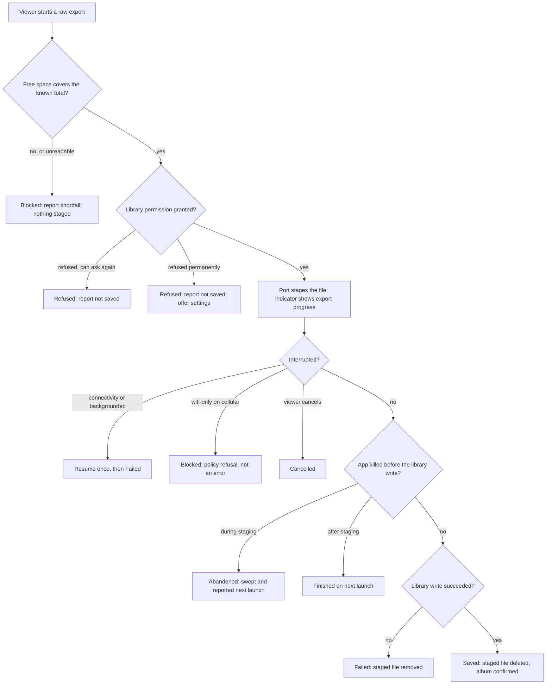
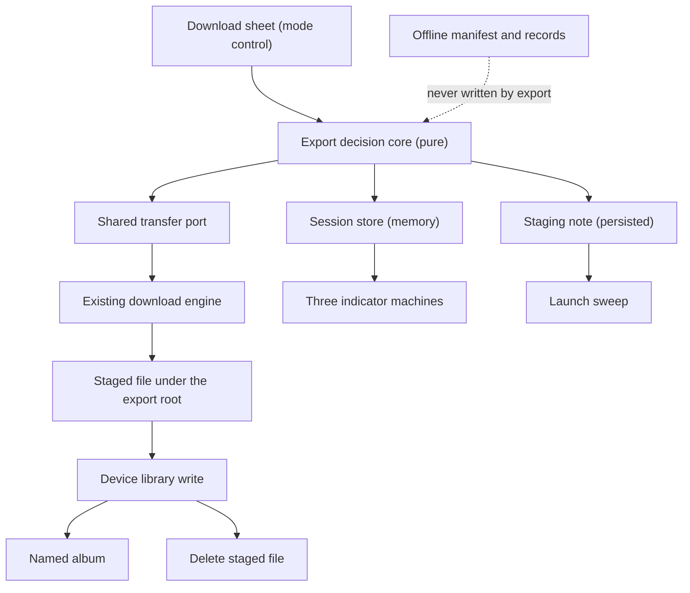

# Mobile Raw File Export - Plan

## Goal Capsule

- Objective: a viewer can keep a JesusFilm video as an ordinary video file on their own device, so it survives outside the app and plays with the tools their phone already has.
- Means: add a mode control to the two existing download sheets, and transfer through a shared transfer port over the existing background engine (KTD1).
- Product authority: leadership reversed the June 2026 decision that removed raw file export from the mobile app.
- Execution profile: one native dependency, two sheet surfaces, a new in-flight session store, a launch-time sweep, and a scripted device pass on both platforms. The feature arrives only in a native build, but can be disabled over the air (KTD12).
- Open blocker (release, not planning): the Terms of Use text is unchanged by this work. The PERSONAL USE clause in `apps/mobile/src/lib/terms-of-use.ts` forbids redistribution, and an exported file makes redistribution easy. Whether that text needs revision is a leadership and legal call. Planning and implementation proceed while it is open.
- Stop conditions: stop and re-decide if a staged export cannot be finished on a later foreground transition (R28 depends on it, because KTD4 defers rather than forces the write), or if the write-only permission scope cannot create a named album (R17 depends on it, and KD7 fixes the name before first distribution).

**Product Contract preservation:** changed — R8, R11, R13, R16, R18, R21, R27, R28 and R32 were rewritten and R23-R35 added, because flow analysis and a deepening pass showed each described behaviour the app cannot deliver or left a reachable state unowned. Intent is preserved throughout. R1-R7, R9, R10, R12, R14, R15, R17, R19, R20 and R22 are unchanged. Every `Governs` link is re-pointed below.

---

## Product Contract

### Summary

The two download sheets gain a mode control: keep the offline copy the app manages, or save a raw video file to the device's photo library. Raw mode hides the subtitle affordances, dismisses the sheet when the export starts, reports on the existing circular indicator, and confirms what reached the library.

### Problem Frame

The mobile app once wrote an MP4 and handed it to the operating system's share sheet. The June 2026 offline-downloads work replaced that flow with an app-managed copy, and recorded the removal as R27 in `docs/plans/2026-06-16-001-feat-mobile-offline-video-downloads-plan.md`. The same plan listed raw export under "Outside this product's identity". The stated objection was that the exported file was loose, untied to language or subtitles, purgeable by the operating system, and unplayable in the app's own player.

Leadership has since reversed that decision.

Meanwhile the web app never stopped offering a raw download. `apps/web/src/app/api/download/route.ts` resolves a download and redirects to the CDN so the browser saves the file. So a person on jesusfilm.org can save a video today while the same person inside the mobile app cannot. The gap is now an inconsistency rather than a considered boundary.

Three of the four original objections were about losing the managed copy, not about offering a file at all. The fourth is different in kind: a single video file cannot carry a sidecar subtitle track, whatever the product decides.

### Key Decisions

- KD1. Reinstate raw file export in the mobile app. (session-settled: user-directed — chosen over leaving R27 in force: leadership reversed the removal.) Governs R1.
- KD2. Both download sheets get the mode control, and the series sheet exports the whole series. (session-settled: user-directed — chosen over the per-video sheet alone: the viewer wants parity across both surfaces, accepting that the series sheet is all-or-nothing by design.) Governs R1, R19, R20, R21, R22, R30, R31, R32.
- KD3. Raw mode hides every subtitle affordance rather than disabling or rewording it. (session-settled: user-directed — chosen over leaving the affordance visible: it describes something the exported file cannot carry.) Governs R5, R6, R23.
- KD4. A saved file is not a Download Record, but an in-flight export is not invisible. The app never manages a file the device library owns; it does track the transfer that produces one, because otherwise a viewer can start the same export twice and no count can be reported. Governs R12, R13, R14, R16, R27.
- KD5. Raw mode inherits the offline path's Terms gate, free-space check and wifi-only preference. Same disk, same network, same content licence. Governs R7, R8, R9, R35.
- KD6. Mobile ships no account gate on export. The web app has that capability but keeps it disabled, so mobile matches the behaviour that ships rather than the capability that exists.
- KD7. The album name is fixed before the first build is distributed. The app cannot rename or delete an album it created, so changing the name later scatters exports across two albums and orphans the first. Governs R17, R34.

### Actors

- A1. Viewer — chooses the mode, grants or refuses library permission, and receives the confirmation.
- A2. Device photo library — the operating system's photo store on iOS and its Android equivalent. It grants or refuses permission, and it owns the file once saved (R14).

### Requirements

**Mode selection**

- R1. Both download sheets present a mode control near the top of the sheet, offering exactly two choices: keep an offline copy in the app, or save a raw video file to the device.
- R2. The control starts on the offline-copy mode every time a sheet opens, and the choice is never persisted between openings.
- R3. Offline mode behaves exactly as it does today.
- R4. The quality choice applies in both modes; in raw mode the selected rendition is the file that gets saved.
- R33. Raw export is disabled by a single build-time switch that removes the mode control from both sheets and refuses any new export, without disabling the launch-time sweep.

**Subtitles in raw mode**

- R5. Choosing raw mode hides the per-video sheet's subtitle pill.
- R6. Choosing raw mode hides the series sheet's subtitle selector.
- R23. A subtitle hidden by raw mode does not influence what raw mode transfers or how its size is computed.

**Gates both modes share**

- R7. Raw mode requires the same Terms of Use acceptance as offline mode.
- R35. The first time a viewer selects raw mode, the sheet states once that the saved file is for personal use and leaves the app's control. It is not repeated per file.
- R8. Raw mode admits an export only when free space covers the known required total — one staged copy of the largest single file, plus the cumulative size of every library copy the run will produce, plus the existing storage reserve. A reused copy still needs its duplicate counted, but no network transfer. When any rendition size is unknown the total is a lower bound and the estimate is flagged rather than treated as exact. An unreadable free-space reading blocks the export.
- R9. Raw mode honours the wifi-only preference.
- R10. The app requests permission to add to the device photo library at the moment the viewer starts an export, not when they select the mode, and an export cannot proceed without it. In a series run the permission is re-checked before each episode's library write, because it can be revoked mid-run.
- R11. When permission is refused — at the first prompt or by revocation part-way through a run — the app reports that the video was not saved, removes any staged file from app storage, and treats it as a refusal rather than a failure.
- R24. A raw export cannot be paused. It runs to completion, fails, is blocked, or is cancelled.
- R25. A refusal the operating system will not prompt for again is reported differently from a first refusal, and offers the viewer a route to system settings.
- R26. A viewer refusing a permission prompt, or cancelling, is never reported as a failure. Neither is a cancellation the app caused itself.

**Reusing an offline copy**

- R36. When a video already has a completed offline copy of the exact rendition raw mode is about to save, the export copies that file instead of transferring it again. The match is on stable rendition identity and must be exact; an absent or empty identity never matches, and an in-flight, paused or unverified copy is not reusable.
- R37. Whenever the video already has an offline copy, the sheet says so in raw mode — naming the quality already held, and stating that choosing that same quality reuses the file while any other quality downloads it again. On the series sheet the note names how many episodes can be reused at the currently selected quality.
- R38. Reuse never modifies the offline copy. The file handed to the device library is a duplicate, so a library that moved or consumed what it is given cannot destroy the offline copy.

**What an exported file is not**

- R12. An exported file is not an offline copy: it gets no downloaded tick, no swap, no Library row, and no reconciliation on launch.
- R13. An export and an offline copy of the same video are independent in both directions. Exporting neither creates, replaces nor deletes an offline copy, and no offline deletion — including Remove All on a series — destroys an export in flight. Reading an offline copy to reuse its bytes is not a modification and is permitted (R36, R38).
- R14. This work adds no way to find, delete or manage an exported file once the device library holds it.
- R27. A second export of a target that already has an export in flight is refused, and the viewer is told it is already exporting rather than being left with a control that appears to do nothing.

**Starting and reporting an export**

- R15. Starting a raw export dismisses the sheet.
- R16. While an export runs, the indicator for that target shows export progress in a state distinct from the offline states, on every surface that renders one. Its tap never pauses the export; on the per-video surface the tap does nothing, and on the series surface it opens the cancel control. When a video has both an export in flight and an offline copy, the indicator shows the export.
- R17. On success the app confirms that the video reached the device's photo library, naming the Android destination when running on Android. Saved videos go into a named album rather than the undifferentiated camera roll. If the granted permission scope cannot create that album, the video is still saved to the library and the confirmation names the library rather than the album; a missing album never fails an export.
- R34. The exported file carries a viewer-legible name derived from the video's title, not an internal identifier. The title is untrusted content, so the name is sanitized on the same basis as the staged path and truncated to a bounded length before it reaches the device library.
- R18. A failed export reports the failure, leaves no staged file in app storage, and leaves no partial file in the device library.
- R28. A raw export continues while the app is backgrounded. The staging note records whether the transfer finished, which is what lets the next launch tell the two cases apart: an export interrupted before its transfer completes is discarded, its staged file removed, and the viewer told it did not finish; an export whose transfer completed but whose library write had not run is finished instead.
- R29. A completion or failure report reaches the viewer even when they have left the screen the export started from.

**Series behaviour**

- R19. A series raw export covers every episode the series sheet resolves, matching the set an offline batch would cover.
- R20. A series raw export saves episodes one at a time, in episode order.
- R21. A series raw export reports how many episodes were saved and how many failed, against the size of the resolved set. Raw mode skips no episode and refuses no episode within its own run, so saved plus failed always equals the resolved set and no skipped count is reported.
- R22. Cancelling a series raw export stops further saves, and episodes already saved remain in the device library.
- R30. A running series raw export has a cancel control reachable after the sheet dismisses.
- R31. An episode that fails does not stop the run; the remaining episodes still attempt, and the failure is counted.
- R32. Raw mode suspends every already-downloaded gate on the series sheet — the disabled saved quality tier, the disabled saved subtitle option, the nothing-to-do confirm block, and the replace-downloads warning, which is false in raw mode because an export replaces nothing.

### Sheet composition by mode

The mode control is the only new region. Choosing raw mode removes the subtitle region on both sheets and leaves every other region in place.

```mermaid
flowchart TB
  subgraph offline["Offline copy mode"]
    O1["Video title and metadata"]
    O2["Mode control"]
    O3["Subtitle region: pill (per-video) or selector (series)"]
    O4["Quality choice"]
    O5["Terms of Use acceptance"]
    O6["Start button"]
    O1 --> O2 --> O3 --> O4 --> O5 --> O6
  end
  subgraph raw["Raw file mode"]
    W1["Video title and metadata"]
    W2["Mode control"]
    W3["Personal-use note, first selection only"]
    W4["Quality choice"]
    W5["Terms of Use acceptance"]
    W6["Start button"]
    W1 --> W2 --> W3 --> W4 --> W5 --> W6
  end
```

### Key Flows

- F1. Export one video
  - **Trigger:** the viewer opens a video's download sheet and selects raw mode.
  - **Actors:** A1, A2
  - **Steps:** the subtitle pill disappears; the personal-use note shows on first selection; the viewer picks a quality and accepts the Terms; on start the app checks free space and requests library permission; the sheet dismisses; the port stages the file; the app saves it to the album and deletes the staged copy.
  - **Outcome:** a confirmation naming the album.
  - **Covered by:** R1, R4, R5, R7, R8, R10, R15, R16, R17, R29, R35

- F2. Export a whole series
  - **Trigger:** the viewer opens a series download sheet and selects raw mode.
  - **Actors:** A1, A2
  - **Steps:** the subtitle selector disappears; every already-downloaded gate lifts; the viewer picks one quality for the set and accepts the Terms; the sheet dismisses; episodes stage and save one at a time in order, with failures counted and passed over.
  - **Outcome:** a report of saved and failed episodes against the resolved set.
  - **Covered by:** R6, R19, R20, R21, R30, R31, R32

- F3. Library permission refused
  - **Trigger:** the viewer refuses the photo-library permission at the prompt.
  - **Actors:** A1, A2
  - **Steps:** the export does not start; nothing is written to the device library; any staged file is removed.
  - **Outcome:** the app states that the video was not saved, and offers system settings when the prompt will not appear again.
  - **Covered by:** R10, R11, R25, R26

### Export outcomes

An interruption the shared engine classifies as paused is not a paused export; KTD11 owns the translation shown here.

### Acceptance Examples

- AE1. **Covers R5.** Given a video whose sheet shows a subtitle pill naming a language, when the viewer selects raw mode, then the pill is not shown.
- AE2. **Covers R6.** Given a series sheet showing a subtitle selector, when the viewer selects raw mode, then the selector is not shown.
- AE3. **Covers R2.** Given the viewer selected raw mode and started an export, when a download sheet is opened again in the same app session, then the control reads offline mode. This case guards against a future change persisting the mode; it must fail if any persistence is introduced.
- AE4. **Covers R10, R11.** Given the viewer has not granted photo-library permission, when they start a raw export and refuse the prompt, then the app states the video was not saved, no file is written to the device library, and no staged file remains in app storage.
- AE5. **Covers R8.** Given free space below the required total for the selected rendition, when the viewer starts a raw export, then the export does not start and the sheet stays open so a smaller quality can be chosen.
- AE6. **Covers R13.** Given a video that already has a completed offline copy, when the viewer exports the same video in raw mode and the export succeeds, then the file reaches the device library and the offline copy is still present and still shows as downloaded.
- AE7. **Covers R13.** Given a series raw export in flight, when the viewer taps Remove All on that series' offline downloads, then every staged export file survives and the run continues.
- AE8. **Covers R21.** Given a series whose resolved set is twelve episodes and two fail, when the run finishes, then the report states ten saved and two failed against twelve, and the numbers are read from the run rather than fixed in the assertion.
- AE9. **Covers R22, R30.** Given a series raw export part-way through, when the viewer cancels from the running-export control, then the episode in flight stops before its library write, no further episodes start, and the episodes already saved remain in the device library.
- AE10. **Covers R25.** Given a viewer who previously refused the permission and cannot be prompted again, when they start a raw export, then the app reports the refusal differently from a first refusal and offers a route to system settings.
- AE11. **Covers R26.** Given a viewer who refuses the permission prompt, when the refusal is handled, then no failure is reported anywhere in the app.
- AE12. **Covers R16, R24.** Given a video with an export in flight, when the viewer looks at that video's download control, then its accessibility label names the export rather than a pause, and pressing it neither opens the sheet nor pauses the transfer.
- AE13. **Covers R28.** Given an export interrupted during staging, when the app is killed and relaunched, then the staged file is gone and the viewer is told the export did not finish.
- AE14. **Covers R32.** Given a series whose every episode is already downloaded offline, when the viewer opens the series sheet in raw mode, then the saved quality tier and saved subtitle option are selectable, the confirm control is enabled, and confirming shows no replace-downloads warning.
- AE15. **Covers R27.** Given a video with an export in flight, when a second export of the same video is started, then it is refused.
- AE16. **Covers R28.** Given an export whose transfer completed while the app was backgrounded, when the app is killed before the library write and then relaunched, then the file is saved rather than discarded.
- AE17. **Covers R9.** Given the wifi-only preference is on, when an export starts, then its transfer spec forbids cellular use.
- AE19. **Covers R36.** Given a video with a completed offline copy at the Highest rendition, when the viewer exports that same rendition in raw mode, then no network transfer starts and the file reaches the device library.
- AE20. **Covers R36.** Given the same video, when the viewer exports a different rendition, then a transfer does start.
- AE21. **Covers R36.** Given an offline copy whose stored rendition identity is empty, when the viewer exports any rendition, then no reuse occurs and a transfer starts.
- AE22. **Covers R38.** Given a reused export that has reached the device library, when the viewer returns to the Library, then the offline copy is still present and still plays.
- AE23. **Covers R37.** Given a video with an offline copy at High, when the viewer selects raw mode, then the sheet names High as already downloaded and states that another quality downloads again.
- AE18. **Covers R33.** Given the build-time switch is off, when either download sheet opens, then no mode control is present and no export can be started, while the launch-time sweep still runs.

### Success Criteria

- The offline download path behaves identically after this work; its existing tests pass unchanged.
- A viewer can tell from the sheet alone which of the two outcomes they are about to get, without starting a download to find out.
- No viewer finishes a raw export believing a subtitle track came with it, which the hidden subtitle affordances and the rule that a hidden subtitle changes nothing about the transfer together make true.
- The library write is proven on real iOS and real Android hardware, including a file above two gigabytes and a multi-episode series run.
- Export outcomes are visible in production telemetry, with no attribute silently dropped on ingest.

### Scope Boundaries

**Deferred for later**

- Account-gating the export. The web app has the capability and keeps it disabled.
- Any in-app listing, deletion or management of exported files.
- Per-episode selection in the series sheet, which does not exist today in either mode.

**Outside this product's identity**

- Burning subtitles into the exported file. That is re-encoding, not a phone operation.
- DRM or encryption-at-rest for exported media, which the June 2026 plan placed outside the product and this work does not revisit.

**Deferred to follow-up work**

- Resuming a partially-transferred export across app restarts. R28 finishes a completed stage but discards a partial one.
- A "view in the album" deep link from the confirmation.
- Rewriting the offline path's own telemetry beyond the single reserved-name hit U11 surfaces.

### Dependencies / Assumptions

- Saving into the device photo library needs a native capability the app does not currently carry. The feature arrives only in a native build, because `apps/mobile/app.json` sets the fingerprint runtime-version policy.
- The renditions the sheets already list are the files an export saves; the offline path resolves the same URLs from the same rendition identity.
- Assumption: starting on offline mode is right because it preserves today's outcome for anyone who ignores the new control. R2 records the behaviour.
- Assumption: the device library copies the bytes it is given, so the staged file can be deleted once the write resolves. This is platform behaviour rather than documented Expo behaviour and is verified in U8.

### Outstanding Questions

**Deferred to implementation**

- Whether the write-only permission scope is sufficient to create and write a named album. If it is not, R17's fallback applies. Settled in U1, before U9 depends on it.
- Whether the library plugin injects a full-access iOS permission string even when only the add-only string is configured. Settled by inspecting the generated `Info.plist` in U1.

**Raised in review, not settled**

These are genuine forks. Each was surfaced by document review and deliberately left open rather than decided during planning.

- Should an interrupted export keep its transferred bytes the way the offline path does, instead of discarding them? R28 discards, which is cheap and safe but throws away a multi-gigabyte transfer after one failed resume. Keeping them means durable per-export state that KD4 currently keeps out of scope.
- During an export, R16 gives the indicator to the export — which removes the viewer's only route to an offline copy of the same video for the duration. Is that the right precedence, or should the offline copy stay reachable?
- The per-video control becomes a no-op tap during an export, with nothing signalling that it changed meaning. Silent inertness is a poor affordance; the alternatives all add chrome.
- The device photo library is treated as a sink, but it re-transmits: cloud photo sync copies an exported file off the device automatically. That interacts with the open Terms question and may belong in the leadership decision rather than the plan.
- R8's whole-run space gate refuses a series the device could actually finish, because it sizes the peak rather than the moment. A stricter gate refuses valid work; a looser one fails at episode forty.

### Sources / Research

- `docs/plans/2026-06-16-001-feat-mobile-offline-video-downloads-plan.md` — R27 removing raw export; the scope boundary listing it as outside the product's identity; the prior share-sheet flow.
- `docs/brainstorms/2026-06-16-mobile-offline-video-downloads-requirements.md` — the origin statement of R27.
- `apps/mobile/src/components/watch/DownloadSheet.tsx` — the per-video sheet; the subtitle pill is the third meta pill, display-only; the Terms-gated start button.
- `apps/mobile/app/series/download.tsx` — one quality and one subtitle choice across every episode, and the four already-downloaded gates R32 suspends.
- `apps/mobile/src/lib/downloadEngine.ts` — the transfer spec, its slug-keyed task ids, and the global configure call KTD3 fences.
- `apps/mobile/src/lib/downloadOutcome.ts` — `classifyInterruption`, whose paused classifications KTD11 translates.
- `apps/mobile/src/lib/offlineFiles.ts` — `sanitizeSegment` and `joinUnderRoot`, the traversal defences the export root reuses.
- `apps/mobile/src/lib/seriesDownloadEnqueue.ts` — `evaluateStorageGate`, the aggregate fail-closed gate R8 extends.
- `apps/mobile/src/lib/downloadRequestBuilders.ts` — `isStorageBlocked`, the per-file fail-open gate R8 deliberately does not use.
- `apps/mobile/src/lib/downloadGlyph.ts`, `apps/mobile/src/components/watch/ActionButtonRow.tsx`, `apps/mobile/src/lib/seriesDownloadAggregate.ts` — the three indicator machines KTD6 names.
- `apps/mobile/src/lib/downloadLifecycle.ts` — `createDownloadLifecycle`'s injected-dependency factory, the shape U3 mirrors.
- `docs/solutions/architecture-patterns/strict-sequential-batch-queue-over-persisted-state-pattern.md` — the hazards of a queue in front of an existing async action.
- `docs/solutions/runtime-errors/series-download-setconfig-cancels-inflight-20260624.md` — why KTD3 is two-directional.
- `docs/solutions/best-practices/bottom-sheet-migration-expo-sdk54-pitfalls-20260527.md` — the prior export path reporting a dismissal as "Download failed", which R26 forbids.
- `docs/solutions/best-practices/mocked-shape-vs-real-contract-discipline-20260506.md` — why U8 exists and why U3 is a pure factory.
- `docs/solutions/conventions/datadog-reserved-log-attribute-name-shadowing.md` — the attribute contract KTD13 pins.
- `apps/web/src/app/api/download/route.ts` and `apps/web/src/lib/feature-flags.ts` — the web raw download mobile reaches parity with, and its disabled account gate.

---

## Planning Contract

### Key Technical Decisions

- KTD1. **Transfer through the existing background engine, reached through a shared transfer port rather than directly.** A whole-series export is multi-GB on the constrained networks this product designs for, and a foreground transfer dies when the viewer leaves the app; a second background library would create a second session and a second Android foreground service. But only the engine's spec is record-agnostic — its task ids are slugs, its interruption vocabulary returns offline states, and its background-completion signal is keyed by slug. The port owns those crossings. It has one consumer today — the export path — and migrating the offline lifecycle onto it is out of scope here; the name describes the seam's purpose, not a second caller this work delivers. Cites KD2; governs R9, R19, R20, R28.
- KTD2. **Exports get an id namespace and a filesystem root both disjoint from the offline ones, and every dynamic path segment is sanitized.** The native id space is the slug, and `removeVideoDir` deletes a whole per-video directory — so sharing either namespace makes R13 unachievable. The export root sits beside the offline root, never inside it, because the offline root is also the player's trust prefix. Governs R13, R18, R27, R28.
- KTD3. **Neither side calls the engine's global configure while the other is running.** That call recreates the shared session and cancels every in-flight transfer as a native cancellation, which the engine classifies as a viewer cancel. The export path never calls it, and the provider's wifi-only effect defers it while an export session is live. Governs R9, R26.
- KTD4. **An export is two phases: stage, then save, and the save runs only in an active app state.** Do not assume the completion callback implies foreground — `notifyIosBackgroundComplete` exists precisely because iOS wakes the app to finish a background-session task, and the Android side runs under a foreground service. So the adapter reads the app state before the library write; when the app is not active it leaves the staging note in place and the next foreground transition or the launch sweep finishes the save. Governs R17, R28.
- KTD5. **In-flight exports live in a memory-only session store; a minimal staging note is persisted separately.** The session store answers "what is running now" and dies with the process. The staging note — path, target, album intent, run id — is what lets the next launch finish a completed stage or sweep an abandoned one, and it is not a Download Record: nothing reads it as offline state. Cites KD4; governs R16, R21, R27, R28.
- KTD6. **Export state reaches all three indicator machines, and the seam is the rendered control, not only the resolver.** `downloadGlyphInfo` feeds `ActionButtonRow`, which overrides the resolver's icon and label whenever a transfer is live and treats the ring as a pause control; `seriesDownloadAggregate` feeds the series row and the episode badges; the Library's own download row is a fourth surface reading offline records directly. Widening only the resolver leaves the rendered ring offering a pause R24 forbids. The Library row shows no export state, because an export is never a Library item — R12 makes that absence correct rather than missing. Governs R16, R24, R30.
- KTD7. **The merged Android manifest carries no media read permission, and the iOS string is add-only.** The app only adds and never reads, so `READ_MEDIA_*` and `ACCESS_MEDIA_LOCATION` are over-scope — and `READ_MEDIA_VIDEO` alone places the app in Play's photo-and-video policy bucket. The plugin's granular option is set empty and the remaining entries are blocked, because permissions arrive by manifest merge from the library's own manifest, not from `app.json`. Governs R10, R17.
- KTD8. **Saved videos go into a named album, under a viewer-legible filename.** A whole-series export otherwise scatters dozens of identically-named internal identifiers through the camera roll, which the app cannot clean up. Cites KD7; governs R17, R34.
- KTD9. **The free-space gate extends the aggregate fail-closed gate, not the per-file fail-open one.** `evaluateStorageGate` already blocks on an unreadable free reading and carries a lower-bound flag for unknown rendition sizes; `isStorageBlocked` deliberately allows when free reads zero. The export adds a peak-use required-total computation beside the aggregate gate and keeps its result vocabulary. Governs R8.
- KTD10. **A refusal or cancellation is routed away from the failure path by construction.** The prior export path turned a share-sheet dismissal into "Download failed" by letting it reach the generic error handler. Refusal, blocking and cancellation carry their own outcome types. Governs R11, R22, R26, R31.
- KTD11. **A paused classification from the shared engine is not a paused export, and only one paused kind is reachable.** The classifier's paused branch names three kinds, but the native mapper constructs only five interruptions in total — `httpError`, `storageFull`, `integrity`, `userCancel` and `connectivity` — so `wifiOnlyOnCellular` and `backgroundedTransient` are declared and never produced. `connectivity` is therefore the only paused kind an export can receive, and it is also the mapper's catch-all for every unrecognised error. An export resumes the same id once on `connectivity`, then terminates as Failed. Do not write branches for the two unreachable kinds; if the mapper later constructs them, they are policy refusals and terminate as Blocked. Governs R24, R26, R31.
- KTD12. **Raw export is gated on a build-time module constant, not an environment variable.** The feature cannot be delivered over the air but can be disabled over the air, because a JavaScript-only change leaves the fingerprint stable. An environment variable would run through zod at module scope and risk a startup failure for every tester. The gate never disables the launch sweep. Flipping it off also refuses a pending library write for an already-staged export, so the one irreversible step cannot run after a disable; the sweep then discards those stages rather than finishing them. Governs R33.
- KTD14. **Reuse is copy-then-save on exact rendition identity, never a direct hand-off.** The offline copy is a plain file whose name is its rendition identity, and a record only reaches Downloaded after verification — so a matching copy is both addressable and trustworthy. The export duplicates it into the staging path and hands the library the duplicate, because whether the library copies or consumes what it is given is platform behaviour this repo has not yet confirmed; U8 confirms it. The match key must be exactly equal and non-empty: rendition identities are not reliably unique in the sheet's own data, where an unset value is the empty string. Governs R36, R38.
- KTD13. **Export telemetry uses namespaced attributes and avoids the six reserved names.** Outcome goes on `export_state`, never `status`; error text on `error_message`, never `message`. The existing reserved-attribute guard cannot see calls made through an injected telemetry alias, so U11 widens it — which surfaces one existing hit that is fixed in the same unit. Governs the Verification Contract's guard row.

### High-Level Technical Design

The export path reuses the transfer engine and the indicators, and owns everything between them. Nothing it owns writes to the offline manifest.

### System-Wide Impact

The export path becomes a second consumer of surfaces the offline path owns today. Most of the risk runs from the new path into the working one.

| Surface                              | Owner today                                         | What export adds                     | Direction of risk                                                                 |
| ------------------------------------ | --------------------------------------------------- | ------------------------------------ | --------------------------------------------------------------------------------- |
| the engine's global configure        | a provider effect keyed on the wifi-only preference | nothing; KTD3 fences both directions | offline to export: a preference toggle cancels a running export                   |
| native task ids                      | the video slug, one task per record                 | an export-prefixed namespace         | disjoint by KTD2, pinned by a guard                                               |
| the offline storage root             | offline records; a per-video directory delete       | a separate export root               | both directions; sharing the root breaks R13                                      |
| the interruption vocabulary          | offline record states, including paused             | an export has no paused state        | engine to export: KTD11 owns the translation                                      |
| the iOS background-completion signal | called per slug after finalize settles              | must be signalled per export job     | export to offline: a missed signal throttles later background downloads app-wide  |
| launch reconciliation                | records against live tasks                          | a staging-note sweep                 | export to offline: the sweep must not alter record actions or the reconcile tally |
| free disk                            | a per-file gate and a series gate                   | a whole-run gate                     | both directions; neither existing gate sees the other consumer                    |
| the Android permission set           | merged from each module's manifest                  | media-library entries                | export to offline: an app-level block can strip the engine's own permissions      |
| download telemetry                   | emitted by the offline lifecycle                    | export events on the same sink       | a reserved attribute is dropped silently on either path                           |

**Failure propagation.** A wifi-only toggle during an export cancels it at the native layer and must not be reported as a viewer cancellation. An export that never signals iOS background completion degrades every later background download, offline ones included, so the signal fires at the end of staging rather than after the library write. A disk that fills during an export also fails any concurrent offline batch and can fail the manifest write.

**State lifecycle.** The session store dies with the process by design; the staging note is what survives it. The window KTD4 creates — transfer complete, library write pending — has no live native task, so a task-based sweep cannot see it and the sweep enumerates the export root instead.

**Sequencing consequence.** U1 edits `apps/mobile/package.json` and `apps/mobile/app.json`, both fingerprint inputs. Merging U1 moves the runtime version and freezes the over-the-air channel for all unrelated mobile work until testers install a new native build.

### Risks & Dependencies

- **The library write may not complete inside the iOS background-session window** for a large file that finished transferring while backgrounded. Mitigation: KTD4 defers the write to a confirmed foreground state; U8 exercises it on hardware.
- **The library plugin may inject a full-access iOS permission string.** Mitigation: U1 inspects the generated `Info.plist` and guards the result.
- **Android media writing has no prior art in this repo** — a search of the whole solutions corpus found nothing on scoped storage or the media store, and a documented cross-platform default has been wrong on Android here before. Mitigation: U8 treats Android as a first-class target across two API levels.
- **Adding this dependency wakes the affected-gated doctor job** and will surface unrelated upstream version drift. Mitigation: fix with the SDK's own install-fix rather than hand-bumping.
- **Store declarations change with this build.** The App Store privacy label and the Play Data Safety form both move, and `READ_MEDIA_VIDEO` would place the app in Play's photo-and-video policy bucket. KTD7 keeps it out; the declarations are a release dependency owned like the Terms text.

**Rollout and distribution.** In order, each step with its own signal: confirm no unrelated over-the-air work is queued for production and tell the mobile owner the channel freezes on merge; merge, then immediately start production builds for both platforms; record the new build's runtime version and confirm it differs from the previous finished production build; submit only after the device pass; after testers install, publish one throwaway update and confirm its printed runtime version matches the recorded one, which is the proof the channel is live again; hand-bump the marketing version if testers should see one. No `eas.json` change is required, so the toolchain pins are untouched.

**Rollback.** Code can be reverted; exported files cannot be recalled — once a viewer exports, the file and the album belong to the device library and R14 gives this app no route to either. That is irreversible and accepted. Do not roll the JavaScript back to a bundle predating U7: that bundle's launch path skips export-prefixed tasks with no record, re-opening the unstoppable-transfer hazard KTD2 closes. The supported disable route is KTD12's switch, which keeps the sweep live. A native build cannot be un-shipped; the add-only permission string stays in every installed binary regardless of any JavaScript change.

---

## Implementation Units

| U-ID | Title                                     | Key files                                                                                                                                              | Depends on          |
| ---- | ----------------------------------------- | ------------------------------------------------------------------------------------------------------------------------------------------------------ | ------------------- |
| U1   | Dependency and native configuration       | `apps/mobile/package.json`, `apps/mobile/app.json`                                                                                                     | —                   |
| U2   | Export session store and staging note     | `apps/mobile/src/lib/exportSession.ts`                                                                                                                 | —                   |
| U3   | Export decision core                      | `apps/mobile/src/lib/rawExport.ts`                                                                                                                     | U2                  |
| U9   | Shared transfer port and boundary adapter | `apps/mobile/src/lib/transferPort.ts`, `apps/mobile/src/lib/rawExportAdapter.ts`                                                                       | U1, U3              |
| U4   | Mode control and sheet integration        | `apps/mobile/src/components/watch/DownloadSheet.tsx`, `apps/mobile/app/watch/download.tsx`, `apps/mobile/app/series/download.tsx`                      | U3                  |
| U5   | Export state on the three indicators      | `apps/mobile/src/lib/downloadGlyph.ts`, `apps/mobile/src/components/watch/ActionButtonRow.tsx`, `apps/mobile/src/components/watch/SeriesActionRow.tsx` | U2                  |
| U10  | Route-outliving completion report         | `apps/mobile/src/components/ExportReportHost.tsx`                                                                                                      | U2                  |
| U6   | Series export run                         | `apps/mobile/src/lib/rawExportRun.ts`                                                                                                                  | U4, U9, U5, U10     |
| U7   | Launch-time staging sweep                 | `apps/mobile/src/contexts/DownloadsProvider.tsx`                                                                                                       | U9                  |
| U11  | Telemetry contract and guards             | `apps/mobile/src/lib/__tests__/datadogReservedAttributes.guard.test.js`                                                                                | U9                  |
| U8   | Device verification pass                  | none                                                                                                                                                   | U1, U4, U6, U7, U11 |

### U1. Dependency and native configuration

- **Goal:** the app can request add-only photo-library permission and write video, declaring no more access than that.
- **Requirements:** R10, R17. Governed by KTD7.
- **Dependencies:** none.
- **Files:** `apps/mobile/package.json`, `apps/mobile/app.json`, `apps/mobile/src/lib/__tests__/appJsonPhotoLibrary.guard.test.js`
- **Approach:**
  1. Add the media-library dependency pinned past the large-file and write-only permission fixes.
  2. Configure the iOS add-only permission string only.
  3. Set the plugin's Android granular permissions to the empty set, and block `ACCESS_MEDIA_LOCATION` plus any legacy read entry the library's manifest contributes.
  4. Place the plugin entry with the other leaf modules, never after the splash-screen plugin.
  5. Answer both Outstanding Questions here: whether a full-access iOS string is injected anyway, and whether add-only permission can create a named album. If it cannot, drop R17's album clause rather than widening the scope.
- **Patterns to follow:** `apps/mobile/src/lib/__tests__/appJsonPictureInPicture.guard.test.js` for the `app.json` guard shape and its anti-vacuous control.
- **Execution note:** configuration work; prefer prebuild-and-inspect over unit coverage. Record the actual merged permission list from the generated manifest, not the intent from `app.json`.
- **Test scenarios:**
  - The guard asserts the add-only permission string is present in `app.json`.
  - The guard asserts no full-access photo-library string is configured.
  - The guard asserts the granular permission set is empty and the blocked list names the media-location entry.
  - Anti-vacuous control: the guard fails when the expected key is removed.
- **Verification:** the generated `Info.plist` carries only the add-only string, and the merged `AndroidManifest.xml` carries no `READ_MEDIA_*`, no `ACCESS_MEDIA_LOCATION`, and no legacy `READ_EXTERNAL_STORAGE` or `WRITE_EXTERNAL_STORAGE` entry contributed by the library's own manifest. The full merged permission list is recorded, not just the absence of the entries this plan names.

### U2. Export session store and staging note

- **Goal:** the app knows which exports are running now, and what a killed process left behind.
- **Requirements:** R16, R21, R27, R28. Governed by KTD5.
- **Dependencies:** none.
- **Files:** `apps/mobile/src/lib/exportSession.ts`, `apps/mobile/src/lib/__tests__/exportSession.test.ts`
- **Approach:**
  1. Hold in-flight exports keyed by target, with a progress fraction and an outcome type covering saved, failed, blocked, refused, cancelled and abandoned.
  2. Expose a subscribable snapshot readable without React.
  3. Persist a minimal staging note per staged file — path, target, album intent, run id, and whether the transfer finished — separate from the offline manifest. The finished flag is what R28's two cases turn on.
  4. Refuse a second export of a target already in flight.
  5. Release the slot and clear the note on every terminal outcome, including a synchronous throw.
- **Patterns to follow:** the module-scope store shape under `apps/mobile/src/lib/miniPlayer/`, which is the current convention rather than the older bare singleton.
- **Test scenarios:**
  - A started export appears in the snapshot with its progress fraction.
  - Covers AE15. A second export of an in-flight target is refused.
  - Every terminal outcome releases the slot, including a synchronous throw inside the callback.
  - A cancelled export reports cancelled, not failed.
  - A staging note survives a simulated process restart while the session store does not.
  - The staging note is never read by any offline reconciliation path.
- **Verification:** no slot survives a terminal outcome, and a restart leaves the note but not the session.

### U3. Export decision core

- **Goal:** every export decision is made in a pure module with no native import.
- **Requirements:** R8, R9, R23, R24, R25, R26. Governed by KTD9, KTD10, KTD11.
- **Dependencies:** U2.
- **Files:** `apps/mobile/src/lib/rawExport.ts`, `apps/mobile/src/lib/__tests__/rawExport.test.ts`
- **Approach:**
  1. Expose a factory taking injected capabilities — port, filesystem, library, telemetry — mirroring the offline lifecycle's factory, so tests need no native module.
  2. Compute the peak-use required total beside the aggregate storage gate, keeping its result vocabulary and its fail-closed policy on an unreadable free reading.
  3. Classify a permission outcome into granted, refused-can-ask-again and refused-permanently.
  4. Build the export id through one exported helper that carries the prefix.
  5. Translate each interruption classification per KTD11.
  6. Route refusal, blocking and cancellation to their own outcomes.
- **Patterns to follow:** `createDownloadLifecycle` in `apps/mobile/src/lib/downloadLifecycle.ts` for the injected-capability factory; `evaluateStorageGate` in `apps/mobile/src/lib/seriesDownloadEnqueue.ts` for the gate result type.
- **Execution note:** implement the interruption translation test-first — it is the branch a default choice gets wrong, and the wrong default turns one tunnel into sixty-one counted failures.
- **Test scenarios:**
  - Covers AE5. A required total above free space blocks before any transfer starts.
  - An unreadable free-space reading blocks rather than allows.
  - An unknown rendition size produces a lower-bound total flagged as an estimate.
  - Covers AE11. A refusal produces a refused outcome and no failure anywhere.
  - Covers AE10. A permanent refusal is distinguishable from a first refusal.
  - A permission revoked between episodes classifies as a refusal, not a transfer failure.
  - Connectivity loss resumes once, then terminates as failed.
  - A backgrounded-transient interruption resumes once, then terminates as failed.
  - Wifi-only-on-cellular terminates as blocked, not failed.
  - Covers AE17. The transfer spec forbids cellular use when the wifi-only preference is on.
  - Pause and resume are never invoked on an export; only cancel is exposed.
  - A hidden subtitle changes neither the transferred file nor the computed size.
  - The export id always carries the prefix and never equals a bare slug.
- **Verification:** the suite runs with no native module mocked at the module boundary.

### U9. Shared transfer port and boundary adapter

- **Goal:** one port owns the crossings both consumers share, and the export's impure edges live behind it.
- **Requirements:** R4, R11, R13, R17, R18, R34, R36, R38. Governed by KTD1, KTD2, KTD3, KTD4, KTD8, KTD14.
- **Dependencies:** U1, U3.
- **Files:** `apps/mobile/src/lib/transferPort.ts`, `apps/mobile/src/lib/rawExportAdapter.ts`, `apps/mobile/src/lib/__tests__/rawExportAdapter.test.ts`, `apps/mobile/src/lib/__tests__/transferPort.test.ts`
- **Approach:**
  1. Give the port the id namespace, the staging-path namespace, the iOS background-completion signal, and the interruption translation for each consumer.
  2. Before starting any transfer, look for a completed offline copy whose stored rendition identity equals the selected one exactly and is non-empty. On a match, duplicate that file into the staging path and skip the transfer entirely; on any other outcome, transfer normally.
  3. Build the transfer spec from the rendition the sheet passed through, so the bytes fetched are the quality the viewer chose.
  4. Stage into a dedicated export root beside the offline root, never inside it, with every dynamic segment sanitized.
  5. Name the saved asset from the video title rather than an internal identifier, sanitized and length-bounded on the same basis as the staged path because the title is untrusted content.
  6. Read the app state before the library write; when the app is not active, leave the staging note for a later foreground transition rather than writing.
  7. Save into the album, then delete the staged file and clear the note.
  8. Delete the staged file on every exit path.
  9. Signal iOS background completion at the end of staging, not after the library write.
- **Patterns to follow:** `sanitizeSegment` and `joinUnderRoot` in `apps/mobile/src/lib/offlineFiles.ts`; the engine handler shape in `apps/mobile/src/lib/downloadEngine.ts`.
- **Test scenarios:**
  - A staged path built from a slug containing traversal segments and a control byte stays inside the export root.
  - No staged path ever normalizes inside the offline root.
  - Covers AE4. A refused permission leaves no staged file.
  - A transfer error and a library-write error each delete the staged file.
  - Covers AE7. A successful export deletes the staged file after the write resolves.
  - The transfer spec's URL and byte total come from the rendition the sheet selected, not a default or the highest tier.
  - Covers AE19. A completed offline copy of the selected rendition is duplicated and no transfer starts.
  - Covers AE20. A different selected rendition starts a transfer despite an offline copy existing.
  - Covers AE21. An offline record whose rendition identity is empty never matches, and a transfer starts.
  - An offline copy that is in flight, paused or unverified is not reused.
  - Covers AE22. After a reused export completes, the offline file is still present and unmodified.
  - The device library is handed the duplicate, never the offline file's own path.
  - The saved asset name derives from the video title, and a title carrying path separators, control bytes or excessive length is sanitized and bounded before it reaches the library.
  - The export path never calls the engine's global configure.
  - iOS background completion is signalled once per export, at the end of staging.
  - A completion arriving while the app is not active leaves the staging note in place and writes nothing.
- **Verification:** every terminal outcome leaves the export root empty, and no test observes a global configure call.

### U4. Mode control and sheet integration

- **Goal:** both sheets offer the two modes, with raw mode hiding subtitles and lifting every series gate.
- **Requirements:** R1, R2, R3, R5, R6, R7, R15, R32, R33, R35, R37. Governed by KD2, KD3, KTD12, KTD14.
- **Dependencies:** U3.
- **Ownership:** this unit owns both routes' start paths, including the series route's; the series run unit does not edit them.
- **Files:** `apps/mobile/src/components/watch/DownloadSheet.tsx`, `apps/mobile/app/watch/download.tsx`, `apps/mobile/app/series/download.tsx`, `apps/mobile/src/components/watch/__tests__/DownloadSheet.test.tsx`
- **Approach:**
  1. Widen the sheet's start callback to carry the mode, branch on it in both routes, and dismiss the sheet when a raw export starts.
  2. Add a two-option mode control beside the existing shared dropdown exports so both sheets consume one implementation, with radio semantics, a checked state, and a selected appearance that does not rely on colour alone.
  3. Announce the mode change so the subtitle region's removal is not silent; the mechanism differs per platform.
  4. Show the personal-use note on first raw selection only.
  5. When the video already has an offline copy, show a note in raw mode naming the quality already held and stating that the same quality reuses it while another downloads again. On the series sheet, count the episodes reusable at the currently selected quality rather than naming one quality.
  6. Suspend all four series gates in raw mode: the disabled saved quality tier, the disabled saved subtitle option, the nothing-to-do confirm block, and the replace-downloads warning, which is skipped rather than reworded.
  7. Hide the mode control entirely when the build-time switch is off.
- **Patterns to follow:** the exported dropdown and terms modal already shared between the two sheets.
- **Test scenarios:**
  - Covers AE1, AE2. Raw mode hides the per-video pill and the series selector.
  - Covers AE3. Reopening a sheet after an export shows offline mode, and the case fails if the mode is persisted.
  - Covers AE14. In raw mode the saved quality tier and saved subtitle option are selectable, confirm is enabled for a fully-downloaded series, and no replace warning appears.
  - Covers AE18. With the switch off, no mode control renders and no export can start, plus an anti-vacuous control with the switch on.
  - The start callback carries the mode to both routes.
  - The mode control exposes radio semantics with a checked state.
  - The personal-use note appears once, not per file.
  - Covers AE23. With an offline copy at High, raw mode names High and states the consequence of choosing another quality.
  - The note is absent in raw mode when the video has no offline copy, and absent in offline mode entirely.
  - The note's named quality tracks the offline copy, not the current selection.
  - On the series sheet the note counts episodes reusable at the selected quality, and the count changes with the selection.
  - Offline mode leaves the sheet's existing behaviour unchanged.
- **Verification:** the offline path's existing sheet tests pass unchanged.

### U5. Export state on the three indicators

- **Goal:** an export is visible wherever a download is, and never offers a pause.
- **Requirements:** R16, R24, R30. Governed by KTD6.
- **Dependencies:** U2.
- **Files:** `apps/mobile/src/lib/downloadGlyph.ts`, `apps/mobile/src/components/watch/ActionButtonRow.tsx`, `apps/mobile/src/components/watch/SeriesActionRow.tsx`, `apps/mobile/src/lib/seriesDownloadAggregate.ts`, `apps/mobile/src/components/series/SeriesEpisodeCard.tsx`
- **Approach:**
  1. Widen the glyph resolver to carry an export state, adding one member to the pinned icon union.
  2. Move the in-progress icon, label and control-affordance decisions out of the row component into the resolver, so one function owns all three.
  3. Feed the series aggregate and the episode badges from the export session as well as from records.
  4. Per surface: the per-video tap does nothing during an export; the series tap opens the cancel control rather than the pause sheet.
  5. Leave the Library's download row alone. It lists offline items, and an export is never one — its absence there is R12 holding, not a gap.
- **Patterns to follow:** the pure ring component; the existing glyph mapping and its pinned union.
- **Test scenarios:**
  - Covers AE12. With an export in flight, the rendered control's accessibility label names the export and is not a pause label, and pressing it neither opens the sheet nor pauses the transfer.
  - A video with both an export in flight and an offline record renders the export state.
  - The series row renders an export state during a raw run, and its tap reaches the cancel control.
  - An in-flight export never reaches the series pause-all handler.
  - The icon union gains exactly one member and existing mappings are unchanged.
- **Verification:** assertions are on the rendered control, not on the resolver's return value.

### U10. Route-outliving completion report

- **Goal:** a viewer learns how an export ended even after leaving the screen that started it.
- **Requirements:** R25, R29. Governed by KTD5.
- **Dependencies:** U2.
- **Files:** `apps/mobile/src/components/ExportReportHost.tsx`, `apps/mobile/app/_layout.tsx`, `apps/mobile/src/components/__tests__/ExportReportHost.test.tsx`
- **Approach:**
  1. Mount a report host as a sibling of the root stack, so it outlives every route.
  2. Subscribe to the export session's terminal outcomes and render one report per outcome for a single export, and exactly one run-level report for a series run rather than one per episode.
  3. On a refusal the operating system will not prompt for again, render a visible action that opens system settings.
  4. Keep it out of the watch session provider, whose lifetime is the watch group only.
- **Patterns to follow:** the root-level playback host already mounted beside the stack in `apps/mobile/app/_layout.tsx`.
- **Test scenarios:**
  - A terminal outcome renders a report after the originating route has unmounted.
  - A refusal renders its own report, distinct from a failure report.
  - Covers AE10. A permanent refusal renders a settings action; a first refusal does not.
  - Two outcomes in sequence each render.
  - A twelve-episode run renders one report carrying the run's counts, not twelve.
- **Verification:** the report appears with the originating route unmounted, and the settings action is reachable from a permanent refusal.

### U6. Series export run

- **Goal:** a whole series exports in order, reports honest counts, and can be cancelled.
- **Requirements:** R19, R20, R21, R22, R30, R31. Governed by KD2, KTD9, KTD10, KTD11.
- **Dependencies:** U4, U5, U9, U10.
- **Ownership:** this unit edits only the run module and the confirm handler the mode-control unit leaves in place.
- **Files:** `apps/mobile/src/lib/rawExportRun.ts`, `apps/mobile/src/lib/__tests__/rawExportRun.test.ts`, `apps/mobile/app/series/download.tsx`
- **Approach:**
  1. Drive episodes one at a time in episode order, staging and saving each before the next begins.
  2. Count saved and failed against the resolved set size; raw mode skips nothing, so report no skipped count.
  3. Pass over a failing episode rather than stopping the run.
  4. Expose the cancel control U5 routes to, stopping the in-flight episode before its library write.
  5. Size the run's space gate once, for peak use, counting a reused episode as a local duplicate rather than a transfer.
  6. Reuse per episode independently: an episode with a matching offline copy is duplicated, its siblings transfer normally.
- **Patterns to follow:** the strict-sequential batch pump and its documented cancel-window and slot-release hazards.
- **Test scenarios:**
  - Covers AE8. Ten saved and two failed are reported against a resolved set of twelve, read from the run.
  - Covers AE9. Cancelling stops the in-flight episode before its library write and starts no further episodes.
  - A single interruption does not fail the remaining episodes.
  - Episodes save in episode order, one at a time.
  - The space gate is computed once for the run, not per episode.
  - A cancelled run reports cancelled, not failed.
  - No skipped count is emitted, and saved plus failed equals the resolved set.
  - A run where some episodes have matching offline copies reuses exactly those and transfers the rest.
- **Verification:** a twelve-episode run with induced failures reports counts matching the induced outcomes.

### U7. Launch-time staging sweep

- **Goal:** nothing an interrupted export left behind survives unnoticed, and a completed stage is finished rather than thrown away.
- **Requirements:** R9, R18, R28. Governed by KTD2, KTD3, KTD5.
- **Dependencies:** U9.
- **Files:** `apps/mobile/src/contexts/DownloadsProvider.tsx`, `apps/mobile/src/lib/__tests__/exportSweep.test.ts`
- **Approach:**
  1. At launch, enumerate the export root and reconcile it against the staging notes and the live task list, rather than enumerating tasks.
  2. Finish an export whose note marks the transfer finished: save it and clear the note. When the build-time switch is off, discard it instead of saving, so a disable never performs the irreversible step.
  3. Discard one interrupted during staging: stop any surviving task, delete the file, report it unfinished.
  4. Hold the other half of KTD3's fence: while the export session store is non-empty, skip the provider's global configure call and queue the pending wifi-only value, applying it when the last export reaches a terminal outcome.
  5. Leave the offline reconciliation path and its tally untouched.
  6. Run the sweep even when the build-time switch is off.
- **Patterns to follow:** the existing launch reconciliation, extended rather than replaced.
- **Test scenarios:**
  - Covers AE13. A partially-staged file with no live task is deleted and reported unfinished.
  - Covers AE16. A completed stage with a surviving note is saved rather than discarded.
  - A completed stage is discarded, not saved, when the build-time switch is off.
  - A surviving offline task with a record reconciles exactly as it does today, and the reconcile tally is unchanged.
  - Covers AE7. Removing a video's offline directory leaves that video's staged export intact.
  - The sweep runs with the feature switch off.
  - A staged file whose note is missing is still deleted.
  - Toggling the wifi-only preference with an export in flight reaches no global configure call, and the pending value applies once the last export terminates.
- **Verification:** after a kill during staging, relaunch leaves the export root empty and no export task running, and no in-flight export is ever cancelled by a preference change.

### U11. Telemetry contract and guards

- **Goal:** export outcomes are observable, and the three silently-failing invariants are guarded.
- **Requirements:** R12, R14, and the observability success criterion. Governed by KTD13, KTD3, KTD2, KD4.
- **Dependencies:** U9.
- **Files:** `apps/mobile/src/lib/__tests__/datadogReservedAttributes.guard.test.js`, `apps/mobile/src/lib/downloadLifecycle.ts`, `apps/mobile/src/lib/__tests__/exportEngineFence.guard.test.js`, `apps/mobile/src/lib/__tests__/exportIdNamespace.guard.test.js`, `apps/mobile/src/lib/__tests__/exportManifestFence.guard.test.js`
- **Approach:**
  1. Emit export events with namespaced attributes: outcome on `export_state`, error text on `error_message`, plus the existing content-id convention.
  2. Widen the reserved-attribute guard to match calls through an injected telemetry alias, not only the two direct sinks.
  3. Fix the one existing hit that widening surfaces — `download.native_error` currently passes a reserved `message` key through an injected alias and is being dropped on ingest today.
  4. Add three sweep guards with a file-count floor: no file reachable from the export path calls the engine's global configure; no export module passes a bare slug as a transfer id; and no export module writes to the offline manifest, which is what makes R12 and R14 checkable rather than asserted.
  5. Drop the mode-mapping guard proposed earlier; a plain unit test on the pure mode-to-action helper covers it, and that failure is loud rather than silent.
- **Patterns to follow:** `apps/mobile/src/lib/__tests__/datadogReservedAttributes.guard.test.js` for the sweep shape, its comment- and string-skipping, and its anti-vacuous control; the orientation guard for the file-count floor.
- **Execution note:** falsify each new guard once before trusting it, and record that you did.
- **Test scenarios:**
  - The widened guard flags a reserved key passed through an injected telemetry alias.
  - The widened guard passes once the existing hit is fixed.
  - The engine-fence guard fails when a global configure call is added to an export module, with a positive control.
  - The id-namespace guard fails when a bare slug is passed as a transfer id, with a positive control.
  - The manifest-fence guard fails when an export module writes offline state, with a positive control.
  - Each guard's file-count floor fails when the scan matches nothing.
- **Verification:** all four guards go red under their own falsification and green afterwards.

### U8. Device verification pass

- **Goal:** the library write is proven on real hardware for both platforms, by someone who did not write it.
- **Requirements:** every requirement touching the device library. Governed by the mocked-versus-real discipline.
- **Dependencies:** U1, U4, U6, U7, U11.
- **Files:** `docs/solutions/mobile/raw-export-device-pass-2026-09.md` — the observations are the unit's output.
- **Approach:**
  1. **Preconditions.** Build the `preview` profile for internal distribution; register the iOS test device before the build, not after. A development build defaults to local admin and refuses production admin at module scope, so if one is used, edit the LAN admin URL into `apps/mobile/.env.development.local` — shell environment is ignored — and restart Metro with a cleared cache.
  2. Export a single video and confirm it reaches the named album and plays.
  3. Confirm the staged file is gone and the library copy survives deleting the app's own storage.
  4. Download a video for offline viewing, then export that same quality: confirm no network transfer occurs, the file reaches the album, and the offline copy still plays afterwards. This is the observation KTD14 defers to hardware.
  5. Export a rendition above two gigabytes, named explicitly, and record the observed byte size. This is the case the version pin exists for.
  6. Background the app mid-transfer, return, and confirm the save completes and reports.
  7. Kill the app mid-transfer and confirm the sweep; then kill it after staging completes and confirm the save finishes instead.
  8. Export a multi-episode series, confirm episode order, cancel part-way from the running-export control, and confirm saved episodes remain.
  9. Toggle the wifi-only preference mid-export and record exactly what the viewer is told.
  10. Refuse the permission, then refuse permanently, and confirm both reports. Reset between attempts: on iOS reinstall or reset location and privacy; on Android reset the app's permissions or clear its data.
  11. Repeat every step on Android across at least two API levels, recording each independently rather than inheriting the iOS result.
  12. Last, because it ends the session: delete the app and confirm the exported files and the album survive.
- **Execution note:** record what was observed, on which device and OS version, rather than reporting a pass. This unit exists because mocks cannot prove this boundary.
- **Test scenarios:** Test expectation: none — this unit is a manual verification gate whose output is the recorded observation file.
- **Verification:** every step above has a recorded observation naming device, OS version and outcome, written to the file named in Files. Android is recorded independently of iOS.

---

## Verification Contract

| Gate                  | Command or check                                                                                                 | Applies to     |
| --------------------- | ---------------------------------------------------------------------------------------------------------------- | -------------- |
| Unit tests            | `pnpm --filter @forge/mobile test`                                                                               | U1-U7, U9-U11  |
| Guard suite           | the three guards in U11, each falsified once                                                                     | U11            |
| Types                 | `pnpm --filter @forge/mobile typecheck`                                                                          | U1-U7, U9-U11  |
| Lint                  | `pnpm --filter @forge/mobile lint`                                                                               | U1-U7, U9-U11  |
| Expo dependency check | `npx expo install --check` then the doctor job in `apps/mobile`; fix with `expo install --fix`, never hand-bumps | U1             |
| Native configuration  | prebuild, then read the generated `Info.plist` and merged `AndroidManifest.xml`                                  | U1             |
| Offline regression    | the existing download and series suites pass unchanged                                                           | U4, U5, U6, U7 |
| Device pass           | recorded observations in `docs/solutions/mobile/raw-export-device-pass-2026-09.md`                               | U8             |

The device pass is not optional and is not satisfied by a green suite. A photo-library write is boundary code, so mocked tests prove branch shape only.

## Definition of Done

- Every requirement in the Product Contract is implemented by a named unit, or explicitly deferred in Scope Boundaries. R12 and R14 are satisfied by absence and are proved by U11's manifest-fence guard.
- Both download sheets offer the mode control, and offline mode is unchanged by every existing test.
- No export path writes to the offline manifest, and no offline path is altered to accommodate exports beyond the two-directional fence in KTD3.
- Every terminal export outcome leaves the export root clean, verified for refusal, blocking, failure, cancellation and process death.
- A refusal or cancellation never reaches a failure surface, including a cancellation the app caused itself.
- The four guards in U11 have each been falsified once, and the existing reserved-attribute hit is fixed.
- The device pass is recorded for both platforms, naming device and OS version, with the above-two-gigabyte case and the series run among them.
- The disable switch has been exercised once on a preview build before the production build is submitted.
- The album name is fixed and recorded before the first build is distributed.
- The Terms of Use question has an answer from its owner, or an explicit decision to ship without changing the text.
- Abandoned or experimental code from approaches that did not work is removed before the work is declared done.
