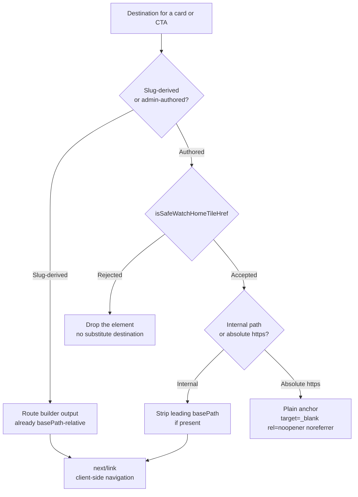
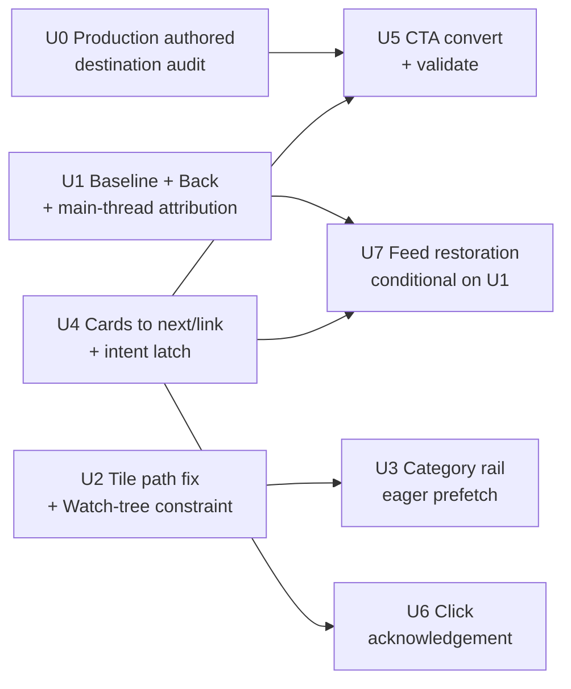

## Goal Capsule

**Objective:** Clicking a video card in a `MediaCollection` rail — the Watch home feed, collection and experience routes, and the related-media rails on video pages — produces visible feedback within one frame and lands on the destination without tearing down and rebuilding the document. Other Watch link surfaces keep their current behavior; see Scope Boundaries.

**Means:** Convert the raw `<a>` wrappers in `apps/web/src/components/sections/MediaCollection.tsx` to `next/link`, with hover-latched prefetch and a press/pending affordance (KTD1, KTD3, KTD5).

**Authority hierarchy:** Product Contract requirements outrank Planning Contract decisions, which outrank unit-level approach notes. Where this plan and `apps/web/CLAUDE.md` conflict, `apps/web/CLAUDE.md` wins and the conflict is reported rather than resolved silently.

**Stop conditions:** Stop and report when any of these fire.

- U0's production `ctaLink` audit rejects any destination that renders today.
- U1's baseline measurement shows Back behavior materially different from what R9 assumes.
- U1's main-thread attribution shows the dead interval is not dominated by script execution, which would falsify the Problem Frame's causal story and put the Success Criteria out of reach for this change alone.
- `pnpm --filter @forge/web build` cannot pass with the converted hrefs.
- U1 confirms A1 and U7's restoration cannot reach the recorded Back baseline within its stated budget. Then the Watch home feed cards ship unconverted — the other `MediaCollection` surfaces still convert — rather than shipping a Back regression.

**Execution profile:** Behavior-preserving conversion of a shared component with a measured performance target and one security-bearing branch. Verification is browser-measured, not unit-test-inferred.

**Tail ownership:** This plan owns implementation and local verification through the Verification Contract. It does not own Cloudflare configuration, bundle-size reduction, or the hero prefetch churn — see Scope Boundaries.

---

## Product Contract

### Summary

Every video card in every Watch rail is a raw `<a>` element, so each click discards the loaded document and rebuilds it — re-parsing roughly 3 MB of already-cached JavaScript and re-hydrating React before a single pixel changes. Measured against production, that is 2,284 ms to first paint versus 399 ms for an equivalent client-side navigation to the same destination. Converting those wrappers to `next/link`, adding an immediate press affordance, and enabling prefetch on the bounded category rail removes the dead-click interval on the card surfaces — the ones a visitor clicks most. It does not remove it everywhere: the authored-CTA surfaces named in Scope Boundaries still reload, and a click landing before hydration still reloads.

### Problem Frame

`apps/web/src/components/sections/MediaCollection.tsx` builds its card wrapper as `const Wrapper = href ? "a" : "div"`, with an adjacent comment explaining that the `/watch` basePath must therefore be prefixed by hand. The rail CTA in the same file is likewise a literal `<a>`. Because `MediaCollection` is rendered by `Section.tsx`, `Container.tsx`, and `DynamicMediaCollection.tsx`, this covers the Watch home feed, every catch-all experience and collection route, the related-media rails on video pages, and draft preview.

The cost is not network. A controlled A/B to one destination showed only 15 KB crossing the wire, TTFB at 230 ms, and `loadEventEnd` at 282 ms — then nothing on screen until 2,284 ms. A separate trace attributed 1,197 ms of a 1,402 ms LCP to element render delay, with the LCP image downloaded and available at 206 ms. The document is fully loaded long before the browser can paint it, because the main thread is re-executing the bundle.

The same surface has no click acknowledgement of any kind. Polling the DOM through the dead interval found zero elements matching `[aria-busy="true"]`, `[role="progressbar"]`, or `.animate-spin`. A visitor gets no signal that their click registered.

### Requirements

- R1. Once the page is interactive, clicking a video card in any `MediaCollection` rail performs a client-side navigation — the document is not torn down and the shared JavaScript bundle is not re-executed. A click landing before hydration completes is still a native full-document navigation. Nothing in this change shrinks that window (bundle work is out of scope), so the Verification Contract records its size rather than asserting it away.
- R2. Card and CTA destinations render at their correct production URL under `basePath: "/watch"`, with no doubled prefix, no missing prefix, and no near-miss prefix corruption (`/watchlist` must not become `list`).
- R3. Modified clicks retain native browser behavior: Cmd/Ctrl/Shift/Alt-click, middle-click, right-click "open in new tab", and drag-to-bookmark all resolve to the correct public URL.
- R4. A click is visually acknowledged within one frame on every supported browser, including before hydration completes and including iOS Safari.
- R5. A pending affordance appears only when the navigation actually takes time, and never flickers on a fast transition.
- R6. An admin-authored CTA destination is validated before it is rendered as a link; an unsafe destination causes the CTA to be dropped, never redirected to a substitute.
- R7. External CTA destinations render as a plain anchor with `target="_blank" rel="noopener noreferrer"`, not as a `next/link`.
- R8. Category rail links prefetch eagerly, and every rail tile — predefined or authored — resolves to a correct, non-doubled path before that prefetch is enabled.
- R9. Returning to the Watch home feed via browser Back does not degrade the visitor's position or loaded feed depth relative to today's measured behavior.
- R10. Card prefetch is bounded by deliberate user intent rather than by viewport entry or incidental pointer contact, so neither scrolling the windowed feed nor scrolling under a stationary pointer issues an unbounded series of origin renders.
- R11. A client-side navigation between two Watch pages is announced to assistive technology even when the two pages share a document title and even when the destination was already prefetched.
- R12. No authored destination can cause a request to a side-effecting route. An authored internal destination resolves within the Watch content tree; anything that resolves outside it — including any `/api/` path — is rejected and its tile or CTA dropped.
- R13. The click-acknowledgement affordance covers every link surface this change converts or enables prefetch on: `MediaCollection` cards, the `MediaCollection` rail CTA, and the category rail tiles and its "see all" link.

### Key Decisions

- Convert the MediaCollection card wrapper and rail CTA to `next/link` (session-settled: user-directed — chosen over making the full reload cheaper via bundle cuts or edge caching: the measured A/B is 399 ms against 2,284 ms to the same destination with only 15 KB over the wire, so the cost being removed is JS re-parse, which a client-side navigation skips entirely). Governs R1, R2, R3.
- Card prefetch is gated on user intent rather than enabled eagerly (session-settled: user-approved — chosen over default eager prefetch on the converted links: 73 cards each firing an RSC prefetch on viewport entry would be a request storm, and every cold slug is an on-demand origin render). Governs R10. Mechanism revised during planning — see KTD3.
- Category rail links prefetch eagerly (session-settled: user-directed — chosen over leaving prefetch disabled there: the tile set is bounded at roughly 14-22 entries against the feed's unbounded card count, so the storm rationale does not apply). Governs R8.
- A click must be acknowledged within one frame (session-settled: user-directed — chosen over accepting the current unacknowledged click: the dead interval is the reported symptom, and reducing it to ~399 ms still leaves it above the threshold at which a click reads as registered). Governs R4, R5. The _mechanism_ was not settled and is resolved by KTD5.
- Bundle reduction, Cloudflare edge caching, and the hero `?t=` prefetch churn are excluded (session-settled: user-directed — chosen over folding them into this change: the requester selected three items from a five-item list, the Cloudflare reasoning was shown to rest on an outdated `Vary` premise, and the hero churn is origin load rather than click latency). Governs Scope Boundaries.

### Success Criteria

Each criterion names the arm it is measured on. A single number from one warm destination cannot carry the claim.

- Press acknowledgement is visible in the first frame after pointer activation, measured by high-frame-rate capture rather than by observing that a style exists.
- Destination content paints under 500 ms for a **warm** destination — one already prefetched or inside its `revalidate` window.
- Destination content paints faster than its own raw-anchor baseline for a **cold** destination. No absolute target: the plan's own Implementation Constraints say a cold slug triggers a full origin render, so an absolute bar here would be a bar on ISR, not on this change.
- A soft navigation does not re-execute the shared bundle. Evidence is three-part, because no single API shows this: resource timing shows no re-fetch of the shared chunks, the sentinel survives, and a performance trace shows no second compile/evaluate of the shared bundle. Route-specific chunks legitimately load on a cold destination and are recorded as a count and byte total rather than asserted at zero.
- Initial `/watch` load shows no increase in render-blocking requests and no increase in critical-path bytes before the prefetch phase. The category-rail prefetch payload R8 enables is expected, and is recorded as a separate bounded line (request count and transferred bytes) rather than counted as a regression.
- A hover sweep across a rail produces RSC requests proportional to deliberately hovered cards. Scrolling the feed under a stationary pointer produces zero card prefetches.

### Scope Boundaries

In scope: `MediaCollection` card wrapper and rail CTA; the click-acknowledgement affordance; `WatchHomeCategoryRail` prefetch and the authored-tile path correctness that gates it; feed restoration on Back if U1 confirms it regresses.

**The dead click survives on surfaces this change does not touch.** `sections/CTASection.tsx`, `sections/PromoBanner.tsx`, `sections/VideoHero.tsx`, and `sections/Text.tsx` all render raw authored anchors and are rendered by the same `Section.tsx` that renders `MediaCollection`; `WatchSemanticRecommendations.tsx` prevents its `Link` default and calls `window.location.assign`. A visitor clicking any of those still gets the full reload. This is a deliberate boundary, not an oversight — but it means the change cannot be described as fixing Watch-wide click latency.

#### Deferred to Follow-Up Work

- The ~3 MB JavaScript bundle (35 scripts, ~940 KB transferred / ~3,083 KB decoded). Explicitly removed from scope by the requester. Note this bounds R1: until the bundle shrinks, the pre-hydration window on `/watch` stays large enough that a first click can still be a full reload.
- Cloudflare edge-caching rules for Watch HTML and RSC responses.
- Hero `?t=` prefetch churn in `WatchHomeTvCarousel.tsx`.
- The other authored-destination raw anchors that share this defect class but were not named in scope: `sections/CTASection.tsx`, `sections/PromoBanner.tsx`, `sections/VideoHero.tsx`, `sections/Text.tsx`. Each accepts an unvalidated authored string into an `href`.
- `warmWatchChapterRoute` in `apps/web/src/components/watch/WatchPageClient.tsx` calls `window.fetch` with a basePath-relative href. A raw `fetch` does not apply basePath, so the warm request appears to target a path outside `/watch` and 404. It fails open and is therefore invisible. Same defect class as R2, but a different surface.
- `WatchSemanticRecommendations.tsx` uses a `Link` whose default is prevented and replaced with `window.location.assign`. A separate conversion candidate with its own handoff-token constraints.
- A route-level `loading.tsx` for the Watch tree. Research showed it would help the cold-ISR tail, but Next.js issue #86151 reports `loading.js` intermittently wedging soft navigation with the indicator stuck visible, in both 15.x and 16.x. Not worth coupling to this change.

### Sources

- Controlled production A/B and performance traces captured 2026-09-09 against `https://www.jesusfilm.org/watch` (Chrome DevTools MCP, `next@16.2.4`).
- `docs/solutions/design-patterns/watch-chapter-optimistic-navigation-feedback.md` — the repo's existing pending-navigation pattern.
- `docs/solutions/conventions/frontend-change-page-load-performance-verification.md` — mandatory verification contract for this change.
- `docs/solutions/best-practices/nextjs-16-shallow-history-traverse-zero-rsc-requests.md` — the resource-timing measurement recipe.
- `docs/solutions/best-practices/nextjs-hmr-reload-breaks-stateful-browser-verification.md` — why verification runs under `next build` + `next start`.
- `docs/solutions/runtime-errors/nextjs-alloweddevorigins-hydration-dead-127-0-0-1-20260520.md` — why verification runs on `localhost`, not `127.0.0.1`.
- `docs/solutions/architecture-patterns/widening-a-closed-selection-block-into-an-authored-list-20260827.md` — authored-destination validation and the `typedRoutes` build requirement.
- `docs/solutions/integration-issues/nextjs-proxy-not-found-sentinel-preserves-app-router-navigation.md` — evidence that soft navigation through the Watch proxy rewrite already works and is deliberately preserved.
- `docs/plans/2026-06-13-001-feat-watch-language-switch-pending-feedback-plan.md`, `docs/plans/2026-06-11-002-perf-watch-staged-client-loading-plan.md` — prior art.

---

## Planning Contract

### Key Technical Decisions

- KTD1. Card hrefs stop hand-prefixing `WATCH_BASE_PATH` and pass the basePath-relative route builder output directly to `next/link`. `next/link` prefixes basePath by blind concatenation with no idempotence check, so an already-prefixed href renders with a doubled prefix, and the client navigation URL is prefixed again separately, producing a second independent doubling — the anchor and the soft-nav target are both wrong. `apps/web/src/lib/routes.ts` already returns basePath-relative values typed as `Route`. Governs R2.

- KTD2. The rail CTA needs de-prefixing in three places, not one. Its `watchHref` is derived from `resolveWatchShareUrlFromPathname(...).pathname` (which hard-codes the prefix), from the authored `normalizedCtaLink` (which may or may not carry it), or from a `${WATCH_BASE_PATH}${videosIndexPath()}` fallback. The `startsWith(WATCH_BASE_PATH)` branch guard sits in the same expression tree, so changing the href without changing the guard silently flips which branch runs. Follow the established `canonicalHref.slice(WATCH_BASE_PATH.length) as Route` transform in `apps/web/src/components/recommendations/WatchSemanticRecommendations.tsx`. Governs R2.

- KTD3. Hover-gated prefetch uses the framework's own latch — the card starts with prefetch disabled and flips to the default strategy on deliberate pointer movement over the card, or on focus — rather than an imperative `router.prefetch()` call. **Conflict call-out against the settled decision:** the settled decision named `router.prefetch()` on the existing `onHover` handler. Research revises the mechanism while preserving the intent; the settled decision's actual content — no eager prefetch across 73 cards — is untouched. The justification rests only on properties verified against the shipped 16.2.4 source: the latch keeps the link inside Next's prefetch scheduler, which caps in-flight concurrency and **cancels** a prefetch when its card leaves the viewport. `router.prefetch()` has no cancellation path, which on a windowed feed is the difference that matters. **Do not claim an Intent-lane advantage** — the latched prefetch schedules at `PrefetchPriority.Default`, not Intent, because Link's own `onMouseEnter` runs while the pre-flip `prefetch={false}` is still in effect and React does not flush the latch update before the browser dispatches `mouseenter`; the prefetch that fires comes from the re-observation path. Two consequences to design around: the latch is one-way, so a pointer sweep progressively converts intent-gated cards into viewport-eligible ones and erodes R10 over a session; and `pointerenter` fires when the feed scrolls under a stationary pointer, which is not intent — so the trigger is pointer **movement** over the card, not mere entry. Governs R10.

- KTD4. `prefetch={false}` disables Link's own hover prefetch as well as its viewport prefetch. This is why KTD3 needs a state latch rather than simply leaving `prefetch={false}` and relying on hover.

- KTD4b. The authored-href basePath strip is guarded on `${WATCH_BASE_PATH}/` with the trailing slash, and classification happens **before** the strip. Three failures ride on getting this wrong, and the reference transform in `WatchSemanticRecommendations.tsx` is itself unguarded, so copying it verbatim reproduces them. A bare-prefix strip turns `/watchlist` into a relative `list`. An authored bare `/watch` slices to the empty string. And because `isExternalWatchHomeTileHref` is just `!href.startsWith("/")` computed from the same variable the strip mutates, an authored `/watch\evil.example` — which the validator accepts — slices to `\evil.example`, is reclassified external, and renders as a live cross-origin `target="_blank"` link. So: validate and classify on the pre-strip value, strip only a leading `${WATCH_BASE_PATH}/`, then re-assert the result still begins with exactly one `/` and drop the tile if it does not. The guarded form already exists in-repo at `isCanonicalWatchRecommendationHref` in `apps/web/src/lib/routes.ts`. Governs R2, R6, R12.

- KTD5. Click acknowledgement is two independent layers, because neither covers the other's case. A CSS `:active` press state fires unconditionally, costs no JavaScript, and is the only layer that can hit one frame. **It does not work on iOS Safari by default:** WebKit does not apply `:active` on tap unless a touch event listener exists in the element's ancestry, so on the platform carrying much of this audience the pre-hydration acknowledgement is silent. The fix must be a static, non-React touch listener installed in the Watch layout markup — a React-attached handler waits on the very hydration this layer exists to cover. `useLinkStatus` supplies the pending hint for navigations that actually block — but it is skipped entirely when the route was already prefetched, and only the most recently clicked link shows pending, so it cannot be the sole acknowledgement. The pending hint uses the documented `animation-delay: 100ms` from `opacity: 0` rather than a JavaScript timer, so a fast navigation unmounts the element before the animation starts and no hide-floor is needed. Resolves the open area left by the demoted settled-decision entry. Governs R4, R5.

- KTD6. `useLinkStatus` is chosen over porting the `SiblingCarousel` hand-rolled pending payload. The hand-rolled pattern keys pending state to a component instance, which fails two production-reachable cases on this surface: two cards in different `MediaCollection` rows can each show pending simultaneously while only one navigation is in flight, and a card whose row is windowed out of the infinite feed mid-navigation loses its affordance while the click is still working. `useLinkStatus` is globally single-slot by construction and reverts by transition rather than by mount. `apps/web/CLAUDE.md` mandates the `SiblingCarousel` pattern for sibling carousels specifically, not for this component.

- KTD6b. The existing validator must be **extended** with a Watch-tree constraint before R8's eager prefetch is enabled. `isSafeWatchHomeTileHref` rejects `javascript:`, `data:`, `http:`, control characters, and protocol-relative destinations — but its internal branch is a bare `startsWith("/")` acceptance that never bounds _where_ the path points. Under `basePath: "/watch"` an authored `/api/auth/logout` renders as `/watch/api/auth/logout`, which is a real route in this app whose GET handler deletes the session cookies. Today `prefetch={false}` confines that to a deliberate click; U3 is precisely what would turn it into an automatic request for every Watch home visitor. So the validator gains a constraint that an accepted internal destination must resolve under `${WATCH_BASE_PATH}/`, rejecting `..` traversal and any `/api/` target. This is an extension of the reused validator, not a second one. Governs R12.

- KTD7. The authored CTA destination is validated with the existing `isSafeWatchHomeTileHref` / `isExternalWatchHomeTileHref` pair from `packages/watch-url-policy` as extended by KTD6b, not a new validator. **This corrects a false premise in the request:** the request said to keep the CTA's existing safe-href checks. There are none. `normalizeWatchRootHref` rewrites the literal `"/"` and is otherwise a pass-through, and admin persists `ctaLink` as an unconstrained optional string. Converting the CTA to `next/link` without adding validation would widen an open-redirect and `javascript:`-injection surface and, with prefetch enabled, would also fetch the authored destination. Validation runs at render, not only at the admin write boundary, because block JSON is MCP-writable and outlives any one validator. Governs R6, R7.

- KTD8. Authored category-rail tile hrefs are stripped of a leading `WATCH_BASE_PATH` before reaching `next/link`. This is a pre-existing defect, not one this change introduces: authored tile hrefs are passed through verbatim, the validator's own documentation gives `/watch/jesus.html` as the canonical authored shape, and `next/link` then prefixes it again. Today that is a broken link only when clicked. Enabling eager prefetch (R8) would additionally warm a doubled 404 path for every home visitor, so this must land before or with U3. The existing test cannot catch it because it renders without a basePath configured. Governs R2, R8.

- KTD9. Production-shape href pins require an **unmocked** `next/link`, in a separate suite. Two facts make the obvious approach inert. A mocked Link renders `<a href={href}>` verbatim and never calls `addBasePath`, so it can never produce a `/watch`-prefixed URL — a production-shape assertion in the mocked suite fails on correct code, and the implementer's natural fix is to delete `/watch` from the expectation, which is exactly the regression this rule exists to prevent. And `__NEXT_ROUTER_BASEPATH` is captured once at module top level by `add-base-path.js`, so setting it in a `beforeEach` is silently inert and the assertion passes vacuously. Therefore: keep `MediaCollection.test.tsx` on the mock for behavior and `data-href`, add a separate unmocked suite for production URLs, and set the env via `test.env` in `apps/web/vitest.config.ts` so it lands before module load. Governs R2.

- KTD10. The suite needs a marker-based seam backstop, **not** a whole-source raw-anchor ban. Because every `next/link` mock renders a plain `<a>`, no href assertion can distinguish a `Link` from a raw anchor — a one-line revert would keep the entire suite green, which is why a backstop is needed at all. But a whole-source "no raw navigating `<a href`" grep is unsatisfiable in this component: U5 **requires** the validated external CTA to be a raw anchor (R7). The two instructions cannot both hold, and the escape hatch — syntax-sensitive exceptions to the grep — degrades the backstop into something that no longer reliably detects a reverted card link. So the mock stamps a marker attribute on every element it renders, and the assertion is positional: the card branch and the internal CTA branch carry the marker, the external CTA branch does not. This is the single most load-bearing test in the change.

### High-Level Technical Design

**Destination decision gate (U4, U5).** Today one expression produces an `href` for any input. After this change the component routes a destination through three terminal outcomes, and which one fires is the security boundary.

The two rejection-adjacent edges are the ones tests must pin: a protocol-relative destination must be rejected before the leading-slash check reads it as internal, and a rejected destination drops the element rather than falling back.

**Pending-state lifecycle (U6).** The affordance has one entry and several exits, and the exits are where a hand-rolled implementation wedges. `useLinkStatus` is chosen (KTD6) because its transitions are owned by the router rather than by component mount or by a pathname comparison.

```mermaid
stateDiagram-v2
  [*] --> Idle
  Idle --> Pressed: pointer down (CSS only; needs the KTD5 touch listener on iOS)
  Pressed --> Idle: pointer up, no navigation
  Pressed --> Pending: primary unmodified click starts a transition
  Idle --> Pending: keyboard Enter starts a transition
  Pending --> Idle: destination already prefetched, pending skipped entirely
  Pending --> Idle: transition commits to the destination
  Pending --> Idle: transition commits elsewhere (proxy redirect)
  Pending --> Idle: another link claims the pending slot
  Pending --> Idle: back traversal ends the transition
  note right of Pending
    Hint is delayed by animation, not a timer,
    so a fast transition never renders it.
  end note
```

### Assumptions

These are un-validated agent bets, not confirmed decisions. Each is labeled because this plan was composed without a synchronous confirmation step.

- A1. Back from a video page to the Watch home currently restores the full feed and scroll position via bfcache, and converting home cards to soft navigation would replace that with a remount that reloads from page one. This is the premise behind R9 and U7. It is plausible from the code but unverified — U1 measures it against deployed production before U7 is built, because bfcache eligibility depends on the deployed page's headers and scripts and cannot be established from a local build.
- A2. Clicking a card focuses the anchor in Chrome and Firefox, which pins its feed row mounted via the existing focus-capture handler, but Safari does not focus links on click. This is why KTD6 prefers a mount-independent pending mechanism.
- A3. Two Watch pages sharing a document title is production-reachable — generic episode titles, and the same video reached via an episode path versus its standalone path. R11 assumes this; U6 verifies it rather than assuming the announcer covers it.
- A4. No production authored `ctaLink` value will be rejected by the extended validator. If any is, that is a stop condition, not a reason to weaken the validator. U0 exists to make this falsifiable before U5 lands — without it, the first evidence would be a CTA silently missing in production.
- A5. Converting the CTA and cards does not require changes to `apps/web/src/proxy.ts`. The proxy rewrite is deliberately statusless to preserve App Router soft navigation, and this change relies on that rather than altering it.

### Implementation Constraints

- `pnpm --filter @forge/web build` is the only gate that exercises `typedRoutes`. `tsc --noEmit` does not validate a computed `next/link` href unless route types were already generated; `next typegen` regenerates them without a full build and is the cheaper prerequisite for local iteration.
- All browser verification runs under `next build` + `next start`, served from `localhost`. Under `next dev`, prefetch is hard-disabled in both the viewport and hover paths, so any prefetch observation is meaningless; and loading from `127.0.0.1` when the canonical dev host is `localhost` silently blocks hydration, which would make every `Link` behave as a raw anchor and produce a false negative that looks exactly like the conversion not working.
- Proof that a navigation was client-side is sentinel survival across the click. Do not gate on `performance.getEntriesByType('navigation')[0].type` — that describes the original document load and does not update on a soft navigation.
- Watch routes set `dynamicParams: true` with `generateStaticParams()` returning an empty array, so nothing is prerendered at build and a prefetch for a cold slug triggers a full origin render. Prefetch volume is a cost decision, not only a UX one.

### Sequencing

U0 and U1 run first: U0 gates U5, and U1 decides both whether U7 is built and whether the causal premise holds. U2 must precede U3 — enabling prefetch before the path fix and the Watch-tree constraint would automatically warm authored destinations, which is the R12 hazard. U4 is the core change and U5 depends on the same file. U6 depends on U4 existing. U7 is conditional on U1.

Capture the U1 baselines before any of U2-U7 lands, or the recorded "before" numbers are contaminated.

**Delivery shape.** Two increments are independently shippable if the security-bearing half needs more time: first U1 + U4 + U6 (the card conversion, intent-gated prefetch, and click feedback — the measured win), then U0 + U2 + U3 + U5 (authored-destination validation, tile path correctness, and eager rail prefetch). Splitting keeps the primary latency fix from blocking on authored-data cleanup. U7 attaches to whichever increment converts the home feed cards.

---

## Implementation Units

### U0. Production authored-destination audit

**Goal:** Make the A4 stop condition enforceable before any render-path change lands, instead of discovering a rejected destination as a silently missing CTA in production.

**Requirements:** R6, R12. Enforces the Goal Capsule stop condition.

**Dependencies:** none. Must complete before U5.

**Files:** no source changes. Results recorded in the PR body.

**Approach:**

1. Enumerate every persisted `ctaLink` value and every authored category-tile href across production Experience block JSON, read-only.
2. Run each through the exact validator pair U5 will use, including the KTD6b Watch-tree constraint.
3. Record the accepted and rejected sets. Any rejected value that renders today fires the stop condition — the response is to fix the data or widen the accepted shapes deliberately, never to weaken the validator.

**Execution note:** Read-only against production data. This is the only unit that can falsify A4, and it must run before U5 is written, not alongside it.

**Test scenarios:** Test expectation: none -- read-only audit with no behavioral change.

**Verification:** The rejected set is recorded and is empty, or the stop condition has fired and been resolved by an explicit decision.

---

### U1. Baseline measurement and Back-navigation behavior

**Goal:** Establish the before-numbers this change is measured against, settle A1 before U7 is scoped, and confirm or falsify the Problem Frame's causal story.

**Requirements:** R9. Supports every Success Criterion.

**Dependencies:** none.

**Files:** no source changes. Findings recorded in the PR body and folded into U7's decision.

**Approach:**

1. Build and serve production locally (`next build` + `next start`, on `localhost`).
2. Capture the measurement windows the frontend-performance convention requires: initial `/watch` load (request count, transferred bytes, render-blocking requests, LCP), a hover sweep across one rail (RSC request count), a scroll of the feed under a stationary pointer (card-prefetch count, expected zero), and click-to-paint on a card for both a warm and a cold destination.
3. For the click window, also record a **main-thread breakdown** from a performance trace — scripting and compile time, Total Blocking Time — and state which document's navigation entry each number was read from. The Problem Frame asserts the dead interval is shared-bundle re-execution, but the recorded `loadEventEnd` of 282 ms is _after_ every script has run, so that attribution is not yet established. If the breakdown shows the interval is dominated by post-load hydration or lazy route chunks instead, the stop condition fires: a soft navigation to the same destination pays much of that too.
4. Measure Back behavior **against the currently deployed production site**, not the local build — bfcache eligibility depends on the deployed page's headers and scripts, so a local run cannot establish the baseline R9 promises to preserve. Scroll the home feed through several pages, click a card, press Back, and record `window.scrollY`, the number of mounted feed rows, and whether the restore was cross-document. Retain the local run only for the post-change comparison.

**Execution note:** This is measurement, not implementation. Its output is evidence and two decisions — does U7 fire, and does the causal story hold — so prefer a recorded run over a written assertion.

**Test scenarios:** Test expectation: none -- measurement unit with no behavioral change.

**Verification:** Every named measurement window recorded with its numbers and its source document, an explicit finding on A1 stated as confirmed or refuted, and an explicit finding on whether script execution dominates the dead interval.

---

### U2. Strip the doubled basePath from authored category-rail tiles

**Goal:** Authored rail tiles resolve to their real path instead of a doubled one, before prefetch is enabled on them.

**Requirements:** R2, R8.

**Dependencies:** none.

**Files:** `apps/web/src/lib/watch-home-tiles.ts`, `apps/web/src/components/home/WatchHomeCategoryRail.tsx`, `apps/web/src/components/home/__tests__/WatchHomeCategoryRail.test.tsx`.

**Approach:**

1. Extend the validator with the KTD6b Watch-tree constraint: an accepted internal destination must resolve under `${WATCH_BASE_PATH}/`, rejecting `..` traversal and any `/api/` target. This must land before U3 enables prefetch.
2. Validate and compute the external/internal classification on the **pre-strip** value (KTD4b) — the classifier is `!href.startsWith("/")` and reads the same variable the strip would mutate.
3. Strip only a leading `${WATCH_BASE_PATH}/` — the trailing slash is load-bearing — then re-assert the result begins with exactly one `/`, dropping the tile if it does not.
4. Do the strip at the boundary both the editor preview and the viewer path share, so the two cannot drift.
5. Keep the existing external-tile branch exactly as it is — it is the reference implementation for KTD7.

**Patterns to follow:** `isCanonicalWatchRecommendationHref` in `apps/web/src/lib/routes.ts` for the guarded form. Note the `slice(WATCH_BASE_PATH.length)` transform in `WatchSemanticRecommendations.tsx` is **unguarded** — do not copy it verbatim.

**Test scenarios:**

- An authored tile href of `/watch/jesus.html` renders `href="/watch/jesus.html"` with the basePath env set — not `/watch/watch/jesus.html`.
- An authored tile href of `/jesus.html` renders the same production URL.
- An authored `/watchlist` renders `/watch/watchlist` unchanged — the near-miss prefix is not stripped.
- An authored bare `/watch` resolves to the Watch home path, not an empty href.
- An authored `/watch\evil.example` is dropped, and specifically is never rendered as a `target="_blank"` anchor. Falsify by moving the classification after the strip and confirming this goes red.
- An authored `/api/auth/logout` is dropped (KTD6b).
- An authored `/watch/../api/auth/logout` is dropped.
- A predefined catalog tile still renders its correct path, unchanged by the strip.
- An external `https:` tile still renders a plain anchor with `target="_blank" rel="noopener noreferrer"` and is not passed through the strip.
- An unsafe tile href still causes the tile to be dropped.

**Verification:** With `__NEXT_ROUTER_BASEPATH` set via `test.env`, no rail tile renders a path containing `/watch/watch`, and no accepted internal destination resolves outside `/watch/`.

---

### U3. Enable eager prefetch on the category rail

**Goal:** Category rail links prefetch, so the bounded set of category destinations is warm before the click.

**Requirements:** R8, R12, R13.

**Dependencies:** U2 (both the strip and the KTD6b Watch-tree constraint must be in place — enabling prefetch first would warm authored destinations automatically).

**Files:** `apps/web/src/components/home/WatchHomeCategoryRail.tsx`, `apps/web/src/components/home/__tests__/WatchHomeCategoryRail.test.tsx`.

**Approach:**

1. Remove `prefetch={false}` from the "see all" link and the category card link. Leave the external branch untouched — it is a plain anchor and has no prefetch prop.
2. Add the CSS `:active` press state to the rail tiles and the "see all" link, so R13 holds on the surfaces this unit makes faster.

**Test scenarios:**

- The category card link no longer carries `prefetch={false}`, asserted on the value rather than on the prop's presence.
- The "see all" link no longer carries `prefetch={false}`.
- Falsify once: restore `prefetch={false}` on one of them and confirm exactly one scenario goes red.
- Test expectation note: the prop value is what the compiler cannot catch — a deletion typechecks. Assert the value, not the spelling.

**Verification:** In the U1 initial-load window re-run, every observed prefetch URL stays within `/watch/` and none targets an `/api/` path; render-blocking request count is unchanged; the rail prefetch request count and transferred bytes are recorded as their own line.

---

### U4. Convert MediaCollection cards to next/link with hover-latched prefetch

**Goal:** A card click is a client-side navigation, with prefetch bounded by user intent.

**Requirements:** R1, R2, R3, R10.

**Dependencies:** none (U1 informs but does not block).

**Files:** `apps/web/src/components/sections/MediaCollection.tsx`, `apps/web/src/components/sections/MediaCollection.test.tsx`.

**Approach:**

1. Replace the `Wrapper` element-type indirection with an explicit branch: a `next/link` when a destination exists, a `div` when it does not. Mirror the `CardFrame` shape in `apps/web/src/components/home/WatchHomeCard.tsx`, which already solves exactly this.
2. Drop the manual `${WATCH_BASE_PATH}` prefix from the card href and delete the comment that justified it (KTD1).
3. Add the hover-latch prefetch state per card (KTD3), armed on deliberate pointer **movement** over the card plus `onFocus` for keyboard — not on bare `pointerenter`, which fires when the feed scrolls under a stationary pointer and would recreate the origin-render stream R10 exists to prevent.
4. Preserve every currently-passed prop: `aria-label`, `data-testid="VideoCard"`, `className`, `onPointerEnter`, `onFocus`. Note there is no `style` prop on this wrapper today; do not add one.
5. Emit a `data-href` alongside the rendered href so tests can pin both the basePath-less and production shapes, matching `SiblingCarousel`.
6. Do **not** add an active-card concept. The component has none today, adding one is a visual-design decision outside this change's scope, and its only claimed benefit — suppressing a no-op re-navigation — is not a reported problem. If a later change adds one, modifier-key checks must run _before_ the active check, or Cmd-clicking the current video would be prevented into doing nothing.
7. Resolve Q3 here: one browser check on whether `FloatingSearchProvider`'s frozen route surface needs handling across a video-to-video soft navigation. If it is already broken today, report it rather than absorbing it.

**Patterns to follow:** `apps/web/src/components/home/WatchHomeCard.tsx` for the element branch; `apps/web/src/components/watch/SiblingCarousel.tsx` for `data-href` and the modifier-click guard; `isUnmodifiedPrimaryNavigation` in `apps/web/src/components/search/VideoCard.tsx` for the modifier predicate.

**Test scenarios:**

- Adopt a `next/link` mock modeled on the one in `apps/web/src/components/watch/__tests__/SiblingCarousel.test.tsx`, forwarding `href`, surfacing `prefetch` as a data attribute, stamping the KTD10 marker attribute, and recording `event.defaultPrevented`.
- Marker seam backstop (KTD10): the card branch carries the mock's marker. Falsify by reverting one card to a raw anchor and confirming this test — and only this test — goes red.
- A card with no slug renders a `div`, not an anchor, and carries no click handler.
- Keyboard Enter on a focused card behaves as a primary navigation and arms the pending state. This entry path is production-reachable and currently untested anywhere in the repo.
- Exact-href assertions for a non-English language and for the default language, per the language-preservation defect class.
- The prefetch latch arms on pointer movement over the card and on focus, and does **not** arm on a bare `pointerenter` with no movement.
- Modifier matrix (`metaKey`, `ctrlKey`, `shiftKey`, `altKey`, middle button), table-driven with every other axis permissive. **Label the whole matrix defensive-only in place:** the mock does not implement Next's `isModifiedEvent`, and the card carries no component-level click guard, so `defaultPrevented` is false on every row whether modifier handling works or not. R3 is discharged by the manual browser sweep in the Verification Contract, not by this matrix. If an active-card concept is added, this matrix gains teeth and the label comes off.
- In the separate **unmocked** suite (KTD9), with `__NEXT_ROUTER_BASEPATH` set via `test.env`: a card renders exactly `/watch/{slug}.html/{lang}.html`.

**Verification:** In a real browser against a production build, a sentinel set before the click survives it; resource timing shows no re-fetch of the shared chunks; and a performance trace shows no second compile/evaluate of the shared bundle. Route-specific chunk loads are recorded, not asserted at zero.

---

### U5. Convert and validate the MediaCollection rail CTA

**Goal:** The rail CTA navigates client-side for internal destinations and safely for authored external ones, with validation it does not have today.

**Requirements:** R2, R6, R7.

**Dependencies:** U4.

**Files:** `apps/web/src/components/sections/MediaCollection.tsx`, `apps/web/src/components/sections/MediaCollection.test.tsx`.

**Approach:**

1. Route the authored `ctaLink` through the KTD6b-extended `isSafeWatchHomeTileHref` / `isExternalWatchHomeTileHref` pair (KTD7). Validate at render, on the pre-strip value (KTD4b).
2. Split the render: internal same-origin path becomes a `next/link`; validated absolute `https:` becomes a plain anchor with `target="_blank" rel="noopener noreferrer"`; anything rejected drops the CTA entirely rather than substituting a default destination.
3. De-prefix all three internal branches under the KTD4b guard, and adjust the `startsWith(WATCH_BASE_PATH)` guard in the same expression tree so the branch selection does not silently change (KTD2).
4. Give the internal CTA `Link` the same KTD3 intent latch the cards use. Left unspecified it inherits Next's default viewport prefetch, and `MediaCollection` renders across the whole feed — so the CTA count is unbounded in exactly the way the card count is.
5. The authored branch needs the `as Route` cast `WatchHomeCategoryRail.tsx` already applies, with a comment naming the runtime guarantee that replaces the static one.

**Patterns to follow:** the external/internal split already implemented in `apps/web/src/components/home/WatchHomeCategoryRail.tsx`, and its three-case test shape.

**Test scenarios:**

- An authored internal `/watch/foo.html` renders a `next/link` at exactly `/watch/foo.html` (unmocked suite, basePath env set).
- An authored absolute `https://example.com/x` renders a plain anchor with both `target` and `rel` set, is not a `next/link`, and does **not** carry the KTD10 marker — the positional assertion that keeps the backstop meaningful.
- `javascript:alert(1)` drops the CTA — asserted as absent, not as rendered-with-a-fallback-href.
- A protocol-relative `//evil.example` drops the CTA. Ordering-sensitive: it must be rejected before the leading-slash check.
- An authored `/watch\evil.example` drops the CTA and is never rendered as an external anchor.
- An authored `/api/auth/logout` drops the CTA (KTD6b).
- An href containing a control character drops the CTA.
- A `http:` (non-TLS) absolute URL drops the CTA.
- The internal CTA carries the intent latch: no prefetch before intent, prefetch after.
- The derived (non-authored) CTA branches still render their correct production URLs — one pin per branch, since KTD2 says there are three.
- Run the U4 modifier matrix through this boundary too, carrying its defensive-only label, so a guard added to only one of the two Link sites goes red once guards exist.

**Verification:** No authored string reaches an `href` without passing the extended validator, confirmed by reading the render path end to end; and U0's audit recorded no production rejection.

---

### U6. Click acknowledgement affordance

**Goal:** A click is visibly acknowledged within one frame, and a slow navigation shows a pending hint without flickering on a fast one.

**Requirements:** R4, R5, R11.

**Dependencies:** U4.

**Files:** `apps/web/src/components/sections/MediaCollection.tsx`, a small child component for the pending hint, the relevant stylesheet, `apps/web/src/components/sections/MediaCollection.test.tsx`.

**Approach:**

1. Add an unconditional CSS `:active` press state on the card, plus the static non-React touch listener KTD5 requires so WebKit honors `:active` on tap before hydration. Without that listener this layer is silent on iOS Safari.
2. Add a `useLinkStatus`-driven hint rendered as a child of the `Link` — the hook reads context and returns a permanently-idle value outside a `Link` subtree, so placement is load-bearing.
3. Delay the hint with `animation-delay` from `opacity: 0`, not a JavaScript timer, so a fast navigation never shows it and no minimum-visible floor is needed.
4. Mark the hint `aria-hidden`, and put `aria-busy` on a wrapper the `useLinkStatus` child itself renders **inside** the Link subtree. It cannot go on the card anchor: the anchor is what provides the context, so no descendant can set an attribute on it. Step 2's constraint and this placement are the same constraint.
5. Add an `sr-only` `aria-live="polite"` region for the pending state. Polite is required: the App Router's route announcer is assertive, and two assertive regions firing milliseconds apart interrupt each other.
6. Satisfy R11 with a **persistent Watch-layout polite announcer** that observes committed pathname changes and emits a destination announcement whenever the pathname changes without a title change. The pending region alone cannot close this: `useLinkStatus` is skipped entirely for an already-prefetched route, so the prefetched + shared-title navigation — reachable today, and made more common by KTD3's latch — would otherwise be completely silent. Specify the announcement string and the exact commit-time firing point; do not leave it to the implementer.
7. Resolve Q1 here: choose and pin whether a pending navigation dismisses an open modal owned by the persistent layout providers.

**Patterns to follow:** the `sr-only` live-region pattern already used in `apps/web/src/components/sections/VideoRecommendations.tsx` and `SiblingCarousel`.

**Test scenarios:**

- The pending hint renders inside the `Link` subtree, not as a sibling.
- `aria-busy` is set on the pending card's inner content wrapper and absent on unclicked cards.
- The hint element carries `aria-hidden`.
- Both live regions use `polite`, asserted on the value.
- The layout announcer emits on a pathname change with an unchanged title. Fixture: two destinations resolving to identical `document.title`.
- The layout announcer emits for a navigation whose route was already prefetched — the case the pending region cannot cover.
- Modified clicks do not set the pending state — reuse the U4 axis table, carrying its defensive-only label.
- Test expectation note: whether the hint is _visible_ is CSS animation-delay behavior jsdom cannot evaluate, and jsdom has no route announcer at all. Pin the class/attribute/region contract in the suite; prove timing and announcement in a browser with a real screen reader.

**Verification:** High-frame-rate capture shows the press style present in the first displayed frame after pointer activation, repeated with JavaScript disabled and again after hydration, and on iOS Safari. A deliberately slowed navigation shows the hint while a fast one does not. A shared-title navigation announces. Also exercise a drag-scroll of the rail and a touch swipe: the rail is drag-scrollable, so an unconditional `:active` paints the press state on whichever card the visitor grabs to scroll. Record whether that reads acceptably or needs a movement threshold.

---

### U7. Preserve the Watch home feed across Back (conditional on U1)

**Goal:** Returning to the home feed lands the visitor where they left, with the feed depth they had loaded.

**Requirements:** R9.

**Dependencies:** U1 (fires only if U1 confirms A1), U4.

**Files:** `apps/web/src/components/sections/DynamicMediaCollection.tsx` and its test file.

**Approach:**

1. Only build this if U1 confirms the regression against deployed production. If U1 refutes A1, close this unit with the measurement as the record and state that in the PR.
2. **Stop and report before building.** Back-navigation restoration was not one of the three items requested; it entered scope because research predicted this change would break it. When U1 confirms, report the confirmed regression and the proposed fix as a scope decision rather than treating confirmation as authorization. State the degradation budget being targeted — restored feed depth, and scroll within a named pixel tolerance, with restore _latency_ explicitly not required to match a browser-native bfcache restore.
3. Persist the feed's loaded sections and scroll offset keyed to the history entry, and restore on a back-restore navigation. Next exposes no history-entry key, so one must be minted via `history.replaceState` on mount.
4. Prefer `sessionStorage` keyed by history entry over component state, since the component unmounts.
5. Treat the stored snapshot as untrusted input: store a versioned, minimal, size-bounded record; validate schema and size on read; discard anything malformed or version-incompatible; clear the entry after its matching restoration. Browser storage is not a trust boundary, and this snapshot feeds rendering and navigation state — including authored destinations.

**Test scenarios:**

- Loaded sections are persisted on unmount and restored on a back-restore.
- A forward navigation to the same route does not restore a stale snapshot.
- A restore with no stored snapshot falls back to the current page-one behavior.
- A malformed snapshot is discarded and falls back to page one rather than being deserialized.
- A snapshot exceeding the size bound is discarded.
- A version-incompatible snapshot is discarded.
- Test expectation note: scroll restoration itself is browser behavior; prove it in the browser and pin only the persistence and validation contract in the suite.

**Verification:** The U1 Back measurement, re-run, shows scroll position and mounted row count restored within the stated budget. If it cannot be, the Goal Capsule stop condition fires and the home feed cards ship unconverted.

---

## Verification Contract

Per `docs/solutions/conventions/frontend-change-page-load-performance-verification.md`, every number below names the window it came from. A green initial-load trace says nothing about the hover or click windows.

**Build and correctness gates**

- `pnpm --filter @forge/web build` passes. This is the only gate that exercises `typedRoutes` for the computed hrefs; `tsc --noEmit` does not.
- `apps/web/src/components/sections/MediaCollection.test.tsx` and the WatchHomePage and WatchHomeCategoryRail suites pass.
- The seam-token backstop (KTD10) is present and has been falsified once.

**Browser measurement — under `next build` + `next start`, served from `localhost`**

Named windows, before and after:

1. _Initial `/watch` load_ — request count, transferred bytes, render-blocking request count, LCP, plus the category-rail prefetch request count and bytes as their own line. Expected: no increase in render-blocking requests or pre-prefetch critical-path bytes; every prefetch URL inside `/watch/` and none targeting `/api/`.
2. _Hover sweep across one rail_ — RSC request count, expected proportional to deliberately hovered cards.
3. _Scroll under a stationary pointer_ — card prefetch count, expected zero.
4. _Click to paint, warm destination_ — under 500 ms.
5. _Click to paint, cold destination_ — improved over its own raw-anchor baseline; no absolute bar.
6. _Press acknowledgement_ — high-frame-rate capture, press style present in the first displayed frame; repeated with JS disabled, after hydration, and on iOS Safari.
7. _Back_ — from U1, re-measured, against deployed production for the baseline.

**Method constraints**

- Client-side navigation is proven by sentinel survival across the click, never by the navigation entry's type.
- "The bundle was not re-executed" needs three instruments, because no single one shows it: resource timing for re-fetches, the sentinel for document identity, and a performance trace for compile/evaluate. Resource Timing reports fetched-resource bytes, not parse or evaluation work — do not assert "zero bytes re-parsed" from it.
- Use `performance.clearResourceTimings()` before each step; the buffer is cumulative and caps out.
- Modified-click verification is manual and explicit, and asserts on the resulting public URL: Cmd/Ctrl/Shift/Alt-click, middle-click, right-click **"open in new tab"**, right-click "copy link address", and **drag-to-bookmark**. basePath bugs manifest asymmetrically — a normal-click smoke is not sufficient evidence, and the unit-level modifier matrix is defensive-only (U4).
- Prefetch behavior cannot be observed under `next dev` — it is hard-disabled outside production builds in both the viewport and hover paths.

**Review gates**

- Tier-2 `/ce-code-review` before push, per root `CLAUDE.md` — this change touches a shared component across many surfaces and adds a security-bearing validation branch.
- Cross-model review pass via codex on `gpt-5.6-sol`, subscription auth only.

---

## Definition of Done

- U0's production authored-destination audit is recorded with an empty rejected set, or its stop condition was resolved by an explicit decision.
- Card clicks in every `MediaCollection` surface navigate client-side once interactive, verified by sentinel survival in a real browser.
- Every converted href renders at its exact production URL under basePath, pinned in the unmocked suite, with the near-miss cases (`/watchlist`, bare `/watch`, `/watch\…`) covered.
- No authored destination can reach a path outside `/watch/`, and none can reach an `/api/` route.
- Modified-click behavior is unchanged, verified manually across all four modifiers plus middle-click, right-click open-in-new-tab, right-click copy-link-address, and drag-to-bookmark, each asserted on the resulting public URL.
- The authored CTA is validated at render, drops on rejection, routes external destinations to a plain anchor, and carries the intent prefetch latch.
- No rail tile renders a doubled `/watch/watch` path, and category rail prefetch is enabled.
- A click is acknowledged in the first displayed frame pre- and post-hydration, on iOS Safari included, proven by frame capture; the pending hint does not flicker on a fast navigation.
- Screen-reader announcement on navigation is verified, including the shared-title case and the prefetched shared-title case.
- Back to the home feed is within the U7 budget against the production baseline, or the home cards shipped unconverted per the stop condition.
- Every named measurement window recorded before and after, in the PR body, each naming its arm and its source document.
- `pnpm --filter @forge/web build` green; existing suites green; Tier-2 review and cross-model pass complete.

---

## Open Questions

- Q1 (deferred). Does a pending navigation dismiss an open modal owned by the persistent layout providers? A full reload tore those down; a soft navigation does not. Assigned to U6 step 7 — choose a behavior and pin it.
- Q2 (deferred). Is there a pending-state ceiling for a cold-ISR render that takes many seconds? The existing repo pattern has none, so the default is none. Named so it is a choice rather than an oversight. Note this interacts with the cold-destination Success Criterion: an unbounded spinner is acceptable only because the criterion no longer promises an absolute time.
- Q3 (deferred). `FloatingSearchProvider` freezes its route surface as lazy initial state from a prop. Video-to-video soft navigation already ships today via chapter navigation, so this is either already handled at runtime or already broken and unnoticed. Assigned to U4 step 7.
- Q4 (deferred). KTD3's latch is one-way, so a long pointer-sweeping session progressively converts intent-gated cards into viewport-eligible ones and erodes R10's bound over that session. Whether that erosion is acceptable, or the latch should expire, is unresolved — measure it in the U1 hover window before deciding.
