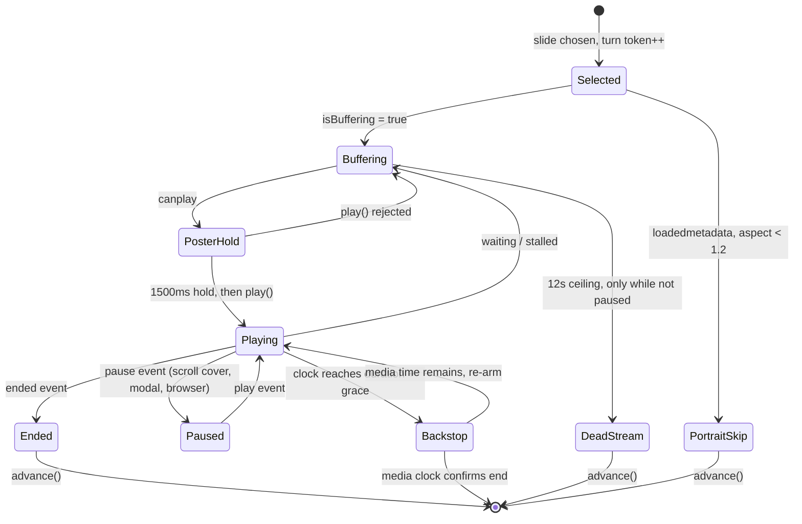
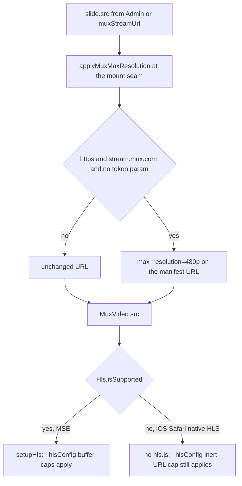
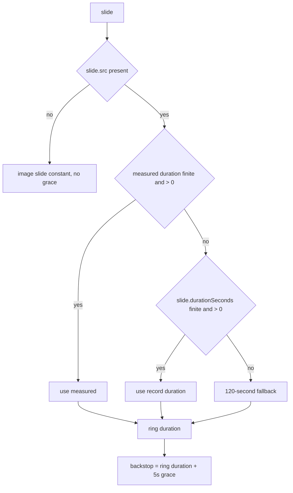

# Watch Home Intro Play-To-End With Bandwidth Guard - Plan

Tracking issue: Linear FGE-237. Related: FGE-137 (same surface, opposite lever; stays open and Urgent).

## Goal Capsule

- **Objective:** A viewer who stays on the `/watch` home intro sees each hero video finish, and a viewer who does not stay costs less bandwidth than they do today.
- **Means:** Advance on the media `ended` event with a duration-derived backstop timer, cap transfer with a `stream.mux.com` `max_resolution` URL rewrite plus an `_hlsConfig` buffer cap, and park the advance clock while the media is paused (KTD1, KTD4, KTD6, KTD9).
- **Authority:** R-IDs win on product behavior. KTDs win on mechanism. Hard constraints in Scope Boundaries override both.
- **Execution profile:** One PR on branch `vladmitkovsky/fge-237-play-watch-home-intro-videos-to-the-end-with-a-bandwidth`. Conventional commit prefix `feat:`. Never `--no-verify`. Pre-commit hooks are NOT live in this worktree (`.husky/_` is absent), so run Prettier by hand on any markdown before pushing.
- **Stop conditions:** Stop and report if the controlled scroll-away measurement shows `mux.com` transferred bytes or request count going UP. The 480p visual judgement does not stop the run — U6 step 8 owns that branch and escalates the constant, which is a reportable outcome, not a silent workaround.
- **Tail ownership:** The surrounding pipeline owns review, commit, push, PR, and CI. U6 is this plan's own browser measurement and is not the pipeline's generic browser-test step.

---

## Product Contract

### Summary

Each video slide in the `/watch` home intro carousel will play to its natural end. The 30-second preview cap is deleted; the media element's own `ended` event becomes the advance trigger and the existing `setTimeout` becomes a turn-guarded backstop for streams that never emit `ended`. Because playing to the end multiplies the seconds a viewer can spend on one slide roughly seventeen-fold, the same PR attacks cost on two axes: it caps the requested Mux rendition through a `stream.mux.com` URL rewrite and bounds hls.js read-ahead and back-buffer through `_hlsConfig`, and it parks the advance clock and the progress ring whenever the media is paused, so a hero the viewer scrolled past stops spending its turn and stops mounting fresh manifests. The per-`timeupdate` progress state that nothing reads is retired.

Be plain about the trade: for a viewer who sits and watches a 513-second film in the hero, total bytes go up even with the cap. That is what "play to the end" means and it is the instruction. For an arrive-glance-scroll session, bytes go down, because the rendition is lower, the read-ahead is bounded, and a covered hero no longer rotates through fresh manifests behind the page. Which of those two session shapes dominates production is an assumption, not a measurement — see Assumptions.

### Problem Frame

`apps/web/src/components/home/useWatchHomeTvCarousel.ts` caps every video slide at 30 seconds through `WATCH_HOME_TV_VIDEO_PREVIEW_MAX_SECONDS`, which `watchHomeTvAdvanceTargetSeconds` reduces to `min(30, duration * 0.95)`. A 513-second film gets 30 seconds and the carousel moves on. `<MuxVideo key={activeSlide.id}>` is then torn down and the next full-film manifest is mounted. Viewers never see a video finish.

The same component passes no `_hlsConfig` and no rendition constraint. The cap law captured in `docs/solutions/performance-issues/watch-cold-path-performance-follow-up-20260610.md` was applied to the watch-page hero and never propagated here. That doc records the identical failure shape one surface earlier: one Mux surface received the buffer caps, a sibling surface did not, and cold mobile loads stayed exposed to large first-load HLS transfer.

`PRODUCT.md` names low-end Android on constrained cellular as the design centre, not an edge case. Removing the cap without a guard would move this surface in the opposite direction.

### Key Decisions

- **Play to the natural end, with no upper bound on a slide whose duration is known.** (session-settled: user-directed — chosen over an upper bound well above 30 s such as 120 s or 180 s: the instruction is literally "to the end", and a silent short cap would defeat the ticket.) Governs R1, R2, R4. _Conflict call-out:_ two independent reviews argue that only a dwell ceiling — or gating full playback behind an explicit in-hero action — bounds bytes per session, and that the rendition cap bounds bytes per second only. That is correct and the decision stands. R10 is the bytes-per-session lever that is compatible with play-to-end: a slide only spends its turn while the media is actually playing.
- **The bandwidth guard ships in the same PR as the playback change.** (session-settled: user-directed — chosen over shipping the playback change alone and following with a guard: playing to the end is what creates the cost, so the two are one change.) Governs R8, R9, R10.

### Requirements

**Playback to natural end**

- R1. A video slide advances when its media element fires `ended`.
- R2. A video slide whose duration is known is never cut short by a timer before that `ended` event. When the backstop fires while the media clock still shows time remaining, it re-arms for the remaining media time instead of advancing.
- R3. A video slide that never fires `ended` still loses its turn, through a backstop timer derived from the slide's own duration.
- R4. A slide whose duration cannot be resolved to a finite positive number from either the media element or the slide record advances on a 120-second fallback.
- R5. Exactly one advance happens per slide turn, including two consecutive turns of the same slide. An `ended` event and a pending backstop cannot both advance, and the portrait skip cannot race the dead-stream ceiling.
- R6. Advancing onto the same slide — the single-playable-slide case — restarts that slide's playback, its advance clock, and its progress ring, rather than leaving the hero on a frozen last frame.
- R7. A viewer can leave any slide at any time through the timeline circles, the "Watch Now" link, or by scrolling the body over the hero.
- R19. A slide whose `play()` is refused loses its turn on the 12-second dead-stream ceiling rather than holding the hero for a film's length behind a still frame.

**Bandwidth guard**

- R8. The hero requests a rendition no higher than a named resolution cap, enforced by a query parameter on the `stream.mux.com` manifest URL.
- R9. hls.js read-ahead and back-buffer for the hero are bounded by an explicit `_hlsConfig`, rather than by library and Mux defaults.
- R10. Once a pinned hero has started playing, pausing it parks both the advance clock and the progress ring, so it neither spends its turn nor mounts a fresh manifest behind the page. Two carve-outs are scoped out of this guarantee and named in KTD9: a hero covered before its first `canplay`, and the `pinned={false}` mount.
- R11. The URL rewrite changes only `https://stream.mux.com` manifest URLs. Every other URL — including `http://stream.mux.com` — and any URL already carrying a `token` query parameter, passes through byte-identical.
- R12. The URL rewrite is a pure function of the URL string. It reads no viewport, device-pixel-ratio, or connection information, so a re-render can never swap the `src` on a mounted element.

**Honest progress and bounded cost**

- R13. The progress ring duration and the backstop delay both derive from one resolved duration, so they cannot drift apart.
- R14. The value written into the `--watch-home-progress-duration` CSS custom property is always a finite seconds value.
- R15. `timeupdate` produces at most one React state write per whole playback second, independent of how often the event fires.
- R20. A deliberate pause and a network stall are visually distinguishable on the progress ring.

**Preserved behavior**

- R16. The buffering-gated ring, the pausable advance clock, and the 12-second dead-stream ceiling from commit `668d87763` keep their current behavior except where R10 and R19 change it.
- R17. The portrait-aspect hero guard, the per-visit random draw, the deterministic server render, the 1500 ms poster hold, and Played Set / Hero Queue rollover behavior are unchanged. A video still enters the Played Set at exactly the moment it does today.
- R18. Muted subtitles still render from the injected `<track data-subtitle-track>` after `_hlsConfig` is introduced.

### Success Criteria

- In a controlled scroll-away window — 180 seconds measured from the scroll, three runs per branch, same pinned playback id, cache cleared and disabled — median `mux.com` transferred bytes AND median request count are both lower on this branch than on `main`, at 390x844 on Slow 4G from a production build. An equal or higher result blocks completion and is reported.
- The same controlled numbers are reported for a page-load window and a stay-and-watch window, honestly, including where they are higher.
- A desktop unthrottled arm reports `mux.com` transferred bytes with the URL rewrite applied and removed, so the rendition cap's contribution is attributed separately from the paused-clock gate's.
- A slide longer than 30 seconds is observed finishing in a real browser, and the advance is observed to come from `ended`.

### Scope Boundaries

- The change is confined to the Watch homepage web carousel: `apps/web/src/components/home/*`, one new helper and its colocated test in `apps/web/src/lib`, a constant deletion in the existing `apps/web/src/lib/watch-home-carousel-sequence.ts`, and one CSS fallback value.
- Do not replace the video element with `animated.webp` or an image. The portrait guard reads `videoWidth`/`videoHeight` at `loadedmetadata`, feat-452 R6 requires an `ended`-driven cycle, and the `668d87763` ring needs real media events.
- Do not use `preload="none"`. Per `docs/solutions/ui-bugs/chat-video-card-mux-preload-none-perpetual-spinner.md`, pinned to this playback-core version, `loadSource()` is never called, `canplay` never fires, `isBuffering` sticks true and the ring holds forever.
- Do not touch `apps/web/src/lib/watch-structured-data.ts`. Its `.m3u8` `contentUrl` is published SEO metadata and must not gain a `max_resolution` parameter.
- Do not touch `apps/web/src/lib/url.ts`. Its Mux builders are `image.mux.com` and feat-235 territory.
- Do not change the `data-testid="watch-home-tv-carousel"` section element. `apps/web/src/components/FloatingSearchProvider.tsx` selects on it for floating-search positioning.
- Do not change when a video enters the Played Set.
- Do not introduce React Testing Library or `user-event` into `apps/web` tests. Per `docs/solutions/best-practices/rtl-user-event-vitest-fake-timers-migration-20260625.md` that is an `apps/chat`-only convention; `apps/web` stays on `react-dom/client` plus `act`.
- Do not add a network request, a dependency, or render-time randomness (feat-452 constraint).
- Do not make the `src` viewport-dependent. `/watch` is `force-static` with `revalidate = 3600`; server HTML must stay byte-identical across visitors.

#### Deferred to Follow-Up Work

- **WCAG 2.2.2 pause control.** The hero auto-plays motion with no pause/stop/hide affordance today. This change lengthens each slide's motion from 30 seconds to up to a full film. The mute toggle, the timeline circles and scroll-pause are the existing partial mitigations. A real pause control needs a new i18n message key in every catalog, which the structural-parity test enforces, so it is its own change. `PRODUCT.md` names WCAG 2.1 AA as a floor and "accessible by default, not retrofit", so whoever approves this PR is accepting a widened gap on a schedule, not a product acceptance. Name this in the PR rather than inheriting it silently.
- **Reduced-motion progress ring.** `apps/web/src/app/globals.css` sets `animation: none` on `.watch-home-progress-ring` under `prefers-reduced-motion` while the loading spinner keeps turning, so a reduced-motion viewer gets no advance indication at all and the eventual slide change is an unannounced cut. The clean fix conflicts with the inline `opacity` the paused state sets, so it needs its own design pass rather than an `!important`.
- **Hero Queue editorial reach.** A realistic session now reaches slide 1 or 2, so a Hero Insert configured at position 3 or later becomes effectively unviewable and the daily date-seeded variety mechanism mostly stops mattering. Hero Insert placement and the 7-slot target need a content-team review. Name this in the PR alongside the WCAG deferral.
- **Non-pinned experience hero has no pause gate.** `useWatchHomeHeroScrollPause` is wired `enabled: pinned`, so the `pinned={false}` authored-hero mount in `apps/web/src/components/home/WatchHomeExperiencePage.tsx` never emits a scroll `pause` and R10 cannot fire there. That mount takes the full cost of play-to-end with none of the session-level guard. It needs its own coverage signal (an intersection observer, since scroll-pause is pinned-only). U6 measures the gap rather than assuming it away.
- **Played Set write moment vs `CONCEPTS.md`.** `CONCEPTS.md` says a video enters the Played Set "when the rotation departs its slide"; `markWatchHomeVideoPlayed` actually runs on arrival. That divergence predates this change and R17 forbids moving it here, but it should be reconciled.
- **Play-to-end is unobservable in production.** The home `<MuxVideo>` sets `disableTracking`, so Mux Data cannot report whether slides finish, nor distinguish an `ended` advance from a backstop advance. The cost side of this trade is measurable and the benefit side is not, so the 480p-versus-720p and play-to-end-versus-cap calls can only ever be revisited on cost evidence.
- **Two simultaneous heroes.** `WatchHomeExperiencePage.tsx` can mount an authored hero block and a hoisted `heroAboveBodyZone` carousel at once. Two concurrent full-length streams is a worse shape at play-to-end than at 30 seconds.
- **Stale learning doc.** `docs/solutions/best-practices/watch-home-inline-mux-takeover-player-pattern-20260706.md` documents a takeover player that feat-440 removed, including guidance to suppress preview `onEnded` during takeover. The mechanism no longer exists.
- **Dead vestigial hook options.** `autoAdvancePausedForSlideId` and `suppressLeavingSlide` on `useWatchHomeTvCarousel` have had no caller since feat-440. R10's pause gate makes the first one unnecessary rather than wiring it.

### Sources

- Linear FGE-237 (authority on scope) and FGE-137 (the measured `BANDWIDTH=3447400` this plan re-attributes to the 720p rung).
- `apps/web/src/components/home/useWatchHomeTvCarousel.ts`, `WatchHomeTvCarousel.tsx`, `useWatchHomeHero.ts`, `WatchHomeExperiencePage.tsx`.
- `apps/web/src/components/watch/HeroPlayer.tsx` — `HERO_HLS_CONFIG` and its exact-match test pin.
- `apps/web/src/components/watch/WatchModalActivityProvider.tsx` — `usePauseForWatchModal`'s resume-entitlement identity check.
- `apps/mobile/src/lib/streamQuality.ts` — the `applyQualityConstraint` idiom being mirrored, not shared.
- `docs/solutions/performance-issues/watch-cold-path-performance-follow-up-20260610.md` — the cap law this PR propagates.
- `docs/solutions/performance-issues/watch-hero-muxplayer-to-muxvideo-swap-20260526.md` — "Initial HLS segments" as the reviewer-recognized guard metric; also records that under `MuxVideo` the ref IS the `HTMLVideoElement`.
- `docs/solutions/conventions/frontend-change-page-load-performance-verification.md`, `docs/solutions/best-practices/nextjs-hmr-reload-breaks-stateful-browser-verification.md`, `docs/solutions/conventions/verify-animated-media-motion-rich-probe-window.md`.
- `docs/solutions/ui-bugs/watch-modal-playback-coordination.md`, `docs/solutions/ui-bugs/watch-next-countdown-portaled-chrome-cancellation.md`, `docs/solutions/integration-issues/expo-video-timeupdate-clock-drift-audio-fade-hardcut.md`.
- `docs/roadmap/content-discovery/feat-452-watch-home-autoplay-cycle.md`, `feat-440-watch-home-random-hero-video.md`, `docs/roadmap/platform/feat-235-watch-card-mux-hover-previews.md`.
- `docs/plans/2026-08-28-2325-fix-watch-mobile-lcp-plan.md` (FGE-117) — see KTD8 for why its fence does not bind this change.
- `CONCEPTS.md` — Hero Queue, Carousel Pool, Played Set, Hero Eligibility, Chrome.

---

## Planning Contract

### Key Technical Decisions

- KTD1. **Advance on `ended`; the timer becomes a duration-derived backstop.** (session-settled: user-directed — chosen over keeping a fixed-seconds cap: the ticket exists because viewers never see a video finish.) Governs R1, R2, R3. `handleEnded: advance` is already wired and already covered by the feat-452 regression test in `WatchHomePage.test.tsx` ("continues autoplay after the final unplayed pooled video ends"), so the mechanism ships today and only the competing timer has to move.

- KTD2. **One resolved duration per slide, owned by the hook; the ring shows it and the backstop adds a grace on top.** Resolution order for a video slide is the media-measured `duration` captured at `loadedmetadata` and keyed to the active slide id, then the slide record's `durationSeconds`, then a 120-second fallback. Every candidate must pass `Number.isFinite` and be greater than zero. Serves R4, R13, R14. The fallback is 120 seconds because it must sit far enough above the retired 30-second cap that a `durationSeconds: null` slide is not silently re-capped, and far enough below a feature film that a stream nobody can measure cannot hold the hero for a film's length. Two hazards make the finite guard load-bearing rather than defensive. First, the 30-second cap is currently the _only_ thing absorbing a non-finite duration — `watchHomeTvAdvanceTargetSeconds` returns `maxSeconds` for every non-finite input — and `setTimeout(fn, NaN)` and `setTimeout(fn, Infinity)` both coerce to `0` under the WebIDL long conversion, so deleting the cap without the guard makes the carousel race its whole queue in a few hundred milliseconds. Second, `${NaN}s` serializes into the CSS custom property as the token `NaNs`, which is accepted as a custom-property value, so the `var(..., 30s)` fallback never applies; substitution makes the `animation` shorthand invalid at computed-value time and the ring silently never fills.

- KTD3. **The ring animates over the resolved duration; the backstop sits at resolved duration plus a 5-second grace and re-arms rather than cutting.** Splitting ring duration from backstop delay keeps two behaviors that a single shared number would break. The pausable clock starts at `canplay`, which is `VIDEO_POSTER_HOLD_MS` (1500 ms) before `play()`, so the real `ended` lands at roughly `1.5 s + duration` of clock. And a ring that animated over `duration + grace` would never reach 100% before `ended` advanced, silently retiring the completed-ring reset flourish (`watch-home-progress-reset`) that `WatchHomePage.test.tsx` pins. The 5-second grace alone is not a sufficient bound: the clock measures wall time while the target is media time, and any decode slippage that never fires `waiting` accumulates — 0.7% cumulative drift on a 513-second film consumes the whole margin. So when the backstop fires it reads `video.currentTime` against the resolved duration and re-arms for the remaining media time; it advances only when the media clock confirms the end was reached, or when no media clock is readable. Serves R2, R3, R13. Image slides take no grace: for them the timer is the mechanism, not a backstop.

- KTD4. **Cap the rendition by rewriting the `stream.mux.com` URL, not by passing a `maxResolution` prop.** (session-settled: user-directed — chosen over the `maxResolution` / `minResolution` / `renditionOrder` React props: verified in the shipped `@mux/playback-core@0.34.1` bundle, the URL builder opens with `if(!e)return` where `e` is `playbackId`, and this carousel passes only `src`.) Governs R8, R11. Two further facts strengthen this beyond the ticket's argument. The TypeScript `MaxResolution` and `MaxAutoResolution` unions both start at `"720p"`, so no prop route can express 480p at all. And where `Hls.isSupported()` is false — iOS Safari on iPhone — `setupHls` never runs, so `_hlsConfig`, `maxAutoResolution` and `capRenditionToPlayerSize` are all inert while the URL rewrite still applies. The URL is the only cross-platform lever.

- KTD5. **Cap at `max_resolution=480p`, as a named exported constant with its rationale beside it.** Measured against live production playback ids on 2026-09-13: uncapped, the ladder tops out at 1920x1080 / 6,807,900 bps; `max_resolution=720p` tops out at 1280x720 / 3,458,400 bps; `max_resolution=480p` tops out at 854x480 / 1,657,700 bps. FGE-137's `BANDWIDTH=3447400` was therefore the 720p rung, not the ladder top. **Escalating this constant to `"720p"` does not halve the guard — it removes it.** `@mux/playback-core@0.34.1` installs its own `MinCapLevelController` with `minMaxResolution = 720`, so player-size capping never selects below the 720p rung; a 720p URL cap lands exactly on the floor the controller already enforces. That also corrects the pre-change baseline: at 390x844 the ceiling was already the 720p rung (hls.js scales player size by `devicePixelRatio`, and 390 CSS px at DPR 3 is 1170 px), so 480p is a real halving on mobile rather than an unknown. Against that, the intro is a full-bleed hero up to 1920px wide that expands on unmute to `h-[66svh] md:h-[min(100svh,56.25vw)]`, where 854x480 is a 2.25x upscale — and that unmuted expanded state is precisely the moment play-to-end exists to serve, so the muted-state mitigations do not cover it. Those mitigations apply only to the default state: the hero is height-clamped by `WATCH_MUTED_INTRO_HEIGHT_CLASS` and covered at full opacity by `WATCH_PRODUCTION_PLAYER_OVERLAY_BACKGROUND`. `apps/mobile` already ships and test-pins `max_resolution=480p` as its low tier. The ticket's ~220 MB-per-slide figure is inherited from FGE-137 and is not validated here — with hls.js defaults a single 30-second slide's read-ahead is bounded well below it, so that number describes a full-film or cross-slide aggregate, not one preview. Serves R8. **U6 must judge the visual read in the unmuted expanded state at 390px and at desktop width, and must measure the cap's byte contribution separately (U6 step 10).** Escalating to `"720p"` is an acceptable outcome only if it is reported as dropping the rendition guard entirely.

- KTD6. **Reuse `HERO_HLS_CONFIG`'s four values for the intro, as a separate named constant in the carousel file.** `maxBufferSize` is the binding lever — `getMaxBufferLength` in hls.js 1.6.16 is `Math.min(Math.max(8 * maxBufferSize / levelBitrate, maxBufferLength), maxMaxBufferLength)` — so lowering `maxBufferLength` alone changes nothing. `enableWebVTT: false` applies for the same reason it does on the hero: this carousel injects its own `<track data-subtitle-track>` and the measured master manifests carry `SUBTITLES="sub1"`. The duplication is deliberate — the two surfaces have different dwell profiles and should move independently — and must be named in a comment so a reviewer does not file it as a DRY miss. Serves R9, R18. _Conflict call-out against the settling brief:_ the brief and the ticket both state hls.js's `backBufferLength: Infinity` default as the live default here. It is not. `@mux/playback-core@0.34.1`'s `setupHls` spreads a base config containing `backBufferLength: 30` before the caller's `_hlsConfig`, so the effective default is 30 seconds. Setting 5 is still a real cut on a 513-second film, but it is a 30-to-5 cut, not an infinity-to-5 one. The decision stands; the justification changes.

- KTD7. **Apply the rewrite at the mount seam, through a helper that takes only a URL string.** (session-settled: user-directed — chosen over patching both `cardToCarouselSlide()` and `watchHomeHeroSlidesToTvCarouselSlides()`: one seam covers both producers by construction and leaves the slide DTO and its tests untouched.) Governs R8, R11, R12. Research corroborates it twice: `apps/web/src/app/[locale]/[htmlLang]/page.test.tsx` and `apps/web/src/lib/watch-structured-data.test.ts` both carry `https://stream.mux.com` slide fixtures that a builder-level patch would change, and the structured-data path must never gain the parameter. The no-ambient-input rule in R12 is the real safety property: a value-equal recomputed string is a no-op for React's prop diff, but a helper that read `window.innerWidth` would swap `src` on a _mounted_ element after any resize, reloading HLS from zero while the advance clock keeps counting. Neither `usePauseForWatchModal` (identity is the slide id) nor `useWatchHomeHeroScrollPause` (identity is the element) would see that. Memoize the value anyway, keyed on `activeSlide.src`, so the seam is cheap and the intent is explicit.

- KTD8. **FGE-117's R3/R4 fence does not bind this change; say so in the PR.** That plan's R3 and R4 preserve the watch-page `HeroPlayer` — its load-plus-idle activation gate and its existing HLS buffer caps — and its Scope Boundaries ("No ... HLS retuning") bound its own PR. This change is a different component on a different route, and it adds caps to a surface that has none rather than retuning the hero's. The two do not overlap.

- KTD9. **Park the ring and the advance clock while the media is paused, driven by the `pause` and `play` events, and gate the dead-stream ceiling on `isBuffering && !isPaused`.** Serves R10, R16, R19. This is the honest extension of `668d87763`'s own principle — "a slide's turn is time actually spent watching it" — to a world where a turn lasts minutes, and it is the only lever in this PR that bounds bytes per _session_ rather than per second. Without it, a viewer who scrolls the body over the hero leaves a paused video under a ring that keeps filling and a backstop that keeps firing, mounting a fresh manifest behind the page once per film length while the scroll hook immediately re-pauses each one. It also closes the modal case: `usePauseForWatchModal` keys resume entitlement on the slide id, so a backstop that fired behind an open modal would change the id, fail the identity check on close, and leave the hero frozen. Four mechanism details are load-bearing.
  1. Drive the flag from the `pause` event rather than from `video.paused`, because the element is already paused at mount and emits no `pause` event — that is what preserves the 1500 ms poster hold exactly as it is today.
  2. Reset the flag in `selectIndex` so a new slide never inherits it.
  3. The 12-second ceiling must be gated on `isBuffering && !isPaused`, not on `isBuffering` alone. Buffering and paused are not mutually exclusive: a viewer who scrolls away mid-stall leaves both true, and a ceiling that ignored the pause flag would force-advance the hero every 12 seconds behind the page — the exact behavior this decision exists to stop.
  4. Route a rejected `play()` back into the buffering flag. `handleCanPlay` swallows the rejection and the clock is already unparked, so an unmuted viewer whose autoplay is refused would otherwise see no `playing`, no `pause` and no `ended` for `duration + grace`. Setting the buffering flag back to true hands that case to the same 12-second ceiling the plan already trusts (R19).

  **Two carve-outs, stated so review does not reopen them as oversights.** A hero covered _before_ its first `canplay` never emits `pause` — `useWatchHomeHeroScrollPause` returns early when `video.paused` is already true — so the ceiling keeps rotating it. That is the pre-existing behavior and it is bounded by the `_hlsConfig` cap rather than by this gate; U6 records it. And the `pinned={false}` mount in `WatchHomeExperiencePage.tsx` has `useWatchHomeHeroScrollPause` disabled entirely, so no scroll `pause` is ever produced there; R10 does not cover it, and it is a named deferred item.

- KTD10. **One advance per slide turn, enforced by a monotonic turn token captured at arm time.** Serves R5. `advance()` derives the next index from render-time state and the effect cleanup that clears the timer runs after commit, so a stale timer that fires after an advance commits would skip a slide and mark it played without showing a frame. A slide-id-only guard is not sufficient, because KTD11's same-slide restart produces two consecutive turns with the same id and the guard could not tell them apart. Increment the token on every selection and on every same-slide restart; every armed timer — the backstop and the 12-second ceiling — captures it and no-ops on mismatch.

- KTD11. **Advancing onto the same slide restarts it, its clock, and its ring.** Serves R6. With one playable slide — reachable when `setPortraitSlideIds` shrinks the list, and the documented rollover case — `advance` selects the same id, `key={activeSlide.id}` does not remount, and no new `canplay` or `ended` ever arrives. Restarting the media alone is not enough: the advance clock resets `elapsedMs` only when `clock.slideId` changes, and the ring's CSS animation restarts only through its `animationKey`, so a same-id restart would replay under a full clock and a completed ring, and the next re-arm would compute a zero delay and loop. The same-id branch must clear the pending backstop, reset the accumulated clock, bump the turn token, and fold a restart counter into the ring's animation key.

- KTD12. **Retire the write-only progress machinery rather than scaling it.** `progress`, `setProgress`, `previousProgressRef`, the 250 ms poster-hold interval, `watchHomeTvProgressPercent` and `shouldAdvanceWatchHomeTvCarousel` have no production reader — the only consumer of the hook does not destructure `progress`, and the ring is a pure CSS animation. `progress` has three writers, including an image-slide `requestAnimationFrame` loop running roughly 60 setState per second. Leaving them would take per-slide `timeupdate` re-renders from roughly 120 to roughly 2000 for state nothing reads. `playbackTimeSeconds` IS read, but only through `Math.floor` in the "Watch Now" resume link, so its state write is gated on the floored second changing — which bounds the rate at one write per playback second (R15), not to a constant. The 95% threshold is also incompatible with play-to-end by construction: it is precisely what stops `ended` from ever firing today.

- KTD13. **The new helper lives at `apps/web/src/lib/mux-stream-quality.ts` with a colocated `.test.ts`.** (session-settled: user-directed — chosen over sharing or importing `apps/mobile/src/lib/streamQuality.ts`: the two apps share no lib today and feat-440 explicitly records that `apps/mobile` keeps its own independent copy of the carousel sequence.) Governs R11. Colocated `foo.ts` + `foo.test.ts` is the dominant convention for new `apps/web/src/lib` modules; nothing has been added to `src/lib/__tests__/` since 2026-06-05. Name the mobile sibling in the module's doc comment so a future reader can find both copies. Note the two helpers deliberately differ on protocol: the mobile one accepts `http:` and `https:`, while R11 binds this one to `https:` only.

- KTD14. **The progress ring takes two independent signals, not one.** Serves R20. `WatchHomePlaybackProgressRing` currently drives `animationPlayState`, the 0.4 dimmed opacity, and the `watch-home-progress-loading` spinner group off one `paused` prop. Folding the new pause flag into that prop would show the stall spinner on every scroll-pause and modal-pause. Give the ring a `buffering` prop fed by `isBuffering` alone, gating the spinner and the dimmed opacity, and let `paused` — buffering OR the pause flag — drive only `animationPlayState` and the completion clock. Thread both through `WatchHomeVideoTimeline`.

### High-Level Technical Design

Advance-trigger state machine after the change. Exactly one transition out of a slide's turn wins, enforced by KTD10's turn token.

The pausable clock accumulates only in `Playing`. `Buffering` and `Paused` both park it, so `duration + grace` of accumulated clock is reached only after that much real watched time, which is what makes `Ended` win in normal playback.

Where each bandwidth lever applies, and where it does not:

Duration resolution, which R14 depends on:

### Assumptions

- **Session mix is unverified.** The Summary claims an arrive-glance-scroll session dominates production. No analytics confirm that today. If real sessions skew toward arrive-and-dwell, aggregate transfer rises for the constrained-cellular audience even with the guard. U6 reports three per-window measurements; it does not produce a session-mix-weighted aggregate, and the PR body must say so.
- Admin never emits a tokenized `stream.mux.com` manifest URL for these slides today. The helper passes tokenized URLs through anyway because a signed Mux URL carries its constraints inside the JWT, so an appended `max_resolution` is rejected or ignored server-side. (The client-side stripping in playback-core's URL builder is not the reason — KTD4 establishes that builder never runs for an `src`-only mount.)
- `slide.hls` from Admin is not guaranteed to be a `stream.mux.com` URL. The host check is the contract, not an optimization.
- `timeupdate` remains the only high-frequency media event the hook subscribes to, and no decision is keyed off a `timeupdate` window. The wall-clock-versus-media-clock mismatch that law describes is handled instead by KTD3's re-arm.
- The production admin GraphQL endpoint stays reachable from a local production build with the bearer in the operator's local environment, which is what makes a real-content measurement possible. There is no `.env.local` in this worktree; one is composed for the measurement and never committed.
- Desktop viewers are less bandwidth-constrained than the mobile audience `PRODUCT.md` designs for, which is why a single global cap is preferred over a viewport-dependent one that the `force-static` route forbids anyway.
- The Hero Queue keeps its 7-slot target and its prefetch-to-`index+4` behavior even though a realistic session will now reach slide 1 or 2, because the timeline circles become the primary escape affordance. Note the depth is asymmetric: the large timeline renders three future slides, but the compact (mobile) timeline filters to offsets 0 and 1, leaving exactly one 36px next-circle — on the audience `PRODUCT.md` designs for.

### Sequencing

U1 and U2 are the bandwidth guard and are independent of the playback change. U3 is the playback change. U4 and U5 both depend on U3 landing first but not on each other. U6 measures the whole thing and depends on all of them. Land U1 and U2 before U3 so the guard is in place before the dwell grows.

---

## Implementation Units

### U1. Mux stream-quality helper

- **Goal:** A pure, host-scoped function that applies a `max_resolution` constraint to a Mux manifest URL and leaves everything else alone.
- **Requirements:** R8, R11, R12. Implements KTD4, KTD13.
- **Dependencies:** none.
- **Files:**
  - create `apps/web/src/lib/mux-stream-quality.ts`
  - create `apps/web/src/lib/mux-stream-quality.test.ts`
- **Approach:**
  1. Export the `stream.mux.com` host as a named constant so the guard is greppable.
  2. Export one function — `applyMuxMaxResolution`, matching the design diagram — whose only inputs are a URL string and a resolution value, and which returns a URL string. No ambient reads: no `window`, no `navigator`, no `devicePixelRatio` (R12).
  3. Return the input unchanged when it does not parse, when the protocol is anything other than `https:`, when the hostname is not the Mux stream host, or when the URL already carries a `token` query parameter. `https:` only, per R11 — this is where the helper deliberately diverges from the mobile sibling, which accepts both protocols.
  4. Otherwise delete any existing `max_resolution` and `min_resolution` parameters, then set `max_resolution`. Replace, never stack.
  5. Type the resolution parameter as a narrow string union rather than `string`, so a typo is a compile error.
  6. Name `apps/mobile/src/lib/streamQuality.ts` in the module doc comment as the sibling copy, with one line on why they are not shared and one on the protocol divergence.
- **Patterns to follow:** `apps/mobile/src/lib/streamQuality.ts` (`applyQualityConstraint`, `parseMuxStreamUrl`) and `apps/mobile/src/lib/validateUrl.ts` (`MUX_STREAM_HOST`). Mirror the idiom; do not import across apps.
- **Test scenarios:**
  - A bare `https://stream.mux.com/<id>.m3u8` gains exactly `?max_resolution=480p` and nothing else.
  - A URL that already carries `max_resolution=1080p` ends up with `max_resolution=480p` and no duplicate parameter.
  - A URL that already carries `min_resolution=720p` has that parameter removed.
  - Unrelated existing query parameters are preserved.
  - A URL on a different host (`https://stream.example/x.m3u8`) is returned byte-identical. This is the case that keeps the whole existing `WatchHomePage.test.tsx` fixture set green.
  - `http://stream.mux.com/<id>.m3u8` is returned byte-identical — the protocol guard, not the host guard.
  - A `javascript:` string and an empty string are returned unchanged.
  - An unparseable string is returned unchanged rather than throwing.
  - A `https://stream.mux.com/<id>.m3u8?token=abc` URL is returned byte-identical, and the test names why: a signed URL carries the constraint inside the JWT.
  - Applying the function twice to the same URL is idempotent.
  - Calling it repeatedly with the same input returns an equal string every time — the purity pin behind R12.
- **Verification:** The helper's own suite passes and nothing else in `apps/web` changes behavior, because nothing calls it yet.

### U2. Cap the rendition and the buffer at the mount seam

- **Goal:** The hero requests a bounded rendition and a bounded buffer.
- **Requirements:** R8, R9, R11, R12, R18. Implements KTD4, KTD5, KTD6, KTD7.
- **Dependencies:** U1.
- **Files:**
  - modify `apps/web/src/components/home/WatchHomeTvCarousel.tsx`
  - modify `apps/web/src/components/home/__tests__/WatchHomePage.test.tsx`
- **Approach:**
  1. Add two named module constants beside the existing helpers: the resolution cap value, and the intro `_hlsConfig` object. Put KTD5's and KTD6's reasoning in comments next to them, including why the config is a sibling of `HERO_HLS_CONFIG` rather than a shared import, and that escalating the cap to `"720p"` removes the guard rather than halving it.
  2. In `WatchHomeTvMedia`, derive the rewritten `src` from `activeSlide.src` inside a `useMemo` keyed on that string, and pass the memoized value to `<MuxVideo src=...>`.
  3. Pass `_hlsConfig` to `<MuxVideo>`.
  4. Upgrade the file's `MuxVideo` mock so it destructures `_hlsConfig` out of the spread — the way it already destructures `disableTracking` — records it for assertions, and still renders the real `<video>` the rest of the suite depends on. Do not adopt `HeroPlayer.test.tsx`'s null-rendering mock; the carousel tests need the DOM element.
- **Patterns to follow:** `apps/web/src/components/watch/HeroPlayer.tsx` `HERO_HLS_CONFIG` and its application; `apps/web/src/components/watch/__tests__/HeroPlayer.test.tsx` for the shape of a captured-props assertion.
- **Test scenarios:**
  - The mounted `<MuxVideo>` receives an `_hlsConfig` matching the intro constant exactly. Label this test in place as a prop pin, not an effect proof: jsdom does not implement `HTMLMediaElement` playback, so nothing here can observe a buffer. The effect proof is U6.
  - A slide whose `src` is on `stream.mux.com` mounts with `max_resolution=480p` in the `src` attribute.
  - A slide whose `src` is on another host mounts with a byte-identical `src`. Assert against one of the existing `stream.example` fixtures so the regression is explicit.
  - Re-rendering without changing the active slide leaves the `src` attribute unchanged — the mounted-element-swap guard behind R12.
  - Muted subtitles still render after `enableWebVTT: false` is introduced: the existing injected-track assertions stay green and are re-run explicitly (R18).
  - The existing exact-`src` assertions still pass untouched.
  - No unknown-prop scenario: the upgraded mock destructures `_hlsConfig` before the spread, so React never sees an unrecognized attribute and such a test could not fail. Prop acceptance in production needs no new jsdom proof — `HeroPlayer.tsx` already ships `_hlsConfig` on the same `@forge/video-player/mux-video` component.
- **Verification:** `pnpm --filter @forge/web test apps/web/src/components/home/__tests__/WatchHomePage.test.tsx` is green with no new console warnings, and the `src` attribute in the DOM carries the parameter.

### U3. Play to natural end

- **Goal:** `ended` drives the advance; the timer is a turn-guarded backstop derived from the slide's real duration that re-arms rather than cutting; the ring reads the same resolved duration.
- **Requirements:** R1, R2, R3, R4, R5, R6, R7, R13, R14, R16, R17. Implements KTD1, KTD2, KTD3, KTD10, KTD11.
- **Dependencies:** none functionally; land after U2.
- **Files:**
  - modify `apps/web/src/components/home/useWatchHomeTvCarousel.ts`
  - modify `apps/web/src/components/home/WatchHomeTvCarousel.tsx`
  - modify `apps/web/src/lib/watch-home-carousel-sequence.ts`
  - modify `apps/web/src/app/globals.css`
  - modify `apps/web/src/components/home/__tests__/useWatchHomeTvCarousel.test.ts`
  - modify `apps/web/src/components/home/__tests__/WatchHomePage.test.tsx`
- **Approach:**
  1. Delete `WATCH_HOME_TV_VIDEO_PREVIEW_MAX_SECONDS`, `watchHomeTvAdvanceTargetSeconds`, `watchHomeTvProgressPercent` and `shouldAdvanceWatchHomeTvCarousel`, together with the `watchHomeTvProgressPercent` call sites in `handleCanPlay` (two) and `handleTimeUpdate`. These go together because the percent helper calls the target helper; splitting them across units leaves U3 failing typecheck. Delete `WATCH_HOME_TV_ADVANCE_THRESHOLD` from `watch-home-carousel-sequence.ts` and its re-export from the hook; grep first to prove no other consumer exists.
  2. Add two named constants: the `ended`-backstop grace (5 seconds) and the unknown-duration fallback (120 seconds). Both exported so tests pin them by name rather than by literal. Comment the grace with what it is made of: the 1500 ms poster hold the clock already includes, plus an allowance for rebuffering that never fired `waiting`.
  3. Add one exported pure resolver taking a slide and an optional measured duration, returning the ring duration in seconds, applying KTD2's order with a `Number.isFinite` and greater-than-zero test on every candidate. Image slides return `WATCH_HOME_TV_IMAGE_SLIDE_ADVANCE_SECONDS`.
  4. Add a second exported pure function for the backstop delay: the ring duration plus the grace for video slides, the ring duration unchanged for image slides.
  5. Add hook state holding the measured duration as `{ slideId, seconds }`, written in `handleLoadedMetadata` from the media element's `duration` when it is finite and positive, before the existing portrait-guard branch.
  6. Add a monotonic turn token, incremented in `selectIndex` on every selection including a same-id restart. Both the backstop and the 12-second media-wait timeout capture it at arm time and no-op on mismatch (KTD10).
  7. When the backstop fires, compare `video.currentTime` against the resolved duration. Re-arm for the remaining media time when more than a second of media remains; advance only when the media clock confirms the end, or when no media clock is readable (KTD3).
  8. Return the ring duration from the hook as `advanceDurationSeconds`. In the component, consume it and thread it to `WatchHomeTvOverlay` and `WatchHomeVideoTimeline` in place of `watchHomeTvSlideAdvanceDurationSeconds`, which is deleted.
  9. Build the ring's `animationKey` from the slide id, the resolved duration, and a restart counter, so a late-resolving duration or a same-slide restart restarts the animation instead of reinterpreting a running `linear` one.
  10. In `selectIndex`, detect the same-id case: clear the pending backstop, reset the accumulated advance clock to zero, bump the turn token and the restart counter, and seek the media to zero and replay (KTD11).
  11. Update the `--watch-home-progress-duration` fallback in `globals.css` away from `30s`, which is now a retired policy value wearing a live default, and comment what the fallback is for.
- **Execution note:** Start from the two pure functions and their unit tests. Every timing number in the component suite is derived from a fixture duration, so pinning the resolver contract first makes the integration re-points mechanical.
- **Test scenarios (pure functions, `useWatchHomeTvCarousel.test.ts`):**
  - Replace "caps long video previews at 30 seconds" with its inverse: a 120-second slide resolves to a ring duration of 120 and a backstop of 120 plus the grace constant, both referenced by name.
  - A 20-second slide resolves to 20 and 20 plus the grace.
  - A table over `null`, `undefined`, `NaN`, `Infinity`, `-Infinity`, `-1`, `0` and `1e12`, asserting both functions return a finite positive number for every entry. This is the guard the deleted cap used to provide by accident.
  - A slide with `durationSeconds: null` and no measured duration resolves to the 120-second fallback, and the constant is asserted greater than 30.
  - A measured duration overrides the slide record's duration when they disagree.
  - A measured `NaN` or `Infinity` falls back to the slide record, and a record that is also non-finite falls back to the constant.
  - An image slide (`src: null`) resolves to the image-slide constant and takes no grace.
- **Test scenarios (integration, `WatchHomePage.test.tsx`):**
  - A slide with `durationSeconds: 123` is still mounted 30 seconds after `canplay`. Use a **multi-slide** fixture: `makeModel()` ships a single hero slide with empty pools, and on a one-slide list `nextUnplayedWatchHomeTvCarouselIndex` returns the same index, so a single-slide version of this test would pass against `main` too. This is the ticket's own regression and must fail when reverted.
  - "spends a slide's turn on playback rather than on loading" is re-pointed from the 9.5-second derived target to the new backstop for the `durationSeconds: 10` fixture, keeping its three boundary probes — the pre-`canplay` window, just under, and just over — so it still proves the clock parks while buffering.
  - "resets a completed playback ring when a timeline video is selected" is re-pointed to just under the new ring completion for the same fixture, so the completed-ring flourish still has coverage (this is the test KTD3's split exists to keep alive).
  - `ended` beats the backstop: dispatch `canplay`, advance to just under the backstop, dispatch `ended`, assert the slide changed on the event.
  - The backstop re-arms rather than cutting: with `currentTime` well short of `duration`, flush the backstop and assert the slide did not change; then set `currentTime` to the duration, flush again, and assert it did (R2).
  - The backstop still fires when no media clock is readable: `currentTime` undefined or zero with the media element detached, flush, assert the slide changed.
  - Exactly one advance per turn, on the pair that can actually race: dispatch `loadedmetadata` with portrait `videoWidth`/`videoHeight` while the 12-second media-wait timer is armed, then flush that timer, and assert the carousel moved forward by one slide, not two (R5). Note in the test that `selectIndex` clears the advance timeout synchronously, so the `ended`-versus-backstop pair cannot race and is not the discriminating case.
  - A slide with `durationSeconds: null` uses the fallback, not 30 seconds, and its `--watch-home-progress-duration` style value matches `/^\d+(\.\d+)?s$/` (R14).
  - The ring's `--watch-home-progress-duration` equals the resolved duration for a slide whose media reports a duration the DTO did not have, and the ring's animation key changed when that value resolved.
  - A single-playable-slide queue restarts on `ended`: assert the media was sought to zero and replay requested, the ring's animation key changed, the loading indicator is not left up, and no second advance fires within the grace window (R6, R5).
  - Escape affordances survive a long slide: mid-slide and well past 30 seconds, a timeline-circle click changes the active slide, and the "Watch Now" link is present with a resume offset (R7).
  - The 12-second dead-stream ceiling test is unchanged and still green.
  - The portrait-skip, per-visit-draw, prefetch and Played Set tests are untouched and still green (R17).
- **Verification:** The re-pointed component tests are green with the new numbers, the new behavior tests pass, `grep -rn "WATCH_HOME_TV_VIDEO_PREVIEW_MAX_SECONDS\|watchHomeTvAdvanceTargetSeconds\|WATCH_HOME_TV_ADVANCE_THRESHOLD\|watchHomeTvProgressPercent\|shouldAdvanceWatchHomeTvCarousel" apps/web/src` returns nothing, typecheck passes at the end of this unit alone, and the ticket's own regression test fails when reverted against `main`.

### U4. Park the clock and the ring while the media is paused

- **Goal:** A hero the viewer cannot see stops spending its turn and stops mounting fresh manifests.
- **Requirements:** R7, R10, R16, R19, R20. Implements KTD9, KTD14.
- **Dependencies:** U3.
- **Files:**
  - modify `apps/web/src/components/home/useWatchHomeTvCarousel.ts`
  - modify `apps/web/src/components/home/WatchHomeTvCarousel.tsx`
  - modify `apps/web/src/components/home/__tests__/WatchHomePage.test.tsx`
- **Approach:**
  1. Add a paused state to the hook, set true by a new `pause` handler and false by the existing `playing` handler and a new `play` handler.
  2. Reset it to false in `selectIndex` alongside the other per-slide resets.
  3. Include it with `isBuffering` in the advance-clock effect's park condition.
  4. Gate the 12-second dead-stream ceiling on `isBuffering && !isPaused` and preserve its remaining time across a pause and resume.
  5. In the poster-hold callback, set the buffering flag back to true when `video.play()` rejects, so the ceiling advances a slide that never began playing (R19).
  6. Give `WatchHomePlaybackProgressRing` and `WatchHomeVideoTimeline` a second prop: `buffering`, fed by `isBuffering` alone, gates the `watch-home-progress-loading` spinner group and the dimmed 0.4 opacity; `paused` — buffering OR the pause flag — drives only `animationPlayState` and the completion clock (KTD14).
  7. Wire `onPause` and `onPlay` on `<MuxVideo>`.
- **Approach note on why not `video.paused`:** reading the property would park the clock during the 1500 ms poster hold, because the element is paused until `play()` is called. The `pause` event does not fire in that window, so the event-driven flag preserves the hold behavior exactly.
- **Test scenarios:**
  - After `canplay` and a `pause` event, advancing well past the backstop does not change the slide; a subsequent `play` event plus the remaining time does.
  - The remaining time after resuming is the _remaining_ time, not a full fresh backstop: the accumulated clock survives the park.
  - The ring's `animationPlayState` is `paused` after a `pause` event and `running` again after `play`.
  - A `pause` event does NOT show the buffering loader and does NOT dim the ring — `watch-home-progress-loading` stays absent and the arc keeps full opacity — while a `waiting` event does both (R20). Assert both directions; a one-sided assertion passes under the single-prop implementation this unit replaces.
  - A slide that emits `pause` while buffering is not advanced by the 12-second ceiling; the same slide without the pause is.
  - A rejected `play()` sets the buffering flag and the 12-second ceiling advances the slide (R19).
  - The 1500 ms poster hold still runs the ring and still calls `play()` with no `pause` event dispatched (R16).
  - Selecting a different slide while paused clears the paused state and the new slide's clock runs.
  - Escape affordances still work while paused: a timeline-circle click changes the slide (R7).
- **Verification:** The existing scroll-pause suite is green unchanged — it stubs `video.pause` with a `vi.fn` that emits no event, so it exercises the old path and proves no regression — and the new paused-clock tests cover the new path.

### U5. Retire the write-only progress machinery

- **Goal:** `timeupdate` produces at most one React state write per playback second.
- **Requirements:** R7, R15, R17. Implements KTD12.
- **Dependencies:** U3.
- **Files:**
  - modify `apps/web/src/components/home/useWatchHomeTvCarousel.ts`
  - modify `apps/web/src/components/home/__tests__/useWatchHomeTvCarousel.test.ts`
  - modify `apps/web/src/components/home/__tests__/WatchHomePage.test.tsx`
- **Approach:**
  1. Grep to confirm the hook's `progress` return value has no reader, then remove it along with `setProgress` and `previousProgressRef`. (`watchHomeTvProgressPercent` and `shouldAdvanceWatchHomeTvCarousel` went in U3, with their call sites.)
  2. Removing `progress` makes the 250 ms poster-hold interval and `VIDEO_POSTER_HOLD_PROGRESS_TICK_MS` dead, and removes the roughly-60-per-second setState in the image-slide `requestAnimationFrame` loop. Remove the interval. Keep the 1500 ms poster-hold timeout, `mediaReady` and the `play()` call exactly as they are, and keep the image-slide effect only if it still has work to do.
  3. Make `handleCanPlay` idempotent: `canplay` re-fires after every stall recovery, and today that arms a fresh 1500 ms hold and a second `play()`. Skip re-arming the hold when the slide is already `mediaReady`, and only clear the buffering flag.
  4. In `handleTimeUpdate`, write `playbackTime` only when the floored second or the slide id differs from what is already in state.
- **Test scenarios:**
  - The "Watch Now" resume link still renders `?t=12&autoplay=1` for `currentTime: 12.8`, unchanged.
  - A late offset works too: `currentTime: 42.7` renders `t=42`, proving the resume offset now reaches far past 30 seconds (R7).
  - Two `timeupdate` events within the same whole second produce exactly one render. Thread a render counter into the test's component wrapper and assert it — `apps/web` has no RTL, so absence of a re-render needs an explicit counter, not an implicit assertion.
  - Crossing a second boundary does update the link and does render.
  - Switching slides resets the resume offset to zero even when the new `currentTime` floors to the same second.
  - A second `canplay` after a stall does not re-arm the poster hold and does not call `play()` a second time, while the first `canplay` still flips `mediaReady` and calls `play()` after 1500 ms.
- **Verification:** The resume-offset and poster-hold tests are green, and `grep -rn "previousProgressRef\|VIDEO_POSTER_HOLD_PROGRESS_TICK_MS" apps/web/src` returns nothing.

### U6. Measure the guard against a production build

- **Goal:** Controlled, reproducible before/after numbers that satisfy the page-load performance convention and the measure-do-not-compute law.
- **Requirements:** Success Criteria. Verifies R8, R9, R10.
- **Dependencies:** U1, U2, U3, U4, U5.
- **Files:** none committed. The `.env.local` composed for the run is gitignored and must not be committed.
- **Approach:**
  1. Compose a local `.env.local` for `apps/web` from `apps/web/.env.example`, pointing `ADMIN_GRAPHQL_URL` at production admin GraphQL with the operator's local `WEB_ADMIN_API_KEYS` bearer, so the hero plays real catalog content.
  2. Build and serve with `next build` plus `next start`. Never `next dev` — the HMR websocket reconnect force-reloads the page and silently resets the state under test.
  3. **Control the inputs before comparing anything.** The per-visit random draw means each load can pick a different film, and film length and bitrate dominate both byte count and request count. Pin the same slide on both branches — freeze one Admin response, or stub the random source so the same playback id is drawn — clear and disable the HTTP cache before every run, and record which playback id every number came from.
  4. Run three trials per branch per window and report the median and the range. A single Slow-4G-throttled sample carries enough variance to flip a close comparison.
  5. Use three fixed dwell windows and label every number with the one it covers. (a) Page load through the first slide's start. (b) A scroll-away session: load, scroll the body over the hero, then **exactly 180 seconds** from the scroll — a fixed number, because on `main` each additional 30 seconds adds another advance and another manifest mount, so an unbounded "wait" makes the result selectable by whoever runs it. (c) A stay-and-watch window running past the old 30-second cut to the end of the slide.
  6. Report for each branch, window and trial: `mux.com` request count, `mux.com` transferred bytes, initial HLS segment count, and the first media segment's time relative to `load`.
  7. Read the requested variant playlist path out of the network panel to confirm which rendition is actually in use. Do not assert arithmetic over the cap constant.
  8. Observe a slide longer than 30 seconds finishing, and confirm the advance came from `ended` rather than the backstop — a slide shorter than 30 seconds cannot discriminate the old behavior from the new one.
  9. Judge the 480p visual read **in the unmuted, expanded hero** — the state play-to-end exists to serve, where the muted-state mitigations do not apply — at 390px and at desktop width. If it does not hold, escalate KTD5's constant to `"720p"`, re-measure, and report that the escalation drops the rendition guard entirely rather than halving it, because Mux's `MinCapLevelController` already floors player-size capping at 720p.
  10. Add a desktop, unthrottled arm that compares `mux.com` transferred bytes with the URL rewrite applied and with it removed. Every other arm runs at 390x844 on Slow 4G, where the ABR estimate pins the player near the bottom rung regardless of the ceiling, so without this arm the rendition cap's contribution cannot be separated from the paused-clock gate's.
  11. Record the two R10 carve-outs rather than assuming them away: whether a hero covered before its first `canplay` keeps rotating on the 12-second ceiling, and the scroll-away window measured on an experience page that renders an authored `pinned={false}` hero, where the pause gate cannot fire.
  12. Check whether a live experience page actually mounts two hero carousels at once; if it does, report the doubled stream cost alongside the deferred item.
- **Execution note:** This is a measurement unit, not a code unit. Its output is evidence in the PR body, shaped like the table in `docs/solutions/performance-issues/watch-hero-muxplayer-to-muxvideo-swap-20260526.md`.
- **Test expectation: none -- this unit produces measurement evidence, not code.**
- **Verification:** The controlled scroll-away window shows both median transferred bytes and median request count lower on this branch; an equal or higher result blocks completion and is reported. The PR body carries the per-window table with the pinned playback id, trial count, medians and ranges, the observed rendition path, the desktop cap-attribution arm, the `ended`-versus-backstop observation, the two carve-out observations, and an honest statement of anything that could not be measured. The PR body states that these are per-window measurements, not a session-mix-weighted aggregate.

---

## Verification Contract

| Gate                           | Command                                                              | Applies to      |
| ------------------------------ | -------------------------------------------------------------------- | --------------- |
| Unit and integration tests     | `pnpm --filter @forge/web test`                                      | U1-U5           |
| Single file during iteration   | `pnpm --filter @forge/web test <path>`                               | U1-U5           |
| Lint                           | `pnpm --filter @forge/web lint`                                      | U1-U5           |
| Types                          | `pnpm --filter @forge/web typecheck`                                 | U1-U5           |
| Page-load performance evidence | Production build, Chrome DevTools MCP network panel, 390x844 Slow 4G | U6              |
| Markdown formatting            | `node node_modules/prettier/bin/prettier.cjs --check <paths>`        | any docs change |

Rules that bind the evidence:

- Screenshots and video capture are not performance proof. `docs/solutions/conventions/frontend-change-page-load-performance-verification.md` fires on all three of its `applies_when` clauses here: media, above-the-fold UI, and network requests.
- A byte budget must be measured, not computed. Read transferred bytes from the network panel; do not assert arithmetic over the constants that define the cap.
- Construct each observation so only the mechanism under test can produce the signal. A `_hlsConfig` prop assertion is satisfied by a broken implementation too; the discriminating probe is segment count and transferred bytes. A play-to-end observation on a slide shorter than 30 seconds is satisfied by the old behavior too. A comparison whose slide, cache state or dwell length differs between branches is satisfied by chance.
- Pre-commit hooks are not live in this worktree — `.husky/_` does not exist — so Prettier must be run by hand. CI's `format` job runs `prettier --check .` over every tracked file.
- There is no Playwright or e2e suite in this repo. jsdom in `WatchHomePage.test.tsx` is the only automated integration proof, and it cannot observe playback. The browser step is not optional coverage.

## Definition of Done

**Global**

- Every unit's tests pass, plus lint and typecheck for `apps/web`. Typecheck passes at the end of U3 on its own, not only after U5.
- A slide longer than 30 seconds is observed playing past 30 seconds in a real browser, and the advance is observed to come from `ended`.
- The controlled scroll-away window shows both median `mux.com` transferred bytes and median request count lower on this branch than on `main`. An equal or higher result blocks completion and is reported rather than shipped.
- Before/after numbers are reported for all three dwell windows plus the desktop cap-attribution arm, with the pinned playback id, trial count, medians and ranges, from a production build — including the window where bytes go up.
- The chosen `max_resolution` value is stated with its measured ladder evidence, and the visual check in the unmuted expanded state at both widths is reported honestly.
- No `--no-verify`. No `.env.local` committed. No abandoned experimental code left in the diff.
- The PR references FGE-237, states that FGE-117's R3/R4 fence covers the watch-page `HeroPlayer` rather than this carousel, and names the deferred WCAG 2.2.2 pause-control gap, the Hero Queue editorial-reach change, and the unguarded `pinned={false}` mount rather than inheriting them silently.

**Per unit**

| Unit | Done when                                                                                                                                                                                                                                                                                                              |
| ---- | ---------------------------------------------------------------------------------------------------------------------------------------------------------------------------------------------------------------------------------------------------------------------------------------------------------------------- |
| U1   | The helper's suite passes, including the non-Mux passthrough, the `http:` passthrough, the token passthrough, and the purity pin. Nothing else changed behavior.                                                                                                                                                       |
| U2   | The DOM `src` carries the cap, the `_hlsConfig` prop is pinned and labelled as a pin rather than a proof, and muted subtitles still render.                                                                                                                                                                            |
| U3   | The 30-second cap, its threshold and the dead percent helpers are gone, every duration path is proven finite and positive, the backstop re-arms rather than cutting, exactly one advance happens per turn on the pair that can actually race, and the ticket's own regression test fails when reverted against `main`. |
| U4   | A paused hero holds both the ring and the backstop, resuming continues the remaining time, a deliberate pause is distinguishable from a stall in both directions, a refused `play()` loses its turn on the ceiling, and the existing scroll-pause suite is green unchanged.                                            |
| U5   | The retired symbols are absent from `apps/web/src`, a repeat `canplay` no longer re-arms the poster hold, and a render counter proves two same-second `timeupdate` events cause one render.                                                                                                                            |
| U6   | The PR body carries the controlled measurement table, the observed rendition, the cap-attribution arm, the `ended`-versus-backstop observation, the two carve-out observations, and a named statement of anything that could not be verified.                                                                          |
