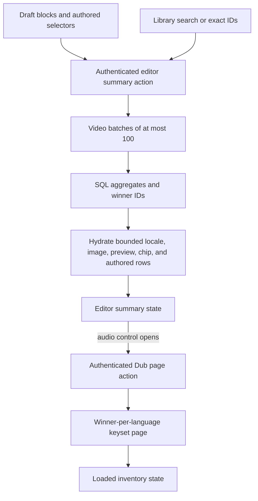
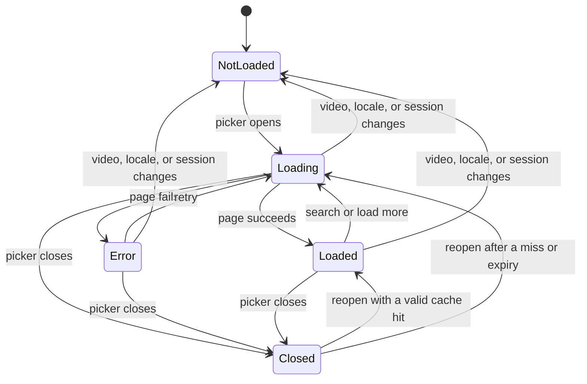

# Bound Experience Editor Data and Lazy Dub Loading - Plan

## Goal Capsule

- **Objective:** Experience editors can open, edit, save, and publish an incident-scale `/watch-home` without exhausting Admin memory, starving public GraphQL, or losing any authored video, language, preview, or clip choice.
- **Means:** Replace eager Dub inventories with bounded editor summaries and fetch paginated language choices only when an editor opens the audio-language control. (KTD1, KTD2, KTD3)
- **Authority:** This plan, the `feat-501` roadmap ticket, current Admin editor semantics, and the repository's package guidance govern implementation in that order when they do not conflict.
- **Execution profile:** Ship `feat-501` as the first PR. Keep publication gating and cache invalidation in the separate `feat-502` PR.
- **Stop conditions:** Stop rather than guess if real PostgreSQL evidence disproves bounded query behavior, if exact authored selections cannot be retained without changing stored content, or if implementation requires a public GraphQL contract change outside this PR. If bounded queries pass but the RSS target fails, capture a heap profile and attribute the residual before deciding whether this PR or a follow-up owns it.

---

## Product Contract

### Summary

The experience editor will load a compact, editor-specific video summary instead of every active Dub and nested language relation. The summary keeps enough information for the library, coverage display, collection preview, default playback, and every authored language already present in the draft. The complete playable-language inventory becomes a paginated, authenticated, intent-triggered fetch.

### Problem Frame

The September 14 homepage edit expanded the referenced set from 64 videos with 4,344 active Dubs to 125 videos with 143,030 active Dubs. The editor's `loadVideoRowSlice` path materializes those Dubs, their language and country-language relations, and all localized video descriptions before building `playableDubs`. Admin memory rose from 2.70 GB to 4.78 GB in 30 seconds and later reached 11.67 GB; editor requests took 49–140 seconds while public Admin GraphQL timed out or returned 502s.

The data expansion is verified, but no heap profile isolates every contributor. Cache invalidation may amplify the incident, yet it is outside this PR and tracked by `feat-502`. This work must prove the editor path is bounded without overstating that it resolves every public latency tail.

### Requirements

**Bounded cold data**

- R1. Initial editor load, exact-ID top-ups, server-backed video search, collection previews, and save/publish rerenders must not materialize a video's complete Dub inventory.
- R2. A compact video summary must contain identity, preferred localized title and description, thumbnail, playable-language count and bounded chips, collection count and bounded preview items, one locale-aware default preview Dub, and every distinct authored Dub selector needed by the current draft.
- R3. The summary path must select winners and aggregates in SQL before hydration, process at most 100 video IDs per sequential or explicitly bounded batch, preserve requested video order, and avoid per-video query fanout.
- R4. An omitted language inventory must be distinguishable from a loaded empty inventory; the audio-language control is available from the aggregate playable-language count rather than an in-memory array length.

**Editor playback parity**

- R5. Editor playback eligibility remains a non-deleted Dub with a non-empty HLS, DASH, or share URL; this PR must not adopt the public Watch HLS-only and published-only policy.
- R6. Default selection remains locale language match followed by the first HLS-capable Dub and then the first DASH/share-capable Dub, with a stable ID tie-break added wherever current database ordering is ambiguous.
- R7. Reopening a block resolves persisted `languageId` first and legacy `streamingUrl` second before applying the locale default, and preview URL, duration, trim bounds, and the saved selection must refer to the same Dub.
- R8. Background loading, a failed request, or fallback selection must not reset clips or alter persisted selectors; only an intentional language change resets clip values.

**Lazy language inventory**

- R9. Opening the audio-language control fetches one video's slim language choices with server-side search, a default page size of 50, values above 100 clamped to 100, non-positive or non-integer values rejected, a deterministic cursor, and the selected authored choice returned separately when it is off-page or outside the filter.
- R10. Every supported playable language remains discoverable through server paging and search, with loading, loaded-empty, error, retry, and load-more states. The asynchronous combobox retains keyboard navigation, restores focus on close, marks pending results busy, and announces result and error changes to assistive technology.
- R11. Identical in-flight page requests are coalesced, rejected requests are evicted for retry, late results cannot update a closed or changed picker, and the component-local cache is capped at 20 pages with a five-minute TTL.
- R12. Language lookup and exact-selector resolution require an authenticated Admin session and preserve the existing editor visibility rule for already-authored or explicitly referenced non-deleted videos.

**Authored content and collections**

- R13. Multiple blocks may reference the same video with different languages; summary input and exact-selector lookup must retain the full deduplicated selector set rather than collapsing it to one language per video.
- R14. Applying a collection must continue to add every ordered direct child without silent truncation, using pages of at most 100 lightweight child summaries or references rather than one unbounded relation and Dub expansion.
- R15. Apply and save revalidate referenced `{videoId, languageId}` choices in batches of at most 100; an unavailable newly chosen Dub blocks apply, while an unavailable pre-existing choice remains visibly selected with an adjacent warning and does not prevent unrelated text edits from saving. Playback alone is disabled for that unavailable choice, clip fields stay intact, and the language inventory remains available for an intentional replacement.

### Success Criteria

- Initial serialized Dub data falls by at least 90% on the incident fixture.
- Editor-induced peak RSS delta falls by at least 75%. Across 20 open/save cycles sampled after the same 60-second idle interval, the final five-sample mean must be no more than 5% above the first five-sample mean and the linear trend's 95% confidence interval must include zero.
- With one and four concurrent editor sessions, the fixed background workload records no pool timeout or 5xx, and public-query p95 is no more than 20% above its no-editor control.
- At least 30 timing samples record absolute values, fixture cardinalities, cold/warm state, revisions, and hardware. An unhealthy no-editor control is reported as a blocker instead of a pass.

### Acceptance Examples

- AE1. Given a draft that references a video with thousands of Dubs, opening the editor returns the default preview and authored selections without loading the remaining inventory.
- AE2. Given two blocks that use different languages for the same video, reopening either block selects its own language and preserves its own clip range.
- AE3. Given an authored language outside the first page or current search, opening the control shows that selected choice and paging or search still exposes every other playable language.
- AE4. Given a rejected inventory request, retry starts a new request; given a late response after close or video switch, editor state does not change.
- AE5. Given a collection with more than 100 children, Apply adds every direct child once in relation order without loading each child's full Dub inventory.
- AE6. Given a pre-existing Dub that was removed, unrelated text edits save with a visible warning and without replacement; choosing an unavailable Dub cannot be applied.

### Scope Boundaries

**In scope**

- Admin experience-editor summary queries, server actions, editor state, collection expansion, tests, compact telemetry, and local/staging validation evidence.
- Index changes proven necessary by real PostgreSQL plans for the editor's active-any-stream policy.

**Deferred to Follow-Up Work**

- `feat-502`: immutable publication attempts, isolated candidate validation, atomic promotion, outbox delivery, rollback, and targeted homepage cache invalidation.
- Production traffic observation after the normal reviewed PR-to-main Railway deployment.

**Out of scope**

- Production stress tests, direct production deploys, content rollback, restarts, pool-size or timeout increases, and infrastructure scaling.
- Changes to recommendations, GA, Datadog, public URL rules, or the public GraphQL schema. If a schema change becomes unavoidable, stop and replan the required Admin SDL and `packages/admin-graphql` regeneration together.

---

## Planning Contract

### Key Technical Decisions

- KTD1. **Use an editor-owned summary service.** Keep `loadVideoRowSlice` available to unrelated dashboard video-detail consumers and route experience-editor initial rows, exact-ID hydration, search results, and rerenders through a separate compact projection. This avoids widening a shared inferred type change and makes row/query budgets testable.
- KTD2. **Select before hydration.** Use PostgreSQL winner-per-video and winner-per-language queries with a unique final ID tie-break, then hydrate only chosen Dubs and required language metadata. This follows `docs/solutions/performance-issues/watch-selected-dub-projection-20260624.md` without copying its public HLS-only eligibility policy.
- KTD3. **Carry bounded authored selectors separately from inventory.** Extract all distinct `{videoId, languageId?, legacyStreamingUrl?}` selectors from the draft and resolve them in batches. The cold summary may contain the locale default plus those authored selections, but never the whole inventory.
- KTD4. **Bind cursor and cache identity to the complete query.** A versioned cursor includes every ordering key and is valid only for the same video and normalized search. Client cache and stale-response identities include session scope, locale, video, normalized search, cursor, page size, and the selected authored language when the response resolves that choice.
- KTD5. **Keep add-all collection semantics with bounded transport.** Page ordered child summaries in groups of at most 100 using relation position with nulls last, creation time, and unique relation ID as the cursor tuple. Assemble the complete ordered block set for the explicit Apply action; do not reuse a one-page preview as saved content.
- KTD6. **Treat unavailable existing selections as recoverable draft warnings.** Validate on Apply and Save, block a new unavailable choice, and retain a pre-existing unavailable selector until the editor intentionally replaces it. Publication behavior remains unchanged in this PR.

### High-Level Technical Design

### Assumptions

- `languageId` is the canonical persisted selector. Legacy `streamingUrl` is compatibility input for exact resolution and is canonicalized only by an intentional Apply.
- Existing authored/top-up videos remain resolvable when non-deleted even if they are outside normal list search visibility; new browse/search choices keep current list/search visibility.
- Collection Apply may load every lightweight child reference into editor state because the user's explicit action authors every child, but each server request and each child summary remains bounded.
- External research is unnecessary: the repository contains direct current patterns for SQL winner selection, lazy inventories, deterministic pagination, bounded promise caches, and Admin server actions.

### Sequencing

U5 freezes the fixture, measurement definitions, and pre-change baseline before production code changes. U1 establishes parity and query contracts. U2 builds the summary projection on those contracts. U3 adds the language-page, collection-page, and validation boundaries. U4 changes the client and collection flow. U6 runs the same harness against the fixed revision and records the final evidence.

---

## Implementation Units

### U1. Lock editor Dub and authored-selector semantics

- **Goal:** Create reusable editor-specific contracts for summaries, slim Dub choices, inventory state, and every authored selector in a draft.
- **Requirements:** R4–R8, R13, AE2.
- **Dependencies:** None.
- **Files:** `apps/admin/src/app/dashboard/experiences/experience-editor/block-helpers.ts`, `apps/admin/src/app/dashboard/experiences/experience-editor/block-helpers.test.ts`, `apps/admin/src/services/experience-editor-video.service.ts`, `apps/admin/src/services/experience-editor-video.service.test.ts`.
- **Approach:** Extract all selector occurrences without collapsing different languages on the same video. Encode editor eligibility, stream preference, language identity deduplication, locale matching, authored-language precedence, and deterministic ties as service-owned functions and result types.
- **Execution note:** Add characterization coverage before replacing the existing inline picker helpers.
- **Patterns to follow:** `apps/admin/src/app/dashboard/live-data.ts` picker helpers and `docs/solutions/logic-errors/admin-editor-video-picker-locale-first-dub-trimming-20260721.md`.
- **Test scenarios:**
  - A video referenced twice with two `languageId` values produces two selectors in stable draft order.
  - Persisted `languageId` wins over a mismatched legacy stream; a legacy-only block resolves its exact stream before locale fallback.
  - HLS wins within one Dub, while a DASH/share-only Dub remains editor-playable.
  - Duplicate language identities and equal timestamps resolve deterministically without changing locale/default ordering.
  - A background fallback does not alter selector or clip fields; an intentional language change resets clips.
- **Verification:** Tests express current editor behavior and the new not-loaded versus loaded-empty distinction before data access changes.

### U2. Build bounded editor video summaries

- **Goal:** Return compact summaries for initial library rows, exact referenced IDs, ranked search hydration, collection previews, and rerenders without loading complete Dub inventories.
- **Requirements:** R1–R4, R13, AE1, AE2.
- **Dependencies:** U1.
- **Files:** `apps/admin/src/services/experience-editor-video.service.ts`, `apps/admin/src/services/experience-editor-video.service.test.ts`, `apps/admin/src/services/experience-editor-video.service.db.test.ts`, `apps/admin/src/app/dashboard/live-data.ts`, `apps/admin/src/app/dashboard/live-data.test.ts`, `apps/admin/src/app/dashboard/experiences/[id]/page.tsx`.
- **Approach:** Add explicit list and exact-ID service methods. Batch IDs at 100, compute counts, chips, locale default IDs, and authored selector IDs in SQL, then hydrate only those rows and the required locale/image/collection-preview metadata. Preserve caller-provided ID order and keep the default first page out of exact search hydration.
- **Patterns to follow:** `apps/admin/src/services/preferred-playable-dub.service.ts`, `apps/admin/src/services/video.service.ts` keyset helpers, and `docs/solutions/database-issues/stable-admin-search-dub-hydration-ordering.md`.
- **Test scenarios:**
  - An incident-scale video with increasing total Dub count returns a constant number of hydrated Dub rows when authored selectors are unchanged.
  - Exact-ID hydration returns only requested IDs in requested order and does not add the default library page.
  - Missing, deleted, duplicate, and zero-playable-Dub videos produce distinct bounded summaries without per-video SQL.
  - Locale exact/base, fallback HLS, fallback DASH/share, null timestamps, and ID ties match U1 parity fixtures.
  - More than 100 requested IDs are split into bounded batches and preserve overall order.
- **Verification:** Real PostgreSQL evidence records emitted SQL and materialized row counts; mocked Prisma call counts are supporting evidence only.

### U3. Add paginated language lookup and batched validation

- **Goal:** Expose authenticated, deterministic language pages and validate selected references without loading inventories.
- **Requirements:** R9, R10, R12, R14, R15, AE3, AE5, AE6.
- **Dependencies:** U1, U2.
- **Files:** `apps/admin/src/services/experience-editor-video.service.ts`, `apps/admin/src/services/experience-editor-video.service.test.ts`, `apps/admin/src/services/experience-editor-video.service.db.test.ts`, `apps/admin/src/services/experience-video-language-backfill.ts`, `apps/admin/src/services/experience-video-language-backfill.test.ts`, `apps/admin/src/services/experience.service.ts`, `apps/admin/src/services/experience.service.test.ts`, `apps/admin/src/app/dashboard/experiences/[id]/page.tsx`, `apps/admin/src/app/dashboard/experiences/experience-editor.test.tsx`.
- **Approach:** Normalize and cap action inputs, select one deterministic playable Dub per language before applying keyset pagination, and bind the cursor to query identity. Return an exact selected choice separately. Add the ordered collection-child page on the same service boundary. Validate referenced selections in batches, preserve a legacy selector on routine Save, and canonicalize it only on intentional Apply.
- **Patterns to follow:** Inline authenticated server actions in `apps/admin/src/app/dashboard/experiences/[id]/page.tsx` and current deterministic cursor helpers in Admin services.
- **Test scenarios:**
  - Page sizes default to 50, clamp values above 100, reject non-positive or non-integer values, and return stable non-overlapping pages across tied rows.
  - Server search finds later languages by localized label, slug, BCP-47, and duration text without filtering after `take`.
  - An off-page or filtered-out selected language is returned separately without duplication.
  - Invalid cursor, mismatched query identity, missing video, and unauthenticated calls fail without leaking options.
  - Deleted or newly unplayable selections fail Apply; pre-existing unavailable selections return warnings and remain unchanged on unrelated Save.
  - Collection-child pages contain at most 100 rows and remain stable across equal nullable positions and equal creation times by using the unique relation ID tie-break.
- **Verification:** Service, action, and real database tests prove pagination stability, permission behavior, and bounded validation query counts.

### U4. Make the audio picker lazy and collection expansion bounded

- **Goal:** Load language options on user intent with resilient client state while preserving preview, selection, clip, and add-all collection behavior.
- **Requirements:** R4, R7–R11, R14, R15, AE3–AE6.
- **Dependencies:** U2, U3.
- **Files:** `apps/admin/src/app/dashboard/experiences/experience-editor.tsx`, `apps/admin/src/app/dashboard/experiences/experience-editor-with-chat.tsx`, `apps/admin/src/app/dashboard/experiences/experience-editor.test.tsx`, `apps/admin/src/app/dashboard/experiences/[id]/page.tsx`.
- **Approach:** Replace in-memory filtering with action-backed open/search/load-more states and reuse the existing bounded promise-cache helper unchanged. Guard state commits with request identity and abort transport where supported. Keep an unavailable authored choice visible while disabling only playback. For collection Apply, disable duplicate actions, show completed and total child progress, stage pages outside block state, commit only after every page succeeds, and retain the previous state with a retry path after failure.
- **Patterns to follow:** `apps/admin/src/services/bounded-ttl-promise-cache.ts`, the video-library search effect in `experience-editor.tsx`, and existing jsdom/manual `act` component tests.
- **Test scenarios:**
  - Initial render performs no language-page request; first open requests one video and a repeated identical open reuses the cached result.
  - Rejected requests leave a retry path; retry succeeds and is cached, while rejected promises are not retained.
  - Rapid video, locale, search, and close transitions ignore stale completions and retain the selected preview and clips.
  - Keyboard users can search and move through the listbox, Escape returns focus to the trigger, pending states expose `aria-busy`, and result/error changes are announced without moving focus.
  - An unavailable authored choice remains visibly selected with its warning and clips until the editor intentionally selects a replacement.
  - Load more appends unique languages in cursor order; changing search resets the cursor without hiding the authored selection.
  - Collection Apply reports progress, rejects duplicate Apply attempts, commits only after all pages succeed, and retries from an unchanged prior block state after failure.
- **Verification:** Component tests prove behavior without relying on timing races, and editor props no longer contain a full initial inventory.

### U5. Freeze the representative fixture and baseline

- **Goal:** Preserve a reproducible pre-change baseline and the exact harness the fixed revision must use.
- **Requirements:** R1–R3 and the Success Criteria.
- **Dependencies:** None.
- **Files:** `apps/admin/src/scripts/probe-experience-editor-video-data.ts`, `apps/admin/package.json`, `docs/validation/feat-501/README.md`, `docs/solutions/performance-issues/experience-editor-bounded-video-data-20260914.md`, `docs/roadmap/platform/feat-501-experience-editor-bounded-video-data.md`.
- **Approach:** Build an isolated fixture matching the incident counts where practical, record deviations, freeze metric definitions and the baseline revision, and capture pre-change measurements before U2. Measure the largest real collection and record its cumulative lightweight expansion cost; if it exceeds the editor budgets, stop and replan the authored representation.
- **Patterns to follow:** `apps/admin/docs/worktree-preview-setup.md`, `docs/operations/watch-runtime-diagnosis-2026-09-14.md`, and the probe contract in `docs/solutions/performance-issues/watch-selected-dub-projection-20260624.md`.
- **Test scenarios:**
  - The same fixture and probe run against the baseline and fixed revisions without changing query, workload, timing, or metric definitions.
  - The largest representative collection can complete add-all expansion within the fixture's memory and latency budgets; otherwise the stop condition is recorded before implementation proceeds.
- **Verification:** The baseline record contains the fixture recipe, revisions, counts, hardware, cold/warm state, sample count, emitted SQL definition, and raw absolute measurements needed for a like-for-like comparison.

### U6. Prove fixed bounds and document operational evidence

- **Goal:** Demonstrate behavior parity and resource improvement on the frozen PostgreSQL fixture and production Admin build.
- **Requirements:** R1–R15 and AE1–AE6.
- **Dependencies:** U1–U5.
- **Files:** `apps/admin/src/scripts/probe-experience-editor-video-data.ts`, `apps/admin/package.json`, `docs/validation/feat-501/README.md`, `docs/solutions/performance-issues/experience-editor-bounded-video-data-20260914.md`, `docs/roadmap/platform/feat-501-experience-editor-bounded-video-data.md`.
- **Approach:** Run the fixed revision through the frozen harness with one and four editor sessions under the same public GraphQL workload. Add compact duration/count telemetry for summary and page loads without logging inventories, user content, or credentials.
- **Patterns to follow:** U5's frozen harness and measurement contract.
- **Test scenarios:**
  - Production-build browser flow opens the heavy homepage, changes a block, selects a non-default language, previews, saves, reopens, and publishes the same selection.
  - Collection and AI-referenced exact-ID top-up paths remain complete and ordered.
  - One and four concurrent editors run beside the same public workload with recorded SQL, rows, bytes, pool wait, RSS, heap, event-loop delay, and public latency.
  - Twenty open/save cycles satisfy the fixed post-idle sampling and trend rule.
- **Verification:** The validation record includes commands, revisions, fixture counts, sample counts, absolute baseline/fix values, and an explicit pass or blocker for every success criterion. A blocker preserves the evidence but leaves U6 and `feat-501` incomplete.

---

## Verification Contract

| Gate                                | Command or evidence                                                                                                                                                                                                                                          | Done signal                                                                                                                              |
| ----------------------------------- | ------------------------------------------------------------------------------------------------------------------------------------------------------------------------------------------------------------------------------------------------------------ | ---------------------------------------------------------------------------------------------------------------------------------------- |
| Focused service and component tests | `pnpm --filter @forge/admin test -- src/services/experience-editor-video.service.test.ts src/app/dashboard/live-data.test.ts src/app/dashboard/experiences/experience-editor/block-helpers.test.ts src/app/dashboard/experiences/experience-editor.test.tsx` | Parity, lazy-loading, stale-response, retry, collection, and warning scenarios pass.                                                     |
| Real PostgreSQL tests               | `pnpm --filter @forge/admin test -- src/services/experience-editor-video.service.db.test.ts` with the documented isolated database                                                                                                                           | Winner, pagination, emitted-SQL, row-bound, and index-plan assertions pass.                                                              |
| Static checks                       | `pnpm --filter @forge/admin lint` and `pnpm --filter @forge/admin typecheck`                                                                                                                                                                                 | No new lint or type errors.                                                                                                              |
| Production build                    | `pnpm --filter @forge/admin build`                                                                                                                                                                                                                           | Next production build and workflow verifiers pass.                                                                                       |
| Browser behavior                    | Production-build editor flow against the isolated fixture                                                                                                                                                                                                    | Authored language, preview, clips, search, paging, retry, save, reopen, publish, collection, and top-up paths pass.                      |
| Performance                         | `docs/validation/feat-501/README.md`                                                                                                                                                                                                                         | Every success budget has comparable baseline/fix evidence and passes; a named blocker preserves evidence but does not satisfy this gate. |
| Frontend load impact                | Initial RSC bytes plus query-row/SQL counts before and after                                                                                                                                                                                                 | The cold path meets the 90% serialized Dub-data reduction and shows no replacement fanout.                                               |

---

## Definition of Done

- U1–U6 satisfy their requirements and test scenarios with no full Dub inventory in initial editor props or rerender actions.
- The selected/default Dub, preview URL, duration, clips, and persisted selector remain coherent across reopen, lazy load, failure, search, and intentional change.
- Exact-ID, collection, language, and validation paths use bounded batches and deterministic order without per-video queries or silent truncation.
- Focused tests, real PostgreSQL tests, Admin lint, typecheck, production build, browser verification, and the performance evidence record pass. A genuine external blocker is reported with evidence and leaves the plan incomplete.
- Compact telemetry contains counts and durations only; inventories, authored content, and credentials are absent.
- `feat-501` is marked complete only after its verification passes. `feat-502` remains pending for its separate PR.
- Experimental or abandoned implementation paths are removed from the final diff, and durable findings are captured in `docs/solutions/performance-issues/`.
