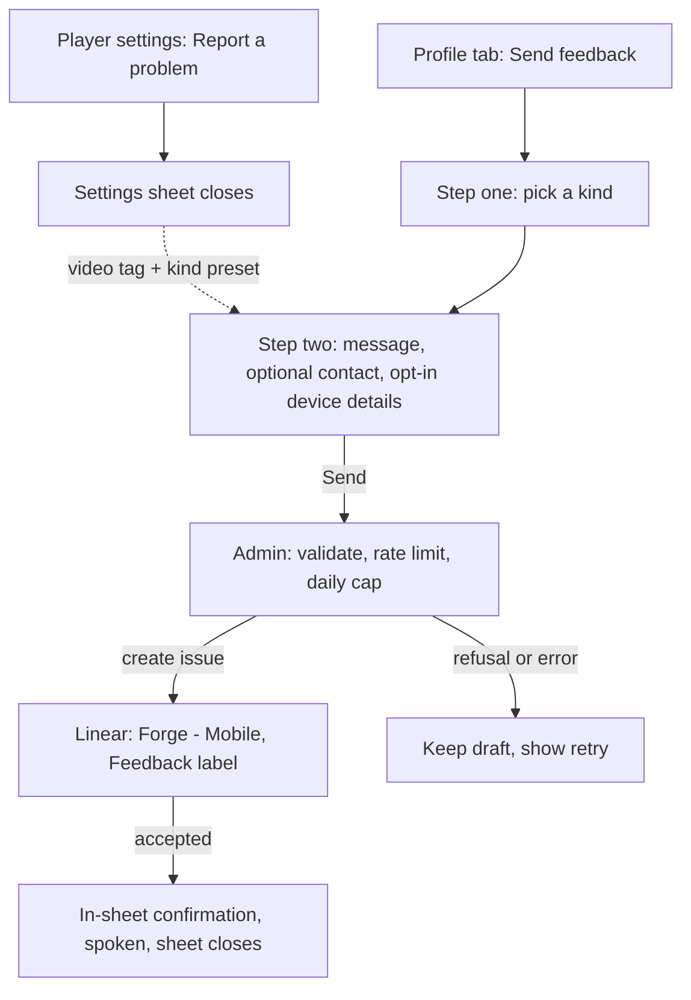
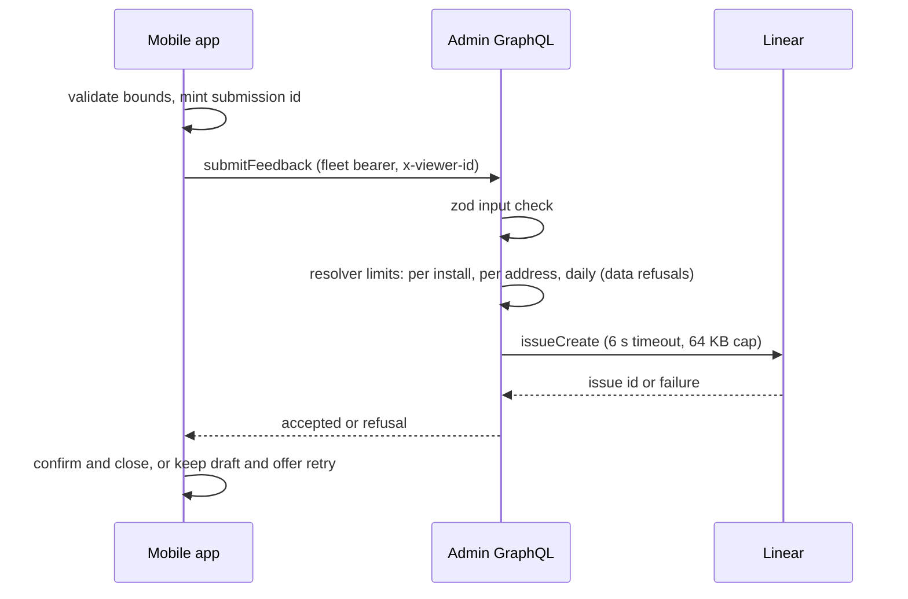
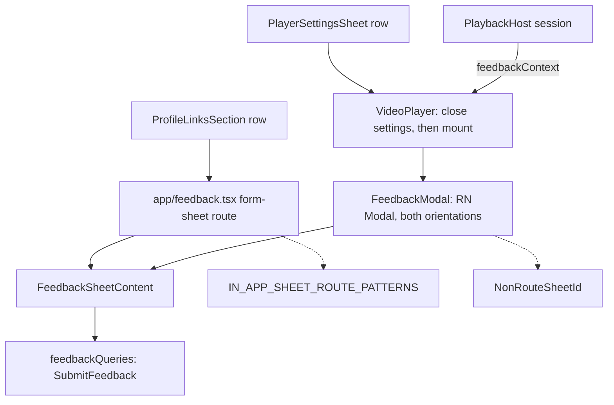
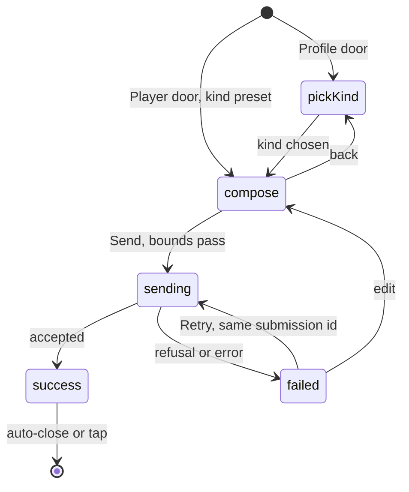

# Mobile In-App Feedback to Linear - Plan

## Goal Capsule

- **Objective:** A person who uses the mobile app can send feedback from inside the app, and that feedback appears in the team's Linear project as a ticket that quotes their words exactly, so the team can act on it without a conversation.
- **Means:** Two entry points in the app open one two-step feedback sheet. Admin receives the submission over a new public GraphQL mutation and files the Linear issue at once (KTD1, KTD2).
- **Product authority:** urim, the mobile owner. Requirements win on product behavior. Key Technical Decisions win on mechanism. Units carry only unit-local deltas.
- **Execution profile:** two pull requests. The admin PR (U1, U2) is a handoff to the admin team and deploys first. The mobile PR (U3 to U6) follows and needs a native build because it adds two Expo modules (KTD6).
- **Stop conditions:** stop and surface if admin no longer exports `incrementFixedWindow` and `identifyForRateLimit` for reuse, if the player settings sheet is no longer an RN Modal, or if a unit needs a database table.
- **Open blockers:** none.

---

## Product Contract

**Product Contract preservation:** changed at plan synthesis with user confirmation. R2, R5, R7, R12, R13, R14, R17 sharpened; R18, R19 added; KD8, KD9 added; F2 sequenced; AE7 rewritten; AE10 to AE15 added. Changed again after synthesis with user direction on the failure copy: KD10 added; R13 and R15 sharpened; AE6 and AE7 sharpened; AE16 added; the rejected alternative recorded in Scope Boundaries; the Outstanding Questions failure-copy item closed. No requirement was removed and no ID was renumbered.

### Summary

Add a "Send feedback" row on the Profile tab and a "Report a problem" entry in the video player. Both open one two-step sheet: pick a kind, then write. Admin validates the submission, applies a per-install rate limit and a fleet-wide daily cap, and creates a Linear issue that quotes the message verbatim, names the video when one was attached, and carries device details only when the person opted in.

### Problem Frame

The only feedback channel for the mobile app today is the product lead speaking to the mobile owner. Nothing is tracked, nothing is quoted, and no other voice reaches the team.

The app moves through three cohorts over the coming months: internal TestFlight testers, an external beta cohort, then public App Store users. The team expects these users to be vocal. Without an in-app channel, their feedback lands in App Store reviews, TestFlight screenshots, or nowhere.

Web solved the same problem for Watch with feat-399: a native form that files straight into Linear. Mobile has no equivalent. The hourly Datadog triage sweep files mobile error tickets into Linear, but no path exists for a human to file one.

### Key Decisions

- KD1. **This plan owns capture-to-ticket only.** (session-settled: user-directed — chosen over one plan covering capture, triage, and auto-implementation: the capture path ships alone and unblocks the loop, and triage serves more than one ticket source.) Governs Scope Boundaries.
- KD2. **Two entry points, one form: a Profile row and a player entry.** (session-settled: user-directed — chosen over a Profile row only and over a shake gesture: the player entry carries the video and position for free, which is where most bug reports start.) Governs R1, R2, R3.
- KD3. **Two-step capture: pick a kind, then write.** (session-settled: user-directed — chosen over one sheet and over a bare message box: guided, one extra tap, and the kind gives triage a head start.) Governs R4, R5.
- KD4. **Copy web's personal-data posture.** (session-settled: user-directed — chosen over prefilling the account email and over collecting no contact: nothing is read from the account, contact is typed and optional, device details are opt-in.) Governs R7, R8, R9.
- KD5. **The video reference is a visible removable tag; only device details sit behind the opt-in switch.** (session-settled: user-approved — chosen over hiding the video behind the same switch: the player entry loses its value if the video is hidden by default.) Governs R6, R9.
- KD6. **File the ticket at once from admin.** (session-settled: user-directed — chosen over a route on web, a durable inbox with later dispatch, and an agent-written ticket: smallest build, proven by web, no database, and mobile already talks only to admin.) Governs R11, R13, R14, R15.
- KD7. **Tickets land in the existing "Forge - Mobile" Linear project under a Feedback label.** (session-settled: user-approved — chosen over a separate project: one queue serves the later triage agent, and the label separates human feedback from agent-filed error tickets.) Governs R16, R17.
- KD8. **The ticket carries the video slug and dub language beside the visible tag.** (session-settled: user-approved — chosen over title and position only: a title cannot tell dubs or editions apart, and web's ticket already carries content ids.) Governs R17.
- KD9. **Rare duplicate tickets are accepted; there is no server-side dedupe.** (session-settled: user-approved — chosen over a Redis-backed idempotency check: a lost response followed by Retry is rare, a duplicate costs one human close, and the submission id makes it visible.) Governs R13, R17.
- KD10. **One failure message for every refusal, the daily cap included.** The sheet shows "Couldn't send that. Try again in a few minutes." whatever the refusal was. (session-settled: user-directed — chosen over distinct daily-cap copy naming the next-day reset: one string keeps the sheet to a single failure state, and the refusal values stay separate on the wire for operators.) Governs R13, R15.

### Actors

- A1. Submitter — a person using the app: an internal TestFlight tester, an external beta tester, or a public App Store user. Signed in or not; the behavior is the same.
- A2. Mobile app — collects the submission, attaches only what the person allowed, and sends it to admin.
- A3. Admin — validates the submission, applies the rate limit and the daily cap, and files the ticket in Linear.
- A4. Linear — holds the ticket in the team's project.
- A5. Team — the mobile owner and product lead. They read tickets in Linear and reply by email when the person gave one.

### Requirements

**Entry points**

- R1. The Profile tab shows a "Send feedback" row in the existing link group. It opens the feedback sheet on step one.
- R2. The player settings sheet shows a "Report a problem with this video" row. It opens the same feedback sheet on step two, with the kind preset to "Something's broken" and the current video, dub, and playback position captured at the tap. Playback continues under the sheet.
- R3. Both entry points work signed in and signed out.

**Capture**

- R4. Step one asks the person to pick one kind: "Something's broken", "I have an idea", or "Something else".
- R5. Step two asks for the message. The message is required, plain text, and between 10 and 1000 characters after trimming. The person can go back to change the kind without losing anything typed.
- R6. When a video was attached (R2), step two shows it as a visible tag, "About: <title> at <position>", with a control to remove it. Without a video, no tag is shown. A removed tag cannot be restored inside the sheet.
- R7. Step two offers an optional name field, at most 100 characters, and an optional email field, at most 254 characters in a valid address shape. The person types them; the app never prefills them from the account.
- R8. The ticket carries no account identifier, no session data, no location, and no screenshot.
- R9. Step two offers an opt-in switch, off by default, that adds device details: app version and build, OS name and version, and device model. A disclosure lists exactly what would be sent, and shows "Unknown" for any value the phone cannot read. The platform name, iOS or Android, is always sent and is named in the disclosure.
- R10. The sheet is in English. The app is not localized today.

**Sending and outcome**

- R11. On Send, the app sends the submission to admin and shows a sending state. Admin files the Linear issue before it answers.
- R12. On success the sheet shows a short confirmation, announces it to screen readers, and closes on its own or on tap. No ticket id or link is shown.
- R13. On a failure the person keeps every field and sees one message, "Couldn't send that. Try again in a few minutes.", with a way to retry. The apostrophe is a straight ASCII one, matching the app's existing failure copy in `apps/mobile/src/components/watch/SheetError.tsx`. Every refusal shows that same message, the fleet-wide daily cap included. Failures include offline, timeout, rate limited, daily cap reached, Linear unavailable, and admin not configured. Nothing is retried in the background and nothing is queued. Closing the sheet discards the draft.
- R14. Admin rejects a submission whose fields exceed the bounds set by R5, R6, R7, and R9. Admin limits each install to 5 submissions per 10 minutes and the whole fleet to a daily cap, default 200 per UTC day.
- R15. Admin's Linear configuration is optional at deploy time. Missing configuration makes every submission fail per R13 and never affects other admin behavior. A person refused this way reads the same message as every other refusal. That message names minutes, but this refusal clears only when an operator provisions the configuration. The mobile build ships after admin is provisioned, so this is accepted (KD10).
- R18. The app checks the R5, R7, and R9 bounds before Send and shows the problem inline, so admin never rejects a submission for a reason the person could not fix.
- R19. Close, Back, the backdrop, the dismiss gesture, and the Android back button do nothing while sending. If the sheet unmounts mid-send, the request completes and its result is dropped.

**The ticket**

- R16. The issue is created in the team's existing "Forge - Mobile" Linear project with a Feedback label, no priority, and no assignee. The title is `[Mobile feedback] <Kind>: <first line of the message>`, truncated to 120 characters.
- R17. The description quotes the message verbatim, escaped so it cannot render as markup or hide characters. It then lists the kind, the name and email if given, the video title, position, slug, and dub language if attached, the platform, the device details if opted in, and the submission id. It ends with a line that names the mobile app as the source.

### Key Flows

- F1. Feedback from the Profile tab
  - **Trigger:** A1 taps "Send feedback" on the Profile tab.
  - **Steps:** A1 picks a kind. A1 writes the message, may add a name and email, and may switch on device details. A1 taps Send. A3 validates, applies the rate limit and the daily cap, and files the issue in A4. A2 shows the confirmation and closes the sheet.
  - **Covers:** R1, R3, R4, R5, R7, R9, R11, R12, R16, R17, R18.
- F2. Report a problem from the player
  - **Trigger:** A1 opens player settings and taps "Report a problem with this video".
  - **Steps:** A2 captures the video, dub, and position, closes the settings sheet, then opens the feedback sheet on step two with the kind preset and the video tag shown. A1 may remove the tag or go back to step one. Back never returns to the settings sheet. The rest follows F1 from the message onward.
  - **Covers:** R2, R6, then F1.
- F3. Send fails
  - **Trigger:** A3 answers with a refusal, or A2 cannot reach A3.
  - **Steps:** A2 keeps every field, shows the failure message, and offers retry with the same submission id. A1 retries or closes. Closing discards the draft.
  - **Covers:** R13, R14, R15, R19.

### Acceptance Examples

- AE1. Player entry preset. **Covers R2, R6.** Given A1 watches "JESUS" at 1:12:04 and taps "Report a problem with this video", when the sheet opens, then it shows step two with "Something's broken" selected and a tag "About: JESUS at 1:12:04" with a remove control.
- AE2. Removing the tag. **Covers R6, R17.** Given AE1, when A1 removes the tag and sends, then the ticket carries no video title, position, slug, or dub language.
- AE3. Device details off by default. **Covers R9, R17.** Given A1 sends from the Profile tab without touching the switch, then the ticket carries the platform name and no app version, OS version, or device model.
- AE4. Device details on. **Covers R9, R17.** Given A1 switches on device details and the disclosure lists the app build, OS version, and device model, when A1 sends, then the ticket carries exactly those values.
- AE5. Nothing from the account. **Covers R7, R8.** Given a signed-in A1 opens the sheet, then the name and email fields are empty, and the ticket carries no account id and no email unless A1 typed one.
- AE6. Failure keeps the draft. **Covers R13.** Given the phone is offline, when A1 taps Send, then the message, kind, tag, contact fields, and switch state stay as they were, A1 sees "Couldn't send that. Try again in a few minutes.", and retry is offered.
- AE7. Rate limited. **Covers R13, R14.** Given one install sent five submissions in the last ten minutes, when it sends a sixth, then admin refuses it, the draft stays, and A1 sees "Couldn't send that. Try again in a few minutes."
- AE8. Unconfigured admin. **Covers R15.** Given admin has no Linear configuration, when a submission arrives, then admin answers with a refusal, files nothing, and every other admin operation is unaffected.
- AE9. Ticket shape. **Covers R16, R17.** Given the kind "I have an idea" and the message "Let me download audio only" followed by a second line "for long drives", when it is filed, then the title is `[Mobile feedback] Idea: Let me download audio only`, the description quotes both lines verbatim, and the issue has the Feedback label with no priority and no assignee.
- AE10. Close during sending is refused. **Covers R19.** Given the sheet is in the sending state, when A1 taps Close, the backdrop, or the Android back button, then nothing changes until the request settles.
- AE11. Retry reuses the submission id. **Covers R13, R17.** Given a Send that timed out, when A1 taps Retry, then the second request carries the same submission id, so two tickets from one draft show one id.
- AE12. Screen reader hears the confirmation. **Covers R12.** Given VoiceOver or TalkBack is on and a Send succeeds, then the confirmation is spoken before the sheet closes.
- AE13. Landscape typing. **Covers R2, R11.** Given the sheet opened from the fullscreen player on a phone in landscape, when the keyboard is up, then the message field stays visible and Send can be reached by scrolling.
- AE14. Over-long message stops in the sheet. **Covers R5, R18.** Given a 1001-character message, when A1 taps Send, then the sheet shows the limit inline and sends nothing.
- AE15. Two installs behind one address. **Covers R14.** Given two phones on one carrier address each send once within ten minutes, then both are accepted.
- AE16. The daily cap reads like any other refusal. **Covers R13, R14.** Given the fleet-wide daily cap is already reached, when A1 taps Send, then admin answers refusal `DAILY_CAP`, nothing reaches Linear, every field stays as it was, and A1 sees the same message as AE7.

### Success Criteria

- A ticket is visible in Linear within ten seconds of a successful Send. A person waits on the sending state, so the round trip must stay short.
- A tester can file a problem from the player in under a minute without typing the video name.
- The team can act on a "Something's broken" ticket filed from the player without asking which video or which dub it was.
- A spot check of filed tickets finds no account identifier and no device detail that was not opted in.

### Scope Boundaries

Deferred for later:

- Agent triage of feedback tickets and the implement-and-open-a-PR loop (see How This Work Fits Together).
- Screenshots or any other attachment.
- Offline queueing or background retry of a failed submission.
- An after-submit follow-up email, which web adds through a receipt. The optional email field covers replies.
- Localization of the sheet.
- A TV app equivalent.
- Replies from the team shown inside the app.

Outside this feature's identity:

- A support chat or help center.
- Feature voting. Web's What's New votes are a different surface with a different contract.

#### Deferred to Follow-Up Work

- Server-side dedupe of a resent submission id (KD9 accepts rare duplicates).
- The player's own time label omits hours and renders 1:12:04 as 72:04. The tag uses hours; the label is a separate fix.
- A series title in the ticket when the episode title is generic.
- A video tag for the Profile door while the floating mini player plays.
- A "Discard?" pause when a non-empty draft is closed.
- Rate-limit stats in the admin dashboard.
- Distinct daily-cap copy naming the next-day reset (KD10 accepts one shared message).

<!-- ce-section: work-relationships -->

### How This Work Fits Together

This plan covers the capture-to-ticket path only. The breakdown below is the current understanding, not a committed roadmap.

- Agent triage of filed tickets, the "Stage 2" that `docs/runbooks/datadog-mobile-triage.md` already names.
  - Depends on tickets existing in Linear. This plan and the Datadog sweep both supply them.
  - Shares the "Forge - Mobile" project and its label conventions with this plan (R16).
  - Still to decide: whether triage reads Linear or an inbox, what "triaged" means (a label, a comment, a priority), and who approves.
- Agent implementation loop, from ticket to pull request in the mobile app.
  - Depends on triage marking a ticket as ready.
  - Can proceed independently of this plan's capture UI.
  - Still to decide: the trust boundary (human approval before merge), which runner executes, and how the loop reports back to the ticket.

### Dependencies / Assumptions

- Admin hosts the submission endpoint. The admin PR is owned by the admin team, and admin deploys before the mobile build that calls it.
- The Linear API key, team id, project id, and Feedback label id are provisioned in admin's Doppler project `forge-admin`. The "Forge - Mobile" project exists; the Datadog triage pipeline already files there. Admin has no Linear configuration today, so every variable is new.
- Admin's GraphQL rate limiter is Redis-backed in production and buckets fleet traffic per install when the request carries the fleet bearer and an `x-viewer-id` header. Mobile already sends both on search only, through an operation-name allowlist with a guard test. Admin also exports `incrementFixedWindow`, a Redis fixed-window counter with a local fallback, and `identifyForRateLimit`, which names the per-install bucket; the resolver reuses both.
- The app has no runtime read of its own version, build, or device model. This plan adds `expo-application` and `expo-device`, which changes the native fingerprint, so the mobile PR ships as a native build before any later OTA update.
- The player settings sheet is an RN Modal with both orientations allowed, because a routed form sheet cannot present over the fullscreen player. The feedback sheet opened from it presents the same way.
- Web's Linear transport in `apps/web/src/lib/feedback-linear.ts` is the reference shape. Admin cannot import it or the Mastra sanitizers, so U1 ports them.
- The mobile app is not localized, so English copy is acceptable (R10).

### Outstanding Questions

Resolve Before Planning: none.

Resolve Before Implementation: none.

Deferred to Implementation:

- The exact copy of the confirmation and the disclosure. Web's strings are the starting point. The failure message is settled by KD10 and R13, and is not open.
- Which Linear identity signs admin's feedback tickets. The recommendation is a dedicated service identity with a key separate from web's and the triage sweep's, granted only issue creation in the one team.
- Whether the Profile form sheet needs a fixed detent or fits content. Decide on the device.

### Sources / Research

- `docs/roadmap/platform/feat-399-watch-native-linear-feedback.md` — web's native Linear feedback ticket. Its Constraints are the privacy floor this plan copies.
- `apps/web/src/lib/feedback-linear.ts`, `apps/web/src/lib/feedback-action-core.ts`, `apps/web/src/lib/feedback.ts`, and their tests — web's transport, bounds, rate limit, and category vocabulary.
- `apps/web/src/components/FeedbackModal.tsx` — client-side validation, the opt-in diagnostics switch and its disclosure, and close blocked while submitting.
- `apps/admin/src/graphql/mutations/whats-new-feature-votes.ts` and its test — the public mutation whose refusal is data, not a thrown error.
- `apps/admin/src/graphql/plugins/rate-limit.ts` and `apps/admin/src/auth/rate-limit.ts` — `identifyForRateLimit` (the per-install bucket identity), the wildcard 30-per-minute mutation bucket, `incrementFixedWindow` (the Redis fixed-window counter with a local fallback), and the Redis store requirement in production.
- `apps/admin/src/auth/fleet-ceiling.ts` — the precedent where a zero ceiling means disabled; the feedback cap deliberately inverts that (KTD12).
- `apps/admin/src/graphql/public-resolvers.regression.test.ts` — the manifest every public resolver must join.
- `apps/admin/src/services/revalidate-webhook.ts` — outbound fetch with `AbortSignal.timeout` and a typed outcome only. Its body read is uncapped and its logging is JSON, neither of which this plan copies; the 64 KB streamed cap is `readJsonCapped` in `apps/web/src/lib/feedback-linear.ts`.
- `apps/admin/src/config/env.ts` — optional env var pattern (`WEB_REVALIDATE_URL`).
- `apps/admin/src/graphql/schema.ts` — side-effect imports that register mutation files.
- `apps/mastra/src/services/datadog-triage/ticket-draft.ts` — `safeTriageText` and `safeTriageTitleText`, which strip `\p{Cf}`, `\p{Cc}`, and `\p{Default_Ignorable_Code_Point}` before text reaches a ticket.
- `apps/mobile/src/lib/authHeaders.ts`, `apps/mobile/src/lib/viewer-id.ts`, `apps/mobile/src/lib/apolloClient.ts`, and `apps/mobile/src/lib/__tests__/authHeaders.test.ts` — the operation-scoped fleet bearer, the per-launch viewer id, the 15-second request budget, and the search-event RUM exclusion.
- `apps/mobile/src/lib/queries.ts` and `apps/mobile/src/lib/watchProgressQueries.ts` — file-per-feature `adminGraphql()` operations.
- `apps/mobile/src/components/profile/DeleteAccountFlow.tsx` — the discriminated-union flow state, the in-flight guard, and the `alive` ref.
- `apps/mobile/src/components/watch/PlayerSettingsSheet.tsx` and `apps/mobile/src/components/watch/VideoPlayer.tsx` — the RN Modal host, its 180 ms exit timer, `supportedOrientations`, and the mount point at the bottom of the player.
- `apps/mobile/src/components/watch/PlaybackHost.tsx` and `apps/mobile/src/lib/miniPlayer/store.ts` — the playback session that holds title, slug, dub language, and position.
- `apps/mobile/src/lib/miniPlayer/suppression.ts` — the two closed lists a new sheet must join so the floating player hides.
- `apps/mobile/app/watch/_layout.tsx` — form-sheet route registration with detents.
- `apps/mobile/src/hooks/useReduceMotion.ts` and `apps/mobile/src/components/library/DeleteConfirmSheet.tsx` — reduce-motion handling for a sheet.
- `docs/solutions/runtime-errors/player-settings-sheet-fullscreen-orientation-sigabrt-crash.md` — why a Modal over the fullscreen player needs both orientations.
- `docs/solutions/security-issues/invisible-character-class-gap-defeats-url-redaction.md` — the invisible-character families a sanitizer must strip.
- `docs/solutions/architecture-patterns/rate-limit-bucket-key-availability-not-abuse-ceiling.md` and `docs/solutions/architecture-patterns/fleet-client-bearer-must-be-operation-scoped-not-global.md` — per-install buckets need a separate abuse ceiling; the bearer stays operation-scoped.
- `docs/solutions/graphql/pothos-public-widening-multi-layer-coordination-20260511.md` — a public field needs its own callable-without-session test because schema drift cannot see auth scopes.
- `docs/solutions/developer-experience/local-admin-dev-auth-flow-impractical-20260514.md` — verify a public mutation locally with curl and a bearer, not the dashboard.

---

## Planning Contract

### Key Technical Decisions

- KTD1. **One public GraphQL mutation, `submitFeedback`, whose outcome is data.** The field uses `authScopes: { public: true }` and returns an envelope with `accepted` and a nullable `refusal` enum (`INVALID_INPUT`, `RATE_LIMITED`, `DAILY_CAP`, `UNAVAILABLE`, `NOT_CONFIGURED`), the `castWhatsNewFeatureVote` shape. `DAILY_CAP` stays a separate value from `RATE_LIMITED` even though the phone renders one message for both (KD10): the refusal value is returned on the wire and named in admin's refusal log, which is how the KTD12 kill switch is verified and how operators tell the two apart. Any other error still throws, so a real fault is not masked as a refusal. Chosen over a REST route because mobile already transports GraphQL and codegen types the contract. Governs R11, R13, R15.
- KTD2. **Admin owns a Linear feedback service ported from web.** Same endpoint, `issueCreate` mutation, 6-second timeout, 64 KB response cap, typed outcome, and never a throw across the service boundary. Text passes through web's markdown escaping plus the triage sweep's invisible-character stripping before it reaches the title or description. Governs R16, R17.
- KTD3. **Every feedback limit is enforced in the resolver and answered as data.** The mobile call carries the fleet bearer and `x-viewer-id` for this one operation, so `identifyForRateLimit` names the bucket `consumer:<key>:v:<viewer_id>` with the trusted-IP fallback. The resolver runs three checks through admin's existing `incrementFixedWindow` counter before it touches Linear: 5 per 10 minutes on that identity, 20 per hour on the trusted client address so a relaunching or header-rotating client behind one address stays bounded, and the fleet-wide daily cap keyed by UTC date. The first two answer `RATE_LIMITED`; the cap answers `DAILY_CAP`. The plugin's wildcard 30-per-minute mutation bucket stays as it is and only backstops floods; its error is a thrown fault, so the phone shows the same R13 message. The plugin's per-field config is not used for this field, because the installed Yoga reads `extensions.http.status` while the plugin sets `statusCode`, so a plugin refusal never reaches the phone as a 429. Governs R14.
- KTD4. **One form body, two hosts.** `FeedbackSheetContent` owns the two steps, validation, and the sending state machine. The Profile door hosts it in a root form-sheet route registered in `IN_APP_SHEET_ROUTE_PATTERNS`. The player door hosts it in `FeedbackModal`, an RN Modal with both orientations allowed, registered as a `NonRouteSheetId`. (session-settled: user-approved — chosen over one Modal for both doors: the form sheet gives the Profile door native keyboard handling and back behavior, and the player door cannot use a route.) Governs R1, R2, R19.
- KTD5. **The player closes settings first, then opens feedback, and freezes the context at the tap.** The settings row calls back into `VideoPlayer` with the captured title, slug, dub language, and position. `VideoPlayer` closes the settings sheet, waits for its `onClose`, then mounts `FeedbackModal`. `PlaybackHost` threads title, slug, and dub language into `VideoPlayer` as one `feedbackContext` prop; position comes from the player or the cast target at the tap and may be absent while casting. Back on step two goes to step one, never to settings. Governs R2, R6.
- KTD6. **Device details come from two new Expo modules.** `expo-application` supplies the app version and native build, `expo-device` supplies the model, and `Platform` supplies the OS name and version. Unreadable values render and send as "Unknown". (session-settled: user-approved — chosen over dropping the model for v1: the native build was already required for the version read, and the model is what separates low-end Android reports.) Governs R9.
- KTD7. **Validation runs twice with the same bounds.** The phone checks R5, R7, and R9 before Send and shows inline errors. Admin re-checks with zod and answers `INVALID_INPUT`, which the phone shows with the same R13 message because it should never happen. Governs R14, R18.
- KTD8. **A submission id per draft, no server dedupe.** The phone mints a UUID when the sheet opens, keeps it across retries, and sends it. Admin validates its shape and writes it into the description. (session-settled: user-approved — chosen over a Redis idempotency check per KD9.) Governs R13, R17.
- KTD9. **Resolver-enforced refusals never reach RUM.** Because KTD3's three counters answer as data, each refusal is a successful response to the Apollo link, files no RUM error, and cannot feed the Datadog triage sweep. The plugin's wildcard bucket is the exception: it throws, so its refusals do report and can reach the sweep. The per-install 5-per-10-minutes limit fires long before 30 mutations a minute for a human, so that path is flood-only. Real faults still throw and still report. Governs R13.
- KTD10. **Kind vocabulary.** The wire enum `FeedbackKind` is `BROKEN`, `IDEA`, `OTHER`. Labels are "Something's broken", "I have an idea", "Something else". Title short names are Problem, Idea, Other. The mobile literal is re-derived from the generated types, never typed by hand. Governs R4, R16.
- KTD11. **Confirmation and motion.** Success is an in-sheet state announced with `AccessibilityInfo.announceForAccessibility`, closing after about 1.5 seconds or on tap. Both hosts read `useReduceMotion` and set every duration to zero when it is on. Moving between step one and step two in either direction announces the new step's heading the same way, so a screen-reader user's focus follows the sheet. Governs R12.
- KTD12. **Configuration.** Admin adds optional `ADMIN_FEEDBACK_LINEAR_API_KEY`, `ADMIN_FEEDBACK_LINEAR_TEAM_ID`, `ADMIN_FEEDBACK_LINEAR_PROJECT_ID`, `ADMIN_FEEDBACK_LINEAR_LABEL_ID`, and `ADMIN_FEEDBACK_DAILY_CAP`, a non-negative integer with default 200, where `0` refuses every submission with `DAILY_CAP` and never means unlimited, the opposite of the search ceiling's zero, so the cap is also the operator's kill switch. Missing key or team id yields `NOT_CONFIGURED`. While the cap is `0`, every person reads the R13 message, which names minutes; that is accepted (KD10). Admin logs in the `[feedback] event=<name> key=value` plain-string format and never logs the message, name, or email. Governs R15.
- KTD13. **Ownership and order.** The admin PR lands and deploys first. The mobile PR lands second and ships as a native build. Both PRs run a Tier-2 `ce-code-review` before push because the change adds a public API surface.

### High-Level Technical Design

Request path, from tap to ticket:

Hosts, shared body, and the lists they register with:

The sheet's state machine, mirroring the delete-account flow:

The prose above and the units below are authoritative where a diagram and the text differ.

### Sequencing

1. U1 then U2 in the admin PR. Merge, deploy, and provision the five env vars in Doppler `forge-admin`.
2. U3 in the mobile PR, then U4, then U5 and U6 in either order. Regenerated `packages/admin-graphql` types from U2 must be on `main` before U3 compiles.
3. Ship the mobile PR as a native build (KTD6), then verify on a device against production admin.

---

## Implementation Units

### U1. Admin Linear feedback service and configuration

- **Goal:** Admin can build a sanitized title and description from a validated submission and create one Linear issue with a typed outcome.
- **Requirements:** R15, R16, R17. Instantiates KD7, KD8; KTD2, KTD12.
- **Dependencies:** none.
- **Files:**
  - `apps/admin/src/services/feedback-linear.ts` (new): transport, title and description builders, outcome type.
  - `apps/admin/src/services/feedback-linear.test.ts` (new).
  - `apps/admin/src/services/feedback-text.ts` (new): the sanitizer.
  - `apps/admin/src/services/feedback-text.test.ts` (new).
  - `apps/admin/src/config/env.ts`: five optional variables.
  - `apps/admin/.env.example`: the same five, commented.
- **Approach:**
  1. Port `createLinearFeedbackIssue` from web: same request shape, `AbortSignal.timeout(6000)`, streamed body capped at 64 KB, `redirect: "error"`, and an outcome union of `created` or `failed` with reasons `config_missing`, `timeout`, `network_error`, `rate_limited`, `rejected`, `invalid_response`.
  2. The sanitizer strips the three invisible-character classes first, porting only the triage sweep's `deleteInvisible` step and its explicit separator set, then applies web's markdown escaping with `@` escaped by a backslash rather than web's zero-width insertion, which the strip would delete. It never collapses whitespace, because R17 quotes line breaks verbatim. It wraps every client-supplied string in the title and description: message, name, email, video title, dub language, and each device detail. The title builder also removes line breaks and structural characters.
  3. The description follows web's section order: the message, then a context list, then the source line. Content fields are present only when the submission carries them (R17).
  4. Log one plain-string line per outcome with the submission id, kind, platform, and reason. Never log free text.
- **Execution note:** write the sanitizer and the builders test-first; they are pure and the tests are the contract the mutation relies on.
- **Patterns to follow:** `apps/web/src/lib/feedback-linear.ts` for transport and description; `apps/mastra/src/services/datadog-triage/ticket-draft.ts` for `deleteInvisible` and `safeTriageTitleText` only, not `safeTriageText`, which collapses whitespace; `readJsonCapped` in `apps/web/src/lib/feedback-linear.ts` for the streamed 64 KB cap; `apps/admin/src/services/revalidate-webhook.ts` for `AbortSignal.timeout` and the typed outcome, never its JSON logging; `apps/admin/src/config/env.ts` for `.optional()` variables.
- **Test scenarios:**
  - A full submission produces the title `[Mobile feedback] Problem: <first line>` and a description with every context line in order. Covers AE9.
  - A submission with no tag, no contact, and no device details produces a description with only the message, kind, platform, submission id, and source line. Covers AE2, AE3.
  - A message containing markdown syntax, an `@` mention, and a URL split by a zero-width joiner is escaped so none of them renders, with one test per invisible-character family (format, control, default-ignorable).
  - An invisible-character run in the name and in the video title is stripped, and markdown in the video title does not render.
  - A first line longer than 120 characters truncates without splitting a surrogate pair; a blank first line falls back to "Feedback".
  - Missing API key or team id returns `config_missing` without a network call. Covers AE8.
  - A 429 response returns `rate_limited`, a 500 returns `rejected`, a hung socket returns `timeout` within the budget, and a body over 64 KB returns `invalid_response` after the reader is cancelled.
  - A success response with no issue id returns `invalid_response`.
- **Verification:** unit tests pass; `pnpm --filter @forge/admin typecheck` passes; no test performs a real network call.

### U2. Admin `submitFeedback` mutation, rate limit, and generated types

- **Goal:** A phone can call `submitFeedback` with or without a session and receive an accepted-or-refusal answer within admin's request budget.
- **Requirements:** R3, R11, R13, R14, R15. Instantiates KD6; KTD1, KTD3, KTD7, KTD10.
- **Dependencies:** U1.
- **Files:**
  - `apps/admin/src/graphql/mutations/feedback.ts` (new): input type, kind and refusal enums, result type, resolver.
  - `apps/admin/src/graphql/mutations/feedback.test.ts` (new).
  - `apps/admin/src/services/feedback-limits.ts` (new) and its test: a thin wrapper over `incrementFixedWindow` for the three limits in KTD3.
  - `apps/admin/src/graphql/public-resolvers.regression.test.ts`: register `submitFeedback` in `INTENDED_PUBLIC_RESOLVERS`.
  - `apps/admin/src/graphql/schema.ts`: side-effect import of the mutation file.
  - `apps/admin/schema.graphql` and `packages/admin-graphql/src/admin-graphql-env.d.ts`: regenerated.
  - `apps/admin/CLAUDE.md`: a short section on the feedback mutation and its env vars, including that `RATE_LIMITED` and `DAILY_CAP` render one shared message on the phone (KD10) and must not be collapsed into one value.
- **Approach:**
  1. Define `FeedbackKind`, `FeedbackRefusal`, `FeedbackSubmissionInput` (kind, message, name, email, submissionId, video `{ title, positionSeconds, slug, languageSlug }`, platform, deviceDetails), and `FeedbackSubmissionResult`.
  2. Validate with zod using web's bounds plus a UUID pattern for the submission id and a bounded slug pattern. The video title is at most 200 characters, slug and dub language match the bounded slug pattern, and each device detail is at most 100 characters. A failure answers `INVALID_INPUT`.
  3. Run the three KTD3 limits before calling Linear: per install and per address answer `RATE_LIMITED`; the daily cap answers `DAILY_CAP`. Log one `[feedback] event=refused` line naming the refusal value before returning: the phone shows one message for all of them (KD10), so the wire value and this log are what keep them apart for operators.
  4. Map the U1 outcome: `config_missing` to `NOT_CONFIGURED`, `rate_limited` to `RATE_LIMITED`, every other failure to `UNAVAILABLE`, success to `accepted: true`.
  5. Register `submitFeedback` in `INTENDED_PUBLIC_RESOLVERS` with a comment that names this plan and the abuse story: per-install and per-address buckets for availability, the daily cap as the fleet-wide bound, refusals as data.
  6. Run `pnpm --filter @forge/admin schema:print` and `pnpm --filter @forge/admin-graphql generate`; commit both artifacts.
- **Patterns to follow:** `apps/admin/src/graphql/mutations/whats-new-feature-votes.ts` for `authScopes: { public: true }`, `t.arg` inputs, the `toResult` mapping, and the colocated test; `fleet-ceiling.ts` for how a resolver-side limit reads the counter; the three-step type registration in `apps/admin/CLAUDE.md`.
- **Test scenarios:**
  - An anonymous request with a valid input and a stubbed U1 success answers `accepted: true`. Covers AE5.
  - The same request with a session behaves identically.
  - A 1001-character message, a 101-character name, a malformed email, a malformed submission id, and a negative position each answer `INVALID_INPUT` and never reach U1. Covers AE14 at the admin layer.
  - Stubbed U1 outcomes map one-to-one onto the refusal enum, and an unexpected thrown error still throws.
  - The sixth call from one identity within ten minutes answers `RATE_LIMITED` as data before U1 is called, and a different identity behind the same address is still accepted until the per-address bound. Covers AE7, AE15.
  - The daily counter at its cap answers `DAILY_CAP` before U1 is called; the counter resets on the next UTC day; a cap of `0` refuses the first call.
  - With Redis absent outside production, the limits fall back to the local counter and still refuse; with Redis present they count across two resolver instances.
  - Each refusal logs its own refusal value, and no log line carries the message, name, or email.
  - The public-resolver manifest test passes with the new entry and fails when the entry is removed.
  - `schema.graphql` contains the mutation and the two enums after regeneration.
- **Verification:** `pnpm --filter @forge/admin test` and `typecheck` pass; `schema:print` and `generate` leave no diff; a curl with the fleet bearer against local admin files a real issue into a scratch Linear project, and the same curl six times in ten minutes gets `accepted: false` with refusal `RATE_LIMITED` on the sixth, over HTTP 200.

### U3. Mobile operation, headers, device details, and submission model

- **Goal:** The app can send a typed `SubmitFeedback` mutation per install, with device details it can read, and classify the answer.
- **Requirements:** R3, R8, R9, R11, R13, R14, R18. Instantiates KD4, KD10; KTD3, KTD6, KTD7, KTD8, KTD9, KTD10.
- **Dependencies:** U2 merged, so the generated types exist.
- **Files:**
  - `apps/mobile/src/lib/feedbackQueries.ts` (new): `SUBMIT_FEEDBACK` and `SUBMIT_FEEDBACK_OPERATION_NAME`.
  - `apps/mobile/src/lib/feedbackSubmission.ts` (new): bounds, validation, submission id, outcome classification.
  - `apps/mobile/src/lib/feedbackDeviceDetails.ts` (new): version, build, OS, model, platform.
  - `apps/mobile/src/lib/feedbackCopy.ts` (new): the one exported failure-message constant (KD10), imported by the classifier and the sheet so the string has a single home.
  - `apps/mobile/src/lib/authHeaders.ts` and `apps/mobile/src/lib/__tests__/authHeaders.test.ts`: the fleet-bearer allowlist grows by one operation; the guard test pins it to the document.
  - `apps/mobile/src/lib/__tests__/feedbackSubmission.test.ts`, `__tests__/feedbackDeviceDetails.test.ts`, `__tests__/feedbackQueries.test.ts` (new).
  - `apps/mobile/package.json`: `expo-application` and `expo-device` at the SDK 57 versions.
- **Approach:**
  1. Declare the mutation with `adminGraphql()` in its own file, following the file-per-feature convention. Read the kind enum from the generated types.
  2. Turn `authHeadersForOperation` into an allowlist of two operation names. Both send the fleet bearer and `x-viewer-id`.
  3. Validation mirrors U2's bounds so the phone catches every rejection first.
  4. Classify the answer: `accepted` is success. Every refusal, `INVALID_INPUT`, `RATE_LIMITED`, `DAILY_CAP`, `UNAVAILABLE` and `NOT_CONFIGURED`, and every thrown error, including `ClientAbortError` and offline, is one failure that renders the single R13 message from the shared constant (KD10). The refusal value is carried on the outcome type and never selects different text; nothing on the phone emits it, because admin's refusal log is its sink (KTD1).
  5. Device details read `Application.nativeApplicationVersion`, `Application.nativeBuildVersion`, `Device.modelName`, `Platform.OS`, and `Platform.Version`, each falling back to "Unknown".
- **Patterns to follow:** `apps/mobile/src/lib/watchProgressQueries.ts`; the `SEARCH_OPERATION_NAME` gate and its guard test; `randomUUIDCompat` in `viewer-id.ts`.
- **Test scenarios:**
  - The feedback operation gets the fleet bearer and `x-viewer-id`; a public query still gets neither; the progress operations still get only the JWT.
  - The guard test fails when the operation name constant and the mutation document disagree.
  - Validation rejects a 9-character message, accepts a 10-character one, rejects a 1001-character one, rejects a malformed email, and accepts an empty name and email. Covers AE14.
  - The submission id is a v4 UUID, stable across two classify-and-retry cycles, and new per model instance. Covers AE11.
  - The shared constant's value is exactly `Couldn't send that. Try again in a few minutes.`, with a straight ASCII apostrophe. This is the only test that pins the wording; every other copy assertion compares against the constant, so without this one a reword passes the whole suite.
  - A table of failure inputs, every refusal value plus offline and `ClientAbortError`, each classifies as the one failure outcome and resolves to that constant.
  - No refusal value calls the RUM error reporter; a thrown GraphQL error for the same operation still reports.
  - Device details with the two modules mocked to return null render "Unknown" for each field and still carry the platform.
- **Verification:** `pnpm --filter @forge/mobile test`, `typecheck`, and `lint` pass; `pnpm install --frozen-lockfile` succeeds with the two new modules.

### U4. `FeedbackSheetContent`: the two-step form

- **Goal:** One presentation-agnostic component runs both steps, validation, the tag, the switch and disclosure, sending, confirmation, and failure.
- **Requirements:** R4, R5, R6, R7, R9, R10, R12, R13, R18, R19. Instantiates KD3, KD5, KD10; KTD4, KTD7, KTD8, KTD11.
- **Dependencies:** U3.
- **Files:**
  - `apps/mobile/src/components/feedback/FeedbackSheetContent.tsx` (new).
  - `apps/mobile/src/components/feedback/feedbackFlow.ts` (new): the state machine and reducer.
  - `apps/mobile/src/components/feedback/__tests__/FeedbackSheetContent.test.tsx` and `__tests__/feedbackFlow.test.ts` (new).
- **Approach:**
  1. Props: an optional initial context (kind, video title, position, slug, dub language), an `onClose`, and a `dismissLocked` callback the host uses to block gestures while sending.
  2. State follows the diagram in High-Level Technical Design. An in-flight ref makes Send idempotent against double taps, and an `alive` ref, restored on every mount, drops results after unmount.
  3. Step two is a scroll view: tag, message field, name, email, the switch with its disclosure list, and Send. The message field keeps a live character count. Name and email validate inline on blur and on Send with the R7 bounds, using the same inline-error treatment as the message.
  4. Success announces to screen readers, then closes after about 1.5 seconds or on tap. Failure keeps every field, shows the one R13 message from the shared constant whatever the refusal was, and offers Retry and Edit.
  5. Kind tiles carry `accessibilityState.selected`; the tag remove control and the switch carry labels and the disclosure as a hint. Each step transition announces the new step's heading (KTD11).
  6. `useReduceMotion` sets step and sheet durations to zero.
- **Execution note:** render the suite under `StrictMode` at least once; the hook-lifetime refs are exactly the remount hazard the repo's law names.
- **Patterns to follow:** `DeleteAccountFlow.tsx` for the flow state, in-flight guard, and `alive` ref; `DeleteConfirmSheet.tsx` for reduce motion; the in-file react re-point pattern from `AccountSection.test.tsx`; `SearchableListSheet.tsx` for a `TextInput` inside a sheet.
- **Test scenarios:**
  - Opening with no context lands on step one; choosing a kind lands on step two; Back returns to step one with the typed message intact. Covers R5.
  - Opening with a context lands on step two with the kind preset and the tag text "About: JESUS at 1:12:04"; removing the tag hides it and it cannot return. Covers AE1, AE2.
  - A position of 43 seconds renders "0:43"; 4324 seconds renders "1:12:04"; an absent position renders "About: JESUS".
  - Send with a 9-character message shows the inline limit and calls nothing. Covers AE14.
  - Send with a 101-character name or a malformed email shows the inline problem on that field and calls nothing; a 100-character name and an empty email pass.
  - Send with the switch off submits no device details; with the switch on, the disclosure list and the submitted details match. Covers AE3, AE4.
  - While sending, `dismissLocked` is true and a second Send is ignored. Covers AE10.
  - A rejected submit shows the one R13 message with every field intact, and Retry submits the same submission id. Covers AE6, AE11.
  - Every refusal value, `RATE_LIMITED`, `DAILY_CAP`, `INVALID_INPUT`, `UNAVAILABLE` and `NOT_CONFIGURED`, renders that same message, asserted against the shared constant. Covers AE7, AE16.
  - An accepted submit calls the announcement API and then `onClose`. Covers AE12.
  - Choosing a kind and tapping Back each call the announcement API with the new step's heading.
  - Under `StrictMode`, a submit after the double effect cycle still resolves and closes.
- **Verification:** the suite passes under jest-expo, including the `StrictMode` case.

### U5. Profile door: link row and form-sheet route

- **Goal:** "Send feedback" on the Profile tab opens the sheet as a native form sheet, and the floating player hides while it is open.
- **Requirements:** R1, R3, R19. Instantiates KD2; KTD4.
- **Dependencies:** U4.
- **Files:**
  - `apps/mobile/app/feedback.tsx` (new): the route that renders `FeedbackSheetContent`.
  - `apps/mobile/app/_layout.tsx`: the `Stack.Screen` registration with form-sheet presentation and detents.
  - `apps/mobile/src/components/profile/ProfileLinksSection.tsx`: the row, placed after Contact, pushing the route instead of opening a URL.
  - `apps/mobile/src/lib/miniPlayer/suppression.ts` and its test: the route pattern joins `IN_APP_SHEET_ROUTE_PATTERNS`.
  - `apps/mobile/src/components/profile/__tests__/ProfileLinksSection.test.tsx` (new or extended).
- **Approach:**
  1. Register the route the way `apps/mobile/app/watch/_layout.tsx` registers `download`, at the root stack so it opens from the Profile tab.
  2. The route passes no context, so the sheet opens on step one.
  3. While `dismissLocked` is true, the route sets `gestureEnabled: false` through navigation options and ignores the header close.
- **Patterns to follow:** the form-sheet options in `app/watch/_layout.tsx`; the `mission` route registration in `app/_layout.tsx`; the existing row rendering in `ProfileLinksSection.tsx`.
- **Test scenarios:**
  - The link group renders "Send feedback" with a button role, and pressing it pushes the feedback route rather than opening a URL.
  - The suppression test recognizes the new route as an in-app sheet.
  - The route renders `FeedbackSheetContent` with no initial context.
- **Verification:** on an iPhone simulator, the row opens a form sheet, the keyboard does not cover the message field, and the floating mini player is hidden while the sheet is open.

### U6. Player door: settings row, `FeedbackModal`, and context threading

- **Goal:** "Report a problem with this video" in the player settings sheet opens the feedback sheet over the fullscreen player with the video, dub, and position attached.
- **Requirements:** R2, R3, R6, R19. Instantiates KD2, KD5, KD8; KTD4, KTD5.
- **Dependencies:** U4.
- **Files:**
  - `apps/mobile/src/components/feedback/FeedbackModal.tsx` (new): RN Modal host with `supportedOrientations` for both, scrim, slide animation, and a keyboard-aware scroll container.
  - `apps/mobile/src/components/watch/PlayerSettingsSheet.tsx` and its test: the new root row and an `onReportProblem` callback.
  - `apps/mobile/src/components/watch/VideoPlayer.tsx`: the `feedbackContext` prop, the close-then-open sequence, position capture, and the `FeedbackModal` mount beside `PlayerSettingsSheet`.
  - `apps/mobile/src/components/watch/PlaybackHost.tsx`: threads title, slug, and dub language from the session into `VideoPlayer`.
  - `apps/mobile/src/lib/miniPlayer/suppression.ts` and its test: a new `NonRouteSheetId`.
  - `apps/mobile/src/components/feedback/__tests__/FeedbackModal.test.tsx` (new) and the `VideoPlayer` test that covers the sequence.
  - `apps/mobile/CLAUDE.md`: a Common Pitfalls line on the modal-over-modal order.
- **Approach:**
  1. The settings row shows while casting too. On tap, `VideoPlayer` reads the position from the player, or from the cast target, or leaves it absent; captures the context; closes the settings sheet; and mounts `FeedbackModal` from the settings sheet's `onClose`.
  2. `FeedbackModal` opens the sheet on step two with the context. `onRequestClose` and the scrim are inert while `dismissLocked` is true.
  3. Landscape: the body is a scroll view with keyboard avoidance, so the message field stays above the keyboard and Send is reachable (AE13).
  4. Register the modal with the non-route suppression counter on open and close.
- **Execution note:** the modal-over-modal order and the landscape keyboard cannot be proven in jest. Verify both on an iPhone simulator in fullscreen before marking the unit complete.
- **Patterns to follow:** `PlayerSettingsSheet.tsx` for the Modal, scrim, animation timing, and `supportedOrientations`; the `docs/solutions/runtime-errors/player-settings-sheet-fullscreen-orientation-sigabrt-crash.md` prevention note; `PlaybackHost.tsx` lines that pass `session.title` into the player.
- **Test scenarios:**
  - The settings sheet renders the report row in the root list, while casting and while not, and pressing it calls `onReportProblem`.
  - `VideoPlayer` closes the settings sheet before the feedback modal mounts, and the modal receives the title, slug, dub language, and the position read at the tap, not at Send.
  - With a cast target that has no position, the context carries no position.
  - The suppression counter reports a presented sheet while the modal is open and none after it closes.
  - `FeedbackModal` ignores `onRequestClose` while locked and honors it when unlocked. Covers AE10.
  - Back on step two goes to step one and never re-opens the settings sheet.
- **Verification:** on an iPhone simulator in fullscreen: settings, report, sheet opens in landscape without a crash, typing keeps the field visible, Send files a ticket that names the video, dub, and position; on an Android emulator the back button is inert while sending and closes otherwise.

---

## Verification Contract

| Check                        | Command or method                                                                                                                                                                                                            | Applies to | Done signal                                                                                                        |
| ---------------------------- | ---------------------------------------------------------------------------------------------------------------------------------------------------------------------------------------------------------------------------- | ---------- | ------------------------------------------------------------------------------------------------------------------ |
| Admin unit tests and types   | `pnpm --filter @forge/admin test`, `pnpm --filter @forge/admin typecheck`, `pnpm --filter @forge/admin lint`                                                                                                                 | U1, U2     | all green                                                                                                          |
| Schema and client drift      | `pnpm --filter @forge/admin schema:print` then `git diff --exit-code apps/admin/schema.graphql`; `pnpm --filter @forge/admin-graphql generate` then `git diff --exit-code packages/admin-graphql/src/admin-graphql-env.d.ts` | U2         | no diff after commit                                                                                               |
| Rate-limit refusals as data  | the U2 limit tests, run with and without Redis                                                                                                                                                                               | U2         | sixth call refused as data; cap `0` refuses the first call                                                         |
| Local admin smoke            | curl `submitFeedback` against local admin with the fleet bearer and an `x-viewer-id`; repeat six times                                                                                                                       | U2         | one real issue in a scratch project; sixth call answers refusal `RATE_LIMITED` over HTTP 200                       |
| Abuse response               | set `ADMIN_FEEDBACK_DAILY_CAP=0` in Doppler and redeploy; note that removing the Linear key also needs a redeploy                                                                                                            | U2, U4     | every call answers `DAILY_CAP`; nothing reaches Linear; the sheet shows the R13 message and keeps the draft (AE16) |
| Mobile unit and render tests | `pnpm --filter @forge/mobile test`, `pnpm --filter @forge/mobile typecheck`, `pnpm --filter @forge/mobile lint`                                                                                                              | U3 to U6   | all green, `StrictMode` case included                                                                              |
| Lockfile                     | `pnpm install --frozen-lockfile`                                                                                                                                                                                             | U3         | succeeds with the two new modules                                                                                  |
| Device checks                | iPhone simulator: Profile door, player door in fullscreen, landscape typing, VoiceOver announcement via Accessibility Inspector; Android emulator: back button while sending                                                 | U4 to U6   | each AE10 to AE13 observed                                                                                         |
| Ticket spot check            | open three filed tickets in Linear                                                                                                                                                                                           | U1, U2     | no account id, no un-opted device detail, verbatim message                                                         |
| Docs formatting              | `npx prettier --check` on every edited markdown file                                                                                                                                                                         | all        | clean                                                                                                              |
| Review gate                  | Tier-2 `ce-code-review` before each push                                                                                                                                                                                     | both PRs   | findings applied or explicitly deferred                                                                            |

---

## Definition of Done

Global:

- Both PRs merged to `main` with squash merges and conventional titles.
- Admin deployed with the five env vars set in Doppler `forge-admin`, and a curl from outside files one ticket into "Forge - Mobile" with the Feedback label.
- A native mobile build that includes U3 to U6 is on TestFlight, and one ticket filed from each door on a device shows the expected description.
- No abandoned experiment code remains in either diff.
- `apps/admin/CLAUDE.md` and `apps/mobile/CLAUDE.md` carry their one-section updates, and the roadmap ticket for this feature is created and set to complete.

Per unit:

- U1: builders and transport tests pass; no test touches the network.
- U2: mutation, limit, and manifest tests pass; regenerated artifacts committed; local curl smoke done.
- U3: header guard, validation, classification, and device-detail tests pass; lockfile frozen.
- U4: state-machine and render tests pass, including `StrictMode`.
- U5: row and route tests pass; simulator shows the form sheet with the mini player hidden.
- U6: sequence and suppression tests pass; fullscreen and landscape checks done on a simulator, back-button check on an emulator.
