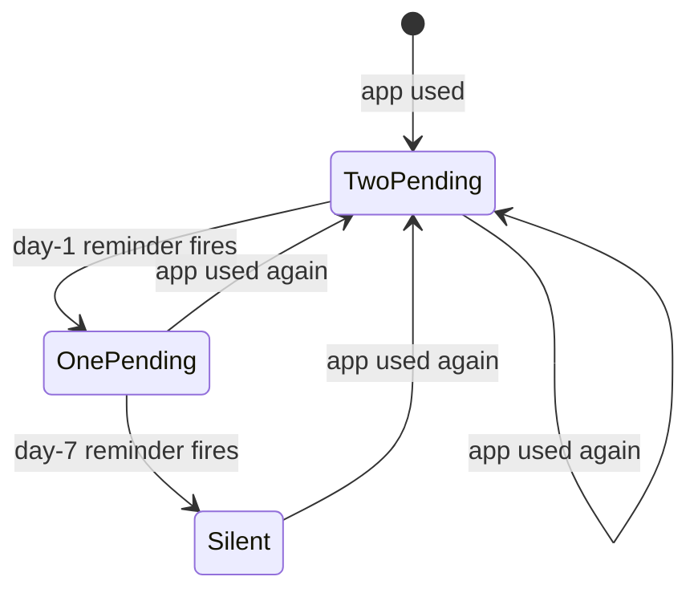
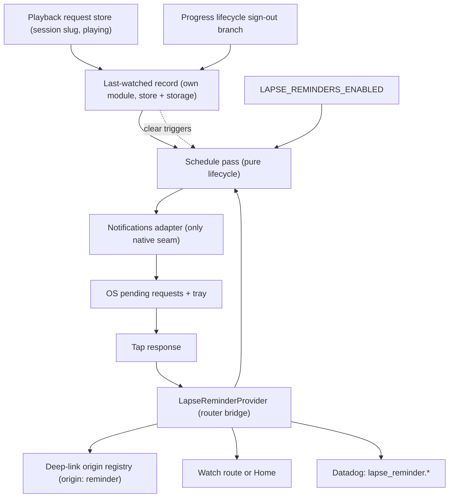
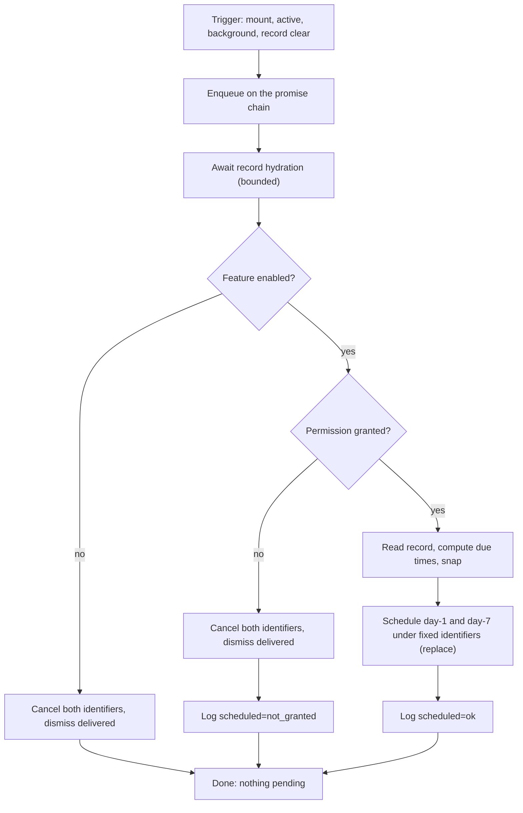
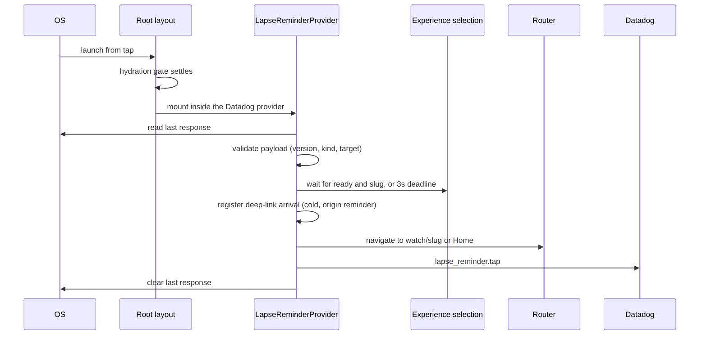

# Mobile Lapse Reminders - Plan

## Goal Capsule

- **Objective:** A person who installs the mobile app and then stops opening it receives one reminder on their device a day after their last use and a second one a week after it, and a tap on either reminder brings them back to the video they last played.
- **Means:** Local notifications that the app schedules for itself each time it is used, through the Expo notifications module behind one adapter (KTD1). No server component.
- **Product authority:** The Product Contract below, confirmed on 2026-09-16 with the mobile owner. The request came from a ministry stakeholder, who also signs off the final copy.
- **Execution profile:** `apps/mobile` only, iOS and Android. One native build for both platforms carries the change; the JavaScript that follows ships by OTA update.
- **Stop conditions:** Stop and report if the Expo notifications module cannot schedule a local notification without an exact-alarm permission, if a same-identifier schedule does not replace the pending request on either platform and the fallback order in KTD2 also fails, if a route pushed from a cold-start tap does not survive the experience shell swap on either platform after the gate in KTD7, or if the signed Android release build loses scheduled reminders across a reboot.
- **Who finishes:** The implementer lands U1 through U6 as one pull request, runs U7 on both platforms before the production builds are submitted, and hands the copy sign-off and the release sequence to the mobile owner.
- **Open blockers:** None that block implementation. The final reminder copy is deferred and must land before release (see Outstanding Questions).

---

## Product Contract

**Product Contract preservation:** changed, no scope change to the objective: R2, R6, R8, R10, R11, R16 and AE3 clarified from platform research and confirmed with the user on 2026-09-16; AE9 added for the sign-out rule; R18 and R19 added from the security review so the sign-out rule reaches the reminders the OS already holds; the Android reboot question resolved in place.

### Summary

Add a lapse reminder to the mobile app. Each time the app is used, it schedules two local notifications, one due a day later and one due a week later, delivered between 09:00 and 21:00 local time, and a tap opens the last video the user played. Nothing runs server-side, and the copy is two fixed strings in the app. The implementation adds the Expo notifications module behind one adapter, a pure scheduler for the due-time math, a pure last-watched record fed by the playback request store, and one provider in the app root that runs a schedule pass on launch, on foreground, on background, and on a record clear.

### Problem Frame

A ministry stakeholder asked for a way to bring people back into the app after they drift away, and the team wants to lift retention. The app has no re-engagement channel today: it has no notification capability, no reminder, and no way to reach a person who has not opened it. Once a viewer closes the app, the only path back is the viewer's own memory. The retention numbers the stakeholder wants to move have no baseline yet, because nothing in the app or in Datadog records a lapse or a return.

### Key Decisions

- **Client-only local reminders, no server push.** The app schedules notifications for itself, with no push tokens, platform credentials, or backend job, and copy still ships by OTA update. Governs R1, R2.
- **Two reminders per lapse, then silence.** (session-settled: user-approved — chosen over weekly repeats, capped or uncapped: keeps to the "no pressure" rule in `PRODUCT.md` and avoids the user muting or uninstalling the app.) Governs R3, R4, R5.
- **Permission prompt on first launch.** (session-settled: user-directed — chosen over a prompt after the first video plays and over a Profile-only opt-in: the simplest build with full reach from day one.) Research note: Apple's Human Interface Guidelines recommend asking in context after the user has seen value, and community reports put first-launch opt-in below in-context opt-in. App Review allows the first-launch ask. The decision stands; the plan records the lower opt-in ceiling as a known cost in Success Criteria. Governs R8, R9.
- **A tap resumes the last watched video.** (session-settled: user-directed — chosen over the Home tab and over one fixed film: a more compelling landing.) Governs R12, R13.
- **A local last-watched record for every user.** (session-settled: user-approved — chosen over a Home fallback for signed-out users: the signed-in watch-progress store empties on sign-out, so without a local record most users would land on Home.) Governs R10, R11.
- **The record is written from the watch screen only.** (session-settled: user-approved — chosen over adding a slug lookup to the Experience section players: those players carry a video id and no slug today, so a lookup there is follow-up work.) Governs R10.
- **The record is cleared on an explicit sign-out or account switch, and the reminders follow it.** (session-settled: user-approved — chosen over keeping it across sign-out: a shared device must never resume another account's video, and a user who never signs in is unaffected.) The security review showed the slug also lives in the two pending OS requests and in any reminder already delivered, so the clearing reaches those too. Governs R11, R18.
- **Reminders snap into a 09:00–21:00 local window, delivered at or after the target.** (session-settled: user-approved — chosen over exact 24-hour and 7-day delivery, over a fixed hour, and over requesting an exact-alarm permission: no overnight pings, and Google Play restricts exact alarms to alarm and calendar apps.) Governs R6.
- **No in-app path back after a decline.** (session-settled: user-directed — chosen over a Profile row that opens the system notification settings: nothing extra to build.) Governs R9.
- **Copy is two fixed English strings that never name the video.** The request asked for hard-coded copy, and the app's own UI is English-only today. Governs R14.

### Requirements

**Scheduling**

- R1. The app schedules its own reminders as local notifications. No server, push token, or backend job is involved.
- R2. Reminder copy and the tap destination can change through an OTA update, without a store release, for reminders scheduled after the next use of the app; reminders already pending on a device keep the copy they were scheduled with.
- R3. Each reminder is measured from the most recent moment the app was in use, where "in use" means in the foreground, and it carries the last-watched record as of that moment.
- R4. After the 7-day reminder fires with no use in between, the app schedules nothing more until it is next used.
- R5. At most two reminders are pending at any time: one measured 24 hours from the last use and one measured 7 days from it, each then snapped per R6.
- R6. A reminder due outside 09:00–21:00 in the device's local time is moved to the next 09:00, and every reminder is delivered at or after its target time, never before it; on Android the delivery may lag the target by minutes or, under battery management, longer.
- R7. A reminder that was pending before a device restart still fires after the restart.

**Permission**

- R8. On the first launch after install, or after the update that ships this feature, the app asks for the system notification permission once, right after the splash and before any other in-app prompt.
- R9. The app never asks for the permission again on its own. When permission is denied or later revoked, scheduling is a silent no-op with no error, banner, or in-app prompt.

**Last-watched record**

- R10. The app keeps one local record of the last video whose playback started on the watch screen, for every user, signed in or not, and both streaming and downloaded playback there update it. Playback started inside an Experience section player does not update the record.
- R11. The record identifies the video the same way the watch screen and the downloads library do, by slug. It survives app restarts, and it is cleared on an explicit sign-out or account switch.
- R18. Clearing the record re-derives the reminders at once: pending reminders are replaced with ones that open Home, and any reminder already delivered to the tray is dismissed.
- R19. A record older than 30 days counts as absent.

**Tap behavior**

- R12. Tapping a reminder opens the watch screen for the recorded last-watched video, from a cold start or from the background.
- R13. When no last-watched record exists, the tap opens the Home tab; when the recorded video no longer loads, the watch screen's existing "Video Not Found" state applies, and the reminder does not check availability in advance.

**Copy**

- R14. Each reminder carries one fixed English string, and the day-1 and day-7 strings may differ. Placeholder copy until the stakeholder signs off: day 1 "Pick up where you left off." and day 7 "Your video is still here whenever you are ready."
- R14a. **Superseded 2026-09-17, on the product owner's instruction during the device pass.** R14 originally read "and neither names the video"; each reminder now NAMES the last-watched video when the record carries its title. Two sets of strings ship, both fixed English: the titled forms in `LAPSE_REMINDER_COPY_TITLED` and the untitled forms above, which a record written before titles still takes. The title rides in the last-watched record, is baked into the body at schedule time, and never enters the notification payload — the tap still resolves from the slug alone. Accepted consequence: the video name is readable on a locked device.

**Measurement**

- R15. A tap on a reminder is recorded in Datadog with which reminder was tapped, day-1 or day-7, so a return from a reminder is attributable.
- R16. The outcome of the first-launch permission prompt is recorded in Datadog together with whether a system prompt was shown, so the opt-in rate is observable and an automatic grant on older Android is not counted as a choice.

**Platform**

- R17. The feature ships on iOS and Android in the mobile app only. The TV app is untouched.

### Key Flows

- F1. Schedule on use
  - **Trigger:** The app launches, enters the foreground, goes to the background, or clears the record.
  - **Steps:** Read the last-watched record. Compute the day-1 and day-7 due times from now and snap each per R6. Schedule both under their fixed identities with their tap destination, replacing whatever was pending.
  - **Outcome:** Exactly two reminders are pending, both carrying the current last-watched video.
  - **Covered by:** R1, R3, R5, R6, R10, R18
- F2. First-launch permission
  - **Trigger:** The first launch after install or after the update that ships this feature.
  - **Steps:** The splash hides. The system permission prompt appears. The app records the outcome. On a grant, F1 runs.
  - **Outcome:** Permission is settled for the life of the install, and the opt-in rate is observable.
  - **Covered by:** R8, R9, R16
- F3. Return from a reminder
  - **Trigger:** The user taps a reminder.
  - **Steps:** The app launches or resumes. It reads and validates the reminder's destination. It opens the watch screen for that video, or Home per R13. It records the tap per R15. F1 runs, because the app is now in use.
  - **Outcome:** The user is on the video they last played, and the reminder cycle restarts.
  - **Covered by:** R12, R13, R15

### Acceptance Examples

- AE1. Two reminders, then silence
  - **Covers R3, R4, R5.**
  - **Given** a user opens the app on Monday at 20:00 and puts it in the background at 20:30,
  - **When** they do not open it again,
  - **Then** one reminder arrives on Tuesday at or shortly after 20:30, a second arrives the following Monday at or shortly after 20:30, and no further reminder arrives.
- AE2. Use resets the cycle
  - **Covers R3, R5.**
  - **Given** the same user with both reminders pending,
  - **When** they open the app on Tuesday at 10:00 and background it at 10:15,
  - **Then** the two earlier reminders are replaced and two new ones are due Wednesday at 10:15 and the following Tuesday at 10:15.
- AE3. Overnight snap
  - **Covers R6.**
  - **Given** a user's last use ends at 23:30,
  - **When** 24 hours pass,
  - **Then** the day-1 reminder arrives at or after 09:00 the morning after that, not at 23:30.
- AE4. Decline is permanent inside the app
  - **Covers R8, R9.**
  - **Given** a fresh install,
  - **When** the user taps "Don't Allow" on the first-launch prompt,
  - **Then** the app never asks again, schedules nothing, and shows no error. If the user later enables notifications in system settings, reminders resume from the next use.
- AE5. Offline playback counts
  - **Covers R10, R12, R13.**
  - **Given** a signed-out user whose last action was to play a downloaded episode offline,
  - **When** they tap the day-7 reminder from a cold start,
  - **Then** the app opens that episode's watch screen.
- AE6. Nothing to resume
  - **Covers R13.**
  - **Given** a fresh install where the user granted permission but never played a video,
  - **When** they tap the day-1 reminder,
  - **Then** the Home tab opens.
- AE7. Video gone
  - **Covers R13.**
  - **Given** the last-watched video was unpublished after the reminder was scheduled,
  - **When** the user taps the reminder,
  - **Then** the watch screen shows its existing "Video Not Found" state.
- AE8. Attributable return
  - **Covers R15.**
  - **Given** a user taps the day-7 reminder,
  - **When** the app opens,
  - **Then** Datadog receives one event that attributes this app open to the day-7 reminder.
- AE9. Sign-out clears the landing
  - **Covers R11, R13, R18.**
  - **Given** a signed-in user played a video, a day-1 reminder was delivered to the tray, and then they signed out,
  - **When** the next person taps that delivered reminder, or a later reminder,
  - **Then** the delivered reminder is already gone from the tray, and any later reminder opens the Home tab, not the previous account's video.

### Success Criteria

- The opt-in rate at the first-launch prompt is readable in Datadog within the first week after release, split by whether a system prompt was shown.
- Reminder taps are attributable per reminder, day-1 and day-7, in Datadog, and separable from share-link opens in the deep-link dashboard.
- Day-1 and day-7 retention for the four weeks before release, read from App Store Connect and Google Play Console, form the baseline, and the stakeholder compares the four weeks after. No target number is set. The first-launch prompt sets the ceiling on the reached population, so the comparison reads retention among users who granted permission as well as overall.
- The reminder copy reads as plain, warm, and unpressured against the Brand Personality section of `PRODUCT.md`.

### Scope Boundaries

- Server-sent push, push tokens, and admin-controlled copy or campaigns.
- An in-app reminders switch or Profile row, and any second permission ask on Android.
- Weekly or repeating reminders beyond day 7.
- Copy that names the video or the person, and localized copy.
- Rich notifications with images or action buttons.
- The TV app and the web app.
- Any change to how watch progress or the resume position is stored. The watch screen's own logic decides where playback starts.
- Exact-alarm scheduling on Android and the permissions it needs.
- iOS provisional (quiet) authorization.
- An in-app path to erase local viewing state for a user who never signs in. Uninstall is the only one today, and this plan does not add one.

#### Deferred to Follow-Up Work

- Updating the last-watched record from the Experience section players, which needs a video-id-to-slug lookup those surfaces do not have today.
- Seeding the record for upgraded installs from signed-in watch progress, which is keyed by video id, so the first reminder cycle after the update lands on Home for everyone.
- A developer screen that lists pending reminders. U7 uses a development-only log line instead.
- Refreshing the mobile Datadog data-governance assessment for the signed-in era. It still describes mobile as anonymous; this feature adds two slug-bearing events to that existing debt and does not create it.

### Dependencies / Assumptions

- Adding notification capability is a native change. It needs a new dev client for local verification, new EAS builds for preview and production, and it moves the OTA runtime version under the fingerprint policy. Existing installs get reminders only after a store update. The production OTA channel is already dark since the 2026-09-15 splash change, pending a native build, so this feature rides that same build.
- The mobile app has no notification dependency or plugin today, so the capability is net new.
- The Expo notifications module reschedules pending reminders after an Android reboot through its own boot receiver, and iOS keeps pending requests across a restart. The Android path once broke silently in release builds because of code shrinking; the fix predates SDK 57, and U7 proves it on a signed release build.
- Scheduling a request under an identifier that is already pending replaces it on iOS by platform contract, and the Expo Android store is keyed by identifier. U7 proves the replacement on both platforms; KTD2 carries the fallback order if it does not hold.
- On Android the module falls back to inexact alarms when exact alarms are not permitted, so delivery may lag the target. Manufacturer battery managers on low-end devices may delay or drop delivery further. Both are accepted, not worked around.
- A reminder scheduled in one timezone fires at the same wall-clock time on iOS if the device changes timezone before it fires, and at the original instant on Android. Accepted.
- Deliveries cannot be counted on either platform. Only taps and scheduling outcomes are observable.
- On a physical iPhone, the first launch also raises the iOS Local Network alert that Cast discovery triggers, and that native alert may precede the notification prompt. R8 orders only the app's own prompts.
- Account deletion runs through the same signed-out transition as sign-out, so the clearing in R11 covers it without a second path.
- No retention baseline exists today. The store consoles are the source for one.
- The mobile app's UI is English-only, and the copy follows.
- The "no pressure" and "no engagement dark patterns" rules in `PRODUCT.md` constrain cadence and copy.

### Outstanding Questions

- **Deferred to implementation:** Final reminder copy from the ministry stakeholder. R14 carries placeholder copy until then, and the final copy must land before release.

### Sources / Research

- `PRODUCT.md` — Brand Personality and Anti-references constrain cadence and copy.
- `apps/mobile/src/lib/watchProgress/store.ts` — watch progress is signed-in only; `resetToSignedOut()` empties the store. This is why R10 needs a separate local record.
- `apps/mobile/src/lib/watchProgress/lifecycle.ts` — the sign-out and account-switch branches that R11's clearing joins, and the promise chain that serializes transitions.
- `apps/mobile/src/lib/watchHomePersistence.ts` — the other local played-video record, id-keyed and never cleared, which is why it does not serve R11.
- `apps/mobile/app/watch/[slug].tsx` — the existing "Video Not Found" state that R13 relies on, the `content.deep_link_open` attribution effect, and the session descriptor that always carries the slug.
- `apps/mobile/src/lib/miniPlayer/playbackRequest.ts` — the playback request store that publishes the session slug and the playing flag; the record write subscribes here.
- `apps/mobile/src/components/watch/PlaybackHost.tsx` — the single player host; a swap that keeps playing emits no playing-change edge, which is why the write keys on the slug and the playing flag, not on the host's latch.
- `apps/mobile/app/series/[slug].tsx`, `apps/mobile/app/video/[sectionKey].tsx` and `apps/mobile/app/collection/[sectionKey].tsx` — the trailer and the Experience section players, none of which publish a session, so the "watch screen only" rule is structural.
- `apps/mobile/src/lib/deepLinkOrigin.ts` and `apps/mobile/app/_layout.tsx` — existing handling for `forgemobile://watch/<slug>` deep links, cold/warm arrival attribution, the hydration gate, and the provider tree order.
- `apps/mobile/src/contexts/ExperienceShell.tsx` and `apps/mobile/src/contexts/ExperienceSelectionProvider.tsx` — the shell swaps element type once the stored experience slug resolves, which remounts the navigation stack.
- `apps/mobile/src/lib/pipPolicy.ts` — the repo rule that iOS `inactive` is not a departure.
- `apps/mobile/app/(tabs)/library.tsx` — the downloads library opens the watch route by slug, so a slug-keyed record covers offline playback.
- `apps/mobile/src/contexts/AuthProvider.tsx` — the existing foreground hook on app state changes and the provider shape to mirror.
- `apps/mobile/src/lib/authActions.ts` and `apps/mobile/src/components/profile/DeleteAccountFlow.tsx` — account deletion drives the signed-out transition.
- `apps/mobile/src/lib/datadog.ts` and `apps/mobile/src/lib/__tests__/datadogReservedAttributes.guard.test.js` — the logging surface for R15 and R16 and the six reserved attribute names.
- `apps/mobile/src/lib/__tests__/appJsonPhotoLibrary.guard.test.js` and `apps/mobile/src/lib/__tests__/mediaLibraryEntryPoint.guard.test.js` — the guard shapes U1 mirrors.
- `apps/mobile/app.json` — `runtimeVersion.policy` is `fingerprint`, the scheme is `forgemobile`, `expo-splash-screen` is registered last, and no notification plugin is declared today.
- `docs/plans/2026-09-09-1301-feat-mobile-raw-file-export-plan.md` — the previous native-module adoption and its rollout sequence.
- `docs/solutions/architecture-patterns/kill-switch-reach-follows-its-slowest-artifact-channel.md` — the OTA dark window a native change opens.
- `docs/solutions/integration-issues/expo-media-library-root-exports-throw-at-runtime.md` — why the entry-point guard and an early device build exist.
- `docs/solutions/ui-bugs/tvos-appstate-inactive-vs-background-video-teardown.md` and `docs/solutions/logic-errors/android-pip-appstate-latch-ordering-force-resume.md` — the app-state rules the lifecycle follows.
- `docs/solutions/conventions/datadog-reserved-log-attribute-name-shadowing.md` — attribute naming for the new events.
- `docs/solutions/best-practices/mobile-datadog-rich-posture-data-governance-20260714.md` — the data-governance assessment the telemetry stays inside, and the refresh deferred above.
- `docs/solutions/logic-errors/react-strictmode-remount-safety-hook-lifetime-refs.md` — the remount test the provider suite runs.
- Expo notifications documentation for SDK 57, `https://docs.expo.dev/versions/latest/sdk/notifications/`, and the module changelog on the `sdk-57` branch of `expo/expo` — trigger types, permission shapes, response handling, and the 57.0.17 iOS fix.
- `expo/expo` source on the `sdk-57` branch: `packages/expo-notifications/plugin/src/withNotificationsIOS.ts` (the entitlement the plugin always adds), `packages/expo-notifications/android/src/main/AndroidManifest.xml` (the permissions and boot receiver the module carries, neither exported), `packages/expo-notifications/android/src/main/java/expo/modules/notifications/service/delegates/ExpoSchedulingDelegate.kt` (the inexact-alarm fallback), and the Android notification builder, which attaches the data payload to a delivered notification's extras.
- Android developer documentation on exact alarms and Doze, and Google Play policy on `USE_EXACT_ALARM` — why no exact-alarm permission is requested.
- Apple Human Interface Guidelines, "Notifications" and "Asking permission" — the in-context recommendation recorded on the first-launch decision.

---

## Planning Contract

### Key Technical Decisions

- KTD1. **The Expo notifications module, called only through one adapter module, with date triggers and no exact-alarm permission.** `expo-notifications` at the SDK 57 line, 57.0.17 or later, is the only notification dependency, chosen over `@notifee/react-native` and over a hand-written module. It is versioned with the SDK, so `npx expo install` pins it, `expo install --check` and the affected-gated doctor job catch drift, and its config plugin follows the plugin-order rule the photo-library guard already pins. Notifee would be the first non-Expo notification dependency in the repo, with its own React Native cadence, no doctor alignment, and no config plugin; every non-Expo native module here has cost a pnpm patch or a build hook. Notifee's advantages, no push entitlement and exact-alarm control, do not apply: the plan accepts the entitlement and rejects exact alarms. Every call the app makes lives in one adapter, so the mocked-versus-real seam is a single file that the entry-point guard and the device pass both cover. Reminders use absolute-date triggers. The module falls back to inexact alarms on Android by itself, which R6 tolerates, so no `SCHEDULE_EXACT_ALARM` or `USE_EXACT_ALARM` entry is ever added. Foreground presentation is suppressed through the module's handler, registered at the adapter's module scope from the root layout's guarded require block, the same way the native splash hold is taken, so a reminder that fires while the app is open shows nothing. Cites the client-only Key Decision; governs R1, R6, R7, R17.
- KTD2. **One schedule pass, run on mount, on `active`, on `background`, and on a record clear, never on `inactive`, that schedules under two fixed identifiers and serializes through a promise chain.** The pass is a pure lifecycle with injected dependencies, hosted by a thin provider in the app root. It schedules the day-1 and day-7 reminders under two fixed identifiers, which replaces whatever is pending under those identifiers, so R5 holds by construction and there is never a moment with zero pending reminders between a cancel and a schedule. U7 proves the replacement on both platforms; if it does not hold on Android, the pass schedules the new pair first and then cancels the old pair by identifier. The denied path, the revoked path, the disabled path, and the record-clear path cancel the two identifiers and dismiss every delivered reminder, so nothing stale survives them. iOS reports `inactive` for the notification shade and the app switcher, so keying on it would reschedule on every shade pull. The background call is made synchronously inside the state handler, because Android can end the process before a deferred timer runs. Passes are serialized through a promise chain, the shape the progress lifecycle already uses, rather than a trailing-pass flag. The mount pass awaits the record's bounded hydration before it builds payloads, so a real record is never overwritten by Home on a cold launch. Governs R3, R4, R5, R9, R18.
- KTD3. **Due times use calendar arithmetic in local time, then snap.** Adding one day or seven days moves the calendar date and keeps the wall-clock time, so a lapse that crosses a daylight-saving change still lands at the same local hour on both platforms; adding milliseconds would land an hour off on the calendar-evaluating platform. The snap moves any time before 09:00 to 09:00 the same day and any time at or after 21:00 to 09:00 the next day. Governs R6.
- KTD4. **The notification payload carries exactly three fields, versioned and validated, and the tap reads only the payload.** Each scheduled reminder stores a version, the kind (`day1` or `day7`), and either the Home marker or one watch URL of the form `forgemobile://watch/<slug>`. Nothing else rides in the payload: no title, no language, no timestamp. The tap handler never reads the in-memory record, which may not have hydrated on a cold start. It treats the payload as untrusted: the version must equal the current one, the kind must be one of the two, the URL must be the Home marker or exactly one watch segment with no query, fragment, or trailing path, the decoded slug must match the unreserved-character set (letters, digits, `.`, `_`, `~`, `-`), must not be `.` or `..`, and must be at most 200 characters, and the serialized payload must stay under about 1 KB. Anything else opens Home and logs a reason from a fixed set, never the raw payload. The navigation path is built from the validated slug, never from the raw URL string, and the payload round trip is pinned against the deep-link slug parser so the two cannot drift. Governs R2, R12, R13.
- KTD5. **The last-watched record is written from a subscriber on the playback request store, keyed by slug, owned by its own module, and cleared with the account.** The playback request store publishes the session slug and the playing flag for streaming and offline playback alike. The write fires when playing is true and the session slug differs from the last written slug, which covers the first play and an Up Next swap that keeps playing, a case the player host's own started latch never sees. The trailer and the Experience section players publish no session, so the "watch screen only" rule is structural, not a call-site convention. The record is a new module: the watch-progress store is signed-in only and empties on sign-out, and the watch-home played-ids record is id-keyed and never cleared, so neither fits R11. The module owns its storage key, follows the repo's pure parse-and-serialize shape with a version gate, degrade-to-null, and a 30-day maximum age (R19), and keeps memory authoritative: a write sets memory and persists at once, and hydration applies the stored value only when memory is empty. A clear empties memory synchronously, bumps a clear epoch so a hydration that started before the clear discards its result, and triggers a schedule pass. The clearing is an injected dependency of the existing progress lifecycle, called in its sign-out branch, which the account-switch path already runs first and which account deletion also reaches; the auth provider wires it to the store's own clear, so the lifecycle never imports the record module, and a storage-only removal is never used, because memory stays authoritative until the process restarts. Governs R10, R11, R18, R19.
- KTD6. **The permission prompt runs once, after hydration and after the splash clears, behind a persisted asked-once latch, with the Android channel created first.** (session-settled: user-directed — chosen over a prompt after the first video plays: the simplest build with full reach from day one.) Android 13 shows no prompt until a channel exists, so the adapter creates the reminders channel before the first request. The latch key persists in the same store as the sign-in prompt latch. The logged outcome carries whether a system prompt was shown, so older Android's automatic grant and a permanently denied state are distinguishable from a choice. With the animated splash off, the splash snapshot is already settled at mount, so the wait is inert today and exists for the re-enable path; the splash host is a descendant of the provider, so its native-splash hide runs before the provider's mount effect and the order R8 wants falls out of the tree shape. Governs R8, R9, R16.
- KTD7. **The provider is a router bridge over a router-free tap lifecycle; a cold-start tap waits for the experience selection to settle, a warm tap navigates at once, and both register as deep-link arrivals with a reminder origin.** The provider reads the router and the selection context and injects navigate, selection-ready, and the current slug into the lifecycle, so the tests run against fakes, the same split the player host uses. The experience shell swaps element type once the stored slug resolves, which remounts the navigation stack, and a route pushed before that swap has no proof of surviving it. The cold path therefore waits until the selection is ready and a slug is set, or a bounded deadline passes, then navigates. Both paths register the URL with the deep-link origin registry before navigating, with an origin of `reminder` that the existing `content.deep_link_open` event carries beside the entry, so the dashboards separate reminder returns from share-link opens rather than absorbing them; a distinct reminder event carries the kind. The last response is cleared after it is consumed so it is never replayed. Governs R12, R13, R15.
- KTD8. **The feature gate is a build-time constant, and off means cancel, dismiss, and consume on the next launch.** A module constant in a dependency-free leaf, like the raw-export and splash gates, flips by OTA update and never runs through the environment schema. Reminders already scheduled on devices live in the operating system until they fire, so the off path still runs the pass, which cancels the two identifiers, dismisses every delivered reminder, and schedules nothing; it still consumes a pending tap, navigates nowhere, and logs the consumed tap with an outcome that names the gate, so the residual stays visible. Governs R2, R4.
- KTD9. **Datadog events are namespaced under `lapse_reminder`, logged at info level, with constrained attributes and the reminder identity carried in the payload.** Attribute names avoid the six reserved names. The reminder kind, the arrival kind, and the parse reason are fixed sets; the slug is the validated slug or null; the prompt outcome is a fixed set and the prompted flag is a boolean. No event carries a user identifier, an email, a timestamp of last use, or a raw payload, and the permission event carries no slug. Attribution reads the kind from the tapped notification's own payload, never from state written when the app foregrounded, so an unrelated foreground is never billed to a reminder. All events are emitted from inside the provider tree, which mounts after the Datadog provider. Governs R15, R16.

### High-Level Technical Design

The feature has three seams with the rest of the app: the playback request store feeds the record, the provider reads it and talks to the operating system through the adapter, and the operating system hands a tap back to the provider, which navigates.

The schedule pass is one function with three gates, and every exit leaves nothing stale:

The cold-start tap is the sequence the device pass proves, because no unit test can see the stack remount:

### System-Wide Impact

| Surface                             | Owner today                                                                                                         | What this feature adds                                                                                                                                                                          | Direction of risk                                                                                                                                                   |
| ----------------------------------- | ------------------------------------------------------------------------------------------------------------------- | ----------------------------------------------------------------------------------------------------------------------------------------------------------------------------------------------- | ------------------------------------------------------------------------------------------------------------------------------------------------------------------- |
| fingerprint runtime version         | every native build                                                                                                  | a native module, a plugin entry, an icon asset                                                                                                                                                  | the OTA channel stays dark until the new build is installed; already dark today                                                                                     |
| iOS entitlements                    | EAS credentials                                                                                                     | the push entitlement the plugin always adds                                                                                                                                                     | EAS enables the capability on the App ID; no APNs key is needed                                                                                                     |
| Android permissions                 | the merged manifest                                                                                                 | notification and boot-completed entries from the module's own manifest                                                                                                                          | none added by hand; the app-level block list must not name them                                                                                                     |
| OS pending requests and the tray    | the operating system                                                                                                | a third home for the last-watched slug beside memory and storage                                                                                                                                | a clear of the record must reach both, or a sign-out leaks the previous account's video                                                                             |
| app-state listeners                 | every `AppState.addEventListener` site under `src/` (twelve today; grep the pattern rather than trusting the count) | one more, keyed on `active` and `background`                                                                                                                                                    | a listener keyed on `inactive` would reschedule on every shade pull                                                                                                 |
| app-state listener order            | registration order, which is bottom-up through the provider tree                                                    | the new provider registers after its descendants, so its pass runs after the download sweep and the session refresh on `active`, and after the cache write and the player pause on `background` | none; the pass has no data dependency on any of them, and this row records that so no one assumes one                                                               |
| AsyncStorage keys                   | eleven named keys plus the per-slug offline record family                                                           | the record and the asked-once latch                                                                                                                                                             | the sign-out path must clear the record and leave the latch                                                                                                         |
| playback request store              | the player host publishes; the mini player consumes                                                                 | one more subscriber that writes the record                                                                                                                                                      | the subscriber reads the store and never writes it, so the dependency points one way                                                                                |
| deep-link origin registry           | URL launches only                                                                                                   | reminder arrivals registered by the tap handler with an origin facet                                                                                                                            | reminder returns appear in deep-link counts, separable by origin                                                                                                    |
| the `(tabs)` initial-route anchor   | the root layout's `unstable_settings`                                                                               | nothing                                                                                                                                                                                         | it is why a cold push to the watch route is back-navigable, and why the Home fallback replaces to the tabs root                                                     |
| splash session external-launch read | the cold `getInitialURL` read only                                                                                  | nothing today                                                                                                                                                                                   | with the animated splash re-enabled, a reminder launch registers after the skip decision's budget, so the splash would play; recorded in the re-enable recipe by U6 |
| mini player                         | the playback request store's reconcile                                                                              | a warm tap for a different video replaces the floating session                                                                                                                                  | a warm tap under a picture-in-picture hold must not mount or unmount views; U7 covers it                                                                            |
| Datadog route views                 | `DatadogRouteTracker`                                                                                               | nothing                                                                                                                                                                                         | attribution joins the tap event to the pushed route's view by session and time                                                                                      |
| Datadog logs                        | feature-namespaced events                                                                                           | `lapse_reminder.*` at info                                                                                                                                                                      | a reserved attribute name is dropped silently on ingest                                                                                                             |
| first-launch prompts                | the iOS Local Network alert on physical devices                                                                     | the notification prompt                                                                                                                                                                         | two native prompts can stack on a fresh iPhone install                                                                                                              |

**Failure propagation.** A process death between two native calls in a pass is bounded by the fixed identifiers: the worst case is one reminder still carrying the previous slug, never zero pending. A pass that scheduled before hydration would carry Home for a user with a real record; the mount pass awaits hydration first. A tap handler that navigates before the shell swap can lose the route; the device pass runs the cold path on a fresh offline install where the swap waits on the network. A log with a reserved attribute name loses the facet without an error; the existing reserved-attribute guard fails the build instead.

**Sequencing consequence.** U1 edits `apps/mobile/package.json` and `apps/mobile/app.json`, both fingerprint inputs. The production channel is already dark pending the splash build, so merging U1 changes nothing about the window, but the new native build must ship before any `update:*` is published from `main`.

### Risks & Dependencies

- **A route pushed from a cold-start tap may not survive the experience shell remount.** Mitigation: KTD7 gates on selection readiness with a bounded deadline, and U7 runs the cold tap on a fresh offline install and on a warm install. Stop condition if it fails on either.
- **Same-identifier replacement is documented on iOS and inferred on Android.** Mitigation: U7 schedules under the same identifiers twice and reads the pending set; KTD2 carries the fallback order.
- **Scheduled reminders once vanished in Android release builds because code shrinking dropped the persisted classes.** The upstream fix predates SDK 57. Mitigation: U7 schedules, reboots, and observes a firing on a signed release build, not a debug build.
- **On Android, a delivered reminder exposes its data payload to any app the user granted notification access.** The module attaches the payload to the posted notification's extras. The payload carries only the version, the kind, and a slug that is a public content identifier already present in the offline record keys and the deep-link logs; a reader with notification access already sees that this app posted a reminder. Accepted with the minimal payload in KTD4; an opaque token would gain nothing against a device-access reader and would reintroduce the hydration race KTD4 removes. Pending requests are private to the app on both platforms, and Android backup is off.
- **Re-accepted 2026-09-17 on wider terms, because R14a made the visible copy name the video.** The sentence above originally read "the visible copy never names the video", and that was the whole argument for the acceptance. It no longer holds. The reader set is larger than the shoulder-surfing case the product call weighed: on Android any app holding `BIND_NOTIFICATION_LISTENER_SERVICE` (watch companions, automation apps, launchers) reads the body text, and the body also lands in Android's notification history, where it survives dismissal. The title therefore leaves the app sandbox. Accepted on those terms; the lever if it is ever revisited is `lapseReminderBody`, not the call site. **Only a title from the resolved video record is ever persisted** — a deep-link seed can supply `displayTitle` for on-screen paint but never reaches the record, so the body cannot carry attacker-authored text.
- **The record adds on-device viewing state for users who never sign in.** It is the same exposure class as the offline download records and the watch-home played-ids record, in the same app sandbox. There is no in-app erase path for such a user; uninstall is the only one, and this plan does not add one.
- **The Android response listener may not fire for a foreground tap on some builds** (an open upstream issue). Mitigation: foreground presentation is suppressed, so a foreground tap cannot happen in the normal flow; U7 records what a tap on a still-visible notification does after the app was foregrounded.
- **Timezone asymmetry.** iOS re-evaluates a date trigger in the device's current timezone; Android fires at the original instant. Accepted and recorded in Dependencies.
- **The plugin adds the push entitlement whether or not push is used.** EAS will enable the Push Notifications capability on the App ID during the next credentials sync. The entitlement is inert with no token registration, and neither the App Store privacy label nor the Play Data Safety form changes, because nothing new leaves the device. Release checklist: read the entitlement value from the production archive and confirm it is `production`, and if it reads `development` set the plugin's `mode` option to `production` rather than treating it as a build defect; confirm the merged manifest lists exactly the two module permissions; note that App Store guideline 4.5.4 governs push marketing and that the system permission prompt is the opt-in for these local reminders.
- **Adding the dependency wakes the affected-gated doctor job** and may surface unrelated version drift. Mitigation: install with `npx expo install`; fix any drift in its own pull request.
- **The dev client must be rebuilt** after the plugin lands, and the iOS prebuild rewrites the Podfile, so the MMKV post-install hook must be re-added or the build fails under Xcode 26.

**Rollout.** In order: land U1 through U6 in one pull request; confirm the production channel is still dark and no unrelated OTA is queued; merge, then start production builds for both platforms; run U7 against the built artifacts; record the new runtime version and confirm it differs from the previous finished production build; submit after the device pass; after testers install, publish one throwaway update and confirm its printed runtime version matches the recorded one. No `eas.json` change is required.

**Rollback.** The JavaScript can be reverted or the gate flipped off by OTA update, and the next launch cancels every pending reminder and dismisses every delivered one on that device (KTD8). The native build cannot be un-shipped: the entitlement and the manifest permissions stay in every installed binary, which is harmless with the gate off.

---

## Implementation Units

### U1. Dependency and native configuration

- **Goal:** the app can schedule local notifications on both platforms and declares no more than the module requires.
- **Requirements:** R1, R7, R17. Governed by KTD1.
- **Dependencies:** none.
- **Files:** `apps/mobile/package.json`, `apps/mobile/app.json`, `apps/mobile/assets/notification-icon.png` (new, or the existing `apps/mobile/assets/adaptive-icon-monochrome.png` if it is a white silhouette on transparency at 96 px or larger), `apps/mobile/src/lib/__tests__/appJsonNotifications.guard.test.js` (new), `apps/mobile/src/lib/__tests__/notificationsEntryPoint.guard.test.js` (new)
- **Approach:**
  1. Add `expo-notifications` with `npx expo install`, so it resolves to the SDK 57 line, and confirm the installed version is 57.0.17 or later.
  2. Add the plugin entry with `icon` and `color` only. Leave `defaultChannel` and `enableBackgroundRemoteNotifications` unset: the channel option only writes Firebase messaging metadata and creates no channel, so the adapter's runtime channel creation (KTD6) is the load-bearing step. Register the entry after `expo-media-library` and before `expo-splash-screen`, per the plugin-order rule the photo-library guard pins.
  3. Do not add any permission to `blockedPermissions`, and do not add `SCHEDULE_EXACT_ALARM` or `USE_EXACT_ALARM` anywhere.
  4. Write the `app.json` guard: the plugin entry is present, its options are pinned, its index is below the splash plugin's index, and the block list does not name `POST_NOTIFICATIONS`. Include the anti-vacuous control and the negative-control case the existing guard has.
  5. Write the entry-point guard on the three-layer shape of the media-library guard: require the exact specifier the adapter imports and assert each call the adapter makes is a function; read the installed package version and assert the floor; pin the source specifier in the adapter.
  6. Prebuild both platforms, then read the generated `Info.plist` and the merged `AndroidManifest.xml`. Re-add the MMKV post-install hook after the iOS prebuild.
- **Patterns to follow:** `apps/mobile/src/lib/__tests__/appJsonPhotoLibrary.guard.test.js` for the `app.json` guard, `apps/mobile/src/lib/__tests__/mediaLibraryEntryPoint.guard.test.js` for the entry-point guard.
- **Execution note:** configuration work; prefer prebuild-and-inspect over unit coverage. Record the actual merged permission list, not the intent in `app.json`.
- **Test scenarios:**
  - The `app.json` guard asserts the plugin entry is present with the pinned options.
  - The `app.json` guard asserts the plugin index is below the splash plugin index.
  - The `app.json` guard asserts no exact-alarm permission appears anywhere in `app.json` and no notification permission appears in `blockedPermissions`.
  - Negative control: the guard's reader reports absence when the entry is removed from a fixture copy.
  - The entry-point guard fails when any adapter call is not a function on the installed package.
  - The entry-point guard fails when the installed version is below 57.0.17.
- **Verification:** the generated `Info.plist` carries no `UIBackgroundModes` entry for remote notifications and carries the push entitlement the plugin adds; the merged `AndroidManifest.xml` carries `POST_NOTIFICATIONS` and `RECEIVE_BOOT_COMPLETED` from the module and no exact-alarm permission; `npx expo install --check` passes.

### U2. Reminder constants, due-time math, and payload

- **Goal:** the pure core of the feature exists and is fully tested: the gate, the copy, the window, the due-time computation, and the payload contract with its validation rule.
- **Requirements:** R2, R5, R6, R14. Governed by KTD3, KTD4, KTD8.
- **Dependencies:** none.
- **Files:** `apps/mobile/src/lib/lapseReminders/constants.ts`, `apps/mobile/src/lib/lapseReminders/schedule.ts`, `apps/mobile/src/lib/lapseReminders/payload.ts`, `apps/mobile/src/lib/lapseReminders/__tests__/schedule.test.ts`, `apps/mobile/src/lib/lapseReminders/__tests__/payload.test.ts`, `apps/mobile/src/lib/__tests__/lapseRemindersKillSwitch.guard.test.js`
- **Approach:**
  1. Constants leaf with no imports: the gate constant as a bare literal on its own line, the two copy strings, the window bounds, the day offsets, the channel id and name, the two fixed notification identifiers, the asked-once latch key, and the payload version. The record's storage key lives with the record (U3), not here.
  2. Due-time computation takes the last-use instant and returns the day-1 and day-7 targets using calendar arithmetic on local date fields, then applies the snap.
  3. Payload builder and parser per KTD4: the builder takes the kind and the record and returns the three-field payload with a watch URL built with `encodeURIComponent` on the slug, or the Home marker; the parser applies the full validation rule and returns the target, or a reason from the fixed set for anything else.
  4. Before the slug allowlist is fixed, confirm it against the slug producer in `apps/admin` or a sample of production slugs, so a legitimate slug is never rejected.
- **Patterns to follow:** `apps/mobile/src/lib/rawExportConstants.ts` and `apps/mobile/src/lib/splash/animatedSplashEnabled.ts` for the constants leaf and the bare-literal gate; `apps/mobile/src/lib/splash/__tests__/splashKillSwitch.guard.test.js` for the guard that parses the gate line; `apps/mobile/src/lib/deepLinkOrigin.ts` for the slug parser the payload must round-trip through.
- **Test scenarios:**
  - Covers AE1. Last use Monday 20:30 yields Tuesday 20:30 and the following Monday 20:30.
  - Covers AE3. Last use 23:30 yields 09:00 two calendar days later for day 1.
  - Last use 08:00 yields 09:00 the next day for day 1, not 08:00.
  - Last use exactly 21:00 yields 09:00 the next day; last use 20:59 stays at 20:59.
  - A last use on 2026-09-21 20:30 in Pacific/Auckland yields a day-7 target of 2026-09-28 20:30 local, across the daylight-saving change; pin the zone for this case inside the test and skip with a named reason if the runtime ignores a zone change.
  - The payload round-trips kind, target, and version, and the built watch URL yields the same slug through the deep-link slug parser.
  - The parser returns a reason, not a target, for a higher version, a missing kind, a URL with a query string or fragment, a URL with a trailing path segment, a slug containing `/`, `..`, whitespace, or a `javascript:` prefix, a slug over 200 characters, and a payload over the size cap.
  - The kill-switch guard finds the gate declared once as a bare literal.
- **Verification:** every scenario passes without any mocked module, and the constants file imports nothing.

### U3. Last-watched record

- **Goal:** the app remembers the last video whose playback started on the watch screen, for every user, forgets it on sign-out, and tells the scheduler when it did.
- **Requirements:** R10, R11, R18, R19, AE5, AE9. Governed by KTD5.
- **Dependencies:** none.
- **Files:** `apps/mobile/src/lib/lastWatched/snapshot.ts`, `apps/mobile/src/lib/lastWatched/store.ts`, `apps/mobile/src/lib/lastWatched/lifecycle.ts`, `apps/mobile/src/lib/lastWatched/__tests__/snapshot.test.ts`, `apps/mobile/src/lib/lastWatched/__tests__/store.test.ts`, `apps/mobile/src/lib/lastWatched/__tests__/lifecycle.test.ts`, `apps/mobile/src/lib/watchProgress/lifecycle.ts`, `apps/mobile/src/lib/watchProgress/__tests__/lifecycle.test.ts`, `apps/mobile/src/contexts/AuthProvider.tsx`, `apps/mobile/src/contexts/__tests__/AuthProvider.test.tsx`
- **Approach:**
  1. Pure parse and serialize with the module's own storage key, a version constant, a shape check, a 30-day age gate, and degrade-to-null.
  2. A module-scope store with a subscribe seam, a bounded hydrate from storage that applies the stored value only when memory is empty, a write that sets memory and persists at once, a clear that empties memory synchronously and bumps a clear epoch so a hydration started before the clear discards its result, a clear-listener seam the scheduler subscribes to, and a reset seam for tests.
  3. A small lifecycle with injected dependencies that subscribes to the playback request store and writes the record when playing is true and the session slug differs from the last written slug. The player host is not edited.
  4. Add an injected clear-the-record dependency to the progress lifecycle and call it in the sign-out branch, which the account-switch path already runs first, before the two progress-key removals. The auth provider wires it to the record store's clear, which empties memory, bumps the epoch, notifies the scheduler, and removes the store's own storage key. The lifecycle never imports the record module, and a storage-only removal is not enough, because memory stays authoritative until the process restarts.
- **Patterns to follow:** `apps/mobile/src/lib/watchProgress/snapshot.ts` for parse and serialize, `apps/mobile/src/lib/watchProgress/store.ts` for the store, `apps/mobile/src/lib/cachePersistence.ts` for the bounded read, `apps/mobile/src/lib/watchProgress/lifecycle.ts` for the injected-deps lifecycle, `apps/mobile/src/lib/miniPlayer/playbackRequest.ts` for the subscribe and snapshot seams the writer consumes.
- **Test scenarios:**
  - A serialized record parses back with slug and recorded time.
  - A record with a higher version, a missing slug, an empty slug, or a recorded time older than 30 days parses to null.
  - Covers AE5. A request whose session slug is a downloaded episode, once playing, writes that slug.
  - A request with no session, once playing, writes nothing.
  - A playing request whose slug does not change writes once; an Up Next swap that keeps playing and changes the slug writes the new slug.
  - A write while hydration is in flight is kept, and the stored value is the new slug when hydration settles.
  - Hydration that times out leaves the store empty and does not throw.
  - Covers AE9. A clear that lands while a hydration is in flight leaves the store empty after the hydration settles.
  - A clear notifies its listeners once.
  - The sign-out branch calls the injected clear exactly once, and an account switch calls it before the new account's hydration.
  - The account-deletion outcome reaches the injected clear through the signed-out transition.
  - The existing sign-out test still removes only the two progress keys through the storage seam, and the record's key is removed by the store's clear, not by the lifecycle.
- **Verification:** the record survives a simulated process restart, and a sign-out leaves the storage key absent and the clear listener called.

### U4. Notifications adapter and schedule pass

- **Goal:** every app use leaves exactly two reminders pending, with the right times and payloads, and every other path leaves none pending and none in the tray.
- **Requirements:** R1, R3, R4, R5, R6, R9, R18. Governed by KTD1, KTD2, KTD8.
- **Dependencies:** U1, U2, U3.
- **Files:** `apps/mobile/src/lib/lapseReminders/notificationsAdapter.ts`, `apps/mobile/src/lib/lapseReminders/lifecycle.ts`, `apps/mobile/src/lib/lapseReminders/__tests__/lifecycle.test.ts`, `apps/mobile/src/contexts/LapseReminderProvider.tsx`, `apps/mobile/src/contexts/__tests__/LapseReminderProvider.test.tsx`, `apps/mobile/app/_layout.tsx`, `apps/mobile/src/lib/__tests__/lapseReminderWiring.guard.test.js`
- **Approach:**
  1. The adapter is the only file that imports the notifications module. It exposes: ensure the reminders channel, read permission, request permission, schedule one reminder under a fixed identifier from a payload and a due date, cancel one identifier, dismiss all delivered reminders, read the pending set (development only), read the last response, subscribe to responses, and clear the last response. It binds the non-deprecated forms of the last-response read and clear for the installed version, and the entry-point guard pins those names; on a cold start the OS-side manager replays the tap into the last response rather than the listener, so the cold and warm paths never both fire for one tap. It registers the foreground handler that suppresses presentation at its module scope, and the root layout requires it from the guarded require block.
  2. The lifecycle is pure with injected dependencies: the adapter, the record reader and its hydration promise, the record's clear listener, a clock, the gate, and a logger. It exposes a run-pass function and an attach function. Run-pass follows KTD2: enqueue on a promise chain, await hydration, then either cancel both identifiers and dismiss delivered (gate off or permission not granted) or compute and schedule under the fixed identifiers.
  3. Attach subscribes to app state and to the record's clear listener, runs a pass on mount, on `active`, on `background`, and on a clear, ignores `inactive`, and calls the pass synchronously inside the handler. Cleanup only unsubscribes.
  4. The provider hosts the lifecycle as a router bridge (KTD7) and attaches U3's record writer. Wire it in the root layout: require it inside the guarded require block, mount it inside the Datadog provider beside the auth provider.
  5. The wiring guard asserts the provider is present in the root layout, the adapter's module-scope handler registration is reached from the guarded require block, and the adapter is the only file naming the notifications module.
- **Patterns to follow:** `apps/mobile/src/contexts/AuthProvider.tsx` for the provider shape and the mount-plus-active pass, `apps/mobile/src/lib/watchProgress/lifecycle.ts` for injected deps and the promise chain, `apps/mobile/src/lib/__tests__/rawExportWiring.guard.test.js` for the wiring guard.
- **Execution note:** implement the lifecycle test-first against a fake adapter that records call order and pending state by identifier; the two-pending bound at every settle point is the assertion that matters most.
- **Test scenarios:**
  - Covers AE2. A pass schedules under the two fixed identifiers, and the two due dates match the computed targets for the injected clock; a second pass replaces both and the pending set still has two entries.
  - A pass with permission not granted cancels both identifiers, dismisses delivered reminders, schedules nothing, and logs the not-granted outcome.
  - A pass with the gate off cancels both identifiers, dismisses delivered reminders, and schedules nothing, without reading permission.
  - The mount pass waits for the record hydration before it builds payloads, and a real record is never replaced by Home on a cold launch.
  - A record clear runs a pass with no app-state event, and the pass schedules Home-targeted reminders and dismisses delivered ones.
  - Matched pair, iOS order: `active` then `inactive` then `background` runs passes for `active` and `background` only.
  - Matched pair, Android order: `background` then `active` with no `inactive` runs two passes, and falsifying the `inactive` filter makes the iOS case run a third pass.
  - The background handler enqueues the pass before the handler returns, not on a later tick.
  - Mount runs one pass without any app-state event.
  - A seeded random sequence of a few hundred `active`, `inactive`, `background`, and clear events with fake latency never leaves more than two pending at any settle point, and both identifiers stay fixed.
  - A schedule call that rejects is logged and leaves the previous reminder under that identifier in place.
  - The provider renders under `<StrictMode>` and after the simulated remount still runs a pass on the next `active`.
  - The wiring guard fails when the provider is removed from the root layout, when the adapter's handler registration is unreachable from the guarded block, and when a second file imports the notifications module.
- **Verification:** with a fake adapter, no sequence of app-state and clear events leaves more than two pending, and a denial, a gate-off launch, or a clear leaves nothing stale pending or in the tray.

### U5. First-launch permission prompt

- **Goal:** the app asks for notification permission exactly once per install, at the moment R8 names, and records what happened.
- **Requirements:** R8, R9, R16, AE4. Governed by KTD6, KTD9.
- **Dependencies:** U4.
- **Files:** `apps/mobile/src/lib/lapseReminders/permissionPrompt.ts`, `apps/mobile/src/lib/lapseReminders/__tests__/permissionPrompt.test.ts`, `apps/mobile/src/contexts/LapseReminderProvider.tsx`, `apps/mobile/src/contexts/__tests__/LapseReminderProvider.test.tsx`
- **Approach:**
  1. A pure decision module: given the latch state, the splash visibility, and the pre-request permission status, decide whether to prompt, and classify the outcome into granted, denied, already granted, or cannot ask, with a flag for whether a system prompt was shown.
  2. In the provider, after mount and once the splash snapshot reports not visible (inert today, kept for the re-enable path), read the latch; when absent, ensure the channel, request permission, persist the latch, log the outcome per KTD9 with no slug, and on a grant run a pass.
  3. Never request again once the latch is set; every later pass reads the device permission and treats a denial as a silent no-op.
- **Patterns to follow:** `apps/mobile/src/lib/watchProgress/signInPrompt.ts` for the persisted latch, `apps/mobile/src/components/splash/SplashHost.tsx` for reading the splash session without React state.
- **Test scenarios:**
  - Covers AE4. First launch, user denies: the latch is written, nothing is scheduled, no error surfaces, and the outcome logged is denied with a prompt shown.
  - First launch, user grants: the latch is written and one pass runs.
  - Second launch with the latch set: no request is made even when permission is denied.
  - Pre-request status already granted (older Android): the outcome is already granted with no prompt shown.
  - Pre-request status denied and cannot ask again: the outcome is cannot ask with no prompt shown, and no request is made.
  - The prompt waits while the splash snapshot reports visible and fires when it flips.
  - The channel is ensured before the request on Android.
  - The logged context carries only the outcome and the prompted flag, and no reserved attribute name (the existing reserved-attribute guard covers the new emit site).
- **Verification:** across fresh-install, denied, granted, and upgraded-install fixtures, the request is made at most once per fixture.

### U6. Reminder tap handling and attribution

- **Goal:** a tap on a reminder lands the user on the recorded video, or Home, from a cold start and from the background, and Datadog knows which reminder brought them back.
- **Requirements:** R12, R13, R15, AE6, AE7, AE8. Governed by KTD4, KTD7, KTD8, KTD9.
- **Dependencies:** U4.
- **Files:** `apps/mobile/src/lib/lapseReminders/tapHandler.ts`, `apps/mobile/src/lib/lapseReminders/__tests__/tapHandler.test.ts`, `apps/mobile/src/contexts/LapseReminderProvider.tsx`, `apps/mobile/src/contexts/__tests__/LapseReminderProvider.test.tsx`, `apps/mobile/src/lib/deepLinkOrigin.ts`, `apps/mobile/src/lib/__tests__/deepLinkOrigin.test.ts`, `apps/mobile/app/watch/[slug].tsx`, `apps/mobile/CLAUDE.md`
- **Approach:**
  1. A pure handler: given a response, validate the payload per U2, decide the navigation target (validated slug, Home, or Home-with-reason), and produce the log context with the kind, the arrival kind, and the slug or null.
  2. Add an origin to the deep-link arrival record, `url` for the existing registrations and `reminder` for these, and carry it on the `content.deep_link_open` event in the watch route beside the entry.
  3. Cold path in the router-free lifecycle, fed by the provider: on mount read the last response; when present, wait until the injected selection-ready flag is true and a slug is set, or a 3-second deadline passes; then register the URL with the deep-link origin registry as a cold arrival with the reminder origin, navigate, log, and clear the last response. Guard the effect with a local active flag so a stale response after a remount is ignored.
  4. Warm path: the response listener registers a warm arrival with the reminder origin, navigates at once, logs, and clears.
  5. Navigation: the watch route by pushed path built from the validated slug; Home by replacing to the tabs root, the same call the floating back button uses.
  6. With the gate off, still consume and clear a pending response, navigate nowhere, and log the consumed tap with the gate outcome.
  7. Add one line to the animated-splash re-enable recipe in `apps/mobile/CLAUDE.md`: a cold reminder tap registers after the splash skip decision's budget, so the splash would play over a reminder launch once the animation is back on.
- **Patterns to follow:** `apps/mobile/src/lib/deepLinkOrigin.ts` for `registerDeepLinkUrl` and the arrival record, `apps/mobile/src/components/ui/FloatingBackButton.tsx` for the Home replace, `apps/mobile/src/lib/withTimeout.ts` for the bounded wait, `apps/mobile/src/components/watch/PlaybackHost.tsx` for the router-bridge-over-router-free-view split.
- **Test scenarios:**
  - Covers AE8. A day-7 response with a watch payload yields a watch navigation and a log context with kind day7, arrival cold, and the slug.
  - Covers AE6. A response with the Home marker yields a Home navigation and a null slug.
  - A response with an unknown payload version, or any payload the U2 parser rejects, yields Home and a log context naming the reason, never the raw payload.
  - Cold path: navigation waits while selection is not ready, proceeds when ready with a slug, and proceeds after the deadline when the slug never arrives.
  - For a watch target, the cold path registers a cold arrival with the reminder origin before navigating and the warm path registers a warm arrival; a Home target registers nothing.
  - An existing URL launch still registers with the `url` origin, and the watch route's attribution event carries the origin beside the entry.
  - The last response is cleared after it is consumed, and a remount with the same response does not navigate again.
  - With the gate off, a pending response is cleared, no navigation occurs, and one event is logged with the gate outcome.
  - Covers AE7. A watch navigation for a slug that no longer resolves reaches the watch route, which owns the not-found state; the handler does not check availability.
- **Verification:** with a fake router and a fake registry, every response shape navigates exactly once or not at all, and the registry sees exactly one arrival with the reminder origin per watch navigation; a Home navigation registers nothing, because the registry ignores a URL without a watch slug.

### U7. Device verification pass

- **Goal:** the mechanism is proven where mocks cannot see: the OS schedules, replaces, and fires the reminders, a tap returns the user to the right screen from a true cold start, a sign-out leaves nothing of the previous account behind, and a reboot keeps the schedule.
- **Requirements:** R6, R7, R8, R12, R18, AE1 through AE9.
- **Dependencies:** U1 through U6.
- **Files:** `docs/solutions/mobile/lapse-reminders-device-pass-2026-09.md` (new, the record of observations)
- **Approach:**
  1. Fresh install on a physical iPhone and on an Android 14 or later device or emulator: observe the prompt order on iOS (the Local Network alert may come first), take the deny path once and the grant path once, and confirm the logged outcomes.
  2. After a grant, read the pending set through the adapter's development-only read after a pass, and confirm two entries with the snapped targets. Run a second pass and confirm the set still has two entries under the same identifiers on both platforms; this is the replacement proof KTD2 depends on.
  3. Shorten the offsets with a local, uncommitted edit of the constants, then observe a reminder fire with the app force-quit, tap it, and confirm the watch screen opens for the recorded slug; repeat from the background; repeat on a fresh install with no network so the experience selection cannot resolve, and record whether the route survives.
  4. On a signed Android release build: schedule, reboot the device, and observe the firing.
  5. Flip the gate off in a local build with one reminder delivered and one pending: confirm the next launch clears the pending pair, removes the delivered one from the tray, and consumes a stale tap without navigation.
  6. Warm tap while fullscreen, while the download sheet is presented, and while a picture-in-picture hold is active: record what happens.
  7. With a reminder delivered to the tray and a record present, sign out: confirm the delivered reminder leaves the tray, the pending pair now targets Home, and a tap on a later reminder opens Home.
  8. Read the entitlement value from the production archive and the permission list from the merged manifest, and record both.
  9. Final acceptance, on both platforms, after every earlier step: with a local, uncommitted edit of the constants set the day-1 offset to 1 minute and the day-7 offset to 5 minutes, run inside the 09:00–21:00 local window so the snap does not move them, open the app, put it in the background, and do not touch it for 6 minutes. Both reminders must appear as notifications in that order, the first at or shortly after 1 minute and the second at or shortly after 5 minutes, and a tap on each must open the recorded video. Record the two delivery times, then revert the edit before any build.
- **Execution note:** this is boundary verification; a green suite does not satisfy it. Record device, OS version, build type, and observations for every step.
- **Test scenarios:** Test expectation: none — this unit records manual observations; the scenarios are the numbered steps above.
- **Verification:** the record document exists with both platforms covered, every step has an observation, and any failed step is either fixed in U4 through U6 before the production build or recorded as a stop condition.

---

## Verification Contract

| Gate                  | Command or check                                                                                                                                                   | Applies to |
| --------------------- | ------------------------------------------------------------------------------------------------------------------------------------------------------------------ | ---------- |
| Unit tests            | `pnpm --filter @forge/mobile test`                                                                                                                                 | U1-U6      |
| Guards falsified      | the three new guards (app config, entry point, wiring) and the kill-switch guard each made to fail once by removing what they pin                                  | U1, U2, U4 |
| Types                 | `pnpm --filter @forge/mobile typecheck`                                                                                                                            | U2-U6      |
| Lint                  | `pnpm --filter @forge/mobile lint`                                                                                                                                 | U1-U6      |
| Expo dependency check | `npx expo install --check`, then the affected-gated doctor job in CI; fix drift with `expo install --fix` in its own pull request                                  | U1         |
| Native configuration  | prebuild both platforms, read the generated `Info.plist` and merged `AndroidManifest.xml`, record the permission list                                              | U1         |
| Reserved attributes   | the existing `datadogReservedAttributes` guard passes with the new emit sites                                                                                      | U4-U6      |
| Existing suites       | the watch-progress, playback request, deep-link origin, and root-layout suites pass unchanged except for the added scenarios                                       | U3, U4, U6 |
| Replacement semantics | a second pass on a device leaves two pending under the same identifiers on both platforms                                                                          | U7         |
| Device pass           | recorded observations in `docs/solutions/mobile/lapse-reminders-device-pass-2026-09.md`, including the signed Android release build and the sign-out tray check    | U7         |
| Timed end-to-end      | with offsets of 1 and 5 minutes, both reminders appear within 6 minutes of backgrounding the app on each platform, in order, and each tap opens the recorded video | U7         |
| Runtime version       | before any `update:*`, the runtime of the latest finished production build equals what `eas update` prints                                                         | rollout    |

## Definition of Done

- Every requirement in the Product Contract is implemented by a named unit or explicitly deferred in Scope Boundaries.
- The notifications module is imported by exactly one file, and the wiring guard proves it.
- No sequence of app-state and clear events leaves more than two reminders pending, and a denial, a revocation, a sign-out, or the gate off leaves none pending and none in the tray, proven by the lifecycle suite and by U7 on a device.
- Same-identifier scheduling has been observed to replace, not accumulate, on both platforms.
- The cold-start tap has been observed to open the recorded video on both platforms, including on a fresh offline install.
- A sign-out with a delivered reminder in the tray has been observed to remove it and to point the next reminder at Home.
- A signed Android release build has been observed to fire a reminder after a reboot.
- The full two-reminder cycle has been observed end to end on both platforms with the offsets set to 1 minute and 5 minutes: both notifications appeared within 6 minutes of backgrounding the app, in order, and each tap opened the recorded video.
- The four new guards have each been falsified once.
- The permission prompt outcome and the reminder tap are visible in Datadog with the reminder kind as a facet, and reminder returns are separable from share-link opens by origin.
- The production archive's entitlement value and the merged permission list are recorded.
- The final copy has landed from the stakeholder, or the release owner has decided to ship the placeholder.
- Abandoned or experimental code from approaches that did not work is removed before the work is declared done.
