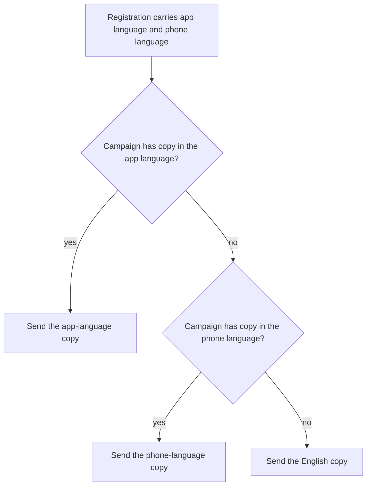
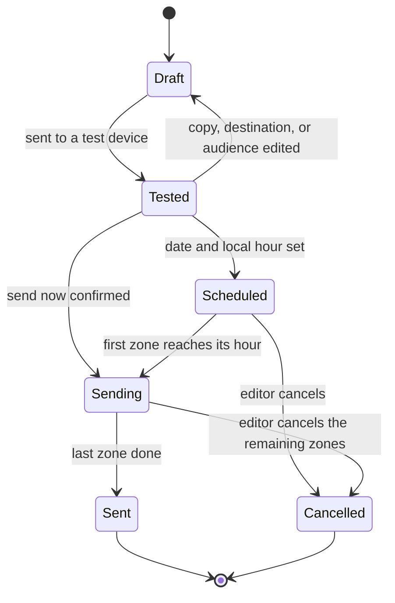
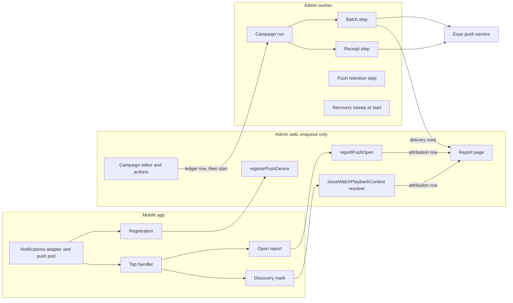
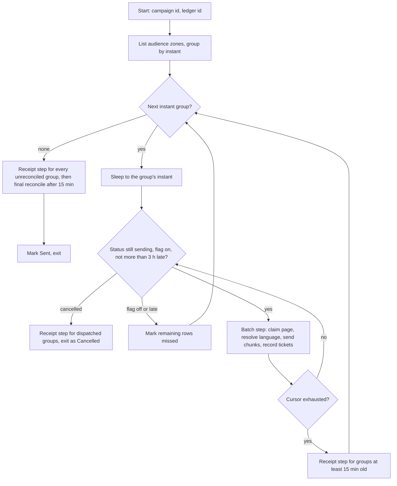
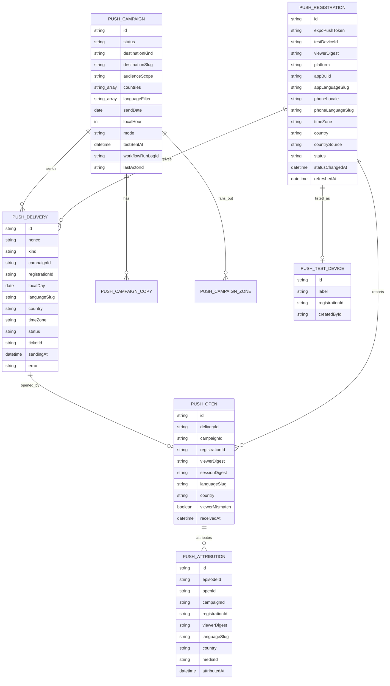

# Localized Push Campaigns - Plan

## Goal Capsule

- **Objective:** A viewer anywhere in the world receives an announcement from the ministry at a chosen hour of their own morning, in the language they watch in, and the ministry can see whether that announcement led to watching.
- **Means:** Admin owns the campaign, the audience, the local-hour wave, and the report; the app registers a push token and opens a destination on tap (KTD2, KTD4, KTD9).
- **Product authority:** This plan covers the whole feature across admin and the mobile app. No other plan is active for it. The Product Contract wins on behavior; the Planning Contract wins on mechanism within it.
- **Execution profile:** Durable, Deep. Admin ships first with the push flag off, the app build second, the first internal campaign third, and the first real campaign is a one-country wave. Nothing sends until a test send has reached a test device.
- **Open blockers:** Apple and Google push credentials must be provisioned in EAS before any device test, and that needs Apple team admin access. The translation workflow is undecided and is carried as a stated assumption; see Dependencies and Assumptions.
- **Stop conditions:** Stop and ask when a settled decision cannot work as written, when the Cloudflare country header proves unavailable on admin's hostname, when the worker's deploy record shows no config file, or when the production entitlement cannot be verified before the first device test.
- **Who finishes:** `ce-work` implements the units in order; the owner runs the credentials steps, the device pass, and the first internal campaign.

---

## Product Contract

### Summary

Admin gains an announcement campaign. A person writes a title and a body per language with English required, picks a destination in the catalog, picks countries or everywhere, and picks a date and a local hour or sends now. The mobile app registers its push token with the viewer's app language, phone language, time zone, and country, and opens the destination when the viewer taps. Admin sends each time-zone group at its hour, records delivery and opens, and reports attributed watch starts per campaign by language and country. The app half extends the existing reminder seam; admin extends its durable-workflow, fleet-mutation, and dashboard patterns and keeps campaign data in tables it owns.

### Problem Frame

Viewers are told nothing today. When a new series ships or a seasonal moment arrives, the app has no channel to the people most likely to watch, so the moment passes in silence. The install base is expected to be global, and most of it watches outside English. An announcement written once in English would exclude those viewers or reach them in a language they do not read. The ministry also cannot tell whether an announcement led to watching, so it cannot learn which campaigns work.

The app already asks for notification permission for lapse reminders, so a share of the install base is reachable the day a send path exists. Nothing on the server can send to it.

### Key Decisions

- **Forge owns the campaign end to end.** Admin holds copy, audience, timing, sending, and the report; no vendor console and no second notification SDK in the app. Governs R6, R7, R8, R9, R10, R11, R16, R17, R18, R19, R25. (session-settled: user-directed - chosen over the Firebase console and a hosted campaign console: one form per campaign and a report that joins to watch data inside admin; the console needs one notification per language and reports outside admin.)
- **The app language wins, then the phone language, then English.** Governs R13. (session-settled: user-approved - chosen over the phone language alone: a viewer who keeps an English phone but watches in their heart language hears their language.)
- **Countries choose who; languages choose the words.** Governs R8, R12. (session-settled: user-approved - chosen over requiring both a listed country and a listed language: a viewer in a listed country with an unlisted language still hears, in English.)
- **Time follows the phone.** Each phone reports its time zone, and the editor picks one local hour per campaign. Governs R2, R9, R16. (session-settled: user-approved - chosen over one representative time zone per country: correct in multi-zone countries, and admin has no country-to-time-zone table.)
- **Wave by default, plus an explicit "send now everywhere".** Governs R17. (session-settled: user-directed - chosen over wave-only: urgent announcements stay possible, and the immediate mode sits behind a confirmation so nobody picks it by accident.)
- **One shared permission grant.** The grant the lapse reminders obtain covers announcements; there is no separate opt-in and no in-app switch. Governs R1, R5. (session-settled: user-approved - chosen over a separate announcements opt-in: every install already granted is reachable on day one.)
- **Tap-attributed watching, read in admin.** A watch start that follows an open is attributed in admin by the viewer's identity and the server's receipt time. Governs R23, R24, R25, R27. (session-settled: user-approved - chosen over Datadog dashboards and over a holdout lift study: it joins to watch data with no third system; lift is later work.)
- **The China Android gap is accepted and shown.** Governs R26. (session-settled: user-approved - chosen over a China Android push provider in the first build: that is a second SDK and vendor onboarding before anything ships.)
- **The app models destinations, not campaigns.** A notification carries a destination kind and slug plus an opaque campaign identifier, so a new server-side notification type needs no app release. Governs R7, R20, R21, R23, R30.
- **One announcement per phone per local day.** The campaign that claims the phone first wins. Governs R15.
- **A test send precedes every real send.** A test phone is any phone whose notification test ID, shown on the app's Profile screen, an admin user has added to the test-device list. Governs R10, R31. (session-settled: user-approved - chosen over designating test phones by a signed-in email allowlist: keeps registration anonymous and needs no sign-in.)
- **A campaign freezes when sending starts.** Cancel is allowed; edit is not. Governs R11.
- **Any signed-in admin user may create, test, schedule, and send.** The same person completes the send-now confirmation. Governs R28. (session-settled: user-approved - chosen over a restricted campaign role and over a second-person confirmation for send now: the smallest build, and it fits the one-editor assumption.)
- **Country is where the phone registered from.** The phone's region setting is the fallback, and the value is a best-effort label because the raw origin is reachable without the edge. Governs R14.
- **An unpublished destination opens that route's own not-found screen.** The home-plus-message fallback is reserved for an unknown or malformed destination, which needs no network. Governs R21, R30. (session-settled: user-approved - chosen over checking the catalog before every tap: a check would delay each cold tap, and the routes already render a not-found state.)
- **A revoked permission takes a phone out of the audience.** Governs R29.

The language rule in words is one decision; this is its shape:

<!-- ce-section: work-relationships -->

### How This Work Fits Together

This plan covers **localized push campaigns** as one unit: registration and tap routing in the app, and campaign, sending, and reporting in admin. The relationships below are the current understanding, not a committed roadmap.

- **Mobile lapse reminders** (`docs/roadmap/platform/feat-519-mobile-lapse-reminders.md`, shipped)
  - `Shares` the permission prompt, the single notifications adapter, and the tap handler with this plan.
  - `Enables` this plan: the permission grant it obtains is the audience on day one.
  - `Changes` in this plan: reminder cleanup dismisses only its own two notifications, so announcements survive in the tray.
- **Recommendation acquisition attribution** (`docs/roadmap/content-discovery/feat-374-recommendation-acquisition-share-attribution.md`, not started)
  - `Shares` the acquisition discovery source and the opaque campaign identifier with this plan.
  - `Still to decide`: which plan lands the identifier shape first; the other adopts it.
- **App-wide string localization** (in progress on a branch)
  - `Shares` the one English copy constant for the unresolvable-destination message.
  - `Can proceed independently of` this plan.
- **Admin origin exposure** (`todos/021-pending-p1-admin-origin-bypass-blocks-fleet-search-enforce.md`)
  - `Bounds` this plan: until the raw origin is closed, the per-operation ceilings in KTD7 are the only bound on registration and open floods.
- **China Android push provider** and **holdout lift measurement**
  - `Depends on` this plan. Both are later candidates, not scope.

### Actors

- A1. **Viewer**: anonymous per install, identified by the existing per-install viewer identity; may also be signed in.
- A2. **Editor**: any signed-in admin user who writes, tests, schedules, and sends campaigns.
- A3. **Mobile app**: registers the token, presents the notification, opens the destination, reports the open.
- A4. **Admin**: stores registrations and campaigns, resolves audience and language, sends the waves, and reports.
- A5. **Push delivery service**: Expo's push service in front of Apple and Google. External; named so its boundary is explicit.

### Requirements

**Registration**

- R1. The app registers a push token whenever notification permission is granted, without a new prompt, including for installs that granted permission before this work shipped.
- R2. A registration carries the viewer's app language, the phone language, the phone's time zone, the platform, the app build, and the existing per-install viewer identity when one is available.
- R3. The app re-registers when the token, the app language, the phone language, the time zone, the app build, or the viewer identity changes, and refreshes the registration periodically so admin can tell a live install from an abandoned one.
- R4. A failed registration never blocks app start and never shows the viewer an error.
- R5. The app performs no first registration when notification permission is absent or denied.
- R29. When a registered install's permission is later found revoked, the app reports that once, and admin drops the phone from every later audience.

**Campaign authoring**

- R6. An editor creates a campaign with a title and a body per language; English is required and every other language is optional.
- R7. A campaign names one destination from the catalog: a video, a series, or an experience.
- R8. A campaign has an audience: everywhere, or a chosen set of countries, with an optional language filter.
- R9. A scheduled campaign has a send date and one local hour, default 09:00.
- R10. An editor cannot schedule a campaign or send it now until they have sent it to at least one phone on the test-device list.
- R11. Once sending starts, the campaign's copy, destination, and audience are fixed; the editor can cancel the waves that have not started, but cannot edit.
- R31. An admin user maintains the test-device list by pasting a phone's notification test ID with a label, and the app shows that ID on its Profile screen; the ID is a separate identifier and never the push token.

**Audience and language**

- R12. The audience is every registered phone whose country is in the campaign's countries, or every registered phone for everywhere, narrowed to phones whose app language or phone language is in the language filter when one is set.
- R13. Each phone receives copy in the first of these that the campaign has: the app language, the phone language, English.
- R14. A phone's country is the country it registered from, refreshed at each re-registration; the phone's region setting is the fallback when the request carries no country.
- R15. A phone receives at most one announcement per local day; when two campaigns fall on the same local day for one phone, the campaign that claims the phone first wins and the other counts that phone as suppressed.

**Timing and sending**

- R16. A scheduled campaign reaches each phone at the chosen hour in that phone's own time zone, as a wave across zones.
- R17. "Send now everywhere" delivers to the whole audience at once, ignoring the local hour, and only after a confirmation step that is separate from scheduling.
- R18. Sending survives a worker restart without a duplicate send to any phone.
- R19. Admin records, per phone and campaign, whether the send was accepted, handed off by the provider, or failed, and retires a token that the provider reports as invalid.

**Tap and navigation**

- R20. A tapped notification opens the destination it names, both when the tap launches the app and when the app is already running.
- R21. When the destination kind is unknown or the payload is malformed, the app opens home and shows a short message held in one named copy constant; never a crash and never a silent no-op.
- R30. When the destination no longer exists, the app opens the destination route and that route's existing not-found screen stands; never a crash and never a silent no-op.
- R22. A remote notification that arrives in the foreground shows a banner; a local reminder continues to show nothing.
- R23. The app reports each open with its campaign identifier, carried as an opaque string the app never interprets.

**Attribution and reporting**

- R24. A playback by the same viewer that starts within the attribution window after an open is attributed to the campaign of the most recent open before it.
- R25. The campaign report shows audience, accepted, handed off, failed, opened, attributed watch starts, suppressed, unreachable, and missed, each split by language and by country.
- R26. The report shows how many audience phones no transport can reach, including Android phones in countries where Google's service does not deliver.
- R27. Every count in the report is of registered phones, never of installs.
  - Refined 2026-09-22 (review finding #22): every count is of devices, and one device is one app install. The counted identity is the delivery's registration. A purged registration still counts once, through the row that reached the device. One viewer who reads on a phone and on a tablet therefore counts twice.

**Access**

- R28. Any signed-in admin user may create, test, schedule, and send a campaign, and the same person completes the send-now confirmation.

### Key Flows

- F1. **Token registration**
  - **Trigger:** Notification permission is granted, or the app starts with permission already granted, or one of the R3 values changed.
  - **Actors:** A3, A4
  - **Steps:** The app obtains a push token, reads the app language, the phone language, and the time zone, and sends them with the viewer identity, platform, and build. Admin stamps the country of the request and stores the registration. A failure is recorded and retried on a later start.
  - **Covers R1, R2, R3, R4, R5, R14, R29**

- F2. **Author, test, and schedule a campaign**
  - **Trigger:** An editor opens a new campaign.
  - **Actors:** A2, A4
  - **Steps:** The editor enters English and any other languages, picks the destination, picks the audience, and sends the campaign to a test device. Once that send succeeds, the editor sets a date and local hour and schedules, or chooses send now and confirms.
  - **Covers R6, R7, R8, R9, R10, R11, R17, R31**

- F3. **The wave**
  - **Trigger:** The first time zone in the audience reaches the campaign's local hour on the send date.
  - **Actors:** A4, A5, A1
  - **Steps:** For each zone as it reaches the hour, admin resolves the audience, skips phones already served an announcement that local day, resolves each phone's language, sends, and records the outcome per phone. Invalid tokens are retired. The wave completes when the last zone is done.
  - **Covers R12, R13, R15, R16, R18, R19**

- F4. **Tap to a destination**
  - **Trigger:** A1 taps an announcement, launching the app or returning to it.
  - **Actors:** A1, A3, A4
  - **Steps:** The app reads the destination kind and slug, reports the open with the campaign identifier, and opens the matching screen. An unknown kind or a malformed payload opens home with the unresolvable-destination message; a destination that no longer exists shows the route's not-found screen.
  - **Covers R20, R21, R22, R23, R30**

- F5. **From open to report**
  - **Trigger:** An open is recorded, or a playback starts after one.
  - **Actors:** A4
  - **Steps:** A playback that starts within the attribution window after an open is attributed to the most recent open. The campaign report aggregates audience, accepted, handed off, failed, opened, attributed watch starts, suppressed, unreachable, and missed, split by language and country.
  - **Covers R24, R25, R26, R27**

### Acceptance Examples

- AE1. **Covers R1.** Given an install that granted notification permission for reminders before this work shipped, when the viewer opens the updated app, then a push token is registered without any new prompt.
- AE2. **Covers R5.** Given a viewer who denied notification permission, when the app starts, then no token is registered and no registration request is made.
- AE3. **Covers R3.** Given a registered phone whose viewer switches the app language to Arabic, when the app next starts, then the registration is refreshed with Arabic as the app language.
- AE4. **Covers R13.** Given a phone with app language Arabic and phone language English, and a campaign with Arabic and English copy, when the phone is sent the campaign, then it shows the Arabic copy.
- AE5. **Covers R13.** Given a phone with app language Kurmanji and phone language French, and a campaign with French and English copy but no Kurmanji, when the phone is sent the campaign, then it shows the French copy.
- AE6. **Covers R13.** Given a phone with app language Kurmanji and phone language Kurmanji, and a campaign with French and English copy, when the phone is sent the campaign, then it shows the English copy.
- AE7. **Covers R12.** Given a campaign for Saudi Arabia with a language filter of Arabic, when the audience is resolved, then a phone in Saudi Arabia whose app language and phone language are both English is not in the audience, and a phone in Saudi Arabia whose app language is Arabic is.
- AE8. **Covers R15.** Given two campaigns that reach one phone on the same local day, when the second campaign tries to claim the phone, then the phone receives only the first campaign, and the second campaign's report counts the phone as suppressed.
- AE9. **Covers R16.** Given a campaign at 09:00 with one phone in Riyadh and one in Paris, when the send date arrives, then each phone receives it at 09:00 in its own zone, two hours apart.
- AE10. **Covers R17.** Given an editor who chooses send now everywhere, when they have not completed the confirmation step, then nothing is sent; and when they complete it, then the whole audience is sent at once regardless of local hour.
- AE11. **Covers R10.** Given a campaign that has not been sent to a test device, when the editor tries to schedule it or send it now, then the action is refused with the reason.
- AE12. **Covers R11.** Given a campaign whose first zone has been sent, when the editor tries to change its body, then the change is refused; and when the editor cancels, then zones not yet started are not sent.
- AE13. **Covers R20, R30.** Given a campaign naming a series slug, when the viewer taps it with the app closed, then the app launches into that series; when the app is already running, the same tap opens the same series; and when the series has been unpublished, then the series route shows its not-found screen.
- AE14. **Covers R21.** Given a notification with a destination kind the app does not know, when the viewer taps it, then the app opens home and shows the unresolvable-destination message.
- AE15. **Covers R22.** Given the app in the foreground, when an announcement arrives, then a banner is shown; and when a lapse reminder fires in the same state, then nothing is shown.
- AE16. **Covers R24.** Given a viewer who opens an announcement and starts the named video within the attribution window, when the report is read, then that watch start is attributed to the campaign; and given a watch start after the window, then it is not.
- AE17. **Covers R26.** Given a campaign for China with registered Android phones there, when the report is read, then those phones appear in the unreachable count and not in accepted.
- AE18. **Covers R18.** Given the worker restarts while a wave is in progress, when it resumes, then no phone in the audience is sent twice.
- AE19. **Covers R4.** Given the registration request fails, when the app starts, then the viewer reaches the home screen normally and sees nothing unusual.
- AE20. **Covers R29.** Given a registered phone whose viewer turns notifications off in the phone's settings, when the app next starts, then the app reports the revocation and the phone is absent from the next campaign's audience.
- AE21. **Covers R22.** Given a viewer who watches a new video after an announcement arrived and before they tapped it, when the reminders re-schedule, then the announcement is still in the tray.

### Success Criteria

- A campaign written in three languages and sent everywhere reaches test devices set to each of those languages, plus one set to a fourth, at the chosen hour in each phone's zone, and the fourth phone shows English.
- Opens and the watch starts that follow appear on the campaign report during the wave, split by language and country, with no third system involved.
- The lapse-reminder behaviour a viewer can see is unchanged: the same prompt, the same silent foreground, the same reminder routing.
- A new campaign never needs an app store release.

### Scope Boundaries

Deferred for later:

- Translator roles, per-language assignment, and an approval workflow; one editor enters every language for now.
- Machine translation of campaign copy.
- A China Android push provider.
- Holdout lift measurement.
- Images or rich media in notifications, and an in-app inbox or notification centre.
- Recurring campaigns, and per-viewer personalized notifications.
- Web and TV notifications.
- A viewer-facing announcements switch; the OS-level control is the only control.

#### Deferred to Follow-Up Work

- Per-language editorial preview in the campaign form; the test send exercises real rendering for now.
- Late-send recovery: a zone recorded as missed after an outage is not re-sent by this plan.
- Adopting the feat-374 campaign identifier shape on the recommendation side once that work lands.
- A push-specific keyed hash in place of the recommendation viewer digest on push rows; the digest cannot act as the viewer without the raw token, so the first build stores it plainly.
- A second worker replica; the process-wide send rate bucket in KTD15 holds only for one replica.

### Dependencies and Assumptions

- Push credentials, an Apple auth key and a Google FCM v1 service account, must be configured in EAS before any device test. This needs Apple team admin access and blocks all verification. Android registration also needs the Firebase app config file referenced from the app config, which is a fingerprint input.
- Push does not work in Expo Go, and iOS registration is trustworthy only on a physical device.
- The editorial process is assumed to be one editor entering every language into one form. Confirm before roles or review states are added.
- The country stamp relies on Cloudflare adding its country header to each request. The web app already reads that header, so the zone setting is on; admin's hostname must be confirmed to sit in the same zone. Admin reads only the connecting-IP header today.
- The raw Railway origin is reachable without the edge, so a caller who bypasses the edge can set any country and skips the edge rate limits. Country selects targeting, not access, so this is acceptable; the write ceilings in KTD7 are the only bound on floods until the origin is closed.
- The attribution window is 24 hours from the open, and attribution continues for viewers who opted out of personalization, because the analytics policy separates product analytics from personalization.
- The playback store's acquisition discovery source already carries a campaign handoff, and the source list is validated on the server. Attribution is materialized in a push-owned table with no foreign key to the episode, so the recommendation tables do not change.
- A Jest guard fails when any file other than the existing notifications adapter imports the notifications module, so registration, the foreground branch, and the dismiss change land inside that adapter, and the guard's pinned call set and pinned plugin options are updated in the same change.
- App language, phone language, and time zone are readable in the app without a new dependency: the app language from the persisted watch preference, the other two from the standard locale API. The engine caches the time zone per launch, so a zone change lands on the next start.
- The workflow runtime is `workflow` 4.2 with `@workflow/world-postgres` pinned at 4.1.1 and patched; the patch gates job consumption on the worker flag and is re-evaluated on any upgrade. The worker's queue concurrency is not recorded for production and is set before the flag flips (KTD15).
- The size of the install base is unknown. The first real campaign is a one-country wave, and a synthetic dry run against a stub transport is the load test before it.
- The video database backup fires at 09:00 UTC daily, the same minute the UTC+0 zone group dispatches for a 09:00 campaign; both run on the worker and the concurrency setting keeps both moving.
- JS-only follow-ups after the native build (registration client, tap routing, copy constant, the kill-switch constant) reach only installs on the new runtime version, and an update that reaches nobody still exits cleanly.
- The unresolvable-destination message ships in English as one named constant so the localization work can adopt it.

### Outstanding Questions

**Deferred to planning**

- Whether campaign destinations reuse the existing deep-link scheme or arrive only through the notification payload.
- Whether an announcement tap counts as a session start for the lapse-reminder clock.
- The attribution window length, if 24 hours proves wrong.
- Whether the entitlement plugin needs the production mode set globally, decided by reading the first production archive.

### Sources and Research

- `docs/roadmap/platform/feat-519-mobile-lapse-reminders.md` and `docs/plans/2026-09-16-1101-feat-mobile-lapse-reminders-plan.md`: the local-notification work this plan builds on; both name server push as a non-goal of that work.
- `apps/mobile/src/lib/lapseReminders/notificationsAdapter.ts`: the only file that imports the notifications module; it sets the handler that hides all foreground display and dismisses every notification on cleanup.
- `apps/mobile/src/lib/lapseReminders/lifecycle.ts`: the pass that reads permission on every launch and foreground change; the registration seam hangs off it.
- `apps/mobile/src/lib/lapseReminders/permissionPrompt.ts`: the once-per-install permission prompt.
- `apps/mobile/src/lib/lapseReminders/tapHandler.ts`: cold-start and warm-tap routing with a three-second cold deadline.
- `apps/mobile/src/lib/__tests__/lapseReminderWiring.guard.test.js`, `notificationsEntryPoint.guard.test.js`, and `appJsonNotifications.guard.test.js`: enforce the single adapter seam, the exact adapter call set, and the plugin options.
- `apps/mobile/src/lib/resolveDefaultLanguage.ts`: reads the persisted app language preference, keyed by language slug, and already uses the standard locale API.
- `apps/mobile/src/lib/recommendations/playbackDiscovery.ts`: the discovery source list; the acquisition source carries a campaign handoff.
- `apps/mobile/src/lib/recommendations/playbackRecorder.ts` and `apps/mobile/src/lib/recommendations/viewerIdentityClient.ts`: how playback reaches admin under the anonymous per-install identity, and how that identity survives an iOS reinstall but not an Android one.
- `apps/admin/src/graphql/mutations/recommendation-evidence.ts`: validates the discovery source on the server; the issuance resolver is where attribution hooks in.
- `apps/admin/src/services/recommendations/caller.ts` and `viewer-identity.service.ts`: fleet admission rejects a bearer without a verified viewer handle, which is why push defines its own admission predicate.
- `apps/admin/prisma/schema.prisma`: the playback episode with its discovery source and provenance; Country, CountryLanguage, Language, and LanguageFallback reference data; ExperienceLocale as the per-language authoring precedent. Country carries no time zone.
- `apps/admin/src/workflows/recommendationRetention.ts`, `apps/admin/src/instrumentation.ts`, and `apps/admin/railway.worker.toml`: the durable scheduler pattern, the recovery hooks at worker start, and the dedicated worker.
- `apps/admin/src/workflows/transcriptEmbeddingBackfill.ts`: the step runtime budget precedent (220 seconds under the 300-second boundary).
- `apps/admin/src/auth/rate-limit.ts` and `apps/admin/src/graphql/plugins/rate-limit.ts`: the per-install identity and the per-field mutation counters.
- `apps/web/src/lib/search-language-actions.ts`: reads the edge's country header today, which proves the zone setting.
- `docs/solutions/database-issues/db-lock-must-be-atomic-update-not-select-for-update.md`, `docs/solutions/database-issues/selection-attribution-receipt-ordering-race-20260916.md`: the claim and ordering rules KTD3 and KTD8 follow.
- `docs/solutions/workflow-issues/bound-durable-workflow-step-payloads-before-persistence.md`, `docs/solutions/workflow-issues/budget-durable-workflow-steps-by-projected-runtime.md`, `docs/solutions/runtime-errors/useworkflow-nested-group-step-event-log-corruption.md`: the step shape rules the send loop follows.
- `docs/solutions/deployment/railway-dashboard-override-shadows-railway-toml-20260429.md` and `docs/solutions/runtime-errors/required-env-var-without-default-broke-railway-deploy-20260511.md`: the rollout proofs in Operational Notes.
- `docs/roadmap/content-discovery/feat-374-recommendation-acquisition-share-attribution.md`: plans opaque campaign identifiers on the acquisition attribution path.
- `CONCEPTS.md`, Language: a Language is identified by its slug; the BCP-47 tag is a locale label and is not unique.
- Firebase documentation and issue history consulted for the console comparison: [Send messages with the Firebase console](https://firebase.google.com/docs/cloud-messaging/ios/send-with-console?hl=en), [Recipient time zone scheduling on iOS](https://github.com/firebase/flutterfire/issues/13185), [Understanding message delivery](https://firebase.google.com/docs/cloud-messaging/understand-delivery).
- Expo push documentation for the transport limits: [Sending notifications](https://docs.expo.dev/push-notifications/sending-notifications/), [expo-server-sdk-node](https://github.com/expo/expo-server-sdk-node).

---

## Planning Contract

**Product Contract preservation:** changed, no scope change: R3 and R5 kept their intent, the revocation report moved to the new R29, and R3 gained the identity re-issue trigger and the periodic refresh; R12 filters on declared languages instead of the resolved copy; R15 names the first claim as the winner; R19 and R25 say "handed off" where the origin said "delivered", because provider receipts do not prove display; R21 kept the home-plus-message rule for an unknown or malformed destination and the unpublished case moved to the new R30; R24 attributes by viewer identity and the most recent open; R10 and the new R31 name the test-device list, and R31 states the test ID is never the token. Every `Governs`, `Covers`, and AE citation was re-pointed. The Dependencies section was corrected against the code: the import rule is a Jest guard, the workflow world is pinned and patched, the country stamp is best-effort, and Android needs the Firebase app config file.

### Key Technical Decisions

- KTD1. **Transport is Expo's push service through `expo-server-sdk`, on the worker only.** One token type covers Apple and Google; the client chunks sends at 100 per request; a dead-token ticket retires the token in the same step, and receipts are fetched by caller-made chunks of 1000 ids. The Expo project requires an access token on every send, the worker reads it from an optional env var, and the transport refuses to construct in production without it with a typed configuration error, so boot never fails but no unauthenticated send is possible. The access token is a Railway variable on the worker service only, never in the shared Doppler config; admin web refuses to boot with it injected and the worker's build and pre-deploy commands unset it, following the Typesense operator-key recipe. Every provider request runs under an explicit deadline. The delivery error column and every push log line record only the provider's error code plus an admin-owned classification, never the provider's message string, because the dead-token message embeds the push token. Governs R16, R18, R19.
- KTD2. **One bounded workflow run per campaign.** Scheduling a campaign, or confirming send now, creates a ledger row with the actor id, starts one run with the campaign id and ledger id, and attaches the runtime run id; the campaign stays scheduled until the first zone step moves it to sending. The run groups zones by their absolute instant, sleeps to each instant in order, dispatches that group in bounded batches, reconciles receipts, and exits after the last group. Send now is the same run with one immediate group; a test send is the same run with the test-device registrations as its audience and no daily claim. A failed start reverts the campaign to tested with the error on the row. Cancel updates the campaign status, then emits the runtime's cancel event best-effort, and the run exits through the receipt step for every group already dispatched. A recovery sweep at worker start marks the pending zones of any scheduled or sending campaign whose run is not alive as missed. Governs R10, R16, R17, R18. (session-settled: user-approved - chosen over one long-lived scheduler loop that scans for due campaigns: a run lives about a day, cancel resolves through the ledger, and no eternal run stays pinned to old code.)
- KTD3. **Every claim is one statement, one statement per page, and the send set is status-driven.** The per-phone daily claim is one multi-row insert per page with conflict-do-nothing and no conflict target, under a partial unique index on registration and local day whose predicate lists the statuses under which the phone may have been reached: reserved, sending, accepted, handed off, unknown. Rows absent after the insert lost the day and get a suppressed row keyed by campaign and registration. Immediately before each provider call of 100, one conditional update moves exactly those rows from reserved to sending, returning them, and only while the campaign is still sending; a replay with any cursor therefore resends only rows still reserved. A rate-limit or pre-socket failure reverts the chunk to reserved in the same catch; a failure after the request left leaves the chunk at sending, so loss is accepted and duplication is not. Each campaign status transition and each zone claim is an update with the expected prior status in the where clause, and the affected-row count is the race discriminator. Before every page the batch step re-reads the campaign status, the push flag, and the zone's lateness. Governs R11, R15, R18.
- KTD4. **Push owns its own tables, and identity events unlink rather than delete.** Registration, campaign, campaign copy, campaign zone, delivery, open, attribution, and test device are new tables; the recommendation tables do not change. A registration is unique by push token, carries the recommendation viewer token digest when present, and stores the derived phone language slug and the country source. A phone is the viewer digest when present, else the registration id; on registration a new token for the same viewer digest and platform supersedes the old row, and the audience reads active rows only. A registration retires only on revocation, a provider invalid ticket, supersession, or 180 days without a refresh; invalid is terminal for 90 days and a re-registration of an invalid token is refused in that window, after which retired rows of any status are deleted, 90 days from their status change. A viewer erasure and a viewer expiry null the registration's digest and delete that digest's open and attribution rows at once; a consent withdrawal leaves push rows untouched, because attribution is product analytics, not personalization; nothing deletes a registration on an identity event. A delivery row carries a kind, test or live; only live rows are unique per campaign and registration, sit under the daily-claim index, and count in the report, so a test send never blocks the live send to a test phone. Delivery, open, and attribution rows carry snapshot columns for language, country, and time zone at claim time, and are purged after 90 days in bounded batches by a push-owned retention step with its own ledger key and advisory lock. Governs R2, R19, R24, R27, R29. (session-settled: user-approved - chosen over unbounded retention: per-phone rows are personal data.)
  - Refined 2026-09-22 (review finding #22): a registration row is one device, which is one app install, not one viewer. The app mints an install id once and keeps it. Supersession is keyed on that install id and the platform, so a token rotation on the same install retires the older row. Another device of the same viewer stays active, and a viewer's several devices all receive the announcement. A superseded token that registers again with permission granted becomes active. Every count is of devices.
- KTD5. **Language resolution runs on the server and matches exactly.** Copy is keyed by language slug. The app language slug matches first; then the phone's BCP-47 tag matches a Language by exact tag, then by its language subtag alone, because phones report region-qualified tags such as `fr-FR` while the Language table stores bare tags, and when several Languages share the matched tag the one with authored copy wins; then English. No tag is reduced beyond its language subtag, and no prefix scan runs. The registration's derived phone language slug uses the same rungs. Copy is validated per language at 50 characters for the title and 120 for the body, and the whole message at 4 KiB before send. Governs R6, R13.
- KTD6. **Country comes from the edge's own country header alone.** The web reader also accepts client-settable country headers ahead of it, so admin reads only the edge header for the edge source. Unknown values and an absent header fall to the region subtag of the phone's locale tag, then to null. The registration stores which source supplied the value, and the registration log line carries it so the edge proof needs no database access. Governs R14.
- KTD7. **Registration and open reports are fleet write paths with their own admission predicate.** Two public mutations require the consumer bearer, accept the fleet principal, and take an optional viewer handle that is verified when present and never degrades to anonymous when invalid; the predicate lives in the push services, not in the recommendation caller check. Both join the public-resolver manifest, share the per-install rate identity with separate per-field counters, validate the push token against Expo's token shape, and sit behind per-operation global ceilings keyed on the fleet key id, each with an optional per-minute value where zero disables it and one optional enforce flag covering both operations, alert-first until that flag is on. The app adds their operation names to the fleet-bearer allowlist and defers an open report on a rate limit instead of retrying. Governs R1, R2, R4, R23, R29.
- KTD8. **Attribution is materialized in the issuance resolver, order-independently.** The open receipt stores the delivery nonce (KTD14), the campaign, the registration, the viewer digest, the session digest, the server receipt time, and snapshot columns. In the playback-context issuance resolver, after the context is issued for a fleet caller, admin looks up opens for the same viewer digest, then the same session digest, within the window, picks the most recent, and inserts one attribution row unique on the episode id with no foreign key to the episode; the row denormalizes campaign, registration, viewer digest, language, country, media id, and time. The open-report mutation performs the same join in the other direction for episodes issued after the delivery's sending time and no earlier than 60 seconds before the open's receipt, so whichever of the open and the context lands second attributes, and a playback that began before the tap does not. An attributed watch start therefore means a playback context issued by the fleet client, whose recorder claims in the same flow. The app also marks the acquisition discovery source with the nonce for video destinations as a direct-handoff bonus. Governs R23, R24.
- KTD9. **Everything the app does with notifications stays inside the existing adapter, behind a fourth narrow port.** The adapter gains a push port that reads the token, subscribes to token rotation, and ensures the announcements channel, consumed only by the registration module; the foreground handler branches on the remote trigger type; reminder cleanup dismisses by identifier. The push token read needs the EAS project id through one more import in that file, which the entry-point guard admits. The rotation subscription is owned by the provider's lifetime, never module scope. Announcements get their own payload contract and parser next to the reminder one, and the provider's tap handler dispatches by payload family. Registration hangs off an injected permission-read hook inside the lifecycle pass, so it never performs a second permission read. Governs R1, R3, R20, R21, R22, R30.
- KTD10. **The campaign UI follows the dashboard's server-component and server-action shape.** A campaigns list, an editor with per-language copy rows and a catalog picker, the test-device list, and a per-campaign report page, all behind a new permission key granted at the viewer tier. The send-now confirmation shows the resolved audience count and the country list, its copy names the consequence that some viewers receive it in the middle of their night, and the editor confirms by typing that exact audience count. A cancel action for scheduled and sending campaigns sits behind the same confirmation shape. The list page has a new-campaign action that creates a draft and an empty state pointing at it; the editor shows a status badge with freeze copy once a campaign leaves draft, a remove control on every non-English copy row, the per-device outcome of the last test send, and a not-started placeholder on the report tab before the first group dispatches; the test-device page has a remove action and rejects a duplicate ID naming the existing label. Every transition records the actor id, and schedule and send now emit a plain-string log event with actor, campaign, and audience count. The report re-aggregates on refresh in every status, and the aggregate materialized at sent is only the cached default view, because opens and attributed watch starts keep arriving for a day after the last group. Governs R6, R7, R8, R9, R10, R25, R28, R31.
- KTD11. **A late zone is missed, not sent late.** When a zone group's instant is more than 3 hours past, at wake or before any later page, the remaining phones in that group are recorded as missed and the group ends. Missed rows never consume the phone's day. Governs R16, R25. (session-settled: user-approved - chosen over sending on resume: a 03:00 announcement after an outage is worse than none.)
- KTD12. **Two kill switches, each with a stated residual.** Admin refuses to schedule or send while its push flag is off, and every batch step re-reads the flag so a flip marks the remaining rows of the current group missed and ends the run as paused. The app skips first registration and refreshes while its zero-import constant is off, but still reports a revocation. Neither switch stops a chunk already inside the provider call, opens and attribution from notifications already delivered, or registrations from installs that have not fetched the update. Both flags are optional env-driven with a safe default and never join the boot-throw family.
- KTD13. **Reminders dismiss by identifier.** The reminder cleanup dismisses its two fixed notification identifiers instead of the whole tray. Governs R22.
- KTD14. **The campaign identifier in a payload is a per-delivery random nonce.** The nonce is 32 random bytes from the runtime's cryptographic generator, base64url encoded, following the experience preview-token precedent; it is generated when the delivery row is reserved, stored on it, and unique-indexed so the open lookup is an index hit. A test send reserves rows too. The open report carries the nonce, admin resolves it to the delivery, and the open table is unique on the delivery. An unknown nonce is counted in a log line and not stored. An open that carries no viewer handle binds to the delivery's registration and attributes through that registration's stored digest; the mismatch flag is set only when a handle is present and differs from that digest, and a mismatched open does not attribute. Row ids are never used as the identifier, because the default id shape is time-ordered and guessable. Governs R23, R24.
- KTD15. **Throughput and budgets are explicit defaults, tunable by optional env vars.** A process-wide bucket of 500 messages per second with provider concurrency 3 stays under the project limit of 600 per second, which the client's default concurrency would overrun. Pages are 5000 phones, the step budget is 220 seconds with a 40-second reserve before each chunk, the chunk deadline is 10 seconds, and the receipt step is paged at 10000 rows under the same budget. Receipts are fetched for every dispatched group at least 15 minutes old in dispatch order, and any group older than 20 hours is fetched first, because receipts expire at 24 hours and a wave lasts about 26. The worker's queue concurrency is recorded and set to at least 4 before the flag flips, and the push retention purge runs its own batch loop of 5000 rows. Every audience, delivery, and receipt read carries a page limit. Governs R16, R18, R19.

No bake-off was needed. The closest fork was the run shape in KTD2, and repo precedent plus the workflow SDK's versioning guidance settled it without further development.

### High-Level Technical Design

Components and their calls:

The campaign run:

Data model, new tables only:

Delivery row statuses split into claims, which may have reached the phone (reserved, sending, accepted, handed off, unknown), and report-only outcomes, which never did (failed, invalid, suppressed, unreachable, missed). Only the first set sits under the daily-claim index. A row moves to sending before the provider call and never back except on a pre-socket failure, so a crash between the call and the write leaves it unknown rather than resent. Registration statuses are active, inactive, invalid, and superseded.

### System-Wide Impact

| New code                          | Existing surface reached                                                                 | Containment                                                                                                                 |
| --------------------------------- | ---------------------------------------------------------------------------------------- | --------------------------------------------------------------------------------------------------------------------------- |
| Attribution hook (U5)             | The playback-context issuance resolver, called by web SSR and mobile                     | Runs only for fleet callers, after the episode write, in its own try with its own deadline; indexed lookups on both digests |
| Open-report reverse join (U5)     | Recent playback episodes                                                                 | Read-only lookup bounded to 10 minutes and the caller's own digests                                                         |
| Registration and open mutations   | The public-resolver manifest, the per-install rate identity, the fleet bearer allowlist  | Own admission predicate, per-field counters, token-shape validation, global ceiling                                         |
| Push retention step (U1)          | The recommendation retention scheduler loop                                              | Own step, own ledger key, own advisory lock, own batch loop; a push failure never retries the privacy purge                 |
| Viewer erasure hook (U1)          | The recommendation viewer transition service                                             | Unlinks digests and deletes push rows for that digest; never deletes a registration                                         |
| Campaign run and recovery sweep   | The worker's queue concurrency, the other schedulers, the workflows dashboard and ledger | One run per campaign, budgeted steps, concurrency recorded and set, ledger row per run                                      |
| Lifecycle pass hook (U7)          | The lapse-reminder pass and its outcome vocabulary                                       | Injected hook fired inside the pass chain; tap and pass outcome sets grow but the sink name stays `telemetry`               |
| Dismiss by identifier (U8)        | Reminder cleanup                                                                         | Two identifier dismisses replace the tray-wide dismiss; the reminder guard test pins the new call                           |
| Fleet bearer allowlist (U7)       | Every mobile GraphQL request                                                             | Two operation names added; the header test pins the set                                                                     |
| Env schema (U4)                   | Admin web and worker boot                                                                | Every new var optional and mapped through the empty-string coercion; an unset-import test proves boot                       |
| App config and Firebase file (U7) | The EAS fingerprint and every later update                                               | One native build ships all fingerprint inputs; updates reach only the new runtime version                                   |

### Risks and Dependencies

- **Broadcast blast radius from a viewer-tier account.** A phished account can send free text to every install. Mitigation: actor id on every transition and ledger row, audience count and countries on the send-now confirmation, the flag re-read in every batch, and the cancel path (KTD10, KTD12, KTD3).
- **Forged opens and attribution.** A bearer holder could post opens for any campaign. Mitigation: the per-delivery nonce, uniqueness per delivery, and the viewer-mismatch flag (KTD14).
- **Audience inflation through registration floods.** Well-formed junk tokens inflate the audience and spend the provider budget. Mitigation: token-shape validation, the per-operation ceiling, terminal invalid, and registrations-per-day on the dashboard (KTD7, KTD4).
- **The test ID leaking the push token.** Mitigation: a separate random test ID, a test-device page that refuses token-shaped strings, and the project-level access-token requirement enabled before the first build that shows a test ID (KTD1, R31).
- **Credentials placement and rotation.** The Expo token is minted under a robot user with the lowest sending role and lives as a Railway variable on the worker service only, outside the shared Doppler config, with admin web refusing to boot when it is injected (KTD1); the Apple key and the Google service account live in EAS only, with a dedicated Google service account holding the messaging admin role alone; the Apple key is team-wide, so revoking it affects every app on the team; no token, access token, or digest is ever logged.
- **Replay resending a chunk.** Mitigation: the status-driven send set and the error-class rule in KTD3, with the crash-between-call-and-write test in U4.
- **Two rows for one phone after an iOS reinstall.** Mitigation: supersession by viewer digest and platform, and distinct-phone counting in the report (KTD4).
  - Refined 2026-09-22 (review finding #22): the mitigation is supersession by install id and platform, and distinct-device counting in the report. A reinstall mints a new install id, so it reads as a new device until the provider calls the old token invalid, or until that row goes 180 days without a refresh.
- **A routine viewer expiry wiping the audience.** Mitigation: identity events unlink and never delete (KTD4).
- **Attribution deflating as episodes purge at 29 days.** Mitigation: the soft link and denormalized attribution row (KTD8).
- **The open landing after the playback context.** Mitigation: the reverse join in the open-report mutation (KTD8).
- **A phone's zone changing between two campaigns on one day.** Mitigation: the 20-hour served-recently guard inside the claim, best-effort and covered by the unique index for the concurrent case (U3).
- **Self-inflicted rate limits losing messages.** Mitigation: the process-wide bucket and concurrency 3, single replica (KTD15).
- **Send now is not instant.** One million phones take about 28 minutes at the ceiling and produce a tap load on admin web that a wave never does. Mitigation: state the ceiling in the dashboard, and make the first real campaign a wave; a send-now above 250,000 phones is an operator risk on admin web.
- **Receipts expiring before a 26-hour wave ends.** Mitigation: per-group reconcile with the 20-hour force rule (KTD15).
- **A worker outage over 3 hours dropping the rest of a wave silently.** Mitigation: a heartbeat-stale alert gated on a live campaign, and the stale-worker state on the campaign page (Operational Notes).
- **The first real campaign as the first load test.** Mitigation: the synthetic 100,000-phone dry run against a stub transport before U9.
- **The per-launch mutation bucket exhausted by app switching or language browsing.** Mitigation: once-per-launch registration with a 2-second debounce, a payload hash, and no retry on a rate limit (U7).
- **Migration scope.** Migration 0099 creates push tables only and alters no existing table, so rollback is a code redeploy with no data restore; the migration safety test checks concurrent-index use only, so the scope invariant is asserted by review.
- **Rollback with registrations live.** Turn the flag off, cancel scheduled and sending campaigns, then roll back the worker; a run left asleep on a worker without the workflow fails on wake. Rolling admin back below U2 while the app build is live produces one failed registration per launch, which is bounded noise.

### Sequencing and Rollout

1. Merge the admin units with the push flag unset; both admin services redeploy and both run the migration. Proofs: both deploy records show a non-null config file, the first pre-deploy log applies migration 0099, `prisma migrate status` is clean, both health checks answer, the campaigns page renders for a viewer-tier session, and schedule is refused with the flag reason. Stop if the worker's record shows no config file.
2. Operator credentials per the table in Operational Notes, each with its proof recorded, including the Expo access-token requirement and the worker concurrency setting.
3. One batched Doppler write of the push env vars with the flag on, excluding the Expo access token, which is set as a Railway variable on the worker service alone; both services redeploy once; admin web still boots because the token never reaches it; schedule is now refused only by the missing-test-send reason.
4. Mobile: install from the lockfile at the root, confirm the fingerprint, build iOS and Android from the merged tree, read the entitlement from the iOS archive and set the plugin's production mode only if it reads development, submit iOS through the verified recipe, and write the Play internal-testing steps into U9 because none exist. Do not start the build until admin answers both mutations under the fleet bearer.
5. Device pass, the first internal campaign to the test-device list, then the first real campaign as a one-country wave. Only after its dead-token rate reads under 5 percent does an everywhere campaign go out.

### Operational Notes

Credentials and settings, each with a proof before the first campaign:

| Item                      | Owner                        | Where it lives                                                        | Proof                                                                                                                      |
| ------------------------- | ---------------------------- | --------------------------------------------------------------------- | -------------------------------------------------------------------------------------------------------------------------- |
| Apple auth key            | Owner, Apple Developer admin | EAS credentials, iOS                                                  | A push key is listed for the app id; one send from Expo's push tool reaches a TestFlight device                            |
| FCM v1 service account    | Firebase project owner       | EAS credentials, Android, plus the Firebase file in the app           | An Android device registers and returns an Expo token; one send from Expo's push tool arrives                              |
| Expo access token         | Expo organization owner      | Railway variable on the worker service only, never the Doppler config | Admin web refuses to boot with the token injected; a send without the token is refused by Expo; a send with it is accepted |
| Cloudflare IP Geolocation | Cloudflare zone admin        | Zone setting                                                          | The first two internal registrations log `country_source=edge`                                                             |
| Push env vars             | Owner                        | Doppler production config, one batched write                          | Both services boot, health answers, schedule refusal reason flips from flag to test send                                   |
| Worker queue concurrency  | Owner                        | Railway worker env                                                    | Recorded value at least 4                                                                                                  |
| Fleet bearer              | Already provisioned          | Admin fleet keys and the EAS production environment                   | Registration answers with the bearer and refuses without it                                                                |

What to watch on day one:

| Signal                | Source                                                                            | Check                                                                               |
| --------------------- | --------------------------------------------------------------------------------- | ----------------------------------------------------------------------------------- |
| Worker alive          | Workflows dashboard, workers section                                              | One row online, heartbeat under 45 seconds                                          |
| Campaign run state    | Ledger row linked from the campaign                                               | Running while asleep, succeeded after the last group, never failed                  |
| Per-group dispatch    | Worker log line `[push] event=zone_dispatched`                                    | One line per group at its hour                                                      |
| Provider retries      | `[push] event=provider_retry`                                                     | Present but bounded                                                                 |
| Provider auth failure | `[push] event=provider_auth_failed`                                               | Never                                                                               |
| Dead-token rate       | `[push] event=receipts_reconciled`                                                | Invalid under 5 percent of accepted                                                 |
| Missed groups         | `[push] event=zone_missed`                                                        | Never on the first campaign                                                         |
| Registrations         | `[push] event=register platform= country_source=` and the report's audience count | Grows after the build reaches testers; edge dominates                               |
| App side              | Mobile logs, events prefixed `push.`, sink named `telemetry`                      | Registration success on the test phones; the issuance error rate unchanged after U5 |

Alerts to add through the monitors-as-code directory in the same change as U4, each a five-minute log count on the admin service: provider auth failure at one or more, missed group at one or more, dispatch start failure at one or more, and heartbeat stale while any campaign is scheduled or sending. Precondition: confirm admin logs arrive in Datadog first.

First internal campaign, go or no-go: author copy in three languages with a series destination and audience everywhere; the test send shows each phone its app-language copy; schedule for the next whole hour in the phones' zone; the ledger row is running and asleep; at the hour one dispatch line appears and both phones receive; a foreground banner shows on the open phone and a reminder in the same window shows nothing; a cold tap and a warm tap open the series; one open report per tap; a playback within the window; after the receipt step no sending or accepted rows remain, handed off equals the phone count, invalid is zero, and the report shows every column split by language and country; the ledger row is succeeded. Stop on any provider auth failure, any invalid on a test phone, a group dispatched minutes late, a missed group, or a phone in two counts; on stop, flag off, cancel, keep registrations.

---

## Implementation Units

### U1. Push data model, migration, retention, and identity unlink

**Goal:** Admin holds registrations, campaigns, copy, zones, deliveries, opens, attributions, and test devices in its own tables with the claims, snapshots, and indexes the send path and the report need, purges them on its own schedule, and unlinks push rows when a viewer identity ends.

**Requirements:** R2, R6, R7, R8, R9, R15, R18, R19, R24, R27, R29, R31; KTD3, KTD4, KTD8, KTD14, KTD15.

**Dependencies:** none.

**Files:**

- `apps/admin/prisma/schema.prisma` (new models; statuses as text with check lists or enums with every value listed now)
- `apps/admin/prisma/migrations/0099_push_campaigns/migration.sql`
- `apps/admin/src/services/push/retention.service.ts` and `retention.service.test.ts`
- `apps/admin/src/services/push/identity-unlink.service.ts` and its test
- `apps/admin/src/services/recommendations/viewer-identity.service.ts` (call the unlink on the delete transition only; withdraw leaves push rows untouched)
- `apps/admin/src/services/recommendations/retention.service.ts` (call the unlink for expired viewers before deleting them)
- `apps/admin/src/workflows/recommendationRetention.ts` and its test (a separate push purge step in the same loop)
- `apps/admin/scripts/verify-recommendation-workflow-build.mjs` (the new step name in the required list)
- `docs/roadmap/platform/feat-521-localized-push-campaigns.md` (new ticket, status in-progress, owner urim, tags mobile, platform, graphql)

**Approach:**

1. Add the models in the ERD with snake-case maps, cuid ids, and timestamps. Registration is unique on the push token, unique on the test device id, and carries a status-changed timestamp. The test-device table holds a label, the registration it points at, and the admin user who added it. Delivery carries a kind (test or live), the nonce, the snapshot columns, and the sending timestamp; it is unique on campaign and registration for live rows only, through a partial unique index, and unique on nonce for every row. Open is unique on delivery. Attribution is unique on episode id with no foreign key to the episode. Zone is unique on campaign and time zone.
2. Hand-write the migration with the repo's lock and statement timeouts and only create statements on push objects. The daily-claim index is a partial unique on registration and local day whose predicate lists the claim statuses in KTD3 and restricts to live rows, with a comment naming it. Add the load-bearing indexes: registration partial on time zone and id where active, plus refreshed-at where active, plus status-changed-at where not active, plus viewer digest; delivery unique on nonce, on campaign, status, and id, on ticket id where present, and on created-at and id; open on viewer digest and received-at, session digest and received-at, and created-at and id; attribution on campaign and on created-at and id.
3. The push retention step purges delivery, open, and attribution rows older than 90 days in batches of 5000 under its own advisory lock and ledger key, marks registrations inactive after 180 days without refresh, deletes registrations in invalid, superseded, or inactive status whose status changed more than 90 days ago, and exposes the oldest overdue timestamp to the health read.
4. The unlink service nulls the viewer digest on registrations carrying a given digest and deletes that digest's open and attribution rows; the viewer transition service calls it on the delete transition only, and the recommendation purge calls it for expired viewers before deleting them. A consent withdrawal does not call it.
5. Write the roadmap ticket from the plan's Product Contract, with entry points and verification.

**Patterns to follow:** `apps/admin/prisma/migrations/0098_recommendation_viewing_mode/migration.sql` for timeouts and hand-written DDL; partial unique precedents in `0001_init`, `0055`, `0062`, and `0070`; `apps/admin/src/services/recommendations/retention.service.ts` for batch purging and the advisory-lock id namespace; `apps/admin/src/workflows/recommendationRetention.ts` for the step shape.

**Test scenarios:**

- Covers AE8 (real database): two concurrent claim inserts for one registration and one local day through two connections produce exactly one claim row.
- A failed row for campaign A does not block campaign B on the same day; a missed row does not block either.
- A replayed claim insert for the same campaign and registration inserts nothing and returns the existing row.
- The purge removes delivery, open, and attribution rows older than 90 days in bounded batches and leaves newer rows; a purge failure never marks the recommendation purge failed.
- A registration not refreshed for 181 days becomes inactive; one refreshed 179 days ago stays active.
- A viewer delete transition nulls the digest on the registration, deletes that digest's opens and attributions, and leaves the registration active; a viewer expiry does the same before the viewer row is deleted; a consent withdrawal changes no push row.
- A registration whose status changed to invalid 91 days ago is deleted by the purge; one that changed 89 days ago stays and still refuses re-registration.
- A test delivery row and a live delivery row coexist for one campaign and registration; two live rows do not; two rows never share a nonce.
- Purging a playback episode leaves the attribution row and the report count unchanged.
- The migration safety test accepts the migration, and a review asserts it contains no alter on an existing table.

**Verification:** The migration applies on a fresh database and on a copy with existing recommendation rows; the workflow build gate lists the new step; the classification and safety tests pass.

### U2. Registration and open-report mutations

**Goal:** A phone can register, refresh, and report revocation, and can report an announcement open by nonce, through admin's public GraphQL surface under the push admission predicate.

**Requirements:** R1, R2, R3, R4, R5, R14, R23, R29; KTD6, KTD7, KTD14.

**Dependencies:** U1.

**Files:**

- `apps/admin/src/graphql/mutations/push-device.ts` and `push-device.test.ts` (file-level public-shape classification header; object refs only)
- `apps/admin/src/services/push/admission.ts` and its test
- `apps/admin/src/services/push/registration.service.ts` and its test
- `apps/admin/src/services/push/open-report.service.ts` and its test
- `apps/admin/src/services/push/country.ts` and its test
- `apps/admin/src/services/push/contracts.ts` (zod input contracts: Expo token shape, BCP-47 tag, canonicalized time zone, platform, build, permission state, nonce, test device id)
- `apps/admin/src/services/push/ceiling.ts` and its test (per-operation global ceiling, alert-first)
- `apps/admin/src/graphql/schema.ts` (register the module)
- `apps/admin/src/graphql/public-resolvers.regression.test.ts` and `apps/admin/src/graphql/classification.test.ts`
- `apps/admin/schema.graphql` and `packages/admin-graphql/src/admin-graphql-env.d.ts` (regenerated)
- `packages/admin-graphql/src/operations/push.ts` and `packages/admin-graphql/src/index.ts` (shared operation documents)

**Approach:**

1. Declare `registerPushDevice` and `reportPushOpen` as public mutations whose resolvers apply the push admission predicate in KTD7 and the ceiling, and never log a token, an access token, or a digest.
2. Registration upserts by push token, returns the registration's test device id, stores the phone language slug derived through the exact-tag then language-subtag rungs of KTD5, stamps the country per KTD6 from the edge header alone, supersedes an older active row for the same viewer digest and platform in the same transaction, updates the refreshed timestamp on every call, refuses a token in invalid status, marks a revoked permission inactive, and reactivates on a later grant only from inactive.
3. Validate the time zone by constructing a date formatter for it and storing the canonical name; validate the locale tag by shape; reject with a typed non-retryable error.
4. The open report resolves the nonce to its delivery through the nonce index, stores one open per delivery with both digests, the snapshot columns, and the receipt time, binds a handle-less open to the delivery's registration, flags a mismatch only when a present handle differs, counts an unknown nonce in a log line without storing it, and performs the reverse attribution join per KTD8.
5. Log `[push] event=register platform= country_source=` in the plain-string format.
6. Print the schema and regenerate the client artifact; add the operation documents to the shared package.

**Patterns to follow:** `apps/admin/src/graphql/mutations/recommendation-evidence.ts` for public mutations and the classification header; `apps/admin/src/services/recommendations/viewer-identity.service.ts` for handle verification; `apps/admin/src/auth/fleet-ceiling.ts` for the alert-first ceiling; `apps/web/src/lib/search-language-actions.ts` for reading the country header; `apps/admin/src/auth/consumer-bearer.ts` for log scrubbing.

**Test scenarios:**

- Covers AE1 and AE2 at the server: a registration with the bearer and no viewer handle is stored; one with an invalid handle is rejected; one without the bearer is rejected.
- A second registration with the same token and a new time zone updates the row and the refreshed timestamp; a second token for the same viewer digest and platform supersedes the first; a different platform does not.
- Covers AE20: a denied permission state marks the row inactive; a later granted state reactivates it; a token in invalid status stays invalid.
- A country header of `XX`, `T1`, or absent falls to the locale region, then to null, and the stored source names which applied; a request carrying a client-settable country header and no edge header falls to the locale region with source locale, never edge.
- A phone locale of `fr-FR` derives the French slug through the subtag rung; `ko-KR` derives the `ko` Language that has authored copy.
- An alias time zone is canonicalized and accepted; an invalid string is rejected with the typed error.
- A malformed push token is refused; a request over either operation's ceiling gets the typed non-retryable error when the enforce flag is on and only a log line when it is off; a ceiling value of zero disables that ceiling.
- An open with a valid nonce stores both digests and the receipt time; a second open for the same delivery is a no-op; a random nonce is not stored; a viewer handle that differs from the delivery's registration stores a mismatch flag.
- Both mutations appear in the public-resolver manifest and fall under the wildcard mutation rate entry with separate counters.
- No log line contains a token or digest string.

**Verification:** Schema drift and client generation checks pass; the mutations answer through the running admin with a consumer bearer and refuse without one; the registration log carries the country source.

### U3. Campaign, audience, language, claims, and test devices

**Goal:** Pure services create and validate campaigns, resolve a group's audience, claim phones a page at a time, resolve each phone's copy, and maintain the test-device list.

**Requirements:** R6, R7, R8, R9, R10, R11, R12, R13, R15, R26, R28, R31; KTD3, KTD5, KTD10, KTD14.

**Dependencies:** U1.

**Files:**

- `apps/admin/src/services/push/campaign.service.ts` and its test
- `apps/admin/src/services/push/audience.service.ts` and its test
- `apps/admin/src/services/push/language-resolution.ts` and its test
- `apps/admin/src/services/push/claims.ts` and `claims.db.test.ts`
- `apps/admin/src/services/push/test-devices.service.ts` and its test
- `apps/admin/src/services/push/errors.ts` (typed error classes)
- `apps/admin/src/auth/permissions.ts` (add `write:push-campaigns` at the viewer tier)

**Approach:**

1. Campaign create and update enforce English copy, the per-language length caps, one catalog destination of the three kinds, and the state chart; every transition is an update with the expected prior status in the where clause and records the actor id; send now is refused while the campaign is sending.
2. Audience resolution takes a campaign and a group and returns cursor-paged active registrations ordered by id, filtered by country scope and the declared-language filter, marking Android phones in blocked countries as unreachable instead of returning them; every read carries a page limit.
3. Language resolution implements KTD5 over the campaign's copy set and the Language table's slug and tag columns, with the exact-tag rung, then the language-subtag rung, then English.
4. Claims implement KTD3 per page: local day is the send date for a scheduled campaign and the phone's current local date for send now; the multi-row insert carries a best-effort guard against a phone served within the previous 20 hours only when that prior claim's time-zone snapshot differs from the registration's current zone, so a same-zone evening and next-morning pair both deliver; rows absent afterwards get a suppressed row.
5. Test devices are labelled test device ids resolved to registrations; a test send is a campaign run with those registrations as the audience, delivery rows of kind test, no daily claim (KTD2), and a per-device outcome the campaign stores for the editor.
6. Zone instants: a skipped local hour rounds forward to the first valid instant and a repeated hour uses the first occurrence.

**Patterns to follow:** `apps/admin/src/services/recommendations/contracts.ts` for zod contracts; `docs/solutions/database-issues/db-lock-must-be-atomic-update-not-select-for-update.md` for claims; `apps/mobile/src/lib/resolveDefaultLanguage.ts` for exact-first matching.

**Test scenarios:**

- Covers AE4, AE5, AE6: the three language fixtures resolve to Arabic, French, and English respectively.
- Two Languages share the tag `ko`; the one with authored copy wins, and with no copy on either the phone falls to English.
- A phone reporting `fr-FR` resolves to French copy through the subtag rung; `ko-KR` resolves to the `ko` row that has authored copy; a bare `fr` still matches exactly.
- A 21:00 send on day D and a 09:00 send on day D plus 1 in one zone both deliver; the same pair with a zone change between them suppresses the second.
- A test send followed by the live send delivers to a test phone twice, a re-test after an edit delivers again, and the report counts only the live row.
- A title of 51 characters in any language is rejected; 50 is accepted.
- Covers AE7: the declared-language filter includes a phone with app language Arabic and excludes one whose both languages are English.
- Covers AE8 (real database): a page-shaped claim for two campaigns on one phone and day yields one claim and one suppressed row.
- A zone change between two same-day campaigns suppresses the second; a next-day campaign at 09:00 local is not suppressed by the guard.
- Covers AE11: scheduling a campaign without a test send is refused with the typed reason.
- Covers AE12: an update to a sending campaign's body is refused; cancel moves only pending zones to cancelled.
- Covers AE17: an Android registration in China resolves as unreachable, an iOS one in China resolves as audience.
- A send-now confirmation while the campaign is already sending is refused.
- Every audience read carries a page limit; removing it turns the test red.
- Instants for a zone with a skipped 00:00 hour on the DST date round forward; Riyadh is the control.
- The test-device page service refuses a string in push-token shape.

**Verification:** Unit suites green; the claim race test runs against a real Postgres in the admin test database.

### U4. Campaign send workflow, transport, receipts, and recovery

**Goal:** A scheduled, send-now, or test campaign runs as one durable workflow on the worker that sends each instant group at its time under explicit budgets, reconciles receipts within their window, retires tokens, records outcomes, honors the flag and cancel mid-wave, and recovers orphaned campaigns at worker start.

**Requirements:** R10, R16, R17, R18, R19; KTD1, KTD2, KTD3, KTD11, KTD12, KTD15.

**Dependencies:** U1, U3.

**Files:**

- `apps/admin/src/workflows/pushCampaign.ts` and `pushCampaign.test.ts`
- `apps/admin/src/services/push/transport.ts` and its test (Expo client wrapper, process-wide rate bucket, deadlines, production access-token guard)
- `apps/admin/src/services/push/zone-schedule.ts` and its test (instant groups, lateness)
- `apps/admin/src/services/push/dispatch.ts` and its test (ledger row, then start; revert on failure)
- `apps/admin/src/services/push/batch.ts` and its test (page claim, chunk send set, tickets)
- `apps/admin/src/services/push/receipts.ts` and its test (paged, budgeted, ordered by age with the 20-hour force)
- `apps/admin/src/services/push/recovery.ts` and its test (orphan sweep)
- `apps/admin/src/instrumentation.ts` (call the recovery sweep at worker start)
- `apps/admin/src/workflows/registry.ts` and `apps/admin/scripts/verify-recommendation-workflow-build.mjs` (or a sibling gate) so the build fails if the workflow is missing from the manifest
- `apps/admin/src/config/env.ts` and `env.test.ts` (optional vars `PUSH_CAMPAIGNS_ENABLED`, `EXPO_ACCESS_TOKEN`, `PUSH_BATCH_PAGE_SIZE`, `PUSH_STEP_MAX_DURATION_MS`, `PUSH_CHUNK_DEADLINE_MS`, `PUSH_PROVIDER_CONCURRENCY`, `PUSH_MESSAGES_PER_SECOND`, `PUSH_RECEIPT_PAGE_SIZE`, `PUSH_FCM_BLOCKED_COUNTRIES`, `PUSH_REGISTRATION_CEILING_PER_MIN`, `PUSH_OPEN_CEILING_PER_MIN`, `PUSH_CEILING_ENFORCE`, each mapped through the empty-string coercion with its default stated beside it)
- `apps/admin/src/instrumentation.ts` and `apps/admin/railway.worker.toml` (admin web refuses to boot with `EXPO_ACCESS_TOKEN` injected, and the worker's build and pre-deploy commands unset it, following the Typesense operator-key recipe)
- `apps/admin/package.json` (add `expo-server-sdk`)
- `apps/admin/src/services/workflow-run-log.service.ts` (an editor-triggered run maps to the manual trigger with the actor id)
- `infra/datadog-monitors/push/*.json` (the four alerts)

**Approach:**

1. Dispatch creates the ledger row, starts the run, attaches the runtime run id, and leaves the campaign scheduled; a failed start marks the ledger failed and reverts the campaign to tested with the error.
2. The run groups the audience's zones by instant, computes each instant immediately before sleeping, and processes groups in order per the campaign-run flowchart; the first batch step moves the campaign to sending with the KTD3 conditional update.
3. The batch step takes the campaign id, group id, and cursor, applies the three gates in KTD3, claims one page per KTD3, resolves copy, and for each chunk of 100 moves exactly the reserved rows to sending, sends under the bucket and deadline, records tickets, retires tokens on dead-token tickets, and returns the next cursor and counts only; it defers the next chunk when the remaining budget is at or below the reserve.
4. The receipt step pages accepted rows by ticket for every dispatched group at least 15 minutes old, oldest first with the 20-hour force, moves them to handed off, failed, or invalid, and turns sending rows without a ticket into unknown; the cancel path runs it for every dispatched group before marking the campaign cancelled.
5. Transport errors map per KTD3: a rate limit or pre-socket failure reverts the chunk and retries with backoff; a bad-credentials or oversized-message response is fatal for the chunk and recorded per row as the provider's error code plus the admin classification, never the provider's message string, on the row or in any log line.
6. The recovery sweep marks pending zones missed for any scheduled or sending campaign whose runtime run is not alive.
7. A dry-run mode runs the batch step against a stub transport that enforces the provider limits over 100,000 synthetic registrations in 40 groups and records step durations.

**Execution note:** Prove the send set and the error classes against the stub transport first, then run one real send to a test device from a local worker before the dashboard exists.

**Patterns to follow:** `apps/admin/src/workflows/recommendationRetention.ts` for sleep-to-instant and retry knobs; `apps/admin/src/workflows/transcriptEmbeddingBackfill.ts` for the step budget; `apps/admin/src/graphql/mutations/transcript-embedding.ts` for dispatch through `start()`; `apps/admin/src/services/recommendations/retention/job.ts` for reading a run's liveness; `docs/solutions/best-practices/admin-postgres-workflow-operations-pattern-20260501.md`; `docs/solutions/best-practices/bounded-parallelism-per-target-workflow-pattern-20260505.md`; `apps/admin/src/test-helpers/workflow-dispatch.ts`.

**Test scenarios:**

- Dispatch creates the ledger row before calling start; a start failure marks the ledger failed and reverts the campaign to tested with the error.
- Covers AE9: two groups two hours apart produce instants two hours apart; three zones sharing one instant form one group and three zone rows; a zone with a DST change on the send date computes the correct instant.
- A group 3 hours and 1 minute past at wake is marked missed; one 2 hours past is sent; a group that becomes late between pages is marked missed for its remaining rows.
- Covers AE18: a replay after a crash between chunk 3's call and its write leaves chunk 3 unknown and every other chunk accepted; a rate limit on chunk 3 followed by a replay sends chunk 3 exactly once.
- A dead-token ticket marks the delivery invalid and the registration invalid in the same step.
- A real-shaped dead-token ticket whose message embeds the push token passes through the batch and receipt steps, and no delivery row and no log line contains the token.
- A bad-credentials response fails every row in the chunk with the typed error; a missing access token in production mode throws a typed configuration error before any send; admin web started with the access token injected refuses to boot.
- Covers AE10 and AE12: a send-now run has one immediate group; a cancel between pages stops the next page, reconciles receipts for dispatched groups, and leaves later groups cancelled.
- The flag turned off between two pages marks the rest of the group missed and ends the run as paused.
- The step defers the next chunk at the reserve and the workflow loop resumes from the returned cursor; the step returns no page contents.
- Receipts move accepted rows to handed off or failed and invalid, leave rows without a receipt untouched, and reconcile a group 20 hours old before one 16 minutes old.
- A group with 25,000 accepted rows reconciles across three receipt steps and every row ends in a terminal status.
- The recovery sweep marks pending zones missed for a sending campaign with no live run and leaves a campaign with a live run untouched.
- Importing the env schema with every push var unset succeeds.
- The dry run completes with no step above the budget, no rate-limit error from the stub, and a wave time within 10 percent of the sizing table.

**Verification:** The workflow appears in the build manifest gate; the dry run passes; a local worker sends one real campaign to a test device end to end; the ledger row shows in the workflows dashboard; the four monitors validate.

### U5. Attribution in the issuance resolver and the report

**Goal:** Opens join to the watching that follows regardless of arrival order, and a per-campaign report aggregates every outcome by language and country from push-owned rows.

**Requirements:** R24, R25, R26, R27; KTD8, KTD10, KTD14.

**Dependencies:** U1, U2.

**Files:**

- `apps/admin/src/services/push/attribution.service.ts` and `attribution.db.test.ts`
- `apps/admin/src/graphql/mutations/recommendation-evidence.ts` (call the attribution service after issuance for fleet callers, using the wide identity resolver's digests)
- `apps/admin/src/services/recommendations/episode.service.ts` and its test (return the episode id from issuance)
- `apps/admin/src/services/push/report.service.ts` and its test

**Approach:**

1. In the issuance resolver, after the context is issued for a fleet caller, look up opens for the viewer digest, then the session digest, with receipt time inside the window before the issuance, pick the most recent, and insert the denormalized attribution row; ignore a conflict on the episode id; run in its own try with its own deadline and never inside the episode write.
2. The open-report service performs the reverse join for the same digests over episodes issued after the delivery's sending time and no earlier than 60 seconds before the open's receipt (KTD8).
3. The report service aggregates live delivery rows, opens, and attributions per campaign from snapshot columns, counts distinct phones, re-aggregates on every refresh in every status, and keeps the aggregate materialized at sent only as the cached default view.

**Patterns to follow:** `docs/solutions/database-issues/selection-attribution-receipt-ordering-race-20260916.md` for ordering by server receipt time; `docs/solutions/best-practices/workflow-report-operator-actionable-projection-pattern-20260506.md` for report projections.

**Test scenarios:**

- Covers AE16: an open at T and a context at T plus 1 hour attribute; a context at T plus 25 hours does not.
- Two opens within the window attribute the context to the more recent one.
- An open with a viewer digest and a context whose session rotated still attribute through the viewer digest.
- A context at T and an open received at T plus 200 milliseconds attribute through the reverse join; a context issued five minutes before the open for a different media does not; a context issued before the delivery's sending time does not.
- An open received after the campaign reached sent, followed by a playback inside its window, raises the report's opened and attributed counts on refresh.
- A context with no viewer identity and no matching session does not attribute and does not fail; a web caller never triggers the lookup.
- A second issuance for the same episode inserts nothing.
- The report counts a phone once when it re-registered with a new token during the wave, because the old row was superseded.
- Covers AE17: unreachable phones appear in the unreachable count and in no other count.
- Purging the episode leaves the attribution count unchanged.

**Verification:** Real-database attribution suite green; the report for a test campaign shows non-zero opened and attributed counts after a test tap and playback.

### U6. Campaign dashboard

**Goal:** An admin user can create, test, schedule, send now, cancel, and read the report for a campaign, maintain the test-device list, and see registrations per day and the worker state.

**Requirements:** R6, R7, R8, R9, R10, R11, R17, R25, R28, R31; KTD10.

**Dependencies:** U3, U4, U5.

**Files:**

- `apps/admin/src/app/dashboard/push-campaigns/page.tsx` (list, registrations per day, worker state)
- `apps/admin/src/app/dashboard/push-campaigns/[id]/page.tsx` (editor and report)
- `apps/admin/src/app/dashboard/push-campaigns/actions.ts` and `actions.test.ts`
- `apps/admin/src/app/dashboard/push-campaigns/test-devices/page.tsx`
- `apps/admin/src/app/dashboard/push-campaigns/components/*` (copy rows, destination picker, audience picker, send-now confirmation)
- `apps/admin/src/components/admin-nav.ts` and `apps/admin/src/i18n/messages.ts` (nav entry and page strings in `en` and `es`)

**Approach:**

1. Pages are server components behind the admin session and the new permission key; mutations are server actions that call the U3 and U4 services and revalidate the path. The list page has a new-campaign action that creates a draft and redirects to its editor, and an empty state that points at it.
2. The destination picker reuses the anchor-video picker's search and adds a series and an experience list; the copy editor adds a language row from the catalog's Language list keyed by slug, and every non-English row has a remove control whose removal deletes the stored copy on save.
3. Once a campaign leaves draft the editor shows a status badge naming the state and, when frozen, inline copy naming the freeze rule on the read-only fields; the last test send's per-device outcome (accepted or failed) shows inline, distinct from the not-yet-tested refusal.
4. Send now shows the resolved audience count and country list, names the consequence, and confirms when the editor types that exact audience count; cancel is available for scheduled and sending campaigns behind the same confirmation shape and leads to the cancelled status view.
5. The report tab renders the U5 aggregate as a table by language and country with the column labels from R25, a not-started placeholder until the first group dispatches, a refresh action in every status, and the stale-worker state when the heartbeat is stale.
6. The test-device page adds a labelled test ID, removes a device, and rejects a duplicate ID with an inline error naming the existing label.

**Patterns to follow:** `apps/admin/src/app/dashboard/partner-keys/page.tsx` for the page shell; `apps/admin/src/app/dashboard/users/actions.ts` for server actions; `apps/admin/src/app/dashboard/experiences/experience-editor/anchor-video-picker.tsx` for the picker; `apps/admin/src/components/confirm-modal.tsx`; `apps/admin/src/app/dashboard/workflows/page.tsx` for the heartbeat read.

**Test scenarios:**

- Covers AE11: the schedule action for an untested campaign returns the refusal reason and the page shows it.
- Covers AE10: the send-now action with a typed count that differs from the audience does nothing; with the exact count, dispatch is called once and the log event carries actor, campaign, and audience count.
- Covers AE12: the save action on a sending campaign is refused, the form stays read-only, and the status badge and freeze copy render; the cancel action on a sending campaign calls the U4 cancel path and the page shows the cancelled zones.
- The new-campaign action creates a draft and redirects to its editor; the list renders the empty state when no campaigns exist.
- A copy row for a language with a 121-character body shows the validation error before submit; removing a non-English row deletes its stored copy on save.
- A failed test send shows the failed outcome per device, distinct from the not-yet-tested refusal.
- The test-device page adds a labelled test ID, refuses a token-shaped string, removes a device, and rejects a duplicate ID naming the existing label.
- The report renders the not-started placeholder for a draft campaign, renders the U5 fixture with every column and the missed and unreachable rows for a sent one, and renders the stale-worker state when the heartbeat is stale.

**Verification:** A campaign authored in the dashboard reaches a test device; the report page shows the outcome; nav and both message locales build.

### U7. Mobile registration

**Goal:** Every install with permission registers its token with language, zone, and identity once per launch, refreshes on change and weekly, reports revocation, and shows its notification test ID.

**Requirements:** R1, R2, R3, R4, R5, R29, R31; KTD7, KTD9, KTD12.

**Dependencies:** U2 deployed.

**Files:**

- `apps/mobile/src/lib/lapseReminders/notificationsAdapter.ts` (push port: token read, rotation subscription, announcements channel; project id import)
- `apps/mobile/src/lib/lapseReminders/lifecycle.ts` and its test (injected permission-read hook fired inside the pass)
- `apps/mobile/src/lib/push/registration.ts` and `registration.test.ts` (pure: once-per-launch latch, 2-second debounce, payload hash, 7-day forced refresh, 3 attempts, revocation once)
- `apps/mobile/src/lib/push/registrationClient.ts` and its test (mutation call with deadline and typed errors; no retry on a rate limit)
- `apps/mobile/src/lib/push/constants.ts` (kill switch leaf, channel id)
- `apps/mobile/src/lib/push/operationNames.ts`, `apps/mobile/src/lib/authHeaders.ts`, and `authHeaders.test.ts` (fleet bearer allowlist)
- `apps/mobile/src/contexts/LapseReminderProvider.tsx` (own the rotation subscription; wire the hook)
- `apps/mobile/app/(tabs)/profile.tsx` (notification test ID row with copy and share)
- `apps/mobile/src/lib/__tests__/notificationsEntryPoint.guard.test.js`, `appJsonNotifications.guard.test.js`, and `pushKillSwitch.guard.test.js`
- `apps/mobile/app.json` and `apps/mobile/google-services.json` (Android Firebase config referenced by the app config; the entitlement mode only if U9 finds it needed)

**Approach:**

1. Registration hangs off the lifecycle pass's permission-read hook, runs at most once per launch, and again on a token rotation, an app-language change, or a viewer identity re-issue, coalesced by a 2-second debounce that ignores the other preference fields; an unchanged payload hash skips the call unless the last success is older than 7 days.
2. The payload takes the app language slug from the watch preference, the phone locale and time zone from the standard locale API, the platform and build from constants, and the viewer identity from the recommendation identity client when it is enabled, otherwise nothing.
3. A denied read after a stored registration sends one revocation report and remembers it; the revocation report runs even when the kill switch is off.
4. Create the announcements channel in the same pass that creates the reminders channel, before any permission read.
5. Store the test device id returned by registration and show it on Profile with copy and share; never show the token. Before the first successful registration the row shows a registering placeholder, when permission is denied it shows a notifications-off placeholder, and copy and share stay disabled until an ID is stored.
6. Failures log through the named telemetry sink with a feature-prefixed attribute set and never surface to the viewer.

**Patterns to follow:** `apps/mobile/src/lib/lapseReminders/lifecycle.ts` for the pass and injected deps; `apps/mobile/src/lib/recommendations/transport.ts` for deadlines; `apps/mobile/src/lib/recommendations/enabled.ts` for the opt-in reader; `apps/mobile/src/lib/lapseReminders/constants.ts` for the zero-import kill switch.

**Test scenarios:**

- Covers AE1: a granted permission read with no stored registration builds a payload and calls the mutation once per launch.
- Covers AE2: a denied read with no stored registration calls nothing.
- Covers AE3: a watch-preference change to a new slug triggers a refresh with the new slug; one language pick that sets three preference fields calls the mutation once.
- Ten foreground and background pairs in one launch call the mutation once; an unchanged payload on the next launch calls nothing; a 31-day-old success re-registers and a 6-day-old one does not.
- A token rotation event triggers a refresh with the new token; a viewer identity re-issue triggers a refresh.
- Covers AE19: a mutation failure records telemetry and resolves without throwing; a rate limit is not retried in that launch.
- Covers AE20: a denied read after a stored registration sends one revocation report and none on the next launch, with the kill switch on or off.
- With the kill switch off, no first registration runs and the guard test proves the constant is a zero-import leaf.
- The identity client returning disabled yields a payload without a viewer handle.
- The entry-point guard admits exactly the new adapter calls and import and still forbids deprecated ones; the app.json guard pins the Firebase file key and finds background remote notifications unset.
- The Profile row renders the stored test ID and never the token; with no stored ID it renders the registering placeholder with copy and share disabled, and with permission denied it renders the notifications-off placeholder.

**Verification:** A dev-client build registers against a local admin through the fake-admin proxy log with one call per launch; the Profile row shows and shares the test ID; the guard suites pass.

### U8. Mobile tap routing, foreground banner, and attribution mark

**Goal:** An announcement tap opens its destination cold or warm, an announcement shows in the foreground, reminder cleanup leaves announcements alone, and the app reports the open by nonce and marks discovery.

**Requirements:** R20, R21, R22, R23, R30; KTD8, KTD9, KTD13, KTD14.

**Dependencies:** U7.

**Files:**

- `apps/mobile/src/lib/push/announcementPayload.ts` and its test (version, kind, destination kind and slug, nonce, byte cap)
- `apps/mobile/src/lib/lapseReminders/notificationsAdapter.ts` (foreground branch on the remote trigger type; dismiss by identifier)
- `apps/mobile/src/lib/lapseReminders/lifecycle.ts` and its test (dismiss only the two reminder identifiers)
- `apps/mobile/src/lib/lapseReminders/tapHandler.ts` and its test (dispatch by payload family; the outcome and target sets grow)
- `apps/mobile/src/contexts/LapseReminderProvider.tsx` (route to watch, series, or experience; home plus message for unknown; clear the last response after routing)
- `apps/mobile/src/lib/push/openReportClient.ts` and its test (fire-and-forget with a deadline; defer on a rate limit)
- `apps/mobile/src/lib/deepLinkOrigin.ts` and `apps/mobile/src/lib/recommendations/playbackDiscovery.ts` (campaign origin; per-mark provenance carrying the nonce)
- `apps/mobile/app/watch/[slug].tsx` (mark acquisition on a campaign arrival)
- `apps/mobile/src/lib/push/copy.ts` (the unresolvable-destination message constant)
- `apps/mobile/src/lib/recommendations/__tests__/operations.contract.guard.test.js` (new documents validate against the schema)

**Approach:**

1. Parse announcement payloads with their own version and kind, separate from the reminder parser, under the same 1024-byte cap and slug pattern; a reminder payload still routes as today.
2. The foreground handler shows a banner and list entry when the trigger type is remote, and keeps suppressing local triggers.
3. Cold taps use the synchronous last-response read and clear it after routing; warm taps use the response listener; both wait for the experience selection as the reminder path does.
4. Route by destination kind to the three slug routes; an unknown kind or a parse failure opens home and shows the copy constant. An experience destination selects that experience, which changes the saved home experience.
5. Report the open by nonce before navigating; mark the discovery store with the acquisition source and the nonce for video destinations.
6. Replace dismiss-all with two dismiss-by-identifier calls in the reminder cleanup, and keep the telemetry sink named `telemetry` with inline attribute literals.

**Patterns to follow:** `apps/mobile/src/lib/lapseReminders/payload.ts` and `tapHandler.ts`; `apps/mobile/app/watch/[slug].tsx` arrival telemetry; `apps/mobile/src/lib/recommendations/playbackDiscovery.ts`; `apps/mobile/src/lib/recommendations/errors.ts` for the rate-limit deferral.

**Test scenarios:**

- Covers AE13: a series payload routes to the series route cold and warm.
- Covers AE14: an unknown kind routes home and the copy constant is shown.
- Covers AE15: a remote trigger returns show-banner; a local trigger returns suppress.
- Covers AE21: reminder cleanup calls dismiss for the two reminder identifiers and never dismiss-all.
- An oversized announcement payload is rejected as too large and routes home.
- A reminder payload still parses through the reminder parser after the announcement parser is added.
- The open report is sent once per tap with the nonce unchanged; a failure or a rate limit does not block navigation and is not retried.
- A campaign arrival on the watch route marks the acquisition source with the nonce, and the mark carries into the playback context variables.
- The last-response read is cleared after routing so a remount does not re-route.
- The reserved-attribute guard still sweeps the sink after the new events are added.

**Verification:** On a dev-client build, a hand-sent announcement routes cold and warm to each destination kind on iOS and Android; the fake-admin proxy log shows one open report per tap; the guard and unit suites pass.

### U9. Credentials, release, and device pass

**Goal:** Production push works end to end, the first internal campaign is sent and reported, and the first real campaign is a one-country wave.

**Requirements:** R16, R19, R20, R22; Success Criteria.

**Dependencies:** U1 to U8.

**Files:**

- `apps/mobile/eas.json` (an Android internal-testing submit profile if none exists)
- `apps/mobile/app.json` (the entitlement production mode only if the archive reads development)
- `apps/admin/CLAUDE.md` and `apps/mobile/CLAUDE.md` (short push sections: seam, flags, deploy order, rollback)
- `docs/roadmap/platform/feat-521-localized-push-campaigns.md` (status complete at the end)

**Approach:**

1. Complete the credentials table in Operational Notes with each proof recorded, including the Expo project's access-token requirement and the worker concurrency value.
2. Build the production archive from the merged tree, read the entitlement, set the plugin's production mode only if needed and prove a development build still signs, submit iOS through the verified recipe, and write and run the Play internal-testing steps.
3. Run the device pass on a physical iPhone and a physical Android phone: a registration row per phone with platform, country, country source, app language, time zone, and active status; the Profile test ID; cold and warm taps for each destination kind; the foreground banner; the reminder still silent; a zone change after a restart; an experience tap surviving the stack swap.
4. Run the first internal campaign per the go-or-no-go checklist in Operational Notes, then the first real campaign as a one-country wave, and record the batch size and concurrency that held.

**Execution note:** This unit is release and verification work; prefer runtime evidence over unit coverage.

**Test expectation:** none, the unit ships configuration and runs the manual pass; the evidence is the device pass record and the first two campaigns' reports.

**Verification:** The Success Criteria hold on real devices, and the first campaign's report shows accepted, handed off, opened, and attributed counts with invalid at zero.

---

## Verification Contract

| Check                              | Command or evidence                                                                                                                                                                | Applies to |
| ---------------------------------- | ---------------------------------------------------------------------------------------------------------------------------------------------------------------------------------- | ---------- |
| Admin unit and database suites     | `pnpm --filter @forge/admin test` with the admin test database available                                                                                                           | U1 to U6   |
| Admin typecheck and lint           | `pnpm --filter @forge/admin typecheck` and `pnpm --filter @forge/admin lint`                                                                                                       | U1 to U6   |
| Schema drift and client generation | `pnpm --filter @forge/admin schema:print` then `pnpm --filter @forge/admin-graphql generate`, no diff after commit                                                                 | U2         |
| Workflow build gate                | `pnpm --filter @forge/admin build` passes the manifest check for the campaign workflow and the push retention step                                                                 | U1, U4     |
| Env schema boots unset             | `apps/admin/src/config/env.test.ts` imports the schema with every push var unset                                                                                                   | U4         |
| Migration safety and scope         | `apps/admin/src/scripts/prisma-migration-deploy-safety.test.ts` passes; review confirms no alter on an existing table; `prisma migrate status` clean on both services after deploy | U1         |
| Synthetic dry run                  | The stub-transport dry run over 100,000 registrations completes within budget with no rate-limit error                                                                             | U4         |
| Monitors validate                  | The four push monitors in the monitors-as-code directory pass the repo's monitor validation                                                                                        | U4         |
| Mobile unit and guard suites       | `pnpm --filter @forge/mobile test`, `typecheck`, `lint`                                                                                                                            | U7, U8     |
| Operation contract guard           | `apps/mobile/src/lib/recommendations/__tests__/operations.contract.guard.test.js`                                                                                                  | U8         |
| Markdown format                    | `npx prettier --check` on every touched `.md`                                                                                                                                      | U1, U9     |
| Device pass                        | Recorded results for both platforms per U9                                                                                                                                         | U9         |
| First campaign report              | Non-zero accepted, handed off, opened, attributed; invalid zero                                                                                                                    | U9         |

---

## Definition of Done

- Every unit's verification holds and its test scenarios exist as tests.
- The Product Contract's acceptance examples AE1 to AE21 are each enforced by at least one test or by the recorded device pass.
- Admin web and worker deploy with the push flag off, then on, without a boot failure in any environment lacking the new env vars, and both deploy records show a config file.
- The app build registers once per launch, routes taps, and shows the banner on physical iOS and Android devices, and reminders behave as before.
- The first internal campaign passes the go-or-no-go checklist, and the first real campaign is a one-country wave with a dead-token rate under 5 percent.
- No abandoned attempt code remains in the diff; unused experiments and stub transports outside the dry run are removed.
- The roadmap ticket is updated and the two package CLAUDE.md files carry the short push sections.
