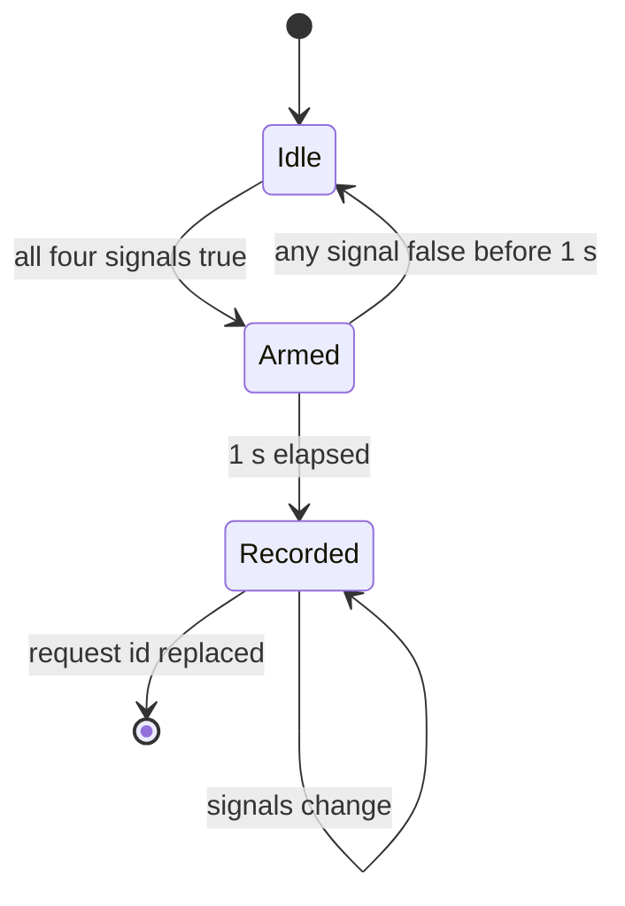
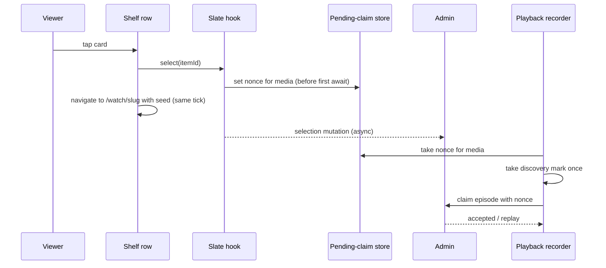

# Mobile Recommended for You Home Shelf - Plan

## Goal Capsule

- **Objective:** A mobile Watch viewer sees a personalized six-card Recommended for You row on Home wherever an editor places the Homepage Recommendations block, and every render, impression, and tap on that row reaches Admin, so the installation's recommendation profile learns from what the viewer does.
- **Means:** A self-contained shelf in the Home feed that owns its slate fetch, its placeholder, its evidence, and its tap, fed by the recommendations client that `feat-516` shipped (KD2, KTD3).
- **Product authority:** This plan covers `feat-517` in the content-discovery lane only. The `feat-516` close-out items and the Web row's LaunchDarkly rollout are context, not active scope. On product behavior the Requirements win; on mechanism the Key Technical Decisions win within their cited requirements; a unit overrides neither.
- **Execution profile:** TypeScript in `apps/mobile`, verified by the mobile jest, typecheck, and lint commands, a simulator smoke against a provisioned local Admin, and an on/off timing comparison for Home.
- **Stop conditions:** Stop before merge when the provisioned local Admin cannot serve a six-card slate (KTD10). Do not run the attribution smoke until the double-recorder fix PR has merged (see Dependencies). Stop and report if research or implementation shows a settled decision cannot work.
- **Who finishes:** The implementer opens the PR from this worktree; Urim reviews and merges; the release caller ships the native build that any OTA of this shelf needs.

---

## Product Contract

### Summary

Add a Recommended for You shelf to mobile Home at the authored position of the `HomepageRecommendationsBlock`.
The Home adapter reports the block's position beside the model, a Home-hosted controller fetches the six-card slate when the row first mounts, a pure dwell tracker records impressions, and a tap records a selection and opens the video in the same tick.
The shelf ships dark until an editor publishes the block, and a smoke against a fully provisioned local Admin proves the real contract before merge.

### Problem Frame

`feat-516` gave mobile a viewer identity, a slate hook, evidence helpers, and a playback episode recorder, but no surface renders a slate.
The installation's profile therefore receives playback facts from search, share, and direct opens, and never a selection from a recommendation.
Mobile's Home body renders the production `watch-home` Experience through the legacy Watch Experience fragment, which returns only a bare type name for the recommendations block, and the Home adapter drops that block in production without a log line.

The situation on 21 September 2026 differs from the ticket's premise.
Web's row went live on 14 September and was gated off behind a LaunchDarkly flag by `feat-496` after runtime incidents, and the production `watch-home` Experience carries no `HomepageRecommendationsBlock` (confirmed by a public API query on 2026-09-21).
So a mobile shelf placed by the block renders nothing today and lights up when an editor publishes the block again.

### Key Decisions

- KD1. **Block presence is the only gate.** The shelf appears when the block is published and disappears when it is removed; no mobile-specific server switch exists. (session-settled: user-approved — chosen over a mobile server switch on Admin and over a fixed Home position: zero Admin work, and the shelf follows Web's authoring.) Governs R1, R2, R3.
- KD2. **A self-contained shelf with a deferred fetch.** The shelf is its own section kind in the Home feed and owns fetch, placeholder, evidence, tap, and refresh; the Home snapshot and the frozen fallback never carry recommendation data. (session-settled: user-approved — chosen over hydrating the slate into the Home model: short-lived capabilities must not reach the cold-launch snapshot. An eager fetch on every Home mount was rejected because it spends an Admin admission and delivery even when the viewer never scrolls to the row.) Governs R7, R8, R9.
- KD3. **The double-recorder fix ships first as its own PR.** (session-settled: user-approved — chosen over folding it into this ticket and over leaving it on the `feat-516` checklist: it already mis-attributes search and share opens, and the shelf's attribution smoke needs a clean baseline.) Governs R15.
- KD4. **The real-environment smoke runs against a fully provisioned local Admin.** (session-settled: user-approved — chosen over production with one device and over the fake-admin proxy alone: no production identities or playback facts are created for verification.) Governs R19.
- KD5. **The full ticket stands.** No cut to shelf-without-select or to detection-plus-smoke. (session-settled: user-directed — chosen over the two smaller cuts named in dialogue.)
- KD6. **Refresh semantics mirror Web.** A return from a watch route, a profile change, an expired slate, or a pull-to-refresh refetches; a tab switch or a background trip alone leaves the cards unchanged. (session-settled: user-approved — proposed in the scope synthesis with the alternative of refetching on every return; pull-to-refresh was added in the plan-time synthesis and confirmed.) Governs R17.
- KD7. **A tap always opens the video.** Attribution is best-effort: an expired slate, an in-flight selection, or a failed selection send never blocks navigation. (session-settled: user-approved — confirmed in the scope synthesis and, for the in-flight case, in the plan-time synthesis.) Governs R13, R14.
- KD8. **The title is the app's English default.** Mobile has no localization library, and the block's authored title is unreadable through the legacy fragment, so the shelf shows "Recommended for You" and the block's title is not read. Governs R4.
- KD9. **No shelf when the Home body has fallen back to the config model.** The config body has no authored positions, and that fallback is already logged. (session-settled: user-approved — proposed in the plan-time synthesis with the alternative of a fixed position on the config body; the user confirmed.) Governs R1.

<!-- ce-section: work-relationships -->

### How This Work Fits Together

This plan covers the Home shelf only. The breakdown below is the current understanding of the surrounding recommendations work on mobile, not a committed roadmap.

- **`feat-516` close-out** (`docs/roadmap/content-discovery/feat-516-mobile-recommendations-api-client.md`)
  - The double-recorder fix on a Home-tile open. This plan **depends on** it (KD3, R15).
  - The remaining residual risks from review round 2 and the native build before the next `eas update`. **Can proceed independently of** this plan.
- **Web row rollout** (`feat-496`, `docs/roadmap/platform/feat-496-watch-rollout-runtime-recovery.md`)
  - Owns whether and when the block is published again for Web. **Enables** the mobile shelf to reach viewers, because the block is the shelf's gate (KD1).
- **Roadmap ID collision**
  - `docs/roadmap` holds two `feat-516` files and two `feat-517` files (platform and content-discovery lanes). This plan names the content-discovery pair. **Still to decide:** which pair is renumbered, in a separate roadmap change.

### Actors

- A1. **Viewer** — an anonymous person using the mobile Watch app; one recommendation profile per installation.
- A2. **The app** — the Home shelf, the recommendations client, and the playback recorder that `feat-516` shipped.
- A3. **Admin** — the recommendations API that serves slates, records evidence, and attributes playback episodes.
- A4. **Watch editor** — the person who publishes or removes the `HomepageRecommendationsBlock` on the `watch-home` Experience.

### Requirements

**Placement and gating**

- R1. The shelf renders on Home at the position of the `HomepageRecommendationsBlock` in the published homepage Experience, and does not render when the block is absent or when the Home body has fallen back to the config model.
- R2. The block's presence is the only server-side gate; the existing `EXPO_PUBLIC_RECOMMENDATIONS_ENABLED` opt-out stays the only client-side kill switch.
- R3. Block detection keeps released native bundles compatible with an Admin rolled back to a schema that has no `HomepageRecommendationsBlock` type.
- R4. The shelf title is the app's own "Recommended for You" string.

**Slate and rendering**

- R5. The shelf requests one slate of six items for the viewer's resolved context, the UI locale plus the stored audio-language preference, and renders the items in served `position` order.
- R6. The shelf never renders a shorter slate or a slate for a different audio language than the one requested; any served outcome other than a complete six-item slate renders no cards.
- R7. The slate fetch starts when the shelf nears the viewport, not on Home load.
- R8. While the slate loads, the shelf holds a placeholder of the shelf's height at its position; a non-served outcome collapses the placeholder once the shelf is out of view.
- R9. The Home cold-launch snapshot and the frozen fallback body never contain slate items, capabilities, request ids, or nonces.
- R10. Cards use the existing Home card presentation with the served item's title and image.

**Evidence**

- R11. A `render` fact is recorded once per served item per slate when the shelf mounts with that slate.
- R12. An `impression` fact is recorded once per served item per slate after the card has been at least half visible on screen for one continuous second while the app is in the foreground.

**Selection and playback attribution**

- R13. Tapping a card records a selection with a fresh claim nonce and opens that video's watch route; the video opens even when the selection cannot be sent or is not acknowledged.
- R14. The playback that follows a tap claims its episode from the selection nonce, so Admin attributes it to the served item.
- R15. A recorder disposed while a selection-nonce claim is still failing over, waiting out a rate limit, or waiting to retry does not lose the selection nonce, so the replacement recorder for the same media claims with it; a nonce claim also consumes the playback discovery mark, so a stale mark cannot label a later open.

**Refresh and expiry**

- R16. Evidence and selection stop once the slate has passed Admin's `expiresAt`; the shelf refreshes instead.
- R17. The shelf refetches its slate when the viewer returns to Home from a watch route, when the viewer profile changes, when the current slate has expired while Home is on screen, and when the viewer pulls to refresh on Home; a trigger that fires while Home is off screen runs once when Home returns, and a tab switch or a background trip alone leaves the cards unchanged.
- R18. A refetch replaces the slate in place and does not remove the shelf from the feed while it loads.

**Verification against a real Admin**

- R19. Before the shelf merges, a local Admin provisioned with mobile's development fleet key, the curated preview generation, and the block published on its homepage Experience accepts from the app a viewer bootstrap, a `status` call, a served six-card slate, render and impression facts, one selection, and one playback episode claimed from that selection.
- R20. The shelf adds no measurable cost to Home's time to first content: the Experience fetch and the first paint do not wait on the slate.

### Key Flows

- F1. Home with the block published
  - **Trigger:** A1 opens Home and the homepage Experience carries the block.
  - **Actors:** A1, A2, A3
  - **Steps:** The Home body renders its authored shelves with a recommendations placeholder at the block's position (R1, R8). When the placeholder nears the viewport, A2 requests the slate (R5, R7). A3 serves six items; A2 renders them in order and records `render` for each (R6, R11).
  - **Outcome:** Six cards in served order, with render evidence on Admin.
- F2. Exposure
  - **Trigger:** A1 scrolls so a card is at least half visible.
  - **Actors:** A1, A2, A3
  - **Steps:** A2 starts a one-second dwell for that card; scrolling the card below half visibility or backgrounding the app before the second elapses cancels it (R12). On completion A2 records one `impression` for that item.
  - **Outcome:** At most one impression per item per slate.
- F3. Tap to playback
  - **Trigger:** A1 taps a card.
  - **Actors:** A1, A2, A3
  - **Steps:** A2 mints a claim nonce, stores it as the pending claim for the item's media, sends the selection, and opens the watch route without waiting on the acknowledgment (R13). The playback recorder claims the episode with that nonce (R14) and delivers playback facts as `feat-516` defined.
  - **Outcome:** A3 attributes the episode to the served item.
- F4. Return and refresh
  - **Trigger:** A1 pops back to Home from the watch route, pulls to refresh, or the profile changes, or the slate expires while Home is on screen.
  - **Actors:** A1, A2, A3
  - **Steps:** A2 refetches the slate and replaces the cards in place (R17, R18). A tab switch does not start this flow.
  - **Outcome:** Fresh cards without the shelf leaving the feed.
- F5. Verification smoke
  - **Trigger:** A developer runs the app against the provisioned local Admin (R19).
  - **Actors:** A2, A3
  - **Steps:** Bootstrap, `status`, slate delivery, render and impression facts, one selection, one claimed episode, in that order.
  - **Outcome:** Every step accepted by Admin, with the evidence visible in its store.

### Acceptance Examples

- AE1. **Covers R1.** Given the homepage Experience has no `HomepageRecommendationsBlock`, when Home renders, then no shelf, placeholder, or slate request exists.
- AE2. **Covers R1, R5, R6, R11.** Given the block is published and Admin serves six items, when the shelf nears the viewport, then six cards render in served `position` order and six `render` facts are recorded.
- AE3. **Covers R6.** Given Admin serves five items, when the shelf reads the delivery, then no cards render and the delivery is reported as invalid.
- AE4. **Covers R6, R8.** Given Admin answers `unavailable` or `environment_disabled`, when the shelf is in view, then the placeholder stays until the shelf leaves the viewport and no cards ever render.
- AE5. **Covers R12.** Given a card is 60% visible for 0.6 s and then scrolled away, when the dwell is checked, then no impression is recorded; given the same card is 60% visible for 1.2 s, then exactly one impression is recorded.
- AE6. **Covers R13, R16.** Given the slate passed `expiresAt` while Home stayed on screen, when A1 taps a card, then the video opens, no selection is sent, and the shelf refetches.
- AE7. **Covers R17.** Given A1 watched a recommended video and pops back to Home, when Home is on screen again, then the slate refetches; given A1 only switched to the Discover tab and back, then the cards are unchanged.
- AE8. **Covers R15.** Given a claim is rate-limited and the recorder is disposed during the wait, when a replacement recorder for the same media claims, then it claims with the original selection nonce; given the claim failed transiently or definitively before the dispose instead, the replacement recorder claims with the original nonce in the transient case and with a playback context in the definitive case.
- AE16. **Covers R15.** Given a `search` discovery mark is pending for a media and its slate claim succeeds, when the viewer later opens the same media directly, then that episode's discovery is `direct`, not `search`.
- AE9. **Covers R2.** Given `EXPO_PUBLIC_RECOMMENDATIONS_ENABLED` is `false`, when the block is published, then no shelf renders and no recommendation request is sent.
- AE10. **Covers R3.** Given Admin is rolled back to a schema without the block type, when a released bundle loads Home, then Home renders its authored shelves and no request fails.
- AE11. **Covers R9.** Given the app is killed and cold-launched from the snapshot, when Home paints from the snapshot, then the recommendations position holds a placeholder and no capability or request id is read from disk.
- AE12. **Covers R1.** Given the block is published but every sibling collection block is empty, so the Home body falls back to the config model, when Home renders, then no shelf or placeholder exists and the existing fallback log fires.
- AE13. **Covers R17.** Given a slate is on screen, when A1 pulls to refresh on Home, then the Home body and the slate both refetch and the shelf stays in the feed while it loads.
- AE14. **Covers R13.** Given a selection for card A is still in flight, when A1 taps card B, then card B's video opens and its playback claims through a playback context rather than a selection nonce.
- AE15. **Covers R13.** Given A1 double-taps one card, when the second tap lands while the first selection is in flight, then exactly one watch screen opens.

### Success Criteria

- The mobile jest suite, typecheck, and lint pass, with the shelf's tests pinning: render only on `served`, evidence once per item per slate, selection stored as the pending claim before navigation, and the nonce restored on the disposed-abandon path.
- On the iPhone simulator against the provisioned local Admin: screenshots of six cards in position order, and Admin's evidence store showing the bootstrap, `status`, render, impression, selection, and claimed episode from R19, with the playback claim landing even after a full-shelf evidence burst.
- A timing comparison of Home's time to first content with the block present and absent shows no regression outside the measurement's noise floor, and the outer viewability callback's maximum duration per session stays under one frame (R20).
- The Datadog reserved-attribute guard passes for every new log emitted by the shelf, and each new log is emitted through a sink the guard recognizes.

### Scope Boundaries

- A localized shelf title. Mobile has no localization library; the English default ships and localization rides the separate UI-string effort.
- A mobile-specific server switch on Admin, and parity with Web's LaunchDarkly flag (KD1).
- The other `feat-516` residual risks: `invalidate()` keying, unserialized SecureStore touch writes, and the Admin-side advisory status of client-asserted discovery stay on that ticket's checklist. The selection-nonce gap, widened to every disposed exit, and the recorder's discovery-mark consumption move here (R15).
- The SDUI `/experience/[slug]` routes and TV. The block is a homepage singleton and renders only on mobile Home; `apps/tv` keeps its own adapter copy and is not touched.
- Account linking and content actions (`feat-372`).
- Attribution for a second card tapped while a selection is in flight (AE14). The hook keeps one selection in flight by design.
- A stale pending nonce claimed by a later open of the same media through another path within the pending claim's ten-minute life (KTD7). The viewer chose that item, and the store's time-to-live is the designed bound.
- Native build and OTA logistics beyond the dependency below.

#### Deferred to Follow-Up Work

- Renumber one of the two `feat-516` / `feat-517` roadmap pairs in a separate roadmap change.
- A guard test that enumerates every list carrying a `viewabilityConfig`, once a second surface exists to enumerate.
- `apps/tv`'s adapter will warn `skipped block type` in development once the block is published; add a silence entry there when TV next touches its adapter.

### Dependencies / Assumptions

- The double-recorder fix from the `feat-516` close-out merges before the attribution smoke runs (KD3).
- A native build must ship before any `eas update` carries this shelf: `expo-crypto` already moved the fingerprint runtime version, and the production channel is dark until that build exists.
- Publishing the block on `watch-home` is an editor action outside this plan; the shelf ships dark until then (KD1).
- Admin's `RECOMMENDATION_USER_SERVING_ENABLED` stays on in the target environment; when it is off, Admin answers `environment_disabled` and the shelf renders nothing (R6).
- Verified 2026-09-21: the legacy Watch Experience fragment returns the bare `__typename` for the block, so runtime detection by type name needs no fragment change (KTD2).
- Verified 2026-09-21: the selection path stores the pending claim before its first await, so navigation in the same tick as the selection call is safe (KTD6).
- Verified 2026-09-21: the snapshot parser keeps every object block, so the snapshot and network paths derive the same index from the same raw block array with no version bump (KTD1).
- Verified 2026-09-21: the Admin homepage seed script emits the recommendations block third, after the hero and category rail, so on a seeded local Admin the shelf is the first section in the feed (KTD10).
- Verified 2026-09-21: no layout sets `freezeOnBlur` or `enableFreeze`, so a blurred Home keeps rendering and its route segments keep updating while a root route is on top (KTD5); U5 pins this with a guard.
- Assumption: the local Admin video snapshot holds the videos the curated preview generation references, so the three local contexts (en/English, fr/French, hi/Hindi) can serve six cards. KTD10 carries the stop condition if not.
- Assumption: Admin admits fleet callers on the evidence, selection, and playback operations with the fleet bearer plus a proven viewer handle, as `docs/operations/user-recommendations.md` states.
- Evidence note: no user-facing performance data for the Web row exists; it was activated on 14 September and gated off by 18 September after runtime incidents that were about delivery load, which is why the fetch is deferred (KD2).

### Sources / Research

- `docs/roadmap/content-discovery/feat-517-mobile-recommended-for-you-shelf.md` — the ticket; its Problem statement predates the Web row being gated off.
- `docs/roadmap/content-discovery/feat-516-mobile-recommendations-api-client.md` — the client, the close-out checklist, and the residual risks.
- `docs/roadmap/content-discovery/feat-488-source-free-user-recommendations.md` and `docs/roadmap/platform/feat-496-watch-rollout-runtime-recovery.md` — the Web row's activation and later gating.
- `docs/operations/user-recommendations.md` — the client contract, the evidence literals, and the curation rollout, including the three local preview contexts.
- `docs/operations/semantic-recommendation-tracer.md` "Capability Key Rotation" — the shape of the capability keyring local Admin needs to sign evidence and episode capabilities.
- `apps/web/src/components/recommendations/WatchForYouRecommendations.tsx`, `apps/web/src/components/recommendations/useEligibleRecommendationImpression.ts`, and `apps/web/src/lib/homepage-recommendations-flag.ts` — the row to mirror, its impression rule, and its gate.
- `packages/admin-graphql/src/fragments/watch-experience.ts` — the legacy fragment returns bare `__typename` for the block; the canonical fragment selects it.
- `apps/mobile/src/lib/watchHome/experienceAdapter.ts`, `apps/mobile/src/hooks/useWatchHome.ts`, `apps/mobile/src/components/home/HomeScreen.tsx`, `HomeShelf.tsx`, `HomeCard.tsx` — the Home body the shelf joins; the feed item union, the `extraData` re-render, the focus flag, and the focus listener live in `HomeScreen.tsx`.
- `apps/mobile/src/lib/watchSeed.ts` — the watch seed a Home card passes for instant paint; its playback id is nullable.
- `apps/mobile/app/_layout.tsx` — the experience shell that remounts the Stack when the stored selection hydrates (KTD3).
- `apps/mobile/src/hooks/useUserRecommendations.ts`, `apps/mobile/src/lib/recommendations/selection.ts`, `delivery.ts`, `evidence.ts`, `playbackRecorder.ts`, `playbackDiscovery.ts` — the hook, the selection path, the item shape, the evidence ledger, the nonce gap, and the discovery mark.
- `@react-native/virtualized-lists` `Lists/ViewabilityHelper.js` and `Lists/VirtualizedList.js` (installed 0.86.3) — viewability is measured against the list's own frame, the callback and config are both captured once at construction, and AppState is not watched.
- `@shopify/flash-list` `dist/recyclerview/viewability/ViewabilityHelper.js` and `ViewabilityManager.js` (installed 2.0.2) — same frame rule, `minimumViewTime` defaults to 250 ms and a value of 0 runs the check synchronously on every scroll tick, the config is captured at construction, and the callback prop is read at report time.
- `expo-router` `build/useFocusEffect.js` and `build/exports.d.ts` (installed 57.0.21) — focus and blur fire identically for a tab switch and a popped root route; `useSegments` is the discriminating input.
- `docs/solutions/architecture-patterns/mobile-watch-home-card-hydration-hero-leak-guard.md` — the pure-seam testing idiom for Home's async hook logic and the snapshot separation precedent.
- `docs/solutions/logic-errors/react-strictmode-remount-safety-hook-lifetime-refs.md` — the StrictMode remount hazard for effects whose cleanup mutates refs.
- `docs/solutions/conventions/datadog-reserved-log-attribute-name-shadowing.md` — the reserved attribute names and the guard's blind spots.
- `docs/solutions/developer-experience/mobile-write-path-smoke-via-fake-admin-proxy.md` — the throwaway proxy, its port rule, and its one-shot rate-limit fault.
- `docs/solutions/developer-experience/admin-prod-video-snapshot-local-restore-20260521.md` and `docs/recommendations/curation/2026-09-10/admin-coverage-report.md` — the local video restore and the pool import and promote commands.
- `apps/admin/src/scripts/seed-watch-homepage-experience.ts` — seeds the `homepageRecommendations` block on the local `watch-home` Experience.
- `apps/mobile/CLAUDE.md` "Recommendations API client (feat-516)" — the client's operating rules.

---

## Planning Contract

### Product Contract preservation

Changed: R1, R15, and R17, and AE12 through AE16 added. R1 gains the config-fallback qualifier that flow analysis surfaced (KD9). R15 widens from the rate-limit wait to every disposed exit of a nonce claim and gains the discovery-mark clause that review found the recorder unit already needed. R17 gains pull-to-refresh as a trigger (KD6) and the on-screen qualifier that the return-and-refresh flow already carried. AE15 pins the double-tap case under R13; AE16 pins the discovery-mark case under R15. The former Outstanding Questions are resolved in place by KTD1 through KTD6 and the follow-up list; no scope narrowed.

### Key Technical Decisions

- KTD1. **The authored position travels beside the model as an insert index.** The adapter counts the sections it has emitted when it meets the block and reports that count beside `usedExperience`; the Home hook returns it as a sibling of the model, never inside `WatchHomeModel`, and sets the index and the model in one state update so a torn frame cannot pair a new model with an old index. Raw blocks are already persisted in the cold-launch snapshot and the parser keeps every object block, so the network and snapshot paths derive the same index from the same array and no snapshot field or version changes. Alternative rejected: a marker section inside the model's sections, which would change the persisted model shape and every consumer of sections. Cites R1, R9.
- KTD2. **Block detection by type-name string at runtime, against the unchanged legacy fragment.** The bare `__typename` is enough because the shelf reads no block field. Alternative rejected: moving mobile to the canonical fragment, which names the type in released bundles during the Admin rollback window. Cites R3, R4.
- KTD3. **The slate hook is hosted by Home; the row is a thin renderer.** A Home-level controller hook owns the `useUserRecommendations` instance; `enabled` is a latch set by the row's first mount while Home is focused, combined with the feed gate, so a later refetch that removes the block also stops the slate, its expiry timer, and its evidence. The controller reads Home's existing focus flag: while Home is blurred (a tab switch or a root route on top) it holds every expiry-, segment-, profile-, and pull-driven refresh, and it runs at most one held refetch when Home regains focus, so a film watched past the slate's life cannot refetch into a blurred row. The row receives the slate and callbacks as props. FlashList mounts a row within its draw distance before the row is viewable, so the first mount is the deferred-fetch signal, and hosting at Home level survives any recycling or unmount of the row. Two lifecycle facts are stated rather than hidden: the controller's hook instance runs on every Home mount, block or no block, and its profile subscription costs one store listener; and the experience shell in `app/_layout.tsx` remounts the whole Stack once per launch when the stored selection hydrates, which discards the controller and can produce a second slate fetch with six more `render` facts on a first launch. U6 counts slates per launch; if the count is two, `enabled` also waits on the selection's readiness. Alternative rejected: a module-scope store like the mini player's, which exists because its host is a Stack sibling ticking at 1 Hz; here the hook already owns the slate and the evidence ledger, and a store would reimplement both. (session-settled: user-approved — chosen over hydrating the slate into the Home model: nothing recommendation-shaped reaches the cold-launch snapshot or the frozen fallback.) Cites R7, R8, R9, R18.
- KTD4. **Impression eligibility is a pure dwell tracker over four boolean signals.** Row at least half visible in the outer Home list, card at least half visible in the row's inner list, app state active, and Home focused; the tracker starts a one-second timer when all four are true, cancels it when any drops, and records once per item per slate, where the slate identity is the delivery's `requestId`. Home's focus flag is the fourth signal because neither list re-evaluates viewability without a scroll or layout change, so a slate that arrives while Home sits blurred under a watch route or another tab would otherwise read as fully visible; for the same reason the row records `render` facts only while Home is focused. The visibility signals come from `viewabilityConfig` with `itemVisiblePercentThreshold` 50 and `minimumViewTime` 250 on both lists (FlashList's own default; 0 would run its check synchronously on every scroll tick), plus an AppState listener owned by the controller. React Native's list captures both the callback and the config once at construction; FlashList 2 captures the config at construction and reads the callback prop at report time. Each callback and config is therefore created once, held referentially stable for the list's life, and reads the current slate through a ref, on both lists regardless. The tracker keeps the latest signal values across a slate reset and re-arms from them, takes a row-detached input that clears every card signal when the row unmounts or is recycled, discards a timer that fires for a replaced request id, and never throws from a list callback: it catches, logs with a `rec_` attribute, and drops. Rationale from source: each list measures viewability against its own frame, so a card can read viewable while its row sits below the fold, and neither list reacts to AppState or navigation focus. Row visibility stands in for the card's vertical exposure; the approximation is documented on the tracker. Cites R11, R12.
- KTD5. **Return-from-watch is a route-segment transition, not a focus event.** An effect keyed on the joined segments string observes each transition in order; a pure discriminator over the previous and next segments returns true only when the previous top-level segment is `watch` or `series` outside the `(tabs)` group and the next segments begin with `(tabs)`, and the Discover tab's own `watch` segment inside `(tabs)` never counts. The discriminator keys on group membership alone and never on a second segment, because the router may omit a trailing `index` segment for the Home tab; the fixtures cover both shapes. The focus listener stays for the hero; it is not used here because the focus event and the segment update are two effects of one navigation commit with no guaranteed order. The SDUI `video`, `collection`, and `experience` routes also play video and do not trigger a refresh. Two event-driven triggers inside two seconds coalesce into one refetch, and a trigger that fires while Home is blurred is held per KTD3. Alternative rejected: a route param set by shelf taps, which misses returns from watch routes opened by the mini player, a deep link, or another tab, while Web refreshes on every back navigation. Cites R17.
- KTD6. **The selection call and navigation happen in the same tick.** The shelf calls the hook's `select`, ignores its promise for navigation, and navigates (not pushes) to the watch route with the item's own slug, so a double-tap cannot stack two watch screens; the selection path stores the pending claim before its first await, so the recorder finds the nonce when playback starts. The hook clears its slate at the start of every refetch and returns null from `select` for four reasons, so the row keeps the last served slate for display and decides "expired, so refresh" from that displayed slate's `expiresAt`, never from a null return. Evidence for a displayed-but-superseded slate during a refetch is dropped by the hook; accepted. (session-settled: user-approved — confirmed in the plan-time synthesis, including that a second card tapped during an in-flight selection is unattributed.) Cites R13, R14, R16, R18.
- KTD7. **The nonce is put back on every disposed exit after it was taken, and the discovery mark is taken once on every claim path.** The pending-claim store gains a restore that writes only when the slot for that media is empty, and the recorder calls it wherever the nonce path abandons on `dispose()` after the take: immediately after a failed claim mutation, after the rate-limit wait, and after the transient-retry backoff wait. R15 names all three exits and the discovery-mark take. A stale nonce is reachable when the viewer taps a card and backs out before playback starts; the ten-minute pending-claim life is the accepted bound. Its compounding leak is fixed here: a nonce claim never consumed the discovery mark, so a `search` mark could label the next direct open; `resolveClaim` now takes the mark once regardless of path and holds it for the context fallback. Alternative rejected: peeking the nonce and taking it only when the claim settles, which lets two recorders race the same nonce. Cites R15.
- KTD8. **The existing Home card gains an optional press override that replaces navigation only, and the row uses the landscape variant.** The card's press path bundles series routing and the `home-card` RUM action name, neither of which fits a served item; the override supplies the select-then-navigate handler and its own RUM action name (`recommendation-card`), builds the watch seed from the served item's slug, title, and image with a null playback id so the tap keeps the instant title-and-poster paint every other Home card gets, and leaves the press-in stream prefetch, the routing-label call (pinned by a guard test), and the progress bar keyed on the Admin video id as they are. The card's variant prop has no default, so the row names it: landscape, matching Web's 16:9 thumbnails and fixing the placeholder height. Alternative rejected: a second card component, which duplicates the card's layout and progress wiring. Cites R8, R10, R13.
- KTD9. **One pure gate decides whether the recommendations feed item exists.** Everything knowable synchronously at feed-build time is decided there: block present, body from the Experience, client enabled through the existing enabled check, and a fleet bearer configured through the existing bearer check; when any is false the feed has no recommendations item and no placeholder. The bearer input is not a gate in R2's sense: it is the client's provisioning precondition that `feat-516` established (no bearer, no network), and deciding it at feed-build time keeps an unprovisioned client from showing a placeholder that the hook's `unprovisioned` answer would only collapse. Only the asynchronous delivery outcomes use R8's deferred collapse, because collapsing in view is a layout jump. Cites R1, R2, R6, R8.
- KTD10. **Local Admin provisioning is its own unit with a stop condition.** The behavior smoke may run against the fake-admin proxy while provisioning is incomplete, but only the provisioned local Admin satisfies R19; if it cannot serve a six-card slate the run stops before merge and reports. A `capability_unavailable` answer from local Admin is a provisioning fault (the capability keyring is unset), not a content gap, and is fixed in place rather than reported under the stop condition. (session-settled: user-approved — confirmed in the plan-time synthesis over letting the real-contract check slip.) Cites R19.
- KTD11. **Load impact is measured, not argued, with a declared noise floor.** A temporary `performance.now()` console patch times Home's mount-to-first-content on warm in-app remounts, six per configuration, and records the maximum duration of the outer viewability callback per Home session (never per call). Warm timing carries about ±0.5 s of spread and a cold launch about ±6 s, so the gate and index work, expected in single-digit milliseconds, will not show in mount-to-first-content; the table reports "no signal above the noise floor" beside the measured spread, and the callback maximum is the per-frame evidence. Restored by byte copy afterwards. Cites R20.
- KTD12. **Evidence bursts yield to attribution.** A slate exposure costs up to twelve evidence mutations, and the initial slate plus a return-from-watch and a pull-to-refresh inside one minute can send thirty-six against the viewer's thirty-per-minute bucket. The evidence helper retries once after the `Retry-After` window and then drops; the recorder's claim and facts have their own ladder with a window deferral, so attribution is delayed, not lost. KTD5's coalescing and KTD3's focus hold bound trigger storms, and U6's smoke passes only if the playback claim lands after a full-shelf burst. If it does not, a minimum interval between event-driven refetches becomes an R17 qualifier (Open Questions). Cites R11, R12, R14, R17.
- Bake-off: none qualified. The closest decision was KTD4, where relying on the two lists' own `minimumViewTime` timers was a structurally distinct mechanism; source evidence settled it (neither list watches AppState or focus) without further development.

### High-Level Technical Design

Components and data flow. The Home hook reports the block position beside the model; Home builds the feed with a recommendations item at that index; the controller owns the slate; the row renders it.

```mermaid
flowchart TB
  EXP[Homepage Experience blocks] --> ADAPT[experienceAdapter: sections + recommendationsInsertIndex]
  SNAP[Cold-launch snapshot: raw blocks] --> ADAPT
  ADAPT --> HOOK[useWatchHome: model + insertIndex in one update]
  HOOK --> FEED[HomeScreen feed builder: gate + insert]
  GATE[Gate inputs: enabled flag, fleet bearer] --> FEED
  FEED --> LIST[Home FlashList]
  LIST --> ROW[RecommendationsShelf row]
  CTRL[useHomeRecommendations controller] --> ROW
  ROW -->|first mount latch| CTRL
  FOCUS[Home focus flag] --> CTRL
  CTRL --> UR[useUserRecommendations]
  UR --> ADMIN[(Admin recommendations API)]
  SEG[Route segments effect] --> CTRL
  ROW -->|tap: select + navigate with seed| WATCH[/watch/slug route]
  WATCH --> REC[playbackRecorder: claim by pending nonce]
  REC --> ADMIN
```

Impression dwell tracker, per card per request id. The four signals are row visible, card visible, app active, and Home focused; a row-detached input clears the card signals.



Tap to attributed playback.



### Sequencing

1. The double-recorder fix PR (dependency) merges first.
2. U1 and U2 are independent of each other and of the shelf; land them first.
3. U3 depends on U2; U4 and U5 depend on U3.
4. U6 can start any time after the dependency PR merges and must finish before U7's roadmap update.
5. U7 closes the work.

### System-Wide Impact

- The Home feed gains a fourth item kind and an outer-list viewability callback that runs on every Home scroll for the screen's whole life; an uncaught throw there is a fatal error for Home, not for the shelf, so KTD4's never-throw rule is load-bearing.
- Home's `extraData` re-invokes `renderItem` for every item on each hero advance, so the row is memoized with referentially stable props or six cards re-render every few seconds.
- Home's existing focus flag gains two readers: the controller's refresh hold and the dwell tracker's fourth signal (KTD3, KTD4).
- The experience shell's per-launch Stack remount discards the controller once per launch (KTD3); the R19 smoke counts slates per launch.
- The cold-launch snapshot keeps its shape; only the derivation reads one more block type.
- The card's press override changes only `HomeShelf`'s cards; no other surface renders `HomeCard`.
- New Datadog logs are emitted through `datadogLog` with inline literal contexts, because the reserved-name guard recognizes only that sink spelling and cannot see a context routed through a wrapper.
- `apps/tv` carries its own copies of the adapter and predicates and is deliberately not updated; its adapter warns in development once the block is published.

### Risks & Dependencies

- The local Admin snapshot may lack the videos the curated pools reference, or the serving control and active manifest the local preview relied on, and local Admin serves nothing and signs no capability until `RECOMMENDATION_CAPABILITY_KEYRING` is set. Mitigation: U6 sets the keyring before its first check; KTD10's stop condition covers the content gaps; the curation report and the activation record name the local preview state to restore.
- Evidence bursts against the shared thirty-per-minute bucket (KTD12): up to thirty-six mutations in a minute in the worst case, plus twelve render facts on a first launch if the Stack remount doubles the slate. Mitigation: KTD5's coalescing, KTD3's focus hold, the recorder's own ladder, and U6's burst-then-claim check.
- The inner list's viewability callback frozen on the first slate (React Native captures it at construction). Mitigation: KTD4's ref-stable rule and U4's wiring test.
- A per-scroll-tick viewability callback on the Home list could cost frames. Mitigation: `minimumViewTime` 250 and KTD11's per-session maximum.
- A future `freezeOnBlur` or `enableFreeze` on a layout would silently kill the return-from-watch trigger. Mitigation: U5's guard test.
- The Discover tab is named `watch`, so a segment discriminator keyed on the segment name alone would refresh on a tab switch. Mitigation: KTD5's test pins that case.
- The blurred-Home behavior of both lists (signals stay true across a tab switch or a pushed root route) is read from list source, not measured. Mitigation: U6 triggers a refetch while the Discover tab is active and confirms Admin receives no render or impression fact until Home regains focus.

### Open Questions

**Deferred to implementation**

- If U6's burst-then-claim check fails, a minimum interval between event-driven refetches (return-from-watch and pull-to-refresh) becomes a qualifier on R17; the interval is chosen from the measured claim delay, and the change is recorded in the Product Contract preservation note.
- If U6 counts two slates per launch, `enabled` also waits on the experience selection's readiness (KTD3); the exact readiness signal is chosen at implementation.

---

## Implementation Units

### U1. Put the selection nonce back on the disposed-abandon paths and take the discovery mark once

- **Goal:** A recorder disposed while a selection-nonce claim is still failing over, waiting out a rate limit, or waiting to retry no longer loses the nonce, and a nonce claim consumes the discovery mark so it cannot label a later open.
- **Requirements:** R15, AE8; KTD7.
- **Dependencies:** none.
- **Files:** `apps/mobile/src/lib/recommendations/selection.ts`, `apps/mobile/src/lib/recommendations/playbackRecorder.ts`, `apps/mobile/src/lib/recommendations/__tests__/selection.test.ts`, `apps/mobile/src/lib/recommendations/__tests__/playbackRecorder.test.ts`.
- **Approach:**
  1. Add a restore operation to the pending-claim store that writes the nonce back for its media only when that slot is empty.
  2. In the recorder's nonce claim path, restore the taken nonce on every exit that abandons because the recorder is disposed: immediately after a failed claim mutation, after the rate-limit wait, and after the transient-retry backoff wait.
  3. In `resolveClaim`, take the discovery mark once before choosing the nonce path or the context path, and hand it to the context fallback.
  4. Thread the restore through the recorder's injected deps beside the take, so the test double can observe it.
- **Execution note:** Write the failing recorder tests first; each must go red on the current code and green only with its fix.
- **Patterns to follow:** the existing dispose-aware claim tests in `playbackRecorder.test.ts` around the definitive-failure `it.each` block; the store's `set`/`take`/`peek` shape in `selection.ts`; the discovery mark's take in `playbackDiscovery.ts`.
- **Test scenarios:**
  - Covers AE8. A nonce is taken, the claim answers rate-limited, `dispose()` fires during the wait, and a replacement recorder for the same media claims with the original nonce.
  - Sibling rows of the same shape for a transient network failure followed by `dispose()` during the retry backoff, and for a failed claim mutation followed immediately by `dispose()`: each restores the nonce for the replacement recorder.
  - The same sequences without a dispose complete the claim after the wait and leave the store empty.
  - A restore into a slot already holding a newer nonce leaves the newer nonce in place.
  - A definitive failure after a take does not restore the nonce.
  - Covers AE16. A nonce claim that succeeds consumes the discovery mark for that media, so a following context claim for the same media reports `direct`.
  - The existing dispose-before-identity test still passes unchanged.
- **Verification:** The recommendations suite passes, and each new restore test and the discovery-mark test fail when their fix is removed.

### U2. Report the block's authored position beside the Home model

- **Goal:** The Home hook exposes where the recommendations block sits, from both the network and the cold-launch snapshot, without changing the model or the snapshot.
- **Requirements:** R1, R3, R9, AE1, AE10, AE11, AE12; KTD1, KTD2, KD9.
- **Dependencies:** none.
- **Files:** `apps/mobile/src/lib/watchHome/experienceAdapter.ts`, `apps/mobile/src/hooks/useWatchHome.ts`, `apps/mobile/src/lib/watchHome/__tests__/experienceAdapter.test.ts`, `apps/mobile/src/lib/watchHome/__tests__/resolveWatchHomeModel.test.ts`.
- **Approach:**
  1. In the section builder, when a block's type name is `HomepageRecommendationsBlock`, record the count of sections emitted so far as the insert index and treat the block as an expected placeholder (no dev warning).
  2. Return the index from `assembleWatchHomeModel` beside `usedExperience`; it is null when the block is absent or when the body did not come from the Experience (KD9).
  3. Return it from `useWatchHome` as a sibling field of `model`, held in the same state slot as the model so both change in one update; the snapshot parse path reaches it through the same assemble call, so `parseStoredHomeSnapshot` needs no change.
- **Patterns to follow:** the placeholder handling for `WatchHomeHeroBlock` in the section builder; the pure-seam testing idiom from `docs/solutions/architecture-patterns/mobile-watch-home-card-hydration-hero-leak-guard.md`.
- **Test scenarios:**
  - Covers AE1. Blocks without the recommendations block yield a null index.
  - Blocks with the recommendations block after two collection blocks yield index 2; with it first, index 0.
  - An empty collection block before the recommendations block does not count, so the index equals the number of rendered sections that precede it.
  - Covers AE12. The recommendations block present with zero surviving collection sections yields the config body and a null index.
  - Covers AE11. Stored raw blocks from a snapshot yield the same index as the same blocks from the network, and the snapshot contains no slate fields.
  - Covers AE10. A block list from an Admin without the type (no recommendations entry) behaves exactly as today.
  - The hook's model and index land in one state update: a test double observing state writes sees one write carrying both.
- **Verification:** The watchHome suites pass, and the Home hook's return type carries the index beside the model with no change to `WatchHomeModel`.

### U3. The shelf: controller, feed item, row, and card press override

- **Goal:** Home renders a Recommended for You row at the block's position, fetches its slate when the row first mounts, renders six landscape cards in order, and opens a tapped video in the same tick as the selection call with the instant paint every other Home card gets.
- **Requirements:** R1, R2, R4, R5, R6, R7, R8, R9, R10, R13, R14, R16, R18, AE2, AE3, AE4, AE6, AE9, AE14, AE15; KTD3, KTD6, KTD8, KTD9.
- **Dependencies:** U2.
- **Files:** `apps/mobile/src/hooks/useHomeRecommendations.ts` (new), `apps/mobile/src/lib/watchHome/homeFeed.ts` (new, pure feed builder and gate), `apps/mobile/src/components/home/RecommendationsShelf.tsx` (new), `apps/mobile/src/components/home/HomeScreen.tsx`, `apps/mobile/src/components/home/HomeCard.tsx`, `apps/mobile/src/hooks/__tests__/useHomeRecommendations.test.tsx` (new), `apps/mobile/src/lib/watchHome/__tests__/homeFeed.test.ts` (new), `apps/mobile/src/components/home/__tests__/RecommendationsShelf.test.tsx` (new), `apps/mobile/src/components/home/__tests__/homeCardSize.test.tsx`, `apps/mobile/src/components/home/__tests__/homeCardRoutingLabel.guard.test.ts`.
- **Approach:**
  1. Extract Home's feed-item construction into a pure builder that takes the model, the insert index, and the gate inputs, and inserts a `recommendations` item at the index only when the gate passes (KTD9); the gate reads the client's existing enabled check and bearer check rather than the env directly.
  2. Add the controller hook: it hosts `useUserRecommendations` with the resolved context; `enabled` is the first-mount latch combined with the gate and set only while Home is focused (KTD3); it exposes the slate, status, `recordRender`, `recordImpression`, `select`, and `refresh`, keeps the last served slate for display across a refetch (KTD6), starts a timer at that slate's `expiresAt` that calls `refresh` (R16), and holds every refresh while Home's focus flag is false, running at most one held refetch when focus returns.
  3. Add the row component: title from the app's constant (R4); a placeholder of the landscape row's height while status is loading or while a non-served outcome is still in view (R8); six landscape cards in `position` order on `served`; nothing on any other outcome; `recordRender` once per item when a slate first renders while Home is focused (R11); memoized with referentially stable props because Home's `extraData` re-invokes `renderItem` on every hero advance.
  4. Add an optional press override to `HomeCard` that replaces navigation only and takes its own RUM action name (KTD8); keep the press-in prefetch and the routing-label call as they are; the row's handler calls `select`, builds the watch seed from the item's slug, title, and image with a null playback id, and navigates to the watch route with that seed in the same tick (KTD6). When the displayed slate has passed `expiresAt`, also call `refresh`.
  5. Render the row from Home's `renderItem` for the new kind, and give the recommendations item its own `getItemType`.
- **Execution note:** Prove the gate and the feed builder red-first as pure functions before touching the screen.
- **Patterns to follow:** `HomeShelf.tsx` for the row layout and the landscape card sizing; `HomeCard.tsx` for the card, its seed construction, and its progress bar keyed on the Admin video id (map `targetMediaId` onto it); `apps/mobile/src/lib/watchSeed.ts` for the seed shape; the render-test re-point pattern in `apps/mobile/src/components/profile/__tests__/AccountSection.test.tsx`; the hero's `navigate` call for the same double-tap reason; `apps/mobile/src/lib/recommendations/enabled.ts` and the bearer check in `viewerIdentity.ts` for the gate; `datadogLog` with inline literal contexts for any new log.
- **Test scenarios:**
  - Feed builder: a null index yields today's feed; index 0 places the item before the first section; an index past the last section places it last; the gate false for any single input removes the item entirely (four cases, one per input).
  - Covers AE9. With the kill switch false, the builder emits no item and the controller never enables the hook.
  - Controller: `enabled` stays false until the first mount report while focused, then true while the gate holds, and false again when the gate drops on a later refetch.
  - Controller: when the displayed slate's `expiresAt` passes, `refresh` is called once and the timer is cleared on unmount; the timer never fires after the gate drops.
  - Controller: an expiry, segment, profile, or pull trigger that arrives while Home is blurred is held; when focus returns exactly one refetch runs.
  - Controller: during a refetch the displayed slate is the last served one, not null.
  - Covers AE2. A served six-item slate renders six landscape cards in `position` order and records `render` once per item.
  - Row: a slate that arrives while Home is blurred records no `render` facts until Home is focused again, then records each item once.
  - Covers AE3 and AE4. Five items, `unavailable`, and `disabled` each render no cards; the placeholder stays while the row is in view and collapses once it reports out of view.
  - Row: a refetch keeps the current cards on screen until the new slate arrives (R18).
  - Row: re-rendering Home with a changed `extraData` and unchanged props does not re-render the row's cards.
  - Card press: the override runs `select` and the navigation in the same synchronous call; the navigation uses the item's slug, the `navigate` path, and a seed carrying the item's title and image with a null playback id.
  - Covers AE15. A second tap on the same card while the first selection is in flight navigates again through `navigate`, which does not stack a second screen.
  - Covers AE6. With the displayed slate expired, `select` is not called, the navigation still happens, and `refresh` is called.
  - Covers AE14. With `select` resolving null because a selection is in flight, the navigation still happens and `refresh` is not called.
  - `HomeCard` without the override behaves exactly as before: the existing size test and the routing-label guard pass unchanged.
- **Verification:** The new suites and the existing Home suites pass; on the simulator against the fake-admin proxy, a seeded block renders six landscape cards at the seeded position and a tap opens the video with its poster and title already painted.

### U4. Impression dwell tracker and evidence wiring

- **Goal:** An impression is recorded once per card per slate after one continuous second at half visibility in the foreground on a focused Home, and never otherwise.
- **Requirements:** R11, R12, AE5; KTD4.
- **Dependencies:** U3.
- **Files:** `apps/mobile/src/lib/recommendations/impressionDwell.ts` (new), `apps/mobile/src/lib/recommendations/__tests__/impressionDwell.test.ts` (new), `apps/mobile/src/components/home/RecommendationsShelf.tsx`, `apps/mobile/src/components/home/HomeScreen.tsx`, `apps/mobile/src/hooks/useHomeRecommendations.ts`, `apps/mobile/src/hooks/__tests__/useHomeRecommendations.test.tsx`.
- **Approach:**
  1. Implement the tracker as a pure module: it takes signal updates (row visible, per-card visible, app active, Home focused, row detached) and a clock, arms a one-second timer per card when the four visibility, activity, and focus signals hold, cancels on any drop, emits each card at most once per request id, keeps the latest signal values across a request-id reset and re-arms from them, and discards a timer that fires for a replaced request id.
  2. Feed the row signal from the Home list's `viewabilityConfig` for the recommendations item and the card signals from the row's inner list, both at `itemVisiblePercentThreshold` 50 and `minimumViewTime` 250; create each callback and config once, hold them referentially stable for the list's life, and read the current request id and item ids through refs inside the callbacks.
  3. Feed the app signal from an AppState listener owned by the controller, the focus signal from Home's existing focus flag, and the row-detached signal from the row's unmount.
  4. Every timer belongs to the controller and is keyed by request id; release every timer and listener on unmount with setup restoring what cleanup mutates, and keep the per-request recorded set across a StrictMode remount.
  5. Wrap each list callback so it never throws: catch, log through `datadogLog` with a `rec_` attribute, drop.
- **Execution note:** Write the tracker tests with a fake clock before wiring the lists; the StrictMode case lives in the controller's own test file through the repo's `strict` harness toggle, and it is the only deterministic detector of the remount hazard.
- **Patterns to follow:** the search tab's `viewabilityConfig` usage in `apps/mobile/app/(tabs)/watch.tsx`, including its comment on identity stability; the AppState pattern in `apps/mobile/src/hooks/useManagedVideoPlayer.ts`; the `strict` harness in `apps/mobile/src/hooks/__tests__/useBibleVerses.test.tsx`; the StrictMode discipline in `docs/solutions/logic-errors/react-strictmode-remount-safety-hook-lifetime-refs.md`.
- **Test scenarios:**
  - Covers AE5. Card visible with the row visible, the app active, and Home focused for 0.6 s then hidden records nothing; for 1.2 s records exactly one impression.
  - Row drops below half at 0.7 s with the card still visible in its row: no impression; row returns at 0.9 s: impression at 1.9 s.
  - App goes to background at 0.5 s and returns at 0.8 s: the timer restarts; impression at 1.8 s.
  - Home blurs at 0.5 s with every other signal unchanged: no impression; Home refocuses at 0.9 s: impression at 1.9 s.
  - Two cards visible together record two impressions, each once; a card that scrolls out and back after recording records nothing more.
  - A new request id resets the per-card record so the same item id can record again, and a card that stayed visible across the reset re-arms and records for the new request id.
  - A row-detached signal clears every card signal; a recycled row's fresh viewability report starts from nothing.
  - A timer armed under one request id that fires after the request id changed records nothing.
  - Unmount during an armed timer records nothing and leaves no pending timer.
  - StrictMode: the controller's mount, cleanup, and second mount leave the AppState listener and the tracker armed and working, and the per-request recorded set is restored, not cleared.
  - Wiring: across a slate refresh render, the inner list receives the same callback and config references, and the callback reads the new request id.
  - A callback that throws inside the tracker logs once and does not propagate to the list.
  - Integration: the row's inner list reports a card viewable while the outer list reports the row not viewable; no impression is recorded until the outer list reports it viewable.
- **Verification:** The tracker suite and the controller suite pass; on the simulator against the proxy, scrolling a card into view and holding logs exactly one impression fact per card, a fast scroll-past logs none, and a refresh followed by a hold logs impressions for the new request id.

### U5. Refresh signals: return from a watch route, pull-to-refresh, profile change

- **Goal:** The slate refetches on the four triggers in R17 while Home is focused, holds them while Home is blurred, and stays put on a tab switch.
- **Requirements:** R17, R18, AE7, AE13; KTD3, KTD5, KTD12, KD6.
- **Dependencies:** U3.
- **Files:** `apps/mobile/src/lib/recommendations/homeReturnSignal.ts` (new), `apps/mobile/src/lib/recommendations/__tests__/homeReturnSignal.test.ts` (new), `apps/mobile/src/components/home/HomeScreen.tsx`, `apps/mobile/src/hooks/useHomeRecommendations.ts`, `apps/mobile/src/hooks/__tests__/useHomeRecommendations.test.tsx`, `apps/mobile/app/__tests__/screenFreeze.guard.test.js` (new).
- **Approach:**
  1. Implement the discriminator as a pure function of the previous and next route segments: true only when the previous segments start with a root `watch` or `series` segment outside the `(tabs)` group and the next segments start with `(tabs)`, with or without a trailing tab segment; the SDUI `video`, `collection`, and `experience` routes return false.
  2. In Home, run an effect keyed on the joined segments string that keeps the previous value in a ref and calls the controller's `refresh` when the discriminator is true; leave the focus listener to the hero.
  3. Wire Home's pull-to-refresh handler to call the controller's `refresh` beside the existing body refetch.
  4. In the controller, coalesce event-driven refresh calls that arrive within two seconds into one refetch, and hold any call that arrives while Home is blurred until focus returns (KTD3).
  5. Profile change already refreshes through the hook's subscription; pin it in the controller test rather than re-wiring it.
  6. Add a guard test that fails if any layout under `app/` sets `freezeOnBlur` or `enableFreeze`, with a floor on the number of layout files scanned.
- **Patterns to follow:** the joined-segments identity note in `DatadogRouteTracker`; `isTabGroupRoute` in `apps/mobile/src/lib/tabBar.ts` for keying on `(tabs)` rather than a tab name; the scan-floor shape of `app/__tests__/screenOrientationOption.guard.test.js`.
- **Test scenarios:**
  - Covers AE7. Previous `["watch", "[slug]"]` with next `["(tabs)"]` returns true, and so does next `["(tabs)", "index"]`; previous `["(tabs)", "watch"]` with either next shape returns false.
  - Previous `["series", "[slug]"]` returns true; previous `["video", "[sectionKey]"]`, `["collection", "[sectionKey]"]`, and `["experience", "[slug]"]` return false; previous `["(tabs)", "library"]` returns false; empty previous returns false.
  - The segments effect sees the sequence `(tabs)`, `watch/[slug]`, `(tabs)` and calls `refresh` exactly once, on the last transition.
  - Covers AE13. Pull-to-refresh calls both the body refetch and the slate `refresh`, and the row stays in the feed while loading.
  - Two event-driven refresh calls 0.5 s apart produce one refetch; two calls 3 s apart produce two.
  - The slate expires while the Discover tab is active: no refetch until Home focuses, then exactly one.
  - A profile transition notifies the hook and the controller exposes the refreshed slate.
  - Guard: a layout file containing `freezeOnBlur` fails the guard; the current tree passes, and the scan sees at least the known number of layout files.
- **Verification:** The discriminator, controller, and guard suites pass; on the simulator, popping back from a recommended video refetches the slate and switching to Discover and back does not.

### U6. Provision local Admin and run the real-environment smoke

- **Goal:** A local Admin serves the shelf end to end and accepts every write the shelf and the recorder send, including after a full-shelf evidence burst.
- **Requirements:** R19, F5; KTD10, KTD12, KD4.
- **Dependencies:** the double-recorder fix PR merged; U3, U4, U5 for the full smoke (bootstrap and `status` can run before them).
- **Files:** `apps/mobile/.env.development.local` (untracked, local only), Admin's local `.env` (untracked), the results section of `docs/roadmap/content-discovery/feat-517-mobile-recommended-for-you-shelf.md`.
- **Approach:**
  1. Restore the reviewed video snapshot into local Admin and run migrations, per `docs/solutions/developer-experience/admin-prod-video-snapshot-local-restore-20260521.md`.
  2. Seed the homepage Experience with `seed-watch-homepage-experience`, which places the recommendations block third.
  3. Import and promote the curated preview generation with the pool script's `audit`, `import --execute`, and `promote --execute --expected-active=none`, per `docs/recommendations/curation/2026-09-10/admin-coverage-report.md`; keep `RECOMMENDATION_USER_SERVING_ENABLED` on.
  4. Set `RECOMMENDATION_CAPABILITY_KEYRING` in local Admin's `.env` to a keyring with one active local key, in the shape `docs/operations/semantic-recommendation-tracer.md` "Capability Key Rotation" documents; never the production keyring. Without it Admin's token service is null, delivery answers `unavailable`, and every evidence, selection, and claim write fails with `capability_unavailable`.
  5. Mint a local-only fleet key: put it in local Admin's `FLEET_ADMIN_API_KEYS` and in mobile's `.env.development.local` as `EXPO_PUBLIC_ADMIN_GRAPHQL_TOKEN`; never the production key.
  6. Before touching the app, confirm with one authenticated query that local Admin serves a six-item slate for en/English; a `capability_unavailable` answer means step 4 is incomplete; any other shortfall stops the run (KTD10).
  7. Run the app on the simulator against local Admin, walk F5, and read Admin's evidence store; capture screenshots of six cards in order.
  8. Count slate requests per launch across three cold launches: expect one, tolerate two, and record the count (KTD3).
  9. Burst check: scroll the whole shelf so all render and impression facts send, then tap a card and play; the run passes only if Admin records the claimed episode and its first facts within the recorder's ladder (KTD12).
  10. Blurred-Home check: with a slate on screen, switch to the Discover tab and trigger a refetch (let the slate expire, or change the profile); confirm Admin receives no render or impression fact until Home regains focus, and then at most one refetch's worth (KTD3, KTD4).
- **Execution note:** Smoke first, no unit coverage; the fake-admin proxy from `docs/solutions/developer-experience/mobile-write-path-smoke-via-fake-admin-proxy.md` covers the shelf's behavior smoke while provisioning is incomplete, on its own port, never 3003.
- **Test scenarios:**
  - Test expectation: none -- this unit is verification against a real Admin, recorded as evidence.
- **Verification:** Admin's store shows the bootstrap, the `status` call, the served slate, six render facts, at least one impression fact, one selection, and one episode claimed with the selection nonce after the burst, and no evidence from the blurred-Home check before focus returned; the roadmap ticket's results section records the run with dates, the slates-per-launch count, and the local contexts used.

### U7. Load evidence, conventions, and roadmap

- **Goal:** The shelf's load impact is measured against a declared noise floor, the mobile conventions file describes the shelf, and the roadmap reflects the work.
- **Requirements:** R20; KTD11.
- **Dependencies:** U3, U4, U5, U6.
- **Files:** `apps/mobile/CLAUDE.md`, `docs/roadmap/content-discovery/feat-517-mobile-recommended-for-you-shelf.md`, temporary console patches in `apps/mobile/src/components/home/HomeScreen.tsx` and `apps/mobile/src/hooks/useHomeRecommendations.ts` (removed before commit).
- **Approach:**
  1. Time Home's mount-to-first-content on warm in-app remounts with a temporary `performance.now()` console patch, six per configuration: block present against local Admin, block absent, and kill switch off; read medians and ranges from the Metro log and report against the ±0.5 s warm spread, never from cold launches.
  2. Record the outer viewability callback's maximum duration per Home session in the same patch, logging only the maximum at the end of a scroll session.
  3. Restore the patched files from byte copies and delete the local env override; confirm the tree matches the index.
  4. Add a "Recommended for You shelf (feat-517)" section to `apps/mobile/CLAUDE.md` naming the gate, the position index, the dwell tracker's four signals and its approximation and never-throw rule, the two lists' different callback-capture behavior, the segments discriminator, the focus hold, the Stack-remount fact, and the smoke recipe including the capability keyring.
  5. Set the roadmap ticket to complete with the smoke, the slates-per-launch count, and the timing results.
- **Patterns to follow:** the timing method recorded in `feat-516`'s ticket results; the conventions file's existing recommendations section.
- **Test scenarios:**
  - Test expectation: none -- measurement and documentation only.
- **Verification:** The timing table shows no first-content signal above the noise floor and a callback maximum under one frame; prettier passes on both markdown files; `git status` shows no leftover patch or env file.

---

## Verification Contract

| Check                                                         | Applies to     | Proves                                                                             |
| ------------------------------------------------------------- | -------------- | ---------------------------------------------------------------------------------- |
| `pnpm --filter @forge/mobile test`                            | U1 to U5       | Every scenario above, including the guard suites for reserved attributes           |
| `pnpm --filter @forge/mobile typecheck`                       | U1 to U5       | The index rides beside the model; no `any` introduced                              |
| `pnpm --filter @forge/mobile lint`                            | U1 to U5       | Conventions                                                                        |
| Falsification of each new red-first test by reverting its fix | U1, U2, U4, U5 | The test can fail                                                                  |
| Simulator smoke against the fake-admin proxy                  | U3, U4, U5     | Behavior on the real Hermes runtime                                                |
| Simulator smoke against provisioned local Admin (R19)         | U6             | The real Admin contract, the slates-per-launch count, the burst and blurred checks |
| Timing comparison, six warm runs per configuration (R20)      | U7             | No first-content signal above the noise floor; callback maximum                    |
| `prettier --check` on every edited markdown file              | U6, U7         | CI's `format` job                                                                  |

## Definition of Done

- Every unit's verification holds, and the R19 smoke evidence, the slates-per-launch count, the burst check, and the blurred-Home check are recorded in the roadmap ticket.
- The Product Contract's IDs are unchanged and every Acceptance Example is covered by a test or by the smoke.
- No temporary console patch, proxy file, or local env override is in the diff; patched files are byte-restored.
- The conventions file and the roadmap ticket are updated, and the PR description names the dependency PR and the native build requirement.
- Per unit: U1 every restore test and the discovery-mark test go red without their fixes; U2 the index derives identically from network and snapshot inputs in one state update; U3 six landscape cards render at the seeded position on the simulator, a tap paints the poster and title at once, and a double-tap opens one screen; U4 exactly one impression per held card, none on a scroll-past or while Home is blurred, and stable callback references across a refresh; U5 a pop from watch refetches, a tab switch does not, a blurred expiry waits for focus, and the freeze guard passes; U6 Admin's store holds every write from F5 after the burst and nothing from the blurred check; U7 the timing table and the callback maximum are in the ticket.
