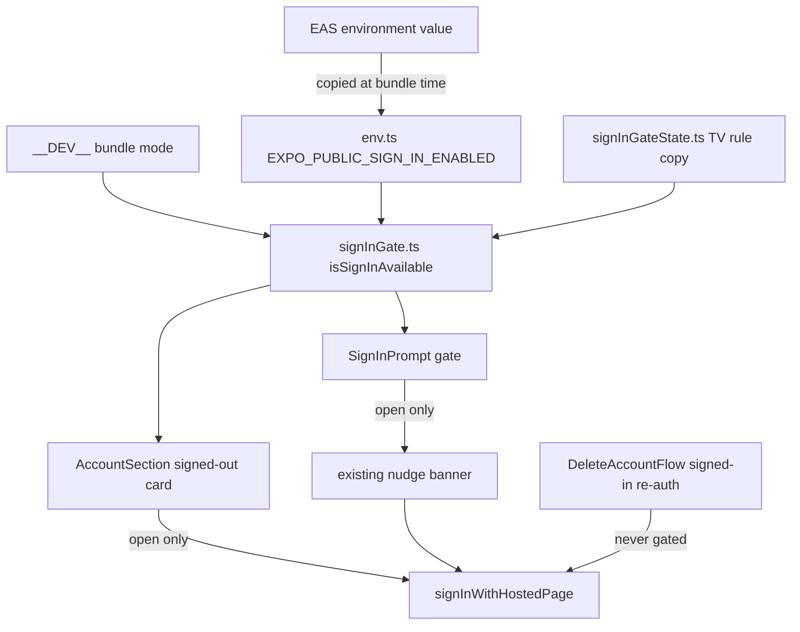

# Mobile Sign-In Gate - Plan

## Goal Capsule

- **Objective:** Until the team turns sign-in on, a signed-out person on a released mobile build cannot start sign-in from the app, and the app tells them that accounts are coming. A tester who is already signed in notices no change.
- **Means:** One opt-in `EXPO_PUBLIC` variable in each EAS environment, read through a copy of the TV feat-322 rule by one predicate that both signed-out surfaces call (KTD1, KTD2, KTD3).
- **Product authority:** The Product Contract below, confirmed on 2026-09-23 with the mobile owner. The Planning Contract governs mechanism within it. Web, TV, auth, and a flag shared across apps are not active scope (see How This Work Fits Together).
- **Execution profile:** `apps/mobile` only, iOS and Android. JavaScript only: no native module, no config plugin, and no `eas.json` edit. Installed builds receive the change with the next native build, because the production OTA channel is dark.
- **Stop conditions:** Stop and report if the change moves the fingerprint runtime version, if the wiring guard (U4) finds a sign-in caller other than the three known ones, or if the Profile card cannot show the gated state without an asynchronous value.
- **Who finishes:** The implementer lands U1 through U5 as one pull request. The mobile owner sets the EAS values and ships the native build.
- **Open blockers:** None.

---

## Product Contract

**Product Contract preservation:** changed, no change to the objective: R5 narrowed so that only the icon and title dim; R8 qualified for the window before the app reads the session; AE7 clarified to the launch after an update downloads; AE9 and AE10 added; four Key Decisions added; the questions deferred to planning resolved in place by KTD1-KTD4 and the Verification Contract. The mobile owner confirmed all of these on 2026-09-23. At document review the same day, the owner also approved two wording-only changes: the dimming Key Decision now says "subtitle" instead of "status line", and the second Success Criterion now says "development-mode bundle" instead of "development client".

### Summary

Hide the two sign-in entry points that a signed-out viewer can reach, the Profile card and the watch-page nudge, behind one opt-in variable in each EAS environment. The Profile card stays on screen but is disabled and reads "Sign in (Coming soon)". The nudge never appears. Development builds always show sign-in, and a signed-in tester keeps every account feature. The implementation copies the TV gate rule into mobile, reads it through one predicate in both surfaces, and guards every sign-in caller with a source test.

### Problem Frame

The team wants mobile sign-in hidden until further notice, but it is live. feat-349 shipped hosted sign-in, and every installed TestFlight build offers it. A signed-out viewer can open the hosted sign-in page from the Profile tab. The app also offers it in a nudge that appears after the viewer stops a video past 30 seconds. Mobile has no switch that can hide it today.

### Key Decisions

- **An EAS environment variable, not LaunchDarkly or a server switch.** (session-settled: user-directed — chosen over LaunchDarkly and a Railway switch read through auth: the switch belongs on mobile's own dashboard, and turning sign-in back on can go out with the next release.) Governs R1, R10.
- **Use the TV rule from feat-322.** (session-settled: user-approved — chosen over mobile's bare-constant pattern: a constant cannot give preview and production different values.) Governs R2, R3.
- **Signed-in testers are untouched.** (session-settled: user-directed — chosen over signing everyone out and over hiding the whole account section: a sign-out stops progress sync, and a hidden section removes sign-out and account deletion.) Governs R8, R9.
- **The Profile card stays on screen, disabled, with new copy.** (session-settled: user-directed — chosen over keeping the old subtitle, over "Coming soon" as the subtitle, and over hiding the card: "Keep your place across devices" beside a disabled button reads as a broken app.) Governs R5.
- **Dim the icon and title, not the subtitle.** (session-settled: user-approved — chosen over dimming the whole card: that drops "Accounts are not available yet" to about 2.6:1 on the card surface, below the 4.5:1 floor in `PRODUCT.md`.) Governs R5.
- **Fail closed.** A mistake in an EAS environment must never show sign-in by accident. Governs R2.
- **Builds that are already installed keep sign-in.** (session-settled: user-directed — chosen over having auth refuse new mobile accounts: that needs a change in auth, which is not active scope.) See Scope Boundaries.
- **Accept the cold-launch window for signed-in testers.** (session-settled: user-approved — chosen over adding an unknown sign-in state: that widens scope into the auth session store, and the same window already shows the live card today.) Governs R8.
- **Accept the lockout after idle expiry.** (session-settled: user-approved — chosen over an auth-side change: the support email stays the deletion route for a tester who cannot sign in.) See AE10.
- **Defer telemetry for the gate state.** (session-settled: user-approved — chosen over a Datadog attribute: the Profile tab shows the state directly.) See Scope Boundaries.

### Requirements

**Gate rule**

- R1. One opt-in variable in each EAS environment controls whether the signed-out sign-in entry points in R5 and R7 are available.
- R2. Sign-in is available only when the variable holds `1` or `true`; every other value hides it, including an absent value, an empty value, and a value in a different case such as `TRUE`.
- R3. A development build always makes sign-in available, whatever the variable holds.
- R4. The app knows the gate value before the first render, so no surface shows one state and then changes to the other.

**Signed-out surfaces while sign-in is unavailable**

- R5. The signed-out Profile card stays on screen but is disabled: the title reads "Sign in (Coming soon)", the subtitle reads "Accounts are not available yet", the icon and title are dimmed while the subtitle keeps full strength, the card has no chevron, and a tap does nothing.
- R6. Assistive technology announces the disabled Profile card as unavailable and reads its "Coming soon" status.
- R7. The watch-page nudge ("Sign in to keep your place across your devices from here on.") never appears.

**Signed-in testers**

- R8. Once the app has read their session, a signed-in tester sees no change, whatever the variable holds: identity, sign-out, account deletion, and watch-progress sync all work as they do today.
- R9. The "Sign in again" step inside account deletion stays available to a signed-in tester, whatever the variable holds.

**Turning sign-in on**

- R10. Preview and production hide sign-in by default. An operator turns sign-in on for one environment by changing that environment's value and publishing a new bundle, with no code change.
- R11. When sign-in is available, every surface behaves exactly as it does today.

The table shows how these rules combine. The Requirements above are the authority.

| Viewer     | Build                 | Variable        | Profile tab                                | Watch-page nudge | "Sign in again" in deletion |
| ---------- | --------------------- | --------------- | ------------------------------------------ | ---------------- | --------------------------- |
| Signed out | development           | any value       | Live "Sign in" card (R3)                   | As today (R11)   | Not reachable               |
| Signed out | preview or production | `1` or `true`   | Live "Sign in" card (R11)                  | As today (R11)   | Not reachable               |
| Signed out | preview or production | any other value | Disabled "Sign in (Coming soon)" card (R5) | Never (R7)       | Not reachable               |
| Signed in  | any                   | any value       | Identity, sign-out, and deletion (R8)      | Never, as today  | Available (R9)              |

### Acceptance Examples

Key Flows are omitted. Each surface has one condition, and the examples below cover every combination.

- AE1. Profile tab, value not set
  - **Covers:** R2, R5, R6.
  - **Given:** a production build whose EAS environment has no value for the variable.
  - **When:** a signed-out tester opens the Profile tab.
  - **Then:** the card reads "Sign in (Coming soon)" and "Accounts are not available yet", its icon and title are dimmed, it has no chevron, and a tap opens nothing. A screen reader announces the card as unavailable and reads "Coming soon".
- AE2. Wrong spelling of the on-value
  - **Covers:** R2.
  - **Given:** a production build whose environment value is `TRUE` or `yes`.
  - **When:** a signed-out tester opens the Profile tab.
  - **Then:** the card is disabled, as in AE1.
- AE3. Nudge after a pause
  - **Covers:** R7.
  - **Given:** sign-in is unavailable, and a signed-out tester has watched 45 seconds of a video.
  - **When:** the tester pauses the video, sends the app to the background, and returns.
  - **Then:** no sign-in nudge appears on the watch page.
- AE4. Development build
  - **Covers:** R3.
  - **Given:** a development build with the variable not set.
  - **When:** a signed-out developer opens the Profile tab.
  - **Then:** the live "Sign in" card appears, and a tap opens the hosted sign-in page.
- AE5. Signed-in tester
  - **Covers:** R8, R9.
  - **Given:** sign-in is unavailable, and a tester is signed in.
  - **When:** the tester opens the Profile tab and starts account deletion, and the server asks them to sign in again.
  - **Then:** the tester sees their identity, "Sign out", and "Delete account", and the "Sign in again" button opens the hosted sign-in page.
- AE6. Sign-out while unavailable
  - **Covers:** R5, R8.
  - **Given:** sign-in is unavailable, and a tester is signed in.
  - **When:** the tester signs out.
  - **Then:** the Profile tab shows the disabled card, and the tester cannot sign in again from the app.
- AE7. Preview turned on
  - **Covers:** R10, R11.
  - **Given:** the preview environment value is `1`, a new preview bundle is published, and the app has applied it on a later launch.
  - **When:** a signed-out tester on a preview build opens the Profile tab, or stops a video past 30 seconds.
  - **Then:** the card and the nudge behave exactly as they do today.
- AE8. First paint
  - **Covers:** R4.
  - **Given:** sign-in is unavailable.
  - **When:** the Profile tab renders for the first time after a cold launch.
  - **Then:** the first frame shows the disabled card, and the live card never appears.
- AE9. Cold launch, signed in
  - **Covers:** R8.
  - **Given:** sign-in is unavailable, and a signed-in tester launches the app.
  - **When:** the tester opens the Profile tab before the app has read the session.
  - **Then:** the tester sees the disabled card until the session read succeeds. Online, the identity view replaces it within 5 seconds. Offline, the card stays for the session.
- AE10. Idle expiry
  - **Covers:** R5, R8.
  - **Given:** sign-in is unavailable, and a signed-in tester has not used the app for more than 7 days.
  - **When:** the tester opens the app, and the session read reports no session.
  - **Then:** the Profile tab shows the disabled card. The tester cannot sign in or delete the account in the app, and the support email is the deletion route.

### Success Criteria

- The pull request that adds the gate also adds a roadmap ticket that removes it when accounts open, as `docs/solutions/workflow-issues/removal-recipe-ticket-for-phase-scoped-scaffolding-20260708.md` requires for scaffolding with a known end.
- Someone sees the gated state on a non-development build of each platform before release. R3 makes every development build show sign-in, so a development-mode bundle cannot show the gated state.

### Scope Boundaries

- No change to web, TV, or auth. TV already has its own gate, `EXPO_PUBLIC_TV_PROFILE_ENABLED`.
- No LaunchDarkly SDK in mobile, and no new key in `packages/feature-flags`.
- No server-side refusal of mobile sign-in. A tester on a build installed before this change keeps a working sign-in until they install the next build.
- No per-user targeting. A signed-out viewer has no identity to target.
- No sign-out and no session change for testers who are already signed in.
- The "Sign in again" step inside account deletion is not gated. An existing signed-in tester can use it to sign in to a different account, and that account can be new. The team accepts this because only an existing tester can reach the step.
- The gate is not a security control. It hides where sign-in starts, and the auth provider still accepts a sign-in that arrives by another route.

#### Deferred to Follow-Up Work

- A telemetry attribute that reports the gate state on each launch.
- A named deletion-support address. The current `help@jesusfilm.org` is marked as a placeholder in `apps/mobile/src/components/profile/DeleteAccountFlow.tsx`.
- An "unknown" sign-in state that would close the cold-launch window in AE9.

<!-- ce-section: work-relationships -->

### How This Work Fits Together

This plan covers the mobile sign-in gate only. The list below is the current understanding of the surrounding work, not a committed roadmap.

- TV sign-in gate: already shipped as feat-322 (`EXPO_PUBLIC_TV_PROFILE_ENABLED`). This plan shares its rule.
- Removal of this gate: depends on this plan. U5 writes its roadmap ticket in the same pull request.
- Web sign-in gate: can proceed independently of this plan. Web has no gate on its main sign-in today. Its `forge.watch.downloadAccountGate` flag controls only the sign-in button in the download flow. The mechanism is still to decide.
- Auth-side refusal of new mobile accounts: would close sign-in on builds that are already installed. It shares the trigger of this plan and is still to decide. It must let existing accounts through, or account deletion stops working.
- One flag shared by all apps: still to decide. LaunchDarkly runs only on the web server today. A shared switch would need a server that every app reads, or a client SDK in each native app.

### Dependencies / Assumptions

- The gate reaches installed builds only with the next native build. The production OTA channel is dark, because every `update:production` from `main` targets a runtime version that no installed build carries (`apps/mobile/CLAUDE.md`, "Cold-start splash"). The change itself adds no native module, no config plugin, and no `eas.json` edit, and the Verification Contract checks that the runtime version does not move.
- Expo copies each `EXPO_PUBLIC_*` value into the bundle at build time. A value change in EAS therefore needs a new bundle, from an `update:*` publish or a build (R10). The app applies a downloaded update on the next launch.
- Mobile is not a Railway service, so a Railway variable cannot reach it directly (`docs/plans/2026-05-25-001-feat-mobile-admin-data-layer-cutover-plan.md`).
- The mobile owner accepts that turning sign-in back on goes out with the next release.

### Sources / Research

- `apps/tv/src/lib/auth/profileFlagState.ts` and `apps/tv/src/lib/auth/profileFlag.ts`: the TV rule, including the comment about the first TestFlight build that shipped dark because the gate accepted only `1`. `apps/tv/src/lib/auth/profileFlagState.test.ts` holds its truth table.
- `apps/mobile/src/components/profile/AccountSection.tsx`: the signed-in or signed-out branch, the sign-in call, the current copy, and the mount of the deletion flow inside the signed-in branch.
- `apps/mobile/src/components/watch/SignInPrompt.tsx` and `apps/mobile/src/lib/watchProgress/signInPrompt.ts`: the nudge banner, its arming rule, and its copy.
- `apps/mobile/src/components/profile/DeleteAccountFlow.tsx`: the "Sign in again" step.
- `apps/mobile/src/lib/authSession.ts`: the snapshot has only two states and starts as signed out, which causes the window in AE9.
- `apps/auth/src/services/device-client.service.ts`: `AUTH_DEVICE_GRANT_ENABLED` gates only the TV device-code flow. It does not cover mobile sign-in.

---

## Planning Contract

### Key Technical Decisions

- KTD1. **Copy the TV resolver into mobile; do not share a package.** Mobile gets its own env-free leaf with a `// SYNC: mirrors apps/tv/src/lib/auth/profileFlagState.ts` header and the same truth table. TV and mobile share no package for small React Native predicates, and the repo already copies TV helpers under a SYNC header (`apps/mobile/src/lib/cardImage.ts`). Governs R2, R3.
- KTD2. **One predicate, read in render by every gated surface.** A small binder module passes `__DEV__` and the env value to the resolver and exports `isSignInAvailable()`. The Profile card and the nudge both call it, so the two surfaces cannot disagree. `__DEV__` is the Metro bundle mode: "development build" in R3 means a debug bundle, and a dev client that loads a release-mode bundle resolves as a release build. Governs R1, R3, R4.
- KTD3. **Name the variable `EXPO_PUBLIC_SIGN_IN_ENABLED`, and keep the schema loose.** It is `z.string().optional()`, registered in all three places in `apps/mobile/src/env.ts`: the module-scope `_inlined` object, `client`, and `runtimeEnvStrict`. The on-value policy lives in the resolver, never in the schema: a zod enum or refine would throw at module scope on a typo such as `True` and stop startup for every tester. Mobile variables carry no app prefix (`EXPO_PUBLIC_RECOMMENDATIONS_ENABLED`). Governs R1, R2.
- KTD4. **Gate the nudge at its render boundary.** `SignInPrompt` becomes a thin gate that renders the existing banner only while the predicate is true. A closed gate never mounts the banner, so the banner never reads the dismissal cooldown, never uses up the session's one prompt, and never writes storage. `apps/mobile/src/lib/watchProgress/signInPrompt.ts` stays dependency-free, and the seven suites that partly mock it stay untouched. Rejected: a gate inside `noteSignedOutPlaybackStop`, which pulls `env.ts` into a pure module and three suites, and a gate at the recorder wiring in `useManagedVideoPlayer`, the most-tested hook. The arming flag still sets in memory while the gate is closed. Nothing reads it, and the value cannot change during a session. Governs R7.
- KTD5. **Build the disabled card from the repo's disabled-row pattern.** The signed-out card keeps its layout and takes the shape used in `apps/mobile/src/components/watch/DownloadSheet.tsx`: no `onPress`, `disabled`, and `accessibilityState={{ disabled: true }}`. It has no chevron and no `dd-action-name`, so the sign-in funnel does not count taps that do nothing. The label joins the status and the subtitle ("Sign in, coming soon, Accounts are not available yet"), the way `DownloadSheet.tsx` joins a disabled row's label and note. An `accessibilityLabel` hides child text from a screen reader, and a user can switch hints off, so the subtitle belongs in the label. The dim uses the repo's local disabled value of 0.5 on the icon and title only, per the dim Key Decision. At that value the dimmed title must still reach 4.5:1 against the card surface, and it measures about 4.6:1. Governs R5, R6.
- KTD6. **Test the gated state on purpose.** jest-expo sets `__DEV__` to true, so the binder is open in every existing suite, and a revert to `return true` would leave them all green. This is the feat-304 trap in the root `CLAUDE.md`. Cover it in three layers. The pure truth table is the first layer. The second is a binder pin that sets `__DEV__` to false and re-requires the module, as `apps/mobile/src/__tests__/env.test.ts` does, with an anti-vacuous `1` case. The third is component suites that mock the binder through a mutable holder, where each gated case holds every other condition at the value that would show sign-in. Falsify each pin once. Governs R2, R3, R5, R7, R8, R9.
- KTD7. **Guard the whole source for sign-in callers.** A guard test fails when any non-test caller of `signInWithHostedPage(` does not also call `isSignInAvailable(`. The only exception is a one-entry allowlist for `DeleteAccountFlow.tsx`, the signed-in re-authentication step that the CONCEPTS.md "Sign-In Gate" entry keeps open. The same guard fails when any file other than the auth actions module calls the auth client's sign-in method directly, and it pins the binder's two inputs and the three `env.ts` registrations, which no type check catches for `_inlined`. Governs R1, R2, R9.
- KTD8. **Ship the removal recipe with the gate.** The implementing pull request adds the removal roadmap ticket, per `docs/solutions/workflow-issues/removal-recipe-ticket-for-phase-scoped-scaffolding-20260708.md`, and the retirement prose sweep follows `docs/solutions/workflow-issues/mechanism-retirement-docs-prose-sweep.md`. Governs the first Success Criterion.

### High-Level Technical Design

The value flows from EAS into the bundle and reaches the two signed-out surfaces through one predicate. The deletion step never reads it.

The resolver's truth table is the rule the tests pin (KTD1, KTD6):

| `__DEV__` | Variable value                                                          | Sign-in   |
| --------- | ----------------------------------------------------------------------- | --------- |
| true      | any value                                                               | available |
| false     | `1` or `true`                                                           | available |
| false     | absent, empty, `0`, `false`, `TRUE`, `True`, `yes`, ` 1`, `1` + newline | hidden    |

### Sequencing

U1 comes first. U2 and U3 depend only on U1 and can land in either order. U4 depends on U1 through U3, because it pins their call sites. U5 comes last, because its documentation names the final symbols.

### Risks & Dependencies

- **Reach while the OTA channel is dark.** Installed builds keep a working sign-in until testers install the next native build. The mobile owner owns that build and its timing.
- **An auth deploy that ends every session at once.** A rotated signing secret or a lockstep Better Auth upgrade signs out every tester together. While the gate is closed, none of them can sign in again, and progress sync stops for the whole group. Coordinate any such auth deploy with opening the gate.
- **A typo in the EAS value keeps sign-in hidden.** This is the intended fail-closed direction, and it shows on the Profile tab. The TV gate shipped dark once for this reason, so the documentation lists the accepted values.
- **EAS variable visibility.** Set the value with plain-text visibility. A "secret" value may not reach `eas update`, and the value is public in the bundle anyway.
- **A wrong account during deletion.** In the existing deletion flow, "Cancel" after a wrong-account sign-in leaves the tester signed in as the other account. This is existing behaviour. The gate makes it harder to recover, because a sign-out then locks the tester out. The removal ticket records it.
- **Suites that load `env.ts` through the new import.** The binder imports `env.ts`. The two component suites mock the binder, so they never load the real module. `apps/mobile/src/__tests__/env.test.ts` already shows that the real module loads cleanly under jest.
- **The copy is false for a viewer with a web account.** "Accounts are not available yet" is the settled copy. The existing new-account notice already points web users at their web email.

### Documentation / Operational Notes

- Leave `EXPO_PUBLIC_SIGN_IN_ENABLED` unset in the production EAS environment. Set the preview value on purpose: unset hides sign-in for preview testers, and `1` keeps it for them.
- Set the value only in the EAS dashboard or with `eas env`. Never put it in an `eas.json` `env` block, because an `eas.json` edit moves the runtime version.
- Publish only with the `update:preview` and `update:production` scripts, which pass `--environment` and block local env files.
- To turn sign-in on later, set the value to `1`, publish a bundle, and open the Profile tab on a device after a second launch.

---

## Implementation Units

### U1. Gate rule and env registration

**Goal:** One predicate that answers whether sign-in is available in this bundle.

**Requirements:** R1, R2, R3, R4. KTD1, KTD2, KTD3.

**Dependencies:** None.

**Files:**

- Create `apps/mobile/src/lib/signInGateState.ts`
- Create `apps/mobile/src/lib/signInGate.ts`
- Modify `apps/mobile/src/env.ts`
- Modify `apps/mobile/.env.example`
- Create `apps/mobile/src/lib/__tests__/signInGateState.test.ts`
- Create `apps/mobile/src/lib/__tests__/signInGate.test.ts`
- Modify `apps/mobile/src/__tests__/env.test.ts`

**Approach:**

1. Copy the TV resolver and its comment about the build that shipped dark, under the SYNC header (KTD1).
2. Register the variable in the three `env.ts` places with a two-line comment that names the feature (KTD3).
3. The binder reads `__DEV__` and the env value at call time and holds no state (KTD2).
4. Add the variable to `.env.example` with its accepted values and its defaults.

**Execution note:** Write the resolver table and the binder pin first. Falsify the binder pin once by making the binder return `true`, and restore it from a copy.

**Patterns to follow:** `apps/tv/src/lib/auth/profileFlagState.ts` and its test. `apps/mobile/src/lib/adminEndpoint.ts`, an env-free leaf that takes `isDev` as an argument. `apps/mobile/src/__tests__/env.test.ts`, which flips `__DEV__`, resets modules, and requires the real module. `apps/mobile/src/lib/recommendations/__tests__/enabled.test.ts`, which mocks `env`.

**Test scenarios:**

- With `isDev` true, the resolver returns available for undefined, `""`, `0`, `false`, and `1`.
- With `isDev` false, the resolver returns available for `1` and `true`.
- With `isDev` false, the resolver returns hidden for undefined, `""`, `0`, `false`, `TRUE`, `True`, `yes`, ` 1`, and `1` followed by a newline.
- Covers AE1. With `__DEV__` false and the variable unset, the binder returns hidden.
- Covers AE2. With `__DEV__` false and the variable `TRUE`, the binder returns hidden.
- Covers AE7. With `__DEV__` false and the variable `1`, the binder returns available. This is the anti-vacuous companion to the two cases above.
- Covers AE4. With `__DEV__` true and the variable unset, the binder returns available.
- With `process.env` holding `1`, the real `env.ts` exposes `1`. An empty string arrives as undefined, and a value such as `True` loads without an error. Clear `CI` and `EAS_BUILD` for these cases with the suite's env helper: `env.ts` skips validation when `CI` is set, and CI always sets it, so without this the `True` case passes there without validating anything.

**Verification:** All resolver and binder cases pass. The binder pin goes red when the binder returns `true`, and green again when it is restored.

### U2. Disabled Profile card

**Goal:** The signed-out Profile card shows the disabled "Coming soon" state while the gate is closed, and nothing else on the Profile tab changes.

**Requirements:** R4, R5, R6, R8, R11. KTD5, KTD6.

**Dependencies:** U1.

**Files:**

- Modify `apps/mobile/src/components/profile/AccountSection.tsx`
- Modify `apps/mobile/src/components/profile/__tests__/AccountSection.test.tsx`

**Approach:**

1. In the signed-out branch only, call `isSignInAvailable()` once per render.
2. Gate closed: render the disabled card per KTD5 with the copy in R5. The sign-in handler and its error card cannot be reached.
3. Gate open: render the current card unchanged (R11).
4. The signed-in branch never calls the predicate (R8, R9).
5. In the suite, mock the binder through a mutable holder that defaults to open. Make the auth snapshot mutable so that signed-in cases can render.

**Patterns to follow:** The disabled rows in `apps/mobile/src/components/watch/DownloadSheet.tsx`, which join a label and a note on a disabled row. The existing harness in `AccountSection.test.tsx`.

**Test scenarios:**

- Covers AE1. Gate closed, signed out:
  - The title is exactly "Sign in (Coming soon)", and the subtitle is exactly "Accounts are not available yet".
  - "Keep your place across devices" is absent, and the card has no chevron icon.
  - `accessibilityState.disabled` is true, and the label includes both "coming soon" and the subtitle.
  - The card has no `dd-action-name`, and `signInWithHostedPage` is never called.
  - Find the card by its label, not with `pressableByLabel`, which needs an `onPress`. Assert exact strings, because `hasText` matches substrings.
- Gate closed: the icon and title carry the dim value, and the subtitle does not.
- Gate closed: the dimmed title's composited contrast over the card surface is at least 4.5:1, computed from the colour constants and the dim value the way `apps/mobile/src/lib/__tests__/tabBar.test.ts` computes its contrast floors.
- Gate open, signed out: the six existing cases pass unchanged (R11).
- Covers AE5. Gate closed, signed in: the identity, "Sign out", and the delete-account section render, and no gated copy appears.
- Covers AE6, AE10. Gate closed, and the snapshot changes from signed in to signed out: the disabled card renders, the delete-account section is gone, and the live title never renders.
- Covers AE8, AE9. Gate closed, first render with the initial signed-out snapshot: the disabled card renders, and the live title is absent from that first render.

**Verification:** The gated and open cases pass. When the mock holder is set to open, every gated-case assertion fails, which shows the gated cases do not pass by accident.

### U3. Nudge render gate

**Goal:** The watch-page nudge never mounts while the gate is closed.

**Requirements:** R7, R11. KTD4, KTD6.

**Dependencies:** U1.

**Files:**

- Modify `apps/mobile/src/components/watch/SignInPrompt.tsx`
- Modify `apps/mobile/src/components/watch/__tests__/SignInPrompt.test.tsx`

**Approach:**

1. Keep the existing banner body intact as an internal component.
2. Export `SignInPrompt` as a gate that returns the banner only while `isSignInAvailable()` is true. The gate runs no hook before the check, so the rules of hooks hold.
3. Leave the mount site in `apps/mobile/app/watch/[slug].tsx` and the arming module `apps/mobile/src/lib/watchProgress/signInPrompt.ts` unchanged.
4. In the suite, mock the binder through a mutable holder that defaults to open.

**Test scenarios:**

- Covers AE3. Gate closed, signed out, armed at 45 seconds: nothing renders, AsyncStorage `getItem` is not called, and `isSignInPromptArmed()` stays true, which shows that the session's one prompt was not used up.
- Gate open, with the same arming: the banner renders, as it does today. This is the anti-vacuous companion.
- Gate open: the six existing cases pass unchanged (R11).

**Verification:** The gated case passes. When the holder is set to open, the gated case fails.

### U4. Sign-in wiring guard

**Goal:** A source guard that keeps every sign-in entry point behind the gate and keeps the gate's inputs honest.

**Requirements:** R1, R2, R9. KTD7.

**Dependencies:** U1, U2, U3.

**Files:**

- Create `apps/mobile/src/lib/__tests__/signInGateWiring.guard.test.js`

**Approach:**

1. Walk the `.ts` and `.tsx` sources under `apps/mobile/src` and `apps/mobile/app`, skip test files, and strip line and block comments before matching.
2. Rule 1: every caller of `signInWithHostedPage(` other than `src/lib/authActions.ts` also calls `isSignInAvailable(`, or is `src/components/profile/DeleteAccountFlow.tsx`.
3. Rule 2: the allowlisted file still calls `signInWithHostedPage(`, so a stale allowlist fails.
4. Rule 3: the binder passes `__DEV__` and `env.EXPO_PUBLIC_SIGN_IN_ENABLED` to the resolver, with no boolean literal.
5. Rule 4: `src/env.ts` names the key in `_inlined` and in `runtimeEnvStrict`, and its `client` entry is exactly `EXPO_PUBLIC_SIGN_IN_ENABLED: z.string().optional(),`, with nothing chained after `.optional()`.
6. Rule 5: after comments are stripped, calls of the auth client's sign-in methods (`.signIn.` followed by a method call) appear only in `src/lib/authActions.ts`.
7. Add a positive control that finds the Profile card and the nudge as gated callers, and a floor of more than 100 scanned files.

**Patterns to follow:** `apps/mobile/app/__tests__/screenOrientationOption.guard.test.js` for the floor and the rule shape. `apps/mobile/src/lib/splash/__tests__/splashKillSwitch.guard.test.js` for a call site that passes the real source, not a literal. `apps/mobile/app/__tests__/tabBarSingleSource.guard.test.js` for comment stripping.

**Test scenarios:**

- The current tree passes all four rules and the positive control.
- Falsify each rule once, then restore the file from a copy, never with `git checkout`:
  - Remove the gate call from the Profile card. Rule 1 fails.
  - Add an ungated `signInWithHostedPage(` call in a scratch source file. Rule 1 fails.
  - Add a `signIn.social(` call in a scratch source file. Rule 5 fails.
  - Make the binder pass `true`. Rule 3 fails.
  - Remove the `_inlined` entry. Rule 4 fails.
  - Chain a `.refine()` after `.optional()` in the `client` entry. Rule 4 fails.

**Verification:** The guard passes on the tree and fails under each falsification.

### U5. Documentation and removal ticket

**Goal:** The gate is easy to find and operate, and its removal is written down before it ships.

**Requirements:** R10, the first Success Criterion. KTD8.

**Dependencies:** U1, U2, U3, U4.

**Files:**

- Modify `apps/mobile/CLAUDE.md` (section "Auth + watch progress")
- Create a removal ticket under `docs/roadmap/platform/`, named with the next free feat ID
- Modify `docs/roadmap/platform/feat-543-mobile-sign-in-gate.md`

**Approach:**

1. In `apps/mobile/CLAUDE.md`, add one bullet. It covers:
   - the variable name, its accepted values, and that development builds are always open;
   - the default for each environment, and that the value is set in the EAS dashboard with plain-text visibility, never in `eas.json`;
   - publishing only with `update:*`, and that a value applies on the launch after it downloads;
   - the reach while the OTA channel is dark, and how to see the gated state;
   - the accepted cold-launch and idle-expiry consequences.
2. The removal ticket carries these parts:
   - a step-0 precondition that accounts are open;
   - a KEEP list: the deletion re-authentication step, the nudge's arming, cooldown, and cap logic, and the live card;
   - grep families: the env name, `isSignInAvailable`, the resolver name, and "Coming soon";
   - a rule that any rename updates the ticket's greps in the same pull request;
   - verification that the greps return nothing and that tests and typecheck pass;
   - an operator step to delete the variable from every EAS environment;
   - a prose sweep over CONCEPTS.md "Sign-In Gate", `apps/mobile/CLAUDE.md`, and the roadmap.
3. Allocate the ID by scanning every origin branch. Link the new ticket to feat-543 in both directions with `depends_on` and `blocks`.

**Test expectation:** None — this unit changes only documentation. Run `npx prettier --check` on every changed markdown file.

**Verification:** The CLAUDE.md bullet and both tickets exist, the dependency links match in both directions, and prettier passes.

---

## Verification Contract

| Gate                  | Command or action                                                                                                                                                                                                                                                                                                            | Proves |
| --------------------- | ---------------------------------------------------------------------------------------------------------------------------------------------------------------------------------------------------------------------------------------------------------------------------------------------------------------------------- | ------ |
| Unit, render, guard   | `pnpm --filter @forge/mobile test`                                                                                                                                                                                                                                                                                           | U1-U4  |
| Targeted run          | `pnpm --filter @forge/mobile test -- src/lib/__tests__/signInGate src/components/profile src/components/watch/__tests__/SignInPrompt.test.tsx src/__tests__/env.test.ts`                                                                                                                                                     | U1-U4  |
| Types                 | `pnpm --filter @forge/mobile typecheck`                                                                                                                                                                                                                                                                                      | all    |
| Lint                  | `pnpm --filter @forge/mobile lint`                                                                                                                                                                                                                                                                                           | all    |
| Markdown              | `npx prettier --check` on each changed `.md` file                                                                                                                                                                                                                                                                            | U5     |
| Runtime version       | In `apps/mobile`, run `npx expo-updates runtimeversion:resolve` with `--platform ios` and with `--platform android`, on the merge-base commit and on the branch head. Neither value may change. Do not compare against the latest production build: `main` already carries a newer runtime version than any installed build. | all    |
| Open state on device  | Dev client on a simulator: the live card shows and opens the hosted page (AE4)                                                                                                                                                                                                                                               | U2     |
| Gated card on device  | A `preview-simulator` EAS build on iOS and an internal preview build on Android, with the preview value unset, checked on the first launch after install, before a downloaded update can replace the build's JavaScript: the disabled card shows, and a screen reader reads it (AE1). Play no video on these builds.         | U2     |
| Gated nudge on device | The dev client on the iOS simulator and on the Android emulator, loading a release-mode bundle from `EXPO_NO_DOTENV=1 npx expo start --no-dev --minify`: start a video from Home, pause it past 45 seconds, send the app to the background and return, and no nudge appears (AE3). Leave the Discover tab closed.            | U3     |
| Page-load performance | Exempt with reason: the change adds no effect, no fetch, and no asynchronous start-up work, and the gated path removes the banner's effect (`docs/solutions/conventions/frontend-change-page-load-performance-verification.md`)                                                                                              | U2, U3 |

A release-mode bundle resolves to production admin with no refusal. Do not play video in a bundle that carries the fleet search bearer, as a preview build does: the recommendation recorder would write a test viewer's playback into production. The bundle in the nudge row loads no env file, so it has no bearer, its recommendation client stays unprovisioned, and it sends nothing. Its Discover tab would still record searches, so the row keeps that tab closed.

---

## Definition of Done

- U1 through U5 are complete, and every gate in the Verification Contract passes.
- Each pin in U1, U2, U3, and U4 was falsified once and restored from a copy.
- A reviewer has seen the gated state on a non-development build of each platform.
- The removal ticket and the documentation land in the same pull request as the gate.
- `/ce-code-review` has run before the push, because the change touches a sign-in surface.
- No code from abandoned attempts remains in the diff.
