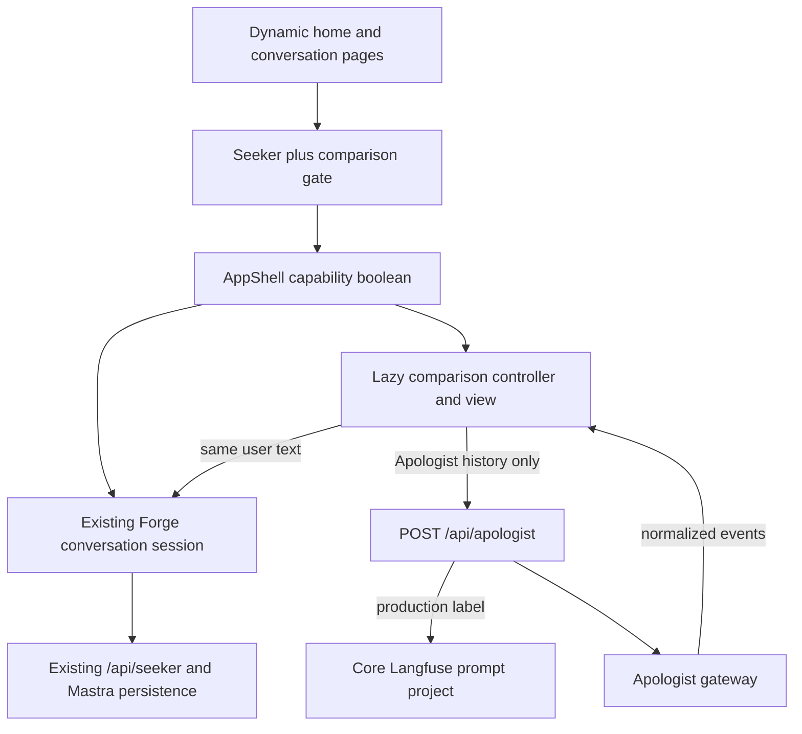
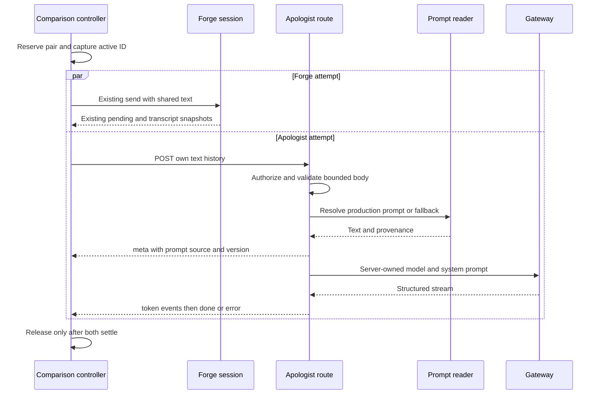
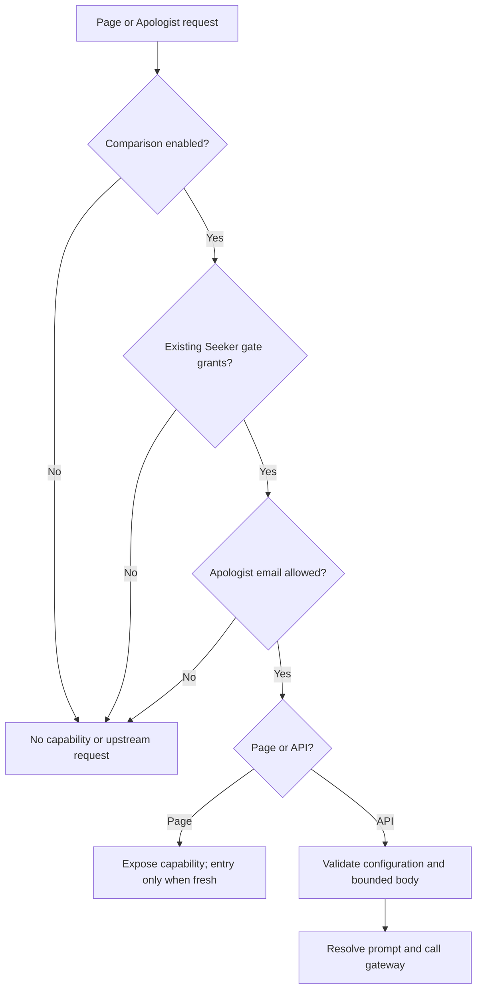

# Temporary Apologist Chat Comparison - Plan

## Goal Capsule

- **Objective:** Let selected internal testers compare Forge and Apologist answers throughout a conversation for informal testing and demonstrations.
- **Means:** A removable comparison feature within `apps/chat`, using the existing Seeker conversation and a separate Apologist integration adapted from `JesusFilm/core`.
- **Authority:** Product requirements below carry the user-confirmed interview decisions. Technical decisions govern implementation within those requirements. The supplied screenshot illustrates the two-pane idea; it does not fix the layout.
- **Execution:** Planning only in this change. A later implementation follows U1–U6, the Verification Contract, and normal PR-to-main deployment. No direct production deployment.
- **Stop conditions:** Do not enable comparison without verified Apologist configuration and production prompt access. Stop if matching Core requires a materially different product scope or weakening the existing identity boundary.
- **Ownership:** Feature tracked by `docs/roadmap/ai-chat/feat-601-apologist-chat-comparison.md`. The implementation PR creates the removal follow-up once the shipped code is known. Implementation can start with mocks; an authorized configuration owner must supply the enablement evidence in U6.

---

## Product Contract

### Summary

Add an optional comparison view to Forge Chat for selected internal users.
One composer sends each question to Forge and Apologist, with independent streamed answers.
Forge keeps its existing conversation history; Apologist exists only for the current comparison view.
The feature is temporary and designed for removal before public release.

### Problem Frame

Testers currently cannot inspect both systems' responses to the same sequence of questions in Forge Chat.
They need a convenient demonstration and exploration surface, without building an evaluation product or changing the public chat's identity.

### Requirements

**Access and entry**

- R1. Comparison is available in the existing deployed chat only when the comparison switch is enabled and the signed-in user passes both the existing Seeker gate and a separate Apologist email allowlist.
- R2. Show “Compare with Apologist” only on a fresh, empty conversation. Never seed Apologist from an existing Forge transcript or replay earlier questions to enter comparison.
- R3. Recheck comparison access server-side on every Apologist request; hiding the button is not authorization.

**Conversation behavior**

- R4. One shared composer sends identical user text to both agents, each using only its own conversation context. In comparison mode, reject a question over Core's 4,000-character text-field limit before either send; leave the draft editable and explain the limit. Ordinary Forge chat keeps its existing limit.
- R5. Both answers stream independently, and the shared composer cannot submit another turn while either answer is outstanding.
- R6. A shared Stop control cancels outstanding responses. A failure remains visible in its own pane without discarding the other answer; another shared question is allowed when both attempts settle. Individual retry controls are excluded.
- R7. Forge's suggested follow-ups send the selected question to both agents. Forge sources and featured videos remain available.
- R8. Preserve Forge's existing saving, history, ownership, and per-conversation URL behavior. Do not create a second Forge session or a comparison-specific persistence store.
- R9. Refresh, switching conversations, starting a new conversation, or exiting comparison discards Apologist's local transcript and comparison mode. Reopening a saved conversation displays Forge alone; entering comparison again requires a fresh conversation.

**Presentation and integration fidelity**

- R10. Show labeled side-by-side panes on desktop and labeled Forge/Apologist tabs on narrow screens, sharing one composer. Both requests run regardless of the selected tab.
- R11. Use Core's production Apologist endpoint, credential configuration, response limit, and system-prompt behavior, with the operator-approved `openai/gpt/4o-mini` model instead of Core's reported `google/gemini/3-flash`; explicitly choose Apologist rather than inheriting Core's optional provider selector.
- R12. Follow the production Langfuse prompt `apologist-world-cup-chat` rather than freezing a copy. Use Core's fallback behavior when prompt retrieval fails and visibly identify every response generated with that fallback.
- R13. Supply English as the default language and ESV as the translation, retaining Core's instruction to respond in the language the user types. No language selector.
- R14. Keep comparison UI, state, server adapter, and configuration isolated so removal leaves the ordinary Forge chat functional.
- R15. Preserve ordinary chat behavior and initial loading performance, including for users who never enter comparison.
- R16. Exclude scoring, evaluation dashboards, exports, dedicated transcript-copy controls, and public access to comparison.

### Key Decisions

- **Existing app, restricted audience.** (session-settled: user-approved — chosen over a separate staging app: testers should use the existing chat entry point.) Governs R1, R2, R3.
- **Shared questions and separate histories.** (session-settled: user-approved — chosen over independent composers: testers compare the same sequence of user questions.) Governs R4, R5, R6, R7.
- **Keep Forge persistence.** (session-settled: user-directed — chosen over making both chats temporary: preserve existing chat behavior and minimize disruption.) Governs R8, R9.
- **Desktop columns and mobile tabs.** (session-settled: user-approved — chosen over squeezing two columns onto a phone: keep answers readable.) Governs R10.
- **Adapt Core's production Apologist setup with an accepted model difference.** (session-settled: user-approved — chosen over a new general-purpose prompt or frozen prompt copy: compare against the existing integration.) Governs R11, R12, R13.
- **Removable informal prototype.** (session-settled: user-directed — chosen over a permanent comparison product: the eventual public experience exposes Forge alone.) Governs R14, R15, R16.

### Acceptance Examples

- AE1. Covers R1–R3. A Seeker-enabled user outside the Apologist allowlist sees no comparison entry and cannot call its API. An eligible user sees the entry only before the first message.
- AE2. Covers R4–R7. Apologist finishes first; Forge continues streaming. Submit and follow-up chips remain blocked until Forge settles. The next selected follow-up reaches both exactly once.
- AE3. Covers R6. Apologist fails halfway through an answer. Its partial text and failure remain visible, Forge completes, and the tester can submit another shared question.
- AE4. Covers R8, R9. After a successful comparison turn, refreshing the resulting `/c/<id>` restores only the saved Forge conversation. No Apologist transcript is reconstructed.
- AE5. Covers R9. Switching to another history row while Apologist streams cancels and discards that Apologist attempt. Its late completion cannot populate another conversation.
- AE6. Covers R10. Switching mobile tabs during generation changes visibility only; neither request restarts or cancels.
- AE7. Covers R11–R13. A production prompt fetch succeeds with English/ESV variables. If it fails on a later turn, that turn uses Core's fallback and displays a fallback notice; earlier successful turns retain their own provenance.
- AE8. Covers R14, R15. With comparison disabled or unavailable, the usual Forge chat still loads, streams, saves, and replays without contacting Apologist or Langfuse.
- AE9. Covers R4, R6. A question over 4,000 characters, whether typed or selected from a starter or follow-up, sends to neither agent and leaves the draft and both histories unchanged. A shorter question can then reach both. When accumulated Apologist history reaches its separate limit, the pane recommends New conversation.

### Scope Boundaries

This work changes `apps/chat` and its dependency lockfile, documentation, and roadmap only.
It does not change Seeker prompts, Mastra storage, auth issuance, Core source, or public-release prerequisites.

**Deferred to follow-up work:** removing this prototype before public launch is a later change, with its deletion boundary defined here. Create its roadmap ticket in the implementation PR, using the code that actually ships. Reconsider admission controls before widening beyond the small internal roster; this plan does not widen that roster's intended audience.

**Outside this product's identity:** a public side-by-side chatbot comparison, scoring system, or durable comparison archive, per R16.

---

## Planning Contract

### Evidence and Existing Boundaries

- `apps/chat/src/components/shell/app-shell.tsx` owns one `useConversations` instance and wires sending, stopping, sidebar navigation, and URL synchronization.
- `apps/chat/src/lib/conversation-session.ts` appends Forge turns, guards concurrent sends synchronously, and marks conversations persisted after Seeker success or established partial/stop cases. Do not bypass its decisions.
- `apps/chat/src/lib/use-conversation-url.ts` changes `/` to `/c/<id>` through shallow history writes without remounting. A pathname change alone is therefore not an exit from comparison.
- `apps/chat/src/components/chat/message-list.tsx`, `composer.tsx`, and `assistant-markdown.tsx` provide reusable presentation without copying the full `Chat` component, which includes its own composer and scroll layout.
- `apps/chat/src/lib/seeker-gate.ts` already requires a verified, normalized email and fails closed. `apps/chat/src/app/page.tsx` and `apps/chat/src/app/c/[id]/page.tsx` are dynamic server entry points.
- Core source inspected at commit `6108fdca7e0ea9085b11285ec81925361cc8d42c`: `apps/journeys/pages/api/chat/index.ts`, `apps/journeys/src/libs/langfuse/client.ts`, and `libs/journeys/ui/src/components/AiChat/AiChat.tsx`. GitHub lists a Production deployment for this SHA, but live provider settings and its deployment success were not established.
- Core defaults to model `openai/gpt/4o-mini`, caps output at 512 tokens, and accepts at most 40 messages, 4,000 characters per text field, and 40,000 aggregate characters in a 256 KiB body. These are source facts, not proof of deployed environment values.
- Core keeps the visible transcript in `useChat` memory and resends history. Its sessionStorage ID is for tracing, not transcript restoration. Core also writes configured Langfuse generation traces; an ephemeral UI does not imply no provider retention.
- Core's source uses AI SDK `^7.0.49` and OpenAI-compatible provider `^3.0.20`; Forge currently pins `ai` to `6.0.182` in admin and Mastra. Chat has neither AI SDK nor Langfuse dependencies.

### Key Technical Decisions

- KTD1. **Own comparison outside the Forge session.** Create a comparison controller and view under `apps/chat/src/features/apologist/`, mounted for one active conversation ID. Keep the existing `useConversations` instance above both normal and comparison presentations. This realizes R8, R9, R14 without adding provider fields to persisted messages or rewriting the session store. No bake-off is needed: a separate store for Forge would duplicate established persistence and ownership, while an outer controller fits the existing send/stop boundary.
- KTD2. **Keep authorization and optional configuration local.** Add a server-only comparison configuration/gate module under the feature directory. Compose the existing Seeker decision with the new switch and allowlist, using signed session identity rather than request-supplied identity. Pass only a boolean capability to the shell from both server entry points. Missing or malformed optional configuration must not throw at module initialization or break normal chat. R1–R3, R15 govern this boundary.
- KTD3. **Call the gateway from Forge, not Core's public chat route.** Core's route requires Journey/card identifiers and their feature gates. Adapt its provider/prompt behavior into an authenticated Forge route instead of inventing fake Journey context. The route lives at `apps/chat/src/app/api/apologist/route.ts`; implementation lives inside the feature directory. No cross-app import, Core proxy dependency, or direct browser access to provider credentials.
- KTD4. **Use Forge-compatible server SDKs and Forge-local SSE.** Add exact chat dependencies `ai@6.0.182` and `@ai-sdk/openai-compatible@2.0.78`; registry metadata confirms both use provider major 3 and the adapter accepts Zod 4. Use AI SDK 6's system-message option and plain user/assistant model messages, not Core's SDK 7 `instructions` or UIMessage transport. Consume structured stream events server-side and emit feature-owned `meta`, `token`, `done`, and `error` SSE events. Reuse `lib/sse.ts` for this normalized channel, not for parsing raw gateway frames. Keep the SDK server-only. Verify request parity against the inspected Core behavior and the real gateway before enablement.
- KTD5. **Read Core's production prompt explicitly.** Use a small feature-owned Langfuse REST reader, following the bounded-fetch pattern in `apps/mastra/src/services/langfuse-prompt-client.ts` without importing it. Fetch the text prompt by explicit `production` label, never infer it from Railway's environment name or `VERCEL_ENV`. Compile `language=English` and `translation=ESV`; missing, unresolved, or unsupported prompt shape/composition falls back visibly rather than claiming production parity. A 60-second successful-response cache may share fetches within a process; failures are not promoted to successful cache entries or hidden by stale serving. A request snapshots its resolved prompt/version before generation. See the official [Langfuse label contract](https://langfuse.com/docs/prompt-management/features/prompt-version-control). Governs the mechanism for R12, R13.
- KTD6. **Bound and contain every outbound operation.** Validate HTTPS URLs against exact operator-configured host allowlists, reject embedded credentials, and forbid redirects in the provider's custom fetch and prompt reader. Enforce a 256 KiB inbound byte cap before parsing, Core's message/text/aggregate limits, and only user/assistant text roles. Pin model, prompt, URLs, and output limit server-side. Use a 5-second prompt deadline within a 95-second overall request deadline; combine timeout, incoming request abort, and response-body cancellation. Cap prompt/error reads at 64 KiB, normalized answer text at 8,192 characters, and provider stream bytes at 1 MiB. Bound before buffering, including inside the provider fetch wrapper. Every connected stream ends with exactly one terminal event; malformed or early-ended upstream streams are failures. Cancel and release readers on all terminal paths; logs carry fixed reason codes without prompt text, keys, emails, raw upstream errors, or conversation IDs.
- KTD7. **Coordinate one pair synchronously.** Normalize text once and reject it before reserving the pair if its JavaScript string length exceeds Core's 4,000-character text-field limit; do not clear the draft, change either history, or dispatch either request. Apply this check to Enter, submit, starter questions, and follow-up chips. For accepted text, reserve a comparison send slot before either dispatch and call the existing Forge send plus the Apologist client without awaiting one before starting the other. Expose the existing store snapshot getter through the thin `useConversations` adapter and read it immediately after dispatch to capture the new Forge assistant ID and whether the send was accepted. Settle that receipt from its message identity and pending membership, never by waiting to observe a rendered pending transition; fast completions and refused sends must also release the pair. The Apologist attempt settles independently. A generation token prevents stale completions releasing a newer slot. Stop settles both attempts through their cancellation paths; it does not permit a new pair before the previous pair is actually released.
- KTD8. **Keep lifecycle tied to actions and identity.** Exit cancels/discards Apologist and restores the ordinary Forge view. Forge may finish under its existing session rules, including after sidebar navigation; explicit shared Stop cancels both. Reset comparison on New even when the empty conversation's ID does not change, on actual history selection/change, popstate traversal, sign-out/unmount, and denial. Do not reset on the first successful Forge turn's shallow URL replacement. Reset mobile presentation independently from network ownership. Per R9, returning to an earlier row never recovers comparison.
- KTD9. **Retain visible failures without fabricating history.** Apologist history contains the user questions attempted and only its own nonempty assistant text, including partial stopped/failed replies. Never insert error notices or Forge output as assistant context. If the prior attempt returned no text, retain its user message and send the next user message as a separate message; the server accepts consecutive user roles. Accumulated-history failures at Core's 40-message or 40,000-character request limit are terminal, not automatic retries or silent history truncation. The pane explains that history limit and points to New conversation; Forge remains usable. The separate 4,000-character limit on one question is handled before either send under KTD7. The common composer stays available after settlement per R6.
- KTD10. **Reuse presentation, load comparison on demand.** Use `MessageList` for Forge and feature-owned transcript/error presentation for Apologist, sharing only `AssistantMarkdown` and the common `Composer`. The existing message-list error formatter names Seeker and exhaustively handles Forge reasons, so do not send Apologist failures through it or widen Forge message/error types. Do not render two complete `Chat` instances. Use a lazy feature boundary after explicit entry, with a local loading/error fallback that retains the user's draft and allows returning to Forge. Keep one composer and independently scrollable labeled panes. At a defined desktop breakpoint of 1024px use columns; below it use keyboard-operable tabs. Each tab exposes its current attempt status in visible and accessible text: generating, complete, stopped, or failed; before the first attempt, show only the provider label. This lets testers identify outstanding work and failures in the hidden pane without switching tabs. Hide the inactive pane semantically without remounting the controller; pause hidden media. Follow-up focus restoration and streaming announcements must name their provider.
- KTD11. **No new agent tools or trace archive.** This feature changes the tester's view, not the Seeker agent's tools or prompt context. Apologist responses never enter Seeker memory, retrieval, or tracing. Browser automation can perform the same gated UI actions; no privileged service bypass or MCP surface is added. Fetching the Core prompt does not require copying Core's Langfuse generation-tracing writes. Preserve existing Forge telemetry, add only content-free comparison diagnostics, and do not promise erasure of upstream provider records when the local pane disappears.

### Configuration Boundary

All new values belong to the feature-owned server configuration and `apps/chat/.env.example`; none use `NEXT_PUBLIC_`.

| Setting                                                           | Purpose / default                                                                        |
| ----------------------------------------------------------------- | ---------------------------------------------------------------------------------------- |
| `APOLOGIST_COMPARE_ENABLED`                                       | Only literal `true` enables the feature; absent is off.                                  |
| `APOLOGIST_ALLOWED_EMAILS`                                        | Normalized CSV, empty denies everyone; composes with Seeker access.                      |
| `APOLOGIST_API_URL`                                               | Copy the verified Core production gateway base URL through secret configuration.         |
| `APOLOGIST_API_KEY`                                               | Core's authorized gateway credential, server-only.                                       |
| `APOLOGIST_MODEL_ID`                                              | Explicit operator-approved model: `openai/gpt/4o-mini`; intentionally differs from Core. |
| `APOLOGIST_ALLOWED_HOSTS`                                         | Exact gateway host allowlist; required for enabled deployed requests.                    |
| `APOLOGIST_LANGFUSE_BASE_URL`                                     | Core production prompt project's base URL.                                               |
| `APOLOGIST_LANGFUSE_PUBLIC_KEY` / `APOLOGIST_LANGFUSE_SECRET_KEY` | Core prompt-project access, separate names from any Forge tracing setup.                 |
| `APOLOGIST_LANGFUSE_ALLOWED_HOSTS`                                | Exact host pin for credentialed prompt retrieval.                                        |

No enablement mutation belongs to this planning change.
Record the verified model and prompt name/label/version, source SHA, credential presence, and date in operational evidence; never credential values or a private prompt body.

### High-Level Technical Design

**Component and data ownership**

**Request protocol**

**Mode and attempt lifecycle**

```mermaid
stateDiagram-v2
  [*] --> ForgeOnly
  ForgeOnly --> CompareIdle: Eligible fresh-chat entry
  CompareIdle --> ComparePending: Shared send
  ComparePending --> ComparePending: One side settles
  ComparePending --> CompareIdle: Both settle, fail, or stop
  CompareIdle --> ForgeOnly: Exit, New, navigation, refresh
  ComparePending --> ForgeOnly: Exit or navigation; discard Apologist
  note right of ComparePending
    URL minting and mobile tab changes preserve mode.
    Late Apologist callbacks cannot restore discarded state.
  end note
```

**Access decisions**

**Wire contract sketch:** The request contains a bounded list of plain user/assistant text messages, ending in a user message. It contains no credential, resource owner, model selector, prompt, or upstream URL. A successful SSE response sends `meta` with production/fallback provenance and optional numeric prompt version, `token` with answer text, then `done`. Failures send one `error` with a closed reason vocabulary. Pre-stream refusals use bounded JSON: 400 invalid input, 403 denied access, 413 oversized input, or 503 unavailable configuration. Both response forms are non-cacheable. The client maps either form to the same pane-local failed-attempt state. This contract is local to the feature; it does not change Seeker SSE or persisted message types.

### Risks, Dependencies, and Enablement Blockers

1. **Production rollout remains outstanding.** On 2026-10-02 the operator confirmed the same Core gateway URL/key and the intended production prompt project/version. Local integration succeeded. These confirmations resolve the earlier configuration-access questions; installing the approved settings in Forge production and running deployed smoke/disablement checks remain required. Do not guess settings or include secrets in evidence.
2. **Accepted model difference.** The operator reports Core production uses `google/gemini/3-flash`, which returned HTTP 422 during the Forge prototype investigation and was found unsupported. Forge intentionally uses `openai/gpt/4o-mini`; this is not an exact reproduction of Core's model configuration. [NES-1895](https://linear.app/jesus-film-project/issue/NES-1895/update-production-apologist-model-id-before-the-christmas-campaign) tracks Core's update before Christmas and does not block this comparison. Core's optional provider selector is not inherited.
3. **SDK-major difference can change request serialization.** U2 must verify system role, model, token-limit field, streaming behavior, and cancellation against Core. If the SDK 6 adapter cannot reproduce required gateway semantics, revise KTD4 before implementation continues rather than upgrading unrelated apps.
4. **Prompt updates can change responses mid-session.** R12 accepts live production updates; store provenance per attempt and do not imply reproducible benchmark results. Unsupported production prompt composition is a blocker to claiming parity, even though fallback can keep the pane functional.
5. **Shared credentials share quota and upstream retention.** Keep the internal allowlist small, use the existing deployment controls, and stop rollout on repeated authorization/quota failures. Local disposal under R9 is not deletion at Apologist. No additional Forge-owned Apologist archive is created.
6. **Unrelated stale package guidance exists.** `apps/chat/AGENTS.md` describes the original stub-only scaffold, while canonical `apps/chat/CLAUDE.md` and current code implement auth, Seeker, and persistence. The feature ticket supplies the required authorization boundary for new integration; any guide update should only correct the relevant stale constraints.

### Sequencing

U1 defines the capability boundary. U2 and U3 establish the route and client/state contracts. U4 wires the lazy view to existing session actions. U5 verifies behavior and loading impact. U6 verifies the approved integration and records rollout/removal instructions before the feature is enabled.
The work remains one feature scope; no shared provider framework or database work is justified.

---

## Implementation Units

### U1. Add the comparison capability and server configuration

**Goal:** Enforce R1–R3 without affecting default-off chat startup.
**Dependencies:** None; live credentials are not required for implementation.
**Files:** New `apps/chat/src/features/apologist/server/config.ts`, `config.test.ts`, `gate.ts`, and `gate.test.ts`; modify `apps/chat/src/app/page.tsx`, `apps/chat/src/app/c/[id]/page.tsx`, and `apps/chat/.env.example`; add `apps/chat/src/features/apologist/server/page-gate-wiring.test.ts`.
**Approach:** Implement KTD2. Resolve capability on both page entry points so New works after a saved-thread load, while denied shells remain inert. Feature configuration stays out of global startup validation.
**Patterns:** `lib/seeker-gate.ts`, its tests, and force-dynamic entry points.
**Test scenarios:**

1. Covers AE1. Switch off, absent/empty allowlist, anonymous, unverified email, and Seeker denial all refuse comparison and perform no external request.
2. Mixed-case and whitespace-normalized allowlisted verified email grants only when both gates pass.
3. Home and deep-link entry wiring expose the same capability, but denial shells cannot render entry.
4. Missing/malformed provider settings do not crash ordinary page, health, or auth routes.

**Verification:** Capability truth table and page wiring pass without production credentials.

### U2. Adapt Core's provider and production prompt behind a bounded route

**Goal:** Implement R3, R11–R13 with contained failures.
**Dependencies:** U1.
**Files:** New `apps/chat/src/app/api/apologist/route.ts`, `route.test.ts`, and `route.gate-wiring.test.ts`; new feature files `server/prompt.ts`, `prompt.test.ts`, `server/provider.ts`, `provider.test.ts`, and `protocol.ts`; modify `apps/chat/package.json` and `pnpm-lock.yaml`.
**Approach:** Implement KTD3–KTD6 and the wire sketch. Keep the route thin and inject fetch/config/gate dependencies into testable feature functions. Read the signed chat cookie through existing helpers. Send prompt metadata before tokens so partial failures retain their prompt provenance. Reject client-authored system messages and unknown request fields.
**Patterns:** Seeker route's injected core and terminal-event handling; `lib/server/mastra-upstream.ts` for bounded reads, signal composition, and egress validation; Mastra's Langfuse REST reader as reference only.
**Test scenarios:**

1. Authorized text history produces the configured model/system/output-limit request and one normalized streamed answer, with no Forge messages in the Apologist body.
2. Covers AE7. Production prompt resolution compiles English/ESV and records version; 404, timeout, bad type, unresolved template, or missing prompt credentials yields Core's exact fallback and visible metadata.
3. Cache reuse expires after its bound, refreshed prompt changes apply to a later attempt, and a failed refresh is labeled fallback rather than production.
4. Denied access or invalid body performs no Langfuse or gateway call; oversized byte/text/history inputs fail before unbounded allocation.
5. Off-list hosts, redirect responses, URL credentials, and client-supplied prompt/model/owner are refused without leaking secrets or raw errors.
6. Fragmented streams, early EOF, upstream errors, oversized output, Stop/disconnect, and timeout each settle once and release/cancel all readers.
7. Fixture-level request parity covers SDK 6 serialization versus Core's intended SDK 7 provider behavior; no real generation is required for unit coverage.

**Verification:** Gate, transport, prompt, and stream tests pass; real gateway parity remains a U6 enablement check.

### U3. Add a temporary comparison controller and Apologist client

**Goal:** Coordinate R4–R9 without altering Forge persistence.
**Dependencies:** U2's protocol.
**Files:** New `apps/chat/src/features/apologist/client.ts`, `client.test.ts`, `use-comparison.ts`, `use-comparison.test.tsx`, and `use-comparison.strictmode.test.tsx`; expose the existing read-only snapshot getter in `apps/chat/src/lib/use-conversations.ts` and cover it in `use-conversations.test.ts`.
**Approach:** Implement KTD7–KTD9 around injected Forge actions and observable pending state. Own only comparison mode, current conversation identity, paired-send admission, and Apologist messages/attempt state. Persist none of this in cookies, localStorage, sessionStorage, URLs, or the database.
**Patterns:** Existing conversation session's synchronous admission and stale-callback handling; `use-conversations.ts` StrictMode activation discipline.
**Test scenarios:**

1. Covers AE2. Same-tick double submit dispatches exactly once per agent; either completion order holds the common lock until both settle.
2. Covers AE3. One-side failure retains both visible outcomes and permits the next shared question without retrying a completed side.
3. Shared Stop before first token or after one provider finishes cancels only outstanding work; late callbacks cannot release the next pair.
4. Covers AE5. Switching ID, New with unchanged empty ID, browser history traversal, explicit exit, and unmount discard Apologist and suppress stale writes.
5. The first shallow `/c/<id>` URL replacement does not reset comparison; subsequent refresh creates no Apologist state.
6. StrictMode cleanup/setup leaves the controller usable without duplicate sends, leaked readers, or permanently disabled submission.
7. Consecutive user messages after failure, partial assistant context, and Core's history caps follow KTD9 without mixing provider histories.
8. Forge completes before a React render, or declines a send synchronously: receipt-based observation settles the pair without waiting for a pending transition that never renders.
9. Covers AE9. A normalized question over 4,000 characters from any send entry point starts neither request and leaves the draft and both histories intact; a shorter question remains sendable to both.

**Verification:** State tests prove pair admission, cleanup, and isolation using controlled stream completions and existing session behavior.

### U4. Add the lazy comparison view and shell integration

**Goal:** Deliver R2, R7, R10, R14, R15 while retaining normal chat composition.
**Dependencies:** U1, U3.
**Files:** New `apps/chat/src/features/apologist/comparison-view.tsx`, `comparison-view.test.tsx`, `comparison-boundary.tsx`, and `comparison-boundary.test.tsx`; modify `apps/chat/src/components/shell/app-shell.tsx` and `app-shell.test.tsx`; if needed, add a small entry slot to `apps/chat/src/components/chat/chat.tsx` with coverage in `chat.test.tsx`.
**Approach:** Implement KTD10 and route all comparison actions through U3. Keep the existing session mounted above the lazy subtree. Reuse message rendering, source/video components, and the composer through props. Wire action-driven cleanup into sidebar selection, New, popstate callback, and exit, without changing the ordinary navigation behavior.
**Test scenarios:**

1. Covers AE1. Only eligible empty chats show entry; a draft survives entry and exit; loaded or adopted history never qualifies as fresh.
2. Covers AE2, AE6. Columns and tabs expose provider labels, one composer, and keyboard-accessible tab selection; toggling tabs does not restart streams. When the visible provider finishes first, the hidden provider's tab still shows an accessible generating status and the shared send remains blocked. Hidden-provider failure and shared Stop update the appropriate tab status without announcing hidden response text; another shared send becomes available once both attempts settle.
3. Follow-up chips send to both, retain Forge's `promptSource` marker, and cannot bypass the common pending guard.
4. Forge sources/videos retain existing safe rendering; hidden mobile video does not continue playing; malicious Apologist Markdown remains inert through the existing renderer.
5. Prompt fallback notices remain attached to the correct response, including after a later production prompt succeeds.
6. A lazy-load/render failure is contained to comparison, preserves the ordinary session/draft, and provides a usable return to Forge.
7. Focus moves predictably on entry, tab changes, follow-up sends, and exit; provider-specific announcements avoid duplicate hidden-pane speech.
8. Apologist configuration/auth/network/cap failures name Apologist and do not enter the Forge error formatter or alter its error union.
9. Covers AE9. The shared composer explains the single-question limit without truncating the draft; an accumulated-history failure instead points to New conversation.

**Verification:** Component coverage and later browser proof show the screenshot's intent in the existing chat's visual language, without adding a second composer.

### U5. Verify lifecycle integration and performance

**Goal:** Prove R8, R9, R15 end to end.
**Dependencies:** U2–U4.
**Files:** Extend `apps/chat/src/components/shell/app-shell.test.tsx`; add `apps/chat/src/features/apologist/comparison.integration.test.tsx`.
**Approach:** Exercise the real Forge session under mocked transports before changing any session interface. Use the existing local gated-stack recipe for browser verification, with mocks for deterministic failures and authorized credentials only for U6. No production generation during planning.
**Patterns:** `docs/solutions/developer-experience/chat-mastra-gated-stack-local-smoke-recipes.md` and `docs/solutions/conventions/frontend-change-page-load-performance-verification.md`.
**Test scenarios:**

1. Covers AE4. A real session comparison turn reaches normal persisted state and URL; reload replays Forge alone, and New exposes entry again.
2. Existing history rename/replay, unavailable deep links, sign-out, and back/forward behavior remain correct with comparison off and after exiting it.
3. Direct unauthorized API calls fail despite manually fabricated client capability.
4. A failed or stopped Forge attempt preserves its existing persistence semantics; the UI never promises recovery for a thread the backend did not establish.
5. Covers AE8. Disabled and eligible-but-unopened loads make zero Apologist/Langfuse calls; provider SDKs are absent from browser bundles and the comparison view is absent from the initial request set.
6. Compare before/after load traces under matched browser/cache/viewport conditions, then separately measure comparison entry and first-video mount for layout shifts and long tasks.

**Verification:** Run the browser checks and inspect actual performance measurements, not screenshots alone. Investigate any repeatable initial-load regression beyond baseline variance before completing the feature. Do not commit one-off verification documents, traces, screenshots, or measurement artifacts. A brief PR note stating that the change was tested in the local browser is sufficient; no separate verification report is required.

### U6. Verify the approved integration and document enablement and removal

**Goal:** Establish R11, R12 and make R14 operationally concrete.
**Dependencies:** U1–U5; authorized Core production configuration and Langfuse access.
**Files:** New `docs/operations/apologist-comparison.md` and a removal ticket under `docs/roadmap/ai-chat/` with the next global `feat-NNN` ID; update `apps/chat/README.md`, relevant canonical package guidance, `docs/roadmap/ai-chat/feat-601-apologist-chat-comparison.md`, and the lane README.
**Approach:**

1. Retain the operator's gateway URL/key and production prompt project/version confirmations and the accepted model difference in operations documentation. Source comparison confirms 512 output tokens and no explicit temperature, top-p, or penalties in either implementation. Supply the approved settings to Forge production through the normal secret store; retain only nonsecret evidence.
2. Confirm one controlled multi-turn Apologist conversation, cancellation, and production prompt provenance using the isolated route before enabling the shared feature for selected testers.
3. Deploy through the normal PR-to-main path with comparison off, supply verified configuration and exact host pins, then enable for the selected roster using normal configuration rollout. A live configuration gap blocks enablement, not unrelated Forge access.
4. Document rollback as disabling the comparison switch through the normal configuration path. Existing streams may finish until canceled or their deadline; new requests refuse after the new configuration is active.
5. Document deletion of the feature directory, API route, page capability plumbing, shell entry/lazy boundary, dedicated tests/settings, and chat-only SDK dependencies. Revert any now-unused presentation slot and read-only snapshot exposure, and update the lockfile; retain normal Forge session/history behavior. In the same implementation PR, create and link a removal ticket using the final symbols and paths. Give it the public-release trigger, a binding keep-list, drift-resistant searches and a rename covenant, verification, and separate operator configuration cleanup. Make its dependency on this feature bidirectional and add it to the lane index.

**Test scenarios:**

1. Verified live request uses the intended model and production prompt provenance; a two-turn conversation refers only to its own previous answer.
2. Missing/invalid credentials leave Forge usable and Apologist visibly unavailable; no credential or prompt content appears in browser traffic, logs, or committed evidence.
3. Disablement refuses new Apologist requests after normal configuration rollout, including from already-open tabs.

**Verification:** Keep production-enablement evidence and outstanding prerequisites in the operations documentation; no separate local verification report is required. Mark the feature ticket complete only with implemented, validated code and its PR resolution; planning alone does not satisfy it.

---

## Verification Contract

| Scope         | Check                                                             | Done signal                                                                                               |
| ------------- | ----------------------------------------------------------------- | --------------------------------------------------------------------------------------------------------- |
| U1–U4         | `pnpm --filter @forge/chat test`                                  | New boundary cases and existing chat suite pass.                                                          |
| U1–U4         | `pnpm --filter @forge/chat lint`                                  | No package lint failures.                                                                                 |
| U1–U4         | `pnpm --filter @forge/chat typecheck`                             | Strict types pass across client/server boundaries.                                                        |
| U1–U5         | `pnpm --filter @forge/chat build`                                 | Default-off build succeeds; dynamic entry/route behavior remains intact; provider code stays server-side. |
| Changed files | `pnpm exec prettier --check` with touched paths                   | Formatting passes for code and documentation; updated lockfile matches declared dependencies.             |
| PR scope      | Repository affected-service CI checks                             | Chat and any lockfile-triggered checks pass without skipping hooks or required jobs.                      |
| U5            | Controlled browser flow and performance checks                    | AE1–AE8 work; measurements support unchanged ordinary loading and bounded comparison activation.          |
| U6            | Authorized integration smoke and nonsecret configuration evidence | Approved model, gateway, and production prompt behavior are verified before enablement.                   |

No tests, builds, paid generations, or deployment changes are performed as part of writing this plan.
The verification commands describe the later implementation contract.

---

## Definition of Done

- R1–R16 are implemented, U1–U6 checks pass, and no production-enablement blockers remain. U6 operational evidence remains required; one-off local verification artifacts are not committed.
- Ordinary Forge saving, ownership, deep links, history, and UI behavior remain intact.
- Production prompt/fallback provenance and independent failure behavior are visible and truthful.
- Default-off and unauthorized paths do no comparison network work and expose no secrets.
- Browser behavior and page-load measurements cover both ordinary chat and comparison activation.
- Rollback and removal are documented; no unused experiment scaffolding or abandoned implementation remains.
- The implementation PR creates a tracked removal ticket that reflects the shipped comparison code and remains open until the prototype is removed before public release.
- The feature roadmap entry and lane index reflect the code PR, rather than claiming completion for this document.

---

## Sources and Research

- Core reference snapshot: [chat API](https://github.com/JesusFilm/core/blob/6108fdca7e0ea9085b11285ec81925361cc8d42c/apps/journeys/pages/api/chat/index.ts), [Langfuse configuration](https://github.com/JesusFilm/core/blob/6108fdca7e0ea9085b11285ec81925361cc8d42c/apps/journeys/src/libs/langfuse/client.ts), and [chat state](https://github.com/JesusFilm/core/blob/6108fdca7e0ea9085b11285ec81925361cc8d42c/libs/journeys/ui/src/components/AiChat/AiChat.tsx).
- [AI SDK OpenAI-compatible provider](https://ai-sdk.dev/providers/openai-compatible-providers) — server adapter boundary; package registry metadata for the selected versions confirms compatible provider majors, not runtime gateway parity.
- [Langfuse prompt version control](https://langfuse.com/docs/prompt-management/features/prompt-version-control) — explicit production-label fetching and missing-label behavior underpin KTD5.
- `docs/solutions/runtime-errors/nextjs-force-dynamic-runtime-env-flag-static-optimization-20260626.md` — retain dynamic server capability reads in U1.
- `docs/solutions/logic-errors/react-strictmode-remount-safety-hook-lifetime-refs.md` — controller activation and cleanup coverage in U3.
- `docs/solutions/design-patterns/async-single-flight-slot-release-hazards.md` — synchronous pair admission and identity-checked cleanup in KTD7; cache-flight release on success and rejection in U2.
- `docs/solutions/conventions/frontend-change-page-load-performance-verification.md` — separate initial-load and lazy-mount measurements in U5.
