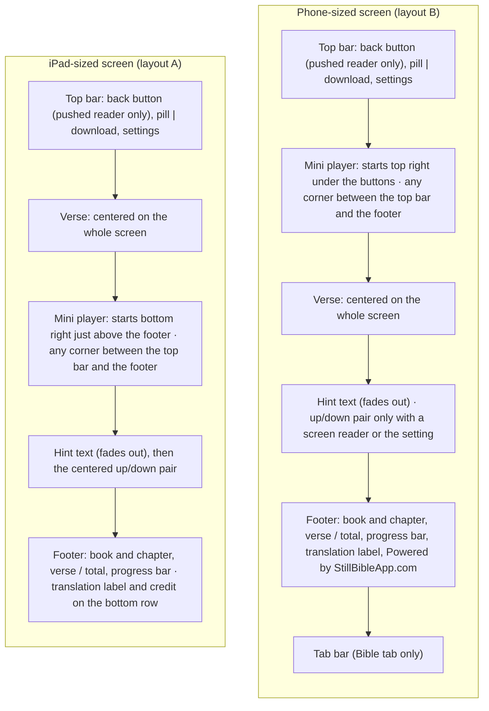
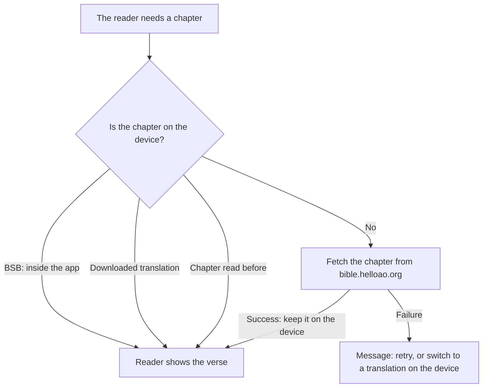
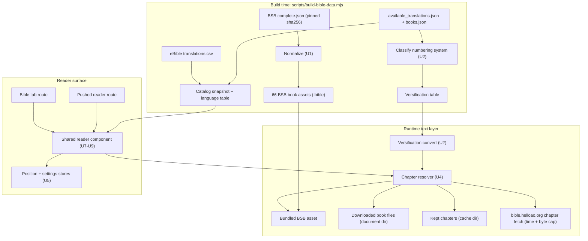
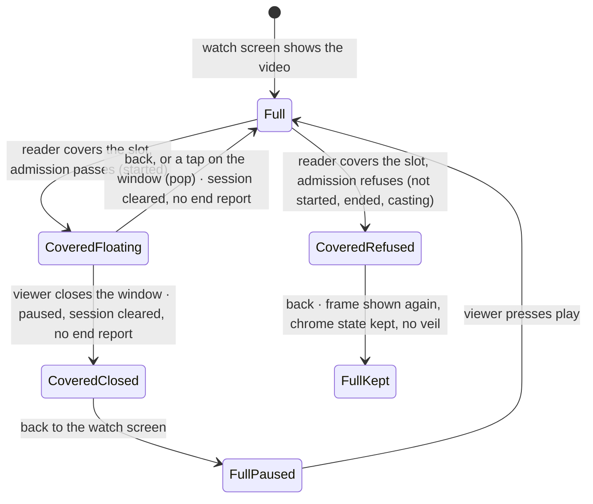
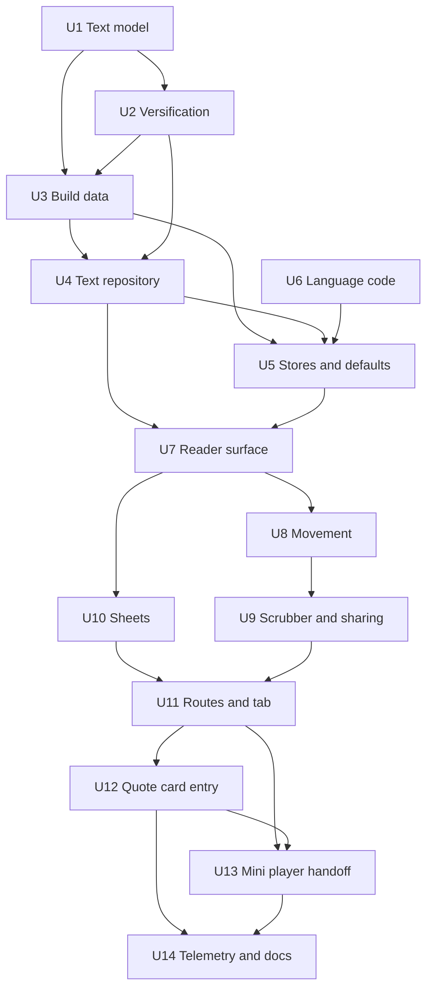

# Native Bible Reader - Plan

## Goal Capsule

**Objective.** A viewer reads Scripture one verse at a time inside the app, from a Bible quote or from a Bible tab. The text opens fast, works without internet once it is on the device, and resumes at the verse where the viewer stopped.

**Means.** A native reader in `apps/mobile`, in the style of the Still Bible app (stillbibleapp.com). It reads the Free Use Bible API at `bible.helloao.org`, and it carries the Berean Standard Bible (BSB) inside the app (KD5, KD6, KTD1).

**Product authority.** `apps/mobile` only. No change to `apps/admin`, `apps/web`, or `apps/tv`. The quote cards keep their current admin-resolved text. The Product Contract wins on behavior; the Planning Contract's KTDs win on mechanism.

**Stop conditions.** Stop and ask before any of these:

- An edit under `apps/admin`, `apps/web`, or `apps/tv`.
- A new native module other than `expo-clipboard` (KTD15).
- A change to the mini player on routes that are not reader routes (KTD10, KTD11).
- A license check that excludes BSB or the Russian Synodal Bible from the catalog (KTD7).
- A whole-translation parse that runs out of memory on the Pixel 9a emulator (KTD4).
- The iPad reader turns to landscape in the U7 check (KD25). The owner then chooses the landscape layout.

**Execution profile.** Three phases: text data (U1-U6), reader surface (U7-U10), then integration (U11-U14). Pure modules come first and are test-first. Each unit can land on its own commit.

**Tail ownership.** The implementer owns the three-device manual run, the Esther 8:9 check, and the timing evidence (Verification Contract). The product owner owns the native build for TestFlight.

**Open blockers.** None.

---

## Product Contract

**Product Contract preservation:** changed in planning on 2026-09-24, user-directed. R14, R20, KD18, and AE8 changed: every verse move now crosses chapters (KD19), and a long verse shrinks to fit (KD20). Added R39 (pill animation), R40 (mini player handoff), R41 (default translation follows the audio language), R42 (the viewer sees each translation's own numbers), KD19 to KD23, and AE12 to AE17. R1 gained a citation qualifier and R38 an anchor rule. After the plan review, R28 and AE5 gained the 30 MB limit on kept chapters (KD24), and KD25 deferred the iPad landscape layout to a U7 check. On 2026-09-25, R10 changed so the mini player can rest in any corner on both devices (KD26), and AE18 was added. The same day, the Still permission assumption became a confirmed fact. Later that day, a code-review fix exposed an empty verse area on the iPhone SE, and KD27 was added. The owner then set its order: center, then move before scroll. The deferred planning questions moved into KTD1 to KTD19. The other IDs and meanings are unchanged.

### Summary

A native Bible reader shows one verse at a time, in the style of the Still Bible app. "Read Full Passage" opens it over the video, and a new Bible tab opens it at the last verse read. It gets free-use translations in the viewer's language from `bible.helloao.org`, and it ships BSB inside the app for offline English. The work adds a text data layer, a reader surface shared by two routes, and a change to the root player host so that a pushed screen starts the mini player.

### Problem Frame

"Read full passage" on a Bible quote card opens `bible.com` in an in-app browser sheet (`apps/mobile/src/lib/openPassageSheet.ts`). The sheet loads a web page for each tap, so it is slow and it needs internet. It also forgets the reader's place: the next tap opens the cited verse again, and the app has no way to continue reading.

The sheet pauses the video and leaves the app's design for a web page. The quote card itself shows only the cited verses. English card text is already BSB, because admin resolves a passage with no language to YouVersion version 3034 (`apps/admin/src/services/scripture-passage.service.ts`).

Datadog has recorded taps on the button since 2026-08-28, because production RUM names each tap from its accessibility label, "Read full passage". Nobody has queried that count yet, so the value of a native reader is still the product owner's assumption (see Dependencies / Assumptions).

### Key Decisions

- KD1. **Two ways in: "Read Full Passage" and a Bible tab.** The saved position (R4) needs a way back in that does not need a quote. (session-settled: user-directed — chosen over a quote-only entry and a resume entry placed elsewhere: the reader must be reachable on its own.) Governs R1, R2, R3.
- KD2. **One reading position for both ways in.** A quote visit moves the tab's position, as in YouVersion. (session-settled: user-approved — chosen over a separate tab position and a second "back to" position: one position is the simplest model.) Governs R4.
- KD3. **The video keeps playing in the mini player while the viewer reads.** (session-settled: user-directed — chosen over pausing the video and over pausing with the window shown: the viewer can listen and read at the same time.) Governs R5, R10, R40.
- KD4. **Translations follow the viewer's language, from a large free-use catalog.** On 2026-09-24 the catalog listed 1,256 translations in 1,004 languages; 207 were complete Bibles in 117 languages. (session-settled: user-directed — chosen over BSB plus a hand-picked short list and over BSB only: more viewers can read in their language, and no person checks each text.) Governs R22, R23, R25.
- KD5. **The app reads `bible.helloao.org` directly.** The "never from a public Bible mirror" rule in `apps/mobile/CLAUDE.md` now covers the quote card only. Its four quality rules move to the reader (R26). (session-settled: user-approved — chosen over admin serving the text and over a copy we host: only mobile changes; if the catalog is down, only text not on the device stops.) Governs R26, R31.
- KD6. **BSB ships inside the app; other translations load one chapter at a time, with a download button.** (session-settled: user-directed — chosen over chapter-at-a-time for all translations and over a whole translation on first open: English works offline from install, and each install is about 2 MB larger.) Governs R27, R28, R29, R30.
- KD7. **Three Still extras: verse sharing, a verse scrubber, and a first-run swipe demo.** The scrubber replaces "Hold to return to verse 1", as Still itself plans. (session-settled: user-directed — chosen over the book rail: the owner picked three of the four offered extras.) Governs R16, R18, R19.
- KD8. **Seven settings.** The owner asked for Mode and Text size and chose all four offered extras; the phone arrow opt-in comes from KD11. (session-settled: user-directed — chosen over a sheet with Mode and Text size only: the owner chose every offered extra.) Governs R33.
- KD9. **The layout differs by device, and the verse is centered on the whole screen.** Phones use sketch layout B (mini player at the top right). iPad-sized screens use layout A (mini player above the footer). (session-settled: user-directed — chosen over the other two sketched layouts on each device: the owner judged the sketches.) Governs R7, R10.
- KD10. **The reader uses the app's look, not Still's.** It uses the app's warm stone colors, the app's glass buttons, and a fading hint. "Powered by StillBibleApp.com" replaces Still's "One verse at a time". (session-settled: user-directed — chosen over Still's green palette and tagline: the reader must look like the rest of the app.) Governs R8, R9, R15, R34.
- KD11. **Phones hide the up/down buttons unless a screen reader or a setting turns them on.** iPad-sized screens always show them. (session-settled: user-approved — chosen over screen-reader-only and over always shown: this meets the `PRODUCT.md` no-gesture floor and keeps the phone screen clear.) Governs R11.
- KD12. **Everything ships in one release, accepted after a manual run on three devices.** (session-settled: user-directed — chosen over a phased release: the owner had no phasing preference and wants one tested release.) Governs the Success Criteria.
- KD13. **The audio language picks the default translation, and a missing book falls back to the phone's language, then to BSB.** The viewer chose that language to watch in. 1,049 of the 1,256 catalog translations are partial, so books are often missing. A partial Bible may be a default on purpose: admin allows only complete Bibles as quote-card defaults, but KD4 chose reach over hand-checked quality. Governs R22, R25.
- KD14. **The reader has its own theme, and the rest of the app stays dark.** App-wide light mode is a separate project. Android and iOS 18 therefore show the app's dark tab bar under a light reader page. Governs R35.
- KD15. **The pill adds a verse step that Still does not have.** Still stops at the chapter, and the owner asked to pick "another verse or chapter". Governs R17.
- KD16. **The "N verses this visit" counter is dropped.** The Still credit uses its place in the footer. Governs R9.
- KD17. **The reader reports its use to Datadog.** The existing "Read full passage" tap count is the baseline, and the reader events show the change after the release. Governs R37.
- KD18. **Small defaults come from Still and from the sketches.** Like Still, the reader starts at John 3:16 and stops the hint once the viewer has learned the swipe. The tab order is the one every sketch showed. Governs R2, R3, R15.
- KD19. **Every verse move crosses chapter boundaries, and the pill animates on each chapter change.** (session-settled: user-directed — chosen over a "Next chapter" button, over arrows that cross while swipes stop, and over the picker as the only path: reading must flow for viewers who cannot swipe.) Governs R14, R39.
- KD20. **A long verse shrinks to fit, and scrolls only at the minimum size.** (session-settled: user-directed — chosen over scrolling at the chosen size: the viewer sees the whole verse at once.) Governs R20.
- KD21. **The watch screen and the mini player hand the video over with no gap, no restart, and no second watch screen.** Planning chose the four cases in R40 from the existing session rules. Governs R40.
- KD22. **The default translation follows the audio language until the viewer picks one.** A saved pick means the viewer chose it; an offline stand-in is not a choice. Governs R41.
- KD23. **The viewer sees each translation's own verse numbers; storage uses BSB numbers.** A reference then means the same passage in every translation (R38), and each screen reads like the printed Bible. Governs R38, R42.
- KD24. **Kept chapters are limited to 30 MB, and the oldest go first.** About 3,000 chapters fit, and a downloaded translation is never removed by the limit. (session-settled: user-approved — chosen over an unlimited cache: low-end phones have little free storage.) Governs R28.
- KD25. **The iPad landscape layout waits for a U7 check.** The app locks to portrait at launch, but iPadOS can ignore that lock for an app that supports multitasking, so the case may never happen. If the U7 check shows the reader turns to landscape, the owner chooses between a smaller window on reader screens and a verse column beside the window. (session-settled: user-approved — chosen over choosing a landscape layout now: nobody knows yet whether the iPad reader rotates.) Governs R7, R10.
- KD26. **In the reader, the mini player can rest in any of the four corners on both devices, always between the top bar and the footer.** The start corner stays top right on a phone and bottom right on an iPad (KD9). (session-settled: user-directed — chosen over top corners only on phones and bottom corners only on iPad: the viewer decides where the video sits.) Governs R10.
- KD27. **The verse stays centered while it fits there; a verse that would scroll moves into the free space first.** The centered verse area (KD9) is the same height above and below the screen center. On a short screen, such as the iPhone SE Bible tab, the obstacles leave little room there: a bottom-corner window sits at the center, and the swipe hint raises the footer. The verse fits in the centered area when it can, at any size down to the floor (R20). Only a verse that would scroll there moves into all the free space between the obstacles, fits again, and scrolls only if it still does not fit. Loading, a message, and the missing-verse note use the centered area unless it is under 160 points. (session-settled: user-directed on 2026-09-25, in two steps — chosen over top corners only on short screens, over shipping with the verse hidden, over the largest text first, and over a position fixed before the fit: the window stays in any corner, nothing covers the verse, and a short verse stays centered.) Governs R7, R10, R20.

### Requirements

**Ways in and reading position**

- R1. "Read Full Passage" on a Bible quote card opens the reader at the first verse of the cited passage, pushed over the watch screen. The Bible.com sheet no longer opens from this button. Every quote card whose citation names a book and a chapter shows the button at every text size, including a card with no admin text. To make room, the card shortens the verse, never the button. A citation with no verse opens verse 1.
- R2. A new Bible tab shows the reader. The tab bar order is Home, Discover, Bible, Library, Profile.
- R3. The Bible tab opens at the saved reading position (R4). With no saved position, it opens at John 3:16.
- R4. The reader keeps one reading position (book, chapter, verse, and translation) for both ways in. It saves the position on the device at each move, and the position survives an app restart.
- R5. When a video plays and the viewer taps "Read Full Passage", the video keeps playing in the mini player.
- R6. The pushed reader has a back button to the left of the pill, and back returns to the watch screen. A chapter swipe never closes the reader. On iOS 26, the system back swipe covers the full screen width unless a screen narrows it. The reader narrows it to a thin left-edge strip, as the watch screen does (`apps/mobile/CLAUDE.md`). On Android, the system back gesture keeps both screen edges, and a chapter swipe that starts inside the screen stays in the reader.
- R40. The watch screen and the mini player hand the video to each other in these four cases:
  - When the video has not started at the tap, autostart stops, and no window shows.
  - A tap on the window returns to the watch screen under the reader. It never opens a second watch screen.
  - After the viewer closes the window, back returns to the watch screen with the video paused where it stopped.
  - In every other case, back keeps the video playing or paused as it was, from the same point.

**Reading surface**

- R7. The reader shows exactly one verse, centered horizontally and vertically on the screen, in a large reading typeface.
- R8. The top bar holds the pill at the left, and the download button and the settings button at the right. The back button, the pill, and both buttons use the app's glass button style.
- R9. The footer shows the book and chapter, a "verse / total" counter whose total is the chapter's last verse number, a progress bar for the position in the chapter, the translation label, and "Powered by StillBibleApp.com".
- R10. In the reader, the mini player starts in the top-right corner under the top-bar buttons on phone-sized screens, and in the bottom-right corner just above the footer on iPad-sized screens. The viewer can drag it to any of the four corners on both devices. A top corner sits just under the top bar, and a bottom corner sits just above the footer. In no corner does it cover the verse, the pill, the top-bar buttons, or the footer.
- R11. iPad-sized screens show a centered pair of up/down buttons above the progress bar, with the down button filled. Phones show the pair only while a screen reader is on, or while the "Show arrow buttons" setting is on.
- R12. A swipe up moves to the next verse, and a swipe down moves to the previous verse. A swipe left moves to the next chapter, and a swipe right moves to the previous chapter.
- R13. During a chapter swipe, the reader shows the destination chapter. At the first or last chapter of the Bible, it says that no chapter follows.
- R14. At the last verse of a chapter, a verse move forward opens the first verse of the next chapter. At verse 1, a verse move back opens the last verse of the previous chapter. Swipes, the up/down buttons, and the screen reader's verse actions all move this way. Only Genesis 1:1 and Revelation 22:21 stop a move, and the reader says that no verse comes before or after.
- R39. Each chapter change plays a short animation on the pill, so the viewer sees that the chapter changed. With Reduce Motion on, the pill changes without movement. Opening the reader plays no animation.
- R15. The hint "Swipe up for verses, sideways for chapters" fades in, bounces up gently three times over about 3 seconds, and fades out. It plays at each reader open until the viewer first swipes between verses. With Reduce Motion on, it fades without the bounce.
- R16. A swipe demonstration plays once per install, at the first reader open.
- R17. The pill opens a picker in three steps: a book, a chapter, and a verse. The reader then opens at the chosen verse.
- R18. A drag along the progress bar moves the reader to any verse in the chapter.
- R19. A tap on the verse selects it. The selection stays while the viewer swipes, and a tap on the next or previous verse adds it, within one chapter. A bar shows the selected reference with Copy, Share, and Clear. Copy and Share output the text, the reference, and the translation name.
- R20. The verse text keeps the viewer's chosen text size. When a verse does not fit the verse area, its size steps down until it fits, to a floor of 70% of the chosen size and never below 18 points. Only a verse that still does not fit at the floor scrolls inside the verse area. Example: BSB Esther 8:9, the longest verse in the Bible.
- R21. A verse that the translation does not contain shows a short note in its place, never a blank screen. Example: BSB has no Matthew 18:11, so the note shows between 18:10 and 18:12.

**Text and translations**

- R22. The default translation matches the viewer's audio language (KD13). With no match, the reader uses the phone's language, and then BSB.
- R41. The default translation follows the audio language until the viewer picks a translation, and after that the pick stays. When the default translation's chapter is not on the device and the device is offline, BSB shows with a label, and the reader does not save BSB as the choice. The R31 switch lasts for the current session only.
- R23. The translation label opens a translation picker. The picker lists the viewer's language first and lets the viewer choose any catalog language. Each entry shows the name, whether the Bible is complete or partial, and the credit. A search field filters the list by language or translation name, as the app's language sheets do.
- R24. A translation change keeps the same passage (R38), and the reader keeps the choice.
- R38. Quotes and the saved position use BSB verse numbering. Before it shows a verse, the reader converts the reference to the current translation's numbering, so the same passage opens in every translation. A verse with no BSB counterpart saves as the next verse that has one. Example: the Russian Synodal Bible numbers BSB Psalm 23 as Psalm 22.
- R42. The viewer always sees the shown translation's own verse numbers: in the counter, the pill, the picker, the scrubber, and shared text. A translation shows Psalm titles where it numbers them as verses (Russian Synodal), and BSB keeps them hidden.
- R25. When the current translation lacks a book, the reader shows that book in the phone language's default translation if that translation has the book, and otherwise in BSB. A visible label names the translation shown, and one tap opens the translation picker.
- R26. The reader gets translation text from `bible.helloao.org`. The text follows four rules: every verse is present, footnotes never appear inside verse text, poetry lines are complete, and the reader credits the translation.
- R27. BSB ships inside the app, so English reads with no network from the first launch.
- R28. For every other translation, the reader fetches one chapter at a time and keeps each chapter read on the device, up to a 30 MB limit that removes the oldest chapters first.
- R29. The download button downloads the whole current translation. It shows the size before the download and the progress during it. The viewer can remove a downloaded translation. When a download stops because the connection drops or fails, the button offers a retry, and the viewer can cancel a download that is running.
- R30. The download button shows when the current translation is fully on the device. BSB always shows as on the device.
- R31. When a chapter is not on the device and the network or the catalog fails, the reader shows a message. The message offers a retry and a switch to a translation that is on the device.
- R32. Right-to-left translations show right-aligned text. Chapter swipes keep the same directions in these translations, because the app's controls, progress bar, and scrubber stay left-to-right. The reading typeface applies to Latin, Greek, and Cyrillic text; other scripts use the platform font.

**Settings and appearance**

- R33. The settings sheet holds seven settings, and the device keeps each one:
  - Mode: System, Light, or Dark.
  - Text size.
  - Palette: Classic or True Dark.
  - Typeface: serif or sans.
  - Line spacing.
  - Verse numbers: on or off.
  - Show arrow buttons: phones only.
- R34. The Classic palette uses the app's warm stone colors in Dark mode and a matching warm light set in Light mode. True Dark uses white with near-black text in Light mode, and black with near-white text in Dark mode.
- R35. Mode and palette change the reader only. The tab bar and the mini player keep the app's style.
- R36. The reader meets the `PRODUCT.md` accessibility floor: WCAG 2.1 AA contrast in every palette and mode, 44x44 touch targets, a label on every control, and verse-by-verse moves for screen readers.

**Measurement**

- R37. The reader sends Datadog events for each reader open (with its source: quote or tab), verses read per visit, translation changes, and downloads. The events carry no verse text and no personal data.

### Layout

The two layouts below come from the sketches the product owner chose (KD9). The diagram lists screen regions from top to bottom; R7 to R11 hold the rules.



### Text sources

A verse comes from the first source in this order that has it. R27 to R31 hold the rules.



### Key Flows

- F1. Read the full passage from a playing video
  - **Trigger:** The viewer taps "Read Full Passage" on a quote card while the video plays.
  - **Steps:** The reader opens over the watch screen at the first cited verse, in the default translation. The video continues in the mini player at the top right. The hint plays. The viewer swipes through the verses, then taps back.
  - **Outcome:** The watch screen returns with the video still playing, and the reading position is saved.
  - **Covered by:** R1, R4, R5, R6, R10, R15, R40
- F2. Continue reading from the Bible tab
  - **Trigger:** The viewer opens the Bible tab.
  - **Steps:** The reader opens at the saved position. The viewer moves by verse, chapter, pill, or scrubber.
  - **Outcome:** Each move updates the saved position.
  - **Covered by:** R2, R3, R4, R12, R14, R17, R18
- F3. Change the translation and take it offline
  - **Trigger:** The viewer taps the translation label.
  - **Steps:** The viewer picks a translation, and the reader stays on the same verse. The viewer taps the download button, sees the size, and confirms. Progress shows until the whole translation is on the device.
  - **Outcome:** The translation opens with no network.
  - **Covered by:** R23, R24, R29, R30, R41

### Acceptance Examples

- AE1. **Covers R1, R5, R6.** **Given** a video plays on the watch screen, **when** the viewer taps "Read Full Passage" on a John 3:16-17 card, **then** the reader opens at John 3:16, the video keeps playing in the mini player, and back returns to the watch screen.
- AE2. **Covers R4.** **Given** the viewer last read Romans 8:5 in the Bible tab, **when** the viewer reads John 3:16-18 from a quote and later opens the Bible tab, **then** the tab opens at John 3:18.
- AE3. **Covers R22, R25.** **Given** the viewer's audio language has only a New Testament translation, and the phone's language has no catalog Bible with Genesis, **when** the viewer opens a quote from Genesis 1, **then** the reader shows Genesis 1 in BSB with a visible BSB label and a one-tap way to the translation picker. **Given** the same viewer with a French phone, **then** Genesis 1 shows in the French default translation with a label that names it.
- AE4. **Covers R27.** **Given** a fresh install in airplane mode, **when** the viewer opens the Bible tab in BSB, **then** John 3:16 shows, and verse and chapter swipes work.
- AE5. **Covers R28, R31.** **Given** airplane mode and a translation that is not downloaded, **when** the viewer opens a chapter never read before, **then** a message offers a retry and a switch to a translation on the device. **When** the viewer opens a chapter read before that the 30 MB limit has not removed, **then** it shows.
- AE6. **Covers R11.** **Given** a phone with no screen reader and the setting off, **then** no up/down buttons show. **When** VoiceOver or TalkBack is on, or the setting is on, **then** the pair shows. **Given** an iPad-sized screen, **then** the pair always shows.
- AE7. **Covers R6, R12.** **Given** the pushed reader on iOS, **when** the viewer swipes right from the middle of the screen, **then** the previous chapter opens and the screen does not close. **Given** the pushed reader on Android with gesture navigation, **when** the viewer swipes left from the middle of the screen, **then** the next chapter opens and the screen stays open.
- AE8. **Covers R14, R39.** **Given** John 3:36, the last verse of the chapter, **when** the viewer swipes up, **then** John 4:1 opens and the pill animates. **Given** Revelation 22:21, **when** the viewer swipes up, **then** the reader stays and says that no verse follows.
- AE9. **Covers R9, R21.** **Given** BSB, **when** the viewer swipes up from Matthew 18:10, **then** a note says that this translation has no verse 11, instead of a blank screen. The counter reads 11 / 35, and the next swipe shows 18:12.
- AE10. **Covers R15, R39.** **Given** Reduce Motion is on, **when** the reader opens, **then** the hint fades in and out with no bounce. **When** the viewer moves to the next chapter, **then** the pill changes with no movement.
- AE11. **Covers R1, R38.** **Given** Russian audio, so the Russian Synodal Bible is the default, **when** the viewer opens a Psalm 23:1 quote, **then** the reader opens Synodal Psalm 22:1, "The Lord is my shepherd".
- AE12. **Covers R20.** **Given** BSB Esther 8:9 at the largest text size on the iPhone 17 Pro Max, with the mini player at the top right, **then** the verse size steps down until the whole verse fits, and it scrolls only if it still does not fit at the floor. No word sits under the window, the top bar, or the footer. **Given** John 11:35 at the same size, **then** it shows at the full chosen size.
- AE13. **Covers R40.** **Given** the video has not started yet (the autostart veil shows), **when** the viewer taps "Read Full Passage", **then** the reader opens, no window shows, and the video does not start.
- AE14. **Covers R40.** **Given** the reader over a playing video, **when** the viewer taps the window, **then** the watch screen under the reader returns, still playing, and only one watch screen is in the stack. **Given** the viewer closed the window, **when** the viewer taps back, **then** the watch screen shows the video paused at the point where it stopped.
- AE15. **Covers R4.** **Given** a cold launch, **when** the viewer taps a quote before the saved position has loaded, **then** the quote's verse opens, and the late load does not move the reader.
- AE16. **Covers R41.** **Given** Spanish audio, a first open, and no network, **when** the viewer opens the Bible tab, **then** BSB shows with a label, and the saved choice stays empty. **When** the network returns and the viewer opens the reader again, **then** the Spanish default translation shows.
- AE17. **Covers R38, R42.** **Given** the Russian Synodal Bible, **when** the viewer opens a BSB Psalm 51:1 quote, **then** the reader opens Synodal Psalm 50:3, and the counter shows Synodal numbers. **When** the viewer moves back to Synodal Psalm 50:1 (the title), **then** the saved position is BSB Psalm 51:1.
- AE18. **Covers R10.** **Given** the phone reader with the mini player in the top-right corner, **when** the viewer drags it to the bottom-left corner, **then** it rests just above the footer, the footer stays fully visible, and the verse re-centers clear of the window. **When** the viewer leaves the reader and opens it again, **then** the window starts in the bottom-left corner. **Given** an iPad-sized screen, **when** the viewer drags the window to the top-left corner, **then** it rests just under the top bar.

### Success Criteria

- A BSB verse shows within 1 second after the "Read Full Passage" tap, and a chapter not on the device shows within 2 seconds on Wi-Fi. Both numbers come from timing runs on the Pixel 9a emulator, per `docs/solutions/conventions/frontend-change-page-load-performance-verification.md`.
- In airplane mode, BSB and each downloaded translation open, and verse and chapter moves work.
- After a force quit, the Bible tab opens at the last verse read.
- Before the release, the implementer exercises every requirement by hand on the iPhone 17 Pro Max simulator, the Pixel 9a emulator, and an iPad simulator, with a screenshot for each screen state. The run includes BSB Esther 8:9 at every text size, with and without the mini player (AE12).

### Scope Boundaries

**Deferred for later**

- Search, bookmarks, highlights, notes, and reading plans. Still leaves these out to keep the screen quiet.
- Audio narration. The catalog links audio for some chapters.
- Section headings and footnote display. The reader hides both in this release (R26 keeps footnotes out of verse text).
- A reading position shared across devices or accounts.
- The book rail, and an app-wide light mode.

**Outside this work**

- Changes to `apps/admin`, `apps/web`, and `apps/tv`.
- The quote card's own text. It stays admin-resolved BSB.

**Deferred to Follow-Up Work**

- An on-device versification check for translations the generated table cannot classify (KTD6 logs mismatches for this follow-up).
- The known 49-versus-83-point tab bar reservation bug for the mini player on 0-inset devices (`apps/mobile/CLAUDE.md`, Tab bar). KTD11 does not fix it for other screens.
- A reader for `apps/tv`.

### Dependencies / Assumptions

- `bible.helloao.org` stays free and available. On 2026-09-24 its site stated "No usage limits, no API Keys required", and Amazon S3 with CloudFront served its files. Each catalog entry carries a `sha256`, which KTD2 uses to detect changed text.
- Most catalog translations come from eBible.org, and each links its own license. `bible.helloao.org` carries no copyright statement, so the credit text and the permission to redistribute come from eBible.org's translation table (KTD7).
- Still (github.com/JesusFilm/still) is a private JesusFilm repository with no license file. This work copies its design, not its code. On 2026-09-25, Still's creator gave the product owner permission to reuse the design and to credit the app as "Powered by StillBibleApp.com".
- Datadog RUM has recorded "Read full passage" taps since 2026-08-28, but nobody has queried the count. Demand is the product owner's assumption; R37 compares reader use against that count.
- The release ships in a new native build. `expo-clipboard` moves the fingerprint runtime version (KTD15), and the production update channel reaches no installed build until a native build ships (`apps/mobile/CLAUDE.md`, "Cold-start splash").

### Outstanding Questions

**Resolve Before Planning**

None.

**Deferred to Implementation**

- How does `bible.helloao.org` represent two verses that a translation merges into one? U1 fetches a merged-verse chapter and decides whether R21 must treat a merged pair as one position, so that the note does not show for a verse that the merged text contains.
- Does the Copenhagen Alliance `eng` system match BSB's numbering in every book? U2 checks Malachi, Joel, 3 John, and Revelation 12 against the bundled BSB before it trusts the table.
- The text size steps and the fit step size (R20) are tuned on the three devices during U7.
- Does the iPad reader turn to landscape (KD25)? U7 checks it on the iPad simulator, in full screen and in Split View.

### Sources / Research

- Still Bible app research, 2026-09-24 (private repository `JesusFilm/still`): `app/page.tsx` (reader), `lib/reader-copy.ts` (UI copy), `components/chapter-progress.tsx` (progress bar), `docs/design/verse-scrubber.md` (planned scrubber), `DESIGN.md` and `PRODUCT.md` (palette and product rules). Still bundles BSB from `https://bereanbible.com/bsb.txt` as plain text with no headings, poetry, or footnotes.
- Free Use Bible API, measured 2026-09-24: `https://bible.helloao.org/api/available_translations.json` (1,256 translations); `/api/BSB/complete.json` (8.1 MB, 2.2 MB compressed); `/api/BSB/JHN/3.json` (3 KB compressed). Chapter files hold headings, poetry levels, and footnotes as separate items. Book ids are USFM codes (`JHN`, `PSA`). Source: `github.com/HelloAOLab/bible-api` (MIT) and `github.com/HelloAOLab/bible-translations` (CC0-1.0 aggregation; each translation keeps its own license).
- Versification: Copenhagen Alliance `versification-specification` (`github.com/Copenhagen-Alliance/versification-specification`), standard mappings `org.json`, `eng.json`, `lxx.json`, `vul.json`, `rsc.json`, `rso.json`. Code Apache-2.0, data CC BY-SA 4.0. `rso.json` maps `PSA 22:0-6` to `PSA 23:0-6`.
- eBible.org translation table: `https://ebible.org/Scriptures/translations.csv` (Copyright and Redistributable columns). Its ids differ from catalog ids (`spabes` and `spa_bes`, `russyn` and `rus_syn`).
- Current button: `apps/mobile/src/lib/openPassageSheet.ts`, `apps/mobile/src/components/sections/BibleQuotesCarouselRenderer.tsx`, `apps/mobile/src/lib/biblePassages.ts`, and `GET_VIDEO_BIBLE_PASSAGES` in `apps/mobile/src/lib/queries.ts`.
- Citation fields: `BibleCitation` and `BibleBook` (`osisId`, `paratextAbbreviation`) in `apps/admin/schema.graphql`; mobile's `WatchBibleCitation` in `apps/mobile/src/lib/normalizeVideo.ts`.
- App look: `apps/mobile/src/lib/color.ts` (warm stone palette), `apps/mobile/src/components/ui/HomeHeader.tsx` and `FloatingBackButton.tsx` (glass buttons), `apps/mobile/src/components/ui/TabBarBackground.tsx` (glass-or-blur branch), `apps/mobile/src/lib/tabBar.ts` (tab names).
- Product rules: `PRODUCT.md` (worst network, no-gesture paths, WCAG 2.1 AA) and the "Bible verse text" rule in `apps/mobile/CLAUDE.md`.
- Prior mobile Bible plans: `docs/plans/2026-08-27-1237-fix-mobile-bible-quotes-passages-plan.md`, `docs/plans/2026-08-28-1433-feat-mobile-bible-quote-frames-plan.md`.
- Admin's language-to-Bible table: `YOUVERSION_LANGUAGE_VERSIONS` in `apps/admin/src/services/scripture-passage.service.ts` maps JesusFilm language slugs to complete YouVersion Bibles only. Web already asks admin for a language-matched passage (`passage(languageSlug:)` in `apps/web/src/lib/fragments/watch-video.ts`).

---

## Planning Contract

### Key Technical Decisions

- KTD1. **One build-time script produces every bundled Bible artifact, and BSB ships as 66 per-book Metro assets.** `apps/mobile/scripts/build-bible-data.mjs` downloads BSB `complete.json` in a `--refresh` run and pins it by the sha256 of the fetched file (the catalog's `sha256` field is not that hash), normalizes it (U1), and writes one file per book with a dedicated `.bible` extension that `metro.config.js` registers as an asset. The same script writes the catalog snapshot, the language table (KTD7), and the versification table (KTD6). The reader loads a book with `expo-asset` and reads it with the `expo-file-system` `File` API. The loader holds 66 literal `require()` calls, because Metro finds assets only through static requires. A BSB text fix shipped through an update downloads the changed book files from the update server on the next load. Rejected: a `require()` of one 8.1 MB JSON, because Metro inlines JSON as a module, so every update carries it and Hermes builds the whole object at first use. Rejected: a SQLite file, because `expo-sqlite` is a new native module and the reader needs no queries. Per-book files keep the first verse fast (one book, about 120 KB on average). Governs R27.
- KTD2. **Text storage splits by lifetime.** Downloaded translations live under `Paths.document` as per-book files plus a manifest, so iOS never purges them. Chapters read on the fly live under `Paths.cache`, keyed by translation, book, chapter, and the catalog `sha256`, with a cap of 30 MB that removes the oldest first. AsyncStorage holds only small state (KTD5), because Android caps an AsyncStorage item near 2 MB (`apps/mobile/src/lib/watchProgress/snapshot.ts`). The download button's state comes from the manifest and the files, never from a flag alone. Governs R28, R29, R30.
- KTD3. **Every `bible.helloao.org` read has a time limit and a byte limit.** A chapter read uses an `AbortController` with an 8-second `setTimeout`, as `SubtitleOverlay.tsx` does; Hermes does not reliably provide `AbortSignal.timeout` (`apps/mobile/src/lib/authSession.ts`). A streamed byte cap of 512 KB cancels the body reader past the cap. The app's global `fetch` is `expo/fetch`, whose `response.body` is a cancelable stream (`expo/src/winter/runtime.native.ts`); U4 confirms the cap once on a device. A cap failure or a timeout maps to a typed error that R31's message handles; the body never reaches a log. The next chapter is prefetched when the device is online. Per `docs/solutions/best-practices/buffered-http-response-byte-cap-oom-guard-20260629.md` and `docs/solutions/best-practices/outbound-timeout-shorter-than-caller-budget-20260506.md`. Governs R28, R31.
- KTD4. **A whole-translation download uses `File.downloadFileAsync`, then splits the file once.** It reports progress and stops on an `AbortController` signal; R29 needs no pause. The download module takes an injected download port, bound to `File.downloadFileAsync` in one runtime file, as `rawExportRuntime.ts` binds its port. The jest-expo mock writes placeholder bytes, sends one 100% progress event, and throws on cancel before it writes, so it cannot prove the split, stepped progress, or the cleanup. A cancelled or failed download deletes any partial file, because the package's own docs say one may remain. The size shown before the download comes from the catalog snapshot, which the build script fills from each `complete.json` `Content-Length`. The download stops past 32 MB. After the download, the app parses the file once, writes per-book files, writes the manifest last, and deletes the raw file. One download runs at a time, and a check of `Paths.availableDiskSpace` runs first. A failed parse or a failed write leaves no manifest, so the button offers a retry. Governs R29.
- KTD5. **The reading position and the settings are module stores with versioned AsyncStorage snapshots.** Both follow `apps/mobile/src/lib/lastWatched/store.ts`: memory is the authority, `hydrate()` is memoized with a timeout, and tests inject `getItem` and `setItem`. A live move makes the store authoritative, so a later hydration result is dropped (AE15). The tab reader and the pushed reader read the same store through `useSyncExternalStore`, because the root stack remounts once per cold launch. Per `docs/solutions/design-patterns/asyncstorage-swr-snapshot-slow-admin-resolver.md`. Governs R4, R33, R41.
- KTD6. **Verse numbering converts through the Copenhagen Alliance mappings, and a generated table says which system each translation uses.** The app vendors the `org`, `eng`, `lxx`, `vul`, `rsc`, and `rso` mapping files. BSB uses `eng`. A conversion runs from the BSB reference to `org`, then from `org` to the translation's system, and back the same way. Neither catalog names a system, and some Bibles mix systems: French LSG and the default Danish, Czech, Dutch, and Swedish Bibles number the Psalms the Hebrew way but divide Joel and Malachi the English way. The build script therefore classifies each book, not each translation. A book's chapter count and verse total in `books.json` pick its system. Book totals cannot tell Hebrew from Russian psalm numbering, so the script also reads Psalm 9 and Psalm 51 once per translation: Psalm 9 has 20-21 verses under Hebrew numbering and 39 under Greek or Russian numbering, and Psalm 51 has 21 verses when its title counts as verses and 19 when it does not. The table stores one system per book, and conversion reads the book's system. The Russian Synodal Bible classifies as `rsc` (its Daniel 3 has 33 verses; `rso` has 100). Hand overrides win, and a book with no clear match defaults to `eng`. The table is committed and reviewed in the pull request. At run time, a chapter whose last verse number differs from the mapped count logs `bible_reader.versification_mismatch`. The settings sheet credits the mapping data (CC BY-SA 4.0). Governs R38, R42.
- KTD7. **The catalog snapshot keeps only translations the app may show, with their credit text.** The build script joins each catalog entry to eBible.org's `translations.csv` through the eBible id inside the entry's `licenseUrl`. It drops any entry marked not redistributable or with no match, except BSB, whose license is its own public-domain statement. It keeps the copyright line as the credit. The same run writes a language table: ISO 639-3 code to default translation, where a complete Bible beats a partial one, English resolves to BSB, and the tie rule is the translation with the most verses, then the lower id. Governs R22, R23, R26.
- KTD8. **The viewer's language resolves to an ISO 639-3 code from admin's `Language.iso3`.** The watch query's dub language selection adds `iso3`. `WatchPreferences` gains `audioLanguageIso3`, which is written with `audioLanguageSlug` when the viewer picks an audio language. An older record without it reads as unknown. The phone language comes from `Intl` (`apps/mobile/src/lib/resolveDefaultLanguage.ts`) and maps from ISO 639-1 to the catalog's individual-language codes through a static table (for example `zh` to `cmn`, `ar` to `arb`, `fa` to `pes`, `sw` to `swh`, `ne` to `npi`, `or` to `ory`, `om` to `gaz`, `nb` and `no` to `nob`, `et` to `ekk`). The catalog has no macrolanguage codes such as `zho` or `ara`, so the same table also normalizes a macrolanguage code that arrives in admin's `iso3`. Governs R22, R25, R41.
- KTD9. **The pushed reader and its three sheets are root-stack routes; the Bible tab is a tab route.** The tab is `app/(tabs)/bible.tsx`. The pushed reader is `app/reader.tsx`, and the passage picker, translation picker, and settings are `app/reader-passage.tsx`, `app/reader-translation.tsx`, and `app/reader-settings.tsx`. `app/_layout.tsx` declares the three sheets as `formSheet` routes, so they present over the tab and over the pushed reader alike. Both hosts render one shared reader component. A root route named `bible` would collide with the tab's `/bible` URL, so the reader routes use `reader`. Governs R1, R2, R17, R23, R33.
- KTD10. **A reader route covers the watch screen's player slot without detaching it.** Today a floating session starts only when the watch screen unmounts (`detachSlot` in `playbackRequest.ts`), so a pushed reader would sit under the full-size video. The word "cover" is used because `heroYield.ts` already owns "yield". Governs R5, R40.
  - One pure `isReaderCovering(segments)` in `presentation.ts` lists `reader` and the three reader sheets, not the Bible tab. The host reads it at render and hides the current slot's rect. `PlayerSlot`'s `isDrawn` and `usePlaybackFrameVisible` read the same check, so the host frame, the slot poster, the screen's back button, and the reader band agree in one render.
  - The slot stays attached and keeps its last rect. Detaching would release the player and restart the video from 0:00, and a new measure can drop its callback on a covered screen. The return uses the kept rect and measures again once, on the root stack's `transitionEnd` for the `watch` route (`navigation.getParent()`), because `reader` pops on the root stack and a nested screen never receives that event.
  - One host layout effect, keyed on the covered state and the current slot id, runs admission through one private function that `detachSlot` also calls. An admitted cover (the video started) starts the session and floats the window. A refused cover (not started, ended, casting, or no source) hides the frame by opacity with `pointerEvents="none"`, as sheet suppression does, and keeps all chrome mounted, so the Replay poster and the cast state survive. A refused cover pauses the player unless a cast is active, and a host latch per video turns autostart off. The latch and a "started" latch feed `VideoPlayer`'s start values, so no veil arms on return.
  - Cover and return send no `end`, `requestDismiss`, `markEnded`, or new-content `start`. The return clears the cover's session with no end report, so the screen is back in its exact state before the cover. A window closed during the cover pauses the player and clears the session through a new store method with no end report. The QoE session, the recommendation episode, and the player settings key therefore survive (reporting `dismissed` here would end all three while the adapter keeps playing).
  - A pure `expandAction` returns `pop` only when the current slot is covered, its descriptor passes `sameSessionContent` with the session, and the top route is `reader`; otherwise it returns `push`. A second tap during an expand hold does nothing. The Bible tab keeps push, because no watch slot is mounted under it.
  - The one-player rule (`rootPlayerOwnership.guard.test.js`) holds, because the cover moves one frame and adds no view. The host's `setPlaybackTransport` loses its only caller with `openPassageSheet` and is deleted.
- KTD11. **Reader routes set the mini player's start corner and reserved chrome through one pure policy, and the host uses an effective corner.** A reader route table beside `HEADER_ROUTE_PATTERNS` covers `reader`, the three sheets, and `(tabs)/bible`. It excludes no corner (KD26). It returns the start corner (top right on phones, bottom right on iPad-sized screens) and the top and bottom chrome heights: the reader's top bar on top, and the reader footer on the bottom, plus the tab bar in the Bible tab. The existing layout math then keeps every corner frame between the two, so a top corner sits under the top bar and a bottom corner sits above the footer. The reader keeps its own remembered corner, which starts at the device's start corner; a drag inside the reader writes it, and a drag outside the reader writes the app's existing corner, so neither overwrites the other. The host's effective corner is the reader corner on reader routes and the app corner elsewhere. It replaces every raw `cornerRef` read (the shrink, the exit, the expand hold, the drag start) and goes to `MiniPlayerWindow`, whose "move to the next corner" action cycles all four corners. The glide runs when the effective corner changes, so a switch into or out of the Bible tab glides instead of jumping. The reader's top-bar and footer heights live in one shared constant. This overrides the 2026-08-19 rule "a push never moves the window" for reader routes only, because KD9 placed the start corners. Governs R10.
- KTD12. **The reader's theme is local state; the app's `Appearance` never changes.** System mode reads `useColorScheme()` while `app.json` keeps `userInterfaceStyle: "automatic"`. Four token sets cover the two palettes and two modes. Classic Dark is the app's tokens (`BG_COLOR` `#1c1917`, `TEXT_PRIMARY` `#f5f5f4`). Classic Light is stone 50 `#fafaf9` with stone 900 `#1c1917` text. True Dark matches Still's values. A status bar override renders only while a reader screen has focus, because the tab stays mounted. The glass buttons pass the reader's scheme to `GlassView` where Liquid Glass exists. Elsewhere they use the `TabBarBackground.tsx` branch with a surface from the reader's tokens. The sheets pass the reader's tokens too, and `SearchableListSheet` gets an optional color set whose default keeps today's dark look. Contrast tests read the composited color of each palette and mode pair, not one variant's node, per `docs/solutions/best-practices/wcag-contrast-guard-bound-to-variant-artifact-not-property.md`. Governs R8, R34, R35, R36.
- KTD13. **One capture-phase `PanResponder` owns the reader's swipes, and it declines touches that belong to someone else.** It follows `HomeScreen.tsx`: dominance and activation thresholds, a snapshot at claim, a commit on release. It declines touches that start in the top bar, the footer, the scrubber, the selection bar, and the 24-point left strip (`BACK_SWIPE_EDGE_WIDTH`, `mayStartScrub`). A long verse's scroll view takes vertical drags until it reaches an edge, and the next drag past the edge moves the verse. Animations use RN `Animated` with the native driver, because `react-native-reanimated` and `react-native-gesture-handler` are excluded from autolinking (`apps/mobile/package.json`). Per `docs/solutions/ui-bugs/mobile-scrubber-ios26-fullwidth-backswipe-dismiss.md`. Governs R6, R12, R14.
- KTD14. **Screen readers move the verse through an adjustable element with chapter actions.** The verse is `accessibilityRole="adjustable"`, with increment and decrement actions that cross chapters (R14) and custom "Next chapter" and "Previous chapter" actions. Its value reads the verse, the total, and the chapter. A new `useScreenReaderEnabled` hook, shaped like `useReduceMotion`, shows the arrow pair. A faded hint leaves the accessibility tree, and a screen reader or Reduce Motion skips the swipe demo. Governs R11, R14, R16, R36.
- KTD15. **Copy uses `expo-clipboard`, and Share uses React Native `Share`.** React Native no longer ships a clipboard module. `expo-clipboard` is a native module, so it moves the fingerprint runtime version; the release needs a native build anyway (Dependencies / Assumptions). Governs R19.
- KTD16. **The reading typeface is the platform serif, and the verse size fits by steps.** iOS uses Georgia and Android uses its system serif, so no font asset ships. The sans option is the system face. The verse size starts at the chosen text size times the OS font scale (capped at 2), measures the text in the verse area, and steps down by 2 points until it fits or reaches the R20 floor. The verse `Text` and its measuring copy set `allowFontScaling={false}`, because the fit already applies the OS scale. The verse area is symmetric about the screen's vertical center, so a verse centered on the screen (R7) never runs under an obstacle: its height is twice the smaller of two distances from the center, up to the lowest top obstacle (the top bar, or a window in a top corner) and down to the highest bottom obstacle (the hint, the arrow pair, the footer, or a window in a bottom corner). The floor-size scroll view uses the same box. Governs R7, R20, R32.
- KTD17. **The quote card gates the button on its citation and keeps the RUM label.** `BibleQuoteBlock` gains a named citation field (book USFM code, chapter, first verse), and `watchVideoFragment` selects `bibleBook { osisId paratextAbbreviation }`. The button shows when the book and chapter resolve, independent of `passageUrl`. `fitPassageCardRegions` drops verse lines before the button. The accessibility label stays "Read full passage", so Datadog keeps one tap series (KD17). The tap pushes the reader and takes no playback interruption (KD3). Governs R1, R37.
- KTD18. **Reader telemetry uses `bible_reader.*` events and `reader_*` attributes.** Events: `bible_reader.opened`, `bible_reader.visit_ended`, `bible_reader.translation_changed`, `bible_reader.download`, `bible_reader.chapter_fetch_failed`, and `bible_reader.versification_mismatch`. The source attribute is `reader_source`, because Datadog drops a custom `source` attribute. Contexts stay inline object literals, so `datadogReservedAttributes.guard.test.js` sees them. Governs R37.
- KTD19. **Each move is computed by one pure function over the chapter's verse list.** It returns the next position, a chapter change, or a Bible-end stop. It skips no gap, because a gap verse is a position with a note (R21). The counter total and the scrubber read the chapter's last verse number, not the catalog's `numberOfVerses`, which counts only present verses. The pill animation and the chapter announcement fire from the chapter-change result. Governs R9, R14, R18, R21, R39.

### High-Level Technical Design

The reader has three layers. Bundled data comes from one build script. The runtime text layer resolves a chapter from the device first. The reader surface reads one shared store.



The mini player handoff (KTD10) is a small state machine on the watch screen's player slot:



A verse move (KTD19) decides in this order. The sketch is directional:

```text
move(position, direction, chapterList):
  next = neighbor verse in the same chapter (a gap verse counts)
  if next exists: return verse(next)
  if direction is forward and this is Revelation 22 last verse: return stop("no verse follows")
  if direction is back and this is Genesis 1:1: return stop("no verse comes before")
  return chapterChange(first verse of next chapter | last verse of previous chapter)
```

The verse fit (KTD16) is directional:

```text
size = chosenSize * min(osFontScale, 2)
floor = max(0.7 * chosenSize, 18)
while text height at size > verse area height and size > floor:
  size = max(size - 2, floor)
scroll = text height at size > verse area height
```

### Implementation Constraints

- `react-native-gesture-handler` and `react-native-reanimated` stay out (autolinking exclusion). Gestures use `PanResponder`.
- `expo-file-system`: the reader uses only the package root (`File`, `Directory`, `Paths.document`, `Paths.cache`, `Paths.availableDiskSpace`) and never imports `/legacy`. Extend `apps/mobile/src/lib/__tests__/fileSystemEntryPoint.guard.test.js` for each new member used, per `docs/solutions/integration-issues/expo-media-library-root-exports-throw-at-runtime.md`.
- No glass surface inside an animated-opacity layer; a fading surface uses `BlurView` (`docs/solutions/best-practices/expo-glass-effect-glassview-invisible-under-animated-opacity-ancestor.md`).
- One player and one video view (`rootPlayerOwnership.guard.test.js`); KTD10 changes when the slot holds its rect, not how many players exist.
- Every hook with a cleanup that mutates refs or aborts controllers restores them in setup, and each stateful hook gets one suite with `reactStrictMode: true` (`docs/solutions/logic-errors/react-strictmode-remount-safety-hook-lifetime-refs.md`).
- Test renderer suites assert counts, never `toEqual([])` on nodes (memory: node diffs run jest out of memory).

### Sequencing



### System-Wide Impact

- **Mini player (all watch sessions).** KTD10 and KTD11 change the root player host, which every video surface shares. The change is limited to reader routes, and the existing mini player suites must stay green. The cover must leave the session's side effects alone: the QoE session, the recommendation recorder episode, the progress recorder identity, the player settings key, the PiP latch, and cast recovery.
- **Tab bar.** A fifth tab changes three test-pinned lists (`TAB_ROUTE_NAMES`, `TAB_ROOT_ROUTE_PATTERNS`, the sheet route list) and the iOS `TABS` record.
- **Watch query.** `watchVideoFragment` gains two fields (KTD8, KTD17). Five call sites execute it; the `queries.test.ts` isolation guard for `passage` still holds.
- **Runtime version.** `expo-clipboard` and the new `package.json` entries move the fingerprint. No update reaches installed builds until the native build ships.
- **App size.** BSB adds about 8 MB uncompressed (about 2 MB in the store download) to every install (KD6).

### Risks & Dependencies

| Risk                                                                                  | Mitigation                                                                                                                                                                                                                                   |
| ------------------------------------------------------------------------------------- | -------------------------------------------------------------------------------------------------------------------------------------------------------------------------------------------------------------------------------------------- |
| The KTD10 cover breaks an existing mini player path                                   | Change only reader routes; keep every `src/lib/miniPlayer/__tests__` suite green; add divergence tests where the covered and uncovered predicates disagree (`docs/solutions/logic-errors/occluding-layers-must-share-one-gate-predicate.md`) |
| The versification table misclassifies a translation, so a quote opens the wrong verse | Review the generated table in the pull request; hand overrides; the runtime mismatch log (KTD6)                                                                                                                                              |
| An 8 MB `complete.json` parse runs out of memory on a low-end phone                   | One download at a time, parse off the render path, and a stop condition on the Pixel 9a emulator; a chunked download is the follow-up if it fails                                                                                            |
| `bible.helloao.org` changes or goes down                                              | Bundled BSB, downloaded and kept chapters, and R31's message; the catalog `sha256` detects changed text                                                                                                                                      |
| The iOS 26 tab bar tint has poor contrast over a light reader page                    | Check it on the iPhone 17 Pro Max simulator in the manual run; KD14 accepts the dark bar on other versions                                                                                                                                   |
| A translation's license forbids display                                               | KTD7 drops it at build time                                                                                                                                                                                                                  |
| Extended-Latin letters missing from Georgia on iOS                                    | iOS falls back per glyph; check one extended-Latin translation in the manual run and record the result                                                                                                                                       |

### Documentation / Operational Notes

- `apps/mobile/CLAUDE.md`: narrow the "Bible verse text comes from admin" rule to the quote card, and add a "Bible reader (feat-551)" section covering KTD1, KTD2, KTD6, KTD10, KTD11, and the build script.
- `CONCEPTS.md`: add a "Bible Reader" entry that separates the reader's catalog text from the admin-resolved Bible Passage, when U14 lands.
- `docs/roadmap/platform/feat-551-mobile-native-bible-reader.md`: set `status` when work starts and ends.
- The native build (TestFlight and Play internal) must ship before any update from this branch reaches testers.

---

## Implementation Units

| U-ID | Title                                             | Key files                                                                                                    | Depends on |
| ---- | ------------------------------------------------- | ------------------------------------------------------------------------------------------------------------ | ---------- |
| U1   | Text model and normalizer                         | `apps/mobile/src/lib/bible/text/`                                                                            | none       |
| U2   | Versification mappings and conversion             | `apps/mobile/src/lib/bible/versification/`                                                                   | U1         |
| U3   | Build-time Bible data and bundled BSB             | `apps/mobile/scripts/build-bible-data.mjs`, `apps/mobile/assets/bible/`, `apps/mobile/metro.config.js`       | U1, U2     |
| U4   | Text repository: chapters, cache, downloads       | `apps/mobile/src/lib/bible/repository/`                                                                      | U2, U3     |
| U5   | Position and settings stores, default translation | `apps/mobile/src/lib/bible/position/`, `apps/mobile/src/lib/bible/settings/`                                 | U3, U4, U6 |
| U6   | Audio language code capture                       | `apps/mobile/src/lib/watchPreferences.ts`, `apps/mobile/src/lib/queries.ts`                                  | none       |
| U7   | Reader surface, theme, and verse fit              | `apps/mobile/src/components/bible/`                                                                          | U4, U5     |
| U8   | Movement, gestures, and animation                 | `apps/mobile/src/lib/bible/movement/`, `apps/mobile/src/components/bible/`                                   | U7         |
| U9   | Scrubber, selection, Copy, and Share              | `apps/mobile/src/components/bible/`, `apps/mobile/src/lib/bible/selection/`                                  | U8         |
| U10  | Reader sheets                                     | `apps/mobile/app/reader-*.tsx`, `apps/mobile/src/components/bible/sheets/`                                   | U7         |
| U11  | Bible tab and pushed reader routes                | `apps/mobile/app/(tabs)/bible.tsx`, `apps/mobile/app/reader.tsx`                                             | U9, U10    |
| U12  | Quote card entry                                  | `apps/mobile/src/components/sections/BibleQuotesCarouselRenderer.tsx`, `apps/mobile/src/lib/bibleCardFit.ts` | U11        |
| U13  | Mini player handoff and reader corners            | `apps/mobile/src/lib/miniPlayer/`, `apps/mobile/src/components/watch/`                                       | U11, U12   |
| U14  | Telemetry and documentation                       | `apps/mobile/src/lib/bible/telemetry.ts`, `apps/mobile/CLAUDE.md`                                            | U12, U13   |

### U1. Text model and normalizer

**Goal:** One normalized per-book text format that every source (bundled BSB, downloads, chapter fetches) produces, so the reader reads one shape.

**Requirements:** R21, R26, R32, R42

**Dependencies:** none

**Files:**

- `apps/mobile/src/lib/bible/text/types.ts` (create)
- `apps/mobile/src/lib/bible/text/books.ts` (create): the 66 books in BSB order, USFM ids, OSIS ids, testament
- `apps/mobile/src/lib/bible/text/normalize.ts` (create)
- `apps/mobile/src/lib/bible/text/__tests__/normalize.test.ts` (create)
- `apps/mobile/src/lib/bible/text/__tests__/fixtures/` (create): real catalog chapters BSB PSA 23, BSB MAT 18, Synodal PSA 50, one right-to-left chapter, one merged-verse chapter

**Approach:**

1. Map a catalog chapter's `content` items to verses: keep each verse's text segments, keep poetry line breaks as line segments, and drop `heading`, `hebrew_subtitle`, and footnote-reference items (R26, scope boundaries).
2. Record the chapter's verse numbers and its last verse number, so gaps stay visible (KTD19).
3. Carry the translation's `textDirection` for R32.
4. Resolve the merged-verse question from Outstanding Questions with the merged-verse fixture, and encode the answer in the type.

**Execution note:** Implement test-first against the real fixtures.

**Patterns to follow:** `apps/mobile/src/lib/biblePassages.ts` (fail-closed projection).

**Test scenarios:**

- BSB Psalm 23 normalizes to 6 verses; verse 1 keeps its two poetry lines; the footnote marker is gone from the text.
- BSB Matthew 18 reports last verse 35 and no verse 11.
- Synodal Psalm 50 keeps verses 1 and 2 (the title) as verses.
- A heading item never appears in any verse text.
- A chapter with an unknown item type drops that item and keeps the verses.
- A malformed chapter (no `content` array) returns a typed failure, not an empty chapter.
- The right-to-left fixture reports `rtl`.

**Verification:** The normalizer passes every fixture test, and no fixture's verse text contains footnote text.

### U2. Versification mappings and conversion

**Goal:** Convert a BSB reference to any translation's numbering and back (R38, R42).

**Requirements:** R38, R42, AE11, AE17

**Dependencies:** U1

**Files:**

- `apps/mobile/src/lib/bible/versification/systems/` (create): vendored `org.json`, `eng.json`, `lxx.json`, `vul.json`, `rsc.json`, `rso.json`, with a `LICENSE.md` naming the source and CC BY-SA 4.0
- `apps/mobile/src/lib/bible/versification/convert.ts` (create)
- `apps/mobile/src/lib/bible/versification/classify.ts` (create): the pure per-book classifier U3 runs at build time
- `apps/mobile/src/lib/bible/versification/__tests__/convert.test.ts` (create)
- `apps/mobile/src/lib/bible/versification/__tests__/classify.test.ts` (create)

**Approach:**

- Conversion follows KTD6: BSB (`eng`) to `org`, then `org` to the target system, and the reverse for saving.
- A verse with no counterpart anchors to the next mapped verse (R38).
- The classifier works per book (KTD6): the chapter count and verse total pick a book's system, and the Psalm 9 and Psalm 51 verse counts decide the Psalms.
- Check that `eng` matches BSB in Malachi, Joel, 3 John, and Revelation 12 (Outstanding Questions).

**Execution note:** Implement test-first.

**Patterns to follow:** pure modules in `apps/mobile/src/lib/miniPlayer/` (no React, injected data).

**Test scenarios:**

- Covers AE11. BSB Psalm 23:1 converts to `rsc` Psalm 22:1.
- Covers AE17. BSB Psalm 51:1 converts to `rsc` Psalm 50:3, and `rsc` Psalm 50:1 saves as BSB Psalm 51:1.
- `rsc` Romans 14:24 converts back to BSB Romans 16:25.
- BSB Daniel 4:1 converts to Synodal Daniel 3:31 (`rso` would give 3:98, which the Synodal Bible does not have).
- A reference in a system with no mapping for that book returns the same numbers.
- A round trip BSB to `rsc` to BSB returns the start for every verse in Psalms 1-10.
- BSB matches `eng` in Malachi, Joel, 3 John, and Revelation 12.
- On real `books.json` and Psalm fixtures, the classifier returns `rsc` for the Russian Synodal books it can place, `org` for the Psalms and `eng` for Joel and Malachi in French LSG, Danish, Czech, Dutch, and Swedish, `eng` for every BSB book, and "unknown" for totals that match no system.

**Verification:** The conversion tests pass, and the Malachi, Joel, 3 John, and Revelation 12 checks confirm BSB is `eng`.

### U3. Build-time Bible data and bundled BSB

**Goal:** One script produces the 66 BSB book assets, the catalog snapshot, the language table, and the versification table, and the app loads a bundled book from disk (KTD1, KTD6, KTD7).

**Requirements:** R22, R23, R26, R27, R29, R38

**Dependencies:** U1, U2

**Files:**

- `apps/mobile/scripts/build-bible-data.mjs` (create), with a `--refresh` mode that fetches the sources and a `--check` mode that runs with no network
- `apps/mobile/src/lib/bible/data/sources.lock.json` (create, generated): the sha256 of every fetched source file and the facts extracted per translation
- `apps/mobile/package.json` (modify): a `bible:data` script, `expo-asset` as a direct dependency at the version `expo` pins (57.0.18 today), and a jest `transform` entry that maps `\.bible$` to jest-expo's asset file transformer, because jest-expo's asset list does not include `.bible`
- `apps/mobile/metro.config.js` (modify): register the `.bible` asset extension
- `apps/mobile/assets/bible/bsb/*.bible` (create, generated): 66 files
- `apps/mobile/assets/bible/catalog.bible` (create, generated): translations the app may show, with language, name, completeness, credit, `sha256`, and download bytes
- `apps/mobile/src/lib/bible/data/languageDefaults.generated.ts` (create, generated)
- `apps/mobile/src/lib/bible/versification/translationSystems.generated.ts` (create, generated), with `translationSystemOverrides.ts` (create, hand-written)
- `apps/mobile/src/lib/bible/data/bundled.ts` (create): load a BSB book and the catalog through `expo-asset` and `File`, from a hard-coded map of 66 literal `require()` calls
- `apps/mobile/src/lib/bible/data/__tests__/bundled.test.ts` (create)
- `apps/mobile/src/lib/__tests__/bibleAssets.guard.test.js` (create)

**Approach:**

1. `--refresh` fetches every source, records the sha256 of each fetched file and the extracted facts in `sources.lock.json`, normalizes BSB with U1, and writes one file per book. `--check` regenerates every table from `sources.lock.json` and checks the 66 BSB files against their recorded hashes, so upstream changes never fail it.
2. It joins the catalog with eBible.org's `translations.csv` through the `licenseUrl` id and applies the KTD7 filter and tie rule.
3. It reads each remaining translation's `books.json` and its Psalm 9 and Psalm 51 chapters, runs the U2 per-book classifier, and applies overrides.
4. It records each `complete.json` size from a HEAD request.

**Execution note:** `--check` reads only committed files, so it passes on a clean tree with no network.

**Patterns to follow:** `apps/mobile/scripts/generate-app-icon.mjs` (generator that refuses drift); `apps/mobile/src/lib/rawExportRuntime.ts` (`File` API from the package root).

**Test scenarios:**

- The guard finds 66 `.bible` files, one per book id in `books.ts`, and `metro.config.js` registers the extension.
- The guard fails when any source file `require`s a `.json` Bible book, and when `bundled.ts` has fewer than 66 literal `.bible` requires.
- `bundled.ts` imports under jest with its real requires (the `.bible` transform works).
- `bundled.ts` loads John and returns chapter 3 verse 16 with a mocked asset and file.
- A missing asset returns a typed failure, and the reader's error path can show R31's message.
- The language table maps `eng` to `BSB` and prefers a complete Bible over a partial one in a fixture.
- The catalog snapshot excludes a fixture entry marked not redistributable.
- `--check` fails when the catalog snapshot lacks BSB or the Russian Synodal Bible, which turns that Goal Capsule stop condition into an automatic check.

**Verification:** `pnpm --filter @forge/mobile bible:data --check` passes, and an `expo export` bundle does not contain BSB verse text.

### U4. Text repository: chapters, cache, downloads

**Goal:** Resolve any chapter from the device first, fetch the rest with limits, and download a whole translation with progress and cancellation (KTD2, KTD3, KTD4).

**Requirements:** R25, R28, R29, R30, R31, R41

**Dependencies:** U2, U3

**Files:**

- `apps/mobile/src/lib/bible/repository/resolveChapter.ts` (create): source order from the Product Contract's "Text sources" diagram, with the R25 book fallback
- `apps/mobile/src/lib/bible/repository/fetchChapter.ts` (create): time limit, byte cap, typed errors
- `apps/mobile/src/lib/bible/repository/chapterCache.ts` (create): cache directory, 30 MB cap
- `apps/mobile/src/lib/bible/repository/translationDownloads.ts` (create): download through an injected port, split, manifest, remove
- `apps/mobile/src/lib/bible/repository/downloadRuntime.ts` (create): binds the port to `File.downloadFileAsync`
- `apps/mobile/src/lib/bible/repository/__tests__/` (create): one suite per module
- `apps/mobile/src/lib/__tests__/fileSystemEntryPoint.guard.test.js` (modify): add `Paths` (`document`, `cache`, `availableDiskSpace`), the `File` members `text`, `write`, `exists`, and `size`, the `Directory` member `create`, and the static `File.downloadFileAsync`, with a composition-root check for `src/lib/bible/repository/`

**Approach:**

- Keys include the translation id, book, chapter, and catalog `sha256`, so two translations never share a file.
- A stale response for a chapter the reader has left is dropped by key.
- A download writes the manifest last; the button state reads the manifest and the files.
- A running download continues when the viewer switches translation, and only one runs at a time.

**Execution note:** Test the byte-cap abort with a real `ReadableStream` whose `cancel()` sets a flag, per the byte-cap learning.

**Patterns to follow:** `apps/mobile/src/components/watch/SubtitleOverlay.tsx` (`AbortController`, timer, and `!r.ok`); `apps/mobile/src/lib/rawExportRuntime.ts` (root `File` API). Tests drive jest-expo's in-memory `expo-file-system` mock for `File`, `Directory`, and `Paths`. Download tests use a fake port that writes real fixture JSON, sends progress in steps past 32 MB, and leaves a partial file on abort; one wiring test goes through the jest-expo mock.

**Test scenarios:**

- A BSB chapter resolves from the bundled asset with no network call.
- A downloaded translation's chapter resolves from its book file with no network call.
- A kept chapter resolves from the cache when offline (covers AE5, second half).
- An unread chapter offline returns the typed offline error (covers AE5, first half).
- A response past 512 KB cancels the stream (the flag is set) and returns the cap error.
- A fetch past 8 seconds returns the typed timeout error.
- A late response for a chapter the reader left is dropped.
- A download that fails mid-way leaves no manifest, and the state is "retry".
- A cancelled download (the signal aborts mid-progress) removes its partial file.
- A download with less free space than the catalog size refuses before it starts.
- Stepped progress from the fake port updates the button's percentage, and progress past 32 MB stops the download.
- A successful download writes one file per book and writes the manifest last.
- A catalog `sha256` change marks kept chapters stale and refetches online.
- The cache removes the oldest chapters when it passes 30 MB.
- A missing book in the chosen translation resolves from the phone language's default when that has the book, else from BSB, and reports which one it used.

**Verification:** Every repository suite passes, including the stream-abort mechanism test.

### U5. Position and settings stores, default translation

**Goal:** One reading position and one settings record shared by both reader hosts, with the default translation rules (KTD5, KTD7, KTD8).

**Requirements:** R3, R4, R22, R33, R41, AE2, AE15, AE16

**Dependencies:** U3, U4, U6

**Files:**

- `apps/mobile/src/lib/bible/position/snapshot.ts`, `store.ts` (create)
- `apps/mobile/src/lib/bible/settings/snapshot.ts`, `store.ts` (create)
- `apps/mobile/src/lib/bible/language/defaultTranslation.ts` (create)
- `apps/mobile/src/lib/bible/language/phoneLanguage.ts` (create): ISO 639-1 to the catalog's individual-language codes, plus macrolanguage normalization (KTD8)
- `apps/mobile/src/lib/bible/__tests__/positionStore.test.ts`, `settingsStore.test.ts`, `defaultTranslation.test.ts` (create)

**Approach:**

- The position stores BSB numbering (R38) and an optional explicit translation pick.
- A live write before hydration ends wins, and the late read is dropped (AE15).
- The resolver order is: explicit pick, then the audio language's default, then the phone language's default, then BSB. An offline stand-in is never stored (R41).
- `defaultTranslation.ts` takes an injected chapter-availability check, backed by U4's manifest and cache, so the offline stand-in rule runs against real repository state.

**Execution note:** Implement test-first; run the store hook suite with `reactStrictMode: true`.

**Patterns to follow:** `apps/mobile/src/lib/lastWatched/snapshot.ts` and `store.ts`; `apps/mobile/src/lib/tabBarVisibility.ts` (`useSyncExternalStore`).

**Test scenarios:**

- Covers AE15. A move written before hydration ends survives the late hydration result.
- Covers AE2. A quote move then a tab read returns the quote's last verse.
- A corrupt or old-version snapshot reads as "no position", and the tab opens at John 3:16.
- Covers AE16. With Spanish audio, no network, and Spanish chapters not on the device, the resolver returns BSB as a stand-in and stores nothing.
- An explicit pick stays after the audio language changes.
- An unknown audio language code falls back to the phone language, then BSB.
- Each phone-language table entry whose language has a Bible in the catalog resolves to a code present in the generated language table (for example `zh` reaches `cmn`).
- Settings default to Mode System, Classic, serif, the middle text size, normal spacing, verse numbers on, and arrows off.

**Verification:** Store and resolver suites pass, including the StrictMode suite.

### U6. Audio language code capture

**Goal:** The app knows the ISO 639-3 code of the viewer's audio language (KTD8).

**Requirements:** R22, R41

**Dependencies:** none

**Files:**

- `apps/mobile/src/lib/queries.ts` (modify): add `iso3` to the dub language selection in `watchVideoFragment`
- `apps/mobile/src/lib/watchPreferences.ts` (modify): `audioLanguageIso3`, tolerant parse
- `apps/mobile/src/contexts/WatchSessionProvider.tsx` and `SeriesSessionProvider.tsx` (modify): write the code with the slug
- `apps/mobile/src/lib/__tests__/watchPreferences.test.ts` (modify)

**Approach:** Write the code only when the dub carries one; an older record reads as unknown. When a loaded watch or series video has a dub whose language slug equals the stored `audioLanguageSlug` and carries `iso3`, fill in a missing `audioLanguageIso3`, so viewers who picked a language before this release get R22's default without picking again. `Language.iso3` is already in `apps/admin/schema.graphql`, so the admin GraphQL codegen output needs no change.

**Patterns to follow:** the existing `audioLanguageSlug` write path.

**Test scenarios:**

- A preferences record without `audioLanguageIso3` parses, with the code unknown.
- Picking a dub whose language has `iso3` "spa" stores "spa" with the slug.
- Picking a dub with no `iso3` keeps the previous code cleared, not stale.
- A stored slug with no code gains the code when a loaded video's matching dub carries `iso3`.
- `pnpm --filter @forge/mobile typecheck` passes with `iso3` and `bibleBook { osisId paratextAbbreviation }` selected, because gql.tada checks `watchVideoFragment` against the admin introspection.

**Verification:** Preference suites and the contract guard pass.

### U7. Reader surface, theme, and verse fit

**Goal:** The shared reader component: one centered verse, top bar, footer, themes, missing-verse note, and the fit-to-screen size (KTD12, KTD16).

**Requirements:** R7, R8, R9, R10, R16, R20, R21, R25, R31, R32, R34, R35, R36, R41, AE9, AE12

**Dependencies:** U4, U5

**Files:**

- `apps/mobile/src/components/bible/BibleReader.tsx` (create): shared by both routes
- `apps/mobile/src/components/bible/VerseView.tsx`, `ReaderTopBar.tsx`, `ReaderFooter.tsx`, `ReaderGlassButton.tsx`, `ReaderMessage.tsx` (create)
- `apps/mobile/src/lib/bible/theme/palettes.ts` (create), `apps/mobile/src/lib/bible/fit/fitVerse.ts` (create)
- `apps/mobile/src/hooks/useIsTabletLayout.ts` (create): shortest-side breakpoint from `useWindowDimensions`
- Tests: `apps/mobile/src/lib/bible/theme/__tests__/palettes.test.ts`, `apps/mobile/src/lib/bible/fit/__tests__/fitVerse.test.ts`, `apps/mobile/src/components/bible/__tests__/BibleReader.test.tsx` (create)

**Approach:**

- The verse area is the centered box from KTD16, recomputed when the mini player appears, leaves, or moves to another corner.
- The fit runs per verse and per size change, follows the KTD16 sketch, and falls back to a scroll view at the floor.
- The footer counter reads the last verse number (KTD19). The fallback label (R25, R41) sits in the footer's translation label.
- The status bar override renders only while the screen has focus.
- A chapter that is not on the device shows a quiet loading indicator in the verse area until the chapter renders or R31's message replaces it, so the screen is never blank. With Reduce Motion on, the indicator does not animate.

**Patterns to follow:** `apps/mobile/src/components/ui/FloatingBackButton.tsx` and `TabBarBackground.tsx` (glass branch); `apps/mobile/src/hooks/useTypography.ts` (width scale).

**Test scenarios:**

- Every palette and mode pair gives text and secondary text at least 4.5:1, and the progress fill at least 3:1, read from the composited colors.
- The contrast test fails when one palette's text color is swapped for a low-contrast value (anti-vacuous check).
- `fitVerse`: a short verse keeps the chosen size; a long verse steps down by 2 points; the size never passes the floor (70% of the chosen size, at least 18); a verse still too tall at the floor returns scroll.
- Covers AE12 (logic half). Esther 8:9 at the largest size returns a smaller size or scroll, and John 11:35 returns the chosen size.
- Covers AE9. A gap verse renders the note and the counter shows "11 / 35".
- The fallback label names the translation shown (R25).
- An offline unread chapter renders R31's message with a retry and a switch.
- A pending chapter fetch shows the loading indicator, then the verse.
- `useIsTabletLayout` switches when the window width crosses the breakpoint.
- The verse `Text` sets `allowFontScaling={false}`.
- With a top band taller than the bottom obstacles, the verse box shrinks symmetrically, so a centered long verse stays clear of both.

**Verification:** Suites pass; the three-device run shows the layouts from the Product Contract "Layout" diagram. On the iPad simulator, rotate the device in full screen and in Split View, and record whether the reader stays in portrait. If it turns to landscape, stop and ask the owner for the layout (KD25).

### U8. Movement, gestures, and animation

**Goal:** Verse and chapter moves by swipe, button, and screen reader, the pill animation, the hint, and the first-run demo (KTD13, KTD14, KTD19).

**Requirements:** R6, R11, R12, R13, R14, R15, R16, R36, R39, AE6, AE7, AE8, AE10

**Dependencies:** U7

**Files:**

- `apps/mobile/src/lib/bible/movement/move.ts` (create): the pure KTD19 function
- `apps/mobile/src/lib/bible/movement/gesture.ts` (create): pure swipe classifier and decline zones
- `apps/mobile/src/components/bible/ReaderGestures.tsx`, `ArrowPair.tsx`, `ChapterPill.tsx`, `SwipeHint.tsx`, `SwipeDemo.tsx` (create)
- `apps/mobile/src/hooks/useScreenReaderEnabled.ts` (create)
- Tests: `apps/mobile/src/lib/bible/movement/__tests__/move.test.ts`, `gesture.test.ts`, `apps/mobile/src/hooks/__tests__/useScreenReaderEnabled.test.tsx`, `apps/mobile/src/components/bible/__tests__/ReaderMovement.test.tsx` (create)

**Approach:**

- The hint retires after the first verse move of any kind; the demo plays first on the first open and never moves the position.
- The pill animation is a short scale and highlight on the native driver; with Reduce Motion it is a color change only.
- A chapter change announces the new chapter to screen readers.

**Patterns to follow:** `apps/mobile/src/components/home/HomeScreen.tsx` (capture-phase swipe); `apps/mobile/src/hooks/useReduceMotion.ts`; `apps/mobile/src/components/watch/Scrubber.tsx` (adjustable actions).

**Test scenarios:**

- Covers AE8. From John 3:36 forward returns John 4:1 with a chapter change; from Revelation 22:21 forward returns a stop.
- From Genesis 1:1 back returns a stop; from John 4:1 back returns John 3:36.
- A move passes through a gap verse (Matthew 18:10 to 18:11 note to 18:12).
- The classifier declines a touch that starts in the 24-point left strip, the top bar, or the footer.
- A mostly vertical drag past the threshold is a verse move; a mostly horizontal one is a chapter move.
- Covers AE6. The arrow pair renders on a tablet layout, on a phone with a screen reader, and on a phone with the setting, and not otherwise.
- The adjustable element's increment moves forward across a chapter end, and its "Next chapter" action opens the next chapter.
- Covers AE10. With Reduce Motion, the hint has no bounce and the pill has no movement.
- The hint does not render after a verse move, and a faded hint is hidden from the accessibility tree.
- The demo plays once per install and is skipped with a screen reader on.
- `useScreenReaderEnabled` runs under `reactStrictMode: true` and still reports changes after the double mount.

**Verification:** Suites pass; AE7 and AE8 pass by hand on iOS and Android.

### U9. Scrubber, selection, Copy, and Share

**Goal:** The progress-bar scrubber and multi-verse selection with Copy and Share (KD7, KTD15).

**Requirements:** R18, R19, R42

**Dependencies:** U8

**Files:**

- `apps/mobile/src/components/bible/VerseScrubber.tsx`, `SelectionBar.tsx` (create)
- `apps/mobile/src/lib/bible/selection/selection.ts`, `shareText.ts` (create)
- `apps/mobile/package.json` (modify): `expo-clipboard` via `npx expo install`
- Tests: `apps/mobile/src/lib/bible/selection/__tests__/selection.test.ts`, `shareText.test.ts`, `apps/mobile/src/components/bible/__tests__/VerseScrubber.test.tsx` (create)

**Approach:**

- Selection rules: a tap on a verse next to the selection extends it; a tap elsewhere starts a new one; a tap on a selected verse removes it (cutting the range there); any move into another chapter clears it, including a verse move that crosses a chapter end (R14); a translation change clears it; Android back clears it before it pops.
- The selection bar takes the footer's place while a selection exists, following `apps/mobile/src/components/library/SelectionActionBar.tsx`.
- Shared text uses the translation's own numbers (R42) and leaves out missing-verse notes.

**Patterns to follow:** `apps/mobile/src/components/watch/Scrubber.tsx` and `apps/mobile/src/lib/scrubber.ts`; `Share.share` in `apps/mobile/app/watch/[slug].tsx`.

**Test scenarios:**

- A drag to 50% of the bar in a 36-verse chapter lands on verse 18; release uses the last fraction.
- A scrubber drag counts as one move for the saved position.
- Selecting John 3:16 then 3:17 gives "John 3:16-17"; selecting 3:16 then 3:18 starts a new selection at 3:18.
- Removing 3:17 from 3:16-18 cuts the range to 3:16.
- A swipe up from a selected John 3:36 opens John 4:1 and clears the selection.
- Share text is the verses, then "John 3:16-17 · BSB"; a gap note is not in the text.
- Synodal selection shares Synodal numbers.
- Copy calls the clipboard with the same text as Share.

**Verification:** Suites pass; Copy and Share work by hand on both platforms.

### U10. Reader sheets

**Goal:** The passage picker, the translation picker, and the settings sheet, themed by the reader (KTD9, KTD12).

**Requirements:** R17, R23, R24, R29, R30, R33, R34

**Dependencies:** U7

**Files:**

- `apps/mobile/app/reader-passage.tsx`, `reader-translation.tsx`, `reader-settings.tsx` (create): thin route adapters
- `apps/mobile/app/_layout.tsx` (modify): three `formSheet` screens
- `apps/mobile/src/components/bible/sheets/PassagePicker.tsx`, `TranslationPicker.tsx`, `ReaderSettingsSheet.tsx` (create)
- `apps/mobile/src/components/sheets/SearchableListSheet.tsx` (modify): optional color set
- `apps/mobile/src/lib/miniPlayer/suppression.ts` and its test (modify): three sheet patterns
- `apps/mobile/src/lib/datadog.ts` (modify): sheet view names
- Tests: `apps/mobile/src/components/bible/sheets/__tests__/*.test.tsx` (create)

**Approach:**

- The translation picker lists the viewer's language first, then the rest, with search, completeness, credit, download state, and an offline filter that lists only BSB and downloaded translations.
- The download button in the top bar opens the size confirmation and shows progress (R29, R30).
- The settings sheet carries the seven settings and an "About the text" line with the BSB, catalog, and Copenhagen Alliance credits.

**Patterns to follow:** `apps/mobile/app/watch/language.tsx` (thin sheet route); `apps/mobile/src/components/watch/DownloadSheet.tsx`.

**Test scenarios:**

- The passage picker goes book, chapter, verse, and the reader opens at the chosen verse.
- The translation picker lists Spanish entries first for a Spanish viewer, and search finds "Synodal".
- Offline, the picker lists only BSB and downloaded translations.
- A pick stores an explicit choice and keeps the passage (R24).
- Each setting change updates the store and the reader.
- `SearchableListSheet` without the new prop renders today's dark colors (existing callers unchanged).
- The suppression list has nine patterns, and the mini player hides while a reader sheet shows.

**Verification:** Suites pass; the three sheets open over both hosts by hand.

### U11. Bible tab and pushed reader routes

**Goal:** Mount the reader in a fifth tab and in a pushed root route (KTD9).

**Requirements:** R1, R2, R3, R6

**Dependencies:** U9, U10

**Files:**

- `apps/mobile/app/(tabs)/bible.tsx`, `apps/mobile/app/reader.tsx` (create)
- `apps/mobile/src/lib/tabBar.ts` (modify): `TAB_ROUTE_NAMES` becomes `index`, `watch`, `bible`, `library`, `profile`
- `apps/mobile/app/(tabs)/_layout.ios.tsx`, `_layout.tsx` (modify): the Bible tab entry
- `apps/mobile/app/_layout.tsx` (modify): the `reader` screen with `gestureResponseDistance`
- `apps/mobile/src/lib/miniPlayer/presentation.ts` and its test (modify): `TAB_ROOT_ROUTE_PATTERNS`
- `apps/mobile/app/__tests__/tabBarLensOrder.guard.test.js`, `tabBarLayout.test.tsx`, `backSwipeGesture.guard.test.js`, `tabBarClearance.guard.test.js` (modify)

**Approach:** The pushed route reads its start reference from params and writes it to the position store before the first render (AE15). The tab route reads the store.

**Patterns to follow:** `apps/mobile/app/watch/_layout.tsx` (`BACK_SWIPE_RESPONSE_DISTANCE`); the iOS `TABS` record.

**Test scenarios:**

- The tab guards pass with five tabs in the new order.
- The iOS tab layout test lists the Bible trigger third.
- The back-swipe guard has a row for the reader route.
- A push to the reader route with John 3:16 opens at John 3:16 and moves the shared position.
- The tab screen, mounted under a pushed reader, shows the new position when it regains focus.

**Verification:** Guard and route suites pass; both hosts open by hand on three devices.

### U12. Quote card entry

**Goal:** The quote card opens the reader at the cited verse, keeps the button at every size, and keeps the RUM label (KTD17).

**Requirements:** R1, R5, R37, AE1, AE11

**Dependencies:** U11

**Files:**

- `apps/mobile/src/lib/queries.ts` (modify): `bibleBook { osisId paratextAbbreviation }`
- `apps/mobile/src/lib/normalizeVideo.ts` (modify): citation book code
- `apps/mobile/src/hooks/useBibleVerses.ts` (modify): named citation field on `BibleQuoteBlock`
- `apps/mobile/src/components/sections/BibleQuotesCarouselRenderer.tsx` (modify): gate, handler, debounce
- `apps/mobile/src/lib/bibleCardFit.ts` (modify): verse lines drop before the button
- `apps/mobile/app/watch/[slug].tsx` (modify): pass the reader handler
- `apps/mobile/src/lib/openPassageSheet.ts` (delete when no caller remains) and its tests
- Tests: `apps/mobile/src/lib/__tests__/bibleCardFit*.test.ts`, the carousel suites, `apps/mobile/src/lib/__tests__/queries.test.ts` (modify)

**Approach:** The handler pushes `/reader` with the BSB reference and no playback interruption. A second tap within the debounce does nothing, so two readers never stack.

**Patterns to follow:** the named-field rule in `useBibleVerses.ts`.

**Test scenarios:**

- Covers AE1 (handler half). A tap pushes the reader with John 3:16 and does not call the playback interruption.
- A card with no admin passage but a known book and chapter shows the button.
- A card whose citation has no book shows no button.
- At the Pixel 9a's 1.3 text scale, the fit keeps the button and shortens the verse.
- The button's accessibility label is still "Read full passage".
- A double tap pushes one reader.
- The `passage` isolation guard in `queries.test.ts` still passes.

**Verification:** Suites pass; AE1 passes by hand.

### U13. Mini player handoff and reader corners

**Goal:** A reader pushed over a playing video starts the mini player, and reader routes place the window by device (KTD10, KTD11).

**Requirements:** R5, R10, R40, AE1, AE13, AE14, AE18

**Dependencies:** U11, U12

**Files:**

- `apps/mobile/src/lib/miniPlayer/playbackRequest.ts` (modify): the shared admission-and-start function
- `apps/mobile/src/components/watch/PlayerSlot.tsx` (modify): the covered check in `isDrawn`
- `apps/mobile/src/hooks/usePlaybackFrame.ts` (modify): the covered check in `usePlaybackFrameVisible`
- `apps/mobile/src/components/watch/PlaybackHost.tsx` (modify): the cover effect, the latches, `expandAction`, the effective corner, and removal of `setPlaybackTransport`
- `apps/mobile/src/components/watch/MiniPlayerWindow.tsx` (modify): the effective corner for the drag and the corner action
- `apps/mobile/src/lib/miniPlayer/store.ts` (modify): clear a session with no end report
- `apps/mobile/src/lib/miniPlayer/layout.ts` (modify): reader route policy
- `apps/mobile/src/lib/miniPlayer/presentation.ts` (modify): `isReaderCovering`, `expandAction`, and the reader route table
- `apps/mobile/src/components/watch/VideoPlayer.tsx` (modify): start values from the host latches
- Tests: `apps/mobile/src/components/watch/__tests__/PlaybackHost.test.tsx`, `apps/mobile/src/lib/miniPlayer/__tests__/playbackRequest.test.ts`, `layout.test.ts`, `presentation.test.ts`, `store.test.ts`, and `apps/mobile/src/components/watch/__tests__/PlayerSlot.test.tsx` (modify)

**Approach:**

- KTD10 owns the cover rules and KTD11 owns the corner rules; this unit adds only the file-level work.
- Every layer that can show or hide the video reads `isReaderCovering` in the same render (`docs/solutions/logic-errors/occluding-layers-must-share-one-gate-predicate.md`).

**Execution note:** Before any change, add characterization tests for today's detach, expand, and dismiss paths, and a test that records today's `onEnd` listener set (host and adapter).

**Patterns to follow:** `HEADER_ROUTE_PATTERNS` in `PlaybackHost.tsx`; `CORNER_PREFERENCE`, `defaultCornerFrame`, and the chrome inputs in `layout.ts`.

**Test scenarios:**

- Covers AE1. A cover of a playing session floats the window at the top right on a phone layout, and back returns the full view still playing from the same point.
- A cover then a return sends zero `onEnd` events, keeps one recommendation recorder and one QoE session, and keeps the viewer's chosen speed.
- Covers AE13. A cover after `sourceLoad`, with `play()` still pending, leaves the player paused, plays no audio later, and starts no session.
- A return from a refused cover shows the controls and no veil.
- A cover of an ended video keeps the Replay poster on return.
- A cover during a cast calls the cast load once in total, before and after the return.
- Covers AE14. A window tap on the reader pops, and the navigation state holds one watch screen; a window tap on the Bible tab pushes; a double tap pops one route.
- Covers AE14. A window closed during the cover leaves the return paused at the stop point with no veil, and later speed or quality picks still apply.
- While covered, the slot paints its poster and the screen's back button shows (the iOS swipe-through view).
- A return at the pop dispatch grows the video onto the kept rect, and a rotation while covered (iPad) lands it at the new rect.
- One test per cover state asserts that the host frame, the slot poster, the back button, and the reader band agree in the same render.
- A stack of watch A, watch B, and the reader covers only B's slot; a deep link that pushes watch C over the reader runs the cover decision again for C.
- A download that completes while covered swaps the source under the window without a restart.
- The video ends or fails in the window over the reader, and the return shows the ended or failed state.
- A move to the background over the reader that starts PiP keeps the cover, and no view unmounts while the PiP latch is set.
- A video paused before the tap floats paused, and back returns paused (R40, last case).
- The policy excludes no corner on reader routes, starts the window at the top right on a phone layout and the bottom right on a tablet layout, and keeps every corner frame between the reader's top bar and footer (and above the tab bar in the Bible tab).
- Covers AE18. A drag to the bottom-left corner on a phone reader rests the window above the footer, and the next reader visit starts there; the app's own corner outside the reader does not change.
- The corner action cycles all four corners on reader routes.
- A switch from the Bible tab to Home glides the window from the reader corner back to the app corner.
- Every existing mini player suite passes unchanged.

**Verification:** Suites pass; AE1, AE13, and AE14 pass by hand on iOS and Android, including a cancelled iOS 26 back swipe over the reader.

### U14. Telemetry and documentation

**Goal:** Reader events and the documentation updates (KTD18).

**Requirements:** R37

**Dependencies:** U12, U13

**Files:**

- `apps/mobile/src/lib/bible/telemetry.ts` (create) and its test
- `apps/mobile/src/lib/__tests__/datadogReservedAttributes.guard.test.js` (modify only if its file floor needs it)
- `apps/mobile/CLAUDE.md` (modify): narrow the Bible verse text rule; add the reader section
- `CONCEPTS.md` (modify): "Bible Reader" entry
- `docs/roadmap/platform/feat-551-mobile-native-bible-reader.md` (modify): status

**Approach:** Emit the six KTD18 events with inline contexts and `reader_*` attributes; a visit is focus to blur per host.

**Patterns to follow:** `datadogLog` and `reportDatadogAction` in `apps/mobile/src/lib/datadog.ts`; the recommendations `rec_` attribute convention.

**Test scenarios:**

- An open from a quote logs `reader_source` "quote"; from the tab, "tab".
- A visit end logs the verse count and no verse text.
- The reserved-attribute guard passes with the new call sites in scope.

**Verification:** The guard passes; `npx prettier --check` passes on the edited markdown.

---

## Verification Contract

| Gate                 | Command or check                                                                                  | Proves                                                                                                   |
| -------------------- | ------------------------------------------------------------------------------------------------- | -------------------------------------------------------------------------------------------------------- |
| Unit and guard tests | `pnpm --filter @forge/mobile test`                                                                | Every unit's test scenarios and every updated guard                                                      |
| Types                | `pnpm --filter @forge/mobile typecheck`                                                           | Routes, stores, and generated tables type-check                                                          |
| Lint                 | `pnpm --filter @forge/mobile lint`                                                                | Repo lint rules                                                                                          |
| Bible data drift     | `pnpm --filter @forge/mobile bible:data --check`                                                  | The committed tables and BSB files match `sources.lock.json`, with no network                            |
| Bundle               | `npx expo export --platform ios` and `--platform android` from `apps/mobile`                      | Both bundles build, and BSB text is an asset, not bundle source                                          |
| Markdown             | `npx prettier --check` on each edited `.md`                                                       | CI `format` job                                                                                          |
| Native build         | A new dev client on the iPhone 17 Pro Max simulator, the Pixel 9a emulator, and an iPad simulator | `expo-clipboard` links (per `apps/mobile/CLAUDE.md` build steps)                                         |
| Manual run           | Every AE by hand on the three devices, with a screenshot per screen state                         | The Product Contract and Success Criteria                                                                |
| Long verse           | BSB Esther 8:9 at every text size, phone and iPad, with and without the mini player               | R20 and AE12                                                                                             |
| Timing               | Tap-to-verse timing on the Pixel 9a emulator, BSB and a chapter not on the device on Wi-Fi        | Success Criteria, per `docs/solutions/conventions/frontend-change-page-load-performance-verification.md` |

---

## Definition of Done

- Every unit's Verification holds, and every gate in the Verification Contract passes.
- Every AE passes by hand on the iPhone 17 Pro Max simulator, the Pixel 9a emulator, and an iPad simulator, and the pull request carries the screenshots and the two timing numbers.
- The generated versification table and the catalog snapshot are reviewed in the pull request.
- `openPassageSheet.ts` is gone if no caller remains, and no abandoned experiment code stays in the diff.
- `apps/mobile/CLAUDE.md`, `CONCEPTS.md`, and the feat-551 ticket are updated.
