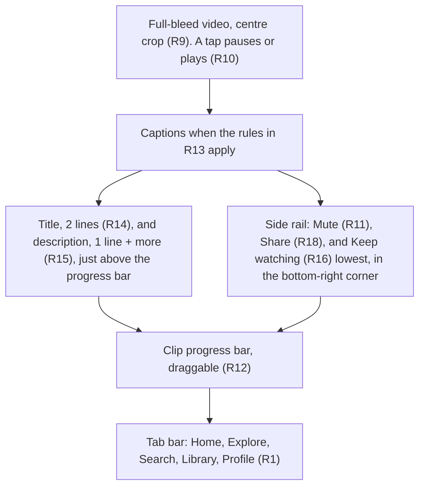
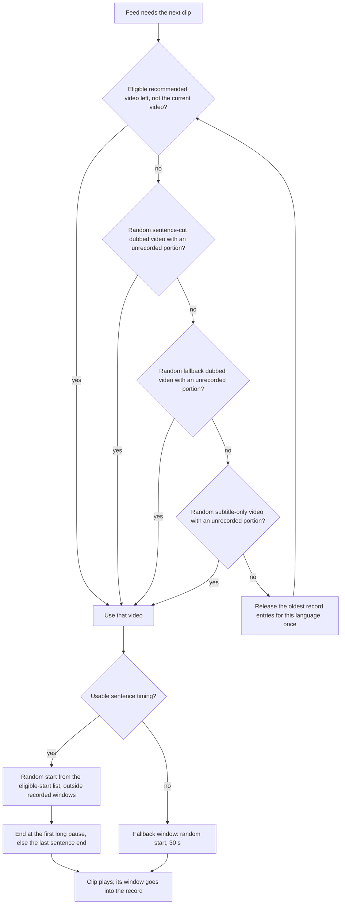
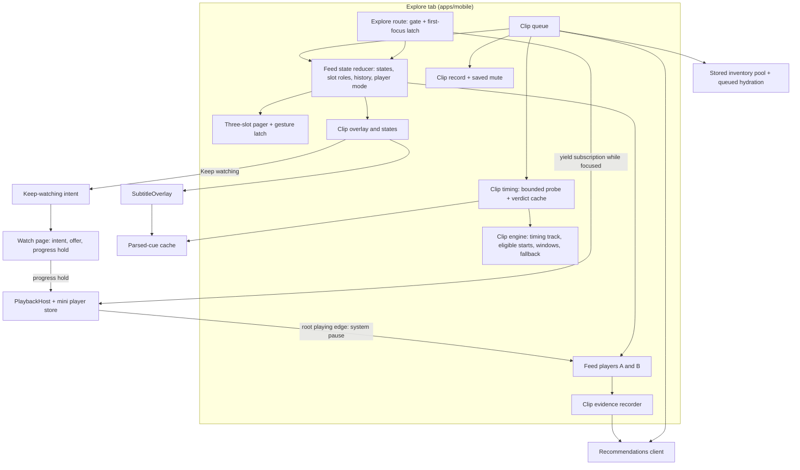
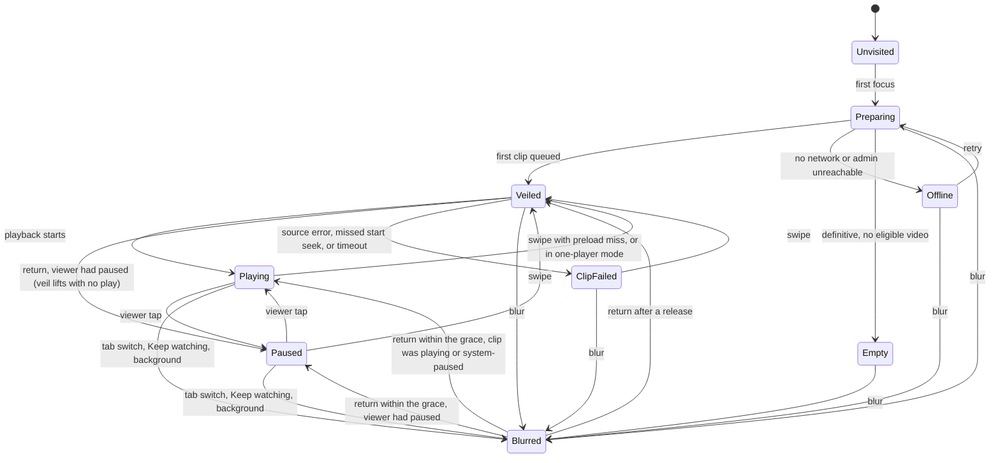
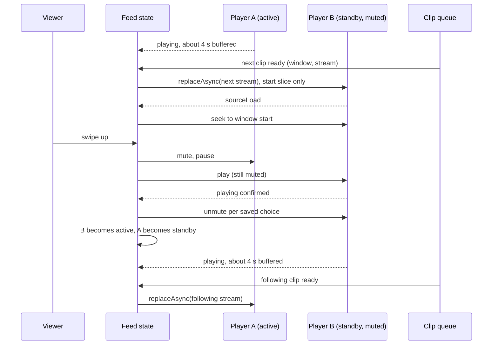

# Mobile Explore Clips Feed - Plan

## Goal Capsule

- **Objective:** A mobile viewer opens an Explore tab, swipes through short clips of catalog videos in their own language, and goes from any clip straight into the full video at the same moment.
- **Means:** A three-slot pager with two feed-owned players plays each clip and loads the next (KTD1, KTD2). The phone cuts clips at sentence boundaries from subtitle timing, and uses fallback clips when no timing exists (KTD5).
- **Product authority:** This Product Contract, confirmed in dialogue with Urim (owner of `apps/mobile`) on 2026-09-24, with planning decisions confirmed on 2026-09-25. Open product questions go to Urim.
- **Execution profile:** The work is `apps/mobile` only, plus this plan and one roadmap ticket. Admin, web, and TV do not change. One new native module (`expo-device`) moves the fingerprint runtime version, so a native build must ship before any `eas update` can reach a tester. Commits use conventional prefixes, and the work lands as a PR to `main` with a squash merge.
- **Stop conditions:**
  - U1 shows that admin's `Video.moments` covers most eligible videos and fits R26–R27: stop before U3 and bring the moment-source choice to the owner.
  - U1 shows that the watch page cannot start on a low-end Android phone, even after the releases in KTD13: stop and bring the player budget to the owner.
  - Any requirement turns out to need an admin change: stop, because admin is out of scope.
  - The product lead rejects the concept (see Deferred / Open Questions): stop.
- **Who finishes:** `ce-work` executes the units. The owner runs the device passes in the Verification Contract and decides when to open the gate for testers.
- **Open blockers:** None for implementation. The product-lead approval question is open and, by the owner's choice, does not block the start.
- **Product Contract preservation:** changed R21 (tier order, and "cannot supply the next clip"), R23, R26, R27, R32, R3's cross-reference, and the opt-in Key Decision's links; added R40–R47, AE10–AE13, and four Key Decisions (fallback clips, fallback order, the evidence cap, and edge defaults). These are owner decisions and confirmations during planning on 2026-09-25. The 2026-09-25 review then changed R43 (subtitles on after a subtitle-only clip) and R44 (resume only a clip that was playing), with the owner's approval. The owner then moved "Keep watching" into the bottom-right corner of the side rail (R16, the clip-screen diagram, and one Key Decision). The owner also chose one-list history (R41, AE14, and one Key Decision) and approved preloading in the direction of travel (R6). The planning-owned Outstanding Questions moved into the Planning Contract.

---

## Product Contract

### Summary

Explore becomes the app's second tab: an endless vertical feed of full-bleed clips, 10–60 s each, in the viewer's dub language. The phone cuts each clip at sentence boundaries from subtitle timing, and gives a fallback clip when a video has no usable timing. A three-slot pager with two feed-owned players plays each clip and loads the next, and "Keep watching" hands off to the watch page at the clip's moment.

### Problem Frame

The app has four tabs today: Home, Search, Library, and Profile. Each one asks a viewer to choose a title from a poster and a name before they see any footage. The catalog is mostly long-form (feature films up to two hours, series, segments), so the first minute of a video often does not show what the video is like. No surface lets a viewer sample the catalog quickly in their own language. The idea comes from the owner's product instinct; no measured viewer signal motivates it yet.

### Actors

- A1. Viewer: anyone who uses the app, signed in or not. Low-end Android on cellular data is the design center (`PRODUCT.md`).
- A2. Owner: judges v1 from their own use before the public release.
- A3. Recommendations service (admin): supplies ordered videos filtered by audio language, and receives playback evidence.

### Key Decisions

- **The full scope ships as v1.** (session-settled: user-directed — chosen over a smaller first release: the owner declined to cut any part to ship sooner.)
- **The tab has two equal jobs: keep viewers watching clips, and send them into full videos.** (session-settled: user-directed — chosen over a discovery-only tab and an engagement-only tab: v1 must do both.) Governs R16, R18, R34.
- **Explore is an opt-in surface, not an autoplay trap.** `PRODUCT.md` lists autoplay traps and engagement dark patterns as anti-references. Explore plays only after the viewer opens the tab, and pause and mute are one tap away; the patterns it excludes are listed under Scope Boundaries. Governs R2, R10, R11, R46.
- **The phone finds clip moments in subtitle tracks.** (session-settled: user-directed — chosen over admin-computed moments with a staff "hide this moment" control: v1 stays mobile-only, and the admin option is the follow-up before the public release.) Governs R23, R26, R27.
- **Videos without usable sentence timing give fallback clips.** (session-settled: user-directed — chosen over leaving those videos out: a wider pool; the owner accepts that a fallback clip may start mid-sentence.) Governs R23.
- **A second player that only the feed uses loads the next clip in advance.** (session-settled: user-directed — chosen over one player with a still first frame: an instant swipe is worth a second video decoder and extra data.) Governs R6.
- **On a device that cannot run the second player, Explore falls back to one player.** (session-settled: user-approved — proposed in the scope summary and confirmed: without it, the feed fails on the low-end phones that `PRODUCT.md` puts first.) Governs R7.
- **Full-bleed crop, built as one switch.** (session-settled: user-directed — chosen over a centred band with a blurred fill and a high band with the text below: fill the screen, and keep the centred band available after a device review.) Governs R9.
- **Explore is the second tab, with the label "Explore" for now.** (session-settled: user-directed — the position was chosen over the centre and fourth slots; the label was chosen from lists of film, Bible, and exploration words and may change.) Governs R1.
- **Explore takes over the mini player.** (session-settled: user-directed — chosen over waiting for a tap and over pause-and-restore.) Governs R2, R42.
- **Dubbed clips first, with exact-language subtitle-only clips as backfill.** (session-settled: user-directed — chosen over a fixed dubbed-to-subtitled ratio and one mixed pool; related-language matching was deferred to v2 over an in-app list and an admin-owned list.) Governs R20, R21.
- **Fallback dubbed clips come before subtitle-only clips.** (session-settled: user-approved — chosen over putting fallback clips last: hearing one's own language comes first.) Governs R21.
- **Every playable video is eligible.** (session-settled: user-directed — chosen over leaf items only and short-form only: the largest pool; the owner accepts that a feature film and one of its segments can show the same footage.) Governs R22.
- **Recommendations first, random fill.** (session-settled: user-directed — chosen over pure random and weighted random.) Governs R25.
- **A clip ends at the first natural pause.** (session-settled: user-directed — chosen over a ~30 s target and a random end: each clip feels like a complete moment.) Governs R27.
- **A clip loops until the viewer swipes.** (session-settled: user-directed — chosen over auto-advance and an end card.) Governs R8.
  - **Superseded 2026-09-30 (owner):** a clip that ends moves the feed to the next clip, animated like a swipe. It loops only when the feed cannot move. See `apps/mobile/CLAUDE.md`, "Explore clips feed". Since 2026-10-01 (owner), a clip whose description is open also loops, so the reader keeps the text.
- **Tap to pause, with a draggable progress bar.** (session-settled: user-directed — chosen over tap-to-show-controls and a progress line that cannot be dragged.) Governs R10, R12.
- **Sound on, and the mute choice is saved across launches.** (session-settled: user-directed — chosen over muted-first and a mute that lasts one session.) Governs R11.
- **Captions show on dubbed clips only while muted.** (session-settled: user-directed — chosen over the global subtitle setting, always on, and never on: the common short-form pattern for silent viewing.) Governs R13.
- **"Keep watching" continues from the tap point.** (session-settled: user-approved — chosen over a start at 0:00 and a rule that depends on video length: the tap comes at the viewer's highest interest, and a feature-film moment can be an hour into the film.) Governs R16, R17.
- **Share links to the full video; download and a language picker stay off the clip.** (session-settled: user-directed — share was chosen from share, download, and change-language actions.) Governs R18.
- **A rolling shown-clips record with a 7-day window.** (session-settled: user-directed — a rolling record was chosen over one that clears when the app closes and one with no time limit; the 7-day window was proposed in the scope summary and confirmed.) Governs R28.
- **Clips send recommendation evidence but never write progress.** (session-settled: user-directed — chosen over progress that only fills gaps and over accepting overwrites: admin keeps the newest progress write, so a clip would erase a real position or mark a film complete.) Governs R32, R33.
- **Clip evidence is counted, but capped.** (session-settled: user-approved — chosen over counting every clip and over clips not counting: most recommendation history stays for chosen videos, and the shared write budget holds.) Governs R32.
- **Recommendations record clip playback as "direct"; the app's own telemetry measures Explore.** (session-settled: user-approved — proposed in the scope summary and confirmed, over an admin `explore` source now: admin enforces the discovery-source list, so a new source is an admin hand-off.) Governs R32, R34.
- **Edge behaviour takes safe defaults.** (session-settled: user-approved — proposed in the planning summary and confirmed: a failed clip stays swipeable, swipe-back restarts clips, picture-in-picture pauses, and mute does not carry over.) Governs R40–R45, R47.
- **"Keep watching" sits in the bottom-right corner.** (session-settled: user-directed — chosen over a filled pill under the description: the pill covered too much of the video, and the corner lets the title and description sit lower, just above the progress bar.) Governs R14, R15, R16.
- **The feed is one list.** (session-settled: user-directed — chosen over starting new clips after a swipe back: a swipe up after a swipe back replays the clips already seen, in order, as TikTok and Netflix Clips do.) Governs R41.

### Requirements

**Tab and session**

- R1. The app gains a fifth tab, "Explore", in the second position: Home, Explore, Search, Library, Profile. The label is defined in one place, so a rename is a one-line change.
- R2. Opening Explore starts the current clip at once, behind the veil in R38 until it can play. When the mini player is active, its session ends first, and its progress saves as it does at any session end.
- R3. Leaving Explore pauses the clip; this covers a tab switch, "Keep watching", and the app going to the background. A return to Explore resumes the same clip, per R45. A clip never moves into the mini player or into picture-in-picture.
- R4. Explore shows in development bundles; a release bundle shows it only when an operator opens it through an EAS environment variable, as the sign-in gate (feat-543) does. An over-the-air switch also turns it off everywhere, and when it is off, the tab does not show.
- R42. When a picture-in-picture window holds a video as Explore opens, that video pauses, and the clip plays.
- R45. A return to Explore restores the viewer's own pause state: a clip the viewer paused stays paused, and a clip that the system paused (an audio interruption, for example) plays again.
- R46. Explore starts no player and no network request until the viewer first opens the tab.

**Feed and navigation**

- R5. The feed is a vertical pager with one clip per screen. A swipe up goes to the next clip, and a swipe down goes back to the previous clip.
- R6. While a clip plays, the next clip loads in advance in a second player that only the feed uses, so a swipe starts motion and sound with no load wait. The feed loads at most one clip ahead. After a swipe down, the clip before the current one loads in advance instead.
- R7. On a device that cannot run the second player, Explore uses one player, and a still of the clip's first frame shows until playback starts.
- R8. A clip loops until the viewer swipes.
  - **Superseded 2026-09-30 (owner):** at its end a clip moves the feed to the next clip, animated like a swipe. It loops only when no next clip is ready or the viewer holds the pager. Since 2026-10-01 (owner), it also loops while its description is open.
- R41. A swipe down returns through the clips seen in this app session, and each clip restarts at its own start. The history clears on relaunch. After a swipe back, a swipe up replays the seen clips in order, and new clips start after the last clip seen.

**Playback controls and framing**

- R9. The video fills the screen as a centre crop. The framing is one switch, so a centred band (the whole frame in the middle, with a blurred copy above and below) can replace the crop with no layout rework.
- R10. A tap on the video pauses or plays the clip. A large play glyph shows while the clip is paused.
- R11. A mute button is always visible. Clips start with sound, and the mute choice is saved on the device across app restarts.
- R12. A draggable progress bar covers the clip only, from its start to its end, and seeks inside it.
- R13. Subtitle-only clips always show subtitles in the viewer's language. Dubbed clips show subtitles in the viewer's language while muted and hide them while sound is on; a dubbed clip with no track in that language shows none.

**Clip information and actions**

- R14. The video's title shows in at most two lines, truncated with an ellipsis.
- R15. The video's description shows on one line under the title. When the text overflows, a "more" control at the end of the line expands the full text, and the viewer can collapse it again.
- R16. Every clip shows a "Keep watching" action (working label). It opens the video's watch page and plays from the point the viewer reached in the clip, in the clip's dub; a subtitle-only clip keeps its subtitle language. The action is the lowest control in the side rail, in the bottom-right corner just above the progress bar, so the title and description can sit just above the bar.
- R17. A watch page opened by "Keep watching" shows a "Start from the beginning" option for a few seconds. When the viewer has a saved position later than the tap point, it also offers a "Resume at" option that names that position, and the watch page writes no progress while these options show.
- R18. Every clip has a Share action that shares a link to the full video.
- R43. The watch page that "Keep watching" opens starts with sound. After a dubbed clip, it uses the viewer's saved subtitle setting. After a subtitle-only clip, subtitles are on in the clip's subtitle language (R16) for that watch session only, and the saved setting does not change. The clip's mute state and its muted captions do not carry over.
- R44. Opening the share sheet or expanding the description pauses the clip. Closing them resumes the clip only when it was playing as they opened.

The clip screen, by region (framing per R9):

**Language and eligibility**

- R19. The feed has one language, identified by its Language slug: the viewer's global dub preference (which the watch page's language picker sets), else the Language that matches the device language, else English. Eligibility (R20), the candidate pool, and the recommendations request (R25) all use this one slug.
- R20. A video is dubbed-eligible when it has a playable Dub in the feed language. A video is subtitle-eligible when it has no such Dub but has a subtitle track in exactly that language; it then plays in a fallback audio language with those subtitles.
- R21. The feed uses three tiers in order: sentence-cut dubbed clips, then fallback dubbed clips (R23), then subtitle-only clips. A tier supplies a clip only when the tiers above it cannot supply the next clip.
- R22. Every playable kind of video is eligible, including feature films, segments, short films, episodes, trailers, and behind-the-scenes videos.
- R23. A video whose subtitle tracks give no usable sentence timing supplies a fallback clip: a random start between 5% and 80% of its length, and a fixed 30 s length, which may start mid-sentence. A video from 10 s to 30 s long plays whole, and a video shorter than 10 s supplies no clip.
- R24. A change to the dub preference applies to clips that are not yet loaded. The clip on screen keeps playing.

**Clip selection**

- R25. Videos come from the viewer's recommendations first, then from random eligible videos; when recommendations are not available, the feed uses random eligible videos only. The first clip never waits for a recommendation delivery, and Explore's requests never use up the delivery budget that Home's For You row shares.
- R26. A sentence-cut clip starts at a sentence start chosen at random from the video's timing track.
- R27. A sentence-cut clip ends at the first long pause (a likely scene break) at least 10 s after its start, always at the end of a sentence, and never more than 60 s after its start. When no long pause falls in that range, the clip ends at the last sentence end in the range. When no sentence end falls in the range, the app picks a different start.

**Variety and memory**

- R28. The app keeps a record on the device of each clip it shows: the video and the clip's time window. The record survives app restarts, and each entry expires after 7 days.
- R29. A new clip never overlaps a recorded window of the same video.
- R30. Two consecutive clips never come from the same video, unless only one eligible video remains.
- R31. When every eligible portion is in the record, the feed releases the oldest entries first and continues. The feed never ends.

**Recording and measurement**

- R32. A clip sends recommendation playback evidence with the discovery source `direct` once it has played for 3 s without a break. At most one clip episode is open at a time, and at most 12 clip episodes count per recommendation session.
- R33. Clip playback never writes Continue Watching progress. Playback on the watch page after "Keep watching" records progress as normal, except while the R17 options show.
- R34. The app sends its own telemetry events so that four signals can be measured: "Keep watching" tap-through per Explore visit, full plays started from Explore and how long they play, clips watched per visit, and returns to Explore on a later day.

**Access and states**

- R35. With a screen reader on, each clip offers next-clip and previous-clip actions, and the progress bar adjusts by step actions, so no swipe or drag is needed. With reduced motion on, the pager changes clips without animation.
- R36. With no network, Explore shows an offline message with a retry action. Downloaded videos do not supply clips.
- R37. When no eligible video exists for the feed language, Explore shows an empty state that says so.
- R38. The first clip, and any later clip whose video is not ready, shows the app's standard poster-and-spinner veil. The veil lifts when playback starts, on a source error, or after a timeout, as on every other player screen (`apps/mobile/CLAUDE.md`).
- R39. A gradient scrim sits behind the title, the description, and the side-rail controls, so they meet the AA contrast floor in `PRODUCT.md` over any frame.
- R40. A clip that cannot play shows a short message, stays swipeable, and does not auto-advance.
- R47. When admin cannot be reached, Explore shows the offline message and retry from R36, not the empty state from R37.

### Key Flows

- F1. Watch clips
  - **Trigger:** A1 taps the Explore tab.
  - **Actors:** A1, A3
  - **Steps:** Explore starts its work on this first focus (R46). Any mini player session ends (per R2). The current clip plays at once, with sound unless A1 muted before. The next clip loads in the second player. A swipe up plays it with no wait; a swipe down returns to the previous clip. Each clip loops until A1 swipes.
  - **Covered by:** R2, R5, R6, R8, R11, R41, R46
- F2. Clip to full video
  - **Trigger:** A1 taps "Keep watching" during a clip.
  - **Actors:** A1
  - **Steps:** The clip pauses. The watch page opens and plays from the point A1 reached, in the clip's dub and, for a subtitle-only clip, its subtitle language. "Start from the beginning" shows for a few seconds. A return to Explore resumes the same clip.
  - **Covered by:** R3, R16, R17, R33, R43, R45
- F3. Choose the next clip
  - **Trigger:** The feed needs the next clip to load in advance.
  - **Actors:** A3 (supplies the recommended order)
  - **Steps:** The app takes the next eligible recommended video that is not the video of the current clip. When none remains, it takes a random video with an unrecorded portion from the first tier that can supply one: sentence-cut dubbed, then fallback dubbed, then subtitle-only (R21). When every portion is recorded, the oldest record entries for this language are released, at most once per request. A sentence-cut clip starts at a random sentence start outside the recorded windows and ends by the rule in R27; a fallback clip follows R23. When the clip starts to play, its window goes into the record.
  - **Covered by:** R20, R21, R23, R25, R26, R27, R28, R29, R30, R31

### Acceptance Examples

- AE1. **Covers R27.** Given a start at 12:04, and sentence ends at 12:09, 12:16, 12:31, and 12:40, where only the silence after 12:31 is long, when the app builds the clip, then the clip runs 12:04–12:31. The end at 12:09 is under 10 s, and the pause after 12:16 is not long.
- AE2. **Covers R27.** Given a start at 30:00 and no long pause before 31:00, when the app builds the clip, then the clip ends at the last sentence end before 31:00.
- AE3. **Covers R29, R30.** Given a recorded JESUS clip at 40:10–40:38, when the app picks another JESUS clip, then a start at 41:02 is allowed and a start at 40:20 is not. The clip after a JESUS clip always comes from a different video while another eligible video exists.
- AE4. **Covers R13.** Given a dubbed Swahili clip whose video has Swahili subtitles, when the clip is muted, then Swahili subtitles show, and when sound is on, then they hide. Given a subtitle-only clip, subtitles show in both states.
- AE5. **Covers R20, R21.** Given a Swahili preference, when unseen dubbed Swahili portions remain, then every clip is dubbed. When the dubbed tiers cannot supply the next clip, then a video with fallback audio and Swahili subtitles appears, with subtitles on.
- AE6. **Covers R16, R17, R33.** Given a viewer whose JESUS progress is 1:10:00, when they watch a clip at 0:12:00–0:12:30, then their progress stays at 1:10:00. When they tap "Keep watching" at 0:12:20, then the watch page plays from 0:12:20 in the clip's dub and shows "Start from the beginning" and "Resume at 1:10:00". When they go back to Explore while those options still show, their progress stays at 1:10:00.
- AE7. **Covers R2.** Given a signed-in viewer with Magdalena at 20:00 in the mini player, when they open Explore, then the mini player closes, Magdalena's progress saves at about 20:00, and the clip plays.
- AE8. **Covers R6, R7.** Given a device that runs the second player, a swipe starts the next clip with no load wait. Given a device that cannot run it, a swipe shows a still of the clip's first frame, then motion starts over it.
- AE9. **Covers R31.** Given a language with two eligible videos whose portions are all in the record, when the viewer swipes, then the feed releases the oldest entries and shows a clip. It does not end or show the empty state.
- AE10. **Covers R21, R23.** Given a Swahili feed and a 20:00 dubbed Swahili video with no subtitle tracks, when the feed reaches the fallback tier, then the clip starts between 1:00 and 16:00, runs 30 s, and loops. It appears only after the sentence-cut dubbed clips, and before any subtitle-only clip.
- AE11. **Covers R23.** Given a dubbed video 8 s long with no subtitle tracks, then it supplies no clip. Given one 25 s long, then its clip is the whole video.
- AE12. **Covers R32.** Given a viewer who swipes to a new clip every 2 s, then no clip evidence is sent. Given 15 clips that each play for 10 s in one recommendation session, then only the first 12 send evidence.
- AE13. **Covers R45.** Given a clip the viewer paused before they switched to Home, when they return, then the clip stays paused. Given a clip that a phone call paused, when they return, then it plays.
- AE14. **Covers R6, R41.** Given a viewer who swiped up through clips 1 to 21 and then swiped down 20 times fast, then clip 1 plays from its own start after one load. When they swipe up, then clips 2 to 21 replay in order with no veil on the two-player path, and new clips start only after clip 21.

### Success Criteria

- v1 succeeds when the owner judges, from their own use, that the feed is worth opening and leads into full videos. v1 has no numeric target.
- Before the public release, the four signals in R34 have a measured baseline from the testers an operator opens Explore to (R4), and targets come from that baseline.

### Scope Boundaries

**Deferred for later**

- Related-language subtitle matching (v2). It needs a defined list of language pairs, because admin's `Language` has no related-language link and BCP-47 tags are not reliable for this.
- Admin-computed moments with a staff "hide this moment" control. This is the follow-up before the public release, for content safety.
- An `explore` discovery source in admin (hand-off). Until then, R32 applies.
- Share links that open at the clip's moment. v1 shares the full video.

**Outside v1**

- Download and a language picker on clips.
- Continue Watching progress from clips.
- Clips from downloaded videos, and clips while offline.
- Explore on TV or web.
- Detection of the same footage across a feature film and its segments.
- One shown-clips record across a viewer's devices. The record is per device.

**Outside this product's identity**

- Streaks, nags, and any screen that opens Explore by itself. `PRODUCT.md` lists autoplay traps and engagement dark patterns as anti-references.

#### Deferred to Follow-Up Work

- An admin portrait still-frame derivative recipe, so that R7 stills stop being cold Mux renders.
- An admin response cache for `watchLanguageInventory` before the public release (hand-off), because every cold Explore open costs admin about 0.6 s of database time.
- Mux instant-clip URLs to cut data per clip (see KTD4).
- Sharing Home's served recommendation slate with Explore instead of a separate delivery (see KTD8).
- Releasing Home's hero player while Home is blurred, if U1 shows that the budget in KTD13 is not enough.
- TV follow-up (for `apps/tv`, not this plan): TV's `parseVtt` header and its sentence terminators drift from mobile's extended copies. The roadmap ticket in U14 records it.

### Dependencies / Assumptions

- Assumption: the feature rests on the owner's product instinct, with no measured viewer signal.
- Assumption: the viewer is the general audience in `PRODUCT.md`. No narrower segment was named.
- Dependency: the recommendations client (`apps/mobile/src/lib/recommendations/`, feat-516) and its fleet bearer. Without them, R25 uses random videos only.
- Dependency: admin admits recommendation deliveries per session, one per 5 s and 30 per hour (`apps/admin/src/services/recommendations/admission.ts`), and Home's For You row shares both limits. A refused hour is not retried, and Home hides its row on a failed load. Admin does not serve 20 items in every language, and a refused request still counts. R25 keeps Explore inside this budget.
- Dependency: the new native module `expo-device` (KTD3). A native build must ship before an over-the-air update can reach any tester, and the production update channel is already dark until that build (`apps/mobile/CLAUDE.md`, "Cold-start splash").
- Dependency: a low-end Android test device (3 GB of RAM or less, entry-level chipset) for U1 and U18. Without one, the four-player stop condition stays unevaluated, and the gate stays closed for Android testers.
- Accepted risk (confirmed in the scope summary): random moments know nothing about the content. A crucifixion scene can autoplay with sound and with no context. The admin-computed-moments follow-up addresses this before the public release. Until then, R4 limits the risk to the owner and to the testers an operator opens Explore to.
- Accepted consequence (owner, 2026-09-25): admin builds recommendation history from the newest 32 finalized episodes per session and the newest 24 qualified videos (`apps/admin/src/services/recommendations/user-history.service.ts`), and 30 s of active playback, loops included, is a qualified view. R32's cap of 12 clip episodes per recommendation session keeps most of that history for videos the viewer chose.
- Accepted consequence: playback of 3 s or more counts as "recently tried" for 24 h, so a clip lowers its video on Home's For You shelf as well (`docs/operations/user-recommendations.md`).
- Accepted consequence: the second player costs a video decoder and data for clips the viewer swipes past. R7 covers devices that cannot run it.
- Accepted consequence of the takeover decision: a mini-player window that the viewer opened from Home or Search ends when they open Explore. Everywhere else the window still persists across tab changes.

### Sources / Research

- `apps/tv/src/lib/showcaseMode/sentenceTiming.ts`: sentence boundaries from VTT cues (prior art for R26–R27).
- `apps/tv/src/lib/showcaseMode/sentenceTimingSource.ts`: bounded VTT acquisition with a cache of derived timing and closed failure reasons (prior art for U21).
- `apps/tv/src/lib/parseVtt.ts`: the SMPTE one-hour offset normalization that mobile's parser lacks.
- `Video.moments` in `apps/admin/schema.graphql` and `apps/admin/src/services/video-moments.service.ts`: public, transcript-derived moments with timing and summaries; the TV companion panel uses them (`apps/tv/src/lib/moments/momentsQuery.ts`).
- `docs/plans/2026-07-21-001-feat-tv-showcase-sentence-aware-hops-plan.md`: lessons from real subtitle files. A real production track exposed a fallback that synthetic fixtures missed.
- `apps/tv/src/lib/showcaseMode/hopHandoff.ts`, `apps/tv/src/components/showcaseMode/useHopHandoff.ts`, and `docs/solutions/ui-bugs/tv-showcase-dual-player-crossfade-dub-hop-blanking.md`: two long-lived players, reveal on confirmed motion, and co-derived state (prior art for KTD2).
- `docs/solutions/ui-bugs/tv-backdrop-videoview-decoder-starvation-overlay-20260611.md`: a paused, mounted view still holds a decode slot; unmount to free it (KTD3, KTD13).
- `apps/mobile/src/components/home/HomeHeroPager.tsx` and `apps/mobile/src/lib/miniPlayer/heroYield.ts`: a surface-owned player outside the root host, and the continuous-yield rule that surfaces follow while a floating window can appear (KTD10).
- `apps/mobile/src/lib/miniPlayer/playbackRequest.ts`: a session end drops the retained request, and the host then releases its player; `samePlaybackRequest` compares a fixed field list (KTD10, KTD12).
- `apps/mobile/src/lib/watchPreferences.ts`: the global `audioLanguageSlug`.
- `apps/mobile/src/lib/resolveDefaultLanguage.ts`: the default language chain, which ranks the dubs of one video. R19 needs a feed-level version of it.
- `apps/mobile/src/lib/parseVtt.ts` and `GET_VIDEO_DUB` in `apps/mobile/src/lib/queries.ts`: subtitle tracks per Dub through its Video Edition.
- `apps/admin/schema.graphql` (`watchLanguageInventory`, `Video.preferredPlayableDub`), `apps/web/src/lib/watch-language-inventory.ts`, and `docs/solutions/performance-issues/watch-language-inventory-candidate-first-sql-20260713.md`: the public inventory for a language, web's operation shape, and its measured cost (KTD6).
- `apps/mobile/src/lib/streamQuality.ts` (`applyQualityConstraint`): the rendition cap that feed sources reuse (KTD23).
- `docs/operations/user-recommendations.md`: the request limit and the "recently tried" rule.
- `apps/admin/src/services/watch-progress.service.ts`: the newest progress write wins, and 90% marks a video complete (the reason for R33).
- `apps/mobile/src/components/watch/PlaybackHost.tsx` and `apps/mobile/src/lib/miniPlayer/store.ts`: the one root-owned player, and the mini player session end.
- `apps/mobile/src/components/watch/VideoDescription.tsx`: the existing description collapse (3 lines, "Read more"). R15 needs a 1-line variant.
- `apps/mobile/src/lib/muxThumbnail.ts` (`muxThumbnailAtSecond`) and `docs/solutions/best-practices/missing-artwork-frame-fallback-derivative-recipe-and-authored-first-20260826.md`: time-offset stills and the cost of cold Mux renders (KTD21).
- `apps/mobile/src/lib/lapseReminders/constants.ts`: the existing pattern for an over-the-air kill switch (R4).
- `apps/mobile/src/lib/signInGate.ts` and `apps/mobile/src/lib/signInGateState.ts`: the release-bundle gate pattern that R4 follows (feat-543).
- `docs/solutions/logic-errors/session-identity-needs-one-slug-tolerant-predicate.md`: one identity predicate across the store and host seam, and the id-less first-render fixture (U20).
- `docs/solutions/conventions/react-profiler-ab-mobile-render-performance-verification.md`: the mobile render-cost check for the Verification Contract.
- expo/expo#30271: on Android, two unmuted video views crash the audio-focus manager (KTD2).
- `CONCEPTS.md`: Dub, Video Edition, Language (the slug is the identity), Watch Language Inventory.

---

## Planning Contract

### Key Technical Decisions

- KTD1. **A custom three-slot vertical pager, not a recycled list.** The pager keeps three slots (previous, current, next) permanently mounted and moves them with one Animated value that a PanResponder drives; a settled swipe rotates slot roles instead of re-rendering cells. List cells recycle, so each swipe would re-create or re-bind a video view, and the app bans `react-native-gesture-handler`. (session-settled: user-approved — proposed in the planning summary and confirmed, over a recycled list and over routing the feed through the root player: recycled cells re-create video views on every swipe.) Governs R5, R6.
- KTD2. **Two long-lived feed players swap roles and never belong to the root host.** They are created once, at first focus, with a frozen null source, and they swap `active` and `standby` on each swipe through `replaceAsync`, as TV's showcase and Home's hero pager do. At most one player in the whole app has sound at any time: a swipe mutes and pauses the outgoing player first, reveals the incoming player muted on confirmed motion, and then unmutes it (expo/expo#30271). Native `loop` stays off, Mux's in-manifest subtitle tracks are turned off, and `allowsExternalPlayback` is off. The current and standby clips derive from one reducer state in the same commit. The standby loads in the direction of travel, and a fast streak loads only where the pager stops (KTD25). The feed uses two `useVideoPlayer` hooks, never `createVideoPlayer`, and it never sets `ownsSession`. Governs R6, R8, R11, R46.
- KTD3. **Player mode comes from a static device tier plus reactive demotion; one-player mode unmounts the standby view.** `expo-device` total memory below a tunable threshold (start: 4 GB, Android only) selects one-player mode at first focus. A standby that errors within 8 s of its source set while the active player is healthy, twice in one launch, demotes that launch. A demotion is remembered for 7 days and cleared on an app version change. A slow load never demotes, because expo-video reports a decoder failure only as an untyped message. `expo-device` is read through one adapter that requires it lazily. (session-settled: user-approved — proposed in the planning summary and confirmed, over a runtime-only signal: expo-video exposes no decoder-capacity query.) Governs R7.
- KTD4. **The player enforces clip bounds; the stream stays the full HLS asset.** The active feed player sets `timeUpdateEventInterval` to 0.25 s, and the standby keeps 0 until it becomes active. A clip ends inside its closing pause, and a loop is a seek back to the clip start, checked in the time listener. The start seek runs on `sourceLoad`, never in the `replaceAsync` promise. The first playing tick checks the position and re-seeks once; a second miss fails the clip (R40). Whether Android sources set `useCaching` follows the U1 loop-data measurement. (session-settled: user-approved — proposed in the planning summary and confirmed, over Mux instant-clip URLs: they trim only to whole segments of about 6 s and shift the timeline.) Governs R8, R12, R26, R27.
- KTD5. **The clip engine is a ported copy of TV's sentence timing, with mobile additions.** It adds sentence terminators for more scripts (`。！？`, `।॥`, `؟۔`, `။`, `።`, `։`) beside `. ! ? …`, and it adds sentence starts: the first cue after a boundary, preferring one that follows at least 0.5 s of silence. A long pause for R27 starts at 1.5 s and is tuned on real tracks. The timing track comes from the playing dub's Video Edition, in this order: the feed-language track, the primary track, a human-made track, then any track. A track fails when fewer than 20% of its cues end a sentence, when its last cue passes the dub's duration by more than 5 s, or when it has more than 8,000 cues. Boundaries keep TV's ~1 s pad for dub drift. A video with no passing track gets a fallback clip (R23). The engine does not use `Intl.Segmenter`, because Hermes lacks it. (session-settled: user-directed — chosen over admin-computed moments: v1 stays mobile-only.) Governs R23, R26, R27.
- KTD6. **The candidate pool is a lean, device-cached projection of the language inventory.** `watchLanguageInventory(feedSlug)` runs with a lean selection (id, core id, slug, label, availability, duration, Mux playback id, `watchLanguageSlug`, title, description) and a `no-cache` fetch policy, and its result becomes one compact array. The limit is chosen from payload bytes (start: 1,000 rows per bucket), because the server counts every row whatever the limit. The projected pool is stored per language on the device for 24 h and refreshed in the background, so a warm open takes its first clip from the stored pool. The queue also stores its next ready clip (the hydrated candidate, its stream, and its window) beside the pool, so a warm open's first clip needs no hydration and no subtitle fetch before motion; captions can arrive after motion. A stored clip is dropped when it is older than the pool, when the record already holds its window, or when the feed language changed. A collection row joins the dubbed pool only when its label is a playable film; the inventory's labels are camelCase strings. Only queued candidates hydrate, two or three per request, for their Video Edition subtitle tracks and a stream check: `preferredPlayableDub(languageSlug)` with an exact slug match, because the field falls back to other languages. The hydration query also uses `no-cache`, and the queue holds hydration results only for queued and current clips, so nothing builds up in the shared Apollo cache during a long session. At first focus, the record, the recommendations request, and the inventory start together, and a cold pool prefers a short video for the first clip. The queue keeps two computed clips (metadata and timing, not video) ahead of the current one, with one request in flight. Governs R19–R22, R24, R25.
- KTD7. **The feed language is the saved preference, else a reviewed device-language map, else `english`.** The device language comes from the same `Intl` read that `resolveDefaultLanguage.ts` uses. A small reviewed map turns an OS language code into a Language slug, because a BCP-47 tag is not an identity (`CONCEPTS.md`) and admin has no lookup by tag. Explore's recommendations request passes this slug, never the client's `english` fallback. Governs R19.
- KTD8. **Explore hosts its own small recommendations instance.** It uses the `watch-for-you-v1` surface with a count of 6. It requests only after first focus, at most once per 10 min and four attempts per hour, retries included, and it never blocks the first clip. Explore sends no render, impression, or select evidence, because those facts name Home's shelf. A refused or invalid delivery leaves the feed on random fill. Home's return-from-watch signal stops counting a return that lands on Explore, and still counts returns to every other tab. Governs R25.
- KTD9. **A feed-owned recorder sends clip evidence in a clip mode.** `createPlaybackRecorderForMedia` gains a clip mode. It starts an episode after 3 s of continuous play, keeps one open episode, and stops at 12 clip episodes per recommendation session. The count is stored on the device beside a digest of the session token, never the token itself, so a relaunch does not reset it, and a rotated token starts a new count. A new episode starts no sooner than 10 s after the previous one started. A clip that reaches 3 s inside that gap starts its episode when the gap ends, if the clip still plays. The gap keeps fast swipes inside the 30-mutations-per-minute bucket and still lets AE12's 10 s clips each count. It passes no discovery keys, takes no pending selection nonce, treats a loop as a rebase rather than a seek, and never touches `watchProgress`. The feed wires it itself, because the feed players never reach the adapter's recorder factory. (session-settled: user-approved — chosen over counting every clip and over clips not counting.) Governs R32, R33.
- KTD10. **The takeover is a continuous yield while Explore has focus.** While Explore is focused, a subscription to the mini player store dismisses any floating session that appears and is not under a picture-in-picture hold. It does not run once on the focus event, because the watch page's session starts in the same commit (the `heroYield.ts` precedent). A dismiss, not a "replaced" end, fires the `dismiss` flush trigger, the `dismissed` QoE reason, and the exit animation; "replaced" means that new content took over the player, which would misattribute progress. Under a picture-in-picture hold, Explore pauses the root player through the transport and keeps its own "takeover pending" flag, not the store's deferred dismiss. When the hold ends, Explore dismisses only if it still has focus and the session still names the same video, and a blur cancels the pending takeover. While Explore is focused, a root `playing` edge pauses the active clip as a system pause. The first clip does not start while the root player plays. With no picture-in-picture hold, the first clip also waits until the request store holds no request. Under a hold, the watch page's request stays in the store, so the first clip starts muted after the transport pause lands, and then takes sound per the saved choice. If U1 step 2 shows that a paused root player with sound beside a feed player with sound is not safe on Android, the clip stays muted there until the hold ends. (session-settled: user-directed — chosen over waiting for a tap and over pause-and-restore.) Governs R2, R42, R45.
- KTD11. **"Keep watching" hands off through a one-shot intent that only the route reads.** The intent holds the start position, the audio slug, the subtitle slug, and the Explore origin, keyed by slug, with a time-to-live that covers only the time from the tap to the route's first render (start: 30 s). The route keeps only `slug` and `seed`, so a deep link cannot set an intent. The route takes the intent into page state on its first render, in a StrictMode-safe way. It passes the audio and subtitle slugs to the watch session as an explicit input: the intent audio outranks the downloaded dub, and the intent subtitle uses the raw setter, so the saved preference does not change. It passes the start through the existing `resumeAtSeconds` channel only until the canonical stream's first `sourceLoad` or an offer choice, whichever comes first, so a later dub or quality reload never jumps back to the tap point. During the veil, the tap point is the clip start. After a subtitle-only clip, the intent also turns subtitles on through a session-only override in the watch session, which never writes the saved `subtitlesEnabled` preference (R43). (session-settled: user-approved — chosen over a start at 0:00 and a length rule.) Governs R16, R43.
- KTD12. **The R17 offer adds a seek channel and a progress hold with its own deadline.** The playback transport gains a seek. A `progressHold` flag travels in the playback request into the adapter, joins the `samePlaybackRequest` comparison, and blocks every progress write, including the dismiss flush. The hold starts at the first frame and ends at its deadline (the default offer duration), at an offer choice, or at the session end, whichever comes first. The offer can stay visible longer for a screen-reader viewer, but the hold cannot. "Resume at" shows only when the saved position is later than the tap point and is not complete. Governs R17, R33.
- KTD13. **Explore does no work before first focus, and it releases decoders on blur.** iOS NativeTabs render every tab's content at launch, so Explore creates no player and makes no request until its first focus (R46). On blur, the active player is muted and paused, and the standby source clears at once. The active source is released after a 10 s grace for tab switches, and at once on "Keep watching". U1 step 2 shows whether a cleared source frees its decoder; if only an unmount does, "Keep watching" also unmounts both feed views. A return reloads the clip behind the veil at the saved clip position. Governs R3, R45, R46.
- KTD14. **A per-clip autostart gate replaces the one-load hook on this surface.** `useAutostartPlayback` covers only the first load and plays on load with no seek. So the feed uses a per-clip gate with the same three release paths and the same timeout constant, and the poster, still, veil, and failed state share one predicate. The veil can also lift with no play, for a return to a clip the viewer had paused. `apps/mobile/CLAUDE.md` records Explore as the named exception. Governs R7, R38, R40, R45.
- KTD15. **The clip record is a versioned, bounded AsyncStorage snapshot, and memory is authoritative.** An entry holds the video id, the window, the feed language, and a timestamp, in a compact encoding. Entries expire after 7 days, and the record keeps at most 2,000 entries, oldest out first. Writes happen only after a swipe settles (at most one per 5 s), plus one on background. An entry is added when the clip starts to play, not at preload. A replay from the swipe-back history adds no second entry. R31 releases the oldest entries for the current language only. The mute choice becomes an explicit field in watch preferences. Governs R11, R28–R31.
- KTD16. **The gate is fixed per bundle, and the tab is never toggled at runtime.** Availability is the over-the-air constant and (`__DEV__` or `EXPO_PUBLIC_EXPLORE_ENABLED` equal to `1` or `true`), evaluated by a pure rule and bound to the environment in one binder, as the sign-in gate is. A release Android bundle also needs `EXPO_PUBLIC_EXPLORE_ANDROID_ENABLED` equal to `1` or `true`, because an EAS environment variable has one value for both platforms, and the gate must stay closed for Android testers until the low-end Android pass has run (Dependencies / Assumptions). It resolves once at module scope. iOS marks the trigger `hidden` and Android sets `href: null`, because a runtime flip remounts the whole NativeTabs navigator. The route renders nothing when the gate is closed, because an Android route stays reachable by URL. Governs R1, R4.
- KTD17. **Product signals are RUM custom actions; operational events go through the log sink.** The four R34 signals are RUM custom actions whose context keys all start with `explore_`, and the reserved-attribute guard is extended to scan `reportDatadogAction`. Operational events (a failed clip, a demotion, a pool fallback) and playback-health measures (the preload hit rate, swipe-to-motion time, rebuffer counts, and first-motion time with its stage breakdown and pool state) go through an injected sink named `telemetry` with inline contexts. A visit is a focus period that ends after 30 min away or on relaunch; a watched clip has played 3 s; a full play is measured on the watch page when the handoff origin is Explore, until that session ends. A later-day return is computed on the device from the last-visit date in the clip record, because anonymous viewers have no RUM user. Governs R34.
- KTD18. **Framing is one constant with two render-tested treatments.** `EXPLORE_FRAMING` selects `crop` or `band`, following `apps/mobile/src/lib/bibleCardTreatment.ts`, and each treatment keeps a render test. (session-settled: user-directed — chosen over the centred band and the high band as the default.) Governs R9.
- KTD19. **Measure before building.** U1 runs on devices before the engine and player units, and it settles the behaviours that research could not: iOS eager mount, a four-player start, loop data and bytes per clip, `Video.moments` fit, subtitle coverage and sizes, and the inventory's payload cost. (session-settled: user-approved — proposed in the planning summary and confirmed: the stop conditions depend on these numbers.)
- KTD20. **One cache of parsed cues serves both the engine and the captions.** A module-level LRU keyed by `vttSrc` holds parsed, sorted cues (at most 12 tracks), so each network track downloads and parses once. Each cache entry also holds the eligible-start lists derived from its track (KTD24), so they leave the cache with it. The byte cap per track comes from the largest production feature-film track at 3 bytes per character (start: 1.5 MB, verified in U1), with an 8 s fetch timeout and one flight per source. The track that the watch page is showing is pinned, so Explore's look-ahead cannot evict it, and one reader's abort never cancels a fetch that another reader shares. Downloaded `file:` tracks stay outside the cache. A network or 5xx failure is transient and never marks a video ineligible; a 404, an empty parse, or an over-cap track is definitive. `SubtitleOverlay` mounts only in the current slot. Governs R13, R23, R47.
- KTD21. **R7's still is a portrait Mux frame at the clip start, prefetched only in one-player mode.** Every time offset is a cold Mux render (1–3 s), so the queue prefetches the next clip's still through expo-image only when the standby player does not exist. One fixed portrait size with `fit_mode=smartcrop` keeps the renders comparable. Every veil uses the inventory's authored image or the pre-generated poster derivative, including the veil of a clip replayed from history; in one-player mode, the prefetched time-offset still replaces it once it has loaded. Governs R7, R38.
- KTD22. **JS work waits for gestures, and no Explore task runs over 50 ms.** A feed-level latch is set from the pan grant to the end of the settle. A streak of swipes counts as one gesture: the latch stays set until the pager has rested for the rest dwell (KTD25). While it is set, parsing, sentence analysis, window search, record writes, and non-urgent reducer events wait. The settle spring runs with the native driver on a wrapper node, because a PanResponder cannot write a native-driven node. Player time updates stay out of the reducer: the progress bar is a leaf component, and the loop check runs in the time listener. Governs R5, R35.
- KTD23. **Each clip has a byte budget and a rendition cap.** Every feed source passes through `applyQualityConstraint` with one Explore tier (start: 480p, after a visual check of the crop). The standby's source is set only after the active player plays with about 4 s buffered, and the standby buffers only a start slice of about 3 s. The active forward buffer stops at the clip end where the platform allows it; where it does not, the plan accepts one segment of overshoot. The start budgets are about 1 MB or less for a clip swiped away within 2 s, and at most 1.3 times one window for a 30 s clip that loops five times. U1 measures them. Governs R6, R8.
- KTD24. **Timing probes are bounded, and verdicts are remembered.** After four definitive timing failures in a row in one visit, or after a probe byte budget (start: 1 MB), the next clip is a fallback clip from a candidate that was already probed. The byte budget counts only the bytes of probes that failed, because a passing feature-film track can be larger than the whole budget, and counting it would push every later clip into the fallback tier against R21's order. U1's pass rate per language can change these numbers. A compact timing verdict per video and Video Edition is stored for 7 days and cleared on an app version change. For each track and record version, the engine computes the list of eligible starts once, removes starts inside recorded windows, confirms each remaining start has a valid end by binary search, and picks one start at random. "No window" is an empty list, not a retry loop. Governs R21, R23, R26, R27, R29, R31.
- KTD25. **Fast swipes load only where the pager stops, and the standby loads in the direction of travel.** During a streak, a clip the viewer passes shows only its poster. A player starts to load only after the pager has rested with no new pan for a short dwell (start: 200 ms). Each load carries a token, and a `sourceLoad`, a playing tick, or an error from a source that is no longer current is dropped, so a late load never seeks the wrong clip. A pan that starts during a settle jumps the spring to its end, commits the slot roles, and then starts. After a swipe up, the standby loads the next clip; after a swipe down, it loads the history clip before the current one, or the next clip when none exists. The feed still loads one clip ahead at most. Each history entry keeps what a replay needs (the ids, the Mux playback id, the clip window, the title, and the description) and no hydration objects, so a swipe back makes no request, and an entry costs about 1–2 KB. (session-settled: user-approved — chosen over loading every clip the viewer passes and over forward-only preloading: a 20-swipe streak otherwise costs up to 20 loads and about 20 MB for clips nobody watches.) Governs R5, R6, R41.

### High-Level Technical Design

The feed has one pure state owner, two long-lived players, and a queue that feeds them. Everything that touches the root player, the watch page, or recommendations crosses a narrow seam.

The feed moves through these states (the owning rules are R36–R40, R45–R47):

A swipe up on the two-player path swaps roles, and at most one player has sound at any moment:

The tab's visibility and the player count come from two small decision tables (KTD3, KTD16):

| Bundle              | `EXPO_PUBLIC_EXPLORE_ENABLED` | `EXPO_PUBLIC_EXPLORE_ANDROID_ENABLED` | Over-the-air constant | Explore tab |
| ------------------- | ----------------------------- | ------------------------------------- | --------------------- | ----------- |
| Development         | any                           | any                                   | on                    | shown       |
| Release iOS         | `1` or `true`                 | any                                   | on                    | shown       |
| Release Android     | `1` or `true`                 | `1` or `true`                         | on                    | shown       |
| Release Android     | `1` or `true`                 | unset or any other value              | on                    | hidden      |
| Release, either one | unset or any other value      | any                                   | on                    | hidden      |
| Any                 | any                           | any                                   | off                   | hidden      |

| Device memory (Android)   | Standby errors this launch | Stored demotion (same app version, under 7 days) | Players |
| ------------------------- | -------------------------- | ------------------------------------------------ | ------- |
| At or above the threshold | fewer than 2               | none                                             | 2       |
| At or above the threshold | 2 or more                  | any                                              | 1       |
| Any                       | any                        | present                                          | 1       |
| Below the threshold       | any                        | any                                              | 1       |

iOS devices use the error and stored-demotion rows only.

### Deferred to Implementation

- The long-pause threshold for R27 (start: 1.5 s), tuned on the real fixture tracks in U3.
- The Android memory threshold for KTD3 (start: 4 GB), set from the U1 measurement.
- The entries of the device-language map in KTD7, each verified against admin's Language slugs.
- The final copy: "Keep watching", the failed-clip message, the offer labels, and the offer's duration.
- The tab icon (an SF Symbol on iOS and a matching Android icon).
- The inventory limit (start: 1,000 rows per bucket), from the U1 payload measurement.
- The probe budgets in KTD24 (start: four failures, 1 MB), from U1's pass rate per language.
- The Explore rendition tier in KTD23 (start: 480p), after a visual check of the crop.
- Whether Android feed sources set `useCaching` (from U1).
- The fixed portrait size of the R7 still.
- The rest dwell in KTD25 (start: 200 ms), tuned on a device so that a streak stays smooth and a deliberate stop still loads at once.
- The per-track byte cap in KTD20 (start: 1.5 MB), from U1's track sizes.
- The intent time-to-live in KTD11 (start: 30 s), from the tap-to-first-render time on a low-end Android device.

### Sequencing

1. Measure and scaffold: U1 (probe), U2 (gate, tab, route shell), U4 (cue cache and caption move), U6 (record and mute), U7 (feed state), U19 (progress hold), and the roadmap ticket in U14. None of these except U1's stop check blocks the others.
2. Engine: U3 (after U1's moments check clears), U21, U5, then U22.
3. Overlay and handoff, in parallel with the engine: U9, then U20, then U11.
4. Playback: U8, U15, U16, and U17 in parallel, then U18.
5. Takeover and evidence: U10 and U12, after U18.
6. Measure and document: U13, then the documentation part of U14.

### Alternative Approaches Considered

- **A list-based pager with video in recycled cells.** Rejected: recycled cells re-create or re-bind video views on every swipe, which is the churn that TV's showcase work traced as the real leak trigger.
- **The feed through the root `PlaybackHost`.** Rejected: the host owns one player and one view, so it cannot load the next clip in advance.
- **A dismiss on the focus event only.** Rejected: the watch page's session starts in the same commit as the tab's focus, so the order is not under the plan's control; the heroes' continuous yield is the repo's answer to the same commit (KTD10).
- **Mux instant-clip URLs.** Deferred to follow-up: they trim only to whole segments and shift the timeline, so the player must still enforce the bounds.
- **An `Intl.Segmenter` polyfill for sentences.** Rejected: Hermes lacks the API, the polyfill adds bundle cost, and a terminator table plus the fallback clip covers the need.
- **`Video.moments` as the moment source.** Open until U1: it needs no admin change, but its coverage and its fit with R26–R27 are unknown. A good fit stops the work for an owner decision.
- **Reusing Home's served slate.** Deferred to follow-up: it couples Explore to Home's lifecycle and its expiry timer.

### Risks & Dependencies

| Risk                                                                                                  | Where it bites                                               | Mitigation                                                                                                                              |
| ----------------------------------------------------------------------------------------------------- | ------------------------------------------------------------ | --------------------------------------------------------------------------------------------------------------------------------------- |
| Decoder starvation on low-end Android (the Home hero, the root player, and two feed players)          | The full video fails to start after "Keep watching"          | KTD13 releases both feed players on "Keep watching"; U1 measures the four-player start; KTD3 one-player mode                            |
| No design-center Android device is available                                                          | The four-player stop condition cannot be evaluated           | Obtain a device with 3 GB of RAM or less before U18; without it, Android testers stay behind the closed gate (KTD16's Android variable) |
| iOS mounts every tab's content at launch                                                              | Data and decoders are spent before the viewer opens Explore  | KTD13 first-focus latch; KTD2 players created at first focus; R46 test; U1 check                                                        |
| Two unmuted players at once (expo/expo#30271, and PiP over a clip)                                    | A crash on Android, or two soundtracks                       | KTD2's one-unmuted-player rule; KTD10's PiP and `playing`-edge handling; tests                                                          |
| JS-thread work during a swipe                                                                         | Dropped frames on low-end Android                            | KTD22 gesture latch and 50 ms task budget; KTD20 cue cache; the swipe-smoothness gate                                                   |
| Shared recommendation budgets                                                                         | Home's For You row hides, or the watch page's evidence waits | KTD8 attempt budget; KTD9 cap and 3 s start; the U12 proxy log                                                                          |
| Subtitle drift, or a track from the wrong edition                                                     | Clips cut mid-word                                           | KTD5 same-edition rule and track checks; real-track fixtures in U3                                                                      |
| Many subtitle probes before a clip, in languages whose tracks fail                                    | Slow clips and data cost                                     | KTD24 bounded probe and stored verdicts                                                                                                 |
| The inventory is one heavy query (about 0.6 s of admin time, with the whole response before any clip) | A slow cold first open, and admin load                       | KTD6 lean projection, device-stored pool, and parallel start; the admin response cache follow-up                                        |
| Loops download the window again on Android                                                            | Data cost and a stall on each loop                           | KTD23 byte budget; the U1 measurement decides `useCaching` (KTD4)                                                                       |
| The native module and the dark update channel                                                         | No over-the-air update reaches testers                       | The Operational notes below                                                                                                             |
| Out-of-context scenes (accepted risk)                                                                 | A distressing scene autoplays                                | R4 keeps the gate closed in release bundles                                                                                             |
| The product lead rejects the concept (open)                                                           | Built work is lost                                           | The Goal Capsule stop condition; Deferred / Open Questions                                                                              |

### System-Wide Impact

- **The one-player rule gains a named exception.** Two feed players join the player guard's allowlist and a new class in the root-ownership guard, and both views join the Android `textureView` enumeration. The same commits update the matching sentences in `apps/mobile/CLAUDE.md`.
- **The app gains a one-unmuted-player rule.** The feed mutes before it hands sound to another player, and it pauses on the root player's `playing` edge (KTD2, KTD10).
- **The mini player loses one promise.** A floating window persists across tab changes everywhere except Explore, which ends it (the takeover decision). The presentation tests that pin the window's persistence gain the Explore exception.
- **The watch page contract changes for every entry.** The intent, the offer, the seek channel, and the progress hold must leave Home, Search, deep-link, and mini-player entries unchanged, and the tests in U19, U20, and U11 pin that.
- **Captions on every watch page move onto the shared cue cache and the SMPTE port.** U4 writes behaviour tests for today's overlay before it changes anything, and it keeps downloaded tracks outside the cache.
- **The recommendations client changes in two places.** The recorder gains a clip mode, and Home's return signal excludes returns that land on Explore. Home's delivery budget is shared.
- **Admin gains a new per-device caller of the inventory.** The device-stored pool bounds it, and a server-side cache is a follow-up hand-off.
- **The tab bar has five tabs.** The clearance, label, and order guards change, and the iPad top bar must still lay out.
- **Storage gains four keys and one field.** These are the clip record, the stored pool (with its next ready clip), the timing verdicts, the clip evidence count, and the mute field in watch preferences.
- **The feed players bypass the adapter's QoE session.** KTD17's playback-health measures replace it for Explore.
- **The fingerprint runtime version moves** because of `expo-device`.

### Operational / Rollout Notes

- Release bundles keep Explore closed until an operator sets `EXPO_PUBLIC_EXPLORE_ENABLED` to `1`, with plain-text visibility, as the sign-in gate does. Set it in the EAS environment of the build profile that the testers install: `preview` for internal builds, and `production` for TestFlight builds, where it reaches every beta tester. Never put it in an `eas.json` `env` block, because an `eas.json` edit moves the runtime version.
- `expo-device` moves the fingerprint runtime version, so a native build must ship before any `eas update` reaches a tester. Compare the latest finished production build's `runtimeVersion` with the one `eas update` prints before a publish.
- The kill switch is the over-the-air constant (`EXPLORE_ENABLED = false`). It reaches only builds with the same runtime version.
- Android testers stay behind the closed gate until the low-end Android pass (U1, U18) has run on a device with 3 GB of RAM or less: leave `EXPO_PUBLIC_EXPLORE_ANDROID_ENABLED` unset until then (KTD16).
- Before the gate opens for testers: the owner's device passes are done, and the product-lead question has an answer.

---

## Implementation Units

| U-ID | Title                                                  | Key files                                                                                                                 | Depends on                     |
| ---- | ------------------------------------------------------ | ------------------------------------------------------------------------------------------------------------------------- | ------------------------------ |
| U1   | Probe on devices before building                       | `docs/validation/explore-clips-probe.md`                                                                                  | —                              |
| U2   | Gate, tab, and route shell                             | `apps/mobile/src/lib/explore/availabilityState.ts`, `apps/mobile/app/(tabs)/explore.tsx`, `apps/mobile/src/lib/tabBar.ts` | —                              |
| U3   | Clip engine                                            | `apps/mobile/src/lib/explore/sentenceTiming.ts`, `clipWindow.ts`, `timingTrack.ts`                                        | U1, U4, U7                     |
| U4   | Parsed-cue cache and caption move                      | `apps/mobile/src/lib/vttCache.ts`, `apps/mobile/src/lib/parseVtt.ts`, `SubtitleOverlay.tsx`                               | —                              |
| U5   | Candidate pool, feed language, and clip queue (pure)   | `apps/mobile/src/lib/explore/pool.ts`, `clipQueue.ts`, `feedLanguage.ts`, `apps/mobile/src/lib/queries.ts`                | U6, U7, U21                    |
| U6   | Clip record and saved mute                             | `apps/mobile/src/lib/explore/clipRecord.ts`, `apps/mobile/src/lib/watchPreferences.ts`                                    | —                              |
| U7   | Feed state machine, player-mode policy, and clip types | `apps/mobile/src/lib/explore/feedState.ts`, `playerMode.ts`, `takeover.ts`, `types.ts`                                    | —                              |
| U8   | Feed players                                           | `apps/mobile/src/hooks/useFeedPlayers.ts`, `apps/mobile/src/test-utils/expoVideoMock.ts`                                  | U6, U7                         |
| U9   | Clip overlay and states                                | `apps/mobile/src/components/explore/ClipOverlay.tsx`, `ClipDescription.tsx`, `ExploreStates.tsx`                          | U4, U6, U7                     |
| U10  | Session takeover                                       | `apps/mobile/src/components/explore/ExploreFeed.tsx`                                                                      | U18                            |
| U11  | Watch-page offer and seek channel                      | `apps/mobile/src/components/watch/KeepWatchingOffer.tsx`, `apps/mobile/src/lib/playbackInterruption.ts`                   | U19, U20                       |
| U12  | Clip recommendation evidence                           | `apps/mobile/src/lib/recommendations/playbackRecorder.ts`, `apps/mobile/src/lib/explore/clipEvidence.ts`                  | U18 (wiring)                   |
| U13  | Explore telemetry                                      | `apps/mobile/src/lib/explore/telemetry.ts`                                                                                | U6, U18, U20                   |
| U14  | Explore documentation and roadmap                      | `apps/mobile/CLAUDE.md`, `docs/roadmap/content-discovery/`                                                                | U2–U22 (ticket: none)          |
| U15  | Three-slot pager                                       | `apps/mobile/src/components/explore/ExplorePager.tsx`                                                                     | U7                             |
| U16  | Per-clip autostart gate and still                      | `apps/mobile/src/hooks/useClipAutostart.ts`                                                                               | U7                             |
| U17  | Device tier adapter                                    | `apps/mobile/src/lib/explore/deviceTier.ts`, `apps/mobile/package.json`                                                   | U7                             |
| U18  | Feed composition                                       | `apps/mobile/src/components/explore/ExploreFeed.tsx`, `apps/mobile/app/(tabs)/explore.tsx`                                | U5, U8, U9, U15, U16, U17, U22 |
| U19  | Progress hold                                          | `apps/mobile/src/lib/miniPlayer/playbackRequest.ts`, `useManagedVideoPlayer.ts`, `PlaybackHost.tsx`                       | —                              |
| U20  | Keep-watching intent                                   | `apps/mobile/src/lib/explore/watchIntent.ts`, `apps/mobile/app/watch/[slug].tsx`, `WatchSessionProvider.tsx`              | U19; U9 (button wiring only)   |
| U21  | Clip timing acquisition                                | `apps/mobile/src/lib/explore/clipTiming.ts`                                                                               | U3, U4                         |
| U22  | Clip queue hook and recommendations host               | `apps/mobile/src/hooks/useExploreClipQueue.ts`                                                                            | U5                             |

### U1. Probe on devices before building

**Goal:** Settle the behaviours that research could not settle, and decide the Goal Capsule's stop conditions before engine and player work starts.

**Requirements:** R6, R7, R8, R23, R42, R46; KTD4, KTD10, KTD13, KTD19, KTD20, KTD23, KTD24.

**Dependencies:** None.

**Files:**

- Create `docs/validation/explore-clips-probe.md`.
- Temporary probe code stays off the feature branch (a local throwaway branch or a dev-only screen that is deleted before merge).

**Approach:**

1. iOS eager mount: log a mount effect in a dummy Explore tab route, cold-launch the iPhone simulator, and record whether the route mounts before the first tap.
2. Four-player start, on a device with 3 GB of RAM or less (a larger device only if no such device exists, recorded as "not evaluated"): keep Home's hero, the root host, and two extra players loaded, then open a watch page. Run it three ways: both feed players loaded, both feed sources cleared while their views stay mounted, and both feed views unmounted. For each run, record whether the first frame arrives, the time it takes, and the memory used. If only the unmount lets the watch page start, KTD13 unmounts both feed views on "Keep watching". Also record the case of a paused root player with sound beside a feed player with sound, which decides KTD10's Android sound rule under picture-in-picture.
3. Bytes and loops: on Android and iOS, record the bytes for one clip at 480p and at 720p, manifests included, and for five loops of a 30 s window, with and without `useCaching` on Android.
4. Moments coverage: for the five most-used feed languages, sample 200 eligible videos each, and count those with `Video.moments` timing. On 10 real videos, compare the chunk boundaries with R26–R27.
5. Subtitle coverage and sizes: in the same sample, count the videos with no track that passes KTD5's checks (the pass rate per language), and record the p50, p90, and maximum track sizes, to size KTD20's cap and KTD24's budgets.
6. Inventory cost: record the lean projection's payload bytes and its parse and projection time on the device under the throttle profile, for English at the chosen limit.
7. Memory soak: across 100 swipes on a prototype with two players and `replaceAsync`, record the memory growth after warm-up (start bound: under 50 MB). This checks the players alone; U18 checks the real feed for a plateau.

**Execution note:** This is a measurement unit. It ships only the validation document. Take every timing from a release-mode build.

**Test expectation:** none -- measurement only; the document records methods, devices, and numbers.

**Verification:** The document has a number for each step, the device and OS for each, and one decision line for each Goal Capsule stop condition, marked "cleared", "triggered", or "not evaluated".

### U2. Gate, tab, and route shell

**Goal:** An Explore tab exists in the second position behind the bundle gate, with one label source, and the route does no work until its first focus.

**Requirements:** R1, R4, R46; KTD8 (Home return signal), KTD16.

**Dependencies:** None.

**Files:**

- Create `apps/mobile/src/lib/explore/constants.ts` (the over-the-air constant, a zero-import leaf), `apps/mobile/src/lib/explore/availabilityState.ts` (the pure rule), `apps/mobile/src/lib/explore/availability.ts` (the binder that reads the environment), and `apps/mobile/app/(tabs)/explore.tsx`.
- Modify `apps/mobile/src/lib/tabBar.ts` (`TAB_ROUTE_NAMES` and a shared label record), `apps/mobile/app/(tabs)/_layout.ios.tsx`, `apps/mobile/app/(tabs)/_layout.tsx`, `apps/mobile/src/env.ts` (the inlined block, the `client` schema, and `runtimeEnvStrict`), `apps/mobile/src/lib/miniPlayer/presentation.ts`, `apps/mobile/src/lib/recommendations/homeReturnSignal.ts`, and the tab list in `apps/mobile/CLAUDE.md`.
- Test: create `apps/mobile/src/lib/explore/__tests__/availabilityState.test.ts` and `apps/mobile/src/lib/__tests__/exploreGateWiring.guard.test.js`. Modify `apps/mobile/app/__tests__/tabBarLensOrder.guard.test.js`, `apps/mobile/app/__tests__/tabBarLayout.test.tsx`, `apps/mobile/app/__tests__/tabBarSingleSource.guard.test.js`, `apps/mobile/src/lib/miniPlayer/__tests__/presentation.test.ts`, and `apps/mobile/src/lib/recommendations/__tests__/homeReturnSignal.test.ts`.

**Approach:**

1. Add `explore` second in `TAB_ROUTE_NAMES`, and move the labels into one record that both layouts read (R1).
2. Split the gate as the sign-in gate is split (KTD16): a pure rule, a binder, and a wiring guard. The iOS trigger is `hidden` and the Android screen has `href: null` when the gate is closed.
3. The route renders nothing while the gate is closed, and it latches its first focus with the `HomeScreen.tsx` focus pattern (R46).
4. Add `(tabs)/explore` to the tab-root patterns in `presentation.ts`.
5. A return from a watch route that lands on `(tabs)/explore` stops counting as a Home return; nothing else in the predicate changes.

**Patterns to follow:** `apps/mobile/src/lib/signInGate.ts`, `apps/mobile/src/lib/signInGateState.ts`, and `signInGateWiring.guard.test.js`; `apps/mobile/src/lib/lapseReminders/constants.ts` and `lapseRemindersKillSwitch.guard.test.js`; the focus latch in `apps/mobile/src/components/home/HomeScreen.tsx`.

**Test scenarios:**

- A development flag shows the tab whatever the variable says.
- In a release bundle, an unset variable hides the tab; `1` or `true` shows it; `TRUE` or `yes` hides it.
- In a release Android bundle, `EXPO_PUBLIC_EXPLORE_ENABLED=1` with the Android variable unset hides the tab, and both set to `1` shows it. A release iOS bundle ignores the Android variable.
- The over-the-air constant set to `false` hides the tab in every case.
- Guard: the constant file is one line with a bare literal and no imports, and no other module declares the name. Both layouts read the binder, not a literal, and a positive control fails when one does not.
- Guard: the route files, `TAB_ROUTE_NAMES`, and the Android screen order agree, with `explore` second.
- The iOS triggers equal `TAB_ROUTE_NAMES`, every trigger keeps `disableAutomaticContentInsets`, the Explore trigger is `hidden` when the gate is closed, and every label comes from the shared record.
- A return to `["(tabs)"]` or `["(tabs)","index"]` counts as a Home return; a return to Search or Library still counts; a return that lands on `(tabs)/explore` does not.
- `(tabs)/explore` is a tab root for the mini player's presentation rules.
- A mounted Explore route that has not had focus starts no timer and no fetch.

**Verification:** A development bundle shows five tabs with Explore second on the iPhone simulator and the Android emulator. A release-mode bundle with the variable unset shows four tabs. All tab guards pass.

### U3. Clip engine

**Goal:** From parsed cues and a dub duration, produce sentence-cut clip windows, or a fallback window, that obey R23, R26, R27, and R29.

**Requirements:** R23, R26, R27, R29, R31; AE1, AE2, AE3, AE10, AE11; KTD5, KTD24.

**Dependencies:** U1 (the moments stop condition), U4 (the SMPTE port), U7 (the clip types).

**Files:**

- Create `apps/mobile/src/lib/explore/sentenceTiming.ts` (a ported copy of TV's module; its header reads "ported from `apps/tv/src/lib/showcaseMode/sentenceTiming.ts`, plus mobile additions" and lists them), `apps/mobile/src/lib/explore/timingTrack.ts` (track choice and usability), and `apps/mobile/src/lib/explore/clipWindow.ts` (the eligible-start list, the window picker, and the fallback window).
- Test: create `apps/mobile/src/lib/explore/__tests__/sentenceTiming.test.ts`, `timingTrack.test.ts`, `clipWindow.test.ts`, and fixtures under `apps/mobile/src/lib/explore/__tests__/fixtures/`: real production excerpts of an English JESUS track, a track with the broadcast offset, and CJK, Devanagari, Arabic, and Thai tracks.

**Approach:**

1. Copy TV's sentence timing with the ported header, then add the KTD5 extensions (terminators, starts, long pauses, and the cue cap).
2. The timing-track chooser applies KTD5's order and its failure checks.
3. The eligible-start list and the window picker follow KTD24, with an injected random source so that tests can seed it.
4. The fallback window applies R23. The start range runs from 5% of the length to the earlier of 80% of the length and the length minus 30 s, so a 30 s window never runs past the end. When that range is empty (a video under about 31.6 s), a video of 10 s or more plays whole, which extends R23's whole-video rule across the 30–31.6 s band.

**Patterns to follow:** `apps/tv/src/lib/showcaseMode/sentenceTiming.ts` and its colocated test; the ported-copy header in `apps/tv/src/lib/parseVtt.ts`.

**Test scenarios:**

- Covers AE1. Boundaries at 12:09, 12:16, 12:31, and 12:40, with a long pause only after 12:31, give the window 12:04–12:31.
- Covers AE2. With no long pause in range, the window ends at the last sentence end before start + 60 s.
- A start with no sentence end between 10 s and 60 s later is not in the eligible-start list.
- Covers AE3. With 40:10–40:38 recorded, a start at 40:20 is not eligible and a start at 41:02 is.
- With every start inside recorded windows, the list is empty, and the picker returns no window without looping.
- With a seeded random source and two candidates (one after a 0.2 s gap, one after a 1 s gap), the start after the pause wins.
- `。`, `।`, `؟`, and `။` end sentences, and a closing quote or bracket after a terminator still ends one.
- The feed-language track wins, then the primary track, and a track from another edition is never chosen.
- A track fails with fewer than 20% sentence-ending cues, with a last cue more than 5 s past the duration, or with more than 8,000 cues.
- Covers AE10. A 20:00 video with no passing track gets a fallback start between 1:00 and 16:00 and a 30 s length.
- Covers AE11. An 8 s video gives no window, and a 25 s video gives the whole video.
- A 60 s video with no passing track gets a start between 3 s and 30 s, and every fallback window ends at or before the video's end. A 31 s video plays whole.
- Each real fixture track gives at least one valid window, and each window starts at a cue start and ends at a cue end plus the pad.
- The Thai fixture (no terminators) fails the track check, so the fallback path runs.
- On the longest real fixture, building the eligible-start list takes under 50 ms in the test environment, and it is built once per track and record version.

**Verification:** The engine tests pass on the real fixtures, and the engine files import nothing from React or native modules.

### U4. Parsed-cue cache and caption move

**Goal:** Each network subtitle track downloads and parses once, within byte and time budgets, and captions on every watch page keep their current behaviour.

**Requirements:** R13, R23, R47; KTD20.

**Dependencies:** None.

**Files:**

- Create `apps/mobile/src/lib/vttCache.ts`.
- Modify `apps/mobile/src/lib/parseVtt.ts` (the SMPTE normalization, with a header that names `apps/tv/src/lib/parseVtt.ts`) and `apps/mobile/src/components/watch/SubtitleOverlay.tsx` (network tracks read the cache; `file:` tracks keep their branch).
- Test: modify `apps/mobile/src/lib/__tests__/parseVtt.test.ts`. Create `apps/mobile/src/lib/__tests__/vttCache.test.ts` and `apps/mobile/src/components/watch/__tests__/SubtitleOverlay.test.tsx`.

**Approach:**

1. First, write behaviour tests for today's overlay: the `file:` branch for downloaded tracks, the unsafe-URL refusal, the 8 s abort and its `subtitle.vtt_failed` reasons, and the cue clearing and abort on a source change and on unmount.
2. Port the SMPTE normalization with TV's rule.
3. Build the cache per KTD20, streaming the body with a byte counter and cancelling the reader at the cap.
4. Move the overlay's network fetch onto the cache, and keep the `file:` branch outside it.

**Patterns to follow:** `apps/tv/src/lib/parseVtt.ts`, `apps/mobile/src/lib/withTimeout.ts`, and `docs/solutions/best-practices/buffered-http-response-byte-cap-oom-guard-20260629.md`.

**Execution note:** Add characterization coverage for the overlay before changing it.

**Test scenarios:**

- The four behaviours of today's overlay pass before and after the move.
- A track whose first cue is at 01:00:05, with a 30 min video, parses to 00:00:05, and a watch page shows captions for it.
- Two readers of the same `vttSrc` share one fetch and one parse.
- An overlay that unmounts does not cancel a fetch that the clip engine shares.
- A body over the cap cancels the reader (a real `ReadableStream` whose `cancel` sets a flag) and returns a definitive over-cap failure.
- A near-cap body of 3-byte characters under the cap still loads.
- Evicting a track also drops the eligible-start lists derived from it.
- A timeout or a 503 is transient, and a later call fetches again; a 404 or an empty parse is definitive.
- The 13th track evicts the oldest unpinned entry, and a pinned track survives.
- A downloaded `file:` track never enters the cache.

**Verification:** Captions still work on the watch page in the simulator for a streamed and a downloaded video, and the tests pass.

### U5. Candidate pool, feed language, and clip queue (pure)

**Goal:** Pure logic produces an ordered choice of the next clips, in the tier order, from the stored pool, the recommendations slate, and the record.

**Requirements:** R19–R22, R24, R25, R30, R31, R37, R47; AE5, AE9, AE10; KTD6, KTD7, KTD24.

**Dependencies:** U6, U7, U21.

**Files:**

- Create `apps/mobile/src/lib/explore/feedLanguage.ts`, `apps/mobile/src/lib/explore/deviceLanguageMap.ts`, `apps/mobile/src/lib/explore/pool.ts` (the lean projection and the stored pool), and `apps/mobile/src/lib/explore/clipQueue.ts`.
- Modify `apps/mobile/src/lib/queries.ts` (two operations: the lean inventory, and the queued-candidate hydration) and `apps/mobile/src/lib/muxThumbnail.ts` (the portrait clip still).
- Test: create `apps/mobile/src/lib/explore/__tests__/feedLanguage.test.ts`, `pool.test.ts`, and `clipQueue.test.ts`. Modify `apps/mobile/src/lib/__tests__/queries.test.ts` and `apps/mobile/src/lib/__tests__/muxThumbnail.test.ts`.

**Approach:**

1. Resolve the feed language per KTD7.
2. Project, store, and refresh the pool per KTD6.
3. Choose clips: recommendations first, then the R21 tiers, with R30 and R31 (released at most once per request), and KTD24's probe budget.
4. On a language change (R24), keep the loaded and preloaded clips, drop the computed clips that are not loaded, and ask for one pool fetch and one recommendations refresh.

**Patterns to follow:** `apps/tv/src/lib/showcaseMode/showcaseVideoQuery.ts` (`preferredPlayableDub`), `apps/web/src/lib/watch-language-inventory.ts` (the operation shape), and the `apps/mobile/CLAUDE.md` rule that bulk selections never select `dubs`.

**Test scenarios:**

- A saved preference `swahili` gives `swahili`. No preference with device language `es` gives the mapped slug, and an unmapped device language gives `english`.
- An inventory with videos, a feature-film collection, a series collection, and subtitle-only rows gives a dubbed pool with the videos and the feature film, drops the series, and keeps each subtitle-only row's fallback audio slug.
- A stored pool younger than 24 h is used at once, and an older one triggers a fetch; a corrupt stored pool reads as empty.
- A hydration whose `preferredPlayableDub` answer is in another language makes the video not dubbed-eligible.
- Covers AE5. While unseen dubbed portions remain, only dubbed clips come out; after they run out, a subtitle-only clip comes out with subtitles on.
- Covers AE10. Once the sentence-cut dubbed tier cannot supply a clip, a fallback dubbed clip comes before any subtitle-only clip.
- After four definitive timing failures in a row, the next clip is a fallback clip from an already-probed candidate.
- A slate of six puts those videos first, in slate order, skipping ineligible ones; random fill follows.
- The next clip's video differs from the current one unless the pool has only one video.
- Covers AE9. With every portion recorded, the oldest entries for this language are released once, and a clip comes out; the empty state does not show.
- A definitive empty pool signals the empty state, and an unreachable admin signals the offline state; a transient failure signals neither.
- The new operations never select `dubs` in bulk, and they select `videoStill` whenever they select images.
- The still URL uses the fixed portrait size and `fit_mode=smartcrop`, at the clip start.

**Verification:** The pure tests pass, and a projected English pool at the chosen limit stays within U1's measured payload budget.

### U6. Clip record and saved mute

**Goal:** The device remembers the clips it showed (7 days, bounded), the last Explore visit date, and the mute choice.

**Requirements:** R11, R28, R29, R31, R34; KTD15, KTD17.

**Dependencies:** None.

**Files:**

- Create `apps/mobile/src/lib/explore/clipRecord.ts`.
- Modify `apps/mobile/src/lib/watchPreferences.ts` (an explicit mute field in the parser, the serializer, and the defaults).
- Test: create `apps/mobile/src/lib/explore/__tests__/clipRecord.test.ts`, and modify `apps/mobile/src/lib/__tests__/watchPreferences.test.ts`.

**Approach:** Follow KTD15 with the last-watched snapshot pattern: a key, a version, a maximum age, injected storage and clock, a hydrate timeout, and writes that never throw. Writes wait for a settle signal that the caller passes in (KTD22). The record also stores the last visit date for KTD17.

**Patterns to follow:** `apps/mobile/src/lib/lastWatched/snapshot.ts` and `apps/mobile/src/lib/lastWatched/store.ts`, and the tolerant parser in `apps/mobile/src/lib/watchPreferences.ts`.

**Test scenarios:**

- An entry older than 7 days is dropped on hydrate and on read.
- The 2,001st entry evicts the oldest one.
- Adding an entry that the record already holds (a replay from history) keeps one entry.
- Ten adds within 5 s cause one storage write, and no write starts while the settle signal says a gesture is active; a background event writes at once.
- A corrupt or wrong-version snapshot hydrates as empty and does not throw.
- A release for a language removes only that language's oldest entries.
- The mute field round-trips, a stored blob without it reads as unmuted, and unknown fields are still dropped.
- A storage error on write never reaches the caller.

**Verification:** The tests pass, the mute choice survives a relaunch in the simulator, and U1's device records the serialization time for 2,000 entries.

### U7. Feed state machine, player-mode policy, and clip types

**Goal:** One pure reducer owns the feed's states, slot roles, clip history, pause intent, and player mode, so the UI and both players derive from one state in each commit.

**Requirements:** R2, R3, R5–R8, R10, R38, R40, R41, R42, R44, R45, R46; AE8, AE13, AE14; KTD2, KTD3, KTD10, KTD13, KTD14, KTD25.

**Dependencies:** None.

**Files:**

- Create `apps/mobile/src/lib/explore/types.ts` (the clip, window, and candidate types that U3 and U5 import), `apps/mobile/src/lib/explore/feedState.ts`, `apps/mobile/src/lib/explore/playerMode.ts`, and `apps/mobile/src/lib/explore/takeover.ts` (the pure yield predicate and the pending-takeover rule).
- Test: create `apps/mobile/src/lib/explore/__tests__/feedState.test.ts`, `apps/mobile/src/lib/explore/__tests__/playerMode.test.ts`, and `apps/mobile/src/lib/explore/__tests__/takeover.test.ts`.

**Approach:**

1. Model every transition in the High-Level Technical Design state diagram, with events for focus, blur, swipe next, swipe previous, clip queued, playing, error, timeout, tap, system pause, background, "Keep watching", and grace expiry.
2. Slot roles alternate between the two players on each swipe, and the reducer names which player has sound (KTD2).
3. A session history list with a cursor serves R41. A swipe down moves the cursor back, and a swipe up moves it forward through history. The queue supplies a new clip only when the cursor is at the end, so its computed clips stay reserved for the end of history. Each entry keeps only what a replay needs (KTD25).
4. The viewer's pause and a system pause are separate flags, for R45. An overlay pause (share or "more") is a third flag that records whether the clip was playing as the overlay opened, for R44.
5. The player mode is a pure function of the device memory, the demotion count, the stored demotion and its age, and the app version (KTD3).
6. The yield predicate and the pending-takeover rule are pure functions of the store snapshot, the hold, the root `playing` state, and focus (KTD10). They live here so that U8's guard and U16's gate can read them before U10 wires the subscription.

**Patterns to follow:** `apps/tv/src/lib/showcaseMode/hopHandoff.ts` and `apps/tv/src/lib/showcaseMode/reelState.ts` (pure decision tables, tested with no render harness).

**Test scenarios:**

- The state leaves Unvisited only on the first focus, and a blur before that changes nothing.
- A swipe up with a ready standby makes the standby current, points the other player at the next clip, shows no veil, and never gives both players sound in any intermediate state.
- A swipe up with a standby that is not ready goes to Veiled, and a playing event returns to Playing.
- A swipe from Paused goes to Veiled with the viewer's pause cleared.
- A swipe down restarts the previous clip from history at its own start; with empty history it does nothing.
- Covers AE14. After 21 clips and 20 swipes down, the cursor is at clip 1. Swipes up replay clips 2 to 21 in order, and the next swipe up takes a new clip from the queue.
- After a swipe down, the standby slot names the history clip before the current one, or the next clip when none exists. After a swipe up, it names the next clip.
- A history entry holds the ids, the playback id, the window, the title, and the description, and no hydration object.
- An error or the 12 s timeout in Veiled goes to ClipFailed, which stays until a swipe, with no auto-advance.
- Every state in the diagram has a blur exit.
- Covers AE13. A return within the grace restores a viewer pause as Paused and a system pause as Playing; a return after a release goes to Veiled, and then to Paused with no play when the viewer had paused.
- A blur asks to mute and release the standby at once and the active player after 10 s; "Keep watching" asks to release both at once.
- A device under the memory threshold gets one player. Two standby errors within 8 s each, while the active player is healthy, give one player for the launch and store the demotion.
- A stored demotion older than 7 days, or from another app version, is ignored, and a slow load never demotes.
- Covers AE8 (second half). In one-player mode no standby slot exists, and every swipe goes to Veiled.
- The yield predicate holds the first clip while the root player plays, and while a request remains with no hold. Under a hold, it releases the clip once the root player is paused, with the request still present.
- The pending-takeover rule dismisses at the hold's end only with focus and the same video, and a blur clears it.
- An overlay pause of a playing clip resumes on close. An overlay pause of a clip the viewer had paused leaves it paused on close.

**Verification:** The reducer, player-mode, and takeover tests pass, and the reducer tests reach every state and transition in the diagram.

### U8. Feed players

**Goal:** Two feed-owned players that follow the reducer, with bounded clips, the one-unmuted-player rule, and the guards updated.

**Requirements:** R6, R8, R11, R12, R41, R46; KTD2, KTD4, KTD13, KTD23, KTD25.

**Dependencies:** U6, U7.

**Files:**

- Create `apps/mobile/src/hooks/useFeedPlayers.ts`.
- Modify `apps/mobile/src/test-utils/expoVideoMock.ts` (an opt-in second distinct player; the default stays one player, so existing suites do not change).
- Modify the guards `apps/mobile/src/hooks/__tests__/useManagedVideoPlayer.guard.test.js` (the allowlist, with a positive control), `apps/mobile/src/components/watch/__tests__/rootPlayerOwnership.guard.test.js` (a new class for the feed's views, which yield by takeover rather than by `useMiniPlayerHoldsVideo`, with its own positive control), and `apps/mobile/src/components/home/__tests__/homeHeroAndroidCompositing.guard.test.ts` (both feed views).
- Modify the matching sentences in `apps/mobile/CLAUDE.md` (the allowlist count, the `textureView` count, and the new root-ownership class).
- Test: create `apps/mobile/src/hooks/__tests__/useFeedPlayers.test.tsx`.

**Approach:**

1. Create two `useVideoPlayer(null, …)` players at first focus (KTD2), with the buffer and rendition policy in KTD23.
2. Apply the reducer's roles: sources, seeks on `sourceLoad`, the loop check in the time listener, and the sound rule (KTD2, KTD4).
3. Release per KTD13 when the reducer asks.
4. Start a load only when the reducer marks the pager at rest (KTD25). Give each load a token, and drop a `sourceLoad`, a playing tick, or an error whose token is no longer current.

**Patterns to follow:** `apps/mobile/src/components/home/HomeHeroPager.tsx` (a frozen null source and `replaceAsync`), `apps/tv/src/components/showcaseMode/ReelPlayer.tsx`, the in-manifest subtitle handling in `apps/mobile/src/components/watch/PlaybackHost.tsx`, `apps/mobile/src/lib/streamQuality.ts`, and `docs/solutions/logic-errors/react-strictmode-remount-safety-hook-lifetime-refs.md`. Render suites use `apps/mobile/src/test-utils/rnTestRenderer.ts` and the element-level StrictMode wrap in `apps/mobile/src/components/watch/__tests__/PlayerSlot.test.tsx`.

**Execution note:** Prove the two-player path on a low-end Android device before building U18 on it; the tests cannot see decoder behaviour.

**Test scenarios:**

- No player exists before first focus; two distinct players exist after it, and ten swipes create no more.
- The standby is muted at all times, the active player follows the saved mute choice, and no two players have sound at once during a swipe.
- A clip's start seek runs on `sourceLoad`, not in the `replaceAsync` promise (the test double settles before load).
- At the window end the player seeks back to the clip start, and native `loop` stays false.
- A first playing tick far from the start re-seeks once; a second miss reports a failed clip.
- A `sourceLoad` that arrives after a newer source was set does not seek, and its error does not fail the current clip.
- During a streak of 20 swipes, no source is set until the pager rests, and then one source is set.
- The standby's source is set only after the active player plays with about 4 s buffered, and the standby's time updates stay off until it is active.
- Every source passes through the Explore rendition tier.
- A release request clears the standby source at once and the active source when asked, and both players are muted and paused on blur.
- Under a StrictMode element wrap, the setup, cleanup, and setup cycle leaves both players usable.
- The player guard allows the new file, and its positive control fails without the entry; the root-ownership guard classifies both feed views; the `textureView` guard lists both; and no file outside the host sets `ownsSession: true`.

**Verification:** The tests and guards pass, and the updated `apps/mobile/CLAUDE.md` sentences match the guards.

### U9. Clip overlay and states

**Goal:** The clip screen shows the title, description, actions, captions, progress bar, and scrim, plus the offline, empty, and failed states, with full accessibility.

**Requirements:** R9–R16, R18, R35–R37, R39, R40, R44, R47; AE4; KTD18, KTD20, KTD22.

**Dependencies:** U4 (the cue cache for captions), U6 (the saved mute), and U7 (the clip types and the overlay pause flag).

**Files:**

- Create `apps/mobile/src/components/explore/ClipOverlay.tsx`, `apps/mobile/src/components/explore/ClipDescription.tsx`, `apps/mobile/src/components/explore/ExploreStates.tsx`, `apps/mobile/src/lib/explore/framing.ts`, and `apps/mobile/src/hooks/useTextOverflow.ts` (the measure logic that `VideoDescription.tsx` and `ClipDescription.tsx` share).
- Modify `apps/mobile/src/components/watch/VideoDescription.tsx` (use the shared hook), `apps/mobile/app/__tests__/tabBarClearance.guard.test.js` (add the overlay, and raise the surface count to 8), and the clearance count in `apps/mobile/CLAUDE.md`.
- Test: create `apps/mobile/src/components/explore/__tests__/ClipOverlay.test.tsx`, `ClipDescription.test.tsx`, `ExploreStates.test.tsx`, and `framing.scrim.test.tsx`. The existing `videoDescription.test.ts` must stay green.

**Approach:**

1. The framing constant follows KTD18.
2. Captions render through `SubtitleOverlay` on the shared cache, only in the current slot, with R13's rule.
3. The progress bar is a leaf that reads player time directly and maps it onto 0 to the clip length (R12, KTD22).
4. Share uses `buildWatchShareUrl` and pauses the clip while the sheet is open (R18, R44).
5. The scrim is the gradient pattern the hero surfaces use (R39), and the overlay applies the tab-bar clearance.
6. The side rail stacks Mute, Share, and "Keep watching" from top to bottom, and its lowest control sits in the bottom-right corner, just above the progress bar (R16). "Keep watching" matches the other rail controls: a round button with its label under it, filled with the brand red so it stays noticeable, and a hit area of at least 44 pt. The title and description sit left of the rail, with their last line just above the progress bar.
7. The overlay takes the active player, the current-slot flag, and the mute state as props, so its render tests need no composed feed. U18 mounts it in the feed.

**Patterns to follow:** `apps/mobile/src/components/watch/VideoDescription.tsx`, the scrim in `apps/mobile/src/components/home/HomeHeroPager.tsx`, `apps/mobile/src/components/sections/__tests__/BibleQuotesCarouselRenderer.scrim.test.tsx` (one test per treatment), the share action in `apps/mobile/app/watch/[slug].tsx`, and the adjustable actions in `apps/mobile/src/components/watch/Scrubber.tsx`.

**Test scenarios:**

- A title longer than two lines renders with a two-line limit.
- "Keep watching" is the lowest rail control, below Share, with an accessibility label and a hit area of at least 44 pt. No control row sits between the description and the progress bar.
- A short description shows no "more". An overflowing description shows "more" at the end of the first line; a tap expands it and pauses the clip, and "less" collapses it and resumes the clip only if it was playing.
- The watch page's three-line description behaves as before on the shared hook.
- Covers AE4. A dubbed, muted clip shows captions; unmuted, it hides them; a subtitle-only clip shows them in both states.
- For the window 12:04–12:31 at 12:10, the bar shows 6 s of 27 s; a drag to 50% seeks to 12:17.5; the step actions stay inside the window.
- A player time update re-renders only the progress bar, not the overlay.
- Share sends the full-video URL in the clip's dub and pauses the clip while the sheet is open. Closing the sheet resumes a clip that was playing, and a clip the viewer had paused stays paused.
- The offline state shows the message and a retry, the empty state names the language, an unreachable admin shows the offline message, and a failed clip shows its message and stays swipeable.
- The crop and band treatments each render, with the text over the scrim.
- The clearance guard counts the overlay.

**Verification:** The render and guard tests pass. The device screenshots and the contrast check run in U18, once the overlay is mounted in the feed.

### U10. Session takeover

**Goal:** While Explore has focus, no floating session and no other player plays with sound beside the clip, including under picture-in-picture.

**Requirements:** R2, R42, R45; AE7; KTD10.

**Dependencies:** U18.

**Files:**

- Use the pure yield predicate and pending-takeover rule from U7 (`apps/mobile/src/lib/explore/takeover.ts`).
- Modify `apps/mobile/src/components/explore/ExploreFeed.tsx` (the subscription and the `playing`-edge pause) and the root-ownership guard class from U8 (the feed must read the yield predicate).
- Test: create `apps/mobile/src/components/explore/__tests__/takeover.test.tsx`.

**Approach:** Follow KTD10. This unit wires the store subscription, the transport pause, and the `playing`-edge pause around U7's predicate. The per-clip gate (U16) reads the same predicate.

**Patterns to follow:** `apps/mobile/src/lib/miniPlayer/heroYield.ts`, `apps/mobile/src/hooks/useMiniPlayerHoldsVideo.ts`, and the `sameSessionContent` predicate in `apps/mobile/src/lib/miniPlayer/store.ts`.

**Test scenarios:**

- Covers AE7. With Magdalena floating at 20:00, an Explore focus dismisses the session (not a "replaced" end), progress flushes with the dismiss trigger, and the clip plays.
- The same result holds when the focus event runs before the watch page's slot detaches, and when it runs after.
- A floating session that appears while Explore is focused is dismissed.
- With a picture-in-picture hold, the root player pauses, the store gets no deferred dismiss, and the clip plays (R42).
- When the hold ends while Explore is focused and the session names the same video, the session is dismissed; after a blur, or with a different video, it is not.
- A root `playing` edge while Explore is focused pauses the clip as a system pause.
- With no picture-in-picture hold, the first clip does not start while the request store still holds a request.
- Under a picture-in-picture hold, the first clip starts muted after the root player pauses, while the store still holds the watch page's request, and then takes sound per the saved choice.

**Verification:** In the simulator, with a video floating and with picture-in-picture on an iPad simulator, opening Explore gives one soundtrack only.

### U11. Watch-page offer and seek channel

**Goal:** The watch page shows the R17 offer and seeks from it.

**Requirements:** R17, R33; AE6; KTD12.

**Dependencies:** U19, U20.

**Files:**

- Create `apps/mobile/src/components/watch/KeepWatchingOffer.tsx`.
- Modify `apps/mobile/src/lib/playbackInterruption.ts` (a transport seek), `apps/mobile/src/components/watch/PlaybackHost.tsx` (serve the seek), and `apps/mobile/app/watch/[slug].tsx` (the offer, its timer, and ending the hold on a choice).
- Test: create `apps/mobile/src/components/watch/__tests__/KeepWatchingOffer.test.tsx`, and modify `apps/mobile/src/components/watch/__tests__/PlaybackHost.test.tsx`.

**Approach:** Follow KTD12. An offer choice ends the hold and replaces the intent start (KTD11).

**Patterns to follow:** the transport in `apps/mobile/src/lib/playbackInterruption.ts`, and the auto-hide rule for screen readers in `PRODUCT.md`.

**Test scenarios:**

- Covers AE6. Saved 1:10:00 and an intent at 0:12:20 show "Start from the beginning" and "Resume at 1:10:00".
- "Resume at" seeks to 1:10:00, and "Start from the beginning" seeks to 0; each one hides the offer and ends the hold.
- The offer timer starts at the first frame: a 4 s load still gives the full offer time after the frame.
- A saved position earlier than the tap point, or one that is complete, shows no "Resume at".
- The offer's buttons are labeled, and its auto-hide waits while a screen reader is on.

**Verification:** A simulator run of AE6 shows both options and both seeks.

### U12. Clip recommendation evidence

**Goal:** Clips send capped, honest evidence without disturbing Home or the watch page.

**Requirements:** R32, R33; AE12; KTD9.

**Dependencies:** U18 for the wiring step only; the recorder logic has none.

**Files:**

- Modify `apps/mobile/src/lib/recommendations/playbackRecorder.ts` (the clip mode and the loop rebase) and `apps/mobile/src/lib/recommendations/playbackRecorderClient.ts` (a clip-mode option with no discovery keys and no pending claim).
- Create `apps/mobile/src/lib/explore/clipEvidence.ts` (the 3 s start, the one open episode, the 10 s gap, the session cap, and the stored count).
- Modify `apps/mobile/src/components/explore/ExploreFeed.tsx` (the wiring).
- Test: modify `apps/mobile/src/lib/recommendations/__tests__/playbackRecorder.test.ts`, and create `apps/mobile/src/lib/explore/__tests__/clipEvidence.test.ts` and `apps/mobile/src/components/explore/__tests__/ExploreFeed.evidence.test.tsx`.

**Approach:** Follow KTD9. The clip recorder is separate from the watch page's recorder, and it shares only the client and its rate-limit handling.

**Patterns to follow:** the feat-516 recorder tests, `apps/mobile/src/hooks/__tests__/useManagedVideoPlayer.recommendations.test.tsx` (the wiring test's model), and `docs/solutions/logic-errors/playback-startup-timeout-before-intent-20260924.md` (timers start only on real intent).

**Test scenarios:**

- Covers AE12. A new clip every 2 s sends no claim; 15 clips of 10 s each give 12 episodes, then none.
- Clips of 4 s each start an episode at most once per 10 s. A clip that reaches 3 s inside the gap starts its episode at the gap's end if it still plays, and sends nothing if the viewer swiped first.
- After 10 episodes and a relaunch with the same session token, 2 more episodes count, then none. A rotated token starts a new count, and the stored value holds no token.
- A loop back to the clip start records no seek fact.
- A Home selection nonce for the same video is not taken by a clip, and a clip passes no discovery keys.
- A new clip ends the previous clip's episode before it claims its own.
- A disabled or unprovisioned recommendations client sends nothing at all.
- A rate-limited answer makes the clip's evidence wait one window, then drop, and the watch page's recorder is not affected.
- Nothing reaches the watch progress store.
- The feed wiring starts the recorder for the active player only, and never for the standby.

**Verification:** The fake-admin proxy log for a 5-minute swipe session shows the mutations inside the per-minute limit, and at most 12 clip episodes.

### U13. Explore telemetry

**Goal:** The four product signals are measurable (R34), and playback health and failures are visible.

**Requirements:** R34; the Success Criteria; KTD17.

**Dependencies:** U6, U18, U20.

**Files:**

- Create `apps/mobile/src/lib/explore/telemetry.ts`.
- Modify `apps/mobile/src/components/explore/ExploreFeed.tsx`, `apps/mobile/app/watch/[slug].tsx` (the full play when the origin is Explore), and `apps/mobile/src/lib/__tests__/datadogReservedAttributes.guard.test.js` (scan `reportDatadogAction` too, with a positive control).
- Test: create `apps/mobile/src/lib/explore/__tests__/telemetry.test.ts`.

**Approach:**

1. Product signals as RUM custom actions: visit start and end (with clips watched and "Keep watching" taps), each "Keep watching" tap, a full play with its duration, and a later-day return with the days since the last visit.
2. Operational events and playback-health measures through the injected `telemetry` sink, per KTD17.

**Patterns to follow:** `apps/mobile/src/lib/recommendations/telemetry.ts` (an injected sink with prefixed attributes), and `reportDatadogAction` in `apps/mobile/src/lib/datadog.ts`.

**Test scenarios:**

- A visit ends after 30 min away, and a 5 s tab switch keeps the same visit.
- A clip counts as watched at 3 s, not at 2.9 s.
- A "Keep watching" tap raises the visit's tap count and emits one action.
- A watch page opened from Explore emits a full play with its duration when the session ends; one opened from Home emits nothing.
- A last visit yesterday, by the device date, gives a return with one day; a visit on the same day gives no return event.
- The first motion emits its time, its stage breakdown, and whether the pool was warm or cold; each swipe reports a preload hit or miss.
- Every RUM-action context key starts with `explore_`, and no attribute uses a reserved name; the extended guard fails its positive control.

**Verification:** In a development build, each event appears once per action in Datadog.

### U14. Explore documentation and roadmap

**Goal:** Future work knows the Explore surface, the gate, and the rules that protect them.

**Requirements:** R4; KTD2, KTD10, KTD14, KTD16.

**Dependencies:** The ticket has none. The documentation follows U2–U22.

**Files:**

- Create `docs/roadmap/content-discovery/feat-NNN-mobile-explore-clips-feed.md`.
- Modify `apps/mobile/CLAUDE.md` (a new "Explore clips feed" section only; the guard counts and rules change in the units that change them).

**Approach:**

1. Create the roadmap ticket when work starts, with status `in-progress`, and set it to `complete` when U13 lands. Allocate the ID one higher than the highest `feat-NNN` across every origin branch, not only `main`. Record the TV follow-up from Scope Boundaries in the ticket. Do not commit a regenerated roadmap README.
2. Write the Explore section last, from the shipped code: the feed's players and their guards, the gate and its operator steps, the takeover and its yield rule, the one-unmuted-player rule, the per-clip autostart exception, and the native-build rule.

**Test expectation:** none -- documentation only; every edited markdown file passes `npx prettier --check`.

**Verification:** Prettier passes, and the ticket's ID is unique across the origin branches.

### U15. Three-slot pager

**Goal:** A pager with three permanent slots moves between clips with one gesture path, accessibility actions, and reduced motion, and it tells the rest of the feed when a gesture is active.

**Requirements:** R5, R35, R41; KTD1, KTD22, KTD25.

**Dependencies:** U7.

**Files:**

- Create `apps/mobile/src/components/explore/ExplorePager.tsx`.
- Test: create `apps/mobile/src/components/explore/__tests__/ExplorePager.test.tsx`.

**Approach:** Follow KTD1 and KTD22. The pager renders no video; it hosts slot content that U18 supplies, and it publishes the gesture latch. It exposes next and previous accessibility actions, and it changes clips with no animation under reduced motion. A horizontal drag on the progress bar never starts a vertical pan. A pan that starts during a settle jumps the spring to its end, commits the move, and then starts. The pager emits a rest event after the dwell in KTD25, and it keeps the gesture latch set until then.

**Patterns to follow:** the PanResponder use in the app (never `react-native-gesture-handler`), `apps/mobile/src/hooks/useReduceMotion.ts`, and `mayStartScrub` in `apps/mobile/src/lib/scrubber.ts`.

**Test scenarios:**

- An upward pan past the distance or velocity threshold emits "next"; a short pan snaps back and emits nothing.
- A downward pan at the first clip emits nothing.
- The gesture latch is set on the pan grant and cleared after the settle ends.
- A pan that starts during a settle commits the first move before the second one, and no move is lost.
- Twenty fast swipes emit twenty moves and one rest event, and the latch stays set until the rest.
- The slots stay mounted across ten swipes (a mount counter does not change).
- The next and previous accessibility actions emit the same events as the swipes.
- Under reduced motion, a swipe changes the clip with no animation.
- A horizontal drag that starts on the progress bar does not move the pager.

**Verification:** On a device, swipes feel native in both directions, and VoiceOver and TalkBack can move between clips with actions.

### U16. Per-clip autostart gate and still

**Goal:** Each clip starts behind the veil and releases it on playback, error, or timeout; one-player mode shows the clip's still.

**Requirements:** R7, R38, R40, R45; KTD14, KTD21.

**Dependencies:** U7.

**Files:**

- Create `apps/mobile/src/hooks/useClipAutostart.ts`.
- Modify the autostart sentence in `apps/mobile/CLAUDE.md` (Explore is the named exception).
- Test: create `apps/mobile/src/hooks/__tests__/useClipAutostart.test.tsx`.

**Approach:** Follow KTD14 and KTD21. The gate resets for each clip and shares its predicate with the poster, the still, and the failed state.

**Patterns to follow:** `apps/mobile/src/hooks/useAutostartPlayback.ts` and its test, and `docs/solutions/logic-errors/occluding-layers-must-share-one-gate-predicate.md`.

**Test scenarios:**

- A new clip re-arms the gate; playback start lifts the veil.
- A source error or the 12 s timeout lifts the veil into the failed state, and the poster and still clear on the same predicate.
- A return to a clip the viewer had paused lifts the veil with no play.
- In one-player mode, the veil shows the clip's still; in two-player mode, no still is requested.
- Every veil, including the veil of a clip replayed from history, uses the authored image or the poster derivative. In one-player mode, the time-offset still replaces it once loaded.
- The gate does not start a clip while U7's yield predicate holds it, and it starts the clip when the predicate releases it under a picture-in-picture hold.

**Verification:** The tests pass, and a throttled simulator run shows the veil, then motion, on each clip.

### U17. Device tier adapter

**Goal:** The feed reads device memory through one adapter, so the native module stays behind one seam.

**Requirements:** R7; KTD3.

**Dependencies:** U7.

**Files:**

- Create `apps/mobile/src/lib/explore/deviceTier.ts`.
- Modify `apps/mobile/package.json` (add `expo-device`).
- Test: create `apps/mobile/src/lib/explore/__tests__/deviceTier.test.ts`.

**Approach:** Require `expo-device` lazily inside the adapter, and return an unknown tier when the module or the value is missing. This commit alone moves the fingerprint runtime version.

**Patterns to follow:** the lazy native require in `apps/mobile/src/lib/recommendations/random.ts` and its mock in `random.test.ts`.

**Test scenarios:**

- A reported memory value passes through in bytes.
- A missing module or a missing value gives an unknown tier, and an unknown tier gives two players on iOS and on Android.
- The adapter never throws.

**Verification:** The tests pass, and a native development build reads a real value on the iPhone simulator and on Android.

### U18. Feed composition

**Goal:** The Explore route composes the pager, the players, the gate, the queue, and the reducer into a working feed with correct blur, background, and gesture scheduling.

**Requirements:** R2, R3, R5–R8, R10, R38, R39, R41, R44, R45, R46; AE8; KTD13, KTD22.

**Dependencies:** U5, U8, U9, U15, U16, U17, U22.

**Files:**

- Create `apps/mobile/src/components/explore/ExploreFeed.tsx`.
- Modify `apps/mobile/app/(tabs)/explore.tsx`.
- Test: create `apps/mobile/src/components/explore/__tests__/ExploreFeed.test.tsx`.

**Approach:**

1. The first focus starts the reducer, the queue, and the players (KTD13).
2. Blur, background, and "Keep watching" feed the reducer's release events, and the app-state pause follows the `HomeHeroPager.tsx` pattern.
3. The gesture latch from U15 holds the queue, the record writes, and non-urgent reducer events (KTD22).
4. No feed view carries picture-in-picture props (R3).
5. Mount the clip overlay (U9) in the current slot only, and pass it the active player, the mute state, and the overlay pause events (R44).

**Patterns to follow:** `apps/mobile/src/components/home/HomeHeroPager.tsx`, `apps/tv/src/components/showcaseMode/useHopHandoff.ts`, and the StrictMode suites named in U8.

**Test scenarios:**

- Before first focus, no player, no timer, and no request exists; after it, the first clip is queued.
- A blur mutes and pauses the active player, clears the standby at once, and releases the active source after 10 s (fake timers).
- A return within the grace resumes per R45; a return after a release reloads the clip behind the veil at the saved position.
- Backgrounding pauses the clip, and foregrounding follows R45.
- While the gesture latch is set, no queue step and no record write runs.
- Covers AE8. With two players, a swipe to a ready clip shows no veil; in one-player mode, a swipe shows the still, then motion.
- The picture-in-picture wiring guard stays green: no feed view spells a picture-in-picture prop.
- The overlay mounts in the current slot only, and share or "more" in the overlay pauses the active player through the reducer.

**Verification:** On the iPhone simulator and a low-end Android device, the time-to-motion and swipe targets in the Verification Contract hold, ten fast swipes show no black frames on the two-player path, and a demoted device shows the still, then motion. The swipe-streak and memory-plateau gates in the Verification Contract hold. The React Profiler A/B shows no render regression on Home or on a tab switch. Screenshots on iOS and Android, in light and dark system appearance, show the overlay; sampled pixels show that the title over a bright frame meets AA contrast.

### U19. Progress hold

**Goal:** A playback request can hold every progress write, including the dismiss flush, for a bounded time.

**Requirements:** R17, R33; AE6; KTD12.

**Dependencies:** None.

**Files:**

- Modify `apps/mobile/src/lib/miniPlayer/playbackRequest.ts` (the `progressHold` field and its place in `samePlaybackRequest`), `apps/mobile/src/components/watch/PlaybackHost.tsx` (pass the hold to the adapter), and `apps/mobile/src/hooks/useManagedVideoPlayer.ts` (honour the hold for every write).
- Test: modify `apps/mobile/src/lib/miniPlayer/__tests__/playbackRequest.test.ts`, `apps/mobile/src/components/watch/__tests__/PlaybackHost.test.tsx`, and `apps/mobile/src/hooks/__tests__/useManagedVideoPlayer.progressFeed.test.tsx`.

**Approach:** Follow KTD12. The hold never relies on a null progress identity, because the host keeps the last identity it knew for each slug. The hold's deadline travels with it, so a retained request cannot keep it set after the deadline.

**Patterns to follow:** the flush triggers in `apps/mobile/src/lib/watchProgress/recorder.ts`, and the identity hold in `apps/mobile/src/components/watch/PlaybackHost.tsx`.

**Test scenarios:**

- A request whose hold alone changes publishes again.
- With the hold set, the batched write, the pause flush, and the dismiss flush all write nothing.
- The hold works when the host already knows a progress identity for the slug.
- At the deadline, writes resume, even when the offer is still visible for a screen reader for 5 min.
- A page that unmounts during the hold leaves no hold on the retained request after the deadline.

**Verification:** The tests pass, and a simulator run with the fake-admin proxy logs no progress write while a hold is set.

### U20. Keep-watching intent

**Goal:** "Keep watching" opens the watch page at the tap point, in the clip's languages, with one reader for the intent.

**Requirements:** R16, R43; AE6; F2; KTD11.

**Dependencies:** U19. U9 only for the button wiring step: the intent store, the watch-session input, and the first-render read need only U19.

**Files:**

- Create `apps/mobile/src/lib/explore/watchIntent.ts` (the store and a pure start-ranking function).
- Modify `apps/mobile/app/watch/[slug].tsx` (take the intent on first render and set the hold), `apps/mobile/src/contexts/WatchSessionProvider.tsx` (the explicit audio and subtitle input ahead of the default chain, and the session-only subtitles-on override), and `apps/mobile/src/components/explore/ClipOverlay.tsx` (the button writes the intent and navigates with the clip's seed).
- Test: create `apps/mobile/src/lib/explore/__tests__/watchIntent.test.ts`, and modify `apps/mobile/src/contexts/__tests__/WatchSessionProvider.test.tsx`.

**Approach:** Follow KTD11. The start reaches the player through the existing `resumeAtSeconds` channel; `apps/mobile/src/components/watch/VideoPlayer.tsx` does not change unless a test shows that its latch is not enough.

**Patterns to follow:** the pending-claim store in `apps/mobile/src/lib/recommendations/selection.ts`, and `docs/solutions/logic-errors/session-identity-needs-one-slug-tolerant-predicate.md`.

**Test scenarios:**

- The ranking function picks the intent start over saved progress, saved progress over nothing, and nothing for a deep link with no intent.
- An intent start of 0:12:20, with saved progress of 1:10:00 that loads first, starts the page at 0:12:20.
- The intent start applies again after the seed-to-canonical stream swap, and not after a later dub change.
- An offer choice made before the swap replaces the intent start.
- The intent audio beats a downloaded dub in another language, and the intent subtitle applies without changing the saved subtitle preference.
- A slow record load still applies the intent audio, and an intent older than its time-to-live is ignored.
- The page starts with sound and the saved subtitle setting after a muted dubbed clip (R43).
- After a subtitle-only clip, with the saved setting off, the page shows subtitles in the clip's subtitle language, and the saved setting stays off after the page closes (R43).
- A slug-only first render (no video id yet) still takes the intent, under StrictMode.

**Verification:** In the simulator, a clip at 0:12:20 and "Keep watching" open the watch page at about 0:12:20 in the clip's dub, on the birth-of-jesus segment and on JESUS, and back returns to Explore with one soundtrack.

### U21. Clip timing acquisition

**Goal:** For a queued candidate, get usable timing or a definitive fallback verdict within the probe budget, and remember the verdict.

**Requirements:** R23, R47; KTD20, KTD24.

**Dependencies:** U3, U4.

**Files:**

- Create `apps/mobile/src/lib/explore/clipTiming.ts` (acquire, parse through the cache, and derive timing, with closed failure reasons and the stored verdicts).
- Test: create `apps/mobile/src/lib/explore/__tests__/clipTiming.test.ts`.

**Approach:** Follow KTD20 and KTD24. A transient failure leaves the candidate for a later try and never marks it ineligible; a definitive failure stores a fallback verdict. The work runs only when the gesture latch is clear.

**Patterns to follow:** `apps/tv/src/lib/showcaseMode/sentenceTimingSource.ts` (bounded acquisition and closed reasons), and the snapshot pattern in `apps/mobile/src/lib/lastWatched/snapshot.ts` for the stored verdicts.

**Test scenarios:**

- A passing track gives timing, and the verdict is stored for the video and edition.
- A stored verdict younger than 7 days and from the same app version skips the fetch.
- A 404, an empty parse, an over-cap track, or a failed track check stores a fallback verdict.
- A timeout or a 503 stores nothing, and the candidate stays eligible.
- The probe byte budget stops further probes in the visit once failed probes reach it. A passing 1.4 MB track uses none of the budget, and the next clip is still sentence-cut.
- No work starts while the gesture latch is set.

**Verification:** The tests pass, and in a throttled simulator run a feed in a language whose tracks mostly fail reaches a fallback clip within the probe budget.

### U22. Clip queue hook and recommendations host

**Goal:** A hook runs the pure queue against real data: the stored pool, the hydration, the timing acquisition, and Explore's own recommendations instance.

**Requirements:** R19, R24, R25, R46; KTD6, KTD8.

**Dependencies:** U5.

**Files:**

- Create `apps/mobile/src/hooks/useExploreClipQueue.ts`.
- Test: create `apps/mobile/src/hooks/__tests__/useExploreClipQueue.test.tsx`.

**Approach:**

1. At first focus, start the record, the recommendations request, and the pool together (KTD6).
2. Host `useUserRecommendations` with the feed slug and count 6 under KTD8's budget, which counts attempts, retries included. If the hook cannot bound its retries, add an option for a single attempt.
3. Hydrate only the queued candidates, two or three per request, with one request in flight. The hydration query uses `no-cache`, and the hook releases each result when its clip leaves both the queue and the current slot (KTD6).
4. Prefetch the next still only in one-player mode (KTD21).
5. Store the next ready clip beside the pool, and start a warm open from it (KTD6).

**Patterns to follow:** `apps/mobile/src/hooks/useHomeRecommendations.ts` (hosting a slate), and the fake-admin proxy recipe for its smoke.

**Test scenarios:**

- Before first focus, the hook makes no request.
- The first clip comes out before the slate arrives, from the stored pool when it is warm.
- A warm open with a stored ready clip gives its first clip with no hydration request and no subtitle fetch before motion. A stored clip that is older than the pool, already in the record, or in another feed language is dropped, and the queue computes a new one.
- A second delivery attempt inside 10 min is suppressed, and one transient failure with its retries stays under four attempts in an hour.
- A language change sends one pool fetch and one recommendations refresh.
- Only one hydration request is in flight at a time.
- A hydration result leaves the hook when its clip leaves both the queue and the current slot, and the shared Apollo cache holds no hydration entry.
- A refused, invalid, or disabled delivery leaves random fill only.

**Verification:** In the simulator against the fake-admin proxy with reads forwarded, the queue gives clips for English and for one non-Latin language, and a 5-minute session stays within the delivery budget in the proxy log.

---

## Verification Contract

| Gate                  | Command or check                                                                                                                                                                                                                                                               | Applies to                |
| --------------------- | ------------------------------------------------------------------------------------------------------------------------------------------------------------------------------------------------------------------------------------------------------------------------------ | ------------------------- |
| Unit and render tests | `pnpm --filter @forge/mobile test`                                                                                                                                                                                                                                             | U2–U22                    |
| Types                 | `pnpm --filter @forge/mobile typecheck`                                                                                                                                                                                                                                        | U2–U22                    |
| Lint                  | `pnpm --filter @forge/mobile lint`                                                                                                                                                                                                                                             | U2–U22                    |
| Format                | `npx prettier --check` on every edited file, markdown included                                                                                                                                                                                                                 | All units                 |
| Guards                | The tab, player, root-ownership, picture-in-picture, `textureView`, gate, and Datadog guards named in U2, U8, U9, U10, U13, and U18                                                                                                                                            | U2, U8, U9, U10, U13, U18 |
| Release-mode gate     | `EXPO_NO_DOTENV=1 npx expo start --no-dev --minify` with the variable unset shows no Explore tab                                                                                                                                                                               | U2                        |
| Time to motion        | The targets in the table below, on the throttle profile (about 1.5 Mbps down, 300 ms round trip) and on Wi-Fi, iOS and Android, from stage timestamps in a release-mode build, six runs or more per configuration, reporting median and p90                                    | U1, U18                   |
| Swipe smoothness      | A scripted 10-swipe run: no JS task over 50 ms and no queue task during a gesture in the stage log; the Android janky-frame count is recorded for diagnosis                                                                                                                    | U18                       |
| Swipe streaks         | A scripted run of 20 swipes up, 20 fast swipes down, and 20 swipes up: one load at the end of each streak, no seek on a source that is no longer current, clip 1 plays from its own start, history replays in order, and at most one player has sound                          | U18                       |
| Bytes per session     | A scripted 5-minute session (fast swipes, then 30 s stays with loops), manifests included, against the KTD23 budgets                                                                                                                                                           | U1, U18                   |
| Memory soak           | U1: 100 swipes on the players-only prototype, growth after warm-up under 50 MB. U18: 300 swipes on the real feed, read at swipes 100, 200, and 300; growth after warm-up under 50 MB, and under 5 MB from swipe 200 to swipe 300                                               | U1, U18                   |
| Idle standby          | While a clip is paused for 60 s, the standby sends no request and emits no time update                                                                                                                                                                                         | U18                       |
| Inventory cost        | Payload bytes, plus parse and projection time, for English at the chosen limit                                                                                                                                                                                                 | U1, U5                    |
| Bundle bytes          | The built bundle size before and after, on Android and iOS, with the increase stated in the PR                                                                                                                                                                                 | U2, U18                   |
| iPhone simulator pass | Explore, swipes, the takeover, "Keep watching", and the offer on the birth-of-jesus segment and JESUS, against the fake-admin proxy (`docs/solutions/developer-experience/mobile-write-path-smoke-via-fake-admin-proxy.md`)                                                    | U10, U11, U18, U20        |
| Low-end Android pass  | The two-player path, demotion, the four-player start, and loop data on a device with 3 GB of RAM or less                                                                                                                                                                       | U1, U18                   |
| Lower-tier pass       | The owner uses the feed in two non-English feed languages chosen from U1's pass rates: one with a low timing pass rate, so fallback clips show, and one with many subtitle-only videos. Record for each tier whether its clips are watchable and whether the feed stays varied | U1, U18                   |
| Write-path smoke      | The fake-admin proxy logs every recommendation and progress write: zero progress writes during a hold, and at most 12 clip episodes                                                                                                                                            | U12, U19                  |
| Render cost           | React Profiler A/B for Home and a tab switch (`docs/solutions/conventions/react-profiler-ab-mobile-render-performance-verification.md`)                                                                                                                                        | U2, U18                   |
| Native build          | `expo-device` moves the runtime version; a native build precedes any `eas update`                                                                                                                                                                                              | Release                   |

Time-to-motion targets (start values; U1 can change them):

| Measure                                     | Warm pool                                                                             | Cold pool                           |
| ------------------------------------------- | ------------------------------------------------------------------------------------- | ----------------------------------- |
| First focus to first motion, throttled      | median 2.5 s or less                                                                  | median 5 s or less, p90 9 s or less |
| First focus to first motion, Wi-Fi          | median 1.5 s or less                                                                  | —                                   |
| Swipe to motion, two-player path            | median 250 ms or less; the veil shows on 10% of swipes or fewer at about 3 s per clip | same                                |
| Swipe to motion, one-player mode, throttled | median 2 s or less                                                                    | same                                |

---

## Definition of Done

- Every unit's Verification holds, and every gate in the Verification Contract passes, or the owner accepts a recorded miss.
- The owner has run the iPhone and low-end Android passes; a pass that could not run is recorded as "not evaluated", and the gate stays closed for that platform's testers.
- The release-mode bundle shows no Explore tab while the variable is unset.
- No file under `apps/admin`, `apps/web`, or `apps/tv` changed.
- Every `apps/mobile/CLAUDE.md` sentence about a guard that changed matches the guard, the Explore section exists, and the roadmap ticket is `complete`.
- No code from abandoned attempts or probes remains in the diff; U1's probe code is not on the branch.
- Every edited markdown file passes prettier.

---

## Deferred / Open Questions

### From 2026-09-24 review

- **Full v1 could be built without product-lead approval** — Goal Capsule (product authority) (P1, product-lens, confidence 75)

  If the product lead rejects Explore after it is built, the whole v1 is lost, because the owner chose to ship the full scope with no smaller first release. The product lead reversed two shipped mobile features this month (the animated splash and the photo-library export), and a fifth tab with an endless, sound-on feed is a larger change than either. The Goal Capsule gives all product authority to the mobile owner and names no approval before implementation starts.
