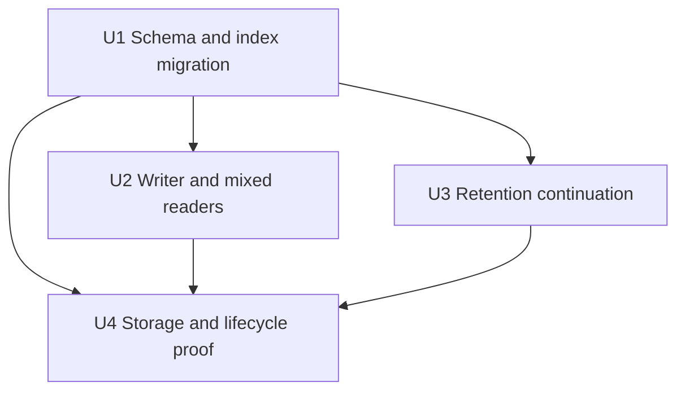

# Lossless recommendation storage and bounded retention catch-up

## Summary

Store complete candidate traces as one versioned JSONB document on their existing
candidate run. Preserve all recommendation behavior, Admin detail, and 29-day
retention. Remove the redundant stage index and drain bounded purge work without
waiting for expired records to cross the 24-hour health threshold.

## Problem frame

The read-only production investigation measured 82% volume use and approximately
1.55 GB/day growth. Candidate-stage evidence occupies 20.60 GB, including a
2.36 GB redundant index. Each request persists roughly 82 stage observations on
average, with recent cohorts materially larger. No request root has expired yet;
the first expiry is September 30. Successful empty cleanup runs do not prove
deletion capacity. See the investigation report for timestamps and attribution.

---

## Requirements

- R1. Preserve every currently persisted trace field and all seven stages, their
  order, explanations, source evidence, and empty traces. Preserve serving,
  outcome attribution, evaluation, and Admin contracts.
- R2. Preserve 29-day expiry, request ownership, erasure, atomic issuance, and
  cascade deletion for mixed legacy and compact data.
- R3. Reduce physical trace storage using a reproducible isolated PostgreSQL 18
  benchmark. Report relation, index, and TOAST bytes; do not equate row reduction
  with measured disk savings.
- R4. Remove only the duplicate nonunique stage index. Preserve unique stage
  ordinals and a production migration with bounded lock acquisition.
- R5. Continue cleanup when a bounded selection fills, even before records are
  overdue. Keep work, lock retries, and workflow execution bounded, and retain
  compatibility with replayed prior step results.
- R6. Deploy mixed-format readers before enabling compact writes, with a clear
  rollback floor and default-legacy activation flag.

## Scope boundaries

No production mutation or deployment is part of this local implementation. No
sampling, shortened retention, removal of evidence, changes to ranking, consent,
GA or Datadog, or migration of retained production traces is planned.

### Deferred to follow-up work

Production rollout, capacity protection, measured deletion throughput, and
post-deploy disk verification require normal PR-to-main operations. Dropping the
legacy table or reclaiming its physical allocation requires a later reviewed
migration after legacy writes stop and all retained legacy rows expire. Plain
DELETE and VACUUM usually make space reusable inside relations rather than
returning it to the filesystem.

---

## Key decisions

| Decision                                                  | Reason                                                                                                           |
| --------------------------------------------------------- | ---------------------------------------------------------------------------------------------------------------- |
| Nullable version and JSONB payload on the existing run    | One trace per run; existing request FK, expiry, and cascade apply without another table or index.                |
| Full named stage objects, native TOAST compression first  | Preserve data and keep decoding auditable; do not add a custom tuple/dictionary codec without measured need.     |
| Shared run ID and expiry stay on the parent               | Remove repetition while retaining a lossless reconstruction of each observation.                                 |
| SQL projects bounded named fields for Admin detail        | Preserve the current boundary that arbitrary evidence JSON does not enter the Admin detail application response. |
| Compact payload presence selects one reader               | Never concatenate compact and legacy observations; reject unsupported or malformed compact data.                 |
| `RECOMMENDATION_CANDIDATE_TRACE_FORMAT=legacy` by default | Readers ship before new writes; a reader-capable image remains the rollback target.                              |
| Separate purge continuation and overdue health signals    | Throughput scheduling must not wait until retention is unhealthy.                                                |

Database validation preserves existing stage, ordinal, score, array, and shape
bounds. Zero-stage documents are valid and distinguish a new empty trace from a
legacy run. The payload includes stage IDs and timestamps as well as all evidence
values; changing physical representation must not discard information.

---

## Implementation units

### U1. Expand schema and remove duplicate index

**Goal:** Add compact trace storage and retain database invariants.

**Requirements:** R1, R2, R4, R6.

**Dependencies:** None; coordinate payload contract with U2.

**Files:** `apps/admin/prisma/schema.prisma`, forward migrations beginning at
`apps/admin/prisma/migrations/0100_*`, and a new compact-trace migration DB test
under `apps/admin/src/services/recommendations/`.

**Approach:** Add nullable version/payload fields with paired-null and versioned
shape validation. Remove only `recommendation_candidate_stage_run_stage_idx`
using the repository's transactional migration pattern and a two-second lock
timeout. Keep the unique ordinal constraint. Document failed migration recovery;
do not silently retry indefinitely or execute a production DDL command.

**Patterns:** Migrations 0058 and 0069 define stage invariants; migrations
0097–0099 use short local lock timeouts.

**Test scenarios:** Valid empty, normal, and 448-observation payloads succeed;
duplicate stage ordinals, invalid stages, invalid scores, mismatched nulls and
unknown versions fail. Legacy inserts still work. The duplicate index disappears
while uniqueness and request cascade remain. Held locks cause bounded failure
and rollback; releasing the lock permits a clean retry.

**Verification:** Real PostgreSQL accepts and rejects the intended records,
retains indexed legacy access, and demonstrates transactional migration recovery.

### U2. Persist and read complete compact traces

**Goal:** Write one complete trace per run and preserve Admin output.

**Requirements:** R1, R2, R3, R6.

**Dependencies:** U1 contract; implementation can proceed alongside U1.

**Files:** `apps/admin/src/config/env.ts`,
`apps/admin/src/services/recommendations/candidate-evidence-persistence.ts`,
`delivery.service.ts`, a compact trace helper and tests in the same directory,
`admin-ops/detail.service.ts`, `admin-ops/detail.db.test.ts`,
`admin-ops/trace-detail.test.ts`, and delivery persistence tests. Adjust the
existing wait-sampler matcher only if the persistence query changes its coverage.

**Approach:** Keep the current legacy writer as default. Compact mode attaches a
versioned payload to the run in the existing issuance transaction and omits stage
row inserts. Read either format through bounded SQL projections in canonical
stage/ordinal order. Preserve trace access auditing and existing latency labels.

**Patterns:** Existing evidence normalization, issuance transaction, and SQL
detail projections are the behavioral baseline.

**Test scenarios:** The same candidates produce identical Admin detail from each
format, including all source contributors and reason codes. Empty and maximum
traces work. Unknown/malformed compact data fails closed. A run with both formats
does not duplicate output. Failed issuance rolls back payload and surrounding
records. Default configuration still writes legacy; compact configuration writes
no stage rows. Complete persisted field round trips prove no evidence loss.

**Verification:** Unit and real-DB parity tests pass with unchanged public schema,
serving decisions, and attribution contracts.

### U3. Drain bounded expired work promptly

**Goal:** Separate purge progress from the overdue incident threshold.

**Requirements:** R2, R5.

**Dependencies:** U1 for mixed-format lifecycle fixture only.

**Files:** `apps/admin/src/services/recommendations/retention.service.ts`,
`retention.service.test.ts`, `retention/job.ts`, `retention/job.test.ts`,
`migration.lifecycle.db.test.ts`, and
`apps/admin/src/workflows/recommendationRetention.ts` with its tests.

**Approach:** Derive `batchLimitReached` from existing capped selections without
new full scans. Continue within the existing batch/time budgets, then schedule a
short durable continuation. Preserve `overdueAfterRun` health semantics. Retry
skipped advisory locks; after exhausted retries schedule a bounded continuation.
Replayed older results without the new field fall back to previous signals.
Legacy stage row counts remain literal; candidate run counts include compact
traces and existing request cascades remove both representations.

**Patterns:** Existing durable workflow, retry policy, ledger, and root deletion.

**Test scenarios:** Young expired backlog continues; no work returns to daily
schedule; exact batch boundaries may trigger one harmless empty follow-up;
every bounded selector participates. Eight-batch and 30-second limits hold.
Skipped locks, exhausted retries, and older replayed steps schedule correctly.
Mixed legacy/compact request deletion and erasure leave no trace residue.

**Verification:** Focused workflow tests and real database cascade tests pass.

### U4. Measure savings and document deployment

**Goal:** Establish physical savings and a concrete operational handoff.

**Requirements:** R1–R6.

**Dependencies:** U1, U2, U3.

**Files:** Reproducible synthetic benchmark under
`apps/admin/src/services/recommendations/` or
`docs/reports/2026-09-28-production-db-storage/`; benchmark results and rollout
runbook in that report directory; roadmap feat-558 and durable solution note.

**Approach:** Use a disposable local PostgreSQL 18 instance and synthetic cohorts
of 82, 113, 195, and 323 observations. Compare compact storage against legacy with
the duplicate index already removed. Include all run/stage indexes and TOAST.
Measure inserts, detail plans/output parity, cascade deletion, and vacuum reuse.
Native compression is accepted only with measured improvement and no evidence
loss. Describe which production outcomes still need post-deploy measurement.

**Test scenarios:** Fixtures span short and long source evidence, multiple
sources, empty traces, and maximum bounds. Test real constraints and mixed data,
plus migration contention. Measurements must identify sample size, database
version, hardware context, and limitations; synthetic timing is not production
throughput proof.

**Verification:** Reproducible physical savings, behavior parity, affected tests,
type checking, lint, formatting, migration checks, and independent review pass.

---

## Rollout and risks

1. Merge through the normal PR flow with the compact writer disabled. Apply
   additive schema and the short-timeout index migration; a lock timeout is an
   explicit deployment failure requiring recovery, not permission to block prod.
2. Verify every serving replica and the rollback image can read compact traces.
   Rehearse mixed-format detail and retention using local/staging evidence.
3. Enable compact writes through the normal deployment/configuration process.
   Keep the previous reader-capable image as the rollback floor for at least
   29 days after the final compact write. Disabling writes alone does not make a
   row-only reader safe.
4. Monitor storage growth, issuance errors/latency, trace parity, purge throughput,
   failed/skipped runs, locks, and oldest expired roots through first real expiry.
   Refresh volume headroom before deployment; existing capacity risk persists
   while changes await review and rollout.

The legacy heap will retain its allocation after rows age out. New compact bytes
live in the run relation, so capacity planning must include overlap. Do not
backfill millions of rows or run `VACUUM FULL` on a nearly full production volume.
The exact steady-state production footprint and cleanup throughput remain
post-deploy measurements, not promises from the local benchmark.

## Sources

- `docs/reports/2026-09-28-production-db-storage/README.md`
- `docs/roadmap/platform/feat-558-production-recommendation-storage-remediation.md`
- `docs/solutions/best-practices/recommendation-trace-capacity-and-retention-proof-20260928.md`
- `docs/operations/semantic-recommendation-tracer.md`
- [PostgreSQL DROP INDEX](https://www.postgresql.org/docs/18/sql-dropindex.html)
- [PostgreSQL TOAST](https://www.postgresql.org/docs/18/storage-toast.html)
- [PostgreSQL routine vacuuming](https://www.postgresql.org/docs/18/routine-vacuuming.html)
