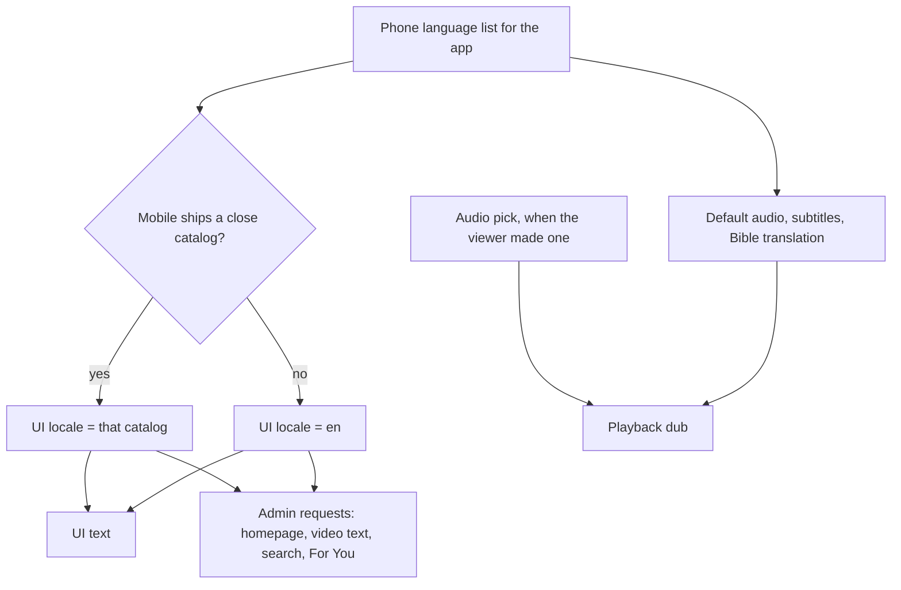
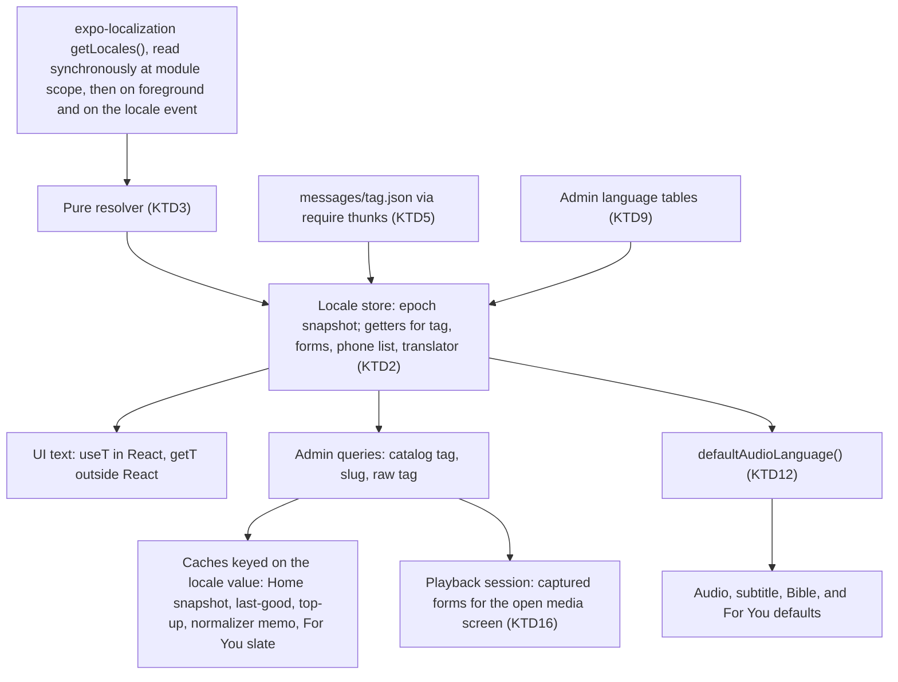
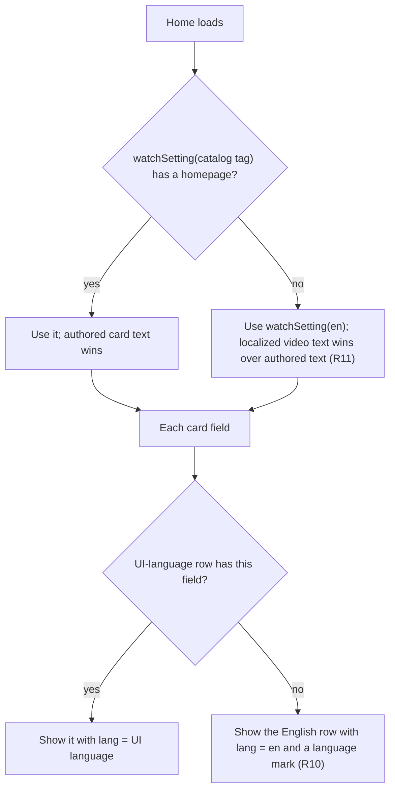
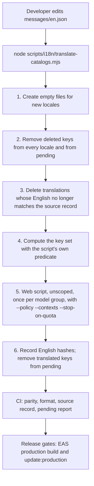

# Mobile UI Localization - Plan

## Goal Capsule

- **Objective:** A viewer whose phone uses a language that web supports sees the mobile app's text in that language. The viewer also sees Admin content in the same language wherever Admin has it. Each English string that a developer adds later enters one translation path that covers every supported language.
- **Means:** Mobile keeps its own string catalogs and runs web's translation script on them (KD5), with web's own message engine at runtime (KTD1).
- **Product authority:** This Product Contract comes first. Then `PRODUCT.md`, `apps/mobile/CLAUDE.md`, and the i18n rules in `apps/web/CLAUDE.md` that the shared script depends on. `apps/tv` and mirrored right-to-left layout are not active scope.
- **Execution profile:** Four phases (see Sequencing). U1 lands first in its own PR for web owners' review. Every fingerprint input lands in one native-build window. U16, the first full translation run, is a paid step that needs the owner's budget.
- **Stop conditions:** Stop and ask when web's owners decline an R19 option (KD5 opens again). Stop when a device check shows that the app mirrors its layout for a right-to-left language, or that playback stops on an Android language change. Stop before any paid translation run that has no budget from the owner. Stop when a change would edit `apps/admin`.
- **Open blockers:** None for planning. U1 needs web owners' review before U16 runs. U16 needs an OpenAI key and a budget from the owner.
- **Tail ownership:** The implementer finishes the units, the Verification Contract, the device checks, and the PRs. The owner gives the budget for U16, approves the native build, and merges.

---

## Product Contract

### Summary

The mobile app shows its UI text in the phone's language for every locale that web supports, and it gets Admin content in that same language. It uses web's message engine and its own catalogs. The author of a PR that changes English strings runs mobile's translation command, which calls web's script, in the same PR. CI rejects a PR that leaves any locale without a key or with a stale translation.

### Problem Frame

The mobile app shows only English. More than 100 files hard-code user-visible text, and every Admin request sends the locale `en` (`HOME_LOCALE` in `apps/mobile/src/lib/watchHome/config.ts`). `PRODUCT.md` says the audience wants to "find something to watch in my language". But a viewer whose phone is set to Russian sees English controls, and sees the English title of a film that Admin already stores as "ИИСУС".

Web solved the same problem for its own text. It ships about 224 catalogs from one English source, and a script translates new strings before CI lets a PR merge. Mobile has no such path, so each new mobile feature adds more English that no process translates.

### Actors

- A1. Viewer: uses the app on a phone that is set to any language.
- A2. Mobile developer: the owner or an agent who adds, changes, or removes English strings in `apps/mobile`.
- A3. Web owners: own `apps/web/scripts/`, which mobile calls, and review changes to it.
- A4. Admin editors: publish homepage Experiences and video text per locale. Mobile shows each newly published homepage with no app release.

### Key Decisions

- KD1. **The phone's language sets the UI and content language. Audio stays a separate choice.** (session-settled: user-directed — chosen over web's one-language model and over an in-app language setting: a bilingual viewer can keep English UI under a Korean dub, and the app follows the platform's per-app language setting.) Governs R1, R2, R3.
- KD2. **Content follows the UI language that the app actually shows.** (session-settled: user-approved — chosen over content that follows the raw phone language: the UI and the content never disagree, at the cost of English content for a phone language with no mobile catalog.) Governs R9.
- KD3. **Every web locale ships in the first release, and right-to-left languages keep a left-to-right layout.** (session-settled: user-directed — chosen over full mirrored layout, over no right-to-left languages, and over a small starter set: Arabic, Farsi, and Urdu viewers get their language now, and mirrored layout is later work.) Governs R5, R6.
- KD4. **Every catalog ships inside the app, and the app loads only the active one.** (session-settled: user-directed — chosen over download on demand and over a core set plus download: every language works offline and on the first launch, at the cost of about 2–3 MB more, compressed, per install and per update.) Governs R8.
- KD5. **Mobile keeps its own catalogs and calls web's translation script.** (session-settled: user-directed — chosen over one catalog shared with web, over reuse of web's translations as a memory, over a copy of the script in mobile, and over a shared package: the apps stay independent, and mobile gets web's later fixes to the script's checks.) Governs R15, R19, R20.
- KD6. **Translations happen in the same PR as the English change.** (session-settled: user-directed — chosen over an automatic follow-up PR and over CI commits to the PR: this matches web and needs no translation key in CI.) Governs R15, R16, R17.
- KD7. **When Admin has no homepage in the UI locale, Home uses the English homepage with localized video titles.** (session-settled: user-directed — chosen over the English homepage as-is and over web's language catalog: Home keeps the curated shelves and shows the most localized content that exists.) Governs R11.
- KD8. **The first release covers every user-visible string.** (session-settled: user-approved — chosen over a first release that covers only the main screens: the translated app then has no English gaps except pending keys and Admin fallbacks.) Governs R7.
- KD9. **When the viewer has not picked an audio language, the default audio follows the phone's language, before any catalog fallback, on both platforms.** (session-settled: user-directed — chosen over today's per-platform behavior, over always English, and over the language the app shows after fallback: viewers of the many languages with no UI catalog keep their own-language dub, and iOS matches Android.) Governs R2, R21.
- KD10. **Legal and license notices stay in English until a human reviews a translation.** (session-settled: user-directed — chosen over translating everything and over keeping the account-deletion flow in English too: a wrong machine translation of legal text can have legal effect.) Governs R7.
- KD11. **The default subtitle language and the Bible reader's default translation follow the same rule as the default audio.** (session-settled: user-approved — chosen over leaving them on today's separate device read: the three defaults cannot disagree.) Governs R22.
- KD12. **On a live Android language change, the open watch or series screen and the active playback keep their text until the viewer opens another video.** (session-settled: user-approved — chosen over a refetch of the open screen: it avoids a 9.5 MB refetch and a playback restart.) Governs R4.
- KD13. **The empty-pending-list gate also blocks production over-the-air updates, with a named emergency override.** (session-settled: user-approved — chosen over a gate on native builds only: an update reaches every tester in minutes, as a build does.) Governs R17.
- KD14. **The For You retry never switches the viewer's audio, so the shelf hides where Admin has no pool for the viewer's audio language.** (session-settled: user-approved — chosen over a last retry with English metadata and English audio: recommendations always match the audio that the viewer hears, at the cost of no shelf for no-pick viewers whose phone language has no pool.) Governs R12.

The phone's language feeds every language-dependent surface through one resolved UI locale. The default audio reads the phone's language directly, and an audio pick overrides it.



### Requirements

**Language selection**

- R1. The app shows its UI text in the phone's language for the app, including the per-app language setting on iOS and Android. It uses the closest catalog that mobile ships (for example, `es-MX` uses `es`), and it uses English when no catalog matches.
- R2. A change of UI language never changes an audio language that the viewer picked, and a change of audio language does not change the UI language. The audio picker stays as it is today.
- R21. When the viewer has not picked an audio language, the default audio follows the phone's language for the app, before any catalog fallback, on iOS and Android alike. The audio of a video that is already playing does not change.
- R22. The default subtitle language and the Bible reader's default translation follow the same rule as the default audio (R21).
- R3. A change of the phone's language setting shows in the app when the app next returns to the foreground, on both iOS and Android.
- R4. After a language change, no screen shows cached content from the previous language, including the Home that the app paints at cold launch. There are two exceptions. Offline download titles show until the app is online, and then the downloads list in Profile fetches them in the new language. On Android, a screen that plays video and is open during the change (a watch, series, or Experience media screen) and the active playback (mini player, Cast, and lock-screen controls) keep their text until the viewer opens another video. The Explore tab keeps its languages until the viewer next returns to it.

**Locales, strings, and size**

- R5. Mobile ships a catalog for each locale that web ships a catalog for, with the same locale tags.
- R6. Right-to-left languages show translated text in a left-to-right layout: each text keeps its natural right-to-left direction and alignment, and only the arrangement of elements stays left-to-right. The app keeps this layout on purpose, so the platform does not mirror the app when the phone uses a right-to-left language.
- R7. Every user-visible string can be translated: labels, headings, error and empty states, accessibility labels and hints, and the lapse reminder notification text. Development-only surfaces and log text stay in English. The terms of use and the Bible license and credit notices also stay in English, marked with their language for screen readers where the platform supports it, until a human reviews a translation.
- R8. Every catalog ships inside the app, so each language works offline and at the first launch, but the app holds only the active catalog in memory.
- R23. An exported file's name keeps the letters of the video's title in the UI language, in any script.

**Admin content**

- R9. Mobile asks Admin for content in the UI locale that the app shows (per R1). This covers the homepage Experience, the video titles, descriptions, snippets, and image alt text on every surface that shows them (including search results, the For You shelf, and Explore), study questions, Admin language names, and Bible book names. Admin keys this content by its own language tags, which differ from the catalog tags for about 54 locales (for example, `zh-hans` for the `zh-Hans` catalog and `npi` for the `ne` catalog), so the app maps each catalog to the Admin tag that it reads.
- R10. When Admin has no value in the UI locale for a video field, a language name, or a Bible book name, the app shows the English value. When Admin has no study questions in the UI locale, the app shows the English list. Where the platform supports it, the app marks each English fallback text (per R10 and R11) with its language for screen readers.
- R11. When Admin has no homepage Experience for the UI locale, Home uses the English homepage for shelf order and shelf headings. On each card, the video's title and snippet in the UI locale take priority over the English homepage's authored card text, which shows only when Admin has no localized value.
- R12. The For You shelf requests the UI locale as its metadata language. When Admin has no recommendations for that locale and audio pair, the shelf requests English metadata with the same audio, and the shelf's existing hide rule applies only when that request also fails.

**Translation pipeline**

- R13. Mobile catalogs use the same message format as web's catalogs for placeholders and plurals, so the script's placeholder and plural checks apply to mobile strings.
- R14. CI fails when mobile source adds user-visible English text outside the catalog, so every string added later enters the pipeline.
- R15. When a developer adds, changes, or removes an English string, the same PR updates every locale catalog. One mobile command runs web's translation script on mobile's catalogs.
- R16. CI fails a mobile PR when a locale catalog lacks a key that the English catalog has, or keeps a key that the English catalog no longer has.
- R17. A key on mobile's own pending list can ship in English in the other locales until a later translation run. A pending key makes no claim that its translation is complete. CI shows the pending count and the oldest pending key on every mobile PR. A production native build and a production over-the-air update each require an empty pending list, unless the release owner names an emergency override.
- R18. A changed English string cannot merge while its old translations stay in place, unless its key is on the pending list.
- R19. Web's script gets three options that leave web's own runs unchanged: a path to the caller's own translation policy file, the caller's own context text for each catalog section, and an immediate stop when the provider reports that the quota is used up. The policy file holds the caller's pending list, locale-neutral keys, and human-reviewed locales, and the script uses it for its copy checks and its source digest instead of web's file.
- R20. The mobile command always passes mobile's own paths, its own progress file, and a fixed model for each locale. A change to the script's defaults then cannot change a mobile run silently.

### Key Flows

- F1. A developer adds or changes a string
  - **Trigger:** A2 adds, changes, or removes an English string in a mobile PR.
  - **Actors:** A2, and A3 once for the R19 options.
  - **Steps:** A2 edits the English catalog. A2 runs the mobile translation command; an agent first asks the owner for a budget. The command removes deleted keys, clears stale translations, runs web's script on mobile's catalogs, and records which English text each translation came from. A2 commits the catalogs, and CI checks them.
  - **Outcome:** The PR merges with every locale complete, or with the key on the pending list.
  - **Covered by:** R15, R16, R17, R18, R20
- F2. A viewer opens the app
  - **Trigger:** A1 opens the app.
  - **Actors:** A1, A4 (through the content that Admin holds).
  - **Steps:** The app reads the phone's language list for the app and picks the first close catalog, or English. It loads only that catalog. It asks Admin for content in that locale, and it falls back field by field and for the homepage.
  - **Outcome:** The UI text and the content are in one language, except for the Admin fallbacks.
  - **Covered by:** R1, R4, R8, R9, R10, R11
- F3. A viewer changes the app's language on Android while the app lives
  - **Trigger:** A1 changes the per-app language in Settings and returns to the app.
  - **Actors:** A1.
  - **Steps:** The app reads the language list on its return to the foreground and on the platform's language event. When the resolved catalog changes, the UI text updates, and Home, For You, and Discover clear their old content and fetch it again. An open screen that plays video and the active playback keep their text (KD12).
  - **Outcome:** The next screen that the viewer opens is fully in the new language. Playback never stops.
  - **Covered by:** R3, R4, R21

### Acceptance Examples

- AE1. **Covers R1, R9.** Given a phone set to Spanish (Mexico), when the viewer opens Home, the UI text is Spanish and Home renders Admin's `es` homepage ("Ver").
- AE2. **Covers R10, R11.** Given a phone set to Russian and no Russian homepage in Admin, when Home loads, the shelf order and the shelf headings come from the English homepage. The "JESUS" card reads "ИИСУС", and a card whose video has no Russian title shows its English title.
- AE3. **Covers R2.** Given a phone set to English, when the viewer picks the Korean dub, the audio plays in Korean and the UI text stays English.
- AE4. **Covers R1, R9.** Given a phone set to Hausa, which has no web catalog, when the viewer opens the app, the UI text and the Admin content are English, even where Admin has Hausa text.
- AE5. **Covers R6.** Given a phone set to Arabic, when the viewer opens a video, the text is Arabic and aligns to the right. The tab order, the back gesture, and the seek bar direction are the same as in English.
- AE6. **Covers R3, R4.** Given a viewer who changes the app's language from English to Spanish in the phone settings, when the viewer returns to the app, it shows no English Home content before the Spanish content.
- AE7. **Covers R15, R16, R17.** Given a PR that adds an English string and does not run the translation, when CI runs, it fails and names the locales that lack the key. Given the same key on the pending list, CI passes, and the other locales show the English text for that key.
- AE8. **Covers R19.** Given an OpenAI organization that has used up its quota, when a developer runs the mobile command, the run stops at the first quota error. It does not retry every locale for about 20 minutes, as the script does today.
- AE9. **Covers R12.** Given a phone set to Russian and a saved English audio pick, when Home loads and Admin has no recommendations for Russian metadata with English audio, the shelf requests English metadata with English audio and shows with English titles.
- AE10. **Covers R21, R1.** Given a phone set to Hausa and no audio pick, when the viewer opens a video that has a Hausa dub, the Hausa dub plays and the UI text is English.
- AE11. **Covers R4, R21.** Given an Android phone that plays a video in the mini player, when the viewer changes the app's language to Russian and returns, playback continues with the same audio, the mini player keeps its title, and Home shows Russian text.
- AE12. **Covers R7.** Given a phone set to French, when the viewer opens the terms of use from the download sheet, the terms show in English and a screen reader on iOS reads them with an English voice.

### Success Criteria

- A viewer on a phone set to any supported language can open Home, find a video, play it, and change the audio. The viewer sees no English text except pending keys, the Admin fallbacks in R10 and R11, the legal notices in R7, and a Bible passage that Admin cannot yet give in the UI language.
- A bundle-size measurement records the bytes that the catalogs add to the app, against a baseline taken before the change.
- A release build shows no measurable cold-launch regression from the catalogs, measured with the mobile performance loops.

### Scope Boundaries

**Deferred for later**

- Mirrored layout for right-to-left languages.
- Localization of `apps/tv`. It has no i18n today, and the same approach can serve it later.
- Reuse of web's existing translations for identical English text. This can extend KD5 with no rework.
- An in-app language picker. On Android 12 and lower, the platform has no per-app language setting, so the UI follows only the device language there.
- Human review of machine translations, and translation of the legal notices after that review. Web records the same gap as "native-speaker review recommended".
- Screen-reader language marks on Android. React Native offers the mark on iOS only.
- Localized decimal separators, number formats, unit abbreviations ("GB", "MB"), and the playback-speed value. Only text with words is translated.
- Translated search terms for the browse topics. The topic labels are translated, and the search terms stay English.

**Outside this plan**

- Publishing homepages or video text in more locales. That is Admin editor work (A4).
- Changes to Admin's schema or Admin code.
- Translation that CI runs automatically.
- App Store and Play Store listings, and text that the operating system draws: the app name, system permission prompts, and the Cast dialogs.
- The language of the hosted sign-in page, which the auth app owns.

### Dependencies / Assumptions

- Web's owners accept the three options in R19. If they decline, KD5 opens again.
- The first release needs a new native build. The per-app language setting needs a native module and native configuration, which move the fingerprint runtime version, so an over-the-air update cannot deliver it. The production update channel is already blocked until the next native build (`apps/mobile/CLAUDE.md`, "Cold-start splash").
- Each translation run is charged to the developer's OpenAI organization. OpenAI applies rate limits and spend limits per organization and project, so web and mobile runs in one organization share them. This comes from OpenAI's documentation and was not verified in this repo.
- Admin coverage in production on 2026-09-25: homepage Experiences exist only for `en` and `es`. Video text exists for many locales under Admin's own language tags; for example, the film "JESUS" has titles under `zh-hans` and `zh-hant`, and none under the catalog tags `zh-Hans` and `zh-Hant`. For You recommendations are active for 51 locale and audio pairs, and each pairs a locale with its own audio except `en`/`english` (`docs/operations/user-recommendations-activation-2026-09-14.json`).
- Web's 225 catalogs compile to 5.25 MB of Hermes bytecode, which is 1.82 MB after gzip. Mobile's catalogs are expected to be of a similar size, which gives the KD4 estimate.
- The app's JavaScript engine (Hermes 250829098.0.17) has no `Intl.PluralRules` and no `Intl.Locale` on iOS or Android, so plural messages need a polyfill (KTD1).

### Outstanding Questions

**Resolve Before Planning**

- None.

**Deferred to Implementation**

- [Affects R15, R19] Does a full catalog run stay inside the script's output limit of 20,000 tokens per request for the densest scripts (`my`, `ta`, `ml`)? The implementer measures it in U16. If a run exceeds the limit, the per-locale model table uses a model with the larger limit (KTD6) before anyone asks web's owners for a batching option.
- [Affects R9] Does `BibleCitation.passage(languageSlug:)` return a passage for the mapped slugs? If it does, the Bible card uses it. If not, the passage stays English, as the Success Criteria allow.
- [Affects R3, R21] Do the platform's language reads report the per-app language as the research expects: `getLocales()` on Android 13+ after the return to the foreground, and on iOS after the relaunch? The device checks in the Verification Contract confirm this.

### Sources / Research

- `apps/web/scripts/translate-ui-catalogs.mjs` and `apps/web/scripts/openai-catalog-translator.mjs`: the script. It retries an HTTP 429 up to 4 times per locale and cannot tell a rate limit from a used-up quota. Its default progress file is shared per checkout, its policy file path is fixed, and its scoped mode accepts only added keys.
- `apps/web/scripts/ui-translation-policy.json`: web's pending list (`pendingTranslationPaths`), which only web's tests read.
- `docs/i18n/watch-ui-provisional-catalogs.json` and `docs/i18n/watch-ui-official-language-inventory.json`: web's translation provenance and its language inventory.
- `apps/web/CLAUDE.md`, "i18n" section, and `apps/web/src/i18n/__tests__/messages-parity.test.ts`: catalog membership and the parity test that every catalog has every key.
- `apps/web/src/lib/language-bcp47-map.ts` (generated) and `apps/web/src/lib/locale.ts`: the slug-to-tag map and web's catalog resolution.
- `CONCEPTS.md`, "Watch localization": Watch UI Catalog, Pending Translation Path, Translation Provenance, and UI Locale.
- `apps/admin/schema.graphql`: `watchSetting(locale)`, `ExperienceLocale`, `Video.locales(languageSlug, locale)`, `VideoLocale`, `BibleCitation.passage(languageSlug)`, and `WatchSearchInput`.
- `docs/solutions/best-practices/language-identity-on-slug-not-bcp47-20260605.md`: identity keys on the language slug, and a BCP-47 tag is only a fuzzy fallback.
- `docs/solutions/ui-bugs/machine-translated-ui-catalog-wrong-language-validation-gap.md`: shape checks cannot prove that a catalog is in the right language.
- `docs/solutions/ui-bugs/watch-blank-localized-title-fallback.md`: fall back per field, never per record.
- `docs/solutions/workflow-issues/merge-pending-catalog-fallbacks-with-localized-provenance.md`: merge catalogs, pending keys, and provenance as separate contracts.
- `docs/solutions/architecture-patterns/kill-switch-reach-follows-its-slowest-artifact-channel.md`: which changes move the fingerprint runtime version.
- `docs/plans/2026-07-15-002-feat-watch-global-language-switcher-plan.md`: web's one-language model, which KD1 departs from.

---

## Planning Contract

**Product Contract preservation:** changed: R2 (split: R2 keeps pick independence, R21 takes the new default-audio rule, R22 takes the subtitle and Bible defaults), R4 (added the live Android exception, and clarified that it covers every screen that plays video, including the Experience media screens), R7 (added the legal-notice exception), R9 (clarified that study questions follow the UI language), R10 (added the list-level English fallback for study questions that U7 specifies), R17 (added the over-the-air gate and the override), R20 ("a fixed model for each locale"), and AE9 (rewritten for R21). Added R23, F3, AE10–AE12, and KD9–KD14. The owner chose each change in the planning session: KD9 and KD10 as direct choices, and KD11–KD14 and the R20 wording as confirmed call-outs. The R4 and R9 clarifications came from the architecture review: the Experience media screens also play video, and study questions today show every language at once. After the 2026-09-29 merge of `main`, R4 and R9 also name the new Explore tab (feat-552), and R4 names the downloads list in Profile, because the Library tab was removed (#2444); these are clarifications, not scope changes. The Outstanding Questions that planning answered moved into the KTDs below.

### Key Technical Decisions

- KTD1. **Runtime: `use-intl` pinned to 4.13.0, the version that web's `next-intl` resolves, through `createTranslator` and without `IntlProvider`.** It runs the same `intl-messageformat` engine as web, so web's catalog checks mean the same thing on mobile, and it reads nested catalogs as they are. `createTranslator` also serves text outside React, such as reminder bodies. `src/i18n/pluralRules.ts` imports `@formatjs/intl-locale/polyfill-force` and then `@formatjs/intl-pluralrules/polyfill-force` as its first statements, before any plural data loads, and the store requires that module; no route file imports a polyfill. The locale polyfill is required, because the plural polyfill's locale matcher calls `new Intl.Locale(...).maximize()` for any tag that does not exactly match loaded data, and Hermes has no `Intl.Locale`. The plural-data map resolves each catalog tag to the exact tag of the data that it loads (for example, `zh-Hans` to `zh`, and a tag with no CLDR plural data to `en`; 79 of the 225 tags have none), and the translator formats plurals under that exact tag, so the polyfill stays on its exact-match path. The `en` data always loads first (KTD3), so the English fallback translator stays on that path too. i18next was rejected because its plural format differs from web's ICU messages, and `react-intl` because it needs flat keys. Governs R8, R13.
- KTD2. **One module-scope locale store with an English default.** The `useSyncExternalStore` snapshot is the epoch number. The catalog tag, the translator, the phone language list, and the Admin language forms (KTD9) are read through getters. The epoch changes only when the resolved catalog tag changes, and it is the change signal and the stale-response guard. In-memory caches key on the locale value (tag, slug, or raw tag), never on the epoch, so a screen that holds a captured locale (KTD16) can still read its cache. With the English default, the ~44 test suites that assert English and all render suites need no provider. `getT()` serves `.ts` modules outside React only, such as reminders, `src/lib/actionMenu.ts`, `src/lib/bible/sheets/downloadPrompt.ts`, and telemetry. React code calls `useT()`, an alert built in a handler inside a `.tsx` component takes its text from that component's `t`, and lib copy helpers take `t` as a parameter. The store follows the pattern in `src/lib/tabBarVisibility.ts`. Governs R1, R3, R4.
- KTD3. **The store resolves synchronously before the first render.** `startLocaleSync()` runs at module scope inside the guarded `require` block of `app/_layout.tsx`, next to `preventNativeSplashAutoHide()`. It reads `expo-localization` `getLocales()` (synchronous), resolves, runs the `en` plural-data thunk first and then the active catalog's catalog and plural-data thunks, and sets the result with epoch 0, so the first frame, the first Home request, and a deep-linked watch screen all use the phone's language. The `en` thunk runs first because the plural polyfill makes the first registered locale its default, and the English fallback translator resolves to that default when `en` has no data; a live change loads the new locale's data and never unloads `en`. It then registers the store's own `AppState` listener, the primary path that the device checks prove, and `addLocaleListener`, both routed to one idempotent `refreshLocale()`; a rotation that fires the Android event costs one read and no epoch change. The package's public entry does not export `addLocaleListener`, so the store requires it from `expo-localization/build/ExpoLocalization` inside the same guarded lazy `require`, and the U2 start-up guard pins that path string so a package bump that moves it fails a test instead of silently dropping the event. Any failure keeps `en` and records the reason; it never reaches the Startup Error panel. Resolution walks the whole preferred list, and the first catalog match wins. Per entry: exact tag, then a script inference table (for example, Android `zh-TW` to `zh-Hant` and `zh-CN` to `zh-Hans`, because Android often sends no script), then the language alone. No match gives `en`. The resolver is a pure function with a table, because Hermes has no `Intl.Locale`. Only `src/i18n/localeStore.ts` loads `expo-localization`, and it requires the module lazily inside the `try` blocks of `startLocaleSync()` and `refreshLocale()`, never as a top-level import, so a dev client built before the native build stays on `en` instead of failing at start. No file reads the `Intl` default locale. Governs R1, R3.
- KTD4. **Native configuration through the `expo-localization` config plugin and `app.json`, in one native-build window.** Plugin options: `supportedLocales` for iOS and Android equal a mobile-owned list, `apps/mobile/i18n/native-locales.json`, written at U3 from web's catalog set (R5), so the list is final at U3 and needs no second native build when the mobile catalogs land in U16; that list may lag web's inventory, because a locale that web adds later ships its mobile catalog by over-the-air update at once and joins the native list, and the per-app Settings row, at the next native build, `supportsRTL: false`, no `forcesRTL` key, and `allowDynamicLocaleChangesAndroid: true`. The `forcesRTL` key must be absent: the plugin writes it for any non-null value, including `false`, and the iOS module then calls `setRTLPreferences(true, forceRTL)`, which allows right-to-left and forces it on a right-to-left phone. The last option keeps the Activity and playback alive on a language change. `ios.infoPlist.UIPrefersShowingLanguageSettings` is `true`, so iOS always shows the per-app language row. A small config plugin sets `UIView.appearance().semanticContentAttribute` to `forceLeftToRight` at launch, because declaring `ar`, `fa`, or `ur` in `CFBundleLocalizations` turns UIKit containers outside React Native views (form sheets, menus, alerts, the native video transport) right-to-left. The iOS `NativeTabs` bar gets `direction: 'ltr'` through `unstable_nativeProps`, because UIKit tabs ignore `allowRTL`. The mobile translation command runs as `node scripts/i18n/...`, not as a `package.json` script, because a new script entry moves the fingerprint. Governs R1, R6.
- KTD5. **Catalog layout mirrors web's layout.** Catalogs are `apps/mobile/messages/<tag>.json`, nested by namespace, with ICU messages. A generator writes the locale list, a map of per-locale `require` thunks, and a map of plural-data thunks, and it has a `--check` mode. The thunks keep every catalog in the bundle but put only what the app uses on the heap: the active catalog, English after the first missing key, and on Android the previous catalog after a live change until the next cold start. That is the R8 bound. Key names follow the web translator's role inference: an accessibility label or hint contains `Aria` (for example `playAriaLabel`), so the translator treats it as spoken text. Every list passes an `extraData` that includes the epoch, so recycled cells take the new language. `crk` and `mey-Latn` stay English-only, as on web, through an `englishOnlyLocales` policy list. A development-only pseudo-locale, chosen through an inlined `EXPO_PUBLIC_` value, doubles as the layout test for longer text. Governs R5, R8, R13.
- KTD6. **Mobile's command keeps its own per-key source record and never uses the script's scoped or promote modes.** One run:
  1. Create an empty `{}` file for any locale that has none, because the script fails on a missing file.
  2. Remove deleted keys from every locale and from the pending list.
  3. Delete the translations of every key whose English text no longer matches its record.
  4. Compute the set of keys that the script will translate, with the script's own predicate and its exported `messageContractError`, because the script reports only a count.
  5. Call web's script unscoped, once per model group, with `--locales` for that group. It translates exactly the missing keys, the English copies, and the keys that fail the contract check.
  6. Record the English hash of each translated key, and remove those keys from the pending list.

  The manifest that the script reads is a stub with an empty `provisionalLocales` list and no machine-translated list, so web's whole-catalog triggers never fire. Mobile's provenance (machine-translated locales, model, date) lives in a separate file that the script never reads. Each progress file path includes the English digest, the policy digest, and the model. The command always passes `--manifest` and `--progress`, because the script's defaults point at web's files. A pinned table names the model for each locale, and it holds only API model IDs; web's recorded `zh` fallback (`codex-local-agent`) is not one, so the `zh` tags get a real ID. No-network modes: `--prune-only`, `--restamp`, and `--mark-pending <key>`. A changed key that goes on the pending list takes the new English in every locale, so a stale placeholder can never ship. The command prints an estimate of the requests and asks for confirmation before it calls the API. The script rejects a locale where any non-neutral key comes back equal to English (its copy limit is zero, and its change ratio is one when keys are requested), so a key belongs in the catalog only when every locale has a native form, or on the locale-neutral list. Governs R15, R17, R18, R20.

- KTD7. **Web's script options: `--policy <path>`, `--contexts <path>`, and `--stop-on-quota`.** `--policy` replaces the module-scope policy read and feeds all seven uses of the policy data, including the locale-neutral set, the source digest, and the manifest update. The digest keeps its current shape, because web's provisional-catalog test rebuilds it inline. `--contexts` gives a sentence for each namespace, a product sentence that replaces "website", and the caller's own per-key overrides in place of web's `MESSAGE_CONTEXT_OVERRIDES`; it also drops web's search-specific instruction lines. `--stop-on-quota` classifies an HTTP 429 whose body names `insufficient_quota` as a permanent error. Without the flags, web's runs and tests are unchanged. `openai-catalog-translator.d.mts` gets the new fields. Governs R19.
- KTD8. **The CI checks are mobile jest suites, plus one report step, one path trigger, and two release gates.** The suites check key parity in both directions, placeholder and tag and plural parity, that every message formats, the per-key source record, the pending list, context coverage, and the flags that the command passes. The report prints the pending count, the oldest pending key, and each web catalog that mobile lacks or has not declared natively into the CI job summary. The path trigger adds `@forge/mobile` to the affected set when web's two script files or the language inventory change. The gates run in `scripts/eas-build-pre-install.sh` for `EAS_BUILD_PROFILE=production` and before `update:production`. Both fail on a non-empty pending list unless `I18N_ALLOW_PENDING=1` is set. For `update:production` the override is a local shell variable. For a native build, EAS workers see no local variables, so the override is a plain-text EAS `production` environment variable that the owner creates with `eas env:create` for the one emergency build and deletes afterwards; it never goes in `eas.json`, which would move the runtime version. The gate prints a warning line in the build log whenever it honors the override. Governs R16, R17, R18, R20.
- KTD9. **A generated table maps each catalog to three Admin language forms.** The forms are:
  - the catalog tag, for `watchSetting`, `experienceBySlug`, and For You;
  - the language slug, which is the identity, for video text rows, study questions, search, and Bible passages;
  - Admin's raw tag, for the `Language.name` and `BibleBook.name` maps.

  The generator reads web's generated `language-bcp47-map.ts` and web's curated catalog-to-slug table at development time only, and then applies mobile's override file. Resolution order: override, then curated, then the first slug whose raw tag equals the catalog tag. The override file covers codes that Admin holds under another name (`nb` to `norwegian-bokmal`, `uz`, `ps`), catalog tags that several languages share (`hu` to `hungarian`), and the For You locale where it differs (`tl` to `fil`). The override file holds separate `text` and `audio` entries per tag, because the two source tables disagree: web's curated table sends `es` text to `spanish-castilian` and `id` to `indonesian-isa`, while Explore's reviewed map sends `es` audio to `spanish-latin-american` and `id` to `indonesian-yesus`. The `text` entries apply to the catalog-to-forms table, with web's table as the default; the `audio` entries apply to the reverse table that KTD12 reads, with Explore's map as the default. A catalog with no mapping reads English content, and its slug form is `english`, never null, because a null slug returns every language's row. The generator also writes the reverse table from all Admin tags to slugs, which KTD12 uses. A jest `--check` catches drift from web's file. Governs R9, R10.

- KTD10. **The heavy video document stays language-free, and text comes from a small companion query.** `watchVideoFragment` and `seriesWatchVideoFragment` lose every `locales(...)` selection, so `GET_VIDEO_BY_SLUG` takes only the slug. The ~9.5 MB dub list for JESUS never refetches for a language change. A new `GET_VIDEO_TEXT` companion asks for the UI-language row by slug and an aliased English row, for the video, its parents, and its children, with `documentId: id` at every level, as the Bible passage companion already does. One helper builds every `locales(...)` argument set with a non-null slug, so Home's rows are a cache hit for a watch title. Normalizers return `{ text, lang }` for each field. The homepage request asks for `watchSetting(<catalog tag>)` and `watchSetting(en)` in one request. The card precedence flip (R11) applies only when the English homepage is the fallback. With a homepage in the UI locale, authored card text still wins. Governs R9, R10, R11.
- KTD11. **For You takes its request from the table and retries once.** The request uses the For You locale from KTD9 and the audio from `defaultAudioLanguage()` (KTD12), or the viewer's saved pick. Only the `coverage_unavailable` answer starts the English-metadata retry, which keeps the same audio (KD14). When the first request already used `en` metadata, there is no retry. A pair without a pool is remembered for the session, so the retry does not spend the 30-per-minute budget on each Home visit. On an epoch change, the shelf clears to its skeleton at once, and the fetch waits for Home's focus, as the other held triggers do. Explore's own recommendations request takes the same For You locale, in place of the `RECOMMENDATION_UI_LOCALE` constant. Governs R12.
- KTD12. **One `defaultAudioLanguage()` in the store feeds the audio default, the subtitle default, the Bible reader's default translation, For You, and the Explore feed language.** It takes the first phone language, before any catalog fallback, and returns the tag and a slug from KTD9's reverse table, exact tag first. It replaces `getDeviceLanguageCode` and the `Intl` read in `src/lib/explore/feedLanguage.ts`, which both read the `Intl` default locale; that value changes on iOS once the app declares localizations, so it can no longer serve as the phone language. Explore's reviewed device-language map (`src/lib/explore/deviceLanguageMap.ts`) moves into the `audio` entries of U5's override file, so one table serves every audio consumer and never changes a text-row slug. The rest of the `resolveDefaultSlug` chain stays: exact tag, then prefix, then the video's primary language, then English. Saved picks are untouched, and the reconciler still resolves once per video, so a playing video keeps its audio. Governs R2, R21, R22.
- KTD13. **Right-to-left text gets direction from the language of each text, never from the layout.** A style helper returns `direction: 'rtl'` (Android) and `writingDirection: 'rtl'` (iOS) for text in a right-to-left language, and `ltr` for English fallback text. It uses the `lang` from KTD10 for Admin text and the catalog tag for UI text. It never applies to container views or to centered text. The translator wraps an interpolated value in FSI and PDI characters only when the value is a string in a plain `{arg}` substitution, and only when the active catalog is right-to-left or the value contains a right-to-left character. It never wraps a plural, select, or number argument, and it never writes the marks into the catalogs. English output with left-to-right values stays byte-identical. Governs R6, R10.
- KTD14. **The no-hard-coded-English guard parses the source with the TypeScript compiler.** The compiler is already a mobile dev dependency. The guard flags:
  - JSX text;
  - string literals in copy properties (`accessibilityLabel`, `accessibilityHint`, `title`, `placeholder`, `label`);
  - the text arguments of `Alert.alert`;
  - a registered copy module that stops reading the catalog;
  - `getT(` in a `.tsx` file, and a store read at the top level of a module;
  - a second importer of `expo-localization`, and any read of the `Intl` default locale.

  It allows these by rule: `accessibilityActions[].name`, `dd-action-name`, log text, GraphQL documents, and development-only files. It follows the guard pattern of this repo: a file floor, positive and negative controls, and an offender list. Governs R14.

- KTD15. **Logic compares raw values, and only rendering translates.** The short-film hero pool, the download quality tiers, and the subtitle "Off" state compare raw identifiers. Tappable elements get a stable `dd-action-name`, because Datadog otherwise names tap actions from the translated `accessibilityLabel`. Name sorts pass the UI tag to the collator, and id sorts use a plain compare. Export file names keep Unicode letters, capped at 255 UTF-8 bytes and cut only between code points. Governs R7, R23.
- KTD16. **A live Android change updates text and lists, and a screen that plays video keeps its captured language.**
  - **Lists:** on a new epoch, text re-renders, and Home, For You, and Discover clear their old content and fetch it again. Responses for an old epoch are dropped. While the new content loads, Home and Discover show their existing loading state. When Home's refetch fails, Home shows the frozen fallback body with headings in the new language, never the old-language body. Discover pins the display slug to each search generation, so `loadMore` never mixes two languages.
  - **Captured language:** the playback session descriptor (`src/lib/miniPlayer/store.ts`) stores the Admin language forms that its screen used. A watch, series, or Experience media route reads the session's forms at mount, or the current forms when there is no session, so a mini-player expand of the same video keeps its text. The route passes those forms explicitly to `normalizeVideo`, the Bible passage, the study questions, and the dub names. No code under those routes reads the store for Admin content. The Explore tab captures its feed language and its text forms when it gains focus, so a live change never resets its clip queue mid-clip; the new languages apply at its next focus.
  - **Experience routes:** the Experience media routes keep the last good Experience for each slug until the new locale, or its `en` fallback, resolves, so playback never unmounts. The `ExperienceShell` selection query stays on `en`, because resetting its slug remounts the Stack.
  - **Stored text:** the Home snapshot and the last-good body store their locale and their homepage source. The stored subtitle language name stores its locale. The last-watched record stores the locale of its title, and the reminder body uses the untitled copy when that locale does not match.

  Governs R3, R4.

- KTD17. **Legal notices stay English and carry a language mark.** The terms of use (`src/lib/terms-of-use.ts`) and the Bible license and credit notices (`src/lib/bible/sheets/copy.ts`) stay in English, outside the translated catalogs, with `accessibilityLanguage="en"` on iOS and left-to-right direction. The guard allowlists these two modules by name. Governs R7.

### High-Level Technical Design

**Runtime data flow.** One store feeds four consumers. Caches key on the locale value, and the epoch signals a change.



**Content resolution.** The homepage falls back as a whole; every video field falls back on its own.



**Translation pipeline.** Mobile owns key state; web's script only fills missing text.



**Live language change on Android.** The epoch changes once, and only for a new catalog tag.

```mermaid
sequenceDiagram
  participant S as Settings
  participant App as App (JS context stays alive)
  participant L as Locale store
  participant H as Home, For You, Discover
  participant W as Open media screen and playback
  S->>App: per-app language = ru
  App->>L: AppState active or locale event: refreshLocale()
  L->>L: tag en -> ru: epoch + 1
  L->>H: clear old content, drop old responses, refetch
  L->>W: UI text re-renders; captured forms and session unchanged (KD12)
```

### Assumptions

- `getLocales()` reports the per-app language on iOS and on Android 13+. This is a developer observation for iOS, and it is unverified for Android. The device checks confirm it before release.
- With `allowDynamicLocaleChangesAndroid: true`, a per-app language change keeps both the Activity and the JS context alive, so playback continues. A device check confirms it.
- `supportsRTL: false` with no `forcesRTL` key keeps the React Native layout left-to-right from the first frame of a fresh install on an Arabic phone. In expo-localization 57.0.2, `LocalizationModule.swift` `OnCreate` calls `setRTLPreferences(true, forceRTL)` whenever the `ExpoLocalization_forcesRTL` key is present, and `setRTLPreferences(false, false)` when only `ExpoLocalization_supportsRTL` is present. The second path writes `allowRTL(false)` and `forceRTL(false)` at every launch, so a corrected build also heals a device that ran a wrong config. The plugin applies it before React loads; a device check confirms the timing.
- React Native delivers `AppState` events to listeners in registration order, so the store's listener, which registers at module scope, updates the store before any provider's listener runs.
- `EAS_BUILD_PROFILE` is set on EAS build workers, as Expo documents. No repo code reads it today.
- Declaring 225 `CFBundleLocalizations` has effects before the catalogs exist. iOS shows a per-app language row with 225 entries that all resolve to English, UIKit's own strings (alerts, the share sheet, pickers) follow the phone language while the app's text stays English, and App Store Connect lists the supported languages from the binary. The pending gate cannot block such a build, because the pending list is empty before U16. The Sequencing rule that the U3 build waits for U16 exists for this reason. If the already-due build cannot wait, the owner accepts these interim effects explicitly.

### Sequencing

- **Phase A, foundation:** U1 (its own PR, web owners' review), U2, U3, U4, U5.
- **Phase B, content and behavior:** U6, U7, U8, U9. U6 and U9 depend on U2 and U5, and U8 on U2. U7 also waits for U6 and U9.
- **Phase C, strings:** U10, U11, U12, U13, U17, U14. U10–U13 and U17 depend on U2 and U8, and they can run in parallel. U14 also depends on U6, because the direction helper reads the per-field `lang` that U6 adds.
- **Phase D, completion:** U15 after Phase C, then U16 after U1 has merged. The device and performance checks in the Verification Contract run on a build that contains all units.
- **Native-build window:** U3's plugin and `app.json` changes, the new native dependency from U2, and U4's `update:production` edit all move the fingerprint runtime version. Land them before the next production native build, and ship no production over-the-air update between that merge and the build. Since this plan was written, `main` has added two native modules (`@react-native-community/slider` and `expo-device`), so the next production native build is already required; these changes join that window. The production native build that carries U3 is cut only after U16 has merged, because U3's 225 iOS localizations are not inert without the catalogs (see Assumptions). A locale that web adds after the first release ships its mobile catalog by over-the-air update at once, and it joins `native-locales.json` and `app.json` at the next native build.

### Risks & Dependencies

| Risk                                                                                                  | Mitigation                                                                                                                                                          |
| ----------------------------------------------------------------------------------------------------- | ------------------------------------------------------------------------------------------------------------------------------------------------------------------- |
| Web's owners decline or delay the R19 options.                                                        | U1 is small, opt-in, and lands first. Without it, U16 cannot run, and KD5 opens again.                                                                              |
| Machine translations can pass every check and still be in the wrong language.                         | Mobile's provenance file records every translated locale as machine-translated with its model. KD10 keeps legal text English. Human review stays deferred.          |
| A full run exceeds the 20,000-token output limit for dense scripts.                                   | U16 measures the three densest locales first with one attempt each, and pins a model with the larger limit (a `-pro` or `gpt-5.6-` name) for any locale that fails. |
| A word that is the same in English and the target language fails the script's copy check.             | Brand names and fixed terms go on the locale-neutral list. The model is asked for a native form for everything else, as on web.                                     |
| The iOS 26 native tab bar truncates long labels (react-navigation#12908), and no JS style reaches it. | Tab label contexts ask for short labels. The device check uses the longest real translations (`de`, `fi`, `ru`, `ta`, `ml`).                                        |
| The pending gate blocks every TestFlight build while a key is pending.                                | This is intended (KD13). `I18N_ALLOW_PENDING=1` is the named emergency override.                                                                                    |
| A cache that nobody keys on the locale shows old-language content, often only on a flaky network.     | KTD16 lists every holder, and U6 and U7 test the last-good, in-flight, and recycled-cell paths.                                                                     |
| The catalog-to-Admin table goes stale when web's corpus job adds languages.                           | The mobile `--check` suite fails on drift at the next mobile PR. Until then, a new language shows English content; it never shows wrong content.                    |
| `expo-localization` has no jest mock, so a suite that loads the native module throws.                 | Only `startLocaleSync()` reads the native module, no ordinary suite calls it, and the store's own suite mocks the module.                                           |

### System-Wide Impact

- **Admin traffic:** the heavy video document no longer depends on language. Text comes from a small companion query that also asks for the English row. The homepage request asks for two locales. The For You retry is at most one extra request per pair per session.
- **Telemetry:** new attributes use the `ui_locale.` prefix (`ui_locale.resolved`, `ui_locale.requested`, `ui_locale.fallback`), never a reserved Datadog name. They are emitted from an effect after the Datadog provider starts. Stable `dd-action-name` values keep tap-action names in one series across languages.
- **Bundle and memory:** about 5 MB more Hermes bytecode (about 2 MB after compression) per install and per update, plus the plural and locale polyfills (about 19 KB gzip for the plural polyfill; measure the total). The heap holds the catalogs in the R8 bound (KTD5).
- **CI:** mobile tests also run when web's translation scripts or the language inventory change.
- **Web:** only `apps/web/scripts/` changes (U1), and web's default behavior stays the same.

### Documentation / Operational Notes

- Add a "Localization" section to `apps/mobile/CLAUDE.md`. It covers:
  - the add, change, and remove flow;
  - the command and its no-network modes;
  - the budget rule;
  - the merge procedure for two catalog PRs: take main's catalogs, re-run for your own keys, restamp, and never merge the source record by hand;
  - the release gates, and the override for each gate (a local variable for `update:production`, a temporary EAS environment variable for a native build);
  - the three Admin language forms;
  - the start-up rule that the store resolves at module scope;
  - the native-build window;
  - the two-step adoption of a new web locale: the catalog by over-the-air update at once, the native declaration at the next native build.
- The "UI Locale" entry in `CONCEPTS.md` states the three Admin language forms.

---

## Implementation Units

| Unit | Title                                           | Key files                                                                                                                            | Depends on     |
| ---- | ----------------------------------------------- | ------------------------------------------------------------------------------------------------------------------------------------ | -------------- |
| U1   | Web script options                              | `apps/web/scripts/translate-ui-catalogs.mjs`, `openai-catalog-translator.mjs`                                                        | —              |
| U2   | Runtime foundation                              | `apps/mobile/src/i18n/*`, `apps/mobile/messages/en.json`, `app/_layout.tsx`, `package.json`                                          | —              |
| U3   | Native localization config                      | `apps/mobile/app.json`, `app/(tabs)/_layout.ios.tsx`                                                                                 | U2             |
| U4   | Pipeline command and CI checks                  | `apps/mobile/scripts/i18n/*`, `apps/mobile/i18n/*`, `.github/workflows/ci.yml`                                                       | U2             |
| U5   | Catalog-to-Admin language tables                | `apps/mobile/scripts/i18n/generate-admin-languages.mjs`, `src/i18n/adminLanguages.generated.ts`                                      | U2             |
| U6   | Video text and Home in the UI locale            | `src/lib/queries.ts`, `src/hooks/useWatchHome.ts`, `src/lib/watchHome/*`, `src/lib/normalizeVideo.ts`, `src/lib/miniPlayer/store.ts` | U2, U5         |
| U7   | For You, search, names, Bible, offline titles   | `src/lib/recommendations/*`, `src/lib/watchSearch.ts`, `app/(tabs)/watch.tsx`, `src/lib/offlineManifest.ts`                          | U2, U5, U6, U9 |
| U8   | Display values apart from logic values          | `src/lib/watchHome/model.ts`, `src/lib/downloadTiers.ts`, `src/lib/transferPort.ts`                                                  | U2             |
| U9   | One default-language rule                       | `src/lib/resolveDefaultLanguage.ts`, `src/lib/bible/language/*`, `src/lib/watchPreferences.ts`                                       | U2, U5         |
| U10  | Strings: shell, Home, Discover, mission         | `app/(tabs)/*`, `src/components/home/*`, `src/components/search/*`                                                                   | U2, U8         |
| U11  | Strings: watch, player, Cast, sections          | `app/watch/*`, `src/components/watch/*`, `src/components/sections/*`                                                                 | U2, U8         |
| U12  | Strings: series, downloads, library, export     | `app/series/*`, `src/components/library/*`, download and export libs                                                                 | U2, U8         |
| U13  | Strings: profile, auth, Bible reader, reminders | `src/components/profile/*`, `src/components/bible/*`, `src/lib/lapseReminders/*`                                                     | U2, U8         |
| U14  | Right-to-left text direction                    | `src/i18n/textDirection.ts` and text surfaces                                                                                        | U2, U6         |
| U17  | Strings: Explore                                | `app/(tabs)/explore.tsx`, `src/components/explore/*`, `src/lib/explore/copy.ts`                                                      | U2, U8         |
| U15  | No-hard-coded-English guard                     | `src/i18n/__tests__/noHardcodedCopy.guard.test.js`                                                                                   | U10–U13, U17   |
| U16  | First full translation run                      | `apps/mobile/messages/*.json`, `apps/mobile/i18n/source-record.json`                                                                 | U1, U4, U15    |

### U1. Web script options

- **Goal:** Web's translation script accepts a caller's policy file, a caller's section contexts, and a stop on a used-up quota, and its default runs stay the same.
- **Requirements:** R19, AE8; KTD7.
- **Dependencies:** none.
- **Files:**
  - `apps/web/scripts/translate-ui-catalogs.mjs`
  - `apps/web/scripts/openai-catalog-translator.mjs`
  - `apps/web/scripts/openai-catalog-translator.d.mts`
  - `apps/web/scripts/translate-ui-catalogs.test.mjs`
- **Approach:**
  1. Replace the module-scope read of `ui-translation-policy.json` with a loader that takes a path, with web's file as the default. Thread its result to all seven uses of the policy data, and keep the exported names that web's tests import. Keep the digest shape, because `watch-ui-provisional-catalogs.test.ts` rebuilds it inline.
  2. `--contexts <path>` reads a JSON file with one sentence per namespace, a product sentence, and per-key overrides. It replaces `UI_SURFACE_CONTEXTS`, `MESSAGE_CONTEXT_OVERRIDES`, the "website" sentence in `buildSystemPrompt`, and web's search-specific instruction lines. With the file present, the script fails when a namespace has no sentence, as web's own test requires for web. `buildUserPrompt` gains an optional field, so its existing test calls stay valid.
  3. `--stop-on-quota` classifies an HTTP 429 whose body names `insufficient_quota` as `PermanentApiError`. Other 429s keep today's retries.
  4. Open this as its own PR, and ask web's owners to review it.
- **Patterns to follow:** the existing `argValue` flags, and `PermanentApiError` handling in the worker.
- **Test scenarios:**
  - A run with no new flags produces the same digest, locale-neutral set, and request bodies as today (the existing suite stays green).
  - `--policy` with a fixture policy changes the locale-neutral set and the source digest.
  - `--contexts` replaces one namespace's surface sentence, the product sentence, and a per-key override in the prompt, and web's search lines no longer appear.
  - `--contexts` with a namespace missing from the file fails before any request, and names the namespace.
  - Covers AE8. `--stop-on-quota` with a 429 whose body names `insufficient_quota` stops after the first locale, with a non-zero exit and no retries.
  - `--stop-on-quota` with a 429 that is a rate limit still retries with the `Retry-After` wait.
  - Without `--stop-on-quota`, an `insufficient_quota` 429 retries as today.
- **Verification:** web's vitest suite passes, and a web dry run with no new flags is unchanged.

### U2. Runtime foundation

- **Goal:** The app resolves its UI locale before the first render, has a translator and an English catalog, and renders English exactly as today on an English phone.
- **Requirements:** R1, R3, R8, R13; KTD1, KTD2, KTD3, KTD5, KTD13.
- **Dependencies:** none.
- **Files:**
  - `apps/mobile/package.json` (add `use-intl` at exactly `4.13.0`, `@formatjs/intl-pluralrules` and `@formatjs/intl-locale` pinned, and `expo-localization` `~57.0.2`; add `use-intl|intl-messageformat|@formatjs` to jest `transformIgnorePatterns`)
  - `apps/mobile/messages/en.json`
  - `apps/mobile/src/i18n/localeStore.ts`
  - `apps/mobile/src/i18n/resolveLocale.ts`
  - `apps/mobile/src/i18n/translator.ts`
  - `apps/mobile/src/i18n/useT.ts`
  - `apps/mobile/src/i18n/pluralRules.ts`
  - `apps/mobile/src/i18n/catalogs.generated.ts`
  - `apps/mobile/src/i18n/pluralData.generated.ts`
  - `apps/mobile/scripts/i18n/generate-catalog-index.mjs`
  - `apps/mobile/app/_layout.tsx` (call `startLocaleSync()` in the guarded `require` block)
  - `apps/mobile/src/i18n/__tests__/resolveLocale.test.ts`
  - `apps/mobile/src/i18n/__tests__/localeStore.test.ts`
  - `apps/mobile/src/i18n/__tests__/translator.test.ts`
  - `apps/mobile/src/i18n/__tests__/useT.test.tsx`
  - `apps/mobile/src/i18n/__tests__/catalogIndex.guard.test.js`
  - `apps/mobile/app/__tests__/localeStartup.guard.test.js`
- **Approach:**
  1. The store starts on `en` with epoch 0 and makes no native read, so every suite that does not set a locale runs unchanged.
  2. `startLocaleSync()` follows KTD3. It sets the resolved tag with epoch 0, so a launch is not a change.
  3. `useT(namespace)` subscribes to the epoch, and `getT(namespace)` serves code outside React.
  4. The English catalog loads lazily on the first missing key. The translator wraps use-intl's `t`: on a missing key or a formatting error, `getMessageFallback` returns a private sentinel, and the wrapper formats the same key with the same values through the English translator. It logs once per key as `ui_locale.message_error`.
  5. The translator isolates interpolated string values with FSI and PDI under the conditions in KTD13.
  6. The resolve result is kept in the store, and an effect emits `ui_locale.resolved` after the Datadog provider has started.
  7. A development-only pseudo-locale (accented text, 40% longer) is chosen through an inlined `EXPO_PUBLIC_` value.
- **Patterns to follow:** `src/lib/tabBarVisibility.ts` for the store; the module-scope calls in the guarded block of `app/_layout.tsx`; the guard file preamble in `app/__tests__/fontWeightMax.guard.test.js`.
- **Test scenarios:**
  - The resolver maps `es-MX` to `es`, iOS `zh-Hant-TW` to `zh-Hant`, Android `zh-TW` to `zh-Hant`, `zh-CN` to `zh-Hans`, and `sr-Latn-RS` to `sr-Latn`.
  - `[ha, fr]` resolves to `fr`, and `[ha]` resolves to `en` (covers AE4's UI half).
  - `tl` and `fil` each resolve to their own catalog.
  - With `getLocales` mocked to `[es-MX]`, `startLocaleSync()` sets `es` with epoch 0 and notifies no listener.
  - With `getLocales` mocked to throw, `startLocaleSync()` keeps `en` and records the reason.
  - `refreshLocale()` bumps the epoch when the tag changes from `en` to `ru`, and ten calls with the same tag change nothing.
  - A component that calls `useT` renders English with no setup.
  - A component re-renders with the new text after an epoch change, and the hook behaves the same in a `reactStrictMode: true` render.
  - With the native `Intl.Locale` and `Intl.PluralRules` deleted, as on Hermes, a plural message formats for `en` (`one`, `other`), `ar` (six categories, counts 0, 1, 2, 5, 11, 100), `ru`, `zh-Hans` and `sr-Latn` (data keyed on the bare language), and `qu` (no CLDR data, so English rules).
  - A missing key and a formatting error each return the formatted English sentence, for a placeholder message and for a plural message, and log one `ui_locale.message_error`.
  - With a fixture `zh-Hans` catalog active and a missing key, the English fallback of a plural message renders `1 episode` and `3 episodes`, and under a fixture `ru` catalog it renders `21 episodes`.
  - An Arabic device name in an `ar` catalog comes back wrapped in FSI and PDI, a Latin value in an `en` catalog comes back unchanged, and a plural count is never wrapped.
  - The generator's `--check` fails when a catalog file is added without regeneration.
  - The start-up guard finds `startLocaleSync(` inside the `try` block of `app/_layout.tsx`, with a negative control.
  - The start-up guard also finds the `expo-localization/build/ExpoLocalization` require inside the store's guarded block, with a negative control.
- **Verification:** the app boots in English, unchanged, on an English phone. On a simulator set to Spanish, the first frame after the splash is Spanish. The Hermes plural smoke in the Verification Contract passes on both platforms.

### U3. Native localization config

- **Goal:** The platform offers the per-app language on iOS and Android, and never mirrors the app.
- **Requirements:** R1, R3, R6; KTD4.
- **Dependencies:** U2.
- **Files:**
  - `apps/mobile/app.json`
  - `apps/mobile/app/(tabs)/_layout.ios.tsx`
  - `apps/mobile/app/__tests__/localizationConfig.guard.test.js`
  - `apps/mobile/i18n/native-locales.json` (written at U3 from web's catalog set; may lag web's inventory on purpose)
  - `apps/mobile/plugins/withIosLeftToRightAppearance.js`
  - `apps/mobile/plugins/withIosLeftToRightAppearance.test.js`
- **Approach:**
  1. Add the `expo-localization` plugin with the options in KTD4. `app.json` cannot import, so the locale list is literal, and the guard pins it to `apps/mobile/i18n/native-locales.json`, which is written at U3 from the files in `apps/web/messages/` and which never fails a test when web adds a catalog later. Until a mobile catalog exists for a declared locale, the resolver does not offer it, so that locale resolves to `en`.
  2. Set `ios.infoPlist.UIPrefersShowingLanguageSettings` to `true`.
  3. Pass `direction: 'ltr'` to `NativeTabs` through `unstable_nativeProps`.
  4. Add a local config plugin, with a sibling test, that sets the UIKit appearance to left-to-right at launch (KTD4). Follow the local plugin conventions in `apps/mobile/plugins/`, and register it in `app.json`.
  5. Record in `apps/mobile/CLAUDE.md` that this change moves the runtime version.
- **Execution note:** This is mostly configuration. Prove it with `npx expo prebuild` output and a simulator check, not with unit coverage.
- **Test scenarios:**
  - The guard finds the plugin with `supportsRTL: false` and `allowDynamicLocaleChangesAndroid: true`, and it fails when a `forcesRTL` key is present with any value.
  - The guard finds that the iOS and Android `supportedLocales` lists equal `apps/mobile/i18n/native-locales.json`, and a web catalog absent from that list does not fail the guard.
  - A declared locale with no file in `apps/mobile/messages/` resolves to `en`.
  - The guard finds `UIPrefersShowingLanguageSettings: true`.
  - The guard finds `direction: 'ltr'` on `NativeTabs`, with a negative control that fails when the prop is removed.
  - The plugin test finds the left-to-right appearance statement in the generated `AppDelegate`, once, after two prebuild passes.
- **Verification:** prebuild output shows `CFBundleLocalizations` and `locales_config.xml`. On a simulator with Arabic as the device language, a fresh install reports `isRTL` false on its first launch, and the tab bar, form sheets, menus, and alerts are not mirrored.

### U4. Pipeline command and CI checks

- **Goal:** A developer can add, change, or remove a string and bring every locale up to date with one command, and CI enforces completeness.
- **Requirements:** R5, R13, R15, R16, R17, R18, R20, F1, AE7; KTD6, KTD8.
- **Dependencies:** U2.
- **Files:**
  - `apps/mobile/scripts/i18n/translate-catalogs.mjs`
  - `apps/mobile/scripts/i18n/lib/catalogOps.js` (pure helpers for seeding, pruning, invalidation, the key-set prediction, and the source record)
  - `apps/mobile/scripts/i18n/pending-report.mjs`
  - `apps/mobile/scripts/i18n/check-pending-gate.mjs`
  - `apps/mobile/i18n/translation-policy.json` (pending keys with added dates, locale-neutral keys, human-reviewed locales, English-only locales)
  - `apps/mobile/i18n/translation-contexts.json`
  - `apps/mobile/i18n/script-manifest.json` (the stub that the script reads)
  - `apps/mobile/i18n/translation-provenance.json` (mobile's machine-translation record)
  - `apps/mobile/i18n/model-table.json`
  - `apps/mobile/i18n/source-record.json`
  - `apps/mobile/scripts/eas-build-pre-install.sh`
  - `apps/mobile/package.json` (`update:production` runs the gate first)
  - `.github/workflows/ci.yml` (report step in the mobile test job; path trigger in `affected`)
  - `apps/mobile/scripts/i18n/__tests__/catalogOps.test.js`
  - `apps/mobile/scripts/i18n/__tests__/translateCommand.test.js`
  - `apps/mobile/src/i18n/__tests__/catalogParity.test.ts`
  - `apps/mobile/src/i18n/__tests__/catalogFormat.test.ts`
  - `apps/mobile/src/i18n/__tests__/sourceRecord.test.ts`
  - `apps/mobile/src/i18n/__tests__/translationPolicy.test.ts`
  - `apps/mobile/CLAUDE.md`
- **Approach:**
  1. The command follows KTD6. It calls the web script as a child process with `--messages-dir apps/mobile/messages`, the stub manifest, web's inventory, a progress path per model group, `--policy`, `--contexts`, `--stop-on-quota`, `--locales`, and the group's model. The English-only locales never enter `--locales`.
  2. After a run, it prints the finished and failed locales. A failed locale keeps its old record, so CI names it. It updates the provenance file, never the stub manifest.
  3. The report writes the pending count, the oldest pending key, and each web catalog that mobile lacks or has not yet declared in `native-locales.json` to the job summary. These are lines, never failures.
  4. The gate script exits non-zero for `EAS_BUILD_PROFILE=production` or for `update:production` when the pending list is not empty, unless `I18N_ALLOW_PENDING=1` (KTD8 says where each override lives). It prints a warning line whenever it honors the override. `eas-build-pre-install.sh` keeps its non-fatal Datadog stamp and fails only on this gate.
  5. The `affected` step appends `@forge/mobile` when `apps/web/scripts/translate-ui-catalogs.mjs`, `apps/web/scripts/openai-catalog-translator.mjs`, or `docs/i18n/watch-ui-official-language-inventory.json` changes.
  6. Write the "Localization" section in `apps/mobile/CLAUDE.md`.
- **Patterns to follow:** web's `messages-parity.test.ts` checks; the `experiment-ledger` CI job for a script step; plugin tests for CommonJS helpers.
- **Test scenarios:**
  - Covers AE7. A key in `en.json` and missing in one locale fails parity, and the failure names the locale and the key.
  - Covers AE7. The same key on the pending list with English in every locale passes parity.
  - A key present in a locale and removed from `en.json` fails parity.
  - A locale message that drops `{count}` or the `#` of a plural fails the format suite.
  - A key whose English changed while its record hash stayed fails the source-record suite, unless the key is pending.
  - Seeding creates `{}` for a locale with no file.
  - Pruning removes a deleted key from every locale and from the pending list.
  - Invalidation deletes a changed key's translations in every locale, and a fake translator then fills them.
  - The predicted key set equals what a fake script run translates, including a key that fails the contract check.
  - `--mark-pending` on a changed key writes the new English into every locale and records the date.
  - A quota stop leaves unfinished locales unrecorded, and the summary names them.
  - Two model groups use two progress paths, and a policy edit changes the path.
  - The stub manifest is byte-identical after a run.
  - The translate-command test pins every flag that the command passes to the web script (R20), including `--manifest` and `--progress`.
  - Every model in the table is an API model ID (no `codex-local-agent`).
  - Every namespace in `en.json` has a sentence in the contexts file.
  - The gate exits 1 for the production profile with one pending key, 0 for the preview profile, and 0 with the override, and it prints the warning line when it honors the override.
- **Verification:** a dry run with a fake translator on two locales updates the catalogs, the record, and the provenance file, and leaves the stub manifest unchanged. A PR shows the pending report in the job summary.

### U5. Catalog-to-Admin language tables

- **Goal:** Each catalog maps to the Admin language forms it needs, with identity on the slug, and every Admin tag maps to a slug for the default-audio rule.
- **Requirements:** R9, R10, R21; KTD9.
- **Dependencies:** U2.
- **Files:**
  - `apps/mobile/scripts/i18n/generate-admin-languages.mjs`
  - `apps/mobile/i18n/admin-language-overrides.json` (`text` and `audio` entries per tag; the `audio` entries take the reviewed entries from Explore's `src/lib/explore/deviceLanguageMap.ts`)
  - `apps/mobile/src/i18n/adminLanguages.generated.ts` (catalog to forms, and the reverse table from Admin tag to slugs)
  - `apps/mobile/src/i18n/adminLanguage.ts`
  - `apps/mobile/src/i18n/__tests__/adminLanguage.test.ts`
  - `apps/mobile/src/i18n/__tests__/adminLanguages.guard.test.js`
- **Approach:** The generator reads `apps/web/src/lib/language-bcp47-map.ts` and web's curated catalog-to-slug table as text at development time; the app never imports from `apps/web`. It applies the resolution order in KTD9, writes one entry per catalog, and writes the reverse table. The guard reruns the generator in memory and fails on any difference.
- **Test scenarios:**
  - `zh-Hans` maps to catalog tag `zh-Hans`, slug `chinese-simplified`, and raw tag `zh-hans`.
  - `ne` maps to slug `nepali` and raw tag `npi`.
  - `hu` maps to `hungarian`, with a collision fixture that lists `csango` first in the source map.
  - `nb` maps through the override file to `norwegian-bokmal`.
  - `es` maps to text slug `spanish-castilian` and audio slug `spanish-latin-american`, and `id` to `indonesian-isa` and `indonesian-yesus`, so the two forms never overwrite each other.
  - `tl` has For You locale `fil`.
  - An unmapped catalog (`ab`) reads English content, with slug `english` and never null.
  - The reverse table maps `ha` to the Hausa slug, exact tag before prefix.
  - The guard fails when the fixture map adds a slug for an unmapped catalog.
- **Verification:** the table covers all 225 catalogs, with a count of how many read English content.

### U6. Video text and Home in the UI locale

- **Goal:** Home and every video text surface show Admin content in the UI language, falling back per field, with no old-language content after a change, and without refetching the heavy video document.
- **Requirements:** R4, R9, R10, R11, AE1, AE2, AE6, AE11; KTD10, KTD16.
- **Dependencies:** U2, U5.
- **Files:**
  - `apps/mobile/src/lib/queries.ts`
  - `apps/mobile/src/lib/watchHome/config.ts`
  - `apps/mobile/src/hooks/useWatchHome.ts`
  - `apps/mobile/src/lib/watchHome/topUpFetch.ts`
  - `apps/mobile/src/lib/watchHome/experienceAdapter.ts`
  - `apps/mobile/src/lib/watchHome/model.ts`
  - `apps/mobile/src/lib/watchHomePersistence.ts`
  - `apps/mobile/src/lib/normalizeVideo.ts`
  - `apps/mobile/src/lib/pickLocalizedName.ts`
  - `apps/mobile/src/lib/miniPlayer/store.ts`
  - `apps/mobile/src/hooks/useHeroStream.ts`
  - `apps/mobile/src/hooks/useSeriesSubtitleUnion.ts`
  - `apps/mobile/src/hooks/useVideoThumbnails.ts`
  - `apps/mobile/src/hooks/useExperience.ts`
  - `apps/mobile/src/contexts/ExperienceShell.tsx`
  - `apps/mobile/app/watch/[slug].tsx`
  - `apps/mobile/app/series/[slug].tsx`
  - `apps/mobile/app/video/[sectionKey].tsx`
  - `apps/mobile/app/collection/[sectionKey].tsx`
  - `apps/mobile/app/experience/[slug].tsx`
  - `apps/mobile/app/(tabs)/watch.tsx`
  - `apps/mobile/src/components/home/HomeCard.tsx`
  - `apps/mobile/src/lib/__tests__/videoTextCache.test.ts` (real `InMemoryCache`)
  - tests beside each changed module, including `src/lib/watchHome/__tests__/experienceAdapter.test.ts` and `src/hooks/__tests__/useWatchHome.test.tsx`
- **Approach:**
  1. Replace `HOME_LOCALE` and the local `LOCALE = "en"` constants with reads from the store.
  2. Remove every `locales(...)` selection from `watchVideoFragment` and `seriesWatchVideoFragment`, and add the `GET_VIDEO_TEXT` companion (KTD10). The hero, series-subtitle, search, and card warm-ups keep using the language-free document, and their dedupe keys on the slug only.
  3. Build every `locales(...)` argument set through one helper with a non-null slug.
  4. Normalizers return `{ text, lang }` per field. `normalizeVideo(raw, forms)` takes the forms explicitly, with a memo keyed by the raw object and the raw tag. `pickLocalizedName` tries the raw Admin tag first and then `en`, and it returns the key that it used.
  5. The homepage request asks for the catalog-tag homepage and the `en` homepage in one document. The adapter flips card precedence only under the fallback (KTD10).
  6. Key the last-good body and the top-up cache on the locale value, and drop responses from an old epoch.
  7. The Home snapshot envelope and the last-good body store their locale and their homepage source. A missing locale reads as `en`, a snapshot is written only for the current locale, and the keep-model check compares the homepage source too.
  8. The playback session stores the forms of its screen. The watch, series, and Experience media routes read the session's forms at mount, or the current forms when there is no session, and they pass them explicitly to every reader (KTD16).
  9. The Experience media routes keep the last good Experience for each slug until the new locale, or its `en` fallback, resolves. `ExperienceShell` keeps its selection query on `en`.
  10. Replace the hand-built GraphQL string in `useVideoThumbnails` with a typed document, and add the locale forms to its effect dependencies.
- **Patterns to follow:** the Bible passage companion query (`GET_VIDEO_BIBLE_PASSAGES` in `src/lib/queries.ts`) and its real-cache test; `docs/solutions/ui-bugs/watch-blank-localized-title-fallback.md` for per-field fallback.
- **Test scenarios:**
  - Covers AE1. With `es`, Home renders the `es` homepage, and the authored Spanish card text wins over video titles.
  - Covers AE2. With `ru` and a null `ru` homepage, Home uses the `en` homepage, the "JESUS" card shows "ИИСУС", and a card with no Russian row shows its English title with `lang: "en"`.
  - A video with a Russian title and no Russian description shows the Russian title and the English description.
  - With `hu`, the row comes from the `hungarian` slug even when Admin lists a `csango` row first.
  - `GET_VIDEO_BY_SLUG` has no language variable, and a change of epoch sends no new request for it.
  - With a real cache, a watch text query written under `es` and a Home query written under `ru` for the same video leave the watch query's result object and title unchanged.
  - Covers AE6. After an epoch change, a Home response for the old epoch is dropped, and a failed fetch shows the fallback body with headings in the new language, never the old last-good body.
  - A snapshot saved for `en` is not painted when the UI locale is `es`, and a snapshot with no locale field paints for `en`.
  - A snapshot saved under the English-homepage fallback repaints with the fallback precedence.
  - The normalizer returns new language names after an epoch change, even when Apollo returns the same `name` object.
  - Covers AE11. An open watch screen keeps its title, description, dub names, Bible passage, and study questions after an epoch change and after a mini-player expand of the same video.
  - An Experience media route keeps its player mounted while the new locale's Experience loads, and renders the `en` variant when the new locale has none.
- **Verification:** on a simulator set to Russian, Home shows "ИИСУС". On the `birth-of-jesus` watch page, the title is localized and playback starts as before. A language change on Home sends no request for the heavy video document.

### U7. For You, search, names, Bible, offline titles

- **Goal:** The remaining Admin surfaces follow the UI language, and stored offline titles refresh after a change.
- **Requirements:** R4, R9, R10, R12, AE9; KTD9, KTD11, KTD16.
- **Dependencies:** U2, U5, U6, U9.
- **Files:**
  - `apps/mobile/src/lib/recommendations/context.ts`
  - `apps/mobile/src/lib/recommendations/delivery.ts`
  - `apps/mobile/src/hooks/useUserRecommendations.ts`
  - `apps/mobile/src/hooks/useHomeRecommendations.ts`
  - `apps/mobile/src/lib/watchSearch.ts`
  - `apps/mobile/src/lib/__tests__/watchSearchInput.guard.test.js` (allow `queryLanguageSlug`)
  - `apps/mobile/app/(tabs)/watch.tsx`
  - `apps/mobile/src/lib/browseTopics.ts`
  - `apps/mobile/src/lib/offlineManifest.ts`
  - `apps/mobile/src/lib/downloadLifecycle.ts`
  - `apps/mobile/src/lib/offlineTitleRefresh.ts`
  - `apps/mobile/src/lib/queries.ts` (the study-question argument; the Bible passage argument; text rows and the language name in the Explore queries)
  - `apps/mobile/src/hooks/useExploreClipQueue.ts`
  - `apps/mobile/src/lib/language-display.ts`
  - tests beside each changed module
- **Approach:**
  1. `resolveRecommendationContext` takes the For You locale from the table and the audio from the saved pick or `defaultAudioLanguage()`.
  2. `delivery.ts` starts the retry only on `coverage_unavailable`, and a session set remembers each pair without a pool.
  3. `useHomeRecommendations` clears the shelf to its skeleton on an epoch change, holds the fetch until Home has focus, and keeps the slate on other refreshes.
  4. Search sends the mapped slug as `displayLanguageSlug`. Browse-topic searches also send `queryLanguageSlug: "english"`, because their terms are English. The Discover tab pins the slug to each search generation, and on an epoch change it runs the visible query again.
  5. Study questions ask by the UI slug, with a list-level English fallback.
  6. Offline records gain an optional `titleLocale`, and a record without one reads as `en`. When the app is online and a record's locale differs from the UI locale, one batch of the `GET_VIDEO_TEXT` companion refreshes `title` and `seriesTitle`. It writes them through the lifecycle's write path as a field-level patch.
  7. The Bible card asks for `passage(languageSlug:)` with the route's slug. When Admin returns nothing, it keeps the English passage, with the English language mark and left-to-right direction (R10, KTD13).
  8. Explore's recommendations request takes the For You locale (KTD11). Its hydration query (`EXPLORE_CLIP_CANDIDATES`) also selects the UI-language and English text rows, so each clip's title and description follow R9 and R10 with no extra request. Explore holds its captured languages until its next focus (KTD16).
  9. Explore's inventory query also selects the language's `name` map, so the empty state names the feed language in the UI locale (R9). `deriveLanguageDisplay` keeps the title-cased slug only as the last fallback.
- **Test scenarios:**
  - Covers AE9. With `ru` and a saved `english` pick, `(ru, english)` returns `coverage_unavailable`, the retry `(en, english)` serves, and the shelf shows English titles.
  - A Hausa phone with no pick asks For You for the Hausa slug, the same audio the player picks.
  - An `empty` or `fallback` answer does not start the retry.
  - A pair with no pool is not requested again in the same session.
  - The shelf shows its skeleton at once on an epoch change, and fetches only when Home has focus.
  - Search sends `displayLanguageSlug: "russian"` for `ru`, and `english` for an unmapped catalog.
  - A browse-topic search sends `queryLanguageSlug: "english"`.
  - A `loadMore` after an epoch change never appends results in another language to the old list.
  - The watch page shows only the UI language's study questions, or the English list when there are none.
  - The offline refresh patches only the titles, and a download state change that lands at the same time is not lost.
  - A record with no `titleLocale` is refreshed when the UI locale is not `en`.
  - An Explore clip with a Russian text row shows the Russian title under `ru`, and one with no Russian row shows its English title with `lang: "en"`.
  - Explore's recommendations request uses the For You locale from the table, never `en` for a non-English UI.
  - A live epoch change while Explore plays keeps the current clip and queue, and the next focus uses the new languages.
- **Verification:** on a simulator set to Russian with a saved English pick, For You shows. After a language change, the download titles in Profile update once the app is online, and Explore shows Russian clip titles.

### U8. Display values apart from logic values

- **Goal:** No app logic reads translated text, and file names, sorts, and telemetry stay stable across languages.
- **Requirements:** R7, R23; KTD15.
- **Dependencies:** U2.
- **Files:**
  - `apps/mobile/src/lib/watchHome/model.ts`
  - `apps/mobile/src/lib/videoLabel.ts`
  - `apps/mobile/src/lib/downloadTiers.ts`
  - `apps/mobile/src/lib/seriesDownloadResolver.ts`
  - `apps/mobile/app/series/download.tsx`
  - `apps/mobile/src/lib/subtitleSelection.ts`
  - `apps/mobile/src/components/DatadogRum.tsx`
  - `apps/mobile/src/lib/transferPort.ts`
  - `apps/mobile/src/lib/rawExportConstants.ts`
  - `apps/mobile/src/components/watch/DownloadSheet.tsx` (name sort)
  - `apps/mobile/src/lib/seriesSubtitleUnion.ts` (name sort)
  - `apps/mobile/src/lib/sheetListLogic.ts` (name sort)
  - `apps/mobile/src/lib/bible/sheets/translationList.ts` (name sort)
  - `apps/mobile/src/components/home/__tests__/homeCardRoutingLabel.guard.test.ts`
  - tests beside each changed module
- **Approach:**
  1. The short-film pool compares the raw label kind, not `"Short film"`.
  2. Quality tiers use identifiers, and the text comes from the catalog at render.
  3. The subtitle "Off" state is a sentinel value.
  4. Every tappable element with a translated label gets a stable `dd-action-name`.
  5. Name sorts pass the UI tag to `localeCompare`, and id sorts use a plain compare.
  6. `buildExportFileName` keeps Unicode letters and digits, caps the name at 255 UTF-8 bytes, and cuts only between code points. Internal file paths keep today's ASCII sanitizer.
- **Test scenarios:**
  - The hero short-film pool is not empty when the label text comes from a non-English catalog.
  - The series download resolver picks the same tier under an `es` catalog as under `en`.
  - The export name for "ИИСУС" keeps the Cyrillic letters (R23).
  - A 200-character title in a 3-byte script gives a name of 255 bytes or less, with no broken surrogate pair.
  - A tap on the same control gives the same action name in `en` and `ru`.
  - A language list sorts the same way on iOS and Android for a fixed UI tag.
- **Verification:** the existing card-routing guard passes with its new cases.

### U9. One default-language rule

- **Goal:** The default audio, the default subtitles, the Bible reader's default translation, and For You all follow the phone's language before catalog fallback.
- **Requirements:** R2, R21, R22, AE3, AE10; KTD12.
- **Dependencies:** U2, U5.
- **Files:**
  - `apps/mobile/src/i18n/localeStore.ts` (`defaultAudioLanguage()`)
  - `apps/mobile/src/lib/resolveDefaultLanguage.ts`
  - `apps/mobile/src/lib/subtitleSelection.ts`
  - `apps/mobile/src/lib/preferenceReconciler.ts`
  - `apps/mobile/src/lib/watchPreferences.ts` (the stored subtitle name gains its locale)
  - `apps/mobile/src/lib/bible/language/phoneLanguage.ts`
  - `apps/mobile/src/lib/bible/language/defaultTranslation.ts`
  - `apps/mobile/src/lib/explore/feedLanguage.ts`
  - `apps/mobile/src/lib/explore/deviceLanguageMap.ts` (its reviewed entries move into the `audio` entries of U5's override file)
  - tests beside each changed module
- **Approach:** Replace `getDeviceLanguageCode` and Explore's `Intl` read with `defaultAudioLanguage()` (KTD12). Explore's feed language keeps its order: the saved pick, then `defaultAudioLanguage()`, then `english`. Keep the rest of the `resolveDefaultSlug` chain. The Bible reader's phone-language read uses the same function. The reconciler still resolves once per video. The stored subtitle language name is dropped when its locale differs from the UI tag, and it is read again.
- **Test scenarios:**
  - Covers AE3. A saved Korean pick stays Korean after the UI locale changes from `en` to `es`.
  - Covers AE10. A Hausa phone with no pick gets the Hausa dub when the video has one, the video's primary language when it has none, and then English.
  - A Russian phone with no pick gets the Russian dub.
  - A video that is playing keeps its audio after an epoch change, and the next video uses the new default.
  - The default subtitle language and the Bible reader's default translation follow the same phone language.
  - A stored subtitle name from `en` does not paint when the UI tag is `es`.
  - Explore's feed language for a no-pick Russian phone is `russian`, the same slug the player picks, and every entry of the old reviewed map resolves the same way through the new table.
- **Verification:** on iOS, a no-pick viewer with a Spanish phone hears a Spanish dub by default after the native build, and Explore opens on Spanish clips.

### U10. Strings: shell, Home, Discover, mission

- **Goal:** Every user-visible string in the app shell, the tabs, Home, Discover, and the mission screen reads the catalog.
- **Requirements:** R7, KD8; KTD2, KTD5.
- **Dependencies:** U2, U8.
- **Files:**
  - `apps/mobile/app/(tabs)/_layout.tsx`
  - `apps/mobile/app/(tabs)/_layout.ios.tsx`
  - `apps/mobile/app/(tabs)/index.tsx`
  - `apps/mobile/app/(tabs)/watch.tsx`
  - `apps/mobile/app/mission.tsx`
  - `apps/mobile/src/components/home/**`
  - `apps/mobile/src/components/search/**`
  - `apps/mobile/src/components/ui/**`
  - `apps/mobile/src/lib/browseTopics.ts`
  - `apps/mobile/src/components/home/missionContent.ts`
  - `apps/mobile/src/lib/watchHome/heroConfig.ts`
  - `apps/mobile/src/lib/watchHome/fallbackConfig.ts`
  - `apps/mobile/src/lib/watchHome/carouselSequence.ts` (the displayed date prefix only)
  - `apps/mobile/messages/en.json`
  - render tests beside the changed components
- **Approach:**
  1. Move each string into a namespace per surface, with the key names from KTD5. Each tappable element whose label moves to the catalog gets a stable `dd-action-name` (KTD15).
  2. Replace hand-rolled plurals with ICU plurals.
  3. Resolve module-scope copy, such as tab titles and topic labels, at render through `useT`, and make lib copy helpers take `t` as a parameter.
  4. Give every list an `extraData` that includes the epoch.
  5. Topic `searchTerm` values stay English (U7).
  6. The displayed date prefix uses `Intl.DateTimeFormat` with the UI tag; the rotation date key stays `en-CA`.
- **Execution note:** Keep the English output byte-identical, so suites that assert English prove that nothing moved.
- **Test scenarios:**
  - The existing Home, search, and tab suites pass unchanged in English.
  - A tab title renders from a fixture `es` catalog after an epoch change, without a remount.
  - An episode count renders `1 episode` and `3 episodes` in English, and the right plural forms in a fixture `ru` catalog.
  - A topic card shows its translated label and searches with its English term.
  - A recycled Discover result cell shows the new language after an epoch change.
- **Verification:** the pseudo-locale shows no unwrapped English on these screens.

### U11. Strings: watch, player, Cast, sections

- **Goal:** Every user-visible string on the watch screen, in the player and Cast controls, in the mini player, and in the SDUI sections reads the catalog.
- **Requirements:** R7, KD8; KTD2.
- **Dependencies:** U2, U8.
- **Files:**
  - `apps/mobile/app/watch/[slug].tsx`
  - `apps/mobile/app/watch/download.tsx`
  - `apps/mobile/app/watch/language.tsx`
  - `apps/mobile/app/watch/subtitle.tsx`
  - `apps/mobile/app/video/[sectionKey].tsx`
  - `apps/mobile/app/collection/[sectionKey].tsx`
  - `apps/mobile/app/experience/[slug].tsx`
  - `apps/mobile/src/components/watch/**`
  - `apps/mobile/src/components/sections/**`
  - `apps/mobile/src/components/sheets/**`
  - `apps/mobile/src/lib/playbackTarget.ts`
  - `apps/mobile/src/lib/citationFormat.ts`
  - `apps/mobile/src/lib/actionMenu.ts`
  - `apps/mobile/src/hooks/useBibleVerses.ts`
  - `apps/mobile/messages/en.json`
  - render tests beside the changed components
- **Approach:** As U10. `accessibilityActions[].name` values stay raw. The speed label translates "Normal", and the `1.5×` value stays as it is. Alert titles and messages in `.tsx` components come from the component's `useT()` result; only `.ts` modules such as `src/lib/actionMenu.ts` use `getT`.
- **Test scenarios:**
  - The existing player, mini player, and cast suites pass unchanged in English.
  - `castButtonLabel(t, device)` renders "Casting to Living Room TV" byte-identical in English, and isolates an Arabic device name in a fixture `ar` catalog.
  - A seek-bar accessibility action keeps its raw `name` under a fixture catalog.
- **Verification:** the pseudo-locale shows no unwrapped English on the `birth-of-jesus` watch page, and playback works as before.

### U12. Strings: series, downloads, library, export

- **Goal:** Every user-visible string on the series, download, library, and export surfaces reads the catalog, except the terms of use.
- **Requirements:** R7, KD8, KD10; KTD17.
- **Dependencies:** U2, U8.
- **Files:**
  - `apps/mobile/app/series/[slug].tsx`
  - `apps/mobile/app/series/download.tsx`
  - `apps/mobile/app/series/language.tsx`
  - `apps/mobile/app/series/subtitle.tsx`
  - `apps/mobile/src/components/library/**` (the downloads list, now shown in the Profile tab; #2444 removed `app/(tabs)/library.tsx`)
  - `apps/mobile/src/components/series/**`
  - `apps/mobile/src/lib/downloadGlyph.ts`
  - `apps/mobile/src/lib/seriesDownloadAggregate.ts`
  - `apps/mobile/src/lib/seriesDownloadEnqueue.ts`
  - `apps/mobile/src/lib/libraryDownloads.ts`
  - `apps/mobile/src/lib/exportReport.ts`
  - `apps/mobile/src/lib/rawExportAdapter.ts`
  - `apps/mobile/src/components/watch/DownloadSheet.tsx` (the terms modal)
  - `apps/mobile/src/lib/terms-of-use.ts`
  - `apps/mobile/messages/en.json`
  - render tests beside the changed components
- **Approach:** As U10. The terms of use stay in their module, in English, with the language mark from KTD17. Download size units ("GB", "MB") stay raw values outside the catalog, as U11 keeps `1.5×`, and the decimal separator does not change.
- **Test scenarios:**
  - The existing series, library, and export suites pass unchanged in English.
  - The delete confirmation reads "Delete 1 video?" and "Delete 3 videos?" in English, and the right forms in a fixture `ru` catalog.
  - "Saved 2 of 5 episodes." formats with both numbers in a fixture `es` catalog.
  - Covers AE12. Under a fixture `fr` catalog, the terms modal renders English text with `accessibilityLanguage="en"`.
  - A recycled downloads row in Profile shows the new language after an epoch change.
- **Verification:** the pseudo-locale shows no unwrapped English on these screens, except the terms of use.

### U13. Strings: profile, auth, Bible reader, reminders

- **Goal:** Every user-visible string in the profile, sign-in, account deletion, and Bible reader surfaces, and in the reminder notifications, reads the catalog, except the Bible license notices.
- **Requirements:** R7, KD8, KD10; KTD15, KTD16, KTD17.
- **Dependencies:** U2, U8.
- **Files:**
  - `apps/mobile/app/(tabs)/profile.tsx`
  - `apps/mobile/app/(tabs)/bible.tsx`
  - `apps/mobile/app/reader.tsx`
  - `apps/mobile/app/reader-passage.tsx`
  - `apps/mobile/app/reader-settings.tsx`
  - `apps/mobile/app/reader-translation.tsx`
  - `apps/mobile/src/components/profile/**`
  - `apps/mobile/src/components/bible/**`
  - `apps/mobile/src/lib/authCopy.ts`
  - `apps/mobile/src/lib/watchProgress/signInPrompt.ts`
  - `apps/mobile/src/lib/bible/reader/copy.ts`
  - `apps/mobile/src/lib/bible/reader/labels.ts`
  - `apps/mobile/src/lib/bible/sheets/copy.ts` (the license notices stay English)
  - `apps/mobile/src/lib/lapseReminders/constants.ts`
  - `apps/mobile/src/lib/lapseReminders/copy.ts`
  - `apps/mobile/src/lib/lapseReminders/lifecycle.ts`
  - `apps/mobile/src/lib/lastWatched/snapshot.ts`
  - `apps/mobile/messages/en.json`
  - tests beside the changed modules
- **Approach:**
  1. Copy objects with functions, such as `READER_SHEET_COPY.passage.chapter(n)`, become catalog messages with placeholders. The reader's book names come from each translation's own data (`src/lib/bible/repository/bookNames.ts`, #2449); they are content, and never go into the catalog. Each tappable element whose label moves to the catalog, in the Bible reader, profile, and sign-in surfaces, gets a stable `dd-action-name` (KTD15).
  2. The reminder copy and the channel name move out of `constants.ts`, which stays a zero-import leaf. `copy.ts` builds the body through `getT` at schedule time.
  3. The store's module-scope listener updates the locale before the reminder provider's `AppState` listener runs, so a pass never bakes an old language.
  4. The last-watched record gains an optional title locale; `LAST_WATCHED_VERSION` does not move. The body uses the untitled copy when that locale does not match.
  5. `ensureChannel` renames the Android channel on the next pass.
- **Test scenarios:**
  - The existing profile, account deletion, reader, and reminder suites pass unchanged in English.
  - The reminder kill-switch guard still finds `constants.ts` with no imports.
  - A reminder body in a fixture `es` catalog names the title, isolated with FSI and PDI.
  - A last-watched record written in `en` gives the untitled body when the UI locale is `es`.
  - The Android channel name updates on the next pass after an epoch change.
  - The reader's chapter label formats `n` in a fixture catalog.
  - The license notice in `src/lib/bible/sheets/copy.ts` stays English under a fixture `fr` catalog.
- **Verification:** the pseudo-locale shows no unwrapped English in these surfaces, except the license notices.

### U14. Right-to-left text direction

- **Goal:** Right-to-left text aligns to the right and English fallback text aligns to the left, on both platforms, and the layout never mirrors.
- **Requirements:** R6, R10, AE5; KTD13.
- **Dependencies:** U2, U6.
- **Files:**
  - `apps/mobile/src/i18n/textDirection.ts`
  - the text surfaces that show paragraphs, card titles, sheet rows, and headings in `src/components/**`
  - `apps/mobile/src/i18n/__tests__/textDirection.test.ts`
- **Approach:** Apply the style helper from KTD13 to left-aligned text only. UI text uses the catalog tag, and Admin text uses its `lang`. English fallback text also gets `accessibilityLanguage="en"` on iOS (R10).
- **Test scenarios:**
  - The helper returns right-to-left styles for `ar`, `fa`, and `ur`, and left-to-right for `en`.
  - The helper returns nothing for centered text.
  - Covers AE5. A card title with `lang: "ar"` renders with the right-to-left style, and a card title with `lang: "en"` in an `ar` UI renders with the left-to-right style and `accessibilityLanguage="en"`.
- **Verification:** a pixel check on the iOS simulator and the Android emulator set to Arabic shows right-aligned Arabic text, left-aligned English fallback text, and a tab bar and back gesture as in English.

### U17. Strings: Explore

- **Goal:** Every user-visible string in the Explore tab reads the catalog.
- **Requirements:** R7, KD8; KTD2, KTD5, KTD15.
- **Dependencies:** U2, U8.
- **Files:**
  - `apps/mobile/app/(tabs)/explore.tsx`
  - `apps/mobile/src/components/explore/**`
  - `apps/mobile/src/lib/explore/copy.ts`
  - `apps/mobile/messages/en.json`
  - render tests beside the changed components
- **Approach:** As U10. The Explore copy module becomes catalog messages with placeholders. Telemetry text and log attributes in `src/lib/explore/telemetry.ts` stay English. The pager passes an `extraData` that includes the epoch. Each tappable element whose label moves to the catalog, such as "Keep watching" and the mute control, gets a stable `dd-action-name` (KTD15).
- **Test scenarios:**
  - The existing Explore suites (`app/__tests__/exploreRoute.test.tsx`, `app/watch/__tests__/exploreFullPlay.test.tsx`, and `src/components/explore/__tests__`) pass unchanged in English.
  - The empty state names the feed language through a placeholder in a fixture `es` catalog.
  - The "Keep watching" label renders from a fixture `ru` catalog, and its Datadog action name is the same as in English.
- **Verification:** the pseudo-locale shows no unwrapped English in the Explore tab, and a clip still starts and swipes as before.

### U15. No-hard-coded-English guard

- **Goal:** CI fails when new user-visible English appears outside the catalog, or when code reads the locale in a way that goes stale.
- **Requirements:** R14; KTD14.
- **Dependencies:** U10, U11, U12, U13, U17.
- **Files:**
  - `apps/mobile/src/i18n/__tests__/noHardcodedCopy.guard.test.js`
- **Approach:** Walk `app/` and `src/`, skipping tests, with a floor of more than 100 files. Parse each file with the TypeScript compiler, apply the rules in KTD14, and compare the offender list to an empty list. List the registered copy modules and the allowlisted files in the guard, each with a reason.
- **Test scenarios:**
  - A fixture with JSX text `Save` is flagged.
  - A fixture with `accessibilityLabel="Play video"` is flagged.
  - A fixture with `accessibilityActions={[{ name: "increment", label: t("x") }]}` is not flagged.
  - A fixture with a `dd-action-name` literal is not flagged.
  - A registered copy module that stops reading the catalog is flagged.
  - A fixture `.tsx` file that calls `getT(` is flagged.
  - A fixture that imports `expo-localization` outside the store, or reads `Intl.DateTimeFormat().resolvedOptions().locale`, is flagged.
  - The scan covers more than 100 files, and the tree has no offenders.
- **Verification:** the guard passes on the migrated tree and fails when one string is reverted.

### U16. First full translation run

- **Goal:** Every locale catalog is complete and recorded, and the pending list is empty for the first release.
- **Requirements:** R5, R15, R17, Success Criteria.
- **Dependencies:** U1 (merged), U4, U15.
- **Files:**
  - `apps/mobile/messages/*.json` (the 224 translated locale files; with `en.json`, the 225 catalogs)
  - `apps/mobile/i18n/source-record.json`
  - `apps/mobile/i18n/translation-provenance.json`
  - `apps/mobile/i18n/model-table.json`
- **Approach:**
  1. Ask the owner for the key and a budget. The command prints the request estimate first.
  2. Run the three densest locales (`my`, `ta`, `ml`) first with one attempt each, to measure the output limit.
  3. Run the rest. `crk` and `mey-Latn` stay English-only.
  4. Pin a larger-limit or fallback API model in the table for each locale that fails, and run those locales again.
  5. Record every translated locale in the provenance file as machine-translated, with its model and date. Never write that record into the stub manifest.
  6. Spot-check `es`, `ru`, `ar`, `zh-Hans`, and one low-resource locale for the right language.
- **Execution note:** This is a paid step. Run it only with the owner's budget. Stop at the first quota error and report the finished locales.
- **Test expectation:** none — U4's suites prove completeness and freshness.
- **Verification:** the parity, format, and source-record suites pass for all 225 catalogs, the stub manifest is unchanged, and the pending list is empty.

---

## Verification Contract

| Check                        | Command or method                                                                                                                                                                                                                                                         | Proves                                                                      | Units        |
| ---------------------------- | ------------------------------------------------------------------------------------------------------------------------------------------------------------------------------------------------------------------------------------------------------------------------- | --------------------------------------------------------------------------- | ------------ |
| Mobile unit and guard suites | `pnpm --filter @forge/mobile test`                                                                                                                                                                                                                                        | Behavior, parity, format, source record, guards                             | U2–U16       |
| Mobile types and lint        | `pnpm --filter @forge/mobile typecheck` and `pnpm --filter @forge/mobile lint --max-warnings=0`                                                                                                                                                                           | Typed keys and call sites                                                   | U2–U15       |
| Web script suite             | `pnpm --filter @forge/web test`                                                                                                                                                                                                                                           | R19 options; web defaults unchanged                                         | U1           |
| Formatting                   | `npx prettier --check` on changed markdown and JSON                                                                                                                                                                                                                       | CI `format` job                                                             | all          |
| Native config                | `npx expo prebuild --platform ios --no-install` and `--platform android`, then read `Info.plist` and `locales_config.xml`                                                                                                                                                 | `CFBundleLocalizations`, `UIPrefersShowingLanguageSettings`, `localeConfig` | U3           |
| Bundle size                  | `npx expo export --platform android` and `--platform ios` on `main` and on the branch; compare `.hbc` bytes and gzip bytes                                                                                                                                                | R8 and the bundle Success Criterion                                         | U2, U16      |
| Cold launch                  | Release build; `js_tti` against the `main` baseline over repeated launches                                                                                                                                                                                                | No cold-launch regression                                                   | U2, U16      |
| First frame                  | Release build, device set to Spanish: record the launch; the first frame after the splash is Spanish, and no Home request uses `en`                                                                                                                                       | KTD3 start-up order                                                         | U2, U6       |
| Hermes plurals               | Release or preview build on iOS and Android: plural messages for `en`, `ar`, `ru`, `zh-Hans`, `sr-Latn`, `qu`                                                                                                                                                             | The polyfill works on the real engine                                       | U2           |
| Right-to-left                | Fresh install, Arabic device language, iOS simulator and Android emulator: `isRTL` false on the first launch; tab bar, a form sheet, a context menu, a two-button alert, the SDUI native transport, and the Cast expanded controls not mirrored; pixel check of alignment | R6, AE5                                                                     | U3, U14      |
| Android live change          | Android 13+ emulator, video playing in the mini player: change the per-app language to Russian, return; confirm that no request goes out for the heavy video document                                                                                                     | R3, R4, AE11                                                                | U2, U6, U7   |
| iOS per-app language         | iOS simulator: change the app's language in Settings; confirm the relaunch, the UI locale, and the no-pick audio default                                                                                                                                                  | R1, R21, AE10                                                               | U3, U9       |
| Screen-reader language       | VoiceOver on a Russian UI screen with an English fallback title, and on the terms modal                                                                                                                                                                                   | R10, AE12                                                                   | U12, U14     |
| Longer text                  | Pseudo-locale, then the longest real translations (`de`, `fi`, `ru`, `ta`, `ml`), on the tab bar, buttons, sheet titles, and the Explore overlay, on iOS 26                                                                                                               | Deferred R7 question on text length                                         | U10–U13, U16 |
| Player smoke                 | Simulator on the `birth-of-jesus` watch page after the language changes                                                                                                                                                                                                   | Playback unaffected                                                         | U6, U9, U11  |

---

## Definition of Done

- Every unit's verification holds, and the Verification Contract rows pass. The results of the device and performance rows are written in the PR descriptions.
- The Product Contract's Acceptance Examples AE1–AE12 each hold, by a test or a device check.
- All 225 catalogs are complete and recorded. Every translated locale has a recorded model in the provenance file, `crk` and `mey-Latn` are English-only, and the pending list is empty.
- `apps/mobile/CLAUDE.md` has the "Localization" section, and `CONCEPTS.md` has the corrected "UI Locale" entry.
- The fingerprint inputs landed in one native-build window, and no production over-the-air update shipped between that merge and the native build.
- No experimental or abandoned code from dead-end attempts remains in the diff.

## Deferred / Open Questions

### From 2026-09-29 review

- **No fallback when a translated tab label still overflows** — Risks & Dependencies, iOS 26 native tab bar truncation (P2, design-lens, confidence 75)

  An implementer who hits a tab label that still overflows after the short-label request has no committed behavior to build toward: truncate, shrink, or drop to an icon. The plan's only mitigation is the short-label context plus a device check on five of 225 locales, while the script's token-limit risk gets an explicit remediation path. Measure the longest real labels at the U10 device check first, then decide.
