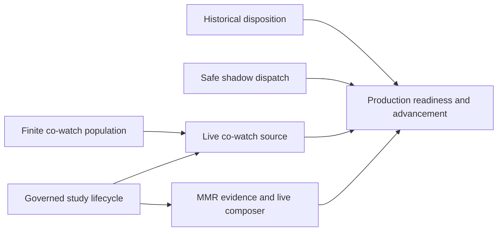

# Move implemented recommendation shadow policies toward live use

## Summary

Close the technical and evidence gaps between the existing co-watch/MMR shadow
implementations and governed live serving. Preserve ordinary profile delivery,
add a runnable controlled-study lifecycle, and advance exact policies only on
their own recorded evidence. The owner's September 29 request authorizes this
work toward live promotion and supersedes the previous batch's no-promotion
objective. It does not fabricate missing historical evidence or measured benefit.

---

## Problem frame and scope

Base: `630bd00bed2cf70f33c88835e8c33e59ad75533f`. The previous batch's
`docs/operations/recommendation-batch-acceptance-2026-09-29.md` separates deployed
code from unfinished acceptance. Source research establishes:

| Component                                                                                                                       | Actual state                                                        | Work in this plan                                                                                                  |
| ------------------------------------------------------------------------------------------------------------------------------- | ------------------------------------------------------------------- | ------------------------------------------------------------------------------------------------------------------ |
| Semantic and deterministic profile ranking                                                                                      | Already used in ordinary live delivery                              | Preserve behavior; make controlled measurement operable                                                            |
| Directional co-watch                                                                                                            | Shadow implementation; no production graph, no live adapter         | Finite population publication, safe dispatch, evidence, live adapter and exact authorization                       |
| Source/interest/theme MMR                                                                                                       | Supplemental shadow comparison; composition decision always pending | Separate terminal composition evidence and required live composer integration, activated only after its gates pass |
| Editorial/search-intent/continuation/popular/satisfaction generators; exploration, learned reranker and learned representations | Not implemented                                                     | Remain their existing roadmap work; not activation switches                                                        |

The implemented MMR policy is narrower than all of feat-393. This plan does not
claim missing editorial adapters, speaker/series inputs or other absent signals
exist. A bounded policy may use only its declared available inputs; full feat-393
acceptance remains separate. The three dormant exposure surfaces remain explicit
gaps per the owner's decision. Feat-373 is not a new prerequisite for feat-505.

No production SQL repair, forced redispatch, fabricated data, manual deployment,
storage conversion expansion or undeclared permanent-default change is included.
Normal reviewed PR-to-main deployment remains the release path. Storage capacity
and the first loaded purges remain owned by the existing storage workstream.

---

## Requirements

- R1. Distinguish implemented, deployed, observed, evaluated and live behavior in
  records and Admin. Close tickets only against their actual acceptance criteria.
- R2. Publish a complete, immutable, explicitly bounded co-watch population with
  unchanged integrity, support, pair, source and privacy limits.
- R3. Make concurrent exact retries converge and expose ambiguous dispatch
  outcomes without automatically starting a second runtime.
- R4. Provide governed profile-study creation, A/A bootstrap, mature evaluation
  publication and version-bound promotion. Legacy PASS must not impersonate
  controlled usefulness evidence.
- R5. Integrate co-watch and the implemented MMR policy through explicit live
  manifests, budgets, provenance, fallback and rollback contracts.
- R6. Freeze protocol and authority before enrollment. Require actual shadow,
  A/A and mature controlled results before each corresponding advancement.
- R7. Resolve each historical D1–D9 row by evidence or an explicit scoped owner
  decision; keep current operational readiness independent of that decision.

---

## Decisions and execution boundaries

1. Reuse the existing recommendation/experiment/promotion services and the current
   privacy model. `docs/analytics-and-recommendation-policy.md` supersedes older
   consent prerequisites; do not introduce a new consent gate. Disable, reset,
   erasure, privacy generation and data retention remain effective.
2. Co-watch event membership is start-inclusive/end-exclusive episode time;
   choose the canonical latest classifier revision at a separate evaluation
   cutoff before filtering eligibility. Outcome-write time is not membership.
   Include eligible singletons in denominators and generation identity.
3. Preserve 50,000 raw sources, 256 eligible sources per session, 250,000 attempted
   pairs, the 48-hour directional gap, query/transaction deadlines and current
   eligibility thresholds. Overflow and timeout publish nothing. Do not sample
   or progressively shrink the population until it produces a desired result.
4. Proposed first population: seven complete UTC event days ending at a frozen
   cutoff. Persist scope, as-of, algorithm identity and real publication time.
   Preflight the exact scope after release; this is not a claim it fits or is
   representative of the older 180-day population.
5. The pinned Workflow API has no caller-supplied start identity and can throw
   after accepting queue work. Persist start intent before calling it. A null
   runtime ID or thrown start is not proof that retry is safe. Distinguish
   prepared, start-attempted/uncertain, attached and terminal states.
6. Keep profile A/A calibration separate from efficacy. Reuse profile identity
   plus privacy generation and experiment-scoped digests, English human
   below-player contexts, exact 50/50 allocation and complete zero-exposure
   denominators. No operational session identity substitution. Freeze a separate
   deterministic profile-generation admission fraction before conditional arm
   assignment; the rollout ceiling cannot double as the arm probability.
7. Implement and freeze the protocol before collecting its evidence. A/A needs
   at least 200 assigned profiles per arm and two full UTC enrollment days,
   followed by each profile's 24-hour outcome window plus six hours for facts.
   A/B has at most 14 enrollment days; its target sample and meaningful delta
   must come from calibration. The old 13,082/arm and 0.006 examples are not
   approved or calibrated production values.
8. Candidate and composition approvals are distinct. Existing candidate
   acceptance cannot approve MMR. Every new manifest must bind the executed
   generator set, graph/projection identity, ranker, composer and fallback.
   Exact rollout/experiment identity must persist through browser attribution,
   mature evaluation, rollback and Admin inspection. For each advancement freeze
   explicit control, challenger and fallback tuples. Co-watch/MMR must compare
   against the actual incumbent (including profile and applicable viewing-mode
   behavior); beating semantic alone cannot authorize replacing that incumbent.
   Keep semantic A/A/profile efficacy and incumbent-matched policy trials distinct.
9. Build all independent prerequisites while owner decisions or real outcome
   windows remain pending. Do not describe incomplete real-time evaluation as
   completed work or weaken the rule to accelerate promotion.
10. Use a new `frozen-source-controlled-trial-v1` contract for sustained co-watch
    treatment. Bind exact generation, source window/as-of, manifest, protocol
    and `trialValidUntil = enrollmentEnd + 30 hours`. Ordinary shadow inspection
    retains its 24-hour publication freshness; only exact approved trial authority
    permits the distinct serving lifetime. Complete calibration before publishing
    the trial graph and obtain its shadow evidence within ordinary freshness.
    Admission must prove every retained source dependency and generation actually
    expires after the trial deadline; never extend retention or infer remaining
    lifetime from event dates. Existing assignments serve only for their original
    follow-up. Any invalidated source stops enrollment and produces a recorded
    interrupted/unhealthy decision; fallback does not count as continued treatment.
11. Profile-backed trial support requires a reviewed durable lineage version,
    because the current discovery link expires within 24 hours. Capture the valid
    link's viewer privacy generation on source lineage, validate current profile
    generation/state and outcome/eligibility/suppression thereafter, and seed
    erasure/reset suppression from retained source rows before deletion even
    after link cleanup. Temporary discovery-link expiry is not privacy revocation
    under this new version; legacy generations retain their existing validation.
    No unchanged-input republish or rolling graph may renew trial authority.

---

## Implementation units

The diagram shows execution dependencies, not permission to skip evidence.

### U1. Historical disposition and truthful readiness

**Goal:** Close only accepted/resolved historical rows and maintain a current
promotion inventory. **Requirements:** R1, R7. **Dependencies:** None. On September
29, nisal accepted all D1–D9 with the caveat of future fixes; record that answer.

**Files:** `docs/operations/recommendation-evidence-closeout-decisions-2026-09-29.md`,
`docs/roadmap/content-discovery/feat-545-recommendation-monitoring-and-telemetry-closeout.md`,
`docs/roadmap/content-discovery/feat-565-implemented-shadow-recommendation-promotion.md`,
`docs/roadmap/content-discovery/feat-566-recommendation-evidence-gap-remediation.md`,
and shared roadmap indexes/dependencies.

**Approach:** Record each accepted row, owner, date, exact population, residual
risk and affected gate. Keep fresh ingestion health, storage, study and promotion
evidence separate. Track future reconciliation and terminal-proof remediation
in feat-566, including honest disposition of irrecoverable historical joins.
Close feat-545 by accepted historical limitations; do not claim the gaps fixed.
Preserve deferred Datadog setup and dormant exposure scope.
**Patterns:** Existing D1–D9 record and previous acceptance report.
**Test expectation:** No runtime tests for documentation; validate roadmap
dependencies, formatting, links and evidence arithmetic.
**Verification:** No inferred acceptance and no false feature completion.

### U2. Explicit finite co-watch source generations

**Goal:** Make a bounded production population selectable and inspectable.
**Requirements:** R2. **Dependencies:** None for local work; fresh storage
clearance before production execution.

**Files:** `apps/admin/src/services/recommendations/cowatch/graph.ts`,
`apps/admin/src/services/recommendations/cowatch/projection.service.ts`,
`apps/admin/src/services/recommendations/cowatch/inspection.service.ts`,
`apps/admin/src/services/recommendations/cowatch/privacy.ts`,
`apps/admin/src/scripts/rebuild-recommendation-cowatch-shadow.ts`;
`apps/admin/prisma/schema.prisma`; migration
`apps/admin/prisma/migrations/0106_recommendation_cowatch_source_window/migration.sql`;
Admin co-watch inspector; tests `apps/admin/src/services/recommendations/cowatch/graph.test.ts`,
`apps/admin/src/services/recommendations/cowatch/projection.db.test.ts`, operator/inspection tests and migration fixtures.

**Approach:** Version and validate source window/as-of, preserve an explicit
legacy scope for existing generations, hash population contract into identity,
and display full scope. Pin graph identity for evaluation; never silently use a
different newest generation within one claimed comparison. The production
preflight must report raw, eligible, pair/output and publication estimates
separately. Retain fixed bounds and no partial publication.
**Execution note:** Characterize existing clocks/denominators before changing
selection, then add failing native database boundary/revision fixtures.
**Patterns:** Existing graph source lineage, privacy fences and immutable publish.
**Test scenarios:** Inclusive/exclusive event boundaries; delayed outcomes and
new negative revisions; same rows under different scopes; in-window singleton
denominator changes; profile erasure and rebuild equality; overflow/timeout
leaving no publication; stale/pinned-generation refusal; real publication time
distinct from cutoff; bounded output/heap/WAL/index sizing on owned fixtures.
**Verification:** Complete scoped lineage and exact rebuild equality, explicit
Admin scope, backward-compatible legacy inspection and measured workload bounds.

### U3. Atomic shadow dispatch and honest recovery

**Goal:** Close feat-563 without claiming exactly-once runtime start.
**Requirements:** R3. **Dependencies:** None; existing Workflow API contract is
verified from installed version 4.2.2.

**Files:** `apps/admin/src/services/recommendations/shadow-evaluation/operator.ts`,
`apps/admin/src/services/recommendations/shadow-evaluation/job.ts`, `apps/admin/src/workflows/recommendationShadowEvaluation.ts`,
operator/job unit suites and a new native dispatch DB suite;
`docs/roadmap/content-discovery/feat-563-shadow-evaluation-dispatch-recovery.md`.

**Approach:** Atomically reserve one exact dispatch identity and immutable tuple.
Allow a prepared attempt to acquire start ownership once. Persist uncertainty
before the external start call; reconcile self-attachment and supported World
read results under that identity. A conflicting runtime must not execute or
overwrite another runtime's receipt. Unknown acceptance is an explicit outcome,
not FAILED-as-safe-retry. Reuse the workflow ledger where constraints permit;
coordinate any required additive migration with the parent before editing it.
**Execution note:** Reproduce concurrent admission and accepted-but-error first.
**Patterns:** Existing durable workflow ledger and expected-generation fencing.
**Test scenarios:** Two concurrent identical calls; conflicting tuples; crash
before start; queue accepted then start throws; crash before attachment;
self-attachment; conflicting runtime; complete/failed runtime; stale privacy or
evaluation generation; expired source; bounded reconciliation and truthful retry.
**Verification:** One durable dispatch identity; no blind duplicate start or
false already-running claim; explicit terminal/uncertain operator receipts.

### U4. Governed profile study and authoritative evaluation

**Goal:** Make feat-505's existing measurement contract operational.
**Requirements:** R4, R6. **Dependencies:** None for local implementation; U1 and
fresh readiness before production enrollment.

**Files:** `apps/admin/src/services/recommendations/experiment/assignment.ts`,
`apps/admin/src/services/recommendations/experiment/evaluation.ts`, `apps/admin/src/services/recommendations/experiment/usefulness-offline.ts`, `apps/admin/src/services/recommendations/experiment/usefulness-extractor.ts`, new study operator/service modules and colocated tests;
`apps/admin/src/services/recommendations/promotion/service.ts`, `apps/admin/src/services/recommendations/promotion/policy.ts`, `apps/admin/src/services/recommendations/promotion/workflow.ts`,
`apps/admin/src/app/api/recommendations/promotion/route.ts` or a similarly guarded
study route; `apps/admin/src/services/recommendations/admin-ops/overview-profile-promotion.ts`;
`apps/admin/src/app/dashboard/recommendations/PromotionControls.tsx`;
`apps/admin/src/app/dashboard/recommendations/recommendation-evaluation-sections.tsx`;
`apps/admin/prisma/schema.prisma` and parent-allocated additive
protocol migration if needed. Tests include `apps/admin/src/services/recommendations/experiment/usefulness.db.test.ts`,
`apps/admin/src/services/recommendations/experiment/usefulness-routing.test.ts`, `apps/admin/src/services/recommendations/experiment/usefulness-offline.test.ts`, `apps/admin/src/services/recommendations/experiment/evaluation.test.ts`,
`apps/admin/src/services/recommendations/promotion/service.db.test.ts`, `apps/admin/src/services/recommendations/promotion/policy.test.ts`, `apps/admin/src/services/recommendations/promotion/job.test.ts`, route tests,
`apps/admin/src/services/recommendations/delivery.service.test.ts` and `apps/admin/src/services/recommendations/delivery.service.persistence.test.ts`.

**Approach:** Freeze an immutable protocol/configuration digest through an
authorized service. Prepare and activate exact versioned profile A/A without a
fake prior PASS; refusal/rollback remain available. Preserve the exact identity,
50/50, date/expiry, overlap and follow-up contracts. Add a digest-bound outer
enrollment fraction with deterministic profile-generation admission, followed
by exact 50/50 arm allocation for admitted profiles. The approved total
challenger ceiling bounds the product of admission and arm allocation. Existing
assignments retain full follow-up after enrollment closes; changes cannot
silently admit a new cohort or rebalance existing assignments. Route evaluation by stored
policy; legacy evaluator refuses profile-usefulness policies. Publish v2 mature
results with matching manifests, complete denominator, external evidence and
immutable supersession. Calibration PASS cannot authorize efficacy or permanent
default. Promotion must require the exact applicable usefulness conclusion,
not an unrelated DB PASS or client-supplied guardrail booleans. Bind authority
to experiment generation, protocol digest, exact manifests, evaluation revision,
evidence cutoff and validity horizon. Revalidate unsuperseded/unrevoked authority
at run creation and transactionally at execution. A newer failed/unhealthy
evaluation, privacy invalidation, expiry or changed generation fences queued
advancement; emergency rollback remains independent.

Expose a supported authenticated sequence: prepare protocol, return immutable
review record, activate exact revision, inspect status and publish reviewed
evaluation evidence. Extend the existing Admin read model and controls with
calibration/efficacy, exact comparator and policy, admission and arm allocation,
dates, missing evidence, follow-up maturity and permitted next action. Retain
the existing layout. Operator mutations distinguish rejected, pending, effective
and acknowledgement-unknown states. A lost response must reconcile the exact
operation against the ledger before another transition; it cannot claim serving
is unchanged. Keep status refresh and emergency stop visible.
**Patterns:** Existing profile-unit routing, read-only extractor, evaluation
ledger and authenticated promotion service; same-origin/recent-auth controls.
**Test scenarios:** Invalid protocol/date/allocation/identity; concurrent prepare
and overlap; stale or unauthorized activation; first bounded A/A; both arms;
zero-exposure and fenced assignments; late last-day outcomes; sound/manual
deduplication; changed latest revisions; unknown/missing external evidence;
legacy/mismatched-policy evaluation rejection; same-input replay and supersession;
rollback fencing assignments/slates; queued PASS superseded by FAIL; expired or
privacy-invalidated authority; distinct admission vs arm probabilities; incumbent
mismatch; committed activation with lost response; complete operator journey;
end-to-end service→DB→evaluation→authority.
**Verification:** A complete supported lifecycle with no production SQL fixture
steps, version-bound publication and no path from calibration/legacy evidence
to permanent usefulness authority.

### U5. Explicit live co-watch challenger

**Goal:** Enable a separately identified co-watch source under governed traffic.
**Requirements:** R1, R5, R6. **Dependencies:** U2 and U4; actual qualifying shadow
evidence and authority before any controlled live use.

**Files:** `apps/admin/src/services/recommendations/cowatch/candidate.service.ts`,
new live co-watch adapter and tests; `apps/admin/src/services/recommendations/delivery.factory.ts`, `apps/admin/src/services/recommendations/delivery.types.ts`,
`apps/admin/src/services/recommendations/delivery.service.ts`, `apps/admin/src/services/recommendations/orchestration.ts`, `apps/admin/src/services/recommendations/promotion/manifest.ts`,
`apps/admin/src/services/recommendations/experiment/assignment.ts`; candidate-platform, manifest, assignment and delivery
unit/native persistence tests; shadow decision/service suites.

**Approach:** Share graph/anchor scoring without reusing historical live-slate
context as a live source. Bound reads by the existing total delivery deadline.
Hydrate publication/locale/playability currently; pin validated generation and
record exact source provenance. Declare a new manifest and generator-set version;
do not mutate the meaning of semantic-profile-hybrid-v1. Stale, missing, erased,
sparse or timed-out graphs use a named deterministic fallback. Separate shadow
readiness from usefulness; replace the current permanent co-watch inconclusive
guard only with an exact controlled-exposure admission rule backed by U4.
**Patterns:** Existing profile candidate adapter, ranker union, publication
fences, compact trace persistence and ordinary delivery fallback.
**Test scenarios:** No authority gives unchanged ordinary delivery; exact
challenger execution; changed generation/manifest rejects stale authority;
stale/erased/sparse/slow graph; current content eligibility; duplicate-source
provenance; deadline/trace amplification; rollback of stored slates/assignments;
actual browser attribution and comparative loading after normal deployment; ordinary
24-hour freshness versus exact trial authority; deadline equality and insufficient
actual dependency expiry; profile reset/deletion after session-link cleanup;
current privacy-generation mismatch; singleton/negative-revision invalidation;
interrupted enrollment retaining the original denominator; exact rebuild without
source resurrection; refusal to substitute a newer generation.
**Verification:** Live runtime identity matches approval and persisted evidence;
bounded controlled exposure is observable, reversible and distinct from default.

### U6. Separate MMR decision and live composition

**Goal:** Make the implemented composition policy independently evaluable and
selectable. **Requirements:** R1, R5, R6. **Dependencies:** U4; U5 only for a
co-watch+MMR manifest, not for an independent composition comparison.

**Files:** `apps/admin/src/services/recommendations/shadow-evaluation/slate-composer.ts`,
`apps/admin/src/services/recommendations/shadow-evaluation/projection.ts`, `apps/admin/src/services/recommendations/shadow-evaluation/service.ts`, `apps/admin/src/services/recommendations/slate.ts`,
`apps/admin/src/services/recommendations/promotion/manifest.ts`, versioned composition evaluation/service modules and
tests; existing `apps/admin/src/services/recommendations/shadow-evaluation/slate-composer.test.ts`, candidate-platform, shadow DB,
promotion manifest and delivery persistence tests; authorized Admin inspector.

**Approach:** Define a terminal composition decision for exact inputs/weights,
including missing-context disposition. Preserve eligibility, pins/fixed order,
approved pools and deterministic sparse/error fallback. Reuse the bounded
64-candidate/six-position implementation through a neutral composer contract.
Bind composer identity to runtime, manifest, evidence and approval. Calibrate
against actual shadow data before exposing a policy; candidate approval alone
never approves composition. A study that combines changes measures the bundle,
not an isolated generator effect, and requires its own frozen hypothesis.
**Patterns:** Existing scalar explanation/provenance and separate candidate vs
composition records. **Test scenarios:** Terminal decisions for missing inputs,
sparse and valid comparisons; weights/version mismatch; near duplicates;
recent-history gaps; fixed/pinned ordering; invalid locale/current item;
deterministic fallback; exact live selection and rollback; DB provenance and
Admin explanations; local latency and production browser comparison.
**Verification:** An operator can explain each moved/removed position and inspect
an exact composition decision; no broader feat-393 completion is inferred.

### U7. Bounded production evidence, controlled exposure and closeout

**Goal:** Advance every prepared component as far as its actual evidence allows.
**Requirements:** R1–R7. **Dependencies:** Applicable implementation units, owner
decisions, exact scope approval, storage clearance and naturally mature data.

**Files:** New operation/validation records for this batch, feature tickets and
roadmap indexes; existing Admin operator surfaces. **Approach:** Verify exact
deployed commits/migrations, fresh shared health and current control/approval
inventory. Give the storage owner immutable windows, caps, output/index/WAL/temp
byte bounds, concurrency one, deadlines, retry states, traffic ceiling, duration
and stop control. Require fresh reserve/stop assessment; no future purge credit.
The initial co-watch evaluation proposal is 500 requested/200 minimum runs with
one exact UUID and a closed request window, independent of graph event scope.

Freeze the production A/A proposal before activation, then obtain real profiles,
complete follow-up and external health/latency/coverage evidence. Use the existing
thresholds: missing active coverage ≤5% per arm; coverage/attribution differences
≤2 points; timeout/error increase ≤1 point; card-return reduction ≤2 points;
p95 increase ≤200 ms within service budget; fatal playback increase ≤1 point.
Calibrate A/B enrollment and meaningful delta from observed rate/variance before
freezing its protocol. No repeated efficacy peeking or guessed sample target.
Advance exact candidates/composers only after their own prerequisites pass.
Permanent default uses the supported recent-auth Admin confirmation and immutable
ledger; shared kill switch, fallback and rollback remain operable throughout.

**Test expectation:** Use reviewed operators and bounded natural observations;
no production fault injection. Reuse local rollback/crash tests from U2–U6.
**Verification:** Retain honest pass/inconclusive/data-unhealthy/refusal decisions,
current Admin reconciliation, healthy releases and rollback evidence. If real
time, sample supply or owner input blocks advancement, finish all independent
code/review/release work and state the exact remaining dependency.

---

## System impact and release control

Admin owns persistence, graph generation, authorization, study assignment and
evaluation; Watch continues its existing attributed browser/player path. New
sources must fit the same delivery deadline and compact trace format. Every new
record declares purpose, identity, retention, access, erasure, health and fallback.
Unknown data stays unknown. Parent owns migration numbers, schema integration,
generated contracts and shared roadmap indexes. Migration 0106 is reserved for
the source-window contract; 0107 is reserved for the immutable study protocol
and evaluation authority if schema changes are needed. Allocate a separate
durable-lineage migration for U5 only after its concrete model is reviewed.
Regenerate both GraphQL artifacts if the Pothos surface changes.

Each focused implementation receives native DB tests where state changes,
appropriate app validation, standard/conditional code review, normal hooks and
exact-head green CI before normal squash merge. Inspect ordinary deployments.
Shared checkout and other worktrees remain untouched.

---

## Open decisions and implementation-time checks

- D1–D9 are explicitly accepted with future remediation tracked in feat-566.
  This closes only the historical disposition and supplies no fresh evidence.
- U5 must implement and independently review the frozen trial and durable privacy
  lineage contracts in decisions 10–11 before any sustained co-watch enrollment.
  Verify actual dependency lifetimes, reset/delete after link cleanup and no
  source resurrection; ordinary graph freshness remains unchanged.
- Exact production A/A record (cutoffs, bounded outer traffic ceiling, guardrail
  evidence source and freshness) must be concrete before activation. Reuse the
  existing protocol where defined; never turn illustrative values into facts.
- Whether the first co-watch source population fits existing bounds is unknown.
  One fixed reviewed preflight can refuse; a refusal requires a separately
  reviewed workload/algorithm change, not silent scope search.
- Production sample supply and A/B effect calibration are unknown. Real time and
  real outcomes cannot be replaced with fixtures.
- MMR input availability and useful weights require recorded calibration. Missing
  editorial/series/speaker signals are not claimed as implemented or satisfied.
- The installed Workflow runtime cannot prove an unacknowledged start did not
  occur. Uncertain state may require reconciliation or operator investigation;
  the application must remain safe without guessing.

---

## Sources and durable patterns

- `docs/operations/recommendation-batch-acceptance-2026-09-29.md`
- `docs/operations/recommendation-usefulness-evaluation-2026-09-15.md`
- `docs/operations/recommendation-evidence-closeout-decisions-2026-09-29.md`
- `docs/analytics-and-recommendation-policy.md`
- `docs/solutions/architecture-patterns/profile-comparison-followup-and-muted-outcomes-20260916.md`
- `docs/solutions/architecture-patterns/bind-eval-manifest-identity-to-execution-and-evidence.md`
- `docs/solutions/logic-errors/cowatch-generation-denominator-lineage-20260928.md`
- `docs/solutions/best-practices/recommendation-trace-capacity-and-retention-proof-20260928.md`
- `docs/solutions/logic-errors/recommendation-outcome-accounting-boundaries-20260921.md`
