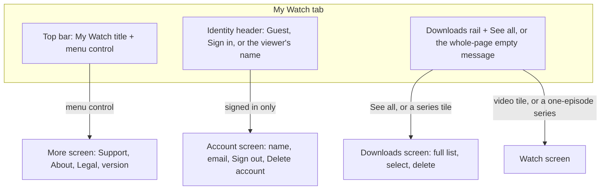
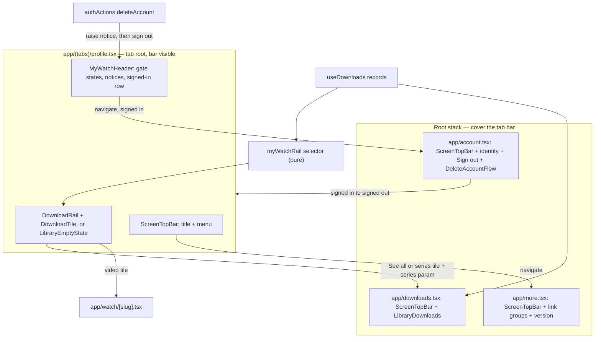
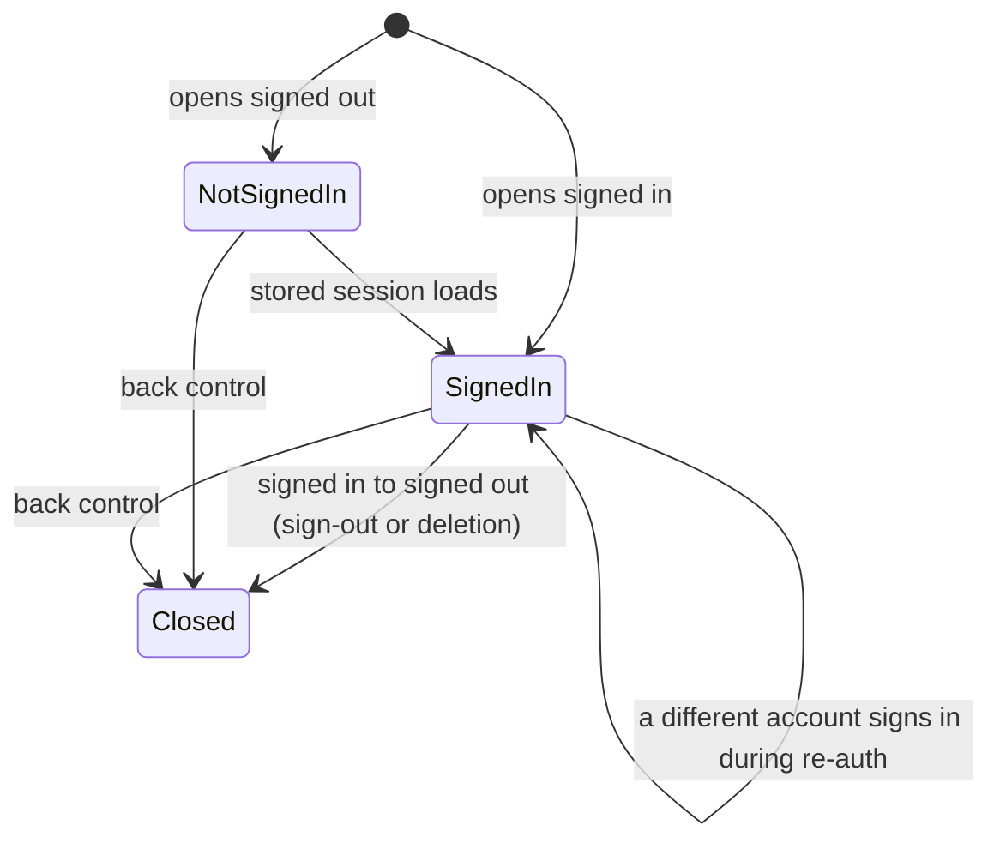

# Mobile My Watch Tab Layout - Plan

## Goal Capsule

- **Objective:** A viewer who opens the My Watch tab sees their downloads first. They reach every account action and every app-information link through one clear, predictable place, not one long mixed scroll.
- **Means:** A Netflix-style content page with an identity header and a Downloads rail, plus three screens that open over the tab: Downloads, More, and Account (KD2, KTD1).
- **Product authority:** The Product Contract below. The mobile owner settled the layout, the account placement, the empty state, and the row set on 2026-09-29 after comparing sketches, and approved the plan-time call-outs on the same day.
- **Execution profile:** `apps/mobile` only, one PR on branch `feat/mobile-my-watch-tab`. The branch already carries the uncommitted tab rename ("Profile" to "My Watch").
- **Stop conditions:** Stop and ask the owner when a guard test or a simulator check shows that a root-stack screen cannot meet a requirement, or when the fingerprint check shows a change other than the one KTD6 expects.
- **Who finishes:** `ce-work` builds and verifies the units. The owner reviews, merges, and schedules the native build that KTD6 needs.
- **Open blockers:** None.

---

## Product Contract

Product Contract preservation: changed R1, R6, and R7, and added R20 and R21, from the owner-approved plan-time call-outs of 2026-09-29 (KD8, KD9). The Outstanding Questions resolved into KTD1 to KTD5 and were removed. Every other R, F, and AE is unchanged.

### Summary

The My Watch tab becomes a content page: a top bar with a menu control, an identity header, and a Downloads rail with "See all". The menu control opens a "More" screen that holds the Support, About, and Legal rows and the app version and build number. A signed-in viewer taps the header to open an Account screen with Sign out and Delete account. Downloads, More, and Account are root-stack screens that cover the tab bar, like the Bible reader.

### Problem Frame

The tab is one scroll that mixes three unrelated things. At the top is an account card. Below it is the full downloads list, with a pinned Select row. At the bottom is a single Privacy Policy button. The account card, the list controls, and the lone button have no common structure, so the screen reads as a mix of parts rather than one place.

Two facts make the problem larger. First, the sign-in gate (feat-543) is closed in production, so every production viewer is signed out and sees a disabled "Sign in (Coming soon)" card. For them, the tab is mainly a way back to their downloads. Second, about ten information entries now need a home on this tab: Give, Contact Us, About Jesus Film, Newsletter, four social links, Privacy Policy, Terms of Use, and Legal Statement. The app version and build number also need a home. Most of these links already exist in a component that no screen renders. If they are added to today's scroll, they sink under the downloads list, and they go further down as the list grows.

### Key Decisions

- KD1. **Content first, with sign-in visible as "coming soon".** (session-settled: user-directed — chosen over a settings-first hub and a sign-in hero: viewers open this tab to get back to their downloads.) Governs R1, R2.
- KD2. **A Netflix-style content page with a separate More screen.** (session-settled: user-directed — chosen over one scroll of grouped sections, a single Disney+-style menu list, and today's list with a grouped footer: the page stays about the viewer and their content.) Governs R1, R10, R16.
- KD3. **Every information group ships now.** (session-settled: user-directed — chosen over reserving places for later: Give, About, Contact, Newsletter, socials, Terms of Use, and Legal Statement all ship with Privacy Policy.) Governs R11, R12, R13, R14.
- KD4. **The signed-in header opens an Account screen.** (session-settled: user-directed — chosen over an Account group at the top of More and a Sign out button on the page: account actions get their own place, and More holds only app information.) Governs R4, R17, R18.
- KD5. **One whole-page message when there are no downloads.** (session-settled: user-directed — chosen over a prompt inside the Downloads section and empty "ghost" tiles; the copy is the owner's.) Governs R9.
- KD6. **The rail previews downloads; the Downloads screen manages them.** (session-settled: user-approved — chosen over keeping select and delete on the page: the page stays short, and management costs one more tap.) Governs R5, R6, R7, R8.
- KD7. **No placeholders for features that do not exist yet.** Playlists and a continue-watching rail get their own rails when those features ship. An empty "later" slot would read as a broken feature.
- KD8. **A tile tap behaves like a list-row tap.** (session-settled: user-approved — chosen over a tile tap that retries or resumes a download in place: recovery stays on the Downloads screen, per KD6.) Governs R6, R7, R21.
- KD9. **Account exits keep today's weight.** (session-settled: user-approved — chosen over a sign-out confirmation and a silent deletion: a deletion now closes the screen where it happened, so the viewer needs a short result; sign-out stays one tap, as today.) Governs R20.
- KD10. **The version line shows the version and the build number only.** (session-settled: user-approved — chosen over also showing the installed over-the-air update id: the owner asked for version and build.) Governs R15.

### Screen map

The diagram shows the regions of the My Watch page and where each one leads. The requirements below state the full behavior.

### Requirements

**The My Watch page**

- R1. The page shows, from top to bottom: a top bar with the title "My Watch" and a menu control, the identity header with any notice from R3, R4, or R20 under it, and the Downloads area (R5 or R9). No information rows, legal links, or version text appear on the page itself.
- R2. When the sign-in gate is closed and the viewer is signed out, the header shows a generic avatar, "Guest", a disabled "Sign in · coming soon" indicator, and "Accounts are not available yet". A tap on the header does nothing.
- R3. When the sign-in gate is open and the viewer is signed out, the header shows "Guest" and a Sign in button that starts the hosted sign-in, with the line "Keep your place across devices". After a failed sign-in, today's dismissible sign-in error notice shows under the header.
- R4. When the viewer is signed in, the header shows the viewer's name, or the email when there is no name, and a chevron. A tap on the header opens the Account screen (R17). Right after a sign-in that created a new account, today's dismissible new-account notice shows under the header.

**Downloads**

- R5. When the viewer has at least one download, the page shows a "Downloads" heading with a "See all" control and a horizontal rail of download tiles, with the most recent first.
- R6. A tap on a video tile opens that video on the watch screen, which plays the downloaded copy when one is on disk, the same as a list-row tap today. A tap on a series tile opens the Downloads screen at that series.
- R7. Each tile shows the same download state that today's list rows show: queued, downloading, paused, failed, or downloaded. The rail offers no Retry or Resume control.
- R8. "See all" opens the Downloads screen. That screen keeps today's full list, series grouping, selection mode, and deletion. Selection and deletion exist only on the Downloads screen.
- R9. When the viewer has no downloads, a whole-page message replaces the Downloads area. The title is "No Downloads Yet", the body is "Download a video to watch it offline", and a "Browse videos" button opens the Home tab. The page shows neither the rail nor this message until the download records have loaded.
- R21. A series with only one downloaded episode shows on the rail as a video tile for that episode.

**The More screen**

- R10. The menu control on the page opens the More screen, which has a back control that returns to My Watch.
- R11. The More screen has a Support group with Give and Contact Us.
- R12. The More screen has an About group with About Jesus Film, Newsletter, and the four social links (X, Facebook, Instagram, YouTube).
- R13. The More screen has a Legal group with Privacy Policy, Terms of Use, and Legal Statement. Privacy Policy stays reachable in the app at all times (App Store guideline 5.1.1(i)).
- R14. Each row opens its jesusfilm.org page. The addresses are the ones that `apps/mobile/src/components/profile/ProfileLinksSection.tsx` holds today. Terms of Use opens `https://www.jesusfilm.org/terms-of-use/`.
- R15. The bottom of the More screen shows the app version and the native build number, for example "Version 1.0.0 (7)".
- R16. The More screen shows the same content whether the viewer is signed in or signed out, and whether the sign-in gate is open or closed.

**The Account screen**

- R17. The Account screen exists only for a signed-in viewer. It shows the viewer's name and email, a Sign out control, and today's Delete account flow (App Store guideline 5.1.1(v)).
- R18. When sign-out completes, the viewer returns to the My Watch page, and the header shows the signed-out state (R2 or R3).
- R19. Every place that shows the account email masks it in session replay, as the account card does today.
- R20. After an account deletion completes, the My Watch page shows a dismissible "Your account was deleted" notice under the header.

### Key Flows

- F1. Return to a download
  - **Trigger:** A viewer with downloads opens the My Watch tab.
  - **Steps:** The viewer sees the rail under the header, taps a video tile, and the video plays from the downloaded copy.
  - **Covered by:** R5, R6, R7
- F2. Manage downloads
  - **Trigger:** A viewer wants to delete downloads.
  - **Steps:** The viewer taps "See all", enters selection mode on the Downloads screen, selects items, and deletes them.
  - **Covered by:** R8
- F3. Reach app information
  - **Trigger:** A viewer looks for the privacy policy, a way to give, or the app version.
  - **Steps:** The viewer taps the menu control, finds the row in its group on the More screen, and taps it. The version shows at the bottom.
  - **Covered by:** R10, R11, R12, R13, R14, R15
- F4. Manage the account
  - **Trigger:** A signed-in viewer wants to sign out or delete the account.
  - **Steps:** The viewer taps the header, then uses Sign out or Delete account on the Account screen.
  - **Covered by:** R4, R17, R18, R20

### Acceptance Examples

- AE1. **Covers R2, R9.** Given the sign-in gate is closed and the viewer has no downloads, when the viewer opens My Watch, then the page shows the Guest header with the disabled "Sign in · coming soon" indicator and the "No Downloads Yet" message with a "Browse videos" button, and nothing else below the header.
- AE2. **Covers R5, R7.** Given the viewer has three finished downloads and one download in progress, when the viewer opens My Watch, then the rail shows four tiles with the most recent first, and the in-progress tile shows its progress.
- AE3. **Covers R6.** Given the viewer downloaded two episodes of one series, when the viewer taps that series tile, then the Downloads screen opens at that series.
- AE4. **Covers R4, R17, R18.** Given a signed-in viewer, when the viewer taps the header, taps Sign out, and sign-out completes, then My Watch shows the signed-out header.
- AE5. **Covers R2.** Given the sign-in gate is closed and the viewer is signed out, when the viewer taps the header, then nothing opens.
- AE6. **Covers R13, R15, R16.** Given any viewer in any sign-in state, when the viewer opens More, then Privacy Policy is in the Legal group and the version and build number show at the bottom.
- AE7. **Covers R21.** Given the viewer downloaded one episode of a series, when the viewer taps its tile, then the watch screen opens that episode.
- AE8. **Covers R17, R20.** Given a signed-in viewer on the Account screen, when the account deletion completes, then the screen closes and My Watch shows "Your account was deleted" under the Guest header.

### Scope Boundaries

- Playlists and a continue-watching rail are deferred (KD7). Continue watching also needs sign-in today, because watch progress is recorded only for signed-in viewers.
- The "Send feedback" row is not built here. It joins the Support group on the More screen when the in-app feedback work ships.
- New strings stay in English. Localization of the app's interface is separate work.
- The web and TV apps are not changed.
- The sign-in gate's own behavior (feat-543) does not change. This work only changes where its states appear.
- The version line does not show the installed over-the-air update id (KD10).

#### Deferred to Follow-Up Work

- Remove `apps/mobile/src/lib/tabBarVisibility.ts` and the `hidden` wiring in `apps/mobile/app/(tabs)/_layout.ios.tsx` if no second caller appears. KTD3 removes the store's only caller.
- Make the Downloads screen list series and videos in the rail's merged order, if the owner wants the two orders to match. Today's list order stays (R8).

### Dependencies / Assumptions

- The in-app feedback plan on branch `feat/mobile-feedback-linear` (`docs/plans/2026-09-14-1033-feat-mobile-feedback-linear-plan.md`, R1) puts "Send feedback" in "the existing link group" on this tab. That group moves to the More screen, so that plan's R1 must point at the Support group on More. The branch also edits `ProfileLinksSection.tsx`, which this plan deletes, so whichever PR lands second rebases onto the other.
- The tab's route name stays `profile`. Links and code that open `/(tabs)/profile` keep working, and the tab label already reads "My Watch".
- The build number comes from the installed native binary at run time. `app.json` holds only the version, because EAS assigns iOS build numbers remotely.

### Sources

- `apps/mobile/app/(tabs)/profile.tsx`: today's composition (account card as the list header, "My Downloads" as the title, Privacy Policy as the footer).
- `apps/mobile/src/components/profile/ProfileLinksSection.tsx`: the dormant link set and its grouped-row styles. Its "mirror the web footer" comment is stale; the web footer no longer carries socials or a newsletter.
- `apps/mobile/src/components/profile/PrivacyPolicyButton.tsx`: the app's only in-app privacy policy link.
- `apps/mobile/src/components/profile/AccountSection.tsx` and `apps/mobile/src/components/profile/DeleteAccountFlow.tsx`: every header state's copy, sign-out, account deletion, and the session-replay mask on the email.
- `apps/mobile/src/components/library/LibraryDownloads.tsx`: the full list, selection mode, tab-bar hiding, and the empty state.
- `apps/mobile/src/lib/terms-of-use.ts`: names `https://www.jesusfilm.org/terms-of-use/` as the canonical Terms of Use.
- `docs/plans/2026-09-23-1104-feat-mobile-sign-in-gate-plan.md`: the gated card's copy and why the card stays visible.
- `apps/mobile/CLAUDE.md`, section "Tab bar": the downloads list's pinned Select row and the tab-bar hide rules.

---

## Planning Contract

### Key Technical Decisions

- KTD1. **Downloads, More, and Account are root-stack routes that cover the tab bar.** (session-settled: user-approved — chosen over a nested stack inside the `profile` tab with the bar visible: no tab in this app hosts a nested stack, nobody has measured the safe-area inset on a screen pushed inside `NativeTabs`, and the Android bar hide would have to target the parent navigator.) The routes are `app/downloads.tsx`, `app/more.tsx`, and `app/account.tsx`, registered in `app/_layout.tsx` with `headerShown: false`, like `reader` and `mission`. The names do not reuse a tab name, per the feat-553 KTD9 collision rule. Governs R8, R10, R17. A Bake-off did not run: the precedent and the unmeasured inset settled the choice without more development.
- KTD2. **Each pushed screen has a fixed in-content top bar with a back control and a title.** One shared `ScreenTopBar` component serves the page (title plus menu control) and the three screens (back control plus title). A floating back button, as `mission` uses, would cover the Downloads screen's pinned Select row. The back control calls `router.back()` when it can and otherwise navigates to `/(tabs)/profile`, as `FloatingBackButton` does. No native Stack header is used, so `PlaybackHost`'s `HEADER_ROUTE_PATTERNS` needs no new entries.
- KTD3. **The Downloads screen hosts `LibraryDownloads` with no tab-bar logic.** A root route has no tab bar under it, so the `setTabBarHidden` calls and the Android `tabBarStyle` write come out of `LibraryDownloads`. Its selection pad and the `SelectionActionBar` clamp must work from a root-screen inset (34 pt on an iPhone with a home indicator), not a tab-screen inset (83 pt). The host skips the list's own `insets.top`, because the top bar already pads it. On the root host, the list pads its scroll content with `insets.bottom`, its gap, and the mini-player clearance on both platforms, not with `useTabBarClearance()`, which returns 0 on Android and would leave the last rows under the system navigation bar. The host does not pad its own container, because `SelectionActionBar` and the snackbar each add `insets.bottom` themselves. `app/__tests__/tabBarSingleSource.guard.test.js` pins `LibraryDownloads.tsx` to `useTabBarStyle`, which this removes; re-pin that row to `TAB_BAR_HEIGHT_IOS`, which the selection pad still reads. See `docs/solutions/best-practices/platform-value-meaning-change-breaks-independent-readers.md`.
- KTD4. **The rail shows at most 10 tiles, in one merged order.** A pure selector merges series groups (by their newest episode) and single videos by `enqueuedAt`, newest first. Records with no `enqueuedAt` sort last, with a slug tie-break. A one-episode group becomes a video tile (R21). Ten covers the common case, and the full list lives on the Downloads screen (KD6).
- KTD5. **A series tile opens the Downloads screen with a `series` route parameter.** The Downloads screen expands that series card and scrolls it into view once, the way `app/mission.tsx` handles `?section=`. The expand and the scroll are instant, with no layout animation, so Reduce Motion needs no special case. `SeriesGroupCard` gains an initial-expanded input.
- KTD6. **The version and build number come from `expo-application`.** `expo-constants` 57 has no native version reads, and it has no build number at all on Android. `expo-application` 57.0.3 is already autolinked through `expo-notifications`, but app code can import it only after it is added to `apps/mobile/package.json`. The dependency change may move the fingerprint runtime version. The production over-the-air channel is already dark until the next native build (see `apps/mobile/CLAUDE.md`, "Cold-start splash"), so this change rides that build. Run `npx eas-cli fingerprint:generate` before and after, and record the result in the PR.
- KTD7. **Every More row opens in the system browser.** Rows use `openExternalUrl` (`Linking.openURL`), never `expo-web-browser`. App Store guideline 3.2.2(iv) lets an app take donations only outside the app, so Give must leave the app.
- KTD8. **The account-deleted notice is set where the deletion completes.** In `deleteAccount()` (`src/lib/authActions.ts`), the success path raises the notice before `store.signOut()`. The timeout path raises it as soon as the session probe returns no session, because that probe has already committed the signed-out state. The sign-out closes the Account screen at once, so a notice raised from the screen could lose that race. The notice store mirrors `src/lib/newAccountNotice.ts`: in memory only, dismissible, and cleared on the next sign-in.
- KTD9. **The Account screen closes only on a signed-in-to-signed-out change.** The session starts signed out until the stored session loads, and it has no loading state. So the screen tracks the previous status and closes only on that change. When it opens signed out (a cold deep link), it shows "You are not signed in" under its top bar, and it fills in if a stored session then loads.
- KTD10. **The header is one new component, and the path-keyed guards move with it.** `MyWatchHeader.tsx` takes the signed-out branches, the three notices, and the signed-in row from `AccountSection.tsx`, which is deleted. The signed-in row carries a fixed `dd-action-name` and an accessibility label with no name or email, because Datadog RUM names tap actions from the label. `accountPiiReplayMask.test.ts` and `signInGateWiring.guard.test.js` name files by path, so both must name the new files. The replay-mask guard reads each file when its module loads, and its cases are file-specific: the header shows only the display name, while the Account screen shows the name and the email. So the guard gains per-file cases, and the Account screen joins it only when U6 creates that file.
- KTD11. **One empty-state component serves both hosts.** `LibraryEmptyState` takes the R9 copy and opens Home. The page shows it full-page, and the Downloads screen shows it after the viewer deletes everything, so the two messages cannot drift.
- KTD12. **Every navigation from My Watch uses `router.navigate`.** A fast double tap on See all, the menu control, the header, or a tile then opens one screen, not two. `HomeMissionSection.tsx` and the recommendations row use the same rule.

### High-Level Technical Design

The first diagram shows the files and how control moves between them. The page stays the tab root; the three screens are root routes over the tab.

The second diagram shows the Account screen's close rule (KTD9).

The table maps each download state to a tile (R7, KD8). The state comes from `libraryRowState` in `src/lib/libraryDownloads.ts`.

| Record state | Video tile shows           | Tap does                                     |
| ------------ | -------------------------- | -------------------------------------------- |
| Downloaded   | Poster and a done check    | Opens the watch screen, which plays the file |
| Downloading  | Poster and a progress ring | Opens the watch screen                       |
| Queued       | Poster and "Queued"        | Opens the watch screen                       |
| Paused       | Poster and "Paused"        | Opens the watch screen                       |
| Failed       | Poster and "Failed"        | Opens the watch screen                       |

A series tile shows its episode count and the most urgent state of its episodes: failed, then in progress, then downloaded (`deriveSeriesDownloadState` and `failedEpisodeCount`).

### Implementation Constraints

- The page is a tab-screen scroll surface, so it must read and apply `useTabBarClearance()`. In `app/__tests__/tabBarClearance.guard.test.js`, replace the `LibraryDownloads.tsx` entry in `SURFACES` with the new page component (the count stays 6), and point the `profile` row at that file.
- The three root screens pad `insets.bottom` themselves, as `app/mission.tsx` does, plus enough bottom space for the last row to scroll clear of the floating mini player.
- `app/__tests__/fontWeightMax.guard.test.js` caps every `fontWeight` at 700.
- Render tests use the in-file `react` re-point pattern (`src/components/profile/__tests__/AccountSection.test.tsx` shows it today). Assert counts, never `toEqual([])` on nodes.
- Run jest with `--no-watchman` in this worktree.
- Every new sign-in, sign-out, or delete call site needs a joiner-side catch (`docs/solutions/design-patterns/async-single-flight-slot-release-hazards.md`).

---

## Implementation Units

### U1. Rail selector

**Goal:** A pure function returns the rail's tiles from the download records, in the order and shape that KTD4 defines.

**Requirements:** R5, R7, R21; KTD4.

**Dependencies:** None.

**Files:**

- Create: `apps/mobile/src/lib/myWatchRail.ts`
- Test: `apps/mobile/src/lib/__tests__/myWatchRail.test.ts`
- Read: `apps/mobile/src/lib/libraryDownloads.ts` (`buildLibraryViewModel`, `libraryRowState`, `compareByTime`, `newestEnqueuedAt`)

**Approach:**

1. Build on `buildLibraryViewModel` so the rail groups series exactly as the list does. Reuse or export the private time helpers rather than copying them.
2. Return a tile list: a video tile carries the record and its `libraryRowState`; a series tile carries the group, its episode count, and its aggregate state.
3. Turn a one-episode group into a video tile for that episode.
4. Cap the list at 10 after the merge.

**Patterns to follow:** `buildLibraryViewModel` and its tests; `deriveSeriesDownloadState` in `src/lib/seriesDownloadAggregate.ts` for the series aggregate.

**Test scenarios:**

- Covers AE2. Three finished videos and one in progress, with distinct `enqueuedAt` values, return four tiles newest first, and the in-progress tile carries a progress value.
- A series whose newest episode is newer than every single video sorts first as one series tile.
- A record with no `enqueuedAt` sorts after every dated record; two undated records sort by slug.
- Covers AE7. A series group with one episode returns a video tile for that episode, not a series tile.
- Twelve downloads return exactly 10 tiles, and the two oldest are the ones dropped.
- A series with one failed and one finished episode reports the failed state; one downloading and one finished reports in progress.
- Paused and queued records map to the paused and queued states.
- No records return an empty list.

**Verification:** The selector tests pass, and the rail's order and cap come from this one function.

### U2. Shared top bar and empty state

**Goal:** One top-bar component serves the page and the three screens, and the empty state carries the R9 copy and opens Home.

**Requirements:** R1, R9, R10; KTD2, KTD11, KTD12.

**Dependencies:** None.

**Files:**

- Create: `apps/mobile/src/components/ui/ScreenTopBar.tsx`
- Test: `apps/mobile/src/components/ui/__tests__/ScreenTopBar.test.tsx`
- Modify: `apps/mobile/src/components/library/LibraryEmptyState.tsx`
- Test: `apps/mobile/src/components/library/__tests__/LibraryEmptyState.test.tsx` (create)

**Approach:**

1. `ScreenTopBar` takes a title, an optional back control, and an optional trailing action. It pads `insets.top` itself and keeps every target at least 44 pt.
2. The back control follows KTD2: `router.back()` when the stack can go back, otherwise navigate to `/(tabs)/profile`.
3. `LibraryEmptyState` changes its copy to R9 and its button to navigate to the Home tab. It takes an optional style so the page can center it.

**Patterns to follow:** `src/components/ui/FloatingBackButton.tsx` (back fallback), `button.iconButton44` and `HORIZONTAL_PADDING` in `src/styles/shared.ts`.

**Test scenarios:**

- The title renders as an accessibility header.
- With a back control, a tap calls `router.back()` when `canGoBack()` is true, and navigates to `/(tabs)/profile` when it is false.
- A trailing action renders with its own accessibility label, and a tap calls its handler.
- Covers AE1. The empty state renders "No Downloads Yet" and "Download a video to watch it offline", and "Browse videos" navigates to the Home tab, not Search.

**Verification:** Both components render in isolation, and no screen still shows the old empty-state copy.

### U3. Identity header, notices, and the account split

**Goal:** The header shows every gate and session state from R2 to R4 with its notices, and the account code moves out of `AccountSection.tsx` without losing the replay mask or the gate check.

**Requirements:** R2, R3, R4, R19, R20; KTD8, KTD10, KTD12.

**Dependencies:** None.

**Files:**

- Create: `apps/mobile/src/components/profile/MyWatchHeader.tsx`
- Create: `apps/mobile/src/components/profile/accountHooks.ts` (`useAuthSnapshot`, `useNewAccountNotice`, and the deleted-notice hook)
- Create: `apps/mobile/src/lib/accountDeletedNotice.ts`
- Modify: `apps/mobile/src/lib/authActions.ts`
- Delete: `apps/mobile/src/components/profile/AccountSection.tsx`
- Test: `apps/mobile/src/components/profile/__tests__/MyWatchHeader.test.tsx` (replaces `AccountSection.test.tsx`)
- Test: `apps/mobile/src/lib/__tests__/accountDeletedNotice.test.ts`
- Test: `apps/mobile/src/lib/__tests__/authActions.test.ts` (extend)
- Modify: `apps/mobile/src/components/profile/__tests__/accountPiiReplayMask.test.ts`
- Modify: `apps/mobile/src/lib/__tests__/signInGateWiring.guard.test.js`

**Approach:**

1. Move the two private hooks into `accountHooks.ts` so the header and the Account screen share them.
2. The gate-closed branch keeps today's disabled card, with the copy "Sign in · coming soon" and today's accessibility label.
3. The gate-open branch keeps today's single-flight sign-in, its error notice, and `dd-action-name` `profile-sign-in`.
4. The signed-in row is a `Pressable` with a chevron that navigates to `/account`. Its name or email sits inside `SessionReplayView.MaskAll`. Its accessibility label is fixed ("Account"), and its `dd-action-name` is `my-watch-account`.
5. The new-account and account-deleted notices render under the header. Each is dismissible and in memory only.
6. `deleteAccount()` raises the deleted notice per KTD8: before `store.signOut()` on the success path, and when the session probe returns no session on the timeout path. A later sign-in clears it.
7. Point the replay-mask guard at `MyWatchHeader.tsx` with the header's cases: the display name inside `SessionReplayView.MaskAll`, and no display name or email outside it. U6 adds `app/account.tsx`. Replace `AccountSection.tsx` in `GATED_SURFACES` with `MyWatchHeader.tsx`. Falsify each guard once on a copy of the file.

**Execution note:** Move `AccountSection.test.tsx`'s cases before deleting the file, so no current behavior loses its test. Several of its "no chevron" cases invert for the signed-in row.

**Patterns to follow:** `src/lib/newAccountNotice.ts` for the notice store; `AccountSection.tsx` for every branch being moved.

**Test scenarios:**

- Covers AE5. Gate closed and signed out: the header shows "Guest", "Sign in · coming soon", and "Accounts are not available yet", and a tap starts no sign-in and opens nothing.
- Gate open and signed out: a tap on Sign in calls `signInWithHostedPage` once, even on a double tap, and a failed sign-in shows the error notice.
- Gate open: dismissing the error notice hides it.
- Signed in with a name: the row shows the name and a chevron, and a tap navigates to `/account`.
- Signed in with no name: the row shows the email, and the email sits inside the replay mask.
- The signed-in row's accessibility label and `dd-action-name` contain no name and no email.
- The new-account notice shows only for the account that `noteAccountCreated` names, and a dismiss clears it.
- Covers AE8. On the success path, `deleteAccount()` raises the deleted notice before the sign-out commits; the header then shows "Your account was deleted" under the Guest state.
- On the timeout path, when the session probe returns no session, the notice is set by the time `deleteAccount()` resolves with `deleted`, and the header shows it.
- A `fresh-session-required`, `unconfirmed`, or `error` outcome raises no deleted notice.
- The replay-mask guard fails when the header renders the display name outside `SessionReplayView.MaskAll`, and passes on the real file.
- The gate-wiring guard fails when `MyWatchHeader.tsx` calls `signInWithHostedPage` without `isSignInAvailable()`.

**Verification:** Every branch of the old account card has a passing test in its new home, and both path-keyed guards name the new files.

### U4. Downloads screen

**Goal:** A root-stack Downloads screen hosts today's full list and opens at a series when asked.

**Requirements:** R6, R8; KTD1, KTD3, KTD5, KTD11.

**Dependencies:** U2.

**Files:**

- Create: `apps/mobile/app/downloads.tsx`
- Modify: `apps/mobile/app/_layout.tsx` (register `downloads`)
- Modify: `apps/mobile/src/components/library/LibraryDownloads.tsx`
- Modify: `apps/mobile/src/components/library/SeriesGroupCard.tsx`
- Modify: `apps/mobile/src/lib/miniPlayer/suppression.ts` (comment only)
- Modify: `apps/mobile/app/__tests__/tabBarSingleSource.guard.test.js` (re-pin the `LibraryDownloads.tsx` row to `TAB_BAR_HEIGHT_IOS`)
- Modify: `apps/mobile/src/lib/tabBar.ts` and `apps/mobile/src/lib/__tests__/tabBar.test.ts` (comments: `useTabBarStyle`'s only remaining reader is `app/(tabs)/_layout.tsx`)
- Test: `apps/mobile/app/__tests__/downloadsScreen.test.tsx` (takes the list cases from `app/(tabs)/__tests__/librarySelection.test.tsx`)
- Delete: `apps/mobile/app/(tabs)/__tests__/librarySelection.test.tsx` once its cases move
- Test: `apps/mobile/src/components/library/__tests__/SeriesGroupCard.test.tsx` (create)

**Approach:**

1. The screen renders `ScreenTopBar` with the title "Downloads" and a back control, then `LibraryDownloads` with no header, no footer, and no top inset of its own.
2. Remove the tab-bar hide, its blur/unmount reset, and the `useTabBarStyle` read from `LibraryDownloads` (KTD3), and re-pin the single-source guard row.
3. Re-derive the selection pad and check the `SelectionActionBar` clamp against a root-screen inset. Replace the list's `useTabBarClearance()` bottom pad with the root-host pad from KTD3.
4. Read the `series` parameter. Pass an initial-expanded flag to the matching `SeriesGroupCard`, then scroll to it once from its `onLayout`, adding the list's own offset and the pinned row's height. Both happen without animation.
5. Keep the pinned Select row and the long-press hint. The hint's focus gate still works on a pushed screen.

**Execution note:** Add the no-header sticky-index case before changing the list, so the pinned-row contract is proven on the new host (`docs/solutions/best-practices/scrollview-sticky-header-index-drops-falsy-conditional-children.md`).

**Patterns to follow:** `app/mission.tsx` (`?section=` scroll), `app/(tabs)/__tests__/librarySelection.test.tsx` (`pinnedChild()`, `elementHasLabel()`).

**Test scenarios:**

- With records and no header, the Select row is the pinned child.
- Selection mode shows the action bar, and no tab-bar store call happens.
- Deleting every record shows the R9 empty state on this screen, and the delete toast still shows.
- Covers AE3. With `series` set to a group's slug, that group's card renders expanded and the screen scrolls to it once. A later parameter change scrolls again.
- An unknown `series` value leaves every card collapsed and does not scroll.
- Android back in selection mode exits selection before the screen closes.
- The selection pad and action bar use the root-screen inset: an inset of 34 gives a bar that clears the home indicator only, not an extra 49 pt.
- The scroll content's bottom pad includes `insets.bottom` on Android as well as iOS (an Android inset of 48 gives a pad of at least 48), and the host container adds no second pad.
- The single-source guard passes with the row re-pinned to `TAB_BAR_HEIGHT_IOS`, and fails when the list hand-copies the bar height.

**Verification:** The list works on the new screen with the same selection and delete behavior, and the old tab host no longer renders it.

### U5. More screen and the version line

**Goal:** A root-stack More screen shows the three link groups and the version and build number.

**Requirements:** R10, R11, R12, R13, R14, R15, R16; KTD1, KTD6, KTD7.

**Dependencies:** U2.

**Files:**

- Create: `apps/mobile/app/more.tsx`
- Modify: `apps/mobile/app/_layout.tsx` (register `more`)
- Create: `apps/mobile/src/lib/myWatchLinks.ts` (groups, labels, and URLs, including `PRIVACY_POLICY_URL`)
- Create: `apps/mobile/src/lib/appVersion.ts`
- Modify: `apps/mobile/src/lib/terms-of-use.ts` (export the Terms of Use URL)
- Modify: `apps/mobile/package.json` (add `expo-application`, the version the lockfile already holds) and the root `pnpm-lock.yaml`
- Delete: `apps/mobile/src/components/profile/ProfileLinksSection.tsx`, `apps/mobile/src/components/profile/PrivacyPolicyButton.tsx`
- Test: `apps/mobile/app/__tests__/moreScreen.test.tsx`
- Test: `apps/mobile/src/lib/__tests__/appVersion.test.ts`

**Approach:**

1. `myWatchLinks.ts` holds the three groups in R11 to R13 order, with the labels "Give", "Contact Us", "About Jesus Film", "Newsletter", "Privacy Policy", "Terms of Use", and "Legal Statement", and the four socials. Drop the stale "mirror the web footer" comment.
2. Each row is a `Pressable` with the link role that calls `openExternalUrl` (KTD7), with a `dd-action-name` per row.
3. `appVersion.ts` formats "Version <version> (<build>)" from `expo-application`, and "Version <version>" when the build number is null.
4. Record the fingerprint before and after the dependency change (KTD6).

**Patterns to follow:** the grouped-row styles in `ProfileLinksSection.tsx`; `src/lib/openExternalUrl.ts`.

**Test scenarios:**

- Covers AE6. The Legal group contains Privacy Policy, and a tap opens `https://www.jesusfilm.org/privacy/` through `openExternalUrl`.
- The groups render in the order Support, About, Legal, with each row in R11 to R13 order.
- Give opens `https://www.jesusfilm.org/give/` through `openExternalUrl` and never through `expo-web-browser`.
- Terms of Use opens `https://www.jesusfilm.org/terms-of-use/`.
- Each social icon has an accessibility label naming its network.
- `appVersion` returns "Version 1.0.0 (7)" for version "1.0.0" and build "7", and "Version 1.0.0" when the build is null.
- The screen renders the same rows signed in, signed out, gate open, and gate closed.

**Verification:** Every row opens its page in the system browser, and the footer shows the running version and build.

### U6. Account screen

**Goal:** A root-stack Account screen shows the signed-in identity, Sign out, and Delete account, and closes on sign-out.

**Requirements:** R17, R18, R19; KTD1, KTD9.

**Dependencies:** U2, U3.

**Files:**

- Create: `apps/mobile/app/account.tsx`
- Modify: `apps/mobile/app/_layout.tsx` (register `account`)
- Modify: `apps/mobile/src/components/profile/__tests__/accountPiiReplayMask.test.ts` (add `app/account.tsx` with the email and display-name cases)
- Test: `apps/mobile/app/__tests__/accountScreen.test.tsx`

**Approach:**

1. The screen renders `ScreenTopBar` ("Account", with back), then the name and email inside `SessionReplayView.MaskAll`, Sign out (`dd-action-name` `profile-sign-out`), and `DeleteAccountFlow` unchanged.
2. Track the previous session status. Close the screen (back to My Watch) only on a signed-in-to-signed-out change (KTD9).
3. Opened signed out, show "You are not signed in" and nothing else; fill in when a stored session loads.
4. Sign out keeps today's single tap and joiner-side catch.

**Patterns to follow:** the signed-in branch and Sign out of `AccountSection.tsx`; `DeleteAccountFlow.tsx`.

**Test scenarios:**

- Covers AE4. Signed in: tapping Sign out and completing it closes the screen.
- A completed deletion (signed in to signed out) closes the screen.
- Opened signed out, the screen shows "You are not signed in" and does not close; a later signed-in snapshot shows the identity.
- A switch from account A to account B during re-auth keeps the screen open.
- The name and email render inside `SessionReplayView.MaskAll`.
- The replay-mask guard fails when `app/account.tsx` renders the email or the display name outside `SessionReplayView.MaskAll`, and passes on the real file.
- Sign out while a sign-out is in flight does not call it twice.

**Verification:** The screen never closes on a cold launch before the session loads, and it always closes when the viewer signs out.

### U7. My Watch page and the rail

**Goal:** The tab root renders the new page: top bar, identity header with notices, and the rail or the empty message.

**Requirements:** R1, R2, R5, R6, R7, R9, R21; KTD4, KTD12.

**Dependencies:** U1, U2, U3, U4, U5, U6.

**Files:**

- Modify: `apps/mobile/app/(tabs)/profile.tsx`
- Create: `apps/mobile/src/components/profile/MyWatchScreen.tsx`
- Create: `apps/mobile/src/components/profile/DownloadRail.tsx`
- Create: `apps/mobile/src/components/profile/DownloadTile.tsx`
- Modify: `apps/mobile/app/__tests__/tabBarClearance.guard.test.js` (replace the `LibraryDownloads.tsx` entry in `SURFACES` with `MyWatchScreen.tsx`, and point the `profile` row at it)
- Modify: `apps/mobile/src/lib/miniPlayer/__tests__/presentation.test.ts` (add `downloads`, `more`, `account` to the route table as floating)
- Test: `apps/mobile/src/components/profile/__tests__/MyWatchScreen.test.tsx`
- Test: `apps/mobile/src/components/profile/__tests__/DownloadTile.test.tsx`

**Approach:**

1. `profile.tsx` renders `MyWatchScreen`, which composes `ScreenTopBar` (menu control labeled "More", navigating to `/more`), `MyWatchHeader`, and the Downloads area.
2. Before `isReady`, render neither the rail nor the empty state (R9).
3. With tiles, render the "Downloads" heading, a "See all downloads" control navigating to `/downloads`, and `DownloadRail`, a horizontal list of `DownloadTile`s.
4. A video tile navigates to `/watch/<slug>`; a series tile navigates to `/downloads` with its `series` parameter.
5. A tile's accessibility label is its title plus its state text; a series tile adds its episode count.
6. Apply `useTabBarClearance()` to the page's scroll padding.

**Patterns to follow:** `src/components/home/HomeShelf.tsx` (horizontal list, snap interval), `homeCardWidth` in `HomeCard.tsx`, the state UI in `DownloadRow.tsx` (`DownloadProgressRing`, the done check, poster fallback).

**Test scenarios:**

- Covers AE1. Gate closed, no records, records ready: the page shows the top bar, the Guest header, and the empty message, and no rail.
- Records not ready: neither the rail nor the empty message renders.
- Covers AE2. Four records: four tiles render in the selector's order, and the in-progress tile shows its ring.
- A video tile tap navigates to `/watch/<slug>`; a series tile tap navigates to `/downloads` with that series.
- Covers AE7. A one-episode series renders as a video tile, and a tap navigates to that episode's watch route.
- See all navigates to `/downloads`, and the menu control navigates to `/more`.
- A double tap on See all navigates once.
- A failed tile's accessibility label contains "Failed".
- The page contains no information row, legal link, or version text.
- The clearance guard passes with the `profile` row pointed at the new page, and fails when the page stops applying `useTabBarClearance()`.

**Verification:** The tab root shows the new page in every state from R1 to R9, and every exit reaches the right screen.

### U8. Documentation and the removal covenant

**Goal:** The docs and the feat-544 removal recipe describe the new layout, so no future reader follows a stale instruction.

**Requirements:** R2, R8; KTD3, KTD10.

**Dependencies:** U3, U4, U7.

**Files:**

- Modify: `apps/mobile/CLAUDE.md` (the "Tab bar" section on the downloads list and the bar hide; the sign-in gate section's "Profile card" and "Sign in (Coming soon)")
- Modify: `docs/roadmap/platform/feat-544-mobile-remove-sign-in-gate.md` (grep patterns for the new copy and the new header file)
- Create: a roadmap ticket for this work in `docs/roadmap/platform/`, with the next free `feat-NNN` after scanning every origin branch
- Modify: `apps/mobile/src/lib/newAccountNotice.ts` (comment: "Profile notice" becomes "My Watch header notice")

**Approach:**

1. Rewrite each stale instruction in place; add a dated note where a completed ticket carries a live instruction.
2. Update feat-544's patterns so they match "Sign in · coming soon" and name `MyWatchHeader.tsx`, keeping `profile-sign-in` on its keep list.
3. Run `npx prettier --check` on every edited markdown file.

**Test expectation:** none -- documentation only; the prettier check is the gate.

**Verification:** `git grep -n "Sign in (Coming soon)\|AccountSection\|ProfileLinksSection\|PrivacyPolicyButton"` finds no live instruction outside history.

---

## Verification Contract

| Gate                  | Command or check                                                                                                                           | Proves                                                                                                                                  |
| --------------------- | ------------------------------------------------------------------------------------------------------------------------------------------ | --------------------------------------------------------------------------------------------------------------------------------------- |
| Install               | `pnpm install` in the worktree                                                                                                             | The worktree has `node_modules` and the lockfile includes `expo-application`                                                            |
| Unit and render tests | `cd apps/mobile && npx jest --no-watchman`                                                                                                 | Every unit's scenarios, the moved account cases, and all guard suites                                                                   |
| Types                 | `pnpm --filter @forge/mobile typecheck`                                                                                                    | The new routes and components type-check                                                                                                |
| Lint                  | `pnpm --filter @forge/mobile lint`                                                                                                         | Lint rules, including the font-weight cap                                                                                               |
| Markdown              | `npx prettier --check apps/mobile/CLAUDE.md docs/roadmap/platform/*.md docs/plans/2026-09-29-1134-feat-mobile-my-watch-tab-layout-plan.md` | CI's `format` job stays green                                                                                                           |
| Fingerprint           | `npx eas-cli fingerprint:generate` in `apps/mobile`, before and after U5                                                                   | Whether the runtime version moved (KTD6); the result goes in the PR                                                                     |
| Guard falsification   | Break a copy of each retargeted guard's subject once                                                                                       | The replay-mask, gate-wiring, and clearance guards can fail                                                                             |
| iOS simulator         | Dev client on the worktree's own Metro                                                                                                     | The page, rail, and all three screens; selection mode on Downloads; the mini player over each new screen; a back-swipe from each screen |
| Gate-closed check     | Release-mode bundle: `EXPO_NO_DOTENV=1 npx expo start --no-dev --minify`                                                                   | The gate-closed header (a development bundle always shows sign-in)                                                                      |
| Android emulator      | Pixel emulator with `-memory 4096`                                                                                                         | The page, See all, selection mode, hardware back, and the last Downloads row clear of the system navigation bar                         |
| Render performance    | React Profiler A/B of the My Watch page against `origin/main`'s `profile.tsx`                                                              | Load impact, per `docs/solutions/conventions/react-profiler-ab-mobile-render-performance-verification.md`                               |

---

## Definition of Done

- Every requirement from R1 to R21 has a passing test or a recorded simulator check, and every AE has a named test.
- `AccountSection.tsx`, `ProfileLinksSection.tsx`, `PrivacyPolicyButton.tsx`, and `app/(tabs)/__tests__/librarySelection.test.tsx` are gone, and no file imports them.
- `LibraryDownloads.tsx` no longer calls the tab-bar hide.
- The replay-mask, gate-wiring, clearance, and mini-player route-table suites name the new files and routes, and each was falsified once.
- The PR states the fingerprint result and, when the runtime version moved, that the change rides the pending native build.
- The PR includes simulator screenshots of the page, the empty state, the gate-closed header, More, Account, and Downloads in selection mode, on iOS and Android.
- The docs in U8 are updated, and prettier passes on them.
- No code from abandoned attempts remains in the diff.
