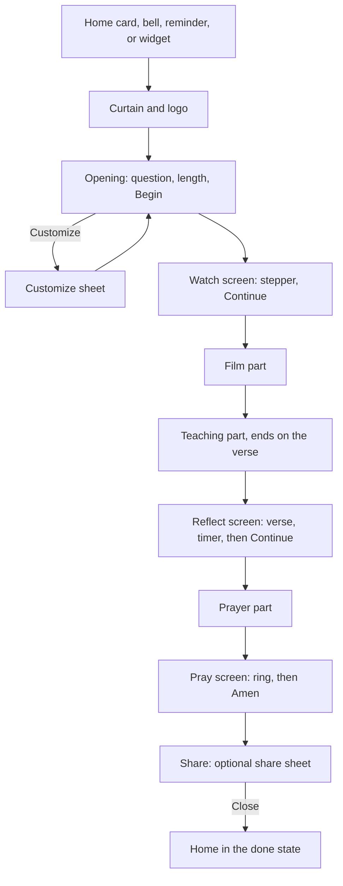
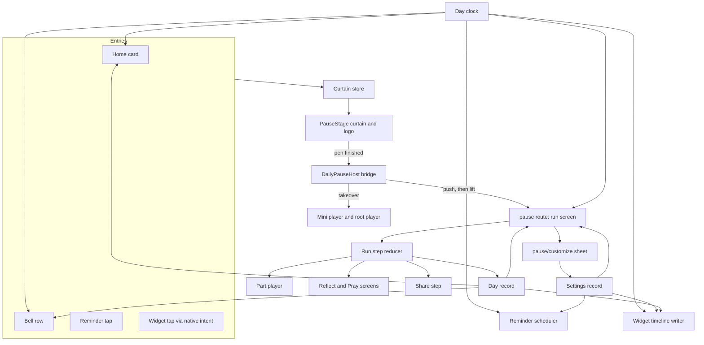
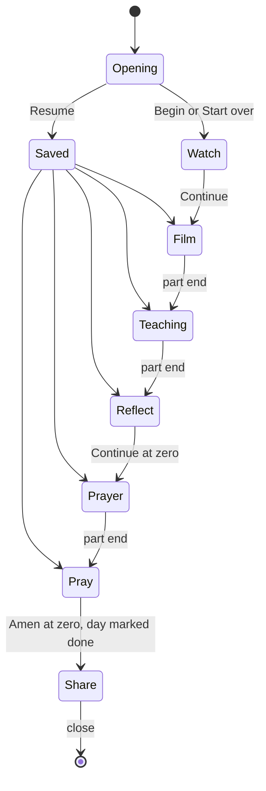
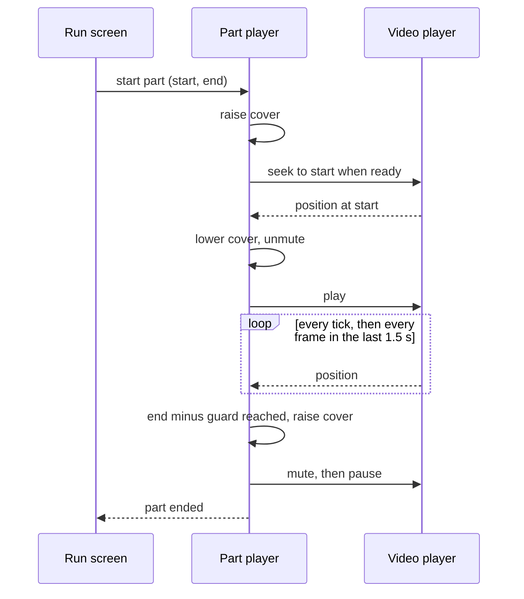

# Daily Bible Pause Devotional Flow - Plan

## Goal Capsule

- **Objective:** The product lead uses a mocked, offline daily devotional flow (the Daily Bible Pause) on their own iPhone for several mornings, so they can direct its look and pacing before the real feature is built.
- **Means:** A preview build of this branch that the product lead installs outside TestFlight, with later JavaScript and asset changes delivered as updates on its own channel (R44, R45, KTD1).
- **Product authority:** The mobile owner decides scope, and the product lead is the reviewer. The podcast path, the light theme, an Android widget, and real devotional content from an API are not active scope.
- **Authority hierarchy:** The Product Contract decides behavior. A Key Technical Decision decides mechanism inside the requirements it cites. A unit overrides neither. When a unit conflicts with a requirement, the requirement wins.
- **Stop conditions:** Stop and ask the mobile owner when any of these occurs:
  - Both widget tools fail the U2 build spike.
  - A settled decision proves impossible on a device, for example when no guard length hides the skipped step cards at a part end.
  - The two encoded videos cannot stay near 100 MB at a clean picture.
  - A step would merge to main, publish to the `production` or `preview` update channel, or upload to TestFlight.
- **Execution profile:** Test-first for the pure modules (run steps, day clock, countdown, part clock, reminder schedule, widget timeline). Simulator smoke for the screens. A release build on a real iPhone for native behavior.
- **Who finishes and ships:** The implementing agent completes the units and their tests on this branch and opens no pull request to main. The mobile owner runs the first interactive EAS build, registers the product lead's iPhone, sends the install link, and publishes the updates.
- **Open blockers:** None.

---

## Product Contract

### Summary

A review build in which the Daily Bible Pause runs from start to end with no network.
The Home card, the bell, a daily reminder, and an iOS widget open the existing curtain and logo, which lead into the dark Pass 2 flow.
The flow plays one of two bundled devotionals, alternating by day, in three video parts with app pause screens between them.
A working Customize sheet sets the pause length, the reminder, and the widget.
The product lead installs the build from a link outside TestFlight, and later changes arrive as updates.

### Problem Frame

The design team has drawn a step-by-step devotional in Figma: Opening, Watch, Reflect, Pray, Share, and a Customize sheet.
On this branch the app has only a curtain-and-logo mockup, a bell with a mock announcement, and a Home card.
The product lead must give direction on how the experience feels: its pacing, motion, type, and how it sits next to the rest of the app.
Static frames cannot show that, and a review on someone else's phone cannot show what a morning reminder and a Home Screen widget are like to live with.

The real source of daily devotional video, the video-first devotional pipeline, has no API that the app can call yet.
Two finished devotional videos exist.
Each already contains its own Watch, Reflect, and Pray sections, burned-in step cards and captions, a verse card, and a prayer prompt.

### Key Decisions

- **Core flow plus a working Customize sheet, all in one build.** (session-settled: user-directed — chosen over the core flow only, a settings-only Customize sheet, the full file with the podcast path, and a smaller first build: the product lead must live with real reminders and a real widget.) Governs R27, R28, R29, R30, R31, R32, R33, R34, R35, R36, R37, R38.
- **A preview build installed outside TestFlight, updated over the air.** (session-settled: user-directed — chosen over a TestFlight build on a separate app record, a TestFlight build on the regular record, Expo Go with an update QR, and a development build with an update QR: TestFlight stays separate, and the product lead uses the real app.) Governs R44, R45.
- **The video speaks, then the app gives the pause.** (session-settled: user-directed — chosen over a video-led flow with stepper-only screens and over the exact Figma order: each video part leads into the app screen that lets the user respond to it.) Governs R10, R18, R19.
- **Two devotionals that alternate by local day.** (session-settled: user-directed — chosen over the Pharisee devotional every day and over a reviewer picker: the reminder, the widget, and the Home card change each morning.) Governs R4.
- **Pause timers hold, then wait for a tap.** (session-settled: user-directed — chosen over moving on by itself at zero and over skippable timers: nobody rushes the pause.) Governs R16, R17.
- **A quiet close on every step, and Resume or Start over on return.** (session-settled: user-directed — chosen over always starting over, a silent resume, and no visible exit.) Governs R5, R6, R21.
- **Video parts allow only tap to pause and resume.** (session-settled: user-directed — chosen over a skip control and over no interaction.) Governs R14.
- **Meditation length sets the pause timers.** (session-settled: user-directed — chosen over changing how much video plays and over a cosmetic setting.) Governs R30, R31.
- **The reminder time is editable.** (session-settled: user-directed — chosen over a fixed 7:00 AM.) Governs R34.
- **The widget is iOS only, and its switch explains how to add the widget.** (session-settled: user-directed — chosen over iOS plus Android, and over a how-to row with no switch or a cosmetic switch: iOS does not let an app place a widget on the Home Screen.) Governs R37, R38, R43.
- **Share sends the complete devotional video, never a new edit.** (session-settled: user-directed — chosen over a message with a link and over a graphic card: the video already holds the whole devotional.) Governs R20.
- **A quiet "done" state for the day.** (session-settled: user-directed — chosen over a missed-day nudge and over no done state.) Governs R7, R8, R9.
- **The flow ends with the close button only.** (session-settled: user-directed — chosen over a Done link under Share and over an automatic return to Home after sharing.) Governs R22.
- **One bundled video per devotional, described as data.** (session-settled: user-directed — chosen over pre-cut parts with text written into the screens and over streaming from Mux: it plays offline, stores each video once, and matches the Watch, Reflect, and Pray structure of the devotional pipeline.) Governs R40, R41, R42.
- **Playback skips each video's own hook and step cards.** (session-settled: user-approved — proposed with the trade-off that the shared video still contains them.) Governs R15.
- **The app screens reuse the video's own words.** (session-settled: user-approved — proposed so that the screen and the video never disagree.) Governs R18, R19, R39.
- **The Figma fonts are bundled, and grain or film texture is left out.** (session-settled: user-approved — proposed to match the drawn design; the texture appears in the canvas notes but not in the Figma.) Governs R23.
- **The shared file is the bundled video.** (session-settled: user-approved — proposed over the byte-for-byte original files, which would add about 420 MB to the build.) Governs R20, R41.
- **A denied notification permission follows the platform norm.** Governs R35, R36.

### Requirements

**Entry and daily rhythm**

- R1. The Home card, the bell's devotional announcement, a tap on the daily reminder, and a tap on the iOS widget each open today's devotional through the existing curtain-and-logo opening.
- R2. Opening today's devotional from any entry point clears the bell's dot until the next local day.
- R3. When the logo finishes, the Opening screen appears with today's question, the "– N min –" length, Begin Devotional, and CUSTOMIZE EXPERIENCE.
- R4. Today's devotional alternates between Pharisee and Lamp by the phone's local calendar day.
- R5. When today's devotional was left part-way, the Opening screen offers Resume and Start over.
- R6. Resume returns to the start of the step that was left.
- R7. Reaching Share marks today's devotional done until local midnight.
- R8. While today's devotional is done, the Home card reads "You paused today · Watch again".
- R9. While today's devotional is done, the widget shows a check beside today's question.
- R46. Opening today's devotional stops any video that is already playing, including the floating mini player.

**The flow**

- R10. A run follows this order, and each entry is one step: Opening, Watch screen, film part, teaching part that ends on the verse, Reflect screen, prayer part, Pray screen, Share.
- R11. The Watch, Reflect, and Pray screens show the WATCH, REFLECT, and PRAY pill stepper with the Figma's active, done, and upcoming states.
- R12. A video part plays full screen with a thin progress bar and no stepper.
- R13. The flow moves on by itself when a video part ends.
- R14. The only playback control on a video part is a tap that pauses or resumes it.
- R15. Playback leaves out any opening hook and the video's own WATCH | REFLECT | PRAY cards, so no frame or sound of a skipped range reaches the screen.
- R16. The Reflect timer and the Pray ring count down with no skip.
- R17. At zero, the Reflect screen waits for a tap on Continue, and the Pray screen waits for a tap on Amen.
- R18. The Reflect screen shows the verse and reference label that the teaching part ends on.
- R19. The Pray screen shows the video's prayer prompt and attribution.
- R20. On Share, "Share this video" opens the system share sheet with today's bundled video, which holds the complete devotional.
- R21. Every step has a quiet close (×) at the top-left that returns to Home.
- R22. The close is the only way to leave Share.
- R23. Every screen follows the Figma "Pass 2 · Dark, pill stepper" design, including its fonts.
- R24. App controls on a video part stay clear of the captions and the gold ring burned into the video.
- R25. The screen stays awake for the whole run, except on Share.
- R26. An interruption, such as leaving the app, locking the phone, or a phone call, holds the current video part or pause timer at the same point. On return, a pause timer continues, and a video part stays paused until the viewer taps it.

**Customize**

- R27. CUSTOMIZE EXPERIENCE opens the Customize bottom sheet with Meditation length, Notifications, Home screen widget, and a Done button that closes the sheet.
- R28. A setting change applies at once.
- R29. Settings persist on the device across app launches.
- R30. Meditation length (1, 3, or 5 min) sets the Reflect and Pray pause timers by this table, with 3 min as the default:

  | Meditation length | Reflect timer | Pray ring |
  | ----------------- | ------------- | --------- |
  | 1 min             | 0:20          | 0:15      |
  | 3 min             | 0:45          | 0:30      |
  | 5 min             | 1:30          | 1:00      |

- R31. The Opening's "– N min –" shows the chosen Meditation length.
- R32. Turning Notifications on schedules a local reminder for every day at the chosen time, which is 7:00 AM by default, done days included.
- R33. The reminder names that day's question.
- R34. A tap on the Notifications row picks the reminder time.
- R35. Turning Notifications on asks for notification permission when the app does not have it.
- R36. A denied permission leaves the switch off, with a line that points to iOS Settings.
- R37. On iOS, turning the widget switch on shows a short how-to for adding the Daily Bible Pause widget from the Home Screen.
- R38. The iOS widget shows today's question while the switch is on, and a quiet "Turned off" state while it is off.
- R47. On first launch, the Notifications switch and the widget switch are off.

**Content and video**

- R39. The build holds two devotionals: Pharisee, on Luke 18:9-14, and Lamp, on Luke 8:16-18. Their screen text is listed under Sources / Research.
- R40. Each devotional is one bundled video plus its screen text and the time ranges of its three parts.
- R41. Each bundled video is a smaller re-encode of its original video, with the loudness raised to a normal app level.
- R42. The whole flow, Share included, works with no network.

**Platforms and delivery**

- R43. Android shows no widget switch.
- R44. The product lead installs the work as an internal-distribution build of this branch, outside TestFlight, with the same bundle identifier as Watch.
- R45. Later JavaScript and asset changes reach the installed build as updates on a channel that only this build uses.

### Key Flows



- F1. A morning devotional
  - **Trigger:** The daily reminder fires at the chosen time.
  - **Steps:** The reviewer taps the reminder. The curtain and logo play, then the Opening shows today's question. The reviewer taps Begin Devotional and Continue, then watches the film part and the teaching part. The Reflect timer runs out, and the reviewer taps Continue. The prayer part plays, the Pray ring runs out, and the reviewer taps Amen. On Share, the reviewer may share the video, then taps the close button.
  - **Outcome:** Home shows the done state for the rest of the day.
  - **Covered by:** R1, R3, R7, R8, R10, R11, R12, R13, R16, R17, R18, R19, R20, R21, R22, R32
- F2. Leave and come back
  - **Trigger:** The reviewer taps the close button during the teaching part.
  - **Steps:** Home appears. Later the reviewer taps the Home card, the curtain and logo play, and the Opening offers Resume and Start over. The reviewer taps Resume.
  - **Outcome:** The teaching part plays from its start.
  - **Covered by:** R5, R6, R21
- F3. Customize the devotional
  - **Trigger:** The reviewer taps CUSTOMIZE EXPERIENCE on the Opening.
  - **Steps:** The sheet opens. The reviewer picks 5 min, taps the Notifications row and picks 6:30 AM, then turns the widget switch on and reads the how-to. The reviewer taps Done.
  - **Outcome:** The Opening shows "– 5 min –", the reminder moves to 6:30 AM, and an added widget shows today's question.
  - **Covered by:** R27, R28, R30, R31, R32, R34, R37, R38

### Acceptance Examples

- AE1. **Covers R17.** Given the Reflect timer reads 0:01, when it reaches 0:00, then nothing moves on until the user taps Continue.
- AE2. **Covers R5, R6.** Given the user closed the flow during the prayer part, when they open today's devotional again, then the Opening offers Resume and Start over, and Resume starts the prayer part from its beginning.
- AE3. **Covers R4, R7, R33.** Given the user finished the Pharisee devotional on Monday, when they open the app on Tuesday morning, then the Home card, the widget, and the reminder show the Lamp question with no done check.
- AE4. **Covers R30.** Given Meditation length is 5 min, when the user reaches Reflect, then the timer starts at 1:30, and the Pray ring later starts at 1:00.
- AE5. **Covers R14.** Given a video part is playing, when the user taps the video, then it pauses, and a second tap resumes it from the same frame.
- AE6. **Covers R36.** Given notification permission was denied, when the user turns Notifications on, then the switch returns to off and the row says that notifications are off in iOS Settings.
- AE7. **Covers R38.** Given the widget is on the Home Screen and the switch is off, then the widget shows the "Turned off" state, and turning the switch on brings back today's question.
- AE8. **Covers R20, R42.** Given the phone is in airplane mode, when the user taps "Share this video", then the share sheet offers the complete devotional video.

### Success Criteria

- The product lead completes a full run on each of several mornings with no crash, no network wait, and no dead end.
- After those mornings, the product lead can say what they like and dislike about the pacing, the look, and the entry points.
- The product lead receives each JavaScript or asset change by reopening the app, with no reinstall.
- The devotional audio plays at about the same loudness as other video in the app.

### Scope Boundaries

- The podcast path ("Listen as a podcast").
- The light theme and the Pass 3 gradient design.
- An Android widget.
- A guaranteed file share on Android. The review is on iPhone, so Android sharing is best effort.
- Real devotional content from an API or from the devotional pipeline.
- Grain and film texture.
- Sharing a link message or a graphic card.
- The other Customize designs in the Figma: centered card, full screen, time-first dial, and previews.
- Merging this work to main.
- Any change to the original video files.
- A TestFlight build of this work, and any publish to the `production` or `preview` update channel.

**Considered and not built**

- Telemetry for the flow. The review has one reviewer whose feedback is spoken. A wider audience would change this.
- An in-app reload when an update arrives. KTD2 applies an update only when the app starts from closed, so an update never cuts a run short. If the product lead misses updates, this changes.
- Rebuilding the widget timeline and the reminders after a time-zone change while the app stays closed. The next app open rewrites both. A review across time zones would change this.
- The Home card and the bell on a first launch with no saved Home and no network. Home shows its existing loading or error state, and the reminder and the widget still open the flow.
- Expo Go support. The app's native modules and the widget need a native build, which the delivery decision already provides.

### Dependencies / Assumptions

- The first preview build is a new native build, because the iOS widget, file sharing, keep-awake, and the time picker all reach native code.
- The product lead's iPhone is registered with the Apple developer account for internal distribution, and Developer Mode is on.
- The install replaces any TestFlight copy of Watch on the product lead's phone, so TestFlight automatic updates for Watch stay off during the review.
- The original videos are untracked in the main checkout at `apps/mobile/misc-assets/` (`devo_v_pharisee.mp4`, 280 MB; `devo2_v_lamp.mp4`, 140 MB), and this branch does not contain them.
- The Lamp Opening question is the video's "Ask yourself" line, because the Figma has no Lamp text.
- The Figma fonts (Instrument Serif, Source Serif 4, Inter) are open-licensed, and the J.C. Ryle text is in the public domain.
- The JESUS film footage in the videos is acceptable in an internal review build.
- A full run takes about 4 to 5 minutes, so "– N min –" names the setting, not the run time.

### Outstanding Questions

**Deferred to Implementation**

- Which widget tool ships. The U2 build spike decides it (KTD14).
- The exact guard length at each part end. A device measurement sets it (KTD8).
- The catalog loudness target. One measurement of two or three catalog videos sets it (KTD3).
- The exact font faces, weights, and sizes in frame `343:2`. The Figma design context supplies them (KTD16).
- Whether the `preview` EAS environment carries a value that this build must override. The first build log shows it (KTD1).

### Sources / Research

- **Visual authority:** Figma file `0x3kAiEt7C7kSHpg0f4wiD`, frame `343:2` ("Pass 2 · Dark, pill stepper"). Its background is `#0c0b0a`, its ink `#f4efe6`, and its accent `#f2c46b`. The app's `BG_COLOR` in `apps/mobile/src/lib/color.ts` is `#1c1917`.
- **Branch mockup:** `apps/mobile/src/components/PauseStage.tsx`, `apps/mobile/src/components/DailyBiblePauseLogo.tsx`, `apps/mobile/src/components/home/AnnouncementsButton.tsx`, `apps/mobile/src/components/home/DailyPauseCard.tsx`, `apps/mobile/src/lib/announcements.ts`, and `apps/mobile/src/lib/pauseCurtain.ts`.
- **One-player rule:** `apps/mobile/src/components/watch/PlaybackHost.tsx` and `apps/mobile/src/components/watch/__tests__/rootPlayerOwnership.guard.test.js`. The named exceptions are the Explore feed, the Home hero surfaces, `apps/mobile/app/video/[sectionKey].tsx`, and `apps/mobile/app/collection/[sectionKey].tsx`.
- **Local notifications:** `apps/mobile/src/lib/lapseReminders/notificationsAdapter.ts`, the only `expo-notifications` importer, and `apps/mobile/src/lib/lapseReminders/permissionPrompt.ts`.
- **Bundled files:** `apps/mobile/metro.config.js` registers the Bible `.bible` extension, and Metro's default asset extensions already include `mp4`.
- **Fonts:** only `apps/mobile/assets/fonts/NotoSerif-SemiBold.ttf`, registered through the `expo-font` plugin in `apps/mobile/app.json`.
- **Future content source:** `docs/plans/2026-07-10-001-feat-video-first-devotional-pipeline-plan.md`. Both videos carry a "Made with Remotion" container comment.

**Video structure.** Times come from frame, silence, and scene analysis. The listed cut points are keyframes. Each prayer part stops before the video's silent music hold (Pharisee 195.5–222.3 s, Lamp 141.7–164.0 s), because the Pray screen gives the silent prayer.

| Devotional      | Hook (skipped) | Film part   | Step card (skipped) | Teaching part | Step card (skipped) | Prayer part   |
| --------------- | -------------- | ----------- | ------------------- | ------------- | ------------------- | ------------- |
| Pharisee (3:42) | 0.0–12.2 s     | 12.2–58.4 s | 58.4–62.2 s         | 62.2–182.5 s  | 182.5–185.6 s       | 185.6–195.5 s |
| Lamp (2:44)     | none           | 0.0–25.9 s  | 26.2–29.3 s         | 29.3–128.1 s  | 128.1–131.2 s       | 131.2–141.7 s |

**Text from the videos.**

- **Pharisee:**
  - Opening question (Figma): "How are we commanded to pray?"
  - Verse: "I tell you, this man, rather than the Pharisee, went home justified. For everyone who exalts himself will be humbled, but the one who humbles himself will be exalted." Label: "LUKE 18:14 · BSB".
  - Prayer prompt: "Bring your honest need to God right now and ask him for mercy."
  - Attribution: "Adapted from a trusted classic · J.C. Ryle, 1858".
- **Lamp:**
  - Opening question: "Where is one place this week you can let someone see what Christ has done in you?"
  - Verse: "No one, when he has lit a lamp, covers it with a container, or puts it under a bed; but puts it on a stand, that those who enter in may see the light." Label: "LUKE 8:16". The video shows no translation; the wording appears to match the WEB.
  - Prayer prompt: "Ask God to show you one person who needs to see the light he's given you."
  - Attribution: "Adapted from a trusted classic · J.C. Ryle".

---

## Planning Contract

**Product Contract preservation:** changed: R44, at the user's direction during planning, moved delivery from a separate TestFlight app to a preview build installed outside TestFlight, and its Key Decision changed with it. R25 excludes Share from keep-awake. R26 states that a video part stays paused after an interruption until a tap, as the user confirmed in the planning synthesis. R45, R46, and R47 are new, and R46 and R47 record defaults that the user confirmed in the planning synthesis. Success Criteria replace the 200 MB TestFlight download line. Dependencies and Outstanding Questions changed to match. Every other R, F, and AE is unchanged.

### Key Technical Decisions

- KTD1. **A dedicated `pause-preview` build profile and update channel, with a guarded publish.** (session-settled: user-directed — chosen over a TestFlight build on a separate app record, a TestFlight build on the regular record, Expo Go with an update QR, and a development build with an update QR: TestFlight stays separate, and the product lead uses the real app.) The profile extends `base`, uses internal distribution, the `preview` EAS environment, and a channel that no other build uses. Before each publish, a script compares the local iOS runtime version with that of the last finished `pause-preview` build and refuses on a mismatch. The app uses the fingerprint runtime policy, so after a native change an update reaches no installed build, yet `eas update` still reports success. Governs R44, R45.
- KTD2. **An update runs at the second cold start after a publish.** The app keeps its `ON_LOAD` check, adds no reload call, and adds no launch wait, because a wait would put a network delay into the morning launch. The first cold start after a publish downloads the update, and the next cold start runs it. A resume from the background checks nothing. A downloaded update therefore never replaces the JavaScript in the middle of a run (R45).
- KTD3. **The two re-encoded videos stay out of git and reach EAS through a branch-only `.easignore`.** A committed script makes them from the originals, with keyframes forced at every cut point and loudness normalized in two passes to a measured catalog target. The outputs are H.264 High with fast start and AAC, at the full 1080x1920 frame and about 2 Mb/s, for about 100 MB in total. Every `pause-preview` build runs through a `build:pause` script that stops on an unclean git tree and then builds with `EAS_NO_VCS=1`. With `requireCommit` on, eas-cli archives a git clone of committed files, where `.easignore` can only remove files. With `EAS_NO_VCS=1`, it copies the working tree from the repository root through the `.easignore` rules, so git-ignored files can be included (`build/vcs/clients/git.js` and `noVcs.js` in eas-cli 21). `requireCommit` stays on for updates. Once `.easignore` exists, eas-cli reads no `.gitignore` file, so the root `.easignore` restates the rules of every `.gitignore` with its directory prefix (for example `apps/mobile/ios/` and `apps/mobile/android/`) and then includes exactly the two outputs. An archive inspection before each build proves both videos are present, and that no `.env` file and no prebuilt native project are. The app loads each video as a Metro asset that expo-asset resolves to a local file, the pattern of the bundled Bible books (`apps/mobile/src/lib/bible/data/bundled.ts`). Rejected:
  - Git LFS, which uses the organization's quota and needs LFS on every machine.
  - A GitHub release asset fetched in the pre-install hook, which needs a new token secret.
  - A local Xcode archive, which needs local signing for two targets.

  Governs R40, R41, R42.

- KTD4. **One pushed root route runs the whole flow.** The `pause` route group holds one run screen that owns the steps, plus a `customize` form sheet. Steps are reducer states, not routes, so:
  - one player serves all three parts,
  - no back swipe can move between steps,
  - Resume only sets a step.

  The route sets `gestureEnabled: false`, and Android back closes the run. Governs R10, R21, R22.

- KTD5. **A bridge inside the root providers hands the curtain over to the route.** `PauseStage` sits outside every provider, and the experience shell remounts the stack once per launch (`apps/mobile/src/contexts/ExperienceShell.tsx`), which drops a route pushed before the remount. The bridge pushes `pause` with no animation only when two conditions hold: the logo pen has finished, and the experience selection is ready. A short deadline (the precedent is `LAPSE_REMINDER_TAP_DEADLINE_MS` in `apps/mobile/src/lib/lapseReminders/tapHandler.ts`) stops the wait from hanging. The bridge then lifts the curtain to reveal the Opening. A curtain tap before the push cancels it and lifts back to the previous screen, as the mockup does today. A new entry while `pause` is on top does nothing. Governs R1, R3.
- KTD6. **Entry takes over the app's player, as Explore does.** At entry the bridge ends a floating mini player session through the store, or pauses the root player while it is in picture-in-picture. The mini player presentation also treats the `pause` routes as hidden. The precedents are `apps/mobile/src/hooks/useExploreTakeover.ts` and `apps/mobile/src/lib/explore/takeover.ts`. Governs R46.
- KTD7. **The devotional player is a named exception to the one-player rule.** It follows the SDUI route pattern (`apps/mobile/app/video/[sectionKey].tsx`): `useManagedVideoPlayer` with a local file URI and no session ownership, and its own `VideoView`. That view uses:
  - the Android texture view
  - no Live Text analysis
  - no picture-in-picture props
  - `contentFit` set to contain

  Contain keeps the burned-in captions and gold ring inside the frame, and the app chrome sits in the letterbox. Rejected: a chrome-less, windowed mode in `PlaybackHost.tsx`, which would change the 2,000-line shared host for a branch-only mock. Governs R12, R24.

- KTD8. **Each part stops early behind a cover.** A projected media clock (from `timeUpdate` at 0.25 s, rebased on each tick) watches the part. In the last 1.5 s, a per-frame read of `currentTime` takes over. At the part end minus a guard of about 200 ms, an opaque cover rises, the player mutes, and then pauses. At a part start, the cover holds until the source is ready and `currentTime` has reached the start. The seek is sent on readiness, never right after a source swap (`docs/solutions/integration-issues/expo-video-replaceasync-seek-silently-dropped-tvos.md`). A time backstop releases the cover into a "Try again" state if a part never starts. Drift handling follows `docs/solutions/integration-issues/expo-video-timeupdate-clock-drift-audio-fade-hardcut.md`. Governs R13, R15.
- KTD9. **Interruptions hold, and only a tap restarts video.** The devotional player pauses on background, on an audio interruption, and on a call. On return it stays paused with a small cue, and a tap resumes it. A new opt-in option on `useManagedVideoPlayer` turns off its resume-on-active for this player, and the option defaults to today's behavior. The timers count a remaining time that stops while the app is not active, and they continue on return. Governs R14, R26.
- KTD10. **Keep-awake runs from the Opening through the Pray step.** `expo-keep-awake` becomes a direct dependency. The run screen holds one tag on every step except Share and releases it on exit. Keep-awake cannot be proved in a dev build, because Expo holds keep-awake there itself. Governs R25.
- KTD11. **One day clock owns "today".** A pure function maps a local date key to the day's devotional by the parity of the days since a fixed local anchor date. A hook re-evaluates the key when the app returns to active and at the next local midnight. The Home card, the bell, the reminders, and the widget timeline all read this one source, so they cannot disagree. A run reads the day key and the devotional once, at Begin or Resume, and keeps them until the close. Its step writes and its done write use that key, so a run that crosses midnight stays on one devotional and marks its own day done. Governs R4, R7, R33, R38.
- KTD12. **Two versioned AsyncStorage records hold the state.** Both use `createPersistedRecordStore` (`apps/mobile/src/lib/bible/position/persistedRecordStore.ts`):
  - The settings record holds Meditation length, the reminder switch and time, and the widget switch.
  - The day record holds the day key, the step reached, the done flag, and the bell read flag.

  A day record with an old key reads as an empty day, so Resume never crosses days. Governs R2, R5, R6, R7, R29, R47.

- KTD13. **Reminders are 14 one-shot requests, scheduled through the existing adapter.** The adapter gains a calendar trigger (iOS) or a date trigger (Android), an optional title, and a channel parameter. Each request uses the identifier `daily-pause-YYYY-MM-DD` and names that day's question. The app reschedules on foreground and on every setting change. It cancels only its own identifiers, which stays far under the iOS limit of 64 pending requests. A `daily-pause` payload family is dispatched before the lapse branch and does not depend on `LAPSE_REMINDERS_ENABLED`. A tap calls the curtain. A denied permission opens the app's page in Settings. Governs R1, R32, R33, R35, R36.
- KTD14. **The widget uses `expo-widgets` with `@expo/ui`, decided by the U2 spike.** The app writes a timeline to the App Group with these entries:
  - with the switch on, one entry per local day for 14 days, holding that day's question and done flag
  - with the switch off, one "Turned off" entry

  It rewrites the timeline on foreground, on Share, and on a switch change. A tap uses `widgetURL` with the app scheme, and `app/+native-intent.tsx` turns that URL into a curtain request. It returns `/` only on a cold launch. On a warm link it returns null, so expo-router does not navigate and a run on top stays where it is (KTD5). The widget uses the system serif, because the extension cannot use the app's fonts. Fallback: `@bacons/apple-targets` from its SDK 57 branch. A bake-off is not used, because only one candidate has an SDK 57 release. Governs R1, R9, R37, R38.

- KTD15. **Share uses `expo-sharing` on a named cache copy.** On the first share, the app copies today's video to the cache as `Daily Bible Pause – <title>.mp4` and reuses that copy later. A busy state ignores taps until the sheet opens. The result never moves the run. `NSPhotoLibraryAddUsageDescription` enables "Save Video", and the photo-library guard changes on this branch to match. Rejected: React Native `Share.share`, which cannot carry a file on Android and reports an iOS cancel unreliably. Governs R20, R22, R42.
- KTD16. **Fonts are static TTFs, loaded at run time.** The pause route loads Instrument Serif, Source Serif 4, and Inter with `expo-font` before its first paint, and does not use the config plugin. A font change therefore ships as an update, and the splash font guard stays untouched. Each family string equals the font's PostScript name. A failed load falls back to the system serif. Governs R23.
- KTD17. **The reminder time uses the native date-time picker.** `@react-native-community/datetimepicker` shows inline in the form sheet. A JavaScript drag control inside an iOS sheet loses drags that drift (apps/mobile/CLAUDE.md, Bible reader settings). Governs R34.
- KTD18. **One theme module holds the Pass 2 tokens.** The states that have no Figma frame use these tokens with the frame's own components:
  - the Opening with Resume and Start over
  - the paused cue
  - the Home card's done state
  - the Notifications row states
  - the widget

  Text fits at every text size. On the Opening and the Reflect screen, the question and the verse wrap and scroll when they do not fit, and the actions stay on screen. The Home card and the widget show the question in at most 3 lines with an ellipsis. The widget ships in the small and medium sizes. Accessibility follows PRODUCT.md: 44 pt targets, labelled controls, and instant changes under Reduce Motion (`apps/mobile/src/hooks/useReduceMotion.ts`). Governs R3, R18, R23, R38.

### High-Level Technical Design

**Components and data flow**



**Run steps and Resume**



Every step also leaves through the close to Home, and the day record keeps the step for Resume on the same local day.

**Part playback lifecycle**



### Output Structure

```text
.easignore                                (branch-only upload rules)
apps/mobile/
  app/
    +native-intent.tsx
    pause/
      _layout.tsx
      index.tsx
      customize.tsx
  assets/
    devotionals/                          (generated, git-ignored)
      pharisee.mp4
      lamp.mp4
    fonts/                                (Instrument Serif, Source Serif 4, Inter)
  scripts/
    encode-devotionals.sh
    publish-pause-update.sh
  src/
    components/dailyPause/
      DailyPauseHost.tsx
      RunScreen.tsx
      OpeningScreen.tsx
      WatchScreen.tsx
      PartPlayer.tsx
      PartProgressBar.tsx
      ReflectScreen.tsx
      PrayScreen.tsx
      CountdownRing.tsx
      ShareScreen.tsx
      CustomizeSheet.tsx
      StepperPills.tsx
      CloseButton.tsx
    lib/dailyPause/
      devotionalTimeline.json
      devotionals.ts
      today.ts
      settings.ts
      progress.ts
      run.ts
      partClock.ts
      countdown.ts
      shareVideo.ts
      reminders.ts
      reminderPayload.ts
      widgetTimeline.ts
      theme.ts
      fonts.ts
    widgets/
      DailyPauseWidget.tsx
docs/operations/daily-bible-pause-preview.md
```

### Sequencing

- **Foundations:** U1, U2, U3, U4, U5, U6. Run U2 early, because its result decides KTD14.
- **The run:** U7, U8, U9, U10, U11.
- **Around the run:** U12, U13, U14, U15.
- **Delivery:** the first interactive `pause-preview` build, the install on the product lead's iPhone, and one update dry run, per the operations guide from U1.

### System-Wide Impact

- **Shared modules change on this branch:** the notifications adapter (a calendar port), the tap dispatch (a new payload family), the mini player presentation (hidden `pause` routes), `useManagedVideoPlayer` (an opt-in option whose default keeps today's behavior), the root layout (a route and a bridge), and four guards. The branch never merges, so these changes reach only the `pause-preview` build.
- **Apple developer account:** the widget registers an extension App ID and adds the App Groups capability to `org.jesusfilm.forgewatch`. The ad hoc profile includes the product lead's device. Enabling App Groups changes the shared App ID, which invalidates its existing profiles, the App Store profile included. EAS regenerates that profile on the next production build. EAS capability sync on an Apple-authenticated production build would turn App Groups off again, so production iOS builds run with `EXPO_NO_CAPABILITY_SYNC=1` until the review ends.
- **The product lead's phone:** the install replaces any TestFlight copy of Watch. The `preview` EAS environment decides which telemetry and fleet keys the build carries.

### Risks & Dependencies

| Risk                                                                                                                       | Mitigation                                                                                                                   |
| -------------------------------------------------------------------------------------------------------------------------- | ---------------------------------------------------------------------------------------------------------------------------- |
| The `expo-widgets` bundle phase fails in this pnpm monorepo (expo/expo #49752).                                            | The U2 spike runs first. `@bacons/apple-targets` from its SDK 57 branch is the fallback.                                     |
| An update after a native change reaches nobody.                                                                            | The KTD1 publish script refuses on a runtime mismatch.                                                                       |
| The `.easignore` misses an ignore rule and uploads a `.env` file, which Expo then inlines.                                 | The U3 guard and the archive inspection before each build.                                                                   |
| The first update downloads the embedded videos again (about 100 MB).                                                       | The operations guide asks the product lead to open the app on Wi-Fi after the first update.                                  |
| Bluetooth audio latency lets a skipped card's sound leak past the guard.                                                   | The cover and mute come first. A device check with AirPods sets the guard length.                                            |
| A cold-start reminder or widget tap lands before the experience shell remounts the stack.                                  | The KTD5 bridge waits for the selection, within a deadline.                                                                  |
| The first build with the App Group needs an interactive Apple login, and a production build can turn App Groups off again. | The mobile owner runs the first build by hand. Production iOS builds run with `EXPO_NO_CAPABILITY_SYNC=1` during the review. |

---

## Implementation Units

| U-ID | Title                                           | Key files                                                                                     | Depends on      |
| ---- | ----------------------------------------------- | --------------------------------------------------------------------------------------------- | --------------- |
| U1   | Preview delivery profile and update guard       | `apps/mobile/eas.json`, `apps/mobile/scripts/publish-pause-update.sh`                         | —               |
| U2   | Widget extension build spike                    | `apps/mobile/app.json`, `apps/mobile/src/widgets/DailyPauseWidget.tsx`                        | —               |
| U3   | Bundled devotional videos                       | `apps/mobile/scripts/encode-devotionals.sh`, `.easignore`                                     | —               |
| U4   | Devotional content and the day clock            | `apps/mobile/src/lib/dailyPause/devotionals.ts`, `today.ts`                                   | U3              |
| U5   | Persisted daily state                           | `apps/mobile/src/lib/dailyPause/settings.ts`, `progress.ts`                                   | U4              |
| U6   | Pass 2 theme and fonts                          | `apps/mobile/src/lib/dailyPause/theme.ts`, `fonts.ts`                                         | —               |
| U7   | Curtain handover, run route, takeover, and exit | `apps/mobile/src/components/dailyPause/DailyPauseHost.tsx`, `apps/mobile/app/pause/`          | U5              |
| U8   | Run screen, Opening, Watch screen, and Resume   | `apps/mobile/src/lib/dailyPause/run.ts`, `RunScreen.tsx`                                      | U4, U5, U6, U7  |
| U9   | Video part player                               | `apps/mobile/src/lib/dailyPause/partClock.ts`, `PartPlayer.tsx`                               | U3, U4, U8      |
| U10  | Reflect and Pray pause screens                  | `apps/mobile/src/lib/dailyPause/countdown.ts`, `ReflectScreen.tsx`, `PrayScreen.tsx`          | U5, U6, U8      |
| U11  | Share step and done state                       | `apps/mobile/src/lib/dailyPause/shareVideo.ts`, `ShareScreen.tsx`                             | U3, U5, U8      |
| U12  | Daily reminders                                 | `apps/mobile/src/lib/dailyPause/reminders.ts`, `notificationsAdapter.ts`, `tapHandler.ts`     | U4, U5          |
| U13  | Customize sheet                                 | `apps/mobile/app/pause/customize.tsx`, `CustomizeSheet.tsx`                                   | U5, U6, U7, U12 |
| U14  | iOS widget                                      | `apps/mobile/src/widgets/DailyPauseWidget.tsx`, `widgetTimeline.ts`, `app/+native-intent.tsx` | U2, U4, U5, U13 |
| U15  | Home card and bell                              | `apps/mobile/src/components/home/DailyPauseCard.tsx`, `AnnouncementsButton.tsx`               | U4, U5, U7      |

### U1. Preview delivery profile and update guard

- **Goal:** The product lead installs the build from a link outside TestFlight, and later JavaScript and asset changes reach only that build.
- **Requirements:** R44, R45 (KTD1, KTD2).
- **Dependencies:** None.
- **Files:**
  - `apps/mobile/eas.json`
  - `apps/mobile/package.json`
  - `apps/mobile/scripts/build-pause.sh`
  - `apps/mobile/scripts/publish-pause-update.sh`
  - `docs/operations/daily-bible-pause-preview.md`
- **Approach:**
  1. Add the `pause-preview` profile per KTD1, for iOS only.
  2. Write the publish script. It resolves the local iOS runtime version, reads the runtime version of the last finished `pause-preview` iOS build, and stops with both values when they differ. When they match, it publishes to the `pause-preview` channel with dotenv off and `--environment preview`, as `update:preview` does.
  3. Write the build script per KTD3. It stops when `git status --porcelain` is not empty, then runs the iOS `pause-preview` build with `EAS_NO_VCS=1`.
  4. Add `update:pause` and `build:pause` package scripts that run the two scripts.
  5. Write the operations guide. It covers:
     - device registration, Developer Mode, and the install QR
     - turning off TestFlight automatic updates for Watch
     - taking an update: swipe the app away and open it on Wi-Fi to download, then swipe it away and open it again to run it (KTD2)
     - the rebuild after a native change
     - production iOS builds with `EXPO_NO_CAPABILITY_SYNC=1` during the review
  6. Before the first build, revert the stray `apps/admin/AGENTS.md` change, so that the clean-tree checks pass.
- **Patterns to follow:** the `update:preview` script in `apps/mobile/package.json`, and apps/mobile/CLAUDE.md, "Publishing an EAS Update" and "EAS builder toolchain pins".
- **Execution note:** This is mostly packaging. Prove it with a dry run, not with unit tests.
- **Test scenarios:**
  - `apps/mobile/app/__tests__/easToolchainPins.guard.test.js` passes with the new profile, because the profile extends `base`.
  - Test expectation for the publish script: none -- a shell wrapper whose refusal path the Verification proves.
- **Verification:** The publish script refuses and publishes nothing when the local runtime differs from the last `pause-preview` build, and it publishes to `pause-preview` when they match. The build script refuses on an unclean tree. The guide covers every step the product lead takes.

### U2. Widget extension build spike

- **Goal:** Prove that a widget extension builds, launches, and opens the app in this pnpm monorepo before any widget work starts.
- **Requirements:** R37, R38 (KTD14).
- **Dependencies:** None.
- **Files:**
  - `apps/mobile/package.json`
  - `apps/mobile/app.json`
  - `apps/mobile/src/widgets/DailyPauseWidget.tsx`
  - `apps/mobile/app/_layout.tsx`
- **Approach:**
  1. Add `expo-widgets` and `@expo/ui` with `npx expo install`, and add the plugin.
  2. Make a static widget that shows one line of text and carries a `widgetURL` and a container background.
  3. Import the widget module at app start on iOS, so that its layout reaches the App Group.
  4. Prebuild, then build the whole app in Release for the simulator. Also run the widget bundle phase on its own (the expo/expo #49752 check).
  5. Add the widget on the simulator Home Screen, open the app once, and tap the widget.
  6. If the bundle phase fails under pnpm, repeat with `@bacons/apple-targets` from its SDK 57 branch. Record the outcome in KTD14.
- **Test expectation:** none -- a build spike, proven by its Verification.
- **Verification:** The Release build launches with the extension embedded. The widget shows its text after the first app open. A tap opens the app. The extension's build number equals the app's.

### U3. Bundled devotional videos

- **Goal:** Two smaller, louder copies of the original videos exist for the build, with a keyframe at every cut point, and they never enter git.
- **Requirements:** R40, R41, R42 (KTD3).
- **Dependencies:** None.
- **Files:**
  - `apps/mobile/src/lib/dailyPause/devotionalTimeline.json`
  - `apps/mobile/scripts/encode-devotionals.sh`
  - `apps/mobile/.gitignore`
  - `.easignore`
  - `apps/mobile/src/lib/dailyPause/__tests__/devotionalAssets.guard.test.js`
- **Approach:**
  1. Record each devotional's part ranges and skipped ranges from the Video structure table in one JSON file. The encoder and the app both read this file.
  2. Measure the integrated loudness of two or three catalog videos once, and record the target in the script.
  3. The script reads the originals (default: the main checkout's `apps/mobile/misc-assets/`) and writes `apps/mobile/assets/devotionals/pharisee.mp4` and `lamp.mp4` per KTD3. It never writes to the originals.
  4. Git-ignore the outputs. Write the root `.easignore` per KTD3.
- **Test scenarios:**
  - The guard fails when either output video is tracked by git.
  - The guard fails when `.easignore` lacks the `.env` rules or `node_modules`, or includes any path other than the two outputs.
  - The guard fails when `.easignore` does not ignore `apps/mobile/ios` and `apps/mobile/android`.
  - The guard fails when a devotional's cut points are not ascending, or when a part overlaps a skipped range.
- **Verification:** `ffprobe` lists a keyframe at each cut point. Integrated loudness is within 1 LU of the target. The two files total about 100 MB. The `pause-preview` archive inspection contains both files, and no `.env` file and no `apps/mobile/ios` or `apps/mobile/android` directory.

### U4. Devotional content and the day clock

- **Goal:** The app knows today's devotional, its text, and the local file of its video, and it notices a new day while it stays in memory.
- **Requirements:** R4, R39, R40 (KTD3, KTD11).
- **Dependencies:** U3.
- **Files:**
  - `apps/mobile/src/lib/dailyPause/devotionals.ts`
  - `apps/mobile/src/lib/dailyPause/today.ts`
  - `apps/mobile/src/lib/announcements.ts`
  - `apps/mobile/src/lib/dailyPause/__tests__/devotionals.test.ts`
  - `apps/mobile/src/lib/dailyPause/__tests__/today.test.tsx`
- **Approach:**
  1. Type each devotional's text from Sources / Research. Read its part ranges from the timeline JSON, and refer to its video as a Metro asset.
  2. Resolve the video to a local file URI with expo-asset before the player mounts, because the adapter freezes its first source.
  3. Move `localDay` into `today.ts`, and add the parity rule and the hook per KTD11. `announcements.ts` reads both from there.
- **Patterns to follow:** `apps/mobile/src/lib/bible/data/bundled.ts` for asset resolution, and `apps/mobile/src/lib/lapseReminders/schedule.ts` for calendar arithmetic that is safe across daylight-saving changes.
- **Test scenarios:**
  - Each devotional has a question, a verse, a label, a prayer prompt, an attribution, and three parts.
  - Two consecutive local days give different devotionals, and one day key always gives the same devotional. Covers AE3.
  - The alternation holds across a month end and across a daylight-saving change.
  - The hook moves to the new day when the app returns to active after local midnight.
  - The midnight timer moves the day while the app stays in the foreground.
  - Under StrictMode, the hook keeps one midnight timer and one AppState listener.
  - A failed video resolution returns an error state and does not throw.
- **Verification:** The Home card and the run screen can read today's devotional from one source, and the source changes at local midnight without a relaunch.

### U5. Persisted daily state

- **Goal:** Settings and today's progress survive a relaunch, and yesterday's progress never leaks into today.
- **Requirements:** R2, R5, R6, R7, R28, R29, R30, R47 (KTD12).
- **Dependencies:** U4.
- **Files:**
  - `apps/mobile/src/lib/dailyPause/settings.ts`
  - `apps/mobile/src/lib/dailyPause/progress.ts`
  - `apps/mobile/src/lib/announcements.ts`
  - `apps/mobile/src/lib/dailyPause/__tests__/settings.test.ts`
  - `apps/mobile/src/lib/dailyPause/__tests__/progress.test.ts`
  - `apps/mobile/src/lib/__tests__/announcements.test.tsx`
- **Approach:**
  1. Create the settings record with the defaults that R30, R32, and R47 give.
  2. Create the day record with actions to mark the day opened (bell read), record a step, mark the day done, and start over.
  3. Move the bell's read state from memory into the day record.
- **Patterns to follow:** `apps/mobile/src/lib/bible/settings/snapshot.ts` and `apps/mobile/src/lib/bible/settings/store.ts`.
- **Test scenarios:**
  - First launch reads 3 min, Notifications off at 7:00 AM, and the widget off.
  - A changed setting reaches subscribers at once and survives a re-hydration from storage.
  - A day record from yesterday reads as empty: no Resume and not done.
  - A recorded teaching-part step reads back as the Resume target. Covers AE2.
  - A day marked done stays done for that day key and clears for the next one.
  - The bell dot stays clear after a relaunch on the same day and returns the next day.
  - A corrupt record, or one from an older version, falls back to the defaults without a throw.
- **Verification:** The settings and the day state persist across a simulator relaunch and reset on a clock change past midnight.

### U6. Pass 2 theme and fonts

- **Goal:** Every devotional screen has the Pass 2 colors and the Figma fonts, with no blank text if a font fails.
- **Requirements:** R23 (KTD16, KTD18).
- **Dependencies:** None.
- **Files:**
  - `apps/mobile/assets/fonts/`
  - `apps/mobile/src/lib/dailyPause/theme.ts`
  - `apps/mobile/src/lib/dailyPause/fonts.ts`
  - `apps/mobile/src/lib/dailyPause/__tests__/fonts.test.tsx`
- **Approach:**
  1. Read frame `343:2` with the Figma design-context tool for the faces, weights, sizes, spacing, and colors in use.
  2. Add only those faces, as static TTFs with their OFL license texts.
  3. Write the theme tokens and the font hook per KTD16.
  4. Keep every `fontWeight` at 700 or below (`apps/mobile/app/__tests__/fontWeightMax.guard.test.js`).
- **Patterns to follow:** `apps/mobile/assets/fonts/README.md` for naming.
- **Test scenarios:**
  - The hook reports ready after every face loads.
  - A failed load reports ready with the fallback, and text renders in the system serif.
  - The theme's background, ink, and accent match the frame's values.
- **Verification:** On the simulator, the Opening renders in the Figma faces, and the faces stay correct after an update that changes only JavaScript.

### U7. Curtain handover, run route, takeover, and exit

- **Goal:** Each entry point plays the curtain and logo, reveals the Opening, stops other video, and the close returns to Home.
- **Requirements:** R1, R3, R21, R22, R46 (KTD4, KTD5, KTD6).
- **Dependencies:** U5.
- **Files:**
  - `apps/mobile/src/lib/pauseCurtain.ts`
  - `apps/mobile/src/components/PauseStage.tsx`
  - `apps/mobile/src/components/dailyPause/DailyPauseHost.tsx`
  - `apps/mobile/app/_layout.tsx`
  - `apps/mobile/app/pause/_layout.tsx`
  - `apps/mobile/app/pause/index.tsx`
  - `apps/mobile/src/lib/miniPlayer/presentation.ts`
  - `apps/mobile/src/lib/__tests__/pauseCurtain.test.tsx`
  - `apps/mobile/src/components/__tests__/PauseStage.test.tsx`
  - `apps/mobile/src/components/dailyPause/__tests__/DailyPauseHost.test.tsx`
  - `apps/mobile/src/lib/miniPlayer/__tests__/presentation.test.ts`
- **Approach:**
  1. Give the curtain store a phase, and have `PauseStage` report the end of the logo pen from its own clock, because native animation callbacks are unreliable on this app.
  2. Mount the bridge inside the providers through the guarded `require` block, and register the `pause` group.
  3. On a handover, take over the player (KTD6), push `pause`, and lift the curtain (KTD5).
  4. The close pops the run route and selects the Home tab with `router.dismissTo`, never `replace` (`docs/solutions/logic-errors/expo-router-navigate-to-tabs-from-root-stack-pushes-duplicate-navigator.md`).
  5. Mark the day opened on every entry (R2, through U5).
- **Patterns to follow:** the `PushNoticeHost` mount in `apps/mobile/app/_layout.tsx`, `apps/mobile/app/watch/_layout.tsx` for a group with a form sheet, and `apps/mobile/src/hooks/useExploreTakeover.ts`.
- **Test scenarios:**
  - When the pen finishes with the selection ready, the bridge pushes `pause` once with no animation, then lifts the curtain.
  - With the selection not ready, the bridge waits, and it pushes when the deadline passes.
  - A curtain tap before the pen finishes pushes nothing and lifts back to the previous screen.
  - A new curtain request while `pause` is on top does nothing.
  - Entry with a floating mini player ends its session as dismissed. Entry under a picture-in-picture hold pauses the root player.
  - The mini player is hidden on `pause` and `pause/customize`.
  - The close pops to the tabs and selects Home. Android back on the run screen does the same.
  - Under StrictMode, one entry produces one push.
- **Verification:** On the simulator, the card, the bell row, and a deep link each play the curtain and reveal the Opening with no flash of Home. A playing mini player stops at entry.

### U8. Run screen, Opening, Watch screen, and Resume

- **Goal:** The run moves through the R10 steps with the stepper and the close, offers Resume or Start over, and keeps the screen awake.
- **Requirements:** R3, R5, R6, R10, R11, R21, R22, R23, R25, R31 (KTD4, KTD10, KTD18).
- **Dependencies:** U4, U5, U6, U7.
- **Files:**
  - `apps/mobile/src/lib/dailyPause/run.ts`
  - `apps/mobile/app/pause/index.tsx`
  - `apps/mobile/src/components/dailyPause/RunScreen.tsx`
  - `apps/mobile/src/components/dailyPause/OpeningScreen.tsx`
  - `apps/mobile/src/components/dailyPause/WatchScreen.tsx`
  - `apps/mobile/src/components/dailyPause/StepperPills.tsx`
  - `apps/mobile/src/components/dailyPause/CloseButton.tsx`
  - `apps/mobile/package.json`
  - `apps/mobile/src/lib/dailyPause/__tests__/run.test.ts`
  - `apps/mobile/src/components/dailyPause/__tests__/RunScreen.test.tsx`
  - `apps/mobile/src/components/dailyPause/__tests__/OpeningScreen.test.tsx`
  - `apps/mobile/src/components/dailyPause/__tests__/StepperPills.test.tsx`
- **Approach:**
  1. Write the pure reducer with begin, resume, start over, and advance over the R10 order. Each step change writes the day record (U5) under the run's pinned day key (KTD11). A saved Share step is never a Resume target, so "Watch again" on a done day begins a new run (R5, R8).
  2. The Opening shows R3's content and opens `pause/customize`.
  3. The run screen holds the keep-awake tag per KTD10.
  4. The close is a 44 pt target with a VoiceOver label. It sits in the safe area on screens and in the letterbox on video parts (R24).
- **Execution note:** Write the reducer test-first.
- **Test scenarios:**
  - Begin leads to the Watch screen, and advance walks the R10 order to Share. Advance at Share does nothing.
  - Resume after a close during the prayer part starts at the prayer part. Covers AE2.
  - Start over begins at the Watch screen and replaces the saved step.
  - The Opening shows Resume and Start over only when today's saved step is past the Opening and before Share.
  - On a done day whose saved step is Share, the Opening offers Begin Devotional only. Begin starts at the Watch screen, and the day stays done.
  - A replay left part-way on a done day offers Resume at that step.
  - A run that crosses local midnight keeps its devotional and marks its own day done (KTD11).
  - After Meditation length changes to 5 min, the Opening shows "– 5 min –".
  - The stepper shows active, done, and upcoming states on the Watch, Reflect, and Pray screens, and it is absent on video parts.
  - Share offers only the close and "Share this video".
  - Keep-awake is active from the Opening through the Pray screen, and inactive on Share and after the close.
  - Under StrictMode, the run holds one keep-awake tag and writes each step once.
- **Verification:** A full simulator run walks every step, and a close-and-reopen during each step offers Resume at that step.

### U9. Video part player

- **Goal:** Each video part plays from its start, ends before the next skipped range with no leaked frame or sound, and holds through interruptions.
- **Requirements:** R12, R13, R14, R15, R24, R26 (KTD7, KTD8, KTD9).
- **Dependencies:** U3, U4, U8.
- **Files:**
  - `apps/mobile/src/lib/dailyPause/partClock.ts`
  - `apps/mobile/src/components/dailyPause/PartPlayer.tsx`
  - `apps/mobile/src/components/dailyPause/PartProgressBar.tsx`
  - `apps/mobile/src/hooks/useManagedVideoPlayer.ts`
  - `apps/mobile/src/components/watch/__tests__/rootPlayerOwnership.guard.test.js`
  - `apps/mobile/src/components/home/__tests__/homeHeroAndroidCompositing.guard.test.ts`
  - `apps/mobile/src/lib/dailyPause/__tests__/partClock.test.ts`
  - `apps/mobile/src/components/dailyPause/__tests__/PartPlayer.test.tsx`
  - `apps/mobile/src/hooks/__tests__/useManagedVideoPlayer.test.tsx`
- **Approach:**
  1. Write the part clock as a pure module (projection, guard stop, start gate, backstop) per KTD8.
  2. The part player mounts one view per KTD7 under the run screen and keeps it mounted across the three parts. Between parts it is paused and covered.
  3. The film part's end seeks straight to the teaching part's start behind the cover.
  4. Add the opt-in resume option to the adapter per KTD9, and list the new view in both guards.
  5. The paused cue and the thin progress bar sit in the bottom letterbox.
- **Patterns to follow:** `apps/mobile/src/hooks/useFeedPlayers.ts` for a window end on `timeUpdate`, `apps/mobile/src/components/explore/ClipProgressBar.tsx`, and `apps/tv/src/components/showcaseMode/ReelPlayer.tsx` for the projected clock.
- **Execution note:** Write the part clock test-first with a fake clock.
- **Test scenarios:**
  - Between ticks the projected time advances with wall time. It rebases on a tick that moved, and it stands still while paused.
  - When projected time reaches the end minus the guard, the cover rises, the player mutes and pauses, and the run advances once.
  - At a part start the cover stays up until the source is ready and the position reaches the start. The seek is sent on readiness, not after the source swap.
  - A part that never starts releases the cover into "Try again" after the backstop, and the close stays reachable.
  - A tap pauses the part, and a second tap resumes it from the same position. Covers AE5.
  - Background pauses the part. On return it stays paused with the cue until a tap.
  - A pause the viewer did not cause, such as an audio interruption, shows the cue.
  - The film part's end leads to the teaching part with no frame of the step card range.
  - The adapter option defaults to today's behavior, and existing adapter tests stay green. With the option on, the player does not resume on active.
  - Both guards list the devotional view, and it carries the Android texture view.
- **Verification:** A frame capture at each part boundary on a release build shows no step-card frame, with the phone speaker and with AirPods.

### U10. Reflect and Pray pause screens

- **Goal:** The Reflect timer and the Pray ring give the chosen pause, hold through interruptions, and wait for a tap at zero.
- **Requirements:** R11, R16, R17, R18, R19, R26, R30 (KTD9, KTD18).
- **Dependencies:** U5, U6, U8.
- **Files:**
  - `apps/mobile/src/lib/dailyPause/countdown.ts`
  - `apps/mobile/src/components/dailyPause/ReflectScreen.tsx`
  - `apps/mobile/src/components/dailyPause/PrayScreen.tsx`
  - `apps/mobile/src/components/dailyPause/CountdownRing.tsx`
  - `apps/mobile/src/lib/dailyPause/__tests__/countdown.test.ts`
  - `apps/mobile/src/components/dailyPause/__tests__/ReflectScreen.test.tsx`
  - `apps/mobile/src/components/dailyPause/__tests__/PrayScreen.test.tsx`
- **Approach:**
  1. Write the countdown as remaining time that stops while the app is not active (KTD9).
  2. Draw the ring with two half rings in clips, because the app has no SVG library.
  3. Read the verse, label, prompt, and attribution from today's devotional.
  4. Under Reduce Motion, the ring steps without animation. VoiceOver reads the time left.
- **Patterns to follow:** `apps/mobile/src/components/bible/ReaderProgressRing.tsx`.
- **Test scenarios:**
  - The Reflect timer starts at 0:20, 0:45, or 1:30, and the Pray ring at 0:15, 0:30, or 1:00, by Meditation length. Covers AE4.
  - At 0:00, Continue becomes active, and nothing advances until the tap. Covers AE1.
  - No control skips the countdown before zero.
  - A background at 0:30 left continues from 0:30 on return.
  - Reflect shows today's verse and label, and Pray shows today's prompt and attribution.
  - The ring's fill matches the fraction left.
- **Verification:** On the simulator, each Meditation length gives the table's times, and locking the screen holds the timer.

### U11. Share step and done state

- **Goal:** Reaching Share marks the day done, and "Share this video" offers today's video in the share sheet, online or offline.
- **Requirements:** R7, R20, R22, R42 (KTD15).
- **Dependencies:** U3, U5, U8.
- **Files:**
  - `apps/mobile/src/lib/dailyPause/shareVideo.ts`
  - `apps/mobile/src/components/dailyPause/ShareScreen.tsx`
  - `apps/mobile/app.json`
  - `apps/mobile/package.json`
  - `apps/mobile/src/lib/__tests__/appJsonNoPhotoLibrary.guard.test.js`
  - `apps/mobile/src/lib/dailyPause/__tests__/shareVideo.test.ts`
  - `apps/mobile/src/components/dailyPause/__tests__/ShareScreen.test.tsx`
- **Approach:**
  1. Add `expo-sharing` with `npx expo install`, and add the photo-library add key with a plain usage line.
  2. Write `shareVideo` per KTD15.
  3. Mark the day done when the Share step mounts.
- **Patterns to follow:** `apps/mobile/src/lib/rawExportRuntime.ts` for the `expo-file-system` file API.
- **Test scenarios:**
  - Reaching Share marks today done once.
  - The first share copies the video to the cache under the readable name, then shares that file with the video type.
  - A second tap while the copy runs does nothing.
  - A later share reuses the cache copy.
  - A cancel or failure leaves Share unchanged, shows no error for a cancel, and the close stays the only exit.
  - The guard requires the photo-library add key and still forbids photo-library read access.
- **Verification:** On an iPhone in airplane mode, the share sheet offers the video, and "Save Video" saves it without a crash. Covers AE8.

### U12. Daily reminders

- **Goal:** With Notifications on, a reminder fires each day at the chosen time and names that day's question, and a tap opens the devotional.
- **Requirements:** R1, R32, R33, R35, R36 (KTD13).
- **Dependencies:** U4, U5.
- **Files:**
  - `apps/mobile/src/lib/lapseReminders/notificationsAdapter.ts`
  - `apps/mobile/src/lib/dailyPause/reminders.ts`
  - `apps/mobile/src/lib/dailyPause/reminderPayload.ts`
  - `apps/mobile/src/lib/push/announcementPayload.ts`
  - `apps/mobile/src/lib/lapseReminders/tapHandler.ts`
  - `apps/mobile/src/contexts/LapseReminderProvider.tsx`
  - `apps/mobile/src/lib/__tests__/notificationsEntryPoint.guard.test.js`
  - `apps/mobile/src/lib/__tests__/lapseReminderWiring.guard.test.js`
  - `apps/mobile/src/lib/dailyPause/__tests__/reminders.test.ts`
  - `apps/mobile/src/lib/dailyPause/__tests__/reminderPayload.test.ts`
  - `apps/mobile/src/lib/lapseReminders/__tests__/tapHandler.test.ts`
- **Approach:**
  1. Extend the adapter per KTD13. It stays the only `expo-notifications` importer.
  2. Write a pure schedule builder (day keys, wall-clock times, bodies) and a lifecycle that reschedules on foreground and on setting changes.
  3. Dispatch the `daily-pause` payload family before the lapse branch. A tap sends a curtain request through the provider's navigation bridge.
  4. Expose permission request and settings opening for the Customize sheet.
- **Patterns to follow:** `apps/mobile/src/lib/lapseReminders/lifecycle.ts` and `apps/mobile/src/lib/lapseReminders/payload.ts`.
- **Test scenarios:**
  - With Notifications on at 7:00 AM, the schedule holds 14 requests, one per local day, each naming that day's question. Covers AE3.
  - A day already done still has its request.
  - A new time of 6:30 AM replaces every request under the same identifiers. Covers F3.
  - Turning Notifications off cancels only the `daily-pause-` identifiers, and the lapse identifiers stay.
  - iOS requests use the calendar trigger, and Android requests use the date trigger.
  - Permission granted schedules the requests. Permission denied schedules nothing and reports denied. Covers AE6.
  - A `daily-pause` tap, cold or warm, sends a curtain request even when lapse reminders are off. A malformed payload goes to Home.
  - Lapse and announcement taps still route as before.
  - The entry-point guard still finds one importer of `expo-notifications`.
- **Verification:** On an iPhone, the scheduled list shows 14 requests with alternating questions, and a reminder tap on a cold start opens the curtain.

### U13. Customize sheet

- **Goal:** The sheet changes the pause length, the reminder, and the widget at once, and each change persists.
- **Requirements:** R27, R28, R29, R30, R32, R34, R35, R36, R37, R43, R47 (KTD17, KTD18).
- **Dependencies:** U5, U6, U7, U12.
- **Files:**
  - `apps/mobile/app/pause/customize.tsx`
  - `apps/mobile/src/components/dailyPause/CustomizeSheet.tsx`
  - `apps/mobile/package.json`
  - `apps/mobile/src/components/dailyPause/__tests__/CustomizeSheet.test.tsx`
- **Approach:**
  1. Add the date-time picker with `npx expo install`.
  2. The route renders the sheet, and Done calls `router.back()`.
  3. Each control writes the settings record at once. The Notifications switch runs U12's permission flow, and the widget row exists on iOS only.
- **Patterns to follow:** `apps/mobile/app/reader-settings.tsx` and the `SwitchRow` in `apps/mobile/src/components/bible/sheets/ReaderSettingsSheet.tsx`.
- **Test scenarios:**
  - The sheet shows the three lengths with the current one selected, and picking 5 min updates the setting at once. Covers F3.
  - Turning Notifications on with permission granted shows the time. A tap on the row opens the picker, and a new time applies at once.
  - With permission denied, the switch returns to off, and the row shows the Settings line, which opens the app's settings. Covers AE6.
  - Turning the widget switch on shows the how-to, and turning it off hides it.
  - On Android the widget row is absent.
  - Done closes the sheet.
  - Every control has a label and a target of 44 pt or more.
- **Verification:** On the simulator, each change is visible on the Opening at once and survives a relaunch.

### U14. iOS widget

- **Goal:** The widget shows today's question or "Turned off", shows the done check, and opens the devotional on a tap.
- **Requirements:** R1, R9, R37, R38 (KTD14).
- **Dependencies:** U2, U4, U5, U13.
- **Files:**
  - `apps/mobile/src/widgets/DailyPauseWidget.tsx`
  - `apps/mobile/src/lib/dailyPause/widgetTimeline.ts`
  - `apps/mobile/app/+native-intent.tsx`
  - `apps/mobile/app/_layout.tsx`
  - `apps/mobile/src/lib/dailyPause/__tests__/widgetTimeline.test.ts`
  - `apps/mobile/app/__tests__/nativeIntent.test.ts`
- **Approach:**
  1. Lay out the widget from the Pass 2 tokens with the system serif. All text comes through props.
  2. Write a pure entries builder and a writer that runs on foreground, on Share, and on a switch change (KTD14).
  3. The native-intent file sends a curtain request for the widget URL per KTD14 and passes every other URL through.
  4. Lay out the small and medium sizes per KTD18.
- **Test scenarios:**
  - With the switch on, the builder makes 14 entries dated at local midnights, each with that day's question.
  - Today's entry carries the done flag after Share.
  - With the switch off, the builder makes one "Turned off" entry. Covers AE7.
  - Turning the switch back on restores today's question. Covers AE7.
  - A cold widget link sends one curtain request and returns `/`.
  - A warm widget link sends one curtain request and returns null, so a run on top stays where it is.
  - Other URLs pass through unchanged.
  - The writer runs again after a day change.
- **Verification:** On an iPhone, the widget alternates by day, shows the check after Share, shows "Turned off" when the switch is off, and a tap opens the curtain on a cold start and on a warm start.

### U15. Home card and bell

- **Goal:** Home shows today's question or the done state, and both Home entries open the devotional and clear the bell dot.
- **Requirements:** R1, R2, R8 (KTD11).
- **Dependencies:** U4, U5, U7.
- **Files:**
  - `apps/mobile/src/components/home/DailyPauseCard.tsx`
  - `apps/mobile/src/components/home/AnnouncementsButton.tsx`
  - `apps/mobile/src/lib/announcements.ts`
  - `apps/mobile/src/components/home/__tests__/DailyPauseCard.test.tsx`
  - `apps/mobile/src/components/home/__tests__/AnnouncementsButton.test.tsx`
- **Approach:**
  1. The card reads the day clock and the day record. It shows today's question when the day is not done, and R8's copy when it is.
  2. Both entries mark the day opened, then send a curtain request.
  3. The card uses the Pass 2 tokens.
- **Test scenarios:**
  - On a day that is not done, the card shows today's question and the begin action. Covers AE3.
  - On a done day, the card reads "You paused today · Watch again", and a tap opens the curtain.
  - A card tap and a bell-row tap both clear the dot and send one curtain request.
  - After a day change while the app stays in memory, the card and the bell show the new day.
- **Verification:** A React Profiler comparison of the Home render with and without the card and bell shows no material change, and the JavaScript bundle grows by the new modules only (the frontend page-load convention in the root CLAUDE.md).

---

## Verification Contract

| Gate                     | Method                                                                                                                                                                                               | Applies to                 |
| ------------------------ | ---------------------------------------------------------------------------------------------------------------------------------------------------------------------------------------------------- | -------------------------- |
| Unit and component tests | `pnpm --filter @forge/mobile test` (add `--no-watchman` when Watchman roots at another checkout)                                                                                                     | All units                  |
| Types                    | `pnpm --filter @forge/mobile typecheck`                                                                                                                                                              | All units                  |
| Lint                     | `pnpm --filter @forge/mobile lint`                                                                                                                                                                   | All units                  |
| Markdown format          | `npx prettier --check` on this plan and the operations guide                                                                                                                                         | U1                         |
| Encoded media            | `ffprobe` keyframe list at each cut point, `ebur128` integrated loudness, and total size                                                                                                             | U3                         |
| Upload contents          | `EAS_NO_VCS=1 eas build:inspect -p ios -e pause-preview --stage archive` shows both videos, and no `.env` file, no `node_modules`, and no `apps/mobile/ios` or `apps/mobile/android`                 | U1, U3, before every build |
| Widget spike             | A local iOS Release build launches with the extension, the widget renders, and a tap opens the app                                                                                                   | U2                         |
| Simulator smoke          | A full run on the iPhone 17 simulator, with a frame capture at each part boundary. The Lamp question and the Pharisee verse on the smallest supported iPhone at the largest accessibility text size. | U7 to U11, U15             |
| Update path              | The publish script refuses on a runtime mismatch. A JavaScript-only change reaches the installed build at the second cold start after the publish.                                                   | U1                         |
| Page-load evidence       | React Profiler comparison of the Home render and the JavaScript bundle size change                                                                                                                   | U15                        |

**Release-build device checks (on an iPhone):**

- Each part boundary shows no step-card frame or sound, with the speaker and with AirPods.
- In airplane mode, Share offers the video, and "Save Video" works (AE8).
- A lock and a call during a video part and during a timer hold the run (R26).
- The screen stays awake from the Opening through Pray and sleeps on Share (R25).
- The widget's states, its done check, and its tap on a cold start and a warm start (R9, R38, AE7).
- The 14 scheduled reminders, and a reminder tap on a cold start and a warm start (R1, R32, R33).
- A clock change past midnight moves every surface to the other devotional (AE3).

---

## Definition of Done

- Every unit's Verification holds, and its listed tests pass.
- Tests, types, and lint pass for `@forge/mobile`.
- Guards change only where a unit names them.
- The release-build device checks pass.
- The product lead has installed the build and received one update.
- Nothing merged to main, nothing published to the `production` or `preview` channel, and nothing uploaded to TestFlight.
- No video file is in git, and the original videos are unchanged.
- The stray `apps/admin/AGENTS.md` change is reverted.
- Code from abandoned attempts is removed, including the widget tool that lost the U2 spike.
