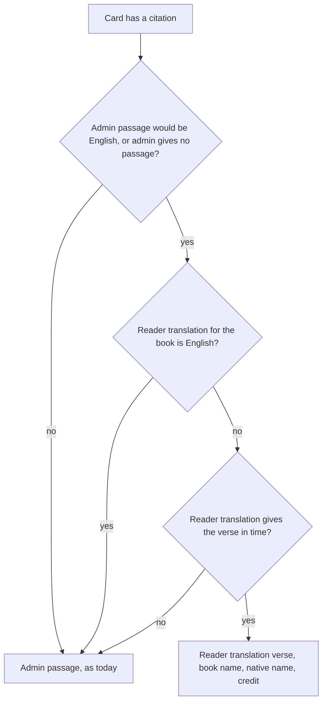
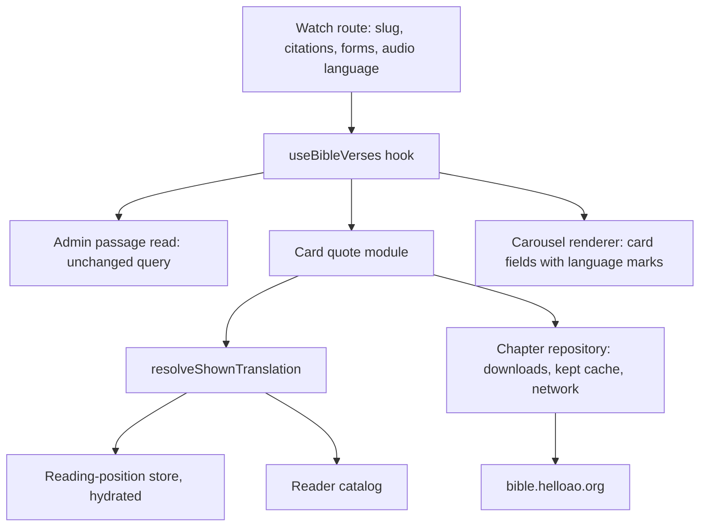
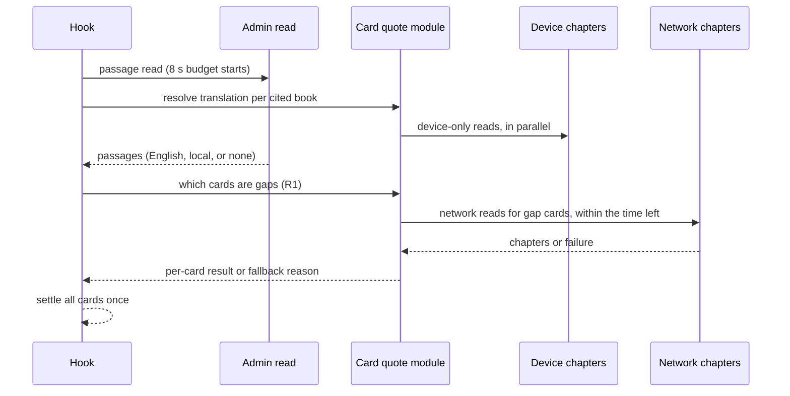
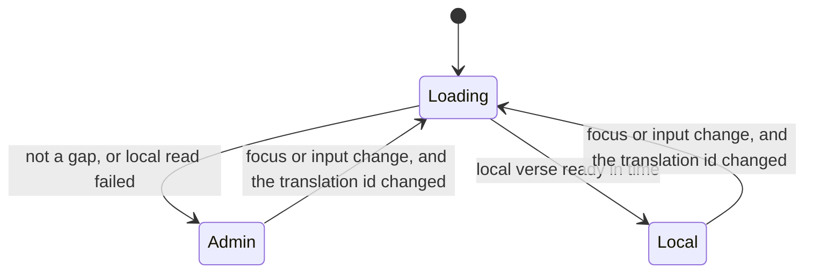

# Mobile Bible Quotes in the Reader's Translation - Plan

## Goal Capsule

- **Objective:** A viewer whose language has a Bible in the reader's catalog, but no Bible version in admin, reads the Bible quotes on a video's details page in that language: the verse, the reference, and the translation's name. Today that viewer reads them in English.
- **Means:** Where admin's passage for a card would be English, and the viewer's Bible reader translation is not English, the card takes the verse from that reader translation, through the reader's own translation choice and chapter loading (KTD1, KTD2).
- **Product authority:** Owner of `apps/mobile`. The only surface is the Bible quotes carousel on the watch (video details) page. Admin, web, TV, and the Experience-page carousel are not active scope.
- **Stop conditions:** Stop and ask if the work needs a change in `apps/admin`, `apps/web`, `apps/tv`, `packages/*`, or the admin passage query (`GET_VIDEO_BIBLE_PASSAGES`). Stop if it needs a new native module, a `package.json` script, or an `app.json` change, because each moves the fingerprint runtime version.
- **Execution profile:** JavaScript-only change in `apps/mobile`. It ships by over-the-air update, with no native build.
- **Who finishes:** `ce-work` implements and verifies. The owner reviews and merges the PR.
- **Open blockers:** None.

---

## Product Contract

**Product Contract preservation:** changed: R12 (the no-swap rule now covers the first load) and added R14, AE10, and AE11 — the owner's planning-time decision on a card whose translation changes while the screen stays open. Also changed: R8 (the screen-reader language applies on iOS only) and one Summary sentence, two review fixes that the owner approved.

### Summary

When admin would give a Bible quote card English text, but the viewer's Bible reader translation is in another language, the card shows the verse from that reader translation. The card then shows the verse, the reference with that translation's book name, and the translation's native name with its credit line. Admin's passage stays the source when the reader translation is English, and for every language that admin already serves. "Read full passage" opens the same translation that the card showed. The card reuses the reader's own translation choice and chapter loading, inside `apps/mobile`.

### Problem Frame

A viewer whose phone is set to Korean opens a video and sees its Bible quote card in English (BSB), while the rest of the screen is in Korean.

The card asks admin for a passage in the screen's language (`apps/mobile/src/hooks/useBibleVerses.ts`). Admin maps 37 language slugs, about 25 languages, to YouVersion versions, and it answers every other slug with its English fallback, version 3034, which is BSB (`apps/admin/src/services/scripture-passage.service.ts`). Korean, Japanese, Russian, Portuguese, and most of the app's 166 translated UI languages are not in that table. Since the UI translation run (feat-604), the card's verse is often the only English text on the screen.

The app already has a Bible in the viewer's language. The Bible reader picks a translation for each viewer from its catalog of free-use translations, for example `kor_old` ("한국어 성경", public domain) for a Korean phone. A tap on "Read full passage" opens that translation. So the card and the reader show the same verse in two different languages.

---

### Key Decisions

- **Fill only the English gaps; admin stays the source where it has a local version.** Keeps admin's licensed versions and changes nothing for the ~25 languages that admin serves. (session-settled: user-directed — chosen over the reader catalog for every language and over adding languages to admin's YouVersion table: the smallest change that fixes the gap, with no admin work.) Governs R1, R2.
- **The card follows the reader's own translation rules.** The card always matches what "Read full passage" opens. (session-settled: user-directed — chosen over the phone-language default only and over the app UI language default: the card and the reader must not disagree.) Governs R3, R4.
- **The card names the translation by its native full name.** Catalog short names are often codes, such as "OLD" for the Korean Bible and "BES" for the Spanish default. (session-settled: user-directed — chosen over the catalog short name and over the native name plus the short name: readable for the viewer, and less space on a small card.) Governs R7.
- **A card that cannot get its local verse shows today's English passage.** The card is never worse than it is today. (session-settled: user-directed — chosen over a reference-only card and over an all-English carousel: keeps the scripture, and keeps the local cards that did load.) Governs R10, R11.
- **A card with no admin passage counts as an English gap.** Offline, or after admin fails, the card cannot tell whether admin would answer in English. Counting it as a gap shows a downloaded Bible offline, and an app copy of admin's language list would drift from admin's table. Governs R1.
- **A card waits for its final text on the first load and does not swap.** A card that shows English and then changes language in front of the viewer reads as a fault. Governs R12.
- **A card updates when the viewer changes the translation.** A change that the viewer made is not a swap fault. (session-settled: user-directed — chosen over keeping the card until the next open and over opening the card's translation in the reader: the card and "Read full passage" always match.) Governs R12, R14.
- **This supersedes the decision "Scripture is English for this release"** in `docs/plans/2026-08-27-1237-fix-mobile-bible-quotes-passages-plan.md`. The app UI is now translated, and the shipped card already asks admin for the screen's language. Governs R1, R13.
- **The reader's default translation rule stays as it is.** That rule picks a complete Bible first, then the most verses, and not the most popular translation. A popularity list would also change the reader, so it is deferred (see Scope Boundaries).

---

### Requirements

**When a card uses the reader translation**

- R1. A card shows the reader translation only when admin's passage for that card would be English or admin gives the card no passage, and the reader translation for the cited book (per R3) is not an English translation.
- R2. In every other case the card shows admin's passage exactly as today, including for an English-UI viewer whose reader translation is English and for every language that admin answers with a local version.
- R3. The reader translation for a cited book is the translation that the Bible reader would show this viewer for that book, by the reader's existing rules. The viewer's translation comes first (the session switch, the saved pick, the audio-language default, the phone-language default, then BSB); when it lacks the book, the phone-language default takes its place, then BSB. The card adds no rule of its own.
- R4. On a card that shows the reader translation, "Read full passage" opens the reader at the first cited verse in that same translation.

**What a card shows from the reader translation**

- R5. The card shows the cited verse or verse range in that translation: the same verses that the reader shows for that reference.
- R6. The reference uses the translation's own book name, for example "요한복음 3:16". When the book names cannot load, the reference uses the English book name, as the reader does.
- R7. The translation label is the translation's native full name, for example "한국어 성경". The copyright line is the catalog's credit line, as the catalog writes it.
- R8. The verse, the reference, and the translation name show in the translation's language and writing direction, so a right-to-left Bible reads right to left. On iOS, a screen reader reads the text in that language; Android TalkBack keeps the UI language, because it cannot change the language for each element.
- R9. The card keeps its existing layout rules: the verse clamp with "Read full passage", the loading state, and the rule that scripture never renders without its credit.

**When the reader translation cannot give the verse**

- R10. A card shows what it shows today (admin's English passage, or the reference alone when admin gave no passage) when the reader translation cannot give it the verse: the translation lacks the cited verse, the phone is offline and the translation is not on the device, or the read does not finish within the card's existing loading time.
- R11. Each card makes this choice on its own, so one carousel can show local cards and English cards together.
- R12. On the first load, a card stays in its loading state until it can show its final text. It never shows English first and then replaces it with the local text.

**When the viewer changes the translation**

- R14. When the video screen is in focus again, or the viewer's dub pick changes, and a card's reader translation for its cited book has changed, that card loads again and shows the result for the new translation.

**Project documents**

- R13. The `CONCEPTS.md` entries "Bible Passage" and "Bible Reader", and the Bible quote card rule in `apps/mobile/CLAUDE.md`, change in the same work to say when a card shows reader catalog text in place of admin's passage.

The source choice for one card, as R1, R2, and R10 state it:

---

### Acceptance Examples

- AE1. Korean phone, reader default
  - **Covers R1, R3, R4, R5, R6, R7.**
  - **Given:** the phone language is Korean, the viewer made no pick in the reader, and the phone is online.
  - **When:** the viewer opens a video that cites John 3:16.
  - **Then:** the card shows "하나님이 세상을 이처럼 사랑하사 독생자를 주셨으니…", the reference "요한복음 3:16", the name "한국어 성경", and the credit "public domain". "Read full passage" opens the reader at John 3:16 in 한국어 성경.
- AE2. A language that admin serves
  - **Covers R2.**
  - **Given:** the app UI is Spanish, and admin returns a Spanish version for the citation.
  - **Then:** the card shows admin's Spanish passage, exactly as today.
- AE3. English viewer
  - **Covers R2.**
  - **Given:** the phone language is English, and the viewer made no non-English pick in the reader and picked no non-English dub.
  - **Then:** the card shows admin's English BSB passage, exactly as today.
- AE4. The translation lacks the book
  - **Covers R10, R11.**
  - **Given:** the phone language is Japanese, and the reader's Japanese default is a New Testament only translation.
  - **When:** the video cites Genesis 1:1 and Matthew 5:3.
  - **Then:** the Genesis card shows admin's English passage, and the Matthew card shows the Japanese verse.
- AE5. Offline, translation not on the device
  - **Covers R10, R12.**
  - **Given:** the phone language is Korean, the phone is offline, and the Korean Bible is not downloaded.
  - **Then:** each card behaves as it does today for an offline viewer. No card shows Korean text after it has shown English.
- AE6. Offline, translation downloaded
  - **Covers R1, R10.**
  - **Given:** the phone language is Korean, the phone is offline, admin's passage is not available, and the viewer downloaded the Korean Bible in the reader.
  - **Then:** the cards show the Korean verses.
- AE7. The viewer picked an English translation in the reader
  - **Covers R1, R3.**
  - **Given:** the phone language is Korean, and the viewer picked BSB in the reader.
  - **Then:** the card shows admin's English passage.
- AE8. A phone language with a Bible but no app UI
  - **Covers R1, R3, R8.**
  - **Given:** the phone language is Hausa, so the app UI is English, and the reader's Hausa default is `hau_bib`.
  - **Then:** the card shows the Hausa verse, its Hausa reference, and the translation's native name under the English card labels.
- AE9. A dub pick sets the reader translation
  - **Covers R1, R3, R4.**
  - **Given:** the phone language is English, the viewer picked a Spanish dub on an earlier video, and the viewer made no pick in the reader.
  - **Then:** the card shows the verse from the reader's Spanish default, with its Spanish reference and name. "Read full passage" opens the reader in that same Spanish translation.
- AE10. A book that the translation numbers differently
  - **Covers R5, R6.**
  - **Given:** the phone language is Russian, so the reader translation is the Russian Synodal Bible, and the video cites BSB Psalm 51:1.
  - **Then:** the card shows the Synodal text of that verse, and its reference shows the Synodal book name with chapter 50 and verse 3, as the reader shows it.
- AE11. The viewer changes the translation in the reader
  - **Covers R12, R14.**
  - **Given:** the phone language is Korean, and the card shows 한국어 성경.
  - **When:** the viewer taps "Read full passage", picks BSB in the reader, and goes back to the video.
  - **Then:** the card loads again and shows admin's English passage. Before the change, it did not swap.

---

### Scope Boundaries

- Deferred: a popularity list of default translations per language, for example a complete Japanese Bible in place of the New Testament only default. It would change the reader's defaults too.
- Deferred: a way to change a card's translation from the card itself.
- Not in scope: admin's YouVersion language table, `apps/web`, `apps/tv`, and the Bible quotes carousel on Experience pages.
- Not in scope: translating the catalog credit lines, which stay as the catalog writes them, as in the reader.
- Considered and not built: a reader route parameter that carries the card's translation. The reader computes the same translation from the same inputs (KTD2, KTD11), and a parameter would override a newer pick. Build it only if a device check shows a card and the reader disagree.
- Considered and not built: a second chapter repository for card reads. It would lose the shared single flight and cache with the reader; a source tag separates the telemetry (KTD10).
- Considered and not built: a limit on parallel network chapter reads for the cards. A carousel cites few chapters, the repository shares one read per chapter, and a limit would delay later cards inside the fixed budget. Add one if Datadog shows `bible.helloao.org` refusing parallel card reads.
- Considered and not built: a check of admin's fallback version id (3034) when the English passage is missing. Today's card has the same mislabel, and a version id is not a language table. Revisit if Datadog shows rejected English passages.
- Considered and not built: a script check for a phone language whose script differs from the catalog default (for example a Shahmukhi Punjabi phone, which gets the Gurmukhi default). The reader has the same behavior, so a fix belongs to the reader.

#### Deferred to Follow-Up Work

- A reader-side script match for the phone language (see the last item above).
- A `ce-compound` write-up of the Bible reader data layer, which has no `docs/solutions/` entry yet.

### Dependencies / Assumptions

- The reader's catalog and text sources stay as they are: free-use translations from `bible.helloao.org`, with credit lines from eBible.org's licence table, BSB inside the app, and other translations read per chapter or from a download. A card that shows a reader translation that is not downloaded reads one chapter over the network.
- The client can tell that admin answered with English: admin's English fallback uses the same version id as the English passage, and the card already labels such a passage English. When admin gives no passage (offline, a failed read, its time limit, or its failure cooldown), there is nothing to compare, so R1 counts that card as a gap.
- Assumption: Korean viewers accept the wording of `kor_old`. Its John 3:16 matches the traditional Korean church wording.

### Sources / Research

- `apps/admin/src/services/scripture-passage.service.ts`: the 37-slug YouVersion table and the English fallback version 3034.
- `apps/mobile/src/hooks/useBibleVerses.ts` and `apps/mobile/src/lib/queries.ts`: the passage read in the screen's language plus English, and the English label rule.
- `apps/mobile/src/lib/bible/language/defaultTranslation.ts`: the reader's translation rules.
- `apps/mobile/src/lib/bible/data/languageDefaults.generated.ts` and `apps/mobile/src/lib/bible/data/sources.lock.json`: the default translation per language, with names, books, and licence rows.
- `apps/mobile/src/lib/bible/repository/bookNames.ts`: book names per translation.
- `apps/mobile/src/lib/bibleCardFit.ts`: the card's line caps and its never-uncredited fit rule.
- `docs/plans/2026-08-27-1237-fix-mobile-bible-quotes-passages-plan.md`: the card's current Product Contract.
- `docs/plans/2026-09-24-1251-feat-mobile-native-bible-reader-plan.md`: the reader's Product Contract (translation choice, credit lines, offline).
- `CONCEPTS.md`: "Bible Passage" and "Bible Reader".

---

## Planning Contract

### Key Technical Decisions

- KTD1. **A pure async module computes each card's local quote, and the hook only orchestrates.** The module takes injected services (catalog, reading-position store, chapter repository, phone language, audio language) and never rejects. This is the `ReaderServices` seam that `apps/mobile/src/lib/bible/reader/useReaderChapter.ts` already uses, so tests can drive it without React. Governs R1, R3, R5.
- KTD2. **The card resolves its translation with the reader's own `resolveShownTranslation`, with `offline: false`, after it awaits the position store's hydrate and the downloads check.** The same function and the same inputs give the same translation that the reader opens. The reader starts with `offline: false`, and before hydrate the saved pick is unknown. (session-settled: user-directed — chosen over the phone-language default only and over the app UI language default: the card and the reader must not disagree.) Governs R3, R4.
- KTD3. **The route passes the audio language and its readiness into `useBibleVerses` as arguments.** `useWatchPreferences()` throws outside its provider, and the hook's test harness has no provider. The route already threads `art` and `forms` the same way.
- KTD4. **One loading budget per open, with the network read held until admin answers.** The budget is the existing `PASSAGE_FETCH_DEADLINE_MS` (8 s), from the start of the read, shared by admin's read and the local reads:
  1. Device-only reads (a downloaded book, a fresh kept chapter) start at once, in parallel with admin's read.
  2. A network chapter read starts only after admin settles, only for a card that R1 makes local, and only within the time that is left.

  Viewers whose language admin serves then download no chapters that they will not see. Governs R10, R12.

- KTD5. **The cooldown and cache path runs the device-only reads and never a network read.** Today that path settles at once from the Apollo cache. The card now stays in loading until the device-only reads settle, so a downloaded Bible shows on a re-entry (AE6). Governs R10, R12.
- KTD6. **Verse selection rules, the same as the reader's numbering.**
  1. Convert the cited start and end with `toTranslationRef`. Each end must be exact: the round trip through `toBsbRef` returns the cited verse, and the translation chapter has a verse stop (not a gap) at that number. Otherwise the card shows today's card.
  2. Inside the range, show the verse stops that exist. A merged verse (`through`) is labeled by the numbers it covers.
  3. A whole-chapter citation starts at the translation chapter's first verse stop.
  4. Read at most 2 translation chapters; a longer quote shows today's card.
  5. When `citationReaderStart` is not the cited verse (BSB lacks it), show today's card, because the reader would open elsewhere.
  6. The reference uses the translation's chapter and verse numbers and the book name from the loaded chapter's header (`ChapterText.bookName`), which already falls back to the English name. No `books.json` read is needed.

  Governs R5, R6, R10.

- KTD7. **Each card region carries explicit language marks from the catalog, not from `isRtlTag`.** Catalog languages are ISO 639-3 codes (`arb`, `heb`, `pes`, `urd`), which `isRtlTag` reads as left to right.
  1. The verse, the reference, and the name use the catalog's `textDirection`.
  2. The screen-reader language maps the catalog's ISO 639-3 code to the shortest BCP-47 tag (`kor` to `ko`, `arb` to `ar`). It applies on iOS only; Android TalkBack cannot switch voice for each element.
  3. The credit keeps `en` with the UI direction, as the reader's footer does (`BIBLE_NOTICE_LANGUAGE`).
  4. The reference is upper-cased with the verse language's tag (`toLocaleUpperCase`), so a Turkish "İ" stays correct.

  Governs R7, R8.

- KTD8. **The position store reports whether its hydrate reached storage.** On a hydrate timeout, the card treats the reader translation as unknown and shows today's card for that open. Otherwise a timeout gives the card a default while the reader later shows the saved pick (AE7). Governs R3, R4.
- KTD9. **Local results key on the citation's content, not on the slug alone.** The key is the document id plus the book, the chapters, and the verses. The route republishes partial citations whose book can still be null. A card whose book is null while the watch payload is unsettled stays loading. Governs R11, R12.
- KTD10. **One chapter repository, with a `quote` source tag on card read failures, and one card event per settle.** The shared repository keeps one flight per chapter and fills the reader's cache, so "Read full passage" opens faster. The tag marks card traffic inside the reader's `bible_reader.chapter_fetch_failed` series, so dashboards filter on the source. The event `bible_quotes.reader_translation` records, per settle, how many cards showed a reader translation and a count for each fallback reason. These values go in an inline context object, as in `bible_passages.degraded`, and not in the message. The reserved-attribute guard in `apps/mobile/CLAUDE.md` reads only inline contexts. Governs R10.
- KTD11. **The card resolves again when the screen gains focus and when the reader inputs change.** The inputs are the dub pick, its late iso3 backfill, and the position store. Only a card whose resolved translation id changed goes back to loading and reads again, so the other cards keep their text. A re-resolve starts its own `PASSAGE_FETCH_DEADLINE_MS` budget. Admin's passages have already settled, so the changed cards start their reads at once, under the network rules of KTD4 and KTD5. A changed card that misses this budget falls back per R10. (session-settled: user-directed — chosen over keeping the card until the next open and over opening the card's translation in the reader: the card and "Read full passage" always match.) Governs R12, R14.
- KTD12. **"Read full passage" keeps today's route, with no translation parameter.** The reader recomputes the same translation from the same inputs (KTD2, KTD11). A guard test pins that the card's module and the reader both call `resolveShownTranslation`. Governs R4.
- KTD13. **A long name or credit truncates at its 2-line cap, and a verse dropped by the fit rule does not trigger a fallback.** `fitPassageCardRegions` reserves fixed lines per region, so only card width and text size drop a verse, as on admin's cards today. Governs R9.

### High-Level Technical Design

Where the parts sit. The route feeds the hook, the hook asks admin and the new module in parallel, and the module reuses the reader's services:

One open, with the shared budget (KTD4, KTD5):

The state of one card (R12, R14):

### Deferred to Implementation

- The exact names of the new module, its result type, and the repository's device-only read (an option on `resolve` or a separate method).
- The source of the ISO 639-3 to BCP-47 table: an inverse of `ISO_639_1_TO_639_3` plus the individual-to-macrolanguage codes in `apps/mobile/src/lib/bible/language/phoneLanguage.ts`.
- How the route detects focus (`useIsFocused` from expo-router is the existing pattern in `apps/mobile/app/(tabs)/watch.tsx` and `BibleReader.tsx`).
- Whether the catalog parse can be skipped when the inputs already resolve to BSB, if the load-time check in the Verification Contract shows a cost.

### System-Wide Impact

- **Reader cache and flights:** card reads fill the reader's 30 MB kept-chapter cache and share its in-flight reads. This is intended, and it makes "Read full passage" faster.
- **Telemetry:** card read failures now carry a `quote` source tag, so dashboards on `bible_reader.chapter_fetch_failed` must filter by source.
- **Position store:** a new hydrate-outcome field is additive; the reader ignores it.
- **Watch page load:** every viewer now waits for the hydrate and the catalog before the cards settle, and gap viewers add chapter reads. The page load check in the Verification Contract covers it.

### Risks & Dependencies

- `bible.helloao.org` availability: an outage makes gap cards fall back to today's card (R10). It does not block playback, because the read stays a companion read.
- Tall scripts (Myanmar, Thai, Devanagari) use the Latin verse line height and can clip. The device check covers one tall script.
- Datadog volume: one settle event per open, plus tagged failures.

---

## Implementation Units

### U1. Reader data seams for card reads

**Goal:** Give a caller outside the reader a device-only chapter read, a tagged read-failure report, and the hydrate outcome.

**Requirements:** R3, R10; KTD4, KTD5, KTD8, KTD10.

**Dependencies:** None.

**Files:**

- `apps/mobile/src/lib/bible/repository/resolveChapter.ts`
- `apps/mobile/src/lib/bible/repository/downloadRuntime.ts`
- `apps/mobile/src/lib/bible/telemetry.ts`
- `apps/mobile/src/lib/bible/position/store.ts`
- `apps/mobile/src/lib/bible/repository/__tests__/resolveChapter.test.ts`
- `apps/mobile/src/lib/bible/__tests__/telemetry.test.ts`
- `apps/mobile/src/lib/bible/__tests__/positionStore.test.ts`

**Approach:**

1. Add a device-only read to the repository: bundled BSB, a downloaded book, or a fresh kept chapter, and never the network. It keeps the never-reject result shape.
2. Let a caller pass a source tag into the fetch-failure report, and keep the reader's default untagged.
3. Add a hydrate-outcome field to the position-store snapshot: storage reached, or timed out.

**Patterns to follow:** the `read()` source order in `resolveChapter.ts`; `withFetchFailureReport` in `telemetry.ts`; the hydrate timeout in `position/store.ts`.

**Test scenarios:**

- A device-only read of a downloaded book returns the chapter with source `downloaded`.
- A device-only read of a chapter that is only on the network returns a failure, and the fetch stub is never called.
- A device-only read returns a fresh kept chapter, and treats a stale kept chapter as a failure.
- A tagged read failure logs its event with the `quote` source; an untagged reader read logs as today.
- A hydrate that reads storage reports "reached"; a hydrate that hits the timeout reports "timed out", with the same snapshot fields as today otherwise.

**Verification:** The three tests pass. The reader's existing repository, telemetry, and position-store suites pass unchanged.

### U2. Card quote module

**Goal:** For each citation, compute the reader translation for its book and, when it applies, the card's local verse, reference, name, credit, and language marks, or a fallback reason.

**Requirements:** R1, R3, R5, R6, R7, R8, R10; KTD1, KTD2, KTD6, KTD7, KTD8, KTD9.

**Dependencies:** U1.

**Files:**

- `apps/mobile/src/lib/bible/quotes/cardQuote.ts` (new)
- `apps/mobile/src/lib/bible/quotes/__tests__/cardQuote.test.ts` (new)
- `apps/mobile/src/lib/bible/language/phoneLanguage.ts` (ISO 639-3 to BCP-47 helper)
- `apps/mobile/src/lib/bible/__tests__/catalogLanguageTag.test.ts` (new)

**Approach:**

1. Resolve per distinct cited book with `resolveShownTranslation` (`offline: false`) after the hydrate and the downloads check (KTD2). A timed-out hydrate gives "unknown", and the card falls back (KTD8).
2. Return "admin" for an English translation, so the hook keeps today's card (R1).
3. For a non-English translation, plan the chapter reads by KTD6. Expose a device-only phase and a network phase, so the hook can apply KTD4 and KTD5.
4. Select the verses and build the reference from the chapter header's book name and the translation's numbers (KTD6). Return the native name, the credit, the `textDirection`, and the screen-reader tag (KTD7).
5. Key each result by the citation content (KTD9).

**Execution note:** Start from failing tests on the real bundled catalog and the existing chapter fixtures, as `defaultTranslation.test.ts` does.

**Patterns to follow:** `makeServices` and the fixtures in `apps/mobile/src/lib/bible/reader/__tests__/useReaderChapter.test.tsx`; `chapterPositions` and `verseThrough` in `apps/mobile/src/lib/bible/text/positions.ts`; `formatCitationLabel` in `apps/mobile/src/lib/citationFormat.ts`.

**Test scenarios:**

- Covers AE1. A Korean phone with no saved pick resolves `kor_old` for John 3:16, and the result carries the John 3:16 text, the reference "요한복음 3:16", the name "한국어 성경", the credit "public domain", direction `ltr`, and tag `ko`.
- Covers AE7. A Korean phone with a saved BSB pick returns "admin".
- Covers AE9. An English phone with Spanish as the audio language resolves the Spanish default.
- Covers AE4. A Japanese phone returns "admin" for Genesis 1:1 (the default lacks the book and so does the phone default, so BSB) and a local result for Matthew 5:3.
- A viewer pick that lacks the book uses the phone-language default when that has the book (R3).
- Covers AE10. A Russian phone resolves BSB Psalm 51:1 to Synodal Psalm 50:3, and the reference shows chapter 50 and verse 3 (fixture `rus_syn-psa-50.json`).
- A range shows every verse stop between its ends, and a merged verse is labeled by the numbers it covers (fixture `eng_t4t-jhn-4.json`).
- A range whose end has no exact counterpart gives a fallback.
- A quote that needs more than 2 translation chapters gives a fallback.
- An Arabic translation result carries direction `rtl` and tag `ar` (fixture `arb_vdv-jhn-3.json`).
- A hydrate timeout gives "unknown", and the card falls back.
- A citation whose book is still null returns "pending", not a fallback.
- The ISO 639-3 to BCP-47 helper maps `kor` to `ko`, `arb` to `ar`, `cmn` to `zh`, and `pes` to `fa`, and it returns the code unchanged when it has no shorter form.

**Verification:** The module and the helper tests pass. The module never rejects, including on a thrown service.

### U3. Card renderer language marks

**Goal:** Render a local card with the right direction and language for each region.

**Requirements:** R6, R7, R8, R9; KTD7, KTD13.

**Dependencies:** None.

**Files:**

- `apps/mobile/src/components/sections/BibleQuotesCarouselRenderer.tsx`
- `apps/mobile/src/hooks/useBibleVerses.ts` (the `BibleQuoteBlock` type fields only)
- `apps/mobile/src/components/sections/__tests__/BibleQuotesCarouselRenderer.test.tsx`

**Approach:**

1. Add the new card fields to both `BibleQuoteBlock` and the renderer's quote item, because the two meet through an untyped index signature.
2. Apply the explicit direction to the verse, the reference, and the name; give the credit the `en` mark and the UI direction; set the card's screen-reader language from the new tag (KTD7).
3. Upper-case the reference with the verse language's tag.
4. Keep every existing field and the fit rule unchanged for admin cards.

**Patterns to follow:** the language table in the renderer test (`it.each` over UI tag, text language, marks, and direction); `ReaderFooter.tsx` for the English credit mark.

**Test scenarios:**

- A Korean local card on a Korean UI has `ltr` on the verse, the reference, and the name, and screen-reader language `ko`.
- An Arabic local card on an English UI has `rtl` on the verse, the reference, and the name, `ltr` on the credit, and screen-reader language `ar`.
- A Turkish local card upper-cases "İşleri" with a dotted capital İ.
- A local card with a 140-character name and a 121-character credit keeps both at 2 lines and does not drop the verse at the default size.
- Admin cards render exactly as today: the existing language table passes unchanged.

**Verification:** The renderer suite passes, and the new cases fail when the explicit direction is removed.

### U4. Hook integration and route wiring

**Goal:** Choose each card's source, keep one loading budget, settle once, and resolve again on focus and on input change.

**Requirements:** R1, R2, R4, R10, R11, R12, R14; KTD3, KTD4, KTD5, KTD9, KTD10, KTD11, KTD12.

**Dependencies:** U1, U2, U3.

**Files:**

- `apps/mobile/src/hooks/useBibleVerses.ts`
- `apps/mobile/app/watch/[slug].tsx`
- `apps/mobile/src/hooks/__tests__/useBibleVerses.test.tsx`
- `apps/mobile/app/watch/__tests__/bibleQuotesReader.guard.test.js`

**Approach:**

1. The route passes the audio language and its readiness into the hook (KTD3).
2. On each open, start admin's read and the module's device-only phase together; after admin settles, run the network phase for the gap cards, within the shared budget (KTD4).
3. Run the device-only phase on the cooldown and cache path too (KTD5).
4. Settle all cards once, after both phases or the deadline (R12). Each card takes its local result, or keeps today's card (R10, R11).
5. On focus and on an input change, resolve again with a new budget, and put only the cards whose translation id changed back into loading (KTD11).
6. Log the settle event (KTD10).

**Execution note:** Keep the existing `<StrictMode>` harness for every new case; it is the only detector for a re-arm bug in the effect.

**Patterns to follow:** the deadline, cooldown, and superseded-video describes in `useBibleVerses.test.tsx`; the injected `art` and `forms` arguments; `useIsFocused` in `apps/mobile/app/(tabs)/watch.tsx` and `apps/mobile/src/components/bible/BibleReader.tsx`.

**Test scenarios:**

- Covers AE1. A Korean UI with admin's English fallback and a module result for John 3:16 settles one local card.
- Covers AE2. A Spanish UI with admin's Spanish passage settles admin's card, and no network chapter read starts.
- Covers AE3. An English UI with an English reader translation settles today's cards, and no chapter read starts.
- Covers AE5, AE6. On the cooldown path, a downloaded Korean Bible settles local cards, and a missing one settles today's cards; no network read starts.
- Covers AE11. After a focus event with a changed translation id, only that card returns to loading and then settles to the new result; the other cards keep their text.
- After a focus event that changes a card to a non-English translation that is not on the device, that card's network read gets a new budget, and the card settles to the local verse.
- A network chapter read that is still running at the deadline settles that card as today's card, and its later answer does not change the card.
- The cards never show English and then local text on the first load: every card stays loading until the single settle.
- A route change to another video discards the old video's local results.
- A partial citation list with a null book keeps that card loading until the payload settles.
- The guard test pins that the route passes the audio language, and that the card module and the reader both call `resolveShownTranslation` (KTD12).

**Verification:** The hook suite passes under StrictMode, including the existing deadline, cooldown, and art cases. The guard test fails if either call site stops using the shared resolver.

### U5. Documents and roadmap

**Goal:** Record the new card behavior where agents and people look for it.

**Requirements:** R13.

**Dependencies:** U4.

**Files:**

- `CONCEPTS.md`
- `apps/mobile/CLAUDE.md`
- `docs/roadmap/platform/feat-NNN-mobile-bible-quotes-reader-translation.md` (new; take the next free ID after a scan of all origin branches)

**Approach:**

1. Update "Bible Passage" and "Bible Reader" in `CONCEPTS.md`: a quote card can show reader catalog text when admin would show English.
2. Update the Bible quote card rule in `apps/mobile/CLAUDE.md`, and add the card's reuse of the reader resolver to the Bible reader section.
3. Add the roadmap ticket with this plan as its source, status `in-progress`.

**Test expectation:** none — documentation only. Run Prettier on the edited markdown.

**Verification:** `npx prettier --check` passes on each edited markdown file, and the roadmap ticket's frontmatter has every required field.

---

## Verification Contract

| Check               | Command or method                                                                                                                                                                                                                                                                                           | Proves                                                                                   |
| ------------------- | ----------------------------------------------------------------------------------------------------------------------------------------------------------------------------------------------------------------------------------------------------------------------------------------------------------- | ---------------------------------------------------------------------------------------- |
| Unit and hook tests | `pnpm --filter @forge/mobile test`                                                                                                                                                                                                                                                                          | U1 to U4 scenarios and every existing suite                                              |
| Types               | `pnpm --filter @forge/mobile typecheck`                                                                                                                                                                                                                                                                     | The two-sided card type stays in step                                                    |
| Lint                | `pnpm --filter @forge/mobile lint`                                                                                                                                                                                                                                                                          | The package rules, which differ from the root hook                                       |
| Markdown format     | `npx prettier --check` on each edited `.md` file                                                                                                                                                                                                                                                            | CI's `format` job                                                                        |
| Device check        | iOS simulator: phone language Korean (AE1, AE11), Russian (AE10), Persian (a local right-to-left card, `pes_pbs`), Burmese (a local tall-script card, `mya_jvb`), and Hausa (AE8); one offline run with the Korean Bible downloaded (AE6). Admin has no Persian or Burmese version, so both cards are local | The real card, its marks, and "Read full passage", by screenshot                         |
| Page load           | Same device, `main` against the branch: the video's time to first frame and the time for the cards to settle, for an English viewer and for a Korean viewer                                                                                                                                                 | No regression in time to first frame beyond the ±0.5 s noise band of warm deep-link runs |

---

## Definition of Done

- Every requirement R1 to R14 and every example AE1 to AE11 is covered by a test or by the device check.
- The verification table passes, with device screenshots and the page-load numbers recorded in the PR.
- `CONCEPTS.md`, `apps/mobile/CLAUDE.md`, and the roadmap ticket are updated (U5).
- No `apps/admin`, `apps/web`, `apps/tv`, `packages/*`, `app.json`, or `package.json` change is in the diff.
- No code from abandoned approaches stays in the diff.
