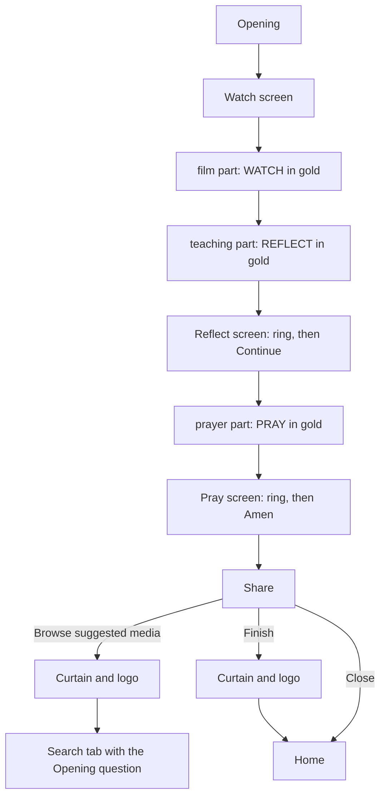
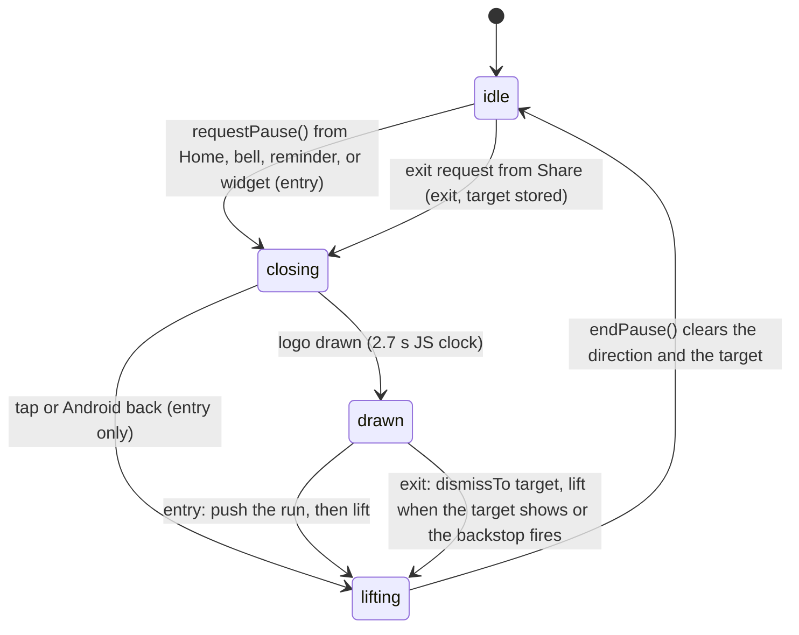
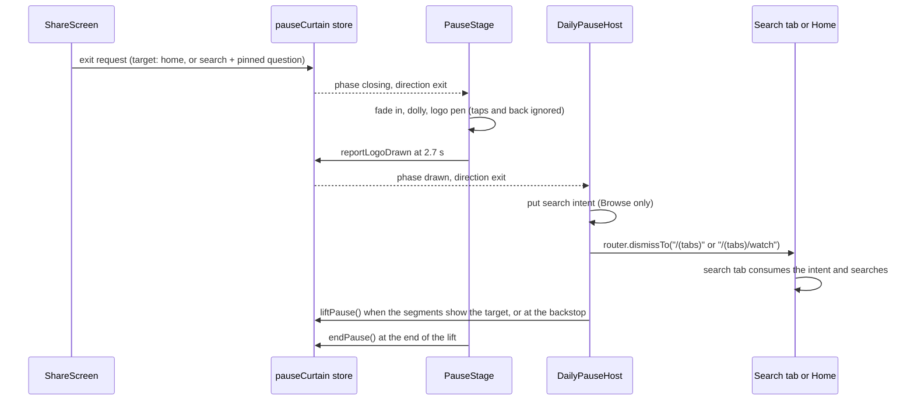

# Daily Bible Pause v2 Screens - Plan

## Goal Capsule

- **Objective:** In a Daily Bible Pause run on mobile, the viewer always sees the current section. Reflect and Pray count down the same way. Share gives the viewer a clear next step: suggested media or Home.
- **Means:** Changes to the existing run on branch `Ur-imazing/pause-devo-feature-v2`: a replayable stepper clock (KTD1), Pray's countdown shared with Reflect (KTD3), a marker row drawn by the run (KTD4), and a second direction of the opening curtain (KTD5). This plan extends `docs/plans/2026-10-02-1318-feat-daily-bible-pause-flow-plan.md` and changes some of its requirements (see Dependencies / Assumptions).
- **Product authority:** The mobile owner decides scope. The design source is the Figma frame "v2" (file `0x3kAiEt7C7kSHpg0f4wiD`, node `390:356`). The v2 step order, the light and gradient passes, the podcast path, and the ideas in the Figma notes are not active scope.
- **Authority hierarchy:** The Product Contract decides behavior. A Key Technical Decision decides mechanism inside the requirements it cites. A unit overrides neither. An item under Assumptions is an unconfirmed bet: build it as written, and report it in the PR.
- **Stop conditions:** Stop and report when any of these occurs:
  - `router.dismissTo("/(tabs)/watch")` does not select the search tab on a simulator, and the fallback in KTD5 does not select it either.
  - The restored shared countdown changes Pray's visible behavior (R13).
  - Evidence shows that a session-settled Key Decision cannot work.
- **Execution profile:** `ce-work` builds the units in order inside an `lfg` run. Jest proves the logic, and simulator checks prove the motion and navigation (Verification Contract).
- **Who finishes:** `lfg` opens a pull request against `Ur-imazing/pause-devo-feature`, not `main`. The owner merges.
- **Open blockers:** None.

---

## Product Contract

### Summary

The run keeps its current step order. Each video part shows the WATCH, REFLECT, and PRAY markers across the top, with its own section in gold. The stepper pills share one width, and a tap on any pill plays the screen's arrival animation again. Reflect gets the countdown ring that Pray already has. Share gets "Browse suggested media" and "Finish", and both leave through the curtain-and-logo transition that opens the devotional.

### Problem Frame

The branch follows the Figma "Pass 2 · Dark, pill stepper" design (R23 of the 2026-10-02 plan). The owner's v2 design changes what the viewer sees in four places.

During a video part, the app shows no stepper (R12 of the 2026-10-02 plan). A viewer in the middle of the run cannot see which section a video belongs to.

Reflect and Pray count their pauses down in different ways. Pray shows a ring, and Amen stays grey until the ring ends. Reflect shows a clock inside its button.

On Share, the close is the only way out (R22 of the 2026-10-02 plan). It goes to Home with no next step, and nothing points the viewer to more media on the same theme.

The stepper pills size to their labels, so the stack has three widths. The pills take no tap, so a viewer cannot see the arrival animation again.

On 2026-10-08 the branch had tappable pills (`f29eb9393`) and a Reflect ring (`87682f435`). The owner reverted both on 2026-10-09 (`5317c3069`). Those pill taps opened sections. The pill taps in this plan only play an animation.

### Key Decisions

- **Keep the current step order.** The v2 board shows each section screen before its video, but the Reflect video must play before the Reflect verse screen. Governs R1. (session-settled: user-directed — chosen over the v2 board order and over a mix with the v2 order for Pray only: the teaching part ends on the verse that the Reflect screen holds, so it plays first, as it does today.)
- **Each video part shows the section it belongs to.** The film part is Watch, the teaching part is Reflect, and the prayer part is Pray, as `CONCEPTS.md` pairs each section with a video part and a screen. Governs R3. (session-settled: user-approved — chosen over showing the section of the last stepper screen, which would show no video as PRAY.)
- **A pill tap plays the current screen's arrival, whichever pill the viewer taps.** Governs R7, R8. (session-settled: user-directed — chosen over playing the tapped pill's own arrival and over playing the whole path from the top node, after a sketch of all three.)
- **"Browse suggested media" searches for the Opening question.** It is the text the viewer saw first. Governs R16. (session-settled: user-directed — chosen over the passage, the short name, and a new authored title.)
- **Reflect takes Pray's countdown.** One behavior for both pauses. Pray's ring, fade, and grey button are already on the branch. Governs R11, R12, R13.
- **The exit plays the full opening sequence, logo included.** The owner asked for the same transition. It takes about 4 seconds. Governs R18.
- **The markers are labels, not controls.** A tap on a video keeps its one job: pause or resume. Governs R4.
- **The close (×) keeps its instant exit.** Only the two new buttons get the transition. Governs R19.
- **A tap on the exit curtain does not cancel the exit.** The viewer already chose to leave, so the opening's tap-to-cancel does not apply here. Governs R18.

### Requirements

**Video markers**

- R1. The run keeps its current step order: Opening, Watch screen, film part, teaching part, Reflect screen, prayer part, Pray screen, Share.
- R2. Each video part shows WATCH, REFLECT, and PRAY in one row at the top of the screen, as the v2 "Video" frames show.
- R3. The marker of the part's own section shows in gold, and the other two markers show as plain labels: WATCH on the film part, REFLECT on the teaching part, PRAY on the prayer part.
- R4. The markers take no tap of their own. A tap on a marker pauses or resumes the video, as a tap anywhere on the video does today.
- R5. The markers, the close (×), and the progress bar stay clear of the captions and the gold ring in the video (R24 of the 2026-10-02 plan), and the close keeps a 44 pt target.

**Stepper pills**

- R6. The three stepper pills on the Watch, Reflect, and Pray screens have one shared width in every state (upcoming, current, done). The width fits the widest label in its largest state.
- R7. A tap on any stepper pill plays the current screen's arrival again: the line draws to the current pill, and the pill lights up. A tap while the arrival plays starts it again from the beginning.
- R8. A pill tap changes only the animation. The step, the countdown, and the screen's intro do not change.
- R9. With Reduce Motion on, a pill tap shows the end state at once, as the arrival does today.
- R10. Each pill is a labelled button with a target of at least 44 pt, and its label keeps the pill's state ("Reflect, current step").

**Reflect and Pray countdown**

- R11. The Reflect screen shows a circular countdown ring in place of the clock inside its button, as the Pray screen does today. The ring counts the same length as the clock does today, which the 1, 3, or 5 min meditation setting controls.
- R12. While the ring counts, Continue on Reflect and Amen on Pray show grey and take no tap.
- R13. When the ring reaches zero, the ring and its count fade out, and then the button fades to cream and takes taps. Reflect uses the timing that Pray uses today.
- R14. The Reflect screen follows the v2 "Transition · Reflect" frame: the stepper at the top, the ring below it, then the verse, its reference, and "We'll give you some time." The quote mark goes away.
- R15. Continue stays at the bottom of the Reflect screen, although the v2 frame shows no button there.

**Share exits**

- R16. "Browse suggested media" opens the search tab with today's Opening question in the search bar, and the search runs at once, as a tap on a browse topic does. The question replaces any earlier query in the bar.
- R17. "Finish" returns the viewer to Home.
- R18. Both buttons leave the run through the curtain-and-logo transition that opens the devotional (R1 of the 2026-10-02 plan): the curtain closes over Share, the logo draws, and the curtain lifts over the search tab or Home. A tap on the curtain does not stop the exit.
- R19. The close (×) on Share keeps its instant exit to Home, and Android back keeps closing the run as it does today.
- R20. Share shows three buttons, from top to bottom: "Share this video", "Browse suggested media", and "Finish". "Share this video" keeps its current behavior.

### Key Flows

- F1. A video part with markers
  - **Trigger:** The run reaches the film, teaching, or prayer part.
  - **Steps:** The part plays full screen. The marker row shows the part's section in gold. A tap anywhere pauses or resumes the part.
  - **Outcome:** The part ends, and the run moves to the next step.
  - **Covered by:** R2, R3, R4, R5
- F2. A pill tap
  - **Trigger:** The viewer taps any pill on the Watch, Reflect, or Pray screen.
  - **Steps:** The current screen's arrival plays again. The countdown, if one runs, continues without a change.
  - **Outcome:** The stepper shows the same state as before the tap.
  - **Covered by:** R7, R8, R9
- F3. The end of a countdown
  - **Trigger:** The ring on Reflect or Pray reaches zero.
  - **Steps:** The ring and its count fade out. The grey button fades to cream.
  - **Outcome:** A tap on Continue or Amen moves the run to the next step.
  - **Covered by:** R11, R12, R13
- F4. Browse suggested media
  - **Trigger:** The viewer taps "Browse suggested media" on Share.
  - **Steps:** The curtain closes over Share, and the logo draws. Under the curtain, the run closes, the search tab opens with the Opening question in the bar, and the search starts. The curtain lifts.
  - **Outcome:** The viewer sees the search tab with the question and its results.
  - **Covered by:** R16, R18
- F5. Finish
  - **Trigger:** The viewer taps "Finish" on Share.
  - **Steps:** The curtain closes over Share, and the logo draws. Under the curtain, the run closes to Home. The curtain lifts.
  - **Outcome:** The viewer sees Home.
  - **Covered by:** R17, R18

### Acceptance Examples

- AE1. **Covers R3.** Given the run is in the teaching part, when the video plays, then REFLECT shows in gold, and WATCH and PRAY show as plain labels.
- AE2. **Covers R7, R8.** Given the Reflect ring shows 20, when the viewer taps WATCH, then the line to REFLECT draws again and REFLECT lights up, and the ring keeps counting from 20 with Continue still grey.
- AE3. **Covers R7.** Given the Watch screen, when the viewer taps PRAY, then the top node, the line, and WATCH play their arrival again, and PRAY stays upcoming.
- AE4. **Covers R9.** Given Reduce Motion is on, when the viewer taps a pill, then the stepper shows its end state with no animation.
- AE5. **Covers R12, R13.** Given the Pray ring counts, when the viewer taps Amen, then nothing happens. When the ring reaches zero, the ring fades out, Amen turns from grey to cream, and a tap on Amen moves the run to Share.
- AE6. **Covers R16, R18.** Given today's devotional is Pharisee, when the viewer taps "Browse suggested media", then the curtain closes, the logo draws, and the curtain lifts on the search tab with "How are we commanded to pray?" in the bar.
- AE7. **Covers R16.** Given the search tab held the earlier query "Jesus", when "Browse suggested media" opens it, then the bar shows the Opening question and not "Jesus".
- AE8. **Covers R18.** Given the exit curtain is closing, when the viewer taps it, then the exit continues to its end.
- AE9. **Covers R19.** Given the Share screen, when the viewer taps the close (×), then Home shows at once with no curtain.

### Success Criteria

- The owner checks the run on an iPhone and finds that each changed screen matches its v2 frame, except where R1 and R15 say otherwise.
- The owner finds that the exit transition looks the same as the opening transition.

### Scope Boundaries

- The run does not take the v2 board's step order (per R1).
- A pill tap does not open a section, skip a video, or skip a countdown (per R8). The reverted behavior of `f29eb9393` stays reverted.
- The close (×) gets no transition (per R19).
- Search results for a question-shaped query are not tuned. A curated list of suggested media for each devotional is deferred.
- The new button labels are English-only, like the rest of the Daily Bible Pause. Localization stays the owned open debt that the copy guard records.
- The light and gradient passes, the podcast path, and the ideas in the Figma notes (a home screen widget design, an evangelism card, note taking) are out of scope.

### Dependencies / Assumptions

- This plan changes three requirements of `docs/plans/2026-10-02-1318-feat-daily-bible-pause-flow-plan.md`. R12 ("no stepper" on a video part) gives way to R2. R22 ("the close is the only way to leave Share") gives way to R16 to R19. R23 (every screen follows Pass 2) gives way to the v2 frames for the screens that this plan changes. R10's step order does not change (R1).
- The search tab keeps its query as local state today. No route parameter or deep link fills the search bar (`apps/mobile/app/(tabs)/watch.tsx`).
- The devotional data has no title field. The Opening question is the `question` field (`apps/mobile/src/lib/dailyPause/devotionals.ts`).
- The copy guard exempts each Daily Bible Pause file by name (`apps/mobile/src/i18n/__tests__/noHardcodedCopy.guard.test.js`). A new file with English text needs its own entry.
- Assumption: the exit takes about 4 seconds. The opening reports the logo drawn at 2.7 s, and its lift takes 1.1 s (`apps/mobile/src/components/PauseStage.tsx`).

### Outstanding Questions

**Resolve Before Planning**

- None.

**Deferred to Planning**

- How the search tab receives the question from the run: answered by KTD6.
- Whether to restore the shared countdown component from the reverted commit `87682f435` or to build it again: answered by KTD3.
- How the exit uses the curtain store: answered by KTD5.
- Where the marker row, the close, and the progress bar sit on a phone with a thin letterbox, within R5: answered by KTD4 and Assumptions.

### Sources / Research

- `docs/plans/2026-10-02-1318-feat-daily-bible-pause-flow-plan.md`: R10, R12, R14, R16, R17, R21 to R24, KTD5, KTD7, KTD18.
- Figma file `0x3kAiEt7C7kSHpg0f4wiD` ("devo design"): the "v2" frame (node `390:356`) and the "Pass 2 · Dark, pill stepper" frame (node `343:2`).
- `apps/mobile/src/components/dailyPause/PrayScreen.tsx`: the ring, the grey Amen, and the fade timings that Reflect copies.
- `apps/mobile/src/components/dailyPause/ReflectScreen.tsx`: the clock inside the button that R11 replaces.
- `apps/mobile/src/components/dailyPause/StepperPills.tsx`: the arrival plan, pills that take no tap, and pills sized to their labels.
- `apps/mobile/src/components/dailyPause/PartPlayer.tsx` and `RunScreen.tsx`: the video overlays, the `contain` fit, and the close in the letterbox.
- `apps/mobile/src/components/dailyPause/ShareScreen.tsx` and `DailyPauseHost.tsx` (`useCloseDailyPause`): the Share button and the close.
- `apps/mobile/src/components/PauseStage.tsx` and `apps/mobile/src/lib/pauseCurtain.ts`: the opening curtain.
- `apps/mobile/app/(tabs)/watch.tsx` (`handleSelectTopic`): a browse topic fills the bar and searches at once.
- Commits `87682f435` (Reflect ring and a shared `PauseFinish`) and `f29eb9393` (pill taps that opened sections), both reverted by `5317c3069`.

---

## Planning Contract

**Product Contract preservation:** unchanged. The four Deferred to Planning questions now name the KTD that answers each one.

### Key Technical Decisions

- KTD1. **Replay the arrival through a restart on the stepper's own clock.** `usePauseClock` gets a restart that puts a new `Animated.Value(0)` and a run id in state, and does nothing under Reduce Motion. `StepperPills` keys only its animated layers (node fill, line fills, pill looks) by the run id, so the pill buttons stay mounted and keep screen-reader focus. The replay plays the whole arrival plan, lead included: the current pill goes back to its upcoming look, and the previous pill goes back to its current look, before the line draws. A key remount of `StepperPills` is rejected: `useReduceMotion()` reads false for one commit, so Reduce Motion would start a native run (R9). A `setValue(0)` on the shared value is rejected: the native stop report can overwrite it, and a reset can land one frame late (`docs/solutions/ui-bugs/native-animated-stop-report-overwrites-immediate-setvalue.md`). Never chain the next run inside a `stopAnimation` callback. Governs R7, R8, R9. (session-settled: user-directed — chosen over replaying the tapped pill's own arrival and over replaying the whole path from the top node: the user picked it from a sketch of all three.)
- KTD2. **One shared pill width comes from a hidden sizer.** Each slot holds an unseen copy of the widest label in both wide looks: "REFLECT" at the active size, and the check plus "REFLECT" at the done size. The three look layers stretch to that sizer, with the label centered. The pill button covers the sizer's width and the full 46 pt slot height. The width then follows the font and Dynamic Type with no measuring, as `ButtonLabel` in `apps/mobile/src/components/dailyPause/PauseFrame.tsx` and `PillSizer` in `f29eb9393` do. A fixed number is rejected because it breaks under Dynamic Type. An `onLayout` measure is rejected because it jumps one frame. Governs R6, R10.
- KTD3. **Restore the shared countdown from `87682f435`, and port the two screens by hand.** Restore `apps/mobile/src/components/dailyPause/PauseFinish.tsx` and the ring token renames from that commit. A cherry-pick conflicts in `PrayScreen.tsx`, `ReflectScreen.tsx`, and `RunScreen.test.tsx`, because those hunks sit on the reverted pill-tap commit. Keep Pray's existing mechanisms: one finish clock, a JS timer that enables the button, and a grey cover over the button, because nothing may fade an ancestor of a Liquid Glass button. Reflect copies Pray in each detail: the held button reads "Continue" with no clock, the ring shows whole seconds, and the button's pulse waits for the fade. The 87682f435 Reflect layout kept the quote mark, so the layout follows R14 instead. Governs R11, R12, R13, R14, R15.
- KTD4. **The run draws the marker row on every video step.** A new `SectionMarkers` component renders from `RunScreen` while `isVideoPart(state.step)` is true. The section comes from `state.step`: film is Watch, teaching is Reflect, and prayer is Pray. It never comes from `PartPlayer`'s `part` prop, because the prayer part stays mounted behind the Reflect screen. The row sits in the close's row (`useTopRowTop("letterbox", rowHeight)`), centered, with `pointerEvents="none"`, so a tap reaches the full-screen pause button (R4). The labels come from the stepper's `STAGES`. The row caps its font scale, as `CountdownRing.tsx` caps its numeral, so a large text size cannot push the row onto the picture on phones that have a band. The new file gets its own entry on the copy-guard exemption list. Governs R2, R3, R4, R5.
- KTD5. **The exit is a second direction of the opening curtain.**
  - `apps/mobile/src/lib/pauseCurtain.ts` gets an exit request that stores a target: Home, or search with a question. The store accepts it only from `idle`, whatever `runOnTop` says. `endPause()` clears the target. `requestPause()` is rejected for the exit, because while the run is on top it only adds to `entryRequestsOnTop`, and the run can then reset itself.
  - `apps/mobile/src/components/PauseStage.tsx` reads the direction. During an exit, the curtain has no tap action and no button role, its label says that the viewer is leaving, and its back listener swallows Android back.
  - `apps/mobile/src/components/dailyPause/DailyPauseHost.tsx` branches at `drawn`. For an exit, it hands the question to the search tab (Browse only), calls `router.dismissTo` with `"/(tabs)"` or `"/(tabs)/watch"`, and lifts the curtain when the segments show the target. A backstop timer lifts the curtain if the segments do not change, so the curtain can never stay closed. The exit does not take over the player, mark the bell read, or wait for the experience selection.
  - The run's close (×) does nothing while the curtain phase is not `idle`. On Android a screen reader can still reach the close under the curtain, and a close there would turn an exit to the search tab into an exit to Home.
  - The lift waits for the target because iOS native tabs apply a tab change one render later, and the black part of the lift lasts only about 165 to 200 ms. If `dismissTo("/(tabs)/watch")` does not select the tab, the fallback is `dismissTo("/(tabs)")` followed by `navigate("/(tabs)/watch")` from the tab page.
  - Governs R17, R18, F4, F5.
- KTD6. **The question reaches the search tab through a one-time intent store.** A new `apps/mobile/src/lib/searchIntent.ts` copies the shape of `apps/mobile/src/lib/explore/watchIntent.ts`: put, peek, consume by identity, and a short time limit. Each intent gets its own sequence id, so the same question twice is two intents. It adds a subscription, because on iOS the search tab is already mounted. `apps/mobile/app/(tabs)/watch.tsx` reads the store at mount and on each change. It then runs the body of `handleSelectTopic` through a latest-closure ref (the `rerunRef` precedent in the same file), and consumes the intent. Navigation carries the path only. A route parameter is rejected: an outside link could fill the bar and run a search, a repeated question would not search again, and a plain tab switch clears it. The store lives under `src/lib/`, because `tabBarLensOrder.guard.test.js` turns any new file in `app/(tabs)` into a tab. Governs R16.

### High-Level Technical Design

The curtain gets a direction. Each phase now reacts to its inputs by direction:

| Input during a closed curtain | Entry direction                                         | Exit direction                                                             |
| ----------------------------- | ------------------------------------------------------- | -------------------------------------------------------------------------- |
| Curtain tap                   | Lifts back to the previous screen                       | Nothing (R18)                                                              |
| Android back                  | Lifts back to the previous screen                       | Nothing (see Assumptions)                                                  |
| `requestPause()`              | Dropped                                                 | Dropped                                                                    |
| A second exit request         | Refused                                                 | Refused                                                                    |
| `drawn` reached               | Take over the player, mark the bell, push the run, lift | Put the search intent (Browse), `dismissTo` the target, lift when it shows |

The exit crosses five owners in one order:

### Assumptions

These are unconfirmed bets from planning. Each one is built as written and named in the PR.

- **Android back during an exit does nothing.** R19's "as it does today" applies while the curtain is idle. This matches R18, where the exit cannot be stopped.
- **The marker row shows on every video step,** also while a part loads, fails, or shows the cover between parts.
- **On a screen with no top band, the marker row sits over the top of the picture** in the close's row, as the close and the progress bar already do there. The top band is 0.2 pt on an iPhone SE and 0 pt on an iPad in portrait. This is the plan's reading of R5 for those screens.
- **A screen reader gets the marker row as one text element** labelled "<Section> section", for example "Reflect section". The label does not use the stepper's "Name, state" shape, which `RunScreen.test.tsx`'s `pills()` helper matches. Gold is the only visual cue for the current section, as in the v2 frames.
- **Browse searches with English as the query language,** because the Opening question is English. The language choice stays inside `apps/mobile/src/lib/watchSearch.ts`, as `watchSearchInput.guard.test.js` requires.
- **The question is the pinned run's question** (`pin.devotional.question`), also when the viewer reaches Share after midnight. Finish still lands on Home, which shows the new day.
- **The exit has no Reduce Motion path,** the same as the opening today. The 2026-10-02 plan's KTD18 promises instant changes under Reduce Motion, and neither direction keeps that promise yet.
- **A notification or widget tap during an exit is dropped,** the same as during the opening.
- **In the error state, Share shows "Try again", "Browse suggested media", and "Finish".** This is the plan's reading of R20.

### Implementation Constraints

- Multi-phase motion is one linear native timing with interpolations. Do not use `Animated.sequence` or `Animated.loop` on a native-driven run (`docs/solutions/ui-bugs/animated-sequence-nested-in-parallel-never-runs-on-android-fabric.md`).
- Gate a tap or an enable on a JS timer that matches the native clock, never on a native end callback.
- Nothing may fade an ancestor of a Liquid Glass button. Fade a cover over it (`docs/solutions/best-practices/expo-glass-effect-glassview-invisible-under-animated-opacity-ancestor.md`).
- From the run, leave only with `router.dismissTo`. Never use `navigate`, `push`, or `replace` with a `(tabs)` href from a root route (`docs/solutions/logic-errors/expo-router-navigate-to-tabs-from-root-stack-pushes-duplicate-navigator.md`).
- New English text goes only in a file on the exemption list in `apps/mobile/src/i18n/__tests__/noHardcodedCopy.guard.test.js`, or the new file gets its own entry with the same reason. Do not route text through a variable to avoid the guard.
- Each Daily Bible Pause component file opens with a comment that names the R and KTD numbers it serves. Cite this plan's numbers where a file changes for it.

### Considered and Not Built

- **A latch between "Share this video" and the two exits.** A share that is still copying its file can open the system sheet over Home or the search tab. The viewer sees the sheet at once and can dismiss it, and a latch would stop Browse and Finish while the file copies. Build it if testers report the sheet over another screen.
- **Hiding the app from TalkBack under any curtain, and moving screen-reader focus after the lift.** The opening has neither today, and the exit keeps parity with it. With the close disabled during an exit (KTD5), nothing under the curtain can change where the exit lands. Revisit both directions together with the Reduce Motion follow-up.
- **An accessibility hint on the pill buttons.** R10 asks for a labelled button, and the label keeps the pill's state. Add a hint if a screen-reader check shows that the button's purpose is unclear.

### Sequencing

U1, U2, U3, U4, and U5 do not depend on each other. U6 depends on U4 and U5, because Share's buttons call the exit and hand over the question.

---

## Implementation Units

### U1. Stepper pills: one width and a tap that replays the arrival

- **Goal:** All three pills share one width in every look, and a tap on any pill plays the current screen's arrival again.
- **Requirements:** R6, R7, R8, R9, R10; AE2, AE3, AE4; KTD1, KTD2.
- **Dependencies:** None.
- **Files:**
  - `apps/mobile/src/components/dailyPause/usePauseClock.ts`
  - `apps/mobile/src/components/dailyPause/StepperPills.tsx`
  - `apps/mobile/src/components/dailyPause/__tests__/StepperPills.test.tsx`
  - `apps/mobile/src/components/dailyPause/__tests__/PauseIntro.test.tsx` (only if the stepper height pin moves)
- **Approach:**
  1. Add the restart to `usePauseClock` per KTD1. It returns early under Reduce Motion.
  2. In `StepperPills`, wrap each slot in a `Pressable` with the button role, the existing state label ("Reflect, current step"), and pressed feedback on the `Pressable`, never on a native-driven layer.
  3. Add the hidden sizer per KTD2, and stretch the three look layers to it.
  4. Key the animated layers by the run id. Keep `StepperPills` memoized with its current props, so the countdown's one-second renders do not render it.
  5. Keep `STEPPER_HEIGHT` unchanged. The width change does not touch it.
- **Patterns to follow:** `PillSizer` and the pill `Pressable` in `git show f29eb9393:apps/mobile/src/components/dailyPause/StepperPills.tsx` (only the sizing and the button, not the section navigation); `ButtonLabel` in `PauseFrame.tsx`; the `Animated.timing` spy in `PrayScreen.test.tsx`.
- **Test scenarios:**
  - Covers AE2. On the Reflect screen with motion on, a tap on WATCH starts a new arrival timing on a new `Animated.Value` that differs from the first run's value, and the countdown's seconds and Continue's held state do not change.
  - Covers AE3. On the Watch screen, a tap on PRAY restarts the arrival with the top node layer included, and PRAY's end look stays upcoming.
  - A tap while the arrival still runs starts one new run, and no `setValue` call reaches the old value (spy on `Animated.Value.prototype.setValue`).
  - Covers AE4. With Reduce Motion on, a tap starts no timing, and every layer shows its end state.
  - Each pill is a button with its state label, and its target is at least 44 pt tall.
  - Each slot's sizer holds the "REFLECT" text in both wide looks, so the three pills get one width.
  - Under a StrictMode render, one tap starts exactly one new run.
  - On Reflect and Pray, a tap during the intro does not change `intro.shown` or the countdown's start.
- **Verification:** The suites pass. A 60 fps simulator recording shows the replay on each screen, and a Reduce Motion screenshot shows the end state after a tap.

### U2. Reflect counts down on Pray's ring

- **Goal:** Reflect shows Pray's ring, its grey-to-cream Continue, and its fade, in the v2 layout.
- **Requirements:** R11, R12, R13, R14, R15; AE5; KTD3.
- **Dependencies:** None.
- **Files:**
  - `apps/mobile/src/components/dailyPause/PauseFinish.tsx` (restored from `87682f435`)
  - `apps/mobile/src/components/dailyPause/PrayScreen.tsx`
  - `apps/mobile/src/components/dailyPause/ReflectScreen.tsx`
  - `apps/mobile/src/components/dailyPause/CountdownRing.tsx`
  - `apps/mobile/src/components/dailyPause/PauseFrame.tsx` (drop `widthLabel` only when nothing else uses it)
  - `apps/mobile/src/lib/dailyPause/countdown.ts` (drop `formatClock` only when nothing else uses it)
  - `apps/mobile/src/lib/dailyPause/theme.ts` (ring token renames)
  - `apps/mobile/src/components/dailyPause/__tests__/PrayScreen.test.tsx`
  - `apps/mobile/src/components/dailyPause/__tests__/ReflectScreen.test.tsx`
  - `apps/mobile/src/components/dailyPause/__tests__/PauseIntro.test.tsx`
  - `apps/mobile/src/components/dailyPause/__tests__/PauseGlassButton.test.tsx`
  - `apps/mobile/src/components/dailyPause/__tests__/RunScreen.test.tsx`
  - `apps/mobile/src/lib/dailyPause/__tests__/countdown.test.ts`
- **Approach:**
  1. Restore `PauseFinish.tsx` and the token renames from `87682f435`. Port its test changes for Pray, the intro, and the glass button.
  2. Move Pray onto the shared hook, ring, and button with no visible change.
  3. Rebuild Reflect in the R14 order: the stepper, the ring gap, the ring, the verse, the reference, and "We'll give you some time." Remove the quote mark and its trim math. Keep Continue at the bottom (R15).
  4. If `ReflectScreen.tsx` or `PrayScreen.tsx` holds new English text, it is already exempt. `PauseFinish.tsx` takes its button label as a prop, so it needs an exemption entry only if it gets its own text.
- **Patterns to follow:** `PrayScreen.tsx` before this change; `PauseFinish.tsx` and the test diffs in `87682f435`.
- **Test scenarios:**
  - While Reflect counts, the ring shows whole seconds with the timer role and a spoken time, and Continue is grey and takes no tap.
  - A tap on Continue before zero does not advance the run.
  - At zero, the ring's fade starts, Continue takes taps after the enable delay, its pulse waits for the end of the fade, and a tap advances the run to the prayer part.
  - With Reduce Motion on, Continue takes taps at zero, and the ring is hidden.
  - The app's background hold stops Reflect's ring, as it stops Pray's.
  - Covers AE5. Pray's Amen stays grey with no tap until zero, then fades to cream and advances the run to Share.
  - Reflect renders the stepper, ring, verse, reference, and pause line in that order, with no quote mark.
  - At the 5 min setting, Reflect's ring shows 90.
  - No fading ancestor sits above the glass Continue or Amen.
- **Verification:** The suites pass. A simulator recording of Reflect at the 1 min setting shows the ring end, the fade, and Continue's change to cream, and it matches Pray's timing.

### U3. Section markers on the video parts

- **Goal:** Each video part shows WATCH, REFLECT, and PRAY at the top, with its own section in gold.
- **Requirements:** R1, R2, R3, R4, R5; AE1; F1; KTD4.
- **Dependencies:** None.
- **Files:**
  - `apps/mobile/src/components/dailyPause/SectionMarkers.tsx` (new)
  - `apps/mobile/src/components/dailyPause/__tests__/SectionMarkers.test.tsx` (new)
  - `apps/mobile/src/components/dailyPause/StepperPills.tsx` (export the stage labels)
  - `apps/mobile/src/components/dailyPause/RunScreen.tsx`
  - `apps/mobile/src/components/dailyPause/__tests__/RunScreen.test.tsx`
  - `apps/mobile/src/i18n/__tests__/noHardcodedCopy.guard.test.js` (exemption entry for the new file)
- **Approach:**
  1. Map the run step to a section (film to watch, teaching to reflect, prayer to pray) as a pure function beside `isVideoPart` in `apps/mobile/src/lib/dailyPause/run.ts`, with a case in `apps/mobile/src/lib/dailyPause/__tests__/run.test.ts`. The step order (R1) does not change.
  2. Build the row from the stage labels: the current section in the accent gold, the others in a plain label color, with `pauseType.label` and a capped font scale.
  3. Render it from `RunScreen` beside the close, on every video step, per KTD4 and Assumptions.
  4. Give the row one accessible text element, per Assumptions.
- **Patterns to follow:** `PartProgressBar.tsx` (a `pointerEvents="none"` overlay); `CloseButton.tsx` and `useTopRowTop.ts` (the letterbox row); `CountdownRing.tsx` (font scale cap).
- **Test scenarios:**
  - Covers AE1. During the teaching part, REFLECT renders in gold, and WATCH and PRAY render plain.
  - During the film part, WATCH is gold. During the prayer part, PRAY is gold.
  - The row does not render on the Opening, the Watch, Reflect, and Pray screens, or Share.
  - The row renders while a part loads and after a part fails.
  - A press on the full-screen "Pause video" button still pauses the part when the row is present, and the row sets `pointerEvents="none"`.
  - On a 402 x 874 window the row's vertical center matches the close's. On a 375 x 667 window the row starts at the top edge, over the picture.
  - The row's label is "Reflect section" during the teaching part, and the run walk's pill matcher finds no pill on any video step.
  - The marker text sets a font scale cap.
- **Verification:** The suites pass, and the copy guard passes. A simulator run on an iPhone 17 Pro and an iPhone SE shows the row clear of the captions and the gold ring. A VoiceOver pass reads "Reflect section" on the teaching part.

### U4. The exit direction in the curtain

- **Goal:** The curtain can close over the run and lift over Home or the search tab, and the exit cannot be stopped.
- **Requirements:** R17, R18; F4, F5; AE8; KTD5.
- **Dependencies:** None.
- **Files:**
  - `apps/mobile/src/lib/pauseCurtain.ts`
  - `apps/mobile/src/components/PauseStage.tsx`
  - `apps/mobile/src/components/dailyPause/DailyPauseHost.tsx`
  - `apps/mobile/src/lib/__tests__/pauseCurtain.test.tsx`
  - `apps/mobile/src/components/__tests__/PauseStage.test.tsx`
  - `apps/mobile/src/components/dailyPause/__tests__/DailyPauseHost.test.tsx`
- **Approach:**
  1. Add the exit request, the stored target, and a hook to read the direction to the store. Clear them in `endPause()`, and in the store suite's `afterEach`.
  2. In `PauseStage`, make the tap, the back listener, the role, and the label depend on the direction, per KTD5. The exit's label text lives in this exempt file.
  3. In `DailyPauseHost`, add the exit branch at `drawn`. It carries the target only; U6 connects the Browse branch to the U5 store. The entry branch stays as it is.
  4. Make the close that `useCloseDailyPause` returns do nothing while the curtain phase is not `idle`, per KTD5.
- **Patterns to follow:** the existing entry path; the StrictMode-safe phase re-check in `handOver`; the event log in `DailyPauseHost.test.tsx`.
- **Test scenarios:**
  - An exit request from `idle` with the run on top moves the phase to `closing`, and `entryRequestsOnTop` does not change.
  - A second exit request during `closing` is refused, and a `requestPause()` during the exit is dropped.
  - `endPause()` clears the direction and the target.
  - Covers AE8. During an exit's `closing`, a curtain tap does not lift, and the exit still reaches `dismissTo` and the lift.
  - During an exit, Android back is consumed and does not lift.
  - During an exit, the curtain has no button role, and its label says that the viewer is leaving.
  - An entry still lifts back on a tap during `closing` (regression).
  - A Finish exit logs `dismissTo("/(tabs)")` at `drawn`, then the lift only after the segments change, with no push, no player takeover, and no bell read.
  - A Browse exit logs `dismissTo("/(tabs)/watch")` at `drawn`, then the lift, with no push.
  - When the segments never change, the backstop lifts the curtain.
  - During an exit, a press on the run's close (×) does not call `dismissTo`. While the curtain is idle, the close still calls `dismissTo("/(tabs)")` at once.
  - Under StrictMode, the host runs the exit branch once.
- **Verification:** The suites pass. A 60 fps simulator recording shows the curtain close over Share, the logo, and a lift onto the target with no flash of another tab. On iOS, a back swipe after the exit does not show the run. On Android, back during the exit does nothing.

### U5. The search tab takes a question from the run

- **Goal:** The search tab fills its bar with a handed-over question and searches at once, whether it was mounted or not.
- **Requirements:** R16; AE6, AE7; KTD6.
- **Dependencies:** None.
- **Files:**
  - `apps/mobile/src/lib/searchIntent.ts` (new)
  - `apps/mobile/src/lib/__tests__/searchIntent.test.ts` (new)
  - `apps/mobile/app/(tabs)/watch.tsx`
  - `apps/mobile/src/lib/watchSearch.ts`
  - `apps/mobile/src/lib/__tests__/watchSearch.test.ts`
  - `apps/mobile/app/(tabs)/__tests__/discoverStrings.test.tsx` (or a new suite beside it)
- **Approach:**
  1. Build the store per KTD6, with a subscription that `useSyncExternalStore` can read, as `pauseCurtain.ts` does.
  2. In `watch.tsx`, apply a pending intent at mount and on each change: clear the debounce, set the bar, run the search through the latest-closure ref, then consume the intent.
  3. Mark the hand-off's query as English through `watchSearch.ts`, per Assumptions.
- **Patterns to follow:** `apps/mobile/src/lib/explore/watchIntent.ts`; `rerunRef` and `handleSelectTopic` in `watch.tsx`.
- **Test scenarios:**
  - The store returns a put intent from peek, consume removes only the same intent, and an intent past its time limit reads as absent.
  - Two puts of the same question get two different ids.
  - Covers AE7. A mounted search tab with "Jesus" in the bar and a pending debounce gets an intent: the bar shows the question, the debounce never fires, and the search runs once with the question.
  - A search tab that mounts with a pending intent applies it once, also under StrictMode.
  - The same question handed over twice runs the search twice.
  - A consumed intent does not apply again when the tab regains focus.
  - The hand-off search uses English as its query language under a non-English UI, and the language guard still passes.
- **Verification:** The suites pass, and so do `watchSearchInput.guard.test.js` and `tabBarLensOrder.guard.test.js`.

### U6. Share's three buttons and the exits

- **Goal:** Share offers "Share this video", "Browse suggested media", and "Finish", and the two new buttons start the exit.
- **Requirements:** R16, R17, R18, R19, R20; AE6, AE9; KTD5, KTD6.
- **Dependencies:** U4, U5.
- **Files:**
  - `apps/mobile/src/components/dailyPause/ShareScreen.tsx`
  - `apps/mobile/src/components/dailyPause/DailyPauseHost.tsx` (call the search intent store at `drawn`)
  - `apps/mobile/src/components/dailyPause/__tests__/ShareScreen.test.tsx`
  - `apps/mobile/src/components/dailyPause/__tests__/RunScreen.test.tsx`
  - `apps/mobile/src/components/dailyPause/__tests__/DailyPauseHost.test.tsx`
- **Approach:**
  1. Add the two buttons under "Share this video" in the R20 order. The labels live in `ShareScreen.tsx`, which is exempt.
  2. Browse requests the exit with the search target and `pin.devotional.question`. Finish requests the exit to Home. Neither button depends on the video's load status.
  3. Change the old "only Share this video" tests (R22 of the 2026-10-02 plan) to the three buttons.
  4. Connect the host's Browse branch to the U5 store: put the intent at `drawn`, before `dismissTo`, so a long time in the background cannot expire it.
- **Patterns to follow:** `PauseButton` in `PauseFrame.tsx`; the existing button stack in `ShareScreen.tsx`.
- **Test scenarios:**
  - Share renders "Share this video", "Browse suggested media", and "Finish" in that order.
  - When the video fails, Share renders "Try again", "Browse suggested media", and "Finish".
  - Covers AE6. On a Pharisee day, Browse requests an exit to search with "How are we commanded to pray?".
  - A run pinned to yesterday that reaches Share after midnight hands over yesterday's question.
  - Finish requests an exit to Home.
  - While the video still loads, Browse and Finish each request their exit.
  - Two quick taps on Finish make one exit request, because the store refuses the second.
  - Covers AE9. The close (×) on Share still calls `dismissTo("/(tabs)")` at once, with no curtain.
  - A host Browse exit logs the intent put before `dismissTo("/(tabs)/watch")`, then the lift, and the search tab reads that intent.
- **Verification:** The suites pass. On a simulator, Browse lands on the search tab with the question and its results, and Finish lands on Home, both after the curtain and the logo.

---

## Verification Contract

| Check                     | Command or method                                       | Proves                                                                                                                     |
| ------------------------- | ------------------------------------------------------- | -------------------------------------------------------------------------------------------------------------------------- |
| Unit and render tests     | `pnpm --filter @forge/mobile test`                      | All U1 to U6 test scenarios, and the existing Daily Bible Pause suites                                                     |
| Types                     | `pnpm --filter @forge/mobile typecheck`                 | The new store, props, and hooks type-check                                                                                 |
| Lint, as CI runs it       | `pnpm --filter @forge/mobile run lint --max-warnings=0` | The package's own lint config, which differs from the pre-commit hook                                                      |
| Copy guard and tab guards | Part of the test run                                    | `noHardcodedCopy`, `tabBarLensOrder`, `watchSearchInput`, and `screenFreeze` stay green                                    |
| Markdown format           | `npx prettier --check` on each changed `.md` file       | CI's `format` job                                                                                                          |
| Motion and navigation     | iOS simulator, 60 fps `simctl io recordVideo`           | Pill replay, Reflect's ring end and Continue's fade, and the exit lands on the target with no flash of another tab         |
| Back stack                | iOS back swipe and Android back after each exit         | The finished run never comes back                                                                                          |
| Small and large screens   | iPhone SE and iPhone 17 Pro simulators                  | Marker row placement (R5 and Assumptions)                                                                                  |
| Screen readers            | VoiceOver on iOS, TalkBack on Android                   | Pill buttons, the marker label, and the exit curtain label                                                                 |
| Start-up cost             | Code reading plus one cold launch                       | The only new code outside the Pause route is the small intent store that `watch.tsx` imports, so no start-up cost is added |

---

## Definition of Done

- Every R1 to R20 and AE1 to AE9 is covered by a unit's test scenario, a verification step, or a scope boundary.
- Every command in the Verification Contract passes.
- Each simulator check ran, or the PR names the check that did not run and why.
- The PR body lists each item under Assumptions.
- No code from an abandoned approach stays in the diff, including any code from `f29eb9393` other than the pill sizer and the pill button.

### Per-unit done

- U1: the replay and the shared width work on all three screens, and Reduce Motion shows the end state.
- U2: Reflect and Pray share one countdown, and Pray looks and behaves as it did before.
- U3: the marker row shows the right section on all three parts and stays clear of the burned-in ring and captions on the checked phones.
- U4: the exit closes, navigates, and lifts in that order, and no tap or back press stops it.
- U5: the search tab applies a handed-over question in each case its tests name.
- U6: Share's three buttons work, and each exit lands on its target.
