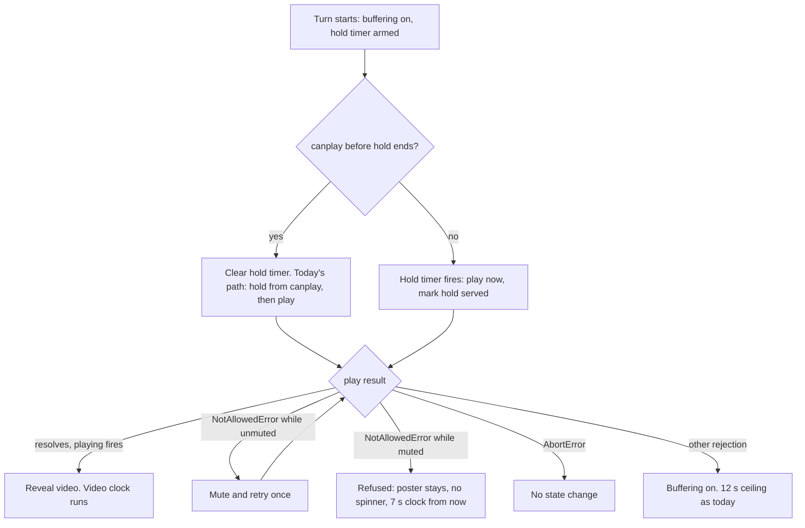

# Watch Home Intro iOS Playback Start - Plan

## Goal Capsule

- **Objective:** On iPhone Safari, the `/watch` home intro hero plays its video slides. When iOS refuses autoplay, the viewer sees the slide poster and a normal timed rotation, not an endless loading ring.
- **Means:** Request playback when the poster hold ends, even if `canplay` has not fired (KTD1). Classify a refused `play()` as an autoplay refusal, not as buffering, after one muted retry (KTD2, KTD3, KTD6).
- **Authority:** R-IDs win on product behavior. KTDs win on mechanism. Scope Boundaries override both.
- **Execution profile:** One PR from a `fix/` branch, conventional prefix `fix:`. Never `--no-verify`. Pre-commit hooks may not be live in this worktree, so run Prettier by hand on edited markdown.
- **Stop conditions:** Stop and report if desktop behavior changes for a stream whose `canplay` fires before the poster hold ends (R4). Stop and report if the U4 evidence shows an intro media request now starting before FCP or `load` where it did not before.
- **Tail ownership:** The surrounding pipeline owns review, commit, push, PR, and CI. A real-iPhone check is a user-owned follow-up; this run cannot reach an iOS device.

---

## Product Contract

### Summary

The home intro carousel will request playback at the end of the 1500 ms poster hold whether or not the browser has fired `canplay`. When `canplay` already arrived, behavior stays as it is today. When it has not, which is the iOS Safari native-HLS case, the hook calls `play()` itself and reveals the video as soon as it starts. A `play()` rejected with `NotAllowedError` puts the slide into a refused state: the poster stays, the loading ring does not show, and the slide advances on the image-slide clock. Other rejections keep today's buffering path.

### Problem Frame

On iPhone the intro shows a spinning ring, never starts the video, and moves on after about 12 seconds. The next slide does the same. The network is not the cause.

The hook only calls `play()` from `handleCanPlay` (`apps/web/src/components/home/useWatchHomeTvCarousel.ts`, `handleCanPlay`). iOS Safari plays Mux HLS natively, and Mux's `playback-core` only uses hls.js off Safari. Without the `autoplay` attribute or a `play()` call, WebKit on iOS caps effective preload at metadata. The element reaches `loadedmetadata` but not `canplay`. So `play()` never runs, `isBufferingMedia` stays true, and `WATCH_HOME_TV_MEDIA_WAIT_TIMEOUT_MS` advances the slide.

A second path gives the same symptom. In iOS Low Power Mode, WebKit refuses even muted video without a user gesture, and `play()` rejects with `NotAllowedError`. Since #2287 (KTD9.4 / R19 of `docs/plans/2026-09-13-1641-feat-watch-home-play-to-end-bandwidth-guard-plan.md`) every refusal sets the buffering flag. The viewer gets the ring and the 12 s skip. That design assumed a refusal was rare and transient. On iOS it is a steady state, so this plan revises KTD9.4 / R19.

### Requirements

**Playback start**

- R1. A video slide requests playback no later than the end of its poster hold, even when `canplay` has not fired.
- R2. When playback starts without a prior `canplay`, the video is revealed as soon as it plays, without a second poster hold.
- R3. A playback request made before `canplay` honors the same gates as today's request: the turn token and `autoAdvancePaused`.
- R4. When `canplay` fires before the poster hold ends, timing and call count of `play()` stay as they are today.

**Autoplay refusal**

- R5. A `play()` rejected with `NotAllowedError` (or `AutoplayNotAllowed`) shows the slide poster with no loading spinner.
- R6. A refused slide advances after `WATCH_HOME_TV_IMAGE_SLIDE_ADVANCE_SECONDS`, and the progress ring animates over that same duration.
- R7. A `play()` rejected with `AbortError` changes no state.
- R8. Any other `play()` rejection keeps today's behavior: buffering flag set, 12 s ceiling.
- R9. A refusal that lands after its turn ended changes nothing, as today.
- R10. A refusal while the viewer has unmuted retries once muted, and sets the mute state to muted. Only a refused muted retry enters the refused state.
- R11. A refused slide's 7 s clock starts when the refusal lands, and the ring restarts from zero at that moment.

**Verification honesty**

- R12. The PR states that the fix is not yet confirmed on an iPhone, and names the device check as open.

### Key Decisions

- **Request playback without waiting for `canplay`.** (session-settled: user-approved — chosen over keeping `play()` gated on `canplay` and tuning the 12 s media-wait timeout: iOS never fires `canplay` before `play()`, so no timeout value fixes it.) Governs R1, R2, R3.
- **An autoplay refusal shows the poster and advances on the normal slide clock.** (session-settled: user-approved — chosen over treating refusal as buffering: refusal is not a network stall, and the spinner plus 12 s skip looks broken.) Governs R5, R6, R11.
- **Retry muted before giving up.** A viewer who unmuted carries sound into later slides, and iOS refuses unmuted autoplay without a gesture. Falling back to muted keeps video playing for that viewer. Governs R10.

### Scope Boundaries

- Only `apps/web`. The hook, the carousel component, one shared helper, tests, and `HeroPlayer.tsx` limited to importing the shared refusal helper.
- No change to the watch-page `HeroPlayer` behavior. It only switches to the shared refusal helper.
- No change to the 480p cap, `_hlsConfig`, scroll-pause, or modal-pause logic.

#### Deferred to Follow-Up Work

- Tap-to-play on a refused slide. A mute-toggle tap could retry `play()` inside the user gesture. It needs its own state handling and UI copy. Until then the mute control stays visible and only toggles the mute state, as today.
- A real-iPhone check with Low Power Mode on and off. No iOS device is reachable from this run. It must happen before the fix is called confirmed (R12).
- A production signal for intro turn outcomes (`playing`, `refused`, `ceiling`) by browser, through the existing Datadog RUM wiring. It would show whether iOS sessions now reach `playing`.
- A `docs/solutions/` learning on iOS native-HLS readiness, written by `ce-compound` after the device check.

---

## Planning Contract

### Key Technical Decisions

- KTD1. **A poster-hold timer armed at turn start requests playback.** It instantiates the first Key Decision (R1, R2, R3). Each video turn arms a `VIDEO_POSTER_HOLD_MS` timer at turn start. If `canplay` arrives first, the timer is cleared and today's path runs unchanged (R4). If the timer fires first, it calls `startPlayback` and marks the hold as served for this turn. A later `canplay` or `playing` then sets `mediaReady` at once. This keeps desktop timing identical and gives iOS the same poster time as desktop.
  - "Turn start" is an effect keyed on the active slide id, not `selectIndex`. Only that effect runs for the opening slide and the per-visit random draw, which never pass through `selectIndex`. The same-slide replay keeps its own `startPlayback` in `selectIndex` and arms no timer.
  - The timer has its own ref. `clearVideoPosterHold()` and `handleLoadedMetadata` must not clear it, because iOS reaches `loadedmetadata` before the timer fires. Only `handleCanPlay`, turn change, and unmount clear it.
  - Once the hold is served, `handleLoadedMetadata` does not reset `mediaReady`.
  - The timer reads `videoRef.current` and the turn token when it fires, not when it is armed.
- KTD2. **No `autoplay` attribute on the intro `<MuxVideo>`.** The attribute would raise iOS preload to Auto, but a refusal through it is silent: no promise, no event. It would also start playback before the poster hold and outside the turn-token gates. An explicit `play()` gives the refusal signal R5 needs.
- KTD3. **A per-turn refused state, not the buffering flag.** It instantiates the second Key Decision (R5, R6, R11). A `NotAllowedError` refusal sets a refused flag for the current turn. This revises KTD9.4 / R19 of the 2026-09-13 bandwidth-guard plan for refusals only. Other rejections keep that rule (R8).
  - While refused, `isBuffering` and `isMediaHeld` are derived as false. A `stalled` or `pause` event on the refused element cannot bring back the spinner or park the clock.
  - While refused, the duration and the backstop both resolve to `WATCH_HOME_TV_IMAGE_SLIDE_ADVANCE_SECONDS` with no ended-grace, the same shape as the backstop helper's image-slide branch.
  - The advance clock accrued nothing while the turn was held for buffering, so the 7 s starts at the refusal. The ring restarts because `ringAnimationKey` already includes the duration (R11).
  - Turn start, a same-slide replay, and a later `playing` on the same turn clear the flag. After a `playing` clear the ring restarts over the video duration.
- KTD6. **Muted retry inside the refusal handler.** It instantiates the third Key Decision (R10). When a refusal hits an unmuted element, set it muted, set `isMuted` to true, and call `play()` once more under the same turn and element guards. Only a refusal of that retry sets the refused flag. This mirrors Mux `playback-core`'s own `ANY` autoplay fallback.
- KTD4. **One shared refusal classifier.** Move `isAutoplayBlockedError` out of `apps/web/src/components/watch/HeroPlayer.tsx` into a small shared module. Both the hero and the carousel import it. `AbortError` is classified separately and ignored (R7).
- KTD5. **All three refusal sites use the classifier.** The poster-hold path, the new turn-start timer, and the same-slide replay in `selectIndex` all route rejections through KTD3 and KTD4.

### High-Level Technical Design

The turn-start path for a video slide:

### Assumptions

- On iOS, `play()` on a metadata-only element makes WebKit fetch media and fire `canplay` and `playing`. WebKit source and bugs 161804 and 282053 support this. It is not checked on a device.
- `autoAdvancePaused` is not wired in production today. The new timer still honors it so a future caller keeps today's gate.
- Scroll-pause catches an early `play()` through its `play` listener, the same as the current `canplay`-driven `play()`.

### Risks

- jsdom has no media pipeline, so unit tests prove the branch shape, not iOS behavior. Every merge gate in this plan can pass while the iPhone stays broken. Only a real-iPhone check closes this (R12).
- A refused slide now holds the hero for 7 s after the refusal, about 8.5 s in total, not 12 s. In Low Power Mode every slide is refused, so the hero rotates posters. This is the intended degraded mode.
- On iOS the intro now streams media for each slide, where before it loaded only metadata. This is parity with desktop, and the 480p cap still applies.
- On iOS the loading ring shows during the 1.5 s poster hold, the same as on desktop before `canplay`. On a refusal it then disappears and the poster stays.

### Sources

- `docs/plans/2026-09-13-1641-feat-watch-home-play-to-end-bandwidth-guard-plan.md` — KTD9.4 / R19 revised by KTD3.
- `docs/solutions/ui-bugs/chat-video-card-mux-preload-none-perpetual-spinner.md` — native HLS on Safari, readiness events depend on Safari's preload policy.
- `docs/solutions/conventions/frontend-change-page-load-performance-verification.md` — evidence rule for media timing changes.
- WebKit `MediaElementSession.cpp` (`AutoPreloadingNotPermitted`, `RequireUserGestureForVideoDueToLowPowerMode`); WebKit bugs 161804, 216887, 282053; Mux `playback-core` `useNative()`.

---

## Implementation Units

### U1. Shared autoplay-refusal classifier

- **Goal:** One helper decides whether a `play()` rejection is an autoplay refusal or an abort.
- **Requirements:** R5, R7 (KTD4).
- **Dependencies:** none.
- **Files:** create `apps/web/src/lib/autoplay-refusal.ts` and `apps/web/src/lib/autoplay-refusal.test.ts`. Modify `apps/web/src/components/watch/HeroPlayer.tsx`.
- **Approach:**
  1. Move `isAutoplayBlockedError` into the new module unchanged and export it.
  2. Add an abort check for errors named `AbortError`.
  3. Replace the local helper in `HeroPlayer.tsx` with the import. No behavior change there.
- **Patterns to follow:** the existing `isAutoplayBlockedError` in `HeroPlayer.tsx`.
- **Test scenarios:**
  - Build refusal fixtures as `new DOMException(message, "NotAllowedError")`. The one-argument form sets the message only, and its `name` is `"Error"`.
  - A `DOMException` named `NotAllowedError` is a refusal.
  - A `DOMException` with message `"NotAllowedError"` and no name is not a refusal.
  - An object named `AutoplayNotAllowed` is a refusal.
  - A `DOMException` named `AbortError` is an abort, not a refusal.
  - A plain `Error`, `null`, a string, and `undefined` are neither.
- **Verification:** the new tests pass and existing `HeroPlayer` tests stay green.

### U2. Request playback at the end of the poster hold

- **Goal:** A video turn requests playback even when `canplay` never fires.
- **Requirements:** R1, R2, R3, R4 (KTD1, KTD2).
- **Dependencies:** none.
- **Files:** modify `apps/web/src/components/home/useWatchHomeTvCarousel.ts`. Test in `apps/web/src/components/home/__tests__/WatchHomePage.test.tsx`.
- **Approach:** KTD1 owns where the timer is armed and what may clear it.
  1. Arm the timer in an effect keyed on the active slide id, for video slides only. Guard it with the turn token and `autoAdvancePausedRef`.
  2. `handleCanPlay` clears that timer before it arms today's hold, so R4 holds.
  3. When the timer fires with no `canplay` yet, call `startPlayback` and record that this turn's hold is served.
  4. When the hold is served, `handleCanPlay` and `handlePlaying` set `mediaReady` at once and do not arm a second hold or a second `play()`.
  5. When the hold is served, `handleLoadedMetadata` leaves `mediaReady` alone.
- **Execution note:** Stub `HTMLMediaElement.prototype.play` before render, ideally in the suite's `beforeEach`. A turn-start `play()` can fire before the per-element stub exists, and many existing tests let more than 1500 ms pass first.
- **Patterns to follow:** `videoPosterHoldTimeoutRef` handling and turn-token checks in the same hook; the `vi.spyOn(HTMLMediaElement.prototype, "play")` setup in `apps/web/src/components/sections/__tests__/VideoHero.test.tsx`.
- **Test scenarios:**
  - With no `canplay`, `play()` is called once after `VIDEO_POSTER_HOLD_MS` on the opening slide, which arrives through the random draw, not `selectIndex`.
  - With no `canplay`, a `loadedmetadata` before the hold ends does not cancel the timer, and `play()` is still called.
  - With no `canplay`, `play()` is called once on a slide reached by `advance`.
  - A `loadedmetadata` after the timer's `play()` does not hide the video again.
  - After that `play()`, a `canplay` reveals the video at once and does not call `play()` again.
  - After that `play()`, a `playing` clears the spinner and starts the advance clock.
  - When `canplay` fires before the hold ends, `play()` is called once, 1500 ms after `canplay`, as today.
  - The existing "re-arms the poster hold only once per slide" test still passes or is updated to keep its intent.
  - A turn that ends before the hold timer fires never calls `play()` on the old element.
  - A turn with `autoAdvancePaused` set does not call `play()` from the timer.
- **Verification:** the new and existing carousel tests pass.

### U3. Treat an autoplay refusal as a poster slide

- **Goal:** A refused slide shows its poster, no spinner, and advances on the image-slide clock.
- **Requirements:** R5, R6, R7, R8, R9, R10, R11 (KTD3, KTD5, KTD6).
- **Dependencies:** U1, U2.
- **Files:** modify `apps/web/src/components/home/useWatchHomeTvCarousel.ts`. Modify `apps/web/src/components/home/WatchHomeTvCarousel.tsx` only if the ring or poster needs the refused state passed in. Test in `apps/web/src/components/home/__tests__/WatchHomePage.test.tsx`.
- **Approach:** KTD3 owns the refused state's effects; KTD6 owns the muted retry.
  1. Add a per-turn refused flag, cleared where KTD3 says.
  2. Route every refusal callback through one handler. It checks the turn token and the element, then branches on the U1 classifier: refusal on an unmuted element takes the KTD6 retry, refusal on a muted element sets the refused flag, abort does nothing, anything else sets buffering as today.
  3. Thread the refused flag into `watchHomeTvSlideDurationSeconds` and `watchHomeTvAdvanceBackstopSeconds`, so both return the image-slide seconds with no grace.
  4. Derive `isBuffering` and `isMediaHeld` as false while refused.
- **Patterns to follow:** the existing `startPlayback(video, onRefused)` call sites; `watchHomeTvSlideDurationSeconds` for duration resolution.
- **Test scenarios:**
  - Every refusal fixture uses the U1 two-argument `DOMException` form.
  - A muted `play()` rejects with `NotAllowedError`: the spinner is absent and the poster stays visible.
  - After a muted refusal the slide advances `WATCH_HOME_TV_IMAGE_SLIDE_ADVANCE_SECONDS` after the refusal. It does not advance at the 12 s ceiling or at 7 + 5 s.
  - After a refusal the ring's duration is the image-slide duration, and the ring restarts.
  - A `stalled` or `pause` event after a refusal does not bring back the spinner or stop the 7 s advance.
  - An unmuted `play()` rejects with `NotAllowedError`: the element becomes muted, the mute control shows muted, `play()` is called once more, and no refused state is set.
  - An unmuted refusal followed by a refused muted retry enters the refused state.
  - `play()` rejects with `AbortError`: no spinner change and no early advance.
  - `play()` rejects with a generic `Error`: spinner shows and the slide advances at the 12 s ceiling, as today. Relabel the existing "gives up a slide whose play() was refused" test as this generic-error case.
  - A generic rejection that lands after the turn changed leaves the new turn unchanged. Keep the existing late-refusal test for this.
  - A `NotAllowedError` that lands after the turn changed leaves the new turn unchanged.
  - A same-slide replay whose muted `play()` is refused takes the refused path.
  - The next slide after a refused slide starts with the refused flag cleared.
  - A `playing` after a refusal on the same turn clears the refused state, and the ring uses the video duration.
- **Verification:** the new and updated tests pass, and the full `@forge/web` suite stays green.

### U4. Page-load evidence

- **Goal:** Show the fix does not move intro media requests ahead of first paint or `load`.
- **Requirements:** Goal Capsule stop condition, repo frontend-performance convention.
- **Dependencies:** U2, U3.
- **Files:** none committed. Evidence goes in the PR body.
- **Approach:**
  1. Build and serve `@forge/web` locally with `next build` and `next start`.
  2. Load the home `/watch` page at a 390 px mobile viewport, before and after the change.
  3. Record LCP, FCP, DCL, `load`, when the intro `<video>` first mounts, and the start time of each `mux.com` request relative to FCP and `load`.
  4. Run once unthrottled, where `canplay` beats the hold, and once throttled hard enough that `canplay` lands after `VIDEO_POSTER_HOLD_MS`. Confirm in the throttled run that `play()` ran before `canplay`, so the new timer path was measured.
  5. State in the PR body which run exercised which path. The intro media fetch moves earlier on iOS by design; the claim is only about first paint and `load`.
- **Test expectation:** none -- this unit gathers measurements, not behavior.
- **Verification:** the numbers before and after the change are in the PR body, with any gap and its reason.

---

## Verification Contract

| Gate       | Command or check                        | Proves                                                  |
| ---------- | --------------------------------------- | ------------------------------------------------------- |
| Unit tests | `pnpm --filter @forge/web test`         | U1, U2, U3 behavior and no regressions                  |
| Types      | `pnpm --filter @forge/web typecheck`    | the shared helper and hook changes compile              |
| Lint       | `pnpm --filter @forge/web lint`         | repo lint rules                                         |
| Format     | `npx prettier --check` on changed files | CI `format` job                                         |
| Page load  | U4 measurement                          | no earlier media work and no added first-paint requests |
| Device     | Real iPhone, Low Power Mode off and on  | user-owned follow-up, not a merge gate for this run     |

---

## Definition of Done

- R1 to R11 each have a passing test, or a named reason why jsdom cannot hold them.
- `HeroPlayer` uses the shared classifier with no behavior change.
- Typecheck, lint, format, and the `@forge/web` test suite pass.
- The PR body carries the U4 numbers and says the iPhone check is still open (R12).
- No dead code from abandoned approaches is left in the diff.
