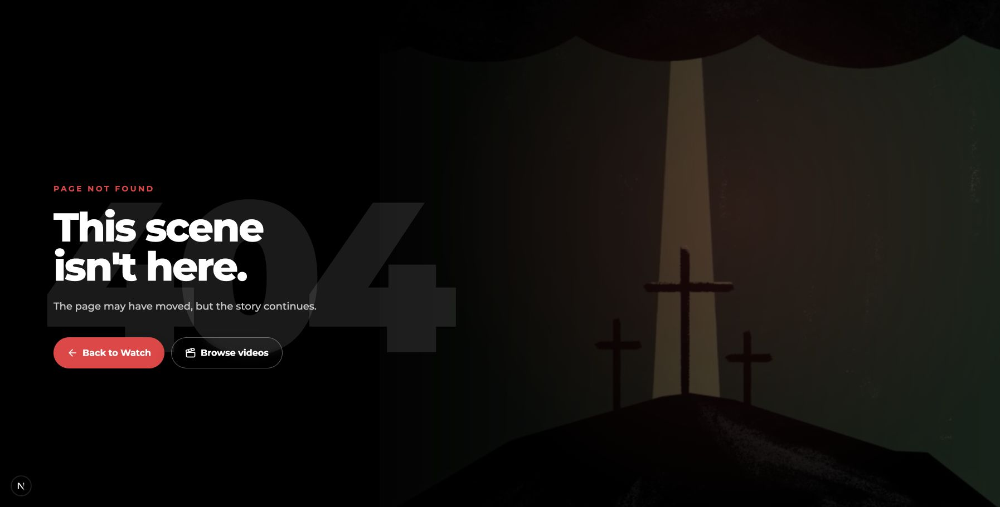
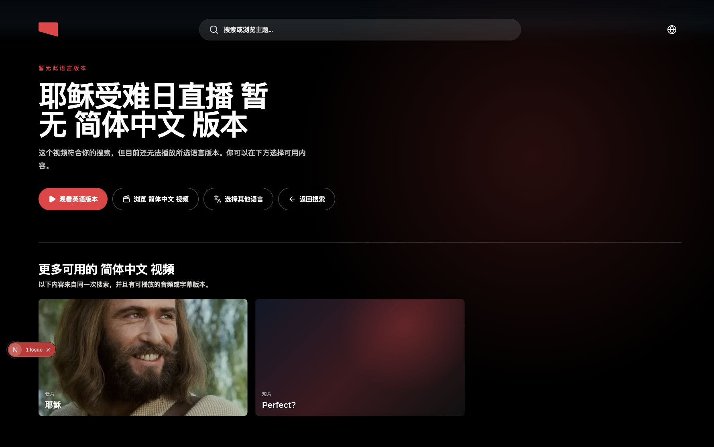

# Watch Search Unavailable-Language Recovery — Local QA

Date: 2026-08-13

## Scope

Local regression record for a Watch search result that matches the query but
has no playable audio version in the viewer's selected language. This document
does not contain request identifiers, raw headers, authorization data, search
queries stored by the browser, or complete API responses.

## Before-change baseline

Approved reproduction:

- Query: `耶稣`
- Selected language: `chinese-simplified`
- Matched content: `good-friday-live` (`耶稣受难日直播`)
- Admin availability: `UNAVAILABLE`
- Admin result language: `null`
- Admin action `hrefLanguageSlug`: `null`
- Admin evidence language: `chinese-simplified`

The response proves a Chinese metadata match. It does not prove that the video
has Simplified Chinese audio. Web previously filled the missing playback
language with the active search language, constructed an invalid playback URL,
and ended on the generic Watch 404.

```text
search metadata match
  -> languageSlug: null
  -> Web substitutes chinese-simplified
  -> /watch/good-friday-live.html/chinese-simplified.html
  -> generic 404
```



## Accepted recovery behavior

An unavailable search result opens a contextual recovery page at the explicit
language-qualified URL. The page must:

1. Explain that this video is unavailable in the requested language.
2. Keep the HTTP response at `404` with `noindex`, no canonical, and no video
   structured data.
3. Offer only published, HLS-playable audio versions of the same video whose
   exact content/language pair is admitted by the Watch route manifest.
4. Start with no language selected and keep the watch button disabled until the
   user chooses one.
5. Never silently redirect to English and never include subtitle-only routes in
   the audio selector.
6. Keep a browse-current-language exit and show Back to search only when the
   same-tab search context is available.
7. Preserve the ordinary Watch 404 for unknown content.

The earlier same-search related-video cards, standalone Watch in English
button, and standalone Choose another language button were intentionally
removed. They duplicated decisions and made repeated artwork look like broken
content.

## Implementation proof

### Search handoff

`watch-unavailable-recovery-context.ts` now writes schema version 2. The
`sessionStorage` snapshot is bounded to 16 KiB, expires after five minutes, and
contains only:

- target slug, title, and approved HTTPS artwork URL;
- requested language slug and display name;
- creation timestamp and schema version.

It does not store the query, request ID, result list, playback ID, evidence,
snippet, or destination links. The previous candidate-list schema uses a
different storage key and is rejected.

### Server-side admission

`resolveWatchUnavailableRecovery` first proves that the requested
content/language pair is known missing. It then loads the same resolver used by
the Watch language picker, which already filters Dubs to `published === true`
with an HLS URL. Every returned language is intersected with the exact route
manifest before its URL is built.

The browser receives display fields and an admitted route for each audio
language; it does not infer playback routes from subtitle evidence or the
search language.

## Current Chrome QA

### Chinese recovery and explicit selection

URL:

```text
http://localhost:3000/watch/good-friday-live.html/chinese-simplified.html
```

Observed in the user's Chrome:

1. The contextual Chinese recovery page rendered without the giant `404`
   treatment.
2. The heading, selector, and secondary exit fit in one compact Watch-style
   control area in the first viewport. The redundant search-match explanation,
   previous large divider, and second-page spacing are gone.
3. The same-video selector contained only the admitted `English` audio option.
4. The Watch selected version button was disabled before selection.
5. Selecting `English` enabled the button.
6. Activating it navigated to `/watch/good-friday-live.html`.
7. The destination loaded the real `Good Friday: Live` Watch page with HTTP
   success behavior; it did not return to recovery or 404.
8. No related-video poster grid, standalone English button, or standalone
   language-picker button remained.
9. The one-option language popover opened 6 px above the compact trigger,
   matched its width, and used a 143 px total height instead of reserving the
   288 px maximum list height. Filtering keeps its original above/below
   placement so it does not jump across the trigger while the user types.
10. While server admission was pending, the hero used only a CSS gradient and
    rendered no image element. After admission resolved, it rendered the one
    approved content image; the static fallback artwork is used only when the
    server returns no approved artwork URL, so the page does not download a
    default image and then replace it with the real image.



### Additional language checks

- `/watch/perfect-2.html/chinese-guiliu.html` rendered the same recovery
  contract and kept the action disabled until selection.
- `/watch/good-friday-live.html/russian.html` rendered the same recovery
  contract and localized the requested language name as `русский`.
- Russian recovery copy is still English fallback while the surrounding Watch
  chrome is Russian. This is an explicitly pending catalog-translation item,
  not a routing failure.
- The Arabic recovery strings and the three Chinese catalogs have local copy
  for this pass. Dynamic title and language fragments remain isolated with
  `bdi dir="auto"` for mixed-direction headings.

### Ordinary 404 separation

`/watch/not-a-real-watch-video.html/chinese-guiliu.html` rendered the normal
Watch page-not-found experience with the `404` eyebrow and ordinary 404
actions. It did not render the language recovery selector.

### Mobile viewport checks

- `390 x 844` and `360 x 800` portrait checks had no horizontal overflow. The
  selector, disabled primary action, and secondary navigation stacked into
  full-width touch targets.
- Selecting `English` enabled the primary action, and activating it navigated
  to the canonical `/watch/good-friday-live.html` playback page.
- `390 x 844` Arabic recovery rendered with `lang="ar"`, `dir="rtl"`, no
  horizontal overflow, correctly mirrored chrome, and a viewport-contained
  language popover.
- `844 x 390` phone landscape had no horizontal overflow. The page became
  vertically scrollable so the complete recovery controls remained reachable.
- The long mixed-script `Good Friday Live` / `Chinese Guiliu` heading wraps to
  four lines at `360 px`; it remains readable and contained, but is the main
  visual density trade-off left for product judgment.

## HTTP and SEO proof

Current production-mode local responses:

```text
/watch/good-friday-live.html/chinese-simplified.html
status: 404
rewrite: /watch/zh-Hans/zh-Hans/unavailable/404
robots: noindex, nofollow
canonical: absent
JSON-LD: absent

/watch/not-a-real-watch-video.html/chinese-simplified.html
status: 404
rewrite: /watch/en/en/404
robots: noindex

/watch/good-friday-live.html
status: 200
rewrite: /watch/en/en/good-friday-live.html/english.html
robots: index, follow
canonical: https://www.jesusfilm.org/watch/good-friday-live.html
JSON-LD: present

/watch/jesus.html?subtitles=chinese-simplified
status: 200
rewrite: /watch/en/en/jesus.html/english.html/__subtitle-chinese-simplified
```

The recovery URL therefore remains crawl-safe without pretending that a
playable localized page exists. The selected admitted version has its own real
URL and keeps normal indexable Watch behavior.

## Catalog status

All 225 UI catalogs have the same 11-key `WatchUnavailableLanguage` contract.
The three Chinese catalogs and Arabic contain local copy for this QA pass. The
remaining new strings may use English fallback and remain listed under
`pendingTranslationPaths`; native review is still required before treating
those translations as complete. The two provisional catalogs (`crk` and
`mey-Latn`) are generated as exact English fallbacks by repository policy.

## Automated verification

Current narrowed-F3 checks:

- Full Web suite: 162 files, 2,662 tests passed, with the repository's existing
  one todo unchanged.
- Recovery-specific tests verify target-only storage, exact audio admission,
  explicit selection, disabled initial action, successful selected navigation,
  hidden selector when no option exists, one bounded retry after a transient
  resolution failure, and single-image artwork loading after admission.
- Web typecheck passed.
- Full Web lint passed.
- Production Web build passed and emitted the dynamic unavailable-language
  route.
- UI-locale generation and provisional-catalog checks passed.
- Prettier and `git diff --check` passed.

## Real-data sanity check

A direct read from the production Admin search API separated search-data
behavior from the local route-manifest fixture:

- An explicit English search for `Jesus` returned ten sampled
  `TARGET_AUDIO` results. Their corresponding public English Watch URLs all
  returned HTTP `200`.
- An explicit `chinese-simplified` search for `耶稣` returned two current
  `UNAVAILABLE` results. Their language-qualified public URLs returned HTTP
  `404`, which is the input this recovery work handles. The captured
  `good-friday-live` candidate was not among the current remote results.
- Running the browser directly against production Admin search succeeded only
  through a local CORS relay. Local Proxy admission could not use the
  production route manifest because the available development
  `WEB_ADMIN_API_KEYS` bearer received HTTP `401`. This is the repository's
  documented production-manifest local-smoke limitation, not a route result
  produced by this change.

The final production-mode browser check therefore used a controlled local
`watchSearch` response and manifest to cover `TARGET_AUDIO`,
`TARGET_SUBTITLE`, `UNAVAILABLE`, and ordinary unknown-content paths. Other
GraphQL reads were forwarded without modification. No remote mutation or
deployment was performed.

No deployment, production mutation, or Slack message was created or sent
during QA.
