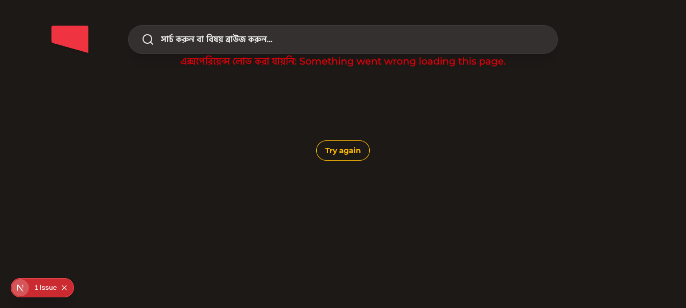

# Bangla Watch UI Catalog Smoke

## Setup

- Started `apps/web` locally on port `3010`.
- Pointed `ADMIN_GRAPHQL_URL` at an already-running local admin on port `3003`.
- Opened the Bangla watch URL with Helium/`agent-browser`.

## Result

Helium DOM proof:

```json
{
  "url": "http://127.0.0.1:3010/watch/bp-plot-episode-5.html/bangla-2.html?t=43.897444",
  "lang": "bn",
  "text": "এক্সপেরিয়েন্স লোড করা যায়নি: Something went wrong loading this page.\n\nTry again\nসার্চ করুন বা বিষয় ব্রাউজ করুন…",
  "hasEnglishPlayWithSound": false
}
```

Screenshot:



## Notes

- The local route resolves to Bangla UI identity (`<html lang="bn">`), proving
  the public `bangla-2` URL now activates the `bn` message catalog.
- App-owned chrome visible in the fallback/search shell renders in Bangla.
- Full hero/body smoke was blocked by local admin schema drift. The admin
  already running on port `3003` rejected the current web query fields:
  `languageSlug` on `Video.locales` and localized `studyQuestions` arguments.
  This is unrelated to the Bangla catalog change, and focused proxy/catalog
  tests cover the intended `/bn/bn/.../bangla-2.html` rewrite.
