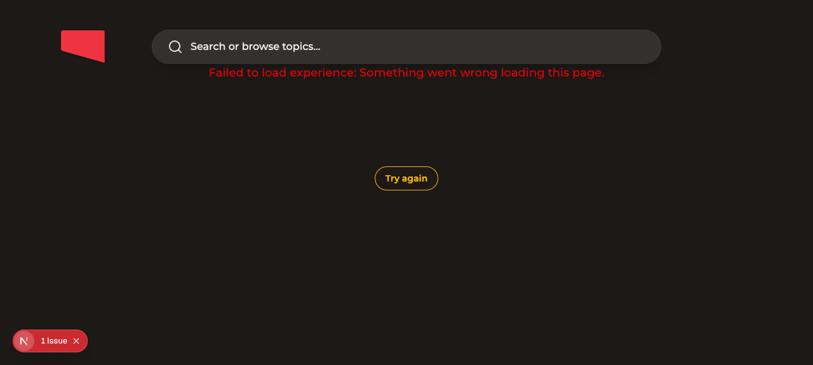

# Provisional Zulu Watch UI Catalog Smoke

## Setup

- Started `apps/web` locally on port `3010`.
- Pointed `ADMIN_GRAPHQL_URL` at the already-running local admin on port
  `3003`.
- Opened a public Zulu watch URL with Helium/`agent-browser`.

## Result

Helium DOM proof:

```json
{
  "url": "http://127.0.0.1:3010/watch/bp-plot-episode-5.html/zulu.html?t=43.897444",
  "lang": "zu",
  "text": "Failed to load experience: Something went wrong loading this page.\n\nTry again\nSearch or browse topics…",
  "hasSearchVideos": false,
  "hasPlayWithSound": false
}
```

Screenshot:



## Notes

- The local route resolves to Zulu UI identity (`<html lang="zu">`), proving
  the generated provisional catalog is admitted by generated UI locale
  membership.
- Visible copy remains English by design because `zu.json` is an English-seeded
  provisional catalog, not reviewed Zulu product copy.
- Full hero/body rendering is still blocked by the local admin schema drift
  documented in the Bangla smoke note.
