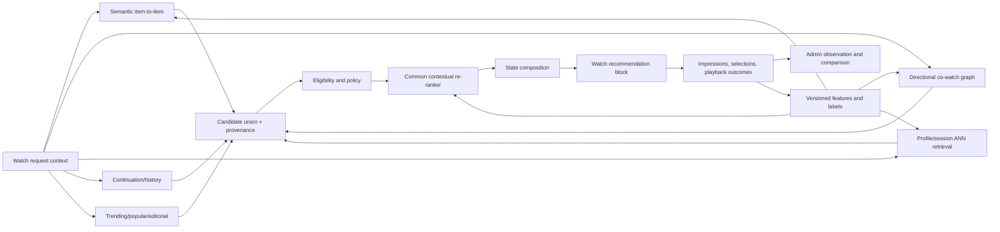

# Recommendation Candidate Generation and Re-ranking — Industry Evidence and Forge Direction

**Date:** 2026-08-18  
**Scope:** Publicly documented candidate-generation and re-ranking methods used by large recommendation systems, with a recommended direction for Forge's Watch product.  
**Evidence standard:** Company-authored papers, first-party engineering/research publications, and original peer-reviewed papers. Public descriptions span 2015–2025 and should not be read as exact disclosures of each company's current production stack.

---

## Executive conclusion

Forge should not choose one recommendation algorithm. The durable industry pattern is a **multi-stage system**:

1. Several relatively cheap, independently observable candidate generators retrieve plausible videos.
2. Eligibility policy removes videos that cannot or should not be shown in the request context.
3. A common re-ranker compares candidates using richer user, session, item, provenance, and presentation features.
4. A separate slate composer applies diversity, repetition, coverage, exploration, and product constraints to the list as a whole.

YouTube publicly described this retrieval/ranking split in 2016 and explicitly noted that it allows candidates from other sources to be blended. Its candidate model reduced millions of videos to hundreds, after which a richer ranking model selected dozens ([Covington, Adams, and Sargin, 2016](https://storage.googleapis.com/gweb-research2023-media/pubtools/pdf/45530.pdf)). Netflix's public system description likewise used several purpose-specific rankers—personalized catalog ranking, Top N, trending, continue watching, video-to-video similarity—then a page-generation algorithm to choose and order rows for relevance and diversity ([Gomez-Uribe and Hunt, 2015](https://doi.org/10.1145/2843948)).

For Forge, the first distinctive retrieval portfolio should be:

- **semantic item-to-item** for content meaning and cold start;
- **directional co-watch** for demonstrated audience pathways;
- **profile-to-item** for long-term and session-specific interests;
- **continuation, editorial, and qualified-popularity fallbacks** for coverage and control.

The recommended centerpiece is **semantic co-watch**, but it should be implemented as an observable hybrid, not one opaque score. Preserve semantic score, co-watch evidence, candidate-source identity, and eligibility decisions separately. A later common re-ranker can learn how much to trust each source by user, session, surface, locale, and evidence density.



## What “semantic co-watch” should mean in Forge

“Semantic co-watch” is a useful Forge name, not a universal industry term. It combines two complementary notions of relatedness:

- **Semantic relatedness:** the videos discuss similar ideas, passages, themes, people, emotions, or narrative moments.
- **Behavioral relatedness:** eligible viewers who meaningfully engaged with video A were unusually likely to meaningfully engage with video B afterward.

The public evidence for joining these ideas is unusually direct. Google described a YouTube content-based related-video system that learned video embeddings from **collaborative co-watch relationships as ground truth**, but could infer a representation from visual content alone. That allowed related-video retrieval for new or undiscovered videos before they had enough co-watch history ([Lee, Kothari, and Natsev, 2016](https://research.google/pubs/content-based-related-video-recommendations/)). Netflix's newer recommendation foundation-model work similarly combines learned item-ID embeddings with metadata-derived embeddings, relying more heavily on metadata for new titles and more heavily on interaction-learned identity as titles mature ([Netflix, 2025](https://netflixtechblog.com/foundation-model-for-personalized-recommendation-1a0bd8e02d39)). Amazon Prime Video has published a two-tower model with a watch-history user tower and a title tower that fuses categorical metadata, text descriptions, and cover art, explicitly addressing warm- and cold-start titles ([Wang, Yessenalina, and Roshan-Ghias, 2021](https://www.amazon.science/publications/exploring-heterogeneous-metadata-for-video-recommendation-with-two-tower-model)).

That suggests three maturity levels for Forge:

### Level 1: Two retrievers, one transparent union

- Semantic ANN candidates come from the existing content embeddings.
- Co-watch candidates come from a precomputed, directional, time-decayed video-to-video graph.
- The response retains both raw source ranks/scores and graph statistics.
- Candidate quotas or a simple source-aware score form the initial union.

This is the right prototype because every result can be explained and inspected in Admin. It also lets Forge learn whether semantic and behavioral retrieval are complementary before training a model to fuse them.

### Level 2: Semantic regularization and behavioral confidence

- Co-watch edges are weighted by finalized playback outcomes, temporal order, recency, distinct eligible viewers, and shrinkage for sparse counts.
- Semantic similarity is used as a cold-start backoff and as a regularizer—not as proof that a behavioral edge is good.
- A candidate can be nominated by either source. Being nominated by both is a feature for the re-ranker, not an automatic win.

The graph must use **lift or another popularity-corrected association**, rather than raw pair count. Amazon's item-to-item history describes the failure mode clearly: raw co-occurrence would make global bestsellers appear related to almost everything, so Amazon used differential probabilities to measure whether B was unusually likely after A ([Amazon Science, 2019](https://www.amazon.science/the-history-of-amazons-recommendation-algorithm)).

### Level 3: Graph-supervised content embeddings

- Train a title representation to predict high-confidence, quality-weighted co-watch neighbors from transcript, themes, scripture references, title/series metadata, and visual features.
- Retain an interaction-derived item embedding alongside the content embedding.
- Mix them according to evidence density, so new videos lean on content and mature videos can use behavior.

This is the most faithful version of semantic co-watch, but it should follow trustworthy outcome telemetry and sufficient eligible co-watch edges. It is not needed for the first production prototype.

## Candidate-generation strategies documented in industry

The following are **retrieval families**, not mutually exclusive alternatives.

| Candidate family                     | What it retrieves                                                                             | Public evidence                                                                                                                                                                                                                                                                                | Forge use                                                                                                                               |
| ------------------------------------ | --------------------------------------------------------------------------------------------- | ---------------------------------------------------------------------------------------------------------------------------------------------------------------------------------------------------------------------------------------------------------------------------------------------- | --------------------------------------------------------------------------------------------------------------------------------------- |
| Content/semantic item-to-item        | Items close to a seed in text, topic, image, audio, or multimodal embedding space             | YouTube learned content embeddings against co-watch relationships for cold start; Prime Video fused categorical metadata, descriptions, and cover art in a title tower                                                                                                                         | Start now using existing scene/content embeddings; later add a video-level representation and graph supervision                         |
| Behavioral item-to-item              | Items disproportionately viewed after, with, or near a seed item                              | YouTube describes traditional related-video CF as sequence co-watch; Amazon's item-to-item CF retrieves related items for each item in recent history                                                                                                                                          | Start after finalized playback outcomes can create trustworthy, popularity-corrected edges                                              |
| User/profile-to-item embedding       | Items nearest to a representation of a user's interests                                       | YouTube's candidate network learned a user/context vector from watches, search tokens, and context, then used approximate nearest-neighbor retrieval; Spotify's CoSeRNN generates a contextual user vector for ANN; Netflix describes member/entity embeddings usable for candidate generation | Add after semantic and co-watch; use multiple interest vectors plus a short-term session vector instead of one permanent average        |
| Two-tower retrieval                  | A user/query tower and item tower are trained into a common dot-product space for fast ANN    | YouTube's Neural Deep Retrieval uses a two-tower model over tens of millions of videos; Prime Video published a watch-history/title-metadata two-tower system                                                                                                                                  | Appropriate once Forge has enough eligible interaction labels and needs learned profile retrieval                                       |
| Sequential/next-item retrieval       | Items likely to follow the current ordered interaction history                                | Netflix's foundation model uses autoregressive next-entity prediction with long interaction sequences; Spotify models session sequences and current context                                                                                                                                    | Begin with directional A→B co-watch; later use a lightweight sequence/session model if it beats the graph                               |
| Graph retrieval                      | Neighbors or embeddings learned from heterogeneous interaction graphs                         | Pinterest deployed PinSage, combining random walks, graph structure, and item features; later MultiBiSage work modeled multiple entity/interaction graphs                                                                                                                                      | A later option when Forge has several reliable edge types such as meaningful watch, save, share, course addition, and series membership |
| Popularity and trending              | Globally or contextually popular items, usually with recency/time/locale segmentation         | Netflix documents Popular and Trending Now rankers; YouTube describes explicit freshness handling; Amazon notes popularity as the correct fallback when nothing is known                                                                                                                       | Required fallback for anonymous/cold-start contexts, but qualify by locale, surface, freshness, eligibility, and integrity              |
| Continue/resume/history              | Started, saved, unfinished, or recently useful items                                          | Netflix's Continue Watching ranker uses time since viewing, abandonment point, intervening titles, and device                                                                                                                                                                                  | Keep as a dedicated candidate family with its own product semantics, not mixed into generic similarity                                  |
| Context- or intent-conditioned       | Items selected for current time, device, locale, request, entry source, or session intent     | Spotify's contextual user representation uses recent consumption, time, device, and stream-source intent; Netflix separates request-time and post-action features in its foundation-model description                                                                                          | Build the request contract now; use observed session intent before asking for permanent persona labels                                  |
| Editorial/collection candidates      | Human-curated or product-authored sets relevant to a theme, campaign, course, or mission need | Netflix and Prime Video publicly describe themed/genre carousels and page composition across candidate rows, although the precise editorial machinery is not public                                                                                                                            | Important Forge source for theological/editorial quality, strategic campaigns, sparse locales, and controllable fallbacks               |
| Exploration/fresh-content candidates | Uncertain, new, or underexposed items deliberately given bounded exposure                     | Prime Video applied upper-confidence-bound exploration at carousel composition; Spotify has deployed epsilon-greedy contextual-bandit calibration and published other bandit work                                                                                                              | Add only after experiment assignment, propensity logging, safety constraints, and a fixed exploration budget                            |

### Details that matter for Forge

#### 1. Co-watch is directional

The useful relationship is normally `A → B`, not merely “A and B appeared in one basket.” The YouTube candidate-generation paper found that predicting a future watch captured asymmetric co-watch behavior. Series episodes are the obvious Forge example: viewers of episode 1 may continue to episode 2, but the reverse recommendation is not equally useful ([Covington et al., 2016](https://storage.googleapis.com/gweb-research2023-media/pubtools/pdf/45530.pdf)).

Forge should maintain direction, time gap, surface, locale, autoplay/manual selection, and session intent in edge construction. An unordered basket may still be a useful secondary relation, but it should not erase sequence.

#### 2. Profile retrieval should be multi-interest

A single average embedding can land between unrelated interests and retrieve nothing that represents either. The public Netflix foundation-model work emphasizes comprehensive sequences and multiple downstream member/entity embeddings, while Spotify separates a long-term, context-independent user vector from a context- and sequence-dependent offset. The architectural inference for Forge is to retain:

- several long-term interest centroids or medoids;
- one short-term session vector;
- explicit saved topics/persona preferences as a separate input;
- negative/avoidance evidence separately from positive interests.

Each vector can nominate candidates independently through ANN, with provenance such as `profile_interest_2` or `session_intent`. This inference is recommended for Forge; the exact multi-vector design is not claimed as the current Netflix or Spotify implementation.

#### 3. Anonymous users still have profiles

An anonymous Forge viewer can have a short-lived browser/session representation based on the current video, recent eligible watches, search terms, acquisition context, and locale. After sign-up, identity resolution can attach consenting first-party history to an account without rewriting the underlying evidence. Popular, editorial, semantic item-to-item, and session candidates cover the true cold-start period.

#### 4. Candidate sources should remain separately measurable

YouTube's ranking paper says candidate-source identity and source score are important ranking features. Keeping those fields also tells Forge whether semantic, co-watch, profile, or editorial candidates are adding unique recall, merely duplicating one another, or being systematically filtered out ([Covington et al., 2016](https://storage.googleapis.com/gweb-research2023-media/pubtools/pdf/45530.pdf)).

## Re-ranking strategies documented in industry

### 1. A rich pointwise scorer after cheap retrieval

The classic production pattern is to spend little computation on the whole catalog and richer computation on a few hundred candidates. YouTube's 2016 ranking network used hundreds of user, context, item, and impression features. It explicitly propagated which candidate sources nominated an item and their scores, and used recent impressions/non-selections to avoid repeating stale recommendations. The model optimized expected watch time rather than click-through rate because CTR alone could promote clickbait ([Covington et al., 2016](https://storage.googleapis.com/gweb-research2023-media/pubtools/pdf/45530.pdf)).

For Forge, this supports a shared candidate contract such as:

```text
candidate_id
video_id
source
source_version
source_rank
source_score
seed_video_id?
profile_interest_id?
edge_count?
edge_lift?
semantic_similarity?
retrieved_at
```

It does **not** imply that Forge should optimize raw watch time. The YouTube paper documents its 2016 objective; Forge's own research already establishes that active time, completion, playback quality, mission action, reported value, and longer-term value must remain separate outcomes.

### 2. Multi-task and multi-objective ranking

Google later published a large-scale video ranking system that predicted multiple competing objectives using techniques including Multi-gate Mixture-of-Experts and Wide & Deep bias mitigation ([Zhao et al., 2019](https://research.google/pubs/recommending-what-video-to-watch-next-a-multitask-ranking-system/)). This is stronger evidence for a **vector of predicted outcomes** than for a single universal “meaningful watch” label.

A future Forge ranker can predict, separately:

- probability of visible selection;
- successful playback start;
- active-watch depth or expected active seconds;
- completion, conditioned on duration and intent;
- share/save/course-add or another mission action;
- reported value;
- return or other delayed value;
- playback failure or abandonment risk.

The final value function should be explicit, versioned, surface-specific, and constrained. It can change without rewriting raw outcomes.

### 3. Bias correction and exposure-aware learning

Recommendation logs reflect what the previous system chose to expose. YouTube's multi-task paper calls out implicit selection bias; its retrieval work corrects in-batch negative-sampling bias in power-law catalogs ([Yi et al., 2019](https://research.google/pubs/sampling-bias-corrected-neural-modeling-for-large-corpus-item-recommendations/)). YouTube's earlier paper also trained from watches discovered outside its own recommendations to avoid an exploitation-only feedback loop.

Forge therefore needs impression eligibility, position, surface, presentation, strategy version, and selection propensity before treating non-selection as negative evidence. Search, Google acquisition, shared links, editorial links, and recommendation selections should remain distinct discovery paths even if all later contribute eligible behavioral evidence.

### 4. Slate and page composition after scoring

Independent item scores do not produce a good page by themselves. Netflix's public page generator selects and orders rows using both relevance and diversity. Prime Video has published page-composition work that linearly combines immediate relevance with long-term content/offer propensities, adds UCB exploration, and applies customized maximum marginal relevance so adjacent carousels are not redundant; the selected treatment was validated by A/B testing ([Kini et al., 2023](https://www.amazon.science/publications/customer-long-term-propensity-driven-prime-video-page-composition)). Spotify deployed a contextual-bandit calibration layer that predicts a desired content-type distribution and builds a slate sequentially, balancing relevance against divergence from that distribution ([Spotify Research, 2025](https://research.atspotify.com/2025/9/calibrated-recommendations-with-contextual-bandits-on-spotify-homepage)).

Forge should make this an explicit final stage:

- deduplicate videos and near-identical series entries;
- limit repeated series, speaker, organization, topic, or candidate source;
- balance familiar and discovery content;
- reserve editorial or campaign slots only through visible, versioned policy;
- suppress recently shown-and-ignored items;
- enforce locale, playability, content-quality, safety, and integrity constraints;
- use a small, logged exploration budget only when enabled.

MMR is a strong, transparent initial diversity mechanism. It is a slate composer, not the relevance ranker.

### 5. Sequential re-ranking

For autoplay or a sequence of lessons, the utility of the next item depends on what has already appeared. Spotify compared cosine, feed-forward, feedback-aware, and reinforcement-learning sequencers and found that more capable satisfaction models could also increase popularity bias unless diversity was optimized explicitly ([Spotify Research, 2021](https://research.atspotify.com/2021/03/shifting-consumption-towards-diverse-content-via-reinforcement-learning)). Spotify has also reported a large randomized trial of an optimization-based sequencer that modeled position-aware and local sequential preferences ([Moor et al., 2023](https://research.atspotify.com/publications/exploiting-sequential-music-preferences-via-optimisation-based-sequencing)).

Forge should initially use deterministic next-episode/course order where authorial sequence exists. Learned sequence re-ranking belongs later, on surfaces where there is a real choice among next videos and where explicit session-level evaluation is possible.

## What the public evidence does not establish

- It does not reveal the exact current production algorithm, feature set, weights, or thresholds at YouTube, Netflix, Prime Video, or Spotify.
- It does not establish that every company uses RRF, vector databases, graph neural networks, transformers, or reinforcement learning everywhere.
- It does not establish one universal watch threshold or ranking objective.
- It does not show that a more complex learned ranker will beat a transparent baseline at Forge's traffic and evidence density.
- It does not make stated user personas interchangeable with inferred behavioral profiles or momentary session intent.

The strongest transferable pattern is the **separation of retrieval, scoring, composition, and measurement**, not a particular neural architecture.

## Recommended Forge architecture

```text
Recommendation Serving
├── Context Builder
│   ├── viewer/account/session identity
│   ├── current video and surface/block
│   ├── locale, device, acquisition/discovery path
│   ├── recent eligible history
│   ├── declared persona/preferences
│   └── inferred session intent
│
├── Candidate Generators
│   ├── SemanticRelatedGenerator
│   ├── DirectionalCoWatchGenerator
│   ├── ProfileInterestGenerator
│   ├── SessionIntentGenerator
│   ├── ContinueWatchingGenerator
│   ├── EditorialCollectionGenerator
│   └── QualifiedTrendingGenerator
│
├── Candidate Union
│   ├── source quotas / bounded over-fetch
│   ├── canonical video deduplication
│   └── complete source provenance
│
├── Eligibility Policy
│   ├── published and playable in locale
│   ├── surface/content suitability
│   ├── already consumed / recent repetition
│   ├── integrity and quality eligibility
│   └── explicit exclusions
│
├── Re-ranker
│   ├── v0 source-aware deterministic score
│   ├── v1 interpretable statistical/GBDT model
│   └── v2 multi-task contextual model, only if justified
│
└── Slate Composer
    ├── diversity / MMR
    ├── coverage and calibration
    ├── sequence and repetition rules
    ├── bounded exploration
    └── final attribution tokens
```

### Retrieval representations

Keep at least three representations conceptually separate:

1. **Content embedding:** what a video is about; available at publication time.
2. **Behavioral item embedding or graph neighborhood:** how eligible viewers move between videos.
3. **Viewer/session representation:** what this viewer appears to need now and over time.

They may eventually share a learned space, but using one column as all three concepts would make cold start, model-version migration, interpretation, and deletion much harder.

### Re-ranker progression

#### Prototype: source-aware deterministic scoring

Use independently normalized features, explicit weights, and a versioned configuration. Prefer score normalization or source quotas over RRF when scores have validated meaning. RRF remains a reasonable no-label union baseline for incomparable ranked lists, but it discards score magnitude and cannot account for viewer context, outcomes, candidate confidence, or slate interactions.

#### First learned ranker: interpretable model

After sufficient randomized or at least well-instrumented impressions, use logistic regression or gradient-boosted trees before a deep model. Inputs should include semantic score, co-watch lift/confidence, profile similarity, source identity, source multiplicity, recency, popularity, prior impressions, locale, surface, and session context. Train and evaluate against multiple outcomes, even if the first serving score uses a simple versioned combination.

#### Later ranker: multi-task contextual model

Adopt two-tower retrieval, sequence encoders, or MMoE-style ranking only when offline counterfactual evaluation, A/B testing, latency budgets, and Admin diagnostics can distinguish an actual gain. Model complexity is not itself a maturity milestone.

## Recommended order of candidate work

1. **Semantic item-to-item in one production Watch block.** Reuse existing embeddings; expose provenance and outcomes in Admin.
2. **Directional co-watch in shadow.** Build quality-weighted, time-decayed, popularity-corrected edges from finalized playback episodes; compare its recall and overlap with semantic candidates.
3. **Semantic + co-watch union in a controlled Watch cohort.** Keep both sources observable, use simple quotas/source-aware scoring, and add MMR.
4. **Anonymous session profile.** Build a short-lived multi-interest/session representation from recent eligible watches and searches; retrieve semantic ANN candidates.
5. **Signed-in long-term profile.** Add consent, erasure, multiple interest vectors, explicit preferences, and profile/session separation.
6. **Qualified popularity, trending, continuation, and editorial sources.** Use these as explicit generators rather than invisible ranking boosts.
7. **Common learned re-ranker.** Train only after impression, position, selection, playback outcome, integrity, and experiment evidence are trustworthy.
8. **Bounded exploration and advanced sequence/graph models.** Require propensity logging, holdouts, and clear long-term metrics.

Every production step should terminate in two places: a visible Watch behavior and an Admin view that can reconcile request → candidate source → served position → visible impression → selection → playback outcome → classifier/model version.

## Source notes

- [Deep Neural Networks for YouTube Recommendations](https://storage.googleapis.com/gweb-research2023-media/pubtools/pdf/45530.pdf) — primary two-stage candidate/ranking architecture, ANN candidate retrieval, feature/provenance use, expected-watch-time ranking, freshness, and feedback-loop observations.
- [Content-based Related Video Recommendations](https://research.google/pubs/content-based-related-video-recommendations/) — content embeddings learned from co-watch relationships for cold start.
- [Sampling-Bias-Corrected Neural Modeling for Large Corpus Item Recommendations](https://research.google/pubs/sampling-bias-corrected-neural-modeling-for-large-corpus-item-recommendations/) — production YouTube two-tower retrieval and sampling-bias correction.
- [Recommending What Video to Watch Next: A Multitask Ranking System](https://research.google/pubs/recommending-what-video-to-watch-next-a-multitask-ranking-system/) — multi-objective video ranking and selection-bias handling.
- [The Netflix Recommender System: Algorithms, Business Value, and Innovation](https://doi.org/10.1145/2843948) — purpose-specific rankers and relevance/diversity-aware page generation.
- [Foundation Model for Personalized Recommendation](https://netflixtechblog.com/foundation-model-for-personalized-recommendation-1a0bd8e02d39) — long histories, sequential prediction, cold start, metadata/ID embeddings, and downstream candidate embeddings.
- [The history of Amazon's recommendation algorithm](https://www.amazon.science/the-history-of-amazons-recommendation-algorithm) — item-to-item collaborative retrieval, popularity correction, and time-aware prediction.
- [Exploring heterogeneous metadata for video recommendation with two-tower model](https://www.amazon.science/publications/exploring-heterogeneous-metadata-for-video-recommendation-with-two-tower-model) — Prime Video user/history and title/metadata towers.
- [Customer long term propensity driven Prime Video page composition](https://www.amazon.science/publications/customer-long-term-propensity-driven-prime-video-page-composition) — relevance, long-term propensity, UCB exploration, MMR, and A/B evaluation.
- [Contextual and Sequential User Embeddings for Music Recommendation](https://research.atspotify.com/2021/04/contextual-and-sequential-user-embeddings-for-music-recommendation) — session/context user embeddings and ANN retrieval.
- [Calibrated Recommendations with Contextual Bandits on Spotify Homepage](https://research.atspotify.com/2025/9/calibrated-recommendations-with-contextual-bandits-on-spotify-homepage) — context-dependent slate calibration and deployed exploration.
- [Shifting Consumption towards Diverse Content via Reinforcement Learning](https://research.atspotify.com/2021/03/shifting-consumption-towards-diverse-content-via-reinforcement-learning) — ranking complexity, popularity bias, diversity, and sequential optimization.
- [Graph Convolutional Neural Networks for Web-Scale Recommender Systems](https://arxiv.org/abs/1806.01973) — Pinterest PinSage graph/content embeddings at production scale.
